# 【实战】文都 OA 云协同系统分析+漏洞挖掘-先知社区

> **来源**: https://xz.aliyun.com/news/18661  
> **文章ID**: 18661

---

# 【实战】文都 OA 云协同系统分析+漏洞挖掘

# 环境搭建

[yongjannes/OA](https://github.com/yongjannes/OA)

下载下来之后，server文件夹中是后端代码，client文件夹中是前端代码

然后我们这边先配置一下数据库

在配置文件`src/main/resources/application.yaml`中，先查看数据库名字发现是`oadb`然后修改数据库的账号密码为自己的账号密码，同时在最下方将头像存放的目录改为一个存在的目录

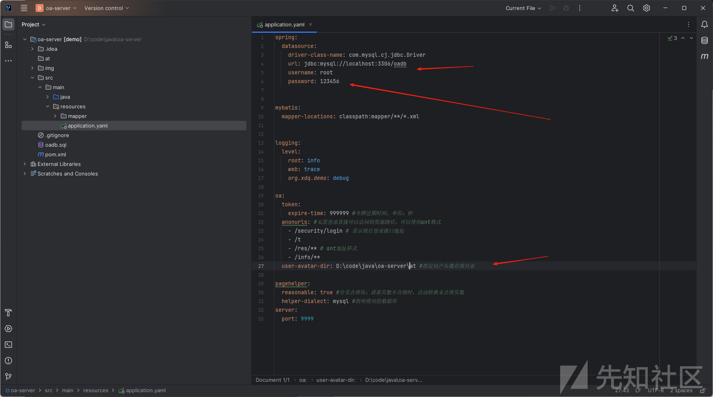

笔者使用的是phpstudy自带的数据库，先创建一个oadb名的数据库，然后使用sql文件初始化数据库。通过以下命令完成

```
mysql -u root -p
use oadb
source oadb.sql
```

搭建好之后启动数据库和后端代码

现在启动前端代码，在前端文件夹在输入以下命令即可,如果提示权限不够，用管理员启动即可

```
npm install
npm run dev
```

随后访问系统即可  
<http://192.168.254.1:808/security/login>

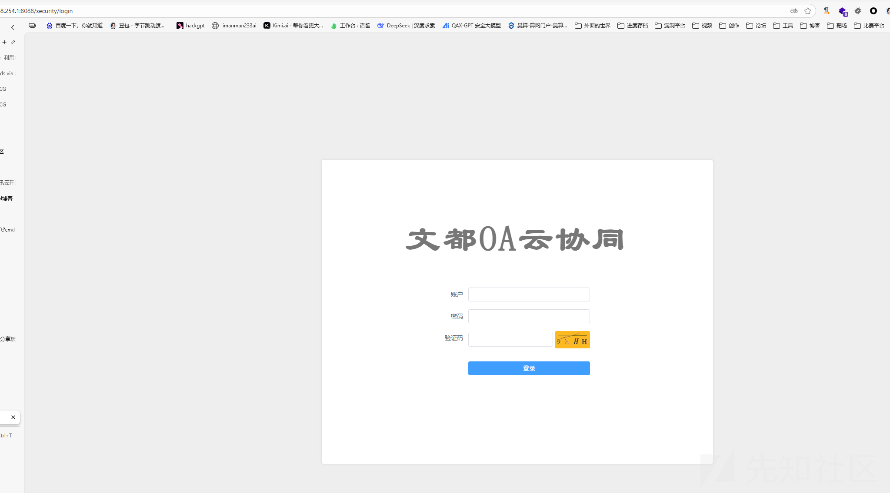

默认密码是admin\123456

# 架构分析

## 鉴权机制与未授权

`src/main/java/com/sf/demo/common/filter/SecurityFilter.java`

鉴权机制在这个文件中，是一个filter，同时他这个项目目前也只有一个filter

我们直接最关键的dofilter方法,

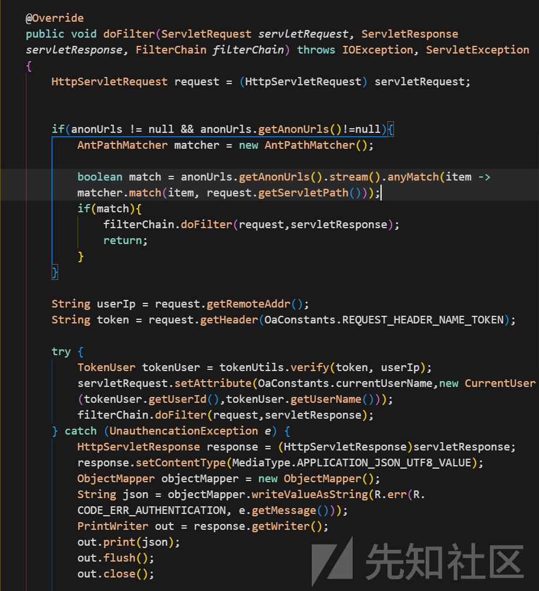

上面这一段是关于匿名设置的

```
        if(anonUrls != null && anonUrls.getAnonUrls()!=null){
            AntPathMatcher matcher = new AntPathMatcher();

            boolean match = anonUrls.getAnonUrls().stream().anyMatch(item -> matcher.match(item, request.getServletPath()));
            if(match){
                filterChain.doFilter(request,servletResponse);
                return;
            }
        }
```

这里会进行对比，如果请求的path是在`anonUrls`中的，则会直接`filterChain.doFilter`送到下一个filter那去，但是这个项目只有一个filter，所以在`filterChain.doFilter`之后会直接送到`comtroller`那里去。

而匿名路径则是从这里获取的

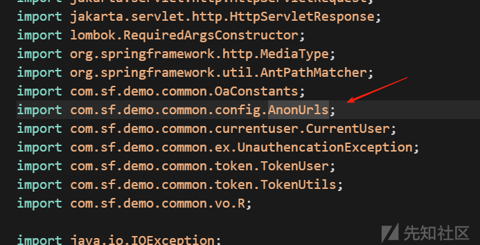

跟进去看，发现注解`@ConfigurationProperties(prefix = "oa")`，这个就是oa前缀的配置，只需要在配置文件`application.yaml`里面找oa前缀的配置即可

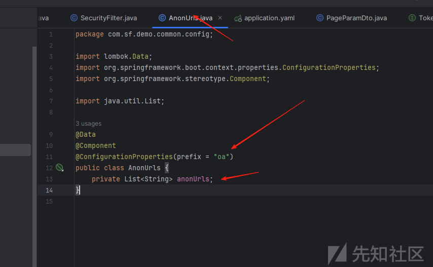

这边就能看到配置信息了

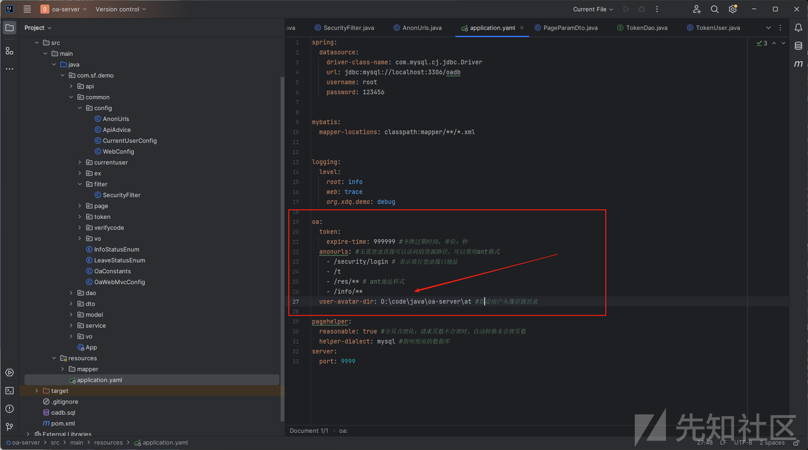

可以看到他是在`/info/**`路径下也有配置匿名访问

那我们直接去找这个路径下面的controller

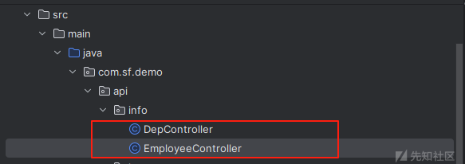

这边我们看`EmployeeController`进去看到他是没有其他的单独的鉴权措施的

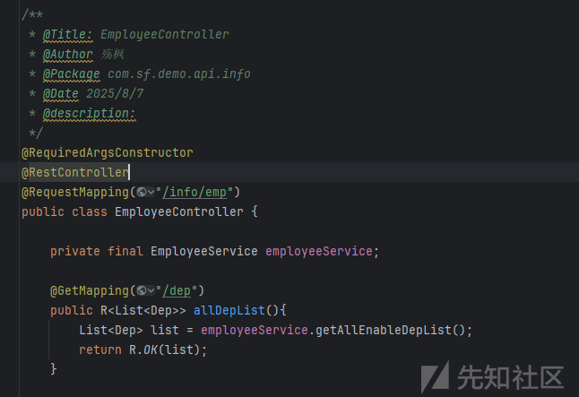

我们直接访问一个看信息的接口

```
http://127.0.0.1:9999/info/emp
```

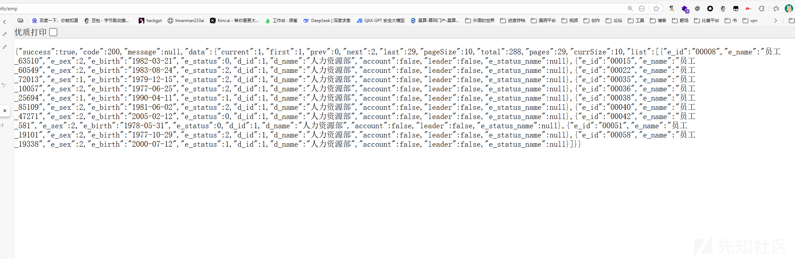

能直接看到内部的员工信息

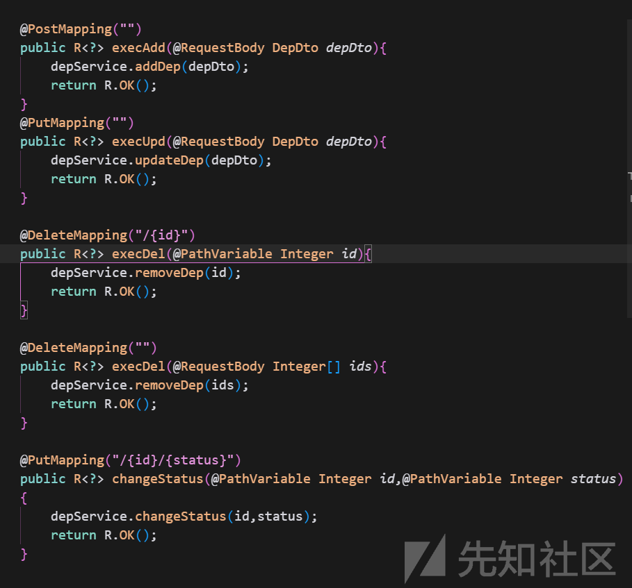

这边还有其他的增删改查的操作

```
curl -X POST "http://localhost:9999/info/emp" -H "Content-Type: application/json" -d "{"e_name": "李四", "e_sex": 2, "e_birth": "1992-05-15", "d_id": 1}"
```

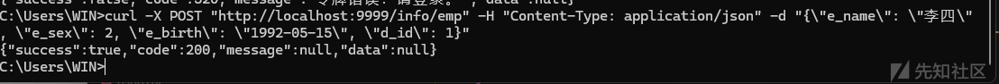

可以看到加进去了

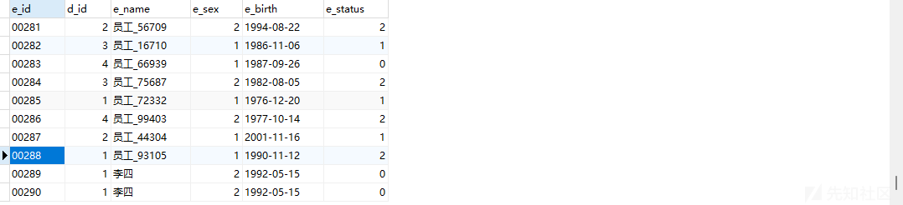

## jwt鉴权

这边继续看接下来的鉴权机制

```
            TokenUser tokenUser = tokenUtils.verify(token, userIp);
            servletRequest.setAttribute(OaConstants.currentUserName,new CurrentUser(tokenUser.getUserId(),tokenUser.getUserName()));
            filterChain.doFilter(request,servletResponse);
```

这里用了`tokenUtils.verify`方法去进行鉴权，跟进去看看

```
    public TokenUser verify(String clientToken,String userIP){

        TokenUser tokenUser = getTokenUser(clientToken);

        //获取用户密码
        String secret = tokenDao.findUserPassword(tokenUser.getUserId());
        if(!StringUtils.hasText(secret))
            throw new UnauthencationException("未获取令牌密钥！");

        //创建验证器
        JWTVerifier jwtVerifier = JWT.require(Algorithm.HMAC256(secret))
                                        .withClaim(CLAIM_NAME_USERIP,userIP)
                                        .build();
        //验证令牌
        try {
            jwtVerifier.verify(clientToken);
        } catch (TokenExpiredException e) {
            throw new UnauthencationException("登录过期！请重新登录。");
        } catch (Exception e){
            throw new UnauthencationException("令牌非法！请登录。");
        }


        return tokenUser;


    }
```

简单的讲，就是通过用户的密码作为密钥，然后去验证jwt。由此可得，生成jwt的时候也是用用户的密码`Algorithm.HMAC256(secret)`过后去进行加密。下图可以看到，也是先获取密码，hash处理之后就拿去生成jwt了。这里我们知道了，如果能拿到密码的话，就能伪造jwt。但是有密码的话为什么不直接登陆呢...算是一个无用的问题

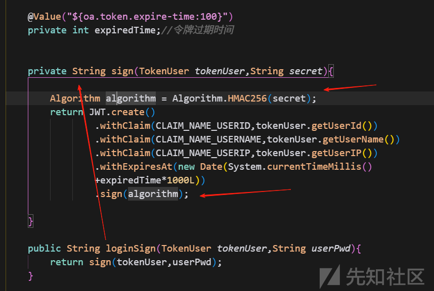

## DAO

一般看完过滤器就是看看控制器和dao有没有其他漏洞。这边搜索了一下dao层里面存不存在注入漏洞，可惜并没有，全部都是通过#进行了预编译的。

# 漏洞分析

这边通过关键词搜索`getInputStream`找到一处任意文件上传漏洞。但是并没有在依赖中找到解析jsp的依赖，所以这边也只能上传一些html等等xss的漏洞。

在`src/main/java/com/sf/demo/api/security/HomeController.java`

```
    @PostMapping("/avatar")
    public R<?> uploadAvatar(MultipartFile avatar) throws IOException {
        File file = new File(userAvatarDir,currentUser.getUserId());
        FileCopyUtils.copy(avatar.getInputStream(),new FileOutputStream(file));
        return R.OK();
    }
```

虽然是直接写入的文件，但是其文件名定死了，没办法上传其他的文件，因为

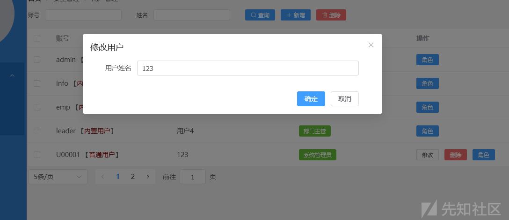

这边用户的账号都是定死的，只能改名字，但是文件是通过账号来命名的，不存在文件上传漏洞。除非能操作数据库里面去修改他的账号密码。
