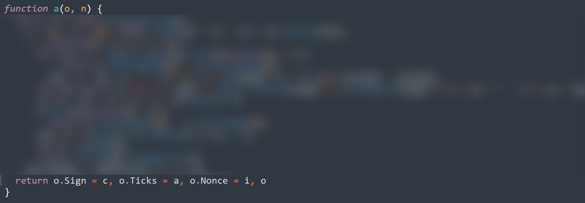

# 签名从哪来？小程序 API 请求签名的逆向与验证-先知社区

> **来源**: https://xz.aliyun.com/news/18682  
> **文章ID**: 18682

---

## 1. 背景与研究目标

### 1.1 问题的发现

一切从一次"神秘的401错误"开始。在分析某医疗小程序的接口调用时，发现所有请求都会携带一个名为`Sign`的签名字段，以及`Ticks`（时间戳）和`Nonce`（随机数）参数。当这些参数不匹配时，服务端会返回签名验证失败的错误。

这引发了一个有趣的技术问题：**这个签名是如何生成的？它依赖哪些输入参数？算法强度如何？**

### 1.2 签名机制的意义

在小程序开发中，请求签名通常用于：

* **接口防刷**：验证请求的合法性
* **参数完整性**：确保请求参数未被篡改
* **会话绑定**：关联用户身份和请求上下文

理解签名机制不仅有助于接口调试，更重要的是能够识别潜在的安全风险。

## 2. 过程插曲：发包替换参数 → 签名对不上

抓到的数据包参考如下（已将关键信息替换）：

```
POST /mp/AssistantMessage/unreadcount HTTP/1.1 
Host: xxx.xxx.xx 
Appid: 5C7A82A390UHGA69A121BC3CE74B02CF8 
Sign: 218243E7516121311A36A49705F3A449 
Xweb_xhr: 1 
Ticks: 1754618458602 
Nonce: 85661399 
Openid: orNzcubqaNkzOHuD1yZyg7ujcAQ 
User-Agent: Mozilla/5.0 (Windows NT 10.0; Win64; x64) AppleWebKit/537.36 (KHTML, like Gecko) Chrome/132.0.0.0 Safari/537.36 MicroMessenger/7.0.20.1781(0x6700143B) NetType/WIFI MiniProgramEnv/Windows WindowsWechat/WMPF WindowsWechat(0x63090a13) UnifiedPCWindowsWechat(0xf254061a) XWEB/16133 
Accept: text/json 
Content-Type: application/json;charset=UTF-8 
Sec-Fetch-Site: cross-site 
Sec-Fetch-Mode: cors 
Sec-Fetch-Dest: empty 
Connection: close

{"userid": 1107}
```

为了验证签名是否只依赖固定因子（`AppId/Ticks/Nonce`），我们在**发布包**里直接替换了部分业务参数（如 `branchId`、`userId`）。结果服务端持续返回 **401**。

## 3. 小程序源码逆向

这里小程序逆向的过程不做详细复现，需要的根据如下：

<https://github.com/system-cpu/wxappUnpacker>

<https://github.com/0day404/unveilr/releases/tag/v2.0>

具体流程就是:解密包→反编译解密后的包

## 4. 静态分析：从关键词到调用链

### 4.1 关键词检索

首先使用ripgrep对整个代码库进行关键词搜索：

```
rg -i "sign|signature|nonce|timestamp|ticks|secret|hmac|md5|sha" --type js
```

检索结果显示，主要的签名相关代码集中在`common/request.js`文件中。

### 4.2 可疑字段分析

找到关键的加密代码：



通过静态分析，我们识别出以下关键字段：

|  |  |  |  |
| --- | --- | --- | --- |
| 变量名 | 作用 | 参与签名 | 备注 |
| `Sign` | 最终签名值 | 输出 | MD5摘要，大写 |
| `Ticks` | 时间戳 | 是 | 毫秒级时间戳 |
| `Nonce` | 随机数 | 是 | 疑似生成逻辑有问题 |
| `AppId` | 应用标识 | 是 | 来自配置文件 |
| `AppSecret` | 应用密钥 | 是 | 硬编码在客户端 |

**发现一个关键参数**`paramString`**即请求的数据，这也就解释了为什么替换替换参数后为什么签名失效。**

### 4.3 调用链还原

通过代码追踪，我们还原出完整的调用链：

```
wx.request -> request拦截器 -> dealHeader函数 -> 签名生成 -> 发送请求
```

核心签名函数被混淆为单字母变量名，但其逻辑结构清晰可辨。

## 5. 动态分析：断点与变量观察

### 5.1 断点设置

在微信开发者工具中，我们在以下关键位置设置断点：

1. 请求拦截器入口
2. `dealHeader`函数开始
3. 签名生成函数内部
4. MD5计算前后

### 5.2 变量快照分析

通过断点调试，我们捕获到签名生成过程的关键变量：

```
// 时间戳生成
a = 1640995200000  // (new Date).getTime()

// Nonce生成（发现问题）
s = 1e8 = 100000000
i = (Math.random() * (1 - s) + s).toFixed(0)  // 这里有bug！

// 参数排序
Object.keys(params).sort((e, r) => e.charCodeAt(0) - r.charCodeAt(0))

// 最终拼接字符串
signString = AppId + AppSecret + Ticks + Nonce + paramString
```

### 5.3 关键发现

通过动态调试，我们发现了几个重要问题：

1. **Nonce生成错误**：`1 - 1e8`产生负数，导致随机数可能为负值
2. **字符级排序**：将拼接后的字符串逐字符排序，这是一个非常罕见的设计
3. **参数处理不一致**：对象和数组类型只拼接键名，存在哈希碰撞风险

## 6. 最小化复现脚本与签名验证

基于观察到的逻辑，我们用Python构建简单的签名验证脚本：

```
#!/usr/bin/env python3
# -*- coding: utf-8 -*-
"""
微信小程序签名机制复现脚本
用于验证逆向分析的正确性
"""

import hashlib

def serialize_params(params):
    """参数序列化 - 复现原逻辑"""
    if not params:
        return ""
    
    # 按第一个字符ASCII码排序
    sorted_keys = sorted(params.keys(), key=lambda x: ord(x[0]))
    
    param_string = ""
    for key in sorted_keys:
        value = params[key]
        if value is None or isinstance(value, (list, dict)):
            # 对象和数组只拼接键名
            param_string += key
        else:
            # 其他类型拼接键名+值
            param_string += key + str(value)
    
    return param_string

def generate_signature(app_id, app_secret, params, timestamp, nonce):
    """生成签名 - 复现原算法"""
    
    # 序列化参数
    param_string = serialize_params(params)
    print(f"参数字符串: {param_string}")
    
    # 拼接签名字符串
    sign_data = app_id + app_secret + str(timestamp) + nonce + param_string
    print(f"拼接字符串: {sign_data}")
    
    # 字符级排序（原逻辑的关键特征）
    sorted_chars = sorted(list(sign_data))
    sorted_string = ''.join(sorted_chars).replace(' ', '')
    print(f"排序后字符串: {sorted_string}")
    
    # MD5加密并转大写
    signature = hashlib.md5(sorted_string.encode('utf-8')).hexdigest().upper()
    
    return signature

def verify_signature():
    """签名验证主函数"""
    print("=" * 50)
    print("微信小程序签名验证工具")
    print("=" * 50)
    
    # 手动输入参数 - 从抓包数据中获取
    print("
请输入抓包获取的参数:")
    app_id = input("AppId: ").strip()
    app_secret = input("AppSecret: ").strip()
    timestamp = input("Ticks (时间戳): ").strip()
    nonce = input("Nonce (随机数): ").strip()
    
    print("
请输入请求参数 (输入空行结束):")
    params = {}
    while True:
        key = input("参数名: ").strip()
        if not key:
            break
        value = input(f"{key}的值: ").strip()
        if value.lower() == 'null' or value == '':
            params[key] = None
        else:
            params[key] = value
    
    expected_sign = input("
期望的签名值 (从抓包获取): ").strip()
    
    print("
" + "=" * 50)
    print("开始生成签名...")
    print("=" * 50)
    
    # 生成签名
    generated_sign = generate_signature(app_id, app_secret, params, timestamp, nonce)
    
    # 对比结果
    print(f"
生成的签名: {generated_sign}")
    print(f"期望的签名: {expected_sign}")
    
    if generated_sign == expected_sign:
        print("
✅ 验证成功! 签名完全匹配!")
        print("✅ 逆向分析正确!")
    else:
        print("
❌ 验证失败! 签名不匹配!")
        print("💡 可能的原因:")
        print("   1. 参数序列化规则不正确")
        print("   2. 字符排序逻辑有误")
        print("   3. AppSecret不正确")
        print("   4. 时间戳或随机数错误")

def quick_test():
    """快速测试函数 - 使用预设参数"""
    print("
" + "=" * 50)
    print("快速测试模式")
    print("=" * 50)
    
    # 测试参数 - 需要替换为真实抓包数据
    test_cases = [
        {
            "name": "测试用例1",
            "app_id": "wx123456789",
            "app_secret": "secret123456", 
            "params": {"userId": "123", "name": "张三"},
            "timestamp": "1640995200000",
            "nonce": "12345678",
            "expected": "XXXXXXXXXXXXXXXXXXXXXXXXXXXXXXXX"  # 替换为真实签名
        }
    ]
    
    for case in test_cases:
        print(f"
[{case['name']}]")
        generated = generate_signature(
            case["app_id"], 
            case["app_secret"], 
            case["params"], 
            case["timestamp"], 
            case["nonce"]
        )
        
        print(f"生成签名: {generated}")
        print(f"期望签名: {case['expected']}")
        
        if generated == case["expected"]:
            print("✅ 通过")
        else:
            print("❌ 失败")

if __name__ == "__main__":
    print("选择运行模式:")
    print("1. 手动输入模式")
    print("2. 快速测试模式")
    
    choice = input("请选择 (1/2): ").strip()
    
    if choice == "1":
        verify_signature()
    elif choice == "2":
        quick_test()
    else:
        print("无效选择，默认使用手动输入模式")
        verify_signature()
```

### 使用方法

1. **手动输入模式**：

* 运行脚本选择模式1
* 按提示输入从抓包工具获取的所有参数
* 查看生成的签名是否与抓包数据匹配

1. **快速测试模式**：

* 将真实的抓包数据填入`quick_test()`函数
* 运行脚本选择模式2进行批量验证

### 输入示例

```
AppId: wx123456789
AppSecret: secretABC123
Ticks: 1640995200000
Nonce: 87654321

参数名: userId
userId的值: 12345
参数名: branchId  
branchId的值: branch001
参数名: (直接回车结束)

期望的签名值: A1B2C3D4E5F678901234567890ABCDEF
```

脚本会显示完整的签名生成过程，包括参数串、拼接串、排序串，最后输出是否验证成功。

## 7. 边界测试与验证

### 7.1 测试用例设计

我们设计了以下测试用例来验证签名逻辑：

|  |  |  |  |
| --- | --- | --- | --- |
| 测试用例 | 变更内容 | 预期结果 | 实测结果 |
| T1 | 交换参数键顺序 | 签名相同 | ✅ 相同 |
| T2 | 修改参数值 | 签名不同 | ✅ 不同 |
| T3 | 添加null值参数 | 只影响键名 | ✅ 符合预期 |
| T4 | 时间戳固定 | 可重放攻击 | ⚠️ 存在风险 |

### 7.2 安全性评估

通过边界测试，我们发现以下安全问题：

1. **重放攻击风险**：缺少服务端时间戳验证窗口
2. **密钥泄露**：AppSecret硬编码在客户端
3. **算法弱点**：MD5已不被推荐用于安全场景
4. **实现缺陷**：Nonce生成逻辑错误

**最后也是直接解出签名了，其中**`AppId` **、**`AppSecret` **是固定的，**`Ticks`**设置较大的时间戳也能重复利用，每次请求主要更换请求的参数和随机值，配合burp插件写个脚本即可顺利就行渗透**

## 8. 安全改进建议

### 8.1 密钥管理优化

**问题**：AppSecret直接暴露在客户端代码中

**建议**：使用临时Token机制，这里验证过AppSecret是失效的，但还是不建议这样做

### 8.2 重放防护机制

**问题**：缺少时间窗口和Nonce去重验证

**建议**：

* 服务端验证时间戳在±5分钟窗口内
* 实现Nonce去重存储（Redis + TTL）
* 添加请求频率限制

## 9. 结论与思考

### 9.1 研究总结

通过这次逆向分析，我们完整还原了该小程序的签名生成机制：

1. **算法识别**：基于MD5的自定义签名算法
2. **实现缺陷**：Nonce生成、参数处理等多处问题
3. **安全风险**：密钥暴露、重放攻击、算法过时

### 9.2 方法论价值

本文展示的静态+动态分析方法具有良好的可复现性：

* 关键词检索快速定位可疑代码
* 断点调试观察实际执行流程
* 最小化脚本验证分析结论

### 9.3 开发者启示

对于小程序开发者，这次研究提供了以下参考：

1. **安全设计**：签名密钥不应暴露在客户端
2. **算法选择**：使用现代化的加密算法和标准实现
3. **防护机制**：实施完整的重放攻击防护
4. **代码审查**：定期检查关键安全逻辑的实现质量

**注**：本文所有分析均基于授权样本，代码示例已脱敏处理。如需了解更多技术细节或发现文中错误，欢迎交流讨论。

*研究有边界，安全无止境。*
