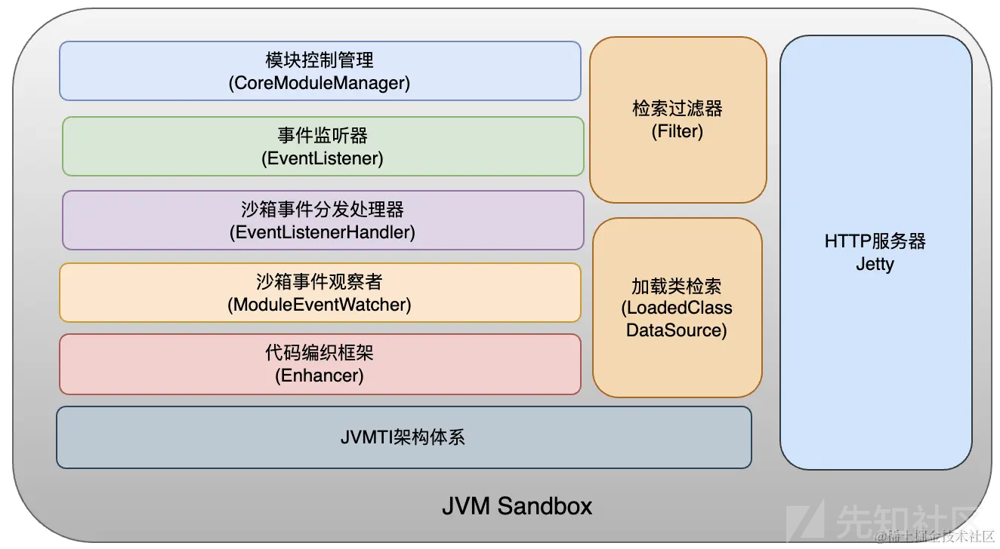
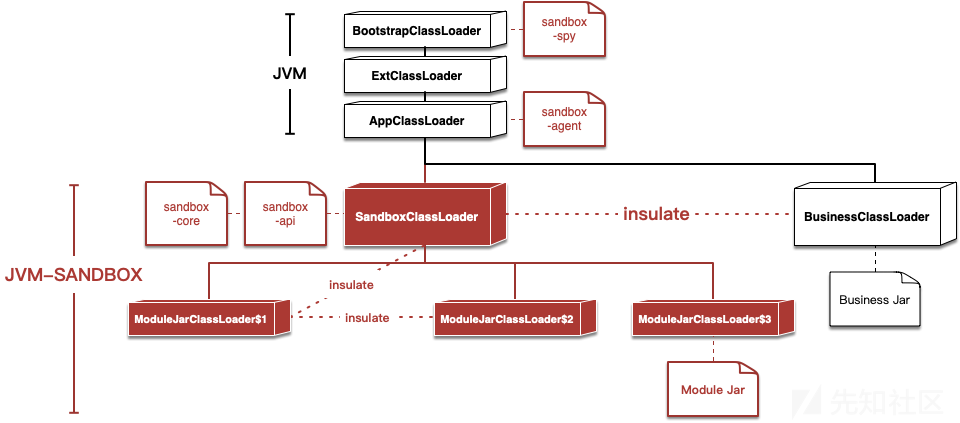
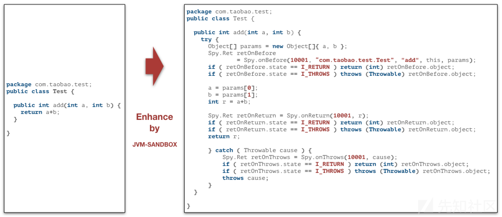
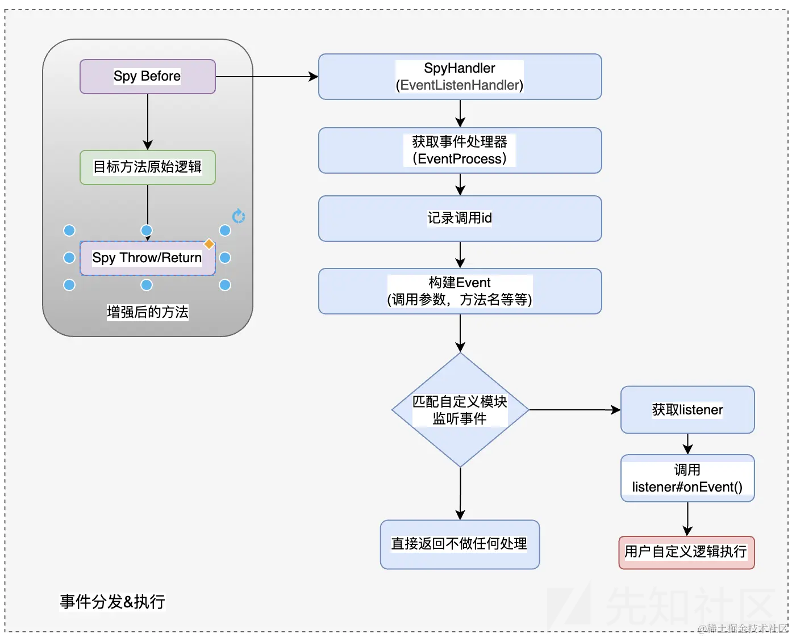
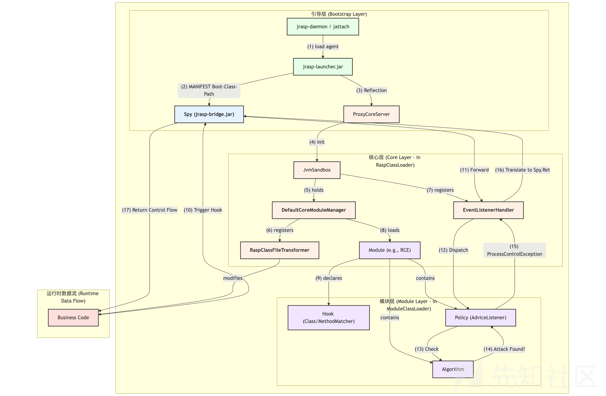

# JRASP源码浅析-先知社区

> **来源**: https://xz.aliyun.com/news/18684  
> **文章ID**: 18684

---

# JVM-SANDBOX 介绍

需要明确`jvm-sandbox`项目中各个组件的作用.  
项目地址：[GitHub - alibaba/jvm-sandbox: Real - time non-invasive AOP framework container based on JVM](https://github.com/alibaba/jvm-sandbox)

详细的原理分析，可参见

* [透过JVM-SANDBOX源码,了解字节码增强技术原理JVM 沙箱容器是一种 JVM 的非侵入式运行期 AOP 解决方案 - 掘金](https://juejin.cn/post/7275932720634626109)

JVM-SANDBOX 分为多个子项目，其中 agent,core,spy 是主程序库。

* agent:沙箱启动的代理.
* core:沙箱内核.
* spy:沙箱间谍类(代码增强的埋点类)。

下图介绍了 sandbox 整体架构中最重要的模块/功能，这些能力都是在 agent,core,spy 三个子项目中提供的。

​

1. 模块控制管理：负责管理 sandbox 自身模块以及使用者自定义模块，例如模块的加载，激活，冻结，卸载
2. 事件监听处理：用户自定义模块实现 Event 接口对增强的事件进行自定义处理，等待事件分发处理器的触发。
3. **沙箱事件分发处理器**：对目标方法增强后会对目标方法追加三个环节，分别为方法调用前 `BEFORE`、调用后 `RETURN`、调用抛异常 `THROWS`、当代码执行到这三个环节时则会由分发器分配到对应的事件监听执行器中执行。
4. **代码编织框架**：通过 ASM 框架依托于 JVMTI 对目标方法进行字节码修改，从而完成代码增强的能力。
5. 检索过滤器：当用户对目标方法创建增强事件时，沙箱会对目标 jvm 中的目标类和方法进行匹配以及过滤。匹配到用户设定目标类和方法进行增强，过滤掉 sandbox 内部的类以及 jvm 认为不可修改的类。
6. 加载类检索: 获取到需要增强的类集合依赖检索过滤器模块
7. HTTP 服务器：通过 http 协议与客户端进行通信（sandbox.sh 即可理解为客户端）本质是通过 curl 命令下发指令到沙箱的 http 服务器。例如模块的加载，激活，冻结，卸载等指令

### 如何保证业务类不被污染

沙箱通过自定义的SandboxClassLoader破坏了双亲委派的约定，实现了和目标应用的类隔离。所以不用担心加载沙箱会引起应用的类污染、冲突。各模块之间类通过ModuleJarClassLoader实现了各自的独立，达到模块之间、模块和沙箱之间、模块和应用之间互不干扰。  


### Spy如何增强hook对应方法

沙箱通过在BootstrapClassLoader中埋藏的Spy类完成目标类和沙箱内核的通讯  


### SPI如何加载Module

SPI 全称 Service Provider Interface，是 Java 提供的一套用来被第三方实现或者扩展的 API，它可以用来启用框架扩展和替换组件。Java SPI 实际上是“基于接口的编程＋策略模式＋配置文件”组合实现的动态加载机制，提供了通过 interface 寻找 implement 的方法。类似于 IOC 的思想，将装配的控制权移到程序之外，从而实现解耦。

在沙箱中自定义模块的实现则是利用了 SPI 机制，当我们自定义模块除了要实现 Module interface，还需要按照 SPI 的约定在 resource/META-services 下以 com.alibaba.jvm.sandbox.api.Module 为文件名，文件内容则是 Module 的实现类路径。当使用 SPI 加载实现类时需要传递一个 classLoader,这个 classLoader 是 moduleClassLoader，moduleClassLoader 中是继承自 URLClassLoader，SPI 加载类则查找当前 classLoader 对应的资源路径，从而找到匹配 Module interface 路径的文件，然后加载对应的实现类。

### 小结

在事件处理流程中通过 SpyHandler 的实现类 EventListenHandler 进行事件的分发，匹配到当前事件对应的事件处理器 EventProcessor，在 EventProcessor 中会真正的回调用户实现的 listener,从而完成真正的用户自定义代码增强逻辑。



# 作用机理

Jrasp-agent 是 jvm-sandbox 框架的一个**垂直领域应用**。直接**继承**了 jvm-sandbox 的整个核心架构和基础设施。 jrasp-agent 的所有核心组件，几乎都能在 jvm-sandbox 中找到对应的原型：

* **Spy 桥梁**: jrasp-agent 的 Spy 类，其设计思想和实现完全来自于 jvm-sandbox 的 Spy。
* **类加载器隔离**: jrasp-agent 的 RaspClassLoader 和 ModuleJarClassLoader，就是 jvm-sandbox 隔离机制的直接应用。
* **模块管理器**: DefaultCoreModuleManager 的设计，包括模块的生命周期管理、热插拔、依赖注入等，都是 jvm-sandbox 模块化思想的体现。
* **字节码织入**: EventWeaver 使用 ASM 对方法进行环绕增强，这是 jvm-sandbox AOP 能力的核心。
* **启动与 Attach**: AgentLauncher, jrasp-daemon 的工作模式，也借鉴了 jvm-sandbox 的启动和 attach 机制。



## Agent引导与核心服务启动

### 入口

jrasp-agent 的生命周期始于 `com.jrasp.agent.launcher110.AgentLauncher` 类。作为 Java Agent 规范的入口点，它的 premain和 agentmain（动态 Attach）方法负责解析启动参数，并将控制权移交给内部的`install`方法。

以`agentmain`方法为例，其他同理

`com.jrasp.agent.launcher110.AgentLauncher#agentmain` 方法中会调用`com.jrasp.agent.launcher110.AgentLauncher#install` 同目录下的`install`方法进行配置

```
/**  
 * 动态加载  
 *  
 * @param featureString 启动参数  
 *                      [namespace,token,ip,port,prop]  
 * @param inst          inst  
 */public static void agentmain(String featureString, Instrumentation inst) {  
    LAUNCH_MODE = LAUNCH_MODE_ATTACH;  
    install(toFeatureMap(featureString), inst);  
}
```

### 类隔离与服务启动

在`install`方法中:

* 构造一个`sandBoxClassLoader` 来加载`jrasp-core`中的代码。

* 使用自定义的 RaspClassLoader 加载 jrasp-core.jar，实现与业务的隔离。

* 获取`CoreConfigure`实例
* 之后通过反射获取`com.jrasp.agent.core.server.ProxyCoreServer`类的`getInstance`方法，实际返回一个`SocketServert`实例。然后将inst、`CoreConfigure`作为参数传入调用对应的`bind`方法。

```
/**  
 * 在当前JVM安装jvm-sandbox  
 * @param featureMap 启动参数配置  
 * @param inst       inst  
 * @return 服务器IP:PORT  
 */private static synchronized InetSocketAddress install(final Map<String, String> featureMap,  
                                                      final Instrumentation inst) {  
  
    final String namespace = getNamespace(featureMap);  
    final Map<String, String> coreConfigs = toCoreConfigMap(featureMap);  
  
    try {  
        final String home = getRaspHome(featureMap);  
        // 依赖的spy版本在agent加载时确定，解决业务进程不重启，而无法没有升级的问题  
  
        final String coreVersion = getCoreVersion(featureMap);  
  
        // 构造自定义的类加载器，尽量减少Sandbox对现有工程的侵蚀。 加载core的代码  
        final ClassLoader sandboxClassLoader = loadOrDefineClassLoader(namespace, getSandboxCoreJarPath(home, coreVersion));  
  
        // CoreConfigure类定义  
        final Class<?> classOfConfigure = sandboxClassLoader.loadClass(CLASS_OF_CORE_CONFIGURE);  
  
        // 反射生成CoreConfigure类实例  
        final Object objectOfCoreConfigure = classOfConfigure.getMethod("toConfigure", Map.class)  
                .invoke(null, coreConfigs);  
  
        // CoreServer类定义。 加载 com.jrasp.agent.core.server.ProxyCoreServer 类  
        final Class<?> classOfProxyServer = sandboxClassLoader.loadClass(CLASS_OF_PROXY_CORE_SERVER);  
  
        // 获取CoreServer单例  
        final Object objectOfProxyServer = classOfProxyServer  
                .getMethod("getInstance")  
                .invoke(null);  
  
        // CoreServer.isBind()  
        final boolean isBind = (Boolean) classOfProxyServer.getMethod("isBind").invoke(objectOfProxyServer);  
  
  
        // 如果未绑定,则需要绑定一个地址  
        if (!isBind) {  
            try {  
                classOfProxyServer  
                        .getMethod("bind", classOfConfigure, Instrumentation.class)  
                        .invoke(objectOfProxyServer, objectOfCoreConfigure, inst);  
            } catch (Throwable t) {  
                classOfProxyServer.getMethod("destroy").invoke(objectOfProxyServer);  
                throw t;  
            }  
  
        }  
  
        // 返回服务器绑定的地址  
        return (InetSocketAddress) classOfProxyServer  
                .getMethod("getLocal")  
                .invoke(objectOfProxyServer);  
  
  
    } catch (Throwable cause) {  
        throw new RuntimeException("jrasp init failed.", cause);  
    }  
  
}
```

### 核心服务实例化

* 在 bind 方法中，真正的核心 JvmSandbox 对象被创建。
* 在 JvmSandbox 的构造函数中，最重要的模块管理器 `DefaultCoreModuleManager`被实例化。

1、在`com.jrasp.agent.core.server.socket.SocketServer#bind` 方法中，做了对日志文件的创建，`JvmSandBox`的实例化

```
@Override  
public void bind(final CoreConfigure cfg, final Instrumentation inst) throws IOException {  
    long start = System.currentTimeMillis() / 1000;  
    this.cfg = cfg;  
    try {  
        initializer.initProcess(new Initializer.Processor() {  
            @Override  
            public void process() throws Throwable {  
                Loggging.init(cfg.getLogsPath());  
                LOGGER.info("server socket start init...");  
                // 注册jvmSandbox  
                jvmSandbox = new JvmSandbox(cfg, inst);  
                initHttpServer();  
                // 注册生成 DefaultCoreModuleManager 类 来管理module  
                registerHandler(jvmSandbox.getCoreModuleManager());  
                runServer();  
            }  
        });  
  
        // 启动资源监控  
        Monitor.Factory.init();  
  
        HeartbeatTask.start();  
  
        // reset所有的模块  
        try {  
            jvmSandbox.getCoreModuleManager().reset();  
        } catch (Throwable cause) {  
            LOGGER.log(Level.WARNING, "reset occur error when initializing.", cause);  
        }  
  
        final InetSocketAddress local = getLocal();  
        writeAgentInitResult(local);  
        // 耗时瓶颈在于读写文件  
        LOGGER.log(Level.INFO, "server socket success init, bind to [{0}:{1}], cost time: {2} ms", new Object[]{local.getHostName(), local.getPort(), System.currentTimeMillis() / 1000 - start});  
  
    } catch (Throwable cause) {  
        LOGGER.log(Level.WARNING, "initialize server failed.", cause);  
        throw new IOException("server bind failed.", cause);  
    }  
}
```

2、 `com.jrasp.agent.core.JvmSandbox`类即为需要仔细分析的核心代码

* `com.jrasp.agent.core.manager.DefaultCoreModuleManager`类型的属性: coreModuleManager负责管理所有的CoreModule

构造函数:

```
public JvmSandbox(final CoreConfigure cfg,  
                  final Instrumentation inst) {  
    EventListenerHandler.getSingleton();  
    this.cfg = cfg;  
    this.inst = inst;  
    this.coreModuleManager = new DefaultCoreModuleManager(cfg, inst, new DefaultCoreLoadedClassDataSource(inst));  
    init();  
}
```

## Transformer安装与Spy初始化

`com.jrasp.agent.core.JvmSandbox#init`方法是 RASP 开始改造JVM 环境的时刻。  
1、**注册 Spy 回调**: SpyUtils.init() 将`EventListenerHandler` 注册到 Spy 的静态 Map 中，**打通了从 Spy 到 Core 的通信链路**。  
2、**安装字节码修改器**: inst.addTransformer(...) 向 JVM 注册了全局的 RaspClassFileTransformer。  
3、**启用 Native Hook**: inst.setNativeMethodPrefix(...) 授予了 Hook native 方法的能力。

```
private void init() {  
    // 输出技术支持链接，方便业务排查问题  
    System.out.println(String.format("%s  INFO [jrasp] %s %s",  
            new SimpleDateFormat("yyyy-MM-dd HH:mm:ss.sss").format(new Date()),  
            "开启RASP安全防护，技术支持:", CoreConfigure.JRASP_SUPPORT_URL));  
  
    initPidRunDir();  
    RaspClassUtils.doEarlyLoadSandboxClass(earlyLoadSandboxClassNameArrays);  
  
    SpyUtils.init(cfg.getNamespace());  
  
    // 添加transformer  
    inst.addTransformer(RaspClassFileTransformer.INSTANCE, true);  
  
    // 设置NativeMethodPrefix 前缀，从而实现可以hook forkAndExec方法  
    inst.setNativeMethodPrefix(RaspClassFileTransformer.INSTANCE, EventWeaver.NATIVE_PREFIX);  
}
```

## 模块化加载与Hook点部署

一系列操作后，最后回到`bind`方法中。  
调用`com.jrasp.agent.core.manager.DefaultCoreModuleManager#reset`来加载所有模块，并进行相关Hook点部署

### module 模块发现

1、**解耦的加载链**: reset() 方法启动加载流程，通过 ModuleLibLoader -> ModuleJarLoader 的解耦链条，为每个模块 JAR 创建独立的 ModuleJarClassLoader，实现了模块间的隔离。  
2、**基于 ServiceLoader 的发现**: 采用 Java 标准的 ServiceLoader 机制，通过读取模块 JAR 内的`META-INF/services/com.jrasp.agent.api.Module` 文件，自动发现并实例化所有 Module 实现类。这是一种**约定优于配置**的优雅实现。  
3、**资格审查**: 对实例化的 Module 进行严格校验（@Information 注解、ID、启动模式等），确保只有合规的模块才能进入下一步。  
4、**回调通知**: 采用**回调模式**，通过 InnerModuleLoadCallback 将加载成功的 Module 实例安全地传递回 ModuleManager 进行统一处理。

#### 判断module存储的路径是否存在、有权限

将jar加密的秘钥、moduleLibDir的路径作为参数传输给。`com.jrasp.agent.core.manager.ModuleLibLoader#ModuleLibLoader`类，然后调用它的`load`方法。

```
/**  
 * 执行耗时  
 *  
 * @return  
 * @throws ModuleException  
 */public synchronized DefaultCoreModuleManager reset() throws ModuleException {  
  
    logger.info("start to reset all loaded modules");  
  
    // 1. 强制卸载所有模块  
    unloadAll();  
  
    // 2. 加载所有模块  
    // 用户模块加载目录，加载用户模块目录下的所有模块  
    // 对模块访问权限进行校验  
    if (moduleLibDir.exists() && moduleLibDir.canRead()) {  
        new ModuleLibLoader(moduleLibDir, cfg.getRunModulePath(), cfg.getDecyptKey(), cfg.getLaunchMode()).load(new InnerModuleLoadCallback());  
    } else {  
        logger.log(Level.WARNING, "module-lib not access, ignore flush load this lib. path={}", moduleLibDir);  
    }  
    return this;  
}
```

#### 根据module路径获取所有的Module Jar File

遍历`moduleLibDir`路径下的所有jar包，然后针对每一个`Jar`包单独实例化一个`com.jrasp.agent.core.manager.ModuleJarLoader`类，调用`load`方法去进行管理加载，体现了解耦合的思想。

```
// 加载jar 包  
void load(final ModuleJarLoader.ModuleLoadCallback mCb) {  
    long start = System.currentTimeMillis() / 1000;  
    // TODO 优化 并发加载  
    File[] allJar = listModuleJarFileInLib();  
    logger.log(Level.INFO, "load all module, total: {0}, list: {1} ", new Object[]{allJar.length, jarList(allJar)});  
    for (final File moduleJarFile : allJar) {  
        try {  
            // 遍历所有module Jar File  
            new ModuleJarLoader(moduleJarFile, copyDir, key, mode).load(mCb);  
        } catch (Throwable cause) {  
            logger.log(Level.WARNING, "loading module-jar occur error! module-jar=" + moduleJarFile, cause);  
        }  
    }  
    long end = System.currentTimeMillis() / 1000;  
    logger.log(Level.INFO, "all module load time: " + (end - start) + " ms");  
}
```

#### classLoader加载jar包，获取module实例

接着为了实例化`Jar File` 中对应的类，又实例化了一个`com.jrasp.agent.core.classloader.ModuleJarClassLoader`类，实际上实现了`URLClassLoader`类，进行本地的`file`类加载

```
void load(final ModuleLoadCallback mCb) throws IOException {  
  
    boolean hasModuleLoadedSuccessFlag = false;  
    ModuleJarClassLoader moduleJarClassLoader = null;  
    try {  
        moduleJarClassLoader = new ModuleJarClassLoader(moduleJarFile, copyDir, key);  
  
        final ClassLoader preTCL = Thread.currentThread().getContextClassLoader();  
        Thread.currentThread().setContextClassLoader(moduleJarClassLoader);  
  
        try {  
            hasModuleLoadedSuccessFlag = loadingModules(moduleJarClassLoader, mCb);  
        } finally {  
            Thread.currentThread().setContextClassLoader(preTCL);  
        }  
  
    } finally {  
        if (!hasModuleLoadedSuccessFlag  
                && null != moduleJarClassLoader) {  
            logger.log(Level.WARNING, "[{0}] not found any module , will be close.", moduleJarFile.getName());  
            moduleJarClassLoader.closeIfPossible();  
        }  
    }  
  
}
```

实例化`ClassLoader`之后，就调用`com.jrasp.agent.core.manager.ModuleJarLoader#loadingModules`方法进行加载`Module`。

* ServiceLoader.load(Module.class, moduleClassLoader) 会到 moduleClassLoader 的管辖范围（也就是那个模块 JAR 包）中，去查找一个特定的文件：META-INF/services/com.jrasp.agent.api.Module。  
   也就是获取当前jar包中所有实现了`Module`接口的所有类
* 加载出的 Module 循环获取并进行相关校验，过`@Information`注解、模块ID是否合法、加载模式等

```
private boolean loadingModules(final ModuleJarClassLoader moduleClassLoader,  
                               final ModuleLoadCallback mCb) throws IOException {  
    // 读取模块信息  
    final String metaInfo = readMainfest(this.moduleJarFile);  
    final Set<String> loadedModuleUniqueIds = new LinkedHashSet<String>();  
    final ServiceLoader<Module> moduleServiceLoader = ServiceLoader.load(Module.class, moduleClassLoader);  
    final Iterator<Module> moduleIt = moduleServiceLoader.iterator();  
    while (moduleIt.hasNext()) {  
  
        final Module module;  
        try {  
            module = moduleIt.next();  
        } catch (Throwable cause) {  
            logger.log(Level.WARNING, "loading module instance failed: instance occur error, will be ignored. module-jar=" + moduleJarFile, cause);  
            continue;  
        }  
  
        final Class<?> classOfModule = module.getClass();  
  
        // 判断模块是否实现了@Information标记  
        if (!classOfModule.isAnnotationPresent(Information.class)) {  
            logger.log(Level.WARNING, "loading module instance failed: not implements @Information, will be ignored. class={0};module-jar={1};",  
                    new Object[]{classOfModule, moduleJarFile}  
            );  
            continue;  
        }  
  
        final Information info = classOfModule.getAnnotation(Information.class);  
        final String uniqueId = info.id();  
  
        // 判断模块ID是否合法  
        if (RaspStringUtils.isBlank(uniqueId)) {  
            logger.log(Level.WARNING, "loading module instance failed: @Information.id is missing, will be ignored. class={0};module-jar={1};",  
                    new Object[]{classOfModule, moduleJarFile}  
            );  
            continue;  
        }  
  
        // 判断模块要求的启动模式和容器的启动模式是否匹配  
        if (!ArrayUtils.contains(info.mode(), mode)) {  
            logger.log(Level.WARNING, "loading module instance failed: launch-mode is not match module required, will be ignored. " +  
                            "module={0};launch-mode={1};required-mode={2};class={3};module-jar={4};",  
                    new Object[]{uniqueId,  
                            mode,  
                            RaspStringUtils.join(info.mode(), ","),  
                            classOfModule,  
                            moduleJarFile}  
            );  
            continue;  
        }  
  
        try {  
            if (null != mCb) {  
                mCb.onLoad(uniqueId, metaInfo, classOfModule, module, moduleJarFile, moduleClassLoader);  
            }  
        } catch (Throwable cause) {  
            logger.log(Level.WARNING, "loading module instance failed: MODULE-LOADER-PROVIDER denied, will be ignored.",  
                    cause  
            );  
            continue;  
        }  
  
        loadedModuleUniqueIds.add(uniqueId);  
  
    }  
  
    return !loadedModuleUniqueIds.isEmpty();  
}
```

最后会触发`com.jrasp.agent.core.manager.DefaultCoreModuleManager.InnerModuleLoadCallback`回调函数的onLoad方法进行真正的用户模块加载回调。

```
/**  
 * 用户模块加载回调  
 */  
final private class InnerModuleLoadCallback implements ModuleJarLoader.ModuleLoadCallback {  
    @Override  
    public void onLoad(final String uniqueId,  
                       final String metaInfo,  
                       final Class moduleClass,  
                       final Module module,  
                       final File moduleJarFile,  
                       final ModuleJarClassLoader moduleClassLoader) throws Throwable {  
  
        // 如果之前已经加载过了相同ID的模块，则放弃当前模块的加载  
        if (loadedModuleBOMap.containsKey(uniqueId)) {  
            final CoreModule existedCoreModule = get(uniqueId);  
            logger.log(Level.INFO, "IMLCB: module already loaded, ignore load this module. expected:module={0};class={1};loader={2}|existed:class={3};loader={4};",  
                    new Object[]{uniqueId,  
                            moduleClass, moduleClassLoader,  
                            existedCoreModule.getModule().getClass().getName(),  
                            existedCoreModule.getLoader()}  
            );  
            return;  
        }  
        // 这里进行真正的模块加载  
        load(uniqueId, metaInfo, module, moduleJarFile, moduleClassLoader);  
    }  
}
```

### coreModule装配与规则部署激活

最后回到`com.jrasp.agent.core.manager.DefaultCoreModuleManager#load`方法进行加载

* 注册每一个module为`com.jrasp.agent.core.CoreModule`类

```
/**  
 * 加载并注册模块  
 * <p>1. 如果模块已经存在则返回已经加载过的模块</p>  
 * <p>2. 如果模块不存在，则进行常规加载</p>  
 * <p>3. 如果模块初始化失败，则抛出异常</p>  
 *  
 * @param uniqueId          模块ID  
 * @param module            模块对象  
 * @param moduleJarFile     模块所在JAR文件  
 * @param moduleClassLoader 负责加载模块的ClassLoader  
 * @throws ModuleException 加载模块失败  
 */  
private synchronized void load(final String uniqueId,  
                               final String metaInfo,  
                               final Module module,  
                               final File moduleJarFile,  
                               final ModuleJarClassLoader moduleClassLoader) throws ModuleException {  
  
    if (loadedModuleBOMap.containsKey(uniqueId)) {  
        logger.log(Level.FINE, "module already loaded. module={0};", uniqueId);  
        return;  
    }  
  
    // 初始化模块信息  
    final CoreModule coreModule = new CoreModule(uniqueId, metaInfo, moduleJarFile, moduleClassLoader, module);  
  
    // 注入@RaspResource资源  
    injectResourceOnLoadIfNecessary(coreModule);  
  
    callAndFireModuleLifeCycle(coreModule, MODULE_LOAD);  
  
    // 设置为已经加载  
    coreModule.markLoaded(true);  
  
    // 如果模块标记了加载时自动激活，则需要在加载完成之后激活模块  
    markActiveOnLoadIfNecessary(coreModule);  
  
    // 注册到模块列表中  
    loadedModuleBOMap.put(uniqueId, coreModule);  
  
    // 通知生命周期，模块加载完成  
    callAndFireModuleLifeCycle(coreModule, MODULE_LOAD_COMPLETED);  
  
}
```

调用`com.jrasp.agent.core.manager.DefaultCoreModuleManager#injectResourceOnLoadIfNecessary`方法  
利用控制反转，给每一个`module`内部的field进行赋值

```
private void injectResourceOnLoadIfNecessary(final CoreModule coreModule) throws ModuleException {  
    try {  
        final Module module = coreModule.getModule();  
        for (final Field resourceField : RaspReflectUtils.getFieldsWithAnnotation(module.getClass(), RaspResource.class)) {  
            final Class<?> fieldType = resourceField.getType();  
            // ModuleEventWatcher对象注入  
            if (ModuleEventWatcher.class.isAssignableFrom(fieldType)) {  
                final ModuleEventWatcher moduleEventWatcher = getModuleEventWatcher(coreModule);  
                writeField(resourceField, module, moduleEventWatcher, true);  
            } else if (AlgorithmManager.class.isAssignableFrom(fieldType)) {  
                // AlgorithmManager 注入  
                writeField(resourceField, module, DefaultAlgorithmManager.instance, true);  
            } else if (Instrumentation.class.isAssignableFrom(fieldType)) {  
                // Instrumentation 注入  
                // 在模块中可以使用  
                // @RaspResource  
                // private　Instrumentation inst;  
                writeField(resourceField, module, inst, true);  
            } else if (AlgorithmManager.class.isAssignableFrom(fieldType)) {  
                // AlgorithmManager 注入  
                writeField(resourceField, module, DefaultAlgorithmManager.instance, true);  
            } else if (ThreadLocal.class.isAssignableFrom(fieldType)) {  
                // ThreadLocalHostInfo注入  
                writeField(resourceField, module, requestContext, true);  
            } else if (RaspLog.class.isAssignableFrom(fieldType)) {  
                // RaspLog  
                // 这里使用注入的原因是  
                // 为了兼容tomcat的日志格式,tomcat 使用的getlogger与类加载器有关  
                writeField(resourceField, module, Loggging.INSTANCE, true);  
            } else if (RaspConfig.class.isAssignableFrom(fieldType)) {  
                // 全局配置  
                writeField(resourceField, module, RaspConfigImpl.getInstance(), true);  
            } else if (String.class.isAssignableFrom(fieldType)) {  
                // metainfo  
                writeField(resourceField, module, coreModule.getMetaInfo(), true);  
            } else {  
                // 其他情况需要输出日志警告  
                logger.log(Level.WARNING, "module inject @RaspResource ignored: field not found. module={0};class={1};type={2};field={3};",  
                        new Object[]{coreModule.getUniqueId(),  
                                coreModule.getModule().getClass().getName(),  
                                fieldType.getName(),  
                                resourceField.getName()}  
                );  
            }  
        }  
    } catch (IllegalAccessException cause) {  
        throw new ModuleException(coreModule.getUniqueId(), MODULE_LOAD_ERROR, cause);  
    }  
}
```

调用两次`com.jrasp.agent.core.manager.DefaultCoreModuleManager#callAndFireModuleLifeCycle`方法，传入的参数均为`MODULE_LOAD_COMPLETED`，这样会触发我们自定义的`module`中所有的`loadCompleted`方法。

#### Algorithm策略添加

对于`XXXXAlgorithm`类来说:  
基本为将当前的策略注册到`algorithmManager`中

```
@Override  
public void loadCompleted() {  
    algorithmManager.register(this);  
}
```

实际上是注册封装到`com.jrasp.agent.core.manager.DefaultAlgorithmManager` 类下面的algorithmMaps属性中

```
@Override  
public boolean register(Algorithm algorithm) {  
    String type = algorithm.getType();  
    algorithmMaps.put(type, algorithm);  
    logger.log(Level.CONFIG, "register algorithm module: {0}", type);  
    return true;  
}  
  
@Override  
public boolean register(Algorithm... algorithms) {  
    for (Algorithm algorithm : algorithms) {  
        register(algorithm);  
    }  
    return true;  
}
```

#### Hook规则部署

对于`XXXXHook`的`loadCompleted`方法：

* 实例化为`EventWatchBuilder`类，最后调用它的`build`方法来对方法进行hook。
* 针对每一个hook点根据对应类型从的`algorithmManager`中获取对应的策略进行`check`方法检查是否命中

```
public void jndiHook() {  
    new EventWatchBuilder(moduleEventWatcher)  
            /**  
             * @see com.sun.jndi.toolkit.url.GenericURLContext#lookup(String)  
             * @see com.sun.jndi.toolkit.url.GenericURLContext#lookupLink(String)  
             */            .onClass(new ClassMatcher("com/sun/jndi/toolkit/url/GenericURLContext")  
                    .onMethod(  
                            new String[]{  
                                    "lookup(Ljava/lang/String;)Ljava/lang/Object;",  
                                    "lookupLink(Ljava/lang/String;)Ljava/lang/Object;"  
                            },  
                            new AdviceListener() {  
                                @Override  
                                public void before(Advice advice) throws Throwable {  
                                    if (disable) {  
                                        return;  
                                    }  
                                    String lookupUrl = (String) advice.getParameterArray()[0];  
                                    algorithmManager.doCheck(TYPE, requestContext.get(), lookupUrl);  
                                }  
  
                                @Override  
                                public void afterThrowing(Advice advice) throws Throwable {  
                                    requestContext.remove();  
                                }  
                            }  
                    )  
            )  
  
            /**  
             * @see javax.naming.InitialContext  
             * 上下文关联，辅助hook类  
             *  
             */            .onClass(new ClassMatcher("javax/naming/InitialContext")  
                    .onMethod(  
                            new String[]{  
                                    "lookup(Ljava/lang/String;)Ljava/lang/Object;",  
                                    "lookupLink(Ljava/lang/String;)Ljava/lang/Object;"  
                            },  
                            new AdviceListener() {  
                                @Override  
                                public void before(Advice advice) throws Throwable {  
                                    if (disable) {  
                                        return;  
                                    }  
                                    // 加标记  
                                    requestContext.get().addMark(TYPE);  
                                }  
  
                                @Override  
                                public void after(Advice advice) throws Throwable {  
                                    // 清除标记  
                                    requestContext.get().remove(TYPE);  
                                }  
  
                                @Override  
                                public void afterThrowing(Advice advice) throws Throwable {  
                                    requestContext.remove();  
                                }  
                            }  
                    )  
            )  
            .build();  
}
```

`build`方法实际上是调用`com.jrasp.agent.core.manager.DefaultModuleEventWatcher#watch`方法进行加载，注册hook点

```
public void build() {  
    if (moduleEventWatcher != null) {  
        moduleEventWatcher.watch(new HashSet<ClassMatcher>(classMatchers.values()));  
    }  
}
```

遍历当前module的所有`ClassMatcher`， 封装到`coreModule`的`classMatchers`属性中

```
/**  
 * 批量接口,效率更高  
 * 模块与内核传递 hook类的接口  
 *  
 * @param matchers  
 */  
@Override  
public void watch(final Set<ClassMatcher> matchers) {  
    // 全局 ClassFileTransformer    // 存储全部 matcher    // TODO 首次初始化，可以将所有matchers一次加入到targetClazzMap  
    // TODO 大大提高agent加载速度  
    Set<String> classNameSets = new HashSet<String>();  
    for (ClassMatcher classMatcher : matchers) {  
        String classNameJdk = classMatcher.getClassNameJdk();  
        classNameSets.add(classNameJdk);  
        if (classMatcher.isForceLoad()) {  
            RaspClassUtils.doEarlyLoadSandboxClass(classNameJdk);  
        }  
        RaspClassFileTransformer.INSTANCE.targetClazzMap.put(classMatcher.getClassName(), classMatcher);  
        coreModule.getClassMatchers().add(classMatcher);  
    }  
  
    // 查找需要渲染的类集合  
    final List<Class<?>> waitingReTransformClasses = classDataSource.findTargetClass(classNameSets);  
  
    // jvm已经加载的类，需要重新转换  
    reTransformClasses(waitingReTransformClasses, true);  
  
    // 激活增强类  
    if (coreModule.isActivated()) {  
        for (ClassMatcher matcher : matchers) {  
            Map<String, MethodMatcher> methodMatcherList = matcher.getMethodMatcherMap();  
            for (Map.Entry<String, MethodMatcher> entry : methodMatcherList.entrySet()) {  
                AdviceListener adviceListener = entry.getValue().getAdviceListener();  
                int listenerId = ObjectIDs.instance.identity(adviceListener);  
                EventListenerHandler.getSingleton().active(listenerId, new AdviceAdapterListener(adviceListener));  
            }  
        }  
    }  
}
```

#### 字节码织入

根据match获取所需要增强或修改的类列表，最后调用`com.jrasp.agent.core.manager.DefaultModuleEventWatcher#reTransformClasses`方法进行重新修改类。

```
/**  
 * @param waitingReTransformClasses 待转换的类  
 * @param isAddHook  
 */  
private void reTransformClasses(final List<Class<?>> waitingReTransformClasses, final boolean isAddHook) {  
    // 如果找不到需要被重新增强的类则直接返回  
    if (waitingReTransformClasses == null || waitingReTransformClasses.size() == 0) {  
        return;  
    }  
    // 在rasp 加载前，已经被JVM加载的类，需要进行一次reTransformClasses，加入 rasp hook 逻辑  
    // 在rasp 卸载时，对于全部HOOK类，需要进行一次reTransformClasses，还原  
    logger.log(Level.CONFIG, "isAddHook: {0}, transform class: {1}",  
            new Object[]{isAddHook, RaspStringUtils.join(waitingReTransformClasses, ",")});  
    for (final Class<?> waitingReTransformClass : waitingReTransformClasses) {  
        try {  
            inst.retransformClasses(waitingReTransformClass);  
        } catch (Throwable cause) {  
            logger.log(Level.WARNING, "instruemnt retransform class: {0}, error: {1}, cause: {2}",  
                    new Object[]{waitingReTransformClass.getName(), cause.getMessage(), cause.getCause()});  
        }  
    }  
}
```

实际会调用之前添加的`com.jrasp.agent.core.manager.RaspClassFileTransformer` 类针对目标类进行修改。  
重点在`com.jrasp.agent.core.manager.RaspClassFileTransformer#_transform`方法，在内部会将classMatch等属性初始化生成一个`com.jrasp.agent.core.enhance.EventEnhancer`实例，并调用ByteCodeArray方法生成增强后的字节码后交付给`ClassFileTransformer`类进行修改增强。

方法中会实例化一个`com.jrasp.agent.core.enhance.weaver.asm.EventWeaver#EventWeaver`编织类，该类实现了`ClassVisitor`类，可以对所需要的方法进行编织、修改

```
public byte[] toByteCodeArray(final ClassLoader targetClassLoader, final byte[] byteCodeArray, final ClassMatcher matcher) {  
    // 返回增强后字节码  
    final ClassReader cr = new ClassReader(byteCodeArray);  
    final ClassWriter cw = createClassWriter(cr, targetClassLoader);  
    final int objectId = ObjectIDs.instance.identity(targetClassLoader);  
    cr.accept(new EventWeaver(isNativeMethodEnhanceSupported,  
                    ASM9, cw, "default",  
                    objectId,  
                    cr.getClassName(),  
                    matcher  
            ),  
            EXPAND_FRAMES  
    );  
    return dumpClass(cr.getClassName(), cw.toByteArray());  
}
```

重点查看`com.jrasp.agent.core.enhance.weaver.asm.EventWeaver#visitMethod`方法，会获取每一个`adviceVisitor`对应的`listenerId`，作为参数传递给hook方法中添加的`java.com.jrasp.agent.bridge110.Spy#spyMethodOnBefore`以及`java.com.jrasp.agent.bridge110.Spy#spyMethodOnReturn`等spy相关方法。

```
@Override  
public MethodVisitor visitMethod(final int access, final String name, final String desc, final String signature, final String[] exceptions) {  
    MethodMatcher methodMatcher = isMatchedBehavior(name + desc);  
    ...
   
    // 匹配命中，获取listenerId  
    final int listenerId = ObjectIDs.instance.identity(methodMatcher.getAdviceListener());  
    ...
  
            @Override  
            public void visitEnd() {  
                if (!name.startsWith(NATIVE_PREFIX)) {  
                    codeLockForTracing.lock(new CodeLock.Block() {  
                        @Override  
                        public void code() {  
                            mark(beginLabel);  
                            loadArgArray();  
                            dup();  
                            push(namespace);  
                            push(listenerId);  
                            loadClassLoader();  
                            push(targetJavaClassName);  
                            push(name);  
                            push(desc);  
                            loadThisOrPushNullIfIsStatic();  
                            invokeStatic(ASM_TYPE_SPY, ASM_METHOD_Spy$spyMethodOnBefore);  
                            swap();  
                            storeArgArray();  
                            pop();  
                            processControl(desc);  
                        
                             ...
                             EventWeaver.this.addMethodNodes.add(fakeWrapperMethod);    //最终添加至addMethodNodes中。  
                            EventWeaver.this.addMethodNodes.add(wrapperMethod);  
                            loadReturn(Type.getReturnType(desc));  
                            push(namespace);  
                            push(listenerId);  
                            invokeStatic(ASM_TYPE_SPY, ASM_METHOD_Spy$spyMethodOnReturn);  
                            processControl(desc, true);  
                            returnValue();  
                            mark(endLabel);  
                            mv.visitLabel(startCatchBlock);  
                            visitTryCatchBlock(beginLabel, endLabel, startCatchBlock, ASM_TYPE_THROWABLE.getInternalName());  
                            newLocal = newLocal(ASM_TYPE_THROWABLE);  
                            storeLocal(newLocal);  
                            loadLocal(newLocal);  
                            push(namespace);  
                            push(listenerId);  
                            invokeStatic(ASM_TYPE_SPY, ASM_METHOD_Spy$spyMethodOnThrows);  
                            processControl(desc);  
... 
                super.visitEnd();  
            }  
        };  
  
    }
```

#### adviceListener激活

##### 模块热更新

hook方法完毕之后，回到``com.jrasp.agent.core.manager.DefaultModuleEventWatcher#watch``方法中。  
对于`coreModule`已经处于激活状态的，遍历每一个ClassMatch进行，进行AdviceListener补丁添加激活。

```
// 激活增强类  
if (coreModule.isActivated()) {  
    for (ClassMatcher matcher : matchers) {  
        Map<String, MethodMatcher> methodMatcherList = matcher.getMethodMatcherMap();  
        for (Map.Entry<String, MethodMatcher> entry : methodMatcherList.entrySet()) {  
            AdviceListener adviceListener = entry.getValue().getAdviceListener();  
            int listenerId = ObjectIDs.instance.identity(adviceListener);  
            EventListenerHandler.getSingleton().active(listenerId, new AdviceAdapterListener(adviceListener));  
        }  
    }  
}
```

获取`adviceListener`对应的identity标识。  
接着在`com.jrasp.agent.core.enhance.weaver.EventListenerHandler#active` 方法中，通过类中声明类型为`Map<Integer/*LISTENER_ID*/, EventProcessor>`的`mappingOfEventProcessor`属性进行作为事件处理器的集合。

* 以adiveListener的ID为标识，每一个封装了`com.jrasp.agent.api.listener.AdviceAdapterListener`对象的实例作为对应value
* 后续对于每hook点产生的event的具体事件处理逻辑，实际上是交付给`com.jrasp.agent.api.listener.AdviceAdapterListener`对应的advice进行处理。

```
/**  
 * 注册事件处理器  
 *  
 * @param listenerId 事件监听器ID  
 * @param listener   事件监听器  
 */  
public void active(final int listenerId, final EventListener listener) {  
    mappingOfEventProcessor.put(listenerId, new EventProcessor(listenerId, listener));  
}
```

##### 模块全激活

这里是正式的对全部module内部的策略进行激活

在`com.jrasp.agent.core.manager.DefaultCoreModuleManager#markActiveOnLoadIfNecessary`方法中会进一步调用`com.jrasp.agent.core.manager.DefaultCoreModuleManager#active`方法，进行全module 的激活，并且标记该coreModule已被激活。

```
// 激活coreModuel  
public synchronized void active(final CoreModule coreModule) throws ModuleException {  
  
    // 如果模块已经被激活，则直接幂等返回  
    if (coreModule.isActivated()) {  
        logger.log(Level.FINE, "module already activated. module={};", coreModule.getUniqueId());  
        return;  
    }  
  
    // 通知生命周期  
    callAndFireModuleLifeCycle(coreModule, MODULE_ACTIVE);  
  
    // 激活所有监听器  
    for (final ClassMatcher classMatcher : coreModule.getClassMatchers()) {  
        Map<String, MethodMatcher> methodMatcherMap = classMatcher.getMethodMatcherMap();  
        for (Map.Entry<String, MethodMatcher> entry : methodMatcherMap.entrySet()) {  
            MethodMatcher methodMatcher = entry.getValue();  
            int identity = ObjectIDs.instance.identity(methodMatcher.getAdviceListener());  
            EventListenerHandler.getSingleton().active(identity, new AdviceAdapterListener(methodMatcher.getAdviceListener()));  
        }  
    }  
  
    // 标记模块为：已激活  
    coreModule.markActivated(true);  
}
```

## event流转与algorithm执行

上面提到，在`EventWeaver#visitMethod`方法中，会对需要的hook点添加`spy`的相关方法处理逻辑，传入`listenerId`也就是每一个adviceListener对应的标识作为参数。

### 事件流转

1、业务代码触发 Hook，调用 Spy。  
2、Spy **转发**给 EventListenerHandler (SpyHandler 实现)。  
3、EventListenerHandler **封装 Event**，并根据 listenerId **分发**给 EventListener (AdviceAdapterListener 实现)。  
4、AdviceAdapterListener **适配 Event 为 Advice**（增加了调用链上下文），并最终调用用户编写的 AdviceListener 的 before/after 等方法。

`Spy`类充当一个间谍类的作用，充当目标hook的方法和检测逻辑方法的桥梁。

在每一个spy对应的方法中，最终会触发`com.jrasp.agent.core.enhance.weaver.EventListenerHandler#handleOnBefore`等继承了`SpyHandle`类的相关方法。

```
public static Ret spyMethodOnReturn(final Object object,  
                                    final String namespace,  
                                    final int listenerId) throws Throwable {  
    final Thread thread = Thread.currentThread();  
    if (selfCallBarrier.isEnter(thread)) {  
        return Ret.RET_NONE;  
    }  
    final SelfCallBarrier.Node node = selfCallBarrier.enter(thread);  
    try {  
        final SpyHandler spyHandler = namespaceSpyHandlerMap.get(namespace);  
        if (null == spyHandler) {  
            return Ret.RET_NONE;  
        }  
        return spyHandler.handleOnReturn(listenerId, object);  
    } catch (Throwable cause) {  
        handleException(cause);  
        return Ret.RET_NONE;  
    } finally {  
        selfCallBarrier.exit(thread, node);  
    }  
}
```

仅以该方法举例，首先会根据`listenerId`从`mappingOfEventProcessor`这个map表中获取对应的方法监听器对应的EventProcessor。  
获取相关信息，封装为一个`BeforeEvent`事件。

```
@Override  
public Spy.Ret handleOnBefore(int listenerId, int targetClassLoaderObjectID, Object[] argumentArray, String javaClassName, String javaMethodName, String javaMethodDesc, Object target) throws Throwable {  
  
    // 在守护区内产生的事件不需要响应  
    if (SandboxProtector.instance.isInProtecting()) {  
        logger.log(Level.FINE, "listener={0} is in protecting, ignore processing before-event", listenerId);  
        return newInstanceForNone();  
    }  
  
    // 获取事件处理器  
    final EventProcessor processor = mappingOfEventProcessor.get(listenerId);  
  
    // 如果尚未注册,则直接返回,不做任何处理  
    if (null == processor) {  
        logger.log(Level.FINE, "listener={0} is not activated, ignore processing before-event.", listenerId);  
        return newInstanceForNone();  
    }  
  
    // 获取调用跟踪信息  
    final EventProcessor.Process process = EventProcessor.processRef.get();  
  
    // 如果当前处理ID被忽略，则立即返回  
    if (process.isIgnoreProcess()) {  
        logger.log(Level.FINE, "listener={0} is marked ignore process!", listenerId);  
        return newInstanceForNone();  
    }  
  
    // 调用ID  
    final int invokeId = invokeIdSequencer.getAndIncrement();  
    process.pushInvokeId(invokeId);  
  
    // 调用过程ID  
    final int processId = process.getProcessId();  
  
    final ClassLoader javaClassLoader = ObjectIDs.instance.getObject(targetClassLoaderObjectID);  
    //放置业务类加载器  
    BusinessClassLoaderHolder.setBusinessClassLoader(Thread.currentThread().getContextClassLoader());  
  
    // 封装一个BeforeEvent  
    final BeforeEvent event = process.getEventFactory().makeBeforeEvent(  
            processId,  
            invokeId,  
            javaClassLoader,  
            javaClassName,  
            javaMethodName,  
            javaMethodDesc,  
            target,  
            argumentArray  
    );  
    try {  
        return handleEvent(listenerId, processId, invokeId, event, processor);  
    } finally {  
        process.getEventFactory().returnEvent(event);  
        BusinessClassLoaderHolder.removeBusinessClassLoader();  
    }  
}
```

最终这些event都会调用`com.jrasp.agent.core.enhance.weaver.EventListenerHandler#handleEvent`方法来进行处理事件。  
获取`processor`中封装的`com.jrasp.agent.api.listener.AdviceAdapterListener`实例，并调用其`onEvent`方法来触发内部的`adviceListener`逻辑

```
/**  
 * 调用出发事件处理&调用执行流程控制  
 *  
 * @param listenerId 处理器ID  
 * @param processId  调用过程ID  
 * @param invokeId   调用ID  
 * @param event      调用事件  
 * @param processor  事件处理器  
 * @return 处理返回结果  
 * @throws Throwable 当出现未知异常时,且事件处理器为中断流程事件时抛出  
 */  
private Spy.Ret handleEvent(final int listenerId, final int processId,  
                            final int invokeId, final Event event, final EventProcessor processor) throws Throwable {  
    // 获取事件监听器  
    final EventListener listener = processor.listener;  
  
    // 调用事件处理  
    try {  
        // 处理监听事件  
        listener.onEvent(event);  
    }
    ... 
}
@Override  
final public void onEvent(final Event event) throws Throwable {  
    final OpStack opStack = opStackRef.get();  
    try {  
        switchEvent(opStack, event);  
    } finally {  
        // 如果执行到TOP的最后一个事件，则需要主动清理占用的资源  
        if (opStack.isEmpty()) {  
            opStackRef.remove();  
        }  
    }  
}
```

会调用`switchEvent`方法，根据event事件的每一个过程，调用内部的`advice`的不同策略来进行判断、清洗。

```
// 执行事件  
private void switchEvent(final OpStack opStack, final Event event) throws Throwable {  
    switch (event.type) {  
        case BEFORE: {  
            final BeforeEvent bEvent = (BeforeEvent) event;  
            final ClassLoader loader = toClassLoader(bEvent.javaClassLoader);  
            final Advice advice = new Advice(bEvent.processId, bEvent.invokeId, loader, bEvent.argumentArray, bEvent.target);  
  
            final Advice top, parent;  
  
            // 顶层调用  
            if (opStack.isEmpty()) {  
                top = parent = advice;  
            } else {  
                parent = opStack.peek();  
                top = parent.getProcessTop();  
            }  
            advice.applyBefore(top, parent);  
  
            opStackRef.get().pushForBegin(advice);  
            adviceListener.before(advice);  
            break;  
        }  
  
        ...
  
        case RETURN: {  
            final ReturnEvent rEvent = (ReturnEvent) event;  
            final Advice wrapAdvice = opStack.popByExpectInvokeId(rEvent.invokeId);  
            if (null != wrapAdvice) {  
                Advice advice = wrapAdvice.applyReturn(rEvent.object);  
                try {  
                    adviceListener.afterReturning(advice);  
                } finally {  
                    adviceListener.after(advice);  
                }  
            }  
            break;  
        }  
        case THROWS: {  
            final ThrowsEvent tEvent = (ThrowsEvent) event;  
            final Advice wrapAdvice = opStack.popByExpectInvokeId(tEvent.invokeId);  
            if (null != wrapAdvice) {  
                Advice advice = wrapAdvice.applyThrows(tEvent.throwable);  
                try {  
                    adviceListener.afterThrowing(advice);  
                } finally {  
                    adviceListener.after(advice);  
                }  
            }  
            break;  
        }  
  
        default:  
  
    }  
}
```

### 策略执行

1、AdviceListener 的代码中，调用 algorithmManager.doCheck(...)。  
2、AlgorithmManager 根据 type，从其内部 Map 中找到对应的**安全策略** (Algorithm 实现)。  
3、调用该策略的 check 方法，执行最终的、具体的安全检测逻辑。

对应每一个`hook`中实现的相关逻辑，仅以如下代码为例，定义了相关生命周期的过程。

```
.onClass(new ClassMatcher("com/thoughtworks/xstream/core/AbstractReferenceUnmarshaller")  
        .onMethod(  
                "convert(Ljava/lang/Object;Ljava/lang/Class;Lcom/thoughtworks/xstream/converters/Converter;)Ljava/lang/Object;", new AdviceListener() {  
                    @Override  
                    public void before(Advice advice) throws Throwable {  
                        if (disable) {  
                            return;  
                        }  
                        // bugfix：修复类型转换错误  
                        // bugfix：获取index=1的参数  
                        if (advice.getParameterArray().length > 1) {  
                            Object type = advice.getParameterArray()[1];  
                            if (type != null && type instanceof Class) {  
                                Class clazz = (Class) type;  
                                String clazzName = clazz.getName();  
                                algorithmManager.doCheck(XML_TYPE, context.get(), clazzName);  
                            }  
                        }  
                    }  
  
                    @Override  
                    protected void afterThrowing(Advice advice) throws Throwable {  
                        context.remove();  
                    }  
                })  
)
```

在`doCheck`方法中，根据type获取对应的检测策略。直接进入对应的策略的`check`方法中，后续的就不在赘述。

```
@Override  
public void doCheck(String type, Context context, Object... parameters) throws Exception {  
    // 对于hook和algorithm不在一个jar包的场景，全局检测开关有效  
    // 约定：如果在同一个jar包中，需要单独增加全局关闭开关  
    RaspConfig raspConfig = RaspConfigImpl.getInstance();  
    if (raspConfig.isCheckDisable()) {  
        return;  
    }  
    Algorithm algorithm = algorithmMaps.get(type);  
    if (algorithm == null) {  
        return;  
    }  
    algorithm.check(context, parameters);  
}
```

# 详细Hook点分析

该模块主要由AI自动分析生成报告

## 1. 命令执行防护模块 (rce-hook)

**模块ID**: `rce-hook` **防护目标**: 防止远程命令执行攻击 **核心特点**: Hook最底层native方法，无法绕过

### Hook点详情:

* **Unix系统命令执行**:

* `java/lang/UNIXProcess#forkAndExec(I[B[B[BI[BI[B[IZ)I`
* `java/lang/ProcessImpl#forkAndExec(I[B[B[BI[BI[B[IZ)I`

* **Windows系统命令执行**:

* `java/lang/ProcessImpl#create(Ljava/lang/String;Ljava/lang/String;Ljava/lang/String;[JZ)J`

### 检测机制:

* 拦截系统级进程创建调用
* 提取命令和参数进行安全检测
* 支持Unix和Windows双平台

## 2. 反序列化防护模块 (deserialization-hook)

**模块ID**: `deserialization-hook` **防护目标**: 防止Java反序列化攻击 **支持框架**: JDK、FastJSON、Jackson、XStream、YAML

### Hook点详情:

**JDK原生反序列化**:

* `java/io/ObjectInputStream#resolveClass(Ljava/io/ObjectStreamClass;)Ljava/lang/Class;`

**FastJSON反序列化**:

* `com/alibaba/fastjson/util/TypeUtils#loadClass(Ljava/lang/String;Ljava/lang/ClassLoader;Z)Ljava/lang/Class;`
* `com/alibaba/fastjson/util/TypeUtils#getClassFromMapping(Ljava/lang/String;)Ljava/lang/Class;`

**Jackson反序列化**:

* `com/fasterxml/jackson/databind/deser/BeanDeserializer#deserialize(...)`

**XStream反序列化**:

* `com/thoughtworks/xstream/core/AbstractReferenceUnmarshaller#convert(...)`

**YAML反序列化**:

* `org/yaml/snakeyaml/constructor/BaseConstructor#constructObject(Lorg/yaml/snakeyaml/nodes/Node;)Ljava/lang/Object;`

### 检测类型:

* `ois-deserialization`: JDK原生反序列化
* `json-yaml-deserialization`: JSON/YAML反序列化
* `xml-deserialization`: XML反序列化

## 3. HTTP请求防护模块 (http-hook)

**模块ID**: `http-hook` **防护目标**: HTTP请求安全防护 **支持容器**: Tomcat、Jetty、Undertow、Spark

### Hook点详情:

**Undertow容器**:

* `io/undertow/servlet/handlers/ServletInitialHandler#dispatchRequest(...)`
* `io/undertow/servlet/handlers/ServletInitialHandler#handleFirstRequest(...)`
* `io/undertow/servlet/spec/ServletInputStreamImpl#read([BII)I`
* `io/undertow/server/HttpServerExchange#getQueryParameters()Ljava/util/Map;`

**Tomcat容器**:

* `org/apache/catalina/connector/CoyoteAdapter#service(...)`
* `org/apache/catalina/core/StandardWrapperValve#invoke(...)`
* `org/apache/catalina/connector/InputBuffer#read([BII)I`

**Jetty容器**:

* `org/eclipse/jetty/server/Server#handle(...)`
* `org/eclipse/jetty/server/HttpInput#read([BII)I`

**Spark容器**:

* `org/sparkproject/jetty/server/Server#handle(...)`
* `org/sparkproject/jetty/server/HttpInput#read([BII)I`

### 防护功能:

* IP黑名单检测
* URL黑名单检测
* 扫描器识别
* 请求参数安全检测
* HTTP Body内容检测

## 4. 文件访问防护模块 (file-hook)

**模块ID**: `file-hook` **防护目标**: 防止恶意文件操作 **支持API**: Java IO、NIO、Apache Commons IO

### Hook点详情:

**Java IO API**:

* `java/io/FileInputStream#<init>(Ljava/io/File;)V`
* `java/io/FileOutputStream#<init>(Ljava/io/File;Z)V`
* `java/io/File#delete()Z`
* `java/io/File#renameTo(Ljava/io/File;)Z`
* `java/io/File#list()[Ljava/lang/String;`
* `java/io/File#createNewFile()Z`
* `java/io/RandomAccessFile#<init>(...)`

**Java NIO API**:

* `java/nio/file/Files#readAllBytes(Ljava/nio/file/Path;)[B`
* `java/nio/file/Files#createFile(...)`
* `java/nio/file/Files#delete(Ljava/nio/file/Path;)V`
* `java/nio/file/Files#newDirectoryStream(...)`

**文件上传**:

* `org/apache/commons/fileupload/FileUploadBase#parseRequest(...)`

### 防护功能:

* 敏感文件访问控制
* 文件上传安全检测
* 目录遍历防护
* 文件操作权限控制

## 5. 表达式注入防护模块 (expression-hook)

**模块ID**: `expression-hook` **防护目标**: 防止表达式注入攻击 **支持框架**: SpEL、OGNL、EL、JEXL、MVEL

### Hook点详情:

**Spring SpEL**:

* `org/springframework/expression/common/TemplateAwareExpressionParser#parseExpression(...)`

**OGNL表达式**:

* `ognl/OgnlParser#topLevelExpression()Lognl/Node;`

**EL表达式**:

* `org/apache/el/ValueExpressionImpl#getValue(...)`

**JEXL表达式**:

* `org/apache/commons/jexl2/ExpressionImpl#execute(...)`
* `org/apache/commons/jexl3/internal/Script#execute(...)`

**MVEL表达式**:

* `org/mvel2/MVEL#compileExpression(...)`

### 防护功能:

* 表达式语法检测
* 危险函数调用拦截
* 表达式执行上下文控制

## 6. XXE攻击防护模块 (xxe-hook)

**模块ID**: `xxe-hook` **防护目标**: 防止XML外部实体攻击 **支持解析器**: DOM4J、JDOM、JDK原生

### Hook点详情:

**DOM4J解析器**:

* `org/dom4j/io/SAXReader#read(Lorg/xml/sax/InputSource;)Lorg/dom4j/Document;`

**JDOM解析器**:

* `org/jdom/input/SAXBuilder#build(Ljava/io/InputStream;)Lorg/jdom/Document;`
* `org/jdom2/input/SAXBuilder#build(...)`

**JDK原生解析器**:

* `javax/xml/parsers/DocumentBuilderFactory#newInstance()Ljavax/xml/parsers/DocumentBuilderFactory;`
* `javax/xml/stream/XMLInputFactory#newInstance()Ljavax/xml/stream/XMLInputFactory;`
* `org/xml/sax/helpers/XMLReaderFactory#createXMLReader()Lorg/xml/sax/XMLReader;`

### 防护功能:

* 外部实体引用检测
* DTD声明安全检查
* XML解析器安全配置

## 7. JNDI注入防护模块 (jndi-hook)

**模块ID**: `jndi-hook` **防护目标**: 防止JNDI注入攻击

### Hook点详情:

* `com/sun/jndi/toolkit/url/GenericURLContext#lookup(...)`
* `javax/naming/InitialContext#lookup(...)`

### 防护功能:

* JNDI查找URL检测
* 危险协议拦截
* 远程类加载防护

## 8. SSRF攻击防护模块 (ssrf-hook)

**模块ID**: `ssrf-hook` **防护目标**: 防止服务端请求伪造攻击 **支持客户端**: Socket、OkHttp、Apache HttpClient、URLConnection

### Hook点详情:

**Socket连接**:

* `java/net/Socket#connect(Ljava/net/SocketAddress;I)V`

**OkHttp客户端**:

* `okhttp3/internal/http/RealInterceptorChain#proceed(...)`
* `com/squareup/okhttp/Call$ApplicationInterceptorChain#proceed(...)`

**Apache HttpClient**:

* `org/apache/http/impl/client/CloseableHttpClient#execute(...)`
* `org/apache/http/impl/client/AutoRetryHttpClient#execute(...)`
* `org/apache/http/impl/client/DecompressingHttpClient#execute(...)`

**重定向处理**:

* `org/apache/http/impl/client/DefaultRedirectStrategy#getLocationURI(...)`
* `org/apache/http/impl/client/DefaultRedirectHandler#getLocationURI(...)`

**URL连接**:

* `java/net/URL#openConnection()Ljava/net/URLConnection;`
* `sun/net/www/protocol/http/HttpURLConnection#followRedirect()Z`

### 防护功能:

* 内网IP访问控制
* 危险端口拦截
* URL重定向检测
* 协议白名单控制

## 9. JNI调用防护模块 (jni-hook)

**模块ID**: `jni-hook` **防护目标**: 防止恶意JNI调用

### Hook点详情:

* `java/lang/System#load(Ljava/lang/String;)V`
* `java/lang/System#loadLibrary(Ljava/lang/String;)V`
* `java/lang/ClassLoader#loadLibrary0(...)`
* `java/lang/ClassLoader$NativeLibrary#<init>`

### 防护功能:

* 动态库加载控制
* JNI调用权限检查
* 恶意库文件检测

## 10. JSP防护模块 (jsp-hook)

**模块ID**: `jsp-hook` **防护目标**: JSP页面安全防护

### Hook点详情:

* `org/apache/jasper/runtime/HttpJspBase#service(...)`
* `org/apache/taglibs/standard/tag/common/core/ImportSupport#targetUrl()Ljava/lang/String;`

### 防护功能:

* JSP页面访问控制
* 标签库安全检查
* 动态包含防护

## 11. 内存马防护模块 (memory-shell-hook)

**模块ID**: `memory-shell-hook` **防护目标**: 防止内存马注入

### Hook点详情:

* `org/apache/catalina/core/StandardContext#addFilter(...)`
* `org/apache/catalina/core/StandardContext#addServlet(...)`

### 防护功能:

* Filter类型内存马检测
* Servlet类型内存马检测
* 动态组件注册监控

## 12. Shiro防护模块 (shiro-hook)

**模块ID**: `shiro-hook` **防护目标**: Shiro框架安全防护

### Hook点详情:

* `org/apache/shiro/mgt/AbstractRememberMeManager#getDecryptionCipherKey()[B`

### 防护功能:

* RememberMe反序列化攻击防护
* 密钥安全检查

## 13. 响应防护模块 (response-hook)

**模块ID**: `response-hook` **防护目标**: HTTP响应安全防护

### Hook点详情:

* `org/apache/coyote/Response#setHeader(...)`

### 防护功能:

* 响应头安全检查
* 敏感信息泄露防护
* 安全响应头注入

## AI评估结果

|  |  |  |  |
| --- | --- | --- | --- |
| 攻击类型 | 防护模块 | 覆盖度 | 绕过难度 |
| 命令执行 | rce-hook | 100% | 极高 |
| 反序列化 | deserialization-hook | 95% | 高 |
| 文件操作 | file-hook | 90% | 高 |
| 表达式注入 | expression-hook | 85% | 中高 |
| XXE攻击 | xxe-hook | 90% | 高 |
| JNDI注入 | jndi-hook | 95% | 高 |
| SSRF攻击 | ssrf-hook | 85% | 中高 |
| 内存马 | memory-shell-hook | 80% | 中 |
| HTTP攻击 | http-hook | 75% | 中 |
