# 手把手带你blade站点渗透测试技巧分享-先知社区

> **来源**: https://xz.aliyun.com/news/18688  
> **文章ID**: 18688

---

## 0x1 前言

### 浅谈

哈喽，师傅们好！

这篇文章呢，主要是我在微信公众号通过关注的一些大牛子师傅发的公众号，文章写的关于spring-blade后台框架系统的menu接口存在的1day漏洞，一些sql注入和未授权漏洞等，然后写了相关魔改后的blade的漏洞的打法，对blade比较感兴趣的我，也就开始踏上了blade漏洞挖掘的不归之路了！

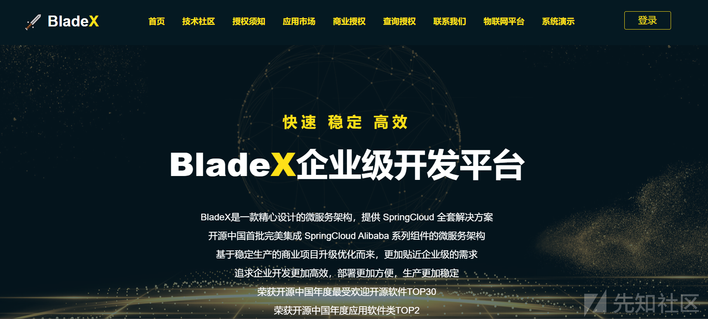

### bladeX简介

* **BladeX 物联网平台**是一款高度集成的物联网解决方案，涵盖设备管理、数据采集、实时监控、数据分析以及开放API服务等核心功能。
* 平台经过精心设计与开发，提供了全面的品类、产品和设备支持。设备注册成功后，能够轻松桥接至其他物联网云平台，实现设备的无缝集成。
* 同时提供服务端订阅功能，支持MQTT与AMQP两种方式将设备数据订阅转发至自建服务端，实现设备数据的自定义监控与分析。

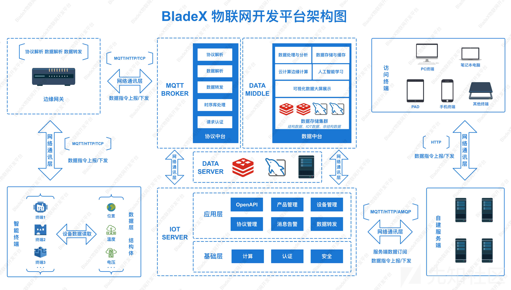

最主要的还是带师傅们了解下blade的登录界面了，要让师傅们一眼就认识这个系统框架，有助于我们在做渗透测试的时候快、准、狠拿下这些站点服务

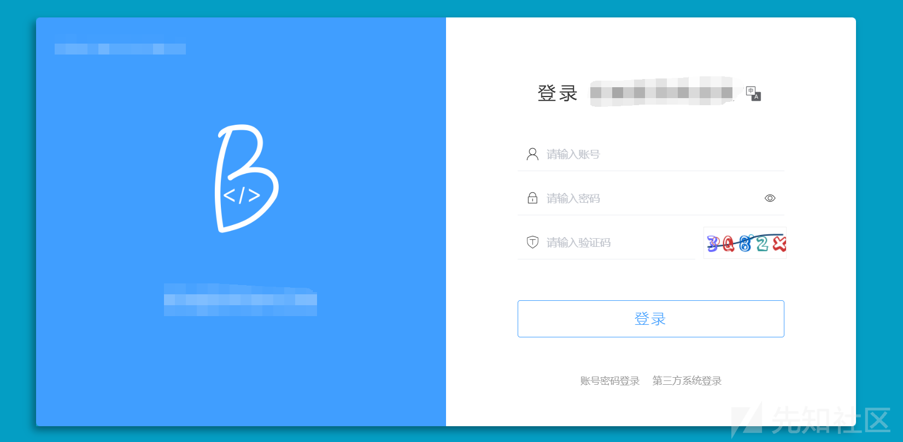

## 0x2 信息收集

这次我的目标比较明确，就是主要打的就是blade的站点，所以我这里直接就可以使用空间引擎，比如国内常用的FOFA、鹰图、360Quake进行一个资产收集。

### 1、通过icon图标检索

对于新手师傅们可能开始对于blade不知道是什么框架系统，那么可以跟我下面一样，使用最简单的方法，直接在浏览器上检索bladex的icon图标，然后就可以看到下面的一把小铁剑了，这个就是经典的spring二次开发的blade的icon图标了。

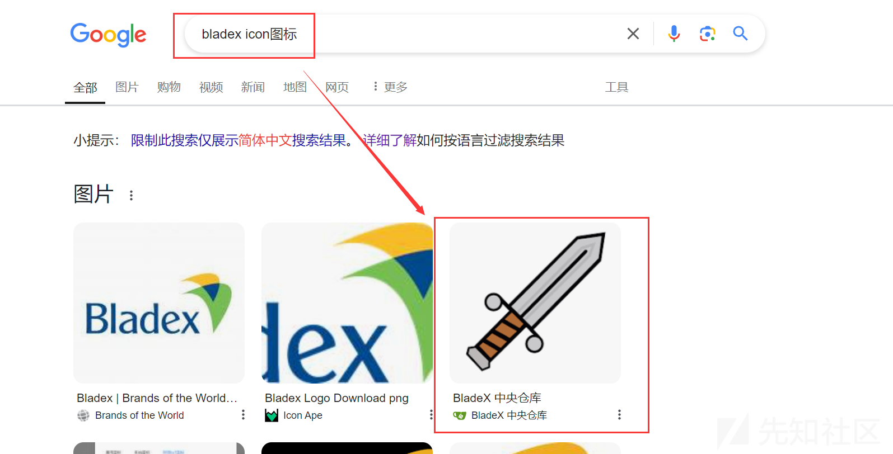

下面拿我们FOFA举例，利用这个icon图标进行一个检索

```
icon_hash="1047841028"
```

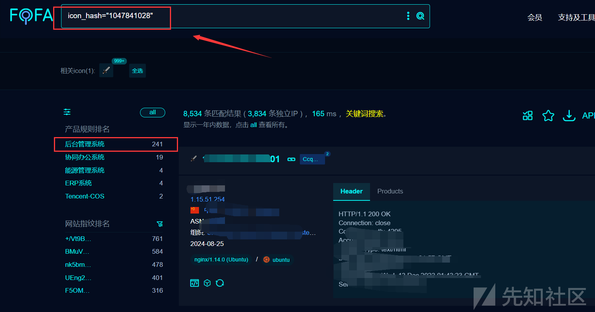

但是这次我主要是针对于这个blade的后台登录管理系统来的，所以这里再点击选择上面的后台管理系统，缩小我们的资产范围

```
icon_hash="1047841028" && product="后台管理系统"
```

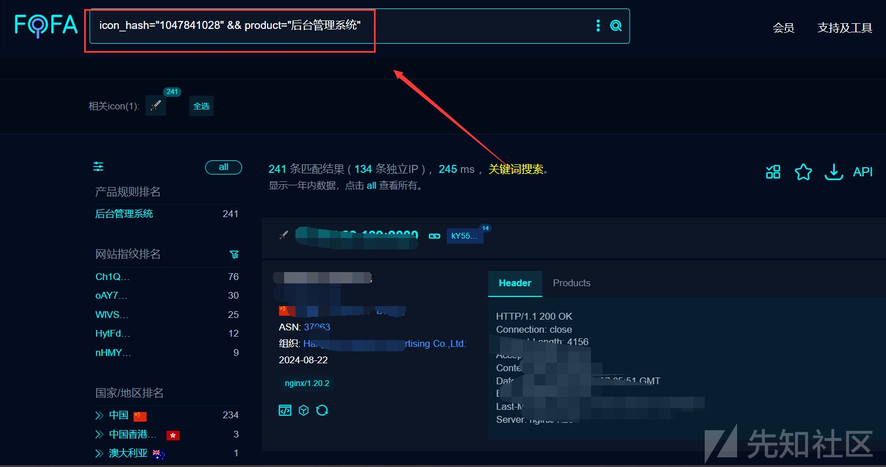

### 2、通过blade关键字

下面是我总结的几个常用的空间检索引擎的语法，针对这几个相关漏洞的一个语法总结

```
body="https://bladex.vip" && product="后台管理系统"
body="https://bladex.vip" && body="后台管理系统"

```

#### FOFA

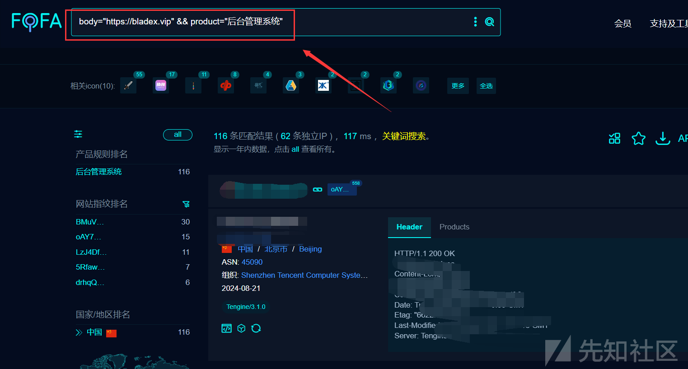

#### 鹰图

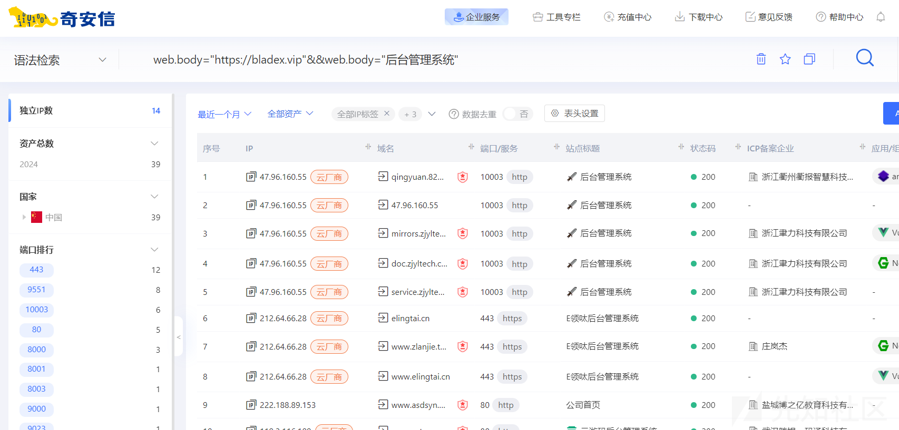

#### 360Quake

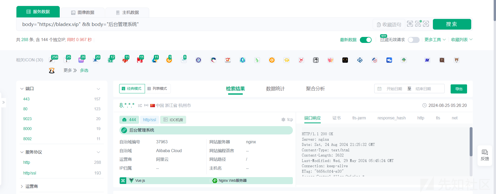

## 0x3 渗透测试

### 一、口令爆破

通过上面的信息收集和资产的汇总，然后剩下的就是就这些站点进行一个测试了，我找的都是一些后台管理登录的，因为我想尝试使用弱口令登录或者如果没有验证码，使用口令爆破的方式登录进去，然后再进行一波系统内部的测试

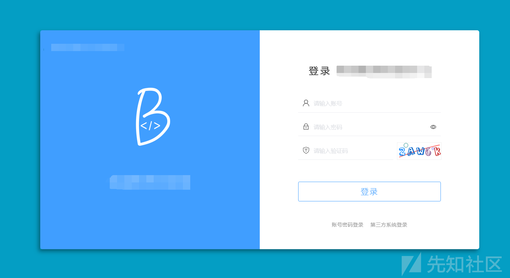

这里使用wappalyzer插件看看这个登录站点的一个使用框架和开发语言的一个情况，可以看到Vue框架的，还有webpack打包，可能存在js.map文件泄露漏洞

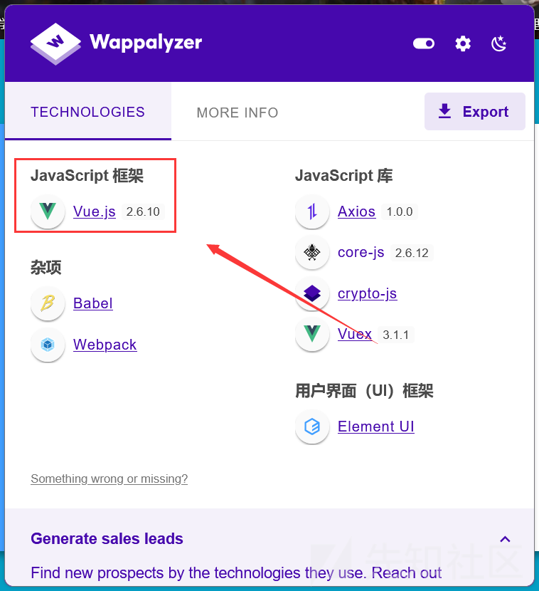

我这里先是测试了很多弱口令admin:123456/admin等等，但是都没有进去，然后我使用万能密码测试，看看能不能登录进行，但是这个站点没有成功。但是这个也是一个思路，可以在别的站点测试下，这个也给师傅们分享下汇总的一些sql注入万能密码

```
admin'or 1=1--
admin'or' 1=1--
admin"or 1=1--
admin'or''='
admin'OR'1=1%00
admin'and'1'='1'#
admin'and'1'='1
admin'and'1'='1#

```

就是这里的验证码，有一个bug就是不会刷新，账户密码输入错误，也不会刷新，那么我这里就想着直接尝试爆破，账户密码使用常见的top1000user和passwd进行爆破

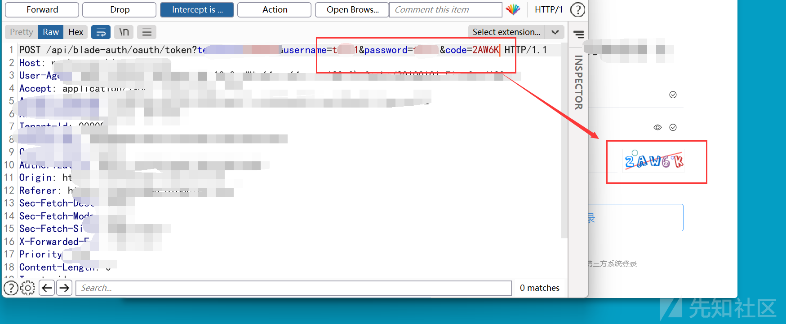

最后爆破的test1账户成功了

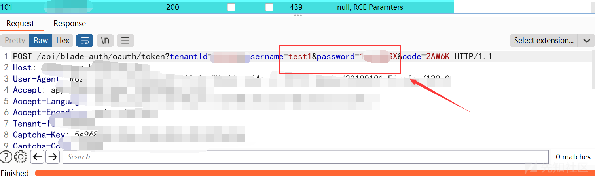

直接使用爆破成功的账户密码登录后台成功

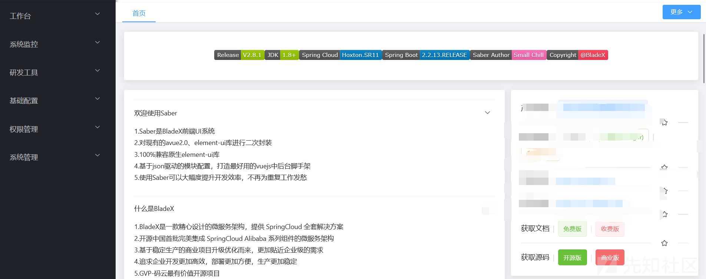

### 二、垂直越权

最开始进入后台，我就直接访问了个人信息这里，因为我一般喜欢进入后台，然后看看会不会有文件上传头像的这个功能点，我喜欢打文件上传，然后getshell的操作

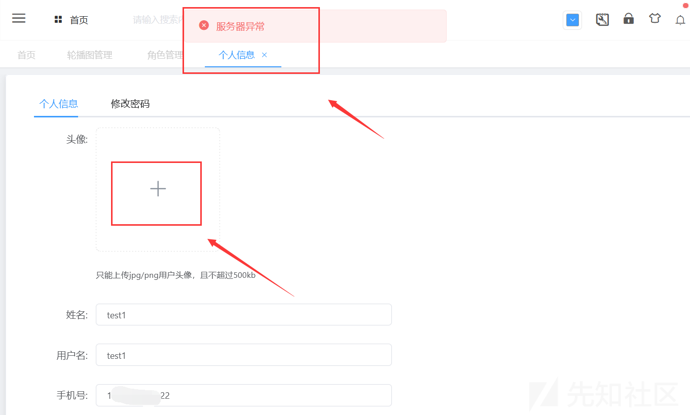

这里确实存在文件上传的功能点，但是这里一直显示服务器异常，然后一直上传不上去，所以后面就没有打文件上传这个功能点了

然后我就想尝试下像一般blade的接口泄露，包括开始看见了Vue框架，所以我一般都有利用bp的抓历史包的功能，然后点击左边的功能点，然后再进行挨个看历史数据包

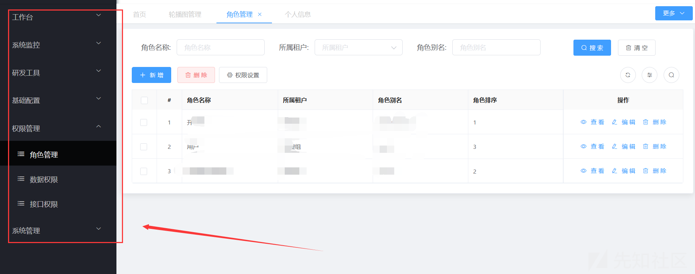

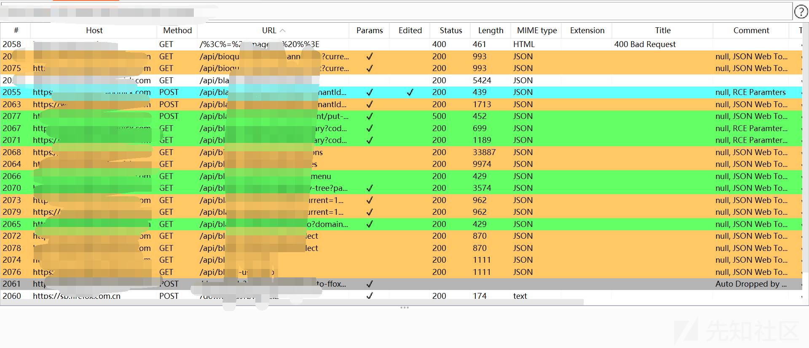

像这样的带user参数的，特别是后面还跟page、size、number等参数的时候，需要特别关注，像这样的接口很容易有 未授权导致的敏感信息泄露

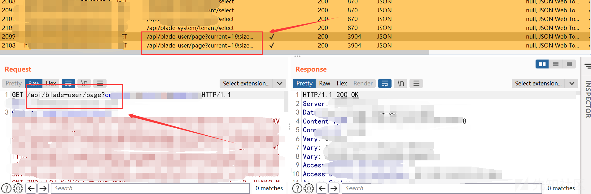

师傅们可以看到我这里直接把其余的参数给删掉了，通过拼接参数list，以一个测试账户低权限的用户直接访问到了管理员账户的敏感信息

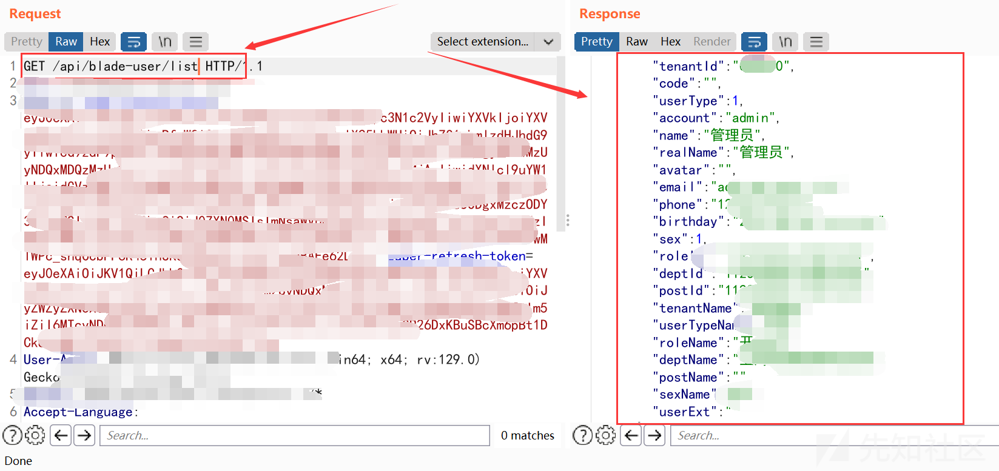

### 三、泄露管理员账户密码

我这里通过大牛师傅发的微信公众号的blade的1day漏洞，然后找到的这个接口，然后泄露了改系统的日志信息，可以看到下面泄露了token，也就是blade的JWT硬编码漏洞了，感兴趣的师傅在跟着我挖这个漏洞的时候可以去尝试下

```
/api/blade-log/api/list
```

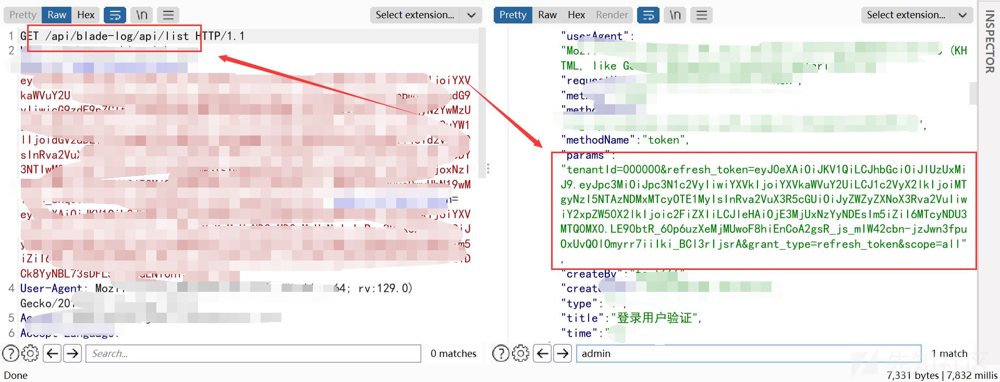

师傅们可以看到在这个log日志泄露里面找到了admin超级管理员的账户密码，这让人很是开心啊

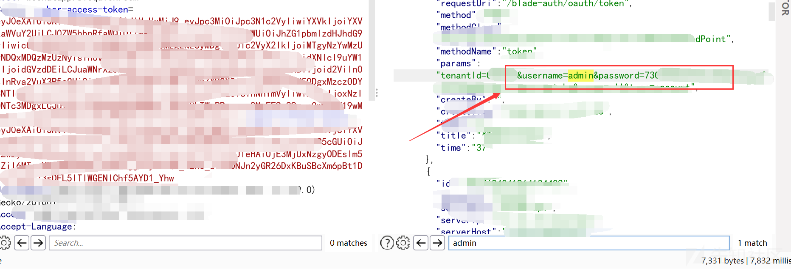

### 四、SQL注入漏洞

这里也是一样的，直接多去翻翻web界面的功能点，然后尽可能多的去分析这个接口，，然后去尝试接口拼接和修改，有些接口的1day可能多被魔改了，我这个站点就是一个经典的案例

公众号的1day的poc是下面的这个：

```
/api/blade-log/error/list?updatexml(1,concat(0x7e,version(),0x7e),1)=1
```

但是师傅们可以看到，我这里访问直接显示401未授权，那么像师傅们一般遇到这样的可能就放弃了，那么师傅们有没有想过这个接口魔改呢？可能是开发人员进行的一个魔改

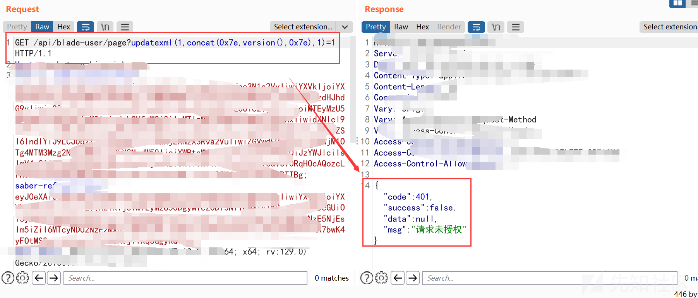

我这里就是花了很长的一个时间，进行挨个page?参数的后面进行拼接，然后得到的一个能够成功打sql注入漏洞打一个接口，很多公众号或者网上都没有公布，我这个算是一个新思路了

```
/api/blade-system/role/list?updatexml(1,concat(0x7e,version(),0x7e),1)=1
```

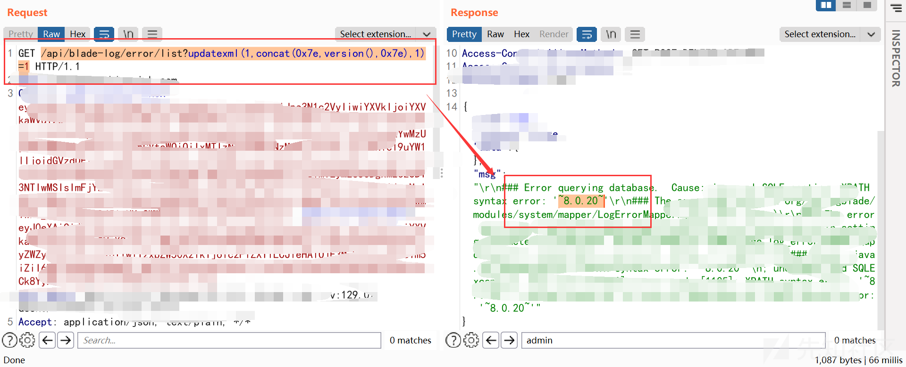

针对这个最新的blade魔改的sql注入漏洞的接口路径，很多文章和公众号都进行了打码，所以我这里给师傅们分析下。

下面也是给新手师傅一个福利了，给师傅们利用Nuclei写了一个批量检测sql注入漏洞的脚本：

```
id: template-id
info:
  name: Template Name
  author: xxxx
  severity: info
  description: description
  reference:
    - https://
  tags: tags
http:
  - raw:
      - |+
        GET /api/blade-system/role/list?updatexml(1,concat(0x7e,version(),0x7e),1)=1 HTTP/1.1
        Host: {{Hostname}}
        User-Agent: Mozilla/5.0 (Macintosh; Intel Mac OS X 10.15; rv:123.0) Gecko/20100101 Firefox/123.0
        Accept: text/html,application/xhtml+xml,application/xml;q=0.9,image/avif,image/webp,*/*;q=0.8
        Accept-Language: zh-CN,zh;q=0.8,zh-TW;q=0.7,zh-HK;q=0.5,en-US;q=0.3,en;q=0.2
        Accept-Encoding: gzip, deflate
        Upgrade-Insecure-Requests: 1
        Sec-Fetch-Dest: document
        Sec-Fetch-Mode: navigate
        Sec-Fetch-Site: none
        Sec-Fetch-User: ?1
        Te: trailers
        Connection: close
 
    matchers:
      - type: word
        part: body
        words:
          - 'XPATH syntax error:'
```

### 五、通过Navicat拿下MySQL数据库

上面不是通过未授权，然后拿下了admin超级管理员的账户密码嘛，那么这不进去利用一波，那多可惜啊，废话不多说直接上强度。

这里直接使用刚才拿到的账户密码进行一个登录

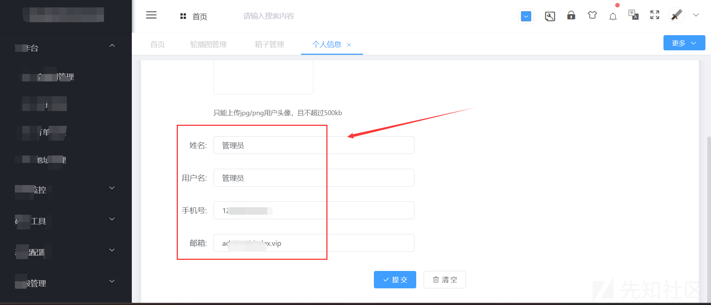

然后也是跟上面一样，多点点功能页面，看看超级管理员比普通用户的能够看到的信息多了哪些部分

然后在数据库管理里面看到了mysql、oracle、sqlserver等数据库服务

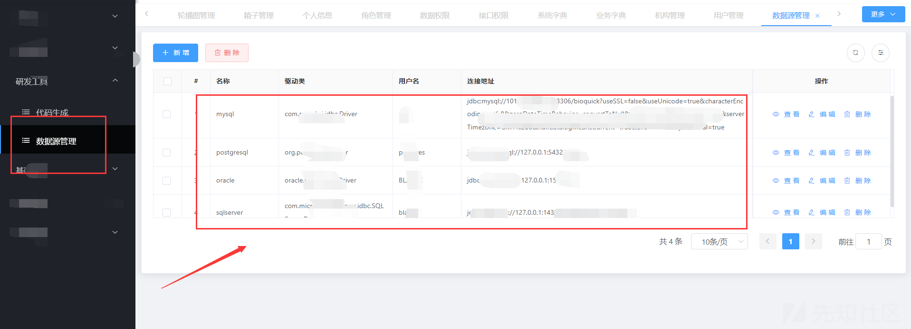

然后点击查看，直接看到了连接MySQL数据库的IP以及账户密码

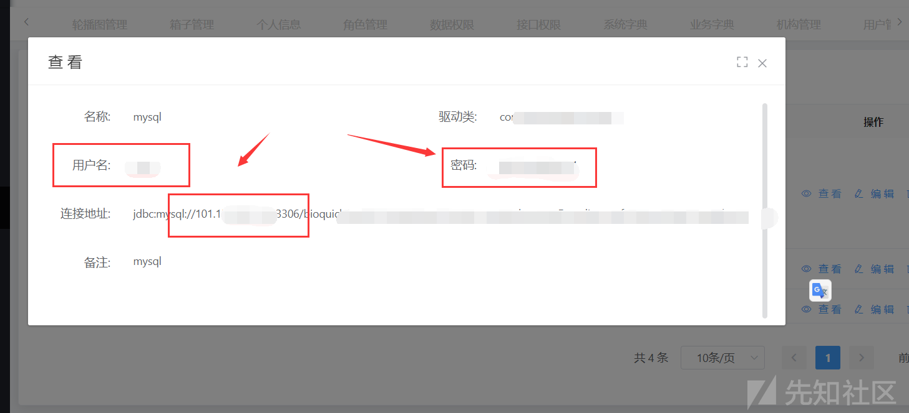

有了IP和MySQL数据库的账户密码了，那么我们就可以使用Navicat工具进行连接，看看能不能连接成功，然后拿下改数据库

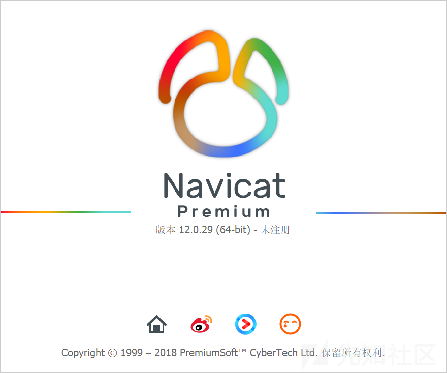

可以看到，直接测试连接成功了

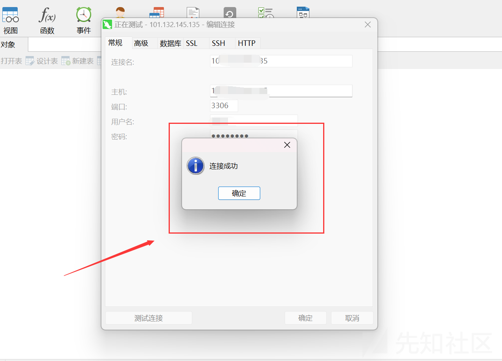

改站点的所以数据库用户的账户密码以后别的信息全部都接管成功了

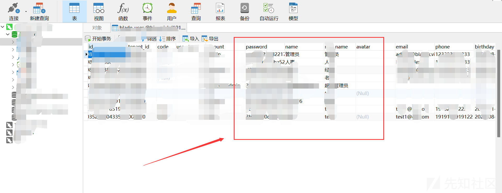

## 0x4 总结

这篇文章到这里就结束了，文章的思路写的很清晰，新手师傅们应该也是很有帮助的一篇文章了，这篇文章开始写的信息收集，针对于blade站点来讲很有帮助的，感兴趣blade站点的师傅们也是可以跟着我的思路去打一波。

这篇文章写了改站点的好几个漏洞，然后给师傅们演示了这个blade的打法，一步一步的渗透测试过程，很细节，也是一篇蛮不错的文章了哈！

希望这个文章，能够帮助到师傅们！

​

**文章中涉及的敏感信息均已做打码处理，文章仅做经验分享用途，切勿当真，未授权的攻击属于非法行为！文章中敏感信息均已做多层打码处理。传播、利用本文章所提供的信息而造成的任何直接或者间接的后果及损失，均由使用者本人负责，作者不为此承担任何责任，一旦造成后果请自行承担。**
