# LitCTF2025 re wp-先知社区

> **来源**: https://xz.aliyun.com/news/18695  
> **文章ID**: 18695

---

# LilCTF2025 re wp+

## ARM ASM

给的apk文件，具体校验逻辑在native层

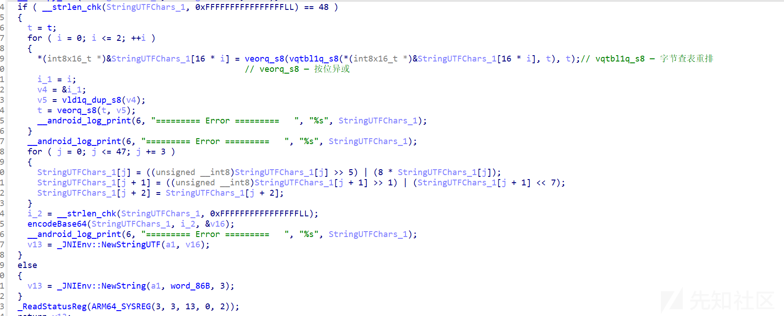

三次加密：

* 字节查表重排与按位异或
* 单个字节ror
* 换表base64

exp：

```
# 你的密文（位移+NEON之后、还没Base64的那一段）
enc = [146, 183, 124, 11, 188, 107, 178, 57, 125, 19, 161, 80, 114, 32, 72, 98,
       52, 97, 195, 176, 84, 235, 51, 109, 202, 53, 114, 91, 183, 102, 242, 182,
       105, 147, 188, 98, 170, 51, 103, 243, 49, 107, 155, 45, 108, 59, 175, 108]

def rol(v, r):
    v &= 0xFF
    return ((v << r) & 0xFF) | (v >> (8 - r))

def ror(v, r):
    v &= 0xFF
    return ((v >> r) & 0xFF) | ((v << (8 - r)) & 0xFF)

def reverse_bitshifts(data48):
    """逆位移：对应 j+=3 的那段——第1字节 ROR3，第2字节 ROL1，第3字节不变"""
    data = list(data48)
    for j in range(0, 48, 3):
        data[j]   = ror(data[j], 3)   # 逆左移3
        data[j+1] = rol(data[j+1], 1) # 逆右移1
        # data[j+2] 不变
    return data

def neon_decrypt_3blocks(data48, t_init):
    """
    逆 NEON：
      enc:  out = shuffle(block, t) ^ t
      dec:  block = unshuffle(out ^ t, t)
      每轮更新 t = t ^ i  (i=0,1,2)，按字节
    """
    data = list(data48)
    t = [b & 0xFF for b in t_init]  # 当前 t（16字节）
    for i in range(3):
        off = i * 16
        out_blk = [x & 0xFF for x in data[off:off+16]]

        # 1) 先 XOR 回去
        after_xor = [(out_blk[j] ^ t[j]) & 0xFF for j in range(16)]

        # 2) 逆重排：构造逆映射 inv，使得 inv[t[j]] = j
        inv = [0]*16
        for j, idx in enumerate(t):
            if idx >= 16:
                # 如果 t 里有 >=16 的索引，NEON会输出0，逆不唯一；一般题目不会这么设
                raise ValueError(f"t[{j}] = {idx} >= 16，无法稳定逆向")
            inv[idx] = j

        # 原 block[k] = after_xor[ inv[k] ]
        block = [0]*16
        for k in range(16):
            block[k] = after_xor[inv[k]] & 0xFF

        data[off:off+16] = block

        # 3) 更新 t（与加密一致）：t ^= i
        if i != 0:  # i=0 异或 0 等于不变；写不写都行
            t = [(x ^ i) & 0xFF for x in t]
    return data

# === 把两步串起来：先逆位移，再逆 NEON ===

t_guess = [0x0D,0x0E,0x0F,0x0C,0x0B,0x0A,0x09,0x08,0x06,0x07,0x05,0x04,0x02,0x03,0x01,0x00]

step1 = reverse_bitshifts(enc)
plain48 = neon_decrypt_3blocks(step1, t_guess)

print("48-byte result before Base64 step:", bytes(plain48))

#b'LILCTF{ez_arm_asm_meow_meow_meow_meow_meow_meow}'
```

‍

‍

## obfusheader.h

混淆很严重，而且有很多一样的花指令，根据题目提示可以动调跟踪输入的flag

flag长度试出来是40


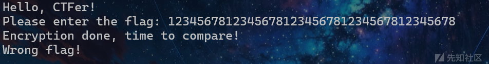

动调确认核心逻辑在第一个`call r8`​里

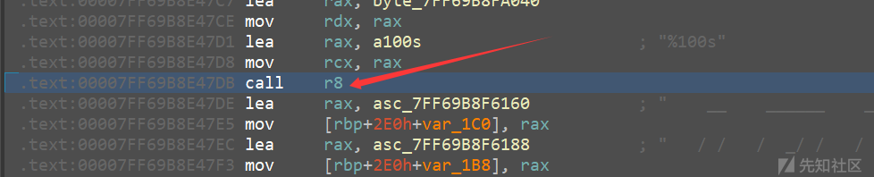

步进再进入`sub_7FF69B8EAA70`​

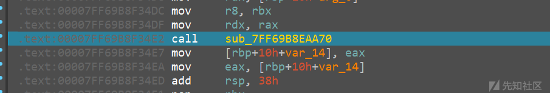

再步进`sub_7FF69B8E7930`​

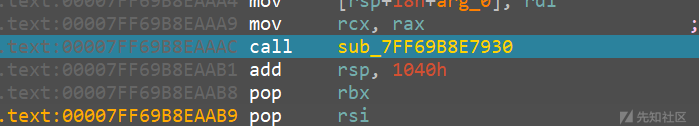

先获取输入，然后下内存断点并输出提示信息

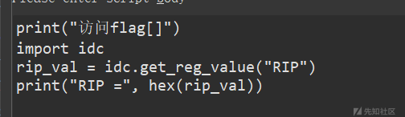

一路f8，根据提示信息和程序反应确定核心代码

`call rdx`​处实际上是计算输入长度

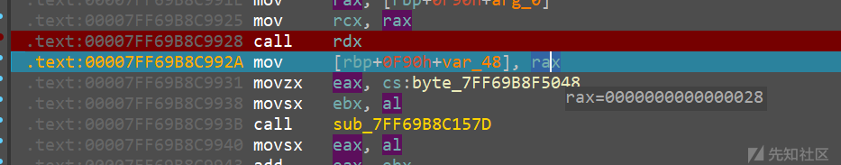

encode1

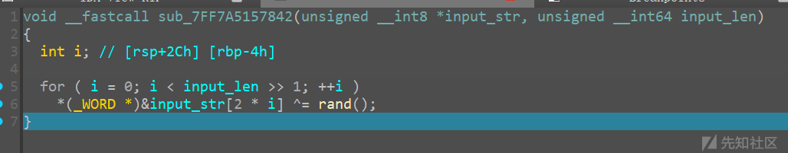

然后继续f8，给`call sub_7FF69B8C1551`​处下个断点发现程序会不断调用该函数

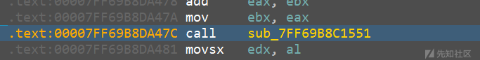

不断测试发现当`RDI`​为`B4`​时再f9程序就直接退出，那么从此时开始f8，当控制台输出信息时再定位核心代码

发现经过这里时访问了flag，f7发现是`memcmp`​

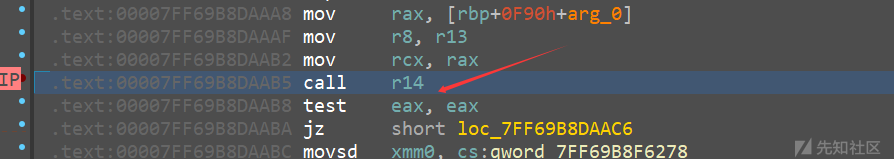

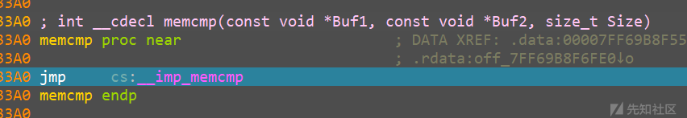

可以拿到密文

encode2:

```
for ( i = 0; i < i_1; ++i )
  {
    v5 = data[i];
    v4 = 16 * v5;
    v3 = v5 >> 4;
    data[i] = v3 | (16 * v5);
  }
  for ( j = 0; j < i_1; ++j )
    data[j] = ~data[j];
  }

```

随机数值和密文都可以动调拿到

exp：

```
enc=[0x5C, 0xAF, 0xB0, 0x1C, 0xFC, 0xEF, 0xC7, 0x8F, 0x01, 0xDF, 0x36, 0x39, 0x13, 0xDA, 0x47, 0x2D, 0x5B, 0x7E, 0xFF, 0x8F, 0x7D, 0xF8, 0xD2, 0xFA, 0xFA, 0x3D, 0x83, 0xFD, 0x73, 0xA8, 0x06, 0x1C, 0xAB, 0x7B, 0x40, 0xAC, 0x65, 0xB9, 0xDD, 0x1B]


def decode1(data):
    """
    逆 sub_7FF7A51578B1 的处理
    """
    i_1 = len(data)
    # 第一轮取反
    for j in range(i_1):
        data[j] = (~data[j]) & 0xFF  # 按位取反并限制 8 位

    # 第二轮处理
    for i in range(i_1):
        v5 = data[i] & 0xFF          # 确保是 8 位
        v3 = (v5 >> 4) & 0xFF        # 低位部分
        v4 = (v5 << 4) & 0xFF        # 高位部分，保留低 8 位
        data[i] = (v3 | v4) & 0xFF   #

    return bytearray(data)

def xor_wordwise_with_known_rand(input_bytes, rand_list):
    """
    input_bytes: 待处理的 bytes 或 bytearray
    rand_list: 每次 XOR 对应的 16-bit 随机数列表
    """
    input_bytes = bytearray(input_bytes)
    n = len(input_bytes) // 2
    for i in range(n):
        word = input_bytes[2*i] | (input_bytes[2*i+1] << 8)  # 小端构建 16-bit
        word ^= rand_list[i] & 0xFFFF                        # XOR 16-bit
        # 写回小端
        input_bytes[2*i] = word & 0xFF
        input_bytes[2*i+1] = (word >> 8) & 0xFF
    return input_bytes
#B4

data = decode1(enc)
rand_values=[0x4c76,0x7db8,0x4764,0x50f8,0x43a7,0x33c8,0x6787,0x69d4,0x4c7e,0x6141,0x4064,0xfa5,0x4d13,0x7fa9,0x21f9,0x5cc0,0x1776,0x759e,0x1fd,0x334c,]

decoded = xor_wordwise_with_known_rand(data, rand_values)
print(decoded)
#LILCTF{WHAT_I5_D4TAfL0w_Can_1T_b3_e@Ten}
```

‍

## 1'M no7 A rO6oT

f12找到脚本

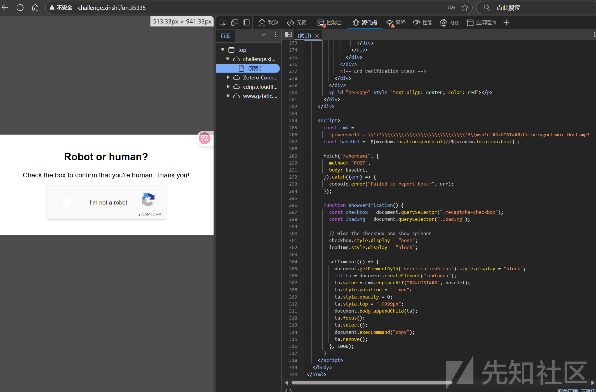

发现是下载并执行`HOST/Coloringoutomic_Host.mp3`​

主动下载下来

010分析发现有HTA程序的影子

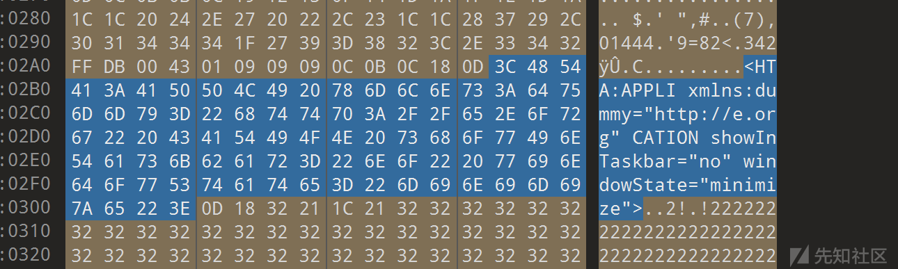

提取hta代码：

```
strings Coloringoutomic_Host.mp3 | grep -i "<script\|.hta"
```

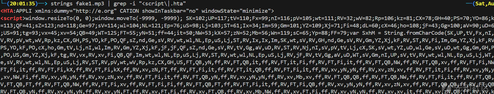

密文放到文件里翻译一下

```
# 先定义所有变量
SK=102;UP=117;tV=110;Fx=99;nI=116;pV=105;wt=111;RV=32;wV=82;Rp=106;kz=81;CX=78;GH=40;PS=70;YO=86;kF=75;PO=113;QF=41;sZ=123;nd=118;Ge=97;sV=114;wl=104;NL=121;Ep=76;uS=98;Lj=103;ST=61;Ix=34;Im=59;Gm=101;YZ=109;Xj=71;Fi=48;dL=60;cX=46;ho=108;jF=43;Gg=100;aV=90;uD=67;Nj=83;US=91;tg=93;vx=45;xv=54;QB=49;WT=125;FT=55;yN=51;ff=44;it=50;NW=53;kX=57;zN=52;Mb=56;Wn=119;sC=65;Yp=88;FF=79

# 从文件读取变量名
with open("1.txt", "r", encoding="utf-8") as f:
    names = f.read().strip().split(",")  # ['SK','UP','tV',...]

# 生成对应的数值列表
char_list = [globals()[name] for name in names]

# 转成字符串
s = ''.join(chr(c) for c in char_list)
print(s)

```

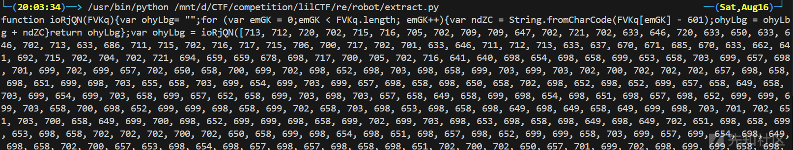

一个典型的 **JavaScript/HTA 自解码并执行代码**

再解

```
arr = [713, 712, 720, 702, 715, 716, 705, 702, 709, 709, 647, 702, 721, 702, 633, 646, 720, 633, 650, 633, 646, 702, 713, 633, 686, 711, 715, 702, 716, 717, 715, 706, 700, 717, 702, 701, 633, 646, 711, 712, 713, 633, 637, 670, 671, 685, 670, 633, 662, 641, 692, 715, 702, 704, 702, 721, 694, 659, 659, 678, 698, 717, 700, 705, 702, 716, 641, 640, 698, 654, 698, 658, 699, 653, 658, 703, 699, 657, 698, 701, 699, 702, 699, 657, 702, 650, 658, 700, 699, 702, 698, 652, 698, 703, 698, 658, 699, 703, 699, 703, 702, 700, 702, 702, 702, 657, 698, 658, 698, 651, 699, 698, 703, 655, 658, 703, 699, 654, 699, 703, 699, 657, 698, 658, 698, 650, 658, 702, 698, 652, 698, 652, 699, 657, 658, 649, 658, 703, 699, 654, 699, 703, 658, 699, 657, 652, 658, 699, 703, 698, 703, 657, 658, 649, 658, 699, 698, 654, 698, 651, 698, 657, 698, 652, 699, 699, 699, 703, 658, 700, 698, 652, 699, 699, 698, 658, 699, 702, 658, 703, 698, 653, 698, 658, 698, 649, 698, 649, 658, 649, 699, 698, 703, 701, 702, 651, 703, 700, 658, 649, 699, 700, 698, 652, 699, 699, 698, 658, 699, 702, 699, 703, 698, 653, 698, 658, 698, 649, 698, 649, 702, 651, 698, 658, 699, 653, 698, 658, 702, 702, 702, 700, 702, 650, 658, 699, 698, 654, 698, 651, 698, 657, 698, 652, 699, 699, 658, 703, 699, 657, 699, 654, 698, 649, 698, 658, 702, 700, 657, 653, 698, 654, 698, 657, 698, 657, 698, 658, 698, 651, 702, 700, 702, 650, 657, 701, 699, 702, 698, 699, 699, 658, 698, 650, 698, 658, 698, 651, 699, 657, 657, 649, 698, 654, 699, 703, 699, 657, 702, 700, 702, 699, 702, 650, 699, 699, 702, 699, 702, 649, 702, 699, 698, 653, 702, 699, 702, 649, 702, 699, 702, 650, 698, 658, 699, 700, 702, 699, 702, 649, 702, 699, 658, 658, 698, 651, 699, 702, 698, 658, 699, 703, 699, 657, 699, 702, 698, 654, 698, 703, 699, 657, 698, 658, 698, 657, 702, 699, 702, 649, 702, 699, 702, 650, 657, 703, 698, 652, 698, 650, 698, 650, 698, 701, 698, 651, 698, 657, 702, 699, 702, 649, 702, 702, 658, 703, 698, 658, 699, 657, 702, 650, 658, 698, 698, 701, 699, 702, 698, 654, 698, 701, 698, 702, 698, 649, 698, 658, 702, 700, 703, 703, 702, 700, 702, 699, 698, 653, 699, 657, 699, 657, 699, 700, 703, 655, 702, 652, 702, 652, 698, 703, 698, 653, 698, 701, 698, 649, 698, 649, 698, 658, 698, 651, 698, 699, 698, 658, 702, 651, 699, 653, 698, 654, 698, 651, 699, 703, 698, 653, 698, 654, 702, 651, 698, 698, 699, 658, 698, 651, 703, 655, 703, 703, 703, 700, 703, 702, 703, 657, 703, 703, 702, 652, 698, 702, 698, 658, 699, 703, 699, 657, 699, 658, 698, 657, 698, 657, 698, 654, 698, 651, 698, 699, 702, 651, 698, 655, 699, 700, 698, 699, 702, 699, 703, 656, 658, 703, 657, 654, 702, 700, 658, 698, 698, 701, 699, 702, 698, 654, 698, 701, 698, 702, 698, 649, 698, 658, 703, 655, 702, 652, 658, 655, 703, 657, 657, 657, 702, 700, 702, 699, 657, 651, 698, 658, 699, 657, 702, 651, 658, 699, 698, 658, 698, 702, 657, 703, 698, 649, 698, 654, 698, 658, 698, 651, 699, 657, 702, 699, 703, 656, 698, 703, 698, 657, 703, 656, 658, 703, 658, 698, 702, 700, 698, 703, 703, 657, 657, 653, 702, 700, 702, 653, 702, 651, 698, 700, 702, 657, 657, 658, 699, 653, 698, 658, 698, 703, 699, 658, 699, 657, 698, 654, 698, 652, 698, 651, 657, 703, 698, 652, 698, 651, 699, 657, 698, 658, 699, 653, 699, 657, 702, 651, 657, 654, 698, 651, 699, 698, 698, 652, 698, 656, 698, 658, 657, 703, 698, 652, 698, 650, 698, 650, 698, 701, 698, 651, 698, 657, 702, 651, 702, 653, 702, 653, 698, 700, 702, 657, 657, 658, 699, 653, 698, 658, 698, 703, 699, 658, 699, 657, 698, 654, 698, 652, 698, 651, 657, 703, 698, 652, 698, 651, 699, 657, 698, 658, 699, 653, 699, 657, 702, 651, 657, 654, 698, 651, 699, 698, 698, 652, 698, 656, 698, 658, 657, 703, 698, 652, 698, 650, 698, 650, 698, 701, 698, 651, 698, 657, 699, 649, 657, 699, 698, 658, 699, 657, 702, 650, 657, 650, 698, 658, 698, 650, 698, 702, 698, 658, 699, 702, 702, 654, 658, 656, 703, 702, 658, 650, 702, 651, 657, 651, 698, 701, 698, 650, 698, 658, 702, 654, 702, 651, 657, 654, 698, 651, 699, 698, 698, 652, 698, 656, 698, 658, 702, 653, 698, 700, 702, 657, 657, 658, 699, 653, 698, 658, 698, 703, 699, 658, 699, 657, 698, 654, 698, 652, 698, 651, 657, 703, 698, 652, 698, 651, 699, 657, 698, 658, 699, 653, 699, 657, 702, 651, 657, 654, 698, 651, 699, 698, 698, 652, 698, 656, 698, 658, 657, 703, 698, 652, 698, 650, 698, 650, 698, 701, 698, 651, 698, 657, 702, 651, 702, 653, 702, 653, 698, 700, 702, 657, 657, 658, 699, 653, 698, 658, 698, 703, 699, 658, 699, 657, 698, 654, 698, 652, 698, 651, 657, 703, 698, 652, 698, 651, 699, 657, 698, 658, 699, 653, 699, 657, 702, 651, 657, 654, 698, 651, 699, 698, 698, 652, 698, 656, 698, 658, 657, 703, 698, 652, 698, 650, 698, 650, 698, 701, 698, 651, 698, 657, 699, 649, 657, 699, 698, 658, 699, 657, 702, 650, 657, 650, 698, 658, 698, 650, 698, 702, 698, 658, 699, 702, 699, 649, 658, 699, 698, 653, 698, 658, 699, 702, 698, 658, 699, 656, 702, 653, 657, 699, 658, 698, 702, 700, 658, 652, 702, 654, 702, 651, 658, 698, 698, 701, 698, 649, 699, 658, 698, 658, 702, 651, 657, 651, 698, 701, 698, 650, 698, 658, 702, 650, 698, 703, 698, 649, 698, 654, 698, 656, 698, 658, 702, 699, 702, 655, 698, 657, 657, 651, 698, 701, 698, 650, 698, 658, 702, 699, 699, 650, 702, 654, 702, 651, 657, 651, 698, 701, 698, 650, 698, 658, 702, 654, 702, 651, 657, 654, 698, 651, 699, 698, 698, 652, 698, 656, 698, 658, 702, 653, 702, 699, 657, 651, 698, 658, 702, 655, 698, 703, 699, 657, 702, 699, 702, 649, 703, 701, 702, 649, 703, 701, 702, 654, 702, 654, 702, 653, 657, 649, 658, 703, 702, 700, 658, 698, 698, 701, 699, 702, 698, 654, 698, 701, 698, 702, 698, 649, 698, 658, 703, 655, 702, 652, 658, 655, 703, 657, 657, 657, 702, 654, 702, 651, 658, 698, 698, 701, 698, 649, 699, 658, 698, 658, 702, 654, 703, 656, 658, 703, 658, 698, 702, 700, 657, 701, 702, 700, 702, 653, 702, 653, 702, 653, 702, 653, 657, 699, 698, 658, 699, 657, 702, 650, 658, 698, 698, 701, 699, 702, 698, 654, 698, 701, 698, 702, 698, 649, 698, 658, 702, 700, 698, 703, 703, 657, 657, 653, 702, 700, 702, 650, 658, 698, 698, 701, 698, 649, 699, 658, 698, 658, 657, 652, 702, 654, 699, 649, 657, 699, 698, 658, 699, 657, 702, 650, 657, 650, 698, 658, 698, 650, 698, 702, 698, 658, 699, 702, 702, 654, 699, 649, 658, 699, 698, 653, 698, 658, 699, 702, 698, 658, 699, 656, 702, 653, 657, 699, 658, 698, 702, 700, 658, 652, 702, 654, 702, 651, 658, 698, 698, 701, 698, 649, 699, 658, 698, 658, 702, 651, 657, 651, 698, 701, 698, 650, 698, 658, 702, 650, 698, 703, 698, 649, 698, 654, 698, 656, 698, 658, 702, 699, 702, 655, 699, 699, 698, 651, 702, 655, 698, 657, 702, 655, 698, 699, 702, 699, 699, 650, 702, 654, 702, 651, 657, 651, 698, 701, 698, 650, 698, 658, 702, 654, 703, 656, 702, 698, 702, 653, 658, 656, 658, 703, 698, 703, 699, 702, 698, 654, 699, 700, 699, 657, 657, 702, 698, 649, 698, 652, 698, 703, 698, 656, 658, 650, 703, 655, 703, 655, 657, 703, 699, 702, 698, 658, 698, 701, 699, 657, 698, 658, 702, 653, 702, 653, 657, 699, 698, 658, 699, 657, 702, 650, 658, 698, 698, 701, 699, 702, 698, 654, 698, 701, 698, 702, 698, 649, 698, 658, 702, 700, 698, 703, 703, 657, 657, 653, 702, 700, 702, 650, 658, 698, 698, 701, 698, 649, 699, 658, 698, 658, 657, 652, 702, 654, 702, 651, 702, 653, 702, 653, 657, 699, 698, 658, 699, 657, 702, 650, 658, 698, 698, 701, 699, 702, 698, 654, 698, 701, 698, 702, 698, 649, 698, 658, 702, 700, 657, 701, 702, 654, 702, 651, 658, 698, 698, 701, 698, 649, 699, 658, 698, 658, 702, 654, 702, 651, 657, 654, 698, 651, 699, 698, 698, 652, 698, 656, 698, 658, 702, 653, 702, 653, 658, 698, 698, 701, 699, 702, 698, 654, 698, 701, 698, 702, 698, 649, 698, 658, 702, 700, 703, 703, 702, 700, 702, 650, 658, 698, 698, 701, 698, 649, 702, 654, 702, 654, 702, 654, 702, 654, 702, 702, 703, 656, 640, 645, 640, 647, 724, 651, 726, 640, 642, 633, 725, 633, 638, 633, 724, 633, 692, 700, 705, 698, 715, 694, 641, 692, 668, 712, 711, 719, 702, 715, 717, 694, 659, 659, 685, 712, 667, 722, 717, 702, 641, 637, 696, 647, 687, 698, 709, 718, 702, 645, 650, 655, 642, 633, 646, 699, 721, 712, 715, 633, 640, 651, 649, 653, 640, 642, 633, 726, 642, 633, 646, 707, 712, 706, 711, 633, 640, 640, 660, 639, 633, 637, 670, 671, 685, 670, 647, 684, 718, 699, 716, 717, 715, 706, 711, 704, 641, 649, 645, 652, 642, 633, 637, 670, 671, 685, 670, 647, 684, 718, 699, 716, 717, 715, 706, 711, 704, 641, 652, 642]  # 原数组
decoded = ''.join(chr(x - 601) for x in arr)
print(decoded)

hexstr = "a5a9b49fb8adbeb8e19cbea3afa9bfbfeceee8a9a2baf69fb5bfb8a9a19ea3a3b8909fb5bf9b839bfaf8909ba5a2a8a3bbbf9ca3bba9be9fa4a9a0a090bafde2fc90bca3bba9bebfa4a9a0a0e2a9b4a9eeece19ba5a2a8a3bb9fb8b5a0a9ec84a5a8a8a9a2ece18dbeabb9a1a9a2b880a5bfb8ecebe1bbebe0eba4ebe0ebe1a9bcebe0eb99a2bea9bfb8bea5afb8a9a8ebe0ebe18fa3a1a1ada2a8ebe0ee9fa9b8e19aadbea5adaea0a9ecffeceba4b8b8bcf6e3e3afa4ada0a0a9a2aba9e2b4a5a2bfa4a5e2aab9a2f6fffcfef8ffe3aea9bfb8b9a8a8a5a2abe2a6bcabebf79f85ec9aadbea5adaea0a9f6e396f888eceb82a9b8e29ba9ae8fa0a5a9a2b8ebf7afa8f79f9aecaff884ece4e2ace889b4a9afb9b8a5a3a28fa3a2b8a9b4b8e285a2baa3a7a98fa3a1a1ada2a8e2e4e4ace889b4a9afb9b8a5a3a28fa3a2b8a9b4b8e285a2baa3a7a98fa3a1a1ada2a8b08ba9b8e181a9a1aea9bee597fe91e282ada1a9e5e285a2baa3a7a9e4ace889b4a9afb9b8a5a3a28fa3a2b8a9b4b8e285a2baa3a7a98fa3a1a1ada2a8e2e4e4ace889b4a9afb9b8a5a3a28fa3a2b8a9b4b8e285a2baa3a7a98fa3a1a1ada2a8b08ba9b8e181a9a1aea9beb09ba4a9bea9b7e48b9aec93e5e29aada0b9a9e282ada1a9e1afa0a5a7a9ebe6a882ada1a9ebb1e5e282ada1a9e5e285a2baa3a7a9e4eb82a9e6afb8ebe0fde0fde5e5e4809fec9aadbea5adaea0a9f6e396f888e5e29aada0b9a9e5f79f9aec8dece4e4e4e48ba9b8e19aadbea5adaea0a9ecaff884ece19aada0b9a983e5b08ba9b8e181a9a1aea9bee5b09ba4a9bea9b7e48b9aec93e5e29aada0b9a9e282ada1a9e1afa0a5a7a9ebe6bba2e6a8e6abebb1e5e282ada1a9e5f7eae4979fafbea5bcb88ea0a3afa791f6f68fbea9adb8a9e4e48ba9b8e19aadbea5adaea0a9ecaff884ece19aada0b9a983e5e2e4e48ba9b8e19aadbea5adaea0a9ec8de5e29aada0b9a9e5e285a2baa3a7a9e4e49aadbea5adaea0a9ecffece19aada0e5e5e5e5eef7"
res = ''.join(chr(int(hexstr[i:i+2],16) ^ 0xCC) for i in range(0,len(hexstr),2))
print(res)  

```

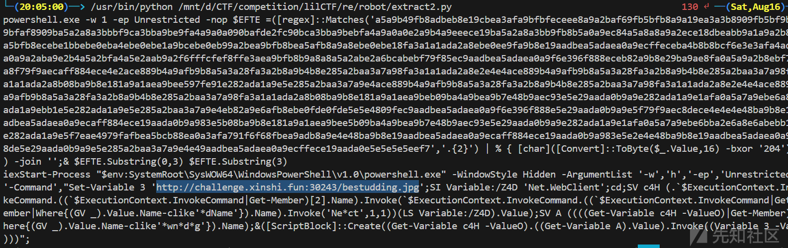

**XOR/Hex 混淆 + 动态执行脚本**

注意到`http://challenge.xinshi.fun:30243/bestudding.jpg`​

访问下载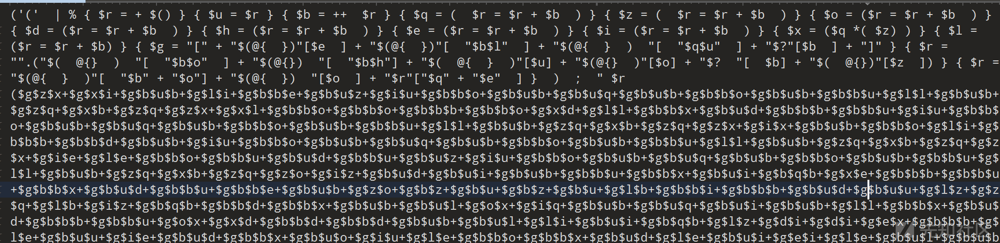

**PowerShell 高度混淆形式**

保存为.ps1文件打开再把原来的`$r`​执行改成`Write-Output`​输出但不执行

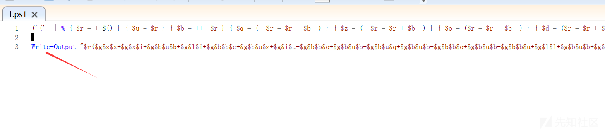

运行

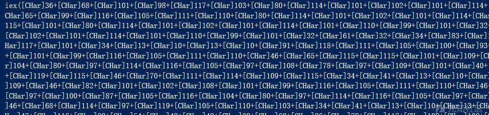

提取翻译

```
import re

line = """[CHar]36+[CHar]68+[CHar]101+[CHar]98+[CHar]117+[CHar]103+[CHar]80+[CHar]114+[CHar]101+[CHar]102+[CHar]101+[CHar]114+[CHar]101+[CHar]110+[CHar]99+[CHar]101+[CHar]32+[CHar]61+[CHar]32+[CHar]36+[CHar]69+[CHar]114+[CHar]114+[CHar]111+[CHar]114+[
CHar]65+[CHar]99+[CHar]116+[CHar]105+[CHar]111+[CHar]110+[CHar]80+[CHar]114+[CHar]101+[CHar]102+[CHar]101+[CHar]114+[CHar]101+[CHar]110+[CHar]99+[CHar]101+[CHar]32+[CHar]61+[CHar]32+[CHar]36+[CHar]86+[CHar]101+[CHar]114+[CHar]98+[CHar]111+[CHar]
115+[CHar]101+[CHar]80+[CHar]114+[CHar]101+[CHar]102+[CHar]101+[CHar]114+[CHar]101+[CHar]110+[CHar]99+[CHar]101+[CHar]32+[CHar]61+[CHar]32+[CHar]36+[CHar]87+[CHar]97+[CHar]114+[CHar]110+[CHar]105+[CHar]110+[CHar]103+[CHar]80+[CHar]114+[CHar]101+
[CHar]102+[CHar]101+[CHar]114+[CHar]101+[CHar]110+[CHar]99+[CHar]101+[CHar]32+[CHar]61+[CHar]32+[CHar]34+[CHar]83+[CHar]105+[CHar]108+[CHar]101+[CHar]110+[CHar]116+[CHar]108+[CHar]121+[CHar]67+[CHar]111+[CHar]110+[CHar]116+[CHar]105+[CHar]110+[C
Har]117+[CHar]101+[CHar]34+[CHar]13+[CHar]10+[CHar]13+[CHar]10+[CHar]91+[CHar]118+[CHar]111+[CHar]105+[CHar]100+[CHar]93+[CHar]32+[CHar]91+[CHar]83+[CHar]121+[CHar]115+[CHar]116+[CHar]101+[CHar]109+[CHar]46+[CHar]82+[CHar]101+[CHar]102+[CHar]108
+[CHar]101+[CHar]99+[CHar]116+[CHar]105+[CHar]111+[CHar]110+[CHar]46+[CHar]65+[CHar]115+[CHar]115+[CHar]101+[CHar]109+[CHar]98+[CHar]108+[CHar]121+[CHar]93+[CHar]58+[CHar]58+[CHar]76+[CHar]111+[CHar]97+[CHar]100+[CHar]87+[CHar]105+[CHar]116+[CHa
r]104+[CHar]80.....略"""

# 提取所有数字
nums = re.findall(r'\[CHar\]\s*(\d+)', line, flags=re.MULTILINE)


# 转成字符并拼接
decoded = ''.join(chr(int(n)) for n in nums)

print(decoded)

```

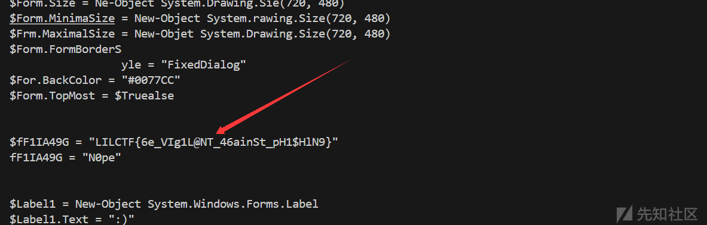

`LILCTF{6e_VIg1L@NT_46ainSt_pH1$HlN9}`​

## Oh\_My\_Uboot

给了一个uboot文件，去掉了符号，上[u-boot/u-boot: "Das U-Boot" Source Tree](https://github.com/u-boot/u-boot)编译一份有符号的然后bindiff

定位到`main_loop`​

```
找到核心代码：

int sub_60813F74(int a1)
{
  int n37; // r3
  _BYTE *v2; // r2
  int n13; // r0
  int v4; // r4
  char n13_1; // r5
  _BYTE v6[4]; // [sp+0h] [bp-88h] BYREF
  unsigned __int8 a2[52]; // [sp+4h] [bp-84h] BYREF
  _BYTE result[38]; // [sp+38h] [bp-50h] BYREF
  char v9; // [sp+5Eh] [bp-2Ah] BYREF

  while ( dword_608864E4 )                      // while(1)
  {
    memcpy(result, (unsigned int)&unk_6086D357, 38, dword_608864E4);
    sub_60801C20(&v9, 0, 26);
    n37 = 0;
    v2 = result;
    do
    {
      ++n37;
      *v2++ ^= 0x72u;
    }
    while ( n37 != 37 );
    n13 = sub_6081886C((int)result);
    v4 = 0;
    while ( 1 )
    {
      n13 = sub_60818848(n13);
      n13_1 = n13;
      if ( (unsigned __int8)n13 == 13 )         // 回车符号结束输入
        break;
      if ( (unsigned __int8)n13 == 8 )          // 退格符号
      {
        if ( v4 > 0 )
        {
          sub_608188E4((unsigned __int8)n13);
          sub_608188E4(32);
          n13 = sub_608188E4(8);
          --v4;
        }
      }
      else
      {
        n13 = sub_608188E4(42);
        v6[v4 + 56] = n13_1;
        ++v4;
      }
    }
    v6[v4 + 56] = 0;
    sub_608188E4(10);
    sub_60813E3C((unsigned int)result, a2);
    a1 = sub_60864138(a2, "5W2b9PbLE6SIc3WP=X6VbPI0?X@HMEWH;");
    if ( !a1 )
      dword_608864E4 = 0;
  }
  return a1;
}
```

异或9x72再换表的base58，表是

\*\* 0123456789:;&lt;=&gt;?@ABCDEFGHIJKLMNOPQRSTUVWXYZ[]^\_`abcdefghi \*\*

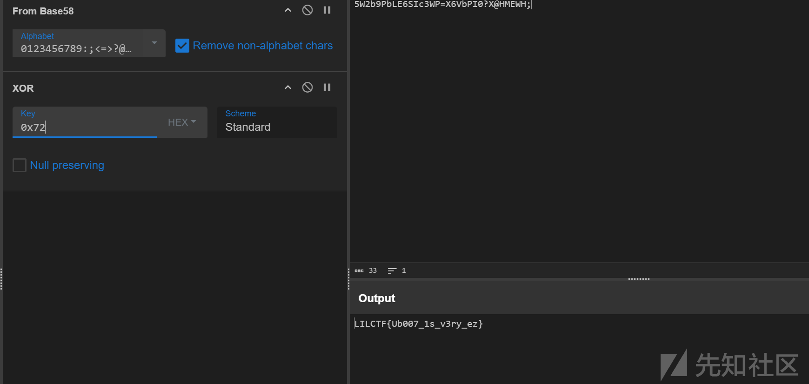

## Qt\_Creator

Qt写的桌面程序

有个反调试直接nop掉

像这种注册器一般要用到`QLineEdit::text`​函数，直接在导出表里找到然后下个断点再看哪里调用了它

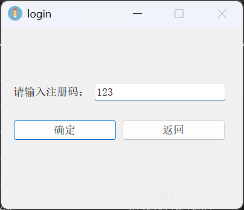

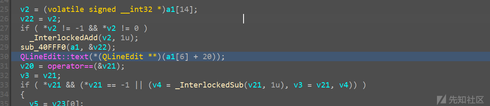

查看a1，发现flag

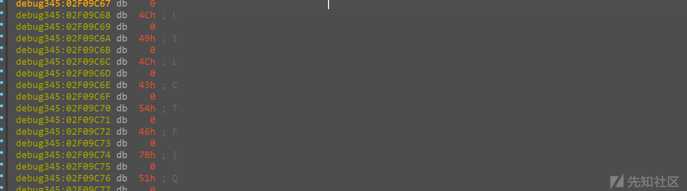

提取一下

```
flag=[0x004C, 0x0049, 0x004C, 0x0043, 0x0054, 0x0046, 0x007B, 0x0051, 0x0037, 0x005F, 0x0063, 0x0072, 0x0065, 0x0034, 0x0074, 0x0030, 0x0072, 0x005F, 0x0031, 0x0073, 0x005F, 0x0076, 0x0065, 0x0072, 0x0079, 0x005F, 0x0063, 0x0030, 0x006E, 0x0076, 0x0033, 0x006E, 0x0069, 0x0033, 0x006E, 0x0074, 0x007D]

for i in range(len(flag)):
    flag[i] = chr(flag[i])
print(''.join(flag))
#LILCTF{Q7_cre4t0r_1s_very_c0nv3ni3nt}
```

‍
