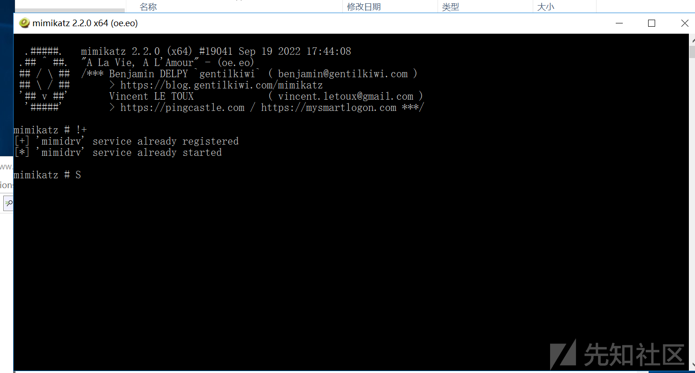
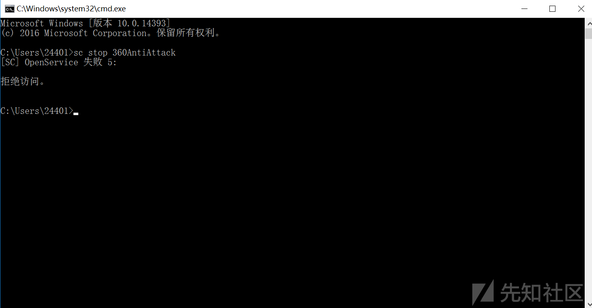
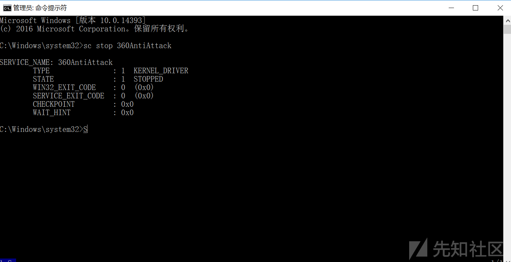
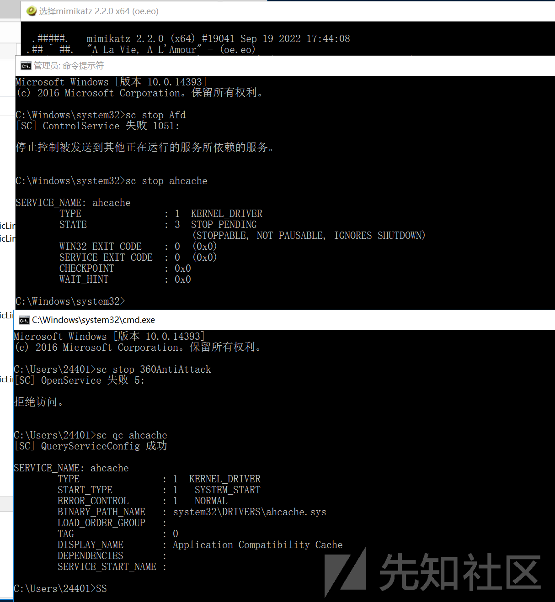
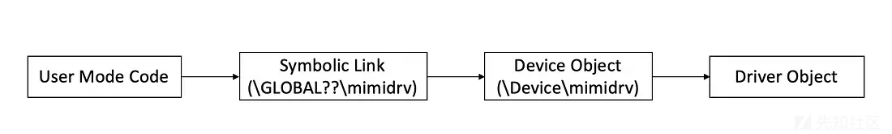
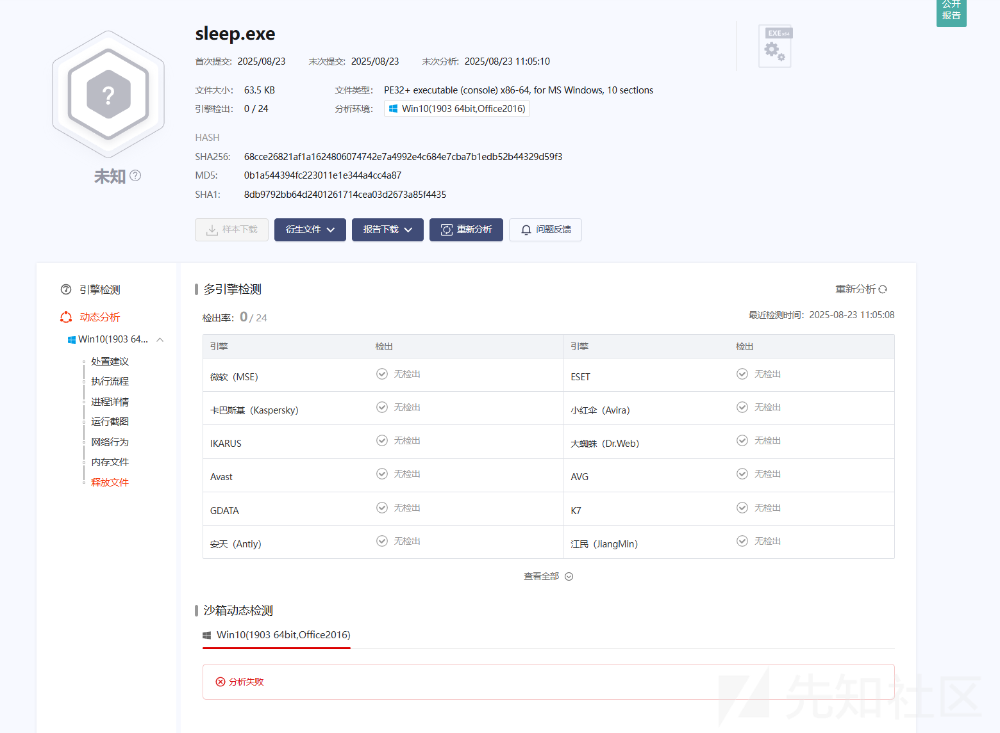
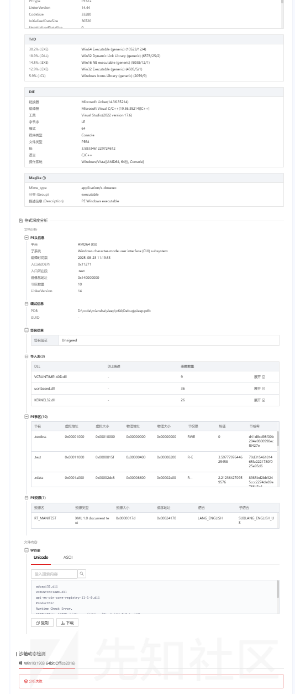
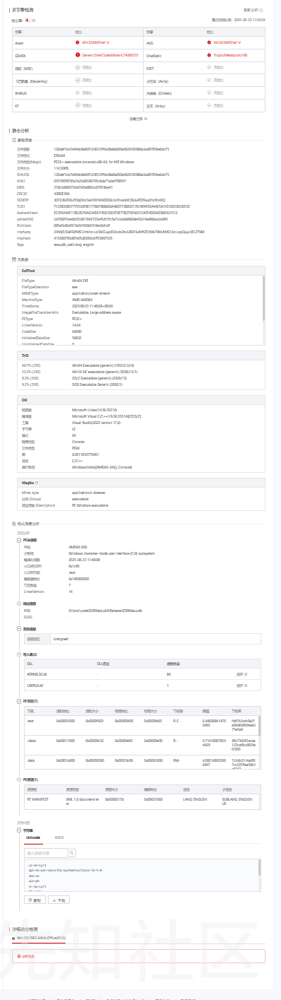

# EDR 技术原理防护机制解析-先知社区

> **来源**: https://xz.aliyun.com/news/18702  
> **文章ID**: 18702

---

# EDR

EDR核心为记录，收集和存储来自端点设备活动的大量数据，从而使安全专业人员可以识别潜在威胁，调查和补救任何潜在攻击。  
重要的是，EDR为安全团队提供了可视性，其中包含大量数据，可以对其进行分析以磨练恶意或异常行为，并检测端点保护技术遗漏的攻击。

### 基本概念

**进程（Process）**

可执行程序映像（Image）：这是进程的“蓝图”，包含了要执行的代码（.text段）和初始化的全局/静态数据（.data段）。它从磁盘上的可执行文件（如 `.exe`, `.elf`）加载到内存中。

私有虚拟地址空间（Private Virtual Address Space\*\*）\*\*：这是进程最核心的资源之一。它为进程提供了一个从 0 开始、连续且受保护的内存视图。一个进程中的线程无法直接访问另一个进程的地址空间，这提供了强大的内存保护和隔离性。

安全上下文（Security Context）：主令牌（Primary Token）：它标识了该进程的“用户身份”（用户ID、组ID、权限等）。当进程中的线程尝试访问受保护的资源（如一个文件或注册表项）时，系统会检查这个令牌来决定是否允许。

私有句柄表（Private Handle Table）：句柄是进程内部用来引用内核对象（如文件、线程、事件、信号量、互斥体、窗口等）的标识符。这个表是进程私有的，意味着一个进程不能直接使用另一个进程的句柄（除非通过继承或复制等特殊机制）。

系统资源：进程还可能拥有其他资源，如打开的设备、网络连接、窗口站（Window Station）等。

进程ID（PID）：内核分配给每个进程的唯一数字标识符，用于在系统范围内管理和识别它。

\*\*线程（Thread）-\*\*线程是动态的，是 CPU 调度的基本单位

执行上下文（Execution Context\*\*）\*\*：

1，CPU 寄存器状态：包括指令指针（EIP/RIP，指向下一条要执行的指令）、堆栈指针（ESP/RSP）等。线程被调度时，这些状态被加载到CPU；被换下时，这些状态被保存。

2，堆栈（Stack）：每个线程都有自己独立的堆栈，用于存储函数调用时的局部变量、返回地址等。这确保了线程可以独立地执行函数调用而不会相互干扰。

**共享资源访问**：一个进程中的所有线程**共享**该进程的所有资源（地址空间、句柄表、令牌等）。这使得线程间通信变得非常高效（只需读写共享内存即可），但也带来了同步问题（需要使用互斥锁、信号量等机制来协调对共享资源的访问）。

**线程ID（TID）**：内核也会为每个线程分配一个唯一的标识符。

**虚拟内存**

内存以页面为单位进行管理。页面的大小由CPU类型决定，在所有Windows 支持的体系结构里，普通页面大小是4KB。

虚拟内存中的每个页面处于如下三种状态之一：

1. 空闲 — 这个页面未被分配，没有任何东西存在，对其进行访问会引起访问违例异常。
2. 已提交 — 已提交的页面通常被映射到RAM 或者文件中。
3. 保留 — 页面未提交，进行新的内存分配时，如果没有指定特定地址的话，将不会在保留的地址范围进行分配。

用 “图书馆书架” 类比（空闲页 = 空书架，已提交页 = 放了书的书架，保留页 = 贴了 “暂不使用” 标签的书架），并在括号中补充术语（“已提交页：映射到 RAM / 文件，如程序加载到内存后，`.text`节对应页面为‘已提交’”）。

当CPU从一个进程（进程A）切换到另一个进程（进程B）时，操作系统会执行一个关键操作：切换CR3寄存器（在x86架构下）。CR3寄存器指向当前进程的页目录物理地址。  
同一个系统、同一内核、同一驱动为每个进程提供服务。所以，尽管进程切换了（CR3变了），但所有进程的页表对于系统空间部分的映射都是相同的

补丁 KPP（Kernel Patch Protection），即内核补丁保护，是微软在 64 位 Windows 系统中用于维护系统安全与稳定的关键机制，在系统防护和程序运行管理方面作用显著。KPP 的检查周期是随机的（1-5 分钟），而非固定时间，因此‘短时间内核修改后恢复’也可能被检测

1. **基本信息**：KPP 是 x64 版 Windows 特有的功能，于 2005 年随 Windows XP 和 Windows Server 2003 Service Pack 1 的 x64 版本首次推出，常被称为 PatchGuard。它主要用于阻止对 Windows 操作系统内核的非官方修改 ，因为这类修改可能降低系统安全性和可靠性。
2. **工作原理**：KPP 利用 PG（PatchGuard）技术，在 x64 系统内核中设置内核哨兵，定期检查内核中受保护的系统结构是否被修改。一旦检测到未经授权的修改，比如对内核代码、HAL 或 NDIS 内核库的修改，Windows 会启动错误检查机制，触发蓝屏（BSOD）并关闭系统，以此防止因内核篡改导致的系统不稳定和安全风险。

然而，微软赋予了 EDR 在 Windows 内核中以回调例程形式注册各种回调对象的能力。这使它们能够在用户空间执行各种任务，例如 API 钩子、遥测数据收集等。大多数 EDR 都包含用户空间和多个内核空间组件，例如过滤驱动程序。通过修改注册表键或一般操作禁用过滤驱动程序会对预防、检测和响应的质量产生严重后果。测试表明，即使 EDR 的用户空间组件处于活动状态，但如果过滤驱动程序的初始化被永久禁用，EDR 的重要功能将失效。例如，EDR 将不再能够以回调例程形式注册回调对象，实现用户空间 API 钩子，在端点捕获遥测数据，以及实现主机隔离、实时响应 Shell 或传感器恢复等 Web 控制台功能。

Patch Guard 会在不规则的时间间隔内来检查 Windows 内核中某些代码区域是否存在诸如挂钩之类的操作，在必要时通过蓝屏死机 (BSOD) 来阻止 Windows 的进一步执行。Patch Guard 也有Bypass 方法，但现在的杀软/EDR 一般不会通过漏洞来bypass，因为可能会导致蓝屏。

x86 是 Intel 主导的 CPU 架构（后被 AMD 等兼容）的统称，而 “32 位”“64 位” 是该架构下**指令集的位数**（决定 CPU 一次能处理的数据宽度、寻址能力等）

|  |  |  |
| --- | --- | --- |
| **维度** | **32 位 x86 下的 Ring3/Ring0** | **64 位 x86 下的 Ring3/Ring0** |
| **隔离强度** | 较弱，地址空间连续，易越界访问。 | 极强，地址空间隔离，需通过严格机制中转访问。 |
| **Ring0 进入难度** | 低，驱动签名要求宽松，易加载恶意驱动。 | 高，强制驱动签名，未签名驱动无法加载。 |
| **内核修改限制** | 无 KPP，可直接 Hook 内核（EDR / 恶意程序均可行）。 | 有 KPP，禁止非官方修改，Hook 内核需通过合法接口。 |
| **安全机制** | 简单，依赖基础特权级检查。 | 复杂，叠加 PTI、驱动签名、KPP 等多重防护。 |

32位中Microsoft 未严格区分用户态和内核态，**这两个区域的虚拟地址是 “连续映射” 到物理内存的，且未做严格的 “地址隔离”**。而64位而 Windows 是 “强制驱动签名”“PatchGuard”“分页表隔离” 等机制

直接调用：直接使用汇编指令将系统调用集成到我们的 POC（概念验证）中

厂商应对：实施了新的机制，如堆栈跟踪，以允许 EDR 判断系统调用是直接进行的（Direct System Call），还是通过合法的 Windows API 和本地 API 进行的。

为了实现进程间的隔离和保护，操作系统会为每个进程分配独立的地址空间。当进程切换时，操作系统会修改CR3寄存器的值，从而让CPU使用新的页目录表来完成虚拟地址的翻译。

* **用户空间（Ring 3，User Mode）**：运行普通应用程序、服务、子系统等，权限低（如 “无特权用户（Medium Integrity）”）。图中列举了常见组件：

* 应用程序：资源管理器（Explorer）、任务管理器、用户应用；
* 服务：如`Services.exe`（服务控制管理器）、`Svchost.exe`（承载多个系统服务的进程）、`Wmiprvse.exe`（WMI 服务进程）；
* 子系统：如 OS/2、POSIX 兼容子系统，以及 Windows 动态链接库（DLL）；
* 系统进程：如`LSASS.exe`（安全账户管理服务）、会话管理器、`Winlogon.exe`（登录进程）。这些组件通过`NTDLL.dll`（Windows 系统调用的底层封装库）与内核交互。

* **内核空间（Ring 0，Kernel Mode）**：运行操作系统核心组件（如 I/O 管理器、文件系统、配置管理器、进程 / 线程管理等），权限最高，可直接访问硬件和系统关键资源。

Windows Vista首先引入了PP（Protected Process）模型，当时进程要么受保护，要么不受保护。从Windows 8.1 / Server 2012 R2开始，微软引入了Protected Process Light (PPL)的概念。PPL实际上是对以前的受保护进程模型的扩展，并添加了"保护级别" 的概念。进程的保护级别由该进程PE文件的签名级别决定。受保护的进程级别总是大于 PPL 进程，其次高价值的签名者进程可以访问低价值的进程，但反之则不然。

edr通常会使用ppl（保护进程）来启动并保护其核心的用户空间组件，尤其是那些负责检测、监控或响应功能的关键进程，PPL 进程只能从 Windows 内核中终止

很久之前就有通过lsass的句柄中kill杀软

杀软/EDR 的保护级别一般是PsProtectedsignerAntimalware-Light。ntimalware专门为反恶意软件供应商预留的签名者级别

User、Administrator、System、TrustedInstaller这四种用户权限，其权限从左到右依次升高

Windows 用户空间中的组件和机制：

* 系统会话中的 EDR 进程（受保护进程）
* EDR 用户空间服务（受保护服务）
* EDR 注册表键/子键/值

内核

* EDR 回调对象/回调例程
* EDR 过滤驱动程序/微型过滤驱动程序

ppl标识，通常是0x31

0x1 代表 PS\_PROTECTED\_TYPE\_PROTECTED\_LIGHT，意味着启用 PPL 保护，0x30 等数值组合常和特定的签名者类别对应，0x3 表示 PS\_PROTECTED\_SIGNER\_ANTIMALWARE，二者结合的 0x31 则代表由反恶意软件签名的 PPL 进程。

驱动程序可以注册一个回调函数，该函数在系统上每次创建新进程时都会被调用。这些函数被注册并存储在一个名为 的数组中，该数组最多包含 64 个回调函数。使用 Windbg，Matt Hand 逐步解释了如何查看这个数组，以及如何根据 Mimidrv 源代码确定每个注册的回调函数解析到哪个驱动程序中的哪个函数。



运行!+,安装一个临时服务，以便获取更高权限（如内核级访问）。这里我已经创建过了，所以显示already，这个临时服务加载后仅在内存中运行，不会像普通服务那样在系统中注册持久化的服务项，依赖 Mimikatz 的上下文存在。  
Mimikatz 首先检查驱动程序是否存在于当前工作目录中，如果在磁盘上找到驱动程序，则开始创建服务。服务创建是通过服务管理器完成的。具体来说，用于注册具有以下的服务：

SC\_HANDLE CreateService(  
SC\_HANDLE hSCManager, // SCM数据库的句柄  
LPCWSTR lpServiceName, // 服务名称  
LPCWSTR lpDisplayName, // 服务显示名称  
DWORD dwDesiredAccess, // 期望的访问权限  
DWORD dwServiceType, // 服务类型  
DWORD dwStartType, // 启动类型  
DWORD dwErrorControl, // 错误控制级别  
LPCWSTR lpBinaryPathName, // 服务程序的路径  
LPCWSTR lpLoadOrderGroup, // 加载顺序组  
LPDWORD lpdwTagId, // 标签ID（与加载组配合使用）  
LPCWSTR lpDependencies, // 依赖的服务  
LPCWSTR lpServiceStartName,// 启动服务的账户  
LPCWSTR lpPassword // 账户密码  
);

在系统中注册一个名为`mimidrv`的内核驱动服务，指定其驱动文件路径为`C:\path o\mimidrv.sys`，并配置为系统启动时自动加载，运行在最高权限的系统账户下。





普通用户是无法关闭服务的

使用!+命令后，启动了mimidrv服务后



```
//这是mimikatz源代码中的kull_m_service.c里的函数，为 "Everyone"（所有人）用户组添加特定的服务访问权限。
BOOL kull_m_service_addWorldToSD(SC_HANDLE monHandle)
{
    BOOL status = FALSE;
    DWORD dwSizeNeeded;
    PSECURITY_DESCRIPTOR oldSd, newSd;
    SECURITY_DESCRIPTOR dummySdForXP;
    SID_IDENTIFIER_AUTHORITY SIDAuthWorld = SECURITY_WORLD_SID_AUTHORITY;
    EXPLICIT_ACCESS ForEveryOne = {
        SERVICE_QUERY_STATUS | SERVICE_QUERY_CONFIG | SERVICE_INTERROGATE | SERVICE_ENUMERATE_DEPENDENTS | SERVICE_PAUSE_CONTINUE | SERVICE_START | SERVICE_STOP | SERVICE_USER_DEFINED_CONTROL | READ_CONTROL,
        SET_ACCESS,
        NO_INHERITANCE,
        {NULL, NO_MULTIPLE_TRUSTEE, TRUSTEE_IS_SID, TRUSTEE_IS_WELL_KNOWN_GROUP, NULL}
    };
    if(!QueryServiceObjectSecurity(monHandle, DACL_SECURITY_INFORMATION, &dummySdForXP, 0, &dwSizeNeeded) && (GetLastError() == ERROR_INSUFFICIENT_BUFFER))
    {
        if(oldSd = (PSECURITY_DESCRIPTOR) LocalAlloc(LPTR, dwSizeNeeded))
        {
            if(QueryServiceObjectSecurity(monHandle, DACL_SECURITY_INFORMATION, oldSd, dwSizeNeeded, &dwSizeNeeded))
            {
                if(AllocateAndInitializeSid(&SIDAuthWorld, 1, SECURITY_WORLD_RID, 0, 0, 0, 0, 0, 0, 0, (PSID *)&ForEveryOne.Trustee.ptstrName))
                {
                    if(BuildSecurityDescriptor(NULL, NULL, 1, &ForEveryOne, 0, NULL, oldSd, &dwSizeNeeded, &newSd) == ERROR_SUCCESS)
                    {
                        status = SetServiceObjectSecurity(monHandle, DACL_SECURITY_INFORMATION, newSd);
                        LocalFree(newSd);
                    }
                    FreeSid(ForEveryOne.Trustee.ptstrName);
                }
            }
            LocalFree(oldSd);
        }
    }
    return status;
}
```



内核模式驱动程序必须至少创建一个设备对象，创建设备对象，需要调用函数并传递一些重要参数，该符号链接将由用户模式应用程序使用，例如通过调用和，代替“普通”文件向驱动程序发送数据并接收数据。

分解一下就是

1. **User Mode Code（用户模式代码）** 应用程序（比如 mimikatz.exe）通过 `CreateFile` / `DeviceIoControl` 这类 Win32 API 试图访问内核驱动。
2. **Symbolic Link（符号链接）** 用户模式无法直接访问 `\Device\mimidrv` 这样的命名空间。 因此驱动加载时会创建一个符号链接，比如：\GLOBAL??\mimidrv → \Device\mimidrv 用户模式代码只需要打开 `\\.\mimidrv` 就能间接访问。
3. **Device Object（设备对象）** 内核驱动在 `DriverEntry` 里调用 `IoCreateDevice` 创建 `\Device\mimidrv` 设备对象。 设备对象是驱动与用户模式交互的“端点”。 用户对设备发出的 IOCTL 请求会到达这里。
4. **Driver Object（驱动对象）** 当设备对象接收到 IO 请求时，会调用驱动对象中注册的分发例程（Dispatch Routines）。 例如 `IRP_MJ_DEVICE_CONTROL` → 驱动的 IOCTL 处理函数（比如 mimidrv 的内存读写逻辑）。

**用户模式代码 → 符号链接 → 设备对象 → 驱动对象 → 驱动例程执行**

**机器学习检测模块**

edr在文件写入磁盘，会读取文件到内存，进行pe解析，特征提取，比如节区，导入表，rich头等然后计算恶意概率分数

```
//这里举例pe头
sampleInfo->ntHead64 = peconv::get_nt_hdrs64(...);
sampleInfo->ntHead32 = peconv::get_nt_hdrs32(...);
sampleInfo->isX64 = peconv::is64bit(...);

//会进行dos头、签名，nt头，pe签名，架构，dll，内存对齐处理，入口点等判断处理

```

根据提取到的信息比如没有发现导入表，或者导入表的dll很多但是dll只有一个函数，区段数量异常，可执行区段过多，可写可执行内存， 区段大小异常，内存对齐问题，比较代码节大小与总 PE 文件大小

pe文件提取完成后如果没问题，分值正常就会通过，分值不正常，会进行沙盒分析

## **沙箱**

首先沙箱的搭建指令执行的 “硬件层”；设置段寄存器、栈 / 堆内存、PEB/TEB 结构（进程 / 线程环境块）等，模拟 Windows 进程的内存布局（如 PEB 存储模块列表、TEB 存储线程私有数据）。构建 LDR 链表（加载器模块链表），模拟 Windows 对已加载模块的管理 —— 程序调用`GetModuleHandle`“获取模块基地址”、`GetProcAddress`“查找函数地址” 时，需通过 LDR 链表读取模块信息，沙箱模拟这一结构可避免程序因 “找不到模块” 而崩溃。沙箱会模拟各种API，api越全，能运行的文件越多。对加了的壳的，会释放原始PE到text段并且执行,需要记录跨区段执行,执行的时候进行dump

在沙箱中会解析程序pe文件的导入表，将需要的dll和api映射到沙箱环境，对关键的api进行hook监控和记录这些调用，检测自修改代码就是加壳解壳，然后对程序的行为进行分析比如释放的文件，长时间静默就是sleep，敏感目录

### **初始化**

沙箱的核心价值之一是**隔离风险程序**（如恶意软件、未知程序），避免其对宿主系统造成破坏  
沙箱需通过 “虚拟执行引擎+ 模拟系统结构（如 PEB/TEB、LDR 链表）+ 定制化修复逻辑（如导入表修复、区段修复）” 构建独立的虚拟环境，才能满足安全分析、恶意软件检测、逆向工程等场景的需求。

引擎初始化：配置虚拟内存布局，包括映射程序镜像（`uc_mem_map`）、栈（`m_stackBase`）、堆（`m_heapBase`）和环境变量块（`m_envBlockBase`），模拟真实进程的内存空间  
系统结构模拟：构建 PEB（进程环境块）和 TEB（线程环境块），初始化 LDR（加载器数据）链表（`InitializeLdrData`、`AddModuleToLdr`），模拟 Windows 系统中进程对已加载模块（如 DLL）的管理机制。  
生成并写入环境变量块（`GetEnvString`），包含`PATH`、`TEMP`等常见系统环境变量，确保程序能读取到符合预期的系统配置。

解析导入表并加载模块，将程序中引用的外部函数地址替换为沙箱中模块的实际地址

|  |  |  |
| --- | --- | --- |
| **类型** | **64 位环境处理** | **32 位环境处理** |
| **PEB 初始化** | 初始化`X64PEB`结构体（如`ImageBaseAddress`设为主程序基地址，`ProcessHeap`设为沙箱堆地址），映射到`m_pebBase`，权限 “可读可写”。 | 初始化`X32PEB`结构体（同 64 位逻辑，字段为 32 位），映射到`m_pebBase`。 |
| **TEB 初始化** | 初始化`X64TEB`结构体（如`ClientId`设为当前进程 / 线程 ID，`StackBase`/`StackLimit`设为沙箱栈地址，`ProcessEnvironmentBlock`指向 PEB），映射到`m_tebBase`。 | 初始化`X32TEB`结构体（`NtTib.Self`指向 TEB 自身，`ExceptionList=0xFFFFFFFF`初始异常链表），映射到`m_tebBase`。 |
| **GS/FS 段** | 设置 GS 段寄存器索引为 2，通过 MSR（模型特定寄存器）`kIa32GsBase`将 GS 基址指向`m_gsBase`（存储 PEB/TEB 地址的结构）。 | 设置 FS 段寄存器索引为 3，通过 MSR`kIa32FsBase`将 FS 基址指向 TEB（32 位中 FS 通常关联 TEB）。 |
| **关键指针修正** | 无需额外修正（64 位结构初始化时已正确赋值）。 | 手动修正 TEB 关键偏移（如`0x18`处`SelfTeb`指向 TEB 自身，`0x30`处`ProcessEnvironmentBlock`指向 PEB），确保程序读取 TEB 时能获取正确信息。 |

### **回调**

会通过定制的cpu引擎进行回调，监控执行程序的行为，读取执行的指令地址（RIP/EIP）、栈指针（RSP/ESP）、累加器（RAX/EAX）等寄存器信息。

检测执行地址所在的程序区段（Section），若发生跨区段执行（且非初始区段），标记为可疑行为（`kSuspicious`）。

检测直接调用导入函数（Import Function）或导出函数（Export Function）的行为，并模拟 API 调用（`EmulateApi`）。

### 监控关键路径

**检查系统正常运行时间和空闲时间（规避虚拟机沙箱）**  
若程序访问的注册表路径包含这些敏感路径，将其标记为可疑。休眠行为过长

我在微步沙箱进行实验分别上传了无恶意睡眠程序，休眠敏感目录修改程序，休眠msf木马程序，动态监测都没有都分析失败







**规避代理分类检测和端点检测**

C2 通信常因 恶意域名”被检测 —— 网络层 ML（机器学习）系统会通过域名分类库标记恶意域名，端点设备也会拦截对黑名单域名的访问。而该技术的核心是 **“域名复用 + DNS 记录动态切换”**： 先让恶意软件关联的 C2 域名长期指向微软等公认合法域名，使该 C2 域名被网络代理、端点设备归类为 “可信域名”；待需要执行恶意操作时，再修改 DNS 的 A 记录（将域名解析指向恶意 C2 服务器），通过合法域名的 “信任身份” 传输恶意指令，规避检测。

**使用欺骗性证书进行代码签名**

微软对驱动证书的检测非常严格，我也是开启Windows的测试模式才可以继续进行下去，接下来开始学习驱动方面的

### **EDR 技术三大趋势（结合行业动态，量化预测）**

* **趋势 1：AI 行为链分析替代单一特征**引用 Gartner 报告（“2025 年 80% 的 EDR 将采用行为链模型”），举例说明：传统 EDR 对 “`RegSetValue`+`CreateProcess`” 的单一操作打分，而新模型会分析 “写注册表自启动→创建进程→连接境外 IP” 的行为链，即使每个操作单独 “合法”，链路上的异常关联（如 “普通进程连接敏感 IP”）仍会被标记，误报率降低 40%。
* **趋势 2：eBPF 替代传统驱动回调**解释 eBPF 的优势：无需加载驱动（规避 “驱动签名 + KPP” 限制），可直接在内核态挂钩系统调用（如`sys_enter_execve`），且对系统性能影响从 “传统驱动的 5%” 降至 “eBPF 的 1%”。预测 “2026 年主流 EDR 将全面支持 eBPF 监控”。

### **2. 基于 EDR 弱点的反制思路（合规探讨，非恶意利用）**

* **利用 PPL 保护级别漏洞**文中提到 EDR 的 PPL 级别是`PsProtectedSignerAntimalware-Light`，若通过合法手段（如获取`TrustedInstaller`权限）修改进程的 “签名级别”（将`0x31`改为更低的`0x21`），可降低其保护强度 —— 但需注意：此操作仅用于安全测试，未经授权属违规。
* \*\*思路 2：沙箱环境的 “硬件指纹欺骗”\*\*沙箱虽模拟 PEB/TEB，但难以完全模拟真实硬件（如 CPU 的`CPUID`指令返回值、硬盘序列号）。恶意程序可通过 “检测`CPUID`的虚拟机特征（如 VMware 的`0x80000001`标志）” 判断是否在沙箱，若检测到则不执行恶意行为 ——EDR 需通过 “动态硬件指纹生成” 优化沙箱（如每次模拟不同的`CPUID`值）。
