# 大模型安全落地-训练数据安全-先知社区

> **来源**: https://xz.aliyun.com/news/18705  
> **文章ID**: 18705

---

# 前言

随着人工智能大模型技术的迅猛发展，ChatGPT、文心一言、通义千问等产品已经深入到我们的日常生活和工作中。这些大模型在为人类社会带来便利的同时，也引发了一系列关于安全与伦理的深刻思考。大模型安全已经成为学术界、产业界乃至政府监管部门共同关注的焦点问题。

大模型安全不仅关乎技术本身，更关乎社会稳定、个人隐私和国家安全。从数据泄露、模型投毒到对抗样本攻击，再到模型部署后的安全漏洞，大模型在其全生命周期中面临着多方面的安全挑战。近年来，我们已经看到多起因大模型安全问题导致的事件，这些事件不仅造成了经济损失，还损害了用户信任，甚至引发了社会争议。

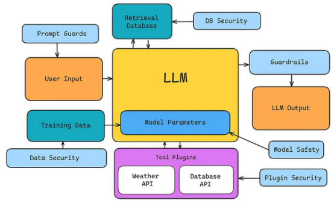

这篇文章我们将集中于训练数据安全这一维度，尝试尽可能系统性地探讨该维度的安全支撑技术及理论支撑。

​

# 训练数据安全

训练数据安全是大模型全生命周期安全的基础环节，它直接决定了模型的质量和安全性。在大模型训练过程中，数据安全问题主要表现在数据来源合规性、数据隐私保护、数据质量控制以及数据投毒防护等方面。

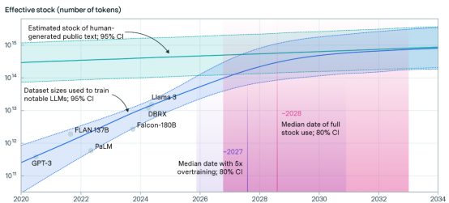

近年来，多起涉及训练数据的安全事件引发了广泛关注。某知名大模型被发现在训练数据中包含大量未经授权的版权内容，导致版权方提起诉讼；另有研究团队通过数据回溯技术，成功从公开API中提取出模型训练数据中的个人敏感信息，暴露了数据脱敏不彻底的风险。更为严重的是，有安全研究人员通过向公开数据集中注入恶意样本，成功使训练后的模型产生有害输出或后门行为。

训练数据安全是大模型安全的第一道防线，只有确保了训练数据的安全可靠，才能为后续的模型训练、部署和更新奠定坚实基础。随着大模型技术的不断发展，训练数据安全技术也将持续演进，为大模型的健康发展提供更加有力的保障。

​

## 数据清洗与预处理

训练数据质量是决定大模型性能和安全性的关键因素。在实际应用中，训练数据常常面临多种质量问题，包括格式不一致、标签错误、重复样本、噪声数据以及恶意构造的投毒样本。这些问题不仅会干扰模型的正常学习过程，降低模型的泛化能力，还可能引入安全隐患，如模型后门或偏见。

### 具体表现

1）格式不一致

训练数据来源多样，不同来源的数据可能采用不同的格式标准，导致模型难以有效学习。例如，日期格式可能有"YYYY-MM-DD"、"MM/DD/YYYY"等多种表示方式；文本数据可能存在编码不一致、大小写混用等问题。

2）标签错误

人工标注过程中难免出现错误，特别是在大规模数据集中。标签错误会直接误导模型学习错误的模式，降低模型准确性。研究表明，即使是高质量的公开数据集，标签错误率也可能达到3%-5%。

3）重复样本

数据集中的重复样本会导致模型对这些样本过度拟合，分配过多权重，从而影响整体性能。特别是当重复样本在训练集和测试集中同时出现时，会导致模型评估结果不可靠。

4）噪声数据

噪声数据包括异常值、不完整记录或不相关信息，这些数据会干扰模型对真实模式的学习。例如，图像数据中的光照变化、传感器噪声；文本数据中的拼写错误、语法错误等。

5）恶意构造样本

数据投毒攻击是一种针对机器学习系统的恶意攻击，攻击者通过向训练数据中注入精心设计的样本，使模型学习特定的后门行为。这类攻击隐蔽性强，难以检测，一旦成功，可能导致模型在特定条件下产生预设的错误输出。

接下来列出一些典型的安全策略。

​

### 自动化数据清洗工具

自动化数据清洗工具是大规模数据处理流程中的关键组件，广泛应用于数据预处理阶段，以保障数据的准确性、一致性和完整性。现代自动化清洗平台集成了多种算法与技术，主要涵盖重复检测、异常识别与低质量数据剔除等任务，具备高效、可扩展的处理能力。

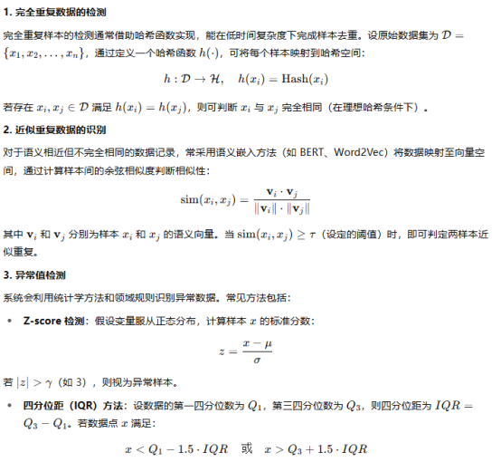

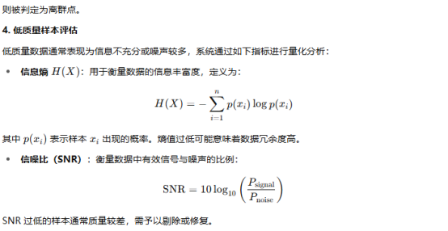

### 异常检测算法辅助识别投毒数据

在对抗性安全威胁日益严峻的背景下，数据投毒（Data Poisoning）已成为训练阶段模型安全性的关键风险来源。为了有效防范此类攻击，亟需引入精细化的异常检测算法，以辅助识别训练数据中的潜在投毒样本。异常检测技术通过建模正常样本的分布特征，捕捉分布偏移和结构异常，从而识别不一致或恶意注入的数据点。

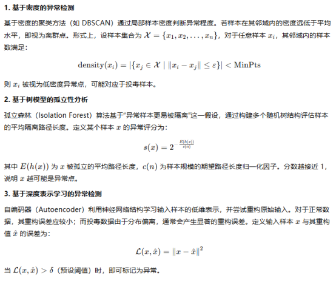

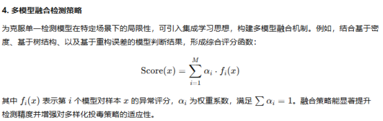

### 数据校验与标签一致性检查机制

高质量标签是监督学习模型构建的基础，而标签错误往往成为模型偏差与性能退化的主要诱因。在安全敏感场景中，尤其需要构建健全的标签一致性检查机制，以确保训练数据的可信性与有效性。针对该问题，系统性的数据校验策略应包括语义匹配分析、交叉一致性验证、主动学习驱动的复核机制。

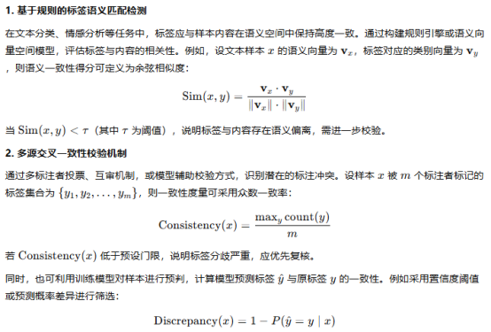

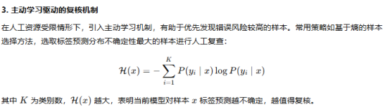

### 数据来源可信度评估

在大规模人工智能模型训练中，数据来源的可信性直接影响模型的泛化性能与安全稳健性。构建科学严谨的数据来源评估机制，是防范外部恶意投毒、数据污染及安全合规风险的关键环节。该机制应集成多维度信誉评分体系、数据溯源技术、沙箱隔离测试与动态风险响应策略，以形成可量化、可追踪、可审计的安全数据输入体系。

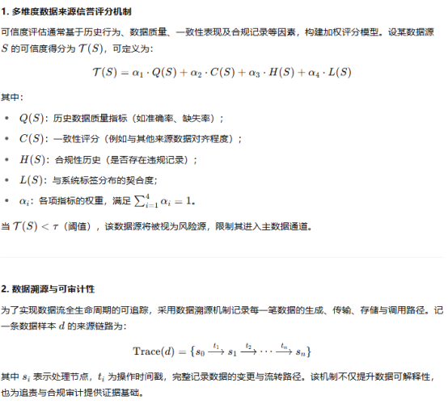

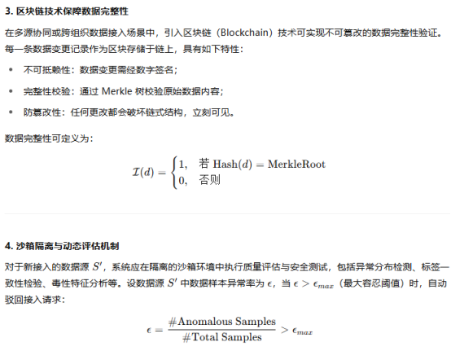

## 数据隐私保护

训练数据中可能包含用户隐私、敏感企业信息或受法律保护的数据（如医疗、金融数据）。未经处理的敏感数据在训练过程中可能被模型"记住"，存在信息泄露风险，违反GDPR等数据保护法规。

### 差分隐私（Differential Privacy）

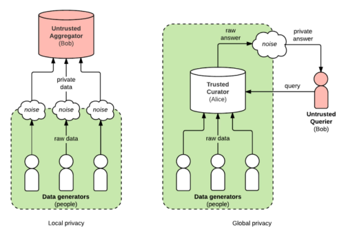

差分隐私是一种具有严格数学定义的隐私保护机制，其核心目标是在最大限度保留数据分析效用的同时，限制外部攻击者通过模型输出推测任一训练样本的存在与否。差分隐私通过引入噪声扰动，使得相邻数据集（即仅相差一个样本的数据集）在算法输出上的分布差异受到严格控制，从而提供个体级别的隐私保护。

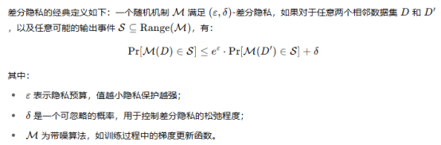

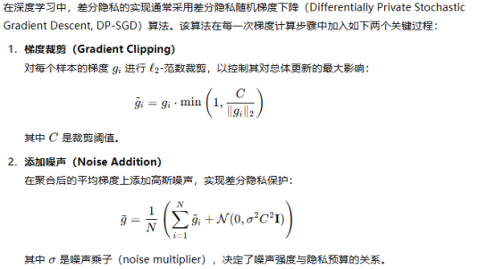

DP-SGD 能够有效限制单个训练样本对模型更新的影响，从而防止反向攻击者从模型参数中恢复或推测个体数据。

差分隐私的应用中需在保护强度与模型性能之间进行权衡。随着隐私预算ε 的减小（即隐私增强），所引入的噪声水平增加，可能导致模型准确率下降。因此，实际部署中应结合以下因素进行参数调优：数据的敏感性（如是否包含个人身份信息）；应用场景（医疗、金融等对隐私要求更高）；模型结构与训练集大小；可接受的效能损失范围。

通常，通过隐私会计器（如Moments Accountant）追踪训练过程中累计的 ε值，以确保最终模型的隐私合规性。

​

### 联邦学习（Federated Learning）

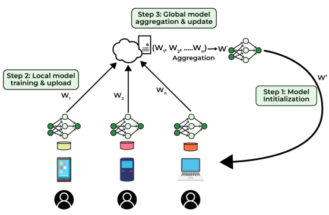

联邦学习FL是一种旨在解决数据孤岛和隐私泄露问题的分布式机器学习框架。与传统集中式训练范式不同，FL 遵循“数据不出本地、模型协同更新”的设计理念，即参与方在本地训练模型后，仅上传模型更新（如梯度或权重）至中心服务器进行聚合，从而在保障数据主权和隐私的同时实现跨组织的联合建模。

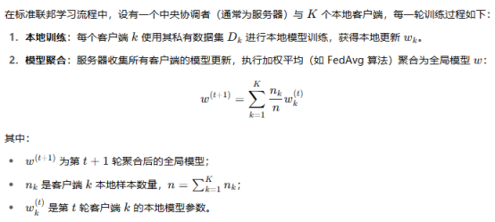

该方式在不泄露任何原始数据的前提下，实现了多个参与方之间的高效协同建模。

​

联邦学习天然适用于跨地域、跨机构的敏感数据合作场景，特别是在医疗、金融、政务等领域。例如在多中心医疗研究中，医院可在本地对电子病历数据进行模型训练，仅共享加密后的参数，有效避免了原始数据的流转和合规风险。

为进一步强化模型参数传输过程中的隐私保护，联邦学习常与以下安全技术协同应用：

1)安全多方计算（Secure Multi-party Computation, SMPC）：确保在参数聚合过程中，服务器无法获取任何单个客户端的具体更新值；

2)同态加密（Homomorphic Encryption, HE）：使得服务器可以在加密状态下完成聚合操作，无需解密任何客户端上传的模型更新；

3)差分隐私（Differential Privacy, DP）：在客户端或服务器端对模型更新注入噪声，从而限制单个数据样本对全局模型的影响。

​

### 数据脱敏与匿名化处理

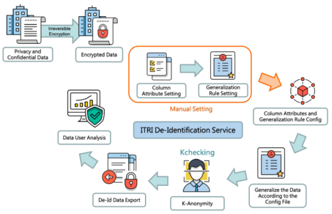

数据脱敏（Data De-identification）是人工智能系统中隐私保护的基础性技术手段，旨在通过对敏感属性的识别与处理，降低原始数据在存储、传输及建模过程中的泄露风险。其核心目标在于：在保障隐私的同时最大限度保留数据效用，以支持后续机器学习任务。

在实践中，常见的数据脱敏技术包括：

1)数据屏蔽（Masking）：对敏感信息的局部进行掩码处理，如信用卡号 “1234-5678-9012-3456” 被处理为 “--\*\*\*\*-3456”；

2)数据替换（Substitution）：使用与原值格式一致但无实际意义的伪造值代替敏感信息（如姓名、地址）；

3)数据泛化（Generalization）：将高精度属性转换为低精度范围，例如将“1987-09-23”泛化为“1980s”；

4)扰动（Perturbation）：对数值数据添加噪声，确保统计性质不变但个体不可识别。

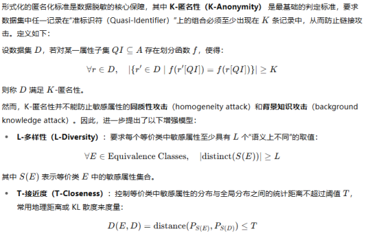

为了确保脱敏处理的持续有效性，建议引入周期性评估机制，结合重识别风险建模与差分隐私分析等手段，动态适配攻击技术的发展。特别是在数据用于大模型训练前，应在数据接入前完成全流程脱敏处理，确保下游模型不会无意中泄露个人隐私信息。

​

## 数据均衡与偏倚控制

训练数据中的类别不均衡或代表性不足，可能导致模型在特定群体、语言、地域或场景下表现异常。除影响公平性外，这种偏倚也可能被攻击者利用来实施规避攻击。典型的安全策略如下。

​

### 过采样/欠采样策略

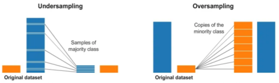

过采样通过人为增加训练集中少数类样本（Minority Class）数量，使得其在损失函数中的权重得以提升。设训练集中类别分布为：

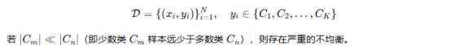

最直接的过采样方式是重复采样（Random Oversampling），即多次复制少数类样本以达到样本数量平衡，虽能提高召回率，但会加剧过拟合风险。

​

为缓解此问题，合成少数类过采样技术（SMOTE, Synthetic Minority Over-sampling Technique）通过在特征空间中插值生成新的样本点。设某少数类样本为 x，其一个邻近样本为 x ’，则合成样本 x 由以下公式生成：

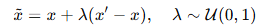

该方法显著提升了模型对边界区域的识别能力，减少了对训练集中已有样本的依赖。

​

欠采样通过减少多数类样本数量来实现类别平衡，从而缩小数据量主导带来的偏差。最常用的方法为随机欠采样（Random Undersampling），即从多数类中随机删除部分样本。但此方法可能导致信息丢失，尤其在样本数量较小时效果不稳定。

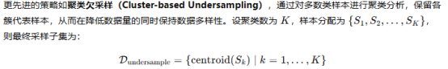

在实际应用中，过采样与欠采样策略通常联合使用，形成混合采样（Hybrid Sampling）机制，以兼顾信息保留与类别平衡的双重目标。例如，先进行少量欠采样剔除冗余多数类样本，再通过SMOTE扩展少数类样本，从而在模型性能与稳定性之间实现折中。

对于大规模预训练模型或多任务学习场景，采样策略的设计不仅应关注标签类别分布，还需考虑语言、地域、性别、文化背景、文本风格等多维异质性因素。不均衡的训练数据在这些维度上可能引发模型偏见（Bias）与表示能力退化（Representation Collapse），影响模型在多元群体间的泛化能力与公平性。

​

### 再加权（Re-weighting）技术

再加权技术是一种在损失函数层面进行偏倚控制的有效方法，通过动态调整不同样本在模型训练中的权重（weight），以平衡各类别样本对模型学习的影响。与传统的数据采样方法不同，再加权策略保留了所有训练样本，避免了因样本删除或过采样而导致的信息丢失，同时能够更加精细地控制各类别样本在模型训练中的贡献度。通过调整权重，模型可以更加关注少数类或难分类样本，从而在类别不平衡或复杂任务中提升其性能与公平性。

再加权的基本思路是，在训练过程中根据样本的类别、难易度或质量调整其在损失函数中的权重。设损失函数为：

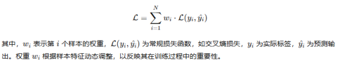

如下是一些常见的再加权策略

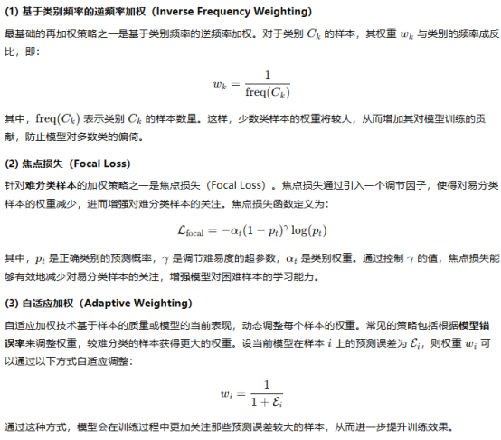

3）多维度数据分析

多维度数据分析旨在通过全面的数据特征标注、交叉分析和针对性的数据增强，识别并修正训练数据中的潜在偏倚。这一过程对于确保大规模人工智能模型的公平性、鲁棒性和准确性至关重要。

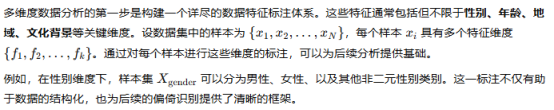

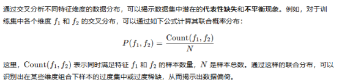

此外，数据可视化工具（如分布热图、相关性矩阵等）能够帮助直观呈现这些数据分布的偏差。例如，相关性矩阵可以揭示不同特征之间的关联性，帮助判断是否存在某些特征的过度偏倚或冗余。通过这些分析方法，可以及时发现数据中潜在的偏倚现象。

# 总结

在当前大模型技术飞速发展的浪潮中，训练数据作为模型的基石，其安全问题的重要性愈发凸显。本文探讨了大型模型训练数据安全在实际应用中的安全落地与理论。我们分析了数据投毒、隐私泄露、偏见传播等核心风险如何通过训练数据渗透并影响模型，并重点梳理了一系列行之有效的方法与理论。

从数据源头的负责任采集与筛选，到训练前的数据清洗、脱敏与增强，再到利用隐私计算（如差分隐私、联邦学习）在保护用户隐私的前提下进行模型训练，以及建立健全的数据治理流程和安全审计机制，这些技术和管理措施共同构筑了训练数据的安全防线。通过将这些安全策略无缝集成到现有的MLOps（机器学习运维）流程中，并根据实际业务场景和数据特点进行定制化实施，是确保大模型安全的关键。

​

​

# 参考

1. <https://epoch.ai/blog/will-we-run-out-of-data-limits-of-llm-scaling-based-on-human-generated-data>

2. <https://ssahuupgrad-93226.medium.com/the-comprehensive-llm-safety-guide-ai-regulations-and-best-practices-3be015c00a40>

3. <https://www.geeksforgeeks.org/data-preprocessing-in-data-mining/>

4. <https://research.aimultiple.com/differential-privacy/>

5. <https://www.geeksforgeeks.org/collaborative-learning-federated-learning/>

6. <https://www.itri.org.tw/english/ListStyle.aspx?DisplayStyle=01_content&SiteID=1&MmmID=1071732317110137476&MGID=1126040702736263102>

7. <https://medium.com/analytics-vidhya/undersampling-and-oversampling-an-old-and-a-new-approach-4f984a0e8392>

​

​
