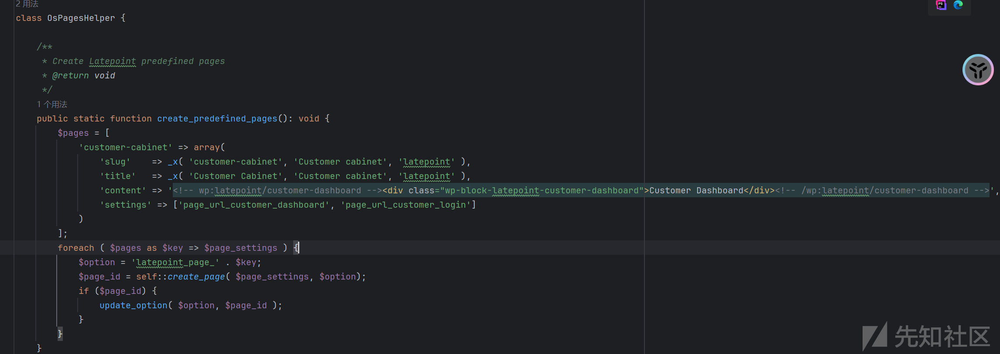
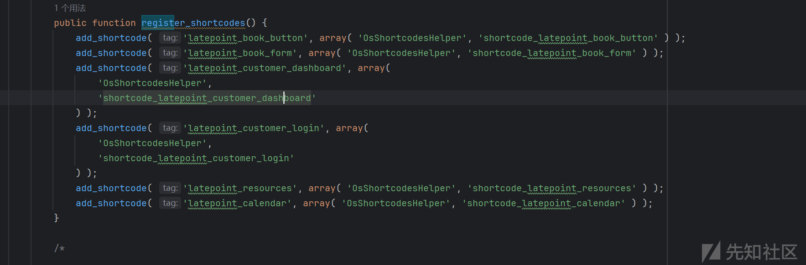
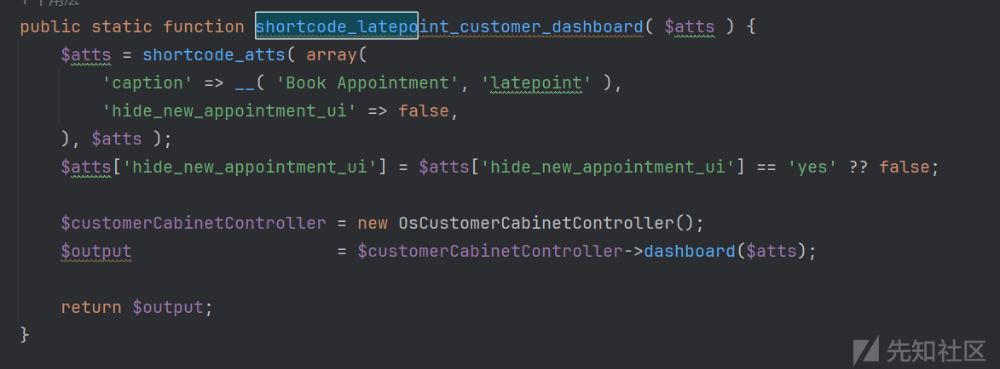
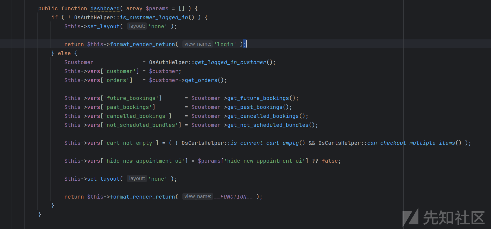
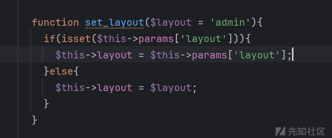
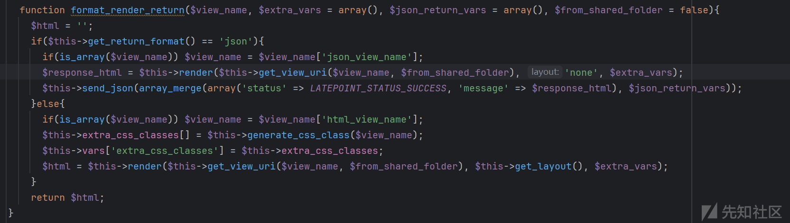
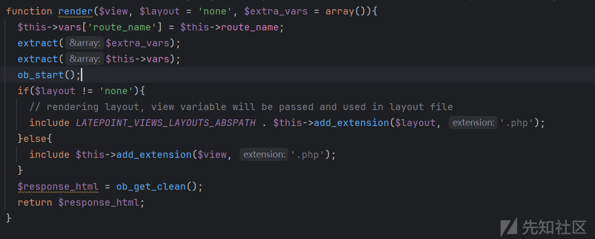

# CVE-2025-6715 WordPress Latepoint 文件包含漏洞分析-先知社区

> **来源**: https://xz.aliyun.com/news/18711  
> **文章ID**: 18711

---

# 漏洞描述

LatePoint WordPress 插件通过其布局参数包含本地文件包含漏洞。这种安全漏洞使攻击者能够直接在服务器上包含和执行 PHP 文件，从而可能允许在这些文件中执行恶意代码。

# 影响版本

Latepoint < 5.1.94

# 分析

## 漏洞成因

### 1.渲染入口（pages\_helper.php）

在lib/helpers/pages\_helper.php中主要去找到执行的地方

  
`​`

```
public static function create_predefined_pages(): void {
    $pages = [
       'customer-cabinet' => array(
          'slug'    => _x( 'customer-cabinet', 'Customer cabinet', 'latepoint' ),
          'title'   => _x( 'Customer Cabinet', 'Customer cabinet', 'latepoint' ),
          'content' => '<!-- wp:latepoint/customer-dashboard --><div class="wp-block-latepoint-customer-dashboard">Customer Dashboard</div><!-- /wp:latepoint/customer-dashboard -->',
          'settings' => ['page_url_customer_dashboard', 'page_url_customer_login']
       )
    ];
    foreach ( $pages as $key => $page_settings ) {
       $option = 'latepoint_page_' . $key;
       $page_id = self::create_page( $page_settings, $option);
       if ($page_id) {
          update_option( $option, $page_id );
       }
    }
}
```

这里定义了一个名为$ pages的数组，内容：

customer-cabinet：是这个页面的内部表示符；

slug：页面的URL别名，显示在网址中的；

title：页面的标题；

content：页面的内容，他在这里是渲染一个由LatePoint插件提供的，名为customer-dashboard的自定义块。

### 2.注册指令 指令注册 (latepoint.php)

使用跟踪在latepoint.php中找到了这个自定义块



```
public function register_shortcodes() {
    add_shortcode( 'latepoint_book_button', array( 'OsShortcodesHelper', 'shortcode_latepoint_book_button' ) );
    add_shortcode( 'latepoint_book_form', array( 'OsShortcodesHelper', 'shortcode_latepoint_book_form' ) );
    add_shortcode( 'latepoint_customer_dashboard', array(
       'OsShortcodesHelper',
       'shortcode_latepoint_customer_dashboard'
    ) );
    add_shortcode( 'latepoint_customer_login', array(
       'OsShortcodesHelper',
       'shortcode_latepoint_customer_login'
    ) );
    add_shortcode( 'latepoint_resources', array( 'OsShortcodesHelper', 'shortcode_latepoint_resources' ) );
    add_shortcode( 'latepoint_calendar', array( 'OsShortcodesHelper', 'shortcode_latepoint_calendar' ) );
}
```

定义一个**register\_shortcodes**的公共方法，这个方法会被插件的主程序调用，用来集中注册所有的短代码，而下面是调用wordpress的核心函数**add\_shortcode**，**latepoint\_customer\_dashboard**：这是短代码的名称，告诉wordpress要监听的关键词是**latepoint\_customer\_dashboard**。

```
array(
    'OsShortcodesHelper',
    'shortcode_latepoint_customer_dashboard'
)
```

这段是回调函数，它告诉wordpress，当监听到关键词时，需要执行的操作是：找到名为**OsShortcodesHelper**的类，并调用该类中名为**shortcode\_latepoint\_customer\_dashboard**的方法。

总结：建立了一个映射关系，当worepress在页面内容中遇到**latepoint\_customer\_dashboard**这个文本时去执行**OsShortcodesHelper**类中的**shortcode\_latepoint\_customer\_dashboard**函数，

### 3.触发与调用 (shortcodes\_helper.php)

继续追踪函数**shortcode\_latepoint\_customer\_dashboard**在lib/helpers/shortcodes\_helper.php  


```
public static function shortcode_latepoint_customer_dashboard( $atts ) {
    $atts = shortcode_atts( array(
       'caption' => __( 'Book Appointment', 'latepoint' ),
       'hide_new_appointment_ui' => false,
    ), $atts );
    $atts['hide_new_appointment_ui'] = $atts['hide_new_appointment_ui'] == 'yes' ?? false;

    $customerCabinetController = new OsCustomerCabinetController();
    $output                    = $customerCabinetController->dashboard($atts);

    return $output;
}
```

`shortcode_latepoint_customer_dashboard($atts)`

定义add\_shortcode指向的那个静态方法，当段代码被触发是，wordpress会调用它。

```
$atts = shortcode_atts( array(
    'caption' => __( 'Book Appointment', 'latepoint' ),
    'hide_new_appointment_ui' => false,
), $atts );
$atts['hide_new_appointment_ui'] = $atts['hide_new_appointment_ui'] == 'yes' ?? false;
```

这两行是处理短代码的附加属性，比如：**latepoint\_customer\_dashboard，hide\_new\_appointment\_ui='yes'**。对于此漏洞，这两行代码不起关键作用。

`$customerCabinetController = new OsCustomerCabinetController();`

这个创建了OsCustomerCabinetController类的一个对象，在创建对象的过程中，它的构造函数（\_\_construct）会被自动调用。这个构造函数会接着调用其父类OsController的构造函数，而父类的构造函数会调用下面有漏洞的set\_layout()方法，其实在这里，URL中的恶意layout参数已经被读取并存入到了对象中。

```
$output                    = $customerCabinetController->dashboard($atts);

return $output;
```

刚刚创建的、现在被污染的控制器对象中的dashboard方法，将执行传给了customer\_cabinet\_controller.php文件，最后将dashboard方法返回的最终内容输出到页面上。

### 4.核心逻辑 (customer\_cabinet\_controller.php)

追踪dashboard方法在lib/controller/customer\_cabinet\_controller.php中



```
public function dashboard( array $params = [] ) {
    if ( ! OsAuthHelper::is_customer_logged_in() ) {
       $this->set_layout( 'none' );

       return $this->format_render_return( 'login' );
    } else {
       $customer               = OsAuthHelper::get_logged_in_customer();
       $this->vars['customer'] = $customer;
       $this->vars['orders']   = $customer->get_orders();

       $this->vars['future_bookings']       = $customer->get_future_bookings();
       $this->vars['past_bookings']         = $customer->get_past_bookings();
       $this->vars['cancelled_bookings']    = $customer->get_cancelled_bookings();
       $this->vars['not_scheduled_bundles'] = $customer->get_not_scheduled_bundles();

       $this->vars['cart_not_empty'] = ( ! OsCartsHelper::is_current_cart_empty() && OsCartsHelper::can_checkout_multiple_items() );

       $this->vars['hide_new_appointment_ui'] = $params['hide_new_appointment_ui'] ?? false;

       $this->set_layout( 'none' );

       return $this->format_render_return( __FUNCTION__ );
    }
}
```

首先定义了dashboard方法，然后检查用户是否登录，如果没有登录则渲染登录表单，如果已经登录，就从数据库中获取该用户的各种数据（订单、预约等），并将这些数据存入$this->vars数组，准备传递给识图文件。$this->vars

`$this->set_layout( 'none' );`

这是显式调用方法，虽然在对象创建时已经调用过一次并读取了恶意paylaod，但这里的再次调用并不会清楚它。因为优先使用URL参数，所以即使这里传入了安全额，方法内部判断依然会选择URL中的恶意值。最后嗲调用父类中的方法来渲染识图。这个方法会进一步调用最终执行的方法，并将被污染的布局信息传递过去。是一个PHP魔法常量，它的值是当前函数名，即**OsController format\_render\_return include render() \_\_FUNCTION\_\_ 'dashboard'。**

总结：这段代码是从数据库获取客户的预约信息，然后调用底层的渲染函数来生成最终的HTML页面

### 5.漏洞地址 (controller.php)

追踪set\_layout方法在lib/controller/controller.php中



```
function set_layout($layout = 'admin'){
  if(isset($this->params['layout'])){
    $this->layout = $this->params['layout'];
  }else{
    $this->layout = $layout;
  }
}
```

这里定义了set\_layout方法，它接受了一个参数，并设置了一个安全的默认值。然后就是检查layout传入的数据是否有值，如果URL中存在值，程序是不经过任何安全过滤和验证的，直接将其原始值赋给类属性，到这里恶意数据被成功注入。下面的直接就可以过滤掉了，因为没有参数才会走这条。

总结：这里是设置页面布局末班的额，但它无条件信任了来自URL的参数，从而实现了文件包含漏洞

这里只是被注入到程序中，并没有去进行文件包含



```
function format_render_return($view_name, $extra_vars = array(), $json_return_vars = array(), $from_shared_folder = false){
    $html = '';
    if($this->get_return_format() == 'json'){
      if(is_array($view_name)) $view_name = $view_name['json_view_name'];
      $response_html = $this->render($this->get_view_uri($view_name, $from_shared_folder), 'none', $extra_vars);
      $this->send_json(array_merge(array('status' => LATEPOINT_STATUS_SUCCESS, 'message' => $response_html), $json_return_vars));
    }else{
      if(is_array($view_name)) $view_name = $view_name['html_view_name'];
      $this->extra_css_classes[] = $this->generate_css_class($view_name);
      $this->vars['extra_css_classes'] = $this->extra_css_classes;
      $html = $this->render($this->get_view_uri($view_name, $from_shared_folder), $this->get_layout(), $extra_vars);
    }
    return $html;
}
```

$this->get\_layout()：首先调用此函数。  
$this->render($this->get\_view\_uri($view\_name, $from\_shared\_folder), $this->get\_layout(), $extra\_vars); ：然后将返回的恶意值作为第二个参数传递到这个方法中。



```
function render($view, $layout = 'none', $extra_vars = array()){
  $this->vars['route_name'] = $this->route_name;
  extract($extra_vars);
  extract($this->vars);
  ob_start();
  if($layout != 'none'){
    // rendering layout, view variable will be passed and used in layout file
    include LATEPOINT_VIEWS_LAYOUTS_ABSPATH . $this->add_extension($layout, '.php');
  }else{
    include $this->add_extension($view, '.php');
  }
  $response_html = ob_get_clean();
  return $response_html;
}
```

最后在render方法中接收恶意字符串，条件计算结果为true，然后该语句被执行，通过链接三个部分来构造完整的文件路径：/var/www/html/wp-content/plugins/latepoint/lib/views/layouts/：指向插件布局目录的常量；$layout：恶意变量；该方法添加的拓展：add\_extension。

最后服务器解析生成的路径，向上遍历直到达成任意文件包含。

# POC

http://example.com/customer-cabinet/?layout=../../../../../../wp-config
