# 某在线拍卖系统代码审计-先知社区

> **来源**: https://xz.aliyun.com/news/18713  
> **文章ID**: 18713

---

# 某在线拍卖系统代码审计

# 环境搭建

先创建一个mysql数据库名为：`springbootp0eo6`

然后用source命令导入数据库文件

```
source xxx.sql
```

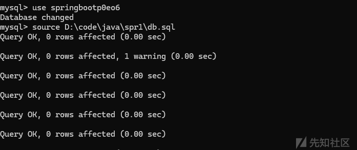

然后修改mysql数据库密码为自己的密码

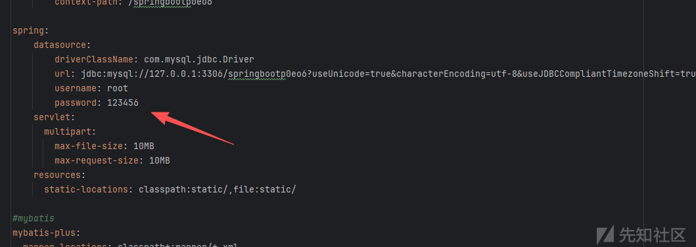

然后直接启动系统即可

也可以把这个context-path字段删掉，方便我们后续访问的url简单一点（后端改了前端也要改，前端是https.js和config.js）

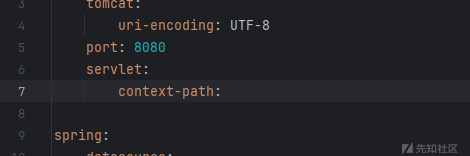

# 架构分析

## filter与interpreter

一般spring的过滤器和拦截器都放在config里面的，我们可以先看看config

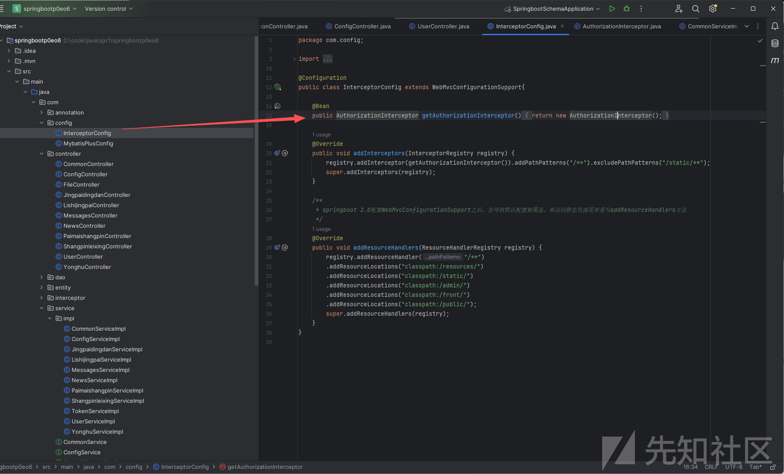

首先这边创建了一个方法`getAuthorizationInterceptor`，他会返回一个名为”鉴权拦截器“的类

当 Spring Boot 应用启动时，会自动扫描并加载标有 `@Configuration` 的配置类。对于继承了 `WebMvcConfigurationSupport` 的配置类，Spring 会在初始化 MVC 组件（如 DispatcherServlet）的过程中，**主动调用其所有重写的配置方法**，包括 `addInterceptors()`。

下面的则是重写了两个方法，重写的第一个方法`addInterceptors`先是把`AuthorizationInterceptor`这个拦截器注入到拦截器列表中，然后设置了拦截器的规则，就是除了`/static/**`目录下的其他目录全部都要经过拦截器

第二个方法是添加静态资源文件路径的方法`addResourceHandlers`，第一个`addResourceHandler("/**")`表示客户端所有的请求都可以访问静态资源，而静态资源的路径如下。

## 鉴权

现在我们跟到他的鉴权拦截器中去看看`AuthorizationInterceptor`

我们这边只看他的重要的部分

```
IgnoreAuth annotation;
if (handler instanceof HandlerMethod) {
    annotation = ((HandlerMethod) handler).getMethodAnnotation(IgnoreAuth.class);
} else {
    return true;  // 非控制器方法（如静态资源）直接放行
}

// 有@IgnoreAuth注解的方法直接放过（不需要验证Token）
if(annotation!=null) {
    return true;
}
```

后面我们看控制器的时候，如果有`@IgnoreAuth`注解，那就是不需要鉴权的接口，可以尝试未授权访问。

```
// 从请求头中获取Token
String token = request.getHeader(LOGIN_TOKEN_KEY);

// 验证Token有效性
TokenEntity tokenEntity = null;
if(StringUtils.isNotBlank(token)) {
    tokenEntity = tokenService.getTokenEntity(token);  // 调用服务查询Token是否存在且有效
}

// Token有效：将用户信息存入Session，放行请求
if(tokenEntity != null) {
    request.getSession().setAttribute("userId", tokenEntity.getUserid());
    request.getSession().setAttribute("role", tokenEntity.getRole());
    request.getSession().setAttribute("tableName", tokenEntity.getTablename());
    request.getSession().setAttribute("username", tokenEntity.getUsername());
    return true;
}
```

这边就是验证token的有效性，用的`tokenService.getTokenEntity`方法，我们跟进去看看

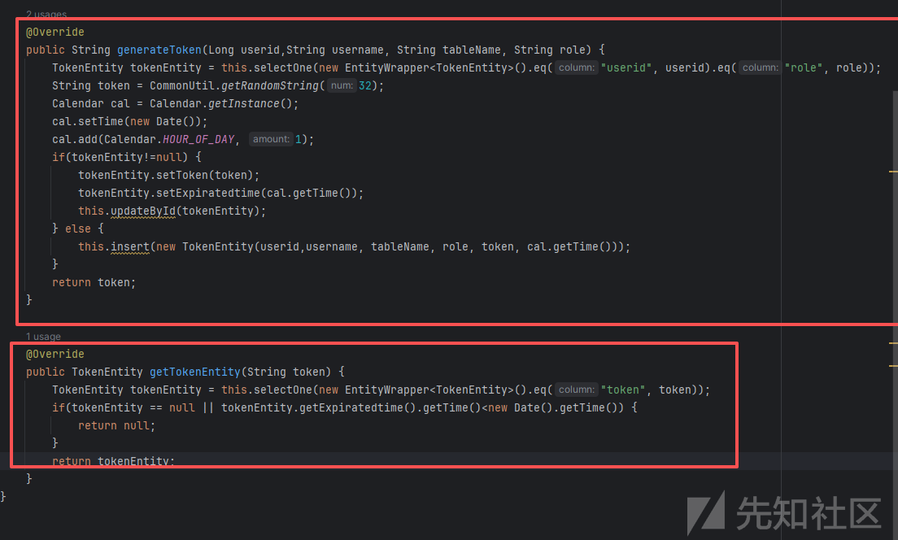

下面就是验证token的方法，上面是生成token的方法，可以看到他的token实际上就是生成了一个32位的随机字符串，然后存在数据库里面去了。检验token的办法也很简单，直接从数据库中读取token

这里可以看看他的读取逻辑是怎么样的，

他是直接用的`this.selectOne`，也就是mybatis自带的查询，相当于`where token =`就没有注入的风险。

现在我们知道他的鉴权逻辑了，就是看你头里面的token在不在数据库中，如果在,就通过token读取数据库对应的id，赋予给session然后存到服务端。只有设置了不鉴权的接口，才能未授权访问。

## 未授权逻辑

刚才说了存在`@IgnoreAuth`注释的接口都是未授权的，抛去一些没有的信息的接口。这边看到了一个好玩的接口

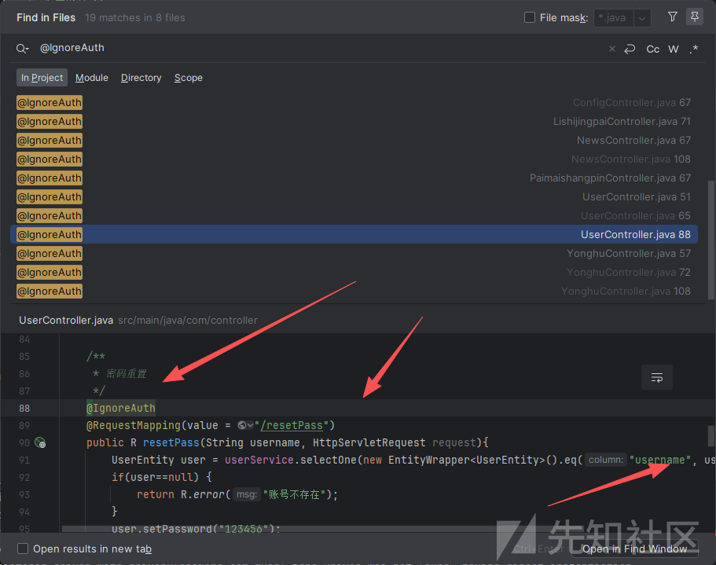

密码重置的接口他甚至都是弄成不用鉴权的接口。Spring MVC 会按参数名自动绑定同名的请求参数到方法入参

而且这边没有加`@RequestBody`注解，用的是GET传参的方法。

而数据库中有一个默认的管理员用户


我们去重置一下

```
http://localhost:8080/users/resetPass?username=abo
```

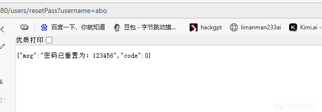

可以看到数据库中的账号密码已经被改掉了

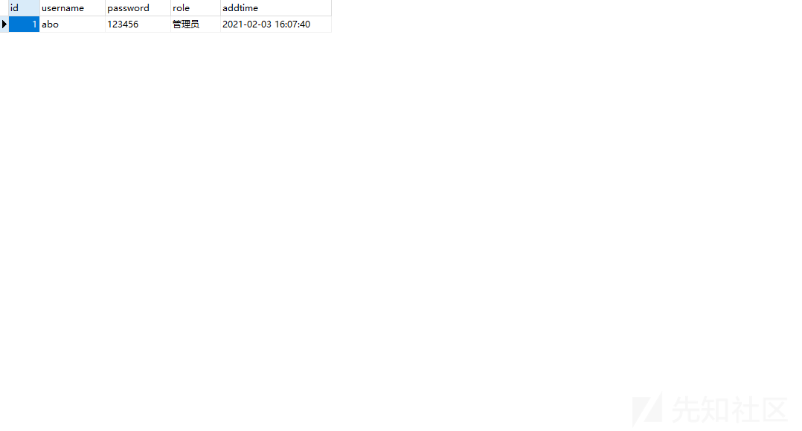

# 漏洞审计

## 文件上传漏洞

通过搜索关键词`getOriginalFilename`

发现文件上传漏洞位于`springbootp0eo6\src\main\java\com\controller\FileController.java:upload`

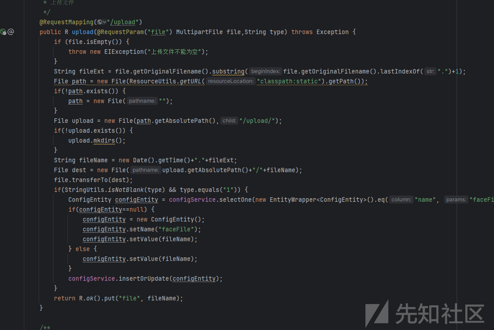

可以看到他就是存到固定目录下面，然后修改了文件的名字，前面加了一个时间戳，如果可以上传jsp更好，但是可惜这个系统不支持jsp的解析，这边我们直接上传一个html的xss就好了

payload如下

```
<!DOCTYPE html>
<html lang="zh-CN">
<head>
  <meta charset="UTF-8" />
  <title>上传弹窗示例</title>
  <style>
    body { font-family: Arial, sans-serif; margin: 0; }
    .mask {
      position: fixed; inset: 0; background: rgba(0,0,0,.35);
      display: flex; align-items: center; justify-content: center;
    }
    .modal {
      width: 420px; max-width: 92vw; background: #fff; border-radius: 10px;
      box-shadow: 0 10px 30px rgba(0,0,0,.25); padding: 18px 20px;
      animation: pop .18s ease-out;
    }
    @keyframes pop { from { transform: scale(.96); opacity:.6; } to { transform: scale(1); opacity:1; } }
    .header { display: flex; align-items: center; justify-content: space-between; }
    .header h3 { margin: 0; font-size: 18px; }
    .close { border: 0; background: transparent; font-size: 20px; cursor: pointer; }
    .row { margin: 12px 0; display: flex; align-items: center; gap: 8px; }
    .row label { width: 90px; color: #555; }
    .row input, .row select { flex: 1; height: 32px; padding: 0 8px; }
    .row input[type="file"] { padding: 4px; height: auto; }
    .actions { display: flex; justify-content: flex-end; gap: 10px; margin-top: 6px; }
    button { height: 34px; padding: 0 14px; cursor: pointer; }
    .primary { background: #13AF69; color: #fff; border: 0; border-radius: 6px; }
    .ghost { background: #fff; color: #333; border: 1px solid #ddd; border-radius: 6px; }
    #msg { margin-top: 10px; font-size: 13px; color: #333; white-space: pre-wrap; }
  </style>
</head>
<body>
  <div class="mask" id="mask" aria-modal="true" role="dialog">
    <div class="modal">
      <div class="header">
        <h3>上传弹窗（HTML 文件）</h3>
        <button class="close" id="btnClose" title="关闭">×</button>
      </div>

      <div class="row">
        <label>后端地址</label>
        <input id="baseUrl" value="http://localhost:8080/" />
      </div>
      <div class="row">
        <label>接口路径</label>
        <input id="apiPath" value="file/upload" />
      </div>
      <div class="row">
        <label>Token</label>
        <input id="token" placeholder="可留空；登录后localStorage的 Token" />
      </div>
      <div class="row">
        <label>type 参数</label>
        <select id="type">
          <option value="0">0（不写faceFile）</option>
          <option value="1">1（写/更新faceFile）</option>
        </select>
      </div>
      <div class="row">
        <label>选择文件</label>
        <input id="file" type="file" accept=".html,.htm" />
      </div>

      <div class="actions">
        <button class="ghost" id="btnCancel">取消</button>
        <button class="primary" id="btnUpload">上传</button>
      </div>

      <div id="msg"></div>
    </div>
  </div>

  <script>
    const mask = document.getElementById('mask');
    const btnClose = document.getElementById('btnClose');
    const btnCancel = document.getElementById('btnCancel');
    const btnUpload = document.getElementById('btnUpload');
    const fileInput = document.getElementById('file');
    const baseUrlInput = document.getElementById('baseUrl');
    const apiPathInput = document.getElementById('apiPath');
    const tokenInput = document.getElementById('token');
    const typeInput = document.getElementById('type');
    const msg = document.getElementById('msg');

    const hide = () => { mask.style.display = 'none'; };
    btnClose.onclick = hide;
    btnCancel.onclick = hide;

    btnUpload.onclick = async () => {
      msg.textContent = '';
      if (!fileInput.files || fileInput.files.length === 0) {
        msg.textContent = '请先选择要上传的 HTML 文件。';
        return;
      }

      const base = (baseUrlInput.value || 'http://localhost:8080/').replace(/\/+$/, '') + '/';
      const path = apiPathInput.value.replace(/^\/+/, '');
      const url = base + path;

      const formData = new FormData();
      formData.append('file', fileInput.files[0], fileInput.files[0].name);
      formData.append('type', typeInput.value);

      try {
        const headers = {};
        const token = tokenInput.value.trim();
        if (token) headers['Token'] = token;

        const res = await fetch(url, { method: 'POST', headers, body: formData });
        const data = await res.json().catch(() => ({}));

        if (res.ok && data && data.code === 0) {
          const saved = data.file || (data.data && data.data.file) || '(未知文件名)';
          msg.textContent = '上传成功，保存文件名: ' + saved + '
文件可在 resources/static/upload/ 下查看（被后端托管）。';
        } else {
          msg.textContent = '上传失败: ' + (data.msg || (res.status + ' ' + res.statusText));
        }
      } catch (e) {
        msg.textContent = '请求异常: ' + e.message;
      }
    };
  </script>
</body>
</html>
```

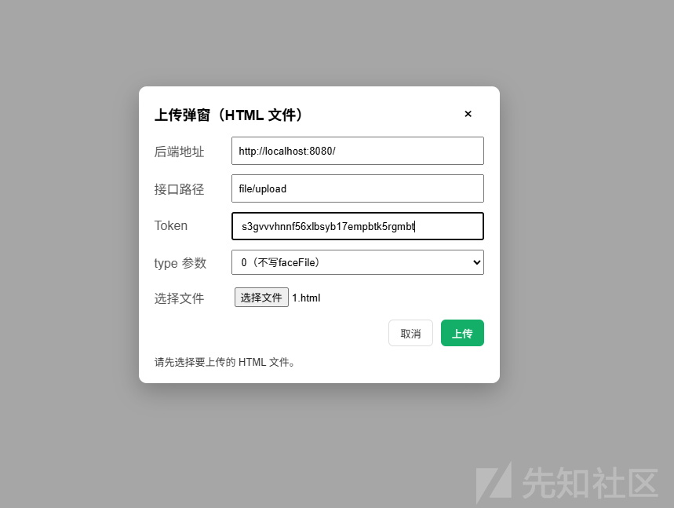

然后上传成功（我就是上传的这个poc，懒得重新写了）看url，确实是解析了我们的htm，可以用来打xss

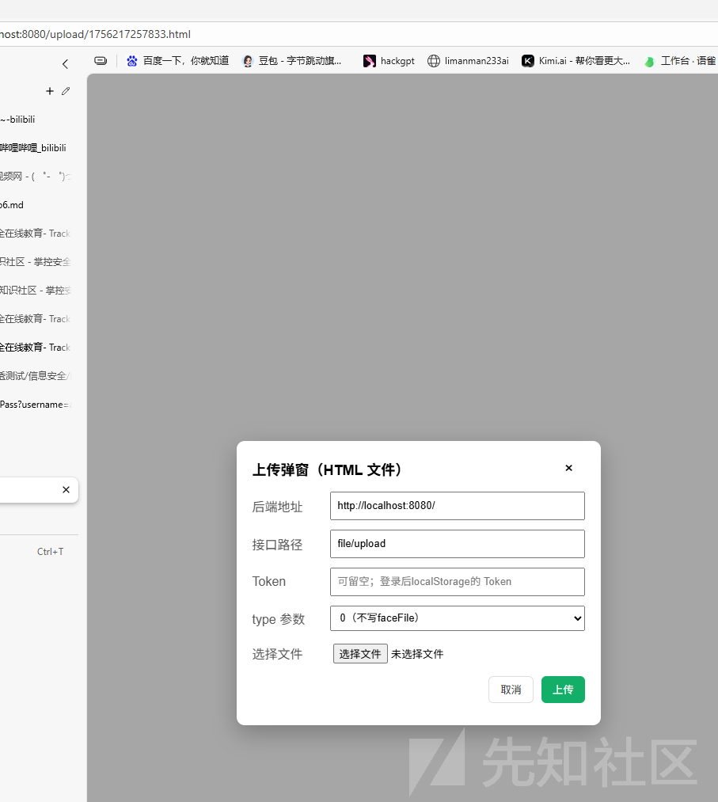
