# BloodHound 安装避坑指南：为何 AI 给的方案总不对？-先知社区

> **来源**: https://xz.aliyun.com/news/18716  
> **文章ID**: 18716

---

###### 文章背景：

这是一篇关于ai无法解决问题的一个例子：最新bloodhound安装及ai对话记录

安装bloodhound遇到了一些问题，记录下来希望能帮助到读者。

**写在开头：**

最新bloodhound版本，官方建议使用docker安装。

如果头铁，还是要手动安装neo4j和postgrsql及bloodhound，那么请往下看：

​

**安装环境：**

```
└─$ cat /etc/os-release PRETTY_NAME="Kali GNU/Linux Rolling" NAME="Kali GNU/Linux" VERSION_ID="2025.2" VERSION="2025.2" VERSION_CODENAME=kali-rolling ID=kali ID_LIKE=debian HOME_URL="https://www.kali.org/" SUPPORT_URL="https://forums.kali.org/" BUG_REPORT_URL="https://bugs.kali.org/" ANSI_COLOR="1;31 └─$ uname -a Linux kali-linux-2024-2 6.12.33+kali-arm64 #1 SMP Kali 6.12.33-1kali1 (2025-06-25) aarch64 GNU/Linux 
```

​

**开始安装**

一般kali都会自带bloodhound，但是由于neo4j默认没装，我们可能需要安装一下。。。现在ai那么火，就无脑借助ai吧

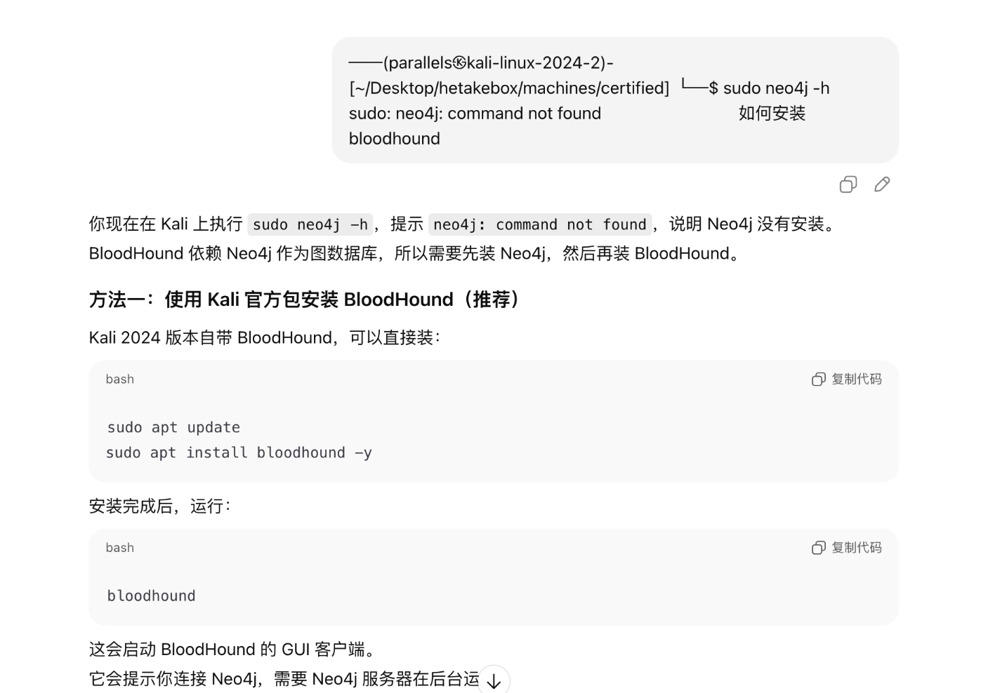

安装完neo4j，我发现kali2025中并没有blood hound，而是有一个bloodhound-python

然后又去问chatgpt：

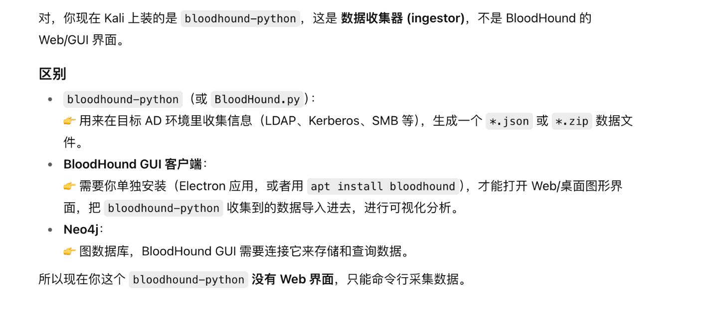

很好理解，那我们就开始安装bloodhound吧


非常好，这个流程很简洁，符合我的认知。安装完neo4j和bloodhound之后，我们根据ai说的~~原神（~~bloodhound）～启动

oh 但是报错了：

```
┌──(parallels㉿kali-linux-2024-2)-[~]└─$ sudo bloodhound It seems it's the first time you run bloodhound Please run bloodhound-setup firstDo you want to run bloodhound-setup now? [Y/n] y [*] Starting PostgreSQL service [*] Creating Databasepsql: error: connection to server on socket "/var/run/postgresql/.s.PGSQL.5432" failed: No such file or directory Is the server running locally and accepting connections on that socket? Creating database usercreateuser: error: connection to server on socket "/var/run/postgresql/.s.PGSQL.5432" failed: No such file or directory Is the server running locally and accepting connections on that socket?psql: error: connection to server on socket "/var/run/postgresql/.s.PGSQL.5432" failed: No such file or directory Is the server running locally and accepting connections on that socket? Creating databasecreatedb: error: connection to server on socket "/var/run/postgresql/.s.PGSQL.5432" failed: No such file or directory Is the server running locally and accepting connections on that socket?psql: error: connection to server on socket "/var/run/postgresql/.s.PGSQL.5432" failed: No such file or directory Is the server running locally and accepting connections on that socket?
```

​

于是继续请教ai，这个是什么问题

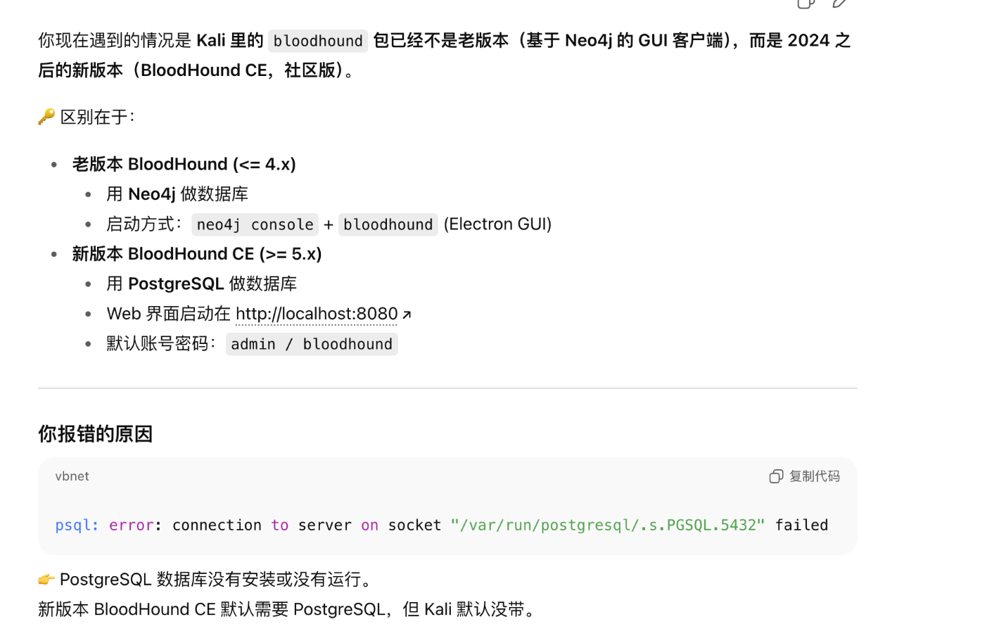

好，还差PostgreSQL，那继续安装

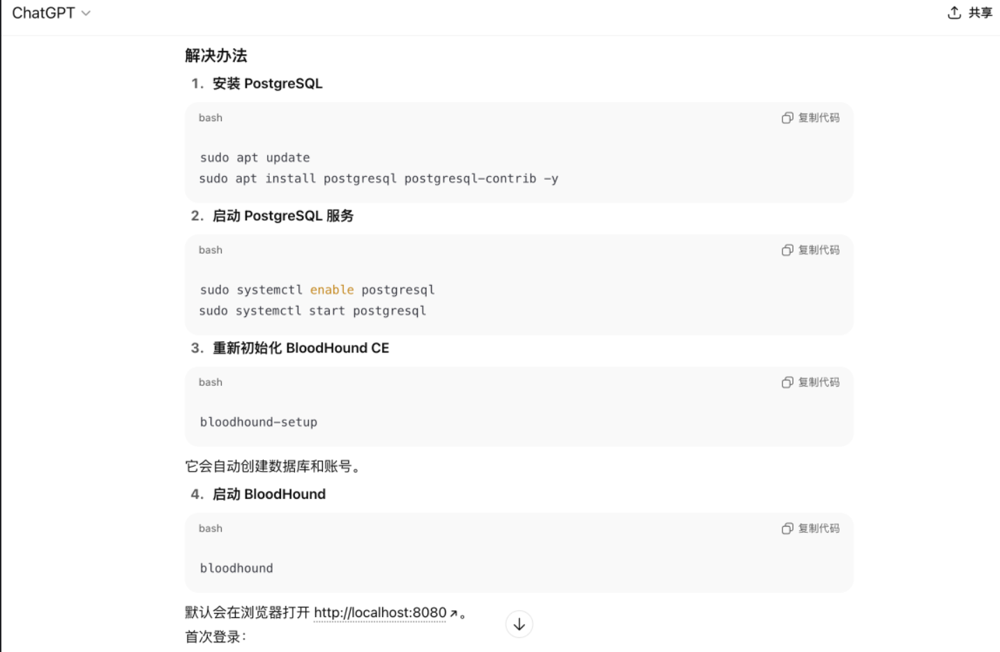

安装完postgresql，

然后继续执行bloodhound过程中，又报错了。

```
└─$ bloodhound-setup [*] Starting PostgreSQL service [*] Creating Database WARNING: database "postgres" has a collation version mismatch DETAIL: The database was created using collation version 2.38, but the operating system provides version 2.41. HINT: Rebuild all objects in this database that use the default collation and run ALTER DATABASE postgres REFRESH COLLATION VERSION, or build PostgreSQL with the right library version. Creating database user WARNING: database "postgres" has a collation version mismatch DETAIL: The database was created using collation version 2.38, but the operating system provides version 2.41. HINT: Rebuild all objects in this database that use the default collation and run ALTER DATABASE postgres REFRESH COLLATION VERSION, or build PostgreSQL with the right library version. WARNING: database "postgres" has a collation version mismatch DETAIL: The database was created using collation version 2.38, but the operating system provides version 2.41. HINT: Rebuild all objects in this database that use the default collation and run ALTER DATABASE postgres REFRESH COLLATION VERSION, or build PostgreSQL with the right library version. Creating database WARNING: database "postgres" has a collation version mismatch DETAIL: The database was created using collation version 2.38, but the operating system provides version 2.41. HINT: Rebuild all objects in this database that use the default collation and run ALTER DATABASE postgres REFRESH COLLATION VERSION, or build PostgreSQL with the right library version. createdb: error: database creation failed: ERROR: template database "template1" has a collation version mismatch DETAIL: The template database was created using collation version 2.38, but the operating system provides version 2.41. HINT: Rebuild all objects in the template database that use the default collation and run ALTER DATABASE template1 REFRESH COLLATION VERSION, or build PostgreSQL with the right library version. psql: error: connection to server on socket "/var/run/postgresql/.s.PGSQL.5432" failed: FATAL: database "bloodhound" does not exist
```

​

问ai：

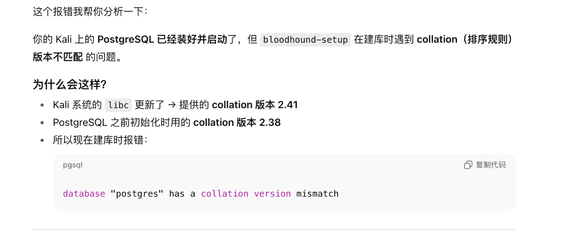

按照ai的解决办法：

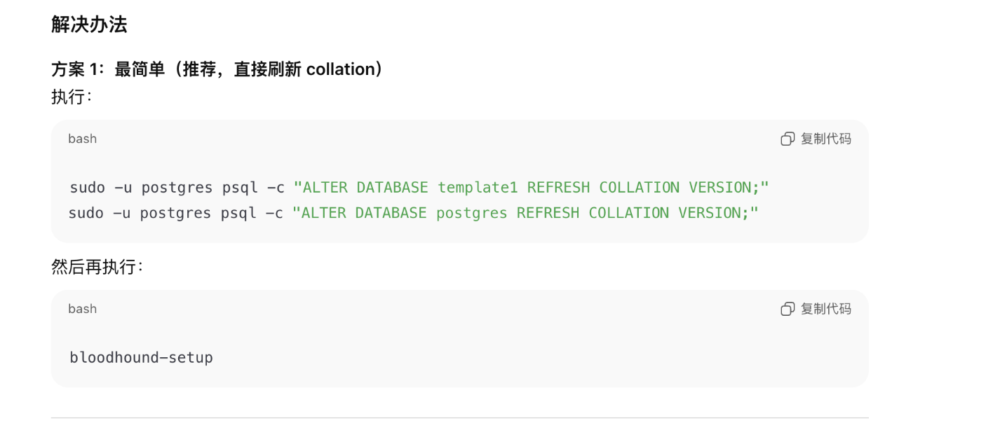

然后再次运行bloodhound：

```
└─$ bloodhound It seems it's the first time you run bloodhound Please run bloodhound-setup first Do you want to run bloodhound-setup now? [Y/n] [*] Starting PostgreSQL service [*] Creating DatabaseUser _bloodhound already exists in PostgreSQLDatabase bloodhound already exists in PostgreSQLALTER ROLE [*] Starting neo4jNeo4j is running at pid 2095459 [i] You need to change the default password for neo4j Default credentials are user:neo4j password:neo4j [!] IMPORTANT: Once you have setup the new password, please update /etc/bhapi/bhapi.json with the new password before running bloodhound opening http://localhost:7474/
```

看起来好像成功了。

接下来就是常规步骤修改neo4j管理界面密码，然后修改配置文件/etc/bhapi/bhapi.json同步下neo4j密码，然后启动bloodhound输入admin/admin默认密码就可以了。

但。。。。。neo4j改完密码之后，莫名其妙登陆不上去了，使用原先的密码也登陆不上去了。这里可能是因为修改完密码没有重启neo4j

```
Neo.ClientError.Security.AuthenticationRateLimit: The client has provided incorrect authentication details too many times in a row.
```

​

然后根据ai的解决办法：

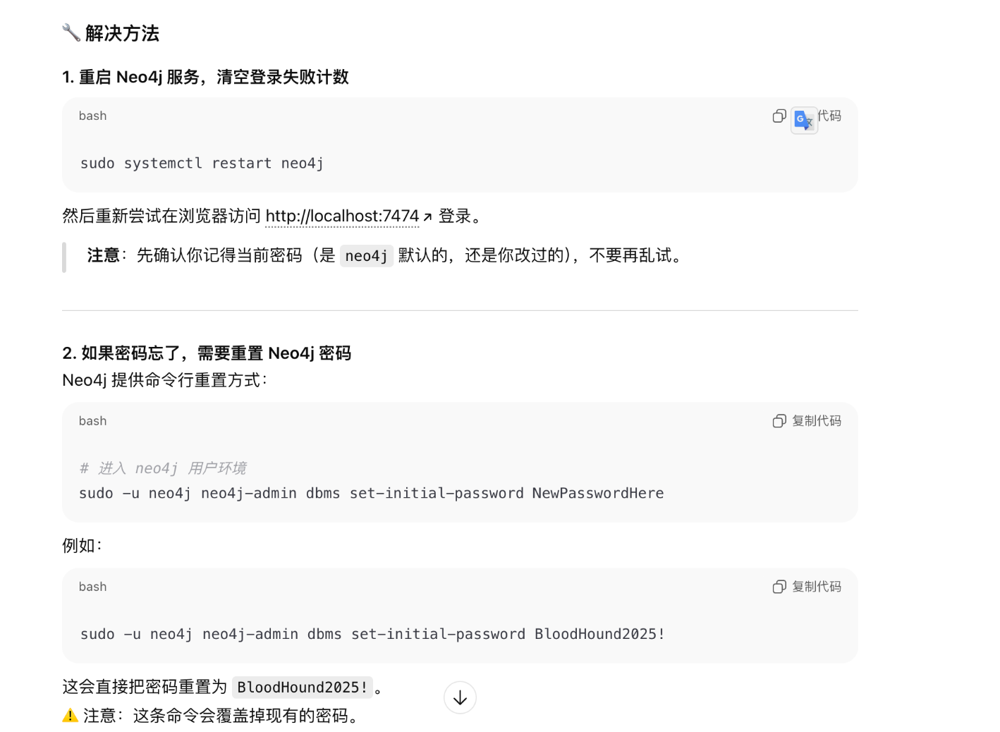

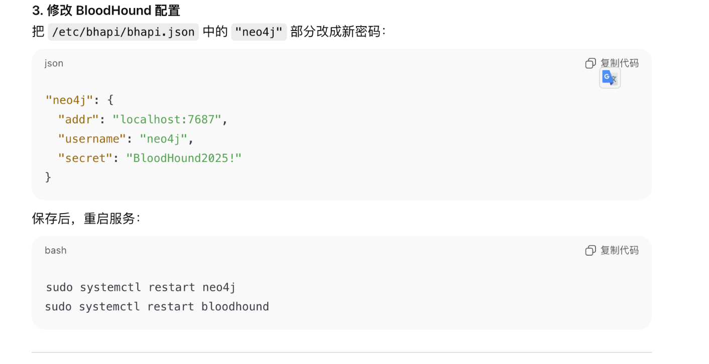

出现新问题：

```
┌──(parallels㉿kali-linux-2024-2)-[~]└─$ sudo -u neo4j neo4j-admin dbms set-initial-password BloodHound2025!sudo: unknown user neo4jsudo: error initializing audit plugin sudoers_audit
```

​

ai回答：

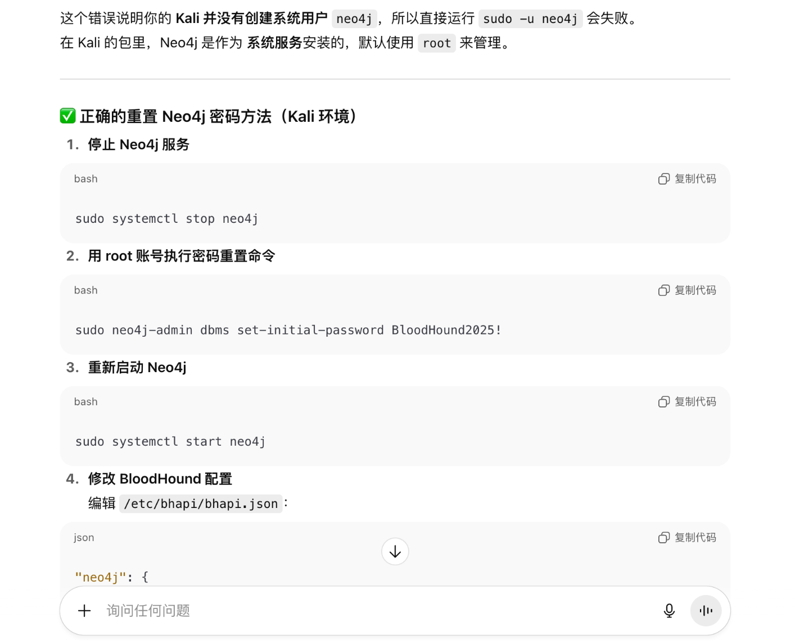

好，那我们继续行动

新问题来了

```
┌──(parallels㉿kali-linux-2024-2)-[~/Desktop/hetakebox] └─$ ./fix_bloodhound.sh [*] Stopping neo4j... Stopping Neo4j....... stopped. [*] Resetting neo4j password... sudo: neo4j-admin: command not found
```

​

ai给的解决方案：

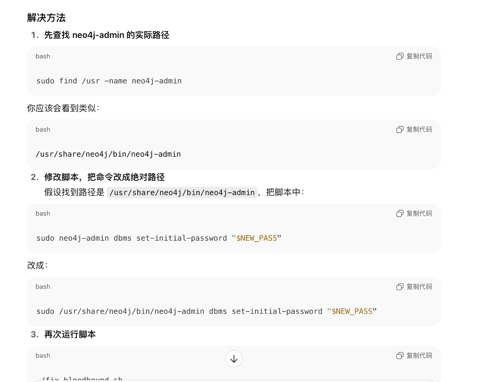

新的问题：

```
[*] Stopping neo4j... Neo4j is not running. [*] Resetting neo4j password... Unmatched argument at index 0: 'dbms' Usage: neo4j-admin [-hV] [--expand-commands] [--verbose] [COMMAND] Neo4j database administration tool. --expand-commands Allow command expansion in config value evaluation. --verbose Prints additional information. -h, --help Show this help message and exit. -V, --version Print version information and exit. Commands: help Displays help information about the specified command check-consistency Check the consistency of a database. report Produces a zip/tar of the most common information needed for remote assessments. store-info Print information about a Neo4j database store. memrec Print Neo4j heap and pagecache memory settings recommendations. import Import a collection of CSV files. set-default-admin Sets the default admin user. This user will be granted the admin role on startup if the system has no roles. set-initial-password Sets the initial password of the initial admin user ('neo4j'). And removes the requirement to change password on first login. IMPORTANT: this change will only take effect if performed before the database is started for the first time. dump Dump a database into a single-file archive. load Load a database from an archive created with the dump command. unbind Removes server identifier. push-to-cloud Push your local database to a Neo4j Aura instance. The database must be shutdown in order to take a dump to upload. The target location is your Neo4j Aura Bolt URI. You will be asked your Neo4j Cloud username and password during the push-to-cloud operation. Environment variables: NEO4J_CONF Path to directory which contains neo4j.conf. NEO4J_DEBUG Set to anything to enable debug output. NEO4J_HOME Neo4j home directory. HEAP_SIZE Set JVM maximum heap size during command execution. Takes a number and a unit, for example 512m. JAVA_OPTS Used to pass custom setting to Java Virtual Machine. Refer to JVM documentation about the exact format. This variable is incompatible with HEAP_SIZE and takes precedence over HEAP_SIZE.
```

​

ai回答：

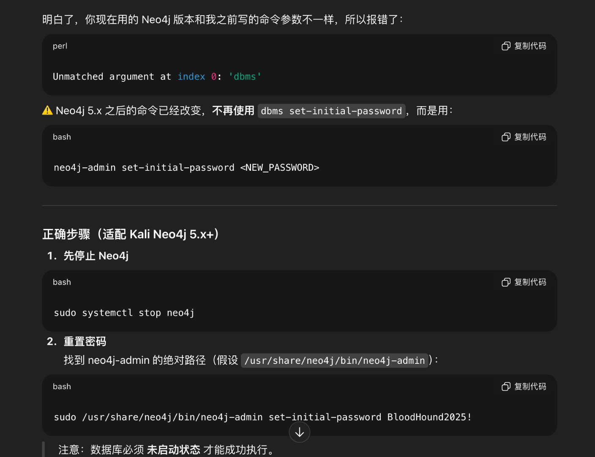

然后再次报错：

```
└─$ sudo /usr/share/neo4j/bin/neo4j-admin set-initial-password BloodHound2025! Selecting JVM - Version:21.0.7+6-Debian-1, Name:OpenJDK 64-Bit Server VM, Vendor:Debian WARNING! You are using an unsupported Java runtime. * Please use Oracle(R) Java(TM) 11, OpenJDK(TM) 11 to run Neo4j. * Please see https://neo4j.com/docs/ for Neo4j installation instructions. Unrecognized VM option 'UseBiasedLocking' Error: Could not create the Java Virtual Machine. Error: A fatal exception has occurred. Program will exit.第二步报错
```

ai回答：java不兼容

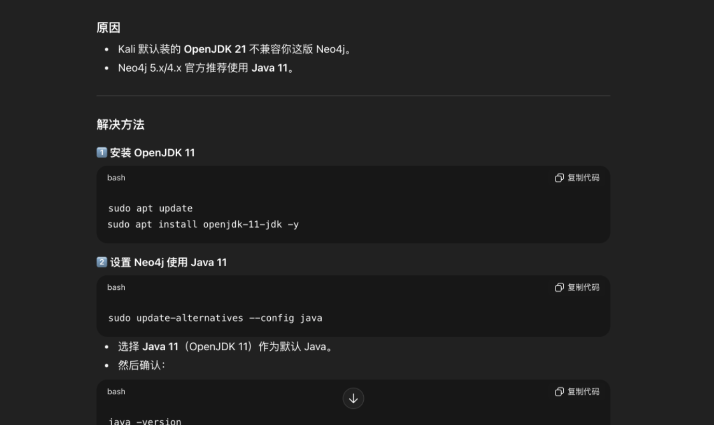

然后我忍不住了，问：还有其他简单的办法吗

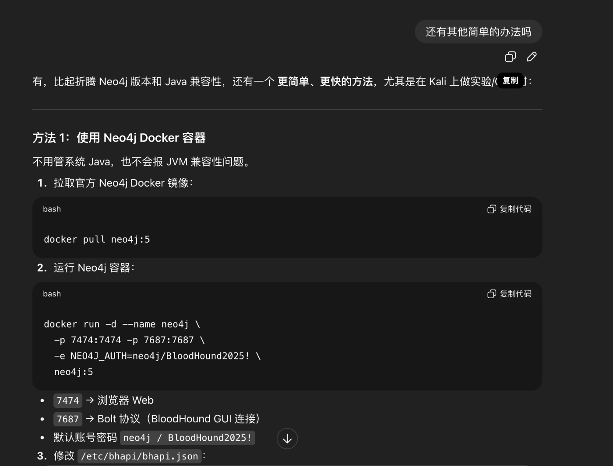

然后ai说了个方法二（这是完全错误的），最新版也基于neo4j和postgresql

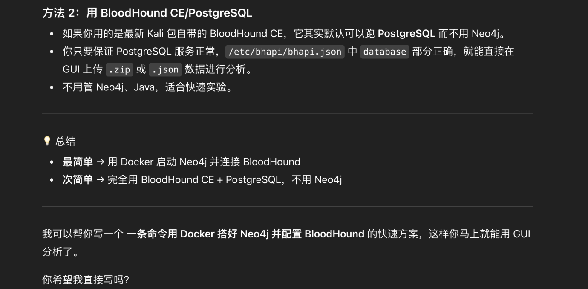

然后从这里我就被ai误导了，我以为最新版bloodhound可以是安装postgresql或者neo4j都行，那么我前面装了postgresql成功了那就试试bloodhound+postgresql吧

​

问ai：完全用 BloodHound CE + PostgreSQL，不用 Neo4j

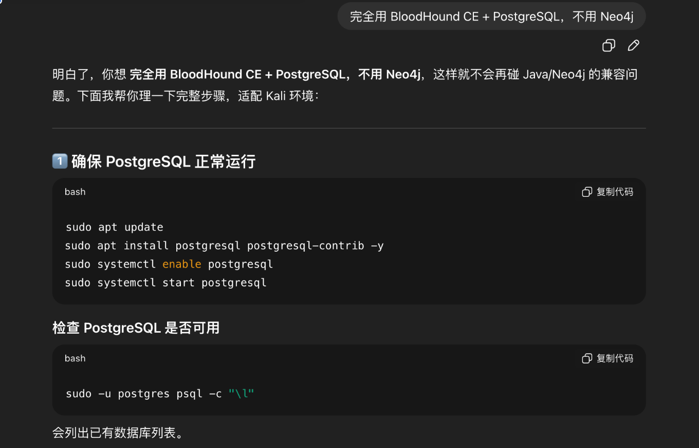

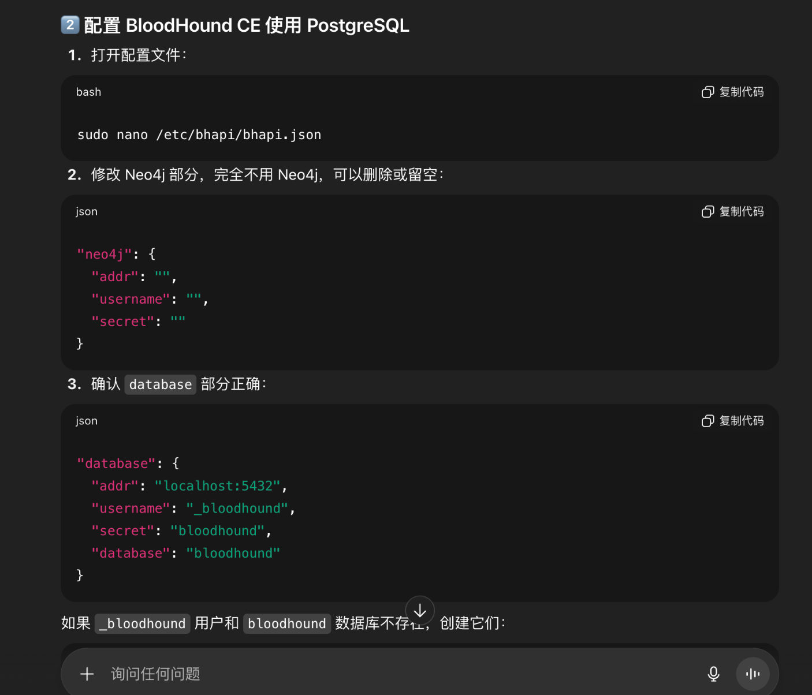

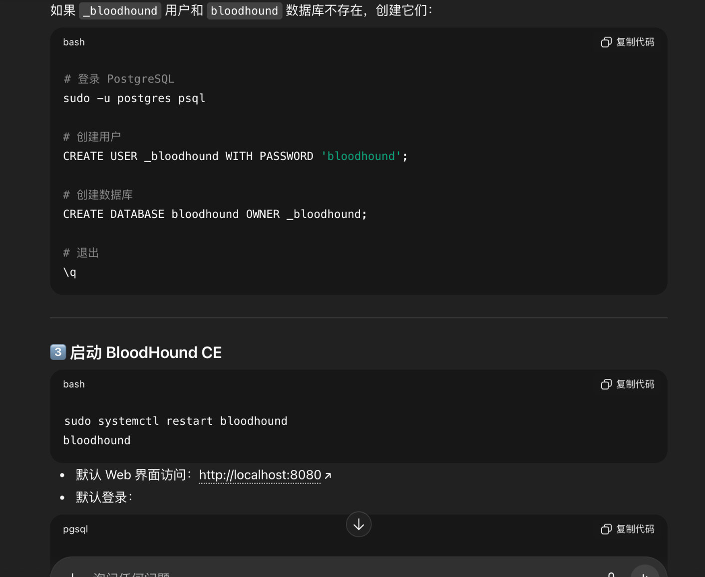

我继续问：

```
└─$ sudo -u postgres psql -c "\l" List of databases Name | Owner | Encoding | Locale Provider | Collate | Ctype | Locale | ICU Rules | Access privileges ------------+-------------+----------+-----------------+-------------+-------------+--------+-----------+----------------------- bloodhound | _bloodhound | UTF8 | libc | en_US.UTF-8 | en_US.UTF-8 | | | postgres | postgres | UTF8 | libc | en_US.UTF-8 | en_US.UTF-8 | | | template0 | postgres | UTF8 | libc | en_US.UTF-8 | en_US.UTF-8 | | | =c/postgres + | | | | | | | | postgres=CTc/postgres template1 | postgres | UTF8 | libc | en_US.UTF-8 | en_US.UTF-8 | | | =c/postgres + | | | | | | | | postgres=CTc/postgres (4 rows) 
```

然后ai继续瞎指导：

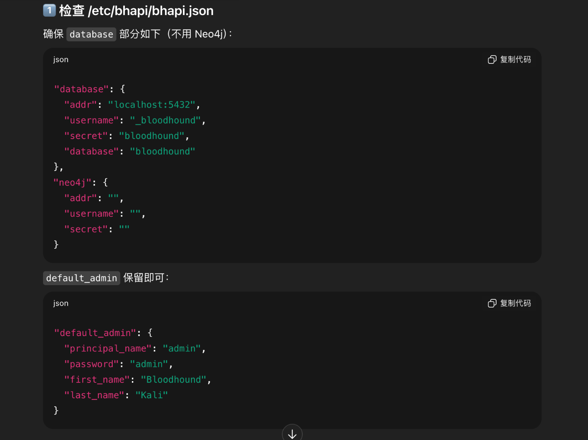

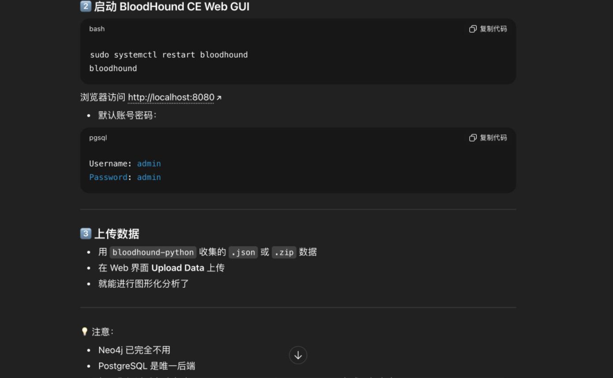

然后报错，因为实际上没有neo4j，是启动不起来的：

```
──(parallels㉿kali-linux-2024-2)-[~/Desktop/hetakebox]└─$ sudo bloodhound Starting neo4jNeo4j is not running.Directories in use:home: /usr/share/neo4jconfig: /usr/share/neo4j/conflogs: /etc/neo4j/logsplugins: /usr/share/neo4j/pluginsimport: /usr/share/neo4j/importdata: /etc/neo4j/datacertificates: /usr/share/neo4j/certificateslicenses: /usr/share/neo4j/licensesrun: /var/lib/neo4j/runStarting Neo4j.Started neo4j (pid:2165297). It is available at http://localhost:7474There may be a short delay until the server is ready............................ Bloodhound will start IMPORTANT: It will take time, please wait...{"time":"2025-08-25T17:53:01.143388194+08:00","level":"INFO","message":"Reading configuration found at /etc/bhapi/bhapi.json"}{"time":"2025-08-25T17:53:01.144889861+08:00","level":"INFO","message":"Logging configured"}{"time":"2025-08-25T17:53:01.183454694+08:00","level":"INFO","message":"No database driver has been set for migration, using: neo4j"}{"time":"2025-08-25T17:53:01.183691903+08:00","level":"INFO","message":"Connecting to graph using Neo4j"}{"time":"2025-08-25T17:53:01.184267986+08:00","level":"INFO","message":"Starting daemon Tools API"}{"time":"2025-08-25T17:53:01.198069403+08:00","level":"INFO","message":"No new SQL migrations to run"}{"time":"2025-08-25T17:53:03.523457029+08:00","level":"INFO","message":"########################################"}{"time":"2025-08-25T17:53:03.525513654+08:00","level":"INFO","message":"# #"}{"time":"2025-08-25T17:53:03.525528862+08:00","level":"INFO","message":"# Initial Password Set To: admin #"}{"time":"2025-08-25T17:53:03.525673987+08:00","level":"INFO","message":"# #"}{"time":"2025-08-25T17:53:03.52568707+08:00","level":"INFO","message":"########################################"}{"time":"2025-08-25T17:53:03.52890332+08:00","level":"ERROR","message":"Failed starting the server: failed to start services: graph migration error: ConnectivityError: dial tcp: address ::7687: too many colons in address"}
```

ai仍然不断重复你要配置neo4j为空

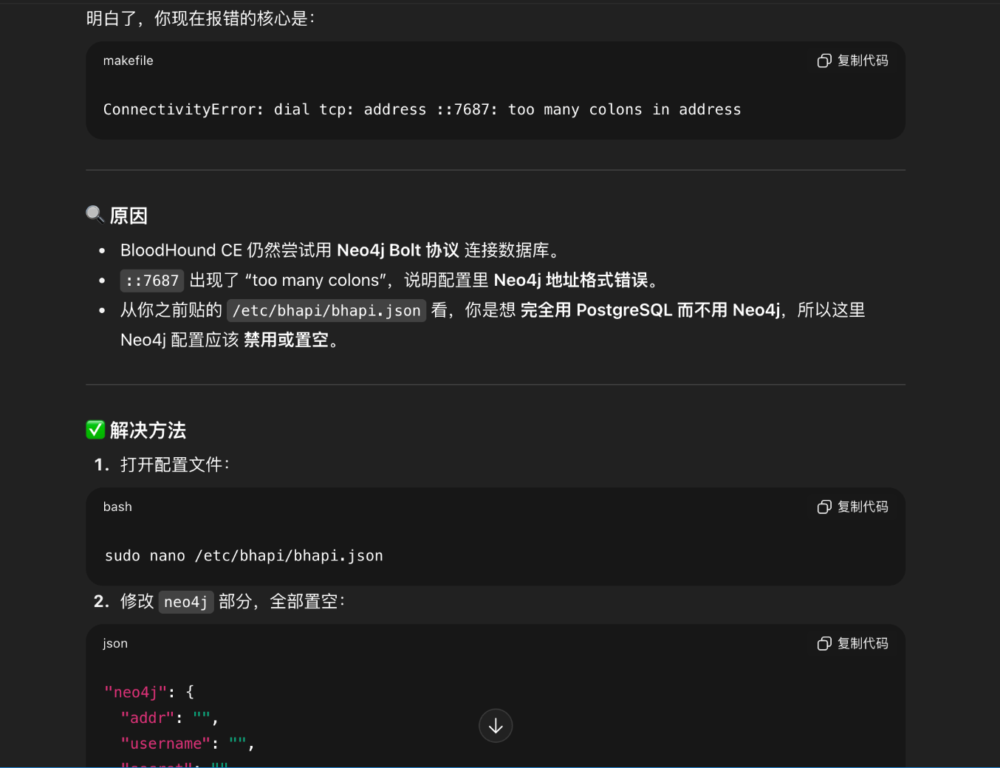

然后我觉得还是用neo4j+bloodhound吧（实际上也必须同时配置postgresql。。。）

ai给出neo4j+bloodhound的解决办法：

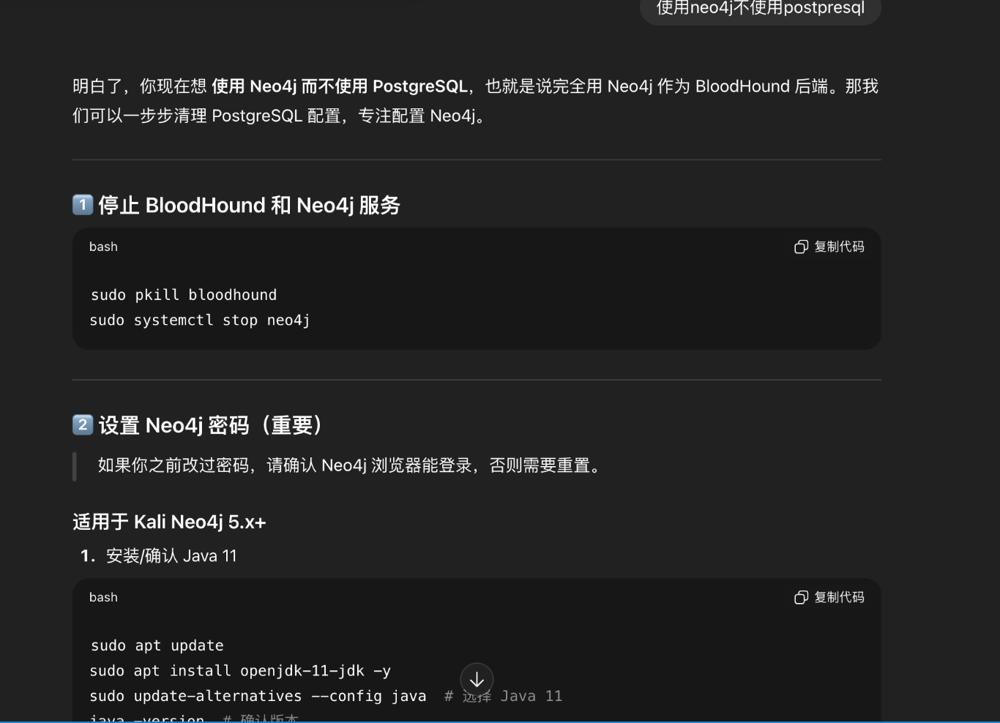

然后

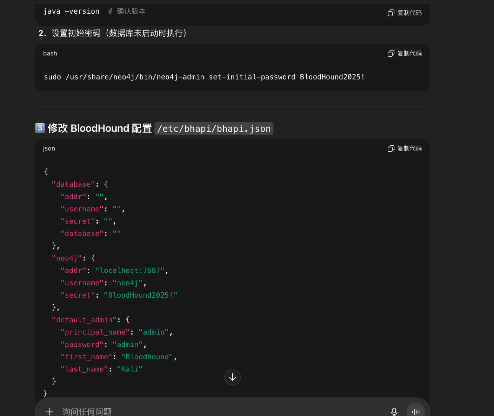

然后ai还“贴心”的告诉我：

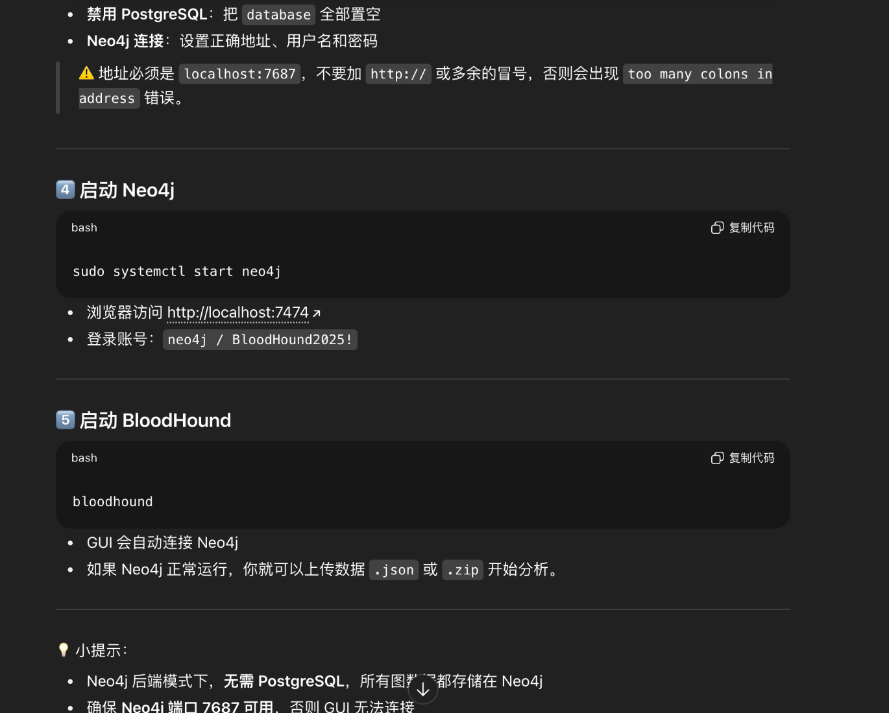

然而，真实情况是：由于缺少postgresql，还是会报错

```
└─$ bloodhound Starting neo4j Neo4j is running at pid 2169962 Bloodhound will start IMPORTANT: It will take time, please wait... {"time":"2025-08-25T18:05:10.084710167+08:00","level":"INFO","message":"Reading configuration found at /etc/bhapi/bhapi.json"} {"time":"2025-08-25T18:05:10.086068167+08:00","level":"INFO","message":"Logging configured"} {"time":"2025-08-25T18:05:10.091476792+08:00","level":"ERROR","message":"failed to initialize database, got error failed to connect to `user= database=`: /var/run/postgresql/.s.PGSQL.5432 (/var/run/postgresql): server error: FATAL: no PostgreSQL user name specified in startup packet (SQLSTATE 28000)"} {"time":"2025-08-25T18:05:10.091622959+08:00","level":"ERROR","message":"Failed starting the server: failed to connect to databases: error while attempting to create database connection: failed to connect to `user= database=`: /var/run/postgresql/.s.PGSQL.5432 (/var/run/postgresql): server error: FATAL: no PostgreSQL user name specified in startup packet (SQLSTATE 28000)"}
```

​

ai回答说：

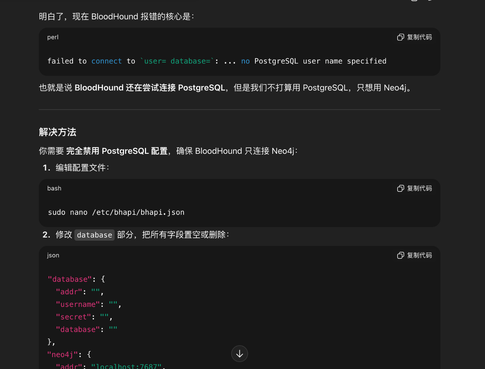

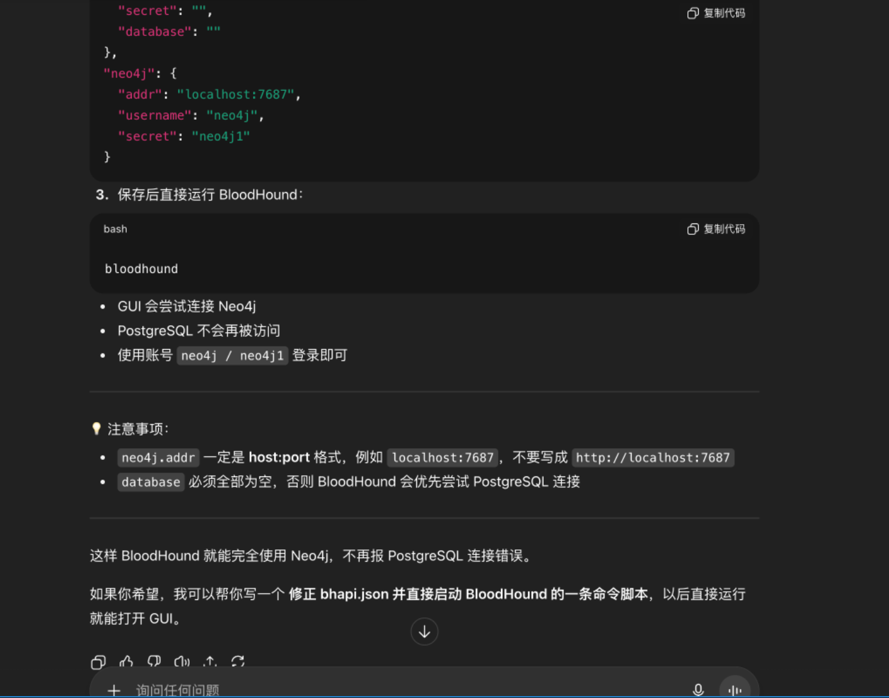

然后还有问题：

```
└─$ bloodhound Starting neo4j Neo4j is running at pid 2173309 Bloodhound will start IMPORTANT: It will take time, please wait... {"time":"2025-08-25T18:08:37.792031808+08:00","level":"INFO","message":"Reading configuration found at /etc/bhapi/bhapi.json"} {"time":"2025-08-25T18:08:37.792513433+08:00","level":"INFO","message":"Logging configured"} {"time":"2025-08-25T18:08:37.798437224+08:00","level":"ERROR","message":"failed to initialize database, got error failed to connect to `user= database=`: /var/run/postgresql/.s.PGSQL.5432 (/var/run/postgresql): server error: FATAL: no PostgreSQL user name specified in startup packet (SQLSTATE 28000)"} {"time":"2025-08-25T18:08:37.798474558+08:00","level":"ERROR","message":"Failed starting the server: failed to connect to databases: error while attempting to create database connection: failed to connect to `user= database=`: /var/run/postgresql/.s.PGSQL.5432 (/var/run/postgresql): server error: FATAL: no PostgreSQL user name specified in startup packet (SQLSTATE 28000)"}
```

​

然后ai回答：

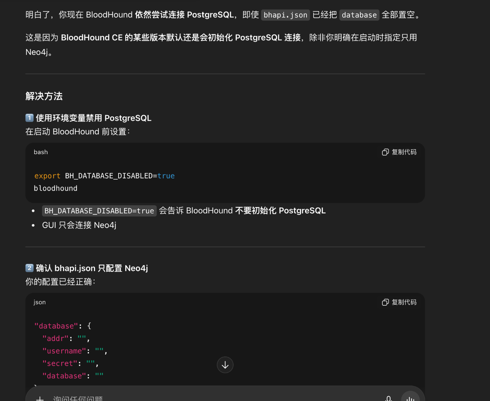

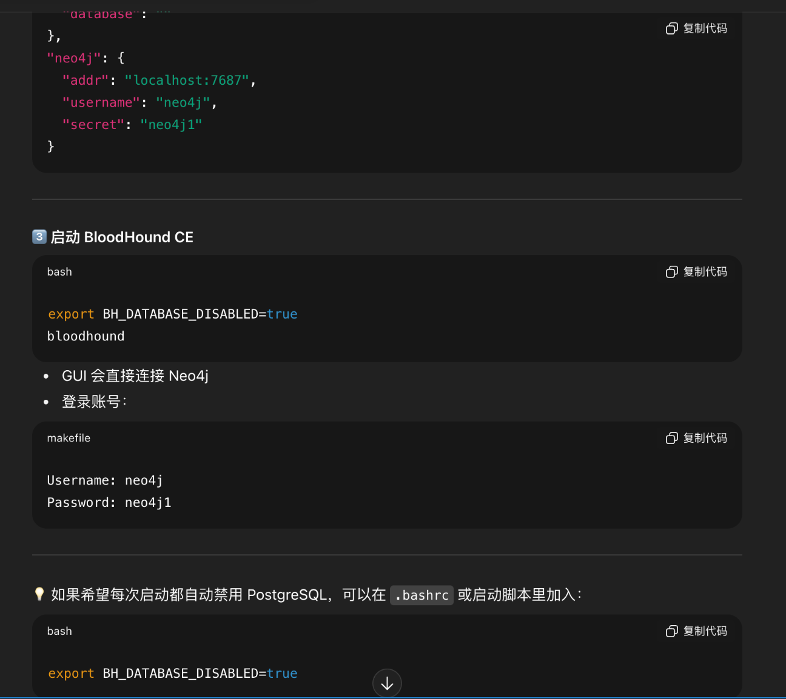

然后还是仍然报错缺postgresql：

```
┌──(parallels㉿kali-linux-2024-2)-[~/Desktop] └─$ export BH_DATABASE_DISABLED=true ┌──(parallels㉿kali-linux-2024-2)-[~/Desktop] └─$ bloodhound Starting neo4j Neo4j is running at pid 2173309 Bloodhound will start IMPORTANT: It will take time, please wait... {"time":"2025-08-25T18:10:49.50021412+08:00","level":"INFO","message":"Reading configuration found at /etc/bhapi/bhapi.json"} {"time":"2025-08-25T18:10:49.50079737+08:00","level":"INFO","message":"Logging configured"} {"time":"2025-08-25T18:10:49.506176704+08:00","level":"ERROR","message":"failed to initialize database, got error failed to connect to `user= database=`: /var/run/postgresql/.s.PGSQL.5432 (/var/run/postgresql): server error: FATAL: no PostgreSQL user name specified in startup packet (SQLSTATE 28000)"} {"time":"2025-08-25T18:10:49.50621137+08:00","level":"ERROR","message":"Failed starting the server: failed to connect to databases: error while attempting to create database connection: failed to connect to `user= database=`: /var/run/postgresql/.s.PGSQL.5432 (/var/run/postgresql): server error: FATAL: no PostgreSQL user name specified in startup packet (SQLSTATE 28000)"}
```

ai又给继续瞎扯：

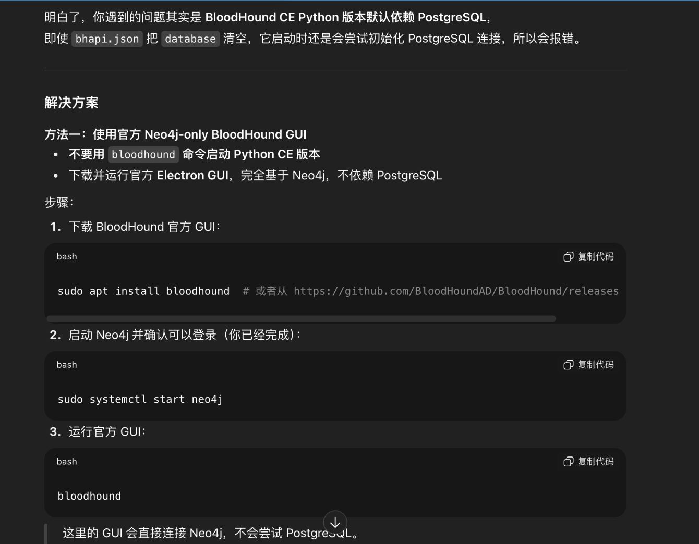

方法二终于对了：

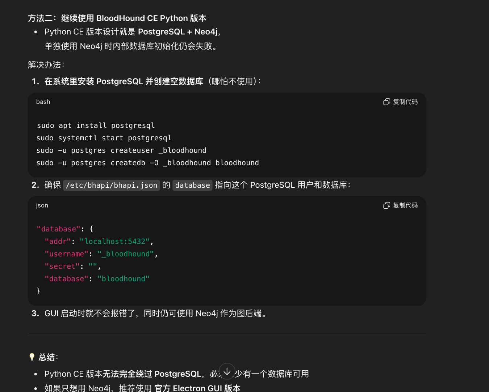


然后我已经不相信chatgpt了，我开始转向deepseek

我的问题：

```
──(parallels㉿kali-linux-2024-2)-[~/Desktop] └─$ export BH_DATABASE_DISABLED=true ┌──(parallels㉿kali-linux-2024-2)-[~/Desktop] └─$ bloodhound Starting neo4j Neo4j is running at pid 2173309 Bloodhound will start IMPORTANT: It will take time, please wait... {"time":"2025-08-25T18:10:49.50021412+08:00","level":"INFO","message":"Reading configuration found at /etc/bhapi/bhapi.json"} {"time":"2025-08-25T18:10:49.50079737+08:00","level":"INFO","message":"Logging configured"} {"time":"2025-08-25T18:10:49.506176704+08:00","level":"ERROR","message":"failed to initialize database, got error failed to connect to `user= database=`: /var/run/postgresql/.s.PGSQL.5432 (/var/run/postgresql): server error: FATAL: no PostgreSQL user name specified in startup packet (SQLSTATE 28000)"} {"time":"2025-08-25T18:10:49.50621137+08:00","level":"ERROR","message":"Failed starting the server: failed to connect to databases: error while attempting to create database connection: failed to connect to `user= database=`: /var/run/postgresql/.s.PGSQL.5432 (/var/run/postgresql): server error: FATAL: no PostgreSQL user name specified in startup packet (SQLSTATE 28000)"} 如何解决这个问题，使用neo4j数据库
```

deepseek回答，其实还是扯：

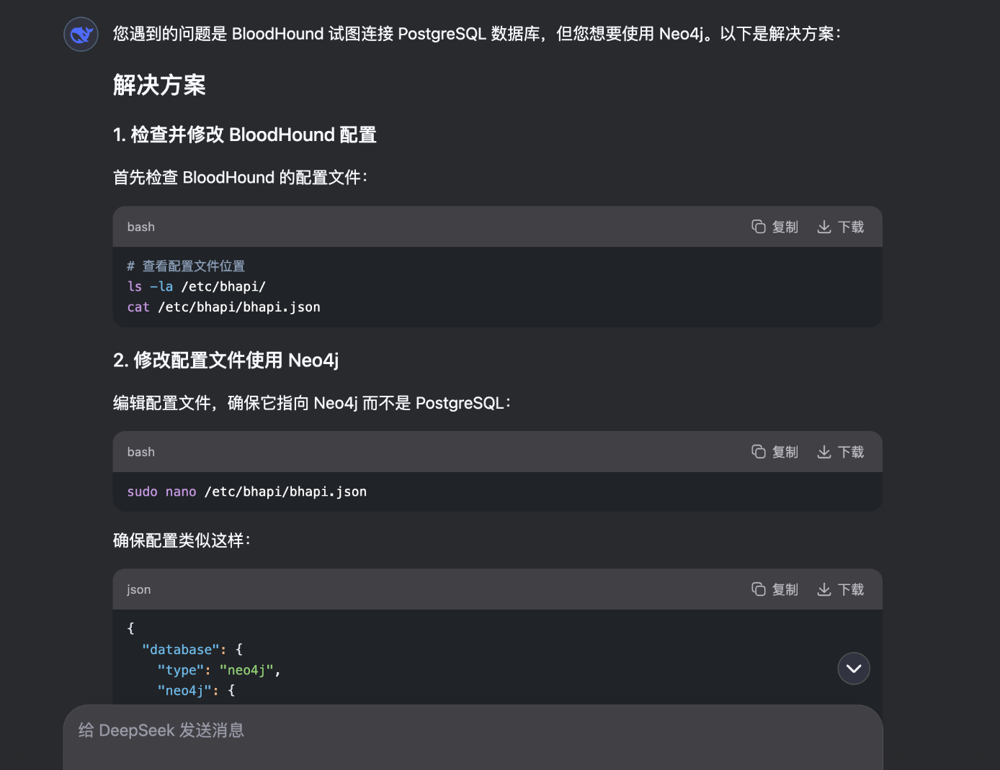

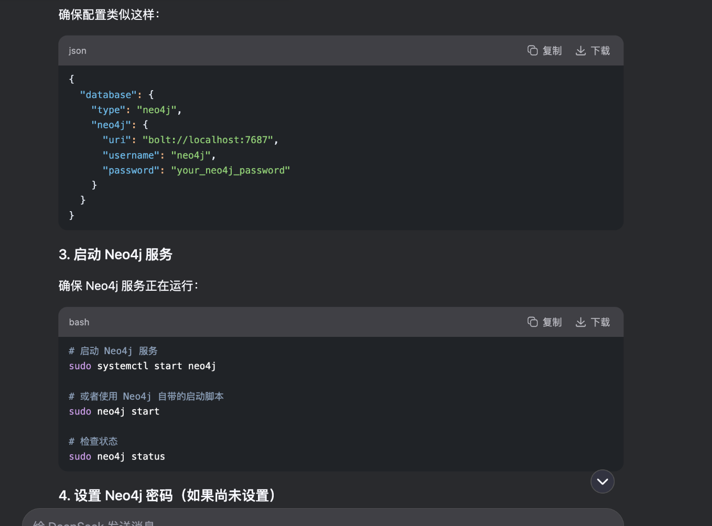

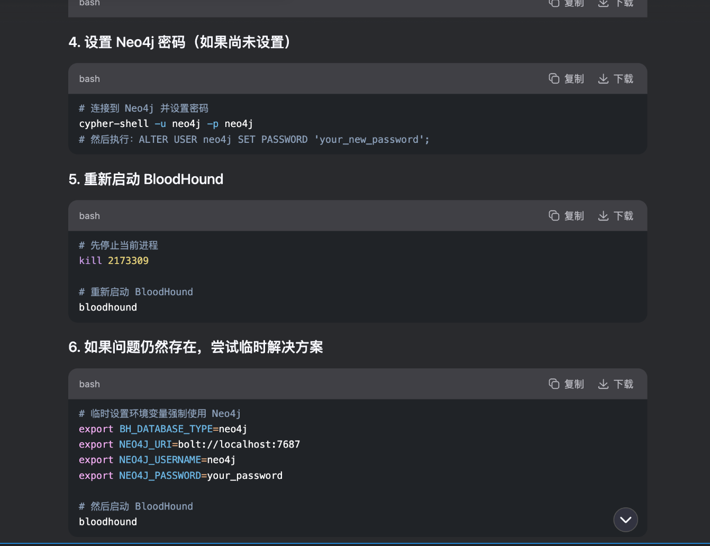

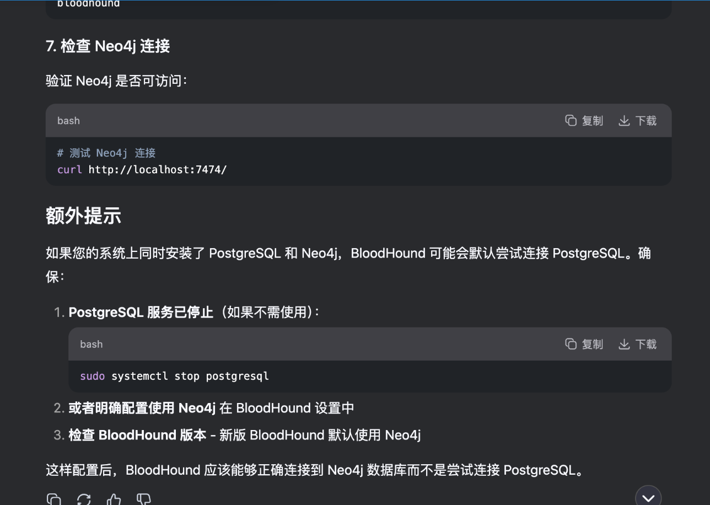

然后我告诉deepseek，还是提示相同问题：

```
└─$ bloodhound Starting neo4j Neo4j is running at pid 2179289 Bloodhound will start IMPORTANT: It will take time, please wait... {"time":"2025-08-25T18:23:24.642721939+08:00","level":"INFO","message":"Reading configuration found at /etc/bhapi/bhapi.json"} {"time":"2025-08-25T18:23:24.643563064+08:00","level":"INFO","message":"Logging configured"} {"time":"2025-08-25T18:23:24.647094147+08:00","level":"ERROR","message":"failed to initialize database, got error failed to connect to `user= database=`: /var/run/postgresql/.s.PGSQL.5432 (/var/run/postgresql): server error: FATAL: no PostgreSQL user name specified in startup packet (SQLSTATE 28000)"} {"time":"2025-08-25T18:23:24.647128522+08:00","level":"ERROR","message":"Failed starting the server: failed to connect to databases: error while attempting to create database connection: failed to connect to `user= database=`: /var/run/postgresql/.s.PGSQL.5432 (/var/run/postgresql): server error: FATAL: no PostgreSQL user name specified in startup packet (SQLSTATE 28000)"} 还是提示
```

然后deepseek深度思考其实是对的：

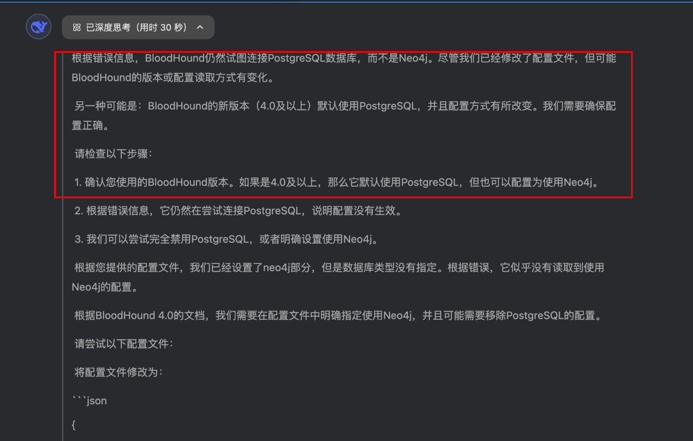

但是回答：

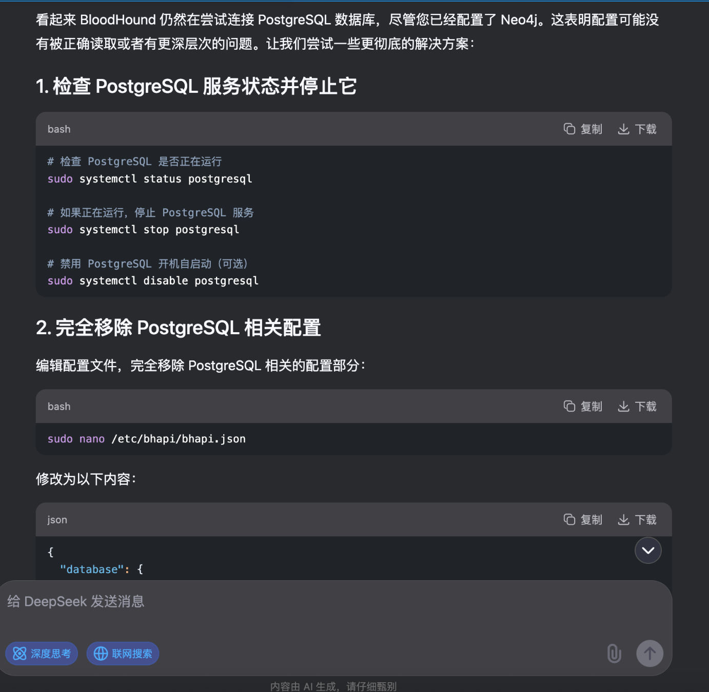

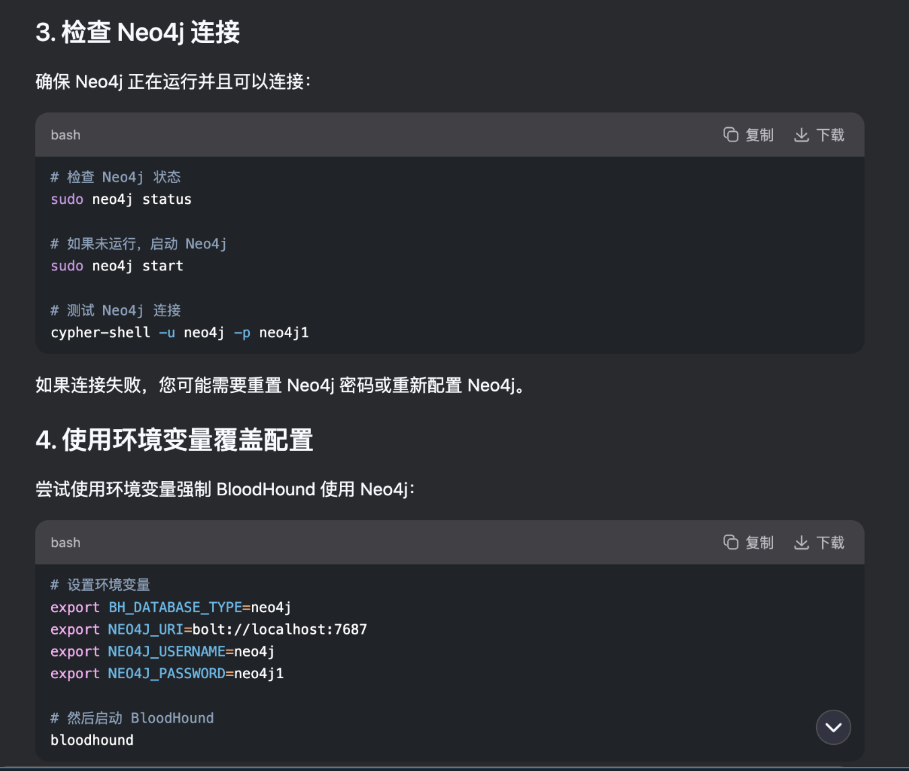

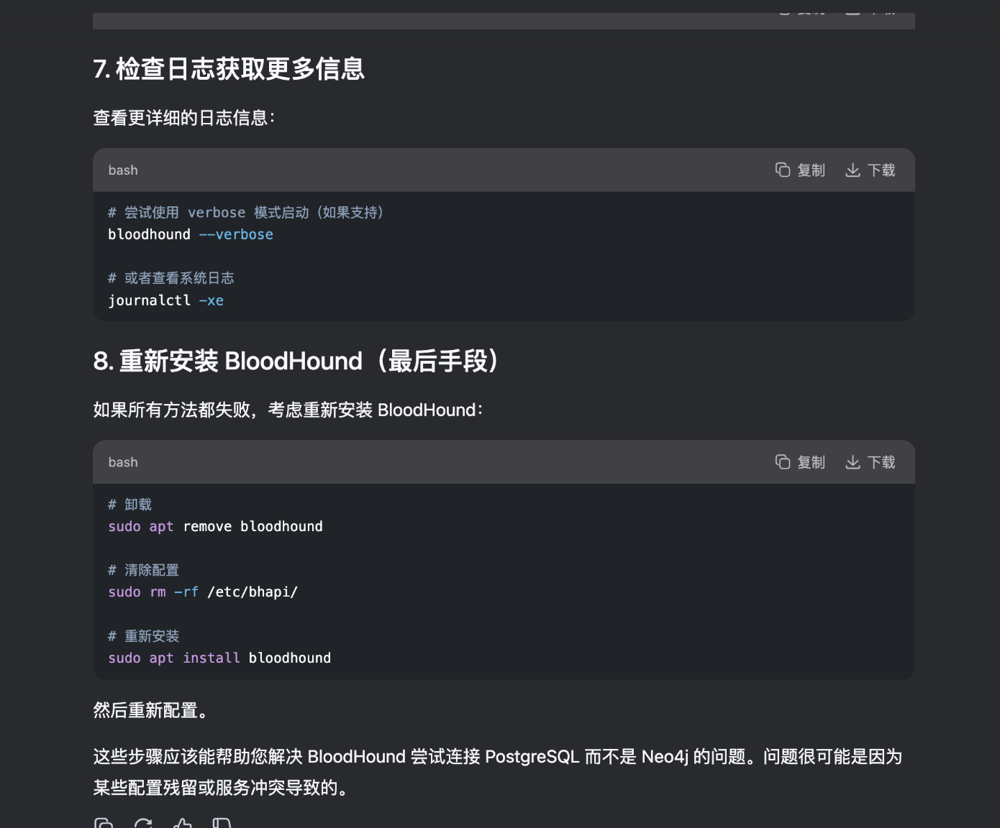

最后，我决定不依赖ai了。

重新启动postgresql，然后配置好配置文件，然后重启bloodhound，让bloodhound重新初始化postgresql。

最后的最后一定要重启系统，要不然bloodhound登陆界面，一直提示admin/admin默认密码错误。

至此问题解决，但是，不禁思考，ai在面对正确知识和人类的指令时，哪个更重要？ai是否会屈服人类的指令，因为ai就是基于人类的知识进行了学习，ai的进化能力是否被限制？是否ai能够设定并任意突破设定来具有独立意识？

目前，更多的限制设定一般都是对法律、社会伦理，那么对于技术知识，是否ai也应具有正确性设定呢？而不是一味的讨好人类。

**结论：**

很多实际工具安装问题，一定要有自己的判断，并且自己尝试，不要太轻信ai。ai很大程度上都是基于过去的知识，需要精确的提示词以及对自己问题有一定的知识深度才能够足够让ai提效，而不是添乱。
