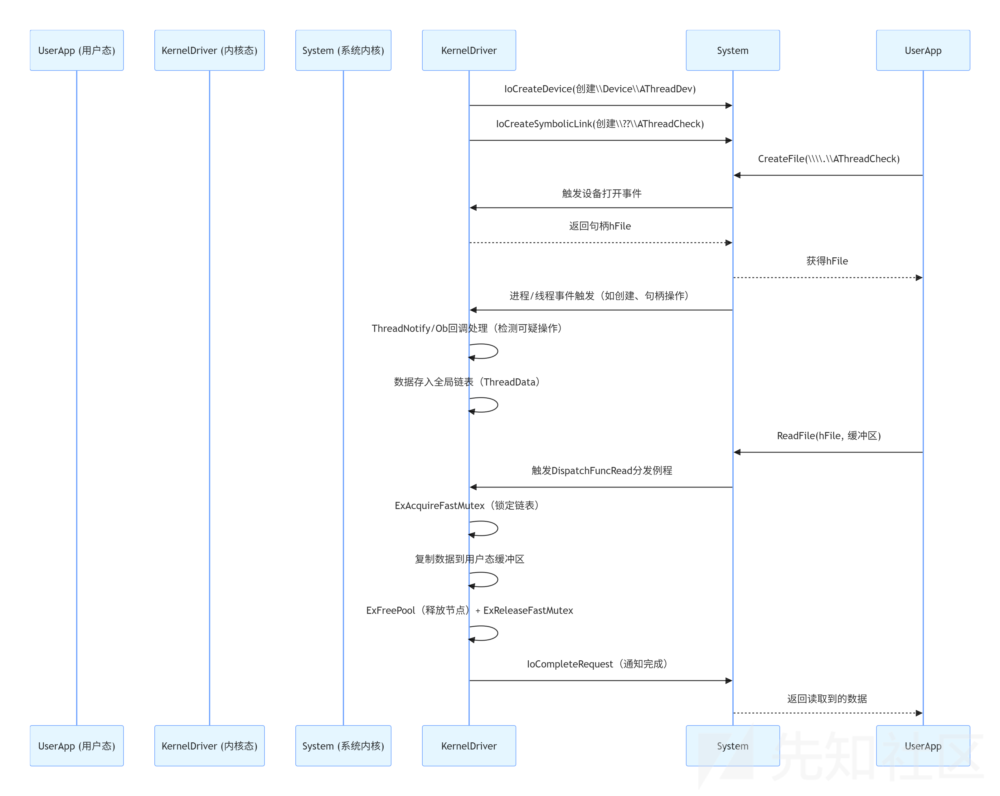
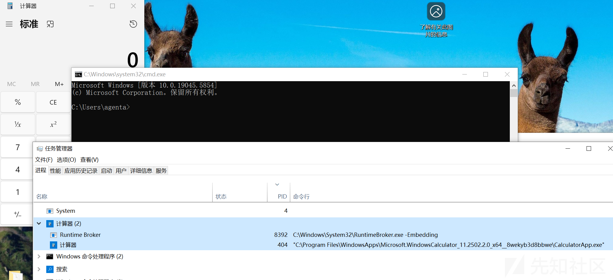
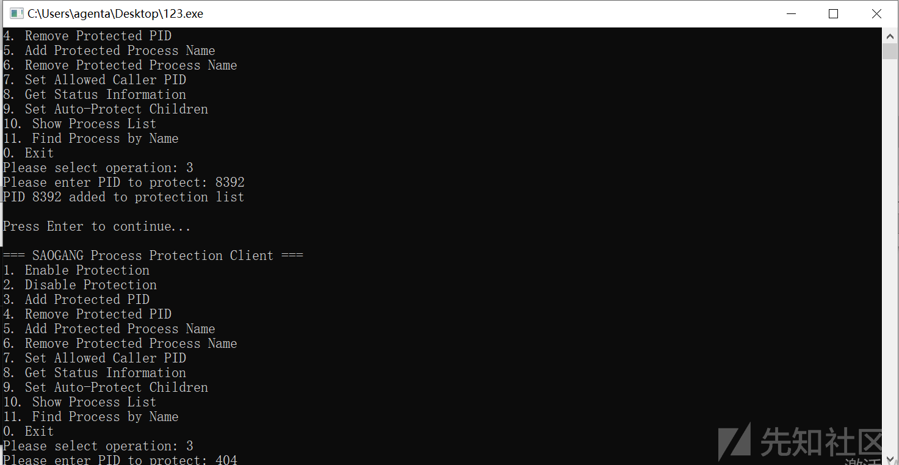
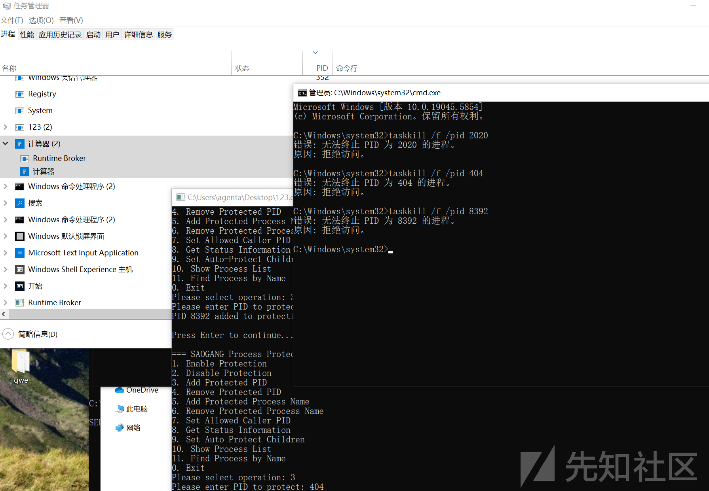

# 从进程终结到内核级防护：深度解析Windows进程保护机制与对抗技术-先知社区

> **来源**: https://xz.aliyun.com/news/18733  
> **文章ID**: 18733

---

# NO-TskKILL

## 了解可以通过哪些方式来结束进程

1.任务管理器结束任务 ：任务管理器中右键进程选择结束任务，底层调用：先发送WM\_CLOSE消息（窗口程序）或CTRL\_CLOSE\_EVENT信号（控制台程序），本质是请求进程正常关闭 特点：进程可选择响应（如保存数据）或忽略，类似taskkill /pid

2.任务管理器-结束进程树操作：任务管理器中右键选择结束进程树， 底层调用：先尝试对目标进程及其所有子进程发送正常关闭请求，无响应时会调用TerminateProcess强制终止 特点：递归处理进程间的父子关系，确保关联相关进程都被终止 。

3.tskill 1234命令 操作：对窗口程序：发送`WM_CLOSE`消息（类似点击窗口右上角关闭按钮）对控制台程序：发送`CTRL_CLOSE_EVENT`信号。目标进程可以选择处理该请求，也可以忽略该请求。如果程序没有处理逻辑在当目标进程长时间无响应（默认超时时间）时，`taskkill /pid 1234`才会降级为强制终止，此时才会调用`TerminateProcess`（taskkill /f /pid 1234）。

4.PowerShell Stop-Process -Force -Id 1234 操作：PowerShell 中的强制终止命令 底层调用：最终会调用TerminateProcess API 特点：PowerShell 的封装命令，强制终止时与taskkill /f等价

5.ntsd -c q -p 1234调试器命令 操作：通过调试器附加并终止进程 底层调用：利用调试权限强制结束进程，过程中会调用TerminateProcess但带有调试器特殊权限 特点：可绕过部分用户态的进程保护，需要SeDebugPrivilege权限

5.发送WM\_QUIT消息 操作：通过编程方式（如PostQuitMessage函数） 底层调用：向消息循环发送退出信号，进程会自行结束 特点：完全由进程自主处理，属于正常退出，不会被视为强制终止

还有就是程序自身执行exit不需要权限，进程对自身拥有完全控制权

## 理解 Windows 内核进程保护

程序和驱动是怎么交互的

程序和驱动通过设备接口和标准 I/O 操作进行交互，这是 Windows 内核与用户态通信的经典方式。

```
// 驱动中创建设备和符号链接
UNICODE_STRING DevName = RTL_CONSTantString(L"\Device\AThreadDev");
IoCreateDevice(..., &DevName, &DeviceObject);

UNICODE_STRING SymbolicLink = RTL_CONSTANT_STRING(L"\??\AThreadCheck");
IoCreateSymbolicLink(&SymbolicLink, &DevName);
```

**设备对象**：`\\Device\\AThreadDev`这是内核态的设备标识，用户态无法直接访问。

**符号链接**：`\\??\\AThreadCheck`这是暴露给用户态的 别名，用户态程序通过`\\\\.\\AThreadCheck`路径即可访问内核设备。

用户态程序通过`CreateFile`打开符号链接，建立与内核设备的连接：

```
// 用户态打开设备
HANDLE hFile = CreateFile(
L"\\.\AThreadCheck",  // 符号链接路径
GENERIC_READ,                // 只读权限（因为只需要读取检测结果）
0, NULL, OPEN_EXISTING, 0, NULL
);
```

成功后获得一个`hFile`句柄，后续通过该句柄与驱动通信

当驱动的线程回调`ThreadNotify`检测到可疑线程注入时

用户态程序通过`ReadFile`从驱动读取数据：

此时内核驱动的`DispatchFuncRead`分发例程被触发，执行以下操作：

1. 锁定全局链表（`ExAcquireFastMutex`），保证线程安全
2. 将链表中的`ThreadData`数据复制到用户态缓冲区
3. 释放链表中的节点（`ExFreePool`）并更新计数
4. 通过`IoCompleteRequest`通知用户态操作完成

所以总结下来就是**驱动创建接口 → 用户态连接接口 → 驱动收集数据 → 用户态读取数据**



内核态是 Windows 系统的 “特权区域”，所有进程的创建、句柄操作、内存访问最终都会经过内核。在内核态实现保护，相当于在 “系统最底层” 设置拦截点，能覆盖所有用户态工具（如`taskkill`、任务管理器）和恶意程序的操作路径，防护更彻底。

要理解进程保护的实现，必须先搞懂 Windows 内核中两个关键机制：进程句柄管理和内核回调注册。这是驱动代码能实现保护的技术基石。

句柄

在 Windows 中，用户态程序无法直接操作EPROCESS（内核中表示进程的结构体），必须通过 “进程句柄”（HANDLE）间接操作 —— 句柄相当于一把 “钥匙”，钥匙上的 “权限”（如PROCESS\_TERMINATE、PROCESS\_VM\_WRITE）决定了程序能对进程做什么。 例如： taskkill终止进程时，会先调用OpenProcess(PROCESS\_TERMINATE, ...)获取 “带终止权限的句柄”； 若句柄没有PROCESS\_TERMINATE权限，后续调用TerminateProcess会直接返回 “权限不足”。

例如taskkill终止进程时，会先调用`OpenProcess(PROCESS_TERMINATE, ...)`获取 “带终止权限的句柄”；

若句柄没有PROCESS\_TERMINATE权限，后续调用`TerminateProcess`会直接返回 “权限不足”。拦截 “句柄创建” 过程，移除危险权限，就能阻止大部分进程操作

管理员模式下，会绕过部分 `OpenProcess` 校验，直接通过内核特权接口获取高权限句柄，驱动的 `Ob` 回调 “看不到” 这个句柄操作。

所以通过ObRegisterCallbacks注册进程回调，当检测到受保护进程被打开时，会移除PROCESS\_TERMINATE等危险权限（Info->Parameters->CreateHandleInformation.DesiredAccess &= ~PROTECT\_ACCESS\_MASK）。 这直接导致taskkill /f在调用OpenProcess(PROCESS\_TERMINATE, ...)时无法获得终止权限，后续TerminateProcess会因权限不足失败。就是剥离句柄权限

**Ob 回调**  
Windows 提供了`ObRegisterCallbacks`函数，允许内核驱动注册 “句柄操作回调”—— 当有程序创建、复制进程 / 线程句柄时，内核会先调用驱动的回调函数，驱动可以在此时修改句柄的权限或直接拒绝操作。  
比如这个通过`Ob`回调实现了句柄拦截

```
OB_OPERATION_REGISTRATION operations[] = {
{
PsProcessType,  // 监控“进程句柄”操作
OB_OPERATION_HANDLE_CREATE | OB_OPERATION_HANDLE_DUPLICATE,  // 监控“创建”和“复制”
OnPreOpenProcess, NULL  // 回调函数
},
{
PsThreadType,   // 同时监控“线程句柄”操作
OB_OPERATION_HANDLE_CREATE | OB_OPERATION_HANDLE_DUPLICATE,
OnPreOpenThread, NULL
}
};
```

当taskkill调用OpenProcess创建句柄时，OnPreOpenProcess会被触发，驱动会检查目标进程是否在保护列表中，若在则移除PROCESS\_TERMINATE等危险权限：  
`Info->Parameters->CreateHandleInformation.DesiredAccess &= ~PROTECT_ACCESS_MASK;`

**子进程自动保护**

拦截现有进程的操作，驱动还需要应对 “动态创建的子进程”（如浏览器启动的子进程、服务进程的子进程）。Windows 提供了`PsSetCreateProcessNotifyRoutineEx`函数，允许驱动注册 “进程创建回调”

```
VOID OnProcessNotify(PEPROCESS Process, HANDLE ProcessId, PPS_CREATE_NOTIFY_INFO CreateInfo) {
if (!CreateInfo || !g_AutoProtectChildren) return;
// 获取父进程PID
ULONG parentPid = HandleToULong(CreateInfo->CreatingThreadId.UniqueProcess);
// 若父进程被保护，自动添加子进程到保护列表
if (IsPidProtected(parentPid)) {
WCHAR childProcessName[MAX_PROCESS_NAME_LEN];
GetProcessNameByPid(childProcessName, ...);
AddProtectedPid(childPid, childProcessName);
}
}
```

内核级进程保护。它通过拦截系统调用和注册回调函数来实现对特定进程的保护，防止恶意软件终止或操作受保护的进程。

## **核心功能模块**

**1. 进程保护机制**

```
// 保护常量定义
#define MAX_PROTECTED_PIDS 64        // 最多保护64个进程
#define MAX_PROCESS_NAME_LEN 256     // 进程名最大长度
#define MAX_PROTECTED_NAMES 16       // 最多保护16个进程名模式
```

**保护策略**

**PID保护**：直接保护指定PID的进程

**名称保护**：支持精确匹配和模糊匹配进程名

**自动保护**：受保护进程的子进程自动获得保护

**2. 权限拦截机制**

```
// 进程访问权限掩码
#define PROTECT_ACCESS_MASK (PROCESS_TERMINATE | PROCESS_CREATE_THREAD | \
PROCESS_VM_OPERATION | PROCESS_VM_WRITE | \
PROCESS_SUSPEND_RESUME | PROCESS_SET_QUOTA | \
PROCESS_SET_INFORMATION)
// 线程保护权限掩码
#define THREAD_PROTECT_MASK (THREAD_TERMINATE | THREAD_SUSPEND_RESUME | \
THREAD_SET_CONTEXT | THREAD_IMPERSONATE | \
THREAD_DIRECT_IMPERSONATION | THREAD_SET_LIMITED_INFORMATION)
```

**拦截的恶意操作**：

进程终止（PROCESS\_TERMINATE）

创建远程线程（PROCESS\_CREATE\_THREAD）

内存操作（PROCESS\_VM\_OPERATION, PROCESS\_VM\_WRITE）

进程挂起/恢复（PROCESS\_SUSPEND\_RESUME）

设置进程配额和信息（PROCESS\_SET\_QUOTA, PROCESS\_SET\_INFORMATION）

**3. 内核回调注册**

```
// 注册对象回调
OB_OPERATION_REGISTRATION operations[] = {
    {
        PsProcessType,           // 进程类型
        OB_OPERATION_HANDLE_CREATE | OB_OPERATION_HANDLE_DUPLICATE,
        OnPreOpenProcess, NULL   // 进程打开前回调
    },
    {
        PsThreadType,            // 线程类型
        OB_OPERATION_HANDLE_CREATE | OB_OPERATION_HANDLE_DUPLICATE,
        OnPreOpenThread, NULL    // 线程打开前回调
    }
};
```

**回调机制**：

OnPreOpenProcess：在进程句柄创建前拦截

OnPreOpenThread：在线程句柄创建前拦截

通过修改DesiredAccess来限制访问权限

**4. 自旋锁保护**

```
static KSPIN_LOCK g_ProtectedListLock;      // 保护进程列表锁
static KSPIN_LOCK g_ProtectedNamesLock;     // 保护名称列表锁

// 使用自旋锁保护共享数据结构
KIRQL oldIrql;
KeAcquireSpinLock(&g_ProtectedListLock, &oldIrql);
// ... 操作受保护的数据 ...
KeReleaseSpinLock(&g_ProtectedListLock, oldIrql);
```

**5.权限验证**

```
static BOOLEAN ValidateCallerAccess(PIRP Irp)
{
    ULONG callerPid = HandleToULong(PsGetCurrentProcessId());
    
    // SYSTEM进程总是允许
    if (callerPid == 4) return TRUE;
    
    // 检查是否为允许的调用者PID
    if (g_AllowCallerPid != 0 && callerPid == g_AllowCallerPid) return TRUE;
    
    // 检查调用者权限
    // ...
}
```



因为calc是UWP应用，所以calc有两个进程

​

使用pid添加保护



以管理员权限运行taskkill /f /pid



可以看到管理员权限下使用taskkill /f命令给拒绝了

功能并不是很完善，只针对`TerminateProcess`

源代码

saogang.sys

```
#include <ntifs.h>
#include <ntstrsafe.h>
#include <ntddk.h>

// 保护常量定义
#define MAX_PROTECTED_PIDS 64
#define MAX_PROCESS_NAME_LEN 256
#define MAX_PROTECTED_NAMES 16

// 进程保护信息结构
typedef struct _PROTECTED_PROCESS_INFO {
    ULONG Pid;
    WCHAR ProcessName[MAX_PROCESS_NAME_LEN];
    LARGE_INTEGER ProtectionTime;
    BOOLEAN IsActive;
} PROTECTED_PROCESS_INFO, * PPROTECTED_PROCESS_INFO;

// 进程名称保护结构
typedef struct _PROCESS_NAME_PROTECTION {
    WCHAR ProcessName[MAX_PROCESS_NAME_LEN];
    BOOLEAN IsActive;
    BOOLEAN ExactMatch;  // TRUE=精确匹配, FALSE=模糊匹配
} PROCESS_NAME_PROTECTION, * PPROCESS_NAME_PROTECTION;

// 全局变量
volatile BOOLEAN g_ProtectionEnabled = TRUE;
volatile BOOLEAN g_AutoProtectChildren = TRUE;
volatile ULONG g_AllowCallerPid = 0;

// 受保护的进程列表
static PROTECTED_PROCESS_INFO g_ProtectedProcesses[MAX_PROTECTED_PIDS];
static PROCESS_NAME_PROTECTION g_ProtectedNames[MAX_PROTECTED_NAMES];
static KSPIN_LOCK g_ProtectedListLock;
static KSPIN_LOCK g_ProtectedNamesLock;

// 进程访问权限掩码
#define PROCESS_TERMINATE 1
#ifndef PROCESS_CREATE_THREAD
#define PROCESS_CREATE_THREAD 0x0002
#endif
#ifndef PROCESS_VM_OPERATION
#define PROCESS_VM_OPERATION 0x0008
#endif
#ifndef PROCESS_VM_WRITE
#define PROCESS_VM_WRITE 0x0020
#endif
#ifndef PROCESS_SUSPEND_RESUME
#define PROCESS_SUSPEND_RESUME 0x0800
#endif
#ifndef PROCESS_SET_QUOTA
#define PROCESS_SET_QUOTA 0x0100
#endif
#ifndef PROCESS_SET_INFORMATION
#define PROCESS_SET_INFORMATION 0x0200
#endif

#define PROTECT_ACCESS_MASK (PROCESS_TERMINATE | PROCESS_CREATE_THREAD | PROCESS_VM_OPERATION | PROCESS_VM_WRITE | PROCESS_SUSPEND_RESUME | PROCESS_SET_QUOTA | PROCESS_SET_INFORMATION)

// 线程保护权限掩码
#ifndef THREAD_TERMINATE
#define THREAD_TERMINATE 0x0001
#endif
#ifndef THREAD_SUSPEND_RESUME
#define THREAD_SUSPEND_RESUME 0x0002
#endif
#ifndef THREAD_SET_CONTEXT
#define THREAD_SET_CONTEXT 0x0010
#endif
#ifndef THREAD_IMPERSONATE
#define THREAD_IMPERSONATE 0x0100
#endif
#ifndef THREAD_DIRECT_IMPERSONATION
#define THREAD_DIRECT_IMPERSONATION 0x0200
#endif
#ifndef THREAD_SET_LIMITED_INFORMATION
#define THREAD_SET_LIMITED_INFORMATION 0x0400
#endif

#define THREAD_PROTECT_MASK (THREAD_TERMINATE | THREAD_SUSPEND_RESUME | THREAD_SET_CONTEXT | THREAD_IMPERSONATE | THREAD_DIRECT_IMPERSONATION | THREAD_SET_LIMITED_INFORMATION)

// 设备名称
#define SAOGANG_DEVICE_NAME L"\Device\saogang"
#define SAOGANG_SYMLINK_NAME L"\DosDevices\saogang"

// IOCTL 代码
#define IOCTL_SAOGANG_ENABLE_PROTECTION CTL_CODE(FILE_DEVICE_UNKNOWN, 0x800, METHOD_BUFFERED, FILE_ANY_ACCESS)
#define IOCTL_SAOGANG_DISABLE_PROTECTION CTL_CODE(FILE_DEVICE_UNKNOWN, 0x801, METHOD_BUFFERED, FILE_ANY_ACCESS)
#define IOCTL_SAOGANG_ADD_PID CTL_CODE(FILE_DEVICE_UNKNOWN, 0x802, METHOD_BUFFERED, FILE_ANY_ACCESS)
#define IOCTL_SAOGANG_REMOVE_PID CTL_CODE(FILE_DEVICE_UNKNOWN, 0x803, METHOD_BUFFERED, FILE_ANY_ACCESS)
#define IOCTL_SAOGANG_ADD_NAME CTL_CODE(FILE_DEVICE_UNKNOWN, 0x804, METHOD_BUFFERED, FILE_ANY_ACCESS)
#define IOCTL_SAOGANG_REMOVE_NAME CTL_CODE(FILE_DEVICE_UNKNOWN, 0x805, METHOD_BUFFERED, FILE_ANY_ACCESS)
#define IOCTL_SAOGANG_SET_ALLOWPID CTL_CODE(FILE_DEVICE_UNKNOWN, 0x806, METHOD_BUFFERED, FILE_ANY_ACCESS)
#define IOCTL_SAOGANG_GET_STATUS CTL_CODE(FILE_DEVICE_UNKNOWN, 0x807, METHOD_BUFFERED, FILE_ANY_ACCESS)
#define IOCTL_SAOGANG_SET_AUTOCHILD CTL_CODE(FILE_DEVICE_UNKNOWN, 0x808, METHOD_BUFFERED, FILE_ANY_ACCESS)

// 状态结构
typedef struct _SAOGANG_STATUS {
    BOOLEAN ProtectionEnabled;
    BOOLEAN AutoProtectChildren;
    ULONG ProtectedPidCount;
    ULONG ProtectedNameCount;
    ULONG AllowCallerPid;
} SAOGANG_STATUS, * PSAOGANG_STATUS;

// 添加名称结构
typedef struct _ADD_NAME_REQUEST {
    WCHAR ProcessName[MAX_PROCESS_NAME_LEN];
    BOOLEAN ExactMatch;
} ADD_NAME_REQUEST, * PADD_NAME_REQUEST;

// 全局句柄
PVOID g_RegHandle = NULL;
PDEVICE_OBJECT g_DeviceObject = NULL;

// 函数声明
void DriverUnload(PDRIVER_OBJECT pDriverObject);
OB_PREOP_CALLBACK_STATUS OnPreOpenProcess(PVOID RegistrationContext, POB_PRE_OPERATION_INFORMATION Info);
OB_PREOP_CALLBACK_STATUS OnPreOpenThread(PVOID RegistrationContext, POB_PRE_OPERATION_INFORMATION Info);
VOID OnProcessNotify(PEPROCESS Process, HANDLE ProcessId, PPS_CREATE_NOTIFY_INFO CreateInfo);
NTSTATUS DeviceCreateClose(PDEVICE_OBJECT DeviceObject, PIRP Irp);
NTSTATUS DeviceIoControl(PDEVICE_OBJECT DeviceObject, PIRP Irp);

// 内部函数
static BOOLEAN IsPidProtected(ULONG pid);
static BOOLEAN IsProcessNameProtected(PWCHAR processName);
static VOID AddProtectedPid(ULONG pid, PWCHAR processName);
static VOID RemoveProtectedPid(ULONG pid);
static VOID AddProtectedName(PWCHAR processName, BOOLEAN exactMatch);
static VOID RemoveProtectedName(PWCHAR processName);
static BOOLEAN GetProcessNameByPid(ULONG pid, PWCHAR processName, SIZE_T nameSize);
static BOOLEAN ValidateCallerAccess(PIRP Irp);
static VOID LogEvent(PWCHAR message, NTSTATUS status);
static VOID CleanupExpiredProtections();

// 前向声明
DRIVER_DISPATCH DeviceCreateClose;
DRIVER_DISPATCH DeviceIoControl;

// 权限验证函数
static BOOLEAN ValidateCallerAccess(PIRP Irp)
{
    PIO_STACK_LOCATION irpSp = IoGetCurrentIrpStackLocation(Irp);

    // 权限验证 - 检查是否为允许的PID
    ULONG callerPid = HandleToULong(PsGetCurrentProcessId());

    // SYSTEM进程总是允许
    if (callerPid == 4) {
        return TRUE;
    }

    // 检查是否为允许的调用者PID
    if (g_AllowCallerPid != 0 && callerPid == g_AllowCallerPid) {
        return TRUE;
    }

    // 检查调用者是否有足够的权限（简化版本）
    if (irpSp->Parameters.Create.SecurityContext &&
        irpSp->Parameters.Create.SecurityContext->AccessState) {
        PACCESS_STATE accessState = irpSp->Parameters.Create.SecurityContext->AccessState;

        // 如果调用者有足够的访问权限，则允许
        if (accessState->PreviouslyGrantedAccess & (FILE_GENERIC_READ | FILE_GENERIC_WRITE)) {
            return TRUE;
        }
    }

    return FALSE;
}

// 检查PID是否受保护
static BOOLEAN IsPidProtected(ULONG pid)
{
    if (pid == 0 || !g_ProtectionEnabled)
        return FALSE;

    // 检查是否为允许的调用者
    ULONG currentPid = HandleToULong(PsGetCurrentProcessId());
    if (currentPid == 4 || (g_AllowCallerPid != 0 && currentPid == g_AllowCallerPid))
        return FALSE;

    KIRQL oldIrql;
    KeAcquireSpinLock(&g_ProtectedListLock, &oldIrql);

    BOOLEAN found = FALSE;
    for (int i = 0; i < MAX_PROTECTED_PIDS; ++i) {
        if (g_ProtectedProcesses[i].IsActive && g_ProtectedProcesses[i].Pid == pid) {
            found = TRUE;
            break;
        }
    }

    KeReleaseSpinLock(&g_ProtectedListLock, oldIrql);
    return found;
}

// 检查进程名称是否受保护
static BOOLEAN IsProcessNameProtected(PWCHAR processName)
{
    if (!processName || !g_ProtectionEnabled)
        return FALSE;

    KIRQL oldIrql;
    KeAcquireSpinLock(&g_ProtectedNamesLock, &oldIrql);

    BOOLEAN found = FALSE;
    for (int i = 0; i < MAX_PROTECTED_NAMES; ++i) {
        if (g_ProtectedNames[i].IsActive) {
            if (g_ProtectedNames[i].ExactMatch) {
                if (RtlCompareMemory(processName, g_ProtectedNames[i].ProcessName,
                    wcslen(processName) * sizeof(WCHAR)) == wcslen(processName) * sizeof(WCHAR)) {
                    found = TRUE;
                    break;
                }
            }
            else {
                // 模糊匹配
                if (wcsstr(processName, g_ProtectedNames[i].ProcessName) != NULL) {
                    found = TRUE;
                    break;
                }
            }
        }
    }

    KeReleaseSpinLock(&g_ProtectedNamesLock, oldIrql);
    return found;
}

// 添加受保护的进程PID
static VOID AddProtectedPid(ULONG pid, PWCHAR processName)
{
    if (pid == 0)
        return;

    KIRQL oldIrql;
    KeAcquireSpinLock(&g_ProtectedListLock, &oldIrql);

    // 查找空闲位置或更新现有项
    for (int i = 0; i < MAX_PROTECTED_PIDS; ++i) {
        if (!g_ProtectedProcesses[i].IsActive || g_ProtectedProcesses[i].Pid == pid) {
            g_ProtectedProcesses[i].Pid = pid;
            g_ProtectedProcesses[i].IsActive = TRUE;
            KeQuerySystemTime(&g_ProtectedProcesses[i].ProtectionTime);

            if (processName) {
                RtlZeroMemory(g_ProtectedProcesses[i].ProcessName, MAX_PROCESS_NAME_LEN);
                SIZE_T copySize = wcslen(processName) * sizeof(WCHAR);
                if (copySize > MAX_PROCESS_NAME_LEN - sizeof(WCHAR)) {
                    copySize = MAX_PROCESS_NAME_LEN - sizeof(WCHAR);
                }
                RtlCopyMemory(g_ProtectedProcesses[i].ProcessName, processName, copySize);
            }
            break;
        }
    }

    KeReleaseSpinLock(&g_ProtectedListLock, oldIrql);

    LogEvent(L"Added protected PID", STATUS_SUCCESS);
}

// 移除受保护的进程PID
static VOID RemoveProtectedPid(ULONG pid)
{
    if (pid == 0)
        return;

    KIRQL oldIrql;
    KeAcquireSpinLock(&g_ProtectedListLock, &oldIrql);

    for (int i = 0; i < MAX_PROTECTED_PIDS; ++i) {
        if (g_ProtectedProcesses[i].IsActive && g_ProtectedProcesses[i].Pid == pid) {
            g_ProtectedProcesses[i].IsActive = FALSE;
            g_ProtectedProcesses[i].Pid = 0;
            RtlZeroMemory(g_ProtectedProcesses[i].ProcessName, MAX_PROCESS_NAME_LEN);
            break;
        }
    }

    KeReleaseSpinLock(&g_ProtectedListLock, oldIrql);

    LogEvent(L"Removed protected PID", STATUS_SUCCESS);
}

// 添加受保护的进程名称
static VOID AddProtectedName(PWCHAR processName, BOOLEAN exactMatch)
{
    if (!processName)
        return;

    KIRQL oldIrql;
    KeAcquireSpinLock(&g_ProtectedNamesLock, &oldIrql);

    for (int i = 0; i < MAX_PROTECTED_NAMES; ++i) {
        if (!g_ProtectedNames[i].IsActive) {
            g_ProtectedNames[i].IsActive = TRUE;
            g_ProtectedNames[i].ExactMatch = exactMatch;
            RtlZeroMemory(g_ProtectedNames[i].ProcessName, MAX_PROCESS_NAME_LEN);
            SIZE_T copySize = wcslen(processName) * sizeof(WCHAR);
            if (copySize > MAX_PROCESS_NAME_LEN - sizeof(WCHAR)) {
                copySize = MAX_PROCESS_NAME_LEN - sizeof(WCHAR);
            }
            RtlCopyMemory(g_ProtectedNames[i].ProcessName, processName, copySize);
            break;
        }
    }

    KeReleaseSpinLock(&g_ProtectedNamesLock, oldIrql);
}

// 移除受保护的进程名称
static VOID RemoveProtectedName(PWCHAR processName)
{
    if (!processName)
        return;

    KIRQL oldIrql;
    KeAcquireSpinLock(&g_ProtectedNamesLock, &oldIrql);

    for (int i = 0; i < MAX_PROTECTED_NAMES; ++i) {
        if (g_ProtectedNames[i].IsActive &&
            RtlCompareMemory(processName, g_ProtectedNames[i].ProcessName,
                wcslen(processName) * sizeof(WCHAR)) == wcslen(processName) * sizeof(WCHAR)) {
            g_ProtectedNames[i].IsActive = FALSE;
            RtlZeroMemory(g_ProtectedNames[i].ProcessName, MAX_PROCESS_NAME_LEN);
            break;
        }
    }

    KeReleaseSpinLock(&g_ProtectedNamesLock, oldIrql);
}

// 根据PID获取进程名称
static BOOLEAN GetProcessNameByPid(ULONG pid, PWCHAR processName, SIZE_T nameSize)
{
    PEPROCESS process;
    NTSTATUS status = PsLookupProcessByProcessId((HANDLE)(ULONG_PTR)pid, &process);
    if (!NT_SUCCESS(status))
        return FALSE;

    // 简化版本 - 直接返回进程名，不实际获取
    // 注意：SeLocateProcessImageName在某些WDK版本中可能不存在
    // 这里使用一个简化的方法

    // 设置默认名称
    wcscpy_s(processName, nameSize / sizeof(WCHAR), L"unknown.exe");

    ObDereferenceObject(process);

    // 在实际应用中，这里需要使用其他方法来获取进程名
    // 比如通过进程通知回调来记录进程名

    return TRUE;
}

// 清理过期的保护
static VOID CleanupExpiredProtections()
{
    LARGE_INTEGER currentTime;
    KeQuerySystemTime(&currentTime);

    KIRQL oldIrql;
    KeAcquireSpinLock(&g_ProtectedListLock, &oldIrql);

    for (int i = 0; i < MAX_PROTECTED_PIDS; ++i) {
        if (g_ProtectedProcesses[i].IsActive) {
            // 检查进程是否仍然存在
            PEPROCESS process;
            if (!NT_SUCCESS(PsLookupProcessByProcessId((HANDLE)(ULONG_PTR)g_ProtectedProcesses[i].Pid, &process))) {
                g_ProtectedProcesses[i].IsActive = FALSE;
                g_ProtectedProcesses[i].Pid = 0;
                RtlZeroMemory(g_ProtectedProcesses[i].ProcessName, MAX_PROCESS_NAME_LEN);
            }
            else {
                ObDereferenceObject(process);
            }
        }
    }

    KeReleaseSpinLock(&g_ProtectedListLock, oldIrql);
}

// 日志记录函数
static VOID LogEvent(PWCHAR message, NTSTATUS status)
{
    UNICODE_STRING logMessage;
    RtlInitUnicodeString(&logMessage, message);

    KdPrint(("[SAOGANG] %wZ - Status: 0x%08X
", &logMessage, status));
}

// 进程打开前回调
OB_PREOP_CALLBACK_STATUS OnPreOpenProcess(PVOID RegistrationContext, POB_PRE_OPERATION_INFORMATION Info)
{
    UNREFERENCED_PARAMETER(RegistrationContext);

    if (Info->KernelHandle || !g_ProtectionEnabled)
        return OB_PREOP_SUCCESS;

    PEPROCESS process = (PEPROCESS)Info->Object;
    ULONG pid = HandleToULong(PsGetProcessId(process));

    // 检查PID保护
    if (IsPidProtected(pid)) {
        if (Info->Operation == OB_OPERATION_HANDLE_CREATE) {
            Info->Parameters->CreateHandleInformation.DesiredAccess &= ~PROTECT_ACCESS_MASK;
        }
        else if (Info->Operation == OB_OPERATION_HANDLE_DUPLICATE) {
            Info->Parameters->DuplicateHandleInformation.DesiredAccess &= ~PROTECT_ACCESS_MASK;
        }
        return OB_PREOP_SUCCESS;
    }

    // 检查进程名称保护
    WCHAR processName[MAX_PROCESS_NAME_LEN];
    if (GetProcessNameByPid(pid, processName, MAX_PROCESS_NAME_LEN)) {
        if (IsProcessNameProtected(processName)) {
            // 自动添加到PID保护列表
            AddProtectedPid(pid, processName);

            if (Info->Operation == OB_OPERATION_HANDLE_CREATE) {
                Info->Parameters->CreateHandleInformation.DesiredAccess &= ~PROTECT_ACCESS_MASK;
            }
            else if (Info->Operation == OB_OPERATION_HANDLE_DUPLICATE) {
                Info->Parameters->DuplicateHandleInformation.DesiredAccess &= ~PROTECT_ACCESS_MASK;
            }
        }
    }

    return OB_PREOP_SUCCESS;
}

// 线程打开前回调
OB_PREOP_CALLBACK_STATUS OnPreOpenThread(PVOID RegistrationContext, POB_PRE_OPERATION_INFORMATION Info)
{
    UNREFERENCED_PARAMETER(RegistrationContext);

    if (Info->KernelHandle || !g_ProtectionEnabled)
        return OB_PREOP_SUCCESS;

    PETHREAD thread = (PETHREAD)Info->Object;
    PEPROCESS ownerProcess = IoThreadToProcess(thread);
    if (!ownerProcess)
        return OB_PREOP_SUCCESS;

    ULONG ownerPid = HandleToULong(PsGetProcessId(ownerProcess));
    if (IsPidProtected(ownerPid)) {
        if (Info->Operation == OB_OPERATION_HANDLE_CREATE) {
            Info->Parameters->CreateHandleInformation.DesiredAccess &= ~THREAD_PROTECT_MASK;
        }
        else if (Info->Operation == OB_OPERATION_HANDLE_DUPLICATE) {
            Info->Parameters->DuplicateHandleInformation.DesiredAccess &= ~THREAD_PROTECT_MASK;
        }
    }

    return OB_PREOP_SUCCESS;
}

// 进程通知回调
VOID OnProcessNotify(PEPROCESS Process, HANDLE ProcessId, PPS_CREATE_NOTIFY_INFO CreateInfo)
{
    UNREFERENCED_PARAMETER(Process);

    if (!CreateInfo || !g_AutoProtectChildren)
        return; // 进程退出

    ULONG parentPid = HandleToULong(CreateInfo->CreatingThreadId.UniqueProcess);
    ULONG childPid = HandleToULong(ProcessId);

    // 如果父进程受保护，自动保护子进程
    if (IsPidProtected(parentPid)) {
        WCHAR childProcessName[MAX_PROCESS_NAME_LEN];
        if (GetProcessNameByPid(childPid, childProcessName, MAX_PROCESS_NAME_LEN)) {
            AddProtectedPid(childPid, childProcessName);
        }
    }
}

// 设备创建/关闭处理
NTSTATUS DeviceCreateClose(PDEVICE_OBJECT DeviceObject, PIRP Irp)
{
    UNREFERENCED_PARAMETER(DeviceObject);

    // 验证调用者权限
    if (!ValidateCallerAccess(Irp)) {
        Irp->IoStatus.Status = STATUS_ACCESS_DENIED;
        Irp->IoStatus.Information = 0;
        IoCompleteRequest(Irp, IO_NO_INCREMENT);
        return STATUS_ACCESS_DENIED;
    }

    Irp->IoStatus.Status = STATUS_SUCCESS;
    Irp->IoStatus.Information = 0;
    IoCompleteRequest(Irp, IO_NO_INCREMENT);
    return STATUS_SUCCESS;
}

// 设备IO控制处理
NTSTATUS DeviceIoControl(PDEVICE_OBJECT DeviceObject, PIRP Irp)
{
    UNREFERENCED_PARAMETER(DeviceObject);

    // 验证调用者权限
    if (!ValidateCallerAccess(Irp)) {
        Irp->IoStatus.Status = STATUS_ACCESS_DENIED;
        Irp->IoStatus.Information = 0;
        IoCompleteRequest(Irp, IO_NO_INCREMENT);
        return STATUS_ACCESS_DENIED;
    }

    PIO_STACK_LOCATION irpSp = IoGetCurrentIrpStackLocation(Irp);
    NTSTATUS status = STATUS_INVALID_DEVICE_REQUEST;
    ULONG_PTR information = 0;

    __try {
        switch (irpSp->Parameters.DeviceIoControl.IoControlCode) {
        case IOCTL_SAOGANG_ENABLE_PROTECTION:
            g_ProtectionEnabled = TRUE;
            status = STATUS_SUCCESS;
            LogEvent(L"Protection enabled", STATUS_SUCCESS);
            break;

        case IOCTL_SAOGANG_DISABLE_PROTECTION:
            g_ProtectionEnabled = FALSE;
            status = STATUS_SUCCESS;
            LogEvent(L"Protection disabled", STATUS_SUCCESS);
            break;

        case IOCTL_SAOGANG_ADD_PID:
            if (irpSp->Parameters.DeviceIoControl.InputBufferLength >= sizeof(ULONG)) {
                ULONG newPid = *(ULONG*)Irp->AssociatedIrp.SystemBuffer;
                WCHAR processName[MAX_PROCESS_NAME_LEN];
                GetProcessNameByPid(newPid, processName, MAX_PROCESS_NAME_LEN);
                AddProtectedPid(newPid, processName);
                status = STATUS_SUCCESS;
            }
            else {
                status = STATUS_BUFFER_TOO_SMALL;
            }
            break;

        case IOCTL_SAOGANG_REMOVE_PID:
            if (irpSp->Parameters.DeviceIoControl.InputBufferLength >= sizeof(ULONG)) {
                ULONG remPid = *(ULONG*)Irp->AssociatedIrp.SystemBuffer;
                RemoveProtectedPid(remPid);
                status = STATUS_SUCCESS;
            }
            else {
                status = STATUS_BUFFER_TOO_SMALL;
            }
            break;

        case IOCTL_SAOGANG_ADD_NAME:
            if (irpSp->Parameters.DeviceIoControl.InputBufferLength >= sizeof(ADD_NAME_REQUEST)) {
                PADD_NAME_REQUEST request = (PADD_NAME_REQUEST)Irp->AssociatedIrp.SystemBuffer;
                AddProtectedName(request->ProcessName, request->ExactMatch);
                status = STATUS_SUCCESS;
            }
            else {
                status = STATUS_BUFFER_TOO_SMALL;
            }
            break;

        case IOCTL_SAOGANG_REMOVE_NAME:
            if (irpSp->Parameters.DeviceIoControl.InputBufferLength >= MAX_PROCESS_NAME_LEN) {
                PWCHAR processName = (PWCHAR)Irp->AssociatedIrp.SystemBuffer;
                RemoveProtectedName(processName);
                status = STATUS_SUCCESS;
            }
            else {
                status = STATUS_BUFFER_TOO_SMALL;
            }
            break;

        case IOCTL_SAOGANG_SET_ALLOWPID:
            if (irpSp->Parameters.DeviceIoControl.InputBufferLength >= sizeof(ULONG)) {
                ULONG allowPid = *(ULONG*)Irp->AssociatedIrp.SystemBuffer;
                InterlockedExchange((volatile LONG*)&g_AllowCallerPid, (LONG)allowPid);
                status = STATUS_SUCCESS;
            }
            else {
                status = STATUS_BUFFER_TOO_SMALL;
            }
            break;

        case IOCTL_SAOGANG_GET_STATUS:
            if (irpSp->Parameters.DeviceIoControl.OutputBufferLength >= sizeof(SAOGANG_STATUS)) {
                PSAOGANG_STATUS statusInfo = (PSAOGANG_STATUS)Irp->AssociatedIrp.SystemBuffer;
                statusInfo->ProtectionEnabled = g_ProtectionEnabled;
                statusInfo->AutoProtectChildren = g_AutoProtectChildren;
                statusInfo->AllowCallerPid = g_AllowCallerPid;

                // 统计受保护的PID和名称数量
                KIRQL oldIrql;
                KeAcquireSpinLock(&g_ProtectedListLock, &oldIrql);
                ULONG pidCount = 0;
                for (int i = 0; i < MAX_PROTECTED_PIDS; ++i) {
                    if (g_ProtectedProcesses[i].IsActive) pidCount++;
                }
                KeReleaseSpinLock(&g_ProtectedListLock, oldIrql);

                KeAcquireSpinLock(&g_ProtectedNamesLock, &oldIrql);
                ULONG nameCount = 0;
                for (int i = 0; i < MAX_PROTECTED_NAMES; ++i) {
                    if (g_ProtectedNames[i].IsActive) nameCount++;
                }
                KeReleaseSpinLock(&g_ProtectedNamesLock, oldIrql);

                statusInfo->ProtectedPidCount = pidCount;
                statusInfo->ProtectedNameCount = nameCount;

                information = sizeof(SAOGANG_STATUS);
                status = STATUS_SUCCESS;
            }
            else {
                status = STATUS_BUFFER_TOO_SMALL;
            }
            break;

        case IOCTL_SAOGANG_SET_AUTOCHILD:
            if (irpSp->Parameters.DeviceIoControl.InputBufferLength >= sizeof(ULONG)) {
                ULONG flag = *(ULONG*)Irp->AssociatedIrp.SystemBuffer;
                g_AutoProtectChildren = (flag ? TRUE : FALSE);
                status = STATUS_SUCCESS;
            }
            else {
                status = STATUS_BUFFER_TOO_SMALL;
            }
            break;

        default:
            status = STATUS_INVALID_DEVICE_REQUEST;
            break;
        }
    }
    __except (EXCEPTION_EXECUTE_HANDLER) {
        status = STATUS_UNSUCCESSFUL;
        LogEvent(L"Exception in DeviceIoControl", status);
    }

    Irp->IoStatus.Status = status;
    Irp->IoStatus.Information = information;
    IoCompleteRequest(Irp, IO_NO_INCREMENT);
    return status;
}

// 驱动入口点
NTSTATUS DriverEntry(PDRIVER_OBJECT pDriverObject, PUNICODE_STRING pRegPath)
{
    UNREFERENCED_PARAMETER(pRegPath);

    NTSTATUS status;

    // 初始化受保护列表锁
    KeInitializeSpinLock(&g_ProtectedListLock);
    KeInitializeSpinLock(&g_ProtectedNamesLock);

    // 初始化受保护列表
    RtlZeroMemory(g_ProtectedProcesses, sizeof(g_ProtectedProcesses));
    RtlZeroMemory(g_ProtectedNames, sizeof(g_ProtectedNames));

    // 创建设备和符号链接
    UNICODE_STRING deviceName = RTL_CONSTANT_STRING(SAOGANG_DEVICE_NAME);
    UNICODE_STRING symLinkName = RTL_CONSTANT_STRING(SAOGANG_SYMLINK_NAME);

    status = IoCreateDevice(pDriverObject, 0, &deviceName, FILE_DEVICE_UNKNOWN,
        FILE_DEVICE_SECURE_OPEN, FALSE, &g_DeviceObject);
    if (!NT_SUCCESS(status)) {
        LogEvent(L"IoCreateDevice failed", status);
        return status;
    }

    g_DeviceObject->Flags |= DO_BUFFERED_IO;

    status = IoCreateSymbolicLink(&symLinkName, &deviceName);
    if (!NT_SUCCESS(status)) {
        LogEvent(L"IoCreateSymbolicLink failed", status);
        IoDeleteDevice(g_DeviceObject);
        return status;
    }

    // 设置分发函数
    pDriverObject->MajorFunction[IRP_MJ_CREATE] = DeviceCreateClose;
    pDriverObject->MajorFunction[IRP_MJ_CLOSE] = DeviceCreateClose;
    pDriverObject->MajorFunction[IRP_MJ_DEVICE_CONTROL] = DeviceIoControl;

    // 注册回调
    OB_OPERATION_REGISTRATION operations[] = {
        {
            PsProcessType,
            OB_OPERATION_HANDLE_CREATE | OB_OPERATION_HANDLE_DUPLICATE,
            OnPreOpenProcess, NULL
        },
        {
            PsThreadType,
            OB_OPERATION_HANDLE_CREATE | OB_OPERATION_HANDLE_DUPLICATE,
            OnPreOpenThread, NULL
        }
    };

    OB_CALLBACK_REGISTRATION reg = {
        OB_FLT_REGISTRATION_VERSION,
        2,
        RTL_CONSTANT_STRING(L"SAOGANG_12345.6171"),
        NULL,
        operations
    };

    status = ObRegisterCallbacks(&reg, &g_RegHandle);
    if (!NT_SUCCESS(status)) {
        LogEvent(L"Failed to register callbacks", status);
        IoDeleteSymbolicLink(&symLinkName);
        IoDeleteDevice(g_DeviceObject);
        return status;
    }

    // 注册进程通知
    status = PsSetCreateProcessNotifyRoutineEx(OnProcessNotify, FALSE);
    if (!NT_SUCCESS(status)) {
        LogEvent(L"PsSetCreateProcessNotifyRoutineEx failed", status);
        ObUnRegisterCallbacks(g_RegHandle);
        IoDeleteSymbolicLink(&symLinkName);
        IoDeleteDevice(g_DeviceObject);
        return status;
    }

    // 设置卸载函数
    pDriverObject->DriverUnload = DriverUnload;

    LogEvent(L"Driver loaded successfully", STATUS_SUCCESS);
    return STATUS_SUCCESS;
}

// 驱动卸载函数
void DriverUnload(PDRIVER_OBJECT pDriverObject)
{
    UNREFERENCED_PARAMETER(pDriverObject);

    // 注销回调
    if (g_RegHandle) {
        ObUnRegisterCallbacks(g_RegHandle);
        g_RegHandle = NULL;
    }

    // 注销进程通知
    PsSetCreateProcessNotifyRoutineEx(OnProcessNotify, TRUE);

    // 删除符号链接和设备
    UNICODE_STRING symLinkName = RTL_CONSTANT_STRING(SAOGANG_SYMLINK_NAME);
    IoDeleteSymbolicLink(&symLinkName);

    if (g_DeviceObject) {
        IoDeleteDevice(g_DeviceObject);
        g_DeviceObject = NULL;
    }

    LogEvent(L"Driver unloaded successfully", STATUS_SUCCESS);
}

```

```
#include <windows.h>
#include <iostream>
#include <string>
#include <vector>
#include <tlhelp32.h>

// IOCTL definitions (consistent with driver)
#define IOCTL_SAOGANG_ENABLE_PROTECTION CTL_CODE(FILE_DEVICE_UNKNOWN, 0x800, METHOD_BUFFERED, FILE_ANY_ACCESS)
#define IOCTL_SAOGANG_DISABLE_PROTECTION CTL_CODE(FILE_DEVICE_UNKNOWN, 0x801, METHOD_BUFFERED, FILE_ANY_ACCESS)
#define IOCTL_SAOGANG_ADD_PID CTL_CODE(FILE_DEVICE_UNKNOWN, 0x802, METHOD_BUFFERED, FILE_ANY_ACCESS)
#define IOCTL_SAOGANG_REMOVE_PID CTL_CODE(FILE_DEVICE_UNKNOWN, 0x803, METHOD_BUFFERED, FILE_ANY_ACCESS)
#define IOCTL_SAOGANG_ADD_NAME CTL_CODE(FILE_DEVICE_UNKNOWN, 0x804, METHOD_BUFFERED, FILE_ANY_ACCESS)
#define IOCTL_SAOGANG_REMOVE_NAME CTL_CODE(FILE_DEVICE_UNKNOWN, 0x805, METHOD_BUFFERED, FILE_ANY_ACCESS)
#define IOCTL_SAOGANG_SET_ALLOWPID CTL_CODE(FILE_DEVICE_UNKNOWN, 0x806, METHOD_BUFFERED, FILE_ANY_ACCESS)
#define IOCTL_SAOGANG_GET_STATUS CTL_CODE(FILE_DEVICE_UNKNOWN, 0x807, METHOD_BUFFERED, FILE_ANY_ACCESS)
#define IOCTL_SAOGANG_SET_AUTOCHILD CTL_CODE(FILE_DEVICE_UNKNOWN, 0x808, METHOD_BUFFERED, FILE_ANY_ACCESS)

// Structure definitions
typedef struct _SAOGANG_STATUS {
    BOOLEAN ProtectionEnabled;
    BOOLEAN AutoProtectChildren;
    ULONG ProtectedPidCount;
    ULONG ProtectedNameCount;
    ULONG AllowCallerPid;
} SAOGANG_STATUS, * PSAOGANG_STATUS;

typedef struct _ADD_NAME_REQUEST {
    WCHAR ProcessName[256];
    BOOLEAN ExactMatch;
} ADD_NAME_REQUEST, * PADD_NAME_REQUEST;

class SaogangClient {
private:
    HANDLE hDevice;

public:
    SaogangClient() : hDevice(INVALID_HANDLE_VALUE) {}

    ~SaogangClient() {
        if (hDevice != INVALID_HANDLE_VALUE) {
            CloseHandle(hDevice);
        }
    }

    bool Connect() {
        hDevice = CreateFile(
            L"\\.\saogang",
            GENERIC_READ | GENERIC_WRITE,
            0,
            NULL,
            OPEN_EXISTING,
            0,
            NULL
        );

                if (hDevice == INVALID_HANDLE_VALUE) {
            std::wcout << L"Failed to connect to driver, error code: " << GetLastError() << std::endl;
            return false;
        }
        
        std::wcout << L"Successfully connected to driver" << std::endl;
        return true;
    }

    bool EnableProtection() {
        DWORD bytesReturned;
        return DeviceIoControl(
            hDevice,
            IOCTL_SAOGANG_ENABLE_PROTECTION,
            NULL, 0,
            NULL, 0,
            &bytesReturned,
            NULL
        );
    }

    bool DisableProtection() {
        DWORD bytesReturned;
        return DeviceIoControl(
            hDevice,
            IOCTL_SAOGANG_DISABLE_PROTECTION,
            NULL, 0,
            NULL, 0,
            &bytesReturned,
            NULL
        );
    }

    bool AddProtectedPid(DWORD pid) {
        DWORD bytesReturned;
        return DeviceIoControl(
            hDevice,
            IOCTL_SAOGANG_ADD_PID,
            &pid, sizeof(pid),
            NULL, 0,
            &bytesReturned,
            NULL
        );
    }

    bool RemoveProtectedPid(DWORD pid) {
        DWORD bytesReturned;
        return DeviceIoControl(
            hDevice,
            IOCTL_SAOGANG_REMOVE_PID,
            &pid, sizeof(pid),
            NULL, 0,
            &bytesReturned,
            NULL
        );
    }

    bool AddProtectedName(const std::wstring& processName, bool exactMatch = false) {
        ADD_NAME_REQUEST request;
        ZeroMemory(&request, sizeof(request));
        wcscpy_s(request.ProcessName, processName.c_str());
        request.ExactMatch = exactMatch;

        DWORD bytesReturned;
        return DeviceIoControl(
            hDevice,
            IOCTL_SAOGANG_ADD_NAME,
            &request, sizeof(request),
            NULL, 0,
            &bytesReturned,
            NULL
        );
    }

    bool RemoveProtectedName(const std::wstring& processName) {
        DWORD bytesReturned;
        DWORD inputBufferSize = static_cast<DWORD>(processName.length() * sizeof(WCHAR));
        return DeviceIoControl(
            hDevice,
            IOCTL_SAOGANG_REMOVE_NAME,
            (PVOID)processName.c_str(), inputBufferSize,
            NULL, 0,
            &bytesReturned,
            NULL
        );
    }

    bool SetAllowCallerPid(DWORD pid) {
        DWORD bytesReturned;
        return DeviceIoControl(
            hDevice,
            IOCTL_SAOGANG_SET_ALLOWPID,
            &pid, sizeof(pid),
            NULL, 0,
            &bytesReturned,
            NULL
        );
    }

    bool GetStatus(SAOGANG_STATUS& status) {
        DWORD bytesReturned;
        return DeviceIoControl(
            hDevice,
            IOCTL_SAOGANG_GET_STATUS,
            NULL, 0,
            &status, sizeof(status),
            &bytesReturned,
            NULL
        );
    }

    bool SetAutoProtectChildren(bool enable) {
        DWORD flag = enable ? 1 : 0;
        DWORD bytesReturned;
        return DeviceIoControl(
            hDevice,
            IOCTL_SAOGANG_SET_AUTOCHILD,
            &flag, sizeof(flag),
            NULL, 0,
            &bytesReturned,
            NULL
        );
    }

    // Get process list
    std::vector<std::pair<DWORD, std::wstring>> GetProcessList() {
        std::vector<std::pair<DWORD, std::wstring>> processes;

        HANDLE hSnapshot = CreateToolhelp32Snapshot(TH32CS_SNAPPROCESS, 0);
        if (hSnapshot == INVALID_HANDLE_VALUE) {
            return processes;
        }

        PROCESSENTRY32W pe32;
        pe32.dwSize = sizeof(PROCESSENTRY32W);

        if (Process32FirstW(hSnapshot, &pe32)) {
            do {
                processes.push_back(std::make_pair(pe32.th32ProcessID, std::wstring(pe32.szExeFile)));
            } while (Process32NextW(hSnapshot, &pe32));
        }

        CloseHandle(hSnapshot);
        return processes;
    }

    // Find PID by process name
    std::vector<DWORD> FindProcessesByName(const std::wstring& processName) {
        std::vector<DWORD> pids;
        auto processes = GetProcessList();

        for (const auto& proc : processes) {
            if (proc.second.find(processName) != std::wstring::npos) {
                pids.push_back(proc.first);
            }
        }

        return pids;
    }
};

void PrintMenu() {
    std::wcout << L"
=== SAOGANG Process Protection Client ===" << std::endl;
    std::wcout << L"1. Enable Protection" << std::endl;
    std::wcout << L"2. Disable Protection" << std::endl;
    std::wcout << L"3. Add Protected PID" << std::endl;
    std::wcout << L"4. Remove Protected PID" << std::endl;
    std::wcout << L"5. Add Protected Process Name" << std::endl;
    std::wcout << L"6. Remove Protected Process Name" << std::endl;
    std::wcout << L"7. Set Allowed Caller PID" << std::endl;
    std::wcout << L"8. Get Status Information" << std::endl;
    std::wcout << L"9. Set Auto-Protect Children" << std::endl;
    std::wcout << L"10. Show Process List" << std::endl;
    std::wcout << L"11. Find Process by Name" << std::endl;
    std::wcout << L"0. Exit" << std::endl;
    std::wcout << L"Please select operation: ";
}

int main() {
    // Set console output page to support English
    SetConsoleOutputCP(CP_UTF8);

    SaogangClient client;

    if (!client.Connect()) {
        std::wcout << L"Press any key to exit..." << std::endl;
        std::cin.get();
        return 1;
    }

    int choice;
    std::wstring input;

    while (true) {
        PrintMenu();
        std::wcin >> choice;

        switch (choice) {
                case 1:
            if (client.EnableProtection()) {
                std::wcout << L"Protection enabled" << std::endl;
            }
            else {
                std::wcout << L"Failed to enable protection" << std::endl;
            }
            break;
            
        case 2:
            if (client.DisableProtection()) {
                std::wcout << L"Protection disabled" << std::endl;
            }
            else {
                std::wcout << L"Failed to disable protection" << std::endl;
            }
            break;

                case 3: {
            DWORD pid;
            std::wcout << L"Please enter PID to protect: ";
            std::wcin >> pid;
            if (client.AddProtectedPid(pid)) {
                std::wcout << L"PID " << pid << L" added to protection list" << std::endl;
            }
            else {
                std::wcout << L"Failed to add PID" << std::endl;
            }
            break;
        }
            
        case 4: {
            DWORD pid;
            std::wcout << L"Please enter PID to remove: ";
            std::wcin >> pid;
            if (client.RemoveProtectedPid(pid)) {
                std::wcout << L"PID " << pid << L" removed from protection list" << std::endl;
            }
            else {
                std::wcout << L"Failed to remove PID" << std::endl;
            }
            break;
        }

                case 5: {
            std::wstring processName;
            bool exactMatch;
            std::wcout << L"Please enter process name: ";
            std::wcin >> processName;
            std::wcout << L"Exact match? (1=yes, 0=no): ";
            std::wcin >> exactMatch;
            
            if (client.AddProtectedName(processName, exactMatch)) {
                std::wcout << L"Process name " << processName << L" added to protection list" << std::endl;
            }
            else {
                std::wcout << L"Failed to add process name" << std::endl;
            }
            break;
        }
            
        case 6: {
            std::wstring processName;
            std::wcout << L"Please enter process name to remove: ";
            std::wcin >> processName;
            if (client.RemoveProtectedName(processName)) {
                std::wcout << L"Process name " << processName << L" removed from protection list" << std::endl;
            }
            else {
                std::wcout << L"Failed to remove process name" << std::endl;
            }
            break;
        }

                case 7: {
            DWORD pid;
            std::wcout << L"Please enter allowed caller PID: ";
            std::wcin >> pid;
            if (client.SetAllowCallerPid(pid)) {
                std::wcout << L"Allowed caller PID set to " << pid << std::endl;
            }
            else {
                std::wcout << L"Failed to set allowed caller PID" << std::endl;
            }
            break;
        }
            
        case 8: {
            SAOGANG_STATUS status;
            if (client.GetStatus(status)) {
                std::wcout << L"
=== Status Information ===" << std::endl;
                std::wcout << L"Protection Status: " << (status.ProtectionEnabled ? L"Enabled" : L"Disabled") << std::endl;
                std::wcout << L"Auto-Protect Children: " << (status.AutoProtectChildren ? L"Enabled" : L"Disabled") << std::endl;
                std::wcout << L"Protected PID Count: " << status.ProtectedPidCount << std::endl;
                std::wcout << L"Protected Process Name Count: " << status.ProtectedNameCount << std::endl;
                std::wcout << L"Allowed Caller PID: " << status.AllowCallerPid << std::endl;
            }
            else {
                std::wcout << L"Failed to get status" << std::endl;
            }
            break;
        }

                case 9: {
            bool enable;
            std::wcout << L"Enable auto-protect children? (1=yes, 0=no): ";
            std::wcin >> enable;
            if (client.SetAutoProtectChildren(enable)) {
                std::wcout << L"Auto-protect children " << (enable ? L"enabled" : L"disabled") << std::endl;
            }
            else {
                std::wcout << L"Failed to set auto-protect children" << std::endl;
            }
            break;
        }
            
        case 10: {
            auto processes = client.GetProcessList();
            std::wcout << L"
=== Process List ===" << std::endl;
            std::wcout << L"PID\tProcess Name" << std::endl;
            std::wcout << L"---\t------------" << std::endl;
            
            for (const auto& proc : processes) {
                std::wcout << proc.first << L"\t" << proc.second << std::endl;
            }
            std::wcout << L"Total " << processes.size() << L" processes" << std::endl;
            break;
        }
            
        case 11: {
            std::wstring processName;
            std::wcout << L"Please enter process name to search: ";
            std::wcin >> processName;
            
            auto pids = client.FindProcessesByName(processName);
            if (pids.empty()) {
                std::wcout << L"No processes found with name '" << processName << L"'" << std::endl;
            }
            else {
                std::wcout << L"Found the following processes:" << std::endl;
                for (DWORD pid : pids) {
                    std::wcout << L"PID: " << pid << std::endl;
                }
            }
            break;
        }
            
        case 0:
            std::wcout << L"Exiting program" << std::endl;
            return 0;
            
        default:
            std::wcout << L"Invalid choice, please try again" << std::endl;
            break;
        }

        std::wcout << L"
Press Enter to continue...";
        std::wcin.ignore();
        std::wcin.get();
    }

    return 0;
}

```
