# 深入Sekurlsa::Widgest-先知社区

> **来源**: https://xz.aliyun.com/news/18747  
> **文章ID**: 18747

---

本文提到的改进代码都可以在这里找到

​<https://github.com/Cen4enCen/WdigestGrab>

# 前言

就我们平时用的mimikatz而言，用的最多的就是这一条命令了

```
sekurlsa::logonpasswords
```

但是其实他还有一个模块

```
sekurlsa::wdigest
```

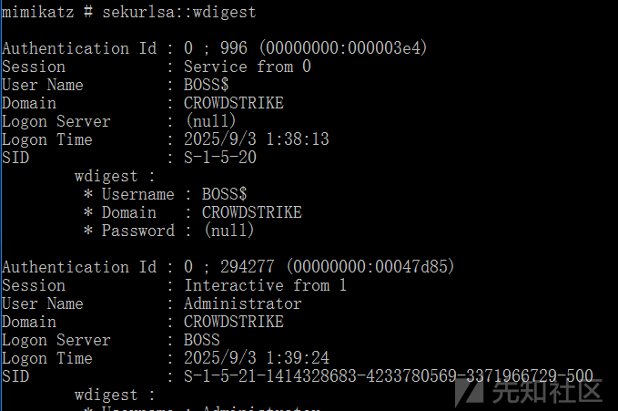

但是自从Windows Server 2008 R2 之后，WDigest 明文凭证的缓存被禁用。所以就会出现对应的Passwd那一栏为NULL的情况。

# Get Credentials

其实他的原理如下，每次我们去输入凭证（锁屏输入密码，runas启动时的密码输入），会触发`wdigest!SpAcceptCredentials`，其中如果我们在这个地方打上断点的话，我们就能直接看到我们的明文密码以及对应的账户

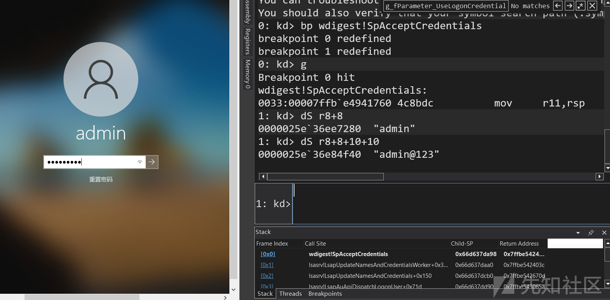

其中 wdigest!l\_LogSessList 字段对应一个链表，通过结构体定位，我们能找到账户和被加密的密码

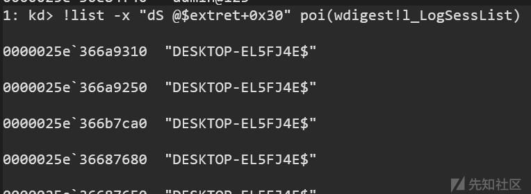

## Grab Key

所以我们就要去找对应的解密方式，在调用`LogSessHandlerPasswdSet` 之前，会调用lsasrv!LsaEncryptMemory进行密码的加密

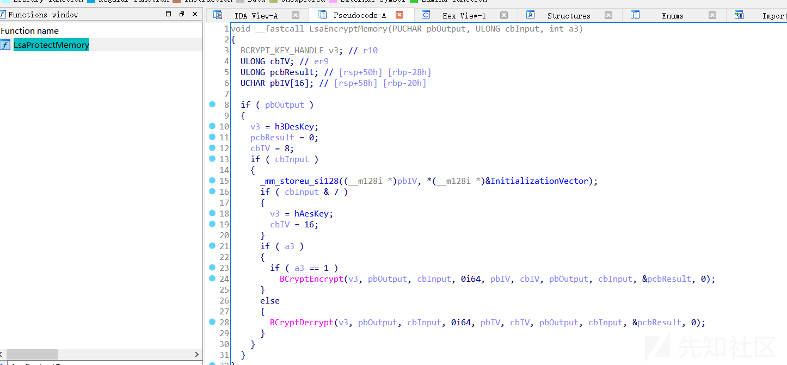

我们能看到对应的h3DesKey以及hAesKey和IV ，其中的Passwd加密条件满足如下

```
如果提供的缓冲区长度能被 8 整除,则使用 AES 否则，使用 3Des加密
```

交叉引用，我们可以追到lsasrv!LsaInitializeProtectedMemory

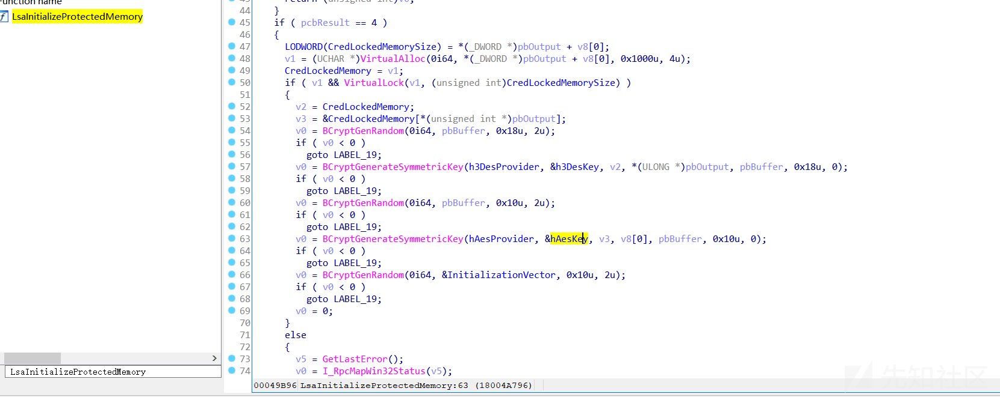

对于这三个值，是一个全局变量，由lsass启动的时候生成

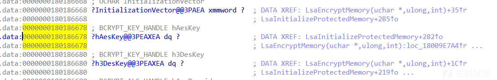

其中举例一个h3deskey是这么寻找的，首先是我们获取到h3deskey在lsass的地址之后，他是这么的一个结构体

```
typedef struct _KIWI_BCRYPT_HANDLE_KEY {
	ULONG size;
	ULONG tag;	// 'UUUR'
	PVOID hAlgorithm;
	PKIWI_BCRYPT_KEY81 key;
	PVOID unk0;
} KIWI_BCRYPT_HANDLE_KEY, * PKIWI_BCRYPT_HANDLE_KEY;
```

其中的Tag能匹配的上

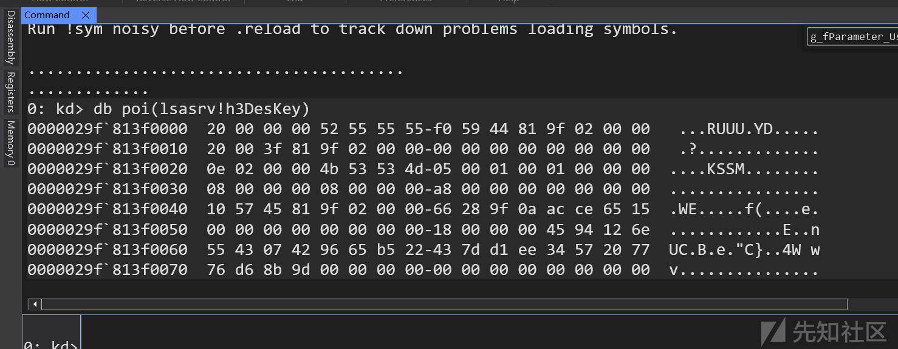

然后就是跟进去 \_KIWI\_BCRYPT\_KEY81这个结构体

```
typedef struct _KIWI_BCRYPT_KEY81 {
	ULONG size;
	ULONG tag;	// 'MSSK'
	ULONG type;
	ULONG unk0;
	ULONG unk1;
	ULONG unk2;
	ULONG unk3;
	ULONG unk4;
	PVOID unk5;	// before, align in x64
	ULONG unk6;
	ULONG unk7;
	ULONG unk8;
	ULONG unk9;
	KIWI_HARD_KEY hardkey;
} KIWI_BCRYPT_KEY81, * PKIWI_BCRYPT_KEY81;
```

tag也是能对的上

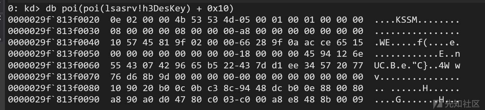

然后就是我们的hardKey结构了

```
typedef struct _KIWI_HARD_KEY {
	ULONG cbSecret;
	BYTE data[60]; // etc...
} KIWI_HARD_KEY, * PKIWI_HARD_KEY;
```

前4个字节告诉了我们这个Key的长度就是0x18，然后我们去提取就好

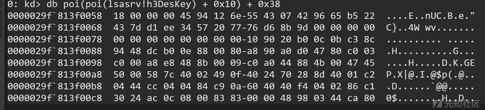

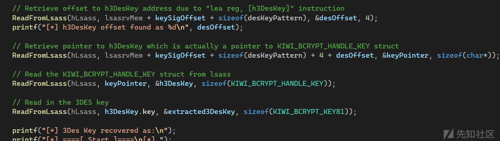

然后就是l\_LogSessList这个链表，我们去看Mimikatz对他的签名

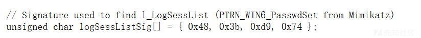

似乎他在想找如下这个pattern

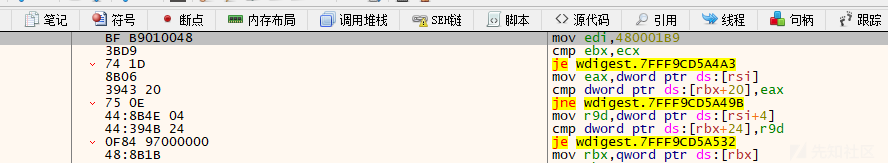

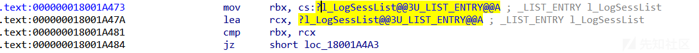

在win10 ，Sevrver2016下测试没有任何问题，但是如果用的win11的wdigest.dll，则无法找到这个pattern

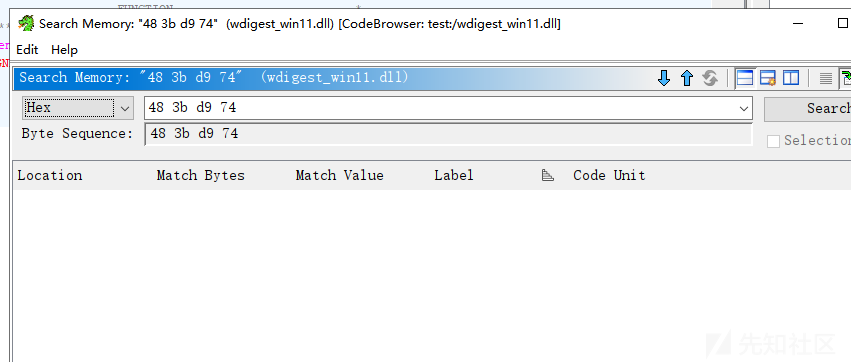

那么我们就找另外一个Pattern即可

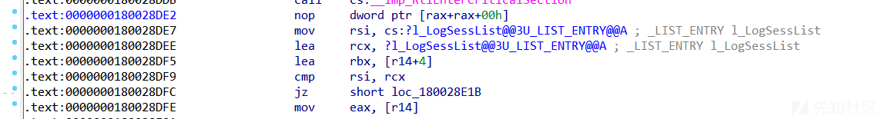

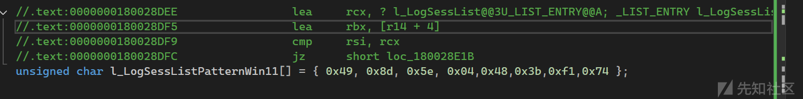

参考了XPN的代码后，我们可以看见有些值在不同系统上无法被获取<https://gist.githubusercontent.com/xpn/e3837a4fdee8ea1b05f7fea5e7ea9444/raw/594b80e03043626f0a628cd87c3d702c1350832f/wdigest_extract.c>

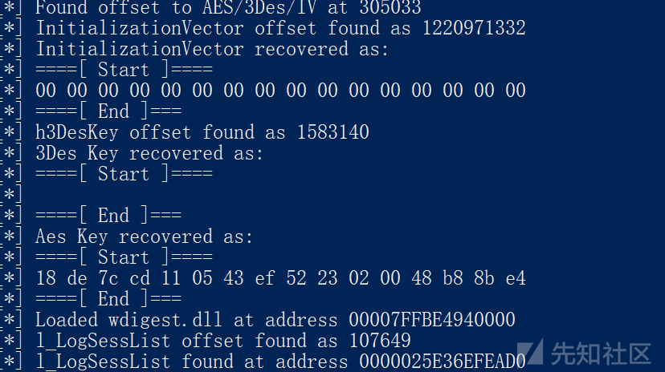

其中他的代码是去做内存匹配，然后直接硬编码了一个IV\_OFFSET 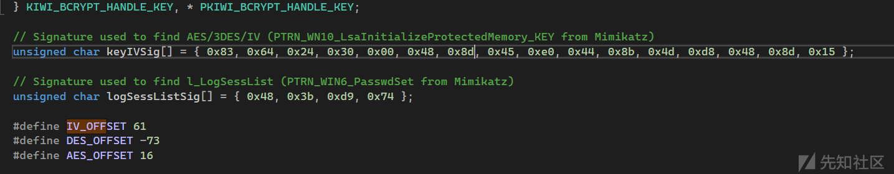

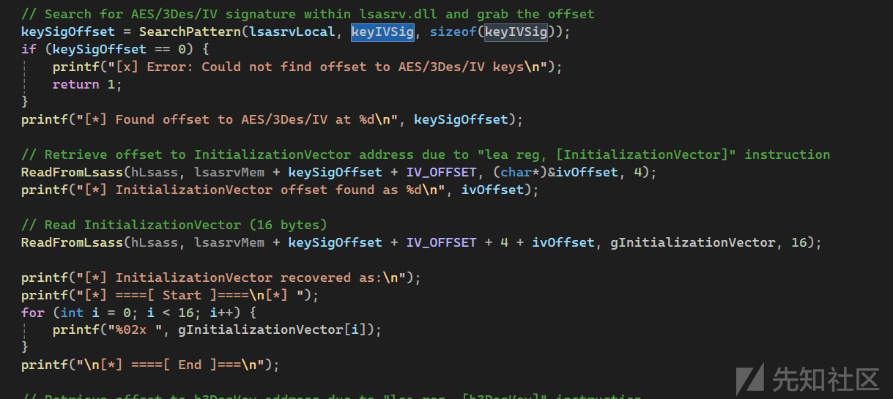

我们跟进去调试，不难看见他就是在找hAesKey的位置

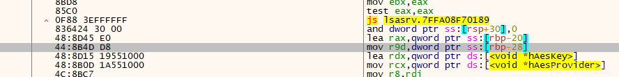

然后根据hAsekey的位置向上匹配h3Deskey，向下匹配InitVector，问题就出在了他硬编码的偏移

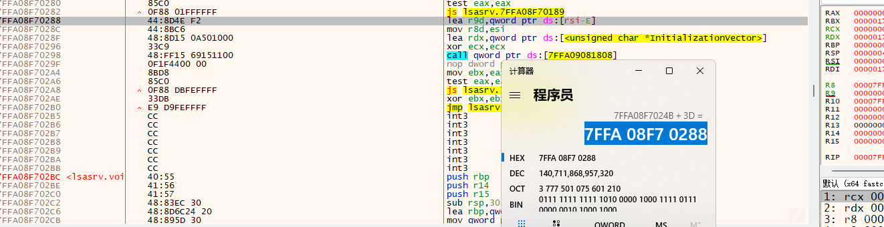

如果我们把他的硬编码改成71

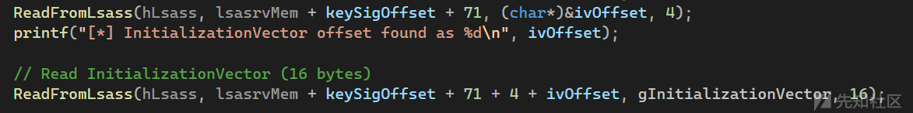可以看到我们的InitVector的值被成功找到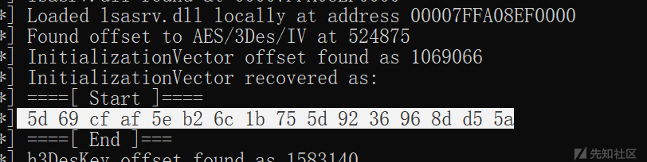

所以可以在XPN代码上改进的一点就是我们可以把对应的硬编码便宜直接改成内存字节提取，下面是一些找到的值

```
//and dword ptr[rsp + 30h], 0
//lea     rax, [rbp - 20h]
//mov     r9d, dword ptr[rbp - 28h]
//lea     rdx, [lsasrv!hAesKey(00007ff9`27ad6678)]
unsigned char aesKeyPattern[] = { 0x83, 0x64, 0x24, 0x30, 0x00, 0x48, 0x8D, 0x45, 0xE0,  0x44, 0x8B, 0x4D, 0xD8,  0x48, 0x8D, 0x15 };// 0xDB, 0xBE, 0x13, 0x00 };


//lea     r9d, [rsi - 0Eh]
//mov     r8d, esi
//lea     rdx, [lsasrv!InitializationVector(00007ff9`27ad6668)]
unsigned char initVectorPattern[] = { 0x44, 0x8D, 0x4E, 0xF2,  0x44, 0x8B, 0xC6,  0x48, 0x8D, 0x15 };//, 0x98, 0xBE, 0x13, 0x00 };


// test    dword ptr [rdi+50h], 800h
// jne	   ...
// cmp     cs:g_fParameter_UseLogonCredential, ebx
unsigned char g_fParameter_UseLogonCredentialPattern[] = { 0xf7, 0x47, 0x50,
0x00, 0x08, 0x00, 0x00, 0x0f, 0x85 };

```

通过以上的值去查找，我们能成功的获取 IV 3deskey aeskey 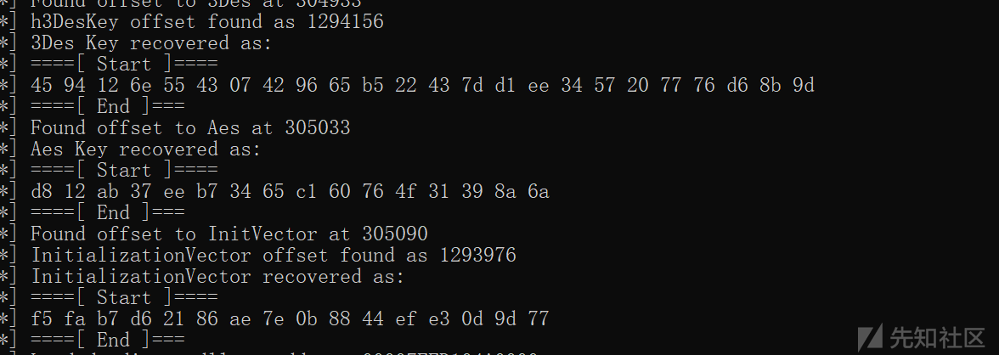

## g\_fParameter\_UseLogonCredential

但是就算我们有了对应的密钥，我们也无法获取明文密码，原因就是有一个这个注册表的键

```
HKEY_LOCAL_MACHINE\SYSTEM\CurrentControlSet\Control\SecurityProviders\WDigest\UseLogonCredential
```

将这个设置从0切换到1会强制 WDigest 重新开始缓存凭证，但是在我个人系统上是没有

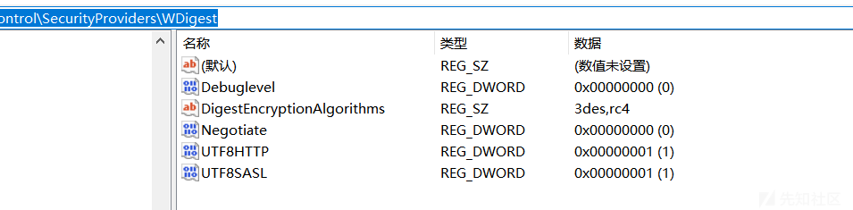

但是还记得我们的密码是怎么来的吗 是wdigest!l\_LogSessList指向的链表，而l\_LogSessList之后的内容被wdigest!LogSessHandlerPasswdSet引用

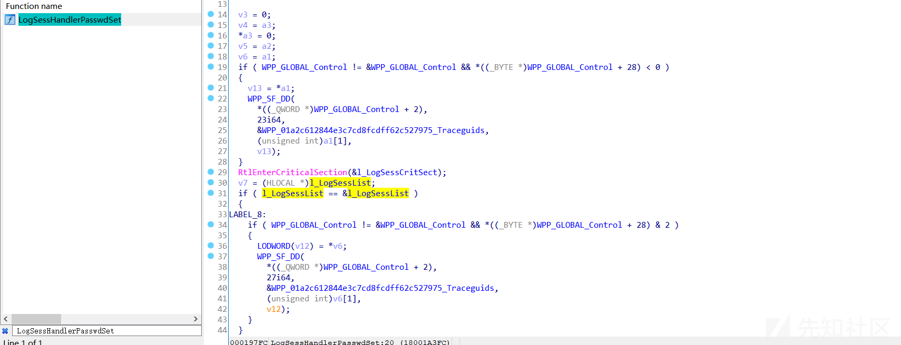

如果我们去交叉引用LogSessHandlerPasswdSet，我们就能看到是wdigest!SpAcceptCredentials在call这个函数

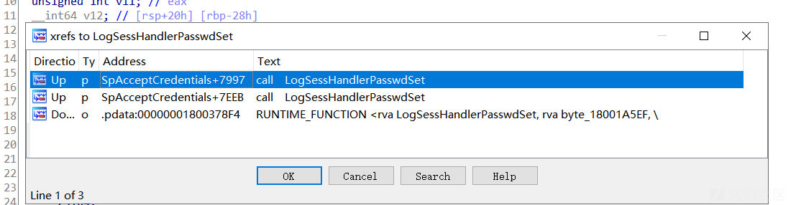

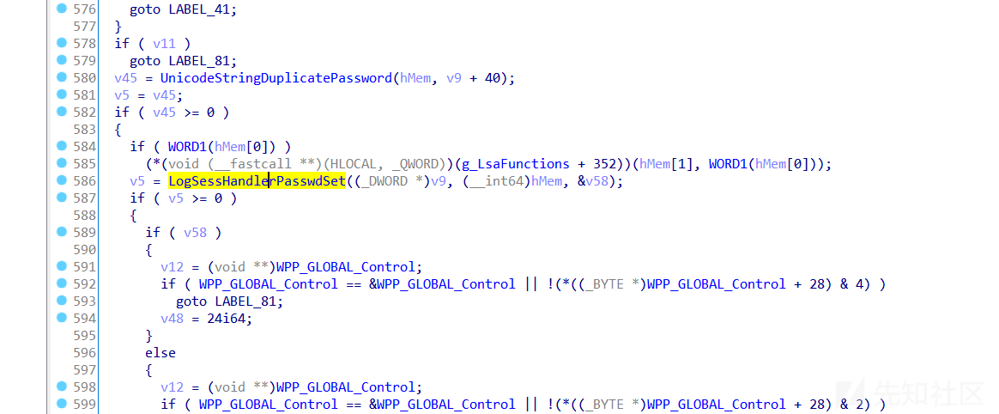

如果往上翻一下，我们不难发现这段代码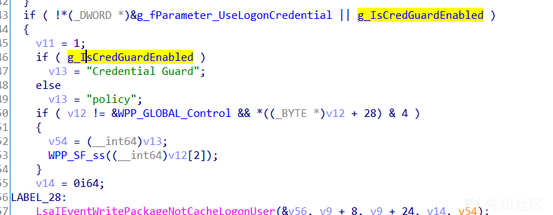

其中有两个值我们需要关注 g\_IsCredGuardEnabled 和 g\_fParameter\_UseLogonCredential这两个值决定了后续密码是否会被记录

对于CredGuard，这就要继续去深挖了，但是本测试环境下暂不考虑CredGuard.

那么就来到了g\_fParameter\_UseLogonCredential这个全局变量，我们可以看见默认下就是0

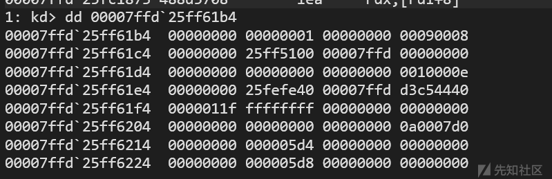

我们再次回到IDA，我们先来记住一个var v11 ，一开始默认是0

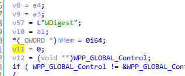

如果满足了g\_fParameter\_UseLogonCredential == 0 || CreadGuardEnable 的话就会被赋值成1

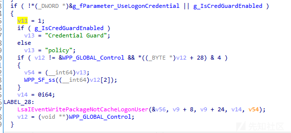

如果v11被赋值成了1那么 就会调用一个logSessionHandlerNoPaswordInsert从函数名字我们就可以猜测这个是不保存密码的

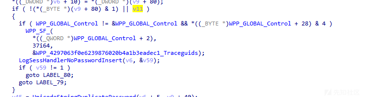

所以我们让只需要让g\_fParameter\_UseLogonCredential 1，我们就能让passwd重新以明文的形式缓存

可以看到当我们ed之后我们的断点就会被触发

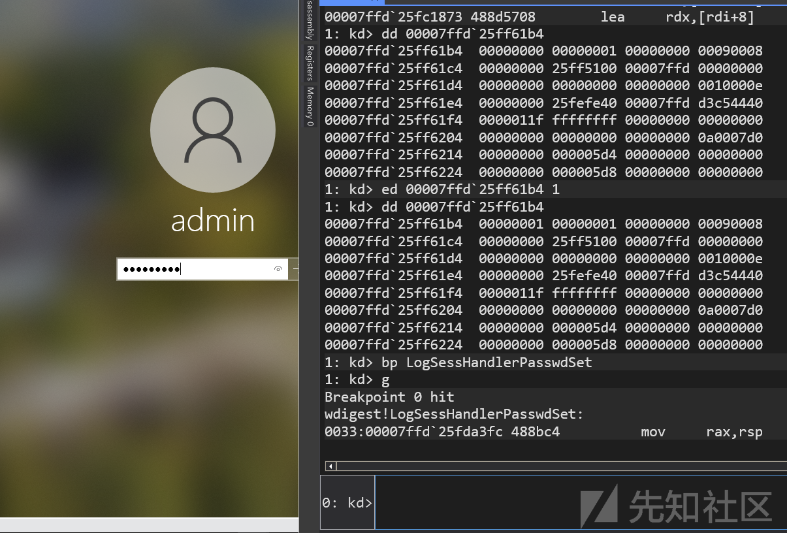

这时候如果我们再去用mimikatz去抓取密码的话，就能直接看到明文存储

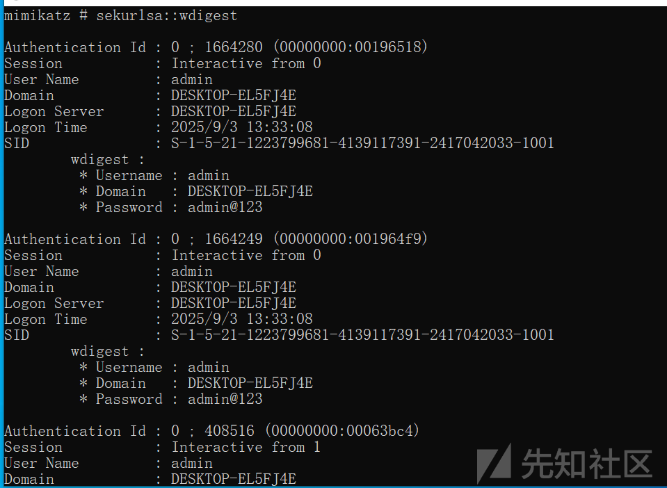

代码的话就是去找他的偏移就行，如果想缩小范围的话也可以直接在SpAcceptCredentials找

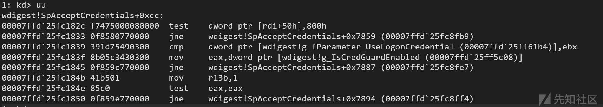

下面这个不ReadFromLsass也可以，不过殊途同归

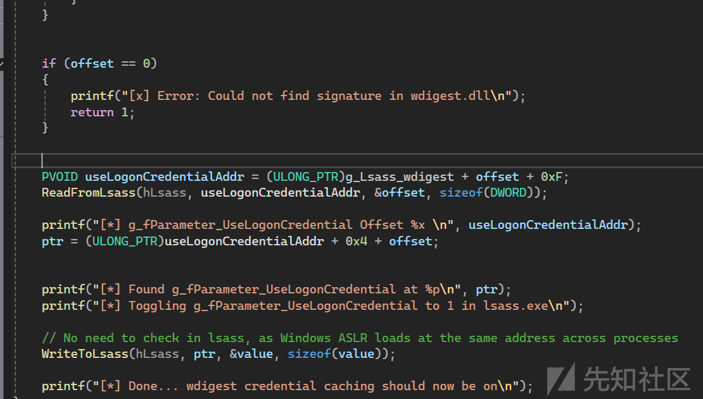

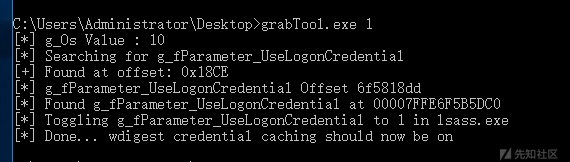

然后需要我们触发一次认证，这样密码才会被记录

WinServer2016

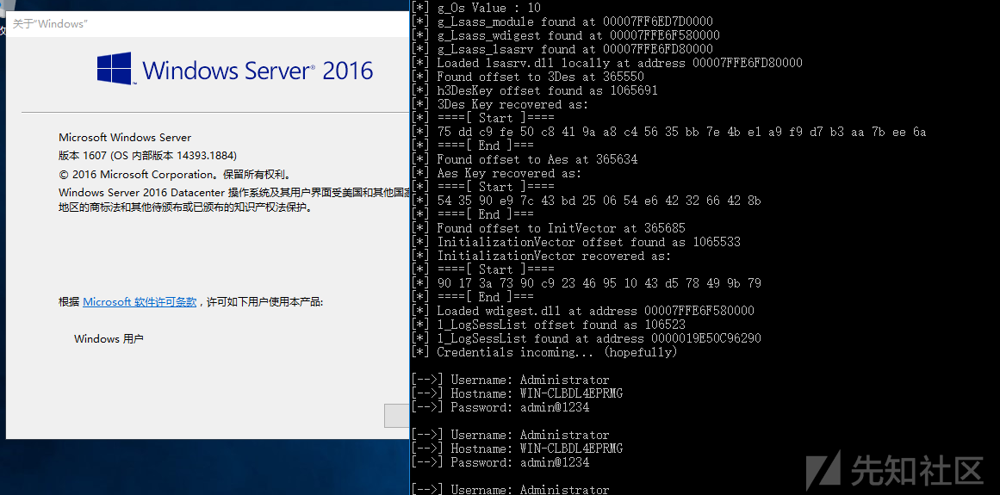

Win11

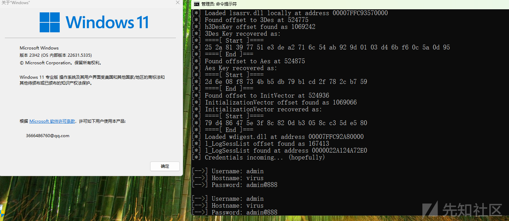

win10

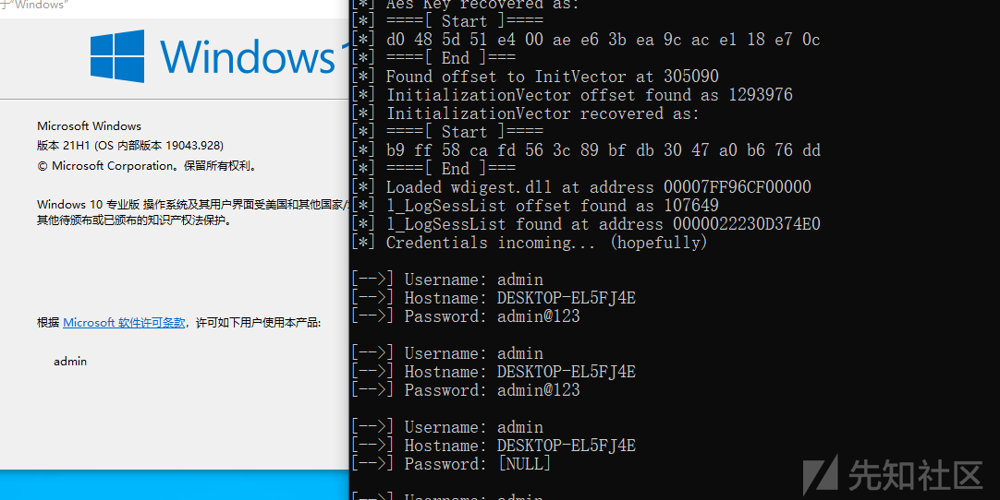

# 检测

不允许往Lsass进行读写内存即可，以及对SSP的加载进行相应的拦截（XPN的下一步实现就是SSP的操作，感兴趣可以去看原文）

# 参考文章

<https://blog.xpnsec.com/exploring-mimikatz-part-1/>

<https://gist.githubusercontent.com/xpn/e3837a4fdee8ea1b05f7fea5e7ea9444/raw/594b80e03043626f0a628cd87c3d702c1350832f/wdigest_extract.c>
