# 某ERP系统源码审计与漏洞分析全过程记录-先知社区

> **来源**: https://xz.aliyun.com/news/18759  
> **文章ID**: 18759

---

思来想去，最终还是打算写一篇文章记录下自己审计这套erp的过程，希望一段时间后再来看的时候，能有一番不同感觉。

审这套源码的时候，没法debug，也没有样本站参考，因此我有很多自己的思考，可能会有些出错的情况，但我觉得审计的魅力就在这同开发博弈，在近上万行代码中找到破局的点。

### 一、前言

这篇文章将从以下三个方面展开：

1. 指纹情况
2. 系统鉴权方式
3. 功能点反射调用的机制分析
4. 漏洞分析
5. 总结

### 二、指纹情况

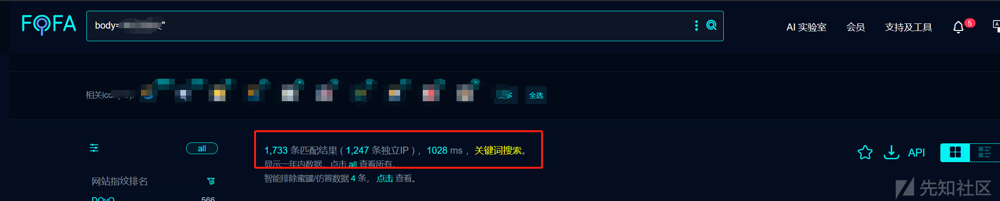

这套系统的数据库一般为Oracle或是Mssql。

这里提前说一下，对于这套系统，Oracle的注入我个人觉得还是比较困难的（可能是我不熟悉这一块的构造，需要抽点时间出来仔细研究下），对于注入点，我仅给出路由和参数，至于怎么样去构造poc，感兴趣的朋友可以自行测试下。

系统是自研框架，总体上还是普通的Javaweb项目，实现功能点调用有两种方式，先来解释下系统鉴权的方式。

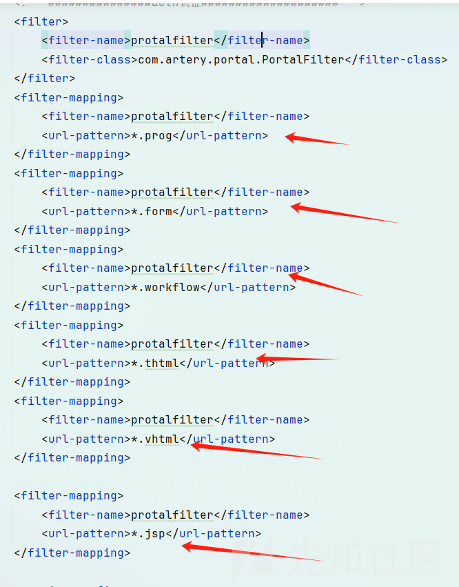

对于以上几种后缀结尾的路由，都会经过protalfilter这个过滤器，跟进去看一下：

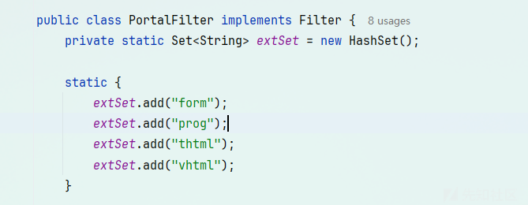

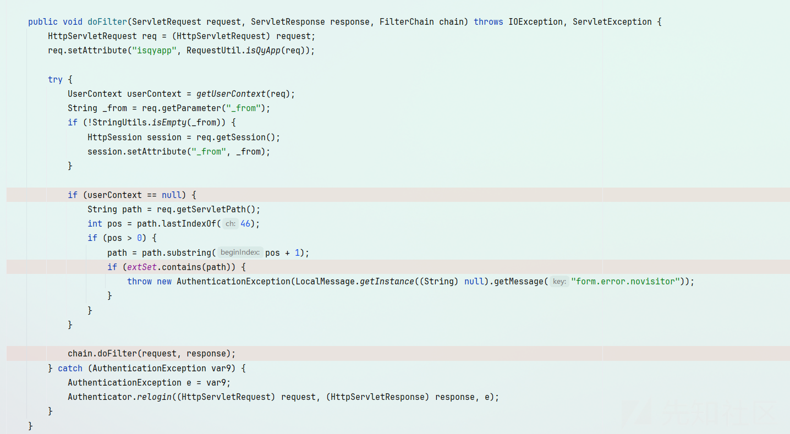

这里也写的很清晰，首先在HashSet中加入几个特征，然后在下文的doFilter中判断是否存在用户的session如果不存在并且访问的路由中包含以上几个特征，就抛出一个异常，然后catch到后返回登录页面。

意思就是说，不登陆就不能访问包含以上后缀的url。

这只是针对以上后缀名的鉴权，其实这套系统大多数的区分前后台的方式也是判断你是否存在session，不存在直接给你pass掉这个访问点。

### 四、功能点反射调用分析

我们来分析下`com.artery.form.FormService`。这是这套源码中最特别的地方，这套源码审计的核心也在这里。

这个FormService本质是一个Servlet，负责接收前端表单相关的请求，通过反射动态定位并调用后端服务类的方法，最终将结果以XML格式返回给前端。它是前端与后端服务之间的“中间层”。

首先是定义内容类型常量：

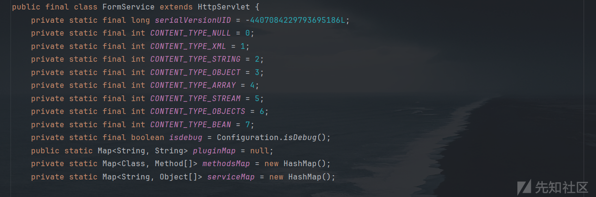  
这里其实就是声明了几个常量，并且定义了几个Map用来存在下面反射调用拿到的方法并存储起来的。

从plugins.xml中读取配置：  
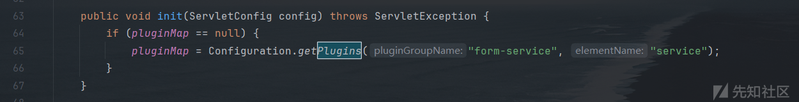  
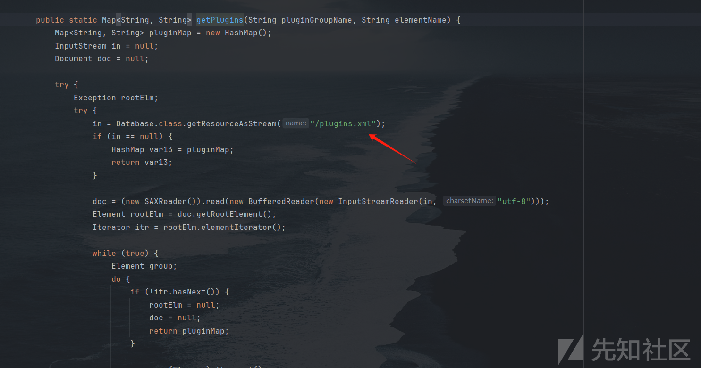  
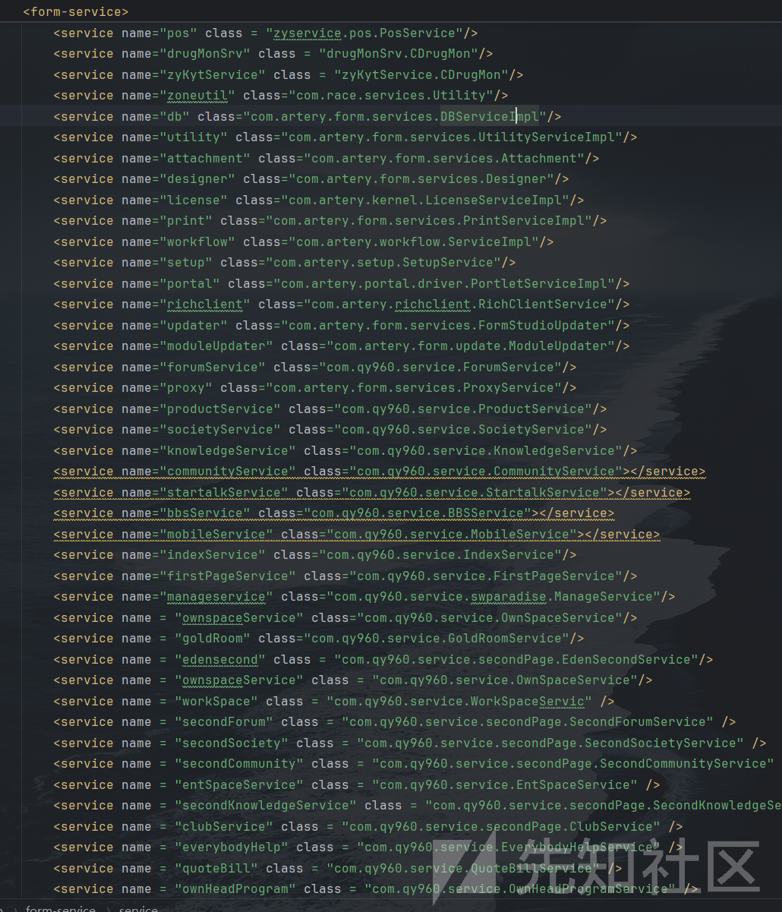  
下面这段代码是核心，我不截图了，直接复制过来的：

```
public static Object[] getService(HttpServletRequest request, String serviceName) throws Exception {
    if (serviceName != null && serviceName.length() != 0) {  // 校验服务名非空
        Object[] result = (Object[])serviceMap.get(serviceName);  // 先查缓存，命中则直接返回
        if (result != null) {
            return result;
        } else {
            // 缓存未命中，解析服务名并反射获取服务信息
            Class serviceClass = null;  // 服务类
            String serviceGroupName = null;  // 服务组名（如"attachment"）
            String methodName = null;  // 方法名（如"getAttachementItem"）
            Method method = null;  // 目标方法
            Class paramType = null;  // 方法的第三个参数类型（若有）

            int dotPos = serviceName.indexOf(46);  // 查找服务名中的"."（46是ASCII的"."）
            if (dotPos == -1) {  // 服务名无"."（如"getForm"），默认使用FormServiceImpl类
                serviceClass = FormServiceImpl.class;
                serviceGroupName = "service";
                methodName = serviceName;
            } else {  // 服务名有"."（如"attachment.getAttachementItem"）
                serviceGroupName = serviceName.substring(0, dotPos);  // 截取服务组名（如"attachment"）
                if (!pluginMap.containsKey(serviceGroupName)) {  // 校验服务组是否在插件配置中
                    throw new Exception(LocalMessage.getInstance(request).getMessage("formservice.error.serviceNotExist", new Object[]{serviceName}));
                }
                // 从插件配置获取服务类全路径，反射加载类
                serviceClass = Class.forName((String)pluginMap.get(serviceGroupName));
                methodName = serviceName.substring(dotPos + 1);  // 截取方法名（如"getAttachementItem"）
            }

            // 从缓存获取服务类的方法数组（未缓存则反射获取并缓存）
            Method[] methods = (Method[])methodsMap.get(serviceClass);
            if (methods == null) {
                methods = serviceClass.getMethods();  // 反射获取类的所有公共方法
                methodsMap.put(serviceClass, methods);  // 缓存到methodsMap
            }

            // 遍历方法数组，找到目标方法（按方法名匹配）
            int i;
            if (!AbstractArteryService.class.isAssignableFrom(serviceClass)) {  // 非AbstractArteryService子类
                for(i = 0; i < methods.length; ++i) {
                    if (methods[i].getName().equals(methodName)) {  // 匹配方法名
                        method = methods[i];
                        Class[] types = method.getParameterTypes();  // 获取方法参数类型
                        if (types.length == 3) {  // 若方法有3个参数，第三个参数为内容参数
                            paramType = types[2];
                        } else {
                            if (types.length != 2) {  // 非2个或3个参数，抛出"方法不存在"异常
                                throw new Exception(LocalMessage.getInstance(request).getMessage("formservice.error.methodNotExist", new Object[]{serviceName, methodName}));
                            }
                            paramType = null;  // 2个参数（request, response），无内容参数
                        }
                        break;
                    }
                }
            } else {  // 是AbstractArteryService子类（自定义服务基类）
                for(i = 0; i < methods.length; ++i) {
            if (methods[i].getName().equals(methodName)) {  // 匹配方法名
            method = methods[i];
            break;
        }
        }
            paramType = AbstractArteryService.class;  // 标记为自定义服务类型
        }

            if (method == null) {  // 未找到目标方法，抛出异常
            throw new Exception(LocalMessage.getInstance(request).getMessage("formservice.error.methodNotExist", new Object[]{serviceName, methodName}));
        } else {
            // 根据paramType确定内容类型（CONTENT_TYPE_XXX）
            byte contentType;
            if (paramType == null) {
            contentType = 0;  // 无内容参数
        } else if (paramType == String.class) {
            contentType = 2;  // 字符串
        } else if (paramType == Document.class) {
            contentType = 1;  // XML
        } else if (paramType == JSONObject.class) {
            contentType = 3;  // JSON对象
        } else if (paramType == JSONArray.class) {
            contentType = 4;  // JSON数组
        } else if (paramType == InputStream.class) {
            contentType = 5;  // 流
        } else if (paramType == AbstractArteryService.class) {
            contentType = 6;  // 自定义服务对象
        } else {
            contentType = 7;  // JavaBean
        }

            // 封装服务信息（服务类、方法、内容类型、服务组、方法名）并缓存
            result = new Object[]{serviceClass, method, new Integer(contentType), serviceGroupName, methodName};
            serviceMap.put(serviceName, result);
            return result;
        }
        }
        } else {
            throw new Exception(LocalMessage.getInstance(request).getMessage("formservice.error.invalidRequest"));  // 服务名为空，抛出无效请求异常
        }
        }
```

核心作用在于通过服务名解析服务组和方法名，反射获取目标方法，确定参数类型，并缓存结果。

下面是关键的服务调用鉴权方式，审计前台洞的核心在这：  
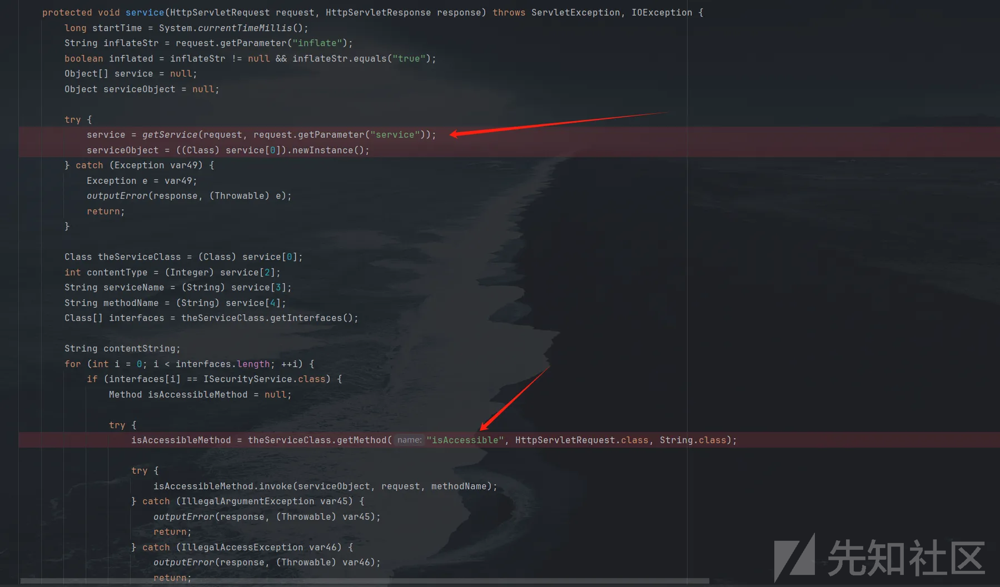

从service参数中拿到服务名，通过反射调用判断方法中是否存在`isAccessible`方法。

这里的`isAccessible`方法实际上就是判断该方法是否可以匿名访问的方法。

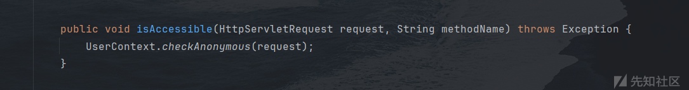

需要注意的是，这段代码通过反射调用拿到的方法必须是public。

此外，还有一个点要知道的，通过FormService类去实现服务调用，用户输入是可以通过一个参数`content`来接收的，并且这里content-type的不同，就会走不同逻辑，利用的方式也就不尽相同，这个后文再重点说下。

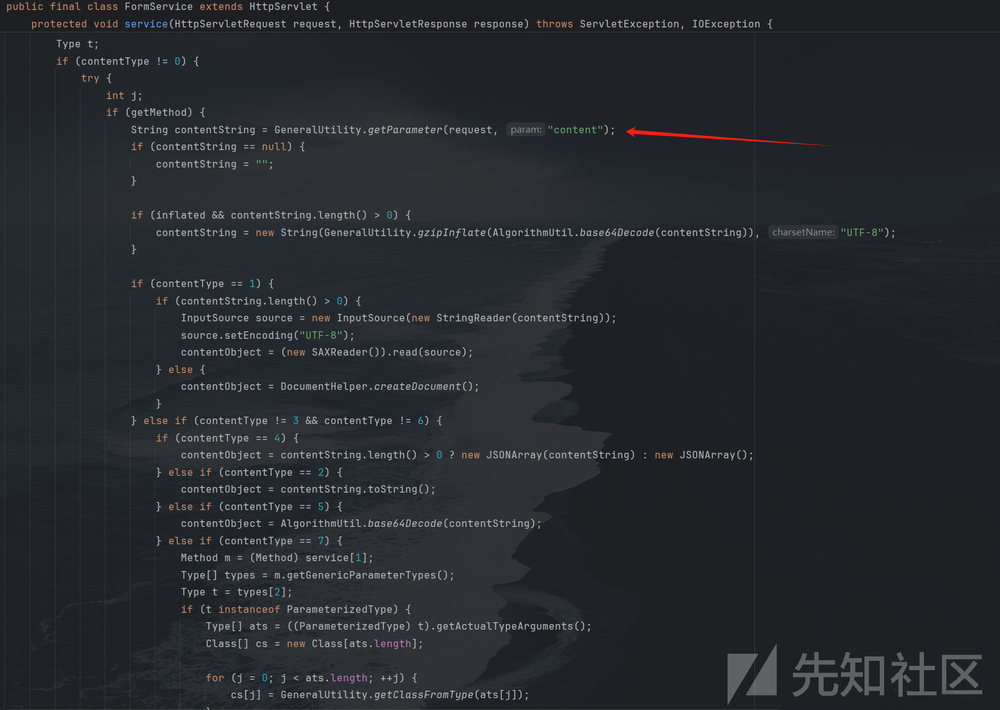

那下面我们就有操作空间了——无`isAccessible`方法+sink函数为public。

### 五、漏洞分析

#### 1、com.artery.util.ServletUpload存在任意文件上传

使用DiskFileItemFactory上传

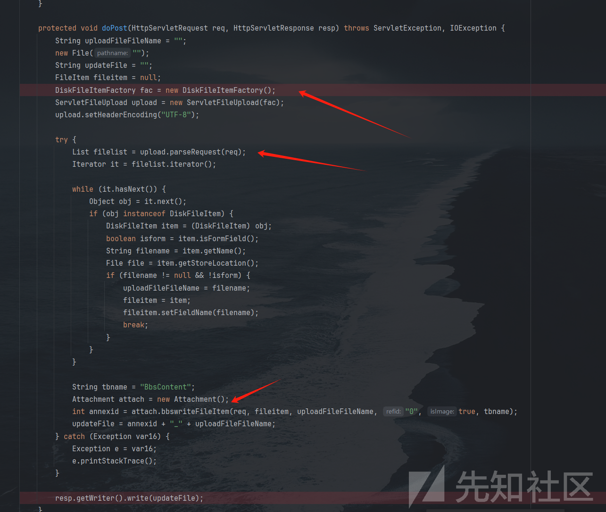

跟进`bbswriteFileItem()`方法：

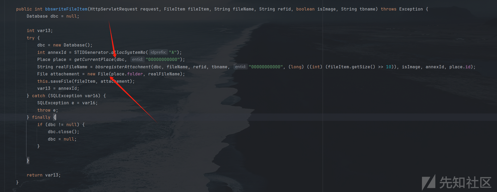

跟进`bbsregisterAttachment()`方法：

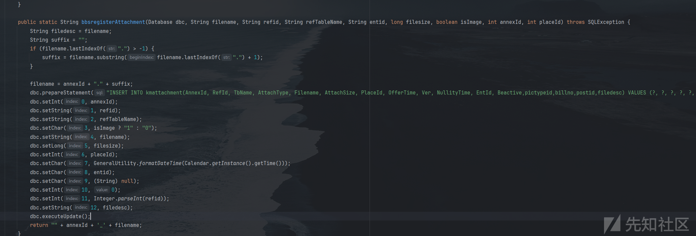

这里直接生成一个文件名然后写入到一个目录下，并未对后缀名做任何校验。

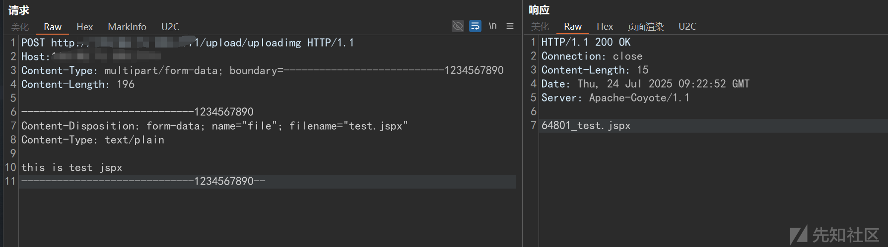

#### 2、com.artery.form.services.FormStudioUpdater#getStudioFile任意文件读取

在这个类下面，不存在web.xml定义的路由了，因此我们首先重点关注下，是否存在相应的鉴权的方法，如果没有我们就可以通过FormService类反射调用到这个类中的一些公共方法。

经过搜索这个类是没有相应的鉴权方法的，那么我们重点关注sink函数即可。

往下看，找到一处sink点，该处getStudioFile方法，可从前端接收Http请求，并且接收fileStr参数，并对fileStr进行文件读取。

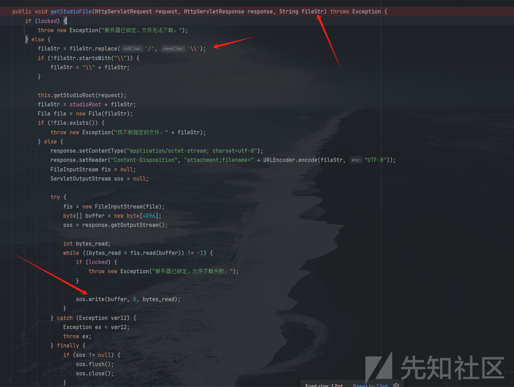

很显然，这里没有过滤`../`，可以目录穿越到想要的目录中去。

因为采用的FormService类反射调用，这里参数的接收使用content。  
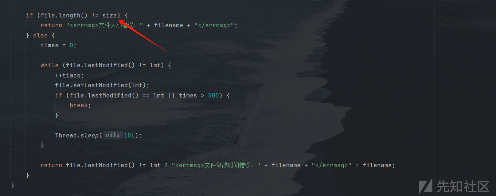

由此，可以构造数据包：（注意这里xml形式传输的数据的话，我们采用jspx的方式是最好的，因为jspx本质上也是一种xml）

```
<hello xmlns:jsp="http://java.sun.com/JSP/Page">
  <filename>hello.jspx</filename>
  <filepath>../../../pad/</filepath>
  <filesize>§347§</filesize>
  <lmtime>2025-05-20 10:30:00</lmtime>
  <jsp:scriptlet>out.print("HelloWorldTest");new java.io.File(application.getRealPath(request.getServletPath())).delete();</jsp:scriptlet>
</hello>
```

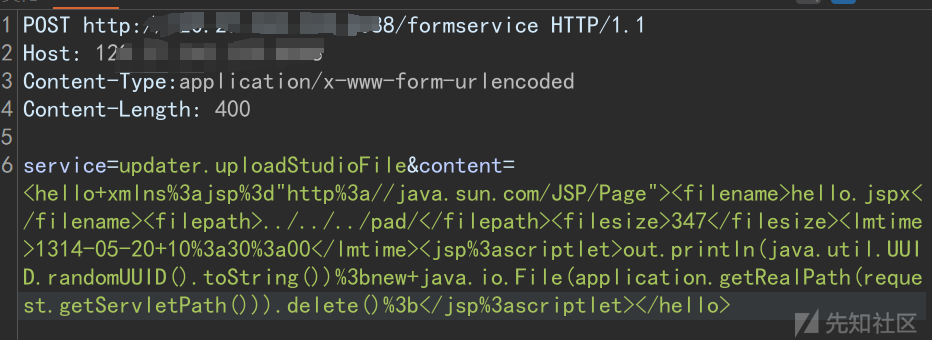

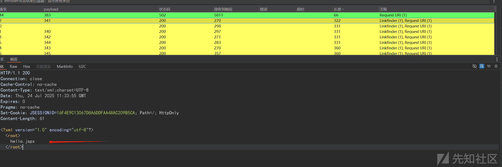

#### 4、com.qy960.service.BBSService#phoneUpload存在任意文件上传

全局搜索一处sink点，来到phoneUpload方法，该方法依旧能接收前端数据，并且并未存在鉴权方法。

使用的是DiskFileItemFactory进行文件上传

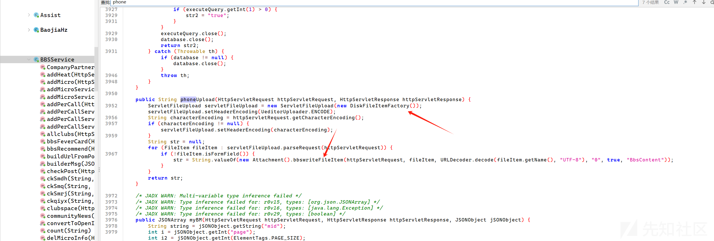

跟进bbswriteFileItem方法，该方法内做了一些逻辑操作，但是不要紧，我们重点关注的是其并未对后缀做任何校验。

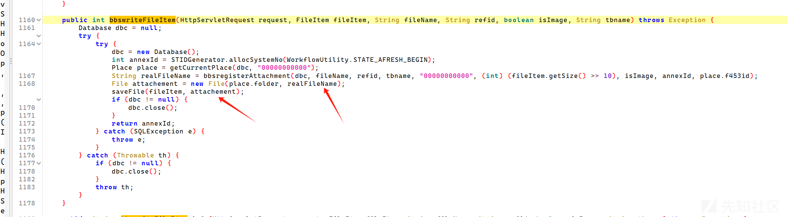

也是可以造成任意文件上传的，这里最后返回的是文件名，这里路径不好找，需要多花些“功夫”。

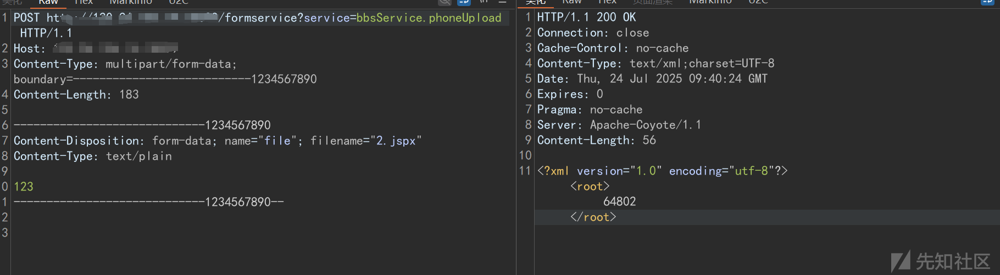

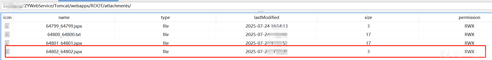

#### 5、com.artery.portal.LoginServlet存在敏感文件读取

此外com.artery.portal.LoginServlet还存在一个文件读取，原因在于`getRequestDispatcher`做了一步内部转发，并且`entid`为外部传参，参数可控。  
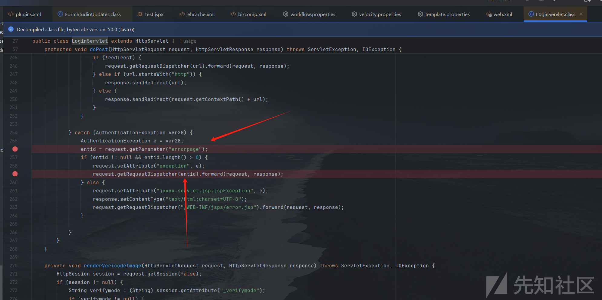

此外这里需要一个参数op让其能够抛出异常，确保下文可以catch到，这样才可以实现内部转发。

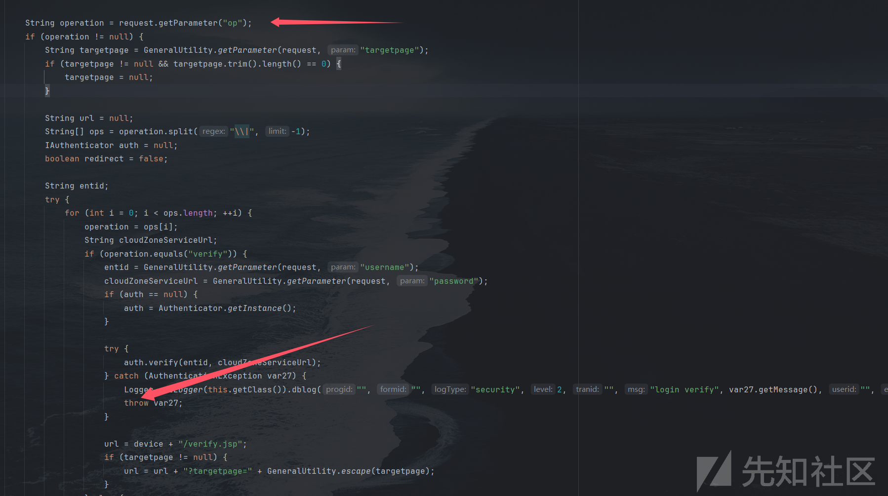

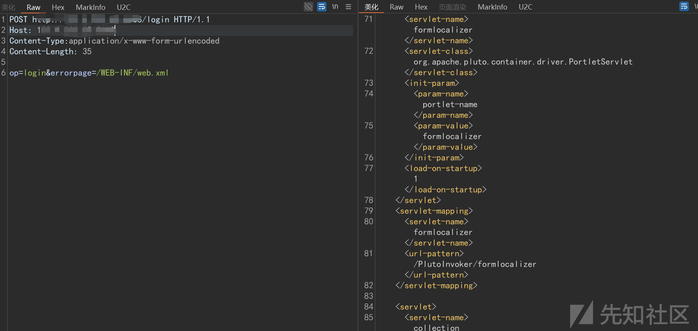

#### 6、com.artery.workflow.ServiceImpl#sqlResult存在前台sql注入

在com.artery.workflow.ServiceImpl存在一处sink点，可以看到这里直接从外部接收了一个参数sql，并将其传入到getFieldValue方法中。  
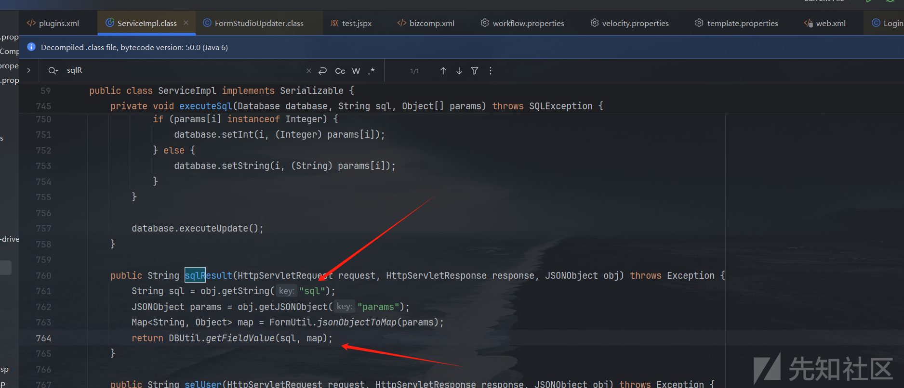

跟进getFieldValue方法。

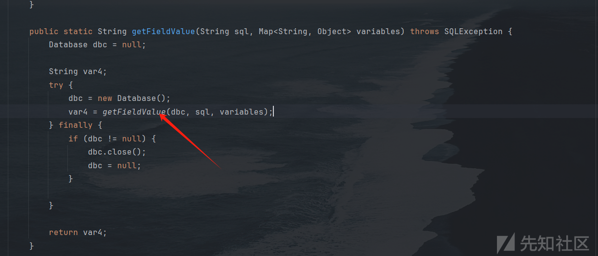

再次跟进，这里直接执行了外部的传参sql。造成注入。

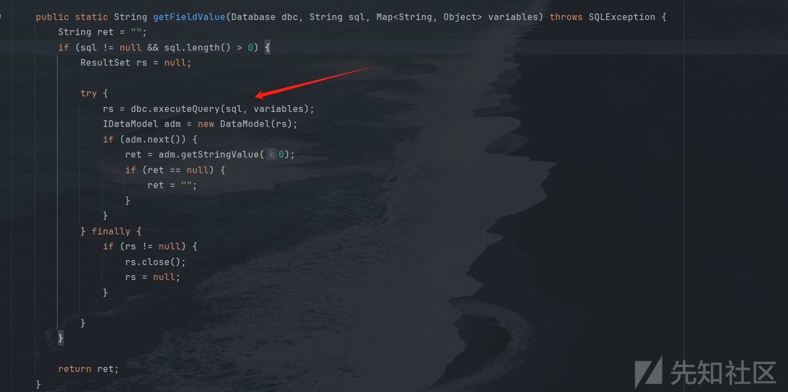

注意这里的构造方法，params作为一个jsonObject需要内部再嵌入一个键值对。

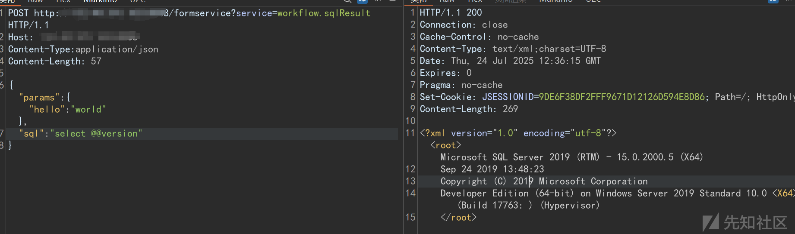

#### 7、com.artery.richclient.RichClientService#openForm存在XXE漏洞

这里的OpenForm参数可以从外部接收一个xml，并且isAccessible方法中并未存在鉴权，那这里就有了可乘之机了。  
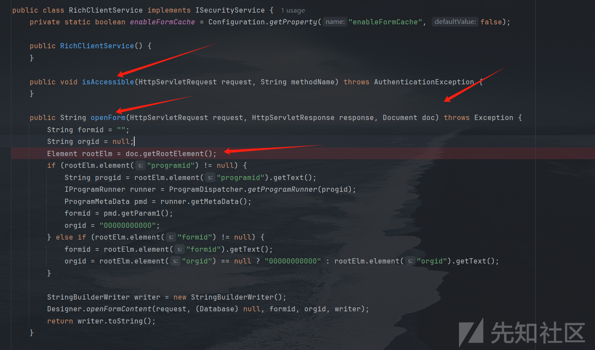

直接传入一个xml，在Formservice类中即可造成解析。

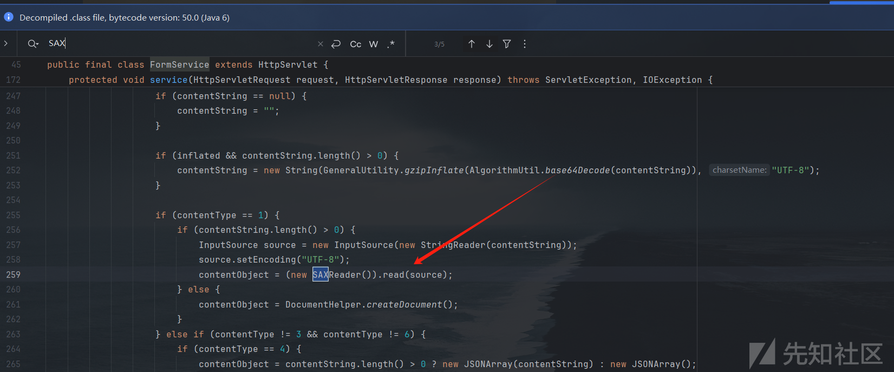

由此可构造poc如下：

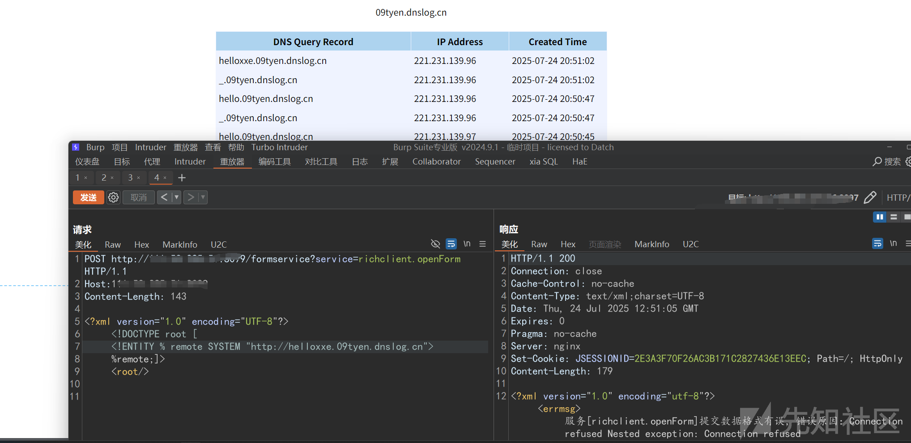

### 六、总结

这套源码审起来还是相对比较容易的，至少在鉴权上面可以有所操作。除了本文写出来的漏洞，还剩下一些漏洞，比如可以击溃网站的任意文件压缩、数个后台注入等危害很大或是后台的洞这里就不写了，感兴趣的可以自行审计。

对于一些后台的漏洞，可以关注私信，笔者看到后会相应地给与poc。

如有差错，欢迎指正，谢谢阅读！
