# 记一次某src上某APP的测试-先知社区

> **来源**: https://xz.aliyun.com/news/18760  
> **文章ID**: 18760

---

# 前言

记录一下自己之前所挖的APP的一些思路，主要以逻辑漏洞为主

​

# 挖掘思路

首先我们拿到一个APP时，首先应该要先熟悉整个APP的业务逻辑是什么样的，才有利于我们进行后续的漏洞挖掘，接下来我将从低到高的讲解挖掘过程。

​

## 短信轰炸

首先打开APP映入眼帘的就是我们熟悉的登录页面

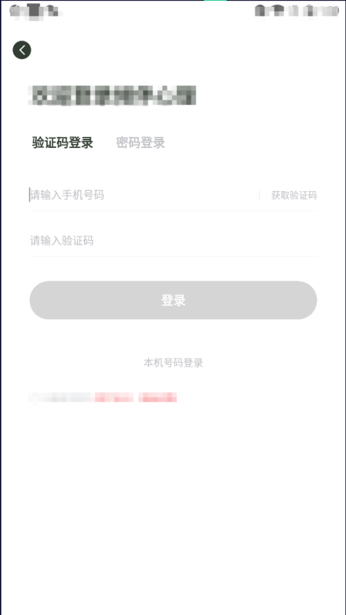

这里首先我们便可以测试一下是否有短信轰炸，任意用户登录等漏洞。而测试发现的确是存在短信轰炸漏洞

这里填入手机号后点击获取验证码抓包如下：

```
POST /user/getCode HTTP/1.1
Host: xxx
User-Agent: SM-G9810 Android25 V1.9.0.1
Platform: android
Appversion: 1.9.0.1
Showtest: 0
Oaid: 
Vaid: 
Aaid: 
Imei: 
Androidvendors: samsung
Originalua: Mozilla/5.0 (Linux; Android 7.1.2; SM-G9810 Build/N2G48H; wv) AppleWebKit/537.36 (KHTML, like Gecko) Version/4.0 Chrome/75.0.3770.143 Mobile Safari/537.36
Accept: application/vnd.edusoho.v2+json
Appbizsource: 0
Content-Type: application/x-www-form-urlencoded
Content-Length: 28
Accept-Encoding: gzip, deflate
Connection: close

phone=13555555555&codeType=1
```

这里修改phone参数对上面的数据进行重复发包即可打出短信轰炸。

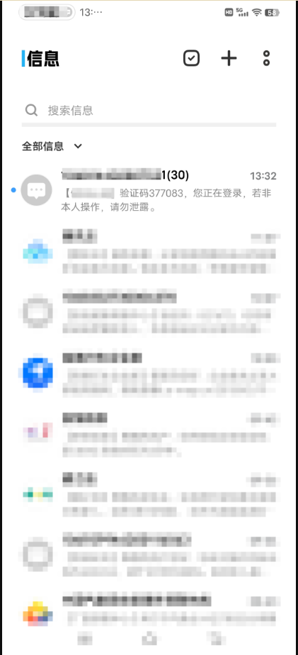

登录页面测试完后，我们就该进入到APP中进行测试了。

​

## 无回显SSRF

进入APP后，注意到意见反馈这里

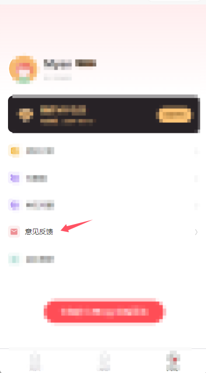

意见反馈这里可以看到有图片上传的功能，可以抓包看看是否为url传图片

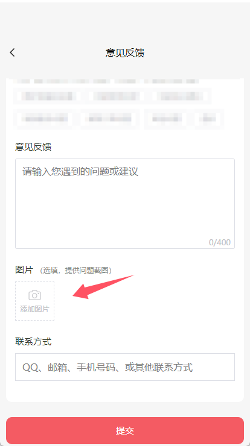

数据包如下：

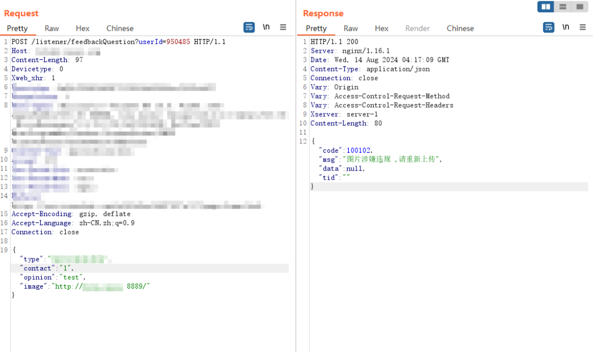

将image参数的url先换成自己的vps看看能否请求外部链接

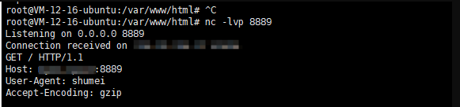

也是在vps中收到了请求，src中给出了ssrf的测试连接，打入后截图时间给审核验证了。

​

## 越权

### 越权评价他人订单

APP中的服务内容为用户下单后可以获取到对应的服务内容，而这过程中发现评价订单的接口处存在越权

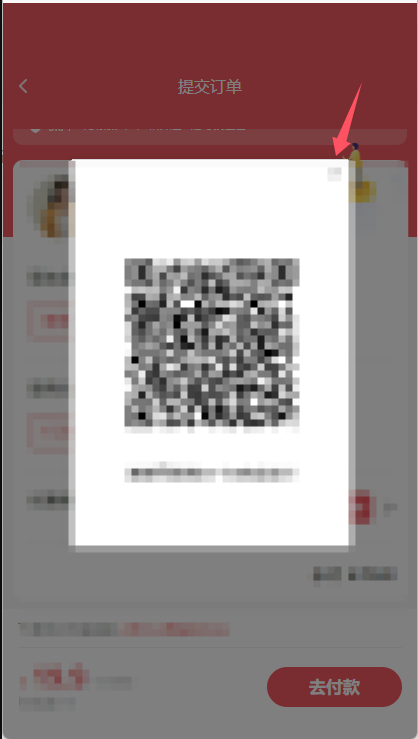

这里我们下单后先不用付款，当然付款也可以，之前该APP不付款也可以直接获取到评价接口

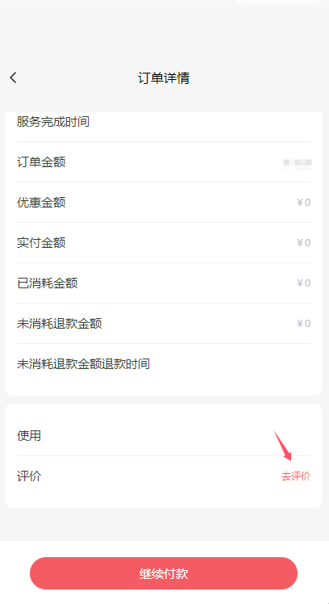

来到订单详情，点击去评价，填写评价内容后发表，然后使用bp抓包

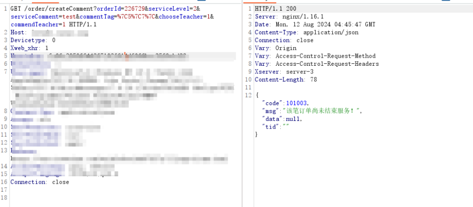

可以看到我们虽然点击去评价了，但是由于没付款完成服务无法评价，但是我们可以注意到orderId的值只有六位数，很容易进行遍历，这里我们进行遍历

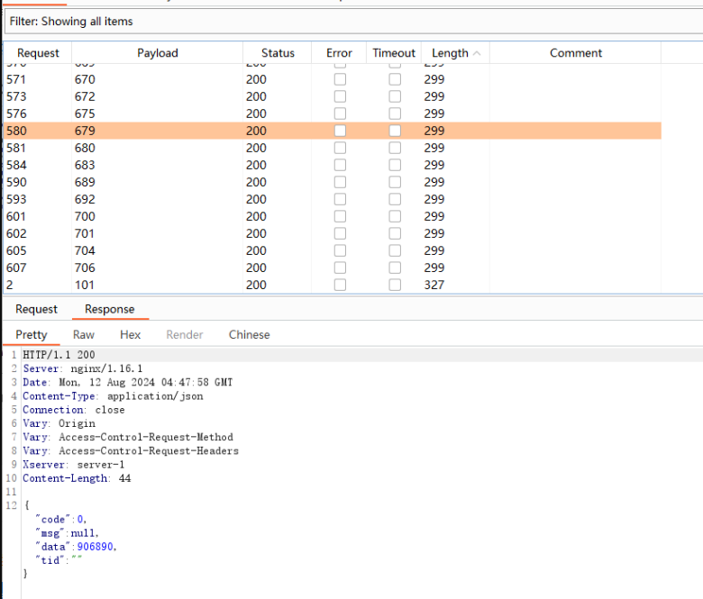

可以看到遍历后可以对其他人创建的订单进行服务评价。

​

### 越权使用他人优惠券

我们选择一个服务进行下单并抓包

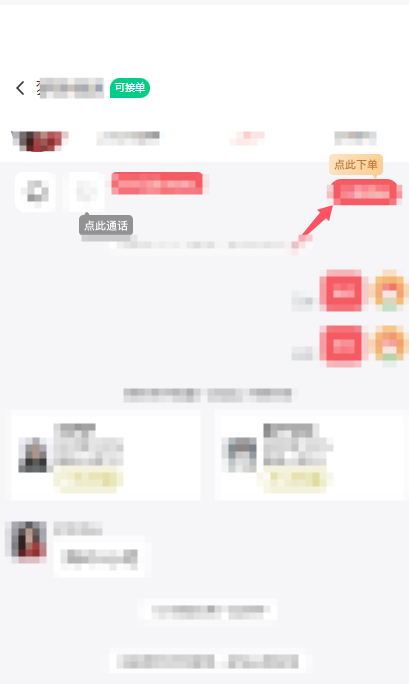

数据包如下：

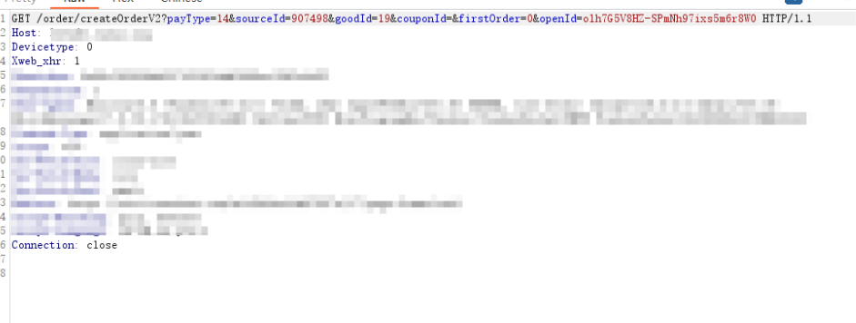

之前我们是新用户时，系统会自动赠送一张优惠券，当时的优惠券id couponId=1085908，猜测优惠券id也是可遍历的

这里我们抓包后添加couponId=1085907

然后放包

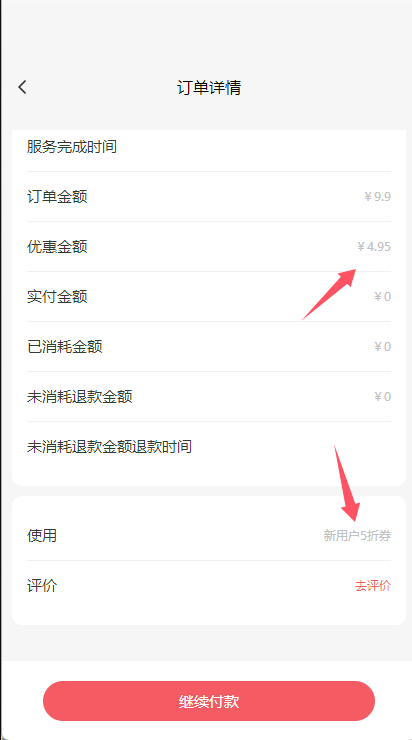

来到订单处可以看到我们成功使用了别人的新用户5折券。

​

## 信息泄露

我们在下单服务前可以进行沟通，沟通生成的聊天页面如下

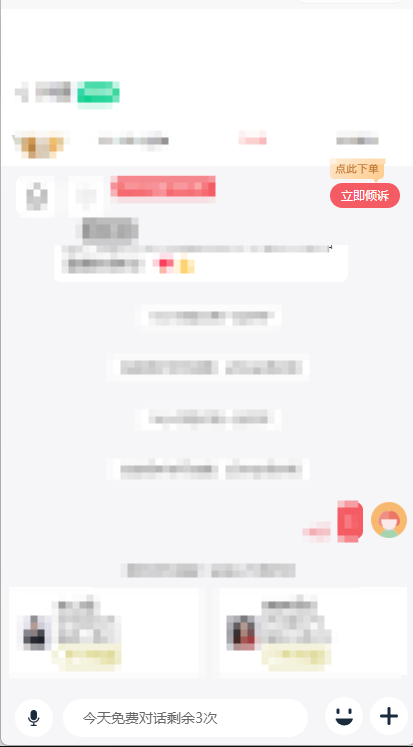

在bp中的抓包如下：

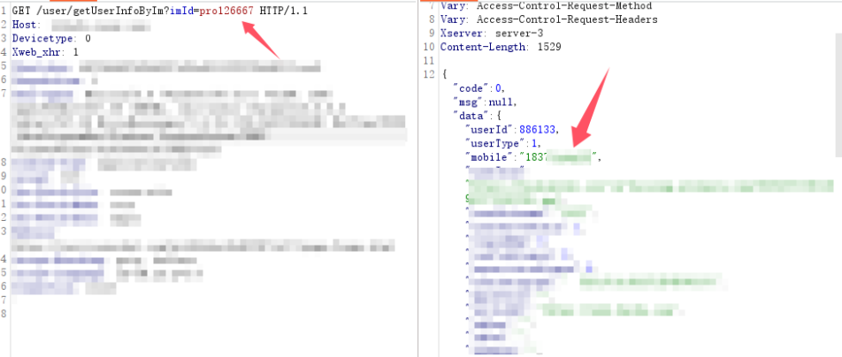

可以看到数据包泄露了服务者的手机号码，而服务内容主要也是通过虚拟号码电话进行服务，这里直接泄露服务者的真实手机号，并且imId也可以进行遍历。（当然就算不遍历也可以想查哪个人直接点开聊天框即可通过传入的上面的数据包直接确定）

​

# 后续

某APP在被提交了上面的多个漏洞后痛定思痛，对APP进行了签名加固防篡改，假设我们在不进行签名绕过的情况下还能挖到漏洞吗？能挖到高危漏洞吗？

​

# 挖掘思路

## 付费内容泄露

在平台上有着一些vip才能使用的服务课程如下图

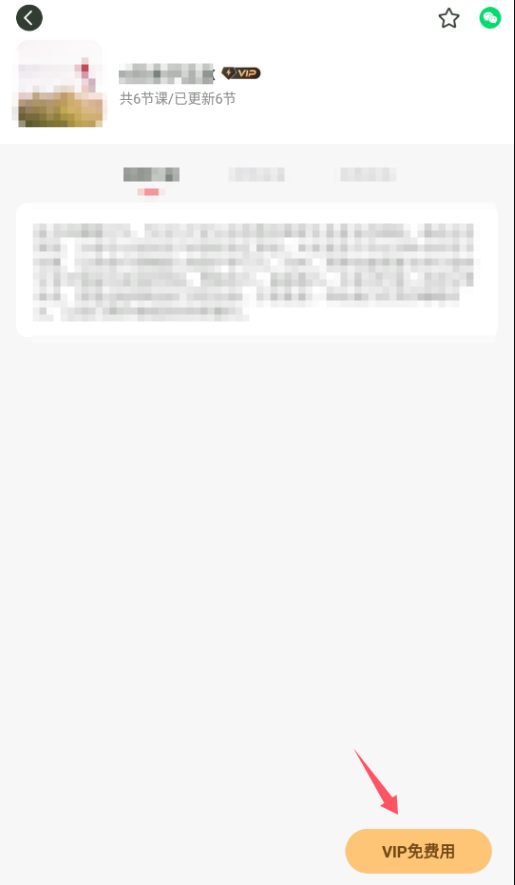

但是我们其实在点入上面的页面时，bp抓的数据包里面就已经包含有了vip课程中需要用的的mp3网上链接了

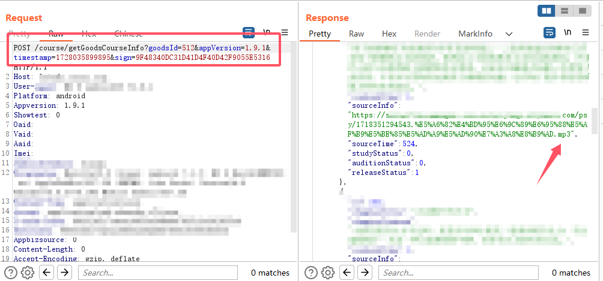

课程内容是直接挂到阿里云服务器下的，我们可以直接访问使用，完全不需要充值vip

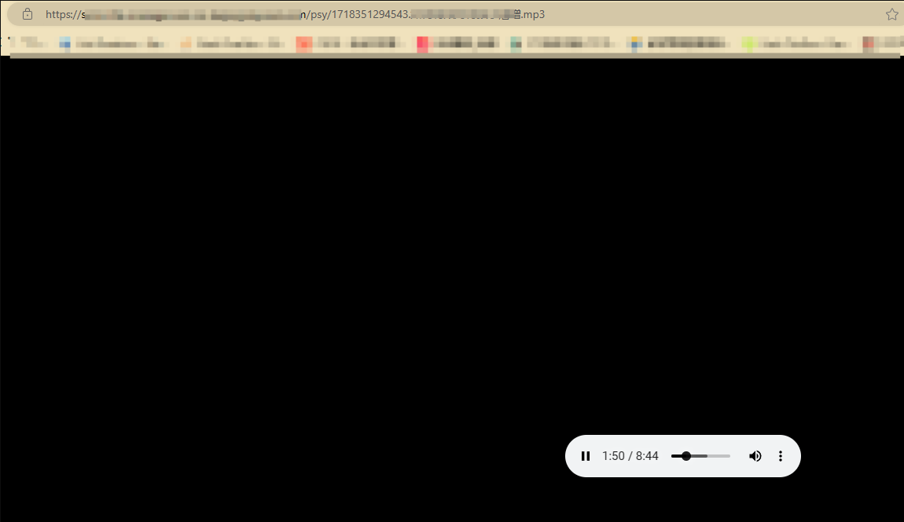

## 无限刷取网站vip

APP上有一处邀请有礼

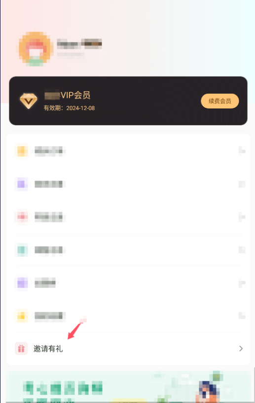

这里点击邀请有礼后会可以获得一张邀请的截图，发送后扫码可以得到下面的url  
https://test.com/cashback/investMidPage?userId=950485&sourceId=6&userRole=1

我们可以直接将上面的url发送到微信中，然后点击链接会跳转到小程序

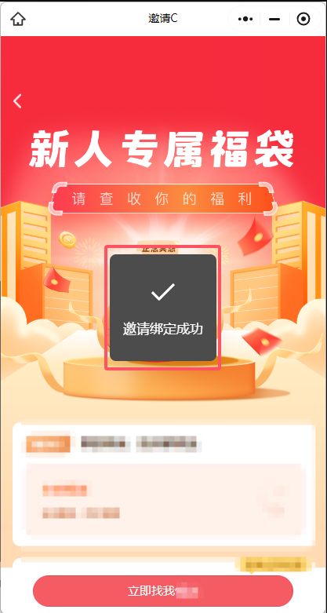

这里点击填入账号会提示邀请绑定成功，绑定成功后bp数据包会有下面这条数据包

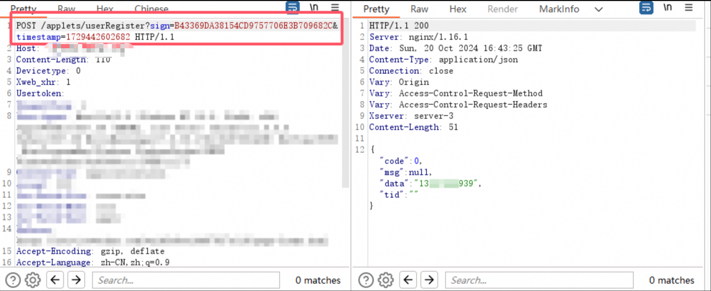

```
POST /applets/userRegister?sign=B43369DA38154CD9757706E3B709682C×tamp=1729442602682 HTTP/1.1
Host: xxx
Content-Length: 110
Devicetype: 0
Xweb_xhr: 1
Usertoken: 
Usepaltform: 1
User-Agent: Mozilla/5.0 (Windows NT 10.0; Win64; x64) AppleWebKit/537.36 (KHTML, like Gecko) Chrome/122.0.0.0 Safari/537.36 MicroMessenger/7.0.20.1781(0x6700143B) NetType/WIFI MiniProgramEnv/Windows WindowsWechat/WMPF WindowsWechat(0x63090c11)XWEB/11275
Content-Type: application/json
Accept: */*
Sec-Fetch-Site: cross-site
Sec-Fetch-Mode: cors
Sec-Fetch-Dest: empty
Referer: xxx
Accept-Encoding: gzip, deflate
Accept-Language: zh-CN,zh;q=0.9
Connection: close

{"referrerId":"950485","code":"","mobile":"13555555555","sourceId":"6","stuInfo":"","timestamp":1729442602682}
```

发现这条数据包会在用户绑定好手机号后给该手机号用户+7天会员，而最重要的是该数据包可以无限重发，也就是说我们可以无限重发来刷取vip

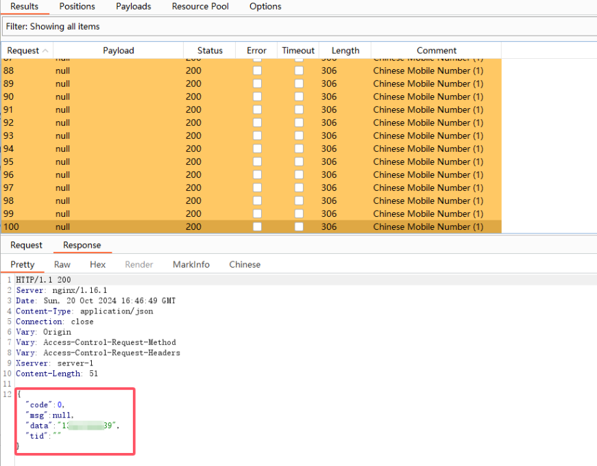

重发后都返回成功，我们查看一下vip天数

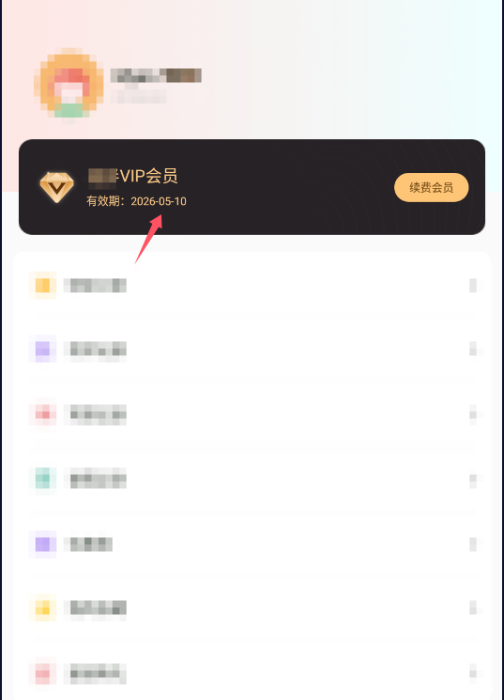

直接刷到了2年后。

由于签名+时间戳校验只校验我们不能篡改内容，但是没有校验内容无法进行重放因此也间接导致了这个漏洞的出现。

​

# 总结

即使在挖掘过程中网站或APP存在签名等防篡改等加固措施，我们也不应该直接选择放弃，更深入的去了解业务逻辑说不定会有意想不到的收获。
