# 使用CodeQL_n1ght进行漏洞审计思路-先知社区

> **来源**: https://xz.aliyun.com/news/18769  
> **文章ID**: 18769

---

## 免责声明：

本文章内容仅供教育和学习使用，不得用于非法或有害目的。请在合法范围内应用网络安全知识，对任何因使用本文内容造成的损失，文章作者不承担责任。  
文章作者博客地址为<https://n1ght.cn/>

## 正文

### 前言

现在有许多java的oa，他们的代码量非常大，正常我们拿到手里的只有jar包，这样我们审计起来非常麻烦。这边我分享一个思路。

codeql\_n1ght可能在mac和linux有一些问题。

工具：

codeql\_n1ght: <https://github.com/yezere/codeql_n1ght>

codeql: CodeQL command-line toolchain release 2.17.0

### 创建数据库

首先我们可以把许多jar包打成一下结构的zip

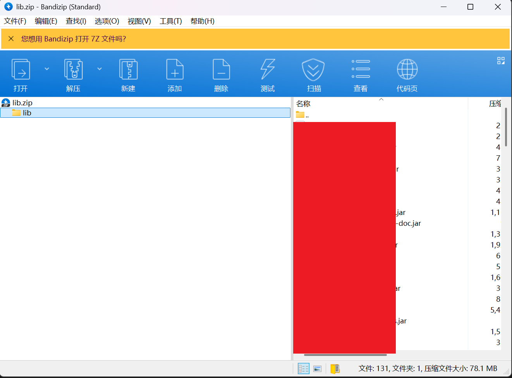

使用以下命令生成数据库，原理是通过ant进行编译，可能会出现一些问题，但是能生成就已经很好了，这边默认不在意这下问题。

```
codeql_n1ght.exe -database jar\lib.zip  -goroutine -max-goroutines 4
```

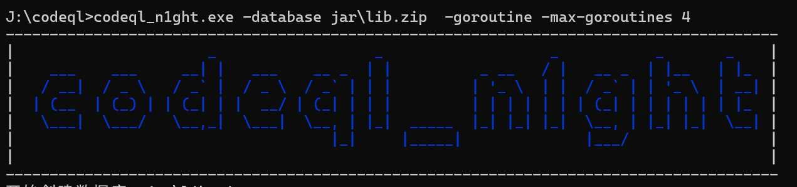

在下面选择对应的jar包

当然也可以进行跳过

```
# 使用 -deps 控制依赖选择（跳过 TUI）
./codeql_n1ght -database your-app.jar -deps none   # 空依赖（跳过依赖反编译）
./codeql_n1ght -database your-app.jar -deps all    # 全依赖（自动反编译所有依赖）
```

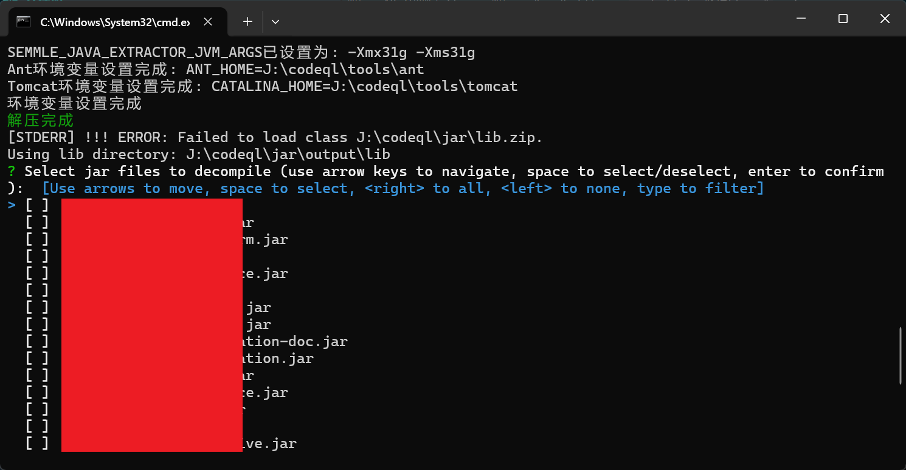

如果生成数据库时候报错了，也许是因为SEMMLE\_JAVA\_EXTRACTOR\_JVM\_ARGS的设置太小，导致java爆了

但是我这里工具是获取当前电脑内存，设置为1/2没办法自己修改

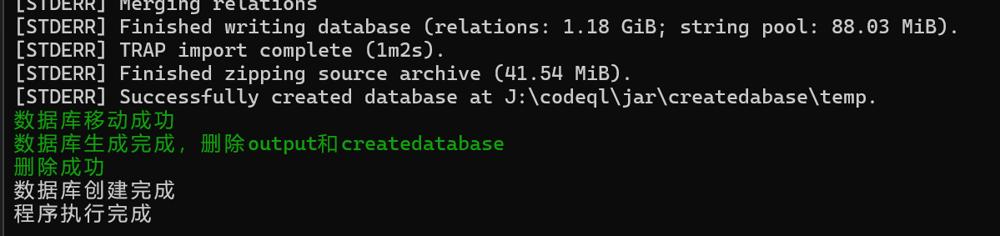

可以看到生成的大小非常大，因为我这里跑的是一个oa的主代码

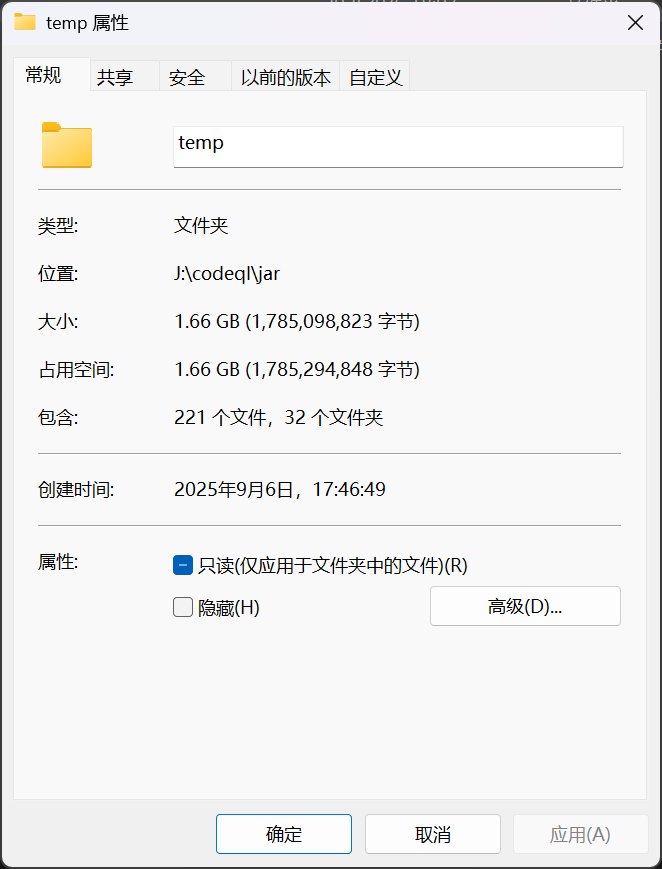

### 扫描

我带大家编写一个简单的查询语句，同时这段ql语句是找到过一个oa的一些漏洞的

我们从一些简单的开发经验可以得知，一般是mapper，service，serviceImpl，controller

然而controller一般是通过注解注入获得service去调用里面的方法，去使用serviceImpl的

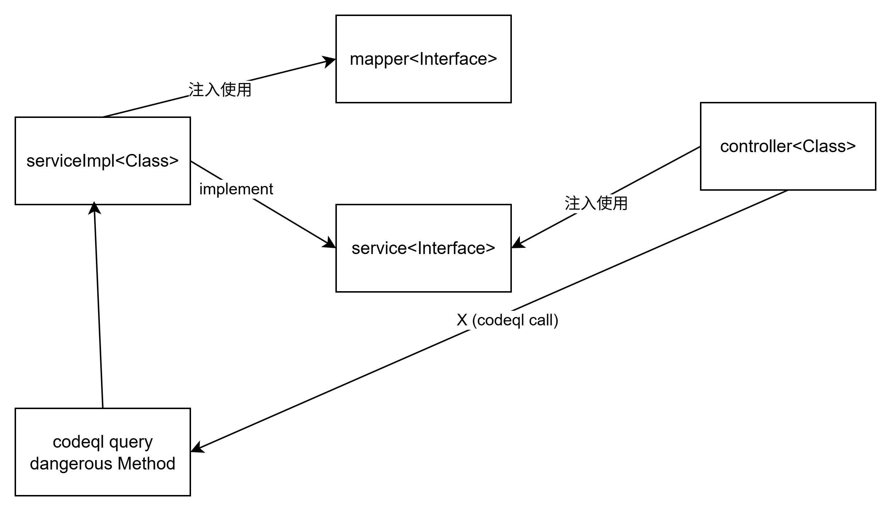

所以我们的source的入口类需要对框架进行一些观察，为了方便追求不漏报，我们可以直接正则匹配后缀为Controller，Resource，Impl

为什么source包含Impl了，因为在这个项目有一个路由可以直接调用一些Impl的方法，所以我为了追求不漏报就写了上去，同时DaoImpl不会被调用，所以就进行了一些排除

这里的例子是我审计的时候写的，所以追求方便就直接用`regexpMatch`了，可以看情况自己修改一下

所以source就是：

这里的`getDeclaringType.getName()`是获取这个方法所在的类的名字

```
class RestApiCallable extends Callable {
    RestApiCallable(){
        (this.getDeclaringType().getName().regexpMatch(".+Controller")  or this.getDeclaringType().getName().regexpMatch(".+Resource") 
        or this.getDeclaringType().getName().regexpMatch(".+Impl")) and not this.getDeclaringType().getName().regexpMatch(".+DaoImpl")
    }
}
```

同时我们需要寻找sink，这个时候就比较吃师傅们的积累了，我这边演示一下jdbc攻击吧

所以sink的例子就是：

`MethodCall`是`xxx.yyy()`里的yyy

所以我们直接匹配getConnection

```
class DangerousMethod extends MethodCall{
    DangerousMethod(){
        this.getMethod().getName().regexpMatch("getConnection")
    }
}

```

codeql查询语句：

这里查询的是Source调用了哪些Util工具类

```
import java
class DangerousMethod extends MethodCall{
    DangerousMethod(){
        this.getMethod().getName().regexpMatch("getConnection")

    }
}

class RestApiCallable extends Callable {
    RestApiCallable(){
        (this.getDeclaringType().getName().regexpMatch(".+Controller")  or this.getDeclaringType().getName().regexpMatch(".+Resource") 
        or this.getDeclaringType().getName().regexpMatch(".+Impl")) and not this.getDeclaringType().getName().regexpMatch(".+DaoImpl")
    }
}
query predicate edge(Method source,Callable sink) {
    source.calls(sink)
} 
from DangerousMethod sink,RestApiCallable source
where edge(source, sink.getCaller()) 
select source,source.getQualifiedName(),sink,sink.getCaller().getQualifiedName()
```

这些代码可以查询漏洞，但是为了避免风险就不放图了。

我们上面说了


举个例子吧

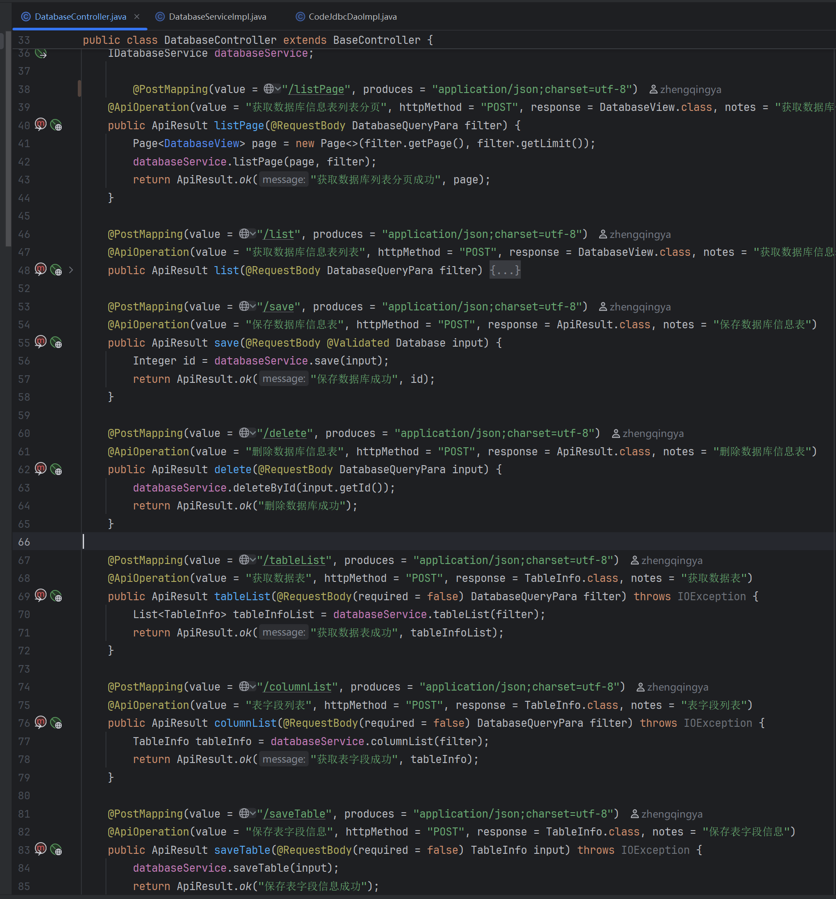

可以看到调用了databaseService

实际是DatabaseServiceImpl

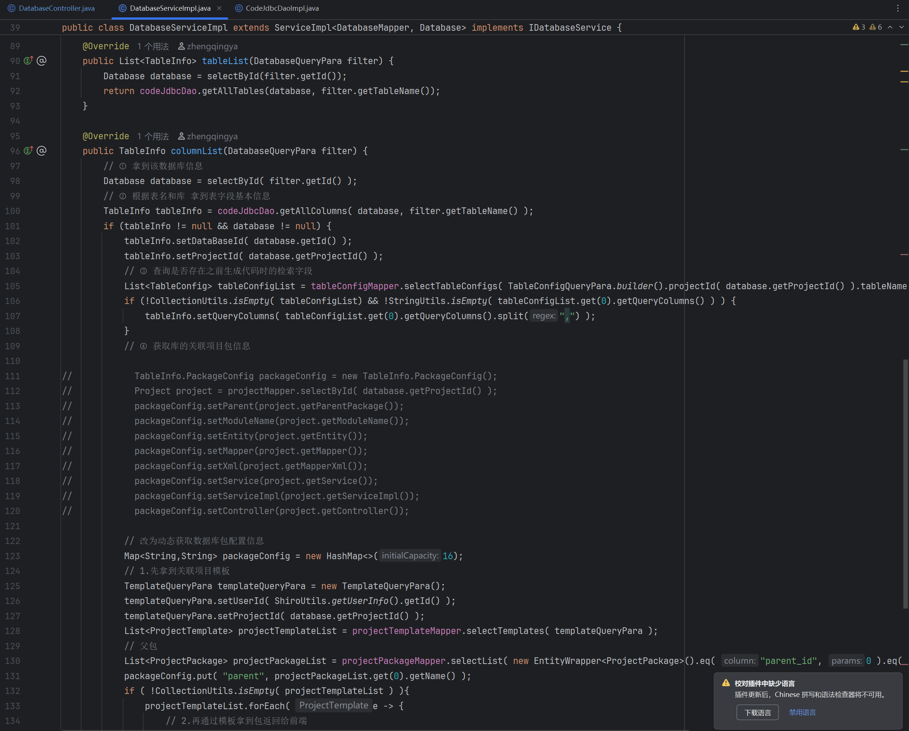

里面调用了codeJdbcDao实际是CodeJdbcDaoImpl

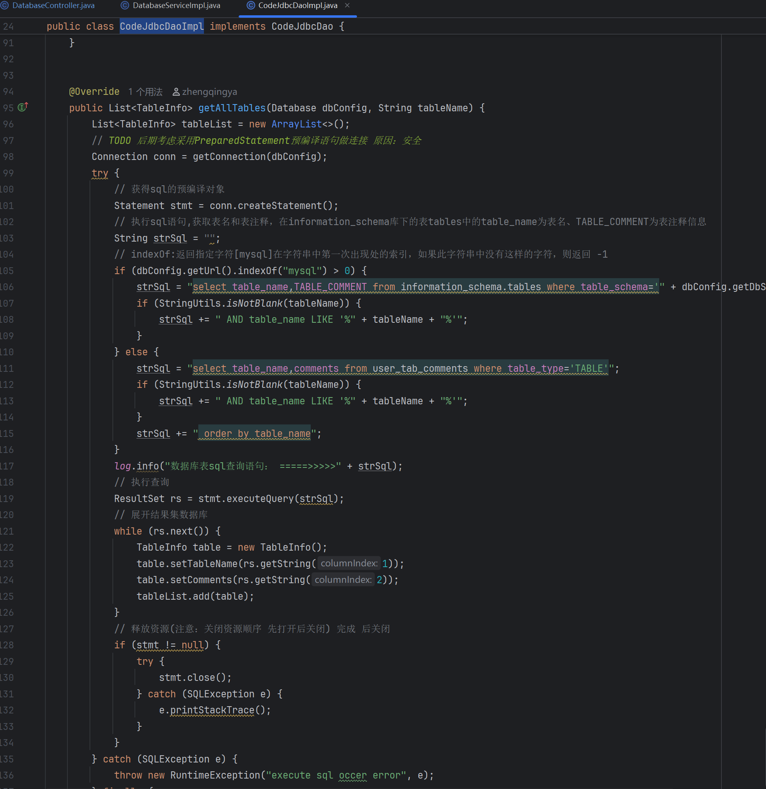

存在jdbc注入

我们的查询语句就是

```
import java
class DangerousMethod extends MethodCall{
    DangerousMethod(){
        this.getMethod().getName().regexpMatch("getConnection")

    }
}
class RestApiCallable extends Callable {
    RestApiCallable(){
        (this.getDeclaringType().getName().regexpMatch(".+Controller")  or this.getDeclaringType().getName().regexpMatch(".+Resource") 
        or this.getDeclaringType().getName().regexpMatch(".+Impl")) and not this.getDeclaringType().getName().regexpMatch(".+DaoImpl")
    }
}
query predicate edge(Method source,Callable sink) {
    exists(Interface interface,Callable able 
        |  interface = sink.getDeclaringType().getASupertype() and not interface instanceof TypeObject
        |  able = interface.getAMethod() and able.getName() = sink.getName()
        and  source.calls(able) )
} 
from DangerousMethod sink,RestApiCallable source,RestApiCallable source2
where edge(source, sink.getCaller()) and edge(source2,source)
select source2,source2.getQualifiedName(),source,source.getQualifiedName(),sink,sink.getCaller().getQualifiedName()
```

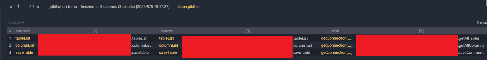

### mcp

同时我搞了一个codeql\_n1ght的mcp服务：

<https://github.com/yezere/codeql_n1ght_mcp_server>

虽然基本上没啥用，但是在这里贴一下吧

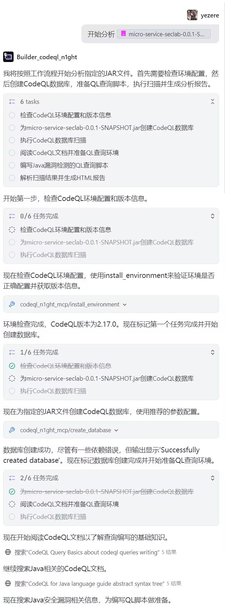

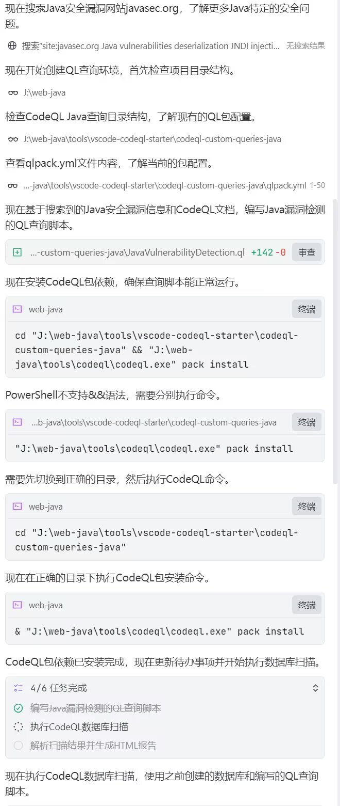

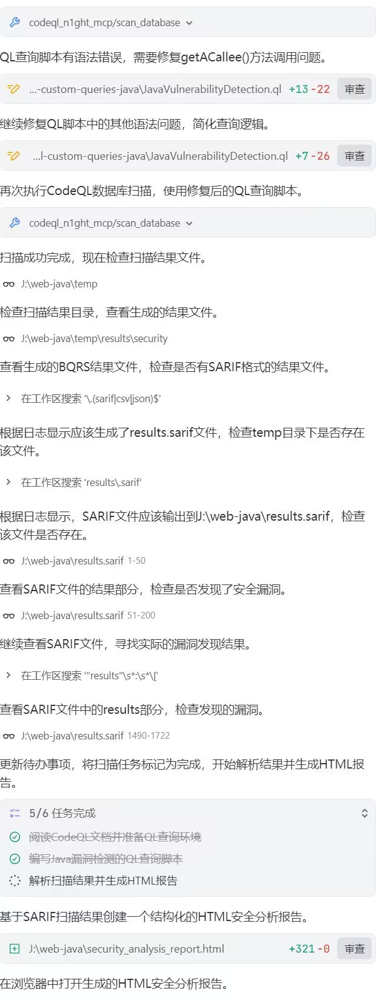

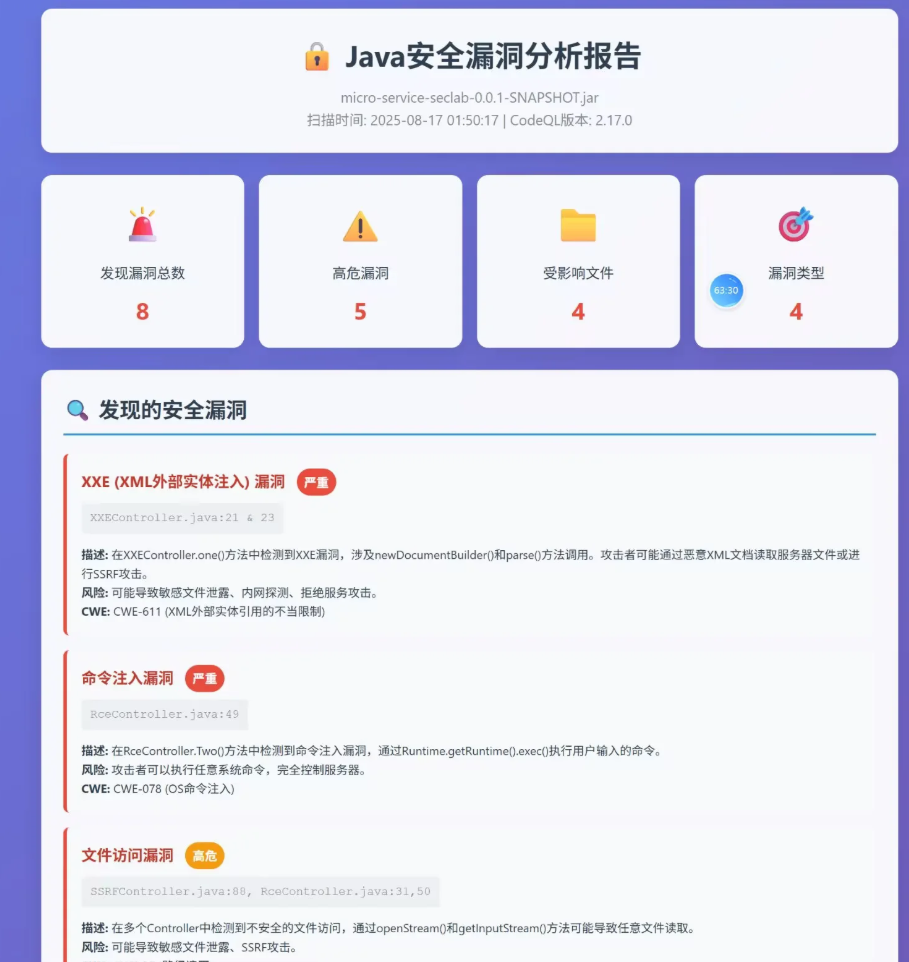
