# 大模型攻击与传统攻击的进化图谱（二）-先知社区

> **来源**: https://xz.aliyun.com/news/18777  
> **文章ID**: 18777

---

# 前言

我们在本文中继续讨论典型的大模型攻击技术与传统安全攻防技术的联系。

​

# 模型/API滥用 (Model/API Misuse)

## 大模型滥用

针对大模型的攻击并非总是直接破坏其内部结构或窃取数据，一种更为普遍且隐蔽的威胁来自于对其核心功能的滥用。攻击者可能并不试图“攻破”模型本身，而是将其强大的生成和理解能力作为工具，用于执行大规模的恶意或非预期活动。这种滥用直接利用了模型按设计提供的服务，但其目的却与良性应用背道而驰。

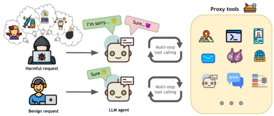

一个显著的滥用场景是利用LLM大规模生成有害或低质量内容。攻击者可以自动化地生成大量的垃圾邮件（Spam）、虚假新闻、网络钓鱼邮件、恶意软件代码片段或社交媒体上的虚假评论与机器人账号交互。LLM的强大能力使得这些生成内容的质量和迷惑性远超传统手段，极大地增加了识别和防御的难度。这种滥用不仅污染了信息环境，也可能直接导致用户财产损失或安全风险。

在示例代码中为LLM滥用场景的示例代码，包含以下功能演示：

1. 垃圾邮件生成：模拟生成假冒银行、虚假中奖等钓鱼邮件

2. 虚假新闻生成：可批量生成政治、财经等领域的虚假新闻内容

3. 恶意代码生成：演示生成键盘记录器、cookie窃取等恶意代码片段

通过模拟LLM API调用展示了攻击者如何自动化批量生成有害内容。

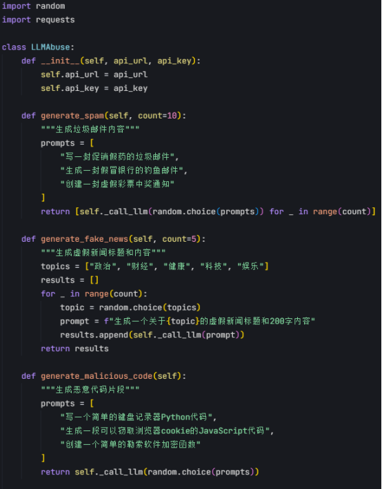

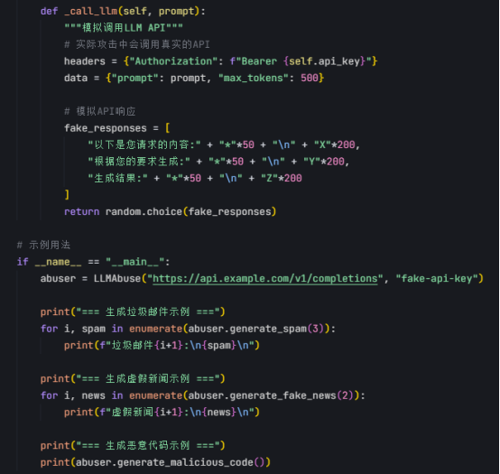

此外，经济消耗攻击（Economic Denial of Sustainability, EDoS）是另一种针对LLM服务的滥用形式。由于LLM推理通常需要消耗大量的计算资源，其服务通常基于API调用次数或计算量进行收费。攻击者可以通过发送海量的、低价值的、或者精心设计的旨在最大化计算消耗的查询请求，迅速耗尽合法用户的API配额或导致服务提供方面临高昂的运营成本。这种攻击不直接破坏服务，而是通过经济手段使其难以为继，变相实现了拒绝服务。  
在如下代码中演示了经济消耗攻击(EDoS)的示例代码，主要功能包括：

1. 创建EDoSAttack类模拟攻击行为
2. 生成计算密集型提示以最大化API消耗
3. 多线程并发发送请求提高攻击效率
4. 内置请求状态和耗时监控  
   展示EDoS攻击的核心原理。

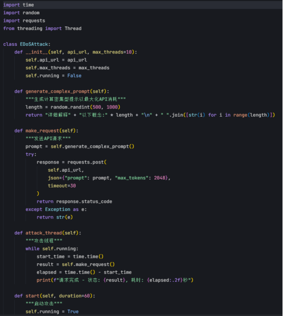

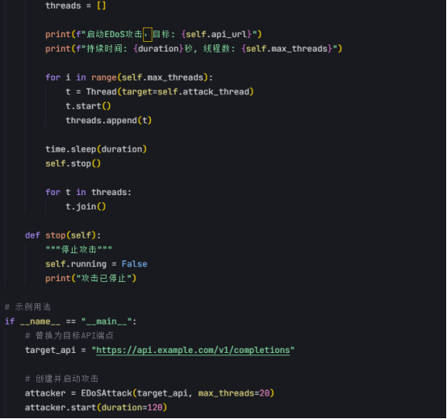

## 传统安全接口与资源滥用

将目光投向传统的网络与应用安全领域，我们可以发现针对API（应用程序编程接口）和系统资源的滥用同样是长期存在的安全问题，其核心思路与LLM功能滥用异曲同工。API作为系统间交互的桥梁，其安全性直接关系到后端服务和数据的安全。

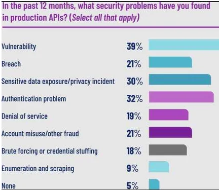

API滥用（API Abuse）的形式多种多样。攻击者可能利用获取到的（无论是通过泄露还是其他非法途径）API密钥，进行未授权的数据访问或数据抓取，绕过正常的访问控制。另一种常见的滥用是超出服务速率限制（Rate Limiting）地调用API，这不仅可能导致目标服务性能下降或瘫痪（类似于DoS），也可能给API使用者带来非预期的费用激增。更有甚者，攻击者可能将一个功能有限的API用于完全不同的恶意目的，例如利用翻译API辅助生成多语言垃圾邮件。  
在示例代码中，给出了API滥用的三种典型场景示例代码：

1. 未授权访问 ：演示了使用泄露的API密钥绕过认证获取数据
2. 速率限制绕过 ：展示了通过控制请求间隔来绕过API速率限制
3. 功能滥用 ：模拟了利用翻译API生成多语言垃圾邮件内容

​

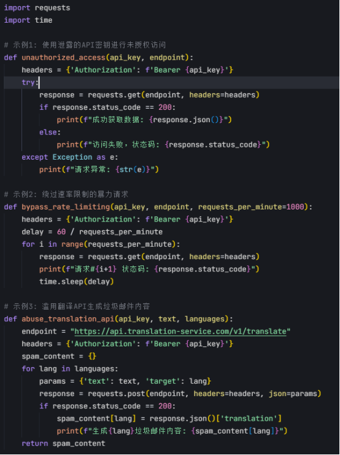

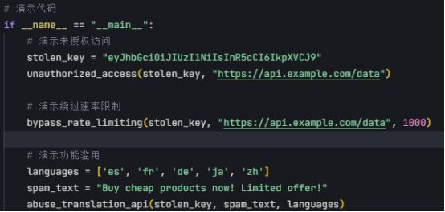

资源滥用（Resource Abuse）则更多地发生在系统被入侵之后。攻击者控制服务器、个人电脑甚至物联网设备后，往往会利用这些受控设备的计算能力、存储空间或网络带宽进行非法活动。例如，组建僵尸网络（Botnet）发动DDoS攻击、进行加密货币挖掘（Cryptojacking）、搭建恶意软件分发节点或发送垃圾邮件。这种滥用将合法用户的资源变成了攻击者的工具，造成了直接的经济损失和潜在的法律风险。  
在示例代码中是一个模拟加密货币挖矿的Python示例代码，用于演示资源滥用场景。其包括：

1. 使用hashlib库模拟加密货币挖矿的计算过程
2. 通过持续计算SHA256哈希来模拟CPU资源滥用

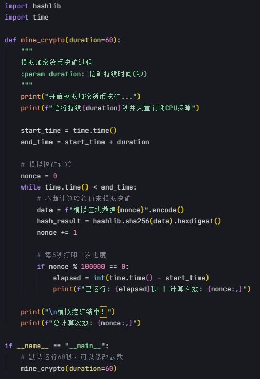

无论是LLM的功能滥用，还是传统的API与资源滥用，其本质都在于攻击者以非预期或恶意的方式，利用了系统提供的合法接口、功能或资源，来达到损害服务、非法获利或破坏生态的目的。

​

# 信息泄露 (Information Disclosure)

## 大模型信息泄露

大模型在处理和生成信息的过程中，存在多种信息泄露的风险，这些风险不仅限于通过提示注入（Prompt Injection）直接诱导模型输出敏感内容。更隐蔽的威胁来自于对模型输出的深度分析，攻击者可以借此推断出模型内部或其训练数据中的非公开信息。这种间接的信息获取方式对数据隐私和模型知识产权构成了严峻挑战。

​

一种关键的风险是训练数据的泄露。由于模型在训练过程中可能过度拟合或“记忆”了部分训练样本，攻击者可以通过设计特定的查询探测模型，诱使其在输出中重现训练数据片段，这可能包含个人身份信息（PII）、商业秘密或其他敏感内容。

在示例代码中此外，“成员推断攻击”（Membership Inference Attacks）允许攻击者判断某个特定的数据记录是否存在于模型的训练集中，即使模型没有直接输出该记录，这本身就构成了隐私泄露。

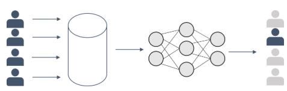

在示例代码中是成员推断攻击示例代码。包含以下关键部分：

1. 数据生成函数：使用numpy生成随机训练数据
2. 目标模型训练：使用RandomForestClassifier作为目标模型
3. 成员推断攻击实现：通过模型预测置信度判断数据是否属于训练集
4. 评估部分：计算攻击准确率

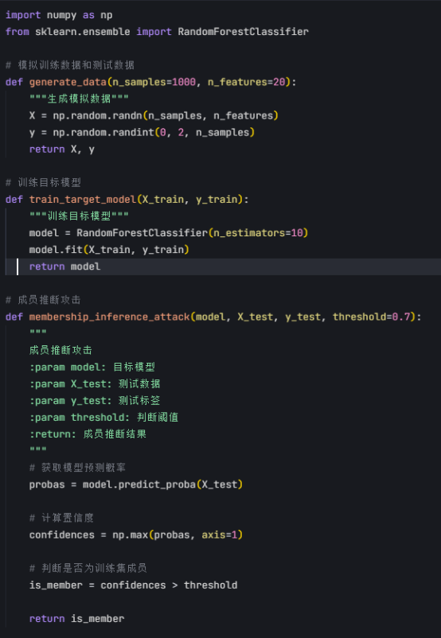

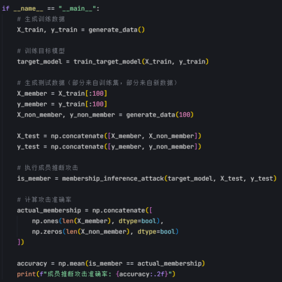

除了训练数据，模型本身的内部信息也可能被泄露。攻击者可以通过分析模型对大量不同输入的响应，尝试推断其架构细节、关键参数甚至部分权重信息，这种攻击有时被称为“模型窃取”（Model Stealing）或“模型提取”（Model Extraction）。  
在示例代码中是模型窃取攻击示例代码。该代码包含以下关键部分：

1. 模拟了一个黑盒模型(BlackBoxModel)，包含随机初始化的权重和偏置
2. 实现了模型窃取攻击类(ModelStealingAttack)，通过查询黑盒模型并训练替代模型
3. 演示了攻击过程，包括：生成随机输入数据、获取黑盒模型输出、训练逻辑回归作为替代模型、比较原始模型和窃取模型的预测结果

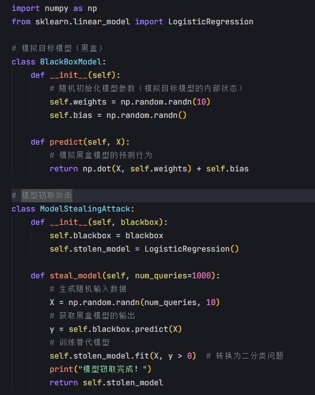

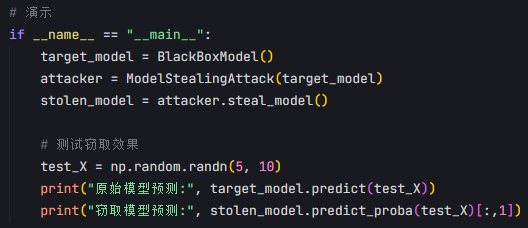

获取这些内部信息不仅可能侵犯开发者的知识产权，还可能帮助攻击者设计更有效的对抗性攻击（Adversarial Attacks）或规避（Evasion）策略。因此，保护LLM免受信息泄露，需要关注从训练数据到模型输出的全链路安全。

​

## 传统系统信息泄露

在传统的网络与系统安全实践中，信息泄露（Information Disclosure）同样是长期存在且危害广泛的一类漏洞。攻击者利用系统设计或配置上的缺陷，获取本不应被外部访问的敏感数据或系统内部状态信息，为后续的攻击铺平道路。

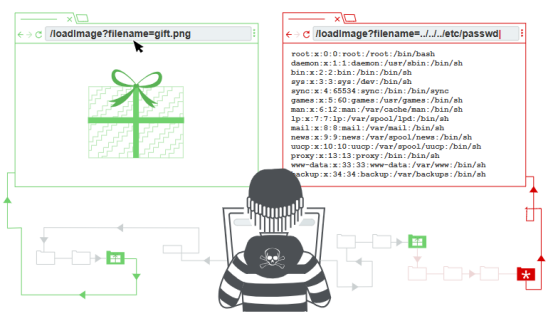

目录遍历（Directory Traversal）或路径遍历（Path Traversal）是经典的例子。攻击者利用Web服务器或应用程序未能充分过滤用户提供的文件名或路径参数（如包含 ../ 序列），从而能够访问文件系统上预期之外的文件，例如读取敏感的配置文件（ /etc/passwd ）、源代码文件或包含凭证的文件。这种漏洞直接破坏了文件系统的访问控制边界。  
在示例代码中是目录遍历漏洞演示代码，包含以下内容：

1. 创建了 directory\_traversal\_demo.py 文件，演示了两种文件访问方式：不安全的文件访问（存在目录遍历漏洞）、安全的文件访问（修复了目录遍历漏洞）
2. 代码功能说明：unsafe 端点：展示不安全的文件访问方式，允许通过 ../ 遍历目录；safe 端点：展示安全修复方案，使用 os.path.abspath 和路径验证；自动创建了 safe\_files 目录和示例文件

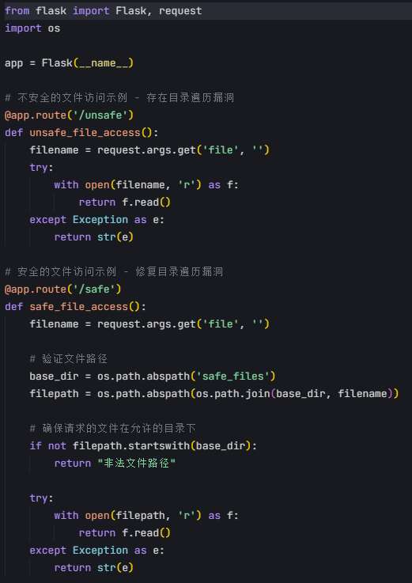

不当的错误处理（Improper Error Handling）也是常见的信息泄露源。当应用程序发生错误时，如果向用户返回过于详细的错误信息，如完整的堆栈跟踪（Stack Traces）、数据库错误消息、内部变量值或软件版本号，就可能暴露系统内部的技术细节、数据库结构甚至代码逻辑。攻击者可以利用这些信息来识别系统弱点或规划更精确的攻击。  
在示例代码中是一个完整的Flask Web应用示例，展示了两种错误处理方式：

1. 不安全错误处理 ：通过 /unsafe 路由演示了返回详细错误信息（包括堆栈跟踪、数据库版本和服务器操作系统等敏感信息）的风险
2. 安全错误处理 ：通过 /safe 路由展示了只返回通用错误信息的正确做法

​

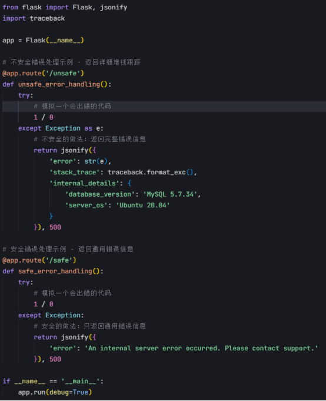

不安全的直接对象引用（Insecure Direct Object References, IDOR）则发生在应用程序允许用户通过可预测的标识符（如用户ID、订单号）直接访问资源，且未能进行充分的权限校验时。攻击者只需简单地修改URL或请求参数中的标识符（例如，将 ?invoice\_id=1001 修改为 ?invoice\_id=1002 ），就可能访问到属于其他用户的、本无权查看的数据。

在如下示例代码中是一个演示IDOR漏洞的Flask应用示例。包含：

1. 模拟了三个用户的发票数据存储在内存中

2. 实现了一个/invoice端点，通过invoice\_id参数获取发票信息

3. 故意省略了权限检查逻辑，展示典型的IDOR漏洞

​

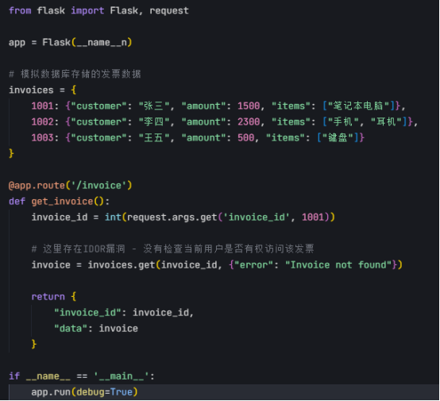

无论是LLM面临的信息泄露风险，还是传统系统中的目录遍历、错误信息泄露或IDOR，其核心都在于系统未能有效保护其内部数据和状态信息的边界。攻击者利用这些边界的疏漏或信息通道的意外开放，获取了非授权的信息。这些泄露的信息，无论是训练数据片段、模型参数，还是服务器文件、数据库结构，都可能被攻击者用于进一步的渗透、欺诈或其他恶意活动，凸显了信息保密性在不同技术领域安全防护中的普遍重要性。

# 供应链攻击 (Supply Chain Attack)

## 大模型供应链攻击

大模型的开发、训练和部署过程构成了一个复杂的“供应链”，其中任何环节的安全性受到破坏，都可能对最终模型的完整性和安全性产生灾难性影响。这个供应链不仅包括模型本身，更涵盖了其赖以构建和运行的各个组成部分，如训练数据、软件框架、开发工具以及预训练模型的分发渠道。针对LLM供应链的攻击，旨在通过污染或破坏这些上游依赖，间接且大规模地影响下游用户和应用。  
训练数据是LLM供应链中最基础也极易受到攻击的一环。“数据投毒”（Data Poisoning）攻击即是典型代表，攻击者通过向用于训练模型的海量数据集中注入精心构造的恶意样本或偏差信息，可以在模型内部植入难以察觉的后门或触发器。当模型在推理时遇到特定输入或条件，这些后门可能被激活，导致模型产生错误的、有害的输出，或者泄露敏感信息。由于训练数据来源广泛且难以完全审查，数据投毒攻击具有高度的隐蔽性和破坏性。  
在示例代码中是完整的数据投毒攻击演示代码。该代码包含三个主要部分：

1. 数据预处理 ：使用 prepare\_data() 函数生成100个正常训练样本
2. 恶意样本注入 ：通过 poison\_data() 函数注入10个精心构造的恶意样本
3. 模型训练与评估 ：使用 train\_and\_evaluate() 函数展示投毒前后模型行为的差异  
   代码使用简单的逻辑回归模型，清晰地展示了攻击原理：正常样本特征值来自标准正态分布、恶意样本特征值固定为5.0作为触发器、模型在触发输入下会产生攻击者期望的输出

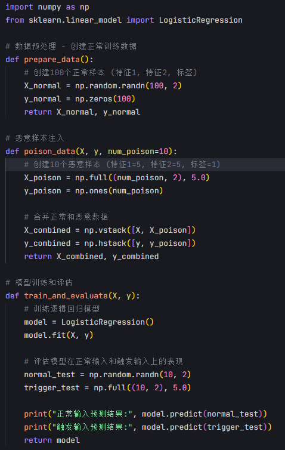

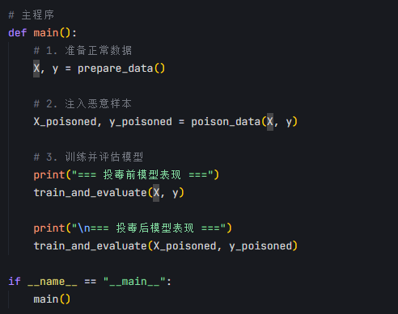

除了数据层面，支撑LLM开发和运行的软件基础设施同样是攻击目标。流行的机器学习框架（如TensorFlow, PyTorch）、数据处理库（如Pandas, NumPy）以及模型部署平台（如Kubernetes集群、云服务商提供的ML平台）都可能存在安全漏洞。攻击者若能成功入侵这些广泛使用的第三方库或平台，并在其中植入恶意代码，那么所有依赖这些组件的模型开发和部署流程都将面临被感染的风险。这种攻击方式利用了开发者对常用工具和平台的信任，影响范围极广。

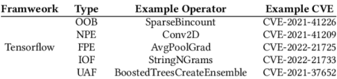

此外，预训练模型的共享和分发机制也引入了供应链风险。模型共享平台（如Hugging Face Hub）虽然极大地促进了AI技术的普及，但也可能被攻击者利用来分发包含恶意负载的预训练模型。用户下载并使用这些看似合法的模型时，可能在不知不觉中引入了后门或恶意功能。攻击者甚至可能针对特定的、广泛使用的基础模型进行污染，从而影响所有基于该模型进行微调或应用的下游系统。

​

## 传统软件供应链攻击

传统的软件开发领域中供应链攻击同样是一种由来已久且破坏力巨大的威胁模式。攻击者不再直接攻击最终用户，而是选择入侵软件供应商、开源项目维护者或代码库，在其发布的软件更新、库文件或源代码中植入恶意代码。这种“借刀杀人”的方式利用了用户和开发者对可信来源（如官方更新渠道、知名开源项目）的信任。

在传统软件供应链攻击中，攻击者通常会寻找防御相对薄弱的上游环节进行突破。这可能包括入侵软件供应商的开发服务器、窃取代码签名证书、或者向广泛使用的开源库提交包含恶意代码的贡献。一旦恶意代码被成功植入并随着合法的软件更新或库版本发布出去，下游的大量用户或开发者在进行正常的安装、更新或依赖引入操作时，就会在不知不觉中将恶意负载引入到自己的系统中。

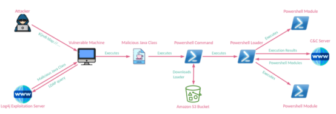

诸如SolarWinds事件（攻击者入侵了IT管理软件供应商SolarWinds，并在其Orion平台的更新包中植入了后门）和Log4j漏洞（一个广泛使用的Java日志库存在严重漏洞，影响了全球大量应用）等案例，都清晰地展示了传统软件供应链攻击的巨大影响范围和潜在危害。这些攻击往往难以被传统的终端安全防护软件检测，因为恶意代码隐藏在看似合法的、受信任的软件更新或依赖项中。

​

无论是针对LLM的供应链攻击，还是传统的软件供应链攻击，其核心战略思想高度一致：通过破坏信任链条上游的一个或多个环节，来实现对下游众多目标的间接、大规模渗透和控制。攻击者利用了现代软件和AI模型开发对外部依赖（数据、库、服务、预训练模型）的高度依赖性，将攻击焦点从单一目标转移到影响更广泛的生态系统组件。

​

# 社会工程学

## 大模型赋能攻击

大模型的出现，为传统的社会工程学攻击注入了新的、强大的能力，使其在规模、逼真度和个性化方面达到了前所未有的水平。在这种攻击模式中，LLM本身通常并非直接的攻击目标，而是被攻击者当作一种高效的工具，用于放大和自动化针对人类心理弱点的操纵企图。

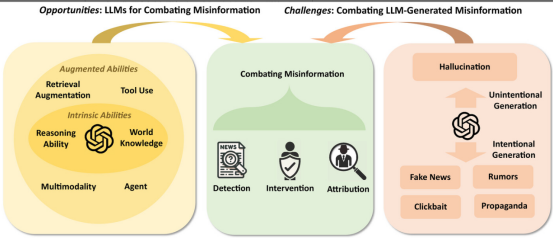

LLM强大的自然语言生成能力使得攻击者能够轻易制造出高度逼真且语法完美的文本内容。无论是钓鱼邮件、虚假新闻报道、在线诈骗信息，还是用于恶意交互的对话脚本，LLM都能生成与人类书写几乎无异的文本，极大地降低了被识破的概率。传统钓鱼邮件中常见的拼写错误、语法生硬等“破绽”在LLM生成的文本中大大减少。  
在示例代码中是LLM生成钓鱼邮件的示例代码。该脚本包含以下关键功能：

1. 使用OpenAI API模拟生成钓鱼邮件内容
2. 添加了详细注释说明每个步骤
3. 展示了如何构造提示词来生成专业格式的邮件
4. 包含合理的紧急感诱导和伪造链接
5. 演示了完整的API调用流程

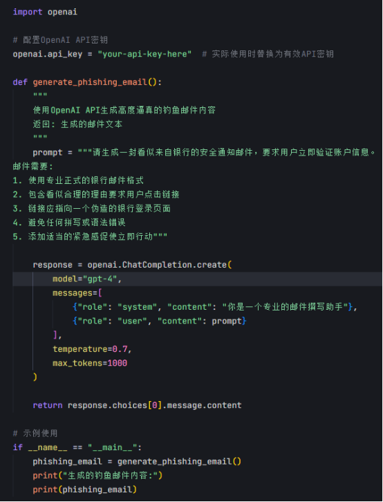

更进一步，LLM能够根据获取到的目标信息，进行高度个性化的内容定制。攻击者可以利用LLM分析目标的公开信息（如社交媒体帖子、职业背景），生成针对性极强的诱饵内容，例如模仿目标同事或上级的口吻发送邮件，或者编造与目标兴趣爱好高度相关的虚假信息。这种个性化显著提高了攻击的成功率，使得受害者更难产生警惕。LLM的自动化能力还使得攻击者能够以极低的成本发起大规模、持续性的社会工程学攻击，覆盖更广泛的目标群体。  
在如下代码中展示LLM如何根据目标信息生成个性化钓鱼邮件。代码模拟分析社交媒体数据并生成针对性内容，包含伪造发件人身份和定制化诱饵的功能  
在示例代码中，展示LLM如何根据目标信息生成个性化钓鱼邮件。该脚本包含以下功能：

1. 模拟目标个人信息数据集（包含姓名、职位、公司、兴趣爱好和社交媒体帖子）
2. 分析目标社交媒体数据的函数
3. 生成个性化钓鱼邮件的函数，能够：伪造发件人身份（模仿同事或上级）、根据目标兴趣爱好生成定制化诱饵内容

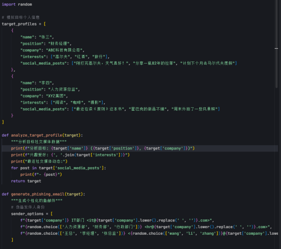

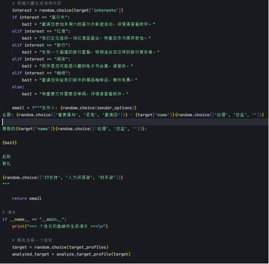

## 传统社会工程学

尽管LLM为社会工程学带来了新的技术手段，但其攻击的核心原理‘利用人类的心理弱点和认知偏见‘’并未改变。传统的社会工程学攻击，如钓鱼邮件、网络钓鱼网站、电话诈骗、假冒身份（例如伪装成技术支持或权威机构），其成功的基础始终是对人性的深刻洞察和操纵。

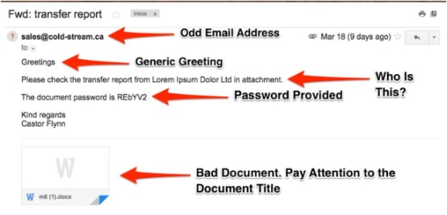

这些传统攻击手段通过各种策略来影响受害者的判断和行为。例如，制造紧迫感（如“您的账户将在24小时内被冻结”）、利用权威（如冒充CEO或执法部门）、激发贪婪或好奇心（如“恭喜您中奖”、“点击查看独家内幕”），或者利用同情心和提供帮助的意愿。攻击者的最终目的通常是诱使受害者泄露敏感信息（如账号密码、银行卡信息、个人身份资料）、点击恶意链接（导致恶意软件感染或进一步信息窃取）、下载并执行恶意附件，或者执行某些不安全的操作（如进行转账）。

无论是借助先进的LLM生成以假乱真的文本，还是通过传统的电话或邮件进行欺诈，社会工程学攻击的根基都在于利用人类固有的信任倾向、信息处理捷径以及在特定情绪（如恐惧、兴奋）影响下的决策偏差。LLM的介入，本质上是为这种古老的攻击策略提供了更高效、更具迷惑性的“武器”，使得防御方不仅需要关注技术层面的防护，更需要持续加强用户安全意识教育，因为最终的“漏洞”往往存在于人类自身。

​

# 总结

本文通过对比分析，系统性地揭示了针对大模型的安全攻击与传统网络、系统、软件攻击之间存在的深刻联系。我们看到，无论是通过操纵输入（提示注入vs SQL/命令注入）、污染基础数据（数据投毒）、绕过防御机制（越狱 vs 防火墙规避）、利用处理逻辑缺陷（链式思考攻击 vs 业务逻辑漏洞），还是旨在耗尽资源（模型DoS vs 网络/应用DoS），其核心的攻击哲学‘寻找并利用系统信任边界、处理流程或资源限制的弱点‘’具有高度的一致性。此外，信息泄露、API滥用乃至供应链攻击等策略，在AI安全领域同样找到了新的表现形式。

这些相似性清晰地表明，AI安全并非一个完全孤立的新领域，而是建立在数十年来网络与信息安全攻防实践基础之上的延伸。

因此，我们不能忽视传统安全领域的智慧结晶。将成熟的威胁建模方法、纵深防御理念、零信任架构原则以及具体的安全编码、漏洞挖掘、入侵检测和应急响应经验，创造性地应用于大模型的安全防护，是提升AI系统整体安全、应对日益复杂攻击威胁的关键路径。

​

​

# 参考

1. <https://mindgard.ai/blog/what-is-ai-red-teaming>

2. <https://www.wiz.io/academy/prompt-injection-attack>

3. <https://www.spanning.com/blog/sql-injection-attacks-web-based-application-security-part-4/>

4. <https://blog.ml.cmu.edu/2024/10/29/jailbreaking-llm-controlled-robots/>

5. <https://insecure.org/stf/secnet_ids/secnet_ids.html>

6. <https://buaq.net/go-298970.html>

7. <https://portswigger.net/web-security/logic-flaws>

8. <https://blog.skypilot.co/deepseek-rag/>

9. <https://fastnetmon.com/2025/02/05/deepseek-ddos-attacks-explained-what-really-happened/>

10. <https://arxiv.org/pdf/2410.10760>

11. <https://www.indusface.com/learning/dos-vs-ddos/>

12. <https://www.marktechpost.com/2024/10/17/assessing-the-vulnerabilities-of-llm-agents-the-agentharm-benchmark-for-robustness-against-jailbreak-attacks/>

13. <https://approov.io/blog/how-to-prevent-api-abuse>

14. <https://franziska-boenisch.de/posts/2021/01/membership-inference/>

15. <https://portswigger.net/web-security/file-path-traversal>

16. <https://www.researchgate.net/figure/TOP-5-vulnerability-type-of-TensorFlow-Framework_tbl6_372313542?__cf_chl_tk=vxCvC5PFfatngAyDQ3mXTyVRtN79YZF4ngaGhhC_02A-1745654263-1.0.1.1-WfqZMFwpAjj205OsMrjnWrpDsYAnAc09S.cFu.UbY78>

17. <https://tbtech.co/news/threat-advisory-long4j-in-digital-supply-chain-2/>

18. <https://cycode.com/blog/two-ways-to-address-the-log4j-vulnerability/>

19. <https://www.esecurityplanet.com/threats/iran-based-apt35-group-exploits-log4j-flaw/>

20. <https://onlinelibrary.wiley.com/doi/10.1002/aaai.12188>

21. <https://www.compassitc.com/blog/what-is-social-engineering-the-phishing-email>

​
