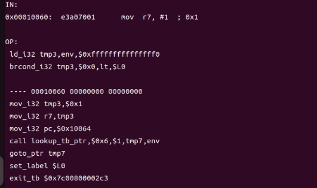

# 浅析和应对 Windows 反 VM 技术-先知社区

> **来源**: https://xz.aliyun.com/news/18780  
> **文章ID**: 18780

---

# 前言

在恶意软件动态分析场景中，虚拟化（如 VMware、VirtualBox）与仿真（如 QEMU）是安全研究员的核心工具 —— 它们能构建隔离环境，方便监控系统行为、捕获网络流量或调试样本。但攻击者为规避分析，常会在恶意代码中植入反虚拟机（Anti-VM）技术，通过检测环境特征来改变代码逻辑（如停止恶意功能、释放诱饵代码），这篇文章我们来聊聊如何检测和简单绕过

# 1、QEMU

QEMU 是开源跨架构仿真工具，也是恶意软件 Anti-VM 技术的常见 “目标”。需先掌握其核心机制，才能理解后续检测逻辑，相信做IOT仿真的逆向大佬对这个都应该非常熟悉。接下来就了解下

## 1.1 QEMU的两种仿真模式

QEMU 支持两种核心仿真模式，适用于不同分析场景：  
**系统仿真**：模拟完整硬件（存储、内存、CPU 等），可运行完整操作系统（如在 x86 主机上跑 ARM Windows），适用于全系统动态分析  
**用户态仿真**：无需完整系统，直接执行目标架构的二进制文件（如在 x86 主机上跑 ARM 可执行文件），适用于单一二进制文件的快速验证  
此外，QEMU 可集成 KVM 等 hypervisor 实现硬件辅助虚拟化，提升仿真性能，但也会引入新的环境特征。

## 1.2 TCG指令翻译

简单了解下QUME在系统中仿真中比较重要的TCG  
TCG（Tiny Code Generator）：QEMU 的核心组件，负责将客户机 CPU 指令翻译为宿主机器指令。在系统仿真中，QEMU 通过动态二进制翻译实现指令转换，核心流程为：  
客户机指令 → TCG 中间表示（IR） → 宿主机器指令  
以 ARM 指令 `mov r0, #5`（将 5 赋值给 r0 寄存器）为例，我们可通过 QEMU 用户态工具捕获翻译过程：  
**1.编译 ARM 测试代码**:

```
// test.s
.section .text
.global _start
_start:
    mov r0, #5    // 赋值5到r0
    mov r1, #7    // 赋值7到r1
    add r0, r0, r1 // 计算r0 = r0 + r1
    mov r7, #1    // 设置系统调用号1（退出）
    svc #0        // 触发系统调用
```

编译命令：

```
arm-linux-gnueabi-as -o test.o test.s
arm-linux-gnueabi-ld -o test test.o
```

**2.捕获 TCG 翻译日志**：  
使用 QEMU 用户态工具 qemu-arm，通过 -d 启用日志，-D 指定输出文件：

```
qemu-arm -d in_asm,op,out_asm -D test.log -singlestep ./test
```

**3.翻译结果解析**：  
其中日志部分中核心部分对应 mov r7, #1的转换：

1. 客户机指令（ARM）：mov r7, #1（ opcode：e3a07001）
2. TCG 中间表示（IR）：  
   

```
mov_i32 tmp3, $0x1   ; 临时变量tmp3赋值为立即数1（32位）
mov_i32 r7, tmp3     ; 将tmp3的值存入客户机寄存器r7
```

1. 宿主指令（x86-64）：`movl $0x1, 0x1c(%r14)`（将 1 存入 r14 寄存器偏移 0x1c 的位置，对应 QEMU 内部的 r7 寄存器映射）

TCG 的 TB 是 “原子执行” 的，这与物理 CPU 可在任意指令间中断的特性形成差异 —— 而这种差异正是部分 Anti-VM 技术的核心突破口。

# 2.Windows 平台 Anti-VM 技术原理与实现

恶意软件的 Anti-VM 技术可按 “检测载体” 分为三类：基于 Windows API、基于汇编指令、针对 QEMU TCG 特性。以下逐一拆解其原理、代码实现与检测逻辑。

## 2.1 基于 Windows API 的检测

Windows API 可直接查询系统硬件 / 电源特征，恶意软件通过对比 “物理机 vs 虚拟机” 的特征差异实现检测。常见两类检测逻辑：

### 2.1.1 热控制管理检测

物理机需通过 “热区” 管理硬件散热，避免过热；而虚拟机的硬件是仿真的，无需热管理（宿主机会处理真实散热）。  
**核心 API**：`GetPwrCapabilities`（定义在 powerbase.h），用于获取系统电源管理能力，返回的 SYSTEM\_POWER\_CAPABILITIES 结构体中，ThermalControl 字段标识是否支持热管理：

* 物理机：ThermalControl = TRUE
* 虚拟机：ThermalControl = FALSE  
  **检测代码实现：**

```
#include <windows.h>
#include <powrprof.h>
#include <stdio.h>

// 需链接powrprof.lib（编译时加：-lpowrprof）
int main() {
    SYSTEM_POWER_CAPABILITIES power_caps;

    // 调用API获取电源能力
    if (GetPwrCapabilities(&power_caps)) {
        // 检查热控制支持状态
        if (!power_caps.ThermalControl) {
            printf("检测到虚拟机（热控制未启用）
");
        } else {
            printf("未检测到虚拟机（热控制已启用）
");
        }
    }
    return 0;
}
```

### 2.1.2 硬盘容量与剩余空间检测

虚拟机的硬盘受宿主物理硬盘限制，通常配置较小（如 20GB），而物理机硬盘普遍较大（桌面机≥512GB，笔记本≥256GB）。恶意软件通过对比硬盘容量阈值实现检测。  
**核心 API**：GetDiskFreeSpaceExA，用于获取磁盘容量信息（总容量、剩余容量等）。  
**关键参数**：

* lpTotalNumberOfBytes：磁盘总容量
* lpTotalNumberOfFreeBytes：磁盘剩余容量  
  **检测代码实现**：

```
#include <stdbool.h>
#include <stdio.h>
#include <windows.h>

int main() {
    // 存储C盘和D盘的容量信息
    ULARGE_INTEGER C_free, C_total, C_total_free;
    ULARGE_INTEGER D_free, D_total, D_total_free;

    // 调用API获取C盘和D盘信息
    BOOL success_C = GetDiskFreeSpaceExA("C:\", &C_free, &C_total, &C_total_free);
    BOOL success_D = GetDiskFreeSpaceExA("D:\", &D_free, &D_total, &D_total_free);

    // 提取数值（单位：字节）
    ULONGLONG c_total = success_C ? C_total.QuadPart : 0;
    ULONGLONG d_total = success_D ? D_total.QuadPart : 0;
    ULONGLONG c_free = success_C ? C_total_free.QuadPart : 0;
    ULONGLONG d_free = success_D ? D_total_free.QuadPart : 0;

    // 若未获取到任何磁盘信息，直接判定为虚拟机
    if (!c_total && !d_total && !c_free && !d_free) {
        printf("检测到虚拟机（未获取磁盘信息）
");
        return 0;
    }

    // 阈值判断：总容量<20GB 或 剩余容量<10GB（1GB=1073741824字节）
    bool is_vm = false;
    if (c_free < 10737418240 || d_free < 10737418240) is_vm = true;
    if (c_total < 21474836480 || d_total < 21474836480) is_vm = true;

    printf("%s
", is_vm ? "检测到虚拟机（磁盘容量不足）" : "未检测到虚拟机");
    return 0;
}
```

## 2.2 基于汇编指令的检测

汇编指令可直接与硬件交互，无需依赖 Windows API，适用于跨系统场景。Windows 平台常见两类指令：CPUID 和 SIDT

### 2.2.1 CPUID 指令：检测 Hypervisor 特征

CPUID 用于查询 CPU 信息，通过设置不同的 eax 寄存器值，可返回不同类型的硬件信息。恶意软件利用其检测虚拟化环境的两个关键特征：  
**1. Hypervisor 位（ecx 第 31 位）：**  
 当 eax = 0x1 时，ecx 寄存器的第 31 位为 “Hypervisor 位”：  
 物理机：该位为 0（无 Hypervisor）  
 虚拟机 / 仿真环境：该位为 1（存在 Hypervisor）  
**2. Hypervisor ID 字符串：**  
 当 eax = 0x40000000 时，ebx、ecx、edx 寄存器会返回 12 字节的 Hypervisor 标识字符串，常见值：  
 Microsoft Hyper-V：Microsoft Hv  
 KVM：KVMKVMKVM\0\0\0 或 Linux KVM Hv  
 QEMU（TCG）：TCGTCGTCGTCG  
 VirtualBox：VBoxVBoxVBox

**检测代码实现：**

```
#include <stdio.h>
#include <string.h>

// 已知的Hypervisor ID列表
#define NB_ID_STRING 4
const char* known_hypervisor_id[NB_ID_STRING] = {
    "Microsoft Hv",
    "KVMKVMKVM",
    "TCGTCGTCGTCG",
    "VBoxVBoxVBox"
};

int main() {
    unsigned int eax, ebx, ecx, edx;
    char hypervisor_id[13]; // 存储12字节ID + 终止符

    // 执行CPUID，eax=0x40000000获取Hypervisor ID
    __asm__ volatile(
        "movl $0x40000000, %%eax
" // 设置eax为0x40000000
        "cpuid
"                   // 执行CPUID指令
        : "=b"(ebx), "=c"(ecx), "=d"(edx) // 输出：ebx/ecx/edx
        : 
        : "%eax" // 破坏的寄存器：eax
    );

    // 将ebx/ecx/edx的值拼接为ID字符串
    *(unsigned int*)&hypervisor_id[0] = ebx;
    *(unsigned int*)&hypervisor_id[4] = ecx;
    *(unsigned int*)&hypervisor_id[8] = edx;
    hypervisor_id[12] = '\0'; // 添加字符串终止符

    // 对比已知Hypervisor ID
    for (int i = 0; i < NB_ID_STRING; i++) {
        if (strstr(hypervisor_id, known_hypervisor_id[i])) {
            printf("检测到虚拟机（Hypervisor: %s）
", known_hypervisor_id[i]);
            return 0;
        }
    }

    printf("未检测到虚拟机
");
    return 0;
}
```

### 2.2.2 SIDT 指令：Red Pill 技术检测 IDT 地址

SIDT 指令用于读取中断描述符表（IDT） 的地址（存储在 IDTR 寄存器中）。IDT 是 x86 架构的核心数据结构，存储中断 / 异常处理程序的地址。  
**检测原理**：为避免与宿主 IDT 冲突，虚拟机的 IDT 通常位于更高的内存地址。经典的 “Red Pill” 技术（由 Joanna Rutkowska 提出）通过对比 IDT 地址的第三字节判断环境：

* 物理机：IDT 地址的第三字节通常为 0xFF
* 虚拟机：IDT 地址的第三字节不为 0xFF  
  **检测代码实现：**

```
#include <stdio.h>
#include <stdint.h>
#include <stdlib.h>

int main() {
    // 定义IDTR结构（仅保留base地址，64位系统）
    struct {
        uint64_t base; // IDT的基地址
    } __attribute__((packed)) idtr; // packed：取消内存对齐，避免结构偏移

    // 执行SIDT指令，读取IDTR内容到idtr
    __asm__("sidt %0" : "=m"(idtr));

    // 提取IDT基地址的第三字节（右移16位后取低8位）
    uint8_t third_byte = (idtr.base >> 16) & 0xFF;

    // 判断是否为虚拟机
    printf("%s
", third_byte != 0xFF ? "检测到虚拟机（IDT地址异常）" : "未检测到虚拟机");

    return EXIT_SUCCESS;
}
```

## 2.3 针对 QEMU TCG 的检测

这类技术利用 QEMU TCG 的固有特性（如 TB 原子性、未对齐指令处理），针对性更强，绕过难度也更高。以下介绍两种典型方法。

### 2.3.1 上下文切换竞态检测

TB 作为客户机指令翻译后的宿主指令序列，在执行过程中不会被外部事件（如中断、信号或上下文切换）打断，必须完整执行完毕后才能响应外部请求。而物理 CPU 可在任意指令间触发中断。恶意软件通过线程竞态条件检测这种差异：

* 场景：两个线程共享变量 lock，均执行 “lock++ → 空操作 → lock--”
* 物理机：线程可能在 lock++ 后被中断，导致 lock 被两次递增后才递减（lock 可能≥2）
* QEMU TCG：TB执行过程中不会被中断，lock++ 和 lock-- 不会被中断，lock 始终≤1  
  **检测代码实现：**

```
#include <stdio.h>
#include <windows.h>

volatile unsigned int lock = 0; // 共享变量，volatile防止编译器优化

// 空操作函数（延长执行时间，增加竞态概率）
void noppp() {
    for (int i = 0; i < 100000; i++) {
        __asm__ __volatile__("nop"); // 执行空指令
    }
}

// 线程函数：执行lock++ → 空操作 → lock--
DWORD WINAPI race(LPVOID p) {
    while (1) {
        // lock++（通过内联汇编实现，避免编译器优化）
        __asm__ volatile(
            "mov %0, %%eax
"
            "inc %%eax
"
            "mov %%eax, %1
"
            : "=m"(lock), "=m"(lock)
        );
        noppp(); // 空操作
        // lock--
        __asm__ volatile(
            "mov %0, %%eax
"
            "dec %%eax
"
            "mov %%eax, %1
"
            : "=m"(lock), "=m"(lock)
        );
    }
    return 0;
}

int main() {
    // 创建两个线程
    HANDLE h1 = CreateThread(NULL, 0, race, NULL, 0, NULL);
    HANDLE h2 = CreateThread(NULL, 0, race, NULL, 0, NULL);

    if (!h1 || !h2) {
        printf("线程创建失败
");
        return 1;
    }

    // 检测lock值：若始终<2，判定为QEMU
    while (lock < 2) {
        printf("检测到QEMU（lock值始终<2）\r");
        Sleep(1); // 降低CPU占用
    }

    printf("未检测到QEMU（lock值≥2）
");

    // 清理资源
    WaitForSingleObject(h1, INFINITE);
    WaitForSingleObject(h2, INFINITE);
    CloseHandle(h1);
    CloseHandle(h2);
    return 0;
}
```

### 2.3.2 未对齐向量指令检测

SIMD（单指令多数据）指令（如 `movntps`）需访问对齐的内存地址（如 16 字节对齐）。物理机上访问未对齐地址会触发 `EXCEPTION_ACCESS_VIOLATION` 异常，而 QEMU 会透明处理未对齐访问，不触发异常 —— 这种差异是检测核心。  
**检测逻辑：**

1. 注册向量异常处理器（捕获物理机的异常）
2. 执行未对齐的 movntps 指令（将 XMM0 寄存器值写入未对齐地址）
3. 若触发异常：判定为物理机；若未触发：判定为 QEMU  
   **检测代码实现：**

```
#include <stdio.h>
#include <stdlib.h>
#include <windows.h>

// 向量异常处理器：捕获访问违规异常
LONG WINAPI AlignTrapHandler(PEXCEPTION_POINTERS ExceptionInfo) {
    // 检查是否为访问违规异常
    if (ExceptionInfo->ExceptionRecord->ExceptionCode == EXCEPTION_ACCESS_VIOLATION) {
        printf("未检测到QEMU（物理机触发异常）
");
        ExitProcess(0); // 正常退出
    }
    return EXCEPTION_CONTINUE_SEARCH; // 继续搜索其他处理器
}

int main() {
    // 注册向量异常处理器（优先级1，最高）
    PVOID h = AddVectoredExceptionHandler(1, AlignTrapHandler);

    // 执行未对齐的movntps指令：使栈指针未对齐后写入
    __asm__ volatile(
        "mov %rsp, %rax
"    // 将栈指针rsp赋值给rax
        "inc %rax
"          // rax +=1 → 栈指针未对齐（原rsp是16字节对齐）
        "movntps %xmm0, (%rax)
" // 将xmm0的值写入未对齐地址(rax)
    );

    // 若未触发异常，说明是QEMU
    printf("检测到QEMU（未触发未对齐异常）
");
    return 0;
}
```

# 3、反虚拟机技术的绕过策略

针对上述检测方法，可通过 “模拟物理机特征”“篡改检测逻辑”“修补环境缺陷” 三类简单思路实现绕过。以下是具体方案与适用场景。

## 3.1 配置修改：模拟物理机硬件特征

最基础的绕过方式：调整虚拟机配置，使其硬件参数接近物理机。适用场景：基于 API 的硬盘容量检测、基础硬件特征检测。  
**关键配置项：**

* 内存：分配≥16GB（避免 “内存过小” 检测）
* 硬盘：创建≥512GB 虚拟硬盘（动态扩容需关闭，避免 “实际容量不足”）
* CPU：启用 “CPU 虚拟化扩展”（如 Intel VT-x、AMD-V），隐藏 Hypervisor 特征（部分虚拟机支持 “嵌套虚拟化” 选项）
* 网络适配器：选择 “物理机同款网卡”（如 Intel 82574L），避免虚拟机特有的网卡型号（如 VMware VMXNET3）

## 3.2 API 挂钩：篡改检测函数的返回结果

通过挂钩 Windows API，修改检测函数的返回值，使恶意软件 “误以为” 在物理机中。适用场景：基于 Windows API 的检测（如热控制、硬盘容量）。  
**核心原理**：使用 Detours、MinHook 等工具，拦截目标 API 调用，替换返回的结构体 / 数值。以 GetPwrCapabilities 挂钩为例：  
**挂钩代码实现（MinHook）：**

```
#include <windows.h>
#include <powrprof.h>
#include <minhook.h>
#include <stdio.h>

// 定义原函数指针类型
typedef BOOL (WINAPI *PFN_GetPwrCapabilities)(PSYSTEM_POWER_CAPABILITIES lpspc);
PFN_GetPwrCapabilities TrueGetPwrCapabilities; // 原函数地址

// 挂钩后的函数：强制设置ThermalControl = TRUE
BOOL WINAPI HookedGetPwrCapabilities(PSYSTEM_POWER_CAPABILITIES lpspc) {
    if (!lpspc) return FALSE;

    // 先调用原函数，获取真实结果
    BOOL result = TrueGetPwrCapabilities(lpspc);
    if (!result) return FALSE;

    // 篡改结果：强制启用热控制
    lpspc->ThermalControl = TRUE;

    return result;
}

// 初始化挂钩
void InitHook() {
    if (MH_Initialize() != MH_OK) {
        printf("MinHook初始化失败
");
        return;
    }

    // 获取原函数地址
    TrueGetPwrCapabilities = (PFN_GetPwrCapabilities)GetProcAddress(
        GetModuleHandleA("powrprof.dll"), 
        "GetPwrCapabilities"
    );

    // 创建挂钩：将原函数替换为HookedGetPwrCapabilities
    if (MH_CreateHook(TrueGetPwrCapabilities, HookedGetPwrCapabilities, (LPVOID*)&TrueGetPwrCapabilities) != MH_OK) {
        printf("挂钩创建失败
");
        return;
    }

    // 启用挂钩
    if (MH_EnableHook(TrueGetPwrCapabilities) != MH_OK) {
        printf("挂钩启用失败
");
        return;
    }

    printf("GetPwrCapabilities挂钩成功
");
}

int main() {
    InitHook();

    // 测试：调用被挂钩后的API
    SYSTEM_POWER_CAPABILITIES power_caps;
    if (GetPwrCapabilities(&power_caps)) {
        printf("ThermalControl = %d（1=启用，0=禁用）
", power_caps.ThermalControl);
    }

    // 清理挂钩
    MH_DisableHook(TrueGetPwrCapabilities);
    MH_Uninitialize();
    return 0;
}
//编译依赖：需链接 minhook.lib 和 powrprof.lib
```

## 3.3 补丁应用：调试器修改检测指令

通过调试器（如 x64dbg、Ghidra）直接修改恶意代码中的检测逻辑，使其失效。适用场景：基于汇编指令（CPUID、SIDT）或 TCG 特性的检测。  
**常见补丁方案：**

* CPUID 检测补丁：找到 cpuid 指令所在位置，将其替换为 nop（空指令），或修改后续判断逻辑（如将 bt ecx, 31 改为 xor ecx, ecx，强制 Hypervisor 位为 0）。
* SIDT 检测补丁：修改 IDT 地址判断逻辑，将 third\_byte != 0xFF 改为 third\_byte == 0xFF（反转判断结果）。
* 未对齐向量检测补丁：将 movntps 指令替换为 rdtsc（时间戳指令），使 QEMU 触发其他异常，绕过检测。
