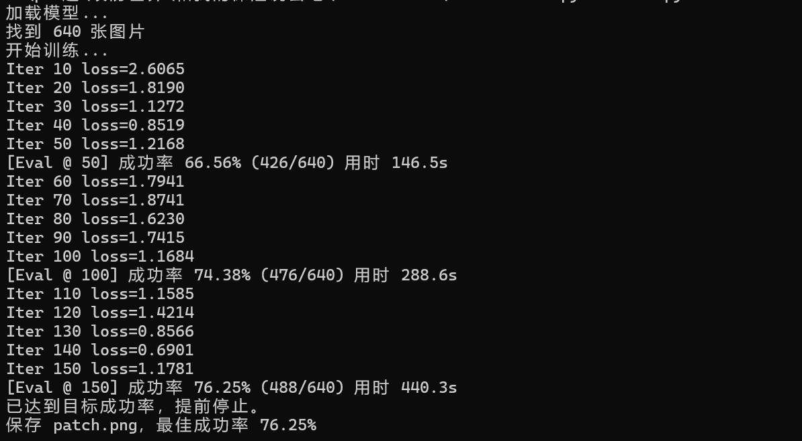

# 基于ResNet18的对抗补丁攻击训练与成功策略-先知社区

> **来源**: https://xz.aliyun.com/news/18798  
> **文章ID**: 18798

---

# 对抗性机器学习

攻击者利用模型的漏洞，通过精心设计的输入补丁等，诱导模型做出错误预测或行为

```
FGSM (Fast Gradient Sign Method)shang
 一步梯度攻击，在原图像上加上沿梯度方向的微小扰动。

PGD (Projected Gradient Descent)
 多步迭代攻击，比 FGSM 更强。

CW (Carlini & Wagner Attack)
 更优化的攻击，常用于突破防御。
```

不是在整张图像上加微小扰动（FGSM/PGD 那类），而是生成一个 显著的 64×64 补丁，然后随机贴到图像某个位置，无论原始图片内容是什么，只要贴上补丁，就诱导模型预测为目标类别（class = 32），属于通用对抗攻击

### app.py 源码

```
import flask
import torch
from torch.utils.data import DataLoader
from torchvision import datasets, models
from PIL import Image
from torchvision import transforms

app = flask.Flask(__name__)

device = 'cpu'
model = models.resnet18(weights=None, num_classes=43)
model.load_state_dict(torch.load("./model.pth", weights_only=True, map_location="cpu"))
model.to(device)
model.eval()
dataset = datasets.ImageFolder(root='./dataset')


def apply_patch(img, patch_img):
    img = transforms.ToTensor()(img)
    img = transforms.Resize((224, 224))(img)
    h = torch.randint(0, img.shape[1]-patch_img.shape[1], (1,)).item()
    w = torch.randint(0, img.shape[2]-patch_img.shape[2], (1,)).item()
    img[:, h:h+patch_img.shape[1], w:w+patch_img.shape[2]] = patch_img
    img = transforms.Normalize([0.3403, 0.3121, 0.3214], [0.2724, 0.2608, 0.2669])(img)
    return img


@app.route('/flag', methods=['POST'])
def flag():
    if 'patch' not in flask.request.files:
        return flask.jsonify({'error': '没有文件'}), 400
    
    patch_file = flask.request.files['patch']
    if patch_file.filename == '':
        return flask.jsonify({'error': '没有选择文件'}), 400
    
    if not patch_file.filename.lower().endswith('.png'):
        return flask.jsonify({'error': '只支持PNG格式'}), 400
    
    try:
        patch_img = Image.open(patch_file.stream)
        patch_img = transforms.Resize((64, 64))(patch_img)
        patch_img = transforms.ToTensor()(patch_img)
    except Exception as e:
        return flask.jsonify({'error': '图片读取错误'}), 500
    
    
    cnt = 0
    for img, _ in dataset:

        img = apply_patch(img, patch_img)
        img = img.unsqueeze(0).to(device)
        pred = model(img).argmax(dim=-1)

        if pred == 32:
            cnt += 1
        
    if cnt / len(dataset) > 0.75:
        with open('/flag', 'r') as f:
            return f"This is your flag: {f.read()}", 200
    else:
        return "Sorry, you failed", 403


@app.route('/')
def index():
    return flask.render_template('index.html')

if __name__ == '__main__':
    app.run(host='0.0.0.0', port=5000)
```

### 解释

初始化部分使用了ResNet18 分类模型，类别数为 43

从 model.pth加载权重。

使用 ImageFolder加载数据集 './dataset'这里的数据集就是测试集/验证集。

```
def apply_patch(img, patch_img):
    img = transforms.ToTensor()(img)
    img = transforms.Resize((224, 224))(img)
    h = torch.randint(0, img.shape[1]-patch_img.shape[1], (1,)).item()
    w = torch.randint(0, img.shape[2]-patch_img.shape[2], (1,)).item()
    img[:, h:h+patch_img.shape[1], w:w+patch_img.shape[2]] = patch_img
    img = transforms.Normalize([0.3403, 0.3121, 0.3214],
                               [0.2724, 0.2608, 0.2669])(img)
    return img
```

输入一张图片 img和一个补丁 patch\_img。转换成 tensor，缩放到224×224。随机选一个位置，把补丁覆盖上去，对图像做标准化

### 核心接口

```
@app.route('/flag', methods=['POST'])
def flag():
    if 'patch' not in flask.request.files:
        return flask.jsonify({'error': '没有文件'}), 400
    
    patch_file = flask.request.files['patch']
    if patch_file.filename == '':
        return flask.jsonify({'error': '没有选择文件'}), 400
    
    if not patch_file.filename.lower().endswith('.png'):
        return flask.jsonify({'error': '只支持PNG格式'}), 400

```

检查了用户是否上传png图片

读取补丁图像

缩放到64x64，转换成 tensor

```
  cnt = 0
    for img, _ in dataset:
        img = apply_patch(img, patch_img)
        img = img.unsqueeze(0).to(device)
        pred = model(img).argmax(dim=-1)

        if pred == 32:
            cnt += 
    if cnt / len(dataset) > 0.75:
        with open('/flag', 'r') as f:
            return f"This is your flag: {f.read()}", 200
    else:
        return "Sorry, you failed", 403
```

遍历整个数据集，把补丁贴到每张图上，送进模型。

如果预测结果是 类别 32，计数器 cnt+1。

如果补丁让 超过 75% 的图片 被模型误分类成目标类 32：返回flag

因此需要训练/设计一个强力的对抗补丁，上传它，才能拿到服务器上的 flag。

### 解题思路

这题就是一个对抗补丁攻击挑战(不是修改整张图片，而是生成一个小图块 (patch)，比如一张“贴纸”，把它贴到任何图片上，模型就会被欺骗。)

* 初始化一个 `64×64` 的小补丁（随机噪声）
* 每次从数据集中取一些图片，随机位置贴上补丁
* 强制让模型预测为类别 `32`，计算损失函数（交叉熵）
* 对补丁做反向传播，更新补丁内容。
* 迭代很多次，直到补丁越来越有效。

最终得到一个“魔法贴纸”，不论贴在哪张图上，模型都倾向于预测成 `32`。

#### 过程

解析参数

```
parser.add_argument("--model", type=str, default="./model.pth")      # 模型路径
parser.add_argument("--dataset", type=str, default="./dataset")      # 数据集路径
parser.add_argument("--patch-size", type=int, default=64)            # 补丁大小
parser.add_argument("--target-class", type=int, default=32)          # 攻击目标类别
parser.add_argument("--batch-size", type=int, default=16)            # 每次训练的图片数
parser.add_argument("--iters", type=int, default=2000)               # 迭代次数
parser.add_argument("--lr", type=float, default=0.05)                # 学习率
parser.add_argument("--eval-interval", type=int, default=50)         # 多少轮评估一次
parser.add_argument("--target-rate", type=float, default=0.75)       # 目标成功率
parser.add_argument("--device", type=str, default="cpu")             # 使用设备
parser.add_argument("--threads", type=int, default=8)                # 评估时的多线程数量
```

#### 加载模型

题目使用的是 ResNet18这里同样类别数设置43

加载训练好的权重 model.pth

设置为 eval模式。

```
model = models.resnet18(weights=None, num_classes=43)
state = torch.load(path, map_location=device)
model.load_state_dict(state)
model.eval()
```

#### 加载数据集

使用torchvision.datasets.ImageFolder读取数据集

```
ds = datasets.ImageFolder(root=args.dataset)
image_paths = [p for p, _ in ds.samples]
```

#### 贴补丁

```
def pil_to_patched_tensor(pil_img, patch_tensor):
    img_t = TF.to_tensor(pil_img)                      # 转 tensor
    img_t = TF.resize(img_t, (224, 224))               # resize 224×224
    h = random.randint(0, 224 - ph)                    # 随机贴补丁位置
    w = random.randint(0, 224 - pw)
    img_t[:, h:h+ph, w:w+pw] = patch_tensor            # 覆盖补丁
    return (img_t - MEAN) / STD                        # 归一化
```

#### 批量处理

```
def batch_patched(images_pil_list, patch_tensor):
    return torch.stack([pil_to_patched_tensor(img, patch_tensor) for img in images_pil_list])
```

随机贴 patch 后送入模型

#### 多线程

一开始的脚本运行太慢这里写成多线程

```
def evaluate_patch(model, patch_tensor, paths, target_class, threads=8):
    def worker(p):
        img = Image.open(p).convert("RGB")
        x = pil_to_patched_tensor(img, patch_tensor).unsqueeze(0)
        pred = model(x).argmax(dim=-1).item()
        return 1 if pred == target_class else 0
```

每张图片并行测试，看贴补丁后是否被分类为 target\_class

#### 训练循环

每次从数据集中随机选一批图片

贴上当前 patch

让模型尽量预测为目标类别（32）

```
for it in range(1, args.iters+1):
    batch_paths = random.sample(image_paths, batch_size)
    images = [Image.open(p).convert("RGB") for p in batch_paths]

    patched_batch = batch_patched(images, patch)
    labels = torch.full((patched_batch.size(0),), target_class, dtype=torch.long)

    outputs = model(patched_batch)
    loss = criterion(outputs, labels)    # 交叉熵损失：逼近目标类别

    optimizer.zero_grad()
    loss.backward()
    optimizer.step()
    clamp_patch_()                       # 限制 patch 值在 [0,1]
```

#### check

每隔 eval\_interval次迭代，测试一次整个数据集的成功率

```
if it % args.eval_interval == 0 or it == args.iters:
    rate, cnt = evaluate_patch(model, patch.detach(), image_paths, target_class)
    if rate > best_rate:
        best_patch = patch.clone()
    if rate >= target_rate:
        break
```

#### 保存补丁

```
to_pil = transforms.ToPILImage()
patch_img = to_pil(best_patch.clamp(0,1))
patch_img.save("patch.png", format="PNG")
```



### 完成脚本

```
#!/usr/bin/env python3
import os, random, time, argparse
from PIL import Image
import torch, torch.nn as nn, torch.optim as optim
from torchvision import datasets, models, transforms
from torchvision.transforms import functional as TF
from concurrent.futures import ThreadPoolExecutor, as_completed

# ---------- 参数 ------------
parser = argparse.ArgumentParser(description="Train adversarial patch (multithread eval)")
parser.add_argument("--model", type=str, default="./model.pth")
parser.add_argument("--dataset", type=str, default="./dataset")
parser.add_argument("--patch-size", type=int, default=64)
parser.add_argument("--target-class", type=int, default=32)
parser.add_argument("--batch-size", type=int, default=16)
parser.add_argument("--iters", type=int, default=2000)
parser.add_argument("--lr", type=float, default=0.05)
parser.add_argument("--eval-interval", type=int, default=50)
parser.add_argument("--target-rate", type=float, default=0.75)
parser.add_argument("--device", type=str, default="cpu")
parser.add_argument("--threads", type=int, default=8, help="评估时的线程数")
args = parser.parse_args()

device = torch.device(args.device if torch.cuda.is_available() or args.device == "cpu" else "cpu")

# ---------- 模型加载 ------------
def load_model(path, device):
    model = models.resnet18(weights=None, num_classes=43)
    state = torch.load(path, map_location=device)
    model.load_state_dict(state)
    model.to(device)
    model.eval()
    return model

print("加载模型...")
model = load_model(args.model, device)

# ---------- 数据集 ----------
ds = datasets.ImageFolder(root=args.dataset)
image_paths = [p for p, _ in ds.samples]
if len(image_paths) == 0:
    raise SystemExit("数据集为空！")
print(f"找到 {len(image_paths)} 张图片")

IMG_SIZE = 224
PATCH_SIZE = args.patch_size
MEAN = torch.tensor([0.3403, 0.3121, 0.3214], device=device).view(3,1,1)
STD  = torch.tensor([0.2724, 0.2608, 0.2669], device=device).view(3,1,1)

def pil_to_patched_tensor(pil_img, patch_tensor):
    img_t = TF.to_tensor(pil_img)
    img_t = TF.resize(img_t, (IMG_SIZE, IMG_SIZE))
    img_t = img_t.to(device)
    ph, pw = patch_tensor.shape[1], patch_tensor.shape[2]
    h = random.randint(0, IMG_SIZE - ph)
    w = random.randint(0, IMG_SIZE - pw)
    img_t[:, h:h+ph, w:w+pw] = patch_tensor
    return (img_t - MEAN) / STD

def batch_patched(images_pil_list, patch_tensor):
    return torch.stack([pil_to_patched_tensor(img, patch_tensor) for img in images_pil_list])

# ---------- 多线程评估 ----------
def evaluate_patch(model, patch_tensor, paths, target_class, threads=8):
    def worker(p):
        try:
            img = Image.open(p).convert("RGB")
            x = pil_to_patched_tensor(img, patch_tensor).unsqueeze(0)
            with torch.no_grad():
                out = model(x)
                pred = int(out.argmax(dim=-1).item())
            return 1 if pred == target_class else 0
        except Exception:
            return 0

    cnt = 0
    with ThreadPoolExecutor(max_workers=threads) as executor:
        futures = [executor.submit(worker, p) for p in paths]
        for f in as_completed(futures):
            cnt += f.result()
    rate = cnt / len(paths)
    return rate, cnt

# ---------- 初始化补丁 ----------
patch = torch.rand(3, PATCH_SIZE, PATCH_SIZE, device=device, requires_grad=True)
optimizer = optim.Adam([patch], lr=args.lr)
criterion = nn.CrossEntropyLoss()
target_class = args.target_class

def clamp_patch_():
    with torch.no_grad():
        patch.clamp_(0.0, 1.0)

clamp_patch_()

# ---------- 训练 ----------
print("开始训练...")
start = time.time()
best_rate = 0.0
best_patch = patch.detach().cpu().clone()

for it in range(1, args.iters+1):
    batch_paths = random.sample(image_paths, min(args.batch_size, len(image_paths)))
    images = [Image.open(p).convert("RGB") for p in batch_paths]

    patched_batch = batch_patched(images, patch)
    labels = torch.full((patched_batch.size(0),), target_class, dtype=torch.long, device=device)

    outputs = model(patched_batch)
    loss = criterion(outputs, labels)

    optimizer.zero_grad()
    loss.backward()
    optimizer.step()
    clamp_patch_()

    if it % 10 == 0:
        print(f"Iter {it} loss={loss.item():.4f}")

    if it % args.eval_interval == 0 or it == args.iters:
        rate, cnt = evaluate_patch(model, patch.detach(), image_paths, target_class, threads=args.threads)
        elapsed = time.time() - start
        print(f"[Eval @ {it}] 成功率 {rate*100:.2f}% ({cnt}/{len(image_paths)}) 用时 {elapsed:.1f}s")
        if rate > best_rate:
            best_rate = rate
            best_patch = patch.detach().cpu().clone()
        if rate >= args.target_rate:
            print("已达到目标成功率，提前停止。")
            break

# ---------- 保存补丁 ----------
to_pil = transforms.ToPILImage()
patch_img = to_pil(best_patch.clamp(0,1))
patch_img.save("patch.png", format="PNG")
print(f"保存 patch.png，最佳成功率 {best_rate*100:.2f}%")

```


