# AdaptixC2通信机制与流量解密分析(listener_beacon_http)-先知社区

> **来源**: https://xz.aliyun.com/news/18802  
> **文章ID**: 18802

---

# 介绍

* AdaptixC2 Server端与Agent端（源码自备）
* mitmproxy与Wireshark
* IDE

# 开始

客户机运行mitmproxy --listen-port 8080 --ssl-insecure --set ssl\_version\_client=TLSv1\_2 -w output.mitm和Wireshark配置好sslkeys.log开始抓包

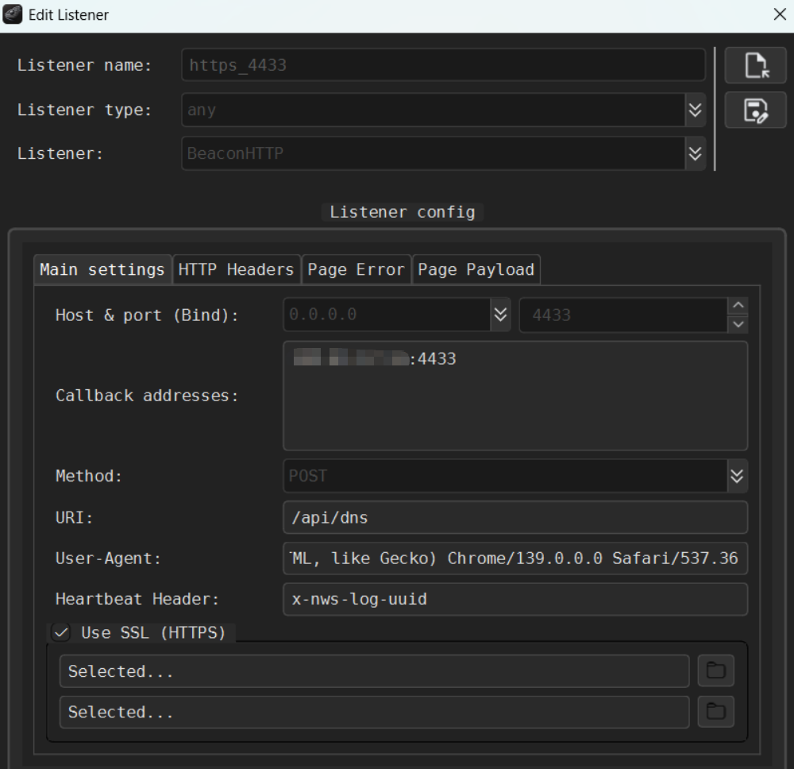

同时运行AdaptixC2 Server端生成的agent.x64.exe

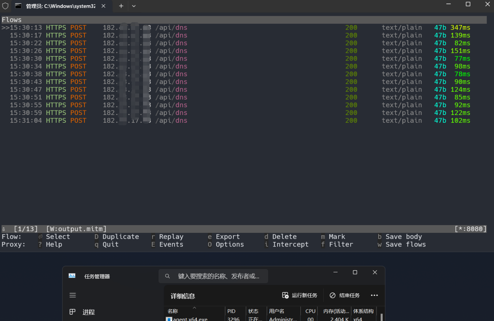

可以看到由于是中间人（MITM）代理发挥作用，TLSv1.3包已经变成HTTP 明文数据

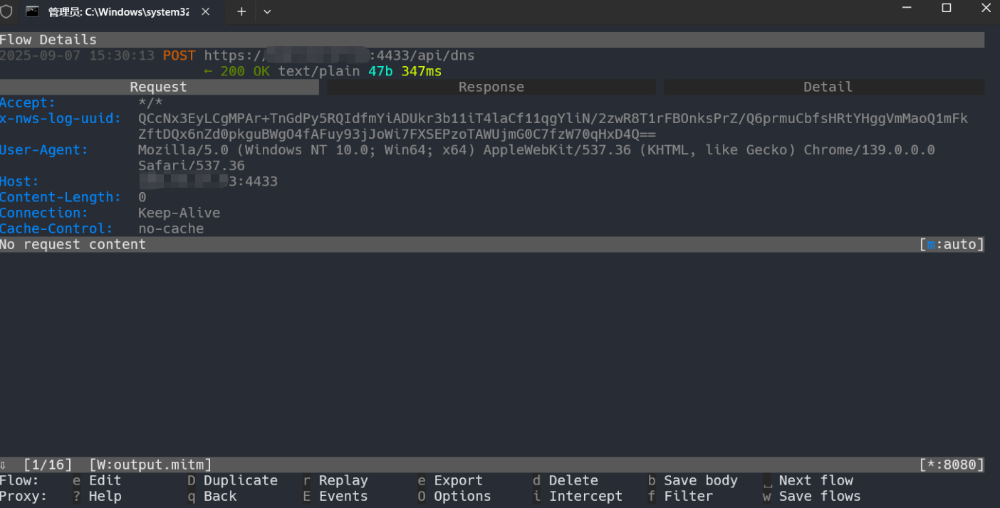

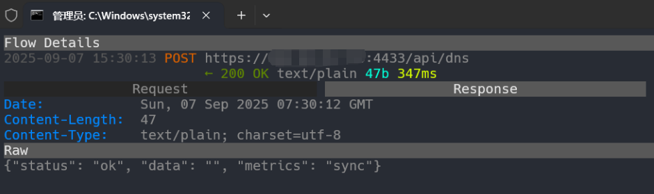

```
Accept:          */*
x-nws-log-uuid:  QCcNx3EyLCgMPAr+TnGdPy5RQIdfmYiADUkr3b11iT4laCf11qgYliN/2zwR8T1rFBOnksPrZ/Q6prmuCbfsHRtYHggVmMaoQ1mFkZftDQx6nZd0pkguBWgO4fAFuy93jJoWi7FXSEPzoTAWUjmG0C7fzW70qHxD4Q==
User-Agent:      Mozilla/5.0 (Windows NT 10.0; Win64; x64) AppleWebKit/537.36 (KHTML, like Gecko) Chrome/139.0.0.0 Safari/537.36
Host:            xxxxxxxx:4433
Content-Length:  0
Connection:      Keep-Alive
Cache-Control:   no-cache
```

```
Date:            Sun, 07 Sep 2025 07:30:21 GMT
Content-Length:  47
Content-Type:    text/plain; charset=utf-8
Raw
{"status": "ok", "data": "", "metrics": "sync"}
```

现在来分析这个上线的心跳包，用IDE打开源码

filename：AdaptixC2\_main\_v0.8\Extenders\listener\_beacon\_http\pl\_listener.go

创建Listener 时，会随机生成 16 字节的加密密钥，并存储在HTTPConfig.EncryptKey 中，EncryptKey 为 RC4 加密使用的密钥

```
randSlice := make([]byte, 16)
_, _ = rand.Read(randSlice)
conf.EncryptKey = randSlice[:16]
```

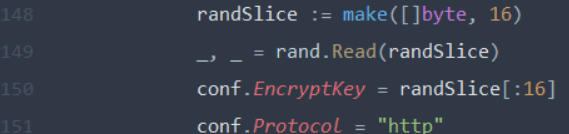

EncryptKey 会持久化保存到服务端数据库 adaptixserver.db

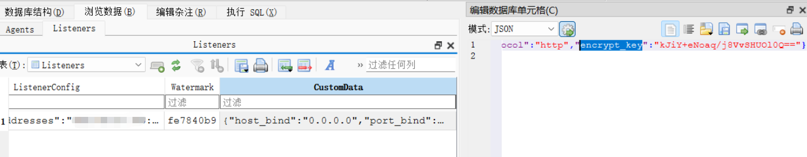

由下面代码得知从 HTTP Header 中读取 Beat 数据（Base64 编码），使用 Listener 随机生成的 EncryptKey 进行 RC4 解密，前 8 字节分别为 **Agent Type**（4 字节）、**Agent ID**（4 字节）剩余部分包含 **Flags 字段**和**可变长度字符串**（Hostname、Username、Executable）

filename：AdaptixC2\_main\_v0.8\Extenders\listener\_beacon\_http\pl\_http.go

```
type HTTPConfig struct {
    HostBind           string `json:"host_bind"`           // 绑定监听的主机地址
    PortBind           int    `json:"port_bind"`           // 绑定监听的端口
    Callback_addresses string `json:"callback_addresses"`  // Teamserver 回调地址列表
Ssl         bool   `json:"ssl"`          // 是否启用 HTTPS
SslCert     []byte `json:"ssl_cert"`     // SSL 证书内容（可选）
SslKey      []byte `json:"ssl_key"`      // SSL 私钥内容（可选）
SslCertPath string `json:"ssl_cert_path"`// SSL 证书文件路径
SslKeyPath  string `json:"ssl_key_path"`// SSL 私钥文件路径

// Agent 相关
HttpMethod     string `json:"http_method"` // 请求方法，GET 或 POST
Uri            string `json:"uri"`         // Agent Heartbeat URI
ParameterName  string `json:"hb_header"`   // Heartbeat Header 名称
UserAgent      string `json:"user_agent"`  // HTTP User-Agent
HostHeader     string `json:"host_header"` // Host Header
RequestHeaders string `json:"request_headers"` // 自定义请求头

// Server 响应配置
ResponseHeaders    map[string]string `json:"response_headers"` // 响应头
TrustXForwardedFor bool              `json:"x-forwarded-for"`  // 是否信任 X-Forwarded-For
WebPageError       string            `json:"page-error"`       // 错误页面内容
WebPageOutput      string            `json:"page-payload"`     // 返回给 Agent 的页面内容

Server_headers string `json:"server_headers"` // 自定义服务器响应头
Protocol       string `json:"protocol"`       // http 或 https
EncryptKey     []byte `json:"encrypt_key"`    // RC4 加密密钥
}
```

```
params := ctx.Request.Header.Get(handler.Config.ParameterName) // 获取 x-nws-log-uuid 的值（注意这个值在生成Listener的时候可以自定义）
// ...
agentInfoCrypt, err = base64.StdEncoding.DecodeString(beat) // 进行 Base64 解码
// ...
rc4crypt.XORKeyStream(agentInfo, agentInfoCrypt) // 进行 RC4 解密
```

```
params := ctx.Request.Header.Get(handler.Config.ParameterName)
if len(params) > 0 {
    beat = params
} else {
    return "", "", nil, nil, errors.New("missing beat from Headers")
}

agentInfoCrypt, err = base64.StdEncoding.DecodeString(beat)
if len(agentInfoCrypt) < 5 || err != nil {
    return "", "", nil, nil, errors.New("failed decrypt beat")
}

rc4crypt, errcrypt := rc4.NewCipher(handler.Config.EncryptKey)
if errcrypt != nil {
    return "", "", nil, nil, errors.New("rc4 decrypt error")
}
agentInfo = make([]byte, len(agentInfoCrypt))
rc4crypt.XORKeyStream(agentInfo, agentInfoCrypt)
//- Flags 字段固定 32 字节，每 4 字节为一个字段
//- 字段值为大端（BigEndian）整数，非零字段才记录
//- 剩余字节以 4 字节长度前缀 + 内容方式存储字符串：
agentType = uint(binary.BigEndian.Uint32(agentInfo[:4]))
agentInfo = agentInfo[4:]
agentId = uint(binary.BigEndian.Uint32(agentInfo[:4]))
agentInfo = agentInfo[4:]
```

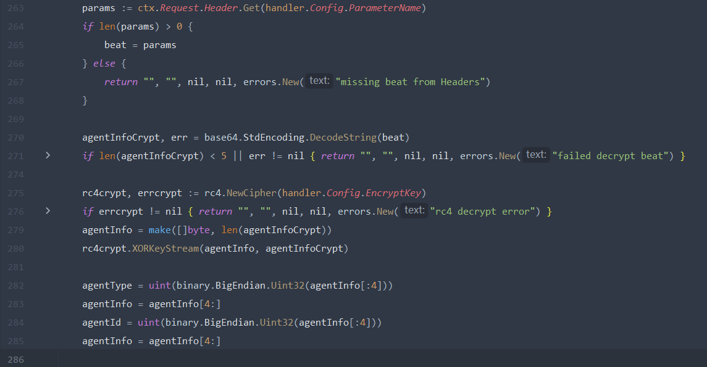

扣下源码构建下解密心跳包的python脚本

```
import base64
import struct
import argparse
import json
from typing import List, Dict, Any, Tuple

def get_arc4_cipher(key: bytes):
    try:
        from Cryptodome.Cipher import ARC4 as _ARC4  # type: ignore
        return _ARC4.new(key)
    except Exception:
        try:
            from Crypto.Cipher import ARC4 as _ARC4  # type: ignore
            return _ARC4.new(key)
        except Exception:
            class _RC4:
                def __init__(self, k: bytes):
                    if isinstance(k, str):
                        k = k.encode()
                    self.S = list(range(256))
                    j = 0
                    for i in range(256):
                        j = (j + self.S[i] + k[i % len(k)]) & 0xFF
                        self.S[i], self.S[j] = self.S[j], self.S[i]
                    self.i = 0
                    self.j = 0

                def _process(self, data: bytes) -> bytes:
                    out = bytearray()
                    S = self.S
                    i = self.i
                    j = self.j
                    for b in data:
                        i = (i + 1) & 0xFF
                        j = (j + S[i]) & 0xFF
                        S[i], S[j] = S[j], S[i]
                        k = S[(S[i] + S[j]) & 0xFF]
                        out.append(b ^ k)
                    self.i = i
                    self.j = j
                    return bytes(out)

                def encrypt(self, data: bytes) -> bytes:
                    return self._process(data)

                def decrypt(self, data: bytes) -> bytes:
                    return self._process(data)

            return _RC4(key)

def _parse_flags(info: bytes, start_offset: int = 0) -> Tuple[List[Tuple[int, int]], int]:
    offset = start_offset
    flag_fields: List[Tuple[int, int]] = []
    for i in range(8):
        if offset + 4 <= len(info):
            val = struct.unpack(">I", info[offset:offset+4])[0]
            if val != 0:
                flag_fields.append((i + 1, val))
            offset += 4
        else:
            break
    return flag_fields, offset

def _decode_len_bytes(raw: bytes) -> str:
    # 先尝试 UTF-8
    text = raw.decode(errors="ignore").replace("\x00", "")
    if text:
        return text
    # 再尝试 UTF-16LE
    try:
        return raw.decode("utf-16-le", errors="ignore").replace("\x00", "")
    except Exception:
        return ""


def _split_cstr_utf8(blob: bytes) -> list:
    parts = blob.split(b"\x00")
    return [p.decode(errors="ignore") for p in parts if p]


def _split_cstr_utf16le(blob: bytes) -> list:
    # 以 UTF-16LE 的双字节 0x00 0x00 作为分隔
    parts = blob.split(b"\x00\x00")
    out = []
    for p in parts:
        if p:
            try:
                out.append(p.decode("utf-16-le", errors="ignore"))
            except Exception:
                pass
    return [s for s in out if s]


def parse_strings(data: bytes, offset: int):
    blob = data[offset:]

    def parse_with_endian(big_endian: bool) -> list:
        idx = 0
        out = []
        while idx + 4 <= len(blob):
            fmt = ">I" if big_endian else "<I"
            length = struct.unpack(fmt, blob[idx:idx+4])[0]
            idx += 4
            # 允许前导 0 长度（跳过 padding），持续解析
            if length == 0:
                continue
            if idx + length <= len(blob):
                out.append(_decode_len_bytes(blob[idx:idx+length]))
                idx += length
            else:
                break
        return [s for s in out if s]

    def score_blob_segment(start: int, length: int) -> int:
        if start + 4 + length > len(blob) or length <= 0:
            return -1
        segment = blob[start+4:start+4+length]
        # 统计可打印字符比例
        try:
            txt = segment.decode(errors="ignore")
        except Exception:
            return 0
        printable = sum(ch.isprintable() and ch != "\x00" for ch in txt)
        return printable

    def parse_be_from(start: int) -> list:
        idx = start
        out = []
        while idx + 4 <= len(blob):
            length = struct.unpack(">I", blob[idx:idx+4])[0]
            idx += 4
            if length == 0:
                continue
            if idx + length <= len(blob):
                out.append(_decode_len_bytes(blob[idx:idx+length]))
                idx += length
            else:
                break
        return [s for s in out if s]

    fields_be = parse_with_endian(True)
    if fields_be:
        return fields_be

    best_start = -1
    best_score = -1
    for start in range(0, max(0, len(blob) - 4)):
        length = struct.unpack(">I", blob[start:start+4])[0]
        if 1 <= length <= 4096 and start + 4 + length <= len(blob):
            score = score_blob_segment(start, length)
            if score > best_score:
                best_score = score
                best_start = start
    if best_start >= 0 and best_score > 0:
        fields_be_scanned = parse_be_from(best_start)
        if fields_be_scanned:
            return fields_be_scanned

    # 小端长度前缀
    fields_le = parse_with_endian(False)
    if fields_le:
        return fields_le

    # UTF-8 C 字符串
    c_utf8 = _split_cstr_utf8(blob)
    if c_utf8:
        return c_utf8

    # UTF-16LE C 字符串
    c_utf16 = _split_cstr_utf16le(blob)
    if c_utf16:
        return c_utf16

    return []

def decrypt_and_parse(header_b64: str, encrypt_key_bytes: bytes) -> Dict[str, Any]:
    data = base64.b64decode(header_b64)
    cipher = get_arc4_cipher(encrypt_key_bytes)
    plain = cipher.decrypt(data)

    if len(plain) < 8:
        raise ValueError("解密结果长度不足 8 字节，无法解析 agentType/agentId")

    agent_type = struct.unpack(">I", plain[:4])[0]
    agent_id = struct.unpack(">I", plain[4:8])[0]
    info = plain[8:]

    flag_fields, offset = _parse_flags(info, 0)
    strings = parse_strings(info, offset)
    hostname = strings[0] if len(strings) > 0 else ""
    username = strings[1] if len(strings) > 1 else ""
    exe_name = strings[2] if len(strings) > 2 else ""

    return {
        "agentType": agent_type,
        "agentId": agent_id,
        "flags": [{"index": idx, "value": val} for idx, val in flag_fields],
        "strings": strings,
        "hostname": hostname,
        "username": username,
        "executable": exe_name,
        "agentInfoRawBytesLen": len(info),
        "agentInfoRawBytesRepr": repr(info),
        # 避免原始字节直接解码乱码
        "agentInfoAsString": " ".join([s for s in strings if s]),
        "rawPlainHex": plain.hex(),
    }


def parse_args() -> argparse.Namespace:
    parser = argparse.ArgumentParser(
        description="RC4+Base64 Agent Header 解密并明文格式化输出"
    )
    group_key = parser.add_mutually_exclusive_group(required=True)
    group_key.add_argument(
        "--key",
        help="Base64 编码的 RC4 密钥",
        type=str,
    )
    group_key.add_argument(
        "--key-raw",
        help="原始密钥（hex 编码，如 001122... 或 16 字节直接作为 UTF-8 文本）",
        type=str,
    )
    parser.add_argument(
        "--header",
        help="Base64 编码的 Header/Beat 值",
        required=True,
        type=str,
    )
    parser.add_argument(
        "--json",
        action="store_true",
        help="以 JSON 格式输出",
    )
    return parser.parse_args()


def decode_key(arg_key: str = "", arg_key_raw: str = "") -> bytes:
    if arg_key:
        return base64.b64decode(arg_key)
    if arg_key_raw:
        s = arg_key_raw.strip()
        try:
            # hex 优先
            if all(c in "0123456789abcdefABCDEF" for c in s) and len(s) % 2 == 0:
                return bytes.fromhex(s)
        except Exception:
            pass
        return s.encode()
    raise ValueError("必须提供 --key 或 --key-raw 之一")


def print_human_readable(parsed: Dict[str, Any]) -> None:
    agent_type = parsed["agentType"]
    agent_id = parsed["agentId"]
    flags = parsed["flags"]
    hostname = parsed.get("hostname") or ""
    username = parsed.get("username") or ""
    exe_name = parsed.get("executable") or ""

    print(f"Agent Type: {agent_type} (0x{agent_type:08x})", flush=True)
    print(f"Agent ID  : {agent_id} (0x{agent_id:08x})
", flush=True)

    if flags:
        print("Flags (非零字段):", flush=True)
        for item in flags:
            idx = item["index"]
            val = item["value"]
            print(f"  Field {idx}: {val} (0x{val:08x})", flush=True)

    print(f"
Agent Info (raw bytes, length {parsed['agentInfoRawBytesLen']}): {parsed['agentInfoRawBytesRepr']}", flush=True)
    if parsed.get("agentInfoAsString"):
        print(f"Agent Info (as string): {parsed['agentInfoAsString']}", flush=True)

    if hostname:
        print(f"
Hostname  : {hostname}", flush=True)
    if username:
        print(f"Username  : {username}", flush=True)
    if exe_name:
        print(f"Executable: {exe_name}", flush=True)


def main():
    args = parse_args()
    key_bytes = decode_key(args.key or "", args.key_raw or "")
    parsed = decrypt_and_parse(args.header, key_bytes)
    if args.json:
        print(json.dumps(parsed, ensure_ascii=False, indent=2))
    else:
        print_human_readable(parsed)


if __name__ == "__main__":
    main()

```

使用刚刚抓包的流量运行下脚本python .\Beacon\_Http\_Rc4\_Decode.py --key kJiY+eNoaq/j8VvSHUOl0Q== --header QCcNx3EyLCgMPAr+TnGdPy5RQIdfmYiADUkr3b11iT4laCf11qgYliN/2zwR8T1rFBOnksPrZ/Q6prmuCbfsHRtYHggVmMaoQ1mFkZftDQx6nZd0pkguBWgO4fAFuy93jJoWi7FXSEPzoTAWUjmG0C7fzW70qHxD4Q==

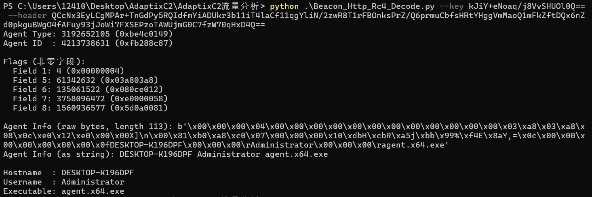

可以看出解密出内容与C2 Server端显示一致

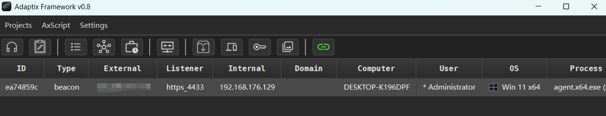

接下来从Server端下发一个命令看看流量有什么变化

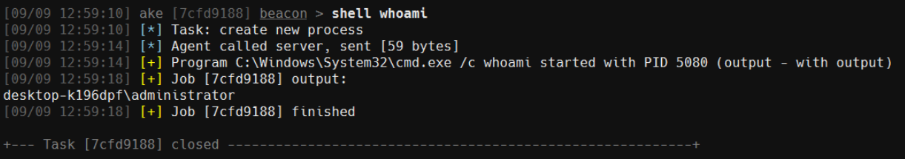

可以看出多了**application/octet-stream ：二进制流数据**

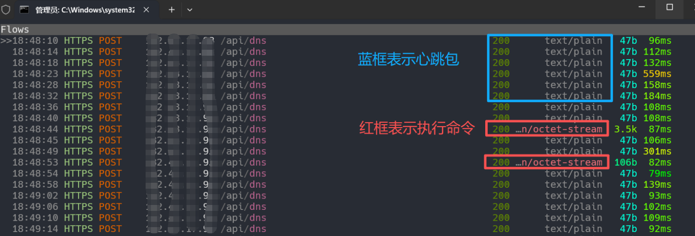

点进去看看请求和响应与之前有什么不同

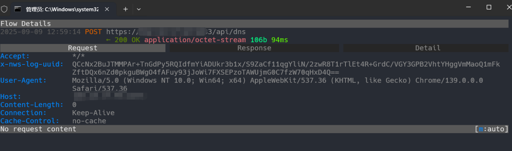

响应包中多了data字段，一些加密过后的字符

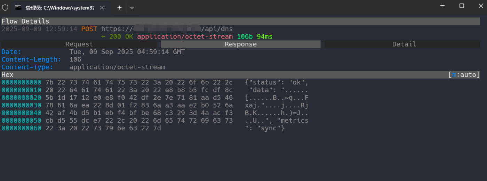

这里用Wireshark打开更直观好分析些

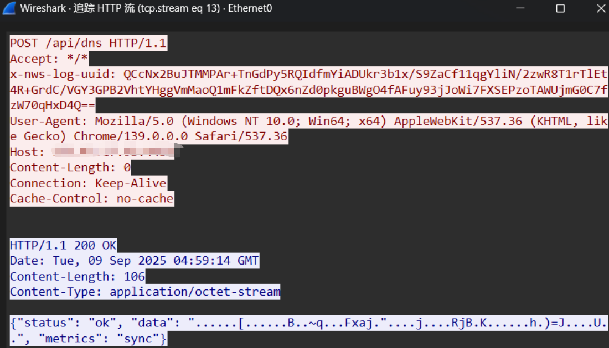

使用Wireshark Hex转储避免失真，重点看响应包中的data字段（该字段有数据表示服务端有任务下发）

```
00000000  48 54 54 50 2f 31 2e 31  20 32 30 30 20 4f 4b 0d   HTTP/1.1  200 OK.
00000010  0a 44 61 74 65 3a 20 54  75 65 2c 20 30 39 20 53   .Date: T ue, 09 S
00000020  65 70 20 32 30 32 35 20  30 34 3a 35 39 3a 31 34   ep 2025  04:59:14
00000030  20 47 4d 54 0d 0a 43 6f  6e 74 65 6e 74 2d 4c 65    GMT..Co ntent-Le
00000040  6e 67 74 68 3a 20 31 30  36 0d 0a 43 6f 6e 74 65   ngth: 10 6..Conte
00000050  6e 74 2d 54 79 70 65 3a  20 61 70 70 6c 69 63 61   nt-Type:  applica
00000060  74 69 6f 6e 2f 6f 63 74  65 74 2d 73 74 72 65 61   tion/oct et-strea
00000070  6d 0d 0a 0d 0a                                     m....
00000075  7b 22 73 74 61 74 75 73  22 3a 20 22 6f 6b 22 2c   {"status ": "ok",
00000085  20 22 64 61 74 61 22 3a  20 22 e8 b8 b5 fc df 8c    "data":  "......
00000095  5b 1d 17 12 e0 e8 f0 42  df 2e 7e 71 81 aa d5 46   [......B ..~q...F
000000A5  78 61 6a ea 22 8d 01 f2  83 6a a3 aa e2 b0 52 6a   xaj."... .j....Rj
000000B5  42 af 4b d5 b1 eb f4 bf  be 68 c3 29 3d 4a ac f3   B.K..... .h.)=J..
000000C5  cb d5 55 dc e7 22 2c 20  22 6d 65 74 72 69 63 73   ..U..",  "metrics
000000D5  22 3a 20 22 73 79 6e 63  22 7d                     ": "sync "}
```

使用Ctrl+F大法快速定位下关键代码对data字段的处理

filename：AdaptixC2\_main\_v0.8\Extenders\listener\_beacon\_http\pl\_http.go

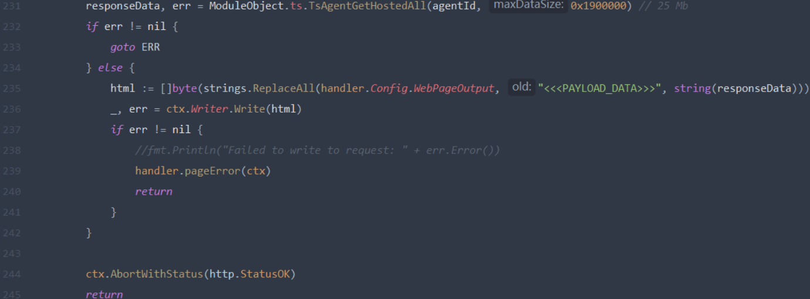

可以看到responseData是从ModuleObject.ts.TsAgentGetHostedAll 获取的原始加密字节，通过string(responseData)将[]byte 直接转换为string

```
responseData, err = ModuleObject.ts.TsAgentGetHostedAll(agentId, 0x1900000) // 25 Mb
if err != nil {
    goto ERR
} else {
    html := []byte(strings.ReplaceAll(handler.Config.WebPageOutput, "<<<PAYLOAD_DATA>>>", string(responseData)))
    _, err = ctx.Writer.Write(html)
    if err != nil {
        //fmt.Println("Failed to write to request: " + err.Error())
        handler.pageError(ctx)
        return
    }
}

ctx.AbortWithStatus(http.StatusOK)
return
```

跟一下TsAgentGetHostedAll发现Teamserver 接口的实现来自于**github.com/Adaptix-Framework/axc2** 包

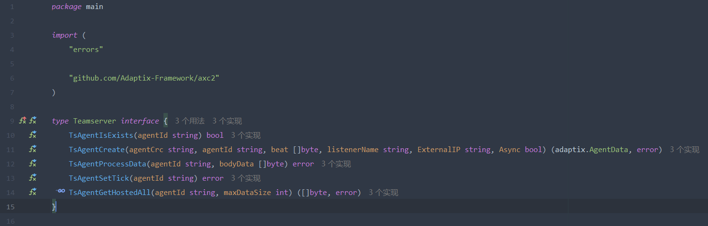

看了下axc2包里面定义了大量接口的结构体，包括AgentData、TaskData、TaskDataTunnel等

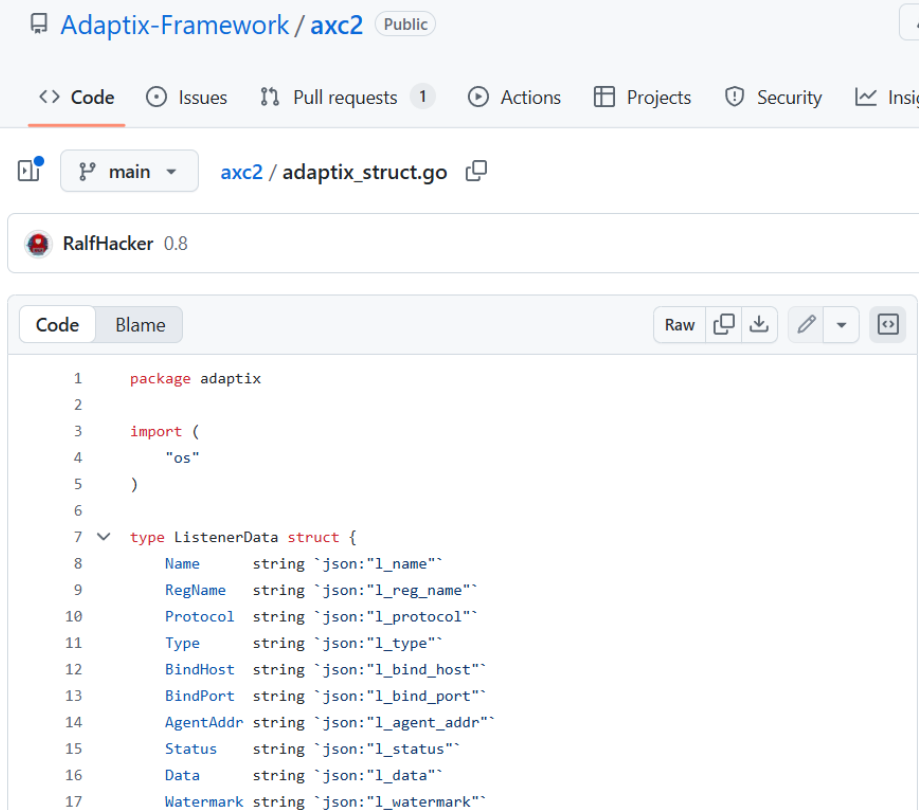

接着看下TsAgentGetHostedAll的实现

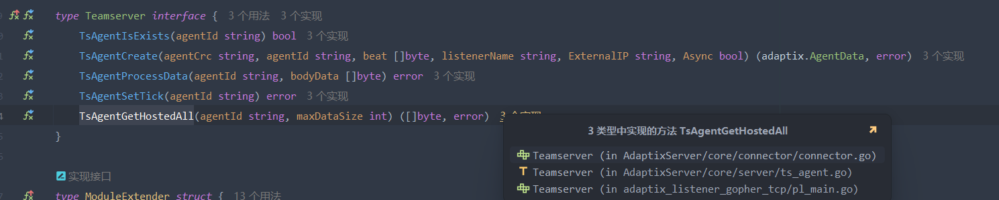

filename：AdaptixC2\_main\_v0.8\AdaptixServer\core\server s\_agent.go

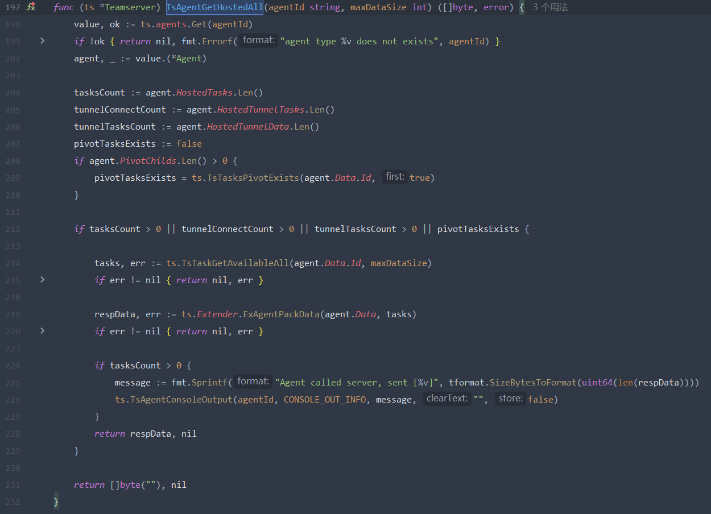

可以看到respData通过 ts.Extender.ExAgentPackData 函数打包而成的

```
func (ts *Teamserver) TsAgentGetHostedTasks2(count int, agentId string, maxDataSize int) ([]byte, error) {
	value, ok := ts.agents.Get(agentId)
	if !ok {
		return nil, fmt.Errorf("agent type %v does not exists", agentId)
	}
	agent, _ := value.(*Agent)

	tasksCount := agent.HostedTasks.Len()
	tunnelConnectCount := agent.HostedTunnelTasks.Len()
	tunnelTasksCount := agent.HostedTunnelData.Len()
	pivotTasksExists := false
	if agent.PivotChilds.Len() > 0 {
		pivotTasksExists = ts.TsTasksPivotExists(agent.Data.Id, true)
	}

	if tasksCount > 0 || tunnelConnectCount > 0 || tunnelTasksCount > 0 || pivotTasksExists {

		tasks, err := ts.TsTaskGetAvailableAll(agent.Data.Id, maxDataSize)
		if err != nil {
			return nil, err
		}

		respData, err := ts.Extender.ExAgentPackData(agent.Data, tasks)
		if err != nil {
			return nil, err
		}

		if tasksCount > 0 {
			message := fmt.Sprintf("Agent called server, sent [%v]", tformat.SizeBytesToFormat(uint64(len(respData))))
			ts.TsAgentConsoleOutput(agentId, CONSOLE_OUT_INFO, message, "", false)
		}
		return respData, nil
	}

	return []byte(""), nil
}
```

继续追下Extender具体实现

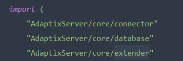

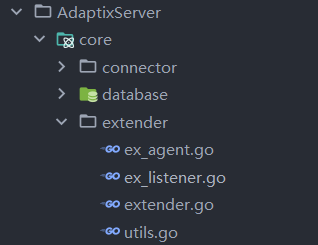

发现最终指向agent插件的实现

filename：AdaptixC2\_main\_v0.8\AdaptixServer\core\extender\ex\_agent.go

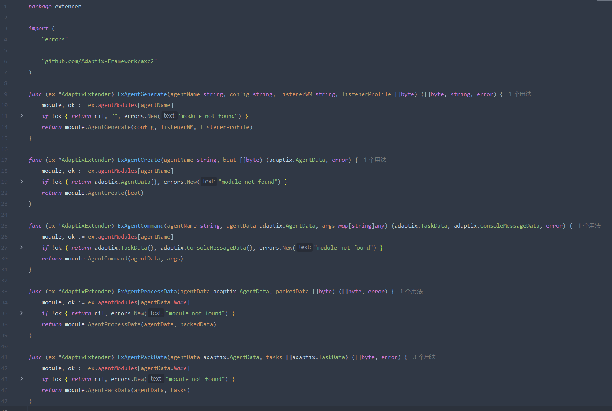

这里捋一下思路 **看下数据流怎么走的 (C2 -> Agent):**

1. server 包的 TsAgentGetHostedAll 函数从任务队列中获取一个 []adaptix.TaskData 数组。
2. TsAgentGetHostedAll 将这个任务数组传递给 extender.ExAgentPackData。
3. extender.ExAgentPackData 根据 Agent 的类型 (agentData.Name)，从 agentModules 映射中找到对应的 Agent 插件。
4. extender 调用这个 Agent 插件 的 AgentPackData 方法。
5. Agent 插件 的 AgentPackData 方法将 []adaptix.TaskData 序列化成一个二进制字节流 []byte。
6. 这个 []byte (respData) 被返回给 http.go 监听器。
7. http.go 监听器将 respData 插入到 JSON 响应中，然后整个响应被发送给 Agent。

**Agent 插件 (ExtAgent接口): 这是最关键的部分。每个不同类型的 Agent (例如 Windows x64, Linux x86) 都有一个对应的 Agent 插件。这个插件负责：**

* 解析该类型 Agent 的心跳包 (AgentCreate)。
* 将 C2 的通用任务 (adaptix.TaskData) 打包成该 Agent 能理解的二进制格式 (AgentPackData)。
* 解析该 Agent 上传的数据 (AgentProcessData)。
* 生成该 Agent 的 Payload (AgentGenerate)。

​

继续往下走看看AgentPackData又发现AgentPackData 函数又进行了一层加密

filename：AdaptixC2\_main\_v0.8\Extenders\agent\_beacon\pl\_main.go

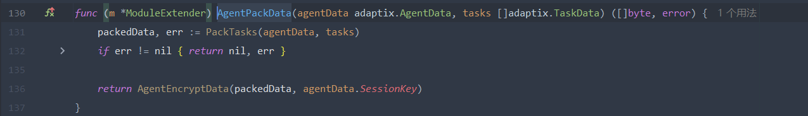

Agent 和 C2 之间后续的所有任务/结果都由这个SessionKey加密

```
func (m *ModuleExtender) AgentPackData(agentData adaptix.AgentData, tasks []adaptix.TaskData) ([]byte, error) {
    // 1. 将任务打包成二进制序列化格式
    packedData, err := PackTasks(agentData, tasks)
    if err != nil {
        return nil, err
    }
    // 2. 使用 SessionKey 对打包后的数据进行加密
    return AgentEncryptData(packedData, agentData.SessionKey)
}
```

```
func (m *ModuleExtender) AgentProcessData(agentData adaptix.AgentData, packedData []byte) ([]byte, error) {
    // 1. 使用 SessionKey 解密 Agent 上传的数据
	decryptData, err := AgentDecryptData(packedData, agentData.SessionKey)
	if err != nil {
		return nil, err
	}

	taskData := adaptix.TaskData{
		Type:        TYPE_TASK,
		AgentId:     agentData.Id,
		FinishDate:  time.Now().Unix(),
		MessageType: MESSAGE_SUCCESS,
		Completed:   true,
		Sync:        true,
	}
    // 2. 解析解密后的数据，处理任务结果
	resultTasks := ProcessTasksResult(m.ts, agentData, taskData, decryptData)

	for _, task := range resultTasks {
		m.ts.TsTaskUpdate(agentData.Id, task)
	}

	return nil, nil
}
```

看看SessionKey放哪了，还是用CTRL+F大法大致定位一下，发现之前看的axc2包里有写

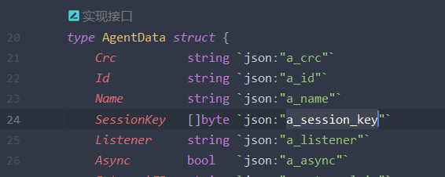

filename：AdaptixC2\_main\_v0.8\Extenders\agent\_beacon\pl\_main.go

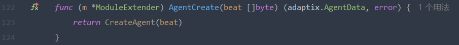

SessionKey 是 adaptix.AgentData 结构体的一部分，CreateAgent （函数负责解析beat数据并注册新Agent）解析心跳包时就会提取Key

```
func (m *ModuleExtender) AgentCreate(beat []byte) (adaptix.AgentData, error) {
	return CreateAgent(beat)
}
```

再看看怎么实现加解密的**AgentEncryptData**和**AgentDecryptData**

filename：AdaptixC2\_main\_v0.8\Extenders\agent\_beacon\pl\_agent.go

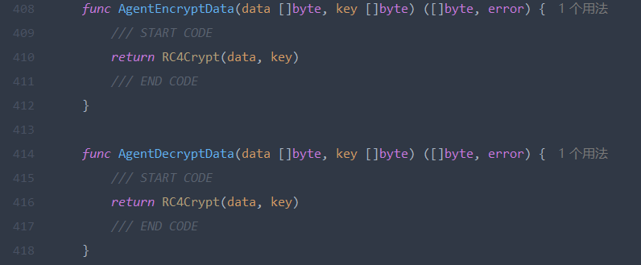

发现是老样子还是RC4加密

```
func AgentEncryptData(data []byte, key []byte) ([]byte, error) {
	/// START CODE
	return RC4Crypt(data, key)
	/// END CODE
}

func AgentDecryptData(data []byte, key []byte) ([]byte, error) {
	/// START CODE
	return RC4Crypt(data, key)
	/// END CODE
}
```

接着继续追CreateAgent怎么拿到SessionKey的

filename：AdaptixC2\_main\_v0.8\Extenders\agent\_beacon\pl\_agent.go

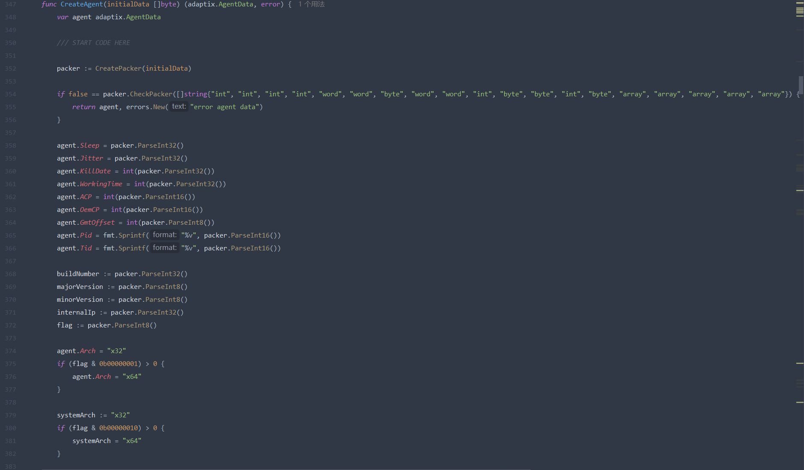

```
func CreateAgent(initialData []byte) (adaptix.AgentData, error) {
	var agent adaptix.AgentData

	/// START CODE HERE

	packer := CreatePacker(initialData)

	if false == packer.CheckPacker([]string{"int", "int", "int", "int", "word", "word", "byte", "word", "word", "int", "byte", "byte", "int", "byte", "array", "array", "array", "array", "array"}) {
		return agent, errors.New("error agent data")
	}

	agent.Sleep = packer.ParseInt32()
	agent.Jitter = packer.ParseInt32()
	agent.KillDate = int(packer.ParseInt32())
	agent.WorkingTime = int(packer.ParseInt32())
	agent.ACP = int(packer.ParseInt16())
	agent.OemCP = int(packer.ParseInt16())
	agent.GmtOffset = int(packer.ParseInt8())
	agent.Pid = fmt.Sprintf("%v", packer.ParseInt16())
	agent.Tid = fmt.Sprintf("%v", packer.ParseInt16())

	buildNumber := packer.ParseInt32()
	majorVersion := packer.ParseInt8()
	minorVersion := packer.ParseInt8()
	internalIp := packer.ParseInt32()
	flag := packer.ParseInt8()

	agent.Arch = "x32"
	if (flag & 0b00000001) > 0 {
		agent.Arch = "x64"
	}

	systemArch := "x32"
	if (flag & 0b00000010) > 0 {
		systemArch = "x64"
	}

	agent.Elevated = false
	if (flag & 0b00000100) > 0 {
		agent.Elevated = true
	}

	IsServer := false
	if (flag & 0b00001000) > 0 {
		IsServer = true
	}

	agent.InternalIP = int32ToIPv4(internalIp)
	agent.Os, agent.OsDesc = GetOsVersion(majorVersion, minorVersion, buildNumber, IsServer, systemArch)
	//SessionKey通过一个自定义的packer对象，从initialData（即心跳包）中解析出来的
	agent.SessionKey = packer.ParseBytes()
	agent.Domain = string(packer.ParseBytes())
	agent.Computer = string(packer.ParseBytes())
	agent.Username = ConvertCpToUTF8(string(packer.ParseBytes()), agent.ACP)
	agent.Process = ConvertCpToUTF8(string(packer.ParseBytes()), agent.ACP)

	/// END CODE

	return agent, nil
}
```

这个packer需要重点看看，SessionKey在切片后的beat数据中，起始偏移量为36字节，所以，只需要解析心跳包的前 36 个字节，然后读取一个 4 字节的长度，再根据这个长度读取 SessionKey

```
// CreateAgent 函数解析切片后的心跳包
func CreateAgent(initialData []byte) (adaptix.AgentData, error) {
	packer := CreatePacker(initialData)
    
    // 按顺序解析以下字段：
	packer.ParseInt32()     // Sleep, 4 bytes
	packer.ParseInt32()     // Jitter, 4 bytes
	packer.ParseInt32()     // KillDate, 4 bytes
	packer.ParseInt32()     // WorkingTime, 4 bytes
	packer.ParseInt16()     // ACP, 2 bytes
	packer.ParseInt16()     // OemCP, 2 bytes
	packer.ParseInt8()      // GmtOffset, 1 byte
	packer.ParseInt16()     // Pid, 2 bytes
	packer.ParseInt16()     // Tid, 2 bytes
	packer.ParseInt32()     // buildNumber, 4 bytes
	packer.ParseInt8()      // majorVersion, 1 byte
	packer.ParseInt8()      // minorVersion, 1 byte
	packer.ParseInt32()     // internalIp, 4 bytes
	packer.ParseInt8()      // flag, 1 byte

    // --- 偏移量计算 ---
    // 总偏移 = 4*4 + 2*2 + 1 + 2*2 + 4 + 1 + 1 + 4 + 1 = 36 字节

    // 在偏移量36之后，就是SessionKey
	agent.SessionKey = packer.ParseBytes() 
    // ...
}
```

整个实现比我之前想的要复杂，data加密的内容并没有像 x-nws-log-uuid一样只套了一个RC4，而是RC4+SessionKey双重加密，先大致捋一下思路

1. **初始notify (心跳包)**

* Agent 发送 x-nws-log-uuid 头。
* 其内容是 Base64 编码的。
* 解码后，使用**静态 RC4 密钥** (kJiY+eNoaq/j8VvSHUOl0Q==) 解密，得到**明文心跳包数据 beat**。
* 这个 beat 数据中，包含了用于后续通信的**SessionKey**

2. **C2 响应 (下发任务)**

* C2 返回的 HTTP Body (data加密字段)。
* **第一层解密 (RC4 密钥)**
* **第二层解密 (SessionKey)**

现在重新通过服务端下发**shell whoami**命令抓包看看流量

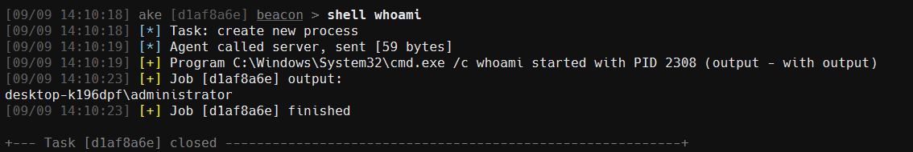

命令下发之后会产生三个流量包，首先客户端心跳响应包中会返回加密的data字段（客户端收到这个响应后会获取data中需要执行的任务）

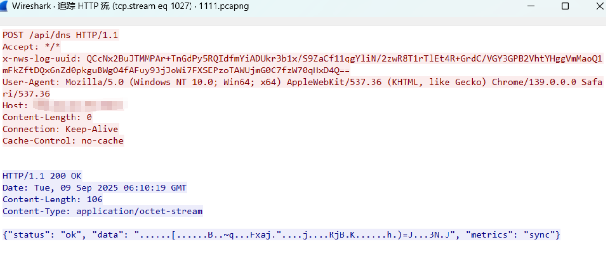

接着客户端会在请求体附上一段加密的数据发给服务端（同时获取完data中任务后，会把需要执行的命令给服务端发过去）

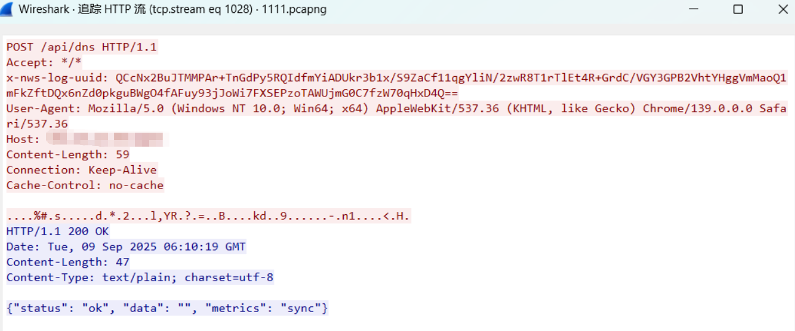

最后客户端会继续在请求体附上一段加密的数据发给服务端（客户端执行完命令后，将结果发给服务端）

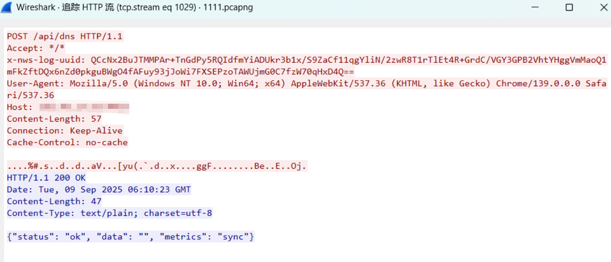

简单构造下解密脚本，看看思路有没有问题，拿第一个流量包中的data字段练练手

```
# -*- coding: utf-8 -*-
import base64
import struct
from Crypto.Cipher import ARC4

HEARTBEAT_HEADER = "QCcNx2BuJTMMPAr+TnGdPy5RQIdfmYiADUkr3b1x/S9ZaCf11qgYliN/2zwR8T1rTlEt4R+GrdC/VGY3GPB2VhtYHggVmMaoQ1mFkZftDQx6nZd0pkguBWgO4fAFuy93jJoWi7FXSEPzoTAWUjmG0C7fzW70qHxD4Q=="
Respon_Data = "7b22737461747573223a20226f6b222c202264617461223a2022e8b8b5fcdf8c5b1d1712e0e8f042df2e7e7181aad54678616aea228d01f2836aa3aae2b0526a42af4bd5b1ebf4bfbe68c3293d4aacf3cb334e8e4a222c20226d657472696373223a202273796e63227d"
STATIC_RC4_KEY = base64.b64decode("kJiY+eNoaq/j8VvSHUOl0Q==")

def rc4_crypt(key, data):
    return ARC4.new(key).encrypt(data)

def extract_session_key_from_beat(beat_decrypted_bytes):
    offset = 36
    length = struct.unpack('>I', beat_decrypted_bytes[offset:offset+4])[0]
    sk = beat_decrypted_bytes[offset+4 : offset+4+length]
    print(f"[+] SessionKey (hex): {sk.hex()}")
    return sk

# 1) 提取 session key
print("
--- 步骤1: 提取 SessionKey ---")
hb_enc = base64.b64decode(HEARTBEAT_HEADER)
hb_dec = rc4_crypt(STATIC_RC4_KEY, hb_enc)
plugin_beat = hb_dec[8:]
session_key = extract_session_key_from_beat(plugin_beat)

# 2) 分析data
print("
--- 步骤2: 分析 data ---")
if Respon_Data:
    response_bytes = bytes.fromhex(Respon_Data)

    # 使用固定的字节边界来提取数据
    prefix = b'{"status": "ok", "data": "'
    suffix = b'", "metrics": "sync"}'

    # 查找前缀和后缀在字节流中的位置
    start_index = response_bytes.find(prefix)
    end_index = response_bytes.find(suffix)

    if start_index != -1 and end_index != -1:
        # 计算加密数据的真实起始位置
        data_start_pos = start_index + len(prefix)
        
        # 提取两个边界之间的所有字节，这才是完整的加密数据
        layer2_encrypted_bytes = response_bytes[data_start_pos:end_index]
        print(f"[+] 提取出完整的加密数据 (长度: {len(layer2_encrypted_bytes)})")

        # 使用 session_key 解密
        layer2_decrypted = rc4_crypt(session_key, layer2_encrypted_bytes)
        print(f"[+] 第二层解密后 HEX: {layer2_decrypted.hex()}")
        
        if len(layer2_decrypted) < 4:
            print("[-] 错误: 解密后数据不足4字节，无法读取总长度")
        else:
            total_payload_len = struct.unpack('<I', layer2_decrypted[:4])[0]
            print(f"[+] 解析到Payload总长度: {total_payload_len}")

            payload_data = layer2_decrypted[4:]
            
            if len(payload_data) != total_payload_len:
                print(f"[!] 数据完整性校验失败！头部声明长度为 {total_payload_len}，但实际Payload长度为 {len(payload_data)}。")
            else:
                print("[+] 成功！Payload长度校验通过。数据已完全解密。")
    else:
        print("[-] 无法在响应字节流中找到文本边界。")
else:
    print("[ ] 未提供 data")
```

Run一下发现能解出hex数据

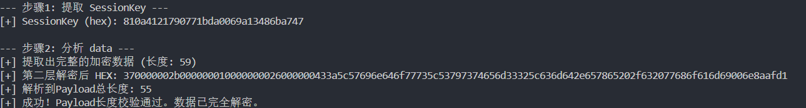

解码后可以看到第一个流量包是服务端下发的命令C:\Windows\System32\cmd.exe /c whoami，同时发现hex左右两边有一些00或多余字符填充，可能是为了逃避流量审查

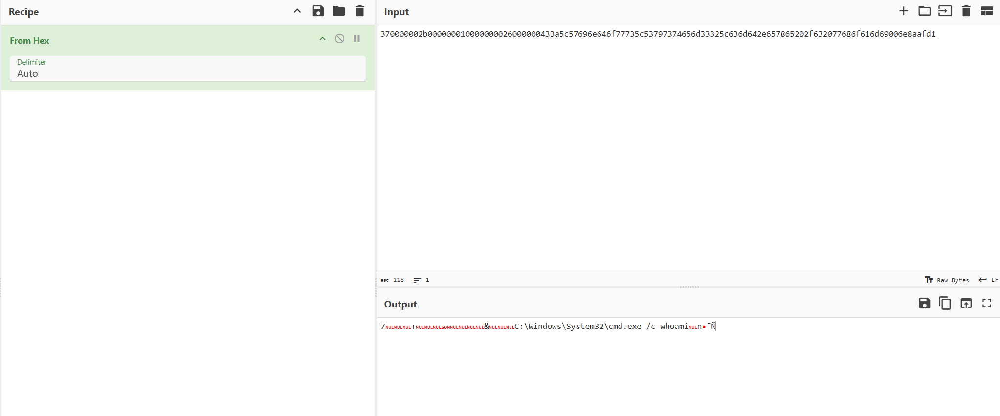

能解出第一个包，那到这里其实就很简单了，第二个和第三个流量包解密的逻辑跟第一个差不多，这里继续完善下解密脚本，单独加个模块就行了

```
def parse_agent_upload_final(decrypted_bytes):

    print("
[*] 解析 Agent->C2 上传数据")
    print(f"    原始解密 HEX: {decrypted_bytes.hex()}")

    offset = 0
    packet_index = 1
    while offset + 4 <= len(decrypted_bytes):
        print(f"
--- 数据包 #{packet_index} ---")
        try:
            # 1. 读取包的总长度 (关键：使用大端序 '>I')
            total_packet_len = struct.unpack('>I', decrypted_bytes[offset:offset+4])[0]
            print(f"  包总长度: {total_packet_len}")

            # 2. 检查是否有足够的数据来读取这个包
            if offset + total_packet_len > len(decrypted_bytes):
                print(f"  [!] 错误: 声明长度 {total_packet_len} 超出剩余数据 {len(decrypted_bytes) - offset}，解析中止。")
                break
            
            # 3. 提取这个包的载荷 (总长度 - 4字节长度头)
            payload_offset = offset + 4
            packet_payload = decrypted_bytes[payload_offset : offset + total_packet_len]
            
            pattern = re.compile(b'[ -~]+')  # 匹配所有可打印ASCII字符
            matches = pattern.findall(packet_payload)
            if matches:
                readable_part = max(matches, key=len).decode('utf-8', errors='ignore')
                print(f"  [+] 提取出的明文: '{readable_part}'")
            else:
                print("  [-] 未在载荷中找到可读明文。")

            if len(packet_payload) >= 8:
                task_id = struct.unpack('<I', packet_payload[0:4])[0]
                command_id = struct.unpack('<I', packet_payload[4:8])[0]

                # 字节反转
                task_id_reversed = int.from_bytes(task_id.to_bytes(4, byteorder='little'), byteorder='big')
                command_id_reversed = int.from_bytes(command_id.to_bytes(4, byteorder='little'), byteorder='big')

                print(f"    - 结构化信息: TaskID={task_id_reversed:08x}, CommandID={command_id_reversed:08x}")

            offset += total_packet_len

        except (struct.error, IndexError) as e:
            print(f"  [!] 错误: 解析数据包时出错: {e}")
            break
        packet_index += 1

```

```
# ============================================================
# --- 配置区: 请使用你抓到的三包数据 ---
# ============================================================
HEARTBEAT_HEADER = "QCcNx2BuJTMMPAr+TnGdPy5RQIdfmYiADUkr3b1x/S9ZaCf11qgYliN/2zwR8T1rTlEt4R+GrdC/VGY3GPB2VhtYHggVmMaoQ1mFkZftDQx6nZd0pkguBWgO4fAFuy93jJoWi7FXSEPzoTAWUjmG0C7fzW70qHxD4Q=="
Respon_Data_1 = "7b22737461747573223a20226f6b222c202264617461223a2022e8b8b5fcdf8c5b1d1712e0e8f042df2e7e7181aad54678616aea228d01f2836aa3aae2b0526a42af4bd5b1ebf4bfbe68c3293d4aacf3cb334e8e4a222c20226d657472696373223a202273796e63227d"
Request_Body_2 = "dfb8b5c72523d1731612e0c3f064d62a7f32bbf6a46c2c5952f43fb53dfc834295bea2f66b641cf939d3a4eafaf5a52d946e310bb6f2a43ca9489b"
Request_Body_3 = "dfb8b5c52523d173161264dff164df2e6156de85e95b797528f660e864ef80789aa6b5ef676746b811c2a8fabbe2d04265eed845c19a4f6ac6"

# --- RC4_KEY ---
STATIC_RC4_KEY = base64.b64decode("kJiY+eNoaq/j8VvSHUOl0Q==")

```

```
        # 3) 命令获取请求体
        print("
--- 步骤3: 分析 Agent 请求体 ---")
        if Request_Body_2:
            enc = bytes.fromhex(Request_Body_2)
            dec = rc4_crypt(session_key, enc)
            parse_agent_upload_final(dec)
        else:
            print("[ ] 未提供命令请求体")

        # 4) 结果上传
        print("
--- 步骤4: 分析 Agent 执行结果 ---")
        if Request_Body_3:
            enc2 = bytes.fromhex(Request_Body_3)
            dec2 = rc4_crypt(session_key, enc2)
            parse_agent_upload_final(dec2)
        else:
            print("[ ] 未提供结果请求体")
```

第二个流量包&C:\Windows\System32\cmd.exe /c whoami 表示客户端即将执行的命令

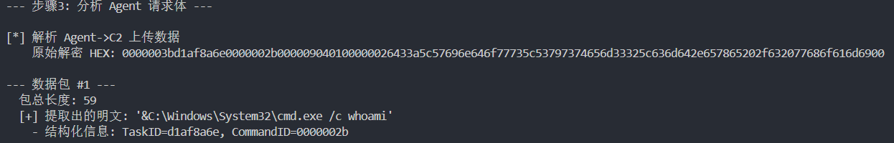

第三个流量包为客户端命令执行后的结果信息

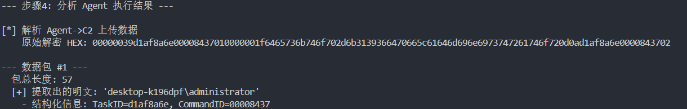

至此 listener\_beacon\_http流量向分析就结束了

# END
