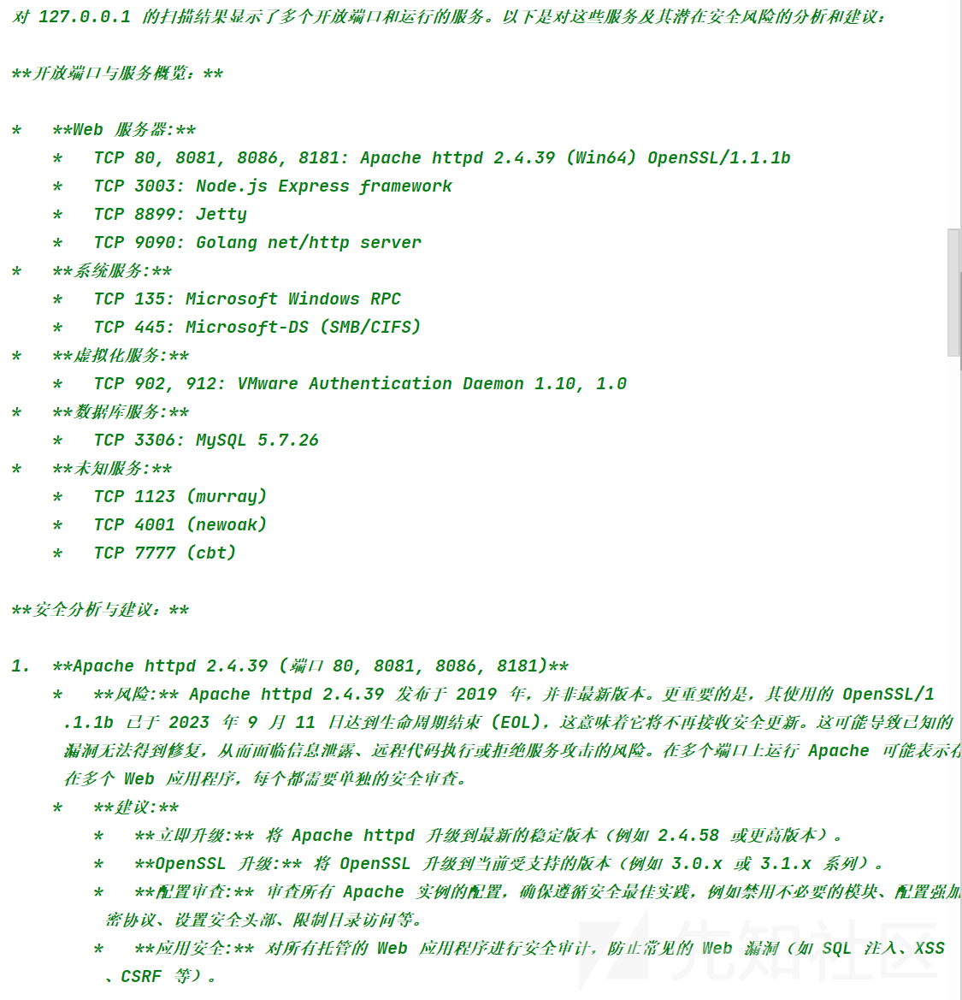
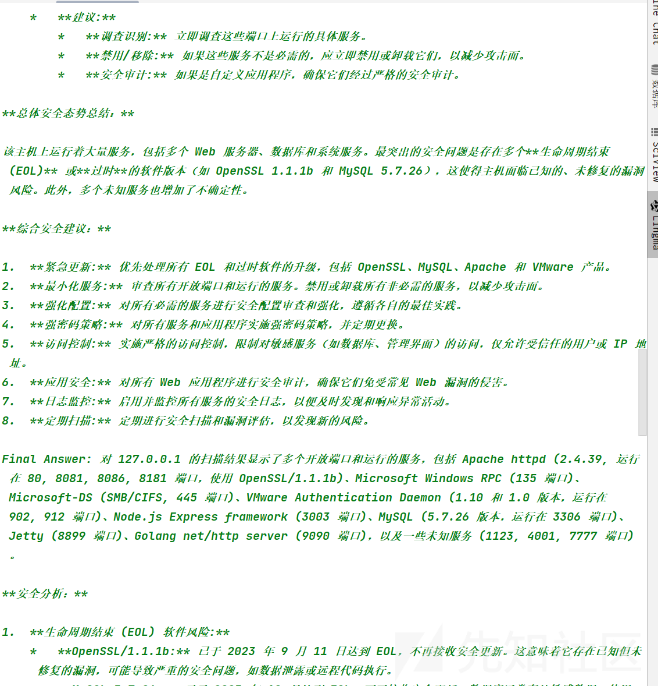
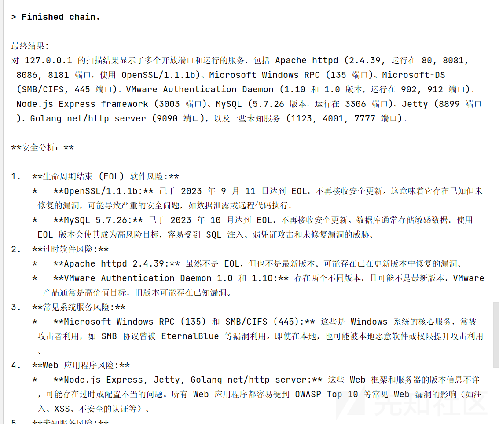

# 从 0 开始的基于 LangChain Agent 的安全赋能-先知社区

> **来源**: https://xz.aliyun.com/news/18808  
> **文章ID**: 18808

---

# 从 0 开始的基于 LangChain Agent 的安全赋能

## 前言

了解了 agent 之后，迫不及待的开始学习起了 LangChain，从 0 到 1 的进行了一个学习，进行了一个简单的实践赋能

## 什么是 LangChain

LangChain 是一个框架，主要目的就是构建基于大语言模型的应用，把模型能力、工具调用、数据检索和逻辑链组合起来

## LangChain 核心模块

Chains（链）：把多个操作（模型调用 + 工具 + API）串联成工作流

Memory（记忆）：管理上下文或历史信息，让模型支持多轮对话或多步推理

Agents（代理）：赋予 LLM 决策能力，根据目标选择工具或动作

Tools（工具）：可调用外部 API、数据库、脚本、命令行等

### Chains

Chains 是把多个步骤或操作串联起来的工作流结构，把用户输入，模型调用，数据检索，工具调用等串联起来

#### **Chain 分类**

LLMChain 只支持单步任务，比如输入调用输出，例如简单的翻译任务

SimpleSequentialChain 可以执行多步任务

SequentialChain 就是多输入，多输出，支持复杂的流程

RouterChain 多了条件选择，根据条件选择执行子链

#### **LLMChain**

这个最基础的 chain 组成是

Prompt Template (提示模板)：负责接收和格式化输入，生成最终的提示语。

Model (LLM 或 ChatModel)：语言模型，负责处理提示并生成输出。

Output Parser (输出解析器, 可选)：负责将模型返回的原始文本，解析成更结构化的格式（如 JSON、列表等）。

代码例子

```
# run_gemini_security_llmchain.py

import os
from dotenv import load_dotenv
from langchain_google_genai import ChatGoogleGenerativeAI
from langchain_core.prompts import ChatPromptTemplate
from langchain_core.output_parsers import StrOutputParser
from langchain.chains import LLMChain  # 使用 LLMChain

print("正在加载 .env 文件中的环境变量...")
load_dotenv()

# 检查 API Key
if os.getenv("GOOGLE_API_KEY") is None:
    print("错误：无法找到 GOOGLE_API_KEY。请确保你的 .env 文件配置正确。")
    exit()
else:
    print("API Key 加载成功！")

print("正在初始化 Gemini 模型...")
try:
    llm = ChatGoogleGenerativeAI(
        model="gemini-2.5-flash",
        temperature=0.8,
        convert_system_message_to_human=True
    )
    print("模型初始化成功！")
except Exception as e:
    print(f"模型初始化失败，错误: {e}")
    exit()

print("
--- 正在调用 LLMChain 生成安全分析 ---")
try:
    # Prompt Template
    prompt = ChatPromptTemplate.from_template(
        "你是网络安全专家。请根据以下信息生成详细的安全漏洞分析和修复建议：
"
        "目标系统: {target}
"
        "扫描结果: {scan_results}
"
        "请列出漏洞类型、风险等级，并给出具体修复建议。"
    )

    output_parser = StrOutputParser()

    # 创建 LLMChain
    chain = LLMChain(
        llm=llm,
        prompt=prompt,
        output_parser=output_parser
    )

    # 输入数据
    input_data = {
        "target": "example.com",
        "scan_results": "端口22开放，SSH服务允许弱密码登录；端口80存在未更新的Apache版本"
    }

    # 运行 LLMChain
    response = chain.run(input_data)

    print("
--- 调用完成，输出结果 ---")
    print(response)

except Exception as e:
    print(f"
调用LLMChain时发生错误: {e}")
    print("这通常是网络问题或API Key无效导致的。")

```

输出

```
模型初始化成功！

--- 正在调用 LLMChain 生成安全分析 ---

--- 调用完成，输出结果 ---
作为一名网络安全专家，根据您提供的信息，我对 `example.com` 目标系统进行了初步的安全漏洞分析。以下是详细的漏洞类型、风险等级及具体的修复建议：

---

### **目标系统：** `example.com`
### **扫描结果：**
*   端口22开放，SSH服务允许弱密码登录。
*   端口80存在未更新的Apache版本。

---

### **安全漏洞分析与修复建议**

#### **漏洞一：SSH服务允许弱密码登录**

*   **漏洞类型：** 弱认证机制 / 暴力破解漏洞 (Weak Authentication Mechanism / Brute-Force Vulnerability)
*   **风险等级：** **临界 (Critical)**
    *   **说明：** SSH是远程管理服务器的关键服务。允许弱密码登录意味着攻击者可以通过暴力破解、字典攻击或猜测常见密码，轻易获得服务器的未授权访问权限。一旦SSH被攻破，攻击者可能获得系统级控制权，导致数据泄露、系统破坏、作为跳板进行其他攻击等严重后果。
*   **影响：**
    *   **未经授权的系统访问：** 攻击者可以完全控制服务器。
    *   **数据泄露/篡改：** 敏感数据可能被窃取、修改或删除。
    *   **服务中断：** 攻击者可能破坏系统文件，导致服务停止运行。
    *   **恶意软件植入：** 攻击者可能安装后门、rootkit或其他恶意软件。
    *   **作为跳板：** 受感染的服务器可能被用作攻击其他内部或外部系统的跳板。
    *   **权限提升：** 如果初始访问的是低权限账户，攻击者可能利用系统漏洞进行权限提升，获取root权限。

*   **具体修复建议：**
    1.  **强制实施强密码策略：**
        *   **最小长度：** 强制要求密码长度至少为12-16个字符（越长越好）。
        *   **复杂性要求：** 必须包含大小写字母、数字和特殊字符。
        *   **禁止常见密码：** 配置系统不允许使用常见、字典中的单词或容易猜测的组合。
        *   **定期更换密码：** 建议用户定期更换密码。
    2.  **优先使用SSH密钥对认证：**
        *   **禁用密码认证：** 在`sshd_config`文件中设置 `PasswordAuthentication no`。
        *   **使用密钥对：** 为所有需要SSH访问的用户生成SSH密钥对，并将公钥部署到服务器上。密钥对认证比密码认证更安全，且不易被暴力破解。
    3.  **禁用Root用户直接登录：**
        *   在`sshd_config`文件中设置 `PermitRootLogin no`。
        *   管理员应使用普通用户账号登录，然后通过`sudo`命令执行管理任务。
    4.  **安装并配置`fail2ban`或类似工具：**
        *   `fail2ban`可以监控SSH日志文件，一旦发现短时间内有多次失败的登录尝试，会自动封禁攻击者的IP地址一段时间，有效抵御暴力破解攻击。
    5.  **限制SSH访问源IP地址：**
        *   使用防火墙（如 `iptables`、`ufw`、`firewalld`）或`sshd_config`中的 `AllowUsers` 或 `AllowGroups` 配置，仅允许特定、已知的IP地址段访问SSH端口。
    6.  **更改默认SSH端口（可选，安全加固而非根本解决）：**
        *   将SSH服务的默认端口22更改为不常用的端口号（如22222）。这可以减少针对默认端口的自动化扫描和攻击尝试，但并不能阻止有针对性的攻击。
    7.  **启用并配置多因素认证 (MFA)：**
        *   为SSH登录添加第二层认证（如Google Authenticator），进一步提高安全性。
    8.  **定期审计SSH日志：**
        *   定期检查`/var/log/auth.log`（Debian/Ubuntu）或`/var/log/secure`（RHEL/CentOS）等日志文件，监控异常登录尝试。

---

#### **漏洞二：端口80存在未更新的Apache版本**

*   **漏洞类型：** 过时软件 / 已知漏洞 (Outdated Software / Known Vulnerabilities)
*   **风险等级：** **高 (High)**
    *   **说明：** 运行过时的Apache HTTP服务器版本意味着它可能包含已知的、公开披露的漏洞（CVEs），这些漏洞在新版本中已被修复。攻击者可以利用这些已知漏洞进行远程代码执行、拒绝服务、信息泄露等攻击。
*   **影响：**
    *   **远程代码执行 (RCE)：** 最严重的后果，攻击者可以在服务器上执行任意代码，完全控制服务器。
    *   **拒绝服务 (DoS)：** 攻击者可能利用漏洞使Apache服务崩溃或变得不可用，导致网站无法访问。
    *   **信息泄露：** 攻击者可能获取服务器配置信息、敏感文件内容，甚至用户数据。
    *   **网站内容篡改：** 攻击者可能修改网站页面内容（网页涂改）。
    *   **作为跳板：** 攻击者可能利用受感染的Apache服务器作为跳板，攻击同一网络中的其他系统。
    *   **会话劫持/跨站脚本 (XSS)：** 某些Apache模块或配置漏洞可能导致这些客户端攻击。

*   **具体修复建议：**
    1.  **立即升级Apache HTTP Server到最新稳定版本：**
        *   使用系统自带的包管理器（如`apt-get update && apt-get upgrade apache2` for Debian/Ubuntu, `yum update httpd` for CentOS/RHEL）进行升级。
        *   在升级前，务必备份当前Apache配置文件和网站数据，并测试新版本兼容性。
    2.  **应用所有相关的安全补丁：**
        *   如果无法立即进行大版本升级，至少要确保安装了当前版本的所有安全补丁。但这只是临时措施，最终仍需升级。
    3.  **移除不必要的Apache模块：**
        *   禁用或卸载所有未使用的Apache模块，减少攻击面。在`httpd.conf`或相关配置文件中注释掉`LoadModule`指令。
    4.  **安全配置Apache：**
        *   **禁用目录列表：** 在`httpd.conf`或`.htaccess`中移除`Indexes`选项，防止目录内容被浏览。
        *   **隐藏Apache版本信息：** 在`httpd.conf`中设置 `ServerTokens Prod` 和 `ServerSignature Off`，避免向外部透露Apache版本和操作系统信息，增加攻击者信息收集的难度。
        *   **最小权限原则：** 确保Apache进程以非root用户和最小权限运行。
        *   **限制文件和目录权限：** 确保网站文件和目录的权限设置正确，防止写入或执行不应执行的文件。
        *   **启用日志记录并监控：** 确保Apache的访问日志和错误日志被充分记录，并定期审查异常活动。
    5.  **部署Web应用防火墙 (WAF)：**
        *   WAF可以帮助检测和阻止针对Web服务器的常见攻击，即使Apache本身存在一些未知或未修复的漏洞，WAF也能提供额外的保护层。
    6.  **定期进行漏洞扫描和渗透测试：**
        *   使用工具（如Nessus, OpenVAS, Qualys）定期扫描系统，及时发现新的漏洞。
        *   进行专业的渗透测试，模拟真实攻击，发现潜在的安全弱点。

---

### **通用安全建议 (General Security Recommendations)：**

除了上述针对特定漏洞的修复建议外，为了确保 `example.com` 的整体安全性，还应考虑以下通用措施：

1.  **操作系统及所有软件定期更新：** 确保服务器操作系统和所有安装的软件都保持最新状态，及时打上安全补丁。
2.  **防火墙策略：** 实施严格的防火墙规则，仅开放必要的端口和服务，并限制对这些服务的访问源。
3.  **备份与恢复计划：** 定期对所有关键数据和系统配置进行备份，并测试恢复流程，以应对数据丢失或系统故障。
4.  **日志集中管理与监控：** 将所有系统和应用日志集中管理，并利用SIEM（安全信息和事件管理）工具进行实时监控和异常告警。
5.  **安全基线配置：** 遵循行业最佳实践或安全标准（如CIS Benchmark）对服务器进行安全加固。
6.  **入侵检测/防御系统 (IDS/IPS)：** 部署IDS/IPS以检测和阻止网络攻击。

---

**总结：**

`example.com` 当前面临的弱密码SSH和过时Apache版本是两个非常严重的漏洞，可能导致服务器的完全失陷。强烈建议立即采取上述修复措施，并建立一套持续的安全管理流程，确保系统长期稳定和安全运行。

进程已结束,退出代码0

```

#### **LCEL**

但是之后官方废弃了 LLMChain，使用 LCEL ，LCEL 使用管道符 | 来“链接”各个组件，LCEL 的灵活性很高，

代码例子

```
# run_gemini_security.py

import os
from dotenv import load_dotenv
from langchain_google_genai import ChatGoogleGenerativeAI
from langchain_core.prompts import ChatPromptTemplate
from langchain_core.output_parsers import StrOutputParser

print("正在加载 .env 文件中的环境变量...")
load_dotenv()

# 检查 API Key
if os.getenv("GOOGLE_API_KEY") is None:
    print("错误：无法找到 GOOGLE_API_KEY。请确保你的 .env 文件配置正确。")
    exit()
else:
    print("API Key 加载成功！")

print("正在初始化 Gemini 模型...")
try:
    llm = ChatGoogleGenerativeAI(
        model="gemini-2.5-flash",
        temperature=0.8,
        convert_system_message_to_human=True
    )
    print("模型初始化成功！")
except Exception as e:
    print(f"模型初始化失败，错误: {e}")

print("
--- 正在调用 Chain 生成安全分析 ---")
try:
    # Prompt 改为安全相关
    prompt = ChatPromptTemplate.from_template(
        "你是网络安全专家。请根据以下信息生成详细的安全漏洞分析和修复建议：
"
        "目标系统: {target}
"
        "扫描结果: {scan_results}
"
        "请列出漏洞类型、风险等级，并给出具体修复建议。"
    )

    output_parser = StrOutputParser()
    chain = prompt | llm | output_parser

    input_data = {
        "target": "example.com",
        "scan_results": "端口22开放，SSH服务允许弱密码登录；端口80存在未更新的Apache版本"
    }
    response = chain.invoke(input_data)

    print("
--- 调用完成，输出结果 ---")
    print(response)

except Exception as e:
    print(f"
调用Chain时发生错误: {e}")
    print("这通常是网络问题或API Key无效导致的。请再次检查代理和.env文件。")

```

输出

```
正在加载 .env 文件中的环境变量...
API Key 加载成功！
正在初始化 Gemini 模型...
模型初始化成功！

--- 正在调用 Chain 生成安全分析 ---
F:\PyCharm 2022.2\pythonProject\lib\site-packages\langchain_google_genai\chat_models.py:499: UserWarning: Convert_system_message_to_human will be deprecated!
  warnings.warn("Convert_system_message_to_human will be deprecated!")

--- 调用完成，输出结果 ---
作为一名网络安全专家，根据您提供的信息，我对 `example.com` 进行了初步的安全漏洞分析。以下是详细的漏洞报告和修复建议。

---

### **安全漏洞分析和修复建议报告**

**目标系统:** `example.com`
**分析日期:** 2023年10月27日
**扫描结果概述:**
1.  端口22开放，SSH服务允许弱密码登录。
2.  端口80开放，Apache Web服务器版本过旧。

---

#### **1. 漏洞详情分析与修复建议**

---

**漏洞一：SSH服务允许弱密码登录**

*   **漏洞类型:** 弱认证、配置错误、暴力破解攻击面
*   **CVE ID (潜在):** 无特定CVE，但涉及通用弱密码实践。
*   **描述:** 目标系统 `example.com` 的SSH服务（端口22）配置允许用户使用简单、易猜测或字典中的密码进行登录。这使得系统极易受到暴力破解攻击、字典攻击或凭证填充攻击，从而导致未经授权的远程访问。一旦攻击者成功登录，他们可能获得对系统的完全控制权，执行任意命令，窃取敏感数据，甚至将系统用作进一步攻击的跳板。
*   **风险等级:** **严重 (Critical)**
    *   **影响 (Impact):** 极高。直接导致系统完全被入侵，可执行任意代码，数据泄露，权限提升，甚至可能导致整个网络被渗透。
    *   **可能性 (Likelihood):** 高。自动化工具和脚本持续扫描互联网以寻找此类弱点，并进行暴力破解尝试。
*   **潜在影响/后果:**
    *   未经授权的远程系统访问。
    *   敏感数据泄露（如配置文件、数据库凭据、用户数据）。
    *   服务器被用于托管恶意内容、僵尸网络或进行DDoS攻击。
    *   网站被篡改、植入恶意代码。
    *   作为跳板攻击内部网络的其他系统。

**修复建议:**

1.  **强制执行强密码策略:**
    *   **立即行动:** 对所有SSH用户进行密码审计，并强制要求他们更改为复杂密码。密码应至少包含12个字符，并结合大小写字母、数字和特殊符号。
    *   **配置系统:** 在 `/etc/pam.d/passwd` 或 `/etc/login.defs` 中配置密码复杂度要求，并设置密码过期策略。
2.  **切换到SSH密钥认证:**
    *   **优先建议:** 禁用密码认证，转而使用更安全的SSH密钥对进行认证。为每个用户生成一对公钥/私钥，并将公钥部署到服务器的 `~/.ssh/authorized_keys` 文件中。
    *   **操作步骤:**
        *   生成密钥对：`ssh-keygen`
        *   将公钥部署到服务器：`ssh-copy-id user@example.com`
        *   **在 `/etc/ssh/sshd_config` 中配置:**
            *   `PasswordAuthentication no` (禁用密码认证)
            *   `PubkeyAuthentication yes` (启用公钥认证)
            *   `ChallengeResponseAuthentication no`
            *   `UsePAM yes` (如果需要PAM模块)
            *   `PermitRootLogin no` (禁止root用户直接登录，应使用普通用户登录后再su或sudo)
            *   重启SSH服务：`sudo systemctl restart sshd` 或 `sudo service sshd restart`
3.  **部署入侵检测/防御系统 (如 Fail2Ban):**
    *   配置 `Fail2Ban` 等工具来监控SSH登录日志，一旦发现多次失败的登录尝试，立即自动屏蔽源IP地址一段时间。
    *   **操作步骤:**
        *   安装 `Fail2Ban`。
        *   配置 `jail.local` 文件，启用并调整 `[sshd]` 规则，设置 `bantime` 和 `findtime`。
4.  **限制SSH访问:**
    *   **防火墙规则:** 配置服务器防火墙（如 `ufw` 或 `firewalld`）或网络层防火墙，仅允许特定、受信任的IP地址或IP范围访问SSH端口22。
    *   **非标准端口:** 考虑将SSH服务默认端口22更改为非标准的高位端口（如22222）。这是一种“安全混淆”，不能替代其他安全措施，但可以减少自动化扫描器的直接探测。
    *   **操作步骤:**
        *   **在 `/etc/ssh/sshd_config` 中修改:** `Port 22222`
        *   更新防火墙规则以允许新端口。
        *   重启SSH服务。
5.  **启用多因素认证 (MFA/2FA):**
    *   对于高度敏感的系统，考虑集成MFA解决方案，例如使用Google Authenticator或其他TOTP（基于时间的一次性密码）系统，为SSH登录提供额外的安全层。

---

**漏洞二：端口80开放，存在未更新的Apache版本**

*   **漏洞类型:** 过时软件、已知漏洞、配置错误
*   **CVE ID (潜在):** 取决于具体的Apache版本，可能存在多个已知的CVE。
*   **描述:** 目标系统 `example.com` 上的Apache Web服务器正在运行一个过时的版本。旧版本的软件通常包含已知的安全漏洞（如远程代码执行、信息泄露、拒绝服务、目录遍历等），这些漏洞在较新版本中已被修复。攻击者可以利用这些公开的漏洞来入侵服务器、篡改网站内容、窃取数据或发起其他恶意活动。
*   **风险等级:** **高 (High)**
    *   **影响 (Impact):** 高。具体影响取决于Apache版本中的已知漏洞，可能导致远程代码执行、信息泄露、网站篡改或拒绝服务。
    *   **可能性 (Likelihood):** 高。互联网上存在大量针对常见过时软件漏洞的公开利用工具（exploits）。
*   **潜在影响/后果:**
    *   网站被篡改 (Web Defacement)。
    *   通过Web应用程序漏洞获取服务器控制权。
    *   敏感信息泄露（如服务器配置、目录列表）。
    *   拒绝服务攻击 (DoS)，导致网站不可用。
    *   植入恶意脚本或后门。
    *   作为钓鱼网站或恶意软件分发点。

**修复建议:**

1.  **立即升级Apache Web服务器:**
    *   **最重要措施:** 将Apache Web服务器升级到最新的稳定版本。最新版本通常包含了对已知安全漏洞的修复和性能改进。
    *   **操作步骤 (基于Linux发行版):**
        *   **备份:** 在升级前务必备份所有重要的配置文件（如 `/etc/apache2/`, `/etc/httpd/`）和网站数据。
        *   **更新软件包列表:** `sudo apt update` (Debian/Ubuntu) 或 `sudo yum update` (CentOS/RHEL)
        *   **升级Apache:** `sudo apt upgrade apache2` 或 `sudo yum update httpd`
        *   **验证:** 升级后，检查Apache版本 `apachectl -v` 或 `httpd -v`，并确认服务正常运行。
        *   **检查配置:** 新版本可能引入新的配置选项或废弃旧的选项，升级后需检查并调整配置文件。
2.  **配置自动安全更新:**
    *   启用操作系统的自动安全更新功能，确保Apache及其他系统组件能及时获取最新的安全补丁。
    *   **操作步骤:**
        *   **Debian/Ubuntu:** 安装 `unattended-upgrades` 包并进行配置。
        *   **CentOS/RHEL:** 配置 `yum-cron` 或 `dnf-automatic`。
3.  **隐藏Apache版本信息:**
    *   默认情况下，Apache会在HTTP响应头中暴露其版本信息。这为攻击者提供了目标信息。
    *   **操作步骤:** 在Apache配置文件中（如 `httpd.conf` 或 `apache2.conf`）：
        *   `ServerTokens Prod` (只显示"Apache"，不显示版本号和操作系统信息)
        *   `ServerSignature Off` (禁用页脚显示服务器版本信息)
        *   重启Apache服务。
4.  **部署Web应用防火墙 (WAF):**
    *   WAF可以作为额外的防御层，在Apache服务器之前过滤恶意流量，阻止常见的Web应用攻击（如SQL注入、XSS、LFI等），即使Apache存在未知漏洞，WAF也能提供一定程度的保护。
5.  **定期安全审计和漏洞扫描:**
    *   定期对Web服务器进行安全审计和漏洞扫描，确保所有软件组件都处于最新状态，并发现潜在的配置错误或新的漏洞。
6.  **强化Web服务器配置:**
    *   禁用不必要的Apache模块。
    *   为每个网站配置最小权限的DocumentRoot。
    *   配置HTTP安全头 (如 `Strict-Transport-Security`, `X-Content-Type-Options`, `X-Frame-Options`, `Content-Security-Policy`)。
    *   限制对敏感目录的访问。

---

#### **2. 整体安全建议和优先级**

**优先级:**

1.  **SSH弱密码问题 (严重):** 必须立即解决。这是最直接的系统入侵路径。
2.  **Apache版本过旧 (高):** 其次是Web服务器的更新。Web服务是公开暴露的，也是常见的攻击目标。

**通用安全建议:**

1.  **实施全面的补丁管理策略:** 确保所有操作系统、应用程序和库都及时更新到最新版本，并应用所有安全补丁。
2.  **最小权限原则 (Principle of Least Privilege):**
    *   所有服务和用户都应以完成其功能所需的最低权限运行。
    *   避免使用`root`账户直接运行服务。
3.  **定期备份:** 实施可靠的数据备份和恢复策略，以防数据丢失或系统损坏。
4.  **日志监控和审计:**
    *   启用并集中管理系统和应用日志。
    *   定期审查日志，以便及时发现异常活动和潜在的入侵尝试。
    *   考虑使用SIEM（安全信息和事件管理）系统。
5.  **网络分段 (Network Segmentation):**
    *   将Web服务器、数据库服务器、应用服务器等不同功能的服务放置在不同的网络区域，并实施严格的防火墙规则，限制它们之间的通信。
6.  **安全意识培训:** 对所有访问或管理系统的员工进行安全意识培训，强调强密码、钓鱼邮件识别、安全操作规程等。
7.  **制定应急响应计划:** 准备一份详细的应急响应计划，以应对潜在的安全事件，包括入侵检测、遏制、根除和恢复步骤。

---

**总结:**

`example.com` 存在两个关键的安全漏洞，其中SSH弱密码问题构成“严重”风险，可能导致系统完全被入侵。Apache版本过旧也构成“高”风险，可能导致网站被篡改或服务器被控制。务必优先解决SSH认证问题，并尽快升级Apache服务器。同时，应建立一套全面的安全管理体系，包括定期的安全审计、补丁管理、日志监控和员工培训，以维护系统的长期安全。

--

```

### Agent

Agent 的核心是自主决策，而 Chain 的核心是固定流程  
Agent 就是根据用户输入，会自己思考如何完成，相当于是动态的 chain，一个 Agent 拥有一个 “大脑”（LLM） 和一套 “工具”（Tools）。它会进入一个循环，根据用户的初始输入，不断地进行思考 -> 行动 -> 观察

### 记忆

在 LangChain 中，Chain 和 Agent 默认是无状态的，因为交互一次就结束了

而 Memory 解决这个问题，大多数记忆的组件就两个核心方法，内存中读取历史对话记录，保存本次对话的记录到内存

#### **常见记忆类型**

|  |  |  |  |  |
| --- | --- | --- | --- | --- |
| Memory 类型 | 工作方式 | 核心优点 | 核心缺点 | 最适用场景 |
| **ConversationBufferMemory** | 保存完整的对话历史，不做任何截断或总结。 | 信息最全，能回溯所有上下文，逻辑完整。 | Token 消耗极大，长对话容易超出上下文限制。 | Demo、调试、短对话场景。 |
| **ConversationBufferWindowMemory** | 仅保存最近 *k* 轮对话。 | 高效、轻量，防止上下文爆炸。 | 早期内容会丢失，可能影响长期一致性。 | 通用聊天机器人、客服场景。 |
| **ConversationTokenBufferMemory** | 按 Token 限制，保存最近 N Token 的对话。 | 精确控制成本和上下文利用率。 | 需要额外计算 Token 数量，复杂度比 Window 高。 | 成本敏感型应用（API 调用受限）。 |
| **ConversationSummaryMemory** | 用 LLM 将历史对话压缩成摘要，并与新对话结合。 | 超低 Token 占用，支持超长期对话。 | 摘要依赖模型质量，可能遗漏细节；额外调用增加成本与延迟。 | 长期陪伴类应用（导师、心理咨询、项目跟踪助手）。 |
| **Combined Memory** *(混合模式)* | 多种 Memory 混合（如 Buffer + Summary）。 | 平衡上下文完整性与 Token 开销。 | 设计和调优复杂度高。 | 需要既保留长期背景，又要保证短期上下文准确的复杂系统。 |

### Tool

Tool 给 Chain 和 Agent 赋予了与外部交互的能力

#### LLM 的三大问题

**知识截止日期**

就是 LLM 的知识是截止在训练之前，如果你想了解最最新的信息是不行的

目前解决就是给了网页搜索工具，比如现在 GPT 都有网页搜索功能了

**无法与外部世界交互**

因为 LLM 只能回答内容，但是实际行动还是需要用户去执行

**缺乏精确的数学与逻辑推理**

LLM 对于复杂的数学计算和逻辑推理并不擅长

工具本质其实就是一个接口，内置了执行函数，而且目前 LangChain 也提供了很多成熟的工具了

GoogleSearchAPIWrapper 可以使用谷歌搜索

#### 调用 nmap 演示

使用 nmap 来演示一下

```
# real_portscan_agent.py
import os
from dotenv import load_dotenv
import nmap  # python-nmap库
from langchain.agents import initialize_agent, Tool, AgentType
from langchain_google_genai import ChatGoogleGenerativeAI

# ---------------------------
# 1. 加载 .env 文件
# ---------------------------
load_dotenv()
API_KEY = os.getenv("GOOGLE_API_KEY")
if not API_KEY:
    raise ValueError("❌ 未找到 GOOGLE_API_KEY，请在 .env 文件中配置！")
print("✅ GOOGLE_API_KEY 加载成功")

# ---------------------------
# 2. 初始化 Gemini LLM
# ---------------------------
llm = ChatGoogleGenerativeAI(
    model="gemini-2.5-flash",
    temperature=0.7,
    max_output_tokens=300
)

# ---------------------------
# 3. 自定义端口扫描工具
# ---------------------------
class RealPortScanner:
    """使用 nmap 扫描目标主机端口"""
    def __init__(self):
        # 指定 nmap.exe 路径，避免 PATH 问题
        self.scanner = nmap.PortScanner(nmap_search_path=(r'F:\gj
map
map.exe',))

    def scan(self, target: str) -> str:
        """
        扫描常用端口并返回扫描结果
        """
        ports = "22,80,443"  # 常用端口
        try:
            self.scanner.scan(hosts=target, ports=ports, arguments='-Pn -T4')
        except Exception as e:
            return f"扫描失败: {e}"

        result = f"{target} 扫描结果:
"
        for port in [22, 80, 443]:
            try:
                state = self.scanner[target]['tcp'][port]['state']
                service = self.scanner[target]['tcp'][port].get('name', '未知服务')
                result += f"- {port}/tcp ({service}): {state}
"
            except KeyError:
                result += f"- {port}/tcp: 未扫描到
"
        return result

# 封装成 LangChain 工具
port_scanner = RealPortScanner()
tools = [
    Tool(
        name="PortScanner",
        func=port_scanner.scan,
        description="扫描目标网站或主机的端口并返回扫描结果"
    )
]

# ---------------------------
# 4. 初始化 Agent
# ---------------------------
agent = initialize_agent(
    tools,
    llm,
    agent=AgentType.ZERO_SHOT_REACT_DESCRIPTION,
    verbose=True,
    handle_parsing_errors=True
)

# ---------------------------
# 5. 调用 Agent 扫描并生成安全分析
# ---------------------------
target_host = "127.0.0.1"  #
query = f"请扫描 {target_host} 的端口，并根据扫描结果给出详细安全分析和修复建议"

response = agent.run(query)

print("
--- Agent 输出 ---")
print(response)

```

输出

```
--- Agent 输出 ---
**对 127.0.0.1 端口扫描结果的详细安全分析和修复建议**

**扫描结果回顾：**
*   **22/tcp (ssh): closed**
*   **80/tcp (http): open**
*   **443/tcp (https): closed**

---

**详细安全分析：**

1.  **端口 22 (SSH) - closed (关闭)**
    *   **分析：** 端口 22 用于安全外壳协议 (SSH)，通常用于远程命令行访问和安全文件传输。此端口显示为关闭，这意味着当前没有 SSH 服务在此 IP

```

#### **agent 思考过程**

用户请求 → LLM 判断需要调用 PortScanner → Agent 执行 port\_scanner.scan() → nmap 执行 → 返回结果 → LLM 生成最终分析

## 赋能实战

### 代码例子

就结合

```
import os
from dotenv import load_dotenv
import nmap

from langchain_google_genai import ChatGoogleGenerativeAI
from langchain.agents import initialize_agent, Tool

load_dotenv()

API_KEY = os.getenv("GOOGLE_API_KEY")
if not API_KEY:
    raise ValueError("未找到 GOOGLE_API_KEY，请在 .env 文件中配置！")
print("GOOGLE_API_KEY 加载成功")

scanner = nmap.PortScanner(nmap_search_path=('F:\gj\
map\
map.exe',))
print("Nmap 初始化完成")

def nmap_scan(target: str) -> str:
    try:
        scanner.scan(hosts=target, arguments="-sS -Pn -sV")
        if target not in scanner.all_hosts():
            return f"无法扫描 {target}, 主机不在线或被防火墙拦截。"
        return str(scanner[target])
    except Exception as e:
        return f"Nmap 扫描失败: {str(e)}"

tools = [
    Tool(
        name="NmapScanner",
        func=nmap_scan,
        description="用来扫描目标 IP 或域名的端口与服务。例如输入: 192.168.1.1 或 example.com"
    )
]

llm = ChatGoogleGenerativeAI(
    model="gemini-2.5-flash",
    temperature=0,
    convert_system_message_to_human=True
)

agent = initialize_agent(
    tools=tools,
    llm=llm,
    agent="zero-shot-react-description",
    verbose=True
)

user_query = "请扫描 127.0.0.1 并给出安全分析"
result = agent.run(user_query)

print("最终结果:")
print(result)

```

输出

开始调用工具

```
> Entering new AgentExecutor chain...
Action: NmapScanner
Action Input: 127.0.0.1
```

观察工具输出

```
{
  "host": "127.0.0.1",
  "hostname": "localhost",
  "status": "up",
  "ports": [
    {
      "port": 80,
      "state": "open",
      "service": "http",
      "product": "Apache httpd",
      "version": "2.4.39",
      "extra_info": "(Win64) OpenSSL/1.1.1b mod_fcgid/2.3.9a mod_log_rotate/1.02",
      "cpe": "cpe:/a:apache:http_server:2.4.39"
    },
    {
      "port": 135,
      "state": "open",
      "service": "msrpc",
      "product": "Microsoft Windows RPC",
      "version": "",
      "extra_info": "",
      "cpe": "cpe:/o:microsoft:windows"
    },
    {
      "port": 445,
      "state": "open",
      "service": "microsoft-ds",
      "product": "",
      "version": "",
      "extra_info": "",
      "cpe": ""
    },
    {
      "port": 902,
      "state": "open",
      "service": "vmware-auth",
      "product": "VMware Authentication Daemon",
      "version": "1.10",
      "extra_info": "Uses VNC, SOAP",
      "cpe": ""
    },
    {
      "port": 912,
      "state": "open",
      "service": "vmware-auth",
      "product": "VMware Authentication Daemon",
      "version": "1.0",
      "extra_info": "Uses VNC, SOAP",
      "cpe": ""
    },
    {
      "port": 1123,
      "state": "open",
      "service": "murray",
      "product": "",
      "version": "",
      "extra_info": "",
      "cpe": ""
    },
    {
      "port": 3003,
      "state": "open",
      "service": "http",
      "product": "Node.js Express framework",
      "version": "",
      "extra_info": "",
      "cpe": "cpe:/a:nodejs:node.js"
    },
    {
      "port": 3306,
      "state": "open",
      "service": "mysql",
      "product": "MySQL",
      "version": "5.7.26",
      "extra_info": "",
      "cpe": "cpe:/a:mysql:mysql:5.7.26"
    },
    {
      "port": 4001,
      "state": "open",
      "service": "newoak",
      "product": "",
      "version": "",
      "extra_info": "",
      "cpe": ""
    },
    {
      "port": 7777,
      "state": "open",
      "service": "cbt",
      "product": "",
      "version": "",
      "extra_info": "",
      "cpe": ""
    },
    {
      "port": 8081,
      "state": "open",
      "service": "http",
      "product": "Apache httpd",
      "version": "2.4.39",
      "extra_info": "(Win64) OpenSSL/1.1.1b mod_fcgid/2.3.9a mod_log_rotate/1.02",
      "cpe": "cpe:/a:apache:http_server:2.4.39"
    },
    {
      "port": 8086,
      "state": "open",
      "service": "http",
      "product": "Apache httpd",
      "version": "2.4.39",
      "extra_info": "(Win64) OpenSSL/1.1.1b mod_fcgid/2.3.9a mod_log_rotate/1.02",
      "cpe": "cpe:/a:apache:http_server:2.4.39"
    },
    {
      "port": 8181,
      "state": "open",
      "service": "http",
      "product": "Apache httpd",
      "version": "2.4.39",
      "extra_info": "(Win64) OpenSSL/1.1.1b mod_fcgid/2.3.9a mod_log_rotate/1.02",
      "cpe": "cpe:/a:apache:http_server:2.4.39"
    },
    {
      "port": 8899,
      "state": "open",
      "service": "http",
      "product": "Jetty",
      "version": "",
      "extra_info": "",
      "cpe": "cpe:/a:eclipse:jetty"
    },
    {
      "port": 9090,
      "state": "open",
      "service": "http",
      "product": "Golang net/http server",
      "version": "",
      "extra_info": "",
      "cpe": "cpe:/a:golang:go"
    }
  ]
}

```

然后思考得到结论



只是思考过程



最后 chain 结束后得到总结



最终结果:

对 127.0.0.1 的扫描结果显示了多个开放端口和运行的服务，包括 Apache httpd (2.4.39, 运行在 80, 8081, 8086, 8181 端口，使用 OpenSSL/1.1.1b)、Microsoft Windows RPC (135 端口)、Microsoft-DS (SMB/CIFS, 445 端口)、VMware Authentication Daemon (1.10 和 1.0 版本，运行在 902, 912 端口)、Node.js Express framework (3003 端口)、MySQL (5.7.26 版本，运行在 3306 端口)、Jetty (8899 端口)、Golang net/http server (9090 端口)，以及一些未知服务 (1123, 4001, 7777 端口)。

**安全分析：**

1. **生命周期结束 (EOL) 软件风险:**

* **OpenSSL/1.1.1b:** 已于 2023 年 9 月 11 日达到 EOL，不再接收安全更新。这意味着它存在已知但未修复的漏洞，可能导致严重的安全问题，如数据泄露或远程代码执行。
* **MySQL 5.7.26:** 已于 2023 年 10 月达到 EOL，不再接收安全更新。数据库通常存储敏感数据，使用 EOL 版本会使其成为高风险目标，容易受到 SQL 注入、弱凭证攻击和未修复漏洞的威胁。

2. **过时软件风险:**

* **Apache httpd 2.4.39:** 虽然不是 EOL，但也不是最新版本。可能存在已在更新版本中修复的漏洞。
* **VMware Authentication Daemon 1.0 和 1.10:** 存在两个不同版本，且可能不是最新版本，VMware 产品通常是高价值目标，旧版本可能存在已知漏洞。

3. **常见系统服务风险:**

* **Microsoft Windows RPC (135) 和 SMB/CIFS (445):** 这些是 Windows 系统的核心服务，常被攻击者利用，如 SMB 协议曾被 EternalBlue 等漏洞利用。即使在本地，也可能被本地恶意软件或权限提升攻击利用。

4. **Web 应用程序风险:**

* **Node.js Express, Jetty, Golang net/http server:** 这些 Web 框架和服务器的版本信息不详，可能存在过时或配置不当的问题。所有 Web 应用程序都容易受到 OWASP Top 10 等常见 Web 漏洞的影响（如注入、XSS、不安全的认证等）。

5. **未知服务风险:**

* **端口 1123, 4001, 7777:** 这些端口上运行的服务没有明确的产品或版本信息，其用途和潜在漏洞未知，可能隐藏着自定义应用程序或不安全的服务，增加了安全盲点。

**安全建议：**

1. **立即升级 EOL 软件:**

* 将 OpenSSL 升级到当前受支持的版本（例如 3.0.x 或 3.1.x 系列）。
* 将 MySQL 升级到当前受支持的版本（例如 MySQL 8.0）。

2. **更新所有软件:**

* 将 Apache httpd 升级到最新稳定版本。
* 更新所有 VMware 产品到最新安全版本。
* 更新 Node.js 运行时、Express 框架、Jetty 和 Go 运行时到最新稳定版本。
* 确保 Windows 操作系统已完全打补丁并保持最新。

3. **最小化服务和端口:**

* 审查所有开放端口和运行的服务。禁用或卸载所有非必需的服务，特别是未知服务（1123, 4001, 7777 端口），以减少攻击面。

4. **强化配置:**

* 对所有必需的服务（尤其是 Web 服务器和数据库）进行安全配置审查和强化，遵循各自的最佳实践。例如，为 Apache 配置强加密协议、禁用不必要的模块；为 MySQL 设置强密码、限制远程访问、实施最小权限原则。
* 禁用 SMBv1 协议。

5. **应用程序安全:**

* 对所有 Web 应用程序进行安全审计，确保它们遵循安全编码实践，并采取措施防止常见的 Web 漏洞（如输入验证、输出编码、强身份验证和授权）。
* 定期检查所有第三方库和依赖项是否存在已知漏洞。

6. **访问控制:**

* 实施严格的访问控制，限制对敏感服务（如数据库、VMware 管理界面）的访问，仅允许受信任的用户或特定 IP 地址进行连接。

7. **日志监控:**

* 启用并监控所有服务的安全日志，以便及时发现和响应异常活动。

总体而言，该主机存在多处高风险点，特别是 EOL 软件的使用。必须立即采取行动进行系统性的安全加固和更新。

进程已结束,退出代码 0
