# EDR在R3层Hook原理以及绕过研究-先知社区

> **来源**: https://xz.aliyun.com/news/18810  
> **文章ID**: 18810

---

# 前言

一些现代EDR产品通常会对ntdll中的NT函数进行hook，这样在syscall进入内核真正运行时，可以检查其参数，判断恶意行为。检测模式如下所示。  
 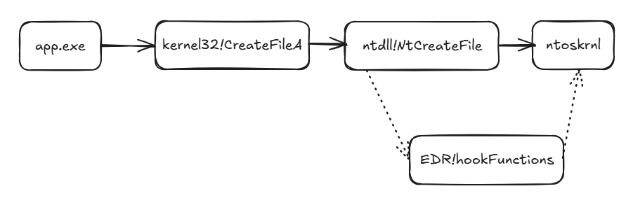

还有一些EDR也会在kernel32中的函数进行挂钩。通常EDR的hook方式是inline或者IAT的hook，但我所接触的大多数是inline hook，下面我们只讨论针对这种情况的。inline hook跳转到的地方就是EDR对进程中注入的DLL中。在早期的Windows中（Windows 8之前），EDR厂商用的是AppInit\_DLLs机制，可以让系统在加载user32.dll时，把指定的DLL一起加载到进程中。但Malware也经常用这个方法来进行持久化等。所以从Windows 8开始，如果开启了Secure Boot，这个功能就被禁止了。现在的主流注入DLL的方式是驱动+KAPC，驱动可以使用一种叫KAPC（Kernel Asynchronous Procedure Call，内核异步过程调用）的机制来往进程里“塞”代码。当EDR驱动程序获取到进程创建通知时，驱动会在目标进程的内存里分配空间，用来存放：

* 要运行的 APC 例程（执行 DLL 加载的代码）
* 要注入的 DLL 名称

驱动初始化一个新的APC对象，把这段例程和DLL路径复制进进程地址空间。然后修改线程的APC状态，设置标志位，让APC例程在合适时机运行，当目标进程恢复执行时，这个APC被调度执行，于是调用LoadLibrary加载DLL。

如下是SentinelOne这个EDR在ntdll中hook的函数列表的一部分截图。这些EDR可能会根据运行程序的不同，hook函数的列表也不尽相同。

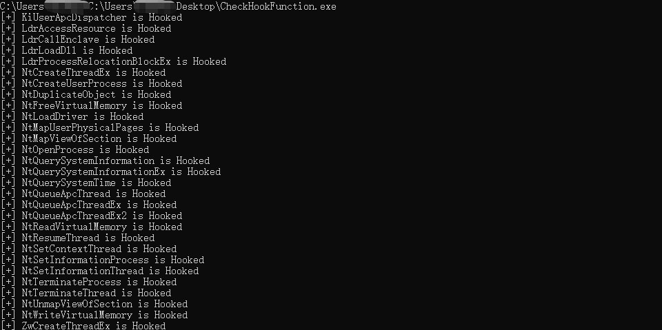

下面我会从两个角度，阻止和绕过EDR hook来进行介绍。

# 阻止EDR Hook

下面是两个阻止EDR hook的方法，其中第二个方法其实并没什么用，可以了解一下。

## blockdlls

Cobalt Strike 3.14添加了blockdlls功能，该命令可以使beacon的子进程禁止加载非微软签名的Dll。

所以这个功能可以阻止EDR向子进程注入DLL，这样就可以防护EDR hook一些api。在SentinelOne上，可以发现在进程中都会存在两个被注入的DLL。但其实后续调试发现这两个Dll是虚假的，真正的注入DLL起作用的是InProcessClient64.dll。

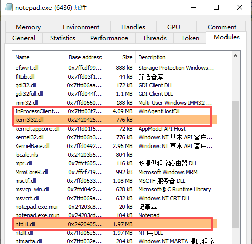

开启此功能，beacon生成子进程后，会看到子进程多了一个Signatures restricted (Microsoft only)。

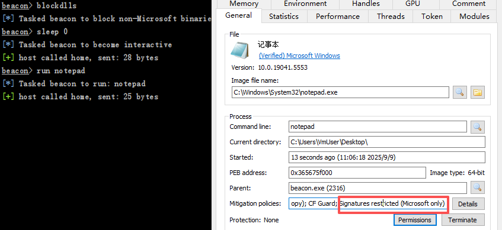

此时向子进程注入非微软签名的Dll是注入不了的，注入有微软签名的可以。

此[博客](https://blog.xpnsec.com/protecting-your-malware/)公布了实现同样功能的代码。代码通过STARTUPINFOEX结构体指定了要创建子进程的安全策略(开启PROCESS\_CREATION\_MITIGATION\_POLICY\_BLOCK\_NON\_MICROSOFT\_BINARIES\_ALWAYS\_ON)，这个安全策略起到了阻止加载非Microsoft签名Dll的作用。

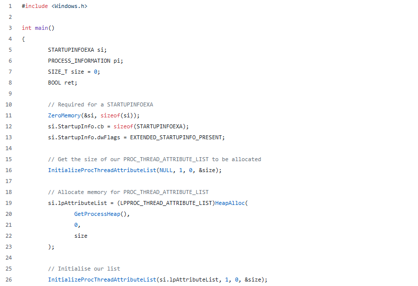

将此功能的代码放在SentinelOne的环境，beacon开启blockdlls，启动子进程cmd，可以发现这两个虚假DLL和真正起作用的DLL还是存在的。

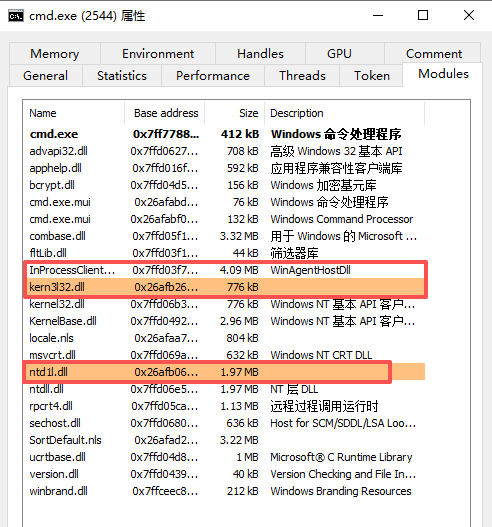

显然一些EDR拥有微软签名，其DLL还是可以注入到开启了blockdlls保护的进程中，这篇[推文](https://x.com/Sektor7Net/status/1187818929512730626)也说了，他发现Crowdstrike Falcon也不受blockdlls的影响。

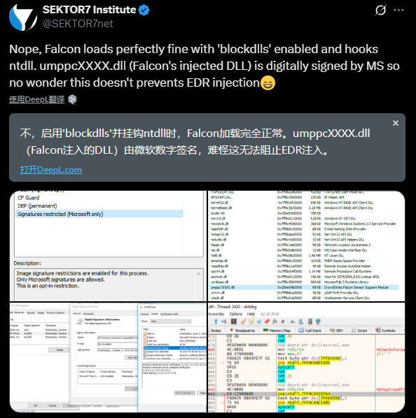

## ACG

另一种相关的技术ACG。ACG（Arbitrary Code Guard）是另一个缓解选项，是用于阻止代码分配和修改可执行内存页面。

即会强制执行：开启了ACG保护的进程，就不能再用 VirtualProtect、VirtualAlloc等来获得 PAGE\_EXECUTE\_READWRITE的内存。开启ACG，用到了SetProcessMitigationPolicy这一API。

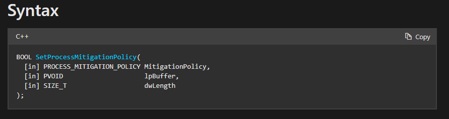

将第一个参数设置为ProcessDynamicCodePolicy。即可开启ACG。

当为未开启ACG时，可以使用VirtualAlloc分配RWX内存。使用此API开启ACG时，当VirtualAlloc分配RWX内存，VirtualProtect修改RWX内存，会发现无法分配和修改。

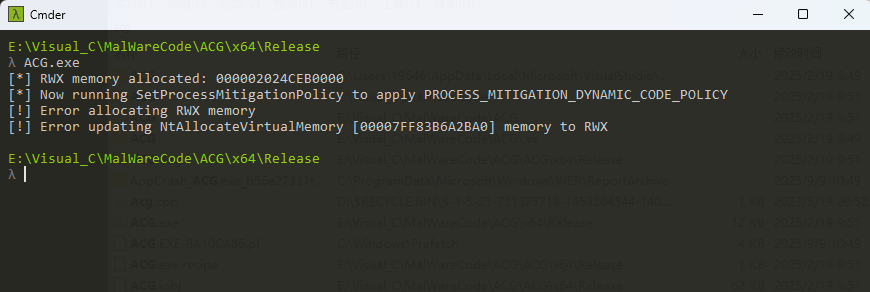

因为EDR hook的一些函数，内存页默认属性是RX，无法直接修改代码，这时EDR需要调用VirtualProtect或者更加底层的NTAPI，如果我开启ACG，这种操作就会被禁止。但现代EDR普遍会在进程刚启动的时候就已经完成了hook。EDR会通过内核回调PsSetCreateProcessNotifyRoutine发现进程创建时，就立马注入DLL，进行hook。后面开启ACG保护时，EDR已完成hook。

并且ACG还是无法阻止远程进程使用VirtualAllocEx和WriteProcessMemory等API向启用了ACG的进程中分配内存、写入和执行shellcode，类似于如下代码：

```
#include <iostream>
#include <Windows.h>

int main(int argc, char *argv[]) {
    unsigned char shellcode[] ="";

    HANDLE processHandle;
    HANDLE remoteThread;
    PVOID remoteBuffer;

    printf("Injecting to PID: %i
", atoi(argv[1]));

    // 打开开启ACG的进程获取到进程句柄
    processHandle = OpenProcess(PROCESS_ALL_ACCESS, FALSE, DWORD(atoi(argv[1])));

    // 在远程进程中开辟内存空间
    remoteBuffer = VirtualAllocEx(processHandle, NULL, sizeof shellcode, (MEM_RESERVE | MEM_COMMIT), PAGE_EXECUTE_READWRITE);

    // 写入shellcode
    WriteProcessMemory(processHandle, remoteBuffer, shellcode, sizeof shellcode, NULL);

    // 创建远程线程 
    remoteThread = CreateRemoteThread(processHandle, NULL, 0, (LPTHREAD_START_ROUTINE)remoteBuffer, NULL, 0, NULL);
    CloseHandle(processHandle);
}
```

# 绕过EDR Hook

## 读取干净的ntdll内容

这种方法思路就是读取ntdll数据覆盖就行了，下面介绍两种主要的方法。除此之外，还有很多的恶意软件技巧可以隐秘的读取ntdll数据：

<https://github.com/CymulateResearch/Blindside>

<https://github.com/SaadAhla/NTDLLReflection>

<https://www.optiv.com/insights/source-zero/blog/sacrificing-suspended-processes>

### 从磁盘读取干净的ntdll

重新从磁盘加载干净的ntdll，覆盖现有的ntdll的.text节区，代码如下。

```
#include <windows.h>
#include <Psapi.h>

int main() {
	LPCSTR lpNtllPath = "C:\Windows\System32\
tdll.dll";
	DWORD oldProtect;
	MODULEINFO mInfo = { 0 };

	HANDLE hProcess = GetCurrentProcess();
	HMODULE hNtdll = GetModuleHandleA("Ntdll");
	GetModuleInformation(hProcess, hNtdll, &mInfo, sizeof(mInfo));
	LPVOID lpNtdllBase = mInfo.lpBaseOfDll;

	HANDLE hNtdllFile = CreateFileA(lpNtllPath, GENERIC_READ, FILE_SHARE_READ, NULL, OPEN_EXISTING, FILE_ATTRIBUTE_NORMAL, NULL);
	HANDLE hNtdllFileMapping = CreateFileMapping(hNtdllFile, NULL, PAGE_READONLY | SEC_IMAGE, 0, 0, NULL);
	LPVOID lpReloadNtdllBase = MapViewOfFile(hNtdllFileMapping, FILE_MAP_READ, 0, 0, 0);

	PIMAGE_DOS_HEADER pNtdllDosHeader = (PIMAGE_DOS_HEADER)lpReloadNtdllBase;
	PIMAGE_NT_HEADERS pNtdllNtHeaders = (PIMAGE_NT_HEADERS)((BYTE*)pNtdllDosHeader + pNtdllDosHeader->e_lfanew);

	for (DWORD i = 0; i < pNtdllNtHeaders->FileHeader.NumberOfSections; i++) {
		PIMAGE_SECTION_HEADER pNtdllSectionHeader = (PIMAGE_SECTION_HEADER)((BYTE*)pNtdllNtHeaders + sizeof(IMAGE_NT_HEADERS) + (i * sizeof(IMAGE_SECTION_HEADER)));
		if (!strcmp((LPCSTR)pNtdllSectionHeader->Name, (LPCSTR)".text")) {
			VirtualProtect((LPVOID)((BYTE*)lpNtdllBase + pNtdllSectionHeader->VirtualAddress), pNtdllSectionHeader->Misc.VirtualSize, PAGE_EXECUTE_READWRITE, &oldProtect);
			memcpy((LPVOID)((BYTE*)lpNtdllBase + pNtdllSectionHeader->VirtualAddress), (LPVOID)((BYTE*)lpReloadNtdllBase + pNtdllSectionHeader->VirtualAddress), pNtdllSectionHeader->Misc.VirtualSize);
			VirtualProtect((LPVOID)((BYTE*)lpNtdllBase + pNtdllSectionHeader->VirtualAddress), pNtdllSectionHeader->Misc.VirtualSize, oldProtect, NULL);
		}
	}
	CloseHandle(hProcess);
	CloseHandle(hNtdllFile);
	CloseHandle(hNtdllFileMapping);
	FreeLibrary(hNtdll);
}
```

在完成替换后，可以看到本应该被hook的NtWriteVirtualMemory函数没有被hook。

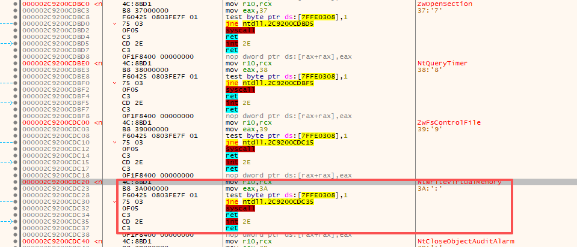

这种最直接的方法可以成功绕过，这个程序仅仅是绕过hook，没有恶意操作。但加入其它操作后，不确定会不会引发EDR的EPP启发式引擎的查杀。

### pipe方式读取ntdll数据

上面提到调用直接从磁盘读取，即调用CreateFile和ReadFile或者CreateFileMapping读取ntdll内容会引发EPP启发式引擎可疑。可以使用一种新的方法，通过管道的方式，避免使用前面的方法来读取ntdll。

第一个过程是通过管道获取到ntdll的大小，过程如下：

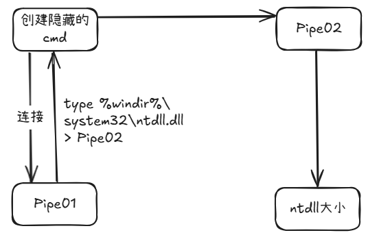

第二个过程是获取ntdll内容，过程如下：

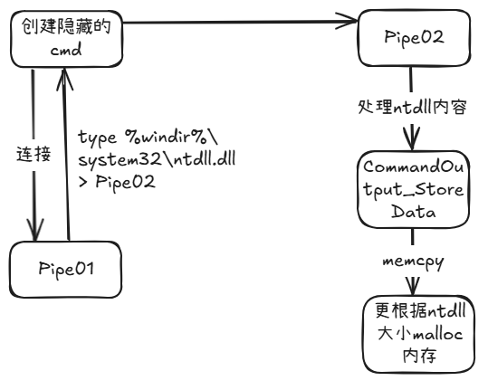

这样就获取到了ntdll的干净版本，且这里是调用一个可信进程cmd.exe去获取的ntdll内容，没有调用到前面提到到函数链过程，可能不会引发启发式的可疑。

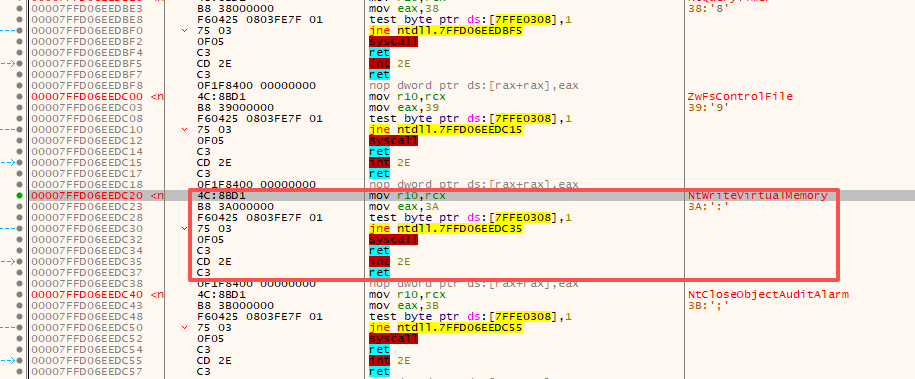

## Syscall

关于syscall，github上有非常多的项目，技巧也层出无穷。大致可以分为Direct Syscall和Indirect Syscall。二者区别就是前者是在用户程序中直接syscall了，后者是找到ntdll中的syscall，然后跳转执行，这里的syscall可以是本来NT函数的syscall，也可以是随机的在ntdll中的一个syscall。显然是Indirect Syscall更加符合正常的调用流程。

下面我将介绍一些常见的syscall项目以及其中的原理。还有一些经典的Syscall项目没有分析到，可以参考：

<https://github.com/mdsecactivebreach/ParallelSyscalls>

<https://github.com/trickster0/TartarusGate>

### Syswhispers

此项目一共三个版本，Syswhispers1使用时会要求给出Windows版本，要生成什么NT函数，具体如何使用参考Syswhispers1项目主页。

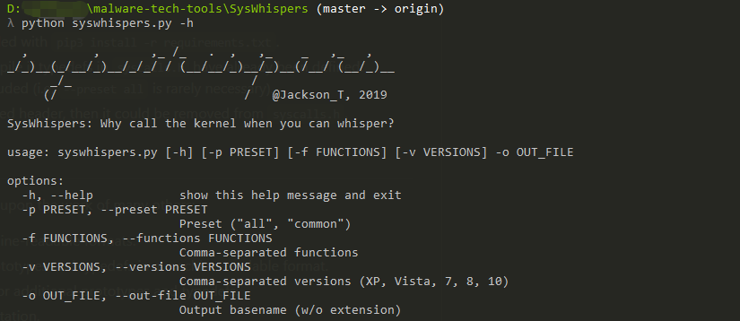

Syswhispers1中的SSN（系统调用号）是写死在项目data目录下的一个json文件中。

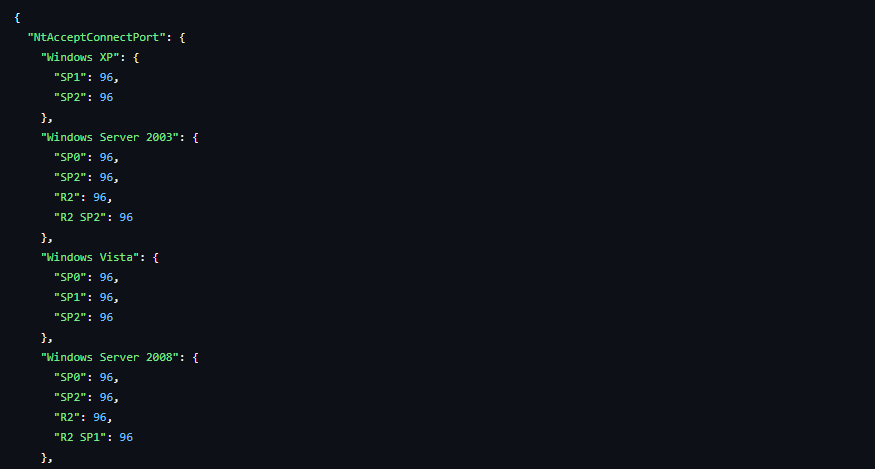

Syswhispers2对比Syswhispers1最大的改进是无需在知道Windows版本，不需要前面存放SSN的那个json文件，采用了按系统调用地址排序的方法获取SSN，即构造了一个syscall列表：SW2\_SyscallList.Entries。首先解析ntdll的导出表找到Zw\*开头的函数，计算Hash，保存函数地址，存入Syscall列表中。

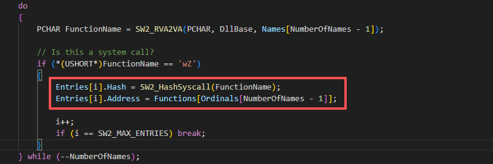

最后按地址排序（因为SSN对应的是函数在ntdll里的顺序）。这里的排序算法是冒泡排序。

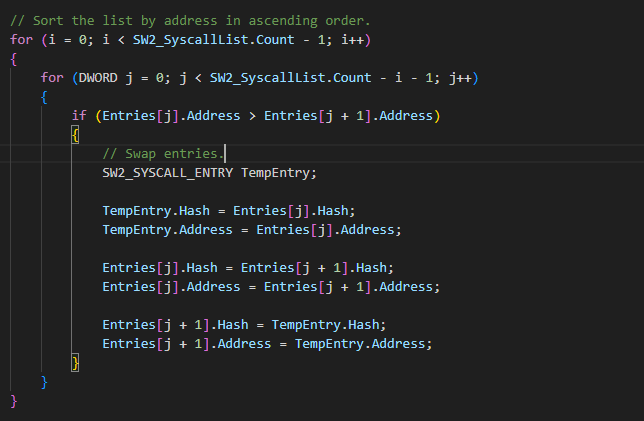

就可以根据构造好的syscall表比对Hash，获取syscall number了。

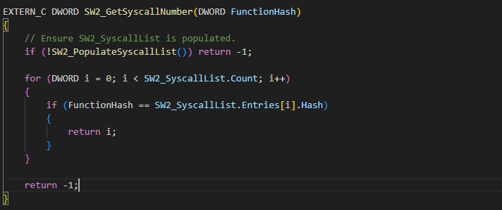

在asm文件，每个函数Hash都是算好的。

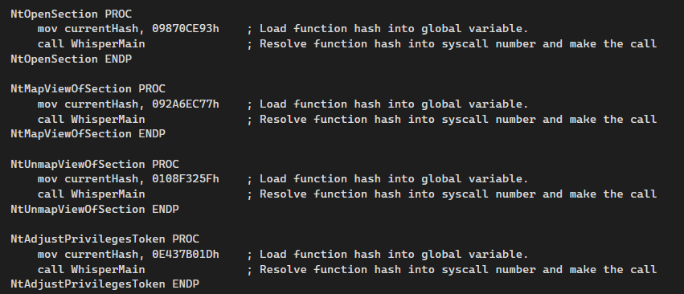

WhisperMain中，将所有的操作串联起来，从代码也可以看出来这里是Direct Syscall。获取syscall地址是通过SW2\_GetRandomSyscallAddress随机获取的。

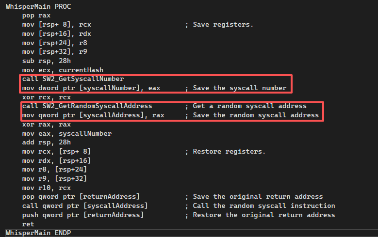

SysWhispers3应该是现在最流行的版本，Brute Ratel C4中的Bagder中的Indirect Syscalls功能也使用了此项目。

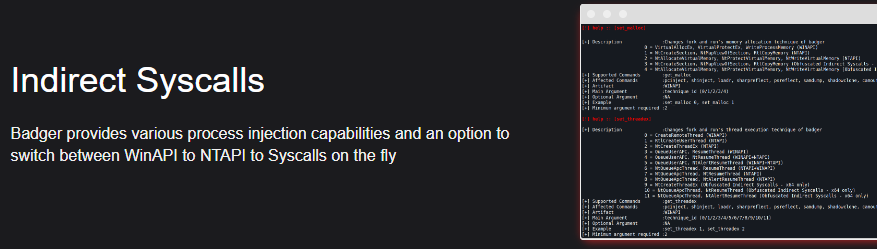

SysWhispers3相比SysWhispers2添加了SC\_ADddress函数，可以获取到每个NT函数的syscall地址，并添加到syscall列表。获取这个地址主要是SysWhispers3添加了Indirect Syscall的功能。

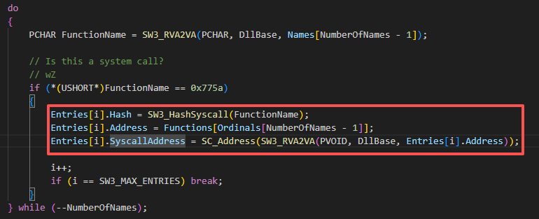

同时SysWhispers3相比于SysWhisper2多了syscall方法选项。最重要的就是添加了Indirect Syscall。

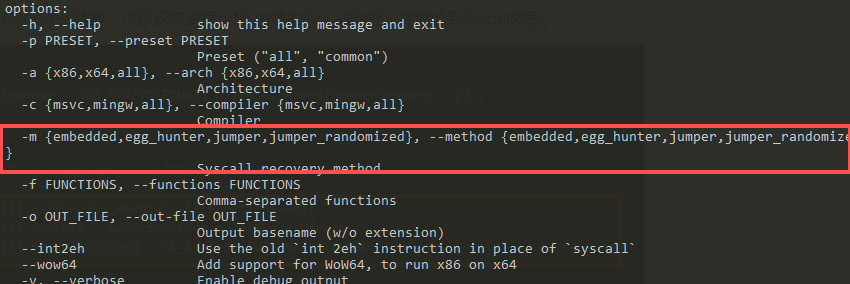

其中embedded就是指Direct Syscall。

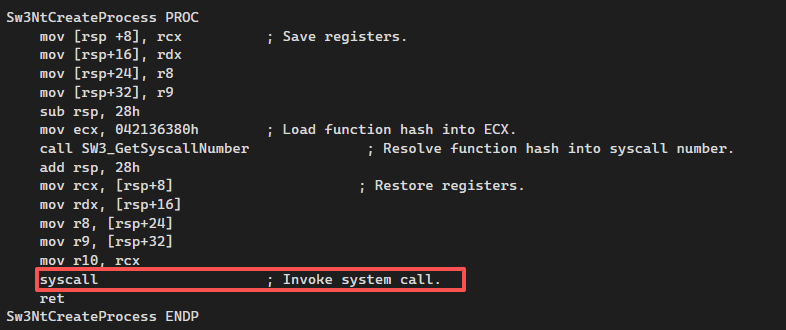

egg\_hunter将syscall替换成一些垃圾指令，需要使用时，在内存中找到这个垃圾指令，并替换回syscall。

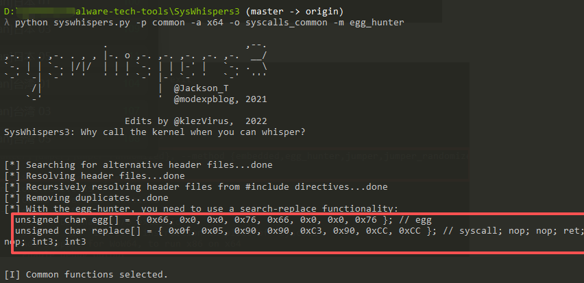

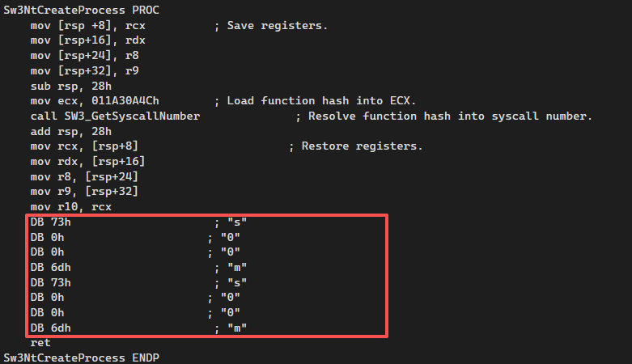

jumper指Indirect Syscall方法，前面添加到函数列表的syscall的地址就是在这里用到的。

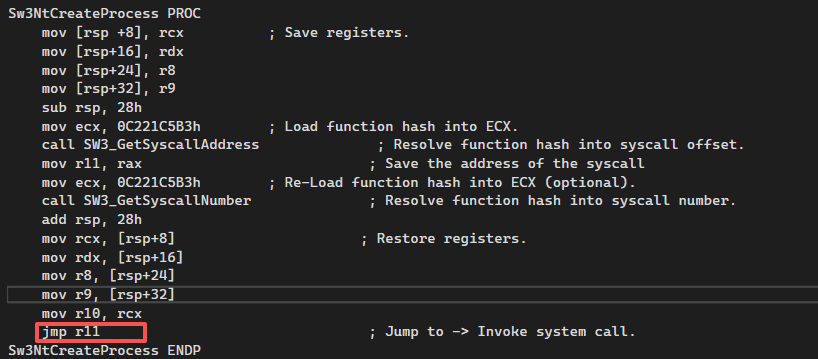

jumper\_randomized就是Indirect Syscall到一个随机的syscall地址。

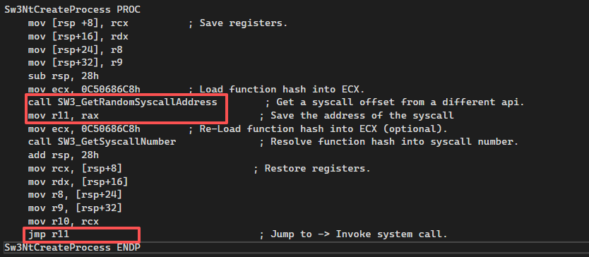

### Hell's Gate

Hell's Gate通过遍历ntdll导出表，使用djb2哈希算法，找到NT函数，然后匹配获取到SSN。

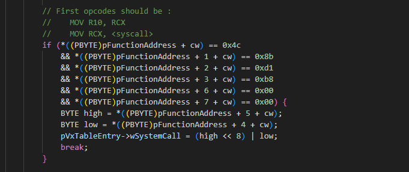

然后将获取到的syscall number赋值给wSystemCall全局变量，最后模拟NT函数的stub，Direct Syscall。

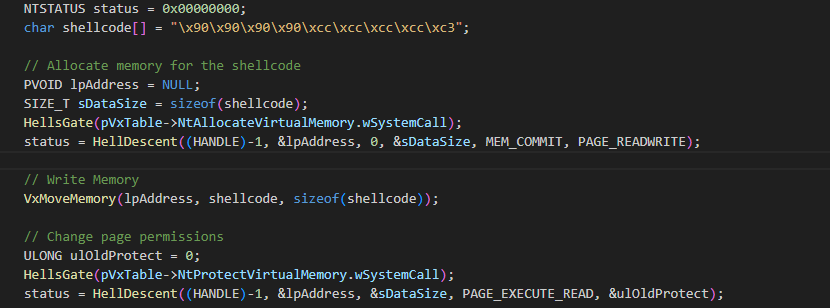

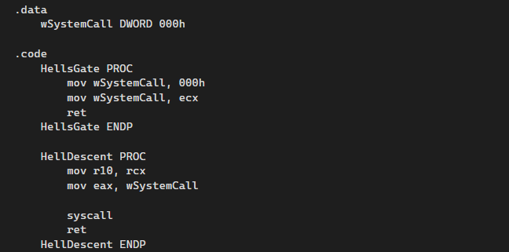

### Halo's Gate

Halo's Gate同样会遍历ntdll的导出表，然后获取需要使用到的NTAPI的地址和syscall number，这里没有通过Hash的方法获取了。在查找syscall number时，会判断是否被hook了，如果被inline hook的话，就往上/下偏移（0x20字节 = 一个syscall stub的大小）寻找没有被hook的NTAPI，找到后，记录它的 syscall number，再用偏移量推算目标 API 的 syscall number。这样能够成功的原因是EDR不可能hook全部的函数。

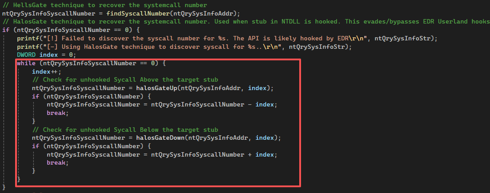

查找syscall number后，和Hell's Gate一样的方法，调用HellsGate和HellDescent进行Direct Syscall。

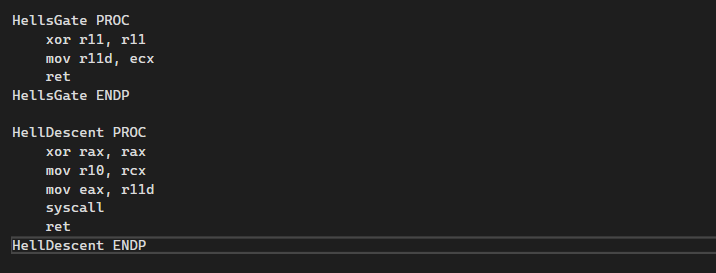

### HWSyscall

HWSyscall基于Halo’s Gate获取syscall number，但是在此基础上它还会在kernel23中找一个Gagdet，在跳到ntdll中进行Indirect Syscall，起到了一个堆栈欺骗的作用，堆栈就是下面这样的，更加符合逻辑。

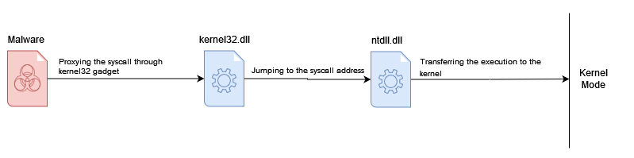

# 检测

读取ntdll数据这个行为EDR可能还是会获得一些遥测数据作为检测依据的，特别是还读取了ntdll.dll的数据。对于管道和cmd命令来获取ntdll数据这种方式，一些EDR例如CrowdStrike、MDE会获得Pipe Creation、Pipe Connection的遥测数据的。

Syscall的检测方式可以依据堆栈来检测，对于一个正常的程序，一般函数堆栈就是kernel32--> ntdll，但对于Direct Syscall直接就是syscall，进入内核了，不是通过ntdll进入的，EDR可以根据内核的返回是不是在ntdll中来判断是否进行Direct Syscall，对于Indirect Syscall虽然返回模板是ntdll，但ntdll的前一个模板不是kernel23，也是有问题的。调用堆栈对于Elastic EDR就是一个很重要的遥测来源，但是Elastic EDR并不会hook函数。

在syscall进入内核时，Windows会建立一个KTRAP\_FRAME的结构（存放寄存器、返回地址等用户态执行上下文）。EDR在内核就会从KTRAP\_FRAME结构解析RIP（用户态返回地址），用于判断这个地址属于哪个模块，用于检测Direct Syscall，Cortex XDR就是这样的检测方式。

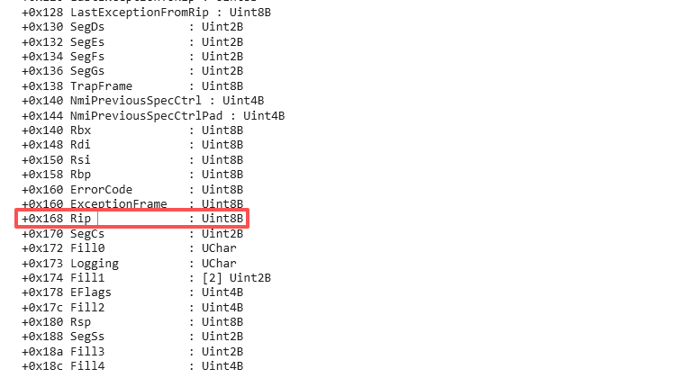

同时EtwTi提供了对syscall的事件追踪，可以在内核态记录syscall触发。

但是对于所有的Direct Syscall和Indirect Syscall都不能说是恶意的，对于一些游戏反作弊、安全产品等，这些技术都有可能被使用，实际情况还需要进一步分析判断。
