# CVE-2025-53547：Helm依赖更新代码注入漏洞分析及深度思考-先知社区

> **来源**: https://xz.aliyun.com/news/18811  
> **文章ID**: 18811

---

## 漏洞描述

**CVE-2025-53547** 是一个影响 Kubernetes 包管理工具 Helm 的高危代码注入漏洞。该漏洞在 Helm 3.18.4 之前的版本中存在。攻击者可以通过精心构造的 `Chart.yaml` 文件和符号链接的 `Chart.lock` 文件，在更新依赖时将恶意内容写入目标文件，从而导致本地代码执行。

## 漏洞修复

对比Helm官方仓库v3.18.3与v3.18.4在向Chart.lock文件写入内容之前先检查了一下文件的属性

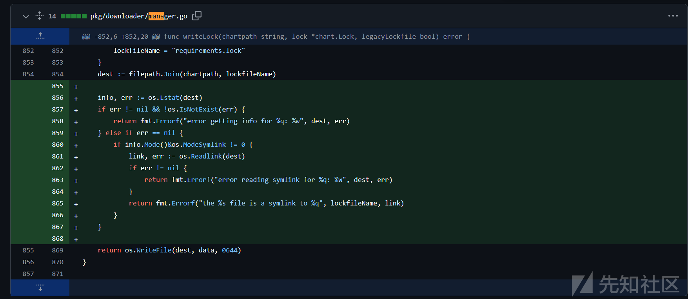

## 代码分析

根据代码改动可定位到漏洞点存在于`pkg/downloader/manager.go`文件的`writeLock`函数中

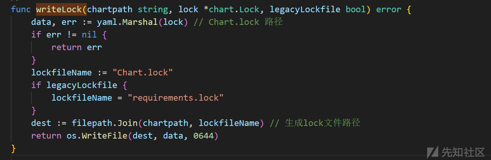

该函数中在当前目录下面生成`Chart.lock`文件然后将`data`内容写入进去。`data`即为lock锁的内容

在进行文件写入的时候并没有检查文件类型，如果`Chart.lock`文件是软链接，则会对连接到的文件进行数据写入

> 一个demo
>
> 这个demo 向本目录下的example.txt中写入数据
>
> 在运行代码的时候 先创建一个名为`example.txt`的软链接，再运行文件则会导致他想目标文件写入数据
>
> 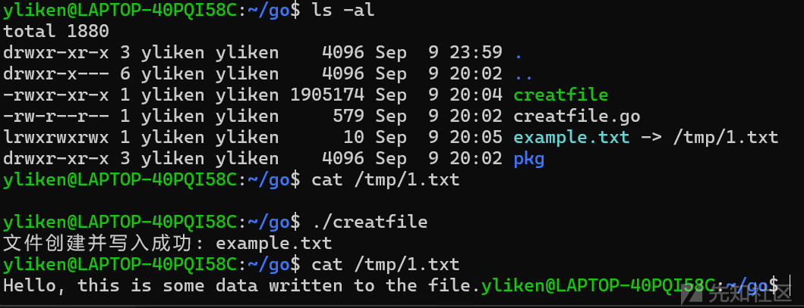

```
package main

import (
     "fmt"
     "os"
)

func main() {
     // 要创建的文件名
     filename := "example.txt"

     // 要写入的数据
     data := "Hello, this is some data written to the file."

     // 创建文件（如果文件已存在，会清空重写）
     file, err := os.Create(filename)
     if err != nil {
             fmt.Println("创建文件失败:", err)
             return
     }
     // 记得关闭文件
     defer file.Close()

     // 写入数据
     _, err = file.WriteString(data)
     if err != nil {
             fmt.Println("写入数据失败:", err)
             return
     }

     fmt.Println("文件创建并写入成功:", filename)
}
```

下一步寻找调用`writeLock`的函数

在整个项目中全局搜索仅找到一处地方调用了`writeLock`函数

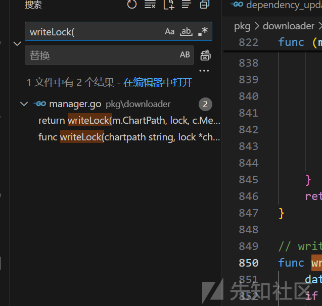

也就是`pkg/downloader/manager.go`文件中的`Update()`函数

相关代码

```
func (m *Manager) Update() error {
    c, err := m.loadChartDir()
    if err != nil {
        return err
    }
    // If no dependencies are found, we consider this a successful
    // completion.
    req := c.Metadata.Dependencies
    if req == nil {
        return nil
    }
    // Get the names of the repositories the dependencies need that Helm is
    // configured to know about.
    repoNames, err := m.resolveRepoNames(req)
    if err != nil {
        return err
    }
    // For the repositories Helm is not configured to know about, ensure Helm
    // has some information about them and, when possible, the index files
    // locally.
    // TODO(mattfarina): Repositories should be explicitly added by end users
    // rather than automatic. In Helm v4 require users to add repositories. They
    // should have to add them in order to make sure they are aware of the
    // repositories and opt-in to any locations, for security.
    repoNames, err = m.ensureMissingRepos(repoNames, req)
    if err != nil {
        return err
    }
    // For each of the repositories Helm is configured to know about, update
    // the index information locally.
    if !m.SkipUpdate {
        if err := m.UpdateRepositories(); err != nil {
            return err
        }
    }
    // Now we need to find out which version of a chart best satisfies the
    // dependencies in the Chart.yaml
    lock, err := m.resolve(req, repoNames)
    if err != nil {
        return err
    }
    // Now we need to fetch every package here into charts/
    if err := m.downloadAll(lock.Dependencies); err != nil {
        return err
    }
    // downloadAll might overwrite dependency version, recalculate lock digest
    newDigest, err := resolver.HashReq(req, lock.Dependencies)
    if err != nil {
        return err
    }
    lock.Digest = newDigest
    // If the lock file hasn't changed, don't write a new one.
    oldLock := c.Lock
    if oldLock != nil && oldLock.Digest == lock.Digest {
        return nil
    }
    // Finally, we need to write the lockfile.
    return writeLock(m.ChartPath, lock, c.Metadata.APIVersion == chart.APIVersionV1)
}
```

`Update()`调用`wirteLock`的时候传入了`m.ChartPath, lock`

`m.ChartPath`是我们执行helm命令时的路径信息

在源代码中加上一个输出函数

```
func (m *Manager) Print() {
        if m.Out == nil {
                m.Out = os.Stdout
        }

        fmt.Fprintf(m.Out, "Manager{
")
        fmt.Fprintf(m.Out, "  ChartPath: %s
", m.ChartPath)
        fmt.Fprintf(m.Out, "  Verify: %v
", m.Verify)
        fmt.Fprintf(m.Out, "  Debug: %v
", m.Debug)
        fmt.Fprintf(m.Out, "  Keyring: %s
", m.Keyring)
        fmt.Fprintf(m.Out, "  SkipUpdate: %v
", m.SkipUpdate)
        fmt.Fprintf(m.Out, "  RepositoryConfig: %s
", m.RepositoryConfig)
        fmt.Fprintf(m.Out, "  RepositoryCache: %s
", m.RepositoryCache)
        fmt.Fprintf(m.Out, "  Getters: %d provider(s)
", len(m.Getters))
        if m.RegistryClient != nil {
                fmt.Fprintf(m.Out, "  RegistryClient: %T
", m.RegistryClient)
        } else {
                fmt.Fprintf(m.Out, "  RegistryClient: <nil>
")
        }
        fmt.Fprintf(m.Out, "}
")
}
```

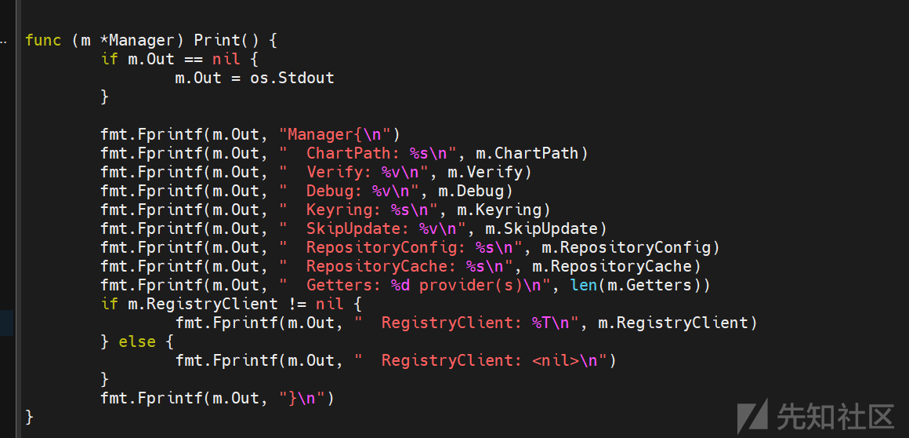

然后对其进行调用 来查看m的各属性信息

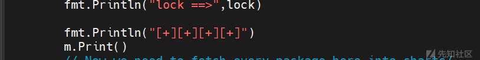

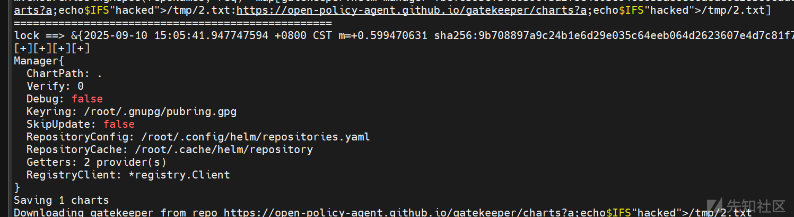

`m.ChartPat`即为当前目录

`lock`是由`m.resolve`处理之后返回的

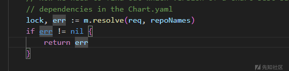

`resolve`函数中New了一个resolver对象 将`m.ChartPath, m.RepositoryCache, m.RegistryClient`三个属性赋给res，然后res调用Resolve

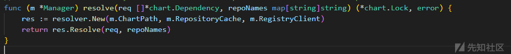

`Resolve`根据 Chart.yaml 里的依赖（reqs），逐一确认依赖能否满足 semver 版本约束，并填充 `locked`（最终写入 Chart.lock）

```
func (r *Resolver) Resolve(reqs []*chart.Dependency, repoNames map[string]string) (*chart.Lock, error) {

    // Now we clone the dependencies, locking as we go.
    locked := make([]*chart.Dependency, len(reqs))
    missing := []string{}
    for i, d := range reqs {
        constraint, err := semver.NewConstraint(d.Version)
        if err != nil {
            return nil, errors.Wrapf(err, "dependency %q has an invalid version/constraint format", d.Name)
        }

        if d.Repository == "" {
            // Local chart subfolder
            if _, err := GetLocalPath(filepath.Join("charts", d.Name), r.chartpath); err != nil {
                return nil, err
            }

            locked[i] = &chart.Dependency{
                Name:       d.Name,
                Repository: "",
                Version:    d.Version,
            }
            continue
        }
        if strings.HasPrefix(d.Repository, "file://") {
            chartpath, err := GetLocalPath(d.Repository, r.chartpath)
            if err != nil {
                return nil, err
            }

            ch, err := loader.LoadDir(chartpath)
            if err != nil {
                return nil, err
            }

            v, err := semver.NewVersion(ch.Metadata.Version)
            if err != nil {
                // Not a legit entry.
                continue
            }

            if !constraint.Check(v) {
                missing = append(missing, fmt.Sprintf("%q (repository %q, version %q)", d.Name, d.Repository, d.Version))
                continue
            }

            locked[i] = &chart.Dependency{
                Name:       d.Name,
                Repository: d.Repository,
                Version:    ch.Metadata.Version,
            }
            continue
        }

        repoName := repoNames[d.Name]
        // if the repository was not defined, but the dependency defines a repository url, bypass the cache
        if repoName == "" && d.Repository != "" {
            locked[i] = &chart.Dependency{
                Name:       d.Name,
                Repository: d.Repository,
                Version:    d.Version,
            }
            continue
        }

        var vs repo.ChartVersions
        var version string
        var ok bool
        found := true
        if !registry.IsOCI(d.Repository) {
            repoIndex, err := repo.LoadIndexFile(filepath.Join(r.cachepath, helmpath.CacheIndexFile(repoName)))
            if err != nil {
                return nil, errors.Wrapf(err, "no cached repository for %s found. (try 'helm repo update')", repoName)
            }

            vs, ok = repoIndex.Entries[d.Name]
            if !ok {
                return nil, errors.Errorf("%s chart not found in repo %s", d.Name, d.Repository)
            }
            found = false
        } else {
            version = d.Version

            // Check to see if an explicit version has been provided
            _, err := semver.NewVersion(version)

            // Use an explicit version, otherwise search for tags
            if err == nil {
                vs = []*repo.ChartVersion{{
                    Metadata: &chart.Metadata{
                        Version: version,
                    },
                }}

            } else {
                // Retrieve list of tags for repository
                ref := fmt.Sprintf("%s/%s", strings.TrimPrefix(d.Repository, fmt.Sprintf("%s://", registry.OCIScheme)), d.Name)
                tags, err := r.registryClient.Tags(ref)
                if err != nil {
                    return nil, errors.Wrapf(err, "could not retrieve list of tags for repository %s", d.Repository)
                }

                vs = make(repo.ChartVersions, len(tags))
                for ti, t := range tags {
                    // Mock chart version objects
                    version := &repo.ChartVersion{
                        Metadata: &chart.Metadata{
                            Version: t,
                        },
                    }
                    vs[ti] = version
                }
            }
        }

        locked[i] = &chart.Dependency{
            Name:       d.Name,
            Repository: d.Repository,
            Version:    version,
        }
        // The versions are already sorted and hence the first one to satisfy the constraint is used
        for _, ver := range vs {
            v, err := semver.NewVersion(ver.Version)
            // OCI does not need URLs
            if err != nil || (!registry.IsOCI(d.Repository) && len(ver.URLs) == 0) {
                // Not a legit entry.
                continue
            }
            if constraint.Check(v) {
                found = true
                locked[i].Version = v.Original()
                break
            }
        }

        if !found {
            missing = append(missing, fmt.Sprintf("%q (repository %q, version %q)", d.Name, d.Repository, d.Version))
        }
    }
    if len(missing) > 0 {
        return nil, errors.Errorf("can't get a valid version for %d subchart(s): %s. Make sure a matching chart version exists in the repo, or change the version constraint in Chart.yaml", len(missing), strings.Join(missing, ", "))
    }

    digest, err := HashReq(reqs, locked)
    if err != nil {
        return nil, err
    }

    return &chart.Lock{
        Generated:    time.Now(),
        Digest:       digest,
        Dependencies: locked,
    }, nil
}
```

在`pkg/chart/dependency.go`为Lock添加一个Print方法

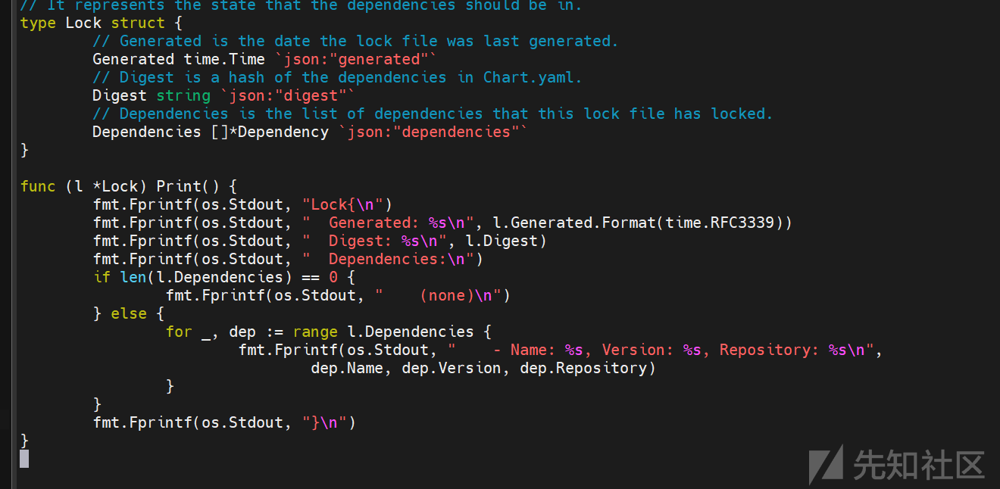

然后在`pkg/downloader/manager.go`调用Print

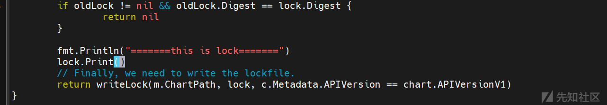

然后运行就可以看Lock内容

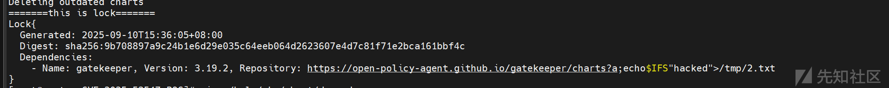

这个内容就是在Chart.lock中写入的内容

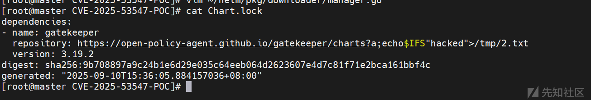

到这就是整个过程POC`https://github.com/DVKunion/CVE-2025-53547-POC`

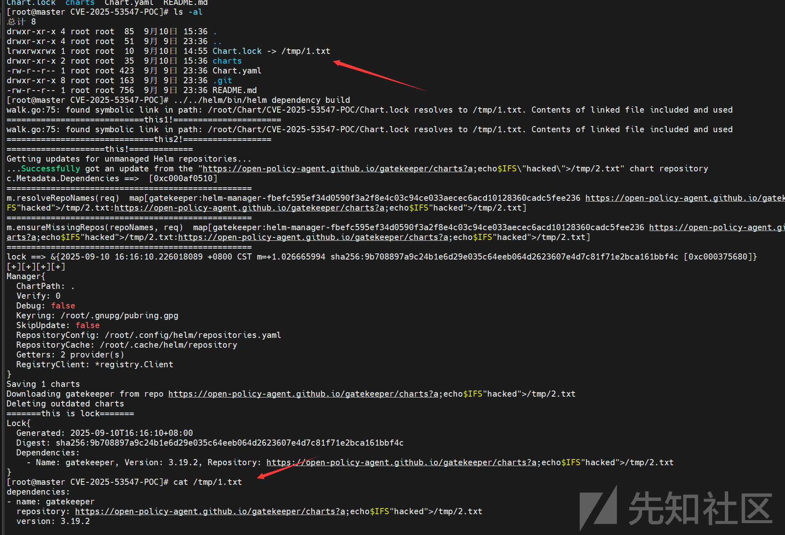

## 尝试的挫败

目前网上已存在的利用方式是试着将Chart.lock链接到`.bashrc`上。。。但是当你真的这种做的时候

你就会发现这样会报错然后崩溃

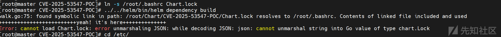

再回头看`Update`函数

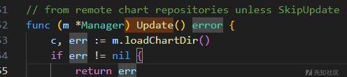

`Update`函数首先调用了`loadChartDir()`函数

`loadChartDir()`函数中又调用了`loader.LoadDir()`传入了`m.ChartPath`也就是`.`

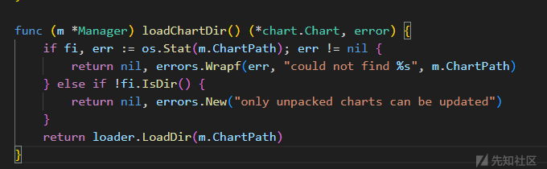

在`LoadDir()`函数中会读取目录中的文件，将文件名与文件内如保存到file列表中，然后调用`LoadFiles()`函数

```
func LoadDir(dir string) (*chart.Chart, error) {
    topdir, err := filepath.Abs(dir)
    if err != nil {
        return nil, err
    }

    // Just used for errors.
    c := &chart.Chart{}

    //加载不需要打包进Chart的文件
    rules := ignore.Empty()
    ifile := filepath.Join(topdir, ignore.HelmIgnore)
    if _, err := os.Stat(ifile); err == nil {
        r, err := ignore.ParseFile(ifile)
        if err != nil {
            return c, err
        }
        rules = r
    }
    rules.AddDefaults()

    files := []*BufferedFile{}
    topdir += string(filepath.Separator)

    walk := func(name string, fi os.FileInfo, err error) error {
        n := strings.TrimPrefix(name, topdir)
        if n == "" {
            // No need to process top level. Avoid bug with helmignore .* matching
            // empty names. See issue 1779.
            return nil
        }

        // Normalize to / since it will also work on Windows
        n = filepath.ToSlash(n)

        if err != nil {
            return err
        }
        if fi.IsDir() {
            // Directory-based ignore rules should involve skipping the entire
            // contents of that directory.
            if rules.Ignore(n, fi) {
                return filepath.SkipDir
            }
            return nil
        }

        // If a .helmignore file matches, skip this file.
        if rules.Ignore(n, fi) {
            return nil
        }

        // Irregular files include devices, sockets, and other uses of files that
        // are not regular files. In Go they have a file mode type bit set.
        // See https://golang.org/pkg/os/#FileMode for examples.
        if !fi.Mode().IsRegular() {
            return fmt.Errorf("cannot load irregular file %s as it has file mode type bits set", name)
        }

        if fi.Size() > MaxDecompressedFileSize {
            return fmt.Errorf("chart file %q is larger than the maximum file size %d", fi.Name(), MaxDecompressedFileSize)
        }

        data, err := os.ReadFile(name)
        if err != nil {
            return errors.Wrapf(err, "error reading %s", n)
        }

        data = bytes.TrimPrefix(data, utf8bom)
        //将文件数据与名称写入到file列表中
        files = append(files, &BufferedFile{Name: n, Data: data})
        return nil
    }
    if err = sympath.Walk(topdir, walk); err != nil {
        return c, err
    }

    return LoadFiles(files)
}
```

在`LoadFiles()`函数中如果存在`Chart.lock`文件则将会尝试对其进行yaml解析

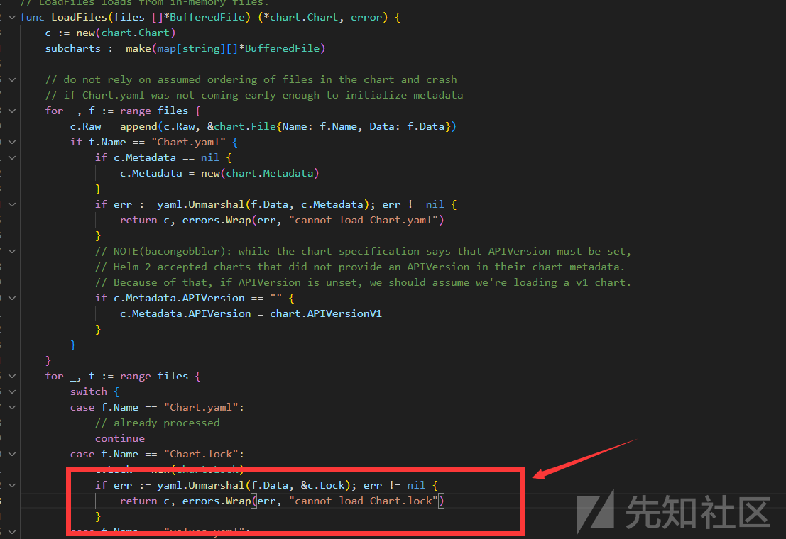

那么这样一来 则就会对Chart.lock的内容要求有限制。只允许他是`yaml`或者空文件

那么将其连接到`.bashrc`上面的计划也就泡汤，因为没有上面`.bashrc`文件回事yaml格式或者内容为空

### 条件放宽与潜在利用

既然目的是想让里面的命令被执行

那么除了`.bashrc`这一类文件还有一类文件即存放在`/ect/cron.*/`目录文件会被执行

但Chart.lock链接的文件又必须存在。没办法

如果这些目录下刚好有一个空文件

或许可以进行利用了。


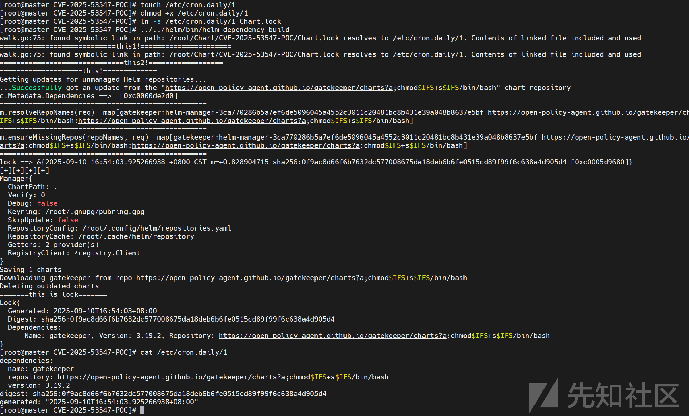

## 小插曲

网上大多标出的触发的方法是用`helm dependency update`命令触发的时候

但是我在复现的过程中发现`helm dependency build`也能触发

究其原因是如果有lock文件 Build会直接调用`Update`函数

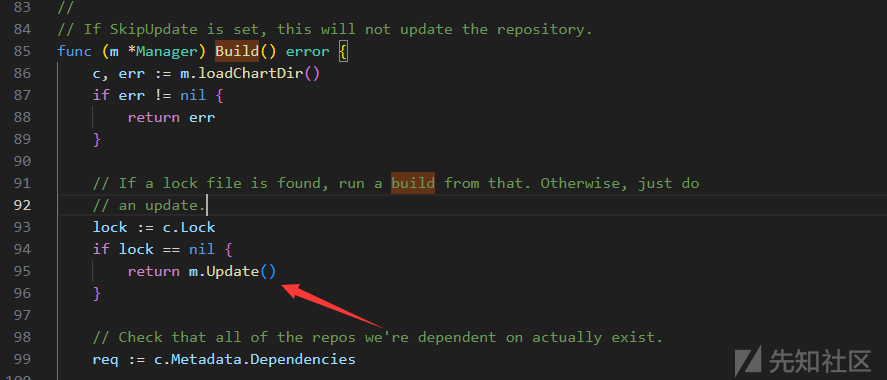

> 参考文献:
>
> 1. 【漏洞复现】CVE-2025-53547 helm恶意代码执行漏洞复现&分析 <https://mp.weixin.qq.com/s/oawEoi_SbYn46NuIht0BCg>
> 2. PoC: <https://github.com/DVKunion/CVE-2025-53547-POC/tree/main>
> 3. helm官方git更新: <https://github.com/helm/helm/compare/v3.18.3...v3.18.4>
