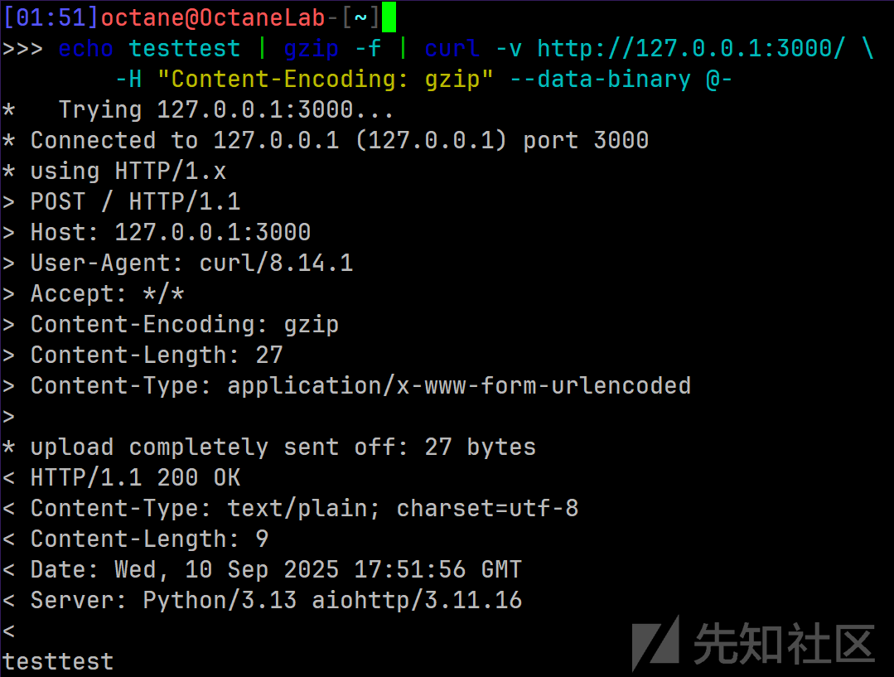
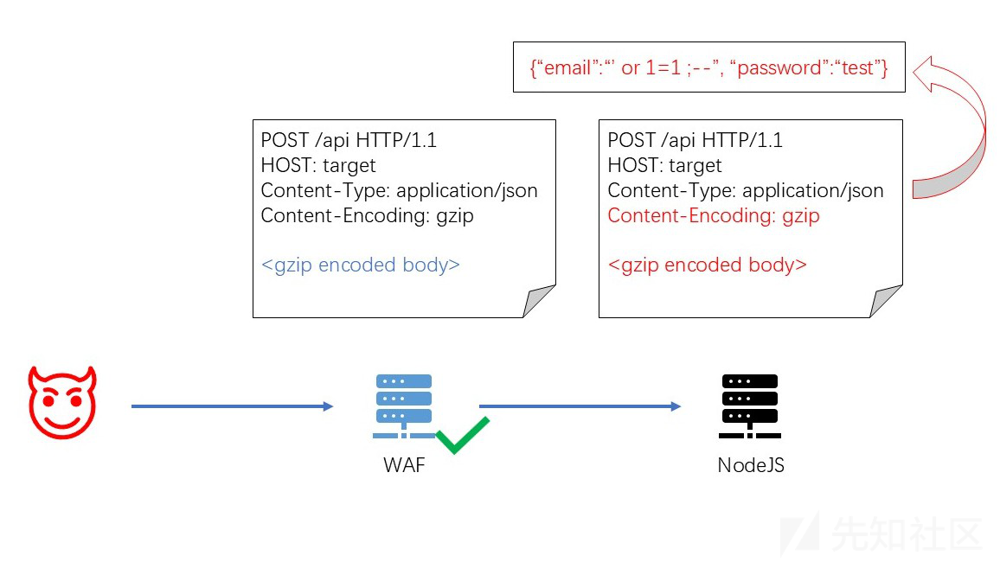
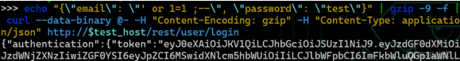

# Content-Encoding 协议层面 WAF 绕过思路-先知社区

> **来源**: https://xz.aliyun.com/news/18812  
> **文章ID**: 18812

---

WAF 与后端对 HTTP 协议层面的实现差异是 WAF 绕过的常用入手点。最近在学习一些编程语言和 web 框架的 HTTP 协议栈的实现，读 RFC 的时候突发奇想，发现了一个新的绕过思路。方法很简单，但可以绕过现在大部分主流 WAF。

## 发现

一般理解中，Content-Encoding 应当是HTTP服务端在响应中使用的 header。根据 [MDN 给出的示例](https://developer.mozilla.org/zh-CN/docs/Web/HTTP/Reference/Headers/Content-Encoding#%E7%A4%BA%E4%BE%8B)，客户端发送 Accept-Encoding，服务端根据该 header 决定一个双方都支持的编码(压缩)方式，对响应的 body 进行编码(压缩)，并在 Content-Encoding 中指示所使用的编码方式。

查 RFC 时发现一个比较意外的点: [RFC9110 Section 8.4](https://www.rfc-editor.org/rfc/rfc9110.html#name-content-encoding) 中只定义了 Content-Encoding 表示消息 body 的编码方式，并没有规定只能在响应中使用。并且还提到了服务器对于自己不支持的 Content-Encoding 应该返回 415 Unsupported Media Type 。也就是说，一般认为在响应中使用的 Content-Encoding，依照 RFC 标准在请求中也可以应用。

然而，现实应用中基本没有 HTTP 客户端支持发送这种经过压缩的请求，是一个几乎没有实际用途的特性。但想到有一些 HTTP 协议栈同时包含客户端和服务端功能的实现(如 aiohttp)，其对于请求和响应的处理共享同一个 http parser 的实现，共用了很多处理逻辑。如 aiohttp 对请求和响应的 body 的解码使用的都是相同的 [HttpPayloadParser](https://github.com/aio-libs/aiohttp/blob/16f565aff665264875849add3bf16ae6720d1617/aiohttp/http_parser.py#L755)，实现的处理逻辑包括 Content-Encoding 和 Transfer-Encoding (chunked) 等等。这样的设计应该会导致本来应当在解析响应时应用的 Content-Encoding 处理逻辑，在对请求的解析中也支持。实际调试一下:

```
from aiohttp import web

async def echo(request: web.Request) -> web.Response:
    data = await request.text()
    return web.Response(text=data)

app = web.Application()
app.router.add_post('/', echo)

web.run_app(app, port=8080)
```

```
echo testtest | gzip -f | curl -v http://127.0.0.1:8080/ \
-H "Content-Encoding: gzip" --data-binary @-
```



成功地把解压后的原始内容 echo 回来了。

当然并不是所有服务端实现了这个特性。但基本所有的HTTP服务端的library都没有明确提到自己是否实现了这一点。通过读源码和实际测试验证了其他很多服务端 HTTP 协议栈，目前发现的实际满足这个特性的有:

* NodeJS ，如 express, koa 等。支持deflate/gzip/brotli
* aiohttp (python)。支持deflate/gzip/brotli/zstd
* apache httpd + mod\_deflate (需要手动设置 InputFilter，不太容易满足条件)。支持deflate/gzip
* Warp (rust) (也是作为 filter 组件，需要服务端编程时手动启用，同样不容易满足利用条件)。支持deflate/gzip/brotli

aiohttp 作为客户端写爬虫用得比较多，作为服务端的应用比较少见。但nodejs使用的则非常广泛了。

## 利用思路

接下来自然会想到利用这个特性绕 WAF。改改 payload 和 url ，用某知名 WAF 的在线 demo 测试一下，带有恶意内容的body的请求被顺利放行。之后的测试也说明了，绝大部分 WAF 没能考虑到这一点。

因此，只要后端的服务使用了以上服务器或 web 框架(其中 nodejs 最常见)，就可以应用这个协议差异，构造一个使用 deflate/gzip/brotli/zstd 压缩后的请求 body ，使 WAF 无法解析，但后端服务器可以解析，从而完全绕过 WAF 对请求 body 的检查:



## PoC

加上Content-Type就可以让实际的后端正确解析body了:

```
echo $payload | gzip -f | curl -v http://example.com/api/v0/example \
-H "Content-Type: application/json" -H "Content-Encoding: gzip" --data-binary @-
```

当然也有 brotli 的 variant。一些 WAF 会自动把 gzip 编码的内容当作混淆内容自动解码并检查。但brotli比gzip更不常见，更不容易被解码，同时在服务端的支持也很广泛，只要不是上古版本的nodejs都默认支持:

```
echo $payload | brotli -9 -f | curl -v http://example.com/api/v0/example \
-H "Content-Type: application/json" -H "Content-Encoding: br" --data-binary @-
```

*首先*`apt install brotli`

但需要注意的是，brotli 对比较短的内容编码时会直接保留明文，反而会被 WAF 检测到，payload 长一些才能完全混淆。

zstd也是RFC中定义的Content-Encoding支持的编码方式之一，但没有广泛支持，应用范围比较小。

## 测试

对一些 self-hosted 和云服务商的 WAF 进行了实际的测试。将基于 NodeJS 的 JuiceShop 靶场分别部署到WAF后，全都使用默认规则的最高等级。并使用以上的绕过手段攻击 JuiceShop 的 `/rest/user/login` 接口的SQL漏洞。



大部分 WAF 都可以绕过，成功率11/15，几乎通杀所有的闭源 WAF。还有几个云 WAF 只经过初步测试，请求看起来是能放行的，但没办法实际部署看到通过 WAF 的请求还是不是原样，不算在其中。

也就是说，实战中要是发现 WAF 保护的后端是基于 nodejs 的，都可以用这种方法试一下，说不定会有惊喜。

成功防御的 WAF 的分析:

* BunkerWeb, ModSecurity, Coraza: 这几个开源 WAF 默认使用的规则是 OWASP CRS。看来只有 CRS 规则集考虑到了这个问题，把自己不能检查的 Content-Encoding 列在了请求的 restricted headers 中: <https://github.com/coreruleset/coreruleset/blob/21ab3ea58ad0f5a453764d72d2bd2c4eb307468d/rules/REQUEST-901-INITIALIZATION.conf#L240>

BunkerWeb 对此有详细的注释说明: <https://github.com/bunkerity/bunkerweb/blob/89c78cb8c28cd83845b6fac4bc2e02ec7db4b869/src/common/core/modsecurity/files/crs-setup-v3.conf#L465>

```
# Forbidden request headers.
# Header names should be lowercase, enclosed by /slashes/ as delimiters.
# Default: /accept-charset/ /content-encoding/ /proxy/ /lock-token/ /content-range/ /if/

# Note: Content-Encoding is used to list any encodings that have been applied to the
# original payload. It is only used for compression, which isn't supported by CRS by
# default since it blocks newlines and null bytes inside the request body. Most
# compression algorithms require at least null bytes per RFC. Blocking it shouldn't
# break anything and increases security since ModSecurity is incapable of properly
# scanning compressed request bodies.
```

但其他的 WAF 实现，尤其是国内的和闭源的，几乎都没有参考 OWASP CRS 的规则，也没有读过 RFC，都能够利用。

* Microsoft Azure WAF: 默认规则也是基于 CRS 的。有趣的是其他几个云 WAF 也宣称自己的默认规则是基于 CRS 的，但并没有防御成功。

## 更多思路？

从 Content-Encoding 联想到的当然是 Transfer-Encoding。Transfer-Encoding 没有被 CRS 禁止，并且在 RFC 中也规定了可以有多个编码方式(<https://www.rfc-editor.org/rfc/rfc9112#section-6.1-5> )，也是一种在实际应用中比较少见的特性。然而，看了一些HTTP协议栈的实现，基本都只支持 chunked，没有办法像 Content-Encoding 那样利用。

其他的一些 WAF 和后端服务器间的 RFC GAP 也可以尝试挖掘一下。各种 HTTP 实现都是以 RFC 为规范的，但编程语言的特性和生态多种多样，实际实现出来肯定会有差异。找到一些像这样的写 WAF 的人不会想到的边缘 case，会发现一些效果意外地不错的 WAF 绕过方式。
